# Design Instagram: Photo Sharing at Scale

Instagram crossed [3 billion monthly active users in September 2025](https://www.cnbc.com/2025/09/24/instagram-now-has-3-billion-monthly-active-users.html), serving photo and short-video traffic at a scale where every architectural choice — fan-out shape, image variant count, TTL on ephemeral media, ranking model topology — is dictated by power-law follower distributions, mobile network constraints, and ML inference budgets measured in milliseconds. This design walks through the image upload pipeline, the hybrid fan-out that bounds write amplification, the Stories TTL architecture, the MQTT-based real-time messaging path, and the multi-stage Explore recommender, citing the Instagram and Meta engineering posts that document each subsystem.

> [!NOTE]
> Meta [stopped disclosing per-app daily active user (DAU) numbers in April 2024](https://www.cnbc.com/2025/09/24/instagram-now-has-3-billion-monthly-active-users.html), so any DAU figure in this article is an industry estimate, not an official metric. Treat the order-of-magnitude as load-shaping context, not a published number.


## Abstract

Instagram's architecture is structured around three load-shaping problems that any photo-sharing platform faces once it crosses a few hundred million users:

1. **Write amplification vs. read latency.** A post from a celebrity with tens of millions of followers would, under naive write-time fan-out, force tens of millions of timeline cache updates. A hybrid fan-out — push for "normal" accounts, pull-merge for high-fan-out accounts — bounds the per-post write cost while keeping cached reads in the low-millisecond range.
2. **Ephemeral vs. persistent content.** Stories (24-hour TTL) and feed posts (permanent) have different read patterns and different lifetime budgets. Stories ride aggressive client prefetch and TTL-synced caching; posts ride tiered object storage with CDN caching.
3. **Cold start vs. engagement optimization.** New sessions need value immediately; returning sessions need personalization. Meta's [Instagram Explore recommender](https://engineering.fb.com/2023/08/09/ml-applications/scaling-instagram-explore-recommendations-system/) uses Two Towers retrieval to narrow billions of candidates to thousands, then a multi-task neural ranker to produce the final ordering, and now spans [over 1,000 production ML models](https://engineering.fb.com/2025/05/21/production-engineering/journey-to-1000-models-scaling-instagrams-recommendation-system/).

Core mechanisms covered below:

- **Hybrid fan-out** — push to follower timeline caches for the long tail of accounts; pull-merge for high-fan-out accounts at read time.
- **Multi-resolution image pipeline** — variants generated for the [320–1080 px supported width range](https://help.instagram.com/1631821640426723/), with filtering offloaded to GPU on-device.
- **Stories architecture** — 24-hour TTL with aggressive prefetch targeting sub-200 ms perceived load.
- **Feed ranking** — multi-task neural networks fine-tuned continually on engagement events.
- **MQTT for real-time** — [pioneered for Facebook Messenger in 2011](https://engineering.fb.com/2011/08/12/android/building-facebook-messenger/) and now powers Instagram DMs, notifications, and presence over a [2-byte minimum-overhead binary protocol](https://docs.oasis-open.org/mqtt/mqtt/v5.0/mqtt-v5.0.pdf).

## Requirements

### Functional Requirements

| Requirement          | Priority     | Notes                                                  |
| -------------------- | ------------ | ------------------------------------------------------ |
| Photo/video upload   | Core         | Multiple resolutions, filters, up to 10 items per post |
| Feed (home timeline) | Core         | Ranked, personalized, infinite scroll                  |
| Stories              | Core         | 24-hour ephemeral, ring UI, reply capability           |
| Follow/unfollow      | Core         | Social graph management                                |
| Likes and comments   | Core         | Real-time counts, threaded comments                    |
| Direct messages      | Core         | Real-time chat, media sharing                          |
| Explore page         | Core         | Content discovery, personalized recommendations        |
| Search               | Core         | Users, hashtags, locations                             |
| Notifications        | Core         | Likes, comments, follows, DM alerts                    |
| Reels                | Extended     | Short-form video (separate video pipeline)             |
| Shopping             | Out of scope | E-commerce integration                                 |
| Ads                  | Out of scope | Separate ad-tech stack                                 |

### Non-Functional Requirements

| Requirement           | Target                    | Rationale                                  |
| --------------------- | ------------------------- | ------------------------------------------ |
| Upload availability   | 99.9%                     | Brief maintenance acceptable               |
| Feed availability     | 99.99%                    | Core engagement driver                     |
| Feed load latency     | p99 < 500ms               | User experience threshold                  |
| Stories load latency  | p99 < 200ms               | Tap-and-swipe UX requires instant response |
| Image processing time | < 10s                     | User waits for upload confirmation         |
| DM delivery latency   | p99 < 500ms               | Real-time conversation expectation         |
| Notification delivery | < 2s                      | Engagement driver                          |
| Feed freshness        | < 30s for non-celebrities | Balance freshness vs. ranking quality      |

### Scale Estimation

These numbers blend Meta's published headline figures (MAU, ML model count) with order-of-magnitude estimates that are common in system-design write-ups but **not** officially disclosed (DAU, uploads/day, average image size). Treat them as load-shaping context for capacity decisions, not as a published specification.

```text title="Instagram-scale capacity model (2025 baseline)"
Monthly active users:   3,000M  (Meta, Sept 2025 announcement)
Daily active users:     ~500M   (industry estimate; Meta no longer discloses)
Photos uploaded daily:  ~100M   (estimate; older "95M+" figures from circa 2018)

Upload traffic (estimate)
  100M uploads/day        ≈ 1,150 uploads/second average
  Peak (3x)               ≈ 3,500 uploads/second
  Avg compressed payload  ≈ 2 MB per image
  Daily ingestion         ≈ 200 TB/day at the wire

Per-image storage (estimate)
  Original                  2 MB
  Resolution variants       4 widths (1080 / 640 / 320 / 150 px)
  Aspect variants           ×2 (square + original aspect)
  Total variants            ≈ 8 derived files
  Total stored per image    ≈ 5 MB across variants
  Daily storage growth      ≈ 500 TB/day

Feed reads (estimate)
  500M DAU × 20 sessions    ≈ 10B feed reads/day
  Average rate              ≈ 115K reads/second
  Peak                      ≈ 350K+ reads/second

Social graph (estimate)
  Average followers/user    ~150 (skewed by power law)
  Accounts with > 1M followers ~50,000
  Graph edges               ~10^11
```

**CDN efficiency.** Photo and video traffic follows a strong power-law: a small fraction of media accounts for most reads. Assuming a 95% edge cache hit rate (which is what an Instagram-shape CDN should be tuned for), the origin only sees the cold tail:

```text title="origin load with a 95% CDN hit rate"
Reads to origin    ≈ 5% × 350K rps peak ≈ 17K rps
Hot content        served almost entirely from CDN edge
Cold tail          dominates origin egress and storage I/O
```

## Design Paths

### Path A: Push-First Fan-out

**Best when:**

- Smaller scale (<100M users)
- Read latency is critical
- Most users have similar follower counts (no extreme outliers)

**Architecture:**

On post creation, push the post ID to every follower's timeline cache. Reads are O(1) cache lookups.

**Trade-offs:**

- ✅ Extremely fast reads (pre-computed timelines)
- ✅ Simple read path (single cache lookup)
- ❌ Massive write amplification for popular accounts
- ❌ Wasted writes for inactive followers
- ❌ Storage explosion (N copies per post where N = followers)

**Real-world example:** Early Twitter (~2010–2012) is the canonical illustration of push-only running into a celebrity wall: a single high-fan-out tweet had to be written into millions of follower timelines, which is why Twitter moved to a hybrid model later in that period.

### Path B: Pull-Only Fan-out

**Best when:**

- Read latency tolerance is higher
- Storage cost is primary concern
- Feed freshness can be slightly stale

**Architecture:**

On feed request, query the social graph for followed users, fetch their recent posts, merge and rank.

**Trade-offs:**

- ✅ No write amplification
- ✅ Minimal storage (posts stored once)
- ✅ Always fresh (computed at read time)
- ❌ High read latency (multiple DB queries)
- ❌ Expensive computation per request
- ❌ Difficult to rank effectively (limited time for ML)

**Real-world example:** Early News Feed implementations on social platforms (pre-2010) used pull-only computation and abandoned it as following counts grew, since per-request graph traversal blew the read latency budget.

### Path C: Hybrid Fan-out (Instagram Model)

**Best when:**

- Massive scale with power-law follower distribution
- Sub-second read latency required
- High-fan-out accounts exist (>1M followers)

**Architecture:**

- **Long-tail accounts (low follower count, commonly modeled at < 5–10K followers in public write-ups)**: push the new post id into each follower's timeline cache on write.
- **High-fan-out accounts (above the threshold)**: keep posts in a per-author store and merge them in at read time.
- **Inactive followers**: skip fan-out for them and compute on demand if they return.

> [!NOTE]
> Instagram and Twitter both use hybrid fan-out, but neither has officially published its production threshold. The 5–10K follower band shows up consistently in [community write-ups of the architecture](https://www.abstractalgorithms.dev/write-time-vs-read-time-fan-out) and is best treated as a tunable knob, not a magic number. The right threshold for any platform is the point where the marginal cost of a fan-out write exceeds the marginal cost of a read-time merge.

**Trade-offs:**

- ✅ Bounded write amplification (capped at the threshold)
- ✅ Fast reads for most users (cache hit + small merge)
- ✅ Handles celebrity scale without storage explosion
- ❌ Two code paths to maintain
- ❌ Merge logic adds complexity
- ❌ Posts from above-threshold accounts pay a small read-time merge cost

### Path Comparison

| Factor              | Push-First   | Pull-Only            | Hybrid                                              |
| ------------------- | ------------ | -------------------- | --------------------------------------------------- |
| Read latency        | O(1)         | O(following × posts) | O(1) + O(celebrities)                               |
| Write amplification | O(followers) | O(1)                 | O(min(followers, threshold))                        |
| Storage per post    | O(followers) | O(1)                 | O(min(followers, threshold))                        |
| Code complexity     | Low          | Low                  | Medium                                              |
| Freshness           | Immediate    | Immediate            | Immediate (regular), slight delay (celebrity merge) |
| Best scale          | <100M users  | <10M users           | Billions                                            |

### This Article's Focus

The rest of this article assumes **Path C (Hybrid Fan-out)** as the production design, because:

1. At Instagram's scale (3B MAU as of [Sept 2025](https://www.cnbc.com/2025/09/24/instagram-now-has-3-billion-monthly-active-users.html)) the per-post write cost has to be bounded.
2. The top of the follower distribution (Cristiano Ronaldo's account is in the 650M-follower range) makes pure push impractical — a single post would dominate the cluster's write capacity.
3. The hybrid model is the design Instagram and Twitter both publicly describe, even if exact thresholds are not.

## High-Level Design

### Component Overview

: API Gateway routes uploads and posts; image processor and fan-out workers populate timeline caches and CDN.")

: feed, search, explore, DM, and notification services backed by ranking, caches, and MQTT push.")

### Service Responsibilities

| Service              | Responsibility                          | Data Store        | Key Operations                      |
| -------------------- | --------------------------------------- | ----------------- | ----------------------------------- |
| Upload Service       | Media ingestion, validation, processing | S3, PostgreSQL    | Resize, filter, generate variants   |
| Post Service         | Post CRUD, metadata management          | PostgreSQL        | Create, update, delete, soft-delete |
| Feed Service         | Timeline generation, ranking            | Redis, PostgreSQL | Fan-out, merge, rank                |
| Stories Service      | Ephemeral content management            | Redis (TTL), S3   | Create, expire, ring ordering       |
| Social Service       | Follow graph management                 | Cassandra         | Follow, unfollow, follower lists    |
| Search Service       | User/hashtag/location search            | Elasticsearch     | Index, query, autocomplete          |
| Explore Service      | Content discovery, recommendations      | ML platform       | Candidate retrieval, ranking        |
| DM Service           | Real-time messaging                     | Cassandra, Redis  | Send, receive, sync                 |
| Notification Service | Push and in-app notifications           | PostgreSQL, Redis | Queue, dedupe, deliver              |

## Image Upload Service

### Upload Flow

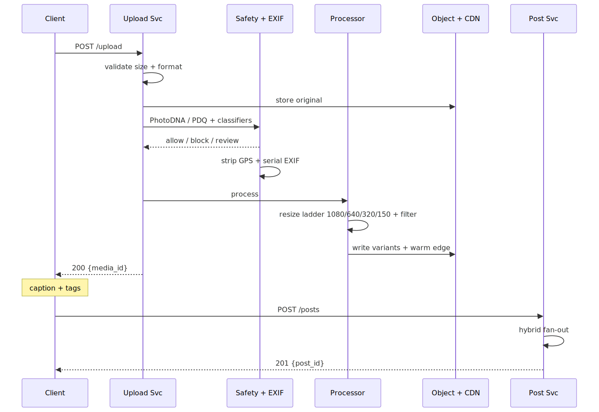
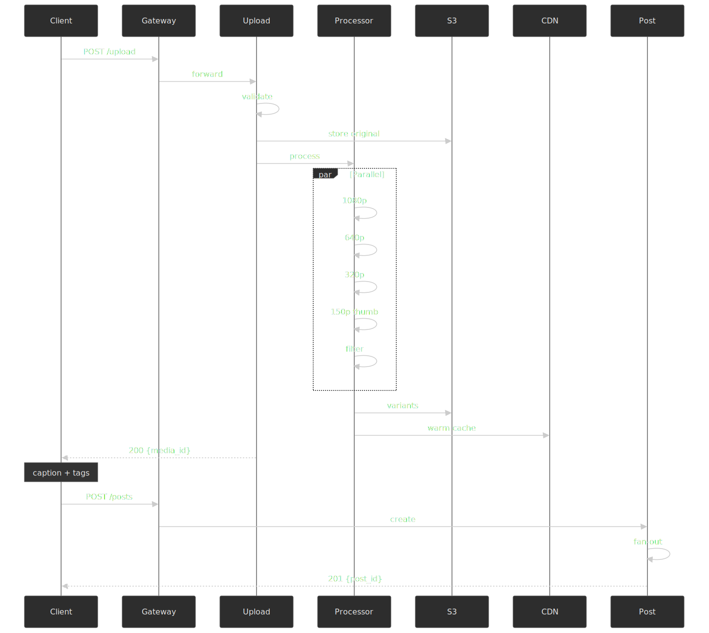

### Image Processing Pipeline

**Input validation** mirrors what Instagram documents in its [image resolution help center page](https://help.instagram.com/1631821640426723/):

- Supported feed widths land in the **320–1080 px** band; sub-320 px uploads get upscaled to 320 px and >1080 px uploads get downscaled to 1080 px.
- Supported source formats: JPEG, PNG, HEIC (HEIC is normalized to JPEG/HEIF for delivery).
- Maximum upload size is generous on the wire (tens of MB), but client-side compression typically lands the post in the 2–5 MB range before the server sees it.

**Resolution variants generated.** The exact ladder is implementation-specific; the shape below is representative of what a power-law CDN footprint requires:

| Variant   | Dimensions   | Use Case                      |
| --------- | ------------ | ----------------------------- |
| Original  | Up to 1080px | Full-screen view              |
| Large     | 1080 × 1080  | Feed (high-DPI devices)       |
| Medium    | 640 × 640    | Feed (standard devices)       |
| Small     | 320 × 320    | Grid view, thumbnails         |
| Thumbnail | 150 × 150    | Notifications, search results |

**Filter processing.** On modern devices the heavy lifting is done on-device via GPU shaders (Metal on iOS, OpenGL ES / Vulkan on Android), so the server pipeline only has to deal with already-baked pixels for filtered uploads. Server-side filtering is a fallback path (for example, web uploads). Conceptually a filter is:

```text title="filter pipeline"
output = Blend( Adjust( LUT(input) ) )

  LUT        3D color look-up table (per-filter asset)
  Adjust     brightness / contrast / saturation / warmth
  Blend      vignette, frame, grain overlay
```

**Processing time budget:**

| Operation          | Target | Notes                      |
| ------------------ | ------ | -------------------------- |
| Upload to storage  | < 2s   | Depends on connection      |
| Generate variants  | < 3s   | Parallel processing        |
| Filter application | < 1s   | GPU-accelerated            |
| CDN propagation    | < 5s   | Edge cache warming         |
| **Total**          | < 10s  | User-perceived upload time |

### Storage Strategy

**Object storage layout:**

```text title="object key layout"
s3://instagram-media/
  /{user_id}/
    /{media_id}/
      original.jpg          # Raw upload
      1080.jpg             # Full resolution
      640.jpg              # Medium
      320.jpg              # Small
      150.jpg              # Thumbnail
      metadata.json        # EXIF, dimensions, filter applied
```

**CDN caching rules:**

| Content Type     | Cache Duration | Cache Key             |
| ---------------- | -------------- | --------------------- |
| Original         | 1 year         | `{media_id}/original` |
| Variants         | 1 year         | `{media_id}/{size}`   |
| Profile pictures | 1 hour         | `{user_id}/profile`   |
| Stories media    | 24 hours       | `{story_id}/media`    |

**Storage tiering (power-law optimization):** photo workloads at this scale follow a textbook hot/warm/cold split, and Meta has published the two papers that shape the canonical design — [Haystack](https://www.usenix.org/legacy/event/osdi10/tech/full_papers/Beaver.pdf) for hot blobs (OSDI 2010) and [f4](https://www.usenix.org/system/files/conference/osdi14/osdi14-paper-muralidhar.pdf) for warm blobs (OSDI 2014). The conceptual ladder used by any photo-sharing platform of this shape is:

| Tier | Inspired by | Storage shape | Replication | Access pattern |
| ---- | ----------- | ------------- | ----------- | -------------- |
| Hot  | Haystack    | Append-only volume files; in-memory needle index; one disk seek per read | 3x replicated | Recent uploads, top of the long-tail |
| Warm | f4          | Reed-Solomon (10,4) erasure coding inside a cell; XOR coding across regions | Effective replication ~2.1x (vs. 3.6x in Haystack) | Older content, access rate has decayed |
| Cold | Archive     | Deep archive on cheap media | Geo-redundant | Rarely accessed, kept for durability + recall |

```text title="tiering policy"
Hot tier (SSD-backed Haystack-style volumes): Last 7 days of uploads, frequently accessed
Warm tier (f4-style erasure-coded cells):     7 days - 1 year, moderate access
Cold tier (deep archive):                     > 1 year, rare access

Migration policy:
- Content accessed > 10x/day stays hot
- Content accessed < 1x/week moves to warm
- Content not accessed in 90 days moves to cold
```

> [!NOTE]
> Haystack's central optimization is keeping the (volume, offset, size) index for every needle in main memory, so a hot read is at most one disk seek. f4 trades a small read-amplification penalty for a large storage win — its production Reed-Solomon (10,4) configuration tolerates four simultaneous failures inside a cell while cutting effective replication from 3.6x to 2.1x. The hot-vs-warm decision is a function of access rate and age, not file type.

, cold archive with XOR geo-replication.")

## Feed Generation Service

### Hybrid Fan-out Implementation


### Timeline Cache Structure

**Redis data model:**

```bash
# Timeline cache (sorted set by timestamp)
ZADD timeline:{user_id} {timestamp} {post_id}

# Keep last 800 posts per timeline
ZREMRANGEBYRANK timeline:{user_id} 0 -801

# Post metadata cache (hash)
HSET post:{post_id}
  author_id "{user_id}"
  media_url "{cdn_url}"
  caption "{text}"
  like_count {count}
  created_at {timestamp}

# Celebrity posts (separate sorted set per celebrity)
ZADD celebrity:{user_id}:posts {timestamp} {post_id}
```

**Timeline composition at read:**

```python
def get_feed(user_id, cursor=None, limit=20):
    # 1. Get cached timeline posts
    cached_posts = redis.zrevrange(
        f"timeline:{user_id}",
        start=cursor or 0,
        end=(cursor or 0) + limit * 2  # Fetch extra for ranking
    )

    # 2. Get followed celebrities
    celebrities = get_followed_celebrities(user_id)

    # 3. Fetch recent celebrity posts (last 24h)
    celebrity_posts = []
    for celeb_id in celebrities:
        posts = redis.zrevrangebyscore(
            f"celebrity:{celeb_id}:posts",
            max=now(),
            min=now() - 86400,  # 24 hours
            limit=5
        )
        celebrity_posts.extend(posts)

    # 4. Merge and rank
    all_posts = cached_posts + celebrity_posts
    ranked_posts = ranking_service.rank(user_id, all_posts)

    return ranked_posts[:limit]
```

### Feed Ranking

Instagram's ranking system uses deep neural networks fed by tens-to-hundreds of thousands of dense and sparse features (the [Explore engineering post](https://engineering.fb.com/2023/08/09/ml-applications/scaling-instagram-explore-recommendations-system/) describes the same shape for the discovery surface).

**Signal categories:**

| Category     | Signals                                    | Weight (approx) |
| ------------ | ------------------------------------------ | --------------- |
| Relationship | DM history, profile visits, comments, tags | High            |
| Interest     | Content type engagement, hashtag affinity  | High            |
| Timeliness   | Post age, time since last seen             | Medium          |
| Popularity   | Like velocity, comment rate, share count   | Medium          |
| Creator      | Posting frequency, content quality score   | Low             |

**Ranking model architecture:**

```text title="multi-task ranker"
Input: User embeddings + Post embeddings + Context features
  ↓
Feature extraction (10K–100K+ dense + sparse features)
  ↓
Multi-task neural network
  ↓
Outputs:
  - P(like)
  - P(comment)
  - P(save)
  - P(share)
  - P(time_spent > 10s)
  ↓
Weighted combination → Final score
```

**Model training:**

- Trained on billions of engagement events
- Fine-tuned hourly with recent interactions
- A/B tested continuously (10+ experiments running at any time)

### Consistency and Pagination

**Consistency model:**

| Operation                | Consistency        | Rationale                           |
| ------------------------ | ------------------ | ----------------------------------- |
| Own post visibility      | Strong (immediate) | User expects to see own post        |
| Follower timeline update | Eventual (< 30s)   | Acceptable delay for feed freshness |
| Like/comment counts      | Eventual (< 5s)    | Tolerable for social proof          |
| Unfollow propagation     | Strong (immediate) | Privacy expectation                 |

**Cursor-based pagination:**

```json
// Request
GET /feed?cursor=eyJ0cyI6MTY0...&limit=20

// Response
{
  "posts": [...],
  "next_cursor": "eyJ0cyI6MTY0...",
  "has_more": true
}

// Cursor structure (base64-encoded)
{
  "ts": 1640000000,  // Timestamp of last item
  "pid": "abc123",   // Post ID (for tie-breaking)
  "v": 2             // Cursor version (for migrations)
}
```

**Why cursor-based (not offset-based):**

- Timeline changes between requests (new posts arrive)
- Offset pagination causes duplicates or missed posts
- Cursor is stable: "posts older than X" always returns consistent results

## Stories Service

### Architecture

Stories have fundamentally different requirements than feed posts:

| Property         | Posts       | Stories              |
| ---------------- | ----------- | -------------------- |
| Lifetime         | Permanent   | 24 hours             |
| Load time target | < 500ms     | < 200ms              |
| Caching strategy | CDN + Redis | Aggressive prefetch  |
| Ranking          | Complex ML  | Recency + engagement |



### Story Ring Ordering

The "Stories ring" (horizontal tray at top) orders accounts by engagement signals:

**Ordering factors:**

1. Accounts with unseen stories (always first)
2. DM interaction frequency
3. Profile visit frequency
4. Comment/like history
5. Story view history (accounts you consistently view)

**Data model:**

```bash
# Story metadata (expires with TTL)
SETEX story:{story_id} 86400 '{
  "author_id": "123",
  "media_url": "https://...",
  "created_at": 1640000000,
  "viewers": [],
  "reply_enabled": true
}'

# User's active stories (sorted set, auto-cleanup)
ZADD user:{user_id}:stories {created_at} {story_id}
ZREMRANGEBYSCORE user:{user_id}:stories -inf {now - 86400}

# Story ring ordering per viewer
ZADD user:{viewer_id}:story_ring {engagement_score} {author_id}
```

### Prefetch Strategy

**Client-side behavior:**

```text title="prefetch behavior"
On app open:
1. Fetch story ring ordering (lightweight API call)
2. Prefetch first 3 story authors' media (background)
3. As user views stories, prefetch next 2 authors ahead

On story view:
1. Preload all segments of current story
2. Preload first segment of next story
3. Mark current story as viewed (async)
```

**Why aggressive prefetch:**

- Stories UX is tap-tap-tap: any loading spinner breaks flow
- Media is small (compressed images/short videos)
- Users view multiple stories in sequence: sequential access pattern

### TTL and Expiration

**Server-side:**

- Redis keys set with 24-hour TTL
- Background job cleans up S3 media at TTL+1 hour (grace period for in-flight views)

**Client-side:**

- Local cache respiration synced with server TTL
- Client computes `ttl_remaining = story.created_at + 86400 - now()`
- Evict from local cache when TTL expires

## Direct Messages Service

### Architecture

Instagram DMs handle real-time messaging with E2E encryption support.

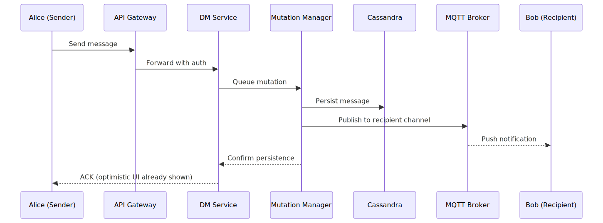
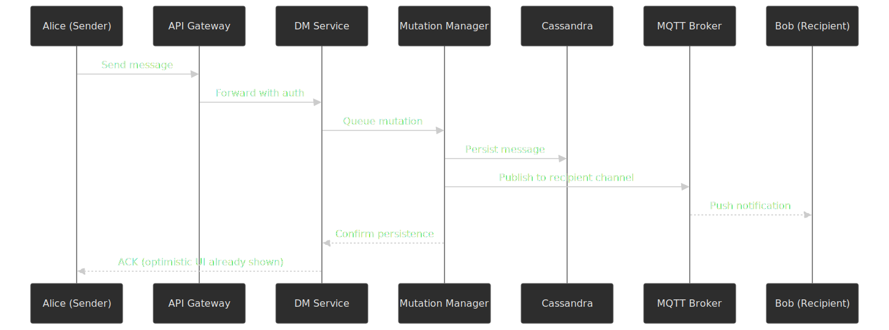

### MQTT for Real-time

Meta has used MQTT for mobile messaging since [Lucy Zhang's 2011 "Building Facebook Messenger" post](https://engineering.fb.com/2011/08/12/android/building-facebook-messenger/) — the original argument was that a persistent, lightweight pub/sub session beats HTTP polling on both latency and battery on mobile networks. Instagram DMs ride the same family of infrastructure.

| Property          | MQTT                                                                                                          | WebSocket                |
| ----------------- | ------------------------------------------------------------------------------------------------------------- | ------------------------ |
| Protocol overhead | [2-byte fixed header minimum](https://docs.oasis-open.org/mqtt/mqtt/v5.0/mqtt-v5.0.pdf)                       | 2–14 bytes per frame     |
| Power consumption | Lower on mobile vs. HTTP polling (Meta's 2011 post argues the win comes from one persistent session and tiny keepalives; not separately quantified) | Higher (app must run its own keepalive cadence) |
| Reconnection      | Built-in session resumption + persistent sessions                                                             | Application-defined      |
| QoS levels        | At-most-once / at-least-once / exactly-once                                                                   | Application-defined      |

**MQTT topic structure:**

```text title="example MQTT topic layout"
# User's DM inbox (subscribe on connect)
/u/{user_id}/inbox

# Thread-specific updates
/t/{thread_id}/messages

# Typing indicators
/t/{thread_id}/typing
```

### Direct's Mutation Manager (DMM)

Instagram's engineering team [built a dedicated mutation manager (DMM) for Direct](https://instagram-engineering.com/making-direct-messages-reliable-and-fast-a152bdfd697f) to handle:

1. **Optimistic UI**: Show sent message immediately, reconcile with server response
2. **Offline support**: Queue messages when offline, sync when reconnected
3. **Ordering guarantees**: Preserve message order even with network jitter
4. **Retry logic**: Automatic retry with exponential backoff

**Client-side queue:**

```typescript
interface QueuedMessage {
  localId: string // Client-generated UUID
  threadId: string
  content: string
  timestamp: number
  status: "pending" | "sent" | "failed"
  retryCount: number
}

// Persisted to IndexedDB/SQLite
// Survives app restarts
```

### Cassandra Data Model

DMs use Cassandra for high write throughput and partition-local queries.

```cql
-- Thread metadata
CREATE TABLE threads (
    thread_id UUID PRIMARY KEY,
    participant_ids SET<UUID>,
    created_at TIMESTAMP,
    last_message_at TIMESTAMP,
    last_message_preview TEXT
);

-- Messages partitioned by thread
CREATE TABLE messages (
    thread_id UUID,
    message_id TIMEUUID,
    sender_id UUID,
    content TEXT,
    media_url TEXT,
    created_at TIMESTAMP,
    PRIMARY KEY (thread_id, message_id)
) WITH CLUSTERING ORDER BY (message_id DESC);

-- User's inbox (materialized view for fast inbox loading)
CREATE TABLE user_inbox (
    user_id UUID,
    thread_id UUID,
    last_message_at TIMESTAMP,
    unread_count INT,
    PRIMARY KEY (user_id, last_message_at)
) WITH CLUSTERING ORDER BY (last_message_at DESC);
```

## Explore and Recommendations

### System Scale

Per Meta's own engineering posts, Instagram's Explore recommender:

- Serves hundreds of millions of daily visitors at sub-second latency.
- Selects from a candidate pool of [billions of items](https://engineering.fb.com/2023/08/09/ml-applications/scaling-instagram-explore-recommendations-system/).
- Runs [1,000+ production ML models](https://engineering.fb.com/2025/05/21/production-engineering/journey-to-1000-models-scaling-instagrams-recommendation-system/) across the surface, with the ranking funnel split into retrieval, early-stage ranking, and late-stage ranking.

### Three-Stage Recommendation Pipeline


### Two Towers Model (Retrieval)

Meta's [Explore architecture post](https://engineering.fb.com/2023/08/09/ml-applications/scaling-instagram-explore-recommendations-system/) describes the same two-tower retrieval shape: independent user and item towers produce embeddings that get compared via dot product, with item embeddings precomputed and indexed in an Approximate Nearest Neighbor service for online lookup.

**Architecture:**

```text title="two-tower retrieval"
User Tower:                     Item Tower:
[User features]                 [Item features]
      ↓                              ↓
   Dense layers                  Dense layers
      ↓                              ↓
User embedding (128d)           Item embedding (128d)
      ↓                              ↓
      └────── Dot product ──────────┘
                   ↓
           Similarity score
```

**User features:**

- Account-level embeddings (topical interests)
- Recent engagement history
- Social graph signals
- Demographic signals (age bucket, region)

**Item features:**

- Content embeddings (visual + text)
- Creator features
- Engagement statistics
- Content category

### Multi-Task Ranking

The late-stage ranker predicts multiple objectives simultaneously:

```text title="multi-task scoring"
Outputs:
- P(like)        weight: 1.0
- P(comment)     weight: 2.0  (higher engagement)
- P(save)        weight: 3.0  (strong intent signal)
- P(share)       weight: 3.0
- P(follow)      weight: 5.0  (acquisition metric)
- P(hide)        weight: -10.0 (negative signal)

Final score = Σ(weight × probability)
```

### Model Training

**Continual learning:**

- Models fine-tuned **hourly** with new engagement data
- Base model retrained weekly with full dataset
- Feature store updated in real-time

**Scale:**

- 1,000+ models running in production
- Custom ML infrastructure (PyTorch-based)
- GPU clusters for inference at <100ms p99

## API Design

### Photo Upload

```http title="POST /api/v1/media/upload"
POST /api/v1/media/upload
Content-Type: multipart/form-data

Request:
- file: <binary>
- media_type: "image" | "video"
- filter_id: "clarendon" | "gingham" | ... (optional)

Response (200 OK):
{
  "media_id": "abc123",
  "urls": {
    "1080": "https://cdn.instagram.com/abc123/1080.jpg",
    "640": "https://cdn.instagram.com/abc123/640.jpg",
    "320": "https://cdn.instagram.com/abc123/320.jpg",
    "150": "https://cdn.instagram.com/abc123/150.jpg"
  },
  "expires_at": "2024-01-02T00:00:00Z"  // Media must be posted within 24h
}
```

### Create Post

```http title="POST /api/v1/posts"
POST /api/v1/posts

Request:
{
  "media_ids": ["abc123", "def456"],  // Up to 10 for carousel
  "caption": "Summer vibes 🌴",
  "location_id": "loc_789",           // Optional
  "tagged_users": ["user_111"],       // Optional
  "alt_text": "Beach sunset"          // Accessibility
}

Response (201 Created):
{
  "post_id": "post_xyz",
  "permalink": "https://instagram.com/p/xyz",
  "created_at": "2024-01-01T12:00:00Z"
}

Errors:
- 400: Invalid media_id (expired or not found)
- 400: Caption too long (> 2200 characters)
- 403: Tagged user has blocked you
- 429: Rate limited (> 25 posts/day)
```

### Feed

```http title="GET /api/v1/feed"
GET /api/v1/feed?cursor={cursor}&limit=20

Response (200 OK):
{
  "posts": [
    {
      "post_id": "post_xyz",
      "author": {
        "user_id": "user_123",
        "username": "photographer",
        "profile_pic_url": "https://...",
        "is_verified": true
      },
      "media": [
        {
          "type": "image",
          "url": "https://cdn.instagram.com/...",
          "width": 1080,
          "height": 1080,
          "alt_text": "Beach sunset"
        }
      ],
      "caption": "Summer vibes 🌴",
      "like_count": 1234,
      "comment_count": 56,
      "created_at": "2024-01-01T12:00:00Z",
      "viewer_has_liked": false,
      "viewer_has_saved": false
    }
  ],
  "next_cursor": "eyJ0cyI6MTY0...",
  "has_more": true
}
```

### Stories

```http title="GET /api/v1/stories/feed"
GET /api/v1/stories/feed

Response (200 OK):
{
  "story_ring": [
    {
      "user_id": "user_123",
      "username": "friend1",
      "profile_pic_url": "https://...",
      "has_unseen": true,
      "latest_story_ts": "2024-01-01T11:00:00Z"
    }
  ],
  "stories": {
    "user_123": [
      {
        "story_id": "story_abc",
        "media_url": "https://...",
        "media_type": "image",
        "created_at": "2024-01-01T11:00:00Z",
        "expires_at": "2024-01-02T11:00:00Z",
        "seen": false,
        "reply_enabled": true
      }
    ]
  }
}
```

### Direct Messages

```http title="POST /api/v1/direct/threads/{thread_id}/messages"
POST /api/v1/direct/threads/{thread_id}/messages

Request:
{
  "text": "Hey, nice photo!",
  "reply_to_story_id": "story_abc"  // Optional
}

Response (201 Created):
{
  "message_id": "msg_xyz",
  "thread_id": "thread_123",
  "created_at": "2024-01-01T12:00:00Z",
  "status": "sent"
}
```

## Data Modeling

### PostgreSQL Schema (Core Entities)

```sql
-- Users
CREATE TABLE users (
    id BIGINT PRIMARY KEY,
    username VARCHAR(30) UNIQUE NOT NULL,
    email VARCHAR(255) UNIQUE,
    phone VARCHAR(20) UNIQUE,
    full_name VARCHAR(100),
    bio TEXT,
    profile_pic_url TEXT,
    is_private BOOLEAN DEFAULT false,
    is_verified BOOLEAN DEFAULT false,
    follower_count INT DEFAULT 0,
    following_count INT DEFAULT 0,
    post_count INT DEFAULT 0,
    created_at TIMESTAMPTZ DEFAULT NOW(),
    updated_at TIMESTAMPTZ DEFAULT NOW()
);

CREATE INDEX idx_users_username ON users(username);

-- Posts
CREATE TABLE posts (
    id BIGINT PRIMARY KEY,
    author_id BIGINT NOT NULL REFERENCES users(id),
    caption TEXT,
    location_id BIGINT REFERENCES locations(id),
    like_count INT DEFAULT 0,
    comment_count INT DEFAULT 0,
    is_archived BOOLEAN DEFAULT false,
    created_at TIMESTAMPTZ DEFAULT NOW(),
    deleted_at TIMESTAMPTZ
);

CREATE INDEX idx_posts_author ON posts(author_id, created_at DESC);

-- Post Media (supports carousel)
CREATE TABLE post_media (
    id BIGINT PRIMARY KEY,
    post_id BIGINT NOT NULL REFERENCES posts(id),
    media_type VARCHAR(10) NOT NULL,  -- 'image', 'video'
    url TEXT NOT NULL,
    width INT,
    height INT,
    alt_text TEXT,
    position SMALLINT DEFAULT 0,
    created_at TIMESTAMPTZ DEFAULT NOW()
);

CREATE INDEX idx_post_media_post ON post_media(post_id);

-- Comments
CREATE TABLE comments (
    id BIGINT PRIMARY KEY,
    post_id BIGINT NOT NULL REFERENCES posts(id),
    author_id BIGINT NOT NULL REFERENCES users(id),
    parent_id BIGINT REFERENCES comments(id),  -- For replies
    content TEXT NOT NULL,
    like_count INT DEFAULT 0,
    created_at TIMESTAMPTZ DEFAULT NOW(),
    deleted_at TIMESTAMPTZ
);

CREATE INDEX idx_comments_post ON comments(post_id, created_at DESC);

-- Likes (polymorphic)
CREATE TABLE likes (
    id BIGINT PRIMARY KEY,
    user_id BIGINT NOT NULL REFERENCES users(id),
    target_type VARCHAR(10) NOT NULL,  -- 'post', 'comment', 'story'
    target_id BIGINT NOT NULL,
    created_at TIMESTAMPTZ DEFAULT NOW(),
    UNIQUE(user_id, target_type, target_id)
);

CREATE INDEX idx_likes_target ON likes(target_type, target_id);
```

### Cassandra Schema (Social Graph)

The social graph is the read-heaviest surface in the system: every feed read, every notification, every Stories ring computation hits it. Meta describes its graph store as [TAO](https://www.usenix.org/system/files/conference/atc13/atc13-bronson.pdf) (USENIX ATC 2013) — a read-optimized, geo-distributed graph cache layered over MySQL that exposes only two primitives: typed **objects** (nodes — users, posts, comments) and typed **associations** (directed edges — `FOLLOWS`, `LIKES`, `AUTHORED`, time-stamped and optionally carrying data). Most reads in TAO are single-edge or per-object lookups served from leader/follower cache tiers; writes go through the leader to keep cache invalidation correct. The Cassandra-backed schema below is the open-stack equivalent of the same shape: dual edge tables to make both directions of traversal partition-local, plus a per-user activity stream.

```cql
-- Follows (partitioned by follower for "who do I follow" queries)
CREATE TABLE follows (
    follower_id UUID,
    following_id UUID,
    created_at TIMESTAMP,
    PRIMARY KEY (follower_id, following_id)
);

-- Followers (partitioned by following for "who follows me" queries)
CREATE TABLE followers (
    following_id UUID,
    follower_id UUID,
    created_at TIMESTAMP,
    PRIMARY KEY (following_id, follower_id)
);

-- Activity feed (for "activity" tab)
CREATE TABLE activity (
    user_id UUID,
    activity_id TIMEUUID,
    actor_id UUID,
    activity_type TEXT,  -- 'like', 'comment', 'follow', 'mention'
    target_type TEXT,
    target_id UUID,
    created_at TIMESTAMP,
    PRIMARY KEY (user_id, activity_id)
) WITH CLUSTERING ORDER BY (activity_id DESC);
```

### ID Generation (Instagram's Approach)

Instagram's [original sharding and ID generation post](https://instagram-engineering.com/sharding-ids-at-instagram-1cf5a71e5a5c) defines a 64-bit, time-sortable ID minted inside PL/pgSQL on each logical shard:

```sql
-- PL/pgSQL function for globally unique, time-sorted IDs
CREATE OR REPLACE FUNCTION instagram_id() RETURNS BIGINT AS $$
DECLARE
    epoch BIGINT := 1314220021721;  -- Custom epoch (Sep 2011)
    seq_id BIGINT;
    now_millis BIGINT;
    shard_id INT := 1;  -- Set per logical shard
    result BIGINT;
BEGIN
    SELECT nextval('instagram_id_seq') % 1024 INTO seq_id;
    SELECT FLOOR(EXTRACT(EPOCH FROM NOW()) * 1000) INTO now_millis;

    result := (now_millis - epoch) << 23;  -- 41 bits for timestamp
    result := result | (shard_id << 10);    -- 13 bits for shard
    result := result | (seq_id);            -- 10 bits for sequence

    RETURN result;
END;
$$ LANGUAGE PLPGSQL;
```

**ID structure (64 bits):**

| Bits | Purpose                  | Range              |
| ---- | ------------------------ | ------------------ |
| 41   | Milliseconds since epoch | ~69 years          |
| 13   | Shard ID                 | 8,192 shards       |
| 10   | Sequence                 | 1,024 IDs/ms/shard |

**Why this matters:**

- IDs are time-sorted: no separate timestamp index needed
- IDs encode shard: routing without lookup
- IDs are unique across shards: no coordination needed

## Infrastructure

### Cloud-Agnostic Concepts

| Component      | Purpose                 | Requirements                                   |
| -------------- | ----------------------- | ---------------------------------------------- |
| Object Storage | Media files             | High durability, CDN integration               |
| Relational DB  | Users, posts, metadata  | ACID, sharding support                         |
| Wide-column DB | Social graph, activity  | High write throughput, partition-local queries |
| Cache          | Timeline, hot data      | Sub-ms latency, cluster support                |
| Message Queue  | Async processing        | At-least-once delivery, partitioning           |
| Search Index   | Discovery               | Full-text, faceted search                      |
| CDN            | Media delivery          | Global PoPs, cache efficiency                  |
| Push Gateway   | Real-time notifications | MQTT/WebSocket support                         |

### AWS Reference Architecture

| Component      | Service                                    | Configuration                |
| -------------- | ------------------------------------------ | ---------------------------- |
| API Gateway    | ALB + API Gateway                          | Auto-scaling, WAF protection |
| Compute        | EKS (Kubernetes)                           | Spot instances for workers   |
| Primary DB     | RDS PostgreSQL                             | Multi-AZ, read replicas      |
| Social Graph   | Amazon Keyspaces or self-managed Cassandra | Multi-region                 |
| Cache          | ElastiCache Redis Cluster                  | Cluster mode, 6+ nodes       |
| Object Storage | S3 + CloudFront                            | Intelligent tiering          |
| Message Queue  | Amazon MSK (Kafka) or SQS                  | For fan-out workers          |
| Search         | OpenSearch Service                         | 3+ data nodes                |
| Push           | Amazon MQ (MQTT) or IoT Core               | Managed MQTT broker          |

### Multi-Region Deployment


### Instagram's Migration (AWS → Facebook)

Instagram migrated its production stack from AWS to Facebook's data centers in 2013–2014, an internal project nicknamed ["Instagration"](https://instagram-engineering.com/migrating-from-aws-to-fb-86b16f6766e2). The team [started at 8 engineers and grew to ~20 over roughly a year](https://www.wired.com/2014/06/facebook-instagram/), and used a custom networking layer ("Neti") to bridge EC2/VPC and Facebook's internal network.

**Before (AWS):**

- A Postgres-on-EC2 sharded fleet with read replicas
- Memcached for hot caching
- S3 for media storage

**After (Facebook infrastructure):**

- Higher per-server efficiency on Facebook hardware (Wired's coverage cites a roughly 3:1 consolidation ratio versus the prior EC2 footprint).
- Shared access to Facebook's caching, monitoring, and storage stacks.
- Private long-haul network between data centers.
- No user-visible disruption during the cutover.

## Frontend Considerations

### Feed Virtualization

Instagram's feed is an infinite scroll of variable-height items:

```typescript
// Virtualized list configuration
const FeedList = () => {
  return (
    <VirtualizedList
      data={posts}
      renderItem={({ item }) => <PostCard post={item} />}
      estimatedItemSize={600}  // Average post height
      overscanCount={3}        // Render 3 items above/below viewport
      onEndReached={loadMore}
      onEndReachedThreshold={0.5}
    />
  );
};
```

**Why virtualization:**

- Feed can have 1000+ posts
- Each post has heavy media (images/video)
- Without virtualization: memory explosion, jank

### Image Loading Strategy

```typescript
// Progressive image loading
const PostImage = ({ post }) => {
  const [loaded, setLoaded] = useState(false);

  return (
    <div className="post-image">
      {/* Blur placeholder (tiny, inline) */}
      

      {/* Full image (lazy loaded) */}
       setLoaded(true)}
        className={loaded ? 'visible' : 'hidden'}
      />
    </div>
  );
};
```

### Stories Ring Interaction

```typescript
// Horizontal scroll with snap points
const StoriesRing = ({ stories }) => {
  return (
    <div className="stories-ring" style={{
      display: 'flex',
      overflowX: 'scroll',
      scrollSnapType: 'x mandatory',
      WebkitOverflowScrolling: 'touch'  // Smooth iOS scroll
    }}>
      {stories.map(story => (
        <div
          key={story.id}
          style={{ scrollSnapAlign: 'start' }}
        >
          <StoryAvatar story={story} />
        </div>
      ))}
    </div>
  );
};
```

### Optimistic Updates

```typescript
// Like button with optimistic UI
const LikeButton = ({ post }) => {
  const [optimisticLiked, setOptimisticLiked] = useState(post.viewer_has_liked);
  const [optimisticCount, setOptimisticCount] = useState(post.like_count);

  const handleLike = async () => {
    // Optimistic update (immediate feedback)
    setOptimisticLiked(!optimisticLiked);
    setOptimisticCount(prev => optimisticLiked ? prev - 1 : prev + 1);

    try {
      await api.toggleLike(post.id);
    } catch (error) {
      // Rollback on failure
      setOptimisticLiked(post.viewer_has_liked);
      setOptimisticCount(post.like_count);
      showError('Failed to like post');
    }
  };

  return (
    <button onClick={handleLike}>
      <HeartIcon filled={optimisticLiked} />
      <span>{formatCount(optimisticCount)}</span>
    </button>
  );
};
```

## Conclusion

Instagram's architecture demonstrates several principles that recur in any photo- or short-video sharing platform at this scale:

**Architectural decisions:**

1. **Hybrid fan-out** bounds per-post write amplification while keeping cached reads cheap. The follower threshold is a tunable knob — Instagram and Twitter both keep theirs unpublished — rather than a magic number.
2. **Tiered blob storage** matches the read distribution: a [Haystack](https://www.usenix.org/legacy/event/osdi10/tech/full_papers/Beaver.pdf)-shaped hot tier for fresh uploads, an [f4](https://www.usenix.org/system/files/conference/osdi14/osdi14-paper-muralidhar.pdf)-shaped warm tier (Reed-Solomon (10,4), ~2.1x effective replication) for the long tail, and a cold archive for everything else.
3. **A purpose-built graph store** ([TAO](https://www.usenix.org/system/files/conference/atc13/atc13-bronson.pdf)-style objects and associations) keeps the dominant read shape — single-hop edge lookups — partition-local and cache-resident.
4. **Separate storage strategies** for ephemeral (Stories) and persistent (Posts) content match each surface's access pattern and lifetime budget.
5. **Three-stage recommendation funnel** (retrieval → early ranking → late ranking, as described in [Meta's Explore architecture post](https://engineering.fb.com/2023/08/09/ml-applications/scaling-instagram-explore-recommendations-system/)) enables personalization across billions of items inside an inference budget measured in milliseconds.
6. **MQTT for real-time** keeps a persistent, low-overhead channel open on mobile, which has been Meta's preferred shape for chat infrastructure [since 2011](https://engineering.fb.com/2011/08/12/android/building-facebook-messenger/).

**Optimizations this design achieves:**

- Feed load: p99 < 500ms through cached timelines + celebrity merge
- Stories load: p99 < 200ms through aggressive prefetch
- Upload processing: < 10s for immediate user feedback
- Global delivery: 95%+ CDN cache hit rate exploiting power-law distribution

**Known limitations:**

- Hybrid fan-out requires maintaining two read paths and a merge step.
- The high-fan-out follower threshold is a tunable heuristic; the right value drifts as social-graph distributions shift.
- Continual / hourly fine-tuning of the ranker introduces a small staleness window around fast-moving content.
- Multi-region replication is asynchronous, so reads that race a write can briefly see stale state.

**Alternative approaches not chosen:**

- Pure push (write amplification at celebrity scale)
- Pure pull (read latency unacceptable)
- Single-region (latency for global users)

## Appendix

### Prerequisites

- Distributed systems fundamentals (CAP theorem, eventual consistency)
- Database concepts (sharding, replication, indexing)
- Caching strategies (write-through, write-behind, cache invalidation)
- CDN and content delivery concepts
- Basic ML concepts (embeddings, neural networks)

### Summary

- **Hybrid fan-out** — push to follower timeline caches for the long tail of accounts; pull-merge above a tunable follower threshold to bound write amplification.
- **Image processing pipeline** — variants generated for the 320–1080 px supported range; filters offloaded to GPU on-device.
- **Tiered photo storage** — Haystack-style hot tier (in-memory needle index, ~1 disk seek per read), f4-style warm tier (Reed-Solomon (10,4), ~2.1x effective replication), cold archive for the long tail.
- **Social graph storage** — TAO-style objects + associations layered over a sharded relational store, with leader/follower caches keeping cross-region reads fast.
- **Stories architecture** — 24-hour TTL with aggressive prefetch targeting sub-200 ms perceived load.
- **Feed ranking** — multi-task neural networks fed by tens-to-hundreds of thousands of features, fine-tuned continually on engagement events.
- **Explore recommendation** — three-stage funnel (Two Towers retrieval → early ranking → late ranking) over 1,000+ production ML models.
- **MQTT for real-time** — persistent low-overhead channel for DMs, notifications, and presence; Meta's preferred mobile chat substrate since 2011.

### References

- [Finding a Needle in Haystack: Facebook's Photo Storage](https://www.usenix.org/legacy/event/osdi10/tech/full_papers/Beaver.pdf) — hot-tier blob store with in-memory needle index (OSDI 2010).
- [f4: Facebook's Warm BLOB Storage System](https://www.usenix.org/system/files/conference/osdi14/osdi14-paper-muralidhar.pdf) — warm-tier Reed-Solomon (10,4) erasure coding (OSDI 2014).
- [TAO: Facebook's Distributed Data Store for the Social Graph](https://www.usenix.org/system/files/conference/atc13/atc13-bronson.pdf) — objects + associations graph store (USENIX ATC 2013).
- [Sharding & IDs at Instagram](https://instagram-engineering.com/sharding-ids-at-instagram-1cf5a71e5a5c) — original 64-bit ID generation design (Instagram Engineering).
- [What Powers Instagram](https://instagram-engineering.com/what-powers-instagram-hundreds-of-instances-dozens-of-technologies-adf2e22da2ad) — early architecture overview (Instagram Engineering).
- [Migrating from AWS to Facebook](https://instagram-engineering.com/migrating-from-aws-to-fb-86b16f6766e2) — the "Instagration" project (Instagram Engineering).
- [How Facebook Moved 20 Billion Instagram Photos Without You Noticing](https://www.wired.com/2014/06/facebook-instagram/) — secondary coverage of the migration (Wired, 2014).
- [Making Direct Messages Reliable and Fast](https://instagram-engineering.com/making-direct-messages-reliable-and-fast-a152bdfd697f) — DM architecture and the Mutation Manager (Instagram Engineering).
- [Building Facebook Messenger](https://engineering.fb.com/2011/08/12/android/building-facebook-messenger/) — origin of MQTT use for Meta's mobile chat (Engineering at Meta, 2011).
- [Scaling the Instagram Explore Recommendations System](https://engineering.fb.com/2023/08/09/ml-applications/scaling-instagram-explore-recommendations-system/) — three-stage funnel and Two Towers architecture (Engineering at Meta, 2023).
- [Journey to 1000 Models](https://engineering.fb.com/2025/05/21/production-engineering/journey-to-1000-models-scaling-instagrams-recommendation-system/) — ML infrastructure at scale (Engineering at Meta, 2025).
- [Powered by AI: Instagram's Explore Recommender System](https://ai.meta.com/blog/powered-by-ai-instagrams-explore-recommender-system/) — earlier deep-dive on Explore retrieval (Meta AI).
- [Instagram Video Processing and Encoding Reduction](https://engineering.fb.com/2022/11/04/video-engineering/instagram-video-processing-encoding-reduction/) — video pipeline optimization (Engineering at Meta, 2022).
- [Introducing mcrouter](https://engineering.fb.com/2014/09/15/web/introducing-mcrouter-a-memcached-protocol-router-for-scaling-memcached-deployments/) — caching infrastructure (Engineering at Meta, 2014).
- [Image resolution of photos you share on Instagram](https://help.instagram.com/1631821640426723/) — supported widths and resize behavior (Instagram Help Center).
- [Instagram now has 3 billion monthly active users](https://www.cnbc.com/2025/09/24/instagram-now-has-3-billion-monthly-active-users.html) — Sept 2025 announcement (CNBC).
- [MQTT Version 5.0](https://docs.oasis-open.org/mqtt/mqtt/v5.0/mqtt-v5.0.pdf) — protocol specification (OASIS).
