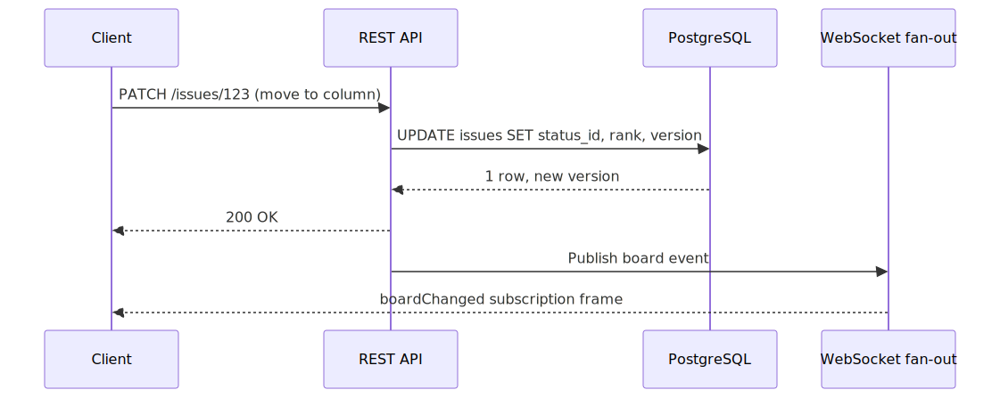
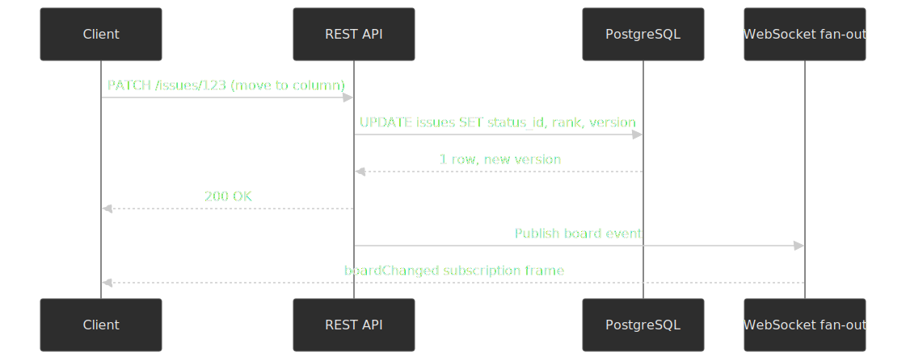
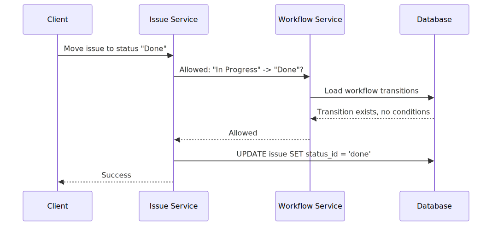
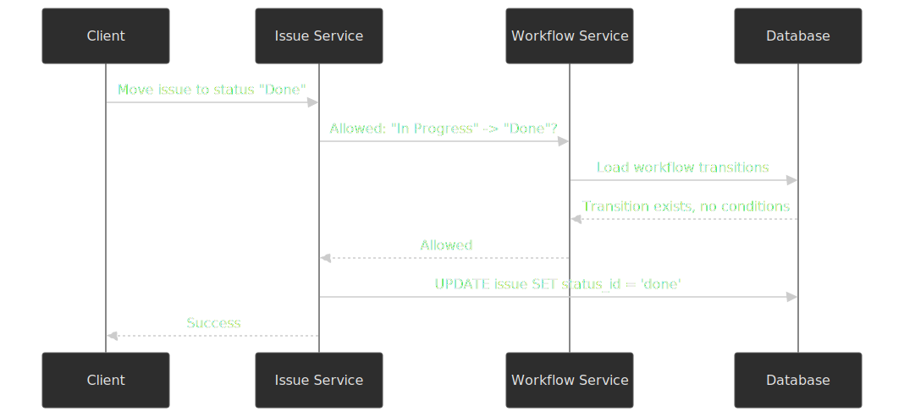
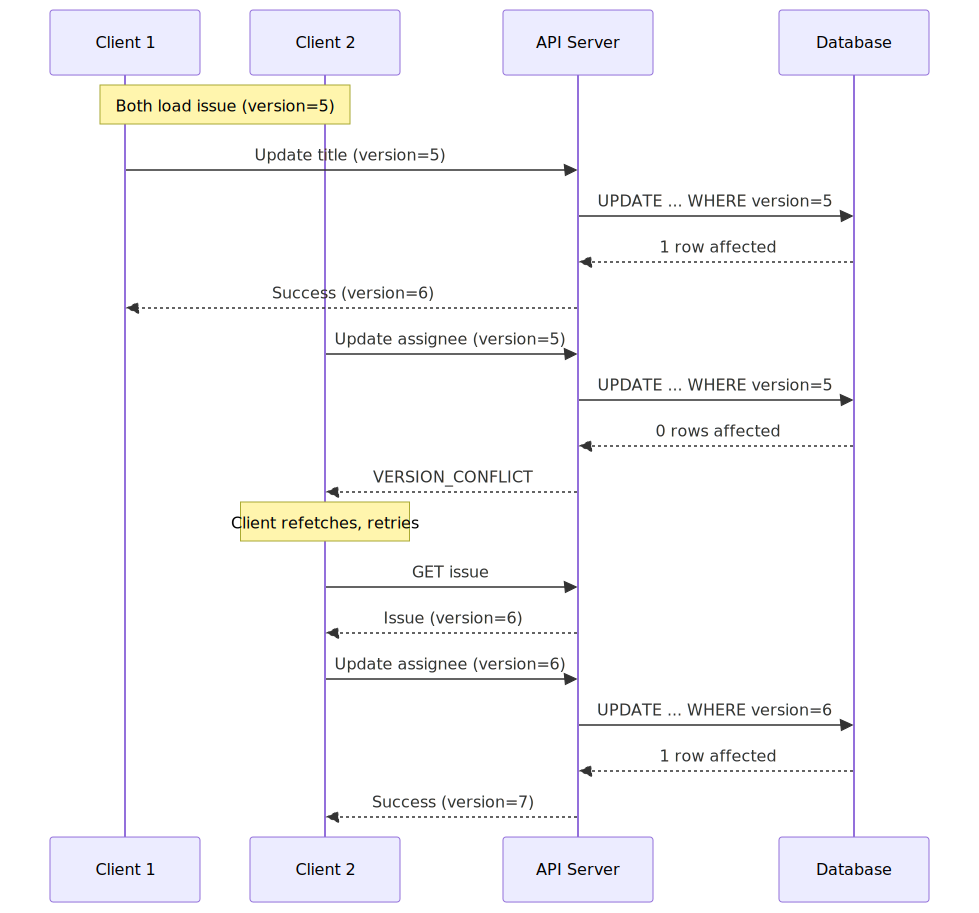
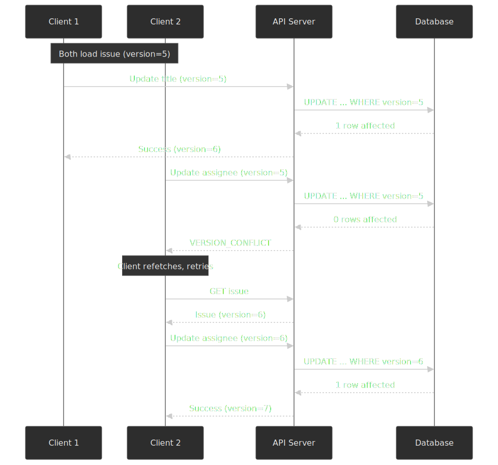
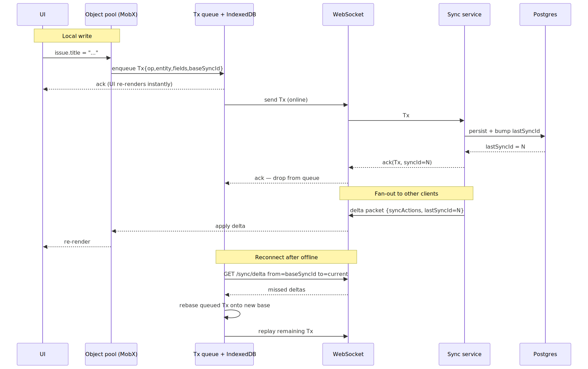
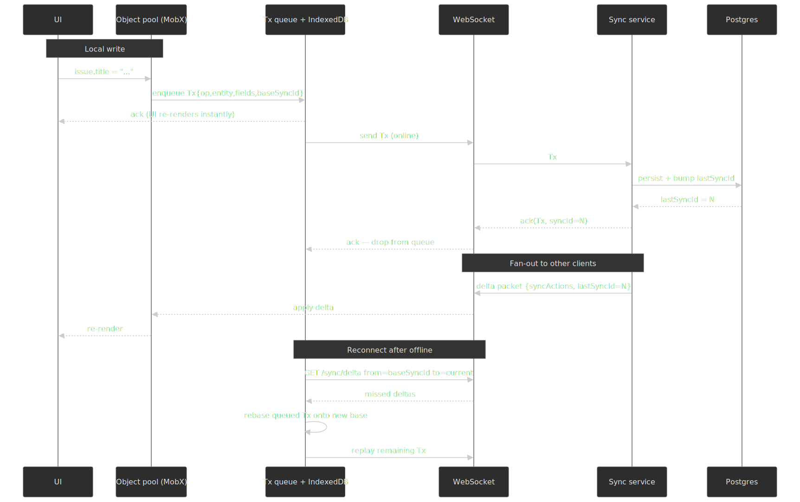
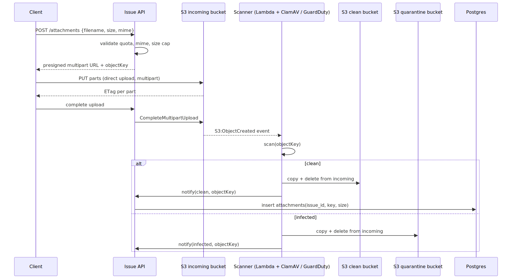
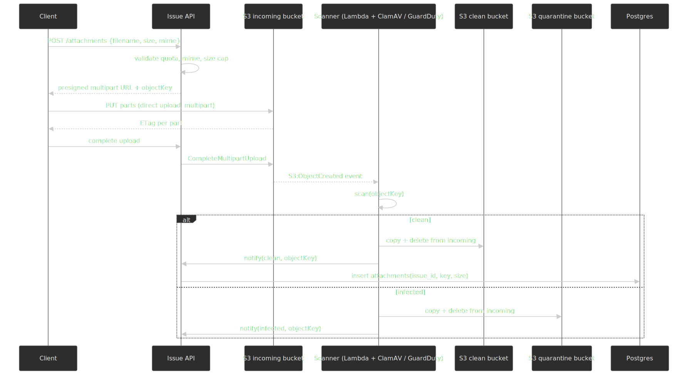

# Design an Issue Tracker (Jira/Linear)

A comprehensive system design for an issue tracking and project management tool covering API design for dynamic workflows, efficient kanban board pagination, drag-and-drop ordering without full row updates, concurrent edit handling, and real-time synchronization. This design addresses the challenges of project-specific column configurations while maintaining consistent user-defined ordering across views.




## Abstract

Issue tracking systems solve three interconnected problems: **flexible workflows** (each project defines its own statuses and transitions), **efficient ordering** (issues maintain user-defined positions without expensive reindexing), and **concurrent editing** (multiple users can update the same issue simultaneously).

**Core architectural decisions:**

| Decision            | Choice                                                | Rationale                                                  |
| ------------------- | ----------------------------------------------------- | ---------------------------------------------------------- |
| Ordering algorithm  | Fractional indexing (LexoRank)                        | O(1) insertions without row updates                        |
| API style           | GraphQL with REST fallback                            | Flexible field selection for varied board views            |
| Pagination          | Per-column cursor-based                               | Ensures all columns load incrementally                     |
| Concurrency         | Optimistic locking with version field                 | Low conflict rate in practice                              |
| Real-time sync      | WebSocket transaction stream + last-write-wins        | Sub-200ms propagation, simple conflict model               |
| Rich-text fields    | CRDT (Yjs / Automerge) only on description / comments | Conflict-free concurrent editing where it actually matters |
| Workflow storage    | Polymorphic per-project                               | Projects own their status definitions                      |
| Authorization       | RBAC at project + ABAC overlay for issue visibility   | Mirrors Jira's project-role + issue-security split         |
| Search              | Postgres FTS for small tenants, OpenSearch at scale   | Same query API; switch backend per tenant size             |
| Attachments         | S3-class object store + presigned multipart           | Keep large blobs out of Postgres                           |
| Notifications       | Event bus + per-channel queues + per-user digest      | Independent retry / backpressure per channel               |

**Key trade-offs accepted:**

- Denormalized board state in Redis for fast reads, with async consistency
- LexoRank strings grow unbounded, requiring periodic rebalancing
- Last-write-wins may lose concurrent edits (acceptable for most fields)

**What this design optimizes:**

- Drag-and-drop reordering updates exactly one row
- Board loads show issues across all columns immediately
- Workflow changes don't require schema migrations

## Requirements

### Functional Requirements

| Requirement                   | Priority | Notes                                        |
| ----------------------------- | -------- | -------------------------------------------- |
| Create/edit/delete issues     | Core     | Title, description, assignee, type, priority |
| Project-specific workflows    | Core     | Custom statuses and transitions per project  |
| Kanban board view             | Core     | Drag-drop between columns and within columns |
| Issue ordering within columns | Core     | Persist user-defined order                   |
| Real-time updates             | Core     | See changes from other users immediately     |
| Search and filter             | Core     | Full-text search, JQL-style queries          |
| Comments and activity         | Extended | Threaded comments, activity timeline         |
| Attachments                   | Extended | File upload and preview                      |
| Sprints/iterations            | Extended | Time-boxed groupings                         |
| Custom fields                 | Extended | Project-specific metadata                    |

### Non-Functional Requirements

| Requirement                | Target          | Rationale                          |
| -------------------------- | --------------- | ---------------------------------- |
| Availability               | 99.9% (3 nines) | User-facing, productivity critical |
| Board load time            | p99 < 500ms     | Must feel instant                  |
| Issue update latency       | p99 < 200ms     | Drag-drop must be responsive       |
| Real-time propagation      | p99 < 300ms     | Collaborative editing feel         |
| Search latency             | p99 < 100ms     | Autocomplete responsiveness        |
| Concurrent users per board | 100             | Team collaboration scenario        |

### Scale Estimation

**Users:**

- Total users: 10M (Jira-scale)
- Daily Active Users (DAU): 2M (20%)
- Peak concurrent users: 500K

**Projects and Issues:**

- Projects: 1M
- Issues per project (active): 1,000 avg, 100,000 max
- Total issues: 1B
- Issues per board view: 200-500 typical

**Traffic:**

- Board loads: 2M DAU × 10 loads/day = 20M/day = ~230 RPS
- Issue updates: 2M DAU × 20 updates/day = 40M/day = ~460 RPS
- Peak multiplier: 3x → 700 RPS board loads, 1,400 RPS updates

**Storage:**

- Issue size: 5KB avg (metadata + description)
- Total issue storage: 1B × 5KB = 5TB
- Attachments: 50TB (separate object storage)
- Activity log: 20TB (append-only)

## Design Paths

### Path A: Server-Authoritative with REST API

**Best when:**

- Team familiar with REST patterns
- Simpler infrastructure requirements
- Offline support not critical
- Moderate real-time requirements

**Architecture:**




**Trade-offs:**

- ✅ Simple mental model
- ✅ Standard tooling and caching
- ✅ Easy to debug
- ❌ Over-fetching/under-fetching without careful design
- ❌ Multiple round trips for complex operations
- ❌ Real-time requires separate WebSocket layer

**Real-world example:** Jira Cloud exposes a REST API for issue and board operations and uses LexoRank for ordering ([Jira Software Cloud REST API](https://developer.atlassian.com/cloud/jira/software/rest/intro/), [Atlassian KB: LexoRank](https://support.atlassian.com/jira/kb/troubleshooting-lexorank-system-issues/)).

### Path B: Local-First with Sync Engine

**Best when:**

- Offline support is critical
- Sub-100ms UI responsiveness required
- Team can invest in sync infrastructure
- Users on unreliable networks

**Architecture:**




**Trade-offs:**

- ✅ Instant UI response (local-first)
- ✅ Full offline support
- ✅ Minimal network traffic (deltas only)
- ❌ Complex sync logic
- ❌ Conflict resolution complexity
- ❌ Larger client-side footprint

**Real-world example:** Linear bootstraps a workspace into IndexedDB and a MobX-managed in-memory object graph, then keeps it in sync over a WebSocket transaction stream — letting the UI read and write locally with no network in the hot path ([Scaling the Linear Sync Engine](https://linear.app/now/scaling-the-linear-sync-engine)). Each server-acknowledged write bumps a workspace-wide `lastSyncId`; clients use it as a cursor to ask for missed deltas after a reconnect. The sync model is last-write-wins for scalar fields, with CRDTs reserved for rich-text issue descriptions ([reverse-linear-sync-engine](https://github.com/wzhudev/reverse-linear-sync-engine)).

### Path C: GraphQL with Optimistic Updates

**Best when:**

- Varied client needs (web, mobile, integrations)
- Complex data relationships
- Need flexibility without over-fetching
- Subscriptions for real-time

**Architecture:**

```graphql
mutation MoveIssue($input: MoveIssueInput!) {
  moveIssue(input: $input) {
    issue {
      id
      status {
        id
        name
      }
      rank
      updatedAt
    }
  }
}

subscription OnBoardUpdate($boardId: ID!) {
  boardUpdated(boardId: $boardId) {
    issue {
      id
      status {
        id
      }
      rank
    }
    action
  }
}
```

**Trade-offs:**

- ✅ Flexible queries for different views
- ✅ Built-in subscriptions for real-time
- ✅ Single endpoint simplifies client
- ❌ Caching more complex
- ❌ Rate limiting harder
- ❌ Learning curve for teams

**Real-world example:** Linear's public API is GraphQL-only and is the same API its web and desktop clients use ([Linear GraphQL API](https://linear.app/developers/graphql)). GitHub also exposes its issue and project surface via GraphQL ([GitHub GraphQL API](https://docs.github.com/en/graphql)).

### Path Comparison

| Factor                    | REST     | Local-First | GraphQL  |
| ------------------------- | -------- | ----------- | -------- |
| Implementation complexity | Low      | High        | Medium   |
| UI responsiveness         | Medium   | Excellent   | Good     |
| Offline support           | Limited  | Native      | Limited  |
| Client flexibility        | Low      | Low         | High     |
| Real-time complexity      | Separate | Built-in    | Built-in |
| Caching                   | Simple   | Complex     | Medium   |

### This Article's Focus

This article focuses on **Path C (GraphQL with REST fallback)** because:

1. Flexible field selection suits varied board configurations
2. Subscriptions provide native real-time support
3. REST endpoints can coexist for webhooks and simple integrations
4. It matches what modern issue trackers expose externally — Linear's API is GraphQL-only, and GitHub Issues / Projects ship a GraphQL surface alongside REST

## High-Level Design

### Component Overview




### Issue Service

Handles core issue CRUD operations and ordering.

**Responsibilities:**

- Create, read, update, delete issues
- Rank calculation for ordering
- Status transitions with workflow validation
- Optimistic locking for concurrent updates

**Key design decisions:**

| Decision    | Choice                  | Rationale                                  |
| ----------- | ----------------------- | ------------------------------------------ |
| Primary key | UUID                    | Distributed ID generation, no coordination |
| Ordering    | LexoRank string         | O(1) reordering without cascading updates  |
| Versioning  | Monotonic version field | Optimistic locking for concurrent edits    |

### Project Service

Manages project configuration including workflows.

**Responsibilities:**

- Project CRUD
- Workflow definition per project
- Status and transition management
- Board configuration (columns, filters)

**Design decision:** Each project owns its workflow definition. Statuses are project-scoped, not global. This allows teams to customize without affecting others.

### Board Service

Optimizes board view queries by maintaining denormalized state.

**Responsibilities:**

- Cache board state in Redis
- Compute issue counts per column
- Handle board-level operations (collapse column, set WIP limits)

**Why separate service:** Board queries require joining issues, statuses, and users. Denormalizing into Redis achieves sub-50ms board loads.

### Workflow Service

Enforces workflow rules and transitions.

**Responsibilities:**

- Validate status transitions
- Execute transition side effects (webhooks, automations)
- Maintain workflow history

**Transition validation flow:**




## API Design

### GraphQL Schema (Core Types)

```graphql
type Issue {
  id: ID!
  key: String! # e.g., "PROJ-123"
  title: String!
  description: String
  status: Status!
  assignee: User
  reporter: User!
  priority: Priority!
  issueType: IssueType!
  rank: String! # LexoRank for ordering
  version: Int! # Optimistic locking
  project: Project!
  comments(first: Int, after: String): CommentConnection!
  activity(first: Int, after: String): ActivityConnection!
  createdAt: DateTime!
  updatedAt: DateTime!
}

type Status {
  id: ID!
  name: String!
  category: StatusCategory! # TODO, IN_PROGRESS, DONE
  color: String!
  position: Int! # Column order
}

type Project {
  id: ID!
  key: String!
  name: String!
  workflow: Workflow!
  statuses: [Status!]!
  issueTypes: [IssueType!]!
}

type Workflow {
  id: ID!
  name: String!
  statuses: [Status!]!
  transitions: [Transition!]!
}

type Transition {
  id: ID!
  name: String!
  fromStatus: Status
  toStatus: Status!
  conditions: [TransitionCondition!]
}

enum StatusCategory {
  TODO
  IN_PROGRESS
  DONE
}

enum Priority {
  LOWEST
  LOW
  MEDIUM
  HIGH
  HIGHEST
}
```

### Board Query with Per-Column Pagination

The key challenge: fetch issues across multiple columns where each column can have different numbers of issues.

**Naive approach (problematic):**

```graphql
# BAD: Fetches all issues, client groups by status
query {
  issues(projectId: "proj-1", first: 100) {
    nodes {
      id
      status {
        id
      }
    }
  }
}
# Problem: If 90 issues are in "To Do", other columns appear empty
```

**Per-column pagination approach:**

```graphql
type BoardColumn {
  status: Status!
  issues(first: Int!, after: String): IssueConnection!
  totalCount: Int!
}

type Board {
  id: ID!
  project: Project!
  columns: [BoardColumn!]!
}

query GetBoard($projectId: ID!, $issuesPerColumn: Int!) {
  board(projectId: $projectId) {
    columns {
      status {
        id
        name
        color
      }
      totalCount
      issues(first: $issuesPerColumn) {
        nodes {
          id
          key
          title
          assignee {
            id
            name
            avatar
          }
          priority
          rank
        }
        pageInfo {
          hasNextPage
          endCursor
        }
      }
    }
  }
}
```

**Response structure:**

```json
{
  "data": {
    "board": {
      "columns": [
        {
          "status": { "id": "status-1", "name": "To Do", "color": "#grey" },
          "totalCount": 45,
          "issues": {
            "nodes": [
              /* first 20 issues */
            ],
            "pageInfo": { "hasNextPage": true, "endCursor": "cursor-abc" }
          }
        },
        {
          "status": { "id": "status-2", "name": "In Progress", "color": "#blue" },
          "totalCount": 12,
          "issues": {
            "nodes": [
              /* first 12 issues - no more pages */
            ],
            "pageInfo": { "hasNextPage": false, "endCursor": "cursor-xyz" }
          }
        },
        {
          "status": { "id": "status-3", "name": "Done", "color": "#green" },
          "totalCount": 89,
          "issues": {
            "nodes": [
              /* first 20 issues */
            ],
            "pageInfo": { "hasNextPage": true, "endCursor": "cursor-def" }
          }
        }
      ]
    }
  }
}
```

**Load more for specific column:**

```graphql
query LoadMoreIssues($statusId: ID!, $after: String!) {
  column(statusId: $statusId) {
    issues(first: 20, after: $after) {
      nodes {
        id
        key
        title
        rank
      }
      pageInfo {
        hasNextPage
        endCursor
      }
    }
  }
}
```

### Issue Mutations

**Move Issue (status change + reorder):**

```graphql
input MoveIssueInput {
  issueId: ID!
  toStatusId: ID!
  rankAfterId: ID # Issue to position after (null = top)
  rankBeforeId: ID # Issue to position before (null = bottom)
  version: Int! # For optimistic locking
}

type MoveIssuePayload {
  issue: Issue
  error: MoveIssueError
}

type MoveIssueError {
  code: MoveIssueErrorCode!
  message: String!
}

enum MoveIssueErrorCode {
  ISSUE_NOT_FOUND
  INVALID_TRANSITION
  VERSION_CONFLICT
  PERMISSION_DENIED
}

mutation MoveIssue($input: MoveIssueInput!) {
  moveIssue(input: $input) {
    issue {
      id
      status {
        id
        name
      }
      rank
      version
      updatedAt
    }
    error {
      code
      message
    }
  }
}
```

**Update Issue:**

```graphql
input UpdateIssueInput {
  issueId: ID!
  title: String
  description: String
  assigneeId: ID
  priority: Priority
  version: Int!
}

mutation UpdateIssue($input: UpdateIssueInput!) {
  updateIssue(input: $input) {
    issue {
      id
      title
      description
      assignee {
        id
        name
      }
      priority
      version
      updatedAt
    }
    error {
      code
      message
    }
  }
}
```

### Real-time Subscriptions

```graphql
type BoardEvent {
  issue: Issue!
  action: BoardAction!
  previousStatusId: ID # For status changes
  previousRank: String # For reorders
}

enum BoardAction {
  CREATED
  UPDATED
  MOVED
  DELETED
}

subscription OnBoardChange($projectId: ID!) {
  boardChanged(projectId: $projectId) {
    issue {
      id
      key
      title
      status {
        id
      }
      rank
      assignee {
        id
        name
      }
      version
    }
    action
    previousStatusId
  }
}
```

### REST API Fallback

For webhooks and simple integrations:

**Move Issue:**

```http
PATCH /api/v1/issues/{issueId}/move
Content-Type: application/json
If-Match: "version-5"

{
  "statusId": "status-3",
  "rankAfterId": "issue-456",
  "rankBeforeId": null
}
```

**Response:**

```http
HTTP/1.1 200 OK
ETag: "version-6"

{
  "id": "issue-123",
  "key": "PROJ-123",
  "status": { "id": "status-3", "name": "Done" },
  "rank": "0|i002bc",
  "version": 6,
  "updatedAt": "2024-02-03T10:00:00Z"
}
```

**Error Responses:**

| Code | Error                 | When                                      |
| ---- | --------------------- | ----------------------------------------- |
| 400  | `INVALID_TRANSITION`  | Workflow doesn't allow this status change |
| 404  | `NOT_FOUND`           | Issue or target status doesn't exist      |
| 409  | `VERSION_CONFLICT`    | Version mismatch (concurrent edit)        |
| 412  | `PRECONDITION_FAILED` | ETag mismatch                             |

## Data Modeling

### Core Schema (PostgreSQL)

```sql
-- Projects with embedded workflow reference
CREATE TABLE projects (
    id UUID PRIMARY KEY DEFAULT gen_random_uuid(),
    key VARCHAR(10) UNIQUE NOT NULL,      -- e.g., "PROJ"
    name VARCHAR(255) NOT NULL,
    description TEXT,
    owner_id UUID NOT NULL REFERENCES users(id),
    created_at TIMESTAMPTZ DEFAULT NOW(),
    updated_at TIMESTAMPTZ DEFAULT NOW()
);

-- Statuses are project-scoped
CREATE TABLE statuses (
    id UUID PRIMARY KEY DEFAULT gen_random_uuid(),
    project_id UUID NOT NULL REFERENCES projects(id) ON DELETE CASCADE,
    name VARCHAR(100) NOT NULL,
    category VARCHAR(20) NOT NULL,        -- 'todo', 'in_progress', 'done'
    color VARCHAR(7) DEFAULT '#808080',
    position INT NOT NULL,                -- Column order
    is_initial BOOLEAN DEFAULT FALSE,     -- Default for new issues
    UNIQUE (project_id, name)
);

CREATE INDEX idx_statuses_project ON statuses(project_id, position);

-- Workflow transitions define allowed status changes
CREATE TABLE workflow_transitions (
    id UUID PRIMARY KEY DEFAULT gen_random_uuid(),
    project_id UUID NOT NULL REFERENCES projects(id) ON DELETE CASCADE,
    from_status_id UUID REFERENCES statuses(id) ON DELETE CASCADE,  -- NULL = any
    to_status_id UUID NOT NULL REFERENCES statuses(id) ON DELETE CASCADE,
    name VARCHAR(100) NOT NULL,
    opsbar_sequence INT DEFAULT 10,       -- UI ordering
    UNIQUE (project_id, from_status_id, to_status_id)
);

-- Issue types (Epic, Story, Task, Bug)
CREATE TABLE issue_types (
    id UUID PRIMARY KEY DEFAULT gen_random_uuid(),
    project_id UUID NOT NULL REFERENCES projects(id) ON DELETE CASCADE,
    name VARCHAR(50) NOT NULL,
    icon VARCHAR(50),
    color VARCHAR(7),
    UNIQUE (project_id, name)
);

-- Issues with LexoRank ordering
CREATE TABLE issues (
    id UUID PRIMARY KEY DEFAULT gen_random_uuid(),
    project_id UUID NOT NULL REFERENCES projects(id),
    issue_type_id UUID NOT NULL REFERENCES issue_types(id),
    status_id UUID NOT NULL REFERENCES statuses(id),

    -- Issue key: computed from project key + sequence
    issue_number INT NOT NULL,

    title VARCHAR(500) NOT NULL,
    description TEXT,

    assignee_id UUID REFERENCES users(id),
    reporter_id UUID NOT NULL REFERENCES users(id),

    priority VARCHAR(20) DEFAULT 'medium',

    -- LexoRank for ordering within status
    -- Format: "0|hzzzzz" (bucket | alphanumeric)
    rank VARCHAR(255) NOT NULL,

    -- Optimistic locking
    version INT DEFAULT 1,

    created_at TIMESTAMPTZ DEFAULT NOW(),
    updated_at TIMESTAMPTZ DEFAULT NOW(),

    UNIQUE (project_id, issue_number)
);

-- Primary query: issues by status, ordered by rank
CREATE INDEX idx_issues_board ON issues(project_id, status_id, rank);

-- Secondary: issues by assignee
CREATE INDEX idx_issues_assignee ON issues(assignee_id, updated_at DESC);

-- Issue key lookup
CREATE INDEX idx_issues_key ON issues(project_id, issue_number);

-- Comments
CREATE TABLE comments (
    id UUID PRIMARY KEY DEFAULT gen_random_uuid(),
    issue_id UUID NOT NULL REFERENCES issues(id) ON DELETE CASCADE,
    author_id UUID NOT NULL REFERENCES users(id),
    body TEXT NOT NULL,
    created_at TIMESTAMPTZ DEFAULT NOW(),
    updated_at TIMESTAMPTZ DEFAULT NOW()
);

CREATE INDEX idx_comments_issue ON comments(issue_id, created_at);

-- Activity log (append-only)
CREATE TABLE activity_log (
    id UUID PRIMARY KEY DEFAULT gen_random_uuid(),
    issue_id UUID NOT NULL REFERENCES issues(id) ON DELETE CASCADE,
    user_id UUID NOT NULL REFERENCES users(id),
    action_type VARCHAR(50) NOT NULL,     -- 'status_change', 'assignment', etc.
    old_value JSONB,
    new_value JSONB,
    created_at TIMESTAMPTZ DEFAULT NOW()
);

CREATE INDEX idx_activity_issue ON activity_log(issue_id, created_at DESC);
```

### Database Selection Rationale

| Data Type        | Store              | Rationale                              |
| ---------------- | ------------------ | -------------------------------------- |
| Issues, Projects | PostgreSQL         | ACID, complex queries, JOIN capability |
| Board cache      | Redis              | Sub-ms reads, TTL for staleness        |
| Search index     | Elasticsearch      | Full-text search, faceted filtering    |
| Activity log     | PostgreSQL → Kafka | Append-only, stream processing         |
| Attachments      | S3                 | Cost-effective blob storage            |

### Denormalized Board Cache (Redis)

**Why cache:** Board queries join issues, statuses, and users. Caching avoids expensive JOINs on every load.

**Structure:**

```redis
# Board metadata
HSET board:{project_id}:meta
    columns_json "[{\"status_id\":\"s1\",\"name\":\"To Do\"}...]"
    total_issues 156
    last_updated 1706886400000

# Per-column issue list (sorted set by rank)
ZADD board:{project_id}:column:{status_id} {rank_score} {issue_id}

# Issue card data (hash - denormalized for fast read)
HSET issue:{issue_id}:card
    key "PROJ-123"
    title "Implement login"
    status_id "status-2"
    assignee_id "user-456"
    assignee_name "Alice"
    priority "high"
    rank "0|i000ab"
    version 5
```

**Cache invalidation strategy:**

- Write-through: Update cache immediately after DB write
- TTL: 5 minutes as safety net
- Pub/Sub: Broadcast invalidation to all service instances

## Low-Level Design: LexoRank Ordering

### Why LexoRank?

Traditional integer-based ordering has a fundamental problem:

```text
Before: [A:1, B:2, C:3, D:4]
Insert X between B and C:
After:  [A:1, B:2, X:3, C:4, D:5]  ← Must update C, D
```

With N items and frequent reorders, this is O(N) updates per operation.

**Fractional indexing solution:** Use lexicographically sortable strings where you can always find a value between any two existing values, so an insert only writes the moved row's rank — siblings are untouched. Figma uses the same idea, with arbitrary-precision base-95 fractions stored as strings, for ordering children inside a frame ([Figma — Realtime Editing of Ordered Sequences](https://www.figma.com/blog/realtime-editing-of-ordered-sequences/)).

```text
Before: [A:"aaa", B:"bbb", C:"ccc"]
Insert X between B and C:
After:  [A:"aaa", B:"bbb", X:"bbc", C:"ccc"]  ← Only X updated
```

### LexoRank Format

Jira's LexoRank uses the format `bucket|value`, where the bucket is a single digit and the value is a base-36 alphanumeric string ([Atlassian KB: LexoRank](https://support.atlassian.com/jira/kb/troubleshooting-lexorank-system-issues/)):

```text
0|hzzzzz
│ └─ Alphanumeric value (base-36, "0"–"9" + "a"–"z")
└── Bucket (0, 1, or 2)
```

> [!NOTE]
> Production Jira ranks also carry a sub-rank after a `:` separator (for example `0|hzzzzz:`), used to disambiguate concurrent inserts. The illustrations below collapse that detail; treat the `value` segment as the LexoRank "core" you would actually compute against.

**Bucket rotation:** The three buckets exist to support background rebalancing without taking writes offline. The balancer copies issues from the current bucket to the next one in the round-robin (`0 → 1 → 2 → 0`); new inserts can keep ranking against the source bucket while in-flight rows fan out to the destination ([LexoRankBalanceOperation API](https://docs.atlassian.com/jira-software/10.4.0/com/atlassian/greenhopper/service/lexorank/balance/LexoRankBalanceOperation.html)).

### Rank Calculation Algorithm

```typescript collapse={1-15}
// Simplified LexoRank implementation
const LEXORANK_CHARS = "0123456789abcdefghijklmnopqrstuvwxyz"
const BASE = LEXORANK_CHARS.length // 36

interface LexoRank {
  bucket: number
  value: string
}

function parseLexoRank(rank: string): LexoRank {
  const [bucket, value] = rank.split("|")
  return { bucket: parseInt(bucket), value }
}

function formatLexoRank(rank: LexoRank): string {
  return `${rank.bucket}|${rank.value}`
}

function getMidpoint(a: string, b: string): string {
  // Ensure same length by padding with '0's
  const maxLen = Math.max(a.length, b.length)
  const aPadded = a.padEnd(maxLen, "0")
  const bPadded = b.padEnd(maxLen, "0")

  // Convert to numbers (treating as base-36)
  let result = ""
  let carry = 0

  for (let i = maxLen - 1; i >= 0; i--) {
    const aVal = LEXORANK_CHARS.indexOf(aPadded[i])
    const bVal = LEXORANK_CHARS.indexOf(bPadded[i])
    const sum = aVal + bVal + carry
    const mid = Math.floor(sum / 2)
    carry = sum % 2
    result = LEXORANK_CHARS[mid] + result
  }

  // If a and b are adjacent, extend with midpoint
  if (result === aPadded) {
    result += LEXORANK_CHARS[Math.floor(BASE / 2)] // 'i'
  }

  return result.replace(/0+$/, "") // Trim trailing zeros
}

function calculateNewRank(before: string | null, after: string | null, bucket: number = 0): string {
  if (!before && !after) {
    // First item - use middle of range
    return formatLexoRank({ bucket, value: "i" })
  }

  if (!before) {
    // Insert at top - find value before 'after'
    const afterRank = parseLexoRank(after!)
    const newValue = getMidpoint("0", afterRank.value)
    return formatLexoRank({ bucket, value: newValue })
  }

  if (!after) {
    // Insert at bottom - find value after 'before'
    const beforeRank = parseLexoRank(before)
    const newValue = getMidpoint(beforeRank.value, "z")
    return formatLexoRank({ bucket, value: newValue })
  }

  // Insert between two items
  const beforeRank = parseLexoRank(before)
  const afterRank = parseLexoRank(after)
  const newValue = getMidpoint(beforeRank.value, afterRank.value)
  return formatLexoRank({ bucket, value: newValue })
}
```

### Rebalancing Strategy

LexoRank strings grow whenever you keep inserting between two adjacent values:

```text
Initial:  "i"
After 1:  "ii"
After 2:  "iii"
...
After 50: "iiiiiiiiiiiiiiiiiiiiiiiiiiiiiiiiiiiiiiiiiiiiiiiiii"
```

**Jira's rebalancing thresholds (8.9.0+, per Atlassian KB)** ([source](https://support.atlassian.com/jira/kb/troubleshooting-lexorank-system-issues/)):

| Max rank length      | Action                                                                                                  |
| :------------------- | :------------------------------------------------------------------------------------------------------ |
| 128–159 characters   | Rebalance is scheduled to run within 12 hours.                                                          |
| 160–253 characters   | Rebalance starts immediately.                                                                           |
| ≥ 254 characters     | Rebalance starts immediately; ranking still works, but any operation whose target rank would itself exceed 254 characters fails until normalisation completes. |

> [!CAUTION]
> The pre-8.9 behaviour was different: the immediate trigger fired at 200 characters and ranking was disabled past that. Older "blog wisdom" floating around the internet still cites those numbers — verify against the Atlassian KB before turning them into runbook thresholds.

**Rebalancing algorithm:**

```typescript collapse={1-5}
async function rebalanceColumn(projectId: string, statusId: string): Promise<void> {
  // 1. Lock column for writes (or use different bucket)
  const lockKey = `rebalance:${projectId}:${statusId}`
  await redis.set(lockKey, "1", "EX", 300) // 5 min lock

  try {
    // 2. Fetch all issues ordered by current rank
    const issues = await db.query(
      `
      SELECT id, rank
      FROM issues
      WHERE project_id = $1 AND status_id = $2
      ORDER BY rank
    `,
      [projectId, statusId],
    )

    // 3. Assign evenly-spaced new ranks
    const newBucket = (parseInt(issues[0]?.rank?.split("|")[0] || "0") + 1) % 3
    const step = Math.floor(BASE / (issues.length + 1))

    const updates = issues.map((issue, index) => {
      const position = step * (index + 1)
      const newValue = position.toString(36).padStart(6, "0")
      return {
        id: issue.id,
        newRank: `${newBucket}|${newValue}`,
      }
    })

    // 4. Batch update
    await db.transaction(async (tx) => {
      for (const { id, newRank } of updates) {
        await tx.query("UPDATE issues SET rank = $1 WHERE id = $2", [newRank, id])
      }
    })

    // 5. Invalidate cache
    await invalidateBoardCache(projectId)
  } finally {
    await redis.del(lockKey)
  }
}
```

## Low-Level Design: Concurrent Edit Handling

### Optimistic Locking Flow




### Implementation

```typescript collapse={1-20}
interface UpdateIssueInput {
  issueId: string
  title?: string
  description?: string
  assigneeId?: string
  version: number
}

interface UpdateResult {
  success: boolean
  issue?: Issue
  error?: { code: string; message: string }
}

async function updateIssue(input: UpdateIssueInput): Promise<UpdateResult> {
  const { issueId, version, ...updates } = input

  // Build dynamic UPDATE query
  const setClause = Object.entries(updates)
    .filter(([_, v]) => v !== undefined)
    .map(([k, _], i) => `${toSnakeCase(k)} = $${i + 3}`)
    .join(", ")

  const values = Object.values(updates).filter((v) => v !== undefined)

  const result = await db.query(
    `
    UPDATE issues
    SET ${setClause}, version = version + 1, updated_at = NOW()
    WHERE id = $1 AND version = $2
    RETURNING *
  `,
    [issueId, version, ...values],
  )

  if (result.rowCount === 0) {
    // Check if issue exists
    const exists = await db.query("SELECT version FROM issues WHERE id = $1", [issueId])

    if (exists.rowCount === 0) {
      return {
        success: false,
        error: { code: "NOT_FOUND", message: "Issue not found" },
      }
    }

    const currentVersion = exists.rows[0].version
    return {
      success: false,
      error: {
        code: "VERSION_CONFLICT",
        message: `Version mismatch. Expected ${version}, current is ${currentVersion}`,
      },
    }
  }

  // Broadcast change
  await publishBoardEvent(result.rows[0].project_id, {
    action: "UPDATED",
    issue: result.rows[0],
  })

  return { success: true, issue: result.rows[0] }
}
```

### Conflict Resolution Strategies

| Strategy              | Use Case                                | Trade-off                       |
| --------------------- | --------------------------------------- | ------------------------------- |
| **Last-Write-Wins**   | Most fields (title, assignee, priority) | May lose edits, but simple      |
| **Field-Level Merge** | Non-conflicting field updates           | More complex, preserves more    |
| **Manual Resolution** | Description (rich text)                 | Best fidelity, worst UX         |
| **CRDT**              | Concurrent rich text editing            | Complex, best for collaboration |

**Field-level merge example:**

```typescript
// Client 1 updates title (version 5 → 6)
// Client 2 updates assignee (version 5 → conflict)
// Instead of rejecting, merge if fields don't overlap

async function mergeUpdate(input: UpdateIssueInput, currentIssue: Issue): Promise<UpdateResult> {
  const { version, ...updates } = input

  // Find which fields changed since client's version
  const changedFields = await getChangedFieldsSince(input.issueId, version, currentIssue.version)

  // Check for conflicts
  const conflictingFields = Object.keys(updates).filter((f) => changedFields.includes(f))

  if (conflictingFields.length > 0) {
    return {
      success: false,
      error: {
        code: "FIELD_CONFLICT",
        message: `Conflicting fields: ${conflictingFields.join(", ")}`,
      },
    }
  }

  // No conflicts - apply update to latest version
  return updateIssue({
    ...input,
    version: currentIssue.version,
  })
}
```

### Move Operation (Status + Rank)

Moving an issue involves two atomic changes: status and rank.

```typescript collapse={1-10}
interface MoveIssueInput {
  issueId: string
  toStatusId: string
  rankAfterId?: string
  rankBeforeId?: string
  version: number
}

async function moveIssue(input: MoveIssueInput): Promise<UpdateResult> {
  const { issueId, toStatusId, rankAfterId, rankBeforeId, version } = input

  return db.transaction(async (tx) => {
    // 1. Lock and fetch current issue
    const issue = await tx.query("SELECT * FROM issues WHERE id = $1 FOR UPDATE", [issueId])

    if (!issue.rows[0]) {
      return { success: false, error: { code: "NOT_FOUND", message: "Issue not found" } }
    }

    if (issue.rows[0].version !== version) {
      return {
        success: false,
        error: { code: "VERSION_CONFLICT", message: "Concurrent modification" },
      }
    }

    const currentIssue = issue.rows[0]

    // 2. Validate transition
    const transitionValid = await validateTransition(tx, currentIssue.project_id, currentIssue.status_id, toStatusId)

    if (!transitionValid) {
      return {
        success: false,
        error: { code: "INVALID_TRANSITION", message: "Workflow does not allow this transition" },
      }
    }

    // 3. Calculate new rank
    let newRank: string

    if (rankAfterId) {
      const afterIssue = await tx.query("SELECT rank FROM issues WHERE id = $1", [rankAfterId])
      const beforeIssue = rankBeforeId ? await tx.query("SELECT rank FROM issues WHERE id = $1", [rankBeforeId]) : null

      newRank = calculateNewRank(afterIssue.rows[0]?.rank, beforeIssue?.rows[0]?.rank)
    } else if (rankBeforeId) {
      const beforeIssue = await tx.query("SELECT rank FROM issues WHERE id = $1", [rankBeforeId])
      newRank = calculateNewRank(null, beforeIssue.rows[0]?.rank)
    } else {
      // Default: bottom of column
      const lastInColumn = await tx.query(
        `
        SELECT rank FROM issues
        WHERE project_id = $1 AND status_id = $2
        ORDER BY rank DESC LIMIT 1
      `,
        [currentIssue.project_id, toStatusId],
      )

      newRank = calculateNewRank(lastInColumn.rows[0]?.rank, null)
    }

    // 4. Update issue
    const result = await tx.query(
      `
      UPDATE issues
      SET status_id = $1, rank = $2, version = version + 1, updated_at = NOW()
      WHERE id = $3
      RETURNING *
    `,
      [toStatusId, newRank, issueId],
    )

    // 5. Log activity
    await tx.query(
      `
      INSERT INTO activity_log (issue_id, user_id, action_type, old_value, new_value)
      VALUES ($1, $2, 'status_change', $3, $4)
    `,
      [
        issueId,
        getCurrentUserId(),
        JSON.stringify({ status_id: currentIssue.status_id }),
        JSON.stringify({ status_id: toStatusId }),
      ],
    )

    // 6. Broadcast (after commit)
    setImmediate(() => {
      publishBoardEvent(currentIssue.project_id, {
        action: "MOVED",
        issue: result.rows[0],
        previousStatusId: currentIssue.status_id,
      })
    })

    return { success: true, issue: result.rows[0] }
  })
}
```

## Low-Level Design: Workflow and Status Management

### Workflow Data Model

Each project has its own workflow, defined by statuses and transitions.




### Fetching Workflow Configuration

```graphql
query GetProjectWorkflow($projectId: ID!) {
  project(id: $projectId) {
    workflow {
      statuses {
        id
        name
        category
        color
        position
      }
      transitions {
        id
        name
        fromStatus {
          id
        }
        toStatus {
          id
        }
      }
    }
  }
}
```

**Response structure:**

```json
{
  "project": {
    "workflow": {
      "statuses": [
        { "id": "s1", "name": "To Do", "category": "TODO", "color": "#808080", "position": 1 },
        { "id": "s2", "name": "In Progress", "category": "IN_PROGRESS", "color": "#0052cc", "position": 2 },
        { "id": "s3", "name": "In Review", "category": "IN_PROGRESS", "color": "#8777d9", "position": 3 },
        { "id": "s4", "name": "Done", "category": "DONE", "color": "#36b37e", "position": 4 }
      ],
      "transitions": [
        { "id": "t1", "name": "Start Progress", "fromStatus": { "id": "s1" }, "toStatus": { "id": "s2" } },
        { "id": "t2", "name": "Submit for Review", "fromStatus": { "id": "s2" }, "toStatus": { "id": "s3" } },
        { "id": "t3", "name": "Approve", "fromStatus": { "id": "s3" }, "toStatus": { "id": "s4" } },
        { "id": "t4", "name": "Reject", "fromStatus": { "id": "s3" }, "toStatus": { "id": "s2" } },
        { "id": "t5", "name": "Reopen", "fromStatus": { "id": "s4" }, "toStatus": { "id": "s1" } }
      ]
    }
  }
}
```

### Workflow Mutation API

```graphql
# Add a new status
mutation AddStatus($input: AddStatusInput!) {
  addStatus(input: $input) {
    status {
      id
      name
      category
      position
    }
  }
}

# Add a transition
mutation AddTransition($input: AddTransitionInput!) {
  addTransition(input: $input) {
    transition {
      id
      name
      fromStatus {
        id
      }
      toStatus {
        id
      }
    }
  }
}

# Reorder statuses (columns)
mutation ReorderStatuses($input: ReorderStatusesInput!) {
  reorderStatuses(input: $input) {
    statuses {
      id
      position
    }
  }
}
```

### Client-Side Workflow Validation

To provide instant feedback, clients cache workflow rules:

```typescript collapse={1-10}
interface WorkflowCache {
  statuses: Map<string, Status>
  transitions: Map<string, Set<string>> // fromStatusId → Set<toStatusId>
}

class WorkflowValidator {
  private cache: WorkflowCache

  constructor(workflow: Workflow) {
    this.cache = {
      statuses: new Map(workflow.statuses.map((s) => [s.id, s])),
      transitions: new Map(),
    }

    // Build transition map
    for (const t of workflow.transitions) {
      const fromId = t.fromStatus?.id || "*" // null = any status
      if (!this.cache.transitions.has(fromId)) {
        this.cache.transitions.set(fromId, new Set())
      }
      this.cache.transitions.get(fromId)!.add(t.toStatus.id)
    }
  }

  canTransition(fromStatusId: string, toStatusId: string): boolean {
    // Check specific transition
    if (this.cache.transitions.get(fromStatusId)?.has(toStatusId)) {
      return true
    }
    // Check wildcard (from any status)
    if (this.cache.transitions.get("*")?.has(toStatusId)) {
      return true
    }
    return false
  }

  getAvailableTransitions(fromStatusId: string): Status[] {
    const specific = this.cache.transitions.get(fromStatusId) || new Set()
    const wildcard = this.cache.transitions.get("*") || new Set()
    const available = new Set([...specific, ...wildcard])

    return Array.from(available)
      .map((id) => this.cache.statuses.get(id)!)
      .filter(Boolean)
  }
}
```

## Low-Level Design: Sync Engine and Offline Reconciliation

Path C above describes the GraphQL story; this section captures what changes when the same product needs Linear-grade local-first behaviour and offline edits. The mechanism is independent of the wire protocol — it works equally well over GraphQL subscriptions or a raw WebSocket transaction stream.

### Data plane

Every workspace has a single monotonically increasing `lastSyncId`. The server bumps it on each persisted mutation and stamps the resulting **delta packet** with the new value before fanning it out to subscribers. Clients persist `lastSyncId` alongside the local model store so they can resume where they left off ([Scaling the Linear Sync Engine](https://linear.app/now/scaling-the-linear-sync-engine), [reverse-linear-sync-engine](https://github.com/wzhudev/reverse-linear-sync-engine)).




Three bootstrap modes hydrate the local store on app start ([reverse-linear-sync-engine](https://github.com/wzhudev/reverse-linear-sync-engine)):

| Bootstrap | When                                              | Payload                                                   |
| :-------- | :------------------------------------------------ | :-------------------------------------------------------- |
| Full      | First load on a device                            | Full set of hot models (Issue, Project, User, Cycle)      |
| Partial   | Returning user with cached state but missed range | `lastSyncId` cursor + deferred models (Comment, History)  |
| Local     | Subsequent in-session loads                       | Hydrate from IndexedDB only; no network until first write |

### Mutation lifecycle

A local edit follows a fixed lifecycle:

1. UI calls a mutator on the in-memory model. The change is applied to the MobX object pool optimistically — the UI re-renders with no network in the hot path.
2. A `Transaction` record `{op, entity, fields, baseSyncId, clientId}` is appended to the local queue and persisted to IndexedDB.
3. The sync client streams pending transactions over the WebSocket. When the server acks `{txId, lastSyncId=N}`, the client drops the transaction from the queue.
4. The server fans the resulting delta packet out to every other connected client; remote clients apply the `SyncAction` set to their pool and bump their `lastSyncId`.

If the device is offline, steps 3–4 are deferred. Transactions stay in IndexedDB until the WebSocket reconnects.

### Reconnect and rebase

On reconnect, the client cannot just replay the queue against the live server — the workspace may have advanced. The Linear-style protocol is:

```text
1. open WebSocket, send {lastSyncId: baseSyncId}
2. server streams missed delta packets up to current lastSyncId
3. client applies them to the pool — server state is now caught up
4. for each queued Tx: rebase fields against the new base, re-apply
5. flush queued Tx; server acks normally
```

Rebasing is field-level last-write-wins: if the server already moved `assignee` while the client was offline, the client's pending `assignee` write replaces it on reconnect. For free-form text (issue description, comment body) the rebase step instead hands off to a CRDT (Yjs / Automerge), which merges concurrent inserts without losing characters[^crdt-tech].

### Idempotency and exactly-once delivery

The transaction queue is the only retry source, so every mutation needs an idempotency key:

- Each `Transaction` carries `{clientId, clientTxSeq}`. The server stores the last applied `clientTxSeq` per `clientId` and rejects re-deliveries silently with the original `lastSyncId`.
- Each delta packet carries its `lastSyncId`. Clients drop packets whose `lastSyncId <= localLastSyncId` — natural deduplication on reconnect storms.
- HTTP fallbacks (file uploads, third-party integrations) use an `Idempotency-Key` header per the Stripe pattern[^stripe-idempotency].

### Why not vector / hybrid logical clocks?

Vector clocks correctly capture concurrency but cost O(N) per write where N is the number of replicas — not viable for a workspace with 100k clients. Hybrid Logical Clocks (HLC) bound that cost but still require multiple participants to agree on causality at write time[^hlc]. A single server-assigned `lastSyncId` is the cheapest correct choice for issue trackers, where conflicts between two humans editing the same field within milliseconds are rare in practice.

> [!IMPORTANT]
> The sync engine is the single point that writes are serialised through. Sharding it (per workspace, never per entity) is fine; splitting it across entities inside a workspace breaks the global ordering guarantee that makes LWW safe.

## Low-Level Design: Permissions and Issue-Level Security

Issue trackers consistently land on a hybrid model: RBAC for project-scoped operations, ABAC-style overlays for per-issue visibility. Jira's three layers are the canonical reference[^jira-perms]:

| Layer            | Granted to                          | Examples                                             |
| :--------------- | :---------------------------------- | :--------------------------------------------------- |
| Global           | Users / groups                      | `SYS_ADMIN`, `BROWSE_USERS`                          |
| Project          | Project roles via permission scheme | `BROWSE_PROJECTS`, `CREATE_ISSUES`, `EDIT_ISSUES`    |
| Issue-level      | Roles / groups / users via security | Restrict an HR-tagged issue to the HR security level |

Role assignments are project-scoped: a user may be a `Developer` in one project and an `Observer` in another. This avoids the role explosion that pure global RBAC produces and matches how teams reason about access ("who is in this project, and what can each role do here?")[^osohq-rbac-abac].

### Resolution flow

, and issue-level security checks.")


Resolution is short-circuit: if a global permission grants the action, no project / issue check runs. Otherwise the project's permission scheme is consulted via the user's project roles, and finally the issue's security level (if any) gates visibility.

Two often-missed properties:

- **Inheritance.** Sub-tasks inherit the parent's security level and cannot override it[^jira-perms]. This is what stops a contractor from being able to see a sub-task whose parent is hidden.
- **No field-level permissions in Jira.** Once an issue is visible, every field on it is visible. Field-level redaction requires either a custom screen or an external authorisation layer[^jira-perms].

### Schema

```sql
CREATE TABLE project_roles (
    id UUID PRIMARY KEY DEFAULT gen_random_uuid(),
    project_id UUID NOT NULL REFERENCES projects(id) ON DELETE CASCADE,
    name VARCHAR(50) NOT NULL,
    UNIQUE (project_id, name)
);

CREATE TABLE project_role_members (
    id UUID PRIMARY KEY DEFAULT gen_random_uuid(),
    role_id UUID NOT NULL REFERENCES project_roles(id) ON DELETE CASCADE,
    user_id UUID REFERENCES users(id),
    group_id UUID REFERENCES groups(id),
    -- Exactly one of user_id / group_id must be set
    CHECK ((user_id IS NULL) <> (group_id IS NULL))
);
-- Partial unique indexes guarantee no duplicate user / group per role
CREATE UNIQUE INDEX idx_role_members_user
    ON project_role_members (role_id, user_id) WHERE user_id IS NOT NULL;
CREATE UNIQUE INDEX idx_role_members_group
    ON project_role_members (role_id, group_id) WHERE group_id IS NOT NULL;

CREATE TABLE permission_scheme_grants (
    id UUID PRIMARY KEY DEFAULT gen_random_uuid(),
    project_id UUID NOT NULL REFERENCES projects(id) ON DELETE CASCADE,
    permission VARCHAR(64) NOT NULL,        -- 'EDIT_ISSUES', 'TRANSITION_ISSUES', ...
    role_id UUID REFERENCES project_roles(id) ON DELETE CASCADE,
    group_id UUID REFERENCES groups(id),
    user_id UUID REFERENCES users(id)
);
CREATE INDEX idx_pscheme_lookup ON permission_scheme_grants(project_id, permission);

CREATE TABLE issue_security_levels (
    id UUID PRIMARY KEY DEFAULT gen_random_uuid(),
    project_id UUID NOT NULL REFERENCES projects(id) ON DELETE CASCADE,
    name VARCHAR(64) NOT NULL,
    UNIQUE (project_id, name)
);

CREATE TABLE issue_security_level_members (
    id UUID PRIMARY KEY DEFAULT gen_random_uuid(),
    level_id UUID NOT NULL REFERENCES issue_security_levels(id) ON DELETE CASCADE,
    role_id UUID REFERENCES project_roles(id) ON DELETE CASCADE,
    group_id UUID REFERENCES groups(id),
    user_id UUID REFERENCES users(id),
    -- Exactly one of role_id / group_id / user_id must be set
    CHECK (
        (role_id IS NOT NULL)::int
      + (group_id IS NOT NULL)::int
      + (user_id IS NOT NULL)::int = 1
    )
);
CREATE INDEX idx_isl_members_level ON issue_security_level_members(level_id);

ALTER TABLE issues
    ADD COLUMN security_level_id UUID REFERENCES issue_security_levels(id);
```

### Caching authorisation

Per-request resolution against four joins is too slow on hot paths (board load, search). Two safe caches:

- **Effective-permission cache.** `(user_id, project_id) → bitset of granted permissions`, invalidated on role / scheme change. Lives in Redis with a 5-minute TTL plus pub/sub-driven busting.
- **Visible-issue filter.** For search and listing, materialise per-user `(user_id, project_id) → security_level_ids[]` and inject the filter into the search query so the engine never returns rows the caller cannot read.

Never cache a deny decision longer than an allow decision — the failure mode is "user briefly sees too much", which is precisely what authorisation must prevent.

## Low-Level Design: Search Subsystem

Issue search has a distinctive shape: many filters (`assignee = me AND status in (...) AND label = ...`), modest text payloads (titles + descriptions + comments), and a strong demand for typo tolerance and "as-you-type" feedback. The choice of engine matters more than for a typical full-text workload.

### Engine selection

| Engine            | Architecture                  | Best for                                         | Watch-outs                                                         |
| :---------------- | :---------------------------- | :----------------------------------------------- | :----------------------------------------------------------------- |
| Postgres FTS      | `tsvector` + GIN, in-database | Single-tenant or small multi-tenant; sovereignty | `tsvector` ≤ 1 MB; lexeme positions ≤ 16 384; no native typo[^pg-fts] |
| Meilisearch       | Single-node Rust              | Fast as-you-type, small datasets                 | Memory-resident index; HA story is weak                            |
| Typesense         | Distributed C++, Raft         | Sweet spot for SaaS scale + simple API           | Smaller community; fewer aggregation primitives                    |
| OpenSearch / ES   | Distributed Java + Lucene     | Multi-tenant SaaS, faceted analytics             | Operational cost; index sizing and JVM tuning                      |

A pragmatic split many teams adopt: ship Postgres FTS for the first 10⁴ issues per tenant, and promote to OpenSearch / Typesense once a tenant crosses an indexable-bytes threshold. Keep the query API engine-agnostic so the swap is a routing change.

### Ingestion pipeline

Issue documents are denormalised projections (issue + status + assignee + comments concatenated for body). They must be eventually consistent with Postgres but can lag the primary store by seconds.




Three patterns sit behind that diagram:

- **Outbox + CDC** — every write to `issues` also inserts into an `outbox` table in the same transaction; Debezium (or Postgres logical replication) tails the outbox and publishes to Kafka. Avoids dual-writes drifting on partial failure[^debezium-outbox].
- **Indexer is idempotent** — every doc carries the source `version`; the indexer drops any update whose `version` is older than what the index already holds.
- **Alias-swap reindex** — full rebuilds write to `issues_v(N+1)` and atomically point the `issues` alias at it once caught up. No downtime, no half-indexed reads.

### Query path

A typical board-search query combines text + filters + facets:

```json
{
  "size": 50,
  "query": {
    "bool": {
      "must":   [{ "multi_match": { "query": "login bug", "fields": ["title^3", "body"] } }],
      "filter": [
        { "term": { "project_id": "p-1" } },
        { "terms": { "security_level_id": ["lvl-public", "lvl-eng"] } },
        { "term": { "status_category": "in_progress" } }
      ]
    }
  },
  "aggs": {
    "by_assignee": { "terms": { "field": "assignee_id", "size": 10 } }
  }
}
```

The `security_level_id` filter is injected by the API layer from the per-user visibility cache (above). Never trust a client-supplied security filter — clients only get to choose project, status, assignee, etc.

## Low-Level Design: Notifications

Notifications are the system's most unbounded fan-out path: a single `@team` mention on a 200-person project can produce 200 deliveries across four channels each. The design priorities are channel isolation, idempotency, and backpressure.




### Pipeline

1. **Domain event** is published to a Kafka topic (`issue.commented`, `issue.assigned`, `mention.created`).
2. **Router** resolves subscribers by union of: assignee, reporter, watchers, mentioned users, project subscribers. It then filters by per-user channel preferences and current presence (no mobile push if the user is online on web — Slack's well-documented heuristic[^slack-notif]).
3. **Per-channel queues** (`in-app`, `push`, `email`, `webhook`) decouple delivery so a failing email provider does not block in-app delivery.
4. **Delivery workers** call APNs / FCM / SES / outbound webhooks with retry + DLQ. Each worker carries an idempotency key derived from `(event_id, user_id, channel)` so retries cannot double-deliver.
5. **Digest aggregator** holds email events in a per-user window (e.g. 5 minutes for mentions, 24 hours for low-priority changes) and emits one combined message; this is what stops a busy issue from spamming a watcher inbox.

### Watcher / subscription model

```sql
CREATE TABLE notification_subscriptions (
    id UUID PRIMARY KEY DEFAULT gen_random_uuid(),
    user_id UUID NOT NULL REFERENCES users(id) ON DELETE CASCADE,
    target_type VARCHAR(20) NOT NULL,    -- 'issue', 'project', 'epic'
    target_id UUID NOT NULL,
    reason VARCHAR(20) NOT NULL,         -- 'assignee', 'mention', 'watch', 'subscribed_to_project'
    UNIQUE (user_id, target_type, target_id, reason)
);
CREATE INDEX idx_notif_sub_target ON notification_subscriptions(target_type, target_id);

CREATE TABLE notification_preferences (
    user_id UUID PRIMARY KEY REFERENCES users(id) ON DELETE CASCADE,
    channels JSONB NOT NULL DEFAULT '{"in_app":true,"push":true,"email":"digest"}'::jsonb
);
```

The `reason` column is what the UI surfaces ("You were assigned", "You were mentioned"); it is also what allows a user to unsubscribe selectively rather than from the whole project.

### Audit log vs notification log

These are two systems, not one:

- **Activity / audit log** (`activity_log` table, append-only) is the system of record for what changed, who changed it, when. It feeds the issue history view and compliance exports. Never delete from it — soft-deletes only.
- **Notification log** records what was *delivered* to whom, on which channel, with which result. It is what the inbox reads from and what powers idempotency. It can be aged out (90-day TTL is typical).

## Low-Level Design: Attachments

Attachments are the only part of the system with multi-MB payloads on the hot path. The design rule is "blobs in object storage, references in Postgres". Jira Cloud, GitHub, Linear, and Asana all converge on the same three primitives: presigned uploads, antivirus scanning, and per-tenant quotas[^jira-attachments].




### Upload contract

- **Presigned multipart upload.** API issues a presigned `CreateMultipartUpload` URL plus per-part PUT URLs scoped to a single object key in the *incoming* bucket. The server never proxies the bytes; this keeps API instances small and avoids egress cost spikes.
- **Quota gate before signing.** Tenant size + per-issue size + per-file size caps are enforced at sign time. A signed URL is the authorisation; once issued, S3 will accept the upload, so the gate must fire here.
- **Mime / extension allow-list** is also enforced at sign time. Block executable extensions by default; let admins opt in.

### Scan and promote

S3 `ObjectCreated` events fan out to an antivirus stage:

| Option                                | Notes                                                                                                                |
| :------------------------------------ | :------------------------------------------------------------------------------------------------------------------- |
| Lambda + ClamAV layer                 | Cheap up to ~250 MB; cold-start friendly; Lambda's `/tmp` is the bottleneck for huge files                           |
| ECS / EKS scanner pool                | Required for multi-GB files (CI artefacts, screen recordings); scales horizontally                                   |
| AWS GuardDuty Malware Protection for S3 | Managed alternative; charged per GB scanned; useful when you don't want to operate ClamAV[^guardduty]               |

Clean objects are copied to the *clean* bucket and an `attachments` row is committed with the object key and content hash; infected objects are moved to a *quarantine* bucket and the attachment is marked `infected`. Only clean attachments are exposed via the download URL.

### Download and serving

- Downloads are also presigned, scoped per-request to a short TTL (5 minutes), and gated by the same permission resolver as the parent issue.
- Image / PDF previews are pre-generated by an async worker writing thumbnails to a sibling key (`<key>/preview-256.webp`); this keeps the issue card fast and avoids fetching multi-MB originals for the avatar grid.
- Cache attachments behind a CDN with `Cache-Control: private, max-age=...` and use signed URLs as the cache key — public CDN caching of private content is the classic SaaS data-leak.

[^crdt-tech]: [Conflict-free Replicated Data Types](https://crdt.tech/) — overview of CRDT families used for collaborative text.
[^stripe-idempotency]: [Stripe — Idempotent requests](https://docs.stripe.com/api/idempotent_requests) — canonical `Idempotency-Key` header semantics.
[^hlc]: Kulkarni et al., [Logical Physical Clocks and Consistent Snapshots in Globally Distributed Databases](https://cse.buffalo.edu/tech-reports/2014-04.pdf) (HLC).
[^jira-perms]: [JIRA Permissions General Overview](https://support.atlassian.com/jira/kb/jira-permissions-general-overview/) and [Configuring issue-level security](https://confluence.atlassian.com/adminjiraserver/configuring-issue-level-security-938847117.html).
[^osohq-rbac-abac]: Oso, [RBAC vs ABAC vs PBAC](https://www.osohq.com/learn/rbac-vs-abac-vs-pbac).
[^pg-fts]: PostgreSQL docs, [Text Search — Limitations](https://www.postgresql.org/docs/current/textsearch-limitations.html).
[^debezium-outbox]: Debezium, [Outbox Event Router](https://debezium.io/documentation/reference/transformations/outbox-event-router.html).
[^slack-notif]: Slack via Courier, [How Slack builds smart notification systems](https://www.courier.com/blog/how-slack-builds-smart-notification-systems-users-want).
[^jira-attachments]: Atlassian, [Configure file attachments](https://support.atlassian.com/jira-cloud-administration/docs/configure-file-attachments/).
[^guardduty]: AWS, [GuardDuty Malware Protection for S3](https://docs.aws.amazon.com/guardduty/latest/ug/gdu-malware-protection-s3.html).

## Frontend Considerations

### Board State Management

**Normalized data structure:**

```typescript
interface BoardState {
  // Entities by ID
  issues: Record<string, Issue>
  statuses: Record<string, Status>
  users: Record<string, User>

  // Ordering
  columnOrder: string[] // Status IDs in display order
  issueOrder: Record<string, string[]> // statusId → issueIds in rank order

  // Pagination
  columnCursors: Record<string, string | null>
  columnHasMore: Record<string, boolean>

  // UI state
  draggingIssueId: string | null
  dropTargetColumn: string | null
  dropTargetIndex: number | null
}
```

**Why normalized:**

- Moving an issue updates two arrays, not nested objects
- React reference equality works for memoization
- Easier to apply real-time updates

### Optimistic Updates for Drag-and-Drop

```typescript collapse={1-20}
function useMoveIssue() {
  const [boardState, setBoardState] = useState<BoardState>(initialState)
  const pendingMoves = useRef<Map<string, { previousState: BoardState }>>(new Map())

  const moveIssue = async (issueId: string, toStatusId: string, toIndex: number) => {
    const issue = boardState.issues[issueId]
    const fromStatusId = issue.statusId

    // 1. Save previous state for rollback
    const previousState = structuredClone(boardState)
    pendingMoves.current.set(issueId, { previousState })

    // 2. Optimistic update
    setBoardState((state) => {
      const newState = { ...state }

      // Remove from old column
      newState.issueOrder = {
        ...state.issueOrder,
        [fromStatusId]: state.issueOrder[fromStatusId].filter((id) => id !== issueId),
      }

      // Add to new column at index
      const newColumnOrder = [...(state.issueOrder[toStatusId] || [])]
      newColumnOrder.splice(toIndex, 0, issueId)
      newState.issueOrder[toStatusId] = newColumnOrder

      // Update issue status
      newState.issues = {
        ...state.issues,
        [issueId]: { ...issue, statusId: toStatusId },
      }

      return newState
    })

    // 3. Server request
    const rankAfterId = toIndex > 0 ? boardState.issueOrder[toStatusId]?.[toIndex - 1] : null
    const rankBeforeId = boardState.issueOrder[toStatusId]?.[toIndex] || null

    try {
      const result = await api.moveIssue({
        issueId,
        toStatusId,
        rankAfterId,
        rankBeforeId,
        version: issue.version,
      })

      if (!result.success) {
        throw new Error(result.error?.message || "Move failed")
      }

      // 4. Update with server-assigned rank and version
      setBoardState((state) => ({
        ...state,
        issues: {
          ...state.issues,
          [issueId]: { ...state.issues[issueId], ...result.issue },
        },
      }))

      pendingMoves.current.delete(issueId)
    } catch (error) {
      // 5. Rollback on failure
      const pending = pendingMoves.current.get(issueId)
      if (pending) {
        setBoardState(pending.previousState)
        pendingMoves.current.delete(issueId)
      }
      toast.error("Failed to move issue. Please try again.")
    }
  }

  return { boardState, moveIssue }
}
```

### Real-time Update Handling

```typescript collapse={1-15}
function useBoardSubscription(projectId: string) {
  const [boardState, setBoardState] = useState<BoardState>(initialState)

  useEffect(() => {
    const subscription = graphqlClient
      .subscribe({
        query: BOARD_CHANGED_SUBSCRIPTION,
        variables: { projectId },
      })
      .subscribe({
        next: ({ data }) => {
          const event = data.boardChanged

          setBoardState((state) => {
            // Skip if this is our own optimistic update
            if (pendingMoves.current.has(event.issue.id)) {
              return state
            }

            switch (event.action) {
              case "MOVED":
                return handleRemoteMove(state, event)
              case "UPDATED":
                return handleRemoteUpdate(state, event)
              case "CREATED":
                return handleRemoteCreate(state, event)
              case "DELETED":
                return handleRemoteDelete(state, event)
              default:
                return state
            }
          })
        },
      })

    return () => subscription.unsubscribe()
  }, [projectId])

  return boardState
}

function handleRemoteMove(state: BoardState, event: BoardEvent): BoardState {
  const { issue, previousStatusId } = event
  const newState = { ...state }

  // Remove from previous column
  if (previousStatusId && state.issueOrder[previousStatusId]) {
    newState.issueOrder = {
      ...state.issueOrder,
      [previousStatusId]: state.issueOrder[previousStatusId].filter((id) => id !== issue.id),
    }
  }

  // Add to new column in correct position based on rank
  const currentColumnOrder = state.issueOrder[issue.statusId] || []
  const insertIndex = findInsertIndex(currentColumnOrder, issue.rank, state.issues)

  const newColumnOrder = [...currentColumnOrder]
  newColumnOrder.splice(insertIndex, 0, issue.id)
  newState.issueOrder[issue.statusId] = newColumnOrder

  // Update issue data
  newState.issues = {
    ...state.issues,
    [issue.id]: issue,
  }

  return newState
}
```

### Column Virtualization

For boards with many issues per column, virtualize the issue list:

```typescript collapse={1-10}
import { useVirtualizer } from '@tanstack/react-virtual';

function VirtualizedColumn({
  statusId,
  issueIds
}: {
  statusId: string;
  issueIds: string[]
}) {
  const parentRef = useRef<HTMLDivElement>(null);

  const virtualizer = useVirtualizer({
    count: issueIds.length,
    getScrollElement: () => parentRef.current,
    estimateSize: () => 80, // Estimated card height
    overscan: 5             // Render 5 extra items for smooth scrolling
  });

  return (
    <div ref={parentRef} className="column-scroll-container">
      <div
        style={{
          height: `${virtualizer.getTotalSize()}px`,
          position: 'relative'
        }}
      >
        {virtualizer.getVirtualItems().map((virtualItem) => (
          <div
            key={virtualItem.key}
            style={{
              position: 'absolute',
              top: 0,
              left: 0,
              width: '100%',
              transform: `translateY(${virtualItem.start}px)`
            }}
          >
            <IssueCard issueId={issueIds[virtualItem.index]} />
          </div>
        ))}
      </div>
    </div>
  );
}
```

## Infrastructure

### Cloud-Agnostic Components

| Component      | Purpose               | Options                               |
| -------------- | --------------------- | ------------------------------------- |
| API Gateway    | Request routing, auth | Kong, Nginx, Traefik                  |
| GraphQL Server | Query execution       | Apollo Server, Mercurius              |
| Message Queue  | Event streaming       | Kafka, RabbitMQ, NATS                 |
| Cache          | Board state, sessions | Redis, Memcached, KeyDB               |
| Search         | Full-text search      | Elasticsearch, Meilisearch, Typesense |
| Object Storage | Attachments           | MinIO, Ceph, S3-compatible            |
| Database       | Primary store         | PostgreSQL, CockroachDB               |

### AWS Reference Architecture




**Service configurations:**

| Service             | Configuration          | Rationale                              |
| ------------------- | ---------------------- | -------------------------------------- |
| GraphQL (Fargate)   | 2 vCPU, 4GB RAM        | Stateless, scale on request rate       |
| WebSocket (Fargate) | 2 vCPU, 4GB RAM        | Connection-bound, ~10K per instance    |
| Workers (Spot)      | 1 vCPU, 2GB RAM        | Cost optimization for async            |
| RDS PostgreSQL      | db.r6g.xlarge Multi-AZ | Primary store, read replicas for scale |
| ElastiCache         | r6g.large cluster      | Board cache, pub/sub                   |
| OpenSearch          | m6g.large.search × 3   | Search index, 3 nodes for HA           |

### Scaling Considerations

**Read-heavy workload:**

- Read replicas for PostgreSQL
- Redis caching for board state
- CDN for static assets

**WebSocket connections:**

- Sticky sessions to WebSocket servers
- Redis pub/sub for cross-instance broadcast
- ~10K connections per 4GB instance

**Search indexing:**

- Async indexing via Kafka
- Dedicated OpenSearch domain
- Index aliases for zero-downtime reindexing

## Conclusion

This design provides a flexible issue tracking system with:

1. **O(1) reordering** via LexoRank eliminates cascading updates.
2. **Per-column cursor pagination** ensures all columns load incrementally.
3. **Optimistic locking** handles concurrent edits with minimal conflict.
4. **Project-scoped workflows** allow team customisation without global impact.
5. **Real-time sync** via a server-assigned `lastSyncId` plus delta packets gives sub-300 ms propagation and a clean offline-reconnect story.
6. **Hybrid RBAC + issue-level security** mirrors how teams reason about access; permission resolution is short-circuit and cached per request.
7. **Outbox + CDC search ingestion** keeps OpenSearch eventually consistent without dual-write drift.
8. **Per-channel notification fan-out** with per-user digest avoids cross-channel head-of-line blocking.
9. **Presigned multipart uploads** and an async antivirus stage keep large blobs out of the API and out of Postgres.

**Key architectural decisions:**

- LexoRank for ordering trades storage (growing strings) for write efficiency.
- Per-column pagination over global pagination ensures balanced board views.
- Last-write-wins is acceptable for most fields; CRDTs reserved for rich text.
- Denormalised Redis cache trades consistency for read performance.
- Server-assigned monotonic `lastSyncId` is preferred over vector / hybrid logical clocks for issue-tracker workloads where conflicts are rare.

**Known limitations:**

- LexoRank requires periodic rebalancing (background job).
- Last-write-wins may lose concurrent edits on the same scalar field.
- Large boards (>1000 issues) need virtualisation.
- Postgres FTS caps out around the `tsvector` size limit; promote to OpenSearch / Typesense per tenant.

**Future enhancements:**

- Field-level CRDTs for conflict-free concurrent editing on scalar fields where it is worth the cost.
- GraphQL federation for microservices decomposition.
- Per-tenant search engine routing (Postgres FTS for small tenants, OpenSearch for large).

## Appendix

### Prerequisites

- Distributed systems fundamentals (eventual consistency, optimistic locking)
- GraphQL basics (queries, mutations, subscriptions)
- React state management patterns
- SQL and database design

### Terminology

| Term                        | Definition                                                               |
| --------------------------- | ------------------------------------------------------------------------ |
| **LexoRank**                | Lexicographically sortable string for ordering without cascading updates |
| **Optimistic locking**      | Concurrency control using version numbers to detect conflicts            |
| **Workflow**                | Set of statuses and allowed transitions between them                     |
| **Fractional indexing**     | Using real numbers (or strings) for ordering with O(1) insertions        |
| **Cursor-based pagination** | Using opaque cursors instead of offsets for stable pagination            |
| **Last-write-wins (LWW)**   | Conflict resolution where the latest timestamp wins                      |

### Summary

- **LexoRank ordering** enables O(1) drag-and-drop without updating other rows
- **Per-column pagination** with cursor-based approach ensures balanced board loading
- **Optimistic locking** with version field detects concurrent modifications
- **Project-scoped workflows** allow custom statuses without schema changes
- **GraphQL subscriptions** provide real-time updates with sub-300ms propagation
- **Denormalized Redis cache** trades consistency for fast board reads

### References

**Issue Tracker APIs:**

- [Jira Software Cloud REST API](https://developer.atlassian.com/cloud/jira/software/rest/intro/) — board and agile endpoints
- [Jira Cloud Platform REST API](https://developer.atlassian.com/cloud/jira/platform/rest/v3/) — issue and workflow endpoints
- [Linear Developers — GraphQL API](https://linear.app/developers/graphql) — GraphQL schema and usage
- [GitHub GraphQL API](https://docs.github.com/en/graphql) — issues and projects via GraphQL
- [Asana API reference](https://developers.asana.com/reference/) — task and section ordering

**Ordering Algorithms:**

- [Figma — Realtime Editing of Ordered Sequences](https://www.figma.com/blog/realtime-editing-of-ordered-sequences/) — fractional indexing at scale
- [Atlassian KB — Troubleshooting LexoRank System Issues](https://support.atlassian.com/jira/kb/troubleshooting-lexorank-system-issues/) — bucket model, rebalance thresholds, integrity checks
- [Atlassian Greenhopper — `LexoRankBalanceOperation` API](https://docs.atlassian.com/jira-software/10.4.0/com/atlassian/greenhopper/service/lexorank/balance/LexoRankBalanceOperation.html) — bucket round-robin reference
- [`rocicorp/fractional-indexing`](https://github.com/rocicorp/fractional-indexing) — reference implementation

**Sync and Real-time:**

- [Scaling the Linear Sync Engine](https://linear.app/now/scaling-the-linear-sync-engine) — local-first architecture (first-party)
- [Reverse-engineering Linear's sync engine](https://github.com/wzhudev/reverse-linear-sync-engine) — endorsed by Linear's CTO; LWW + selective CRDT detail
- [Conflict-free Replicated Data Types](https://crdt.tech/) — CRDT resources

**Permissions and AuthZ:**

- [JIRA Permissions General Overview](https://support.atlassian.com/jira/kb/jira-permissions-general-overview/) — global / project / issue-level layers
- [Configuring issue-level security (Jira)](https://confluence.atlassian.com/adminjiraserver/configuring-issue-level-security-938847117.html) — security schemes and inheritance rules
- [Oso — RBAC vs ABAC vs PBAC](https://www.osohq.com/learn/rbac-vs-abac-vs-pbac) — access-control model trade-offs

**Search:**

- [PostgreSQL — Text Search Limitations](https://www.postgresql.org/docs/current/textsearch-limitations.html) — `tsvector` and lexeme-position caps
- [Debezium — Outbox Event Router](https://debezium.io/documentation/reference/transformations/outbox-event-router.html) — outbox + CDC pattern
- [Typesense vs Algolia vs Elasticsearch vs Meilisearch](https://typesense.org/typesense-vs-algolia-vs-elasticsearch-vs-meilisearch) — engine comparison

**Notifications and Attachments:**

- [How Slack builds smart notification systems (Courier)](https://www.courier.com/blog/how-slack-builds-smart-notification-systems-users-want) — presence-aware routing
- [Configure file attachments (Jira Cloud)](https://support.atlassian.com/jira-cloud-administration/docs/configure-file-attachments/) — per-tenant size and quota model
- [GuardDuty Malware Protection for S3](https://docs.aws.amazon.com/guardduty/latest/ug/gdu-malware-protection-s3.html) — managed AV-on-upload

**System Design:**

- [Optimistic Concurrency Control](https://en.wikipedia.org/wiki/Optimistic_concurrency_control) — concurrency patterns
- [Relay Cursor Connections specification](https://relay.dev/graphql/connections.htm) — cursor-based pagination contract
- [Stripe — Idempotent requests](https://docs.stripe.com/api/idempotent_requests) — `Idempotency-Key` semantics
- Kulkarni et al., [Logical Physical Clocks and Consistent Snapshots](https://cse.buffalo.edu/tech-reports/2014-04.pdf) — HLC reference
