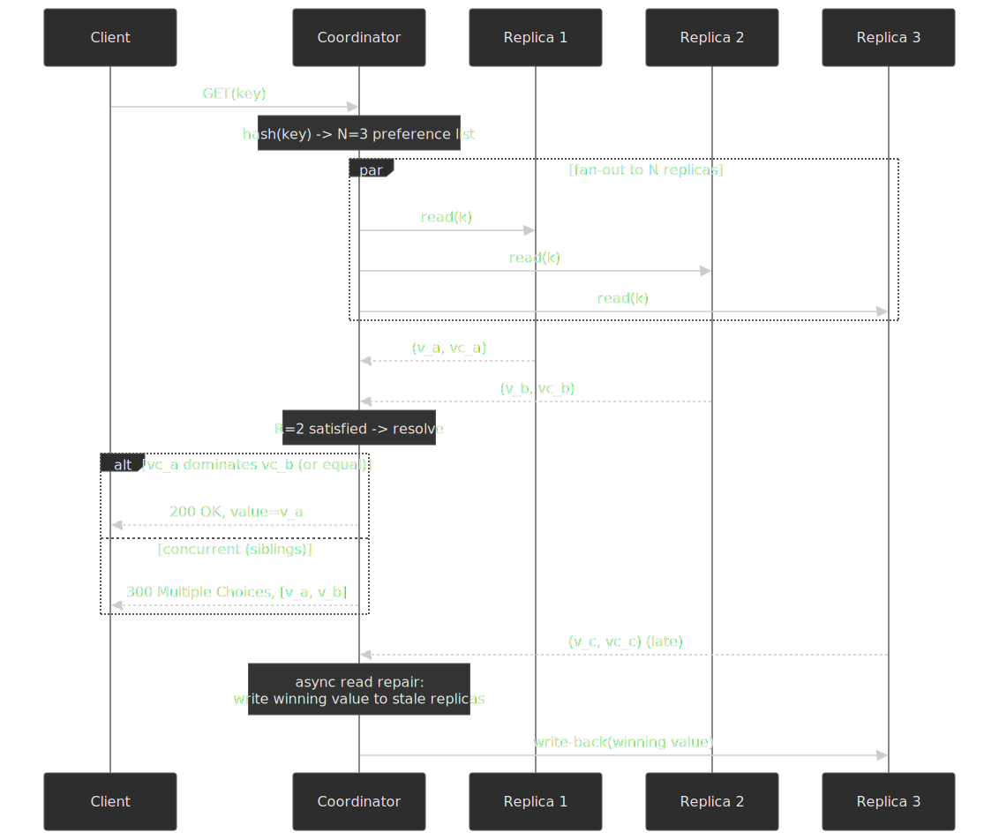
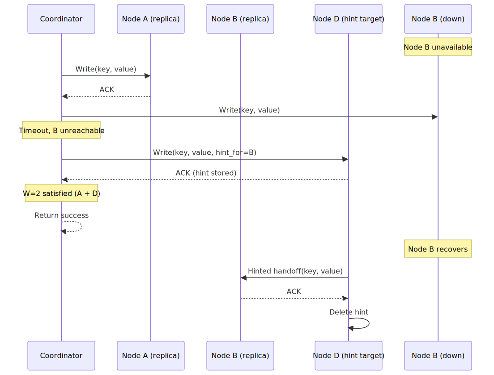
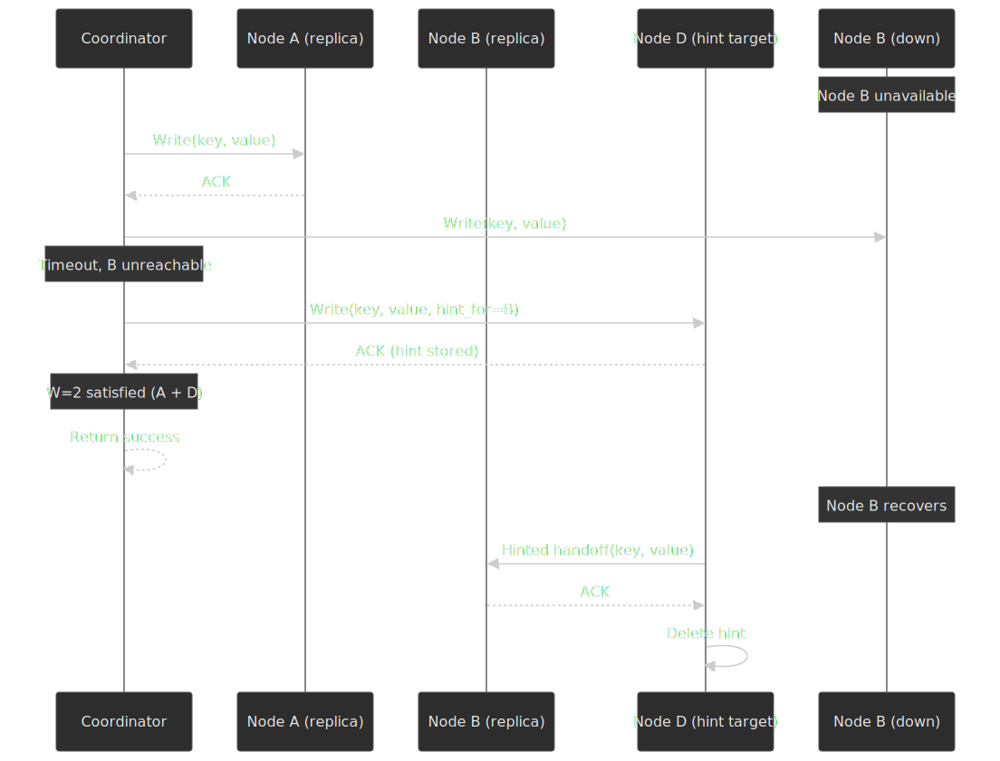
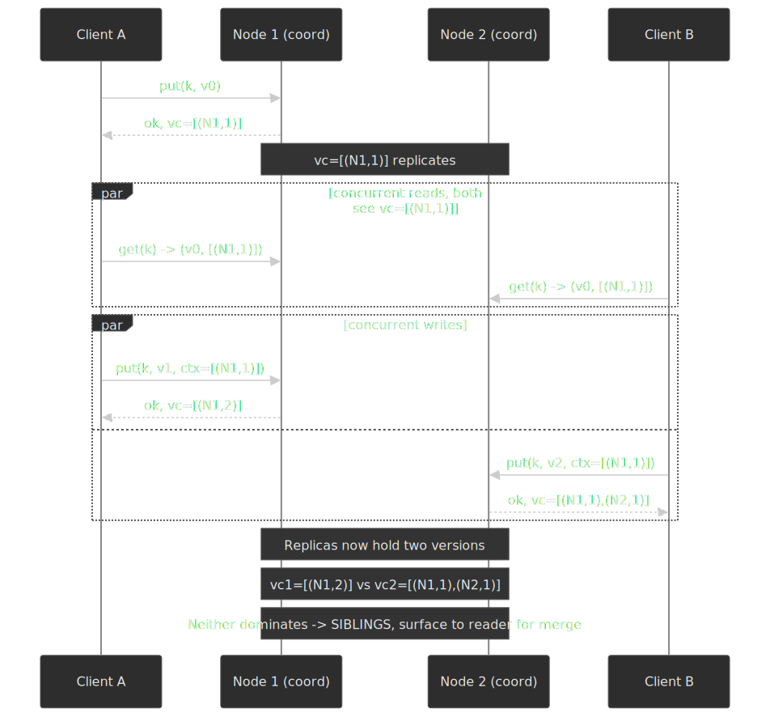
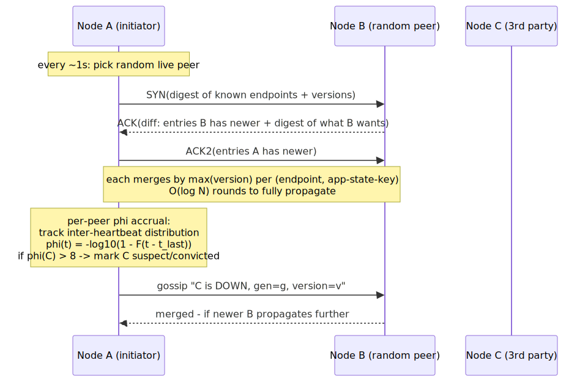
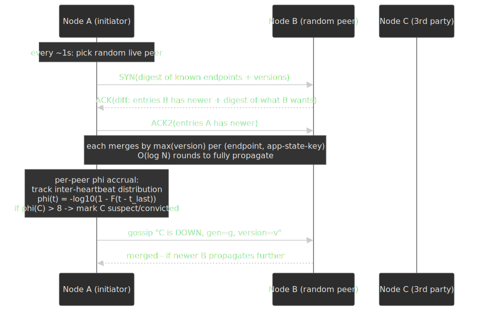
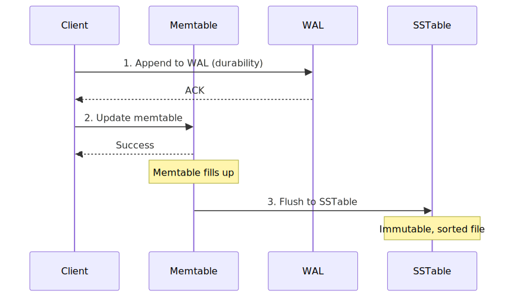
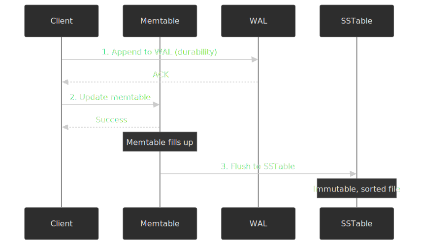

# Design a Distributed Key-Value Store

A distributed key-value store offers minimal `get`/`put`/`delete` semantics while hiding partitioning, replication, failure detection, and storage-engine mechanics behind a simple API. This article walks the design space through the Dynamo lineage[^dynamo] (Amazon Dynamo, Apache Cassandra, Riak)---availability- and partition-tolerance-first systems with tunable consistency---and contrasts with CP alternatives like [etcd](https://etcd.io/docs/v3.5/learning/why/) where linearizability is the product. The focus is the non-obvious mechanisms a senior engineer needs to defend in a design review: how consistent hashing actually places replicas, why R + W > N is necessary but not sufficient, where vector clocks beat last-write-wins, and how an LSM engine's compaction strategy decides whether your reads will fly or thrash.




## Mental model

A distributed key-value store is fundamentally about **choosing where to sit on the CAP spectrum**[^cap-brewer][^cap-gilbertlynch] and then implementing the mechanisms to deliver that choice end-to-end:

- **AP systems** (Dynamo, Cassandra, Riak): accept eventual consistency in exchange for always-on availability. Leaderless replication, sloppy / strict quorums, and conflict resolution via vector clocks or LWW.
- **CP systems** ([etcd](https://etcd.io/docs/v3.5/learning/api/), [Consul](https://developer.hashicorp.com/consul/docs/architecture/consensus), [ZooKeeper](https://zookeeper.apache.org/doc/current/zookeeperOver.html)): unavailable during partitions to preserve linearizability. Leader-based consensus (Raft / Multi-Paxos / ZAB).

> [!IMPORTANT]
> CAP is a worst-case partition statement, not a steady-state one. AP systems still offer strong consistency under quorum (`R + W > N`) when the network is healthy; CP systems still serve reads with low latency when the leader is reachable. The split is about *what happens when the network breaks*, not about average behavior.

The five mechanisms that recur in every Dynamo-style design:

1. **Consistent hashing with virtual nodes** distributes data so that only `k/n` keys move when topology changes.[^karger-consistent-hashing]
2. **Quorum replication** (`R + W > N`) gives the operator a per-call lever between availability and consistency.
3. **Vector clocks or LWW timestamps** detect and resolve concurrent writes.
4. **Gossip + an accrual failure detector** propagate cluster membership and suspect liveness without a central coordinator.[^demers-gossip][^hayashibara-phi]
5. **LSM-tree storage** turns random writes into sequential I/O at the cost of read amplification you then claw back with bloom filters and compaction.[^oneill-lsm]

Throughout the article, "the Dynamo paper" refers to the 2007 SOSP paper[^dynamo]; "DynamoDB" refers to the AWS service whose 2022 USENIX ATC paper[^dynamodb-atc22] documents how its current architecture has diverged from that paper (notably toward Multi-Paxos-based replication and strong consistency as an option).

## Requirements

### Functional Requirements

| Requirement       | Priority     | Notes                                               |
| ----------------- | ------------ | --------------------------------------------------- |
| `put(key, value)` | Core         | Store a value, return success/version               |
| `get(key)`        | Core         | Retrieve value(s), handle conflicts                 |
| `delete(key)`     | Core         | Tombstone-based deletion                            |
| Range queries     | Extended     | Only if ordered storage (not covered in AP designs) |
| TTL expiration    | Extended     | Automatic key expiry                                |
| Transactions      | Out of scope | Requires coordination, changes CAP position         |

### Non-Functional Requirements

| Requirement   | Target                       | Rationale                                |
| ------------- | ---------------------------- | ---------------------------------------- |
| Availability  | 99.99%                       | Writes must succeed even during failures |
| Write latency | p99 < 10ms                   | Local disk + async replication           |
| Read latency  | p99 < 5ms                    | Cache hits, single disk seek             |
| Throughput    | 100K+ ops/sec per node       | LSM-tree optimized for writes            |
| Durability    | No acknowledged write lost   | WAL before acknowledgment                |
| Consistency   | Tunable (eventual to strong) | Application chooses per-operation        |

### Scale Estimation

**Cluster sizing example for a 10 TB dataset:**

```text
Data size: 10 TB
Replication factor: 3
Total storage needed: 30 TB

Per-node capacity: 2 TB (leaving headroom for compaction)
Nodes required: 30 TB / 2 TB = 15 nodes

Traffic assumptions:
- 80% reads, 20% writes
- Average value size: 1 KB
- Target: 100K ops/sec total

Per-node throughput: 100K / 15 ~ 6,700 ops/sec
- Reads:  5,400 ops/sec
- Writes: 1,300 ops/sec
```

## Design Paths

### Path A: AP with Leaderless Replication (Dynamo Model)

**Best when:**

- Availability is paramount (e-commerce carts, session stores)
- Application can handle conflict resolution
- Writes must succeed even during network partitions

**Architecture:**

- All nodes are peers—no leader election
- Any node can coordinate any request
- Replication is synchronous to quorum, async to remaining replicas
- Conflicts detected via vector clocks or resolved via LWW

**Trade-offs:**

- Writes always succeed (to any available quorum)
- No single point of failure
- Application must handle conflicting versions
- Weaker consistency guarantees

**Real-world examples:** Amazon Dynamo (shopping cart), Riak, Cassandra (with eventual consistency)

### Path B: CP with Leader-Based Consensus (Raft/Paxos)

**Best when:**

- Strong consistency required (configuration stores, coordination)
- Reads must return the latest write
- Can tolerate unavailability during leader election

**Architecture:**

- Single leader handles all writes
- Raft/Paxos ensures log replication before acknowledgment
- Leader election on failure (typically 1-10 seconds)

**Trade-offs:**

- Linearizable reads and writes
- Unavailable during leader election
- Write throughput limited by leader
- Simpler conflict model (no concurrent writes)

**Real-world examples:** etcd (Kubernetes), Consul, ZooKeeper

### Path Comparison

| Factor             | AP (Dynamo)              | CP (Raft)                     |
| ------------------ | ------------------------ | ----------------------------- |
| Write availability | Always (to quorum)       | Unavailable during election   |
| Read consistency   | Eventual or quorum       | Linearizable                  |
| Conflict handling  | Vector clocks/LWW        | None (single writer)          |
| Latency            | Lower (no consensus)     | Higher (consensus round-trip) |
| Throughput         | Higher (any node writes) | Lower (leader bottleneck)     |
| Cluster size       | 100s-1000s nodes         | 3-7 nodes typical             |
| Use case           | User data, caches        | Config, coordination, locks   |

### This Article's Focus

This article focuses on **Path A (AP/Dynamo model)** because:

1. Most key-value workloads prioritize availability over strong consistency
2. The techniques (consistent hashing, vector clocks, gossip) are more complex and worth detailed examination
3. CP systems (etcd, Consul) have well-documented Raft implementations

For CP key-value store design, see etcd's architecture documentation and the Raft paper.

## High-Level Design

### Component Overview




### Request Flow

**Write path:**

1. Client SDK hashes key, identifies coordinator node
2. Coordinator determines N replica nodes from preference list
3. Coordinator sends write to all N replicas in parallel
4. Each replica: writes to WAL → updates memtable → acknowledges
5. Coordinator waits for W acknowledgments
6. Returns success to client (remaining replicas receive async)

, and hints / sloppy-quorum-substitutes any replica that misses.")


**Read path:**

1. Client SDK hashes key, contacts coordinator
2. Coordinator sends read to all N replicas in parallel
3. Coordinator waits for R responses
4. If versions conflict: return all versions (or resolve via LWW)
5. Trigger read repair if replicas diverged

.")


## Data Partitioning

### Consistent Hashing

Consistent hashing[^karger-consistent-hashing] maps both keys and nodes to positions on a hash ring (typically 0 to $2^{128}-1$ using MD5 / Murmur3, or $2^{64}-1$ using xxHash). A key is stored on the first `N` *distinct physical nodes* walked clockwise from its hash position.




**Why consistent hashing?**

When nodes join or leave, only $k/n$ keys need to move (`k` = total keys, `n` = nodes). With naive modulo hashing, nearly all keys would remap.

```text
Traditional: hash(key) % num_nodes  -> Node changes cause ~100% key movement
Consistent:  next_node(hash(key))   -> Node changes cause ~1/n key movement
```

### Virtual Nodes (vnodes)

Physical nodes own multiple positions on the ring. Each position is a "virtual node" responsible for a range of the hash space.

**Design rationale:**

1. **Load balancing**: A single physical node token can create hotspots if keys cluster. Virtual nodes spread load.
2. **Heterogeneous hardware**: Assign more vnodes to powerful machines.
3. **Faster recovery**: When a node fails, its vnodes are distributed across many physical nodes, enabling parallel recovery.

**Configuration trade-offs:**

| vnodes per node        | Pros                                   | Cons                                  |
| ---------------------- | -------------------------------------- | ------------------------------------- |
| 1 (legacy)             | Fewer ring neighbors, simpler          | Uneven distribution, slow rebalancing |
| 16 (modern default)    | Good balance, deterministic allocation | Moderate neighbor count               |
| 256 (legacy Cassandra) | Fine-grained distribution              | High memory overhead, slow streaming  |

Cassandra 4.0+ defaults `num_tokens` to 16 with the replica-aware token allocator (`allocate_tokens_for_local_replication_factor`) enabled, down from 256 random tokens in 2.0–3.x.[^cassandra-vnodes-blog] The reduction improves repair and streaming performance while keeping the distribution balanced. The change is tracked in [CASSANDRA-13701](https://issues.apache.org/jira/browse/CASSANDRA-13701).

### Replication Strategy

Keys are replicated to N consecutive nodes on the ring (the "preference list"). With virtual nodes, consecutive ring positions may map to the same physical node, so the preference list skips to ensure N distinct physical nodes.

**Replication factor selection:**

| RF  | Fault tolerance | Storage overhead | Typical use             |
| --- | --------------- | ---------------- | ----------------------- |
| 1   | None            | 1x               | Caches, ephemeral data  |
| 3   | 1 node failure  | 3x               | Standard production     |
| 5   | 2 node failures | 5x               | Critical data, cross-DC |

### Hot Key and Hot Partition Mitigation

Consistent hashing balances the *key space*, not the *request space*. A single very popular key (or a single fat partition under a wide-row schema) still pins all reads/writes to one preference list of `N` replicas, capping throughput at one machine's IOPS regardless of cluster size. The mitigations split into client-side and server-side flavours.

**Schema-level (Cassandra-style, manual).** Add a *bucket* / *salt* component to the partition key — `(natural_key, bucket)` where `bucket = hash(payload) mod K` or a time-rounded suffix.[^cassandra-hot-partition] Reads then scatter-gather across `K` partitions, trading extra coordinator work for parallelism across `N × K` replicas. Pick `K` against the observed skew, not the cluster size; oversharding wastes coordinator round-trips on cold keys.

**Read-side coalescing and caching.** Since the same hot key is being requested concurrently, single-flight the read at the coordinator (or in the client SDK) so `R` replica reads are issued once per in-flight wave instead of once per client request. A short TTL local cache in front of the coordinator (or a dedicated edge cache like Redis) absorbs the rest.

**Adaptive partitioning (managed-service style).** DynamoDB's *adaptive capacity* and *split-for-heat* automatically isolate a hot item or a hot partition into its own physical partition with elevated throughput.[^dynamodb-adaptive] The catch: it cannot fix monotonically increasing keys (e.g., `created_at`-only partitioning) because splitting still leaves all writes on the newest shard. Self-hosted Dynamo-style stores rarely ship this; they rely on the schema-level fix.

**Operational signals.** Watch p99 per coordinator/replica, per-table compaction throughput, and per-partition tombstone counts. Cassandra surfaces hot partitions via the `MaxPartitionSizeInBytes` and `tracing` subsystems; DynamoDB exposes `HotKey` insights in CloudWatch Contributor Insights.

**Multi-datacenter replication:**

Cassandra's `NetworkTopologyStrategy` places replicas across racks and datacenters:

```text
Replication settings:
  dc1: 3 replicas (across 3 racks)
  dc2: 3 replicas (across 3 racks)

Total replicas: 6
Rack-aware placement prevents correlated failures
```

## Quorum Reads and Writes

### Quorum Formula

For a replication factor `N`, if `R` (read replicas) + `W` (write replicas) > `N`, the read and write quorums must intersect at at least one node:

```text
R + W > N  ->  At least one node in the read set acked the write

Example with N=3:
- R=2, W=2: Standard quorum (R+W=4 > 3)
- R=1, W=3: Write-heavy  (all replicas must ack writes)
- R=3, W=1: Read-heavy   (fast writes, "consistent" reads)
```




> [!CAUTION]
> `R + W > N` only guarantees the *latest acked* write is visible. It does **not** give you linearizability: two clients writing concurrently can both succeed against overlapping but distinct quorums, leaving the system with siblings that are surfaced to the next reader. Conflict resolution (vector clocks or LWW) is what closes that gap.

### Consistency Levels (Cassandra Model)

| Level        | Nodes contacted | Use case                                   |
| ------------ | --------------- | ------------------------------------------ |
| ONE          | 1               | Lowest latency, highest availability       |
| QUORUM       | ⌊N/2⌋ + 1       | Standard consistency                       |
| LOCAL_QUORUM | ⌊local_N/2⌋ + 1 | Cross-DC deployments                       |
| ALL          | N               | Strongest consistency, lowest availability |

**Operational guidance:**

- Use QUORUM for most operations
- Use LOCAL_QUORUM for latency-sensitive cross-DC reads
- Avoid ALL in production (single node failure blocks operations)
- ONE is acceptable for time-series data where some loss is tolerable

### Sloppy Quorum and Hinted Handoff

**Problem:** Strict quorum requires `W` of the `N` *designated* replicas to acknowledge. If one is down and you only have N-1 reachable replicas, a `W = N-1` write still works; if `W = N`, the write fails.

**Dynamo's sloppy quorum:** when a designated replica is unreachable, the coordinator writes to the *next* healthy node on the ring with a "hint" to forward later, and **counts that write toward `W`**.[^dynamo] Availability wins; the trade-off is that the temporary holder is not in the read preference list, so a subsequent read may miss the write.




> [!IMPORTANT]
> Cassandra implements hinted handoff but **uses strict quorum**: hints are stored *after* the consistency level is satisfied and do not count toward `W`. The only level that lets a hint substitute for a real replica acknowledgment is `CL=ANY`, where any node in the cluster (including a hint holder) can satisfy the write.[^cassandra-hints] In other words, Cassandra's `QUORUM` is closer to a *strict quorum + best-effort backup* than to Dynamo's classic sloppy quorum.

**Hint storage limits.** Cassandra defaults `max_hint_window` to 3 hours (`max_hint_window_in_ms = 10800000`).[^cassandra-hints] Hints for replicas down longer than this are discarded; restoring consistency then requires full anti-entropy repair. This bound is what prevents unbounded hint accumulation during long outages — and is also why operators monitor the `PendingHintsByEndpoint` metric.

**Trade-off.** Sloppy quorum (Dynamo-style) improves availability but temporarily lifts the quorum guarantee. Strict quorum (Cassandra-style) preserves the guarantee at the cost of failing writes when too few designated replicas are reachable. Pick deliberately; both ship.

## Conflict Detection and Resolution

### The Concurrent Write Problem

Without a single leader, two clients can write to the same key simultaneously via different coordinators. Both writes may succeed (each reaching W replicas), but replicas now have different values.

### Vector Clocks

Vector clocks track causal relationships between versions. Each write increments a `(node, counter)` pair, and the *context* a client sends with a write is the version it most recently observed.[^dynamo]

```plaintext
Initial state: {} (empty)

Client A writes via Node1: [(Node1, 1)]
Client B reads [(Node1, 1)], writes via Node2: [(Node1, 1), (Node2, 1)]
Client C reads [(Node1, 1)], writes via Node3: [(Node1, 1), (Node3, 1)]

Now we have concurrent versions:
  V1: [(Node1, 1), (Node2, 1)]  - Client B's write
  V2: [(Node1, 1), (Node3, 1)]  - Client C's write

Neither dominates the other -> SIBLINGS (concurrent)
```

, so the system stores both as siblings until a reader merges them.")


**Detecting relationships:**

- **V1 dominates V2:** every `(node, counter)` in V2 is ≤ the corresponding entry in V1, and V1 has at least one strictly greater entry. Discard V2.
- **Concurrent (siblings):** neither dominates. Return both versions.

**Resolution strategies:**

1. **Application-level merge.** Return both versions to the client; the application merges (Dynamo's classic shopping-cart example takes the *union* of items, which is why deleted items occasionally reappear under partition).[^dynamo]
2. **Last-Write-Wins (LWW).** Use wall-clock timestamps, discard the older version.
3. **CRDTs.** Use conflict-free data structures (counters, OR-sets, RGAs) that merge automatically; trades data-model flexibility for automatic convergence.[^shapiro-crdt]

### Vector Clock Truncation

Vector clocks grow unboundedly as more coordinators write to a key. Dynamo truncates at a configurable threshold (the paper reports 10) by dropping the oldest `(node, counter)` pair based on the auxiliary timestamp it stores per entry.[^dynamo]

**Risk:** truncation can drop causal history and cause two causally-related versions to look concurrent, generating spurious siblings. Amazon's paper reports this rarely produced visible problems in practice because most keys have a small set of recurring writers; "rarely" is doing a lot of work here, and Riak eventually moved to *dotted version vectors*[^riak-dvvs] to avoid the issue altogether.

### Last-Write-Wins (LWW)

Cassandra resolves conflicts with microsecond client- or server-supplied timestamps instead of vector clocks. The cell with the highest timestamp wins; ties are broken by comparing the value bytes lexicographically.[^cassandra-write-path]

```text
Write 1: value="A", timestamp=1000
Write 2: value="B", timestamp=1001

Resolution: value="B" wins (higher timestamp)
```

**Advantages.** Simpler implementation, no vector-clock growth, constant per-cell metadata, and no sibling-merge plumbing for the application.

**Risks.** LWW assumes globally comparable timestamps, which assumes well-synced clocks. With NTP-typical skew of ~10 ms across cloud regions a "later" write can lose to an earlier one — silently. Daniel Abadi has called this "the great LWW lie" because the system *will* discard a more-recent write if its clock is behind.

**Mitigation.** Run NTP with tight synchronization (target sub-millisecond skew within a DC; ~10 ms cross-DC), prefer server-side timestamps unless you have a strong reason for client-side, and reach for a CRDT or a CP store when you cannot tolerate silent loss.[^abadi-lww] Spanner's TrueTime[^spanner-truetime] is the canonical example of bounded-skew clocks — it costs a hardware atomic-clock fleet, which is why most KV stores do not adopt it.

## Failure Detection

### Gossip Protocol

Nodes exchange state information periodically with random peers (epidemic-style). Information propagates exponentially — reaching all nodes in $O(\log n)$ rounds with high probability, the classic result from Demers et al.[^demers-gossip]

**Gossip protocol details:**

1. Every second, each node picks one (or a few) random peers.
2. They exchange: membership list, heartbeat counters, schema version, application state.
3. Merge received state with local state, picking the entry with the higher version per key.

**Convergence.** With `n` nodes, gossip reaches all nodes in roughly $\log_2(n)$ rounds. A 1,000-node cluster converges in ~10 gossip rounds (≈10 seconds at the typical 1-second period). Beyond a few hundred nodes the variance starts to matter — operators tune the gossip fan-out and period to keep tail latency for membership churn bounded.




### Phi Accrual Failure Detector

Rather than a binary alive/dead signal, the φ-accrual detector[^hayashibara-phi] outputs a continuous "suspicion level" (φ) based on the empirical distribution of inter-heartbeat arrival times:

$$\phi(t) = -\log_{10}\bigl(1 - F\bigl(t - t_\text{last}\bigr)\bigr)$$

where $F$ is the CDF of observed heartbeat intervals from that peer.

**Threshold configuration** (`phi_convict_threshold` in `cassandra.yaml`, default 8):[^cassandra-yaml]

| φ threshold | Meaning              | Use case                       |
| ----------- | -------------------- | ------------------------------ |
| 5           | Aggressive detection | Low-latency networks           |
| 8           | Default              | Standard deployments           |
| 10-12       | Conservative         | AWS/cloud (network congestion) |

At φ = 8 with a 1-second heartbeat, a node has to be unresponsive for roughly 18 seconds before being convicted.[^cassandra-phi-blog] That sounds slow; in practice it is what keeps a network blip in `us-east-1` from cascading into a wave of replica failovers across thousands of nodes.

**Why phi accrual over fixed timeout?** Fixed timeouts have to be tuned per environment and break when the environment changes (autoscaling, region, time-of-day load). Phi accrual adapts to the *observed* per-peer distribution, so the same threshold ports across very different latency profiles.

## Anti-Entropy Mechanisms

### Merkle Trees for Replica Synchronization

Merkle trees enable efficient comparison of large datasets. Each leaf is a hash of a data range; internal nodes are hashes of children.




**Synchronization algorithm:**

1. Compare root hashes between replicas
2. If equal: replicas are identical
3. If different: recursively compare child hashes
4. Only exchange data for leaf nodes with different hashes

**Efficiency:** Synchronization is O(log n) comparisons, transferring data proportional to differences rather than total size.

**Riak's implementation:** Maintains persistent on-disk Merkle trees, regenerated weekly by default. Real-time updates to trees occur as writes happen.

### Read Repair

When a read returns divergent values from replicas, the coordinator triggers repair:

1. Determine winning value (latest vector clock or timestamp)
2. Asynchronously write winning value to stale replicas
3. Return result to client (doesn't block on repair)

**Configuration.** Cassandra historically used `dclocal_read_repair_chance = 0.1` (10% of reads opportunistically trigger repair). Both `read_repair_chance` and `dclocal_read_repair_chance` were **removed in Cassandra 4.0** ([CASSANDRA-13910](https://issues.apache.org/jira/browse/CASSANDRA-13910)); read repair is now controlled at the table level via the `read_repair` option (`BLOCKING` or `NONE`).[^cassandra-read-repair-removal]

### Full Anti-Entropy Repair

Background process that:

1. Builds Merkle tree for each token range
2. Compares with replica Merkle trees
3. Streams missing/divergent data

**Frequency.** Run within `gc_grace_seconds` (default 864000 = 10 days in Cassandra)[^cassandra-tombstones] to prevent zombie data resurrection: a node missing the original delete will resurrect the row once the tombstone is GC'd elsewhere if it is not repaired in time.

## Storage Engine: LSM Tree

### Why LSM Tree for Write-Heavy Workloads

LSM (Log-Structured Merge) trees convert random writes to sequential I/O:

1. All writes go to in-memory buffer (memtable)
2. When full, memtable flushes to immutable on-disk file (SSTable)
3. Background compaction merges SSTables

**Trade-off comparison:**

| Aspect              | LSM Tree                    | B-Tree                    |
| ------------------- | --------------------------- | ------------------------- |
| Write amplification | 10-30x (compaction)         | 2-4x (page splits)        |
| Read amplification  | Higher (multiple SSTables)  | Lower (single tree)       |
| Space amplification | Lower (no fragmentation)    | Higher (50-67% page fill) |
| Write throughput    | Higher (sequential I/O)     | Lower (random I/O)        |
| Read latency        | Higher (bloom filters help) | Lower (single lookup)     |

### Write Path Details




**Memtable sizing.** Cassandra allocates roughly 1/4 of the JVM heap to memtables by default (`memtable_heap_space_in_mb`).[^cassandra-yaml] Larger memtables cut flush frequency (fewer SSTables, less compaction pressure) but increase replay time on restart and risk OOM if you also keep a large bloom-filter / row-cache footprint.

### Read Path Details

1. Check the memtable (in-memory; fastest hit).
2. For each SSTable, newest to oldest, consult the bloom filter; skip if it answers "definitely not present".
3. On a "maybe", read the partition index, then the data block.
4. Merge versions across SSTables and return the newest (or surface siblings).




**Bloom filter tuning.** Cassandra defaults `bloom_filter_fp_chance` to 0.01 (1% false positive rate), which costs roughly $-\log_2(p)/\ln 2 \approx 9.6$ bits per key — a useful number to memorize when sizing memory for hot tables.[^cassandra-bloom] Smaller `fp_chance` cuts false-positive disk reads at the cost of bloom-filter memory; for cold tables you can raise it (e.g., 0.1) and trade a few extra reads for a lot less RAM.

### Compaction Strategies

Compaction merges SSTables to:

- Reclaim space from deleted/overwritten keys
- Reduce read amplification (fewer files to check)
- Enforce tombstone expiration

**Strategy comparison:**

| Strategy           | SSTable sizing   | Read amp | Write amp | Best for          |
| ------------------ | ---------------- | -------- | --------- | ----------------- |
| Size-Tiered (STCS) | Variable buckets | Higher   | Lower     | Write-heavy       |
| Leveled (LCS)      | Fixed 160MB      | Lower    | Higher    | Read-heavy        |
| Time-Window (TWCS) | Time buckets     | Moderate | Low       | Time-series + TTL |

**STCS mechanics.** Groups SSTables of similar size into buckets. When a bucket contains `min_threshold` (default 4) files, they are compacted into one larger file.[^cassandra-stcs] Read amplification grows because a single key can live in multiple tiers; write amplification stays low because each row is rewritten only when its tier compacts.

**LCS mechanics.** Organizes SSTables into levels (L0, L1, L2, …). Each level holds non-overlapping SSTables of `sstable_size_in_mb` (default 160 MB), and each level is roughly 10× larger than the previous. The non-overlapping invariant means ~90% of reads touch at most one SSTable per level, dramatically reducing read amplification at the cost of higher write amplification (~10× of STCS in the worst case).[^cassandra-lcs]

> [!NOTE]
> Cassandra 5.0 (Sep 2024) ships **Unified Compaction Strategy (UCS)**, an adaptive strategy that subsumes STCS, LCS, and TWCS via a single `scaling_parameters` knob (e.g. `T4` mimics STCS, `L10` mimics LCS) plus density-based sharding for parallel compactions.[^cassandra-ucs] STCS remains the *default* in 5.0 for backwards compatibility, but UCS is the recommended target for new tables — it removes the up-front "pick a strategy and live with it" decision that this section documents.

; LCS keeps non-overlapping SSTables per level so reads touch at most one SSTable per level, at the cost of higher write amplification.")


## API Design

### Core Operations

```http
PUT /kv/{key}
Content-Type: application/octet-stream
X-Consistency-Level: QUORUM
X-Client-Timestamp: 1699900000000

<binary value>

HTTP/1.1 201 Created
X-Version: [(node1,5),(node2,3)]
```

```http
GET /kv/{key}
X-Consistency-Level: QUORUM

HTTP/1.1 200 OK
X-Version: [(node1,5),(node2,3)]
<binary value>
```

```http
GET /kv/{key}
X-Consistency-Level: QUORUM

HTTP/1.1 300 Multiple Choices
Content-Type: multipart/mixed; boundary=siblings

--siblings
X-Version: [(node1,5),(node2,3)]
<value A>
--siblings
X-Version: [(node1,4),(node3,2)]
<value B>
--siblings--
```

```http
DELETE /kv/{key}
X-Consistency-Level: QUORUM

HTTP/1.1 204 No Content
```

### Pagination for Key Listing

```http
GET /kv?prefix=user:&limit=100&cursor=dXNlcjo1MDA=

HTTP/1.1 200 OK
Content-Type: application/json

{
  "keys": ["user:501", "user:502", "..."],
  "next_cursor": "dXNlcjo2MDA=",
  "has_more": true
}
```

### Error Responses

| Status | Meaning                                                   |
| ------ | --------------------------------------------------------- |
| 400    | Invalid key (too long, invalid characters)                |
| 404    | Key not found                                             |
| 409    | Write conflict (for conditional writes)                   |
| 503    | Insufficient replicas available for requested consistency |
| 504    | Timeout waiting for replica responses                     |

## Infrastructure Design

### Cloud-Agnostic Components

| Component         | Purpose             | Options                     |
| ----------------- | ------------------- | --------------------------- |
| Compute           | Node processes      | VMs, containers, bare metal |
| Block storage     | SSTable persistence | Local SSD, network SSD      |
| Object storage    | Backups, cold tier  | S3-compatible               |
| Load balancer     | Client distribution | HAProxy, cloud LB           |
| Service discovery | Node membership     | Gossip (built-in), Consul   |

### AWS Reference Architecture




**Instance selection** (specs per [AWS EC2 instance-type docs](https://aws.amazon.com/ec2/instance-types/i3/)):

| Instance        | Storage           | Memory | Use case                   |
| --------------- | ----------------- | ------ | -------------------------- |
| i3.xlarge       | 1× 950 GB NVMe SSD | 30.5 GB | Standard nodes             |
| i3.2xlarge      | 1× 1.9 TB NVMe SSD | 61 GB   | High-capacity nodes        |
| r5.xlarge + gp3 | EBS               | 32 GB   | Lower cost, higher and noisier latency |

**Why i3 / i4i instances?** Local NVMe gives consistent sub-millisecond IOPS latency, which dominates p99 in a write-heavy LSM workload. EBS adds a network round-trip and is throttled per volume, so p99 grows under bursts even when the instance has spare CPU. The newer `i4i` family is the modern recommendation for Cassandra/ScyllaDB and trades the same trade-off with better $/GB.

### Managed Alternatives

| Build vs Buy | Option                    | Trade-off                                  |
| ------------ | ------------------------- | ------------------------------------------ |
| Self-hosted  | Cassandra, ScyllaDB, Riak | Full control, operational burden           |
| Managed      | Amazon DynamoDB           | No ops, vendor lock-in, cost at scale      |
| Managed      | Azure Cosmos DB           | Multi-model, global distribution           |
| Managed      | DataStax Astra            | Managed Cassandra, Cassandra compatibility |

> [!NOTE]
> **DynamoDB ≠ Dynamo paper.** Despite the name, AWS DynamoDB has diverged significantly from the 2007 Dynamo design. The 2022 USENIX ATC paper "Amazon DynamoDB: A Scalable, Predictably Performant, and Fully Managed NoSQL Database Service"[^dynamodb-atc22] documents the current architecture: Multi-Paxos-based replication with a partition leader, strong consistency as a per-request option, transactional API, and an autoadmin control plane. The Dynamo lineage in this article (leaderless, sloppy/strict quorums, vector clocks) maps to *Cassandra and Riak today*, not to current DynamoDB.

## Conclusion

Designing a distributed key-value store requires explicit CAP positioning. This design chose AP (availability + partition tolerance) with tunable consistency, following the Dynamo lineage:

**Key architectural decisions:**

1. **Consistent hashing with vnodes** for incremental scaling and load distribution.
2. **Quorum replication** (N = 3, R = W = 2 default) for per-call consistency tuning.
3. **Strict quorum + hinted handoff** (Cassandra-style) for availability during transient failures, with sloppy quorum (Dynamo-style) as an alternative when availability outranks consistency.
4. **LWW timestamps** for conflict resolution by default (simpler than vector clocks, but only safe with tightly-synced clocks); vector clocks or CRDTs when silent loss is unacceptable.
5. **LSM-tree storage** for write-optimized performance, with bloom filters and compaction strategy chosen against the read/write mix.

**What this design sacrifices:**

- Strong consistency (use etcd/Consul if required)
- Range queries (add secondary index or use ordered storage like Bigtable)
- Multi-key transactions (requires coordination, changes CAP position)

**When to choose this design:**

- Session stores, shopping carts, user preferences
- Cache layers with persistence
- Time-series data (with TWCS compaction)
- Any workload where availability > consistency

## Appendix

### Prerequisites

- Distributed systems fundamentals: CAP theorem, consistency models
- Storage concepts: B-trees, write-ahead logging, compaction
- Networking: gossip protocols, failure detection

### Terminology

| Term                   | Definition                                                                                  |
| ---------------------- | ------------------------------------------------------------------------------------------- |
| **Consistent hashing** | Hash function mapping keys and nodes to a ring, minimizing key movement on topology changes |
| **Vector clock**       | List of (node, counter) pairs tracking causal ordering between versions                     |
| **Quorum**             | Minimum replicas (R or W) that must respond for an operation to succeed                     |
| **Sloppy quorum**      | Dynamo-style: quorum satisfied by any healthy nodes, including substitutes outside the preference list. Cassandra's `QUORUM` is *strict* — see "Sloppy Quorum" section. |
| **Hinted handoff**     | Temporary storage of writes for unavailable replicas, forwarded on recovery                 |
| **SSTable**            | Sorted String Table—immutable, sorted key-value file on disk                                |
| **Memtable**           | In-memory buffer for recent writes, flushed to SSTables periodically                        |
| **Compaction**         | Background process merging SSTables to reclaim space and reduce read amplification          |
| **Tombstone**          | Marker indicating a deleted key, expires after gc_grace_seconds                             |
| **Anti-entropy**       | Background synchronization to repair replica divergence                                     |

### Summary

- Distributed KV stores sit on a CAP spectrum: AP (Dynamo model) vs CP (Raft model)
- Consistent hashing + vnodes enables horizontal scaling with minimal data movement
- Quorum replication (R + W > N) provides tunable consistency
- Conflict resolution via vector clocks (causal tracking) or LWW (timestamp-based)
- Gossip + phi accrual failure detector maintains cluster membership
- LSM-tree storage optimizes write throughput; compaction strategy choice depends on workload
- Sloppy quorum + hinted handoff + Merkle tree repair ensure eventual convergence

### References

- [Amazon Dynamo Paper (SOSP 2007)](https://www.allthingsdistributed.com/files/amazon-dynamo-sosp2007.pdf) — original Dynamo design, sloppy quorum, vector clocks.
- [Amazon DynamoDB (USENIX ATC 2022)](https://www.usenix.org/system/files/atc22-elhemali.pdf) — current DynamoDB architecture; Multi-Paxos, leader-based.
- [Apache Cassandra documentation](https://cassandra.apache.org/doc/latest/) — `cassandra.yaml`, hints, repair, compaction strategies.
- [Apache Cassandra: dynamo / partitioning architecture](https://cassandra.apache.org/doc/latest/cassandra/architecture/dynamo.html) — Cassandra's adaptation of the Dynamo design.
- [Google Bigtable Paper (OSDI 2006)](https://static.googleusercontent.com/media/research.google.com/en//archive/bigtable-osdi06.pdf) — origin of the SSTable format.
- [Raft Consensus Paper](https://raft.github.io/raft.pdf) — leader-based consensus for CP KV stores.
- [Redis Cluster Specification](https://redis.io/docs/latest/operate/oss_and_stack/reference/cluster-spec/) — hash-slot partitioning as an alternative to consistent hashing.
- [etcd architecture overview](https://etcd.io/docs/v3.5/learning/api/) — Raft-based KV store.
- [Riak documentation](https://docs.riak.com/riak/kv/latest/) — active anti-entropy, dotted version vectors.
- [The Log-Structured Merge-Tree (O'Neill et al., 1996)](https://www.cs.umb.edu/~poneil/lsmtree.pdf) — original LSM-tree paper.
- [Karger et al., "Consistent Hashing and Random Trees" (STOC 1997)](https://www.cs.princeton.edu/courses/archive/fall09/cos518/papers/chash.pdf) — foundational consistent-hashing result.
- [Hayashibara et al., "The φ Accrual Failure Detector" (SRDS 2004)](https://ieeexplore.ieee.org/document/1353018).
- [Demers et al., "Epidemic Algorithms for Replicated Database Maintenance" (PODC 1987)](https://www.cs.cornell.edu/courses/cs5414/2017fa/papers/demers-epidemic.pdf).
- [Shapiro et al., "Conflict-free Replicated Data Types" (INRIA tech report, 2011)](https://hal.inria.fr/inria-00609399).
- [LSM Tree vs B-Tree Analysis (TiKV)](https://tikv.org/deep-dive/key-value-engine/b-tree-vs-lsm/) — storage engine trade-offs.

[^dynamo]: DeCandia et al., [_Dynamo: Amazon's Highly Available Key-value Store_](https://www.allthingsdistributed.com/files/amazon-dynamo-sosp2007.pdf), SOSP 2007.
[^dynamodb-atc22]: Elhemali et al., [_Amazon DynamoDB: A Scalable, Predictably Performant, and Fully Managed NoSQL Database Service_](https://www.usenix.org/system/files/atc22-elhemali.pdf), USENIX ATC 2022.
[^cap-brewer]: Brewer, [_Towards Robust Distributed Systems_](https://www.cs.berkeley.edu/~brewer/cs262b-2004/PODC-keynote.pdf), PODC 2000 keynote.
[^cap-gilbertlynch]: Gilbert and Lynch, [_Brewer's Conjecture and the Feasibility of Consistent, Available, Partition-Tolerant Web Services_](https://users.ece.cmu.edu/~adrian/731-sp04/readings/GL-cap.pdf), SIGACT 2002.
[^karger-consistent-hashing]: Karger et al., [_Consistent Hashing and Random Trees_](https://www.cs.princeton.edu/courses/archive/fall09/cos518/papers/chash.pdf), STOC 1997.
[^demers-gossip]: Demers et al., [_Epidemic Algorithms for Replicated Database Maintenance_](https://www.cs.cornell.edu/courses/cs5414/2017fa/papers/demers-epidemic.pdf), PODC 1987.
[^hayashibara-phi]: Hayashibara, Defago, Yared, Katayama, [_The φ Accrual Failure Detector_](https://ieeexplore.ieee.org/document/1353018), SRDS 2004.
[^oneill-lsm]: O'Neill et al., [_The Log-Structured Merge-Tree (LSM-Tree)_](https://www.cs.umb.edu/~poneil/lsmtree.pdf), Acta Informatica 1996.
[^shapiro-crdt]: Shapiro, Preguiça, Baquero, Zawirski, [_Conflict-free Replicated Data Types_](https://hal.inria.fr/inria-00609399), INRIA RR-7687, 2011.
[^cassandra-vnodes-blog]: TheLastPickle, [_The Impacts of Changing the Number of VNodes in Apache Cassandra_](https://thelastpickle.com/blog/2021/01/29/impacts-of-changing-the-number-of-vnodes.html), 2021.
[^cassandra-hints]: Apache Cassandra docs, [Hinted Handoff](https://cassandra.apache.org/doc/4.0/cassandra/operating/hints.html).
[^cassandra-yaml]: Apache Cassandra docs, [`cassandra.yaml` configuration](https://cassandra.apache.org/doc/4.0/cassandra/configuration/cass_yaml_file.html).
[^cassandra-phi-blog]: Digitalis, [_Understanding `phi_convict_threshold` in Apache Cassandra_](https://digitalis.io/post/understanding-phi-convict-threshold-in-apache-cassandra-a-deep-dive-into-failure-detection).
[^cassandra-read-repair-removal]: [CASSANDRA-13910 — Remove `read_repair_chance` / `dclocal_read_repair_chance`](https://issues.apache.org/jira/browse/CASSANDRA-13910).
[^cassandra-tombstones]: Apache Cassandra docs, [Compaction and tombstones](https://cassandra.apache.org/doc/latest/cassandra/operating/compaction.html).
[^cassandra-bloom]: Apache Cassandra docs, [Bloom filters](https://cassandra.apache.org/doc/latest/cassandra/managing/operating/bloom_filters.html).
[^cassandra-stcs]: Apache Cassandra docs, [Size-Tiered Compaction Strategy](https://cassandra.apache.org/doc/latest/cassandra/managing/operating/compaction/stcs.html).
[^cassandra-lcs]: Apache Cassandra docs, [Leveled Compaction Strategy](https://cassandra.apache.org/doc/latest/cassandra/managing/operating/compaction/lcs.html).
[^cassandra-write-path]: Apache Cassandra docs, [Storage engine: write path](https://cassandra.apache.org/doc/latest/cassandra/architecture/storage_engine.html).
[^abadi-lww]: Abadi, [_The dangers of replication and a solution_](https://dbmsmusings.blogspot.com/2020/02/lww-conflict-resolution-not-as-simple.html), 2020 — caveats on LWW under clock skew.
[^spanner-truetime]: Corbett et al., [_Spanner: Google's Globally-Distributed Database_](https://research.google.com/archive/spanner-osdi2012.pdf), OSDI 2012.
[^riak-dvvs]: Preguiça, Baquero, Almeida et al., [_Brief Announcement: Efficient Causality Tracking in Distributed Storage Systems with Dotted Version Vectors_](https://gsd.di.uminho.pt/members/cbm/ps/dvvset-dais.pdf), DAIS 2012.
[^cassandra-ucs]: Apache Cassandra docs, [Unified Compaction Strategy (UCS)](https://cassandra.apache.org/doc/stable/cassandra/managing/operating/compaction/ucs.html); see also the [Apache Cassandra 5.0 UCS feature post](https://cassandra.apache.org/_/blog/Apache-Cassandra-5.0-Features-Unified-Compaction-Strategy.html).
[^cassandra-hot-partition]: Apache Cassandra docs, [Data modeling — partition size guidelines](https://cassandra.apache.org/doc/latest/cassandra/data_modeling/data_modeling_rdbms.html); AWS re:Post, [Identifying and Resolving Hot Partition Issues in Amazon Keyspaces](https://repost.aws/articles/ARf97b9AgYT3mF9AAR-ekpCA/identifying-and-resolving-hot-partition-issues-in-amazon-keyspaces).
[^dynamodb-adaptive]: AWS docs, [DynamoDB burst and adaptive capacity](https://docs.aws.amazon.com/amazondynamodb/latest/developerguide/burst-adaptive-capacity.html); AWS Database Blog, [Scaling DynamoDB: How partitions, hot keys, and split for heat impact performance](https://aws.amazon.com/blogs/database/part-2-scaling-dynamodb-how-partitions-hot-keys-and-split-for-heat-impact-performance/).
