# Design Netflix Video Streaming

Netflix ended 2024 with [301.63 million paid subscribers](https://about.netflix.com/news/netflix-q4-2024-letter-to-shareholders) and [94 billion hours of viewing in H2 2024 alone](https://about.netflix.com/news/what-we-watched-the-second-half-of-2024). Unlike user-generated platforms (YouTube, TikTok), Netflix is a *consumption-first* architecture: the catalog is finite and known in advance, so the design problem is not ingest at scale — it is delivering pre-encoded bytes to the player with sub-2-second start, near-zero rebuffering, and the highest perceptual quality the path can sustain. This article is the system design view of how that works: the [Open Connect](https://openconnect.netflix.com/en/) CDN, the [Cosmos](https://netflixtechblog.com/the-netflix-cosmos-platform-35c14d9351ad) encoding pipeline, per-title and shot-based optimization, adaptive bitrate playback, multi-DRM, and the personalization stack that decides what to play and what artwork to show.




## Mental model

Three constraints shape almost every decision in Netflix's streaming stack:

1. **Predictable catalog enables proactive caching.** A finite, slowly-changing library lets Netflix populate edge caches *before* anyone presses play, instead of relying on demand-driven cache fills. That is what the [Open Connect](https://openconnect.netflix.com/en/) program is built around.
2. **Quality-per-bit varies by content.** A talking-heads interview compresses dramatically more efficiently than an action sequence at the same perceptual quality. Per-title and per-shot encoding turn that variance into bandwidth savings without losing perceived quality, measured with [VMAF](https://github.com/Netflix/vmaf).
3. **Device fragmentation forces a multi-codec strategy.** A 2015 smart TV decodes only H.264; a 2024 smart TV decodes [AV1 in hardware](https://netflixtechblog.com/bringing-av1-streaming-to-netflix-members-tvs-b7fc88e42320). Netflix encodes each title in several codecs and serves the best one each device can decode, which is why AV1 [now powers about 30% of Netflix viewing](https://netflixtechblog.com/av1-now-powering-30-of-netflix-streaming-02f592242d80).

Two architectural splits hold the whole stack together:

- **Control plane on AWS, data plane on Open Connect.** API requests, manifests, DRM licenses, and personalization run on EC2 / Titus inside [a few AWS regions](https://aws.amazon.com/solutions/case-studies/netflix-case-study/). Bytes of video never leave Open Connect.
- **Pipeline first, playback second.** Anything that can be precomputed (encoding, popularity prediction, fill placement) runs offline. Online playback is mostly just edge fetches plus a thin manifest/license round-trip.

## Requirements

### Functional

| Requirement                  | Priority | Notes                                         |
| ---------------------------- | -------- | --------------------------------------------- |
| Adaptive video playback      | Core     | Multiple bitrates and codecs per title        |
| Multi-device support         | Core     | TVs, mobile, tablets, browsers, game consoles |
| Personalized recommendations | Core     | Drives roughly 80% of viewing                 |
| Continue watching            | Core     | Cross-device position sync                    |
| Multiple profiles            | Core     | Per-user personalization                      |
| Offline downloads            | Core     | Mobile viewing without connectivity           |
| Search and browse            | Core     | Full catalog discovery                        |
| Subtitles and audio tracks   | Core     | Multiple languages per title                  |
| DRM protection               | Core     | Content security across all platforms         |
| Parental controls            | Extended | Content filtering by maturity rating          |
| Live streaming               | Extended | Sport and event streaming, recently added     |

### Non-functional targets

| Property               | Target                  | Source / rationale                                                                 |
| ---------------------- | ----------------------- | ---------------------------------------------------------------------------------- |
| Playback availability  | ~99.99%                 | Subscription churn cost; chaos engineering bar                                     |
| Playback start latency | p99 < 2 s               | Industry rule of thumb; Netflix QoE target                                         |
| Rebuffering ratio      | < 0.1% of playback time | AV1 rollout cut buffering by [45% on TVs](https://netflixtechblog.com/av1-now-powering-30-of-netflix-streaming-02f592242d80) |
| Perceptual quality     | VMAF > 93               | Netflix's deployment threshold                                                     |
| Edge cache hit rate    | > 95%                   | Origin egress cost dominates without it                                            |

### Scale baseline (publicly disclosed and inferred)

```text title="Scale baseline" wrap
Subscribers (paid, Q4 2024): 301.63M, in 190+ countries
Viewing (H2 2024):           94B hours, +5% YoY
Live peak (Nov 2024):        65M concurrent streams (Tyson v Paul fight)

Edge footprint:
  ISP partners:       1,000+ (Open Connect program)
  Locations:          ~1,000+ (Netflix; an academic snapshot in 2016 mapped 4,669 servers)
  ASNs in BGP:        AS2906 (Netflix POPs), AS40027 (embedded OCAs), AS55095

AWS estate (control plane only — no video bytes):
  EVCache (Memcached): ~200 clusters, ~22,000 instances, ~400M ops/sec,
                       ~2T cached items, ~14.3 PB of memory
```

> [!NOTE]
> Concurrent-stream and DAU figures are not published at full granularity. The 65M concurrent peak above is from a single live event; steady-state evening peaks are not officially disclosed. Daily active subscribers, total encoded storage, and the absolute video-traffic figure are educated estimates, not Netflix releases.

## Two viable design paths

For interview / decision contexts, contrast a commercial-CDN design with the custom-CDN design Netflix actually runs.

### Path A — third-party CDN

**Best when** the catalog is small, the geographic footprint is narrow, traffic is variable, or the team cannot justify dedicated hardware.

- Use a commercial CDN ([Akamai](https://www.akamai.com/), [CloudFront](https://aws.amazon.com/cloudfront/), [Fastly](https://www.fastly.com/), [Cloudflare](https://www.cloudflare.com/)).
- Origin lives in a cloud provider; CDN handles caching, routing, and TLS termination.

**Trade-offs:**

- **Pros:** zero infrastructure investment, pay-per-GB pricing aligned with usage, instant global reach, vendor handles TLS/cert hygiene.
- **Cons:** per-GB costs become punitive at scale; no ISP-level embedding, so an extra peering hop on every byte; less control over cache key / eviction; harder to ship content-aware optimisation.

Most OTT services (Hulu, Disney+, Peacock, Paramount+) live here.

### Path B — custom CDN with ISP embedding (Netflix's model)

**Best when** the catalog is large and predictable, scale justifies hardware, and quality differentiation is a competitive lever.

- Custom appliances ([OCAs](https://openconnect.netflix.com/en/appliances/)) deployed inside ISP facilities or at IXPs.
- Proactive overnight content distribution from S3 origin to OCAs.
- No per-GB transit costs after hardware investment; direct peering kills intermediate hops.

**Trade-offs:**

- **Pros:** ~98% edge hit rate with proactive fill; sub-millisecond OCA-to-subscriber latency; amortised cost far below commercial CDN at Netflix scale; complete control over caching and steering.
- **Cons:** large upfront hardware investment; ISP relationship management is a real organisation; long lead times for new regions; you own all the hardware and on-call.

Real-world parallels: Google does the equivalent with [Google Global Cache](https://peering.google.com/#/options/google-global-cache) for YouTube; Meta operates [Facebook Edge Network](https://engineering.fb.com/2018/05/02/data-infrastructure/facebook-edge-network/).

### Path comparison

| Factor          | Third-party CDN     | Custom CDN (Open Connect) |
| --------------- | ------------------- | ------------------------- |
| Setup time      | Hours               | Months                    |
| Upfront cost    | None                | Hardware-heavy            |
| Per-GB cost     | $0.02 – $0.10       | Near-zero amortised       |
| ISP RTT add     | +10 – 50 ms peering | +1 – 5 ms embedded        |
| Edge hit rate   | 85 – 95%            | ~98%                      |
| Operational ownership | Vendor       | You                       |
| Sweet spot      | < 50M subscribers   | > 100M subscribers        |

The rest of this article focuses on **Path B**: it is what makes Netflix's architecture distinctive, and most of the engineering reasoning generalises to any service willing to invest in an edge.

## High-level design

### Component overview

The control plane and data plane are operated as two independent stacks. The split is deliberate — the workloads have different scaling, security, and failure properties, and treating them separately keeps each one tractable.







### Traffic split: AWS vs Open Connect

| Traffic type        | Infrastructure      | Why it lives there                      |
| ------------------- | ------------------- | --------------------------------------- |
| Video segments      | Open Connect (100%) | Bandwidth-heavy, latency-sensitive      |
| API requests        | AWS                 | Compute-heavy, elastic                  |
| Personalization     | AWS                 | ML training and inference, data-heavy   |
| DRM license issuance| AWS                 | Security-critical, transactional        |
| Manifest generation | AWS                 | Per-request, device-specific            |

This is the single most important architectural decision in the system. Each side optimises for its workload: AWS scales millions of small API requests; Open Connect scales hundreds of terabits of video bytes.

### Playback flow at request time

1. **Client requests playback** → API gateway (Netflix-internal [Zuul](https://github.com/Netflix/zuul)) authenticates and routes to the Playback service.
2. **Playback service generates a manifest** → device-specific list of streams (codec, resolution, bitrate, audio, subtitle).
3. **Steering service ranks OCAs** → returns a sorted list keyed on proximity, current load, and health.
4. **Client acquires a DRM license** → key exchange with the License service, in parallel with the first segment fetch.
5. **Client fetches segments from the chosen OCA** → ABR algorithm picks a quality rung per segment.
6. **Playback proceeds** → continuous adaptation based on buffer level and observed throughput.

### Control plane vs data plane

| Plane          | Where             | Responsibilities                                                                    |
| -------------- | ----------------- | ----------------------------------------------------------------------------------- |
| Control plane  | AWS               | Auth, manifest generation, DRM licensing, recommendations, A/B tests, billing       |
| Data plane     | Open Connect      | Video segment delivery, OCA cache management, BGP route announcements, telemetry    |

## Open Connect CDN

### Topology


### OCA appliance specifications

Netflix currently publishes two OCA hardware tiers on the Open Connect site:[^oca-specs]

| Appliance         | Raw storage  | Operational throughput | Typical use                                      |
| ----------------- | ------------ | ---------------------- | ------------------------------------------------ |
| Storage appliance | up to 120 TB | ~200 Gbps              | High-traffic ISPs that need most of the catalog  |
| Global appliance  | up to 60 TB  | ~80 Gbps               | Smaller ISPs / emerging markets                  |

[^oca-specs]: [Netflix Open Connect Appliances](https://openconnect.netflix.com/en/appliances/) (current as of 2025–2026). Earlier appliance lines (Standard Flash, Large Storage, Large Flash) were retired; the current spec sheet supersedes any older description.

A single appliance has come a long way at the per-server throughput frontier:

- **2017** — [serving 100 Gbps from a single OCA](https://netflixtechblog.com/serving-100-gbps-from-an-open-connect-appliance-cdb51dda3b99) by combining FreeBSD, NGINX, and a careful NUMA layout. The earlier ~90 Gbps milestone was for *mostly unencrypted* traffic; reaching 100 Gbps with TLS required moving encryption into the kernel TLS path.
- **2021** — [400 Gbps from a single FreeBSD server](https://papers.freebsd.org/2021/eurobsdcon/gallatin-netflix-freebsd-400gbps/) by offloading TLS to the NIC. Without that offload, throughput was capped at roughly 240 Gbps by memory bandwidth and CPU encryption cost.

```text title="Reference 2021 single-server config (EuroBSDcon paper)" wrap
CPU:        AMD EPYC 7502P (32-core "Rome")
Memory:     256 GB DDR4-3200 (8 channels)
Storage:    18 x 2 TB Western Digital SN720 NVMe (PCIe Gen3 x4)
Network:    2 x Mellanox ConnectX-6 Dx (PCIe Gen4 x16, 4 x 100 GbE)
OS / WS:    FreeBSD-CURRENT, NGINX
TLS:        Kernel TLS with NIC offload (key enabler for 400 Gbps)
```

### Deployment models

**Embedded (inside ISP network):** OCA sits in the ISP's data center. Zero transit cost for the ISP, lowest possible RTT (often 1–5 ms) to subscribers, and the ISP supplies power, space, and connectivity.

**Peering (at an IXP):** OCA cluster sits at an Internet Exchange Point such as [Equinix](https://www.equinix.com/) or [DE-CIX](https://www.de-cix.net/). Serves multiple ISPs via peering. Higher RTT than embedded (roughly 10–50 ms), but no ISP partnership required.

In practice, an ISP starts on the peering side and graduates to embedded once its Netflix traffic justifies hardware on-prem.

### BGP routing

OCAs announce routes via BGP so traffic stays as close to the subscriber as possible. The Open Connect partner docs are the source of truth here:[^asn]

```text title="Netflix BGP / ASN layout"
AS2906   Netflix Streaming Services    (POPs and direct peering)
AS40027  Netflix Streaming Services    (embedded OCAs)
AS55095  Netflix Streaming Services    (additional OCA prefixes)
as-set   AS-NFLX                       (covers all three)
```

[^asn]: [Netflix Open Connect — Network configuration](https://openconnect.zendesk.com/hc/en-us/articles/360035533071-Network-configuration). When an ISP has both peering with AS2906 and an embedded OCA in AS40027, the OCA wins because the embedded route has a shorter AS path.

Route preference at the partner router, in the usual BGP order:

1. OCA availability and health (BGP withdrawn if the OCA is unhealthy)
2. Most-specific prefix wins
3. Shortest AS path
4. MED (multi-exit discriminator)
5. Geographic / iBGP tie-breakers

### Fill pipeline

Netflix doesn't wait for cache misses. The fill pipeline predicts demand and pre-positions files during off-peak hours.


The crucial optimisation came from switching from *title-level* popularity to *file-level* popularity. Not every file for a title is equally popular — the 4K HDR AV1 file is only useful on capable devices, while the 720p H.264 fallback might serve the long tail. By ranking files individually, Netflix reached the same effective hit rate with [roughly half the storage footprint per OCA](https://netflixtechblog.com/distributing-content-to-open-connect-3e3e391d4dc9).

### Cache performance

| Metric              | Target | Achieved (publicly stated) |
| ------------------- | ------ | -------------------------- |
| Edge cache hit rate | > 95%  | ~98%                       |
| Origin fetch rate   | < 5%   | ~2%                        |

At Netflix scale, a 1% improvement in edge hit rate eliminates terabytes of daily egress from S3 and transit cost everywhere upstream of the OCA.

## Video encoding pipeline

### Cosmos: the platform under everything

Netflix completed migration of its video pipeline from the legacy [Reloaded](https://netflixtechblog.com/the-evolution-of-the-netflix-video-pipeline-43b1cd5dbb1c) system to [Cosmos in September 2023](https://netflixtechblog.com/rebuilding-netflix-video-processing-pipeline-with-microservices-4e5e6310e359). Cosmos is "orchestrated functions as a service" — a media-centric microservice platform built around three subsystems and an asynchronous bus:[^cosmos]

| Component | Role                                                                  |
| --------- | --------------------------------------------------------------------- |
| Optimus   | API layer — maps external requests to internal media business models  |
| Plato     | Workflow orchestration — DAGs / rule-based step modelling             |
| Stratum   | Serverless compute — stateless containers for CPU-heavy work          |
| Timestone | High-priority asynchronous messaging between the layers above         |

[^cosmos]: [The Netflix Cosmos Platform](https://netflixtechblog.com/the-netflix-cosmos-platform-35c14d9351ad) and [The Making of VES — the Cosmos microservice for Netflix video encoding](https://netflixtechblog.com/the-making-of-ves-the-cosmos-microservice-for-netflix-video-encoding-946b9b3cd300).

A Stranger Things episode with an average shot length of around four seconds runs through about 900 shots per episode through that pipeline, which is the practical scale that justifies the workflow orchestration layer.[^900-shots]

[^900-shots]: [Optimized shot-based encodes: Now Streaming!](https://netflixtechblog.com/optimized-shot-based-encodes-now-streaming-4b9464204830) — example used by Netflix to illustrate per-episode shot counts.

, encoding runs in parallel, and the VMAF quality gate either passes the segment to packaging or sends it back for re-encoding at a higher bitrate.")


### From fixed ladder to per-shot allocation

The encoding strategy has evolved through three generations, each one trading more CPU for fewer bits at the same perceptual quality.

 ran a convex-hull search per title to set custom bitrates; shot-based / Dynamic Optimizer (2018+) re-allocates bits scene-by-scene, which is what unlocked 4K at ~8 Mbps and the HDR storage cut.")


#### Per-title encoding (2015)

Introduced in [December 2015](https://netflixtechblog.com/per-title-encode-optimization-7e99442b62a2). Netflix runs hundreds of trial encodes per title at varying resolutions and quantization parameters, plots the resulting (bitrate, VMAF) points, and selects the convex-hull points as the bitrate ladder for that specific title.

Worked example from the original blog: *Orange Is the New Black*'s 1080p top rung dropped from **5800 kbps** on the fixed ladder to **4640 kbps** on the per-title ladder — a 20% reduction at the same quality. Light-motion content (animations, talking-head shows) sees larger savings; high-motion content sees smaller ones.

#### Shot-based encoding / Dynamic Optimizer (2018+)

Per-title still applies a uniform bitrate within a single rung. The [Dynamic Optimizer](https://netflixtechblog.com/dynamic-optimizer-a-perceptual-video-encoding-optimization-framework-e19f1e3a277f) goes further: it segments the source on shot boundaries, scores each shot's complexity, and allocates bits per shot. The pipeline then assembles the shots back together, with IDR frames aligned to shot boundaries so the assembly remains valid.

Reported impact:

| Improvement                | Headline number                                                                                |
| -------------------------- | ----------------------------------------------------------------------------------------------- |
| 4K SDR top-rung bitrate    | ~8 Mbps average vs the prior 16 Mbps ceiling[^do-4k]                                           |
| HDR catalog storage        | DO ladder uses ~58% of the fixed-ladder storage footprint (full HDR catalog by [June 2023](https://netflixtechblog.com/all-of-netflixs-hdr-video-streaming-is-now-dynamically-optimized-e9e0cb15f2ba)) |
| Per-codec bitrate savings  | ~28% on x264, ~34% on HEVC, ~38% on VP9 vs fixed-QP[^do-codec]                                  |

[^do-4k]: [Optimized shot-based encodes for 4K: Now streaming!](https://netflixtechblog.com/optimized-shot-based-encodes-for-4k-now-streaming-d8c8a73f0fbf).
[^do-codec]: Per-codec figures reported in [Streaming Media's coverage](https://www.streamingmedia.com/Articles/Columns/The-Producers-View/Announcing-the-Swift-Death-of-Per-Title-Encoding-2015-2019-132484.aspx) of Netflix's 2019 dynamic-optimization work.

### Codec strategy

Netflix encodes each title in multiple codecs and serves the best one each device can decode in hardware. The current line-up:

| Codec       | Bandwidth vs H.264 | Device support                          | Encoding cost | Netflix usage                                                                    |
| ----------- | ------------------ | --------------------------------------- | ------------- | -------------------------------------------------------------------------------- |
| H.264 (AVC) | Baseline           | Universal                               | 1x            | Legacy fallback                                                                  |
| H.265 (HEVC)| ~50% better        | iOS, Safari, modern smart TVs           | 2 – 4x        | Apple ecosystem and recent HDR TVs                                               |
| VP9         | ~50% better        | Chrome, Firefox, Android, many TVs      | 2 – 3x        | Web and Android baseline                                                         |
| AV1         | ~30 – 50% vs VP9   | Modern browsers, recent TVs and Apple silicon | 5 – 10x | [~30% of all Netflix viewing as of Dec 2025](https://netflixtechblog.com/av1-now-powering-30-of-netflix-streaming-02f592242d80) |

Netflix's [December 2025 AV1 update](https://netflixtechblog.com/av1-now-powering-30-of-netflix-streaming-02f592242d80) reports that AV1 streams averaged **+4.3 VMAF over AVC** and **+0.9 VMAF over HEVC** at roughly **one-third less bandwidth**, and contributed to a **45% reduction in rebuffering on TVs**. Since 2023, almost every device submitted for Netflix certification has supported AV1, and Netflix expects AV1 to become the primary delivery codec.

The decision logic the player uses at startup, in pseudocode:

```python title="codec selection (player side)"
def pick_codec(device):
    if device.supports_hardware("av1"):
        return "av1"
    if device.supports_hardware("vp9"):
        return "vp9"
    if device.supports_hardware("hevc") and device.platform == "apple":
        return "hevc"
    return "h264"
```

> [!IMPORTANT]
> "Supports AV1" almost always means *hardware decode* — software decode of AV1 in a TV main loop melts the CPU and battery. The Android rollout used the [`dav1d`](https://code.videolan.org/videolan/dav1d) software decoder as a stopgap, but TV adoption only became viable once hardware decoders were widespread.

### VMAF: the quality metric that replaced PSNR

[Video Multimethod Assessment Fusion (VMAF)](https://github.com/Netflix/vmaf) was [open-sourced by Netflix in June 2016](https://netflixtechblog.com/toward-a-practical-perceptual-video-quality-metric-653f208b9652), built jointly with USC, IPI/LS2N Nantes, and the UT Austin LIVE lab.

**Components fused via SVM regression:**

- **Visual Information Fidelity (VIF)** at four spatial scales
- **Detail Loss Metric (DLM)**
- **Motion** — average absolute pixel difference between adjacent frames

**Score interpretation Netflix uses internally:**

| VMAF score | Quality level                |
| ---------- | ---------------------------- |
| 93+        | Excellent (deployment target)|
| 85 – 93    | Good                         |
| 70 – 85    | Fair                         |
| < 70       | Poor — re-encode             |

PSNR is a decent signal-to-noise metric, but it correlates poorly with what humans actually see: film grain looks fine to viewers but tanks PSNR; smoothed/blurred output looks bad to viewers but scores well. VMAF was trained against subjective Mean Opinion Score (MOS) data, which is what made it adoptable as an industry-wide quality target.

## Adaptive bitrate streaming

### Streaming protocols

| Protocol  | Where Netflix uses it     | Notes                                                                                                        |
| --------- | ------------------------- | ------------------------------------------------------------------------------------------------------------ |
| MPEG-DASH | Most non-Apple devices    | [ISO/IEC 23009-1](https://www.iso.org/standard/83314.html) (5th edition, 2022)                               |
| HLS       | Safari, iOS, Apple TV     | [RFC 8216](https://www.rfc-editor.org/rfc/rfc8216) (Informational, 2017); [`draft-pantos-hls-rfc8216bis`](https://datatracker.ietf.org/doc/draft-pantos-hls-rfc8216bis/) is the active 2nd-edition draft (rev 21, March 2026) |
| CMAF      | Underlying packaging      | [ISO/IEC 23000-19](https://www.iso.org/standard/85623.html); single fMP4 serves both HLS and DASH            |

Netflix [uses CMAF](https://netflixtechblog.com/packaging-award-winning-shows-with-award-winning-technology-c1010594ba39) (Common Media Application Format) so a single set of fragmented MP4 segments serves both HLS and DASH manifests; the per-protocol manifest just changes how the same byte ranges are described. CMAF also defines the *chunk* unit inside a segment — typically ~200 ms inside a ~4 s segment — which is what enables low-latency variants. HLS Low-Latency (`#EXT-X-PART` partial segments) and DASH-LL both publish those chunks as soon as the encoder closes them, instead of waiting for the full segment to land.

### Manifest generation

When a client requests playback, the Playback service generates a *per-device* manifest containing:

- The bitrate ladder filtered to what the device can actually decode and render
- The codec set the device hardware supports
- Audio tracks (languages, formats including spatial audio where supported)
- Subtitle tracks
- DRM information — license server URL, key IDs, robustness level
- A ranked list of OCA URLs from the steering service

A simplified HLS variant playlist for an AV1 ladder:

```m3u8 title="HLS variant playlist (simplified)"
#EXTM3U
#EXT-X-VERSION:7

#EXT-X-STREAM-INF:BANDWIDTH=12000000,RESOLUTION=3840x2160,CODECS="av01.0.13M.08"
4k-av1/playlist.m3u8

#EXT-X-STREAM-INF:BANDWIDTH=8000000,RESOLUTION=1920x1080,CODECS="av01.0.08M.08"
1080p-av1/playlist.m3u8

#EXT-X-STREAM-INF:BANDWIDTH=3000000,RESOLUTION=1280x720,CODECS="av01.0.04M.08"
720p-av1/playlist.m3u8

#EXT-X-STREAM-INF:BANDWIDTH=1000000,RESOLUTION=854x480,CODECS="av01.0.01M.08"
480p-av1/playlist.m3u8
```

### ABR algorithm

Netflix's ABR work is published in pieces — the highest-signal references are the [*Buffer-Based Approach*](https://research.netflix.com/publication/a-buffer-based-approach-to-rate-adaptation) paper (Huang et al., SIGCOMM 2014) and follow-up work on RL-based ABR. The deployed algorithm is hybrid: throughput estimation gates *what is safe*, buffer level decides *whether to climb or hold*. The two academic baselines worth knowing in this space are [BOLA](https://arxiv.org/abs/1601.06748) (Spiteri et al., INFOCOM 2016) — a near-optimal Lyapunov-based buffer-only controller, used in dash.js — and [MPC](https://users.ece.cmu.edu/~xia/resources/Documents/SIGCOMM2015_FINAL.pdf) (Yin et al., SIGCOMM 2015), which formulates ABR as a model-predictive control problem over a short horizon. Netflix's production controller is closer in spirit to a hybrid buffer-based approach with throughput as the safety floor.

 in emergency.")


**Inputs the ABR controller actually consumes:**

- Buffer level (seconds of playable content already downloaded)
- Throughput history (exponential weighted moving average of recent segment download rates)
- Device constraints (memory ceiling, CPU headroom, battery state on mobile)
- Network type (Wi-Fi vs cellular — cellular has tighter caps and harsher tails)

**Sketch of the selection rule:**

```text title="ABR selection (sketch)"
safe_bitrate = throughput_estimate * safety_margin   # safety_margin ~ 0.7 in practice
buffer_factor = buffer_level / target_buffer

if just_rebuffered:
    selected = lowest_rung
elif buffer_factor < 0.5:
    selected = highest rung strictly below safe_bitrate
else:
    selected = highest rung <= safe_bitrate
```

**Startup behaviour:** open at a conservative quality (often 720p or below), fetch the first few segments to fill the buffer past 10 s, then ramp up. Reaching the target rung typically takes 15 – 30 s of healthy network.

> [!TIP]
> Practical guard-rails most ABR implementations enforce: a minimum dwell time (~10 s) between rung switches to prevent oscillation, a maximum drop of two rungs per switch under normal conditions, and an emergency drop to the lowest rung if the buffer falls under ~5 s. Exact thresholds vary by client.

### Rebuffering prevention

Netflix targets a rebuffering ratio under 0.1% of playback time. The mechanisms that get there:

| Mechanism               | How it helps                                                |
| ----------------------- | ----------------------------------------------------------- |
| Proactive quality drop  | Drop a rung *before* the buffer empties, not after          |
| Aggressive prefetch     | Always fetch enough segments to absorb a brief stall        |
| OCA fallback            | Switch to the next OCA in the steered list if current degrades |
| Conservative startup    | Avoid overcommitting on the first few segments              |

The recent AV1 rollout deserves a callout here: the Dec 2025 update credits AV1 with a ~45% reduction in TV rebuffering versus prior codecs, mostly because the smaller segment sizes are more resilient to bursty network conditions.

## DRM and license management

### Multi-DRM strategy

Netflix encrypts each segment once using [MPEG Common Encryption (CENC)](https://www.iso.org/standard/68042.html) and decrypts on-device using whichever DRM the platform exposes:

| DRM       | Vendor    | Devices                    |
| --------- | --------- | -------------------------- |
| Widevine  | Google    | Android, Chrome, smart TVs |
| PlayReady | Microsoft | Windows, Xbox, Edge        |
| FairPlay  | Apple     | iOS, macOS, Safari, tvOS   |

CENC isn't fully uniform — FairPlay historically requires CBCS encryption inside HLS packaging, while Widevine and PlayReady traditionally use CTR inside DASH, though the AOMedia work on AV1 is converging on CBCS for both. The orchestration logic on the License service sits on top of those differences.

### License acquisition flow


**Security layers actually enforced:**

- **Device attestation** — the CDM proves it is a legitimate, untampered implementation; broken keys get revoked
- **Entitlement check** — the License service verifies the subscription is active for that title
- **Key rotation** — periodic re-keying for long sessions and live content
- **Output protection** — HDCP enforcement on the output port for HD/4K rungs (no HDCP, no high-rung license)

### Offline downloads

1. Client requests a *download* license — longer expiration, often 7 – 30 days.
2. Segments are downloaded and stored re-encrypted on device.
3. The download license expires; playback after expiration requires online renewal.
4. The mobile-only [AVCHi-Mobile and VP9-Mobile encodes](https://netflixtechblog.com/more-efficient-mobile-encodes-for-netflix-downloads-625d7b082909) trade some quality for substantially smaller download sizes.

The hard parts of offline aren't cryptographic — they are storage estimation, codec / bitrate changes that invalidate stored content, and license expiration UX.

## Personalization

### Recommendation architecture

Netflix's own published estimate — from the Gomez-Uribe and Hunt paper *The Netflix Recommender System* (ACM TMIS, 2016) — is that recommendations drive about **80% of viewing hours** and that the combined personalization stack is worth **on the order of $1B per year in retention**. That economic case is what funds the entire personalization organisation.

 model, then applies row-level diversification before returning rows to the homepage.")


### Algorithm families

| Family                     | Where it shows up                                                                  |
| -------------------------- | ---------------------------------------------------------------------------------- |
| Collaborative filtering    | Long-running baseline — "users like you watched"                                   |
| Content-based              | Cold-start for new titles, taste similarity                                        |
| Matrix factorization       | Latent-factor models for user × title preference                                   |
| Deep learning (PVR)        | Personalised Video Ranking — the production ranking model                          |
| Contextual bandits         | Artwork selection, row ordering — explore vs exploit                               |
| Reinforcement learning     | Long-horizon engagement objectives                                                 |

### Personalised artwork

The thumbnail you see for a given title is not the thumbnail your friend sees. Netflix runs [contextual bandits](https://netflixtechblog.com/artwork-personalization-c589f074ad76) over a pool of candidate images per title, optimising for click-through subject to long-term engagement signals (so the system doesn't degenerate into clickbait).

Components that make this practical:

- A pool of artwork variants per title, often featuring different actors / scenes / moods
- Pre-computed image features (faces, scenes, dominant colours, mood tags)
- A bandit model that picks per-impression based on the viewer's signal vector
- A heavy A/B framework underneath, so wins are confirmed before going to 100%

### A/B testing scale

Every meaningful product change passes through A/B testing. Worth knowing about Netflix's setup specifically:

- A given user is in many concurrent tests; the platform handles orthogonality
- Tests run long enough to measure *retention*, not just immediate engagement
- Causal-inference techniques (CUPED, surrogate metrics) let small effects be detected sooner
- Multi-objective optimisation balances engagement against satisfaction, account behaviour, and downstream churn

## Frontend / client

### Client architecture

Netflix's TV, mobile, and web clients share the same skeleton:

| Component        | Responsibility                                       |
| ---------------- | ---------------------------------------------------- |
| Manifest parser  | HLS / DASH parsing                                   |
| ABR controller   | Quality selection (the state machine above)          |
| Buffer manager   | Segment scheduling and prefetch                      |
| DRM handler      | License acquisition, key management                  |
| Player core      | Decode, render, audio sync                           |
| Telemetry        | QoE metrics — start time, rebuffer events, quality   |

### Playback start optimisation

The published target is *first frame in under 2 seconds*. The startup budget breaks down roughly as:

| Phase           | Typical budget | Levers used to hit it                          |
| --------------- | -------------- | ---------------------------------------------- |
| DNS             | < 20 ms        | Pre-resolved CDN domains during browsing       |
| TLS handshake   | < 50 ms        | TLS 1.3, 0-RTT resumption                      |
| Manifest fetch  | < 100 ms       | Edge-cached, often pre-fetched on hover        |
| License fetch   | < 200 ms       | Issued in parallel with first segment          |
| First segment   | < 500 ms       | Small initial segments at lower rung           |
| Decode + render | < 200 ms       | Hardware decode in mainstream codecs           |

The non-obvious unlock is doing license acquisition *in parallel* with the first segment fetch, not serially after it.

### Offline playback (mobile)

Mobile downloads add a few responsibilities:

- **Storage estimation** — show the file size before download starts
- **Partial downloads** — resume cleanly after interruption
- **Smart downloads** — auto-fetch the next episode in a binge
- **License handling** — gracefully prompt for renewal when offline tokens expire
- **Quality choice** — let the user pick a download tier, with mobile-specific encodes underneath

## Infrastructure (control plane on AWS)

Netflix runs every non-video service on AWS. The build-up below is a load-bearing snapshot of the current shape.

| Service           | AWS / Netflix component                          | Purpose                              |
| ----------------- | ------------------------------------------------ | ------------------------------------ |
| API gateway       | [Zuul](https://github.com/Netflix/zuul) + ELB    | Request routing, auth, fan-out       |
| Service discovery | [Eureka](https://github.com/Netflix/eureka)      | Dynamic service registry             |
| Microservices     | EC2 + [Titus](https://netflix.github.io/titus/) (containers) | Hundreds of services           |
| Caching           | [EVCache](https://github.com/Netflix/EVCache) (Memcached) | Hot data, fronted on Cassandra |
| Databases         | Cassandra, RDS / MySQL                           | Metadata, profiles, billing          |
| Streaming events  | Kafka, Spark, [Flink](https://flink.apache.org/) | Real-time analytics, ML features     |

> [!NOTE]
> The open-source Spring Cloud wrappers around Netflix OSS (Spring Cloud Netflix Eureka, Zuul 1, Ribbon) are in maintenance mode for the broader community. Netflix continues to maintain Zuul and Eureka internally; community projects such as [Spring Cloud Gateway](https://spring.io/projects/spring-cloud-gateway) and [Spring Cloud LoadBalancer](https://spring.io/projects/spring-cloud) have superseded them in many non-Netflix stacks.

EVCache itself is operated at extreme scale — current reporting puts it at roughly [200 clusters, 22,000 instances, 400 million ops/sec, 2 trillion items, and 14.3 PB of memory](https://www.infoq.com/articles/netflix-global-cache/).

### Resilience and chaos engineering

Netflix popularised chaos engineering as a discipline. The tooling is part of the architecture, not just a process.

| Tool          | Function                                                   |
| ------------- | ---------------------------------------------------------- |
| Chaos Monkey  | Randomly terminates production instances                   |
| Chaos Gorilla | Drops an entire AWS Availability Zone                      |
| Chaos Kong    | Drops an entire AWS Region                                 |
| FIT           | Failure Injection Testing — targeted dependency failure    |

The philosophy is that resilience is a property you can only verify under failure, so the system is failure-tested constantly in production.

### Global architecture


## Failure modes worth designing for

A few failure modes are useful to think through, both as an interview lens and as design heuristics for a system like this:

- **OCA hardware failure** → BGP withdraws the route, steering returns the next OCA in the ranked list, the client switches mid-stream. The client should be able to switch OCAs without rebuffering.
- **Encoded variant missing** → manifest validation must catch this before the client sees a 404 mid-segment. A missing 4K variant should silently fall back to the next rung.
- **Cosmos DAG failure** → Plato re-runs the failed Stratum step; failed VMAF segments are re-encoded at higher bitrate without re-encoding the whole title.
- **License service degradation** → clients enter a soft-fail state and continue playing previously-licensed content; new playback fails closed.
- **Hot live event** (e.g., the Tyson v Paul fight) → the OCA fleet must absorb the ramp; the [Netflix engineering retro of that fight](https://about.netflix.com/news/60-million-households-tuned-in-live-for-jake-paul-vs-mike-tyson) acknowledged player-side issues at peak, which is why live still gets called out as a *separate* engineering problem from on-demand.

## Practical takeaways

- **Custom CDN economics only flip past a certain scale.** Don't build Open Connect for a 10M-subscriber service; pay Akamai. Build one when the per-GB transit savings dwarf the hardware capex.
- **Proactive caching beats reactive caching when the catalog is predictable.** Netflix's 98% hit rate is not a smarter LRU; it is a popularity model that pre-positions before anyone presses play.
- **Encode for perceptual quality, not for a fixed bitrate.** The progression from fixed ladder → per-title → shot-based is what unlocked 4K at sane bitrates.
- **Pick your codec based on the device, not the encoder.** AV1 is a clear win on capable hardware; H.264 is still required for the long tail.
- **Separate control plane from data plane.** They have different scaling, failure, and security shapes; treating them as one stack will eventually pin the wrong constraint.
- **Personalization is a load-bearing system, not a UX nicety.** It's worth >$1B/yr in retention; design the infra accordingly.

## Appendix

### Prerequisites

- CDN architecture: edge caching, origin shield, peering vs embedded
- Video encoding: codecs, containers, bitrates, transcoding
- Streaming protocols: HLS, DASH, CMAF
- DRM: encryption, license servers, CDM integration
- Distributed systems fundamentals: microservices, caching, eventual consistency

### Terminology

| Term        | Definition                                                                |
| ----------- | ------------------------------------------------------------------------- |
| ABR         | Adaptive Bitrate — dynamically selecting video quality at runtime         |
| AOM / AV1   | Open, royalty-free video codec from the Alliance for Open Media           |
| CDM         | Content Decryption Module — platform component handling DRM               |
| CMAF        | Common Media Application Format — fMP4 packaging shared across HLS/DASH   |
| DASH        | Dynamic Adaptive Streaming over HTTP (ISO/IEC 23009-1)                    |
| HEVC        | High Efficiency Video Coding (H.265), successor to H.264                  |
| HLS         | HTTP Live Streaming (Apple)                                               |
| OCA         | Open Connect Appliance — Netflix's edge cache server                      |
| Per-title   | Bitrate ladder customised per title from a convex-hull search             |
| Shot-based  | Variable bitrate allocation per scene / shot                              |
| VMAF        | Video Multimethod Assessment Fusion — perceptual quality metric           |
| VP9         | Google's open codec, predecessor to AV1                                   |

### Summary

- Netflix splits control plane (AWS) from data plane (Open Connect) to scale each independently.
- Open Connect places OCAs inside ISP networks via embedding or peering, achieving ~98% edge hit rate via proactive overnight fill.
- A single OCA scaled from 100 Gbps in 2017 to 400 Gbps in 2021, with NIC-offloaded TLS as the key unlock.
- Per-title (2015) and shot-based / Dynamic Optimizer (2018+) encoding cut bitrate at fixed VMAF; HDR is now wholly dynamically optimised.
- AV1 powers ~30% of viewing as of Dec 2025 with measurable VMAF and rebuffer wins; H.264 remains the long-tail fallback.
- Multi-DRM (Widevine / PlayReady / FairPlay) over CENC; license acquisition is parallelised with the first segment fetch.
- Personalization (recommendations, artwork) drives most viewing hours and is worth ~$1B/yr in retention.

### References

- [Netflix Open Connect](https://openconnect.netflix.com/en/) — official CDN site
- [Open Connect Appliance specs](https://openconnect.netflix.com/en/appliances/) — current published OCA tiers
- [Open Connect Network Configuration](https://openconnect.zendesk.com/hc/en-us/articles/360035533071-Network-configuration) — ASN / BGP details
- [Per-Title Encode Optimization](https://netflixtechblog.com/per-title-encode-optimization-7e99442b62a2) — Netflix Tech Blog (Dec 2015)
- [Dynamic Optimizer — perceptual video encoding](https://netflixtechblog.com/dynamic-optimizer-a-perceptual-video-encoding-optimization-framework-e19f1e3a277f) — Netflix Tech Blog
- [Optimized shot-based encodes for 4K: Now Streaming](https://netflixtechblog.com/optimized-shot-based-encodes-for-4k-now-streaming-d8c8a73f0fbf) — Netflix Tech Blog (Aug 2020)
- [All of Netflix's HDR Streaming is Dynamically Optimized](https://netflixtechblog.com/all-of-netflixs-hdr-video-streaming-is-now-dynamically-optimized-e9e0cb15f2ba) — Netflix Tech Blog (Jun 2023)
- [AV1 — Now Powering 30% of Netflix Streaming](https://netflixtechblog.com/av1-now-powering-30-of-netflix-streaming-02f592242d80) — Netflix Tech Blog (Dec 2025)
- [Bringing AV1 Streaming to Netflix Members' TVs](https://netflixtechblog.com/bringing-av1-streaming-to-netflix-members-tvs-b7fc88e42320) — Netflix Tech Blog
- [Toward A Practical Perceptual Video Quality Metric (VMAF)](https://netflixtechblog.com/toward-a-practical-perceptual-video-quality-metric-653f208b9652) — Netflix Tech Blog (Jun 2016)
- [Serving 100 Gbps from an Open Connect Appliance](https://netflixtechblog.com/serving-100-gbps-from-an-open-connect-appliance-cdb51dda3b99) — Netflix Tech Blog
- [Serving Netflix Video at 400 Gb/s on FreeBSD](https://papers.freebsd.org/2021/eurobsdcon/gallatin-netflix-freebsd-400gbps/) — EuroBSDcon 2021
- [Rebuilding Netflix Video Processing Pipeline with Microservices](https://netflixtechblog.com/rebuilding-netflix-video-processing-pipeline-with-microservices-4e5e6310e359) — Netflix Tech Blog (Feb 2024)
- [The Netflix Cosmos Platform](https://netflixtechblog.com/the-netflix-cosmos-platform-35c14d9351ad) — Netflix Tech Blog (Mar 2021)
- [Packaging award-winning shows with award-winning technology](https://netflixtechblog.com/packaging-award-winning-shows-with-award-winning-technology-c1010594ba39) — CMAF at Netflix
- [Netflix VMAF GitHub](https://github.com/Netflix/vmaf)
- [Netflix EVCache GitHub](https://github.com/Netflix/EVCache)
- [Building a Global Caching System at Netflix (EVCache)](https://www.infoq.com/articles/netflix-global-cache/) — InfoQ
- [Artwork Personalization at Netflix](https://netflixtechblog.com/artwork-personalization-c589f074ad76) — Netflix Tech Blog
- [The Netflix Recommender System (Gomez-Uribe & Hunt, ACM TMIS 2016)](https://dl.acm.org/doi/10.1145/2843948)
- [HLS Specification (RFC 8216, Informational, 2017)](https://www.rfc-editor.org/rfc/rfc8216)
- [HLS 2nd Edition draft (`draft-pantos-hls-rfc8216bis`)](https://datatracker.ietf.org/doc/draft-pantos-hls-rfc8216bis/) — active IETF Internet-Draft (rev 21, March 2026)
- [DASH Specification (ISO/IEC 23009-1, 5th edition, 2022)](https://www.iso.org/standard/83314.html)
- [CMAF Specification (ISO/IEC 23000-19)](https://www.iso.org/standard/85623.html)
- [A Buffer-Based Approach to Rate Adaptation (Huang et al., SIGCOMM 2014)](https://research.netflix.com/publication/a-buffer-based-approach-to-rate-adaptation)
- [BOLA: Near-Optimal Bitrate Adaptation for Online Videos (Spiteri et al., INFOCOM 2016)](https://arxiv.org/abs/1601.06748)
- [A Control-Theoretic Approach for Dynamic Adaptive Video Streaming (MPC; Yin et al., SIGCOMM 2015)](https://users.ece.cmu.edu/~xia/resources/Documents/SIGCOMM2015_FINAL.pdf)
- [What We Watched — H2 2024](https://about.netflix.com/news/what-we-watched-the-second-half-of-2024) — Netflix Engagement Report
- [60 Million Households Tuned in for Tyson v Paul](https://about.netflix.com/news/60-million-households-tuned-in-live-for-jake-paul-vs-mike-tyson) — Netflix newsroom
