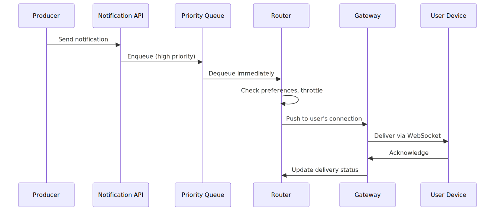
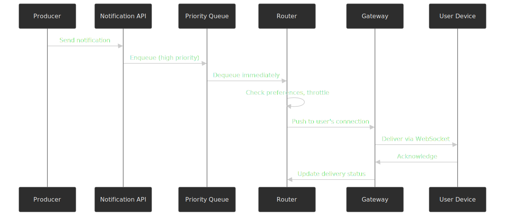
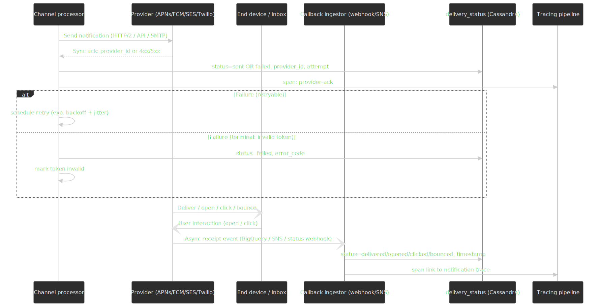
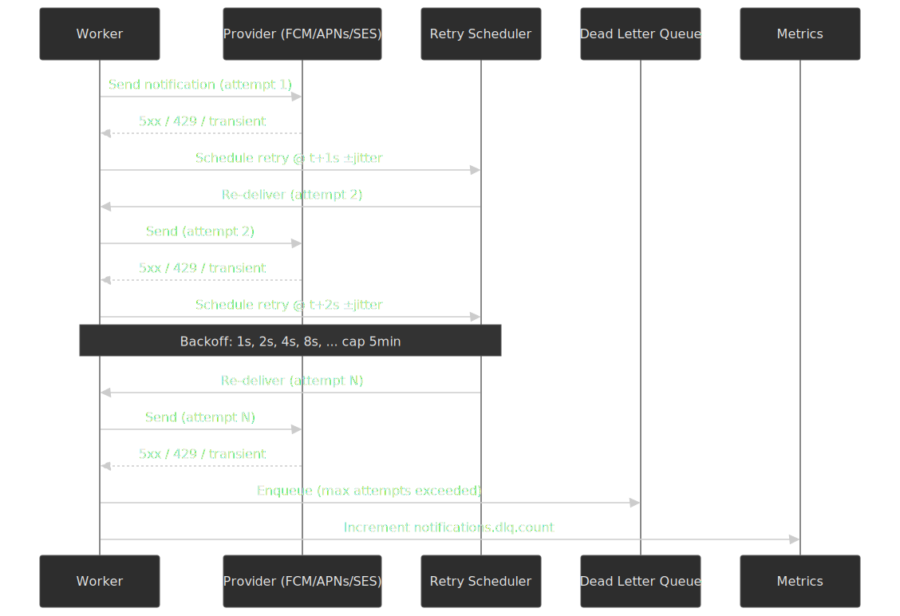

# Design a Notification System

A notification platform sits between every product surface that needs to interrupt a user — security alerts, transactional confirmations, social signals, marketing — and three classes of opinionated downstream: device push providers ([APNs](https://developer.apple.com/documentation/usernotifications/sending-notification-requests-to-apns), [FCM](https://firebase.google.com/docs/cloud-messaging), [Web Push](https://datatracker.ietf.org/doc/html/rfc8030)), email transports, and SMS carriers. Each downstream has its own rate limits, error semantics, and reputation rules. The platform's job is to absorb bursty producer traffic, respect per-user preferences and quiet hours, deduplicate, retry, and converge on a single coherent delivery — without becoming the reason a user uninstalls the app.

This article is a deep design pass for a senior engineer who needs to either build that platform from scratch or reason about an existing one. It assumes you are comfortable with Kafka partitioning, Cassandra time-series modeling, Redis primitives, and at-least-once semantics; it spends its weight where the non-obvious failure modes live: fan-out at the producer boundary, priority inversion, deduplication windows, channel fallback, aggregation, and the operational reality of FCM/APNs at scale.

: producers publish to the notification API; validation and enrichment write into Kafka and per-priority queues.")


: the router applies preferences and throttling; channel processors hand off to APNs, FCM, SMTP, and Twilio.")


## Mental model

Notification systems solve three interlocking problems:

1. **Reliable delivery** — a notification accepted at the API edge must eventually reach the device, or end up explicitly dropped with a recorded reason. Exactly-once is unattainable across heterogeneous downstreams; the practical contract is **at-least-once with idempotent consumers** ([Twilio Segment, "Delivering billions of messages exactly once"](https://www.twilio.com/en-us/blog/insights/exactly-once-delivery)).
2. **User respect** — preferences, quiet hours, frequency caps, and aggregation. Brands that manage frequency see materially longer customer lifetimes ([Braze on frequency capping](https://www.braze.com/resources/articles/whats-frequency-capping)); the platform owns the cross-channel cap.
3. **Channel optimization** — pick the right channel for the message at the right time. APNs, FCM, SMTP, and SMS each have distinct latency, cost, deliverability, and rate-limit profiles ([FCM throttling and quotas](https://firebase.google.com/docs/cloud-messaging/throttling-and-quotas), [APNs provider API](https://developer.apple.com/documentation/usernotifications/sending-notification-requests-to-apns)).

**Core architectural decisions:**

| Decision           | Choice                                       | Rationale                                                                                              |
| ------------------ | -------------------------------------------- | ------------------------------------------------------------------------------------------------------ |
| Delivery guarantee | At-least-once + idempotent consumers         | Exactly-once is impractical across APNs/FCM/SMTP/SMS; deduplicate at the consumer.                     |
| Queue partitioning | By `user_id`                                 | Co-locates a user's notifications for rate limiting, aggregation, and ordering inside the partition.   |
| Priority handling  | Separate topic per priority                  | Critical notifications bypass backlog from bulk sends and survive head-of-line blocking.               |
| Channel selection  | User preference, then fallback chain         | Respect explicit choice; ensure delivery for `critical` regardless of channel preference.              |
| Rate limiting      | Token bucket per user per channel            | Allows controlled bursts without exceeding long-term cap; matches provider 429 semantics.              |
| Template rendering | At ingestion                                 | Freezes content at send so deduplication, retries, and audit logs reference the same payload.          |

**Trade-offs you accept by adopting this shape:**

- Higher per-event latency from preference and dedup lookups in exchange for user control.
- Storage overhead for a deduplication window (hours to days) plus delivery-status fan-out.
- Multiple channel processors instead of one delivery loop — more code, more isolation.
- At-least-once means clients must tolerate occasional duplicates.

## Requirements

### Functional requirements

| Requirement            | Priority | Notes                                                          |
| ---------------------- | -------- | -------------------------------------------------------------- |
| Multi-channel delivery | Core     | Push (iOS/Android/Web), email, SMS, in-app.                    |
| User preferences       | Core     | Opt-in/out per category and per channel.                       |
| Template management    | Core     | Variable substitution, locale, version history.                |
| Scheduling             | Core     | Immediate, scheduled, timezone-aware delivery.                 |
| Delivery tracking      | Core     | `accepted` → `sent` → `delivered` → `opened` / `clicked`.      |
| Rate limiting          | Core     | User-level and channel-level throttling.                       |
| Retry and fallback     | Core     | Bounded retries with exponential backoff; channel fallback.    |
| Notification history   | Extended | Queryable per-user log for product surface and support.        |
| Batching/aggregation   | Extended | Collapse similar notifications ("5 new likes").                |
| Quiet hours            | Extended | Per-user do-not-disturb windows in user-local timezone.        |

### Non-functional requirements

| Requirement                 | Target                            | Rationale                                                              |
| --------------------------- | --------------------------------- | ---------------------------------------------------------------------- |
| Availability                | 99.99% (4 nines)                  | Notifications are critical for engagement and security workflows.      |
| Delivery latency (critical) | p99 < 500 ms (server-side)        | Time-sensitive alerts (security, transactions) must feel synchronous. |
| Delivery latency (normal)   | p99 < 5 s (server-side)           | Acceptable for social and promotional traffic.                         |
| Throughput                  | 1M notifications/sec peak         | Consumer-scale enterprise (Uber, LinkedIn, Slack tier).                |
| Deduplication window        | 24–48 hours (per producer SLA)    | Balances storage vs. duplicate prevention; longer is fine if storage allows. |
| Delivery rate               | > 99.9% (after retries)           | After bounded retries and channel fallback.                            |

> [!NOTE]
> Server-side delivery latency only measures up to the provider acknowledgement. Actual on-device delivery depends on the carrier (SMS), the OS power state (push), and the user's mail client (email) and is outside our control.

### Scale estimation

**Users:**

- Monthly active users: 100M.
- Daily active users: 40M (40% of MAU).
- Devices per user: 2 (mobile + web).
- Push tokens to manage: ~200M.

**Traffic:**

- Notifications per active user per day: 25 (mix of transactional and engagement).
- Daily volume: 40M × 25 = 1B notifications/day.
- Average rate: 1B / 86 400 ≈ 12K notifications/sec.
- Peak (3× average): ~36K notifications/sec.
- Burst events (flash sales, breaking news): 100K+ notifications/sec.

**Storage:**

- Notification record: ~500 B (metadata, status, timestamps).
- Daily storage: 1B × 500 B = 500 GB/day.
- 90-day retention: ~45 TB.
- Deduplication cache: 48-hour window × 1B × 32 B key ≈ 64 GB hot working set.

**External provider capacity:**

- **FCM HTTP v1**: default quota 600 000 messages per minute per Firebase project (roughly 10K/sec sustained), enforced by a one-minute token bucket; overflow returns `HTTP 429 RESOURCE_EXHAUSTED` ([Firebase: throttling and quotas](https://firebase.google.com/docs/cloud-messaging/throttling-and-quotas)).
- **APNs**: no published numeric rate limit; Apple throttles or `GOAWAY`s connections that exhibit abusive patterns and recommends keeping persistent HTTP/2 connections to a minimum ([APNs provider API](https://developer.apple.com/documentation/usernotifications/sending-notification-requests-to-apns)).
- **Amazon SES**: account-level send rate is adjustable through Service Quotas and ramps with reputation; sandbox accounts are capped at 1 message/sec and 200/24h. Dedicated IPs auto-warm over a 45-day schedule ([SES sending quotas](https://docs.aws.amazon.com/ses/latest/dg/quotas.html), [Dedicated IP warming](https://docs.aws.amazon.com/ses/latest/dg/dedicated-ip-warming.html)).
- **Twilio SMS**: short codes default to 100 MPS; A2P 10DLC long-code throughput varies by Brand Trust Score, from ~12 SMS MPS (low trust) to ~225 SMS MPS (high trust) across major US carriers ([Twilio: A2P 10DLC throughput](https://help.twilio.com/articles/1260803225669-Message-throughput-MPS-and-Trust-Scores-for-A2P-10DLC-in-the-US)).

> [!IMPORTANT]
> Provider quotas are not symmetric across carriers, regions, or product tiers. Treat them as policy variables loaded at runtime, not constants in code.

## Design paths

There are three defensible base architectures. Real systems converge on a hybrid of all three; understanding the pure forms makes the trade-offs explicit.

### Path A: Push-based (real-time first)

Best when sub-second in-app latency is the primary constraint and your platform already maintains persistent connections to clients.




**Key characteristics:**

- Persistent connections (WebSocket / SSE / gRPC bidi) terminate at a stateful gateway.
- The gateway maintains a `connection → user_id` mapping so the router can address a user without going through APNs/FCM.
- Direct delivery for in-app traffic; APNs/FCM still required for background/closed-app delivery.

**Trade-offs:**

- Lowest in-app latency (often < 100 ms).
- No external provider cost for in-app traffic.
- Bidirectional channel for read/clear acknowledgements.
- Connection management is non-trivial — load-balancing sticky-session traffic, recovering after gateway restarts, and coalescing reconnect storms ([Uber RAMEN gRPC migration](https://www.uber.com/us/en/blog/ubers-next-gen-push-platform-on-grpc/)).
- Higher infrastructure cost from carrying persistent connections.

**Reference implementation:** Uber's RAMEN platform sustains roughly **1.5M concurrent connections** and processes hundreds of thousands of messages per second over **gRPC bidirectional streaming** after migrating from SSE ([Uber engineering: next-gen push platform on gRPC](https://www.uber.com/us/en/blog/ubers-next-gen-push-platform-on-grpc/)). The earlier SSE implementation handled 600K connections and ~250K messages/sec ([Uber: real-time push platform](https://www.uber.com/blog/real-time-push-platform/)).

### Path B: Queue-based (reliability first)

Best when delivery guarantee dominates latency and you need a strong audit trail.




**Key characteristics:**

- All notifications flow through a durable log (Kafka, Pulsar, or NATS JetStream).
- Workers consume at their own pace, with built-in retry and a dead-letter queue.
- Kafka retention is the audit trail.

**Trade-offs:**

- Strong delivery guarantee — no message lost on a worker crash.
- Excellent burst absorption — the queue is the buffer.
- Higher per-event latency (queue hop overhead, batching).
- Ordering is only guaranteed inside a partition ([Apache Kafka docs](https://kafka.apache.org/documentation/#intro_concepts_and_terms)); cross-partition ordering requires application-level sequencing.
- Risk of notification storms after recovery — long backlogs can replay all at once and overwhelm downstream providers.

**Reference implementation:** Slack runs notification delivery on Kafka-backed pipelines with 100% trace coverage per notification, treating each `notification_id` as a `trace_id` and using span links to connect the originating message to all downstream notifications ([Slack engineering: tracing notifications](https://slack.engineering/tracing-notifications/)).

### Path C: Hybrid (tiered by priority)

Best when notification mix is heterogeneous — some traffic is time-critical, most is bulk.




**Key characteristics:**

- Priority classified at ingestion based on category.
- Each priority has its own topic, partition count, worker pool, and SLA.
- Bulk traffic batches and is allowed to defer to off-peak windows.

**Trade-offs:**

- Optimal latency for critical traffic at acceptable cost for bulk.
- Predictable per-tier SLAs — operators can scale per-priority workers independently.
- More code paths and configuration to maintain.
- Risk of priority inversion under contention if the priority classifier is wrong or shared resources (Redis, dedup store) are saturated.

**Reference implementation:** Netflix's [RENO](https://www.infoq.com/news/2022/03/netflix-reno/) (Rapid Event Notification System) uses priority-segmented Amazon SQS queues with dedicated compute clusters per priority and a hybrid push (Zuul Push) plus pull (Cassandra-backed history) delivery model — the segmentation contains failures so a slow path does not block a fast one.

### Path comparison

| Factor                | Push-based  | Queue-based | Hybrid       |
| --------------------- | ----------- | ----------- | ------------ |
| Latency (critical)    | < 100 ms    | 500 ms–2 s  | < 100 ms     |
| Latency (bulk)        | Same as critical | Same as critical | Flexible (off-peak) |
| Reliability           | Good        | Excellent   | Excellent    |
| Burst absorption      | Limited     | Excellent   | Excellent    |
| Infrastructure cost   | High        | Medium      | Medium-high  |
| Operational complexity| High        | Medium      | Highest      |
| Production reference  | Uber RAMEN  | Slack       | Netflix RENO |

### What this article designs

The rest of the article designs **Path C (Hybrid)** end-to-end, because:

1. It reflects what production systems at scale converge to (Netflix, LinkedIn, Pinterest).
2. It forces you to make the priority and trade-off thinking explicit.
3. It handles the real notification mix — security alerts to weekly digests — without two separate systems.
4. The pure-push and pure-queue paths fall out as degenerate cases.

## High-level design

### Component overview

**Ingress and queueing:**




**Routing, delivery, and storage:**




### Notification API

The producer-facing surface. Validates, enriches, and routes to the correct priority topic.

**Responsibilities:**

- Authenticate the producer (mTLS or signed JWT).
- Validate the request against the template's variable schema.
- Resolve the template to its current version and render at ingestion.
- Look up the user's preferences and current device tokens.
- Classify priority and route to the matching topic, keyed by `user_id`.

**Design decisions:**

| Decision           | Choice                                | Rationale                                                       |
| ------------------ | ------------------------------------- | --------------------------------------------------------------- |
| API style          | REST with `202 Accepted`              | Producers fire-and-forget; status is queryable / webhook-pushed.|
| Idempotency        | Producer-supplied `notificationId`    | Enables safe producer retries; drives downstream dedup.         |
| Batching           | Up to 1 000 recipients per request    | Reduces API overhead for bulk sends without losing per-recipient addressability. |
| Template rendering | At ingestion (not at send)            | Freezes content; downstream can replay, dedup, and audit identical payloads. |

### Template service

Manages multi-channel templates with variable substitution, locale, and version history.

```typescript title="template.ts"
interface NotificationTemplate {
  templateId: string
  name: string
  category: "transactional" | "marketing" | "system"
  channels: {
    push?: {
      title: string // "Your order {{orderId}} has shipped"
      body: string // "Track your package: {{trackingUrl}}"
      data?: Record<string, string>
    }
    email?: {
      subject: string
      htmlBody: string
      textBody: string
    }
    sms?: {
      body: string // Max 160 chars for single GSM-7 segment
    }
  }
  variables: VariableDefinition[]
  defaultLocale: string
  translations: Record<string, ChannelContent>
}
```

**Design decisions:**

- Templates stored in PostgreSQL; render-path Redis cache with a 5-minute TTL.
- Variable schema validated at template creation so runtime substitution cannot fail silently.
- Versioned table for rollback; the rendered payload records the version it used.
- Variants registered for A/B tests; the variant assignment lives in the rendered payload.

### Preference service

Per-user notification preferences with channel-level and category-level granularity.

```typescript title="preferences.ts"
interface UserPreferences {
  userId: string
  globalEnabled: boolean
  quietHours?: {
    enabled: boolean
    start: string // "22:00"
    end: string // "07:00"
    timezone: string // IANA TZ identifier, e.g. "America/New_York"
  }
  channels: {
    push: ChannelPreference
    email: ChannelPreference
    sms: ChannelPreference
    inApp: ChannelPreference
  }
  categories: {
    [category: string]: {
      enabled: boolean
      channels: string[] // overrides global channel prefs for this category
      frequency?: "immediate" | "daily_digest" | "weekly_digest"
    }
  }
}

interface ChannelPreference {
  enabled: boolean
  frequency?: FrequencyLimit // e.g. { maxPerHour: 5, maxPerDay: 20 }
}
```

**Storage strategy:**

- Hot path: Redis hash keyed on `prefs:{user_id}`, 1-hour TTL, refreshed write-through.
- Canonical: PostgreSQL with append-only audit history (compliance and debugging).
- Cache invalidation is write-through; explicit purges happen on PATCH.

**Resolution cascade (router-side):**




The cascade is short-circuit: the first `disabled` decision wins, and per-channel decisions are independent — opting out of `email` for the `marketing` category does not affect the same category's `push`. Drops record a structured reason (`global_off`, `category_off`, `channel_off`, `frequency_capped`) so the analytics pipeline can attribute "not delivered" to user choice rather than infrastructure failure.

### Device registry

Maintains push tokens per user, per device.

```typescript title="device-token.ts"
interface DeviceToken {
  userId: string
  deviceId: string
  platform: "ios" | "android" | "web"
  token: string
  tokenType: "apns" | "fcm" | "web_push"
  appVersion: string
  lastSeen: Date
  createdAt: Date
  updatedAt: Date
  status: "active" | "stale" | "invalid"
}
```

**Token lifecycle:**




| Event                              | Action                                  |
| ---------------------------------- | --------------------------------------- |
| App install                        | Register new token.                     |
| App launch                         | Refresh token if older than 7 days.     |
| Token refresh callback             | Update token; mark previous invalid.    |
| Delivery returns `UNREGISTERED`/404 | Mark token invalid immediately.        |
| 30 days inactive                   | Mark token stale (deprioritize).        |
| 270 days inactive (Android FCM)    | Token is automatically expired by FCM and subsequent sends return `UNREGISTERED` ([FCM: manage tokens](https://firebase.google.com/docs/cloud-messaging/manage-tokens)). |

> [!TIP]
> Track FCM's `droppedDeviceInactive` and `droppedTooManyPendingMessages` metrics — exposed via the Firebase BigQuery export — to detect token-base rot and aggressive collapse-key replacement before they erode delivery rate.

### Router service

The orchestration layer that turns a "ready-to-send" notification into one or more provider calls.




The gates are ordered cheapest-rejection-first so we waste the least work on traffic that will be dropped:

1. **Deduplication** — `SETNX dedup:{user_id}:{notification_id}` against Redis.
2. **Preference** — is the user opted in for this category and any channel?
3. **Quiet hours** — is the user in their DND window? Critical bypasses.
4. **Rate limit** — does the user have tokens left for this channel?
5. **Aggregation** — does this match an open digest window?
6. **Channel selection** — apply preference + fallback rules.
7. **Dispatch** — push to the per-channel processor topics.

### Channel processors

One independent worker pool per channel. Isolation matters: an SES outage must not block APNs throughput.

**Push processor:**

- Maintains long-lived HTTP/2 connections to APNs and FCM.
- Token-based auth (JWT) for APNs; service-account auth for FCM.
- Respects FCM's 600 K-tokens-per-minute quota with a local token bucket and exponential backoff on 429 ([FCM throttling and quotas](https://firebase.google.com/docs/cloud-messaging/throttling-and-quotas)).
- Maps provider error codes to retry / drop / mark-invalid actions.

**Email processor:**

- Manages sender reputation and IP warm-up (45-day curve for SES dedicated IPs).
- Handles bounces (hard / soft) and complaints; auto-suppresses repeat offenders.
- Implements **RFC 8058 one-click unsubscribe** with `List-Unsubscribe` and `List-Unsubscribe-Post: List-Unsubscribe=One-Click` headers, required for senders >5 000 messages/day to Gmail and Yahoo since Feb 2024 ([Gmail: email sender guidelines](https://support.google.com/a/answer/81126), [RFC 8058](https://datatracker.ietf.org/doc/html/rfc8058)).
- Tracks open and click events via a tracking pixel and signed redirect URLs.

**SMS processor:**

- Routes to the appropriate sender type (short code, long code, or toll-free).
- Splits messages > 160 GSM-7 chars into concatenated segments with the appropriate UDH headers.
- Honors STOP keyword opt-outs (carrier-mandated in the US).
- Throttles to the carrier's MPS — 100 MPS per short code, variable for A2P 10DLC.

**In-app processor:**

- Delivers via WebSocket for connected clients.
- Falls back to a `/notifications` polling endpoint plus `lastSeen` cursor for disconnected clients.
- Aggregates badge counts and read/unread state.

### Delivery receipts

Provider acknowledgement is a two-phase contract: a synchronous ack on the send call ("we accepted the message") and an asynchronous receipt ("we delivered / the user opened it / it bounced"). Both phases must reconcile back into the same `delivery_status` row keyed by `notification_id`.

 back into the same row.")


| Channel | Sync ack source | Async receipt source |
| ------- | --------------- | -------------------- |
| FCM     | HTTP v1 send response (`messageId` or error code) | Firebase BigQuery delivery export (`delivery_attempted`, `delivered`, `dropped_*`) ([FCM message delivery](https://firebase.google.com/docs/cloud-messaging/understand-delivery)). |
| APNs    | HTTP/2 response status + `apns-id` | No per-message delivery receipt — Apple does not expose device-side ack to providers; rely on app-side analytics for "opened". |
| SES     | SendEmail API response (`MessageId`) | SNS topic events: `Delivery`, `Bounce`, `Complaint`, `Open`, `Click` ([SES event publishing](https://docs.aws.amazon.com/ses/latest/dg/monitor-using-event-publishing.html)). |
| Twilio  | REST API response with `sid` and initial status | Status callback URL: `queued` → `sent` → `delivered` / `failed` / `undelivered` ([Twilio status callbacks](https://www.twilio.com/docs/messaging/guides/track-outbound-message-status)). |

The callback ingestor is its own service so a callback storm (e.g., a bounce surge) cannot back-pressure the channel processors. Callbacks are idempotent on `(notification_id, channel, device_id, status)` because providers retry their webhooks freely.

## API design

### Send notification

**`POST /api/v1/notifications`**

```json title="POST /api/v1/notifications request"
{
  "notificationId": "uuid-client-generated",
  "templateId": "order_shipped",
  "recipients": [
    {
      "userId": "user_123",
      "variables": {
        "orderId": "ORD-456",
        "trackingUrl": "https://track.example.com/ORD-456"
      }
    }
  ],
  "priority": "high",
  "channels": ["push", "email"],
  "options": {
    "ttl": 86400,
    "collapseKey": "order_update_ORD-456",
    "scheduledAt": null
  }
}
```

```json title="202 Accepted response"
{
  "requestId": "req_abc123",
  "notificationId": "uuid-client-generated",
  "status": "accepted",
  "recipientCount": 1,
  "estimatedDelivery": "2026-04-21T10:00:05Z"
}
```

| Code | Error                    | When                                    |
| ---- | ------------------------ | --------------------------------------- |
| 400  | `INVALID_TEMPLATE`       | Template missing or variables fail schema validation. |
| 400  | `INVALID_RECIPIENT`      | User ID not found in identity service.  |
| 409  | `DUPLICATE_NOTIFICATION` | `notificationId` already processed inside dedup window. |
| 429  | `RATE_LIMITED`           | Producer-level rate limit exceeded.      |

### Bulk send

**`POST /api/v1/notifications/bulk`**

```json title="POST /api/v1/notifications/bulk request"
{
  "notificationId": "bulk_uuid",
  "templateId": "weekly_digest",
  "recipientQuery": {
    "segment": "active_users_7d",
    "excludeOptedOut": true
  },
  "priority": "low",
  "channels": ["email"],
  "options": {
    "spreadOverMinutes": 60,
    "respectQuietHours": true
  }
}
```

`spreadOverMinutes` is the platform's protection against burst-send anti-patterns: large segments are scheduled to deliver evenly across the window so SES, FCM, and downstream queues don't see a vertical wall of traffic.

### Get notification status

**`GET /api/v1/notifications/{notificationId}/status`**

```json title="status response"
{
  "notificationId": "uuid",
  "status": "delivered",
  "recipients": [
    {
      "userId": "user_123",
      "channels": {
        "push": {
          "status": "delivered",
          "deliveredAt": "2026-04-21T10:00:02Z",
          "openedAt": "2026-04-21T10:05:00Z"
        },
        "email": {
          "status": "sent",
          "sentAt": "2026-04-21T10:00:03Z",
          "openedAt": null
        }
      }
    }
  ]
}
```

### User preferences

**`GET /api/v1/users/{userId}/preferences`**

```json title="preferences response"
{
  "userId": "user_123",
  "globalEnabled": true,
  "quietHours": {
    "enabled": true,
    "start": "22:00",
    "end": "07:00",
    "timezone": "America/New_York"
  },
  "channels": {
    "push": { "enabled": true },
    "email": { "enabled": true, "frequency": { "maxPerDay": 10 } },
    "sms": { "enabled": false }
  },
  "categories": {
    "marketing": { "enabled": false },
    "order_updates": { "enabled": true, "channels": ["push", "email"] },
    "security": { "enabled": true, "channels": ["push", "sms", "email"] }
  }
}
```

**`PATCH /api/v1/users/{userId}/preferences`** — partial update; the patch is applied with optimistic locking and an audit row is appended on every change.

### Device registration

**`POST /api/v1/devices`**

```json title="device registration request"
{
  "userId": "user_123",
  "deviceId": "device_abc",
  "platform": "ios",
  "token": "apns_token_xyz",
  "appVersion": "3.2.1"
}
```

### Notification history

**`GET /api/v1/users/{userId}/notifications?limit=50&cursor=xxx`** — cursor-paginated listing for the user's notification surface.

## Data modeling

### Notification record (Cassandra)

Cassandra is a strong fit for the notification log: high write volume, time-series access pattern, and per-user TTL. The partition key includes a time bucket so partitions stay below the recommended ~100 MB ceiling ([DataStax: data modeling best practices](https://docs.datastax.com/en/cql/hcd/data-modeling/best-practices.html)).

```sql title="notifications table"
CREATE TABLE notifications (
    user_id UUID,
    bucket DATE,           -- daily bucket; bound partition size for power users
    created_at TIMESTAMP,
    notification_id UUID,
    template_id TEXT,
    priority TEXT,
    content FROZEN<notification_content>,
    channels SET<TEXT>,
    status TEXT,
    delivery_attempts INT,
    PRIMARY KEY ((user_id, bucket), created_at, notification_id)
) WITH CLUSTERING ORDER BY (created_at DESC, notification_id ASC)
  AND default_time_to_live = 7776000  -- 90 days
  AND compaction = { 'class': 'TimeWindowCompactionStrategy',
                     'compaction_window_unit': 'DAYS',
                     'compaction_window_size': 1 };

CREATE TYPE notification_content (
    title TEXT,
    body TEXT,
    data MAP<TEXT, TEXT>,
    image_url TEXT
);

-- Direct lookup by notification_id (for status endpoint)
CREATE TABLE notifications_by_id (
    notification_id UUID PRIMARY KEY,
    user_id UUID,
    bucket DATE,
    created_at TIMESTAMP,
    template_id TEXT,
    priority TEXT,
    content FROZEN<notification_content>,
    channels SET<TEXT>,
    status TEXT
);
```

> [!IMPORTANT]
> Without the `bucket` partition component, a power-user partition grows unbounded and TWCS compaction stops being effective. Pick the bucket size (hour vs day) so the largest expected partition stays under ~100 MB.

### Delivery status (Cassandra)

```sql title="delivery_status table"
CREATE TABLE delivery_status (
    notification_id UUID,
    channel TEXT,
    user_id UUID,
    device_id TEXT,
    status TEXT,        -- queued, sent, delivered, failed, opened, clicked
    provider_id TEXT,   -- APNs message ID, SES message ID, etc.
    error_code TEXT,
    error_message TEXT,
    timestamp TIMESTAMP,
    PRIMARY KEY ((notification_id), channel, device_id)
);

-- Time-bucketed retry index
CREATE TABLE failed_deliveries (
    retry_bucket INT,   -- hour bucket; bound the per-bucket scan size
    notification_id UUID,
    channel TEXT,
    user_id UUID,
    attempt_count INT,
    last_error TEXT,
    next_retry_at TIMESTAMP,
    PRIMARY KEY ((retry_bucket), next_retry_at, notification_id)
) WITH CLUSTERING ORDER BY (next_retry_at ASC);
```

### User preferences (PostgreSQL)

```sql title="user_preferences table"
CREATE TABLE user_preferences (
    user_id UUID PRIMARY KEY,
    global_enabled BOOLEAN DEFAULT true,
    quiet_hours JSONB,   -- {"enabled":true,"start":"22:00","end":"07:00","tz":"America/New_York"}
    channel_prefs JSONB,
    category_prefs JSONB,
    created_at TIMESTAMPTZ DEFAULT NOW(),
    updated_at TIMESTAMPTZ DEFAULT NOW()
);

CREATE TABLE preference_history (
    id BIGSERIAL PRIMARY KEY,
    user_id UUID NOT NULL,
    changed_at TIMESTAMPTZ DEFAULT NOW(),
    change_type TEXT,    -- 'opt_in', 'opt_out', 'update'
    old_value JSONB,
    new_value JSONB,
    source TEXT          -- 'user', 'system', 'compliance'
);

CREATE INDEX idx_pref_history_user ON preference_history(user_id, changed_at DESC);
```

### Device tokens (PostgreSQL + Redis)

```sql title="device_tokens table"
CREATE TABLE device_tokens (
    device_id TEXT PRIMARY KEY,
    user_id UUID NOT NULL,
    platform TEXT NOT NULL,
    token TEXT NOT NULL,
    token_type TEXT NOT NULL,
    app_version TEXT,
    last_seen TIMESTAMPTZ,
    status TEXT DEFAULT 'active',
    created_at TIMESTAMPTZ DEFAULT NOW(),
    updated_at TIMESTAMPTZ DEFAULT NOW()
);

CREATE INDEX idx_tokens_user ON device_tokens(user_id);
CREATE INDEX idx_tokens_status ON device_tokens(status) WHERE status = 'active';
```

```redis title="Redis cache structure"
# User's active tokens (set)
SADD user:tokens:{user_id} {device_id_1} {device_id_2}

# Token details (hash)
HSET token:{device_id}
    user_id "user_123"
    platform "ios"
    token "apns_xyz"
    token_type "apns"
    status "active"

# Liveness marker (TTL drives stale-detection job)
SETEX token:active:{device_id} 2592000 "1"  # 30 days
```

### Templates (PostgreSQL)

```sql title="notification_templates tables"
CREATE TABLE notification_templates (
    template_id TEXT PRIMARY KEY,
    name TEXT NOT NULL,
    category TEXT NOT NULL,
    channels JSONB NOT NULL,
    variables JSONB,
    default_locale TEXT DEFAULT 'en',
    is_active BOOLEAN DEFAULT true,
    created_at TIMESTAMPTZ DEFAULT NOW(),
    updated_at TIMESTAMPTZ DEFAULT NOW(),
    version INT DEFAULT 1
);

CREATE TABLE template_translations (
    template_id TEXT REFERENCES notification_templates(template_id),
    locale TEXT,
    channels JSONB NOT NULL,
    PRIMARY KEY (template_id, locale)
);

CREATE TABLE template_versions (
    template_id TEXT,
    version INT,
    channels JSONB NOT NULL,
    created_at TIMESTAMPTZ DEFAULT NOW(),
    created_by TEXT,
    PRIMARY KEY (template_id, version)
);
```

### Database selection matrix

| Data type        | Store              | Rationale                                                |
| ---------------- | ------------------ | -------------------------------------------------------- |
| Notifications    | Cassandra          | Time-series, high write volume, native TTL.              |
| Delivery status  | Cassandra          | High write volume, time-bucketed scan for retry.         |
| User preferences | PostgreSQL + Redis | ACID for changes, cached for hot reads.                  |
| Device tokens    | PostgreSQL + Redis | Relational queries; cached for delivery hot path.        |
| Templates        | PostgreSQL         | Low volume; needs version history and constraints.       |
| Deduplication    | Redis              | TTL semantics, atomic SETNX, sub-millisecond lookups.    |
| Rate limits      | Redis              | Atomic INCR, sliding windows via Lua scripts.            |
| Analytics        | ClickHouse         | Columnar aggregations across billions of records.        |

## Low-level design

### Deduplication service

The dedup window is the most expensive Redis working set after rate limits. Use Bloom filters as a fast "definitely not duplicate" check before falling back to authoritative `SETNX`.

```typescript title="DeduplicationService" collapse={1-10}
class DeduplicationService {
  private readonly redis: RedisCluster
  private readonly DEDUP_TTL = 172800 // 48 hours in seconds

  async isDuplicate(userId: string, notificationId: string): Promise<boolean> {
    const key = `dedup:${userId}:${notificationId}`

    // SETNX returns 1 if key was set (not duplicate), 0 if exists (duplicate)
    const result = await this.redis.set(key, "1", {
      NX: true,
      EX: this.DEDUP_TTL,
    })

    return result === null // null means key existed (duplicate)
  }

  async checkBloomFilter(userId: string, notificationId: string): Promise<boolean> {
    const key = `bloom:dedup:${userId}`
    return await this.redis.bf.exists(key, notificationId)
  }
}
```

> [!NOTE]
> Twilio Segment runs an analogous design at much larger scale — 60 billion keys in 1.5 TB of RocksDB with a 4-week dedup window after processing 200 billion messages ([Twilio Segment: exactly-once delivery](https://www.twilio.com/en-us/blog/insights/exactly-once-delivery)). If your dedup working set exceeds Redis economics, that's the migration path.

### Rate limiter

Token bucket per `(user_id, channel)` is the right default for notifications because legitimate user activity is bursty (a checkout flow can fire 3–5 notifications back-to-back) but the long-term cap must hold ([Stripe: scaling your API with rate limiters](https://stripe.com/blog/rate-limiters)).

```typescript title="RateLimiter" collapse={1-12}
interface RateLimitConfig {
  channel: string
  maxPerHour: number
  maxPerDay: number
}

class RateLimiter {
  private readonly redis: RedisCluster

  async checkAndConsume(
    userId: string,
    channel: string,
    config: RateLimitConfig,
  ): Promise<{ allowed: boolean; retryAfter?: number }> {
    const hourKey = `ratelimit:${userId}:${channel}:hour:${this.getCurrentHour()}`
    const dayKey = `ratelimit:${userId}:${channel}:day:${this.getCurrentDay()}`

    // Lua for atomic check-and-increment with rollback on overflow
    const result = await this.redis.eval(
      `
      local hourCount = redis.call('INCR', KEYS[1])
      if hourCount == 1 then
        redis.call('EXPIRE', KEYS[1], 3600)
      end

      local dayCount = redis.call('INCR', KEYS[2])
      if dayCount == 1 then
        redis.call('EXPIRE', KEYS[2], 86400)
      end

      if hourCount > tonumber(ARGV[1]) then
        redis.call('DECR', KEYS[1])
        return {0, 3600 - redis.call('TTL', KEYS[1])}
      end

      if dayCount > tonumber(ARGV[2]) then
        redis.call('DECR', KEYS[1])
        redis.call('DECR', KEYS[2])
        return {0, 86400 - redis.call('TTL', KEYS[2])}
      end

      return {1, 0}
    `,
      [hourKey, dayKey],
      [config.maxPerHour, config.maxPerDay],
    )

    return {
      allowed: result[0] === 1,
      retryAfter: result[1] > 0 ? result[1] : undefined,
    }
  }
}
```

**Channel-specific provider caps to track separately from per-user caps:**

| Channel      | Provider cap                                       | Enforcement                                  |
| ------------ | -------------------------------------------------- | -------------------------------------------- |
| FCM          | 600K messages/min per project ([throttling docs](https://firebase.google.com/docs/cloud-messaging/throttling-and-quotas)) | Local token bucket; exponential backoff on 429. |
| APNs         | No published numeric cap; throttles abuse          | Watch for 429, `GOAWAY`, and `SHUTDOWN` reasons; back off per stream. |
| SES          | Account-specific, adjustable; sandbox 1/sec        | Read current quota from Service Quotas API on startup. |
| SMS (Twilio) | 100 MPS short code; 12–225 SMS MPS for 10DLC       | Per-sender queue with rate-limited consumer. |

### Notification aggregator

Collapses similar notifications into a digest within a configurable window. Knock describes two implementation patterns — **batch-on-write** (open a buffer keyed by recipient + collapse key when the first event arrives, flush at the end of the window) and **batch-on-read** (periodic cron scans for unsent notifications and groups them) ([Knock: building a batched notification engine](https://knock.app/blog/building-a-batched-notification-engine)). The implementation below is batch-on-write, which scales better with sustained load.

```typescript title="NotificationAggregator" collapse={1-15}
interface AggregationRule {
  category: string
  collapseKey: string // template, e.g., "likes_{postId}"
  windowSeconds: number
  minCount: number
  maxCount: number
  digestTemplate: string // "{{count}} people liked your post"
}

class NotificationAggregator {
  private readonly redis: RedisCluster

  async shouldAggregate(
    userId: string,
    notification: Notification,
    rule: AggregationRule,
  ): Promise<{ aggregate: boolean; pending: Notification[] }> {
    const collapseKey = this.renderCollapseKey(rule.collapseKey, notification)
    const bufferKey = `agg:${userId}:${collapseKey}`

    await this.redis.rpush(bufferKey, JSON.stringify(notification))
    await this.redis.expire(bufferKey, rule.windowSeconds)

    const count = await this.redis.llen(bufferKey)

    if (count >= rule.maxCount) {
      const pending = await this.flushBuffer(bufferKey)
      return { aggregate: true, pending }
    }

    if (count >= rule.minCount) {
      await this.scheduleFlush(userId, collapseKey, rule.windowSeconds)
    }

    return { aggregate: false, pending: [] }
  }

  async createDigest(notifications: Notification[], rule: AggregationRule): Promise<Notification> {
    const count = notifications.length
    const actors = [...new Set(notifications.map((n) => n.actorId))].slice(0, 3)

    return {
      ...notifications[0],
      content: {
        title: this.renderTemplate(rule.digestTemplate, { count, actors }),
        body: `${actors[0]} and ${count - 1} others`,
      },
      metadata: {
        aggregatedCount: count,
        originalIds: notifications.map((n) => n.notificationId),
      },
    }
  }
}
```

**Common aggregation patterns:**

| Notification type | Collapse key          | Window | Digest format                       |
| ----------------- | --------------------- | ------ | ----------------------------------- |
| Post likes        | `likes_{postId}`      | 5 min  | "John and 5 others liked your post" |
| New followers     | `followers_{userId}`  | 1 hour | "6 new followers today"             |
| Comment replies   | `replies_{commentId}` | 10 min | "3 new replies to your comment"     |

> [!TIP]
> Provider-side collapse is a *separate* mechanism from server-side aggregation. FCM's `collapse_key` (max 4 distinct keys per device, older messages replaced when the device is offline ([FCM collapsible messages](https://firebase.google.com/docs/cloud-messaging/customize-messages/collapsible-message-types))) and APNs' `apns-collapse-id` (max 64 bytes ([APNs docs](https://developer.apple.com/documentation/usernotifications/sending-notification-requests-to-apns))) replace banners on the device, not in your queue. Use both: server-side aggregation reduces volume, provider collapse cleans up the device.

### Priority router

```typescript title="PriorityRouter" collapse={1-12}
enum NotificationPriority {
  CRITICAL = "critical", // Security alerts, transaction confirmations
  HIGH = "high",         // Direct messages, mentions
  NORMAL = "normal",     // Social notifications, updates
  LOW = "low",           // Marketing, digests
}

class PriorityRouter {
  private readonly queues: Map<NotificationPriority, KafkaProducer>

  async route(notification: EnrichedNotification): Promise<void> {
    const priority = this.determinePriority(notification)
    const queue = this.queues.get(priority)

    // Partition by user_id so rate limiting and aggregation co-locate
    await queue.send({
      topic: `notifications.${priority}`,
      messages: [
        {
          key: notification.userId,
          value: JSON.stringify(notification),
          headers: {
            "notification-id": notification.notificationId,
            "created-at": Date.now().toString(),
          },
        },
      ],
    })
  }

  private determinePriority(notification: EnrichedNotification): NotificationPriority {
    if (notification.category === "security") return NotificationPriority.CRITICAL
    if (notification.category === "transaction") return NotificationPriority.CRITICAL

    if (notification.category === "message") return NotificationPriority.HIGH
    if (notification.category === "mention") return NotificationPriority.HIGH

    if (notification.category === "marketing") return NotificationPriority.LOW
    if (notification.category === "digest") return NotificationPriority.LOW

    return NotificationPriority.NORMAL
  }
}
```

> [!NOTE]
> Kafka guarantees ordering only within a partition ([Apache Kafka docs](https://kafka.apache.org/documentation/#intro_concepts_and_terms)), so keying by `user_id` gives you per-user ordering across all of a user's notifications inside a single priority topic. Cross-priority ordering is not guaranteed and should not be relied on by clients.

**Per-priority queue configuration:**

| Priority | Partitions | Consumer parallelism  | Target max latency |
| -------- | ---------- | --------------------- | ------------------ |
| Critical | 50         | 50 workers            | 500 ms             |
| High     | 100        | 100 workers           | 2 s                |
| Normal   | 200        | 200 workers           | 10 s               |
| Low      | 50         | 50 workers (off-peak) | Best effort        |

### Push delivery with retry

```typescript title="PushProcessor" collapse={1-20}
interface PushDeliveryResult {
  success: boolean
  messageId?: string
  errorCode?: string
  shouldRetry: boolean
  invalidToken: boolean
}

class PushProcessor {
  private readonly fcm: FirebaseMessaging
  private readonly apns: ApnsClient
  private readonly deviceRegistry: DeviceRegistry

  async deliver(notification: Notification, device: DeviceToken): Promise<PushDeliveryResult> {
    try {
      if (device.tokenType === "fcm") {
        return await this.deliverFcm(notification, device)
      } else if (device.tokenType === "apns") {
        return await this.deliverApns(notification, device)
      }
    } catch (error) {
      return this.handleError(error, device)
    }
  }

  private async deliverFcm(notification: Notification, device: DeviceToken): Promise<PushDeliveryResult> {
    const message = {
      token: device.token,
      notification: {
        title: notification.content.title,
        body: notification.content.body,
      },
      data: notification.content.data,
      android: {
        priority: notification.priority === "critical" ? "high" : "normal",
        ttl: notification.ttl * 1000,
        collapseKey: notification.collapseKey,
      },
    }

    const response = await this.fcm.send(message)
    return { success: true, messageId: response, shouldRetry: false, invalidToken: false }
  }

  private handleError(error: any, device: DeviceToken): PushDeliveryResult {
    const errorCode = error.code

    // Invalid token — remove immediately
    if (["messaging/invalid-registration-token", "messaging/registration-token-not-registered"].includes(errorCode)) {
      this.deviceRegistry.markInvalid(device.deviceId)
      return { success: false, errorCode, shouldRetry: false, invalidToken: true }
    }

    // Rate limited — retry with backoff
    if (errorCode === "messaging/too-many-requests") {
      return { success: false, errorCode, shouldRetry: true, invalidToken: false }
    }

    // Server error — retry with backoff
    if (errorCode === "messaging/internal-error") {
      return { success: false, errorCode, shouldRetry: true, invalidToken: false }
    }

    return { success: false, errorCode, shouldRetry: false, invalidToken: false }
  }
}
```

### Retry service with exponential backoff




```typescript title="RetryService" collapse={1-15}
interface RetryConfig {
  maxAttempts: number
  baseDelayMs: number
  maxDelayMs: number
  jitterFactor: number
}

class RetryService {
  private readonly defaultConfig: RetryConfig = {
    maxAttempts: 5,
    baseDelayMs: 1000,
    maxDelayMs: 300000, // 5 minutes
    jitterFactor: 0.2,
  }

  async scheduleRetry(
    notification: Notification,
    channel: string,
    attemptCount: number,
    config: RetryConfig = this.defaultConfig,
  ): Promise<void> {
    if (attemptCount >= config.maxAttempts) {
      await this.moveToDlq(notification, channel)
      return
    }

    const delay = this.calculateDelay(attemptCount, config)
    const retryBucket = Math.floor((Date.now() + delay) / 3600000) // hour bucket

    await this.cassandra.execute(
      `
      INSERT INTO failed_deliveries (
        retry_bucket, notification_id, channel, user_id,
        attempt_count, last_error, next_retry_at
      ) VALUES (?, ?, ?, ?, ?, ?, ?)
    `,
      [
        retryBucket,
        notification.notificationId,
        channel,
        notification.userId,
        attemptCount + 1,
        notification.lastError,
        new Date(Date.now() + delay),
      ],
    )
  }

  private calculateDelay(attempt: number, config: RetryConfig): number {
    // Exponential backoff with jitter to avoid retry-storm thundering herds
    const exponentialDelay = config.baseDelayMs * Math.pow(2, attempt)
    const cappedDelay = Math.min(exponentialDelay, config.maxDelayMs)
    const jitter = cappedDelay * config.jitterFactor * Math.random()

    return Math.floor(cappedDelay + jitter)
  }

  private async moveToDlq(notification: Notification, channel: string): Promise<void> {
    await this.kafka.send({
      topic: "notifications.dlq",
      messages: [
        {
          key: notification.userId,
          value: JSON.stringify({
            notification,
            channel,
            reason: "max_retries_exceeded",
            timestamp: Date.now(),
          }),
        },
      ],
    })

    this.metrics.increment("notifications.dlq.count", {
      channel,
      category: notification.category,
    })
  }
}
```

### Quiet hours handler

```typescript title="QuietHoursHandler" collapse={1-10}
class QuietHoursHandler {
  async shouldDefer(
    userId: string,
    notification: Notification,
    preferences: UserPreferences,
  ): Promise<{ defer: boolean; deliverAt?: Date }> {
    // Critical notifications bypass quiet hours
    if (notification.priority === "critical") {
      return { defer: false }
    }

    if (!preferences.quietHours?.enabled) {
      return { defer: false }
    }

    const userNow = this.getUserLocalTime(preferences.quietHours.timezone)
    const isInQuietHours = this.isTimeInRange(userNow, preferences.quietHours.start, preferences.quietHours.end)

    if (!isInQuietHours) {
      return { defer: false }
    }

    const deliverAt = this.getQuietHoursEnd(preferences.quietHours.end, preferences.quietHours.timezone)

    return { defer: true, deliverAt }
  }

  private isTimeInRange(current: Date, start: string, end: string): boolean {
    const currentMinutes = current.getHours() * 60 + current.getMinutes()
    const [startHour, startMin] = start.split(":").map(Number)
    const [endHour, endMin] = end.split(":").map(Number)

    const startMinutes = startHour * 60 + startMin
    const endMinutes = endHour * 60 + endMin

    // Handle overnight ranges (e.g., 22:00 – 07:00)
    if (startMinutes > endMinutes) {
      return currentMinutes >= startMinutes || currentMinutes < endMinutes
    }

    return currentMinutes >= startMinutes && currentMinutes < endMinutes
  }
}
```

## Frontend considerations

### Real-time in-app notifications

```typescript title="NotificationClient" collapse={1-15}
class NotificationClient {
  private ws: WebSocket | null = null
  private reconnectAttempt = 0
  private readonly MAX_RECONNECT_DELAY = 30000

  connect(authToken: string): void {
    this.ws = new WebSocket(`wss://notifications.example.com/ws?token=${authToken}`)

    this.ws.onopen = () => {
      this.reconnectAttempt = 0
      this.syncMissedNotifications()
    }

    this.ws.onmessage = (event) => {
      const notification = JSON.parse(event.data)
      this.handleNotification(notification)
    }

    this.ws.onclose = () => {
      this.scheduleReconnect()
    }
  }

  private handleNotification(notification: Notification): void {
    this.incrementBadge()
    this.store.dispatch(addNotification(notification))

    if (notification.priority === "high" && !document.hasFocus()) {
      this.showToast(notification)
    }

    if (notification.showBrowserNotification) {
      this.showBrowserNotification(notification)
    }
  }

  private async syncMissedNotifications(): Promise<void> {
    const lastSeen = localStorage.getItem("lastNotificationTimestamp")

    const response = await fetch(`/api/v1/notifications?since=${lastSeen}&limit=50`)
    const { notifications } = await response.json()

    notifications.forEach((n) => this.handleNotification(n))
  }
}
```

### Notification list with virtualization

```typescript title="NotificationList.tsx" collapse={1-12}
interface NotificationListProps {
  userId: string
  pageSize: number
}

const NotificationList: React.FC<NotificationListProps> = ({ userId, pageSize }) => {
  const {
    data,
    fetchNextPage,
    hasNextPage,
    isFetchingNextPage
  } = useInfiniteQuery({
    queryKey: ['notifications', userId],
    queryFn: ({ pageParam }) =>
      fetchNotifications(userId, { cursor: pageParam, limit: pageSize }),
    getNextPageParam: (lastPage) => lastPage.nextCursor
  })

  const notifications = data?.pages.flatMap(p => p.notifications) ?? []

  return (
    <VirtualList
      items={notifications}
      estimatedItemSize={80}
      onEndReached={() => hasNextPage && fetchNextPage()}
      renderItem={(notification) => (
        <NotificationItem
          key={notification.id}
          notification={notification}
          onRead={markAsRead}
        />
      )}
    />
  )
}
```

### Push permission flow

```typescript title="PushPermissionManager" collapse={1-10}
class PushPermissionManager {
  async requestPermission(): Promise<"granted" | "denied" | "default"> {
    if (Notification.permission === "granted") {
      await this.registerServiceWorker()
      return "granted"
    }

    if (Notification.permission === "denied") {
      return "denied"
    }

    const permission = await Notification.requestPermission()

    if (permission === "granted") {
      await this.registerServiceWorker()
      const token = await this.getFcmToken()
      await this.registerDevice(token)
    }

    return permission
  }

  private async registerServiceWorker(): Promise<void> {
    const registration = await navigator.serviceWorker.register("/sw.js")

    registration.addEventListener("pushsubscriptionchange", async () => {
      const newToken = await this.getFcmToken()
      await this.updateDevice(newToken)
    })
  }
}
```

> [!NOTE]
> Web Push is the W3C/IETF standard underpinning browser notifications: the protocol is defined by [RFC 8030](https://datatracker.ietf.org/doc/html/rfc8030), payload encryption by [RFC 8291](https://datatracker.ietf.org/doc/html/rfc8291), and application-server identification (VAPID) by [RFC 8292](https://datatracker.ietf.org/doc/html/rfc8292). FCM Web Push is a transport over the same protocol.

## Infrastructure

### Cloud-agnostic component map

| Component      | Purpose                                 | Options                       |
| -------------- | --------------------------------------- | ----------------------------- |
| Message queue  | Event ingestion, priority routing       | Kafka, Pulsar, NATS JetStream |
| KV store       | Preferences, tokens, dedup, rate limits | Redis, KeyDB, Dragonfly       |
| Primary DB     | Templates, preferences, audit           | PostgreSQL, CockroachDB       |
| Time-series DB | Notification history, delivery status   | Cassandra, ScyllaDB, DynamoDB |
| Push gateway   | APNs/FCM delivery                       | Self-hosted, Firebase Admin   |
| Email gateway  | SMTP delivery                           | Postfix, SendGrid, SES API    |
| SMS gateway    | Carrier delivery                        | Twilio, Vonage, MessageBird   |

### AWS reference architecture


**Service configurations:**

| Service                      | Configuration         | Rationale                      |
| ---------------------------- | --------------------- | ------------------------------ |
| Notification API (Fargate)   | 2 vCPU, 4 GB, 20 tasks | Stateless, scales with traffic. |
| Router workers (Fargate)     | 2 vCPU, 4 GB, 50 tasks | CPU-bound preference lookups.  |
| Push workers (Fargate)       | 2 vCPU, 4 GB, 30 tasks | I/O-bound provider calls.      |
| WebSocket gateways (Fargate) | 4 vCPU, 8 GB, 20 tasks | Memory budget for connections. |
| ElastiCache Redis            | r6g.xlarge cluster     | Sub-ms reads for hot path.     |
| RDS PostgreSQL               | db.r6g.large Multi-AZ  | Templates, preferences.        |
| Amazon Keyspaces             | On-demand              | Serverless Cassandra.          |
| MSK                          | kafka.m5.large × 3     | Priority topic separation.     |

### Self-hosted alternatives

| Managed service  | Self-hosted option          | When to self-host                        |
| ---------------- | --------------------------- | ---------------------------------------- |
| Amazon MSK       | Apache Kafka on EC2         | Cost at scale, specific configs.         |
| ElastiCache      | Redis Cluster on EC2        | Specific modules (RediSearch, RedisBloom). |
| Amazon Keyspaces | Apache Cassandra / ScyllaDB | Cost, tuning flexibility.                |
| SNS Mobile Push  | Direct APNs/FCM integration | Full control, cost savings.              |
| Amazon SES       | Postfix + DKIM/SPF          | Volume discounts, deliverability control. |

### Monitoring and observability

**Key SLIs and alert thresholds:**

| Metric                 | Alert threshold | Action                                  |
| ---------------------- | --------------- | --------------------------------------- |
| Delivery rate          | < 99%           | Investigate provider; check error mix.  |
| p99 latency (critical) | > 500 ms        | Scale workers; inspect topic lag.       |
| DLQ depth              | > 1 000         | Manual triage; replay or drop.          |
| Rate limit hits        | > 10% of traffic | Review per-user/category caps.         |
| Invalid tokens         | > 5% per day    | Token cleanup job is failing or behind. |
| Bounce rate (email)    | > 5% (hard)     | Review list hygiene; audit producer.    |
| Spam complaint rate    | > 0.3%          | Pause sender; audit content. ([Gmail bulk-sender guidelines](https://support.google.com/a/answer/81126)) |

**Distributed tracing pattern (Slack-style):**

- Each notification gets its own trace, with `notification_id` as the `trace_id`.
- Span links connect the originating message trace to the resulting notification trace, so the originating event remains discoverable without inflating its trace.
- Spans cover the full path: `accept → enqueue → route → dispatch → provider-ack → device-ack`.
- Sampling is **100% for notifications** (vs. ~1% for general traffic), because notification debugging is high-value and per-event payloads are small ([Slack engineering: tracing notifications](https://slack.engineering/tracing-notifications/)).

## Operational reality

### Failure modes

| Failure                                    | Detection                          | Mitigation                                                                     |
| ------------------------------------------ | ---------------------------------- | ------------------------------------------------------------------------------ |
| FCM 5xx / `RESOURCE_EXHAUSTED`             | Provider error rate spike, 429s    | Per-project token bucket; exponential backoff with jitter; bulk traffic to low priority. |
| APNs `GOAWAY` / connection reset           | Connection error metric            | Reconnect, halve concurrency, monitor reason field.                            |
| Cassandra wide partition                   | Read latency p99 spike             | Shrink bucket size; backfill into a re-partitioned table.                      |
| Redis dedup eviction                       | Increase in duplicate downstream events | Right-size memory; consider RocksDB tier (Segment-style) for long windows.    |
| Producer floods bulk topic                 | Topic lag on bulk priority         | Apply per-producer rate limits at API gateway; reject or shed bulk on contention. |
| Time skew on quiet hours                   | Off-hours delivery complaints      | Source TZ from user profile, not request; validate IANA TZ at write time.      |
| WebSocket reconnect storm after gateway crash | Connection-rate spike            | Exponential backoff on the client; coalesce reconnects per shard.              |

### Scaling levers

- **Add partitions** to a priority topic to grow consumer parallelism — but only on creation; resizing later remaps `hash(user_id) % partition_count` and breaks ordering for in-flight users ([Kafka partition design](https://kafka.apache.org/documentation/#intro_concepts_and_terms)).
- **Shard Redis dedup** by user prefix when the working set exceeds a single cluster's memory budget.
- **Move dedup to disk-tier KV** (RocksDB, ScyllaDB) when 4+ week dedup windows are needed; Segment chose RocksDB at 1.5 TB ([Twilio Segment](https://www.twilio.com/en-us/blog/insights/exactly-once-delivery)).
- **Spread bulk sends** in time (`spreadOverMinutes`) so SES, FCM, and downstream queues never see a vertical wall of traffic.

## Conclusion

This design gives you:

1. **At-least-once delivery** through Kafka durability, retry with exponential backoff and jitter, and a dead-letter queue with manual replay.
2. **Sub-500 ms server-side delivery for critical traffic** via priority-segmented topics and dedicated worker pools.
3. **User-centric throttling** with preference-, channel-, and category-level caps, plus quiet-hours deferral that bypasses for `critical` only.
4. **Multi-channel coverage** with isolated processors so a SES, FCM, or APNs incident degrades only its own channel.
5. **Horizontal scale** to 1M+ notifications/sec via partitioned topics and Cassandra time-series storage.

**Architectural decisions worth defending in a design review:**

- Priority-based queue separation prevents bulk traffic from monopolizing the path that carries security alerts.
- User-partitioned Kafka enables co-located rate limiting and aggregation without a distributed lock.
- Independent channel processors mean an SES outage cannot starve push throughput, and an FCM 429 cannot back-pressure email.
- Template rendering at ingestion freezes the payload so dedup, retries, and audit logs all reference identical bytes.

**Known limitations:**

- At-least-once means clients must handle duplicates; provide an idempotency hint in the payload (`notificationId`).
- Cross-channel ordering is not guaranteed (push may arrive before email).
- Aggregation windows add latency for batch-eligible notifications by design.
- External provider rate limits and reputation systems are the ultimate bound on burst capacity.

**Future enhancements:**

- ML-based send-time optimization — Pinterest and Airship report meaningful CTR uplift from per-user predicted send times ([Pinterest NEP](https://medium.com/pinterest-engineering/nep-notification-system-and-relevance-a7fff21986c7), [Airship STO model](https://www.airship.com/blog/our-machine-learning-model-for-predictive-send-time-optimization/)).
- Rich media notifications (images, action buttons, reply-from-notification).
- Cross-device read-state sync (mark read on phone → clear on web).
- Webhook delivery for B2B integrations as an additional channel.

## Appendix

### Prerequisites

- Distributed systems fundamentals (durable logs, partitioning, idempotency).
- Push notification protocols (APNs HTTP/2, FCM HTTP v1, Web Push).
- Rate-limiting algorithms (token bucket, sliding window, leaky bucket).
- Database selection trade-offs (relational, time-series, KV).

### Terminology

| Term             | Definition                                                             |
| ---------------- | ---------------------------------------------------------------------- |
| **APNs**         | Apple Push Notification service — Apple's push delivery infrastructure. |
| **FCM**          | Firebase Cloud Messaging — Google's cross-platform push service.       |
| **DLQ**          | Dead-letter queue — store for messages that exhausted retries.         |
| **TTL**          | Time-to-live — duration after which a notification or token expires.   |
| **Collapse key** | Identifier for grouping related notifications (newer replaces older).  |
| **Token bucket** | Rate-limiting algorithm allowing bursts up to bucket capacity.         |
| **Idempotent**   | Operation that produces the same observable result on repeat execution. |
| **VAPID**        | Voluntary Application Server Identification — RFC 8292; Web Push auth. |

### Summary

- **Multi-channel delivery** (push, email, SMS, in-app) with **at-least-once guarantees** using durable Kafka topics, bounded retries, and a DLQ for terminal failures.
- **Priority-based routing** separates critical notifications (< 500 ms) from bulk traffic (best-effort, off-peak friendly).
- **Preference service** with Redis-cached hot path enables per-user, per-category, per-channel control plus quiet hours.
- **Token-bucket rate limits** at user and channel scope prevent fatigue and respect provider caps.
- **Aggregation** collapses similar events ("5 new likes") to reduce interruption count.
- **Cassandra time-series** with `(user_id, bucket)` partition keys keeps history queryable at billions/day with native TTL.
- **Provider-aware error handling** for FCM (`UNREGISTERED`, `RESOURCE_EXHAUSTED`), APNs (`GOAWAY`, `BadCollapseId`), and SES (bounce/complaint feedback) decides retry vs. permanent removal correctly.

### References

**Real-world implementations:**

- [Uber's Real-Time Push Platform — original SSE design](https://www.uber.com/blog/real-time-push-platform/) — 600K connections, ~250K msg/s.
- [Uber's Next-Gen Push Platform on gRPC](https://www.uber.com/us/en/blog/ubers-next-gen-push-platform-on-grpc/) — current 1.5M+ connection scale, gRPC bidi streaming.
- [LinkedIn Concourse](https://www.linkedin.com/blog/engineering/messaging-notifications/concourse-generating-personalized-content-notifications-in-near) — Apache Samza-based personalized content notifications in near real-time.
- [Netflix RENO](https://www.infoq.com/news/2022/03/netflix-reno/) — Rapid Event Notification System; SQS priority queues plus hybrid push-pull.
- [Slack — Tracing Notifications](https://slack.engineering/tracing-notifications/) — 100% sampling, span links, `notification_id = trace_id`.
- [Pinterest NEP — Notification System and Relevance](https://medium.com/pinterest-engineering/nep-notification-system-and-relevance-a7fff21986c7) — ML-driven candidate ranker plus PID-controlled volume policy.

**Standards and provider documentation:**

- [RFC 8030 — Generic Event Delivery Using HTTP Push (Web Push)](https://datatracker.ietf.org/doc/html/rfc8030).
- [RFC 8291 — Message Encryption for Web Push](https://datatracker.ietf.org/doc/html/rfc8291).
- [RFC 8292 — VAPID for Web Push](https://datatracker.ietf.org/doc/html/rfc8292).
- [RFC 8058 — Signaling One-Click Functionality for List Email Headers](https://datatracker.ietf.org/doc/html/rfc8058).
- [Firebase Cloud Messaging — Throttling and Quotas](https://firebase.google.com/docs/cloud-messaging/throttling-and-quotas).
- [Firebase Cloud Messaging — Manage Tokens (270-day expiry)](https://firebase.google.com/docs/cloud-messaging/manage-tokens).
- [Firebase Cloud Messaging — Collapsible Messages](https://firebase.google.com/docs/cloud-messaging/customize-messages/collapsible-message-types).
- [APNs — Sending Notification Requests](https://developer.apple.com/documentation/usernotifications/sending-notification-requests-to-apns).
- [Amazon SES — Service Quotas](https://docs.aws.amazon.com/ses/latest/dg/quotas.html) and [Dedicated IP Warming](https://docs.aws.amazon.com/ses/latest/dg/dedicated-ip-warming.html).
- [Twilio — A2P 10DLC throughput and Trust Scores](https://help.twilio.com/articles/1260803225669-Message-throughput-MPS-and-Trust-Scores-for-A2P-10DLC-in-the-US).
- [Apache Kafka documentation — partitioning and ordering](https://kafka.apache.org/documentation/#intro_concepts_and_terms).
- [DataStax — Cassandra data modeling best practices](https://docs.datastax.com/en/cql/hcd/data-modeling/best-practices.html).
- [Gmail — Email sender guidelines (2024 bulk-sender requirements)](https://support.google.com/a/answer/81126).

**Patterns and best practices:**

- [Twilio Segment — Delivering billions of messages exactly once](https://www.twilio.com/en-us/blog/insights/exactly-once-delivery) — 60B keys, 1.5 TB RocksDB dedup.
- [Stripe — Scaling your API with rate limiters](https://stripe.com/blog/rate-limiters) — token bucket + sliding window in production.
- [Knock — Building a batched notification engine](https://knock.app/blog/building-a-batched-notification-engine) — batch-on-write vs batch-on-read patterns.
- [Braze — Frequency Capping](https://www.braze.com/resources/articles/whats-frequency-capping) — empirical impact of caps on retention.
- [Airship — ML model for predictive send-time optimization](https://www.airship.com/blog/our-machine-learning-model-for-predictive-send-time-optimization/).

**Related articles:**

- [Design Real-Time Chat and Messaging](../design-real-time-chat-messaging/README.md) — WebSocket connections, presence systems.
- [Design an API Rate Limiter](../design-api-rate-limiter/README.md) — token bucket and sliding window algorithms in depth.
- [Design an Email System](../design-email-system/README.md) — SMTP, deliverability, and bounce handling.
- [Slack's Distributed Architecture](../slack-distributed-architecture/README.md) — for context on how Slack runs notifications at scale.
