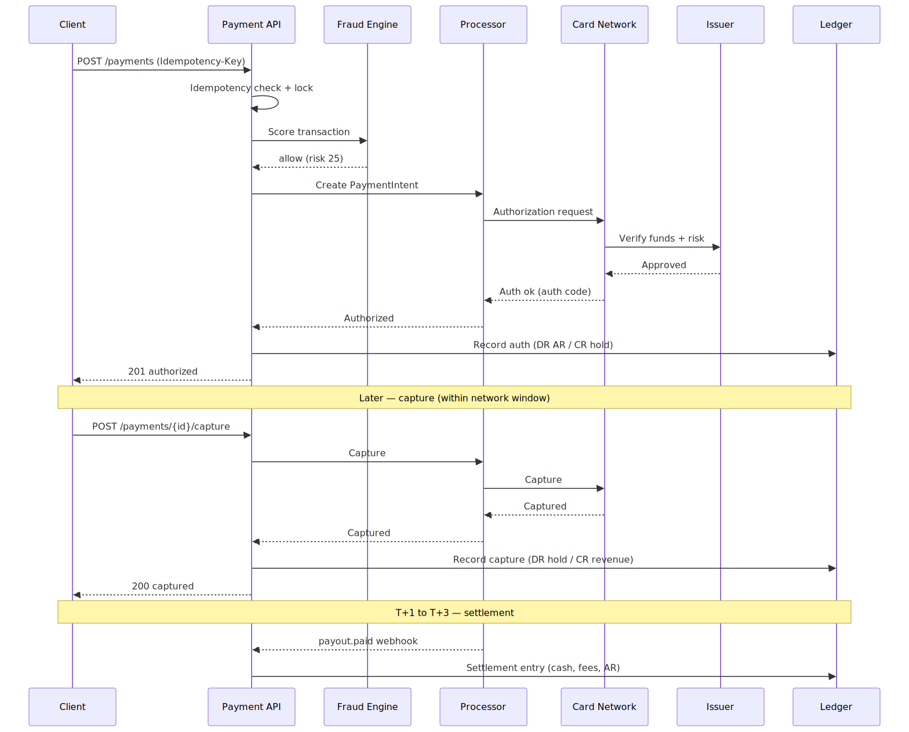
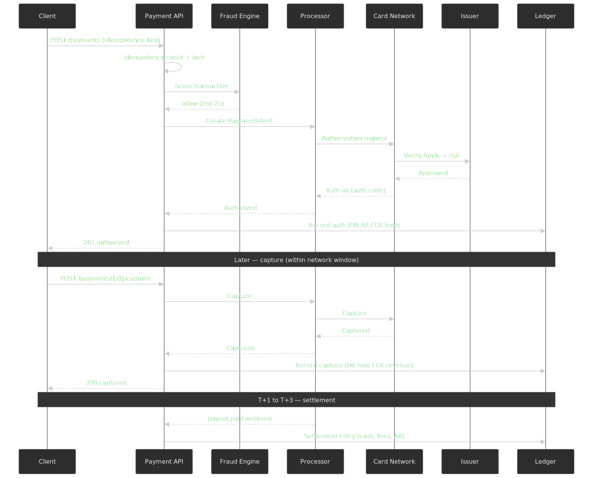
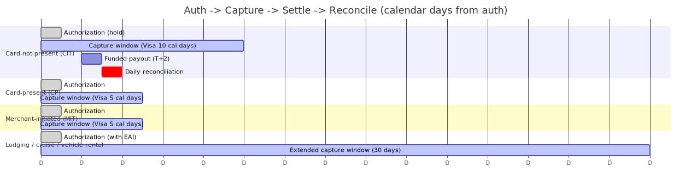
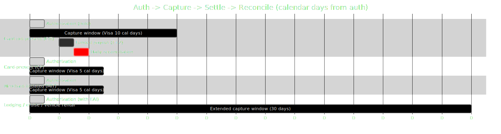

# Design a Payment System

A payment platform has to take one customer intent — "charge $99.99 for order 12345" — and turn it into a settled, reconciled, audit-ready movement of money across the merchant, an acquirer, a card network, and an issuer, while never charging twice and never losing a cent. This article designs that platform end-to-end, with the constraints that actually drive the architecture: PCI scope, idempotency, fraud-scoring latency, the network's authorization-to-clearing window, double-entry accounting, and reconciliation against external settlement reports.


## Mental model

Four constraints dominate every other decision:

1. **Exactly-once processing.** Network failures and client retries must never produce duplicate charges. Idempotency keys with request-body fingerprints make every state-changing call safely retriable; [Stripe's API documents the canonical pattern with a 24-hour key window](https://docs.stripe.com/api/idempotent_requests).
2. **PCI scope reduction.** Cardholder data (PAN, CVV) should never touch your servers when avoidable. Tokenizing at the edge keeps you on [SAQ A](https://listings.pcisecuritystandards.org/documents/PCI-DSS-v4-0-SAQ-A.pdf) instead of the full SAQ D.
3. **Latency under fraud scrutiny.** Fraud scoring is inline with authorization. It has to evaluate hundreds of signals in well under a checkout second; Stripe Radar [documents using "hundreds" of signals per transaction](https://docs.stripe.com/radar/risk-evaluation) on this budget.
4. **Financial accuracy.** Every fund movement — auth hold, capture, refund, chargeback, payout — must land in a double-entry ledger whose balance reconciles daily against external settlement reports.

The pipeline is **tokenize → authorize → capture → settle → reconcile**. Each stage has distinct timing, failure modes, and rollback procedures; later sections expand each one.

| Design decision     | Trade-off                                                  |
| ------------------- | ---------------------------------------------------------- |
| Edge tokenization   | Removes PAN from scope; adds client SDK + 3DS UX surface   |
| Idempotency keys    | Safe retries; requires key/lock storage and conflict rules |
| Smart routing       | Higher auth rate / lower cost; multi-PSP operational drag  |
| Async settlement    | Handles scale; payout is T+1 to T+3, not real-time         |
| Double-entry ledger | Audit-ready and reconcilable; write amplification          |

## Requirements

### Functional Requirements

| Feature                 | Scope    | Notes                                          |
| ----------------------- | -------- | ---------------------------------------------- |
| Card payments           | Core     | Visa, Mastercard, Amex via card networks       |
| Bank transfers          | Core     | ACH (US), SEPA (EU), wire transfers            |
| Digital wallets         | Core     | Apple Pay, Google Pay (network-tokenized)      |
| Authorization + capture | Core     | Auth-then-capture or single-message auth-cap   |
| Refunds                 | Core     | Full and partial, with reason codes            |
| Recurring payments      | Core     | Subscription billing with retry / dunning      |
| 3D Secure 2 (SCA)       | Core     | PSD2 SCA in EU/UK; recommended elsewhere       |
| Multi-currency          | Extended | FX conversion at capture time                  |
| Split payments          | Extended | Marketplace payouts (Stripe Connect / Adyen)   |
| Disputes / chargebacks  | Extended | Evidence submission, representment             |

### Non-Functional Requirements

| Requirement            | Target      | Rationale                                                                                                                                              |
| ---------------------- | ----------- | ------------------------------------------------------------------------------------------------------------------------------------------------------ |
| Availability           | 99.99%+     | Revenue-critical. Stripe has [publicly reported 99.999% historical uptime](https://stripe.dev/blog/how-stripes-document-databases-supported-99.999-uptime-with-zero-downtime-data-migrations) (note: not a contractual SLA). |
| Authorization latency  | p99 < 2 s   | Card-network round-trip dominates                                                                                                                     |
| Fraud decision latency | p99 < 100 ms | Inline with authorization; cannot delay checkout                                                                                                      |
| Duplicate charge rate  | 0           | Non-negotiable; idempotency required                                                                                                                  |
| Data consistency       | Strong      | Money requires ACID guarantees                                                                                                                        |
| PCI DSS compliance     | Level 1     | [Required for >6M card transactions/year](https://pcidssguide.com/pci-dss-compliance-levels/) on Visa, Mastercard, Discover (>2.5M for Amex)         |
| Settlement accuracy    | 100%        | Reconciliation must match external records                                                                                                            |

### Scale Estimation

A mid-size processor running ~10M transactions/day spends most of the day at modest TPS, with seasonal peaks (Black Friday, ticket on-sales) that drive the capacity envelope. As a reference point, [Visa's own fact sheet states VisaNet can process over 65,000 transaction messages per second](https://www.visa.co.uk/dam/VCOM/download/corporate/media/visanet-technology/aboutvisafactsheet.pdf), and [Visa's FY2024 annual report](https://s29.q4cdn.com/385744025/files/doc_downloads/2024/Visa-Fiscal-2024-Annual-Report.pdf) reports 233.8 billion transactions processed across the network — about 7,400 average TPS over the year, far below the network's peak capacity.

| Metric            | Typical   | Peak (Black Friday) |
| ----------------- | --------- | ------------------- |
| Transactions/day  | 10M       | 50M                 |
| TPS (average)     | 115       | 580                 |
| TPS (peak)        | 500       | 2,000               |
| Auth requests/sec | 1,000     | 5,000               |

**Storage rough cut:**

```text
Transactions:    10M/day × 2 KB        =  20 GB/day  →   7.3 TB/year
Ledger entries:  10M × 4 entries × 0.5 KB = 20 GB/day →   7.3 TB/year
Event stream:    10M × 1 KB           =  10 GB/day  →   3.7 TB/year
7-year retention: ~50 TB on transactions alone
```

**Latency budget for a single authorization (p99 ≤ 2 s):**

```text
API processing:            50 ms
Fraud scoring:            100 ms
Tokenization lookup:       20 ms
Network to processor:      50 ms
Processor to card network: 500 ms
Issuer decision:           800 ms
Response path:             480 ms
```

The fraud, idempotency, and tokenization budgets are the only ones we directly control; the rest is dominated by the network.

## Design Paths

There are three viable shapes for a payment platform. Pick by volume, regulatory profile, and the number of payments engineers you can hire.

### Path A: Build in-house

Best when transaction volume is high enough that interchange savings dominate engineering cost (typically >$1B annually), data residency is mandated, or unique flows don't fit third-party APIs.




**Trade-offs:**

- Lower per-transaction cost at scale (often saves 0.1–0.3% on processing)
- Full control over routing, retries, and fraud rules
- Data residency control
- Full PCI DSS Level 1 scope: annual ROC by a QSA, quarterly ASV scans, penetration testing
- 12–18 month build minimum; needs dedicated security and compliance staff

A familiar example is Shopify's own checkout — Shop Pay is built on Shopify's in-house payments stack and now [accounts for ~46% of Shopify-powered payments and ~$75B in lifetime volume, with ~48% CAGR since 2021](https://finance.yahoo.com/news/shopify-quietly-became-payments-giant-093001617.html). That kind of investment only makes sense at GMV scale where interchange and conversion lift on cumulative volume justify a dedicated payments organization.

### Path B: Third-party platform (Stripe, Adyen, Braintree)

Best when speed to market matters, transaction volume is below the interchange-savings threshold, and engineering effort should go into product instead of payments infrastructure.




**Trade-offs:**

- Days to integrate
- PCI scope reduced to SAQ A (see [PCI DSS v4.0 SAQ A](https://listings.pcisecuritystandards.org/documents/PCI-DSS-v4-0-SAQ-A.pdf))
- Built-in fraud (Radar, Adyen RevenueProtect)
- Broad coverage of cards, wallets, BNPL, local methods
- Higher per-transaction fee — Stripe's [posted US standard rate is 2.9% + $0.30](https://stripe.com/pricing) for online card payments
- Less control over routing; vendor lock-in on tokens and APIs

### Path C: Orchestration (multi-PSP)

Best when you need regional acquirer coverage, redundancy, or auth-rate optimization, or are migrating between providers.




**Trade-offs:**

- Redundancy and per-transaction failover
- Route optimization. Adyen reports [an average 26% cost saving and 0.22% authorization-rate uplift](https://www.adyen.com/press-and-media/adyens-intelligent-payment-routing-usdebit) in its US-debit intelligent routing pilot with 20+ enterprise merchants (eBay, 24 Hour Fitness, Microsoft); some merchants saw 52–55% cost savings and up to 1.15% auth-rate uplift on the same dataset.
- Gradual migration between providers
- Extra integration layer
- Token portability headaches across PSPs
- Orchestration platform cost (build or buy)

### Path comparison

| Factor               | Path A (build)            | Path B (third-party) | Path C (orchestration)   |
| -------------------- | ------------------------- | -------------------- | ------------------------ |
| Time to market       | 12–18 months              | Days–weeks           | 1–3 months               |
| PCI scope            | Level 1 (SAQ D)           | SAQ A                | SAQ A (per PSP)          |
| Per-transaction cost | Lowest at scale           | Highest (~2.9%+)     | Middle (rules-dependent) |
| Engineering effort   | High (50+ FTEs)           | Low (1–2 FTEs)       | Medium (5–10 FTEs)       |
| Customization        | Full                      | Limited              | Medium                   |
| Best for             | High-volume, unique needs | Startups, SMBs       | Multi-region enterprise  |

The remaining sections assume **Path B with selective Path C elements**: a third-party PSP for tokenization, fraud, and acquiring; your own idempotent API, ledger, reconciliation, and webhook consumer; and a smart-routing layer when a second PSP is on the roadmap. The architecture transfers cleanly to Path A if you eventually swap the PSP for a direct acquirer.

## High-Level Design

### Component Overview

| Component              | Responsibility                | Typical implementation                   |
| ---------------------- | ----------------------------- | ---------------------------------------- |
| Payment API            | Idempotent payment operations | REST + Idempotency-Key header            |
| Token Service          | Map payment methods to tokens | Stripe.js / Adyen Web Components         |
| Smart Router           | Pick a processor              | Rule engine (+ ML for cost / auth-rate)  |
| Fraud Engine           | Real-time risk scoring        | PSP (Radar) or in-house ML               |
| Authorization Service  | Card network communication    | PSP SDK                                  |
| Capture Service        | Settlement initiation         | Async job + scheduled retries            |
| Ledger Service         | Double-entry bookkeeping      | PostgreSQL append-only entries           |
| Reconciliation Service | Match internal vs external    | Daily batch + anomaly detection          |
| Webhook Handler        | Idempotent async event sink   | Signed receiver + dedupe key + DLQ       |

### Payment Lifecycle

The happy path on a card payment is four logical stages — authorization, capture, settlement, reconciliation — and the same key (`payment_id`) threads through all of them.




The same payment is also a finite-state machine. The states the API exposes are the contract; transitions out of them are gated by webhook receipts, manual capture, refund, or dispute resolution.


### Authorization vs Capture Timing

Effective **April 13, 2024**, [Visa standardized its authorization-to-clearing time frames](https://corporate.visa.com/content/dam/VCOM/regional/na/us/support-legal/documents/authorization-framework-will-be-updated-to-simplify-authorization-processing-time-frames.pdf). The clock starts at a valid authorization and ends when the transaction must be cleared:

| Pattern                           | Visa window (post-April-2024) | Typical use case                        |
| --------------------------------- | ----------------------------- | --------------------------------------- |
| Card-not-present (CIT)            | 10 calendar days              | E-commerce checkout                     |
| All card-present (CP)             | 5 calendar days               | In-store / POS                          |
| All merchant-initiated (MIT)      | 5 calendar days               | Recurring, subscriptions, COF reuse     |
| Lodging / cruise / vehicle rental | 30 calendar days (with EAI)   | Hotels, car rental, cruise lines        |

> [!IMPORTANT]
> Older blog posts still cite a "7-day Visa window". That guidance pre-dates the April 2024 framework. Capturing outside the new window risks a Visa Dispute Condition 11.3 ("No Authorization") chargeback and the loss of dispute rights. Mastercard, Amex, and Discover have similar but not identical windows — codify them per network.

The auth-then-capture, settlement, and reconciliation deadlines line up like this:




## API Design

The public surface is small and uniform: every state-changing operation accepts an `Idempotency-Key` header.

### Create Payment

```http
POST /api/v1/payments
Idempotency-Key: pay_abc123_user_456
Authorization: Bearer {api_key}
Content-Type: application/json

{
  "amount": 9999,
  "currency": "usd",
  "payment_method_token": "pm_tok_visa_4242",
  "capture_method": "automatic",
  "description": "Order #12345",
  "metadata": {
    "order_id": "ord_789",
    "customer_email": "user@example.com"
  }
}
```

**Response (`201 Created`):**

```json
{
  "id": "pay_xyz789",
  "object": "payment",
  "amount": 9999,
  "currency": "usd",
  "status": "succeeded",
  "payment_method": {
    "id": "pm_tok_visa_4242",
    "type": "card",
    "card": {
      "brand": "visa",
      "last4": "4242",
      "exp_month": 12,
      "exp_year": 2025
    }
  },
  "captured": true,
  "receipt_url": "https://pay.example.com/receipts/pay_xyz789",
  "created_at": "2026-03-15T10:00:00Z",
  "metadata": { "order_id": "ord_789" }
}
```

**Error responses:**

| Code                    | Condition                                    | Body                                                                          |
| ----------------------- | -------------------------------------------- | ----------------------------------------------------------------------------- |
| `400 Bad Request`       | Invalid amount or currency                   | `{"error": {"code": "invalid_amount"}}`                                       |
| `402 Payment Required`  | Card declined                                | `{"error": {"code": "card_declined", "decline_code": "insufficient_funds"}}`  |
| `409 Conflict`          | Idempotency key reused with different params | `{"error": {"code": "idempotency_conflict"}}`                                 |
| `429 Too Many Requests` | Rate limit exceeded                          | `{"error": {"code": "rate_limited"}}`                                         |

### Authorize-only and capture

```http
POST /api/v1/payments
Idempotency-Key: auth_abc123

{
  "amount": 9999,
  "currency": "usd",
  "payment_method_token": "pm_tok_visa_4242",
  "capture_method": "manual"
}
```

Response:

```json
{
  "id": "pay_xyz789",
  "status": "requires_capture",
  "amount_capturable": 9999,
  "capture_before": "2026-03-25T10:00:00Z"
}
```

Capture (full or partial — partial automatically releases the remaining hold):

```http
POST /api/v1/payments/{payment_id}/capture
Idempotency-Key: cap_abc123

{ "amount_to_capture": 9999 }
```

### Refund

```http
POST /api/v1/payments/{payment_id}/refunds
Idempotency-Key: ref_abc123

{
  "amount": 2500,
  "reason": "customer_request",
  "metadata": { "support_ticket": "TKT-456" }
}
```

Response:

```json
{
  "id": "ref_abc456",
  "payment_id": "pay_xyz789",
  "amount": 2500,
  "status": "pending",
  "reason": "customer_request",
  "estimated_arrival": "2026-03-20"
}
```

Refund timing varies by issuer; 5–10 business days for cards is a reasonable customer-facing estimate. ACH refunds usually surface in 3–5 business days for the originator, plus the standard return window discussed in [ACH and bank transfers](#ach-and-bank-transfers).

### Webhook Events

```http
POST /webhooks/payments
Stripe-Signature: t=1234567890,v1=abc123...

{
  "id": "evt_123",
  "type": "payment_intent.succeeded",
  "data": { "object": { "id": "pi_xyz", "amount": 9999, "status": "succeeded" } },
  "created": 1234567890
}
```

The events your ledger really cares about:

| Event                           | Action                                                    |
| ------------------------------- | --------------------------------------------------------- |
| `payment_intent.succeeded`      | Mark order paid, trigger fulfillment                      |
| `payment_intent.payment_failed` | Notify customer, schedule dunning retry                   |
| `charge.refunded`               | Update order status, adjust inventory, ledger refund      |
| `charge.dispute.created`        | Open chargeback case, gather evidence                     |
| `payout.paid`                   | Reconcile settlement, post bank entry                     |

Webhook handling is non-trivial — see [Webhook reliability](#webhook-reliability) for the failure-mode breakdown.

## Data Modeling

### Payment schema (PostgreSQL)

```sql collapse={1-5, 45-55} title="payments.sql"
-- Core payment record
CREATE TABLE payments (
    id UUID PRIMARY KEY DEFAULT gen_random_uuid(),
    external_id VARCHAR(100) UNIQUE NOT NULL,
    idempotency_key VARCHAR(255) UNIQUE NOT NULL,

    -- Amount
    amount_cents BIGINT NOT NULL CHECK (amount_cents > 0),
    currency VARCHAR(3) NOT NULL,
    amount_captured_cents BIGINT DEFAULT 0,
    amount_refunded_cents BIGINT DEFAULT 0,

    -- Status
    status VARCHAR(30) NOT NULL DEFAULT 'pending',
    capture_method VARCHAR(20) NOT NULL,

    -- Payment method (tokenized reference)
    payment_method_id UUID REFERENCES payment_methods(id),
    payment_method_type VARCHAR(20) NOT NULL,

    -- Customer
    customer_id UUID REFERENCES customers(id),

    -- Processor details
    processor VARCHAR(30) NOT NULL,
    processor_payment_id VARCHAR(100),
    auth_code VARCHAR(20),
    decline_code VARCHAR(50),

    -- Risk
    risk_score INTEGER,
    risk_level VARCHAR(20),

    -- Metadata
    description TEXT,
    metadata JSONB DEFAULT '{}',

    -- Timestamps
    created_at TIMESTAMPTZ DEFAULT NOW(),
    authorized_at TIMESTAMPTZ,
    captured_at TIMESTAMPTZ,
    canceled_at TIMESTAMPTZ,

    CONSTRAINT valid_status CHECK (status IN (
        'pending', 'requires_action', 'requires_capture',
        'processing', 'succeeded', 'failed', 'canceled'
    ))
);

CREATE INDEX idx_payments_customer ON payments(customer_id, created_at DESC);
CREATE INDEX idx_payments_status ON payments(status, created_at DESC);
CREATE INDEX idx_payments_processor ON payments(processor_payment_id);
CREATE INDEX idx_payments_idempotency ON payments(idempotency_key);
```

### Double-entry ledger schema

```sql title="ledger.sql"
-- Chart of accounts
CREATE TABLE accounts (
    id UUID PRIMARY KEY DEFAULT gen_random_uuid(),
    code VARCHAR(20) UNIQUE NOT NULL,
    name VARCHAR(100) NOT NULL,
    type VARCHAR(20) NOT NULL,  -- asset | liability | revenue | expense
    currency VARCHAR(3) NOT NULL,
    is_active BOOLEAN DEFAULT true
);

-- Immutable journal entries — every ledger row is debit XOR credit
CREATE TABLE ledger_entries (
    id UUID PRIMARY KEY DEFAULT gen_random_uuid(),
    transaction_id UUID NOT NULL,
    account_id UUID NOT NULL REFERENCES accounts(id),
    entry_type VARCHAR(10) NOT NULL,            -- 'debit' | 'credit'
    amount_cents BIGINT NOT NULL CHECK (amount_cents > 0),
    currency VARCHAR(3) NOT NULL,
    description TEXT,
    metadata JSONB DEFAULT '{}',
    created_at TIMESTAMPTZ DEFAULT NOW(),

    payment_id UUID REFERENCES payments(id),
    refund_id UUID REFERENCES refunds(id),
    payout_id UUID REFERENCES payouts(id)
);

CREATE INDEX idx_ledger_transaction ON ledger_entries(transaction_id);
CREATE INDEX idx_ledger_account ON ledger_entries(account_id, created_at DESC);
CREATE INDEX idx_ledger_payment ON ledger_entries(payment_id);
```

The invariant: for every `transaction_id`, `SUM(debits) = SUM(credits)` per currency. Enforce it with a deferred constraint or a periodic check; never let a single transaction post unbalanced.

The write path itself is the part most teams get wrong. Every state-changing operation atomically updates the `payments` row, inserts the balanced ledger pair, and records a domain event in an outbox table — all in a single database transaction. A separate relay process drains the outbox to Kafka. This is the [transactional outbox pattern](https://microservices.io/patterns/data/transactional-outbox.html); it gives you at-least-once delivery without dual-write inconsistency between the ledger and the event stream.




### Ledger entry examples

**Authorization (hold funds):**

```text
Transaction: AUTH-001
├── DEBIT  accounts_receivable  $100.00
└── CREDIT authorization_hold   $100.00
```

**Capture (recognize revenue):**

```text
Transaction: CAP-001
├── DEBIT  authorization_hold   $100.00
└── CREDIT revenue              $100.00
```

**Settlement (cash less fees):**

```text
Transaction: SET-001
├── DEBIT  cash                 $97.10  (payout net of fees)
├── DEBIT  processing_fees      $2.90
└── CREDIT accounts_receivable  $100.00
```

**Refund:**

```text
Transaction: REF-001
├── DEBIT  revenue              $50.00
└── CREDIT accounts_receivable  $50.00
```

### Token vault schema

```sql title="payment_methods.sql"
-- Minimal schema: only tokens + non-sensitive metadata.
-- Raw PAN/CVV are stored by the PSP in their PCI-compliant vault.
CREATE TABLE payment_methods (
    id UUID PRIMARY KEY DEFAULT gen_random_uuid(),
    customer_id UUID NOT NULL REFERENCES customers(id),
    processor VARCHAR(30) NOT NULL,
    processor_token VARCHAR(100) NOT NULL,  -- e.g. Stripe pm_xxx

    type VARCHAR(20) NOT NULL,  -- card | bank_account | wallet
    card_brand VARCHAR(20),
    card_last4 VARCHAR(4),
    card_exp_month INTEGER,
    card_exp_year INTEGER,
    card_funding VARCHAR(20),   -- credit | debit | prepaid

    billing_name VARCHAR(100),
    billing_country VARCHAR(2),
    billing_postal_code VARCHAR(20),

    is_default BOOLEAN DEFAULT false,
    is_active BOOLEAN DEFAULT true,

    created_at TIMESTAMPTZ DEFAULT NOW(),
    updated_at TIMESTAMPTZ DEFAULT NOW(),

    UNIQUE(customer_id, processor_token)
);
```

This schema stores only opaque tokens and non-sensitive descriptors. The actual PAN lives in the PSP's vault, which is what keeps you on SAQ A instead of SAQ D.

### Database selection

| Data                     | Store              | Rationale                                 |
| ------------------------ | ------------------ | ----------------------------------------- |
| Payments                 | PostgreSQL         | ACID, complex queries, audit requirements |
| Ledger entries           | PostgreSQL         | Strong consistency, immutable append-only |
| Idempotency keys         | Redis + PostgreSQL | Fast lookup (Redis), durable record (PG)  |
| Payment method tokens    | PostgreSQL         | FK integrity with customers               |
| Event stream             | Kafka              | High throughput, replay capability        |
| Reconciliation snapshots | S3 + Parquet       | Cost-effective analytics storage          |
| Rate limiting            | Redis              | Sub-ms counters                           |

## Low-Level Design

### Idempotency

Idempotency keys turn an at-least-once retry world into an effectively-once charge world. The contract is simple:

- Same key + same request body = single execution; subsequent calls return the cached response.
- Same key + different request body = `409 idempotency_conflict`.
- Same key while the first call is still running = `409 request_in_progress` (client retries with backoff).

Stripe's reference implementation [pins the key window at 24 hours and persists the request hash plus response](https://docs.stripe.com/api/idempotent_requests).

 and PostgreSQL (durable).")


```ts collapse={1-15, 65-80} title="idempotency-service.ts"
import { Redis } from "ioredis"
import { createHash } from "crypto"

interface IdempotencyRecord {
  key: string
  request_hash: string
  response: unknown
  status: "processing" | "complete" | "error"
  created_at: Date
  expires_at: Date
}

const redis = new Redis(process.env.REDIS_URL)
const IDEMPOTENCY_TTL = 24 * 60 * 60 // 24 hours, mirrors Stripe

export async function checkIdempotency(
  key: string,
  requestBody: object,
): Promise<{ exists: boolean; response?: unknown; conflict?: boolean }> {
  const requestHash = hashRequest(requestBody)

  const cached = await redis.get(`idem:${key}`)
  if (!cached) return { exists: false }

  const record: IdempotencyRecord = JSON.parse(cached)

  if (record.request_hash !== requestHash) {
    return { exists: true, conflict: true }
  }

  if (record.status === "processing") {
    return { exists: true, conflict: true }
  }

  return { exists: true, response: record.response }
}

export async function startIdempotentRequest(
  key: string,
  requestBody: object,
): Promise<boolean> {
  const requestHash = hashRequest(requestBody)

  const result = await redis.set(
    `idem:${key}`,
    JSON.stringify({
      key,
      request_hash: requestHash,
      status: "processing",
      created_at: new Date(),
    }),
    "EX",
    IDEMPOTENCY_TTL,
    "NX",
  )

  return result === "OK"
}

export async function completeIdempotentRequest(
  key: string,
  response: unknown,
  status: "complete" | "error",
): Promise<void> {
  const cached = await redis.get(`idem:${key}`)
  if (!cached) return

  const record: IdempotencyRecord = JSON.parse(cached)
  record.response = response
  record.status = status

  await redis.setex(`idem:${key}`, IDEMPOTENCY_TTL, JSON.stringify(record))

  await db.idempotency_records.upsert({
    key,
    request_hash: record.request_hash,
    response: JSON.stringify(response),
    status,
    expires_at: new Date(Date.now() + IDEMPOTENCY_TTL * 1000),
  })
}

function hashRequest(body: object): string {
  return createHash("sha256").update(JSON.stringify(body)).digest("hex")
}
```

```ts collapse={1-8, 50-60} title="payment-controller.ts"
import {
  checkIdempotency,
  startIdempotentRequest,
  completeIdempotentRequest,
} from "./idempotency-service"

export async function createPayment(req: Request): Promise<Response> {
  const idempotencyKey = req.headers.get("Idempotency-Key")
  if (!idempotencyKey) return errorResponse(400, "idempotency_key_required")

  const check = await checkIdempotency(idempotencyKey, req.body)

  if (check.conflict) return errorResponse(409, "idempotency_conflict")

  if (check.exists && check.response) {
    return new Response(JSON.stringify(check.response), {
      status: (check.response as { status_code?: number }).status_code ?? 200,
      headers: { "Idempotent-Replayed": "true" },
    })
  }

  const acquired = await startIdempotentRequest(idempotencyKey, req.body)
  if (!acquired) return errorResponse(409, "request_in_progress")

  try {
    const payment = await processPayment(req.body)
    await completeIdempotentRequest(idempotencyKey, payment, "complete")
    return successResponse(201, payment)
  } catch (error) {
    await completeIdempotentRequest(
      idempotencyKey,
      { error: (error as Error).message },
      "error",
    )
    throw error
  }
}
```

| Decision           | Why                                                                       |
| ------------------ | ------------------------------------------------------------------------- |
| 24-hour TTL        | Mirrors Stripe; long enough for client retries, short enough to bound RAM |
| Hash request body  | Detects clients reusing keys with different parameters                    |
| Cache errors too   | Prevents retry storms against permanent failures                          |
| Redis + PostgreSQL | Redis for sub-ms reads; PostgreSQL for durability and audit               |

### Fraud Detection Pipeline

Fraud scoring is inline with authorization, so the budget is single-digit hundred milliseconds. The pipeline pulls signals from the transaction, the card, the device, and behavioral telemetry; computes velocity and historical features; runs a model; and applies rule overrides on top.




**Feature families** (each typically tens to a few hundred concrete features):

| Category    | Example features                                            |
| ----------- | ----------------------------------------------------------- |
| Velocity    | Transactions / hour from this card, IP, device, customer    |
| Historical  | Days since first txn, average ticket, lifetime fraud rate   |
| Geolocation | Distance from billing address, IP-to-billing mismatch       |
| Card        | BIN country, funding type (credit / debit / prepaid)        |
| Device      | Browser fingerprint, screen resolution, timezone, headless  |
| Behavioral  | Time on page before purchase, mouse / keystroke dynamics    |

**Stripe Radar reference points** (all from Stripe's own documentation and engineering posts):

- Risk score 0–99; [default block at >= 75 and elevated risk at >= 65](https://docs.stripe.com/radar/risk-evaluation), with a newer "risk settings" abstraction (Maximize protection / Balance / Maximize revenue) that adapts thresholds automatically.
- Evaluates [hundreds of signals per transaction](https://docs.stripe.com/radar/risk-evaluation), drawn from the cross-merchant Stripe network.
- [Continuous retraining on recent fraud patterns; the team has reported recall improvements of up to 0.5% per month from faster model release cadence](https://stripe.dev/blog/how-we-built-it-stripe-radar).

> [!NOTE]
> "False positive rate" numbers from PSPs are contextual to a merchant's traffic mix and risk tolerance — there is no universal Radar FPR you can plan against. Tune thresholds against your own block / allow / review counts.

#### AML, sanctions, and KYC

Fraud scoring sits next to a separate but adjacent control plane: AML (anti-money-laundering) screening and KYC (know-your-customer). The two have different obligations and different latency budgets:

| Control                | Trigger                          | Latency        | Authority                                                                                                                                                                                                                |
| ---------------------- | -------------------------------- | -------------- | ----------------------------------------------------------------------------------------------------------------------------------------------------------------------------------------------------------------------- |
| Sanctions screening    | Every payment, every payout      | Inline (< 100 ms) | [OFAC SDN list](https://ofac.treasury.gov/sanctions-list-service), EU consolidated list, UN — match the buyer, the seller, the bank, and the IP geolocation against the lists at every fund movement.                  |
| Transaction monitoring | All transactions, post-auth      | Near-real-time | FinCEN BSA / [Suspicious Activity Report (SAR)](https://www.fincen.gov/resources/filing-information) thresholds: file SARs on $5,000+ transactions with no apparent lawful purpose, structuring, or sanctioned-party links. |
| KYC / CIP              | Account opening, onboarding      | Out of band    | FinCEN Customer Identification Program rule (US); EU AMLD6 + national transposition; varies by jurisdiction.                                                                                                            |

Marketplaces and Connect-style platforms inherit money-services-business obligations from the moment they touch funds on behalf of a third party — the PSP usually performs the underlying KYC, but the platform still owns the screening on the outbound payout side. Treat the sanctions check as part of the authorization-time critical path, not a batch job.

### 3D Secure 2 and SCA

3D Secure 2 (EMV 3DS) shifts CNP fraud liability to the issuer when authentication succeeds and is mandatory in the EU/UK under PSD2 SCA. Most low-risk traffic completes "frictionless": the issuer's Access Control Server (ACS) makes a risk decision off the device and transaction context with no user interaction. High-risk or SCA-required traffic gets a challenge — typically biometric, OTP, or app push.


| Flow         | Description                                       | UX                  |
| ------------ | ------------------------------------------------- | ------------------- |
| Frictionless | Risk-based authentication off device fingerprint  | Instant (invisible) |
| Challenge    | Biometric, OTP, or push notification required     | 10–30 seconds       |

[Visa publishes that 3DS 2 reduces cart abandonment by ~70% and checkout time by ~85%](https://www.visa.ca/dam/VCOM/regional/na/canada/security/security-documents/3ds-2-0-infographic.pdf) compared to 3DS 1, primarily by replacing static-password challenges with risk-based frictionless authentication on most transactions.

```ts collapse={1-10, 30-40} title="3ds-service.ts"
interface ThreeDSResult {
  authentication_status: "success" | "failed" | "attempted" | "not_supported"
  liability_shift: boolean
  eci: string // Electronic Commerce Indicator
}

export async function handle3DSChallenge(
  paymentIntentId: string,
  returnUrl: string,
): Promise<{ requires_action: boolean; redirect_url?: string }> {
  const pi = await stripe.paymentIntents.retrieve(paymentIntentId)

  if (pi.status === "requires_action") {
    return {
      requires_action: true,
      redirect_url: pi.next_action?.redirect_to_url?.url,
    }
  }

  return { requires_action: false }
}
```

### Reconciliation

Reconciliation matches your internal ledger against the processor's settlement report and (eventually) the bank statement. Discrepancies are how you find missed webhooks, partial captures, FX drift, duplicate charges, and processor errors before finance does.




```ts collapse={1-15, 70-85} title="reconciliation-service.ts"
interface SettlementRecord {
  external_id: string
  amount_cents: number
  currency: string
  type: "charge" | "refund" | "chargeback"
  settled_at: Date
  fees_cents: number
}

interface ReconciliationResult {
  matched: number
  unmatched_internal: SettlementRecord[]
  unmatched_external: SettlementRecord[]
  amount_discrepancy_cents: number
}

export async function reconcileSettlement(
  date: Date,
  processor: string,
): Promise<ReconciliationResult> {
  const externalRecords = await fetchSettlementReport(processor, date)
  const internalRecords = await fetchLedgerEntries(date, processor)

  const matched: string[] = []
  const unmatchedExternal: SettlementRecord[] = []
  const unmatchedInternal: SettlementRecord[] = []

  const internalMap = new Map(
    internalRecords.map((r) => [r.external_id, r]),
  )

  for (const ext of externalRecords) {
    const internal = internalMap.get(ext.external_id)

    if (!internal) {
      unmatchedExternal.push(ext)
      continue
    }

    if (internal.amount_cents !== ext.amount_cents) {
      unmatchedExternal.push(ext)
      unmatchedInternal.push(internal)
      continue
    }

    matched.push(ext.external_id)
    internalMap.delete(ext.external_id)
  }

  for (const [, record] of internalMap) {
    unmatchedInternal.push(record)
  }

  const externalTotal = externalRecords.reduce(
    (sum, r) => sum + r.amount_cents,
    0,
  )
  const internalTotal = internalRecords.reduce(
    (sum, r) => sum + r.amount_cents,
    0,
  )

  return {
    matched: matched.length,
    unmatched_internal: unmatchedInternal,
    unmatched_external: unmatchedExternal,
    amount_discrepancy_cents: externalTotal - internalTotal,
  }
}

export async function handleReconciliationBreaks(
  result: ReconciliationResult,
): Promise<void> {
  if (result.unmatched_external.length > 0) {
    await alertFinanceTeam({
      type: "unmatched_external",
      count: result.unmatched_external.length,
      transactions: result.unmatched_external,
    })
  }

  if (Math.abs(result.amount_discrepancy_cents) > 100) {
    await alertFinanceTeam({
      type: "amount_discrepancy",
      amount_cents: result.amount_discrepancy_cents,
    })
  }
}
```

| Break                | Cause                                | Resolution                          |
| -------------------- | ------------------------------------ | ----------------------------------- |
| Missing in ledger    | Webhook missed / consumed late       | Replay webhook, post manual entry   |
| Missing in processor | Auth expired or voided               | Close internal record               |
| Amount mismatch      | Partial capture, FX rounding         | Verify capture amount, re-mark      |
| Duplicate            | Idempotency key collision            | Refund the duplicate                |
| Timing               | Settlement date rollover (TZ)        | Verify dates against processor cutoff |

### Webhook Reliability

Webhooks are the only path you have for events that happen *after* the synchronous response — captures, payouts, refunds, disputes, declines from offline issuers. They are at-least-once, sometimes out-of-order, sometimes delayed by hours, and occasionally never delivered. The consumer has to be idempotent on the event ID, ordered on per-resource sequence numbers (when present), and dead-lettered on unrecoverable schema or domain failures.




The non-negotiable rules:

- **Verify the signature** on every request before parsing the body.
- **Reject events older than the replay window** (5 minutes is typical) to defeat replay attacks.
- **Dedupe by `event.id`** in a persistent store (not just in-memory) — PSPs replay events for ~72 hours on delivery failures.
- **Lock per resource** when applying side effects; never let two events for the same payment race.
- **Return 2xx immediately** after enqueueing, not after applying. The PSP retries on any non-2xx.
- **Dead-letter and alert** when retries exceed the budget; never silently swallow.

### Smart Routing

Smart routing picks a processor per transaction by card type, geography, ticket size, and live processor health. The deterministic core is a rule engine; the optimization layer (cost vs auth-rate) is usually a model trained on historical PSP outcomes.

```ts collapse={1-12, 55-70} title="smart-router.ts"
interface RoutingDecision {
  processor: "stripe" | "adyen" | "paypal"
  reason: string
  expected_auth_rate: number
  expected_cost_bps: number
}

interface TransactionContext {
  card_brand: string
  card_country: string
  card_funding: "credit" | "debit" | "prepaid"
  amount_cents: number
  currency: string
  merchant_country: string
}

export function routeTransaction(ctx: TransactionContext): RoutingDecision {
  if (ctx.card_country === "US" && ctx.card_funding === "debit") {
    return {
      processor: "adyen",
      reason: "us_debit_cost_optimization",
      expected_auth_rate: 0.96,
      expected_cost_bps: 50,
    }
  }

  if (["DE", "FR", "GB", "NL", "ES", "IT"].includes(ctx.card_country)) {
    return {
      processor: "adyen",
      reason: "eu_local_acquiring",
      expected_auth_rate: 0.94,
      expected_cost_bps: 180,
    }
  }

  if (ctx.amount_cents > 100000) {
    return {
      processor: "stripe",
      reason: "high_value_auth_optimization",
      expected_auth_rate: 0.92,
      expected_cost_bps: 290,
    }
  }

  return {
    processor: "stripe",
    reason: "default",
    expected_auth_rate: 0.9,
    expected_cost_bps: 290,
  }
}

export async function processWithFailover(
  ctx: TransactionContext,
  paymentData: PaymentData,
): Promise<PaymentResult> {
  const primary = routeTransaction(ctx)
  const processors = [primary.processor, ...getFailoverProcessors(primary.processor)]

  for (const processor of processors) {
    try {
      return await processPayment(processor, paymentData)
    } catch (error) {
      if (isRetryableError(error)) continue
      throw error // permanent failure (e.g. card declined) — do not failover
    }
  }

  throw new Error("All processors failed")
}
```

> [!CAUTION]
> Failing over after a `card_declined` will not improve auth rates and risks duplicate auth holds on the cardholder. Failover is for `processor_error`, `network_timeout`, and other transient infrastructure failures only.

[Adyen reports an average 26% cost saving and 0.22% auth-rate uplift on US-debit smart routing](https://www.adyen.com/press-and-media/adyens-intelligent-payment-routing-usdebit), with some merchants seeing 52–55% savings and up to 1.15% auth-rate uplift.

## Frontend Considerations

### PCI scope reduction at the edge

The single highest-leverage frontend decision is to never let the card number reach your origin server. The PSP's hosted iframe (Stripe Elements, Adyen Web Components) tokenizes the card directly with the PSP, and your backend only ever sees an opaque token like `pm_xxx`.

```tsx collapse={1-8, 40-50} title="checkout.tsx"
import { loadStripe } from "@stripe/stripe-js"
import {
  Elements,
  CardElement,
  useStripe,
  useElements,
} from "@stripe/react-stripe-js"

const stripePromise = loadStripe(process.env.NEXT_PUBLIC_STRIPE_KEY!)

function CheckoutForm() {
  const stripe = useStripe()
  const elements = useElements()

  const handleSubmit = async (e: FormEvent) => {
    e.preventDefault()

    // Card data goes directly to Stripe; never touches your backend.
    const { error, paymentMethod } = await stripe!.createPaymentMethod({
      type: "card",
      card: elements!.getElement(CardElement)!,
      billing_details: { name: "Customer Name" },
    })

    if (error) {
      setError(error.message)
      return
    }

    // Only the token (pm_xxx) goes to your backend.
    await fetch("/api/payments", {
      method: "POST",
      body: JSON.stringify({
        payment_method_token: paymentMethod.id,
        amount: 9999,
      }),
    })
  }

  return (
    <form onSubmit={handleSubmit}>
      <CardElement />
      <button type="submit">Pay $99.99</button>
    </form>
  )
}

export function CheckoutPage() {
  return (
    <Elements stripe={stripePromise}>
      <CheckoutForm />
    </Elements>
  )
}
```

| Approach                | PCI surface                                | Effort                    |
| ----------------------- | ------------------------------------------ | ------------------------- |
| Direct card handling    | SAQ D (~329 questions in v4.0)             | Months of compliance work |
| PSP iframe tokenization | SAQ A (22 questions) — see [SAQ A][saq-a]  | Hours                     |
| Redirect to hosted page | SAQ A                                      | Minimal                   |

[saq-a]: https://listings.pcisecuritystandards.org/documents/PCI-DSS-v4-0-SAQ-A.pdf

The SAQ A vs D delta is verified directly: the [PCI SSC's SAQ A is 22 questions](https://listings.pcisecuritystandards.org/documents/PCI-DSS-v4-0-SAQ-A.pdf), while [SAQ D in v4.0 covers ~329 questions across the full PCI control set](https://sprinto.com/blog/what-is-pci-saq/).

### 3D Secure challenge handling

```ts collapse={1-10, 30-40} title="3ds-handler.ts"
import { loadStripe } from "@stripe/stripe-js"

export async function handle3DSChallenge(
  clientSecret: string,
  paymentMethodId: string,
): Promise<{ success: boolean; error?: string }> {
  const stripe = await loadStripe(process.env.NEXT_PUBLIC_STRIPE_KEY!)

  const { error, paymentIntent } = await stripe!.confirmCardPayment(
    clientSecret,
    { payment_method: paymentMethodId },
  )

  if (error) return { success: false, error: error.message }
  if (paymentIntent?.status === "succeeded") return { success: true }

  if (paymentIntent?.status === "requires_action") {
    return await handle3DSChallenge(paymentIntent.client_secret!, paymentMethodId)
  }

  return { success: false, error: "Unexpected payment status" }
}
```

### Error UX

```ts title="payment-errors.ts"
const ERROR_MESSAGES: Record<string, string> = {
  card_declined: "Your card was declined. Please try a different card.",
  insufficient_funds: "Insufficient funds. Please try a different card.",
  expired_card: "Your card has expired. Please update your payment method.",
  incorrect_cvc: "The CVC code is incorrect. Please check and try again.",
  processing_error: "A processing error occurred. Please try again.",
  rate_limited: "Too many attempts. Please wait a moment and try again.",
}

export function getErrorMessage(declineCode: string): string {
  return ERROR_MESSAGES[declineCode] ?? "Payment failed. Please try again."
}
```

## Infrastructure Design

### Cloud-agnostic components

| Component           | Purpose                   | Requirements                       |
| ------------------- | ------------------------- | ---------------------------------- |
| API gateway         | Rate limiting, auth, WAF  | High availability, DDoS protection |
| Application servers | Payment processing        | Horizontal scaling, idempotent     |
| Primary database    | Payments, ledger          | ACID, strong consistency           |
| Cache               | Idempotency, sessions     | Sub-ms latency                     |
| Message queue       | Async processing          | Exactly-once or idempotent consumers |
| Event stream        | Audit, analytics          | High throughput, retention         |
| Secrets manager     | API keys, encryption keys | HSM-backed, audit logging          |

### AWS reference architecture


| Service           | Configuration                      | Rationale                |
| ----------------- | ---------------------------------- | ------------------------ |
| RDS PostgreSQL    | db.r6g.xlarge, Multi-AZ, encrypted | ACID, HA, compliance     |
| ElastiCache Redis | r6g.large, cluster mode, 3 nodes   | Idempotency, low latency |
| ECS Fargate       | 2 vCPU, 4 GB, autoscale 2–20       | Predictable performance  |
| SQS FIFO          | 3,000 msg/sec content dedup        | Idempotent webhook ingest |
| KMS               | Customer-managed CMKs              | Encryption key control   |
| CloudWatch        | 1-minute metrics, alarms           | Observability            |

### Self-hosted alternatives

| Managed         | Self-hosted          | Trade-off                          |
| --------------- | -------------------- | ---------------------------------- |
| RDS PostgreSQL  | PostgreSQL on EC2    | More control, operational burden   |
| ElastiCache     | Redis Cluster on EC2 | Cost at scale                      |
| SQS FIFO        | Kafka                | Higher throughput, more complexity |
| Secrets Manager | HashiCorp Vault      | Full control, more ops overhead    |

## Variations

### ACH and bank transfers

ACH has fundamentally different timing and failure modes than cards. It's a batch network, not real-time, and "settled" doesn't mean "irrevocable" — returns can come back days later.

```ts title="ach-payment.ts"
interface ACHPayment {
  routing_number: string
  account_number: string // tokenized
  account_type: "checking" | "savings"
}

export async function initiateACHPayment(
  payment: ACHPayment,
  amount: number,
): Promise<{ status: string; estimated_settlement: Date }> {
  const transfer = await stripe.paymentIntents.create({
    amount,
    currency: "usd",
    payment_method_types: ["us_bank_account"],
    payment_method_data: {
      type: "us_bank_account",
      us_bank_account: {
        routing_number: payment.routing_number,
        account_number: payment.account_number,
        account_holder_type: "individual",
      },
    },
  })

  return {
    status: "processing",
    estimated_settlement: addBusinessDays(new Date(), 1),
  }
}
```

[Nacha's Same-Day ACH program runs three processing windows](https://www.frbservices.org/resources/resource-centers/same-day-ach/fedach-processing-schedule.html); the per-transaction limit was [raised to $1 million effective March 18, 2022](https://www.nacha.org/rules/expanding-same-day-ach):

| Window | ODFI submission cutoff (ET) | Settlement (ET) |
| ------ | --------------------------- | --------------- |
| First  | 10:30 a.m.                  | 1:00 p.m.       |
| Second | 2:45 p.m.                   | 5:00 p.m.       |
| Third  | 4:45 p.m.                   | 6:00 p.m.       |

Standard (next-day) ACH typically settles in 2–3 business days from origination.

**Failure modes (a partial list of [Nacha return codes](https://ramp.com/blog/ach-return-codes)):**

| Return code | Reason                          | RDFI return window         |
| ----------- | ------------------------------- | -------------------------- |
| R01         | Insufficient funds (NSF)        | 2 banking days             |
| R09         | Uncollected funds               | 2 banking days             |
| R02 / R03 / R04 | Account closed / no account / invalid number | 2 banking days   |
| R05 / R07 / R10 / R11 | Unauthorized debit (consumer claim) | 60 calendar days  |

> [!WARNING]
> Treat ACH as "provisional" until at least the unauthorized-return window closes. Do not ship goods or release funds for high-value ACH receipts until you accept the credit risk that an R10 may surface up to 60 calendar days later.

#### Real-time rails

Real-time payment rails settle in seconds with finality, not days, and use ISO 20022 messaging end-to-end. They are push-only, irrevocable, and rapidly displacing card and ACH for account-to-account use cases.

| Rail                    | Region | Settlement       | Limit / cap (current)                                                                                                                              | Notes                                                                                                                                                                    |
| ----------------------- | ------ | ---------------- | -------------------------------------------------------------------------------------------------------------------------------------------------- | ------------------------------------------------------------------------------------------------------------------------------------------------------------------------ |
| RTP                     | US     | < 15 s, 24/7/365 | [$10M per transaction effective Feb 9, 2025](https://www.theclearinghouse.org/payment-systems/Articles/2025/02/BNY_$10M_Payment_RTP-Network_02-10-2025) | Run by The Clearing House; ISO 20022 native. Previous limit was $1M (raised April 2022).                                                                                  |
| FedNow                  | US     | < 20 s, 24/7/365 | [$10M effective November 2025](https://www.frbservices.org/news/fed360/issues/091625/fednow-service-10-million-transaction-limit) (institutions can set lower) | Federal Reserve, launched July 2023; complements RTP, not a replacement. Default limit was $100,000 at launch, with banks opt-in to higher caps.                          |
| SEPA Instant (SCT Inst) | EU/EEA | < 10 s, 24/7/365 | The €100,000 scheme cap was [removed under the EU Instant Payments Regulation](https://www.ecb.europa.eu/paym/retail/instant_payments/html/instant_payments_regulation.en.html); effective limit is the SEPA Regulation cap | Eurozone PSPs must **receive** SCT Inst from Jan 9, 2025 and **send** by Oct 9, 2025; non-eurozone EEA states have until 2027.                                            |
| UPI                     | India  | < 5 s, 24/7/365  | ₹1L–₹5L tiered by use case (NPCI rules)                                                                                                            | NPCI-operated; [131 billion transactions in FY2023–24](https://www.business-standard.com/finance/news/upi-transactions-cross-100-billion-mark-in-fy24-clock-131-billion-124040100655_1.html), value ≈ ₹199.89 trillion. |
| Pix                     | Brazil | < 10 s, 24/7/365 | No scheme-level cap; banks set per-customer limits                                                                                                  | BCB-operated; ISO 20022 with BR-specific extensions.                                                                                                                      |

Engineering implications: no chargeback equivalent (fraud loss falls on the originator), so the fraud check has to be inline and tight; settlement is final inside the SLA, so the ledger must record the credit immediately and the reconciliation feed becomes near-real-time instead of nightly.

### Subscriptions and dunning

Subscription billing is just `createPayment` on a schedule, plus a deterministic retry ladder when a renewal fails.

```ts collapse={1-12, 50-65} title="subscription-service.ts"
interface Subscription {
  id: string
  customer_id: string
  plan_id: string
  status: "active" | "past_due" | "canceled"
  current_period_end: Date
  payment_method_id: string
}

const RETRY_SCHEDULE = [1, 3, 5, 7] // days after failure (smart retries refine this)

export async function processSubscriptionRenewal(
  subscription: Subscription,
): Promise<void> {
  const plan = await getPlan(subscription.plan_id)

  try {
    const payment = await createPayment({
      amount: plan.amount_cents,
      currency: plan.currency,
      customer_id: subscription.customer_id,
      payment_method_id: subscription.payment_method_id,
      idempotency_key:
        `sub_${subscription.id}_${subscription.current_period_end.toISOString()}`,
    })

    if (payment.status === "succeeded") {
      await extendSubscription(subscription.id)
    }
  } catch (error) {
    if (isDeclinedError(error)) {
      await markSubscriptionPastDue(subscription.id)
      await scheduleRetry(subscription.id, RETRY_SCHEDULE[0])
      await notifyCustomerPaymentFailed(subscription.customer_id)
    }
  }
}

async function handleRetry(
  subscriptionId: string,
  attemptNumber: number,
): Promise<void> {
  const subscription = await getSubscription(subscriptionId)

  try {
    await processSubscriptionRenewal(subscription)
  } catch (error) {
    if (attemptNumber < RETRY_SCHEDULE.length) {
      await scheduleRetry(subscriptionId, RETRY_SCHEDULE[attemptNumber])
    } else {
      await cancelSubscription(subscriptionId, "payment_failed")
      await notifyCustomerCanceled(subscription.customer_id)
    }
  }
}
```

### Multi-currency and FX

```ts title="fx-service.ts"
interface FXQuote {
  from_currency: string
  to_currency: string
  rate: number
  expires_at: Date
}

export async function getQuote(
  fromCurrency: string,
  toCurrency: string,
  amount: number,
): Promise<FXQuote> {
  const rate = await fetchCurrentRate(fromCurrency, toCurrency)

  return {
    from_currency: fromCurrency,
    to_currency: toCurrency,
    rate,
    expires_at: new Date(Date.now() + 60 * 1000), // 60-second quote
  }
}

export async function captureWithFX(
  paymentId: string,
  quote: FXQuote,
): Promise<void> {
  if (new Date() > quote.expires_at) {
    throw new Error("FX quote expired")
  }

  await capturePayment(paymentId, {
    fx_rate: quote.rate,
    settlement_currency: quote.to_currency,
  })
}
```

## Conclusion

Payment system design balances five non-negotiables:

1. **Idempotency is the only honest answer to retries.** Idempotency keys with request-body hashing make every payment operation safely retriable; Stripe's 24-hour window is a sound default to copy.
2. **Edge tokenization is the highest-leverage compliance decision.** It moves you from SAQ D (~329 questions) to SAQ A (22 questions) for a few hours of integration work.
3. **Fraud has to fit in the latency budget.** Sub-100 ms scoring on hundreds of features per transaction is the working assumption — anything slower starts moving conversion.
4. **Double-entry is how you stay reconcilable.** Every fund movement (auth, capture, refund, settlement, fee, FX) becomes a balanced journal entry; reconciliation runs nightly against PSP and bank reports.
5. **Smart routing is real money.** Adyen's published 26% average cost saving and 0.22% auth uplift on US debit is what the multi-PSP investment buys you, before you count the resilience of cross-PSP failover.

**What this design optimizes for:**

- Zero duplicate charges (idempotency + dedupe-on-event-id)
- Minimum PCI scope (edge tokenization)
- High auth rates (smart routing, 3DS 2 frictionless authentication, network tokenization)
- Financial accuracy (double-entry ledger + daily reconciliation)
- Operational resilience (failover, idempotent webhook consumer, DLQ)

**What it sacrifices:**

- Simplicity — multi-PSP and an internal ledger are real ongoing cost.
- Latency — fraud and 3DS routing add real time on the checkout path.
- Per-transaction fee — you're paying the PSP markup for SAQ-A and built-in fraud.

**Known limitations:**

- Webhook reliability depends on the PSP — keep an idempotent consumer with a DLQ and a manual replay path.
- FX is volatile and quotes expire — never settle on a stale rate.
- Chargeback evidence has to be gathered manually and quickly (network deadlines).
- ACH returns surface days after the deposit — treat ACH receipts as provisional until the return window closes.

## Appendix

### Prerequisites

- REST API design and HTTP semantics ([RFC 9110](https://www.rfc-editor.org/rfc/rfc9110)).
- Database transactions and ACID guarantees.
- Distributed-systems basics: idempotency, at-least-once delivery, exactly-once semantics in practice.
- Working familiarity with the card payment ecosystem (issuer, acquirer, network, processor).

### Terminology

- **PAN** (Primary Account Number) — the 16-digit card number.
- **PCI DSS** (Payment Card Industry Data Security Standard) — the security standard for card data handling.
- **SAQ** (Self-Assessment Questionnaire) — PCI compliance verification form; SAQ A is the smallest, SAQ D the largest.
- **Interchange** — the per-transaction fee the acquirer pays the issuer; varies hugely by card brand, MCC, and region.
- **Authorization** — a hold placed on the cardholder's available credit.
- **Capture** — finalization of an authorized transaction for settlement.
- **Settlement** — transfer of funds from issuer to acquirer to merchant.
- **3D Secure (3DS)** — protocol for authenticating card-not-present transactions; 3DS 2 (EMV 3DS) is the current generation.
- **SCA** (Strong Customer Authentication) — the EU PSD2 requirement for two-factor authentication on most CNP transactions.
- **CIT / MIT** — cardholder-initiated transaction / merchant-initiated transaction.
- **ACH** (Automated Clearing House) — US bank-to-bank batch transfer network.
- **Chargeback** — a disputed transaction reversed by the card network.
- **EAI** — Estimated Authorization Indicator (used by lodging, cruise, and rental for extended capture windows).

### Summary

- Idempotent operations with a 24-hour key window make retries safe.
- Edge tokenization (Stripe.js / Adyen Web Components) moves you to SAQ A and keeps the PAN out of your environment.
- Fraud scoring sits inline with auth on a sub-100 ms budget; Stripe Radar's published model evaluates hundreds of signals per transaction.
- A double-entry ledger records every movement (auth, capture, refund, payout, fee, FX) and is reconciled daily against processor and bank reports.
- Smart routing across multiple PSPs can deliver double-digit cost savings and auth-rate uplift (Adyen's published US-debit pilot averaged 26% cost savings and 0.22% auth uplift).
- 3D Secure 2 enables frictionless authentication for low-risk traffic; Visa publishes ~70% reduction in cart abandonment and ~85% reduction in checkout time vs 3DS 1.
- Webhook consumers must be signature-verified, deduped on event ID, and dead-lettered on permanent failure.

### References

- [Stripe API Documentation](https://docs.stripe.com/api) — comprehensive payment API reference.
- [Stripe: Idempotent Requests](https://docs.stripe.com/api/idempotent_requests) — canonical idempotency key contract and 24-hour window.
- [Stripe: Designing robust APIs with idempotency](https://stripe.com/blog/idempotency) — engineering rationale.
- [Stripe Radar: Risk evaluations](https://docs.stripe.com/radar/risk-evaluation) — score scale, default thresholds, signal count.
- [Stripe Engineering: How we built Stripe Radar](https://stripe.dev/blog/how-we-built-it-stripe-radar) — model retraining cadence and recall improvements.
- [PCI SSC: SAQ A v4.0](https://listings.pcisecuritystandards.org/documents/PCI-DSS-v4-0-SAQ-A.pdf) — outsourced-tokenization questionnaire.
- [PCI SSC: PCI Compliance levels](https://pcidssguide.com/pci-dss-compliance-levels/) — Level 1 = >6M card transactions/year.
- [Visa: Authorization framework changes (April 13, 2024)](https://corporate.visa.com/content/dam/VCOM/regional/na/us/support-legal/documents/authorization-framework-will-be-updated-to-simplify-authorization-processing-time-frames.pdf) — updated MIT, CIT, CP, and lodging windows.
- [Visa: 3D Secure 2 — your guide to safer transactions](https://corporate.visa.com/en/solutions/visa-protect/insights/3d-secure.html) — 3DS 2 overview.
- [Visa Canada: 3-D Secure 2.0 infographic](https://www.visa.ca/dam/VCOM/regional/na/canada/security/security-documents/3ds-2-0-infographic.pdf) — published 70% / 85% metrics.
- [Adyen: Intelligent Payment Routing — US debit](https://www.adyen.com/press-and-media/adyens-intelligent-payment-routing-usdebit) — 26% / 0.22% pilot results, 52–55% top-end savings.
- [Nacha: Expanding Same Day ACH](https://www.nacha.org/rules/expanding-same-day-ach) — third-window addition (March 2021), $1M limit (March 2022).
- [Federal Reserve: FedACH processing schedule](https://www.frbservices.org/resources/resource-centers/same-day-ach/fedach-processing-schedule.html) — submission and settlement times.
- [Nacha: How ACH Payments Work](https://www.nacha.org/content/how-ach-payments-work) — ACH network specifications.
- [Visa Annual Report FY2024](https://s29.q4cdn.com/385744025/files/doc_downloads/2024/Visa-Fiscal-2024-Annual-Report.pdf) — 233.8B network transactions in FY2024.
- [Visa Inc. fact sheet](https://www.visa.co.uk/dam/VCOM/download/corporate/media/visanet-technology/aboutvisafactsheet.pdf) — 65,000+ TPS peak network capacity.
- [Stripe Engineering: 99.999% uptime with zero-downtime data migrations](https://stripe.dev/blog/how-stripes-document-databases-supported-99.999-uptime-with-zero-downtime-data-migrations) — published historical uptime.
- [Stripe pricing](https://stripe.com/pricing) — 2.9% + $0.30 standard US online card fee.
- [Martin Fowler: Patterns of Enterprise Application Architecture](https://martinfowler.com/eaaCatalog/) — double-entry accounting patterns.
