# Design Real-Time Chat and Messaging

A staff-level design for real-time chat at the scale of [WhatsApp](https://highscalability.com/how-whatsapp-grew-to-nearly-500-million-users-11000-cores-an/), [Slack](https://slack.engineering/real-time-messaging/), and [Discord](https://discord.com/blog/maxjourney-pushing-discords-limits-with-a-million-plus-online-users-in-a-single-server) — sub-second delivery to hundreds of millions of devices, no message loss, and stable per-conversation ordering — built around three deliberate trade-offs: WebSocket transport with stateful gateways, at-least-once delivery with client deduplication, and a hybrid fan-out that picks direct-push or queue-backed delivery per conversation size.



## Abstract

A real-time chat system has to satisfy three constraints simultaneously:

- **Low latency** — messages appear within a few hundred milliseconds, even across regions.
- **Reliable delivery** — no message is lost across crashes, network partitions, or client offline windows.
- **Stable ordering** — every participant sees the same sequence per conversation; no time travel, no rewind on reconnect.

The deliberate trade-offs that make those constraints affordable:

| Decision           | Choice                          | Why                                                                                                                |
| ------------------ | ------------------------------- | ------------------------------------------------------------------------------------------------------------------ |
| Transport          | WebSocket over TLS              | Full-duplex, low-overhead frames after a single HTTP/1.1 upgrade ([RFC 6455](https://datatracker.ietf.org/doc/html/rfc6455)).                                              |
| Delivery semantics | At-least-once + client dedup    | Exactly-once is achievable but expensive; client-side idempotency on a stable `messageId` is simpler and faster.    |
| Ordering           | Server-assigned sequence numbers per conversation | Single source of truth per partition avoids cross-node clock-skew problems described by [Lamport](https://lamport.azurewebsites.net/pubs/time-clocks.pdf). |
| Fan-out            | Hybrid push/pull                | Direct push for small groups; queue-backed fan-out for large channels and celebrity feeds.                          |
| Presence           | Heartbeat + Redis pub/sub       | Ephemeral; reconstructed on connect; tolerates lossy updates.                                                       |
| Offline sync       | Per-device sequence cursor      | Replay from message store on reconnect; no server-side per-device queue to manage.                                  |

Trade-offs accepted in exchange:

- A central server is on the critical path for ordering; pure peer-to-peer is excluded.
- Clients must deduplicate on `messageId`.
- Presence is eventually consistent (a few seconds of staleness).
- Durable queues and replicated stores cost more than fire-and-forget delivery.

What this design optimizes for:

- p99 message delivery under 500ms within a region.
- Zero message loss across reconnects, gateway restarts, and Kafka rebalances.
- Seamless offline → online transitions on flaky mobile networks.
- Linear horizontal scaling to billions of messages per day.

## Requirements

### Functional Requirements

| Requirement               | Priority | Notes                                         |
| ------------------------- | -------- | --------------------------------------------- |
| 1:1 direct messaging      | Core     | Private conversations between two users       |
| Group messaging           | Core     | Up to ~1000 members per group                 |
| Sent / delivered receipts | Core     | Per-recipient state on each message           |
| Typing indicators         | Core     | Bursty, ephemeral, lossy-by-design            |
| Online/offline presence   | Core     | Show user availability status                 |
| Offline message delivery  | Core     | Queue and deliver when user reconnects        |
| Multi-device sync         | Core     | Same account on phone + tablet + web simultaneously |
| Message history sync      | Core     | Retrieve past messages across devices         |
| Read receipts             | Extended | Per-conversation watermark                    |
| Media attachments         | Extended | Images, videos, files (out of detailed scope) |
| End-to-end encryption     | Extended | Signal Double Ratchet for 1:1; Sender Keys or MLS for groups |

### Non-Functional Requirements

| Requirement              | Target                        | Rationale                                           |
| ------------------------ | ----------------------------- | --------------------------------------------------- |
| Availability             | 99.99% (≤52 min/year)         | Communication is critical; failover must be seamless. |
| Message delivery latency | p99 < 500ms intra-region      | Required for "real-time feel".                      |
| Message durability       | 99.9999% (six nines)          | A lost message is a product-killing bug.            |
| Offline sync time        | < 5s for 1000 missed messages | Fast reconnection on flaky mobile networks.         |
| Concurrent connections   | 10M per region                | Mobile-scale.                                       |
| Message retention        | 30 days default, configurable | Storage cost vs. user expectations.                 |

### Scale estimation

**Users:**

- Monthly Active Users (MAU): 500M
- Daily Active Users (DAU): 200M (40% of MAU)
- Peak concurrent connections: 50M (25% of DAU)

**Traffic:**

- Messages per user per day: 50 (mix of 1:1 and group)
- Daily messages: 200M × 50 = 10B/day
- Peak messages per second: 10B / 86,400 × 3 (peak multiplier) ≈ 350K msgs/sec

**Storage:**

- Average message size: 500 bytes (text + metadata)
- Daily storage: 10B × 500B = 5TB/day
- 30-day retention: 150TB
- With 3× replication: 450TB

**Connections:**

- WebSocket connections per gateway pod: ~500K (memory-bound; the kernel can do more — WhatsApp [reportedly ran ~2M concurrent TCP connections per server](https://highscalability.com/how-whatsapp-grew-to-nearly-500-million-users-11000-cores-an/) on tuned FreeBSD/Erlang, then dialed back to ~1M for headroom).
- Gateway pods needed: 50M / 500K = 100 minimum
- With 2× redundancy and burst headroom: 200 pods

## Mental model: what makes chat hard

Two ideas explain almost every design choice in this system.

**1. The message service is the truth, not the network.** The send is not "complete" when the WebSocket frame leaves the sender; it's complete when the message has a server-assigned sequence number and is durable. Everything before that is best-effort UI. Everything after is replayable.

**2. Conversations, not users, are the unit of consistency.** Ordering is per-conversation. Two unrelated conversations don't need a global clock. Two devices for the same user can disagree on what they've seen; they reconcile against the per-conversation cursor on reconnect.

A senior engineer reading the rest of the article should be able to map every component back to one of these ideas.

## Design paths

Three viable architectures sit at different points on the latency-vs-fan-out spectrum.

### Path A — Connection-centric (server-routed)

Every gateway holds a `user_id → connection_id` map; the message service does direct RPC into the recipient's gateway.


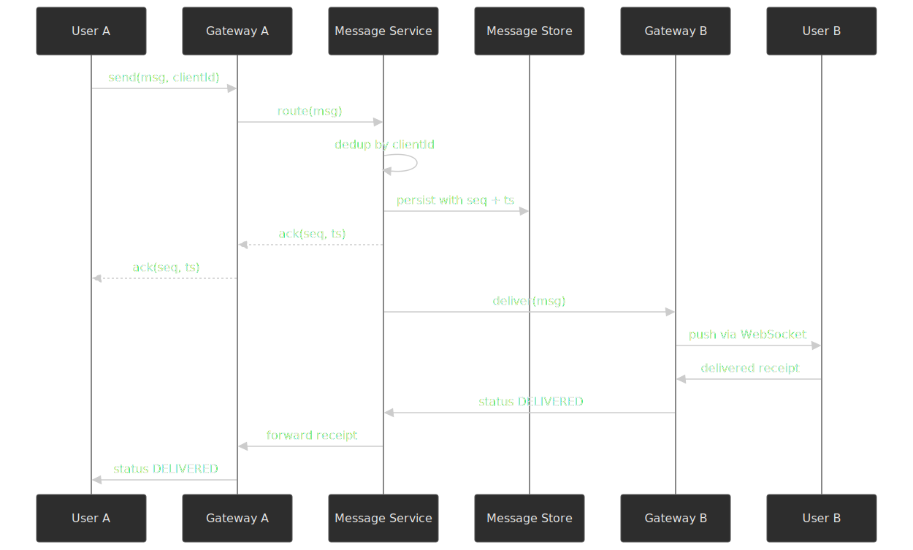

**Best when:**

- Latency is the dominant requirement.
- Group sizes are bounded (say, < 500 members).
- Strong per-conversation ordering is required and cross-region traffic is moderate.

**Trade-offs:**

- Lowest possible latency; the path is one RPC hop.
- Simple mental model.
- Strong per-conversation ordering — the message service serializes writes.
- Gateway state management complexity: graceful drain, connection migration on shutdown.
- Limited group size — fan-out cost is borne synchronously by the message service.

**Real-world parallel:** WhatsApp [scaled long-running TCP connections](https://highscalability.com/how-whatsapp-grew-to-nearly-500-million-users-11000-cores-an/) on FreeBSD/Erlang to ~1–2M connections per box, with messages routed directly between connection-holding nodes.

### Path B — Queue-centric (async fan-out)

Messages get persisted, then published to a partitioned log; fan-out workers consume and deliver.


**Best when:**

- Very large groups or channels (1,000+ members).
- Geographic distribution across regions.
- 100–500ms extra latency is acceptable.
- You need replay and audit (e.g., compliance, analytics).

**Trade-offs:**

- Handles large fan-out efficiently and back-pressure flows naturally through partition lag.
- Built-in replay capability; consumers can rewind.
- Better failure isolation — a slow consumer affects one partition, not the whole gateway pool.
- Higher latency: the queue hop adds tens to hundreds of milliseconds.
- More moving parts (Kafka itself is a system to operate).
- Ordering only holds within a partition, so the partition key matters.

**Real-world parallel:** Slack runs a [self-driving Kafka platform at ~6.5 Gbps peak across 10 clusters and ~700 TB](https://slack.engineering/building-self-driving-kafka-clusters-using-open-source-components/) — but Kafka is the backbone for jobs, logs, billing, and analytics rather than the chat fan-out itself. Their per-channel fan-out is handled by [Channel Servers](https://slack.engineering/real-time-messaging/) using consistent hashing, with edge [Gateway Servers](https://slack.engineering/migrating-millions-of-concurrent-websockets-to-envoy/) terminating WebSocket sessions.

### Path C — Hybrid (push for small, pull for large)

Pick per message based on conversation size.

 routes between direct push and queue-backed fan-out so most 1:1 and small-group traffic stays on the fast path.")

**Best when:**

- Mix of 1:1, small groups, and large channels (most consumer messengers).
- You need to balance latency for the common case against back-pressure for the long tail.
- Some conversations have celebrity-level fan-out.

**Trade-offs:**

- Optimal latency for the common case (1:1 and small groups stay on direct push).
- Scales to large channels without overwhelming the message service.
- Two code paths to operate and observe.
- The threshold (~50–100 members) needs tuning against actual gateway CPU and tail latency.
- Slightly inconsistent delivery timing across conversation sizes.

**Real-world parallel:** Discord uses a different mechanism but the same idea — every guild runs as a single Elixir [`GenServer`](https://discord.com/blog/how-discord-scaled-elixir-to-5-000-000-concurrent-users) that fans out via [BEAM message passing through the Manifold library](https://discord.com/blog/maxjourney-pushing-discords-limits-with-a-million-plus-online-users-in-a-single-server). For huge guilds Discord layers in Relays (intermediate fan-out processes) and Passive Sessions, which together cut fan-out cost by ~90% by skipping inactive viewers. Notably, Kafka is *not* on the chat-message hot path at Discord.

### Path comparison

| Factor              | Connection-Centric | Queue-Centric | Hybrid                  |
| ------------------- | ------------------ | ------------- | ----------------------- |
| Latency (p50)       | 50–100ms           | 100–300ms     | 50–300ms                |
| Max group size      | ~500               | unbounded     | unbounded               |
| Ordering guarantee  | per-conversation   | per-partition | per-conversation        |
| Failure isolation   | gateway-level      | partition-level | mixed                 |
| Replay              | weak               | native        | mixed                   |
| Production parallel | WhatsApp           | Slack (jobs/logs); LinkedIn messaging | Discord (BEAM-native); WhatsApp/Telegram for some flows |

### Why this article picks Path C

The hybrid approach:

1. Covers the full spectrum of use cases (1:1 to large channels).
2. Mirrors how production messengers actually behave — even when their plumbing differs (Discord's `GenServer` + Manifold is conceptually a hybrid).
3. Forces the most interesting trade-offs to surface — threshold tuning, ordering inside vs across paths, hot-shard mitigation.

## High-Level Design

The [overview diagram](#design-real-time-chat-and-messaging) at the top of the article is the system's component map; this section drills into the four service boundaries that matter.

### WebSocket Gateway

The gateway terminates client connections and routes everything else.



**Responsibilities:**

- WebSocket connection lifecycle (upgrade, heartbeat, drain, close).
- Authentication and session validation.
- Routing client → service and service → client.
- Presence event broadcasting on connect/disconnect.
- Graceful drain on rolling deploys (notify clients to reconnect with a hint of which gateway to try next).

**Design decisions:**

| Decision               | Choice                            | Rationale                                                                                                |
| ---------------------- | --------------------------------- | -------------------------------------------------------------------------------------------------------- |
| Protocol               | WebSocket over TLS ([RFC 6455](https://datatracker.ietf.org/doc/html/rfc6455)) | Full-duplex; minimum 2-byte frame header server→client, 6 bytes client→server (mandatory mask, [§5.3](https://datatracker.ietf.org/doc/html/rfc6455#section-5.3)). |
| Session affinity       | Consistent hashing by `user_id`, sticky at the L7 LB by JWT `sub` (or a `srv_id` cookie for browser fallbacks) | Predictable routing simplifies presence and per-user state. Cookie-based stickiness avoids the NAT/VPN clumping that pure source-IP hashing causes. |
| Cross-pod delivery     | Redis pub/sub (or gRPC) keyed by `connection_id` | A message for a user on a different pod looks up the gateway in Redis and is routed there in one hop, without losing per-conversation ordering (which is enforced upstream at the message service). |
| Heartbeat              | 30s ping/pong ([RFC 6455 §5.5.2](https://datatracker.ietf.org/doc/html/rfc6455#section-5.5.2))   | Balance between detection speed and battery/cell-radio drain on mobile.                                  |
| Connection timeout     | 90s (3 missed heartbeats)         | Survives short cell handovers without dropping the session.                                              |
| Max connections / pod  | ~500K                             | Memory-bound (~few KB per connection); kernel can do more after `sysctl` tuning.                         |
| Resume token           | Opaque, short-TTL                 | Allows fast reconnect to the same logical session without re-establishing presence subscriptions.        |
| Fallback transport     | Long-poll receive + HTTP POST send | Some corporate proxies/firewalls block the WebSocket upgrade. Slack documents this "[degraded mode](https://slack.engineering/migrating-millions-of-concurrent-websockets-to-envoy/)" path. |

**Scaling approach:**

- Horizontal scaling with consistent hashing.
- User → gateway mapping stored in Redis with short TTL.
- Graceful drain: send `connection.drain` with a 30s deadline; clients reconnect during the window.

> [!IMPORTANT]
> Gateway pods are stateful in memory but stateless on disk. Treat the in-memory `connection_id → user_id` map as a cache of Redis. If a pod dies, clients reconnect, repopulate the map, and the system keeps moving — there is no on-disk state to recover.

> [!NOTE]
> The capability-negotiation pattern from [IRCv3 `CAP LS 302`](https://ircv3.net/specs/extensions/capability-negotiation.html) and [labeled responses](https://ircv3.net/specs/extensions/labeled-response) is worth borrowing for the handshake: advertise feature flags up front, let clients opt into typing tags / read receipts / batched chat history, and correlate every request with a server response via an explicit `label`. It avoids version-skew bugs as the protocol grows.

### Message Service

The message service is the linearization point per conversation. Everything else can be eventually consistent; this cannot.

**State per message:**

```ts title="message.ts"
interface Message {
  messageId: string         // UUID, client-generated for idempotency
  conversationId: string    // 1:1 or group conversation
  senderId: string
  content: MessageContent
  timestamp: number         // server-assigned epoch millis
  sequenceNumber: bigint    // per-conversation monotonic
  status: MessageStatus     // PENDING | SENT | DELIVERED | READ
  expiresAt?: number        // optional TTL
}

interface MessageContent {
  type: "text" | "image" | "file" | "location"
  text?: string
  mediaUrl?: string
  metadata?: Record<string, unknown>
}

type MessageStatus = "PENDING" | "SENT" | "DELIVERED" | "READ"
```

**Message flow on send:**

1. **Receive** — gateway forwards `message.send` with the client-generated `messageId`.
2. **Deduplicate** — check `messageId` in the recent-message Redis cache (idempotent retry).
3. **Validate** — sender membership, rate limits, content checks.
4. **Sequence + persist** — assign sequence number atomically; write to ScyllaDB with server timestamp.
5. **Acknowledge** — return `(sequenceNumber, timestamp)` to the sender.
6. **Route** — direct push or Kafka, based on member count.
7. **Fan-out** — distribute to recipient gateways and the push gateway.

### Presence Service

Presence is intentionally low-fidelity. The service holds heartbeat-derived TTL state in Redis and broadcasts deltas via pub/sub. The conceptual model — "online" as a TTL-bounded subscription, with deltas pushed to subscribers — is the same one [XMPP RFC 6121 §3](https://datatracker.ietf.org/doc/html/rfc6121#section-3) defines for presence subscriptions, just realised with Redis instead of XML stanzas.

![Presence pipeline sequence: a client sends a heartbeat to its gateway every 30s; the gateway HSETs presence:user with status=online and refreshes a 120s TTL in Redis. State changes (typing.start, going offline) write a SETEX or DEL and PUBLISH to presence:changes; subscriber gateways receive the delta, filter by their subscribed users, and push presence.update / typing.update to clients. When a client misses heartbeats, the Redis TTL expires and a keyspace notification triggers an offline broadcast.](./diagrams/presence-pipeline-light.svg "Presence pipeline: heartbeat → Redis TTL → pub/sub fan-out to subscriber gateways. Last-seen falls out of the TTL automatically; no explicit \"offline\" message is required when the client just goes away.")
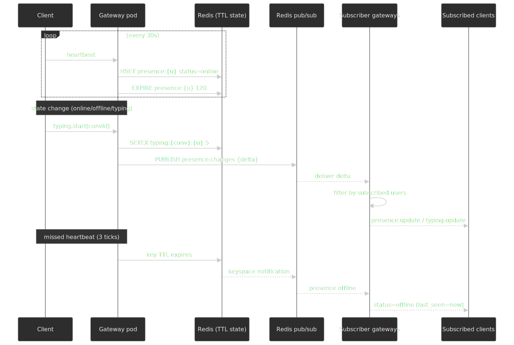

**Design decisions:**

- **No persistence** — presence is reconstructed from heartbeats; nothing on disk.
- **TTL-based** — keys auto-expire; "last seen" is the negative space.
- **Pub/sub distribution** — Redis pub/sub for delta updates between gateways.
- **Throttled** — at most one presence update per user per second; typing indicators capped at one event per second.

**Data structures:**

```ts title="presence.ts"
interface UserPresence {
  userId: string
  status: "online" | "away" | "offline"
  lastSeen: number          // epoch millis
  deviceType: "mobile" | "web" | "desktop"
  typingIn?: string         // conversationId if typing
  typingExpires?: number    // auto-clear after 5s
}
```

**Presence subscription:**

- Users subscribe to presence of their contacts on connect.
- Changes broadcast via Redis pub/sub channels keyed by `user_id`.
- Gateways filter and forward to the relevant connected clients.

> [!NOTE]
> [LinkedIn's presence platform](https://www.linkedin.com/blog/engineering/product-design/now-you-see-me-now-you-dont-linkedins-real-time-presence-platf) sits at the same conceptual point — persistent connections (in their case Server-Sent Events, not WebSocket), an Akka actor per session, and a target end-to-end publish latency under 100ms. They explicitly smooth out connection flapping on lossy mobile networks; design for that early.

### Sync Service

The sync service replays missed messages on reconnect. It is the boring but load-bearing service nobody talks about.

**Sync protocol:**

- Each device maintains `(conversationId → lastSequenceNumber)` locally.
- On reconnect, the device sends the list to the sync service.
- The service returns all messages with `sequenceNumber > lastSequenceNumber` per conversation.
- The client merges into its local store, deduplicating by `messageId`.

**Pagination:**

- Default page size: 50 messages.
- Cursor: `(conversationId, sequenceNumber)`.
- Bidirectional — forward (newer) and backward (older) fetching for history scrubbing.

## API Design

### WebSocket protocol

#### Connection handshake

```text title="connect.txt"
wss://chat.example.com/ws?token={jwt}&device_id={uuid}
```

**Initial server → client message:**

```json title="connected.json"
{
  "type": "connected",
  "connectionId": "conn_abc123",
  "serverTime": 1706886400000,
  "heartbeatInterval": 30000,
  "resumeToken": "resume_xyz789"
}
```

#### Client → server messages

**Send Message:**

```json title="send.json"
{
  "type": "message.send",
  "id": "req_001",
  "payload": {
    "messageId": "msg_uuid_client_generated",
    "conversationId": "conv_abc123",
    "content": { "type": "text", "text": "Hello, world!" }
  }
}
```

**Typing Indicator:**

```json title="typing.json"
{
  "type": "typing.start",
  "payload": { "conversationId": "conv_abc123" }
}
```

**Mark Read:**

```json title="read.json"
{
  "type": "message.read",
  "payload": {
    "conversationId": "conv_abc123",
    "upToSequence": 1542
  }
}
```

**Heartbeat:**

```json title="heartbeat.json"
{
  "type": "heartbeat",
  "timestamp": 1706886400000
}
```

#### Server → client messages

**Acknowledgment:**

```json title="ack.json"
{
  "type": "message.ack",
  "id": "req_001",
  "payload": {
    "messageId": "msg_uuid_client_generated",
    "sequenceNumber": 1543,
    "timestamp": 1706886400123
  }
}
```

**New message:**

```json title="new.json"
{
  "type": "message.new",
  "payload": {
    "messageId": "msg_xyz789",
    "conversationId": "conv_abc123",
    "senderId": "user_456",
    "content": { "type": "text", "text": "Hi there!" },
    "sequenceNumber": 1544,
    "timestamp": 1706886401000
  }
}
```

**Delivery receipt:**

```json title="delivered.json"
{
  "type": "message.delivered",
  "payload": {
    "conversationId": "conv_abc123",
    "messageIds": ["msg_uuid_1", "msg_uuid_2"],
    "deliveredTo": "user_456",
    "timestamp": 1706886402000
  }
}
```

**Read receipt:**

```json title="read-receipt.json"
{
  "type": "message.read_receipt",
  "payload": {
    "conversationId": "conv_abc123",
    "readUpToSequence": 1544,
    "readBy": "user_456",
    "timestamp": 1706886403000
  }
}
```

**Presence update:**

```json title="presence.json"
{
  "type": "presence.update",
  "payload": { "userId": "user_456", "status": "online", "typingIn": null }
}
```

**Typing update:**

```json title="typing-update.json"
{
  "type": "typing.update",
  "payload": {
    "conversationId": "conv_abc123",
    "userId": "user_456",
    "isTyping": true
  }
}
```

### REST API

#### Sync messages (offline recovery)

`POST /api/v1/sync`

```json title="sync-req.json"
{
  "conversations": [
    { "conversationId": "conv_abc", "lastSequence": 1500 },
    { "conversationId": "conv_xyz", "lastSequence": 2300 }
  ],
  "limit": 100
}
```

```json title="sync-resp.json"
{
  "conversations": [
    {
      "conversationId": "conv_abc",
      "messages": [
        {
          "messageId": "msg_001",
          "senderId": "user_123",
          "content": { "type": "text", "text": "Hello" },
          "sequenceNumber": 1501,
          "timestamp": 1706886400000,
          "status": "DELIVERED"
        }
      ],
      "hasMore": false
    }
  ],
  "serverTime": 1706886500000
}
```

#### Create conversation

`POST /api/v1/conversations`

```json title="create-conversation.json"
{ "type": "direct", "participantIds": ["user_456"] }
```

#### Create group

`POST /api/v1/groups`

```json title="create-group.json"
{
  "name": "Project Team",
  "participantIds": ["user_456", "user_789"],
  "settings": {
    "onlyAdminsCanPost": false,
    "allowMemberInvites": true
  }
}
```

#### Message history

`GET /api/v1/conversations/{id}/messages?before={sequence}&limit=50`

### Error responses

| Code | Error                    | When                         |
| ---- | ------------------------ | ---------------------------- |
| 400  | `INVALID_MESSAGE`        | Message format invalid       |
| 401  | `UNAUTHORIZED`           | Invalid or expired token     |
| 403  | `FORBIDDEN`              | Not a member of conversation |
| 404  | `CONVERSATION_NOT_FOUND` | Conversation doesn't exist   |
| 409  | `DUPLICATE_MESSAGE`      | `messageId` already processed  |
| 429  | `RATE_LIMITED`           | Too many messages            |

```json title="rate-limited.json"
{
  "error": "RATE_LIMITED",
  "message": "Message rate limit exceeded",
  "retryAfter": 5,
  "limit": "100 messages per minute"
}
```

## Data Modeling

### Message storage (ScyllaDB)

Per-conversation time-series access dominates the workload, so we partition by `conversation_id` and cluster by `sequence_number`.

```sql title="messages.cql"
CREATE TABLE messages (
    conversation_id UUID,
    sequence_number BIGINT,
    message_id UUID,
    sender_id UUID,
    content_type TEXT,
    content_text TEXT,
    content_media_url TEXT,
    timestamp TIMESTAMP,
    status TEXT,
    expires_at TIMESTAMP,
    PRIMARY KEY ((conversation_id), sequence_number)
) WITH CLUSTERING ORDER BY (sequence_number DESC);
```

**Why ScyllaDB:**

- Time-series-friendly partitioning matches the access pattern.
- Shard-per-core C++ runtime — no JVM GC pauses.
- Linear horizontal scaling.
- Discord migrated from Cassandra to ScyllaDB and reported [p99 historical-fetch latency dropping from 40–125ms to a steady 15ms](https://discord.com/blog/how-discord-stores-trillions-of-messages), with inserts dropping from 5–70ms to a steady 5ms — and the cluster collapsing from 177 Cassandra nodes to 72 ScyllaDB nodes.

**Partitioning rules of thumb:**

- ScyllaDB defaults to a 1000MB partition warning threshold, but [the practical "large partition" line is around 100MB](https://www.scylladb.com/2024/11/05/making-effective-partitions-for-scylladb-data-modeling/) — about 200K messages per conversation at 500B each.
- For very active conversations, add a time bucket to the partition key: `((conversation_id, time_bucket), sequence_number)` with daily buckets for active chats and monthly for archives.

### Message deduplication cache (Redis)

```redis title="dedup.redis"
SETEX msg:dedup:{message_id} 86400 1
EXISTS msg:dedup:{message_id}
```

24h TTL covers the longest realistic retry window from a flaky mobile client.

### User and conversation metadata (PostgreSQL)

```sql title="metadata.sql"
CREATE TABLE users (
    id UUID PRIMARY KEY DEFAULT gen_random_uuid(),
    username VARCHAR(50) UNIQUE NOT NULL,
    display_name VARCHAR(100),
    avatar_url TEXT,
    phone_hash VARCHAR(64) UNIQUE,
    created_at TIMESTAMPTZ DEFAULT NOW(),
    last_active_at TIMESTAMPTZ
);

CREATE TABLE conversations (
    id UUID PRIMARY KEY DEFAULT gen_random_uuid(),
    type VARCHAR(20) NOT NULL,        -- 'direct' or 'group'
    name VARCHAR(100),                -- NULL for direct
    avatar_url TEXT,
    created_by UUID REFERENCES users(id),
    created_at TIMESTAMPTZ DEFAULT NOW(),
    updated_at TIMESTAMPTZ DEFAULT NOW(),
    last_message_at TIMESTAMPTZ,
    last_sequence BIGINT DEFAULT 0,
    member_count INT DEFAULT 0,
    settings JSONB DEFAULT '{}'
);

CREATE TABLE conversation_members (
    conversation_id UUID REFERENCES conversations(id) ON DELETE CASCADE,
    user_id UUID REFERENCES users(id) ON DELETE CASCADE,
    role VARCHAR(20) DEFAULT 'member', -- 'admin' or 'member'
    joined_at TIMESTAMPTZ DEFAULT NOW(),
    last_read_sequence BIGINT DEFAULT 0,
    muted_until TIMESTAMPTZ,
    PRIMARY KEY (conversation_id, user_id)
);

CREATE INDEX idx_members_user ON conversation_members(user_id);
CREATE INDEX idx_conversations_updated ON conversations(updated_at DESC);
```

### Session and connection state (Redis)

```redis title="state.redis"
SADD user:conn:{user_id} {connection_id}
SREM user:conn:{user_id} {connection_id}

HSET conn:{connection_id}
    gateway "gateway-1.us-east-1"
    user_id "user_123"
    device_id "device_abc"
    connected_at 1706886400000

HSET presence:{user_id}
    status "online"
    last_seen 1706886400000
    device_type "mobile"
EXPIRE presence:{user_id} 120

SETEX typing:{conversation_id}:{user_id} 5 1
```

### Database selection matrix

| Data                  | Store              | Why                                                    |
| --------------------- | ------------------ | ------------------------------------------------------ |
| Messages              | ScyllaDB           | Time-series partitioning, low latency, horizontal scale |
| User profiles         | PostgreSQL         | ACID, complex queries, moderate scale                   |
| Conversation metadata | PostgreSQL         | Relational queries, ACL management                      |
| Sessions, presence    | Redis Cluster      | Sub-ms latency, TTL, pub/sub                           |
| Message dedup cache   | Redis              | Fast lookups, automatic expiry                         |
| Media files           | S3                 | Object storage with CDN integration                    |
| Analytics events      | Kafka → ClickHouse | High-volume time-series analytics                      |

## Low-Level Design

### Message delivery pipeline

#### Direct push (small groups)

For conversations with < 100 members:

```ts title="direct-push.ts" collapse={1-12}
class DirectPushHandler {
  private readonly redis: RedisCluster
  private readonly messageStore: MessageStore

  async deliverMessage(message: Message): Promise<void> {
    const members = await this.getConversationMembers(message.conversationId)

    const deliveryTasks = members
      .filter((m) => m.userId !== message.senderId)
      .map(async (member) => {
        const connections = await this.redis.smembers(`user:conn:${member.userId}`)

        if (connections.length > 0) {
          await Promise.all(connections.map((connId) => this.pushToConnection(connId, message)))
          return { userId: member.userId, status: "pushed" as const }
        } else {
          await this.queuePushNotification(member.userId, message)
          return { userId: member.userId, status: "queued" as const }
        }
      })

    const results = await Promise.all(deliveryTasks)

    const deliveredTo = results.filter((r) => r.status === "pushed").map((r) => r.userId)

    if (deliveredTo.length > 0) {
      await this.notifyDeliveryReceipt(message, deliveredTo)
    }
  }

  private async pushToConnection(connId: string, message: Message): Promise<void> {
    const connInfo = await this.redis.hgetall(`conn:${connId}`)
    const gateway = connInfo.gateway

    await this.gatewayClient.send(gateway, {
      type: "deliver",
      connectionId: connId,
      message,
    })
  }
}
```

#### Kafka fan-out (large groups)

For conversations with ≥ 100 members:

```ts title="kafka-fanout.ts" collapse={1-15}
class KafkaFanoutHandler {
  private readonly kafka: KafkaProducer
  private readonly FANOUT_TOPIC = "messages.fanout"

  async publishForFanout(message: Message, memberCount: number): Promise<void> {
    await this.kafka.send({
      topic: this.FANOUT_TOPIC,
      messages: [
        {
          key: message.conversationId, // partition for ordering
          value: JSON.stringify({
            message,
            memberCount,
            publishedAt: Date.now(),
          }),
        },
      ],
    })
  }
}

class FanoutConsumer {
  private readonly BATCH_SIZE = 100

  async processMessage(record: KafkaRecord): Promise<void> {
    const { message, memberCount } = JSON.parse(record.value)

    let offset = 0
    while (offset < memberCount) {
      const memberBatch = await this.getMemberBatch(message.conversationId, offset, this.BATCH_SIZE)

      await Promise.all(memberBatch.map((member) => this.deliverToMember(member, message)))

      offset += this.BATCH_SIZE
    }
  }
}
```

### Message ordering and sequencing

Every message walks the same state machine, regardless of fan-out path. Treat the diagram as the contract between the client UI and the server: anything the UI shows has to map to one of these states.



#### Sequence number assignment

```ts title="sequencer.ts" collapse={1-8}
class SequenceGenerator {
  private readonly redis: RedisCluster

  async getNextSequence(conversationId: string): Promise<bigint> {
    const sequence = await this.redis.incr(`seq:${conversationId}`)
    return BigInt(sequence)
  }
}

class MessageProcessor {
  async processIncoming(conversationId: string, message: IncomingMessage): Promise<ProcessedMessage> {
    const lock = await this.acquireLock(`lock:msg:${conversationId}`, 5000)

    try {
      const sequenceNumber = await this.sequenceGenerator.getNextSequence(conversationId)
      const timestamp = Date.now()

      const processed: ProcessedMessage = {
        ...message,
        sequenceNumber,
        timestamp,
        status: "SENT",
      }

      await this.messageStore.insert(processed)
      return processed
    } finally {
      await lock.release()
    }
  }
}
```

> [!CAUTION]
> Per-conversation Redis `INCR` is the single most contended operation in this system. For very hot conversations, shard sequence assignment by routing all writes to one logical owner (the Channel Server pattern Slack uses) so the increment becomes a local memory op rather than a distributed lock.

#### Client-side ordering

```ts title="client-ordering.ts" collapse={1-10}
class ClientMessageBuffer {
  private pendingMessages: Map<string, Message[]> = new Map()
  private lastSequence: Map<string, bigint> = new Map()

  onMessageReceived(message: Message): void {
    const expected = (this.lastSequence.get(message.conversationId) || 0n) + 1n

    if (message.sequenceNumber === expected) {
      this.deliverToUI(message)
      this.lastSequence.set(message.conversationId, message.sequenceNumber)
      this.flushBuffer(message.conversationId)
    } else if (message.sequenceNumber > expected) {
      this.bufferMessage(message)
      this.requestMissing(message.conversationId, expected, message.sequenceNumber)
    }
    // sequence < expected → duplicate → ignore
  }

  private flushBuffer(conversationId: string): void {
    const buffer = this.pendingMessages.get(conversationId) || []
    buffer.sort((a, b) => Number(a.sequenceNumber - b.sequenceNumber))

    let expected = (this.lastSequence.get(conversationId) || 0n) + 1n
    while (buffer.length > 0 && buffer[0].sequenceNumber === expected) {
      const msg = buffer.shift()!
      this.deliverToUI(msg)
      this.lastSequence.set(conversationId, msg.sequenceNumber)
      expected++
    }

    this.pendingMessages.set(conversationId, buffer)
  }
}
```

### Multi-device sync

A user with phone, tablet, and laptop logged in is the common case, not the edge case. The model:

- Each linked device is its own connection with a stable `device_id`.
- The message service maintains a per-device cursor: `(user_id, device_id, conversation_id) → lastSeq`.
- Messages are fanned out to *all* online devices for the user, including the sender's own non-active devices ("self-echo").
- Read receipts collapse across devices: any device marking `upToSequence = N` advances the user's per-conversation watermark; the other devices receive `read_receipt` events to dim notifications.


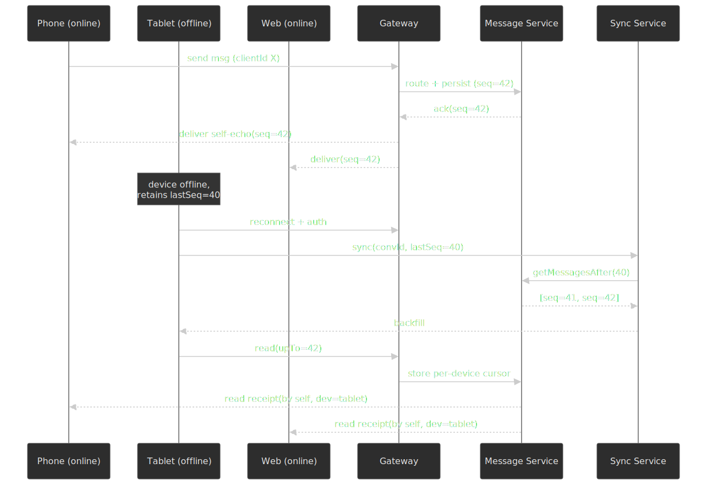

> [!NOTE]
> [WhatsApp's multi-device design](https://engineering.fb.com/2021/07/14/security/whatsapp-multi-device/) is the reference for E2EE messengers — each device has its own identity key and the sender encrypts once per device. For non-E2EE messengers like Telegram cloud chats, the model collapses to "the server-stored conversation is the truth and every device pulls from it" — simpler at the cost of giving up E2EE guarantees.

### Presence system

#### Heartbeat processing

```ts title="presence.ts" collapse={1-10}
class PresenceManager {
  private readonly PRESENCE_TTL = 120
  private readonly TYPING_TTL = 5

  async handleHeartbeat(userId: string, deviceType: string): Promise<void> {
    const now = Date.now()

    await this.redis
      .multi()
      .hset(`presence:${userId}`, {
        status: "online",
        last_seen: now,
        device_type: deviceType,
      })
      .expire(`presence:${userId}`, this.PRESENCE_TTL)
      .exec()

    await this.redis.publish(
      `presence:changes`,
      JSON.stringify({ userId, status: "online", timestamp: now }),
    )
  }

  async handleDisconnect(userId: string): Promise<void> {
    const connections = await this.redis.smembers(`user:conn:${userId}`)

    if (connections.length === 0) {
      const now = Date.now()

      await this.redis.hset(`presence:${userId}`, { status: "offline", last_seen: now })

      await this.redis.publish(
        `presence:changes`,
        JSON.stringify({ userId, status: "offline", lastSeen: now }),
      )
    }
  }

  async setTyping(userId: string, conversationId: string): Promise<void> {
    await this.redis.setex(`typing:${conversationId}:${userId}`, this.TYPING_TTL, "1")

    await this.redis.publish(
      `typing:${conversationId}`,
      JSON.stringify({ userId, isTyping: true }),
    )
  }
}
```

#### Presence subscription

```ts title="presence-sub.ts" collapse={1-12}
class PresenceSubscriber {
  private subscribedUsers: Set<string> = new Set()

  async subscribeToContacts(userId: string, contactIds: string[]): Promise<void> {
    const pipeline = this.redis.pipeline()
    contactIds.forEach((id) => pipeline.hgetall(`presence:${id}`))
    const results = await pipeline.exec()

    const presences = contactIds.map((id, i) => ({
      userId: id,
      ...(results[i][1] || { status: "offline" }),
    }))

    this.sendToClient({ type: "presence.bulk", payload: { presences } })

    contactIds.forEach((id) => this.subscribedUsers.add(id))
  }

  onPresenceChange(change: PresenceChange): void {
    if (this.subscribedUsers.has(change.userId)) {
      this.sendToClient({ type: "presence.update", payload: change })
    }
  }
}
```

### Push notifications for offline delivery

When a recipient has no live WebSocket, the gateway hands the message envelope to the **push gateway**, which bridges to APNs (iOS) and FCM (Android, Web). The boundary matters — these vendors have their own delivery semantics that the chat system has to design around:

- **Best-effort delivery, not guaranteed.** APNs and FCM coalesce queued notifications when a device has been offline for too long; the push is a *hint* that the device should reconnect and replay via the sync service, not the durable copy.
- **Collapse keys / `apns-collapse-id`.** Use a per-conversation collapse key so a flurry of messages while the device is offline shows up as one badge, not 50.
- **Silent / data-only pushes** (`content-available: 1`, FCM `data` payload) wake the app to fetch the actual message over the chat channel, which avoids leaking message text into the OS notification payload — essential for E2EE messengers, where the server has no plaintext to put in the visible body.
- **TTL.** Set a short TTL (`apns-expiration` / FCM `time_to_live`) so a queue that has aged past usefulness drops cleanly instead of floods the user on reconnect.
- **Throttling.** APNs and FCM both throttle abusive senders; back off on `429` / `Too many requests` and surface the throttle to product (don't retry blindly).

This layer is the most common source of "the system says delivered but the user never saw it" bug reports — design for the push to be *advisory* and the sync replay on reconnect to be *authoritative*.

### Offline sync protocol

```ts title="sync.ts" collapse={1-15}
class SyncService {
  async syncConversations(
    userId: string,
    syncState: Array<{ conversationId: string; lastSequence: bigint }>,
  ): Promise<SyncResponse> {
    const results: ConversationSync[] = []

    for (const { conversationId, lastSequence } of syncState) {
      const isMember = await this.checkMembership(userId, conversationId)
      if (!isMember) continue

      const messages = await this.messageStore.getMessagesAfter(conversationId, lastSequence, 100)
      const conversation = await this.conversationStore.get(conversationId)

      results.push({
        conversationId,
        messages,
        hasMore: messages.length === 100,
        lastSequence:
          messages.length > 0 ? messages[messages.length - 1].sequenceNumber : lastSequence,
        unreadCount: await this.getUnreadCount(userId, conversationId),
      })
    }

    const newConversations = await this.getNewConversations(userId, syncState)

    return { conversations: results, newConversations, serverTime: Date.now() }
  }
}
```

## Frontend Considerations

### Connection management

Reconnect with capped exponential backoff and jitter:

```ts title="ws-manager.ts" collapse={1-15}
class WebSocketManager {
  private ws: WebSocket | null = null
  private reconnectAttempt = 0
  private readonly MAX_RECONNECT_DELAY = 30000
  private readonly BASE_DELAY = 1000

  connect(): void {
    this.ws = new WebSocket(this.buildUrl())

    this.ws.onopen = () => {
      this.reconnectAttempt = 0
      this.onConnected()
    }

    this.ws.onclose = (event) => {
      if (!event.wasClean) this.scheduleReconnect()
    }

    this.ws.onerror = () => {
      // surfaces as onclose
    }
  }

  private scheduleReconnect(): void {
    const delay = Math.min(
      this.BASE_DELAY * Math.pow(2, this.reconnectAttempt) + Math.random() * 1000,
      this.MAX_RECONNECT_DELAY,
    )
    this.reconnectAttempt++
    setTimeout(() => this.connect(), delay)
  }
}
```

### Local message storage

IndexedDB schema for offline support:

```ts title="local-store.ts" collapse={1-20}
interface LocalDBSchema {
  messages: {
    key: [string, number]      // [conversationId, sequenceNumber]
    value: Message
    indexes: {
      "by-conversation": string
      "by-timestamp": number
      "by-status": string
    }
  }
  conversations: {
    key: string                 // conversationId
    value: ConversationMeta
    indexes: { "by-updated": number }
  }
  syncState: {
    key: string                 // conversationId
    value: { lastSequence: number; lastSync: number }
  }
}

class LocalMessageStore {
  private db: IDBDatabase

  async saveMessage(message: Message): Promise<void> {
    const tx = this.db.transaction("messages", "readwrite")
    await tx.objectStore("messages").put(message)
  }

  async getMessages(
    conversationId: string,
    options: { before?: number; limit: number },
  ): Promise<Message[]> {
    const tx = this.db.transaction("messages", "readonly")
    const index = tx.objectStore("messages").index("by-conversation")

    const range = IDBKeyRange.bound(
      [conversationId, 0],
      [conversationId, options.before || Number.MAX_SAFE_INTEGER],
    )

    const messages: Message[] = []
    let cursor = await index.openCursor(range, "prev")

    while (cursor && messages.length < options.limit) {
      messages.push(cursor.value)
      cursor = await cursor.continue()
    }

    return messages
  }
}
```

### Optimistic updates

```ts title="sender.ts" collapse={1-10}
class MessageSender {
  async sendMessage(conversationId: string, content: MessageContent): Promise<void> {
    const clientMessageId = crypto.randomUUID()
    const optimisticMessage: Message = {
      messageId: clientMessageId,
      conversationId,
      senderId: this.currentUserId,
      content,
      timestamp: Date.now(),
      sequenceNumber: -1n,
      status: "PENDING",
    }

    this.messageStore.addOptimistic(optimisticMessage)
    this.ui.appendMessage(optimisticMessage)
    await this.localDb.saveMessage(optimisticMessage)

    try {
      const ack = await this.ws.sendAndWait({
        type: "message.send",
        payload: { messageId: clientMessageId, conversationId, content },
      })

      const confirmedMessage = {
        ...optimisticMessage,
        sequenceNumber: ack.sequenceNumber,
        timestamp: ack.timestamp,
        status: "SENT" as const,
      }

      this.messageStore.updateOptimistic(clientMessageId, confirmedMessage)
      await this.localDb.saveMessage(confirmedMessage)
    } catch (error) {
      this.messageStore.markFailed(clientMessageId)
      this.ui.showRetryOption(clientMessageId)
    }
  }
}
```

### Virtual list for message history

```ts title="virtual-list.ts" collapse={1-15}
interface VirtualListConfig {
  containerHeight: number
  itemHeight: number  // estimated; variable heights supported
  overscan: number
}

class VirtualMessageList {
  private visibleRange = { start: 0, end: 0 }
  private heightCache = new Map<string, number>()

  calculateVisibleRange(scrollTop: number): { start: number; end: number } {
    const messages = this.getMessages()
    let accumulatedHeight = 0
    let start = 0
    let end = messages.length

    for (let i = 0; i < messages.length; i++) {
      const height = this.getItemHeight(messages[i])
      if (accumulatedHeight + height > scrollTop - this.config.overscan * 50) {
        start = i
        break
      }
      accumulatedHeight += height
    }

    accumulatedHeight = 0
    for (let i = start; i < messages.length; i++) {
      accumulatedHeight += this.getItemHeight(messages[i])
      if (accumulatedHeight > this.config.containerHeight + this.config.overscan * 50) {
        end = i + 1
        break
      }
    }

    return { start, end }
  }

  render(): MessageItem[] {
    const { start, end } = this.visibleRange
    return this.getMessages().slice(start, end)
  }
}
```

## Failure Modes and Operational Behavior

A senior reviewer will ask the same five questions about every distributed system. Here are the answers for this design.

| Failure                                   | Detection                                                       | Recovery                                                                                                                            | User-visible impact                                                  |
| ----------------------------------------- | --------------------------------------------------------------- | ----------------------------------------------------------------------------------------------------------------------------------- | -------------------------------------------------------------------- |
| Single gateway pod dies                   | Health check fails; Redis presence keys for that pod expire     | Clients reconnect via the load balancer; consistent-hash ring rebalances; sync service backfills missed messages                     | A few seconds of stale presence; in-flight sends retried via dedup    |
| Gateway rolling deploy                    | Drain signal                                                    | Pod sends `connection.drain` to its clients with a 30s deadline; clients reconnect to a new pod during the window                    | Brief reconnect blip; no message loss                                |
| Message service node crash                | Heartbeat to control plane fails                                | Stateless service; new pod takes over; in-flight requests time out and are retried by the gateway with the same `messageId`           | Slightly higher tail latency for the few seconds of failover         |
| Redis pub/sub partition                   | Subscriber lag metric                                           | Presence updates degrade gracefully — TTL-based fallback still works; typing indicators may be lost                                  | Stale presence and missing typing indicators; messages unaffected    |
| Kafka broker loss                         | ISR shrinks; producer ack timeouts                              | Producer retries with idempotence; partition leadership fails over within seconds; consumers resume from committed offsets           | Brief delivery latency spike for large groups; small groups unaffected |
| ScyllaDB node loss                        | Coordinator notices unavailable replicas                        | RF=3 quorum still satisfies reads/writes; node rejoins; repair restores data                                                         | None at the user level                                               |
| Hot conversation (celebrity, megagroup)   | Partition CPU saturation, sequence-INCR contention, fan-out lag | Pin to dedicated channel-server affinity; coalesce writes; promote to queue-backed fan-out; downsample passive viewers (Discord-style) | Non-active viewers see slightly stale state; active conversation stays responsive |
| Network partition between regions         | Inter-region link health checks                                 | Each region serves its local users; cross-region messages queue and replay on heal; conversations split-brained for the partition window | Cross-region delivery degraded; intra-region unaffected               |
| Total WebSocket failure (firewall, proxy) | Client cannot upgrade                                           | Fall back to long-polling for receive and HTTP `POST` for send (Slack's "degraded mode")                                              | Higher latency; receipts delayed; basic functionality preserved      |

> [!WARNING]
> The single most common production-killer in chat systems is the *thundering herd on reconnect* after a regional gateway restart. Always randomize reconnect delay with jitter, cap concurrent connection attempts per region, and pre-warm the gateway pool before draining the old fleet.

## Hot-conversation mitigation

A tiny number of conversations carry an outsized fraction of the load. Three patterns work in practice:

- **Channel-server affinity** — pin a conversation's writes to one in-memory owner. Slack's [Channel Server design](https://slack.engineering/real-time-messaging/) uses consistent hashing so a host owns ~16M channels at peak. This makes per-conversation `INCR` a local op.
- **Active vs passive sessions** — only fan out real-time updates to viewers actively reading. Discord's [Maxjourney post](https://discord.com/blog/maxjourney-pushing-discords-limits-with-a-million-plus-online-users-in-a-single-server) reports a ~90% reduction in fan-out cost from this single change.
- **Relay tier** — insert intermediate fan-out processes between the conversation owner and the connected sessions so the owner only has to send to a handful of relays (which then fan out further). Discord's Relays make 1M+ online users in a single guild tractable.

## End-to-end encryption

E2EE is structurally different from server-side encryption: the server never holds plaintext, so it cannot search, moderate, or transcode messages, and the work of key management is pushed onto the clients. The protocol choice splits cleanly along conversation cardinality.

### 1:1 — X3DH + Double Ratchet

The Signal Protocol is the de facto baseline. It composes two pieces:

- **[X3DH (Extended Triple Diffie-Hellman)](https://signal.org/docs/specifications/x3dh/)** is an asynchronous key-agreement protocol. The recipient publishes a *prekey bundle* — long-term identity key, signed prekey, and one-time prekeys — to the server. The sender can derive a shared secret without the recipient being online, by combining four DH operations: identity↔signed-prekey, ephemeral↔identity, ephemeral↔signed-prekey, and (when available) ephemeral↔one-time-prekey, fed through HKDF. This gives mutual authentication, forward secrecy, and cryptographic deniability.
- **[Double Ratchet](https://signal.org/docs/specifications/doubleratchet/)** drives the per-message keys after X3DH. A symmetric KDF chain produces a unique message key for every message (forward secrecy: compromising the current chain key does not reveal past keys), and a fresh DH ratchet step on every reply rotates the root secret (post-compromise security: an attacker who steals state at time *t* loses access once both sides have ratcheted past *t*).

Operationally this means the server stores ciphertext only, plus an opaque envelope (`recipient_device_id`, `ciphertext`, `iv`, `mac`, `prekey_id`) per recipient.

### Group — Sender Keys vs MLS

Two designs dominate, with very different cost curves.

![Sender Keys vs MLS group key flow: the left pane shows Signal-style Sender Keys, where each member runs a 1:1 X3DH/Double Ratchet session with every other member to distribute their per-group sender chain key, with O(N) cost per join/leave and an O(N) rekey on remove. The right pane shows the MLS TreeKEM ratchet tree, with leaves for each member rolling up through internal nodes to a root secret; a path update touches log2(N) nodes, a Commit advances the epoch atomically, and a Welcome onboards new joiners.](./diagrams/sender-key-vs-mls-light.svg "Sender Keys vs MLS: Sender Keys keep message-time cheap (one symmetric encrypt + broadcast) but pay O(N) on every membership change; MLS pays O(log N) per change and gets post-compromise security across the whole group as a side effect.")

**Sender Keys (Signal-style group):** every member generates a per-group symmetric *sender chain key* and signature key, and distributes it to every other member over a pairwise Double Ratchet channel. Sending a message is then one symmetric encrypt + one broadcast. The cost is membership churn: adding or removing a member requires re-keying for everyone (O(N) ciphertexts), and post-compromise security is awkward at large group sizes.

**[MLS / RFC 9420](https://datatracker.ietf.org/doc/html/rfc9420):** members sit at the leaves of a left-balanced binary *ratchet tree* (TreeKEM). Each interior node holds a secret known only to its subtree; the root secret keys the group. A *Commit* applies a batch of Add/Remove/Update *Proposals*, and the committer encrypts the new path keys to the *copath*, so every member can derive the new root in O(log N) work. A *Welcome* message bootstraps a new joiner with the current group state. Each Commit advances an *epoch*, providing built-in forward secrecy and post-compromise security across the whole group, with transcript continuity guaranteed by the epoch chain.

| Property                       | Sender Keys                                  | MLS (RFC 9420)                                              |
| ------------------------------ | -------------------------------------------- | ----------------------------------------------------------- |
| Send cost                      | O(1) symmetric encrypt + broadcast           | O(1) symmetric encrypt + broadcast                          |
| Membership change              | O(N) pairwise re-key                         | O(log N) path update via TreeKEM                            |
| Post-compromise security       | Hard at scale; needs O(N²)-ish rotation      | Built in; every Commit refreshes the tree                   |
| Async joiners                  | Pairwise Sesame-style negotiation            | Welcome message + ratchet-tree extension                    |
| Practical sweet spot           | Small/medium groups (≤ ~50)                  | Medium-to-large groups (hundreds to thousands)              |
| Production examples            | WhatsApp groups, Signal groups               | Wire, Cisco Webex (Secure Messaging), RingCentral. WhatsApp's [EU DMA interop bridge](https://engineering.fb.com/2024/03/06/security/whatsapp-messenger-messaging-interoperability-eu/) keeps its own chats on the Signal Protocol and exposes a Signal-based gateway to third parties. |

### Multi-device E2EE

Multi-device complicates everything because the server can't read the message but still has to fan it out to the right device set. [WhatsApp's multi-device design](https://engineering.fb.com/2021/07/14/security/whatsapp-multi-device/) treats every device as its own *client* with its own identity key; the sender encrypts the message once *per recipient device*, and the server treats the encrypted bundle as opaque payloads keyed by `(recipient_user_id, recipient_device_id)`. History sync to a newly linked device is its own protocol — the primary device encrypts a recent-history blob and ships it over an E2EE channel.

### Operational implications

E2EE constrains the rest of the design in concrete ways:

- **No server-side search.** Search is entirely client-side, against the local message store.
- **No server-side spam/abuse heuristics on content.** Defences move to metadata (rate limits, sender reputation, reported messages, on-device classifiers) and to user-driven reporting that ships the offending ciphertext + key for review.
- **Backups need their own key derivation.** End-to-end encrypted backups (Signal's, WhatsApp's [recently rolled-out E2EE backups](https://engineering.fb.com/2021/09/10/security/end-to-end-encrypted-backups-whatsapp/)) require an HSM or user-passphrase-derived key, not the messaging keys.
- **Key transparency** ([Keybase-style logs](https://keytransparency.dev/), or [WhatsApp's auditable directory](https://engineering.fb.com/2023/04/13/security/whatsapp-key-transparency/)) is the practical answer to "is the key the server gave me really the recipient's?"
- **Push notification content** must be a placeholder ("New message from Alice"); the actual message decrypts on-device.

> [!CAUTION]
> Do not bolt E2EE onto an existing chat system as an afterthought. The control-plane operations — group membership, device addition, history transfer, lost-device recovery — are where E2EE designs fail in production, not the cipher. Pick the protocol (Signal vs MLS) before fixing the rest of the architecture in stone.

## Infrastructure

### Cloud-agnostic component map

| Component         | Purpose                  | Options                       |
| ----------------- | ------------------------ | ----------------------------- |
| WebSocket Gateway | Persistent connections   | Envoy, HAProxy, Nginx (ws)    |
| Message Queue     | Async delivery, ordering | Kafka, Pulsar, NATS JetStream |
| KV Store          | Sessions, presence       | Redis, KeyDB, Dragonfly       |
| Message Store     | Message persistence      | ScyllaDB, Cassandra, DynamoDB |
| Relational DB     | User/group metadata      | PostgreSQL, CockroachDB       |
| Object Store      | Media files              | MinIO, Ceph, S3-compatible    |
| Push Gateway      | Mobile notifications     | Self-hosted bridge to APNs / FCM |

### AWS reference architecture



**Service configurations:**

| Service             | Configuration              | Rationale                         |
| ------------------- | -------------------------- | --------------------------------- |
| WebSocket (Fargate) | 4 vCPU, 8GB, ~500K conn/pod | Memory-bound; ~500K connections/pod |
| Message Service     | 2 vCPU, 4GB                | Stateless, CPU-bound              |
| Fan-out Workers     | 2 vCPU, 4GB, Spot          | Cost optimization for async       |
| ElastiCache Redis   | r6g.2xlarge cluster mode   | Sub-ms presence lookups           |
| Keyspaces           | On-demand                  | Serverless Cassandra-compatible   |
| RDS PostgreSQL      | db.r6g.xlarge Multi-AZ     | Metadata, moderate write load     |
| MSK                 | kafka.m5.large × 3 brokers | Fan-out throughput                |

### Scaling considerations

**WebSocket connection limits:**

- Linux default: 1024 file descriptors per process — raise via `sysctl` (`fs.file-max`, `nofile` ulimit) and per-process `RLIMIT_NOFILE`.
- Practical per pod: ~500K (memory, not FDs, is the bottleneck).
- 50M concurrent users → 100 gateway pods minimum.

**Kafka partitioning:**

- Partition by `conversation_id` for ordering.
- Minimum partitions: enough to allow N parallel consumers without head-of-line blocking; start at 100.
- Hot-partition mitigation: extract very active conversations into their own dedicated topic with finer-grained partition keys.

**Message storage partitioning:**

- ScyllaDB partition key: `conversation_id`.
- Practical "large partition" line: ~100MB; warn at 1000MB.
- For very active conversations: add a time bucket to the partition key.

**Presence fan-out:**

- Redis pub/sub scales well for low-fan-out subscriptions; for users with thousands of contacts, prefer batched delta channels or a dedicated presence service over per-user pub/sub channels.

## Conclusion

What this design buys you:

1. **Sub-500ms message delivery** via stateful WebSocket gateways and a hybrid push/pull fan-out.
2. **At-least-once delivery** with client-side deduplication on stable `messageId`s.
3. **Strong per-conversation ordering** through server-assigned sequence numbers.
4. **Seamless offline support** via per-device cursors and a sync service.
5. **Multi-device coherence** through self-echo fan-out and per-device read cursors.
6. **Hot-shard tolerance** through channel-server affinity, active/passive sessions, and a relay tier.
7. **E2EE-ready surface** with Double Ratchet for 1:1 and a clear Sender Keys → MLS migration path for groups.

What you accept in return:

- A central server is on the critical path for ordering — pure P2P is excluded.
- At-least-once delivery requires client-side dedup logic.
- Presence is eventually consistent; expect tens of seconds of staleness on flaky networks.
- Large-group delivery latency is structurally higher than 1:1.

What's deliberately out of scope and worth its own follow-up:

- Reactions, threaded replies, edits with tombstones, and scheduled messages.
- Voice and video calling integration over WebRTC, including SFU/MCU and the signalling channel.
- Federated chat across organisations (the [XMPP RFC 6120](https://datatracker.ietf.org/doc/html/rfc6120) S2S model is still the cleanest reference) and the metadata-privacy implications of running a federation gateway.

## Appendix

### Prerequisites

- Distributed systems fundamentals (consistency models, partitioning).
- Real-time communication patterns (WebSocket, pub/sub).
- Message-queue concepts (Kafka partitions, consumer groups).
- Database selection trade-offs (SQL vs. NoSQL).

### Terminology

| Term                | Definition                                                                      |
| ------------------- | ------------------------------------------------------------------------------- |
| Fan-out             | Distributing a message to multiple recipients.                                  |
| Sequence number     | Monotonically increasing identifier for ordering messages within a conversation. |
| Presence            | User's online/offline status and activity indicators.                           |
| Idempotency         | Property ensuring duplicate requests produce the same result.                   |
| Heartbeat           | Periodic signal from client to server indicating the connection is alive.       |
| ACK                 | Acknowledgment message confirming receipt.                                      |
| TTL                 | Time-to-live; automatic expiration of data after a specified duration.          |
| Channel server      | An in-memory owner of a conversation that serializes writes for ordering.       |
| Self-echo           | Delivering a sent message to the sender's own other devices.                    |

### Summary

- Real-time chat needs **persistent connections** (WebSocket), **reliable delivery** (at-least-once with dedup), and **ordering guarantees** (server-assigned sequence numbers per conversation).
- **Hybrid fan-out** keeps small conversations on a low-latency direct push path and routes large ones through a queue-backed fan-out.
- **ScyllaDB** is a strong fit for time-series message storage; Discord's migration produced concrete latency wins worth referencing.
- **Redis** holds the ephemeral state — sessions, presence, typing — with TTLs and pub/sub.
- **Multi-device sync** is solved by per-device cursors plus self-echo fan-out, not per-device server-side queues.
- **Failure modes** drive the design as much as the happy path; plan for thundering herds, hot conversations, and Kafka rebalances on day one.

### References

**Real-world implementations:**

- [How Discord Stores Trillions of Messages](https://discord.com/blog/how-discord-stores-trillions-of-messages) — Cassandra → ScyllaDB migration, Rust data services, latency numbers.
- [How Discord Scaled Elixir to 5M Concurrent Users](https://discord.com/blog/how-discord-scaled-elixir-to-5-000-000-concurrent-users) — `GenServer` per guild, Manifold for distributed message passing.
- [Maxjourney: Pushing Discord's Limits with a Million+ Online Users in a Single Server](https://discord.com/blog/maxjourney-pushing-discords-limits-with-a-million-plus-online-users-in-a-single-server) — Relays, Passive Sessions, hot-guild mitigation.
- [Real-Time Messaging at Slack](https://slack.engineering/real-time-messaging/) — Channel Servers, Gateway Servers, consistent hashing.
- [Building Self-Driving Kafka Clusters at Slack](https://slack.engineering/building-self-driving-kafka-clusters-using-open-source-components/) — 6.5 Gbps, 10 clusters, ~700 TB.
- [Migrating Millions of Concurrent WebSockets to Envoy](https://slack.engineering/migrating-millions-of-concurrent-websockets-to-envoy/) — terminating WebSocket at Envoy.
- [LinkedIn's Real-Time Presence Platform](https://www.linkedin.com/blog/engineering/product-design/now-you-see-me-now-you-dont-linkedins-real-time-presence-platf) — SSE, Akka actors, Couchbase.
- [How WhatsApp Grew to ~500M Users on FreeBSD/Erlang](https://highscalability.com/how-whatsapp-grew-to-nearly-500-million-users-11000-cores-an/) — ~2M concurrent connections per server, kernel tuning.
- [How WhatsApp Enables Multi-Device Capability](https://engineering.fb.com/2021/07/14/security/whatsapp-multi-device/) — per-device identity keys, client fan-out for E2EE.

**Protocol specifications:**

- [RFC 6455 — The WebSocket Protocol](https://datatracker.ietf.org/doc/html/rfc6455) — frame format, masking, ping/pong.
- [RFC 6120 — XMPP Core](https://datatracker.ietf.org/doc/html/rfc6120) — XML stream/stanza model, S2S federation.
- [RFC 6121 — XMPP Instant Messaging and Presence](https://datatracker.ietf.org/doc/html/rfc6121) — roster, presence subscription model.
- [RFC 9420 — The Messaging Layer Security (MLS) Protocol](https://datatracker.ietf.org/doc/html/rfc9420) — TreeKEM, epochs, Commits, Welcomes.
- [Signal — The Double Ratchet Algorithm](https://signal.org/docs/specifications/doubleratchet/) — per-message keys, forward secrecy, post-compromise security.
- [Signal — The X3DH Key Agreement Protocol](https://signal.org/docs/specifications/x3dh/) — asynchronous key agreement.
- [IRCv3 — Capability Negotiation](https://ircv3.net/specs/extensions/capability-negotiation.html) and [Message Tags](https://ircv3.net/specs/extensions/message-tags.html) — `+typing`, `msgid`, `labeled-response`, `echo-message`.
- [MQTT 5.0 (OASIS)](https://docs.oasis-open.org/mqtt/mqtt/v5.0/mqtt-v5.0.html) — IoT/messaging protocol.

**Distributed systems theory:**

- [Lamport — Time, Clocks, and the Ordering of Events in a Distributed System](https://lamport.azurewebsites.net/pubs/time-clocks.pdf) — foundational paper on logical ordering.
- [Exactly-Once Semantics in Apache Kafka](https://www.confluent.io/blog/exactly-once-semantics-are-possible-heres-how-apache-kafka-does-it/) — why client dedup beats exactly-once for chat.
- [ScyllaDB — Making Effective Partitions for Data Modeling](https://www.scylladb.com/2024/11/05/making-effective-partitions-for-scylladb-data-modeling/) — partition-size guidance.

**Related articles:**

- [Design Collaborative Document Editing](../design-google-docs-collaboration/README.md) — real-time sync with OT/CRDT.
- [Design a Notification System](../design-notification-system/README.md) — multi-channel push delivery.
