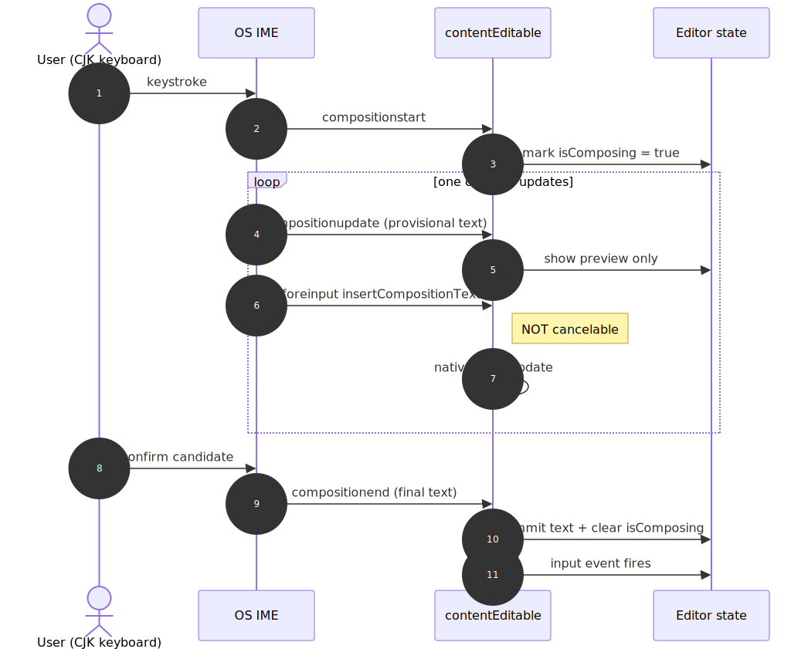
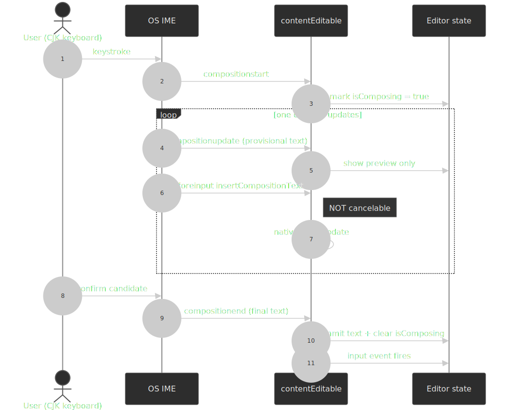

# Design a Rich Text Editor

A web rich text editor is the place where browser quirks, IME composition, accessibility, and distributed systems all collide inside a single `<div contenteditable>`. This article unpacks the four design axes that decide everything else — document model, rendering surface, input pipeline, and collaboration architecture — and grounds them in how Google Docs, Figma, Notion, Linear, and Meta's own editors actually work today.




## Mental model

Every modern editor reduces to the same five-piece pipeline:

1. **Input surface** — `contentEditable`, hidden `<textarea>`, or synthetic event capture. Owns IME, paste, drag-and-drop.
2. **Transaction engine** — turns input events into atomic, reversible operations against a typed schema.
3. **Document model** — a flat operation log (Quill Delta) or a hierarchical tree of nodes with inline marks (ProseMirror, Slate, Lexical).
4. **Reconciler** — projects model state to the DOM, then maps DOM selection back to model positions.
5. **Collaboration layer** — rebases local transactions against remote ones using Operational Transform (OT) or a Conflict-free Replicated Data Type (CRDT).

The interesting design decisions live at the boundaries: how much of the input pipeline you delegate to the browser, whether the model is linear or hierarchical, and which collaboration model your transaction shape can support.

## Why rich text on the web is hard

`contentEditable` was designed for forms, not document authoring. The four sharp edges every editor has to handle:

- **`contentEditable` inconsistency.** Identical user gestures produce different DOM mutations across Chrome, Firefox, and Safari (e.g., the markup the browser inserts when you press <kbd>Enter</kbd> in an empty heading varies between `<div>`, `<p>`, and `<br>`).
- **IME composition.** Input Method Editors for CJK and many other scripts compose characters across many keystrokes; the editor must allow composition to commit through the browser, not block it.
- **Selection edge cases.** Cursor placement at zero-width block boundaries, triple-click semantics, and selection across nested blocks have no fully spec-defined behavior.
- **Undo granularity.** What counts as one undoable action — a keystroke, a word boundary, a formatting change, a transaction batch — is a product decision the browser will not make for you.

`document.execCommand` — the only standardized rich-text formatting API — is now formally deprecated; the W3C Editing Working Group's draft explicitly tells authors to use a JavaScript editor library instead and that the spec "is not expected to advance beyond [its] draft status"[^execcommand]. The intended successors are split: **Input Events Level 2** for intercepting edits ([§5 of the W3C WD](https://www.w3.org/TR/input-events-2/)), and the **EditContext API** ([W3C WD](https://www.w3.org/TR/edit-context/), shipped in Chromium 121 in January 2024) for decoupling editing state from the DOM and giving custom-rendered editors (canvas, virtualized lists) first-class IME support[^editcontext]. Cross-browser EditContext support is still partial — Firefox and Safari do not implement it as of 2026-Q2 — so every modern editor still ships its own command layer on top of `beforeinput`.

[^execcommand]: [W3C Editing Working Group — execCommand draft](https://w3c.github.io/editing/docs/execCommand/) ("This specification is incomplete… not expected to be advanced") and [MDN: Document.execCommand()](https://developer.mozilla.org/en-US/docs/Web/API/Document/execCommand).
[^editcontext]: [W3C EditContext API Working Draft](https://www.w3.org/TR/edit-context/) and [Chrome for Developers — Introducing the EditContext API](https://developer.chrome.com/blog/introducing-editcontext-api).

> [!TIP]
> If you only need a plain-text input that grows with its content, `<div contenteditable="plaintext-only">` reached [Baseline (Newly available) in March 2025](https://web.dev/blog/contenteditable-plaintext-only-baseline). It strips formatting from paste, disables `execCommand` style commands, and keeps you out of the rich-text rabbit hole entirely.

### Browser constraints worth budgeting for

| Constraint                          | Impact                                                     | Mitigation                                  |
| ----------------------------------- | ---------------------------------------------------------- | ------------------------------------------- |
| 16ms frame budget at 60fps          | Heavy DOM mutation blocks typing                           | Transaction batching, incremental rendering |
| DOM mutation overhead               | Frequent updates cause layout thrashing                    | Virtual DOM or custom reconciler            |
| Selection API gaps                  | Cannot programmatically place cursor in some empty states  | Shadow / virtual selection tracking         |
| `execCommand` deprecation           | No standard formatting API                                 | Custom command system per editor framework  |
| `beforeinput` IME exception         | `insertCompositionText` events are not cancelable          | Allow composition; commit at `compositionend` |

### Scale factors that change the architecture

| Factor             | Small Scale   | Large Scale                          |
| ------------------ | ------------- | ------------------------------------ |
| Document size      | < 1,000 words | > 100,000 words                      |
| Concurrent editors | 1–2           | 50+                                  |
| Nesting depth      | 2–3 levels    | Unlimited (outliners, nested tables) |
| Update frequency   | < 1 / sec     | > 10 / sec per user                  |

Large documents force virtualization (rendering only visible blocks) and efficient position mapping. High concurrency demands robust conflict resolution — and that is the point at which your model choice locks you in.

## Document model representations

The model is the highest-leverage decision in the architecture. Three shapes dominate; everything else is a variation on them.




The model dictates everything downstream. Linear ops compose under OT but make non-linear structure (nested tables, columns, pivot blocks) painful. Tree+marks make structural edits cheap but require a normalization or schema layer to stay valid. Typed node trees with decorators (Lexical, Slate) give you the most freedom — and the most rope.

## The two axes that pick your editor

The first decision is the **document model**: a linear sequence of operations, or a hierarchical tree of typed nodes with marks. The second decision is the **rendering surface**: lean on `contentEditable`, control it tightly via a reconciler, or replace it with a synthetic input pipeline. Together they generate four practical paths.

| Axis            | Linear (Delta)                          | Hierarchical (Node tree + marks)                          |
| --------------- | --------------------------------------- | --------------------------------------------------------- |
| `contentEditable` | Quill                                   | Tiptap-flavored ProseMirror                               |
| Custom render     | (rare; usually upgraded to a tree)     | Lexical, modern Slate                                     |

### Path 1 — `contentEditable` over a linear delta (Quill)

**How it works.** Quill renders into a `contentEditable` element, observes mutations, and translates them into [Delta operations](https://quilljs.com/docs/delta/) — a sequence of `insert`, `retain`, and `delete` ops with attribute payloads. The Delta itself is your document.

```ts title="quill-delta-example.ts"
import Quill from "quill"

const doc = {
  ops: [
    { insert: "Hello " },
    { insert: "World", attributes: { bold: true } },
    { insert: "\n" },
  ],
}

const formatBold = {
  ops: [
    { retain: 6 },
    { retain: 5, attributes: { bold: true } },
  ],
}
```

**Best for.** Comment composers, chat boxes, blog post editors. Slack historically used Quill for its message composer[^slack-quill]; the format is OT-friendly and the browser gives you native typing feel and IME for free.

[^slack-quill]: Slack's WYSIWYG composer launched on Quill in 2019; the rich-text wire format is now Slack's own [`rich_text` block format](https://docs.slack.dev/reference/block-kit/blocks/rich-text-block/), but the historical attribution to Quill is widely repeated by the editor community (e.g., [Liveblocks' 2025 framework comparison](https://liveblocks.io/blog/which-rich-text-editor-framework-should-you-choose-in-2025)).

**Trade-offs.**

- ✅ Fast time to ship, native typing feel, native spell check and IME.
- ✅ Linear ops compose cleanly under OT.
- ❌ Browser inconsistencies leak through anywhere the model deviates from "paragraph of styled inline text".
- ❌ Tables, nested lists, and arbitrary block embeds are awkward — you are continually fighting the browser to enforce structure.

### Path 2 — Hierarchical model with controlled `contentEditable` (ProseMirror, Tiptap)

**How it works.** Define a strict `Schema` that names every node and mark and constrains valid nesting. All edits flow through `Transaction` objects against an immutable `EditorState`; a `view` keeps `contentEditable` in sync with state and parses unexpected mutations back into transactions[^pm-guide].

[^pm-guide]: [ProseMirror Guide — Documents](https://prosemirror.net/docs/guide/) and [ProseMirror Guide — Collab](https://prosemirror.net/docs/guide/#collab).

```ts title="prosemirror-schema.ts" collapse={1-1}
import { Schema, NodeSpec, MarkSpec } from "prosemirror-model"

const nodes: Record<string, NodeSpec> = {
  doc: { content: "block+" },
  paragraph: {
    content: "inline*",
    group: "block",
    parseDOM: [{ tag: "p" }],
    toDOM: () => ["p", 0],
  },
  heading: {
    attrs: { level: { default: 1 } },
    content: "inline*",
    group: "block",
    parseDOM: [1, 2, 3, 4, 5, 6].map((level) => ({
      tag: `h${level}`,
      attrs: { level },
    })),
    toDOM: (node) => [`h${node.attrs.level}`, 0],
  },
  text: { group: "inline" },
}

const marks: Record<string, MarkSpec> = {
  bold: {
    parseDOM: [{ tag: "strong" }, { tag: "b" }],
    toDOM: () => ["strong", 0],
  },
  link: {
    attrs: { href: {} },
    parseDOM: [{ tag: "a[href]", getAttrs: (dom) => ({ href: (dom as HTMLElement).getAttribute("href") }) }],
    toDOM: (node) => ["a", { href: node.attrs.href }, 0],
  },
}

const schema = new Schema({ nodes, marks })
```

```ts title="prosemirror-transaction.ts"
import { EditorState, Transaction } from "prosemirror-state"

function applyBold(state: EditorState): Transaction {
  const { from, to } = state.selection
  return state.tr.addMark(from, to, schema.marks.bold.create())
}

const newState = state.apply(transaction)
```

**Best for.** CMS authoring, documentation tools, and anywhere editorial structure must be enforced. The New York Times' newsroom CMS, Oak, is built on ProseMirror with React and Redux[^nyt-oak]; the team has since open-sourced [`@nytimes/react-prosemirror`](https://github.com/nytimes/react-prosemirror) for React-first rendering.

[^nyt-oak]: [NYT Open — Building a Text Editor for a Digital-First Newsroom](https://open.nytimes.com/building-a-text-editor-for-a-digital-first-newsroom-f1cb8367fc21) (Sophia Ciocca, NYT engineering blog).

**Trade-offs.**

- ✅ Schema rejects invalid documents at the boundary; you cannot nest a heading inside a paragraph by accident.
- ✅ Transactions are atomic and serializable; collab, undo, and time-travel debugging fall out of the same primitive.
- ✅ Mature collaboration via `prosemirror-collab`.
- ❌ Steep learning curve; the API surface is large and intentionally minimal at the same time.
- ❌ Still relies on `contentEditable`, so you inherit the browser's behavior in the corners ProseMirror does not patch.

### Path 3 — Fully custom rendering (Lexical, modern Slate)

**How it works.** Lexical attaches to a single `contentEditable` element but reconciles the DOM itself rather than letting React (or any UI framework) drive updates — Meta's stated goal is lower latency and full control over keystroke-to-pixel time[^lexical-intro]. Mutations only happen inside `editor.update(() => …)` callbacks; reads use `editor.read()`. State is a tree of typed nodes (paragraph, text, custom decorator) with their own `createDOM` / `updateDOM` / `decorate` methods.

[^lexical-intro]: [Lexical — Introduction](https://lexical.dev/docs/intro). The page reports a 22 KB min+gzip core, lists the Meta surfaces it powers (Facebook, Workplace, Messenger, WhatsApp Web, Instagram Messenger), and documents the `$`-prefixed API.

```ts title="lexical-state.ts"
import { $getRoot, $createParagraphNode, $createTextNode } from "lexical"

editor.update(() => {
  const root = $getRoot()
  const paragraph = $createParagraphNode()
  const text = $createTextNode("Hello World")
  paragraph.append(text)
  root.append(paragraph)
})

editor.getEditorState().read(() => {
  const root = $getRoot()
  console.log(root.getTextContent())
})
```

The `$`-prefix convention is deliberate: `$getRoot()`, `$getSelection()`, and the rest only work inside an `update` or `read` context — analogous to React Hooks, calling them outside throws.

**Best for.** Pixel-perfect rendering, complex inline embeds (mentions, polls, attachments), and anywhere you need a small, tree-shakable core with a plugin-driven feature set. Meta uses Lexical for the composers across Facebook, Workplace, Messenger, WhatsApp Web, and Instagram Messenger[^lexical-intro].

**Trade-offs.**

- ✅ Complete control; framework-agnostic core; explicit reconciliation.
- ✅ Headless: bring your own React / Vue / Svelte / vanilla bindings.
- ✅ Small core (≈22 KB min+gzip) — but realistic editors pull in selection, list, link, history, rich-text plugins on top.
- ❌ IME composition is the hardest part of any custom editor; you do less of it than ProseMirror but more of it than Quill.
- ❌ Accessibility is your responsibility — `contentEditable` carries some ARIA defaults; the more you replace, the more you must re-implement.

### Choosing among them

Use the decision tree below as a starting point. The collaboration question (offline-first versus server-coordinated real-time) tends to dominate any other factor.




| Factor              | Quill (`contentEditable`) | ProseMirror (controlled)             | Lexical (custom)                   | Slate (custom + plugins)        |
| ------------------- | ------------------------- | ------------------------------------ | ---------------------------------- | ------------------------------- |
| Bundle size         | ~57 KB gzip (Quill 2.x)   | ~50 KB+ gzip (model+state+view core) | ~22 KB gzip core; plugins extra    | ~50 KB+ gzip (with `slate-react`) |
| Browser consistency | Poor                      | Good                                 | Excellent                          | Good                            |
| Complex structures  | Limited                   | Full (schema-enforced)               | Full (custom nodes)                | Full (schemaless, normalized)   |
| IME handling        | Native                    | Native                               | Mostly manual                      | Mostly manual                   |
| Accessibility       | Native                    | Native + ARIA augmentation           | Manual                             | Manual                          |
| Collaboration       | OT-friendly (Delta)       | OT (`prosemirror-collab`) or Yjs     | Yjs via `@lexical/yjs`             | Yjs via `slate-yjs`             |
| Extensibility       | Plugins                   | Schema + plugins                     | Nodes + commands + plugins         | Plugins as editor decorators    |

> [!NOTE]
> Bundle sizes are indicative of the **core** package only. Real editors layer toolbars, history, code blocks, lists, links, tables, and serializers on top — assume a production editor lands closer to 80–250 KB gzip regardless of framework.

## Document models, in depth

### ProseMirror — flat marks over a node tree

ProseMirror's document is a tree of block-level nodes, but inline content inside each block is a **flat sequence of text spans with a set of `Mark` annotations**, not a nested DOM-style tree[^pm-marks]. Bold + italic text is one text run with `marks: [bold, italic]`, not `<strong><em>…</em></strong>`. This is the design choice that makes everything else easier:

[^pm-marks]: [ProseMirror Guide — Documents](https://prosemirror.net/docs/guide/#doc) and the [Rationale for marks](https://discuss.prosemirror.net/t/rationale-for-marks/379) thread by Marijn Haverbeke.

- Toggling a format never restructures the tree.
- Overlapping ranges (partial bold, partial italic) are trivially representable.
- Document positions are simple integer offsets into the inline sequence — not tree paths — which makes position mapping cheap.
- Marks are merged when applied twice; they do not nest in the model even though `toDOM` may render them as nested elements.

Position mapping is the foundation of `prosemirror-collab`:

```ts title="prosemirror-position-mapping.ts"
import { Mapping, StepMap } from "prosemirror-transform"

// StepMap ranges come in triples: [oldStart, oldSize, newSize].
// "At position 3, replace 0 chars with 5 chars."
const map = new StepMap([3, 0, 5])
const newPos = map.map(10) // 15
```

### Slate — schemaless, normalized

Slate inverts ProseMirror's stance: there is no schema. The document is a recursive tree of `Element` and `Text` nodes, and you enforce structure through **normalization** — a function that runs after every change and either fixes one invariant or no-ops[^slate-norm].

[^slate-norm]: [Slate — Normalizing](https://docs.slatejs.org/concepts/11-normalizing).

```ts title="slate-normalizer.ts"
import { Editor, Transforms, Element, Node } from "slate"

const withParagraphsNormalized = (editor: Editor): Editor => {
  const { normalizeNode } = editor

  editor.normalizeNode = ([node, path]) => {
    if (Element.isElement(node) && node.type === "paragraph") {
      for (const [child, childPath] of Node.children(editor, path)) {
        if (Element.isElement(child) && !editor.isInline(child)) {
          Transforms.unwrapNodes(editor, { at: childPath })
          return // one fix per pass
        }
      }
    }
    normalizeNode([node, path])
  }

  return editor
}
```

The "return after one fix" idiom matters: Slate re-runs `normalizeNode` after each change until the document stabilizes. Returning early keeps each fix atomic and avoids infinite loops. For multi-step edits where intermediate states would fail normalization, wrap with `Editor.withoutNormalizing(editor, () => …)` and pay one normalization at the end.

### Quill Delta — linear, OT-native

[Delta](https://quilljs.com/docs/delta/) represents a document as the result of `insert` / `retain` / `delete` operations applied to an empty document. The same data structure represents both documents and edits, which is why Delta is a natural fit for OT.

```ts title="quill-delta-operations.ts"
const doc = {
  ops: [
    { insert: "Hello " },
    { insert: "World", attributes: { bold: true } },
    { insert: "\n" },
  ],
}

const edit = {
  ops: [
    { retain: 6 },
    { insert: "Beautiful " },
  ],
}

// Composed: "Hello Beautiful World\n"
```

Concurrent edits compose via Delta's transform function, with explicit tie-break rules so that `transform(A, B, "left")` and `transform(B, A, "right")` converge. Without those rules, two clients applying `insert "X"` and `insert "Y"` at the same offset would diverge.

### Lexical — nodes plus commands

Lexical splits the model surface into three concerns[^lexical-cmds]:

[^lexical-cmds]: [Lexical — Commands](https://lexical.dev/docs/concepts/commands) and [Lexical — Nodes](https://lexical.dev/docs/concepts/nodes).

1. **Nodes.** `RootNode`, `ParagraphNode`, `TextNode`, plus app-defined ones extending `ElementNode`, `TextNode`, or `DecoratorNode`.
2. **Commands.** Strings dispatched via `editor.dispatchCommand(COMMAND, payload)`; built-ins include `FORMAT_TEXT_COMMAND`, `INSERT_PARAGRAPH_COMMAND`, and the cursor / selection commands.
3. **Listeners.** Registered via `editor.registerCommand(COMMAND, listener, priority)`. Returning `true` stops propagation; priorities (`COMMAND_PRIORITY_EDITOR` through `COMMAND_PRIORITY_CRITICAL`) let plugins layer behavior cleanly.

`DecoratorNode` is the escape hatch for embedding arbitrary UI (mentions, polls, image attachments, code blocks rendered with Shiki) — Lexical hands you a host element via `createDOM()` and renders whatever your `decorate()` returns into it via `React.createPortal`.

```tsx title="lexical-mention-node.tsx" collapse={1-7}
import {
  DecoratorNode,
  NodeKey,
  SerializedLexicalNode,
  Spread,
} from "lexical"

type SerializedMentionNode = Spread<
  { userId: string; displayName: string },
  SerializedLexicalNode
>

export class MentionNode extends DecoratorNode<JSX.Element> {
  __userId: string
  __displayName: string

  static getType(): string {
    return "mention"
  }

  static clone(node: MentionNode): MentionNode {
    return new MentionNode(node.__userId, node.__displayName, node.__key)
  }

  constructor(userId: string, displayName: string, key?: NodeKey) {
    super(key)
    this.__userId = userId
    this.__displayName = displayName
  }

  createDOM(): HTMLElement {
    const span = document.createElement("span")
    span.className = "mention"
    return span
  }

  updateDOM(): false {
    return false
  }

  decorate(): JSX.Element {
    return <MentionComponent userId={this.__userId} name={this.__displayName} />
  }

  static importJSON(serialized: SerializedMentionNode): MentionNode {
    return new MentionNode(serialized.userId, serialized.displayName)
  }

  exportJSON(): SerializedMentionNode {
    return {
      type: "mention",
      version: 1,
      userId: this.__userId,
      displayName: this.__displayName,
    }
  }
}
```

## Input handling

A keystroke is the start of a longer pipeline. The browser fires `beforeinput`; the editor maps it to a command, the command produces a transaction, the transaction lands on a new immutable state, and the reconciler diffs that state into the DOM. The collaboration plugin and the history plugin both observe the same transaction stream.


### Input Events Level 2 and `beforeinput`

The W3C [Input Events Level 2](https://www.w3.org/TR/input-events-2/) Working Draft defines `beforeinput`, fired before the browser modifies the DOM and (for almost every `inputType`) cancelable. This is the single best interception point for a custom editor.

```ts title="beforeinput-handling.ts"
element.addEventListener("beforeinput", (e: InputEvent) => {
  switch (e.inputType) {
    case "insertText":
      e.preventDefault()
      insertText(e.data!)
      break

    case "insertParagraph":
      e.preventDefault()
      insertParagraph()
      break

    case "deleteContentBackward":
      e.preventDefault()
      deleteBackward()
      break

    case "insertFromPaste": {
      e.preventDefault()
      const html = e.dataTransfer?.getData("text/html")
      const text = e.dataTransfer?.getData("text/plain")
      handlePaste(html ?? text ?? "")
      break
    }

    case "insertCompositionText":
      // Spec: not cancelable during IME composition. Sync at compositionend.
      break
  }
})
```

The most useful `inputType` values (full enum in [§5.1 of the spec](https://www.w3.org/TR/input-events-2/#interface-InputEvent-Attributes)):

| `inputType`               | Trigger      | Cancelable                  |
| ------------------------- | ------------ | --------------------------- |
| `insertText`              | Typing       | Yes                         |
| `insertParagraph`         | Enter        | Yes                         |
| `insertLineBreak`         | Shift+Enter  | Yes                         |
| `deleteContentBackward`   | Backspace    | Yes                         |
| `deleteContentForward`    | Delete       | Yes                         |
| `insertFromPaste`         | Paste        | Yes                         |
| `insertCompositionText`   | IME          | **No** (during composition) |
| `historyUndo`             | Ctrl/Cmd+Z   | Yes                         |
| `historyRedo`             | Ctrl/Cmd+Y   | Yes                         |

### IME composition — the rule that breaks naive editors

Input Method Editors compose characters across many keystrokes. Pinyin pinyin-to-hanzi, Japanese kana-to-kanji, Korean hangul jamo composition, and many Indic scripts all flow through this state machine. The single rule the spec is unambiguous about: **`beforeinput` events with `inputType="insertCompositionText"` are not cancelable**[^input-events-2]. Trying to `preventDefault` them silently fails and corrupts the composition UI.

[^input-events-2]: [W3C Input Events Level 2 — `inputType` attribute](https://www.w3.org/TR/input-events-2/#interface-InputEvent-Attributes). The cancelability table explicitly lists composition events as non-cancelable.




```ts title="ime-handling.ts"
let isComposing = false

element.addEventListener("compositionstart", () => {
  isComposing = true
  // Snapshot selection so we can restore on cancel
})

element.addEventListener("compositionupdate", (e: CompositionEvent) => {
  showCompositionPreview(e.data) // provisional only
})

element.addEventListener("compositionend", (e: CompositionEvent) => {
  isComposing = false
  commitText(e.data) // final committed text
  clearCompositionPreview()
})

element.addEventListener("beforeinput", (e: InputEvent) => {
  if (e.inputType === "insertCompositionText") {
    return // let the browser drive composition
  }
  // handle other input types as above
})
```

The pattern: **let the browser own the composition lifecycle, sync your model only at `compositionend`**, and treat your model as out-of-sync with the DOM between `compositionstart` and `compositionend`. ProseMirror documents this drift explicitly; Lexical isolates it inside the reconciler.

### Selection and Range

The Selection API is your bidirectional bridge between DOM coordinates (containers + offsets) and model positions.

```ts title="selection-management.ts"
const selection = window.getSelection()
if (!selection || selection.rangeCount === 0) return
const range = selection.getRangeAt(0)

const { startContainer, startOffset, endContainer, endOffset } = range
const isCollapsed = range.collapsed

const rect = range.getBoundingClientRect()
positionToolbar(rect.left, rect.top - 40)

const newRange = document.createRange()
newRange.setStart(textNode, 5)
newRange.setEnd(textNode, 10)
selection.removeAllRanges()
selection.addRange(newRange)
```

Selections that span block boundaries make `range.commonAncestorContainer` resolve to the nearest shared parent — usually the editor root. To enumerate selected nodes you walk the tree between `startContainer` and `endContainer`, which is one of the more bug-prone parts of any editor.

### Paste sanitization

Paste is the editor's largest XSS surface. The clipboard payload arrives as `DataTransfer` on `beforeinput` with `inputType: "insertFromPaste"` (or as a `paste` event when `beforeinput` is preempted), and `text/html` from a hostile site is unrestricted HTML — `<script>`, `<iframe>`, ``, `javascript:` URLs, all of it. Inserting that into the editor DOM via `innerHTML` would be a stored XSS the moment another viewer loads the document.


The minimum-viable pipeline:

1. **Read the best payload** from `DataTransfer`. Prefer `text/html` for rich sources, fall back to `text/plain`, special-case `files` for image upload.
2. **Parse in a detached document.** `new DOMParser().parseFromString(html, "text/html")` — this never executes scripts, never loads images, and never runs CSS the way `innerHTML` would.
3. **Strip vendor cruft.** Microsoft Word and Google Docs both inject hundreds of bytes of `mso-*` classes, conditional comments, and wrapper spans per pasted character. Drop them before the schema sees them.
4. **Run [DOMPurify](https://github.com/cure53/DOMPurify)**[^dompurify] (or the in-development [HTML Sanitizer API](https://wicg.github.io/sanitizer-api/)) to strip `<script>`, `<iframe>`, `on*` event handlers, `javascript:` / `data:` URLs in attributes that take URLs, and SVG event handlers. Use a default-deny allowlist; do not try to blocklist tags.
5. **Pass through the editor schema parser.** ProseMirror exposes `transformPastedHTML`, `clipboardParser`, and `transformPasted` to inject sanitization at three points in its pipeline; Lexical exposes `$generateNodesFromDOM`. The schema parser drops any node that does not match the allowed node spec, which is your second line of defense.
6. **Apply as a transaction**, not a direct DOM insert. The transaction goes through the same reconciler, undo, and collab paths as a keystroke.

[^dompurify]: [Cure53 — DOMPurify](https://github.com/cure53/DOMPurify) and [DOMPurify — How sanitization works](https://dompurify.com/how-does-dompurify-ensure-that-sanitized-html-is-safe-for-injection-into-the-dom-2/).

> [!CAUTION]
> A restrictive `Content-Security-Policy` (e.g., `style-src 'self'`) on the parent document is inherited by `DOMParser` in Chromium, so inline styles from Google Docs and Word paste are silently dropped — Lexical issue [#4051](https://github.com/facebook/lexical/issues/4051) tracks the resulting formatting loss. If your editor depends on round-tripping inline styles from Office paste, allow `'unsafe-inline'` for `style-src` only on the editor route, or strip-and-rebuild styles inside the sanitizer.

> [!IMPORTANT]
> Client-side sanitization is a defense in depth, not a substitute for server-side validation. Re-sanitize on the server before persisting and again before rendering to other viewers. The `text/html` paste payload is attacker-controlled the moment a hostile page is the source.

## Collaboration architectures

The choice between Operational Transform and CRDT is rarely about which is "better" in the abstract; it is about whether you can guarantee a central authority for ordering. The trade is exactly that: server authority versus offline correctness.




### Operational Transform

OT lets two clients apply local operations optimistically; the server orders the operations and broadcasts a transform that mutates each operation as if it had been applied after the others. A central server is the source of truth for ordering.

```ts title="ot-transform.ts"
type Op =
  | { type: "insert"; pos: number; text: string }
  | { type: "delete"; pos: number; len: number }

function transform(op1: Op, op2: Op): Op {
  if (op1.type === "insert" && op2.type === "insert") {
    if (op1.pos < op2.pos) return op1
    if (op1.pos > op2.pos) return { ...op1, pos: op1.pos + op2.text.length }
    // Same position — tie-break by clientID elsewhere
    return op1
  }

  if (op1.type === "insert" && op2.type === "delete") {
    if (op1.pos <= op2.pos) return op1
    if (op1.pos >= op2.pos + op2.len) return { ...op1, pos: op1.pos - op2.len }
    return { ...op1, pos: op2.pos }
  }

  // ... and the rest of the matrix
  return op1
}
```

ProseMirror sidesteps the combinatorial explosion of "transform every op type against every op type" by transforming **positions through `StepMap`s** rather than transforming ops against ops directly:

```ts title="prosemirror-collab.ts"
import { sendableSteps, receiveTransaction } from "prosemirror-collab"

// Apply remote steps (server is authority on ordering)
const tr = receiveTransaction(state, remoteSteps, remoteClientIDs)
const newState = state.apply(tr)

// Send local steps (server rebases against any concurrent steps it has seen)
const sendable = sendableSteps(state)
if (sendable) {
  socket.send({
    version: sendable.version,
    steps: sendable.steps.map((s) => s.toJSON()),
    clientID: sendable.clientID,
  })
}
```

**Operational profile.**

- ✅ Battle-tested at Google Docs scale.
- ✅ Server is the single source of truth — easy to reason about consistency, undo, history, and access control.
- ❌ The server is a hard dependency and a coordination bottleneck.
- ❌ Long offline sessions need careful rebase logic; in some OT models, very stale clients have to be force-reset.

### CRDTs (Yjs / YATA)

CRDTs embed enough metadata in the data structure that concurrent operations always converge without a coordinator. Yjs implements an optimized variant of YATA (Yet Another Transformation Approach), assigning each item a unique `(clientID, clock)` ID and using tombstones for deletions[^yjs-internals].

[^yjs-internals]: [Yjs Docs — Internals](https://docs.yjs.dev/api/internals).

```ts title="yjs-prosemirror.ts" collapse={1-3}
import * as Y from "yjs"
import { WebsocketProvider } from "y-websocket"
import { ySyncPlugin, yCursorPlugin, yUndoPlugin } from "y-prosemirror"

const ydoc = new Y.Doc()
const provider = new WebsocketProvider("wss://collab.example.com", "doc-room", ydoc)
const yXmlFragment = ydoc.getXmlFragment("prosemirror")

const plugins = [
  ySyncPlugin(yXmlFragment),
  yCursorPlugin(provider.awareness),
  yUndoPlugin(),
]
```

Conceptually, inserting `'X'` after the item with id `id3`:

```
"Hello" → [(id1,'H'), (id2,'e'), (id3,'l'), (id4,'l'), (id5,'o')]

A: insert (idA, 'X', after: id3)
B: delete id4 (mark as tombstone)

Merge: append (idA, 'X') after id3, hide id4 → "HelXo"
```

**Operational profile.**

- ✅ No coordinator — peers can sync directly or through a relay; offline-first comes for free.
- ✅ Simpler mental model than OT for arbitrary structures (maps, arrays, text, XML).
- ❌ Per-character metadata costs; a multi-megabyte document can balloon into tens of megabytes of CRDT state without compaction.
- ❌ Tombstones accumulate. Yjs amortizes this with garbage collection of fully-deleted runs and binary encoding, but it is still an operational concern.
- ❌ Some "concurrent insert at same position" outcomes are determined by ID order, not user intent — usually fine for prose, occasionally surprising for tabular data.

### How the production systems actually do it

The marketing copy for OT vs CRDT is much cleaner than what production systems ship. Almost every large editor is hybrid in some way.

| Product       | Real architecture                                                                                                | Source                                                                                                                                                                                       |
| ------------- | ---------------------------------------------------------------------------------------------------------------- | -------------------------------------------------------------------------------------------------------------------------------------------------------------------------------------------- |
| Google Docs   | Server-authoritative OT; optimistic local apply; server transforms and broadcasts                               | Widely cited; see Figma's blog summary below                                                                                                                                                 |
| Figma         | **Centralized, CRDT-inspired** — server orders all events; LWW for many properties; not pure OT, not pure CRDT  | [How Figma's multiplayer technology works](https://www.figma.com/blog/how-figmas-multiplayer-technology-works/) (Evan Wallace, 2019)                                                          |
| Notion        | Block-based; transactions queued client-side, persisted to IndexedDB / SQLite, sent via `/saveTransactions`; server pushes version updates over WebSocket | [The data model behind Notion](https://www.notion.com/blog/data-model-behind-notion)                                                                                                          |
| Linear        | **Custom sync engine**, not Yjs; in-memory MobX object graph + IndexedDB; **last-write-wins by default**, with CRDTs only for specific text fields like issue descriptions | [Scaling the Linear Sync Engine](https://linear.app/now/scaling-the-linear-sync-engine), and the [reverse-engineered architecture writeup](https://www.fujimon.com/blog/linear-sync-engine) |

> [!CAUTION]
> The popular framing that "Figma migrated from OT to CRDTs" is wrong. Figma evaluated both during prototyping, judged OT "overkill" for design objects, and built a centralized, server-authoritative system **inspired by** CRDTs — never adopting either as-is. The "Linear is built on Yjs" framing is also wrong; Linear's core sync engine is proprietary, with Yjs / CRDTs reserved for specific collaborative text fields.

## Performance for large documents

### Virtualization and chunking

Documents with tens of thousands of blocks need virtualization — render only what is on screen plus a small buffer. The simplest pattern uses `IntersectionObserver` to track which block sentinels are in view and renders a window of `[start - buffer, end + buffer]`.

```ts title="virtual-document.ts" collapse={1-6}
import { useEffect, useState, useRef } from "react"

interface Block {
  id: string
  type: string
  content: string
}

function useVirtualBlocks(blocks: Block[], containerRef: React.RefObject<HTMLElement>) {
  const [visibleRange, setVisibleRange] = useState({ start: 0, end: 20 })

  useEffect(() => {
    const container = containerRef.current
    if (!container) return

    const observer = new IntersectionObserver(
      (entries) => {
        const visible = entries
          .filter((e) => e.isIntersecting)
          .map((e) => parseInt((e.target as HTMLElement).dataset.index!, 10))

        if (visible.length > 0) {
          setVisibleRange({
            start: Math.max(0, Math.min(...visible) - 5),
            end: Math.min(blocks.length, Math.max(...visible) + 5),
          })
        }
      },
      { root: container, threshold: 0 },
    )

    return () => observer.disconnect()
  }, [blocks.length])

  return blocks.slice(visibleRange.start, visibleRange.end)
}
```

Slate exposes an experimental chunking API in `slate-react` for the same purpose: assign `editor.getChunkSize` and pass `renderChunk` to `<Editable />`[^slate-perf]. Chunking only works when a node's children are all blocks (not inline runs), so it is best applied at the editor root.

[^slate-perf]: [Slate — Improving Performance](https://docs.slatejs.org/walkthroughs/09-performance).

```ts title="slate-chunking.ts" collapse={1-3}
import { Editor, Node } from "slate"

const withChunking = (editor: Editor): Editor => {
  editor.getChunkSize = (node: Node) => (Editor.isEditor(node) ? 1000 : null)
  return editor
}

// In your component:
// <Editable renderChunk={renderChunk} ... />
```

CSS [`content-visibility: auto`](https://web.dev/articles/content-visibility) gives a complementary layer of paint-skipping for off-screen blocks; combined with a virtualized window, it keeps long documents at 60 fps.

### Memory budget

For very large documents the dominant techniques and their trade-offs:

| Technique           | Use case                          | Trade-off                                  |
| ------------------- | --------------------------------- | ------------------------------------------ |
| Piece tables        | Text-heavy documents              | Complex range queries; tricky to serialize |
| Lazy node loading   | Outline / tree views              | Latency on expand                          |
| `WeakMap` caches    | Computed values per node          | GC unpredictability                        |
| LRU eviction        | Undo history, decoration cache    | Lost undo steps                            |
| CRDT GC + binary    | Long-lived collaborative docs     | Periodic pause for compaction              |

## Accessibility floor

### ARIA contracts

A `contentEditable` element gives you implicit text-input semantics, but assistive tech still benefits from explicit role and labeling. For a multiline editor:

```html title="aria-editor.html"
<div
  role="textbox"
  aria-multiline="true"
  aria-label="Document editor"
  contenteditable="true"
></div>
```

When you replace `contentEditable` with a fully synthetic surface (Lexical with custom rendering, large parts of modern Slate), `role="application"` plus a `role="document"` inner region is the common pattern, but **you must reimplement keyboard semantics that the browser otherwise gave you for free**, including arrow-key cursor movement and selection extension. The [ARIA Authoring Practices Guide](https://www.w3.org/WAI/ARIA/apg/) is the authoritative reference for the role/state combinations.

### Keyboard contract

Minimum keyboard support a senior engineer should expect:

| Key                     | Action                                  |
| ----------------------- | --------------------------------------- |
| Arrow keys              | Move cursor                             |
| Shift + Arrow           | Extend selection                        |
| Ctrl/Cmd + A            | Select all                              |
| Ctrl/Cmd + Z / Y / Shift+Z | Undo / redo                          |
| Ctrl/Cmd + B / I / U    | Bold / italic / underline               |
| Tab                     | Indent (in lists) or focus next element |
| Escape                  | Exit nested block / dismiss popover     |

### Screen reader matrix

Test against the actual combinations users run, not just one screen reader on one OS.

| Screen reader | Browser         | Platform   |
| ------------- | --------------- | ---------- |
| NVDA          | Firefox, Chrome | Windows    |
| JAWS          | Chrome, Edge    | Windows    |
| VoiceOver     | Safari          | macOS, iOS |
| TalkBack      | Chrome          | Android    |

Custom-rendered editors are particularly fragile here: any change to the DOM the screen reader is reading from can be reported as a stream of insert / delete events instead of a coherent edit. Test before you ship.

## Common footguns

### Fighting `contentEditable`

**Symptom.** Pressing <kbd>Enter</kbd> in a heading spawns a `<div>` instead of a `<p>`. Backspace at the start of a list item deletes random structure. **Fix.** Stop trying to enforce structure inside the browser's editing handler. Use ProseMirror or Tiptap to control the structure, or Lexical to replace the editing handler entirely.

### Ignoring IME

**Symptom.** Editor works in English but corrupts CJK input — characters double, composition UI flickers, the document state diverges from the screen. **Fix.** Track `isComposing` between `compositionstart` and `compositionend`. Never `preventDefault` on `inputType: "insertCompositionText"`. Sync your model on `compositionend`.

### Single-keystroke undo granularity

**Symptom.** Each character is its own undo step; a one-line edit takes 40 undos to revert.

```ts title="undo-debounce.ts"
let undoTimeout: number | null = null

function onInput() {
  if (undoTimeout) clearTimeout(undoTimeout)
  applyChangeWithoutUndoEntry()
  undoTimeout = window.setTimeout(() => {
    createUndoEntry()
    undoTimeout = null
  }, 500)
}
```

ProseMirror's history plugin and Lexical's history plugin both batch by time and op type out of the box; if you are rolling your own, debounce by ~500 ms and break the batch on word boundaries, formatting changes, and selection-only events.

### Memory growth under long collab sessions

**Symptom.** Memory creeps up over an 8-hour editing session. **Fix.** Garbage-collect CRDT tombstones periodically, cap undo history depth, and disconnect inactive presence cursors. Yjs documents the GC controls explicitly; OT-based systems must implement equivalent cleanup themselves.

### Selection lost across async work

**Symptom.** After a paste or async lookup, the cursor jumps to the start of the document. **Fix.** Snapshot selection before the async call, restore before applying changes:

```ts title="selection-restoration.ts"
async function handlePaste(html: string) {
  const savedSelection = editor.selection
  const processed = await processHtml(html)
  editor.withoutNormalizing(() => {
    if (savedSelection) {
      Transforms.select(editor, savedSelection)
    }
    Transforms.insertFragment(editor, processed)
  })
}
```

## Production case studies

### Notion — block tree, transaction queue, push-based sync

Every piece of content in Notion is a **block** — paragraph, image, page, database, embed — keyed by a UUIDv4 and arranged in a tree via `parent` and `content` pointers[^notion]. Edits become operations against the local `RecordCache`, get queued in a `TransactionQueue` (persisted in IndexedDB or SQLite), and flush to the server via `/saveTransactions`. The server commits and notifies a `MessageStore`, which pushes version updates over WebSocket to subscribed clients; clients reconcile their local cache with `syncRecordValues`.

[^notion]: [The data model behind Notion's flexibility](https://www.notion.com/blog/data-model-behind-notion).

The block model makes virtualization easy (each block has a known type with an estimated height) and gives Notion permission inheritance for free via the `parent` chain.

### Linear — proprietary sync engine, MobX object graph, LWW

Linear does **not** use Yjs for its core sync engine. Instead the client maintains a normalized object graph in memory (powered by MobX), persists it to IndexedDB, and replays changes as `SyncAction`s tagged with monotonic IDs. Conflict resolution defaults to last-write-wins, with CRDTs only for specific collaborative text fields (e.g., issue descriptions)[^linear]. WebSockets carry incremental deltas; full bootstrap happens on first load.

[^linear]: [Scaling the Linear Sync Engine](https://linear.app/now/scaling-the-linear-sync-engine) and [reverse-engineering writeup](https://www.fujimon.com/blog/linear-sync-engine) (community).

### Figma — centralized, CRDT-inspired

Figma's blog post is the clearest single read on this trade space. They evaluated OT, judged it overkill for design objects (where most properties are last-writer-wins-friendly), and built a centralized server that **borrows ideas from CRDT literature without committing to any one implementation**[^figma]. Different parts of the document use different conflict-resolution strategies — text uses a different model from objects — because the constraints differ.

[^figma]: [How Figma's multiplayer technology works](https://www.figma.com/blog/how-figmas-multiplayer-technology-works/).

### Google Docs — OT, optimistic local apply

Google Docs uses Operational Transform, with optimistic local application so the editing user sees changes instantly while the server transforms and broadcasts the canonical operation order. The team's preference for OT is partly historical (the technology was mature when Docs was built) and partly a function of scale — at hundreds of millions of users, the per-character metadata cost of CRDTs is non-trivial.

## Practical takeaways

1. **For comment composers and chat input** — Quill. Accept the browser inconsistencies; lean on Delta and OT.
2. **For CMS / documentation editors with strong editorial structure** — ProseMirror (or Tiptap on top of it). The schema pays for itself the first time it rejects an invalid document.
3. **For pixel-perfect rendering, custom embeds, and a tight bundle** — Lexical. Budget for IME and accessibility work.
4. **For schemaless, plugin-first authoring on top of React** — Slate. Use normalization aggressively and `Editor.withoutNormalizing` for batched edits.
5. **For offline-first or peer-to-peer** — layer Yjs on whichever editor framework gives you the right authoring shape (`y-prosemirror`, `slate-yjs`, `@lexical/yjs`).
6. **Do not roll your own.** If you are building an editor framework from scratch in 2026, you are signing up for a multi-year IME, accessibility, and selection bug backlog. Start from one of the four above.

## Appendix

### Prerequisites

- DOM APIs: `Selection`, `Range`, `MutationObserver`, `InputEvent`, `CompositionEvent`.
- Event handling: `beforeinput`, the composition event lifecycle.
- React (or comparable) framework fundamentals for ProseMirror / Lexical / Slate bindings.
- Working knowledge of OT / CRDT trade-offs at the distributed-systems level.

### Terminology

| Term                 | Definition                                                                                      |
| -------------------- | ----------------------------------------------------------------------------------------------- |
| `contentEditable`    | HTML attribute that makes any element host native browser text editing                          |
| IME                  | Input Method Editor — system component for composing characters in CJK and many other scripts   |
| OT                   | Operational Transform — algorithm for transforming concurrent operations to maintain consistency |
| CRDT                 | Conflict-free Replicated Data Type — data structure with metadata that enables coordinator-free merge |
| Transaction          | Atomic, reversible bundle of changes against editor state (ProseMirror / Lexical)               |
| Schema               | Definition of the valid node and mark types and their nesting (ProseMirror)                     |
| Mark                 | Inline annotation (bold, italic, link) applied to text without changing the structural tree     |
| Node                 | Structural element in the document tree (paragraph, heading, list item, …)                      |
| Step / StepMap       | ProseMirror's atomic change primitive and its inverse position-mapping object                   |
| Tombstone            | Marker for a deleted item in a CRDT — preserves intent but accumulates memory                   |

### Summary

- **Models.** Linear (Quill Delta) is OT-friendly but limits structure; hierarchical (ProseMirror, Slate, Lexical) enables real document semantics.
- **Rendering.** `contentEditable` gives native behavior with all its inconsistencies; controlled `contentEditable` (ProseMirror) trades schema enforcement against a steeper API; custom rendering (Lexical) trades total control against IME and a11y work.
- **Input.** `beforeinput` is your single best interception point. Composition events are not optional.
- **Collaboration.** OT needs a server; CRDTs scale offline and peer-to-peer at the cost of metadata. Real systems are usually hybrid.
- **Performance.** Virtualize blocks once a document grows past the viewport; chunk in Slate; use `content-visibility: auto`.
- **Accessibility.** Test the NVDA + JAWS + VoiceOver matrix; do not assume `contentEditable` defaults will carry you through a custom render.

### References

- [W3C Input Events Level 2](https://www.w3.org/TR/input-events-2/) — authoritative `beforeinput` reference, including the `inputType` enum and IME cancelability rules.
- [W3C EditContext API](https://www.w3.org/TR/edit-context/) and [Chrome for Developers — Introducing the EditContext API](https://developer.chrome.com/blog/introducing-editcontext-api) — the long-term replacement for `contentEditable`-only editing on Chromium.
- [W3C Editing — execCommand draft](https://w3c.github.io/editing/docs/execCommand/) — the explicit "do not use this; we will not advance this spec" notice.
- [MDN: `beforeinput` event](https://developer.mozilla.org/en-US/docs/Web/API/Element/beforeinput_event) and [MDN: `Document.execCommand()`](https://developer.mozilla.org/en-US/docs/Web/API/Document/execCommand).
- [Cure53 — DOMPurify](https://github.com/cure53/DOMPurify) and [WICG HTML Sanitizer API](https://wicg.github.io/sanitizer-api/) — paste sanitization references.
- [ProseMirror Guide](https://prosemirror.net/docs/guide/) — the Documents and Collab sections in particular.
- [Marijn Haverbeke — Collaborative Editing in ProseMirror](https://marijnhaverbeke.nl/blog/collaborative-editing.html) — design rationale for the `Step`/`StepMap` rebasing model.
- [Lexical — Introduction](https://lexical.dev/docs/intro) and [Lexical — Commands](https://lexical.dev/docs/concepts/commands).
- [Slate — Normalizing](https://docs.slatejs.org/concepts/11-normalizing) and [Slate — Improving Performance](https://docs.slatejs.org/walkthroughs/09-performance).
- [Quill — Delta format](https://quilljs.com/docs/delta/).
- [Yjs — Internals](https://docs.yjs.dev/api/internals).
- [Notion — The data model behind Notion's flexibility](https://www.notion.com/blog/data-model-behind-notion).
- [Figma — How Figma's multiplayer technology works](https://www.figma.com/blog/how-figmas-multiplayer-technology-works/).
- [Linear — Scaling the Linear Sync Engine](https://linear.app/now/scaling-the-linear-sync-engine).
- [NYT Open — Building a Text Editor for a Digital-First Newsroom](https://open.nytimes.com/building-a-text-editor-for-a-digital-first-newsroom-f1cb8367fc21).
- [web.dev — `content-visibility: the new CSS property that boosts your rendering performance`](https://web.dev/articles/content-visibility).
