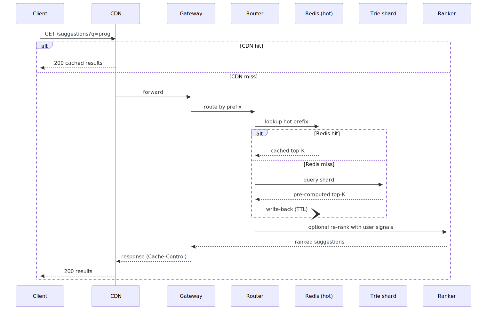
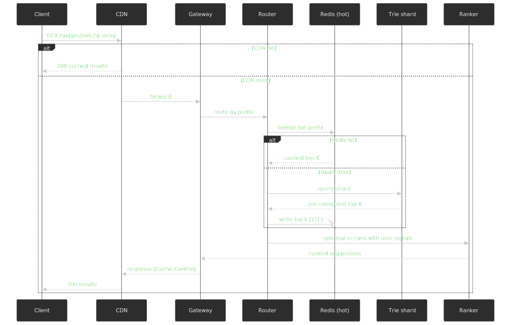
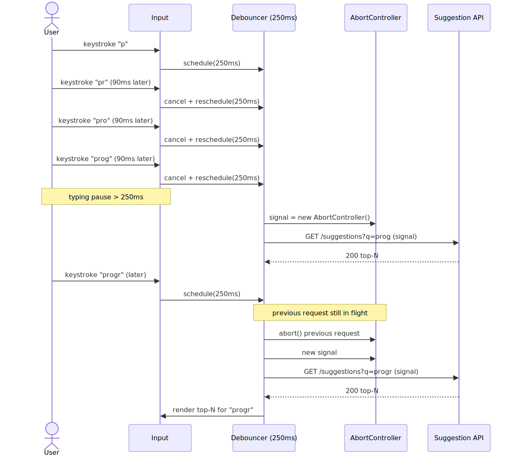
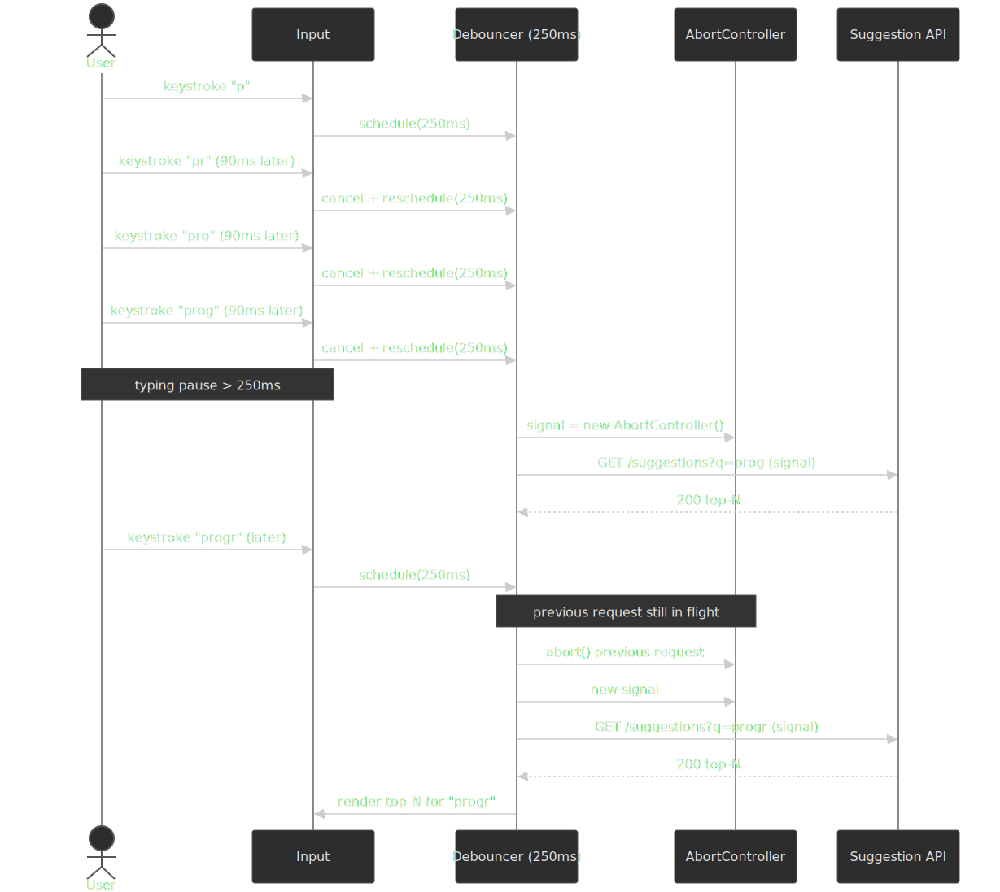

# Design Search Autocomplete: Prefix Matching at Scale

A senior-engineer reference for query autocomplete (typeahead): the prefix data structures that determine the latency floor, the dual-path indexing that keeps suggestions fresh, the cache hierarchy that absorbs traffic, and the [WAI-ARIA combobox contract](https://www.w3.org/WAI/ARIA/apg/patterns/combobox/) the UI must honor. The article is opinionated about one architecture (in-memory trie with pre-computed top-K) because it is the canonical pattern used at LinkedIn-, Google-, and Twitter-scale; the [Elasticsearch completion suggester](https://www.elastic.co/search-labs/blog/elasticsearch-autocomplete-search) is covered as the managed-infrastructure alternative.




## Mental model

Autocomplete is a **prefix-completion problem** under a hard latency budget. Seven ideas drive every design decision:

- **Perceived latency caps the budget.** The product target is the keystroke cadence — typing at ~150ms between keys means a P99 of ~100ms keeps the dropdown visually inside the typing rhythm. Anything past ~250ms reads as lag.
- **The data structure sets the latency floor.** A [trie](https://en.wikipedia.org/wiki/Trie) gives `O(p)` prefix lookup where `p` is the prefix length, independent of corpus size. Lucene's [Finite State Transducer (FST)](https://blog.mikemccandless.com/2010/12/using-finite-state-transducers-in.html) compresses the same shape further by sharing prefixes *and* suffixes and storing the result as a packed byte array for in-memory serving[^fst-bytes].
- **Pre-computed top-K eliminates query-time ranking for candidate generation.** Each node stores the K best completions of its prefix. Candidate generation becomes pure traversal — no sort, no subtree walk.
- **Top-N is two stages.** Cheap candidate generation (top-K from the trie/FST) feeds an expensive reranker that adds personalization, freshness, and click-through signals on the few hundred candidates returned, not on the corpus.
- **Typo tolerance is bounded.** Production systems cap edit distance at 1 or 2 and intersect a [Levenshtein automaton](https://en.wikipedia.org/wiki/Levenshtein_automaton) with the prefix index, not BK-trees, because the automaton prunes the index instead of measuring distance per term.
- **Freshness comes from a dual path.** Weekly batch rebuilds give stable, well-ranked indexes; streaming hot updates merge trending queries within minutes.
- **Client-side debouncing is mandatory, not optional.** Without it, typing `javascript` at normal speed fires ~10 requests in 1.5 seconds. With a 200-300ms debounce[^debounce] you fire ~1, and an `AbortController` cancels the previous request when the user types again.

The fundamental trade-off is **latency vs. relevance**. Pre-computed suggestions are fast but stale; real-time ranking is fresh but slow. Production systems layer both.

[^fst-bytes]: Mike McCandless's [Using Finite State Transducers in Lucene](https://blog.mikemccandless.com/2010/12/using-finite-state-transducers-in.html) describes the incremental, sorted-input FST construction algorithm and the packed byte-array layout that Lucene uses for both the terms dictionary and the suggester family (`AnalyzingSuggester`, `WFSTCompletionLookup`, `FSTCompletion`).

[^debounce]: Algolia's [autocomplete debouncing guide](https://algolia.com/doc/ui-libraries/autocomplete/guides/debouncing-sources) recommends ~200ms; many practitioners use 250-300ms. The right value sits between the median human reaction time (~250ms) and the upper bound at which the UI starts to feel laggy.

## Requirements

### Functional requirements

| Requirement                               | Priority | Notes                      |
| ----------------------------------------- | -------- | -------------------------- |
| Return suggestions for partial query      | Core     | Primary feature            |
| Rank by relevance (popularity, freshness) | Core     | Not just alphabetical      |
| Support trending / breaking queries       | Core     | News events, viral content |
| Personalized suggestions                  | Extended | Based on user history      |
| Spell correction / fuzzy matching         | Extended | Handle typos               |
| Multi-language support                    | Extended | Unicode, RTL scripts       |

**Out of scope**: full document search (separate system), voice input, image search.

### Non-functional requirements

| Requirement          | Target                | Rationale                                                 |
| -------------------- | --------------------- | --------------------------------------------------------- |
| Latency              | P99 < 100ms           | Stays inside one keystroke at typical cadence (~150ms)    |
| Availability         | 99.99%                | User-facing; outages affect search engagement immediately |
| Throughput           | 500K QPS peak         | See scale estimation                                       |
| Suggestion freshness | < 1 hour for trending | Breaking news must surface quickly                        |
| Consistency          | Eventual (< 5 min)    | Strong consistency is unnecessary for suggestions         |

### Scale estimation

> [!NOTE]
> The numbers below are illustrative defaults at "Google-scale". Substitute your real DAU and query rates before sizing infrastructure.

**Assumptions:**

- Daily Active Users (DAU): 1 billion
- Searches per user per day: 5
- Characters per search: 20 average
- Autocomplete trigger: every 2-3 characters past the minimum prefix

**Traffic:**

```text
Queries/day = 1B users × 5 searches × (20 chars / 3 chars per trigger)
            = 1B × 5 × 7 triggers
            ≈ 35 billion autocomplete requests/day

QPS average ≈ 35B / 86,400  ≈ 405K QPS
QPS peak (3×) ≈ 1.2M QPS
```

**Storage (rough):**

```text
Unique queries indexed: ~1B (typical query-log distribution)
Average query length:   25 bytes
Metadata per query:     16 bytes (score, timestamp)

Raw storage: 1B × 41 bytes ≈ 41 GB
Trie overhead (pointers, node structure): 3-5×
Trie storage per replica: ~150-200 GB
```

**Bandwidth:**

```text
Request size:  ~50 bytes  (prefix + metadata)
Response size: ~500 bytes (10 suggestions with metadata)

Ingress: 1.2M QPS × 50 B  ≈ 60 MB/s
Egress:  1.2M QPS × 500 B ≈ 600 MB/s
```

## Design paths

### Path A — Trie with pre-computed top-K

**Best when:**

- Suggestion corpus is bounded (millions to low billions of unique queries)
- Latency target is sub-50ms P99
- Ranking signals are mostly stable popularity-based

**Architecture:**

- In-memory tries sharded by prefix range
- Top-K suggestions pre-computed at every node during the index build
- Weekly full rebuilds + sub-hour delta updates for trending queries

**Trade-offs:**

- Sub-10ms query latency is achievable; query is pure traversal with no sort
- Predictable, consistent performance regardless of prefix popularity
- High memory footprint (every replica holds the full shard)
- Freshness limited by the rebuild + delta cadence
- Personalization requires a separate lookup pass

**Real-world reference:** LinkedIn's [Cleo](https://engineering.linkedin.com/open-source/cleo-open-source-technology-behind-linkedins-typeahead-search) serves generic typeahead in **≤1ms** within a cluster and network-personalized typeahead in **≤15ms**, with an aggregator layer adding up to ~25ms end-to-end[^cleo].

[^cleo]: LinkedIn's open-source [Cleo](https://engineering.linkedin.com/open-source/cleo-open-source-technology-behind-linkedins-typeahead-search) describes the multi-layer architecture (inverted index, per-document Bloom filter, forward index, scorer). Latency tiers: generic typeahead ≤1ms, network typeahead ≤15ms, aggregator ≤25ms.

### Path B — Inverted index with completion suggester

**Best when:**

- Corpus is large and dynamic (e-commerce catalogs, document search)
- You need flexible query types (prefix, infix, fuzzy)
- You already operate Elasticsearch / OpenSearch

**Architecture:**

- Elasticsearch [completion suggester](https://www.elastic.co/search-labs/blog/elasticsearch-autocomplete-search) backed by a Lucene FST per segment
- Edge n-gram tokenization for flexible matching
- Real-time indexing via Kafka

**Trade-offs:**

- Flexible query types and built-in fuzzy matching
- Near-real-time updates without full rebuilds
- Sharding and replication built into the engine
- Higher latency than a custom trie (10-50ms typical)
- Index size with `edge_ngram` + completion suggester runs **~15-17× larger** than the default analyzer[^esngram]
- Operational complexity of an Elasticsearch cluster

> [!IMPORTANT]
> The completion suggester FST is built **per Lucene segment** and is not updated until segments merge — deleted or updated documents can persist in suggestions until the next merge. Plan for explicit `_forcemerge` cycles if you need stronger freshness guarantees.

[^esngram]: This ratio is the consensus from the [Elastic Discuss thread on completion suggester + edge n-gram size](https://discuss.elastic.co/t/why-completion-suggester-with-edge-ngram-analyzer-takes-15-to-17-times-more-index-size-as-compared-to-default/133467); the inflation is driven by `edge_ngram` emitting one token per prefix length per term, not by the suggester itself.

### Path comparison

| Factor               | Path A — trie                | Path B — inverted index            |
| -------------------- | ---------------------------- | ---------------------------------- |
| Query latency        | <10ms                        | 10-50ms                            |
| Memory efficiency    | Lower (pointer overhead)     | Higher (FST compression)           |
| Update latency       | Hours (batch)                | Seconds (streaming, segment-bound) |
| Fuzzy matching       | Requires separate structure  | Native (`fuzziness` param)         |
| Sharding complexity  | Manual prefix-based          | Built-in                           |
| Operational overhead | Custom infrastructure        | Managed service available          |
| Best for             | High-QPS generic suggestions | Dynamic catalogs, flexible queries |

### Comparable systems in production

Before committing to a build, look at the existing engines that have already absorbed the design pressure of multi-tenant autocomplete at scale.

| System              | Index data structure                                              | Storage           | Typo tolerance                                                                                              | Notes                                                                                                                                                                                                                                                                                       |
| ------------------- | ----------------------------------------------------------------- | ----------------- | ----------------------------------------------------------------------------------------------------------- | ------------------------------------------------------------------------------------------------------------------------------------------------------------------------------------------------------------------------------------------------------------------------------------------- |
| **Lucene / ES / OpenSearch** | FST per Lucene segment (`AnalyzingSuggester`, `WFSTCompletionLookup`, `FSTCompletion`) | Memory + disk     | Levenshtein automaton intersected with the FST; max edit distance 2                                         | The completion suggester reads the FST directly; deletes only flush on segment merge[^es-merge].                                                                                                                                                                                            |
| **Algolia**         | Custom radix-tree inverted index built in C++ as an NGINX module  | RAM-first, SSD-backed | Damerau-Levenshtein, up to 2 typos (1 typo for first character)[^algolia-typo]                              | Indexing and search run as separate processes with different `nice` priorities so writes never starve reads[^algolia-arch]. Replicated across ≥3 servers per cluster.                                                                                                                       |
| **Typesense**       | Adaptive Radix Tree (ART) per field                               | RAM-first, JSON on disk | Bit-parallel Levenshtein, up to 2 typos; configurable per query                                             | On restart, nodes return `503` until the in-memory index is rebuilt from disk[^typesense-arch].                                                                                                                                                                                             |
| **Meilisearch**     | Inverted index with proximity and prefix postings                 | Memory-mapped LMDB | Levenshtein with a per-token bound (1 typo for ≥5 chars, 2 typos for ≥9 chars)                              | Ranks via an ordered list of *ranking rules* (words, typo, proximity, attribute, sort, exactness) where each later rule only breaks ties from the previous one.                                                                                                                             |
| **Bing Autosuggest** | In-memory popularity-weighted trie over historical queries        | RAM               | Limited (driven primarily by query reformulation logs)                                                      | Refreshed in near-real-time (~15-minute cadence) so trending queries surface within one news cycle[^bing-autosuggest].                                                                                                                                                                      |

If your corpus and traffic look anything like the assumptions above, the buy-vs-build trade is real. Build a custom trie service when you need sub-10ms P99 with a static schema, you already operate the streaming + batch infra, and you can amortize the engineering cost across many surfaces. Otherwise, start on Algolia or a managed Elasticsearch / OpenSearch and re-evaluate when latency or per-query cost becomes the binding constraint.

[^es-merge]: Documented in the Elasticsearch [completion suggester reference](https://www.elastic.co/guide/en/elasticsearch/reference/current/search-suggesters.html#completion-suggester); deleted documents may continue to surface as suggestions until the next segment merge.
[^algolia-typo]: See Algolia's [Typo tolerance guide](https://algolia.com/doc/guides/managing-results/optimize-search-results/typo-tolerance) — the engine uses Damerau-Levenshtein (insertions, deletions, substitutions, transpositions) and bounds tolerance by query length and configuration.
[^algolia-arch]: Algolia's engineering posts [Inside the Algolia Engine, Part 1](https://www.algolia.com/blog/engineering/inside-the-algolia-engine-part-1-indexing-vs-search) and [Part 2](https://www.algolia.com/blog/engineering/inside-the-algolia-engine-part-2-the-indexing-challenge-of-instant-search) describe the C++/NGINX module, the indexing-vs-search process split, and the radix-tree inverted index built depth-first with bounded RAM.
[^typesense-arch]: Typesense's [Query Suggestions](https://typesense.org/docs/guide/query-suggestions.html) and [FAQ](https://typesense.org/docs/guide/faqs.html) document the in-memory ART, the on-disk JSON snapshot, the rebuild-on-restart behavior, and the optional `infix` mode.
[^bing-autosuggest]: The Bing Search Blog post [A Deeper Look at Autosuggest](https://blogs.bing.com/search/March-2013/A-Deeper-Look-at-Autosuggest) and Microsoft Research's [Deep Learning Methods for Query Auto Completion](https://www.microsoft.com/en-us/research/uploads/prod/2022/07/gupta22_ijcai_slides.pdf) describe the popularity-weighted trie and the ~15-minute refresh cadence.

### Article focus

The rest of this article goes deep on **Path A**, because:

1. It is the canonical autocomplete architecture used by Google, Twitter, LinkedIn, and Bing for their primary suggestion services.
2. It exposes the prefix data structures that underpin even inverted-index implementations (the FST in `AnalyzingSuggester`, the radix tree in Algolia, the ART in Typesense).
3. Sub-10ms latency is reachable, which Path B cannot match end-to-end.

Path B implementation details are summarized in the [Elasticsearch alternative](#elasticsearch-alternative-path-b) section.

## High-level design

### Component overview

| Component           | Responsibility                          | Technology                |
| ------------------- | --------------------------------------- | ------------------------- |
| **API Gateway**     | Rate limiting, authentication, routing  | Kong, AWS API Gateway     |
| **Shard Router**    | Route prefix to correct trie shard      | Custom service            |
| **Trie Service**    | Serve suggestions from in-memory trie   | Custom service (Go / Rust)|
| **Ranking Service** | Re-rank with personalization signals    | Custom service            |
| **Redis Cache**     | Cache hot prefixes and user history     | Redis Cluster             |
| **Trie Builder**    | Build / update tries from query logs    | Spark / Flink             |
| **Kafka**           | Stream query logs and trending signals  | Apache Kafka              |
| **Object Storage**  | Store serialized trie snapshots         | S3, HDFS                  |

### Request flow




### Sharding strategy

**Prefix-based sharding** routes queries by their first character(s):

```text
Shard 1: a-f
Shard 2: g-m
Shard 3: n-s
Shard 4: t-z
```

**Why prefix-based, not hash-based:**

1. **Locality**: related queries (`system`, `systems`, `systematic`) live on the same shard
2. **Deterministic routing**: the prefix `sys` routes to shard 3 without a directory lookup
3. **Range scans**: aggregations across prefix ranges stay on a single shard

**Handling hot spots:** English letter frequency is uneven — common starting letters dominate the request mix. Two complementary mitigations:

1. **Finer granularity**: split the hottest first-letter buckets into multi-letter ranges (e.g., `s` → `sa-se`, `sf-sm`, `sn-sz`)
2. **Dynamic rebalancing**: a Shard Map Manager monitors per-shard load and adjusts ranges
3. **Replication**: more replicas for hot shards

> [!TIP]
> If you need exact sharding numbers for a planning doc, derive them from your own query log distribution rather than published English-letter frequencies — search traffic is heavily skewed by your product's vocabulary (brand names, SKUs, popular topics).

## API design

### Suggestion endpoint

```text
GET /api/v1/suggestions?q={prefix}&limit={n}&lang={code}
```

**Request parameters:**

| Parameter | Type   | Required | Default | Description                        |
| --------- | ------ | -------- | ------- | ---------------------------------- |
| `q`       | string | Yes      | —       | Query prefix (min 2 chars)         |
| `limit`   | int    | No       | 10      | Max suggestions (1-20)             |
| `lang`    | string | No       | `en`    | Language code (ISO 639-1)          |
| `user_id` | string | No       | —       | For personalized suggestions       |
| `context` | string | No       | —       | Search context (web, images, news) |

**Response (200 OK):**

```json
{
  "query": "prog",
  "suggestions": [
    {
      "text": "programming",
      "score": 0.95,
      "type": "query",
      "metadata": { "category": "technology", "trending": false }
    },
    {
      "text": "progress",
      "score": 0.87,
      "type": "query",
      "metadata": { "category": "general", "trending": false }
    },
    {
      "text": "program download",
      "score": 0.82,
      "type": "query",
      "metadata": { "category": "technology", "trending": true }
    }
  ],
  "took_ms": 8,
  "cache_hit": false
}
```

**Error responses:**

| Status | Condition                   | Body                                             |
| ------ | --------------------------- | ------------------------------------------------ |
| 400    | Prefix too short (<2 chars) | `{"error": "prefix_too_short", "min_length": 2}` |
| 429    | Rate limit exceeded         | `{"error": "rate_limited", "retry_after": 60}`   |
| 503    | Service overloaded          | `{"error": "service_unavailable"}`               |

**Rate limits:**

- Anonymous: 100 requests / minute / IP
- Authenticated: 1000 requests / minute / user
- Burst: 20 requests / second max

### Response optimization

**Compression**: enable gzip for responses >1KB. A typical 10-suggestion payload compresses from ~500 bytes to ~200 bytes.

**Cache headers** (per [RFC 9111](https://www.rfc-editor.org/rfc/rfc9111)):

```http
Cache-Control: public, max-age=300
ETag: "a1b2c3d4"
Vary: Accept-Encoding, Accept-Language
```

**Pagination** is intentionally not supported. Autocomplete is a bounded result set (≤20). If the user wants more, they should submit the full search.

## Data modeling

### Trie node structure

```typescript
interface TrieNode {
  children: Map<string, TrieNode>  // character → child node
  isEndOfWord: boolean
  topSuggestions: Suggestion[]     // pre-computed top-K
  frequency: number                // aggregate frequency for this prefix
}

interface Suggestion {
  text: string                     // full query text
  score: number                    // normalized relevance score [0, 1]
  frequency: number                // raw query count
  lastUpdated: number              // unix timestamp
  trending: boolean                // recently spiking
  metadata: {
    category?: string
    language: string
  }
}
```

### Storage schema

**Query log (Kafka topic `query-logs`):**

```json
{
  "query": "programming tutorials",
  "timestamp": 1706918400,
  "user_id": "u123",
  "session_id": "s456",
  "result_clicked": true,
  "position_clicked": 2,
  "locale": "en-US",
  "platform": "web"
}
```

**Aggregated query stats (Redis hash):**

```redis
HSET query:programming\ tutorials \
  frequency 1542389 \
  last_seen 1706918400 \
  trending 0 \
  category technology
```

**Trie snapshot (S3 / HDFS):**

```text
s3://autocomplete-data/tries/
  └── 2024-02-03/
      ├── shard-a-f.trie.gz      (~50 GB compressed)
      ├── shard-g-m.trie.gz      (~40 GB compressed)
      ├── shard-n-s.trie.gz      (~60 GB compressed)
      ├── shard-t-z.trie.gz      (~40 GB compressed)
      └── manifest.json
```

### Storage selection

| Data             | Store              | Rationale                                        |
| ---------------- | ------------------ | ------------------------------------------------ |
| Live trie        | In-memory (custom) | Sub-ms traversal required                        |
| Hot prefix cache | Redis Cluster      | <1ms lookups, TTL support                        |
| Query logs       | Kafka → S3         | Streaming ingestion, durable storage             |
| Trie snapshots   | S3 / HDFS          | Large files, versioned, cross-region replication |
| User history     | DynamoDB / Cassandra | Key-value access, high write throughput        |
| Trending signals | Redis Sorted Set   | Real-time top-K with scores                      |

## Low-level design

### Trie implementation

**Children: hash map vs. array.**

| Approach   | Lookup   | Memory            | Best for                |
| ---------- | -------- | ----------------- | ----------------------- |
| Array[26]  | O(1)     | 26 pointers/node  | Dense tries, ASCII only |
| Array[128] | O(1)     | 128 pointers/node | Full ASCII              |
| HashMap    | O(1) avg | Variable          | Sparse tries, Unicode   |

**Chosen: HashMap** because:

1. Unicode support is required (multi-language)
2. Most nodes have <5 children (sparse trie)
3. Modern hash maps approach constant-time lookup

> [!NOTE]
> When memory is the binding constraint and the dictionary is mostly static, swap the hash-map trie for a [DAWG](https://en.wikipedia.org/wiki/Deterministic_acyclic_finite_state_automaton) (which merges identical suffixes), a [MARISA-trie](http://www.s-yata.jp/marisa-trie/docs/readme.en.html) (recursive Patricia tries with succinct encoding), a [ternary search tree](https://en.wikipedia.org/wiki/Ternary_search_tree) (one character per node, three-way branching — denser than a hash-map trie when the alphabet is sparse), or Lucene's FST (covered next).

```go title="trie.go" collapse={1-8, 45-60}
package autocomplete

import (
    "sort"
    "sync"
)

const TopK = 10

type TrieNode struct {
    children       map[rune]*TrieNode
    isEnd          bool
    topSuggestions []Suggestion
    mu             sync.RWMutex
}

type Suggestion struct {
    Text      string
    Score     float64
    Frequency int64
    Trending  bool
}

func (t *TrieNode) Search(prefix string) []Suggestion {
    t.mu.RLock()
    defer t.mu.RUnlock()

    node := t
    for _, char := range prefix {
        child, exists := node.children[char]
        if !exists {
            return nil
        }
        node = child
    }
    return node.topSuggestions
}

func (t *TrieNode) Insert(word string, score float64) {
    t.mu.Lock()
    defer t.mu.Unlock()
    // insertion logic with top-K propagation up the spine
}

// BuildTopK propagates top-K suggestions up the trie at index time, not at query time.
func (t *TrieNode) BuildTopK() {
    for _, child := range t.children {
        child.BuildTopK()
    }

    var candidates []Suggestion
    if t.isEnd {
        candidates = append(candidates, t.topSuggestions...)
    }
    for _, child := range t.children {
        candidates = append(candidates, child.topSuggestions...)
    }

    sort.Slice(candidates, func(i, j int) bool {
        return candidates[i].Score > candidates[j].Score
    })
    if len(candidates) > TopK {
        candidates = candidates[:TopK]
    }
    t.topSuggestions = candidates
}
```

### Why pre-compute top-K at every node

Without pre-computation, returning suggestions for the prefix `p` requires traversing the entire subtree below the `p` node — potentially millions of descendants. With pre-computed top-K, the query is bounded by the prefix length:

- Query time: `O(p)` where `p` is the prefix length
- No subtree traversal at query time
- Predictable latency, regardless of how popular the prefix is

The trade is build time. Top-K must propagate up the trie post-order during the index build, but the build runs offline; the query path is the one that has to fit in 100ms.


### FST: prefix + suffix sharing for in-memory dictionaries

A plain trie shares prefixes; a DAWG shares suffixes; an FST does both *and* annotates each transition with an output value (a weight, a posting offset, an ordinal). Lucene's FST is the canonical implementation: built incrementally from sorted input, minimised on the fly, and serialized as a packed byte array that fits in a few hundred MB even for very large term dictionaries[^fst-bytes].


What this buys in production:

- **Memory.** Sharing suffixes typically halves the size of an English term dictionary versus a hash-map trie.
- **Cache locality.** Traversal walks contiguous bytes; modern CPUs prefetch well across the FST's packed representation.
- **Composability with automata.** Lucene intersects an FST with an arbitrary `Automaton` (regex, fuzzy, prefix) using `FSTUtil` to enumerate matching paths in `O(matches)` rather than `O(terms)` — this is what makes Lucene's `FuzzyQuery` viable on multi-billion-term indexes[^fst-fuzzy].

> [!IMPORTANT]
> FSTs are **immutable** once built. Updates require rebuilding the affected segment (Lucene's strategy) or atomically swapping the active FST (the suggester pattern). Plan your refresh cadence accordingly — there is no in-place update.

[^fst-fuzzy]: Mike McCandless's [Lucene's FuzzyQuery is 100 times faster in 4.0](https://blog.mikemccandless.com/2011/03/lucenes-fuzzyquery-is-100-times-faster.html) walks through the switch from a per-term Levenshtein scan to a Levenshtein-automaton intersection over the term FST.

### Typo tolerance

A user typing `progrmming` should still see `programming`. Three families of techniques are in production use; the choice depends on corpus size, latency budget, and how dynamic the dictionary is.

| Technique                    | Index cost                    | Query cost                                      | Best for                                                                          |
| ---------------------------- | ----------------------------- | ----------------------------------------------- | --------------------------------------------------------------------------------- |
| **Edge n-gram tokens**       | `~15-17×` over default[^esngram] | `O(1)` lookup per query token                  | Small to medium corpora where you tolerate index inflation in exchange for trivial query logic. |
| **BK-tree** (metric tree)    | `O(N)` build                  | `O(log N)` average, `O(N)` worst case for high distance | Standalone spell-check dictionaries (~1M terms) where you can iterate the candidate set in memory. |
| **Levenshtein automaton ⊗ FST/trie** | Built per query (cheap)       | `O(matches)` — proportional to results, not corpus | Production search engines (Lucene, Tantivy, Algolia, Typesense). Scales to billions of terms. |

**How Levenshtein automaton intersection works.** For a query string `q` and an edit distance `k`, build a deterministic finite automaton `A_{q,k}` that accepts every string within Levenshtein distance ≤ `k` of `q`. The states of `A_{q,k}` track `(position in q, edits used so far)`; for `k=2` the automaton has at most a few hundred states regardless of `|q|`. Then walk the FST and `A_{q,k}` in lockstep — at every FST byte, check whether `A_{q,k}` can still reach an accepting state; if not, prune the entire subtree. Lucene compiles `A_{q,k}` once and intersects it with the term FST using `FSTUtil`; this is the optimization that took `FuzzyQuery` from "rarely usable" to "default-on" in Lucene 4.0[^fst-fuzzy].

```text
q = "prog"      k = 1
A_{q,1} accepts: prog, prog?, prg, prog?, prog?, …  (all strings within 1 edit)
walk FST byte-by-byte; prune any path that A_{q,1} cannot complete
```

**Why not BK-trees in production search engines.** A BK-tree partitions terms by Levenshtein distance to a chosen root, then prunes by the triangle inequality. It works well for static, in-memory dictionaries up to ~1M terms but degrades on long-tail data and does not compose with prefix matching — you cannot ask "all completions of `prog` within edit distance 1" without two separate passes. The Levenshtein-automaton approach handles both in one traversal.

**Typical bounds.**

- Edit distance: `1` for short terms (≤4 chars), `2` for longer terms — Algolia, Meilisearch, and Lucene all default to this.
- Damerau-Levenshtein (adds transpositions) catches `progrmaming → programming` in one edit instead of two; it is the default in Lucene's `FuzzyQuery` and Algolia.
- For very short prefixes (`<3` chars) typo tolerance is usually disabled — the recall explosion is not worth it.

### Ranking algorithm

Production rankers are **two-stage**: cheap candidate generation from the trie/FST followed by an expensive reranker that runs only on the few hundred candidates returned. This keeps the prefix structure pure (no per-user state in the index) and confines all expensive features to a bounded candidate list.


**Coarse scoring formula** (run at index build, stored in trie nodes):

```text
score = w1 × popularity + w2 × freshness + w3 × trending + w4 × personalization
```

**Default weights (generic suggestions):**

| Signal          | Weight | Calculation                                  |
| --------------- | ------ | -------------------------------------------- |
| Popularity      | 0.5    | `log(frequency) / log(max_frequency)`        |
| Freshness       | 0.2    | `1 - (days_since_last_search / 30)`          |
| Trending        | 0.2    | `1.0 if spiking else 0.0`                    |
| Personalization | 0.1    | `1.0 if in user history else 0.0`            |

> [!NOTE]
> Microsoft Research's SIGIR 2013 paper [_Learning to Personalize Query Auto-Completion_](https://www.microsoft.com/en-us/research/wp-content/uploads/2013/01/SIGIR2013-Shokouhi-PersonalizedQAC.pdf) reports that supervised, personalized rankers improve MRR by **up to ~9%** over a popularity-only baseline. Personalization is worth the latency cost when the corpus has long-tail user-specific intent (e.g., LinkedIn search), less so for generic web search.

**Trending detection (illustrative threshold):**

A query is considered trending when its frequency in the most recent hour exceeds 3× its average hourly frequency over the trailing week. The 3× factor and 168h window are tunable; they should be re-derived from your own query distribution.

```python title="trending.py" collapse={1-5, 20-30}
import redis
from datetime import datetime, timedelta

r = redis.Redis()

def is_trending(query: str) -> bool:
    now = datetime.utcnow()
    hour_key = f"freq:{query}:{now.strftime('%Y%m%d%H')}"

    current = int(r.get(hour_key) or 0)

    total = 0
    for i in range(1, 169):  # 168h = 1 week
        past_hour = now - timedelta(hours=i)
        past_key = f"freq:{query}:{past_hour.strftime('%Y%m%d%H')}"
        total += int(r.get(past_key) or 0)

    avg = total / 168
    return current > 3 * avg if avg > 0 else current > 100

def rank_suggestions(suggestions, user_id=None):
    for s in suggestions:
        s.trending = is_trending(s.text)
        s.score = calculate_score(s, user_id)
    return sorted(suggestions, key=lambda x: x.score, reverse=True)
```

### Learning to rank with click-through data

Hand-tuned weights work for the first deploy; production systems graduate to a learned reranker once they have enough click-through data. The labelled signal is implicit: when prefix `p` was shown, the user either clicked one of the suggestions or submitted a different query. Pairwise objectives turn that into training data — for every shown set, the clicked suggestion should rank higher than every unclicked one.

| Approach              | Loss                          | Trained on                                | Notes                                                                                   |
| --------------------- | ----------------------------- | ----------------------------------------- | --------------------------------------------------------------------------------------- |
| **Pairwise (LambdaMART)** | Pairwise logistic / lambda gradients | (clicked, unclicked) pairs per shown set | Mature, ships in `xgboost.XGBRanker`. Strong baseline for QAC.                          |
| **Pairwise neural (DeepPLTR)** | Pairwise hinge / cross-entropy | Same pairs over learned embeddings        | Used by Amazon search; outperforms LambdaMART when query embeddings are available[^deepplt]. |
| **Listwise (DiAL)**   | α-NDCG with diversity term    | Ranked lists of candidates                | Optimises relevance and diversity simultaneously to break the popularity feedback loop[^dial]. |
| **Counterfactual LTR** | Inverse-propensity-weighted utility | Logged shown-and-clicked sets             | Corrects for the position bias and selection bias built into click logs[^cflltr].       |

**Feature families** in a typical QAC reranker:

- **Query-level**: prefix length, language, character class (Latin/CJK), is-numeric.
- **Candidate-level**: popularity (log frequency), freshness (days since last seen), edit distance from the prefix, candidate length, language match.
- **Interaction**: per-prefix CTR, per-(prefix, candidate) CTR, conversion-to-search-results ratio.
- **User-level** (when authenticated): historical CTR by category, recent searches, locale, device class.
- **Session-level**: previous prefix in this session, dwell time on previous suggestions, count of typed-and-deleted characters.

> [!IMPORTANT]
> Click-through data is heavily **position-biased** — users click position 1 far more often than position 5 even when position 5 is a better match. Always debias either by inverse-propensity weighting (counterfactual LTR), by Unbiased LambdaMART, or by sampling pairs only across positions where the swap is informative. Otherwise the model just learns to reproduce the existing ranking.

[^deepplt]: The Amazon paper [Deep Pairwise Learning To Rank For Search Autocomplete](https://arxiv.org/abs/2108.04976) describes DeepPLTR and reports gains over LambdaMART on production QAC traffic.
[^dial]: [Diversity Aware Listwise Ranking for Query Auto-Complete (EMNLP 2024)](https://aclanthology.org/2024.emnlp-industry.87.pdf) introduces DiAL, a listwise ranker that jointly optimises relevance and diversity.
[^cflltr]: [Counterfactual Learning To Rank for Utility-Maximizing Query Autocompletion (SIGIR 2022)](https://arxiv.org/abs/2204.10936) shows how to train a QAC ranker from biased click logs by treating shown candidates as a bandit problem.

### Elasticsearch alternative (Path B)

For teams that already operate Elasticsearch, the [completion suggester](https://www.elastic.co/search-labs/blog/elasticsearch-autocomplete-search) is a viable Path-B implementation. It stores terms in a Lucene FST built per segment.

**Index mapping:**

```json title="mapping.json" collapse={1-3, 25-35}
{
  "mappings": {
    "properties": {
      "suggest": {
        "type": "completion",
        "analyzer": "simple",
        "preserve_separators": true,
        "preserve_position_increments": true,
        "max_input_length": 50,
        "contexts": [
          { "name": "category", "type": "category" },
          { "name": "location", "type": "geo", "precision": 4 }
        ]
      },
      "query_text": { "type": "text" },
      "frequency":  { "type": "long" }
    }
  }
}
```

**Query:**

```json title="query.json"
{
  "suggest": {
    "query-suggest": {
      "prefix": "prog",
      "completion": {
        "field": "suggest",
        "size": 10,
        "skip_duplicates": true,
        "fuzzy": { "fuzziness": 1 },
        "contexts": { "category": ["technology"] }
      }
    }
  }
}
```

**Performance characteristics:**

- Latency: typically 10-30ms (vs. <10ms for a custom trie)
- Fuzzy matching: built-in with configurable edit distance
- Index size: ~15-17× larger when combined with `edge_ngram` analyzer[^esngram]
- Operational: managed service available (AWS OpenSearch, Elastic Cloud)

**When to choose Elasticsearch:**

1. You already run ES for document search
2. You need fuzzy matching without standing up extra infrastructure
3. Your corpus changes frequently and you want near-real-time updates
4. The team lacks the bandwidth to operate custom trie infrastructure

> [!CAUTION]
> The completion suggester reads the FST from the on-disk Lucene segments; deleted documents may continue to surface as suggestions until the next segment merge. If freshness is critical, schedule explicit `_forcemerge` cycles or use [`AnalyzingInfixSuggester`](https://lucene.apache.org/core/9_0_0/suggest/org/apache/lucene/search/suggest/analyzing/AnalyzingInfixSuggester.html), which is index-backed and supports near-real-time updates at the cost of higher latency.

## Frontend considerations

### Debouncing strategy

**Problem.** Without debouncing, typing `javascript` at typical speed (~150ms between keystrokes) generates 10 API requests in 1.5 seconds.

**Solution.** Debounce with 200-300ms delay — only send the request after the user stops typing for that interval. The window matches the median human reaction time, so the UI still feels instantaneous. Pair the debounce with an [`AbortController`](https://developer.mozilla.org/en-US/docs/Web/API/AbortController) so a late response from a stale prefix never overwrites a fresh one.




```typescript title="useAutocomplete.ts" collapse={1-5, 35-50}
import { useState, useCallback, useRef, useEffect } from "react"

const DEBOUNCE_MS = 300
const MIN_PREFIX_LENGTH = 2

export function useAutocomplete() {
  const [query, setQuery] = useState("")
  const [suggestions, setSuggestions] = useState<string[]>([])
  const [isLoading, setIsLoading] = useState(false)
  const abortControllerRef = useRef<AbortController | null>(null)
  const timeoutRef = useRef<number | null>(null)

  const fetchSuggestions = useCallback(async (prefix: string) => {
    abortControllerRef.current?.abort()
    abortControllerRef.current = new AbortController()

    setIsLoading(true)
    try {
      const response = await fetch(`/api/v1/suggestions?q=${encodeURIComponent(prefix)}&limit=10`, {
        signal: abortControllerRef.current.signal,
      })
      const data = await response.json()
      setSuggestions(data.suggestions.map((s: { text: string }) => s.text))
    } catch (error) {
      if ((error as Error).name !== "AbortError") {
        console.error("Autocomplete error:", error)
      }
    } finally {
      setIsLoading(false)
    }
  }, [])

  const handleInputChange = useCallback(
    (value: string) => {
      setQuery(value)

      if (timeoutRef.current) {
        clearTimeout(timeoutRef.current)
      }

      if (value.length < MIN_PREFIX_LENGTH) {
        setSuggestions([])
        return
      }

      timeoutRef.current = window.setTimeout(() => {
        fetchSuggestions(value)
      }, DEBOUNCE_MS)
    },
    [fetchSuggestions],
  )

  useEffect(() => {
    return () => {
      if (timeoutRef.current) clearTimeout(timeoutRef.current)
      abortControllerRef.current?.abort()
    }
  }, [])

  return { query, suggestions, isLoading, handleInputChange }
}
```

**Key implementation details:**

1. [`AbortController`](https://developer.mozilla.org/en-US/docs/Web/API/AbortController) cancels in-flight requests when the user types more — without it, you get out-of-order responses
2. **Minimum prefix length** avoids the dominant 1- and 2-character buckets that match almost everything
3. **Cleanup** clears timeouts and aborts requests on unmount

### Keyboard navigation and the ARIA combobox contract

The [WAI-ARIA Authoring Practices Guide](https://www.w3.org/WAI/ARIA/apg/patterns/combobox/examples/combobox-autocomplete-list/) defines the canonical "editable combobox with list autocomplete" pattern. Keyboard interaction:

| Key      | Action                                                |
| -------- | ----------------------------------------------------- |
| `↓` / `↑` | Move active option up / down (don't move DOM focus) |
| `Enter`  | Select the active option, fill the input, close list  |
| `Escape` | Close the list, return focus to the input             |
| `Tab`    | Select active option (if any) and move to next field  |

**Required ARIA contract:**

```html
<input
  role="combobox"
  aria-autocomplete="list"
  aria-expanded="true"
  aria-controls="suggestions-list"
  aria-activedescendant="suggestion-2"
/>
<ul id="suggestions-list" role="listbox">
  <li id="suggestion-0" role="option">programming</li>
  <li id="suggestion-1" role="option">progress</li>
  <li id="suggestion-2" role="option" aria-selected="true">program</li>
</ul>
```

> [!IMPORTANT]
> DOM focus must stay on the `<input>` at all times. The "active" option is communicated to assistive tech via `aria-activedescendant`, not via real focus. Moving focus into the list breaks the typing model.

### Optimistic UI updates

For frequently-typed prefixes, render the cached suggestions immediately and refresh them when the network responds:

```typescript
const handleInputChange = (value: string) => {
  const cached = localCache.get(value)
  if (cached) {
    setSuggestions(cached)
  }

  fetchSuggestions(value).then((fresh) => {
    setSuggestions(fresh)
    localCache.set(value, fresh)
  })
}
```

This is the pattern Twitter's [`typeahead.js`](https://blog.x.com/engineering/en_us/a/2013/twitter-typeaheadjs-you-autocomplete-me) uses with its `Bloodhound` engine: prefetch a static suggestion set into `localStorage`, then backfill from a remote when the local index is insufficient.

## Indexing pipeline

### Pipeline architecture




### Batch vs. streaming

| Aspect       | Batch (weekly)  | Streaming (real-time)  |
| ------------ | --------------- | ---------------------- |
| Latency      | Hours           | Seconds                |
| Completeness | Full corpus     | Incremental deltas     |
| Compute cost | Higher          | Lower per event        |
| Use case     | Stable rankings | Trending queries       |

**Dual-path approach:**

1. **Weekly batch**: complete trie rebuild from all query logs
2. **Sub-hour hot updates**: merge trending queries into the running trie
3. **Real-time streaming**: update trending flags and frequency counters

### Aggregation job

```python title="aggregate_queries.py" collapse={1-10, 45-60}
from pyspark.sql import SparkSession
from pyspark.sql.functions import col, count, max as spark_max, when

spark = SparkSession.builder.appName("QueryAggregation").getOrCreate()

query_logs = spark.read.parquet("s3://query-logs/2024/02/")

aggregated = (
    query_logs
    .filter(col("query").isNotNull())
    .filter(col("query") != "")
    .filter(~col("query").rlike(r"[^\w\s]"))
    .groupBy("query")
    .agg(
        count("*").alias("frequency"),
        spark_max("timestamp").alias("last_seen"),
        when(
            col("recent_freq") > 3 * col("avg_freq"),
            True
        ).otherwise(False).alias("trending")
    )
    .filter(col("frequency") >= 10)
    .orderBy(col("frequency").desc())
)

max_freq = aggregated.agg(spark_max("frequency")).collect()[0][0]
scored = aggregated.withColumn(
    "score",
    col("frequency") / max_freq * 0.5 +
    when(col("trending"), 0.2).otherwise(0.0)
)

scored.write.parquet("s3://autocomplete-data/aggregated/2024-02-03/")
```

### Trie serialization

To make snapshots cheap to ship and load, serialize the trie to a compact binary format and gzip it:

```go title="serialize.go" collapse={1-8, 40-55}
package autocomplete

import (
    "compress/gzip"
    "encoding/gob"
    "os"
)

func (t *TrieNode) Serialize(path string) error {
    file, err := os.Create(path)
    if err != nil {
        return err
    }
    defer file.Close()

    gzWriter := gzip.NewWriter(file)
    defer gzWriter.Close()

    encoder := gob.NewEncoder(gzWriter)
    return encoder.Encode(t)
}

func LoadTrie(path string) (*TrieNode, error) {
    file, err := os.Open(path)
    if err != nil {
        return nil, err
    }
    defer file.Close()

    gzReader, err := gzip.NewReader(file)
    if err != nil {
        return nil, err
    }
    defer gzReader.Close()

    var trie TrieNode
    decoder := gob.NewDecoder(gzReader)
    if err := decoder.Decode(&trie); err != nil {
        return nil, err
    }
    return &trie, nil
}
```

**Compression ratios (illustrative):**

| Format     | Size    | Load time |
| ---------- | ------- | --------- |
| Raw (JSON) | 200 GB  | 10 min    |
| Gob        | 80 GB   | 4 min     |
| Gob + Gzip | 30 GB   | 6 min     |

**Chosen: Gob + Gzip** for storage efficiency. The extra load time is acceptable for weekly rebuilds.

## Caching strategy

### Multi-layer cache

| Layer                | TTL     | Hit rate (target) | Latency  |
| -------------------- | ------- | ----------------- | -------- |
| Browser              | 1 hour  | 30-40%            | 0ms      |
| CDN / edge           | 5 min   | 50-60%            | <5ms     |
| Redis (hot prefixes) | 10 min  | 80-90%            | <2ms     |
| Trie (in-memory)     | n/a     | 100%              | <10ms    |

The hit rates are targets, not measurements; the actual cascade depends heavily on prefix distribution and how cacheable your responses are (anonymous vs. personalized, language-segmented, etc.).

### Browser caching

```http
HTTP/1.1 200 OK
Cache-Control: public, max-age=3600
ETag: "v1-abc123"
Vary: Accept-Encoding
```

- 1-hour TTL balances freshness and hit rate for stable popular prefixes
- ETag enables conditional revalidation when the cache goes stale
- `Vary: Accept-Encoding` keys the cache by encoding to avoid serving gzip to a client that did not request it

### CDN configuration

```yaml title="cloudflare-config.yaml"
# Cloudflare page rules
rules:
  - match: "/api/v1/suggestions*"
    actions:
      cache_level: cache_everything
      edge_cache_ttl: 300       # 5 minutes
      browser_cache_ttl: 3600   # 1 hour
      cache_key:
        include_query_string: true
```

**Cache key design.** The full query string must be part of the key. `/suggestions?q=prog` and `/suggestions?q=progress` are different cache entries — collapsing them produces wrong answers.

### Redis hot-prefix cache

```python title="cache.py" collapse={1-5}
import redis
import json

r = redis.Redis(cluster=True)

def get_suggestions(prefix: str) -> list | None:
    cache_key = f"suggest:{prefix}"

    cached = r.get(cache_key)
    if cached:
        return json.loads(cached)

    suggestions = query_trie(prefix)

    if is_hot_prefix(prefix):
        r.setex(cache_key, 600, json.dumps(suggestions))  # 10 min TTL

    return suggestions

def is_hot_prefix(prefix: str) -> bool:
    """Hot if queried >1000 times in the last hour."""
    freq_key = f"freq:{prefix}:{current_hour()}"
    return int(r.get(freq_key) or 0) > 1000
```

## Infrastructure

### Cloud-agnostic architecture

| Component         | Requirement                  | Open source   | Managed                  |
| ----------------- | ---------------------------- | ------------- | ------------------------ |
| Compute           | Low-latency, auto-scaling    | Kubernetes    | EKS, GKE                 |
| Cache             | Sub-ms reads, clustering     | Redis         | ElastiCache, MemoryStore |
| Message queue     | High throughput, durability  | Kafka         | MSK, Confluent Cloud     |
| Object storage    | Durable, versioned           | MinIO         | S3, GCS                  |
| Stream processing | Real-time aggregation        | Flink, Spark  | Kinesis, Dataflow        |

### AWS reference architecture




**Service configuration (rough sizing):**

| Service     | Configuration                  | Cost (order of magnitude) |
| ----------- | ------------------------------ | ------------------------- |
| ECS Fargate | 10 tasks × 16 vCPU, 32 GB RAM  | ~$8,000/month             |
| ElastiCache | r6g.xlarge × 6 nodes (cluster) | ~$2,500/month             |
| CloudFront  | 1 TB egress/day                | ~$1,500/month             |
| S3          | 500 GB storage                 | ~$12/month                |
| EMR         | m5.xlarge × 10 (weekly job)    | ~$200/month               |

> [!NOTE]
> Total of roughly **$10-15K/month** for ~500K QPS capacity. Real-world cost depends heavily on egress region mix, reserved-vs-on-demand instances, and request fan-out for personalization. Treat the table as a planning prior, not a commitment.

### Deployment strategy

**Blue-green for trie updates:**

1. Build the new trie version in an offline cluster
2. Load it into "green" service instances
3. Smoke-test green
4. Switch the load balancer to green
5. Keep blue running for 1 hour for fast rollback
6. Terminate blue

**Rolling updates for code changes:**

```yaml title="ecs-service.yaml" collapse={1-8, 25-35}
apiVersion: ecs/v1
kind: Service
metadata:
  name: trie-service
spec:
  desiredCount: 10
  deploymentConfiguration:
    maximumPercent: 150
    minimumHealthyPercent: 100
  deploymentController:
    type: ECS
  healthCheckGracePeriodSeconds: 60
  loadBalancers:
    - containerName: trie
      containerPort: 8080
      targetGroupArn: !Ref TargetGroup
```

## Monitoring and evaluation

### Key metrics

| Metric                 | Target  | Alert threshold |
| ---------------------- | ------- | --------------- |
| P50 latency            | <20ms   | >50ms           |
| P99 latency            | <100ms  | >200ms          |
| Error rate             | <0.01%  | >0.1%           |
| Cache hit rate (CDN)   | >50%    | <30%            |
| Cache hit rate (Redis) | >80%    | <60%            |
| Trie memory usage      | <80%    | >90%            |

### Business metrics

| Metric                     | Definition                                      | Target |
| -------------------------- | ----------------------------------------------- | ------ |
| Suggestion CTR             | Clicks on suggestions / Suggestions shown       | >30%   |
| Mean Reciprocal Rank (MRR) | 1 / position of clicked suggestion              | >0.5   |
| Query completion rate      | Searches using a suggestion / Total searches    | >40%   |
| Keystrokes saved           | Avg. chars typed before selecting a suggestion  | >50%   |

### Observability stack

```yaml title="datadog-monitors.yaml"
monitors:
  - name: Autocomplete P99 latency
    type: metric alert
    query: "avg(last_5m):p99:autocomplete.latency{*} > 100"
    message: "P99 latency exceeded 100ms threshold"

  - name: Trie service error rate
    type: metric alert
    query: "sum(last_5m):sum:autocomplete.errors{*}.as_rate() / sum:autocomplete.requests{*}.as_rate() > 0.001"
    message: "Error rate exceeded 0.1%"

  - name: Cache hit rate drop
    type: metric alert
    query: "avg(last_15m):autocomplete.cache.hit_rate{layer:redis} < 0.6"
    message: "Redis cache hit rate below 60%"
```

## Multi-tenant isolation

If you serve autocomplete for many products, customers, or business units from one platform, isolation drives the architecture more than raw throughput.

| Isolation model         | Index layout                                  | Cache key includes  | Trade-off                                                                                       |
| ----------------------- | --------------------------------------------- | ------------------- | ----------------------------------------------------------------------------------------------- |
| **Hard isolation**      | One trie/FST shard set per tenant             | n/a                 | Strongest blast radius containment; highest fixed cost per tenant. Algolia's per-cluster model. |
| **Logical isolation**   | Shared shards, tenant-prefixed keys           | `tenant_id` + prefix | Cheap; one noisy tenant can saturate a shard. Pair with per-tenant rate limits.                 |
| **Hybrid**              | Big tenants on dedicated shards; long tail on shared shards | `tenant_id` for shared shards | Most production deployments end up here.                                                        |

**Engineering rules.**

- **Quotas at the edge.** Per-tenant QPS, payload size, and concurrent-request limits enforced at the API gateway, not the trie service. Reject early — autocomplete cannot afford queueing.
- **Tenant-aware sharding.** Hash the `(tenant_id, prefix)` tuple instead of just the prefix when tenants share shards, otherwise two tenants with the same vocabulary co-locate and amplify hot spots.
- **Per-tenant rebuild cadence.** Big tenants rebuild on their own schedule; long-tail tenants share a batched rebuild. Avoid one global Spark job that blocks on the slowest tenant.
- **Cache namespacing.** `cache_key = sha1(tenant_id || prefix || locale || lang)`. Skipping `tenant_id` is the canonical multi-tenant footgun — one tenant sees another's suggestions and you make the front page of an outage report.
- **Noisy-neighbour controls.** Token-bucket rate limiting per tenant *and* per IP within a tenant, with a circuit breaker that returns cached results when a tenant's traffic exceeds their plan.

## Failure modes and recovery

| Failure                          | Symptom                            | Mitigation                                                       |
| -------------------------------- | ---------------------------------- | ---------------------------------------------------------------- |
| Trie shard pod OOM               | P99 spikes on a prefix range       | Bin-pack with headroom, alert on RSS, autoscale by memory        |
| Redis cluster slot loss          | Cache miss storm hits trie         | Request coalescing, circuit breaker, stale-while-revalidate      |
| Indexer falls behind on Kafka    | Trending detection lags by hours   | Partition by query, parallel consumers, backfill from S3         |
| New trie snapshot is corrupt     | Garbled suggestions after deploy   | Blue-green, snapshot checksum, automatic rollback on health-fail |
| Hot shard from celebrity query   | One shard at 95% CPU               | Replica burst, prefix-range split, optional CDN cache pin        |
| Personalization service down     | All traffic falls back to generic  | Tight timeout + fallback path; never block the query             |

## Practical takeaways

- Two-stage retrieval beats one-stage every time: cheap candidate generation from the trie/FST, expensive reranking on a bounded candidate set.
- Pre-computed top-K trumps ranking-at-query-time when latency is the binding constraint; reserve query-time work for the reranker.
- For typo tolerance, intersect a Levenshtein automaton with the prefix index; do not stand up a BK-tree unless the dictionary is small and static.
- Cache hierarchies before sharding tricks: most QPS should never reach your trie. Always include `tenant_id` and `locale` in the cache key.
- Dual-path indexing buys both stable rankings (batch) and freshness (streaming) without forcing you to pick.
- Graduate from hand-tuned weights to learning-to-rank once you have ~100K shown-and-clicked sets per surface; debias for position before training.
- Build the [WAI-ARIA combobox contract](https://www.w3.org/WAI/ARIA/apg/patterns/combobox/) before you build the dropdown — retrofits are painful.
- Pick Path B (Elasticsearch) when fuzzy matching and near-real-time updates matter more than every last millisecond. Pick Algolia / Typesense when the team's bandwidth is the binding constraint.

## Appendix

### Prerequisites

- Distributed-systems fundamentals (sharding, replication, consistency)
- Data structures: tries, hash maps, sorted sets
- Caching strategies (TTL, invalidation, stampede control)
- Stream processing concepts (Kafka, event sourcing)

### Terminology

| Term            | Definition                                                              |
| --------------- | ----------------------------------------------------------------------- |
| **Trie**        | Tree structure for prefix-based string storage and retrieval             |
| **TST**         | Ternary search tree — three-way branching trie, denser for sparse alphabets |
| **DAWG**        | Directed Acyclic Word Graph — trie that merges identical suffixes        |
| **FST**         | Finite State Transducer — automaton mapping byte sequences to outputs    |
| **ART**         | Adaptive Radix Tree — radix tree with per-node fan-out chosen by density |
| **Top-K**       | Pre-computed list of K highest-scoring suggestions at a trie node        |
| **Top-N**       | Final ranked suggestions returned to the client after reranking          |
| **QAC**         | Query Auto-Completion — suggesting queries, not documents                |
| **MRR**         | Mean Reciprocal Rank — evaluation metric for ranked results              |
| **L2R / LTR**   | Learning to Rank — supervised ranking trained from click-through logs    |
| **LambdaMART**  | Pairwise gradient-boosted ranker, common LTR baseline                    |
| **BK-tree**     | Metric tree partitioned by Levenshtein distance for fuzzy lookup         |
| **Levenshtein automaton** | DFA that accepts all strings within edit distance ≤ k of a query  |
| **Edge n-gram** | Tokenization that emits prefixes of each token at index time             |
| **Fan-out**     | Pattern of distributing data or computation across multiple nodes        |

### References

- [LinkedIn Engineering — Cleo: open source typeahead](https://engineering.linkedin.com/open-source/cleo-open-source-technology-behind-linkedins-typeahead-search) — multi-layer architecture serving generic typeahead in ≤1ms
- [Twitter Engineering — Typeahead.js: You Autocomplete Me](https://blog.x.com/engineering/en_us/a/2013/twitter-typeaheadjs-you-autocomplete-me) — client-side typeahead library design
- [Microsoft Research — Learning to Personalize Query Auto-Completion](https://www.microsoft.com/en-us/research/wp-content/uploads/2013/01/SIGIR2013-Shokouhi-PersonalizedQAC.pdf) — personalization impact on MRR (~9% lift)
- [Microsoft Research — Deep Learning Methods for Query Auto Completion](https://www.microsoft.com/en-us/research/uploads/prod/2022/07/gupta22_ijcai_slides.pdf) — survey of LSTM and pairwise LTR for QAC
- [Amazon — Deep Pairwise Learning To Rank For Search Autocomplete](https://arxiv.org/abs/2108.04976) — DeepPLTR vs LambdaMART on production traffic
- [SIGIR 2022 — Counterfactual Learning To Rank for Utility-Maximizing Query Autocompletion](https://arxiv.org/abs/2204.10936) — debiased QAC reranker
- [EMNLP 2024 — Diversity Aware Listwise Ranking for Query Auto-Complete](https://aclanthology.org/2024.emnlp-industry.87.pdf) — DiAL listwise ranker
- [Bing Search Blog — A Deeper Look at Autosuggest](https://blogs.bing.com/search/March-2013/A-Deeper-Look-at-Autosuggest) — Bing's popularity-weighted trie and refresh cadence
- [Elasticsearch Labs — autocomplete: search-as-you-type, query time, and more](https://www.elastic.co/search-labs/blog/elasticsearch-autocomplete-search) — completion suggester and edge n-gram comparison
- [Mike McCandless — Using Finite State Transducers in Lucene](https://blog.mikemccandless.com/2010/12/using-finite-state-transducers-in.html) — FST internals from the implementer
- [Mike McCandless — Lucene's FuzzyQuery is 100 times faster in 4.0](https://blog.mikemccandless.com/2011/03/lucenes-fuzzyquery-is-100-times-faster.html) — Levenshtein automaton ⊗ FST
- [Lucene API — `FSTCompletion`](https://lucene.apache.org/core/8_1_1/suggest/org/apache/lucene/search/suggest/fst/FSTCompletion.html) and [`FuzzyQuery`](https://lucene.apache.org/core/8_3_1/core/org/apache/lucene/search/FuzzyQuery.html)
- [Algolia — Inside the Algolia Engine, Part 1](https://www.algolia.com/blog/engineering/inside-the-algolia-engine-part-1-indexing-vs-search) and [Part 2](https://www.algolia.com/blog/engineering/inside-the-algolia-engine-part-2-the-indexing-challenge-of-instant-search) — C++/NGINX engine, indexing-vs-search separation, radix tree
- [Algolia — Typo tolerance](https://algolia.com/doc/guides/managing-results/optimize-search-results/typo-tolerance) — Damerau-Levenshtein bounds and configuration
- [Typesense — Query Suggestions](https://typesense.org/docs/guide/query-suggestions.html) and [FAQ](https://typesense.org/docs/guide/faqs.html) — in-memory ART, on-disk JSON, infix mode
- [WAI-ARIA APG — Combobox with list autocomplete](https://www.w3.org/WAI/ARIA/apg/patterns/combobox/examples/combobox-autocomplete-list/) — canonical pattern for accessible autocomplete
- [Algolia — debouncing autocomplete sources](https://algolia.com/doc/ui-libraries/autocomplete/guides/debouncing-sources) — UX research on debounce timing
- [RFC 9111 — HTTP caching](https://www.rfc-editor.org/rfc/rfc9111) — `Cache-Control`, `ETag`, `Vary` semantics
