# Design a Social Feed (Facebook/Instagram)

A social feed at Facebook or Instagram scale is fundamentally three problems wedged together: **distribute** new posts to the right followers, **rank** the resulting candidate set so the most relevant items surface first, and **serve** the result in well under a second across hundreds of millions of concurrent sessions. None of the three is independently hard; the friction is that every reasonable solution to one makes the other two worse. This article walks through the production-tested decomposition that Facebook ([Multifeed](https://engineering.fb.com/2015/03/10/production-engineering/serving-facebook-multifeed-efficiency-performance-gains-through-redesign/)), Instagram ([1000-model recommendation stack](https://engineering.fb.com/2025/05/21/production-engineering/journey-to-1000-models-scaling-instagrams-recommendation-system/)), and Twitter ([Redis timeline cache](https://highscalability.com/how-twitter-uses-redis-to-scale-105tb-ram-39mm-qps-10000-ins/)) converged on, and the trade-offs that make it work.

 → multi-stage ranking; post pipeline writes through TAO and fans out via Kafka into the feed cache.")

## Abstract

Three interconnected problems define the system: **content distribution** (getting posts into follower feeds), **personalised ranking** (ordering relevance), and **low-latency retrieval** (sub-second loads). The architecture below is a synthesis of public Meta, Instagram, and Twitter engineering descriptions; specific scale numbers are date-stamped throughout because production architectures evolve quickly.

**Core architectural decisions:**

| Decision         | Choice                | Rationale                                                                                                                                                                                                          |
| ---------------- | --------------------- | ------------------------------------------------------------------------------------------------------------------------------------------------------------------------------------------------------------------ |
| Fan-out strategy | Hybrid push/pull      | Push pre-computes feeds for typical accounts; pull avoids write storms for high-follower accounts. The per-producer push-vs-pull decision was formalised in Yahoo Research's [Feeding Frenzy (SIGMOD 2010)](https://sns.cs.princeton.edu/assets/papers/2010-sigmod-silberstein.pdf). |
| Content storage  | TAO-style graph store | Objects + associations fit social data and admit single-shard queries on `(id1, atype)` association lists ([TAO paper, USENIX ATC '13](https://www.usenix.org/system/files/conference/atc13/atc13-bronson.pdf)).   |
| Feed ranking     | Multi-stage ML funnel | Inventory → lightweight Pass 0 → heavy multitask NN → contextual rerank ([News Feed ranking, 2021](https://engineering.fb.com/2021/01/26/core-infra/news-feed-ranking/)).                                            |
| Caching          | Two-tier (leader/follower) with leases | Followers absorb reads; leaders serialise invalidations; lease-get throttles thundering herds ([Scaling Memcache, NSDI '13](https://www.usenix.org/system/files/conference/nsdi13/nsdi13-final170_update.pdf)).      |
| Consistency      | Eventual (~minutes); strong for writer's own writes | Acceptable for social content; Meta's [Polaris](https://engineering.fb.com/2022/06/08/core-infra/cache-made-consistent/) reports ~10 nines (99.99999999%) cache consistency within 5 minutes for TAO-class caches. |

**Key trade-offs accepted:**

- Eventual consistency for follower feeds — most users tolerate a few seconds to minutes of staleness; the writer always sees their own write through read-after-write routing.
- Higher write amplification for typical users in exchange for O(1) reads.
- A second code path for high-follower accounts in exchange for bounded write fan-out.
- Periodic ranker retraining (model staleness between deploys) in exchange for training cost and stability.

**What this design optimises:**

- p99 feed load well under one second globally.
- No data loss for user-generated posts (durable persistence before fan-out).
- Personalised ranking with thousands of features per candidate ([transparency.meta.com](https://transparency.meta.com/features/ranking-and-content/)).
- Linear horizontal scaling of stateless tiers; sharded scaling of stateful ones.

## Requirements

### Functional Requirements

| Requirement                          | Priority | Notes                                      |
| ------------------------------------ | -------- | ------------------------------------------ |
| Home feed generation                 | Core     | Aggregated posts from followed accounts.   |
| Post creation                        | Core     | Text, images, video, with privacy scope.   |
| Feed ranking                         | Core     | Personalised relevance ordering.           |
| Real-time feed updates               | Core     | New posts surface without full refresh.    |
| Engagement actions                   | Core     | Like, comment, share, save.                |
| Following/followers                  | Core     | Asymmetric directed social graph.          |
| Feed pagination                      | Core     | Cursor-based infinite scroll.              |
| Post visibility                      | Extended | Public, friends-only, custom audience.     |
| Stories / ephemeral content          | Extended | 24-hour expiring content.                  |
| Algorithmic vs. chronological toggle | Extended | User-selectable feed type.                 |

### Non-Functional Requirements

| Requirement           | Target          | Rationale                                |
| --------------------- | --------------- | ---------------------------------------- |
| Availability          | 99.99% (4 nines) | Revenue-critical; user retention.        |
| Feed load latency     | p99 < 500 ms    | Above this, scroll fluidity degrades.    |
| Post publish latency  | p99 < 2 s       | Acceptable for async fan-out.            |
| Feed freshness        | < 1 minute      | Balance between freshness and cost.      |
| Ranking model latency | p99 < 100 ms    | Real-time personalisation budget.        |
| Data durability       | 11 nines        | No user content loss (mirrors S3 SLO).   |

### Scale Estimation

These are illustrative numbers in the Facebook/Instagram class. Treat them as design inputs rather than published numbers from any specific platform.

**Users:**

- Monthly Active Users (MAU): ≈ 2 billion.
- Daily Active Users (DAU): ≈ 1 billion.
- Peak concurrent users: ≈ 200 million.

**Traffic:**

- Feed loads per user per day: ≈ 20.
- Daily feed requests: 1 B × 20 = 20 B/day ≈ 230 K RPS average.
- Peak multiplier (3×) → ≈ 700 K RPS.
- Posts per user per day (mean, heavy power-law tail): ≈ 0.5.
- Daily posts: 500 M/day ≈ 5.8 K posts/sec.

**Storage:**

- Average post metadata: ≈ 2 KB.
- Average media per post (after compression, CDN-served): ≈ 500 KB.
- Daily metadata: 500 M × 2 KB ≈ 1 TB/day.
- Daily media: 500 M × 500 KB ≈ 250 TB/day.
- Social graph edges: 2 B users × 500 mean connections ≈ 1 trillion edges.
- Graph storage at ≈ 100 B/edge: ≈ 100 TB.

**Fan-out estimation:**

- Mean follower count: 500.
- Posts requiring fan-out: 500 M/day.
- Naive push writes: 500 M × 500 = 2.5 × 10¹¹ writes/day.
- Without celebrity carve-out: top 1% (20 M users) × ≈ 50 K followers × 0.5 posts ≈ 5 × 10¹⁴ writes/day — operationally infeasible.

> [!IMPORTANT]
> The "infeasible" number is the load-bearing argument for hybrid fan-out. Any single-strategy design either burns RAM on dead writes or burns CPU on read-time aggregation. Hybrid is not an optimisation; it is the only design that survives the long tail.

## Design Paths

### Path A: Fan-out on Write (Push Model)

**Best when:**

- Follower distribution is roughly uniform (no celebrities).
- Reads dominate writes.
- Real-time freshness is critical.
- Operational simplicity is preferred over storage efficiency.

**Architecture:**

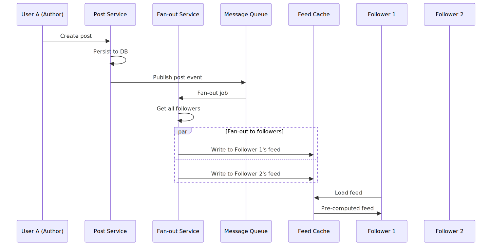
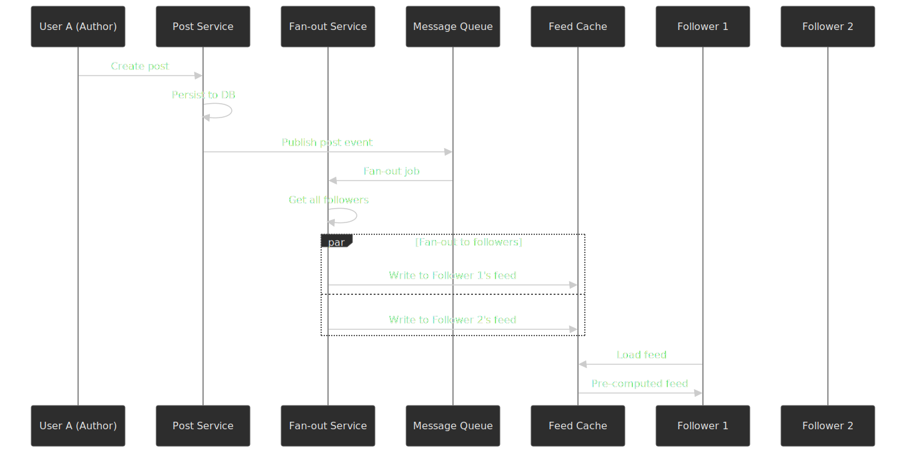

**Key characteristics:**

- Pre-computed feeds in Redis or Memcached.
- O(1) feed reads, O(followers) writes per post.
- Feed cache stores post IDs in time- or score-sorted order.

**Trade-offs:**

| Pro                                | Con                                                                  |
| ---------------------------------- | -------------------------------------------------------------------- |
| Single cache lookup on read.       | Write amplification scales with follower count.                      |
| Predictable, low read latency.     | Storage cost from duplicating post references across feeds.          |
| Simple feed retrieval logic.       | Delivery is delayed by fan-out lag for very high-follower accounts.  |

**Production reference.** Twitter's home-timeline service is the canonical large push-fanout deployment. As of 2014, the Timeline Service ran across roughly 10,000 Redis instances totalling about 105 TB of RAM and serving ≈ 39 M QPS, with each user's home timeline capped at 800 tweets to bound memory ([Yao Yue talk, summarised on High Scalability](https://highscalability.com/how-twitter-uses-redis-to-scale-105tb-ram-39mm-qps-10000-ins/); cap detail in [antirez's Twitter internals notes](https://redis.antirez.com/production/twitter-internals.html)). To fit the timeline encoding into RAM, Twitter built a "Hybrid List" data structure that was upstreamed into Redis as the now-standard `quicklist`. By 2017, Twitter's cache fleet had been re-segmented and reported ranges of 10–50 M QPS across hundreds-to-thousands of instances per cluster ([Twitter Engineering, 2017](https://blog.x.com/engineering/en_us/topics/infrastructure/2017/the-infrastructure-behind-twitter-scale)). The full pipeline behind the cache: tweets are persisted to Twitter's [Manhattan KV store](https://blog.x.com/engineering/en_us/a/2016/strong-consistency-in-manhattan), then a [Heron](https://sands.kaust.edu.sa/classes/CS390G/S17/papers/Heron.pdf) topology (the post-Storm streaming engine) consumes the write log and runs the fan-out, writing the new tweet id into each follower's pre-computed Redis timeline.

### Path B: Fan-out on Read (Pull Model)

**Best when:**

- Many high-follower accounts exist (write storms would dominate).
- Writes dominate reads.
- Storage cost is the primary constraint.
- Read latency budget can tolerate aggregation work.

**Architecture:**


**Key characteristics:**

- No write amplification per post.
- Feed computed on demand from author indices.
- Read complexity is O(followees × posts/followee) before pruning.

**Trade-offs:**

| Pro                                  | Con                                              |
| ------------------------------------ | ------------------------------------------------ |
| No write amplification.              | Higher read latency.                             |
| Always uses the freshest content.    | More compute and IO per request.                 |
| Lower storage requirements.          | Complex ranking is harder to amortise per read.  |

**Production reference.** Facebook's [Multifeed](https://engineering.fb.com/2015/03/10/production-engineering/serving-facebook-multifeed-efficiency-performance-gains-through-redesign/) is a pull-style read path: when a user requests their feed, an aggregator queries every leaf in a replica, retrieves potential candidates, then ranks and filters down to roughly 45 items. The aggregator/leaf separation was operationalised by 2010 (the family is sometimes called "Aggregator-Leaf-Tailer") and Facebook published the disaggregated redesign in March 2015, reporting ≈ 40 % reduction in total memory + CPU consumption versus the prior co-located layout.

### Path C: Hybrid Model (Industry Standard)

**Best when:**

- Follower distribution has a heavy tail (most users small, some accounts very large).
- Both reads and writes need to be optimised.
- Some additional system complexity is acceptable.
- Facebook/Instagram/Twitter scale.

**Architecture:**


**Key characteristics:**

- Threshold-based routing on follower count (commonly described in the 10 K – 100 K range; the actual number is per-platform and unpublished).
- Pre-computed feeds plus on-demand celebrity merging at read time.
- A graceful fallback: if the cached feed degrades, the read path can fall back toward pull.

**Trade-offs:**

| Pro                                          | Con                                                              |
| -------------------------------------------- | ---------------------------------------------------------------- |
| Optimal latency for the typical user.        | Two fan-out code paths to build and operate.                     |
| Bounds write amplification for celebrities.  | More complex feed-read logic (cache + pull merge).               |
| Threshold can be tuned per cohort.           | Edge cases when accounts cross the threshold.                    |

**Production reference.** Twitter's current home timeline is hybrid: regular accounts push through the Heron fan-out into per-follower Redis timelines; very high-follower accounts skip write fan-out and are merged into the requester's timeline at read time, with Manhattan as the durable source of truth ([Manhattan deployments at scale](https://blog.x.com/engineering/en_us/topics/insights/2016/manhattan-software-deployments-how-we-deploy-twitter-s-large-scale-distributed-database); [Twitter infrastructure 2017](https://blog.x.com/engineering/en_us/topics/infrastructure/2017/the-infrastructure-behind-twitter-scale)). The theoretical underpinning is older: Yahoo's [Feeding Frenzy](https://sns.cs.princeton.edu/assets/papers/2010-sigmod-silberstein.pdf) proved that the global cost-minimising policy is a *per-producer/consumer* decision driven by the producer's update rate vs. the consumer's view rate — exactly the celebrity-vs-typical split, generalised. Discord's large-server architecture is structurally similar but uses a different substrate: each guild is a single Elixir process on the BEAM VM, and "relays" sit between the guild process and per-user session processes — each relay handling fan-out to up to ~15,000 sessions, with "passive" connections skipped to cut fan-out work by roughly 90 % when users are not viewing the guild ([Maxjourney: Pushing Discord's Limits](https://discord.com/blog/maxjourney-pushing-discords-limits-with-a-million-plus-online-users-in-a-single-server)). The shared idea across these systems is the same: avoid quadratic broadcast cost by routing the long tail through a pull-style merge.

### Path Comparison

| Factor              | Fan-out Write              | Fan-out Read              | Hybrid                                |
| ------------------- | -------------------------- | ------------------------- | ------------------------------------- |
| Read latency        | Low (single cache lookup)  | Higher (aggregate + rank) | Low for typical, moderate for heavy   |
| Write cost          | O(followers)               | O(1)                      | O(followers) below threshold; O(1) above |
| Celebrity handling  | Infeasible at scale        | Native                    | Carved out                            |
| Storage cost        | High (duplicated refs)     | Low                       | Medium                                |
| Operational complexity | Low                     | Medium                    | High                                  |
| Production examples | Twitter (push tier today)  | Facebook Multifeed        | Twitter overall, Instagram, Discord   |

### This Article's Focus

The rest of this article goes deep on **Path C (Hybrid)** because:

1. It is the architecture every modern high-scale feed has converged to.
2. Reasoning about why it exists is the best way to understand fan-out trade-offs.
3. The mechanics (graph store, ranker funnel, cache leasing) are reusable building blocks.

## High-Level Design

### Component Overview


### Feed Generation Service (Multifeed)

The feed-generation layer follows Facebook's [Multifeed](https://engineering.fb.com/2015/03/10/production-engineering/serving-facebook-multifeed-efficiency-performance-gains-through-redesign/) shape with disaggregated tiers:

**Aggregator tier:**

- CPU-intensive query fan-out and ranking.
- Stateless and horizontally scalable.
- Issues parallel queries to leaf servers and merges results.
- Calls into the ranking service / model server for scoring.

**Leaf tier:**

- Memory-intensive; stores in-RAM indices of recent author actions.
- Indexes posts by author, sorted by time.
- Sharded by author user_id so that an author's posts live on a single leaf.

**Tailer:**

- Real-time pipeline (e.g. Kafka) that updates leaf indices as posts are created.
- Owns index rebuild from persistent storage on startup or after loss.

**Why disaggregate.** In Multifeed's pre-2015 layout, aggregator and leaf code shared a host. CPU-bound aggregation contended with memory-bound leaf indices; servers had to be over-provisioned on whichever resource was tightest. Splitting them into separate pools allowed independent scaling and reduced total memory + CPU consumption by ≈ 40 %, and let Facebook tune CPU-to-RAM ratios per tier instead of per host ([2015 redesign post](https://engineering.fb.com/2015/03/10/production-engineering/serving-facebook-multifeed-efficiency-performance-gains-through-redesign/)).

**Design decisions:**

| Decision          | Choice                          | Rationale                                            |
| ----------------- | ------------------------------- | ---------------------------------------------------- |
| Tier separation   | Disaggregated aggregator / leaf | Independent scaling, ≈ 40 % efficiency gain.         |
| Leaf sharding     | By author `user_id`             | Co-locates an author's posts for range queries.      |
| Index structure   | Time-sorted skiplist / sorted run | Fast time-range queries, O(log n) inserts.         |
| Memory management | LRU eviction, flash overflow    | Keep hot recent posts in RAM; spill cold to SSD.     |

### Social Graph Service (TAO-style)

The social graph (follows, friends, blocks) and content relationships sit behind a TAO-style API ([TAO paper, USENIX ATC '13](https://www.usenix.org/system/files/conference/atc13/atc13-bronson.pdf)). TAO is a thin caching layer on top of sharded MySQL that exposes a graph API and aggressively caches association lists; the published deployment serves on the order of a billion reads per second and millions of writes per second.

**Data model:**

- **Objects** — typed nodes identified by a 64-bit `id`: `(id) → (otype, key→value)`. Examples: user, post, comment, page.
- **Associations** — typed directed edges keyed on `(id1, atype, id2)`: `(id1, atype, id2) → (time, key→value)`. The 32-bit `time` field is the secondary sort key.

**Why this shape.**

- Two storage shapes (objects, associations) keep the schema and the cache key space small.
- Associations are stored on the shard owning `id1`, so the most common access pattern — "give me `id1`'s associations of type `atype`, ordered by recency" — is single-shard.
- The `time`-ordered association list is exactly what a feed retrieval needs: latest posts by author, latest likes by user, etc.

 edges sorted by time on the id1 shard.")

### Fan-out Service

Owns post distribution to follower feeds.

**Routing logic:**

```typescript
interface FanoutRouter {
  routePost(post: Post, author: User): FanoutStrategy
}

type FanoutStrategy =
  | { type: "push"; followers: string[] }
  | { type: "pull"; authorId: string }
  | { type: "hybrid"; pushTo: string[]; markForPull: boolean }
```

**Threshold-based routing (illustrative):**

- Authors with < 10 K followers: full push fan-out.
- Authors with 10 K – 1 M followers: hybrid — push to active followers, mark post for read-time pull for the rest.
- Authors with > 1 M followers: pull-only — index the post on the author's timeline and merge into followers' feeds at read time.

> [!NOTE]
> The exact threshold values used at Facebook, Instagram, or Twitter are not publicly documented. Treat the numbers above as design defaults. What is documented: the *shape* — a single follower-count threshold is the standard switch.

### Ranking Service

The ranker is structured as a multi-stage funnel that progressively narrows the candidate set to fit a tight serving budget. Meta has published two such funnels in detail:

- Facebook News Feed (2021): Inventory → Pass 0 (lightweight model, ≈ 500 candidates) → Pass 1 (heavy multitask neural network) → Pass 2 (contextual reranking for diversity and integrity), evaluating thousands of signals per candidate ([News Feed ranking, 2021](https://engineering.fb.com/2021/01/26/core-infra/news-feed-ranking/); [Transparency Center](https://transparency.meta.com/features/ranking-and-content/)).
- Instagram Explore (2023): Sourcing (retrieval) → early-stage ranking (lightweight) → late-stage ranking (multi-task multi-label, MTML) → final blending and policy filters, with retrieval relying on two-tower neural networks and approximate nearest-neighbour search ([Scaling Instagram Explore, 2023](https://engineering.fb.com/2023/08/09/ml-applications/scaling-instagram-explore-recommendations-system/)). By 2025, the platform was operating ≈ 1,000 models across surfaces ([Journey to 1000 models](https://engineering.fb.com/2025/05/21/production-engineering/journey-to-1000-models-scaling-instagrams-recommendation-system/)).
- Pinterest Home Feed: Retrieval (graph-walk candidates from [Pixie](https://cs.stanford.edu/people/jure/pubs/pixie-www18.pdf), an in-memory random-walk service over a 7 B-node Pin/board graph) → unified two-tower [pre-ranker on a root-leaf inference fleet](https://medium.com/pinterest-engineering/modernizing-home-feed-pre-ranking-stage-e636c9cdc36b) → heavy ranker (Scorpion) → final blend; per-user candidate queues are materialised in HBase by the [Smartfeed](https://medium.com/pinterest-engineering/building-a-smarter-home-feed-ad1918fdfbe3) worker so the read path stays cheap.
- LinkedIn: many feed candidate sources (jobs, companies, people-you-may-know, profile-also-viewed) are powered by [Browsemaps](https://ceur-ws.org/Vol-1271/Paper3.pdf), a horizontal item-to-item collaborative-filtering platform — co-occurrences computed offline on Hadoop, served online via a key-value store. Heavy ranking on top is described in [LiRank](https://arxiv.org/html/2402.06859v1).


**Why a funnel.** The most expensive model is the most accurate, but you cannot afford to run it on every candidate. A funnel lets you spend a sub-millisecond budget per item early (cheap features, simple model), reserve the milliseconds-per-item budget for a small, already-good slate, and apply the most expensive policy logic only on the final ≈ 50 items the user will actually see.

## API Design

### Feed Endpoints

#### Get Home Feed

**Endpoint:** `GET /api/v1/feed`

**Query Parameters:**

| Parameter | Type    | Description                           |
| --------- | ------- | ------------------------------------- |
| cursor    | string  | Pagination cursor (opaque)            |
| limit     | int     | Items per page (default: 20, max: 50) |
| refresh   | boolean | Force fresh feed generation           |

**Response (200 OK):**

```json
{
  "posts": [
    {
      "id": "post_abc123",
      "author": {
        "id": "user_456",
        "username": "johndoe",
        "displayName": "John Doe",
        "avatarUrl": "https://cdn.example.com/avatars/456.jpg",
        "isVerified": true
      },
      "content": {
        "type": "image",
        "text": "Beautiful sunset!",
        "media": [
          {
            "id": "media_789",
            "type": "image",
            "url": "https://cdn.example.com/posts/789.jpg",
            "thumbnailUrl": "https://cdn.example.com/posts/789_thumb.jpg",
            "width": 1080,
            "height": 1350,
            "altText": "Sunset over the ocean"
          }
        ]
      },
      "engagement": {
        "likeCount": 1542,
        "commentCount": 89,
        "shareCount": 23,
        "viewCount": 12450,
        "isLiked": false,
        "isSaved": false
      },
      "ranking": {
        "score": 0.89,
        "reason": "friend_interaction"
      },
      "createdAt": "2024-02-03T10:30:00Z",
      "visibility": "public"
    }
  ],
  "pagination": {
    "nextCursor": "eyJ0IjoxNzA2ODg2NDAwfQ",
    "hasMore": true
  },
  "meta": {
    "feedType": "ranked",
    "generatedAt": "2024-02-03T12:00:00Z"
  }
}
```

#### Create Post

**Endpoint:** `POST /api/v1/posts`

**Request:**

```json
{
  "content": {
    "text": "Hello world!",
    "mediaIds": ["upload_123", "upload_456"]
  },
  "visibility": "public",
  "allowComments": true,
  "allowSharing": true,
  "location": {
    "latitude": 37.7749,
    "longitude": -122.4194,
    "name": "San Francisco, CA"
  }
}
```

**Response (201 Created):**

```json
{
  "id": "post_new789",
  "author": {
    "id": "user_123",
    "username": "currentuser"
  },
  "content": {
    "text": "Hello world!",
    "media": [...]
  },
  "createdAt": "2024-02-03T12:05:00Z",
  "visibility": "public",
  "fanoutStatus": "pending"
}
```

#### Real-time Feed Updates

For real-time updates of feed-level events (new post available, engagement counts), this design uses **Server-Sent Events (SSE)** because feed updates are unidirectional (server → client) and SSE inherits HTTP/2 multiplexing, native browser auto-reconnect, and proxy/CDN compatibility.

**Endpoint:** `GET /api/v1/feed/stream`

**Event types:**

```text
event: new_post
data: {"postId": "post_xyz", "authorId": "user_456", "preview": "Check out..."}

event: engagement_update
data: {"postId": "post_abc", "likeCount": 1543, "commentCount": 90}

event: post_removed
data: {"postId": "post_old", "reason": "author_deleted"}
```

> [!TIP]
> Real-world Meta apps don't use SSE for the long-lived mobile connection. They use **MQTT over a persistent TCP connection** for messaging and notification delivery — a binary publish/subscribe protocol designed for unreliable mobile networks and battery-constrained devices ([Building Facebook Messenger, Engineering at Meta, 2011](https://engineering.fb.com/2011/08/12/android/building-facebook-messenger/)). For a feed-update fan-in into a web client, SSE is a pragmatic choice; for a mobile app, MQTT is what production sends down the wire.

### Engagement Endpoints

#### Like / Unlike Post

**Endpoint:** `POST /api/v1/posts/{id}/like`

**Response (200 OK):**

```json
{
  "liked": true,
  "likeCount": 1543,
  "timestamp": "2024-02-03T12:10:00Z"
}
```

#### Get Comments

**Endpoint:** `GET /api/v1/posts/{id}/comments`

**Query Parameters:**

| Parameter | Type   | Description                            |
| --------- | ------ | -------------------------------------- |
| cursor    | string | Pagination cursor                      |
| limit     | int    | Comments per page (default: 20)        |
| sort      | string | "top" (engagement), "newest", "oldest" |

**Response (200 OK):**

```json
{
  "comments": [
    {
      "id": "comment_123",
      "author": {
        "id": "user_789",
        "username": "commenter",
        "avatarUrl": "..."
      },
      "text": "Great post!",
      "likeCount": 45,
      "replyCount": 3,
      "isLiked": false,
      "createdAt": "2024-02-03T10:35:00Z",
      "replies": []
    }
  ],
  "pagination": {
    "nextCursor": "...",
    "hasMore": true
  },
  "totalCount": 89
}
```

### Error Responses

| Code | Error              | When                                    |
| ---- | ------------------ | --------------------------------------- |
| 400  | `INVALID_CONTENT`  | Post content violates rules             |
| 401  | `UNAUTHORIZED`     | Missing or invalid token                |
| 403  | `FORBIDDEN`        | User blocked or content restricted      |
| 404  | `POST_NOT_FOUND`   | Post doesn't exist or is deleted        |
| 429  | `RATE_LIMITED`     | Too many requests                       |
| 503  | `FEED_UNAVAILABLE` | Feed generation temporarily unavailable |

**Rate limits (illustrative):**

| Endpoint      | Limit | Window     |
| ------------- | ----- | ---------- |
| Feed load     | 60    | per minute |
| Post creation | 10    | per hour   |
| Like/comment  | 100   | per minute |
| Media upload  | 50    | per hour   |

## Data Modelling

### TAO Schema (Objects and Associations)

#### Objects Table

```sql
CREATE TABLE objects (
    id BIGINT PRIMARY KEY,
    type VARCHAR(50) NOT NULL,
    data BLOB,
    created_at TIMESTAMP DEFAULT CURRENT_TIMESTAMP,
    updated_at TIMESTAMP DEFAULT CURRENT_TIMESTAMP ON UPDATE CURRENT_TIMESTAMP,
    INDEX idx_type_created (type, created_at)
);
```

**Object types:**

| Type    | Data fields                                               |
| ------- | --------------------------------------------------------- |
| user    | username, display_name, avatar_url, bio, follower_count   |
| post    | author_id, content, visibility, like_count, comment_count |
| comment | post_id, author_id, text, like_count                      |
| media   | post_id, url, type, dimensions, alt_text                  |

#### Associations Table

```sql
CREATE TABLE associations (
    id1 BIGINT NOT NULL,
    assoc_type VARCHAR(50) NOT NULL,
    id2 BIGINT NOT NULL,
    time BIGINT NOT NULL,
    data BLOB,
    PRIMARY KEY (id1, assoc_type, id2),
    INDEX idx_id1_type_time (id1, assoc_type, time DESC)
);
```

**Association types:**

| Type      | id1         | id2         | data       |
| --------- | ----------- | ----------- | ---------- |
| follows   | follower_id | followee_id | created_at |
| authored  | user_id     | post_id     | -          |
| liked     | user_id     | post_id     | created_at |
| commented | user_id     | comment_id  | -          |
| tagged    | post_id     | user_id     | -          |

**Sharding strategy:**

- Shard on `id1` (the source object).
- Co-locates a user's follows, likes, and authored posts on a single shard.
- Single-shard query for the most common pattern: "give me `id1`'s `atype` associations sorted by recency."

### Feed Cache Schema (Redis)

```redis
ZADD feed:{user_id} {score} {post_id}

ZREMRANGEBYRANK feed:{user_id} 0 -501

HSET feed:meta:{user_id}
    last_generated 1706886400000
    version 42
    type "ranked"

ZADD celebrity_posts:{author_id} {timestamp} {post_id}

ZADD user:engaged:{user_id} {timestamp} {post_id}
EXPIRE user:engaged:{user_id} 604800
```

Per-feed caps (the trim above keeps the last 500 entries) directly mirror Twitter's published 800-tweet timeline cap; the precise number is a memory-vs-pagination-depth knob ([antirez notes](https://redis.antirez.com/production/twitter-internals.html)).

### Post Index (Leaf Servers)

In-memory index structure on leaf servers:

```typescript
interface PostIndex {
  authorIndex: Map<UserId, SortedSet<PostId, Timestamp>>

  visibilityIndex: Map<Visibility, Set<PostId>>

  recentPosts: SortedSet<PostId, Timestamp>
}

interface SortedSet<K, S> {
  add(key: K, score: S): void
  range(start: S, end: S, limit: number): K[]
  remove(key: K): void
}
```

### MySQL Persistent Storage

```sql
CREATE TABLE users (
    id BIGINT PRIMARY KEY AUTO_INCREMENT,
    username VARCHAR(50) UNIQUE NOT NULL,
    display_name VARCHAR(100),
    email VARCHAR(255) UNIQUE NOT NULL,
    password_hash VARCHAR(255) NOT NULL,
    avatar_url TEXT,
    bio TEXT,
    follower_count INT DEFAULT 0,
    following_count INT DEFAULT 0,
    post_count INT DEFAULT 0,
    is_verified BOOLEAN DEFAULT FALSE,
    is_celebrity BOOLEAN DEFAULT FALSE,
    created_at TIMESTAMP DEFAULT CURRENT_TIMESTAMP,
    INDEX idx_username (username),
    INDEX idx_email (email)
) ENGINE=InnoDB;

CREATE TABLE posts (
    id BIGINT PRIMARY KEY AUTO_INCREMENT,
    author_id BIGINT NOT NULL,
    content_text TEXT,
    content_type ENUM('text', 'image', 'video', 'link') NOT NULL,
    visibility ENUM('public', 'friends', 'private') DEFAULT 'public',
    like_count INT DEFAULT 0,
    comment_count INT DEFAULT 0,
    share_count INT DEFAULT 0,
    view_count INT DEFAULT 0,
    is_deleted BOOLEAN DEFAULT FALSE,
    created_at TIMESTAMP DEFAULT CURRENT_TIMESTAMP,
    updated_at TIMESTAMP DEFAULT CURRENT_TIMESTAMP ON UPDATE CURRENT_TIMESTAMP,
    INDEX idx_author_created (author_id, created_at DESC),
    INDEX idx_created (created_at DESC),
    FOREIGN KEY (author_id) REFERENCES users(id)
) ENGINE=InnoDB;

CREATE TABLE follows (
    follower_id BIGINT NOT NULL,
    followee_id BIGINT NOT NULL,
    created_at TIMESTAMP DEFAULT CURRENT_TIMESTAMP,
    PRIMARY KEY (follower_id, followee_id),
    INDEX idx_followee (followee_id),
    FOREIGN KEY (follower_id) REFERENCES users(id),
    FOREIGN KEY (followee_id) REFERENCES users(id)
) ENGINE=InnoDB;

CREATE TABLE post_likes (
    user_id BIGINT NOT NULL,
    post_id BIGINT NOT NULL,
    created_at TIMESTAMP DEFAULT CURRENT_TIMESTAMP,
    PRIMARY KEY (user_id, post_id),
    INDEX idx_post (post_id),
    FOREIGN KEY (user_id) REFERENCES users(id),
    FOREIGN KEY (post_id) REFERENCES posts(id)
) ENGINE=InnoDB;
```

### Database Selection Matrix

| Data type     | Store                 | Rationale                                      |
| ------------- | --------------------- | ---------------------------------------------- |
| Social graph  | TAO (MySQL-backed)    | Optimised for graph queries, association lists |
| User profiles | MySQL                 | ACID, moderate scale                           |
| Posts         | MySQL + TAO cache     | Durability + fast graph queries                |
| Feed cache    | Redis                 | Sub-ms reads; sorted sets fit ranked feeds     |
| Post index    | Leaf servers (memory) | Ultra-fast candidate retrieval                 |
| Media         | S3 + CDN              | Cost-effective, globally distributed           |
| ML features   | Feature store         | Consistent features for training and serving   |
| Analytics     | ClickHouse            | Time-series, large-aggregation queries         |

## Low-Level Design

### Feed Generation Algorithm

#### Candidate Retrieval

```typescript collapse={1-12}
class CandidateRetriever {
  private readonly leafClient: LeafClient
  private readonly taoClient: TAOClient
  private readonly redis: RedisCluster

  async getCandidates(userId: string): Promise<CandidateSet> {
    const followees = await this.taoClient.getAssociations(userId, "follows", { limit: 5000 })

    const postPromises = followees.map((followee) =>
      this.leafClient.getAuthorPosts(followee.id2, {
        since: Date.now() - 7 * 24 * 60 * 60 * 1000,
        limit: 50,
      }),
    )

    const postsByAuthor = await Promise.all(postPromises)

    const celebrityFollowees = followees.filter((f) => f.data.isCelebrity)
    const celebrityPosts = await this.getCelebrityPosts(celebrityFollowees.map((f) => f.id2))

    const allPosts = [...postsByAuthor.flat(), ...celebrityPosts]

    const eligible = await this.filterEligible(userId, allPosts)

    return {
      candidates: eligible,
      source: {
        fromCache: postsByAuthor.length,
        fromCelebrity: celebrityPosts.length,
      },
    }
  }

  private async filterEligible(userId: string, posts: Post[]): Promise<Post[]> {
    const [blocked, hidden, seen] = await Promise.all([
      this.taoClient.getAssociations(userId, "blocks"),
      this.redis.smembers(`hidden:${userId}`),
      this.redis.smembers(`seen:${userId}`),
    ])

    const blockedSet = new Set(blocked.map((b) => b.id2))
    const hiddenSet = new Set(hidden)
    const seenSet = new Set(seen)

    return posts.filter(
      (post) =>
        !blockedSet.has(post.authorId) &&
        !hiddenSet.has(post.id) &&
        !seenSet.has(post.id) &&
        this.checkVisibility(userId, post),
    )
  }
}
```

#### Multi-Stage Ranking

```typescript collapse={1-15}
class FeedRanker {
  private readonly featureStore: FeatureStore
  private readonly modelServer: ModelServer

  async rank(userId: string, candidates: Post[]): Promise<RankedPost[]> {
    const stage1 = await this.firstPassRank(userId, candidates)
    const top500 = stage1.slice(0, 500)

    const stage2 = await this.secondPassRank(userId, top500)
    const top100 = stage2.slice(0, 100)

    const final = await this.finalRerank(userId, top100)

    return final.slice(0, 50)
  }

  private async firstPassRank(userId: string, candidates: Post[]): Promise<RankedPost[]> {
    const features = candidates.map((post) => ({
      postId: post.id,
      recency: this.computeRecency(post.createdAt),
      authorAffinity: this.getAuthorAffinity(userId, post.authorId),
      contentType: post.contentType,
      engagementVelocity: this.getEngagementVelocity(post),
    }))

    const scores = features.map(
      (f) =>
        0.3 * f.recency +
        0.4 * f.authorAffinity +
        0.2 * f.engagementVelocity +
        0.1 * this.contentTypeBoost(f.contentType),
    )

    return this.sortByScore(candidates, scores)
  }

  private async secondPassRank(userId: string, candidates: Post[]): Promise<RankedPost[]> {
    const features = await this.featureStore.getBatch(
      candidates.map((c) => ({
        userId,
        postId: c.id,
        authorId: c.authorId,
      })),
    )

    const scores = await this.modelServer.predict("feed_ranking_v2", features)

    return this.sortByScore(candidates, scores)
  }

  private async finalRerank(userId: string, candidates: RankedPost[]): Promise<RankedPost[]> {
    const diversified = this.applyDiversity(candidates, {
      maxPerAuthor: 2,
      contentTypeMix: { image: 0.4, video: 0.3, text: 0.3 },
      maxAds: 3,
    })

    const filtered = await this.applyIntegrityFilters(diversified)

    return filtered
  }

  private applyDiversity(posts: RankedPost[], rules: DiversityRules): RankedPost[] {
    const result: RankedPost[] = []
    const authorCounts = new Map<string, number>()
    const typeCounts = new Map<string, number>()

    for (const post of posts) {
      const authorCount = authorCounts.get(post.authorId) || 0
      if (authorCount >= rules.maxPerAuthor) continue

      const typeCount = typeCounts.get(post.contentType) || 0
      const typeRatio = typeCount / (result.length + 1)
      const maxRatio = rules.contentTypeMix[post.contentType] || 0.5
      if (typeRatio > maxRatio && result.length > 10) continue

      result.push(post)
      authorCounts.set(post.authorId, authorCount + 1)
      typeCounts.set(post.contentType, typeCount + 1)
    }

    return result
  }
}
```

The narrowing factors above (≈ 500 / ≈ 100 / ≈ 50) are deliberate proxies for the Meta-published structure — Pass 0 outputs roughly 500 candidates per request before the heavy multitask network runs ([Engineering at Meta, 2021](https://engineering.fb.com/2021/01/26/core-infra/news-feed-ranking/); [Transparency Center](https://transparency.meta.com/features/ranking-and-content/)).

**Dedup, freshness, and integrity** live in the rerank stage, not the heavy ranker. Three concerns share that budget:

- **Dedup** — the `seen` set in candidate retrieval drops items already impressed in the last N days; `applyDiversity` caps per-author and per-content-type density so a single creator cannot monopolise the slate. Near-duplicate detection (same image hash, same article URL across reposts) is typically a separate retrieval-time filter against a rolling content fingerprint.
- **Freshness vs. ranking** — pure recency wins on novelty but loses on relevance, while pure relevance starves new content. Production rerankers add a recency boost (decay function on `createdAt`) and reserve a small slate quota for unseen-and-recent items so the feed does not stagnate around the user's strongest historical affinities.
- **Integrity / abuse** — `applyIntegrityFilters` runs after the heavy ranker so spam, policy violations, and known low-quality patterns can never appear regardless of model score. Meta's [Transparency Center](https://transparency.meta.com/features/ranking-and-content/) enumerates the categories applied at this stage; the engineering invariant is that integrity is a hard filter, not a soft signal mixed into the score.

### Fan-out Pipeline

```typescript collapse={1-20}
class FanoutService {
  private readonly CELEBRITY_THRESHOLD = 10_000
  private readonly BATCH_SIZE = 1000

  async fanoutPost(post: Post, author: User): Promise<FanoutResult> {
    const followerCount = author.followerCount

    if (followerCount < this.CELEBRITY_THRESHOLD) {
      return this.pushFanout(post, author)
    } else if (followerCount < 1_000_000) {
      return this.hybridFanout(post, author)
    } else {
      return this.pullOnly(post, author)
    }
  }

  private async pushFanout(post: Post, author: User): Promise<FanoutResult> {
    const followers = await this.getFollowers(author.id)

    const batches = this.chunk(followers, this.BATCH_SIZE)
    let written = 0

    for (const batch of batches) {
      const pipeline = this.redis.pipeline()

      for (const followerId of batch) {
        pipeline.zadd(`feed:${followerId}`, post.createdAt.getTime(), post.id)
        pipeline.zremrangebyrank(`feed:${followerId}`, 0, -501)
      }

      await pipeline.exec()
      written += batch.length

      this.metrics.increment("fanout.writes", batch.length)
    }

    return {
      strategy: "push",
      followersReached: written,
      duration: Date.now() - post.createdAt.getTime(),
    }
  }

  private async hybridFanout(post: Post, author: User): Promise<FanoutResult> {
    const activeFollowers = await this.getActiveFollowers(author.id, 7)

    const pushResult = await this.pushToFollowers(post, activeFollowers)

    await this.redis.zadd(`celebrity_posts:${author.id}`, post.createdAt.getTime(), post.id)
    await this.redis.expire(`celebrity_posts:${author.id}`, 7 * 24 * 60 * 60)

    return {
      strategy: "hybrid",
      pushed: pushResult.count,
      markedForPull: author.followerCount - activeFollowers.length,
    }
  }

  private async pullOnly(post: Post, author: User): Promise<FanoutResult> {
    await this.redis.zadd(`celebrity_posts:${author.id}`, post.createdAt.getTime(), post.id)

    await this.leafClient.indexPost(post)

    return {
      strategy: "pull",
      indexed: true,
    }
  }
}
```

### Cache Consistency (TAO + Lease Pattern)

TAO uses a two-tier cache (regional follower caches in front of a per-region leader cache) and serialises writes through the leader so invalidations can be ordered. Two operational hazards make the naive read-through dangerous:

1. **Thundering herd.** When a hot key expires or is evicted, every concurrent reader cache-misses simultaneously and stampedes the database.
2. **Stale set.** Two readers can race: reader A reads a stale value and starts to set it back into the cache; meanwhile a writer invalidates the key; reader A's set arrives last and reinstates the stale value.

Facebook's [memcache lease mechanism](https://www.usenix.org/system/files/conference/nsdi13/nsdi13-final170_update.pdf) addresses both with one tool — a 64-bit lease token returned with the miss:

- Memcache hands out a lease for a key at most once every 10 seconds; the second concurrent miss receives a "wait" hint and retries instead of stampeding the DB.
- A `set` only succeeds if the client presents a still-valid lease token. Any concurrent `delete` for that key invalidates outstanding leases, so a reader that raced a writer cannot reinstate stale data.

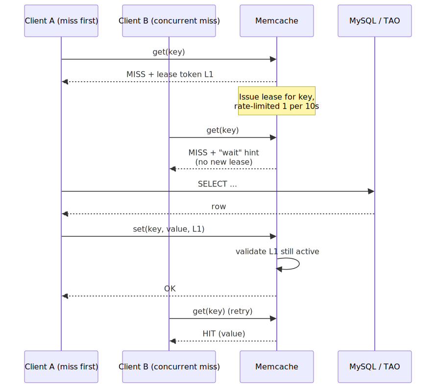
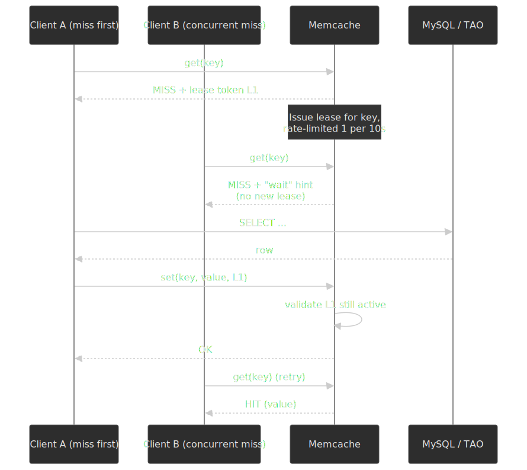

```typescript collapse={1-15}
class TAOCache {
  private readonly leaseTimeout = 10_000

  async get(id1: string, assocType: string): Promise<Association[] | null> {
    const followerResult = await this.followerCache.get(this.cacheKey(id1, assocType))

    if (followerResult) {
      this.metrics.increment("cache.hit.follower")
      return followerResult
    }

    const leaderResult = await this.leaderCache.get(this.cacheKey(id1, assocType))

    if (leaderResult) {
      this.metrics.increment("cache.hit.leader")
      await this.followerCache.set(this.cacheKey(id1, assocType), leaderResult, { ttl: 300 })
      return leaderResult
    }

    return this.fetchWithLease(id1, assocType)
  }

  private async fetchWithLease(id1: string, assocType: string): Promise<Association[]> {
    const leaseKey = `lease:${id1}:${assocType}`

    const acquired = await this.redis.set(leaseKey, "1", "NX", "PX", this.leaseTimeout)

    if (!acquired) {
      await this.sleep(100)
      return this.get(id1, assocType)
    }

    try {
      const data = await this.mysql.query(
        `SELECT * FROM associations
         WHERE id1 = ? AND assoc_type = ?
         ORDER BY time DESC`,
        [id1, assocType],
      )

      await Promise.all([
        this.leaderCache.set(this.cacheKey(id1, assocType), data, { ttl: 3600 }),
        this.followerCache.set(this.cacheKey(id1, assocType), data, { ttl: 300 }),
      ])

      return data
    } finally {
      await this.redis.del(leaseKey)
    }
  }

  async invalidate(id1: string, assocType: string): Promise<void> {
    const key = this.cacheKey(id1, assocType)
    await Promise.all([this.followerCache.del(key), this.leaderCache.del(key)])
  }
}
```

> [!NOTE]
> Meta's [Polaris service](https://engineering.fb.com/2022/06/08/core-infra/cache-made-consistent/) (2022) measures TAO-class cache consistency end-to-end and reports ≈ 10 nines (99.99999999%) of writes converging within five minutes. The number is best read as: leasing handles the common case, asynchronous monitoring catches the rare-but-real residual, and an out-of-band repair loop forces convergence.

### Engagement Counter (Eventual Consistency)

Engagement counts (likes, comments) are the canonical hot-key write path: a single popular post can take tens of thousands of like increments per second across replicas. The standard pattern is write-behind with in-process aggregation — increment the counter immediately in Redis for read consistency, batch the durable updates to MySQL on a fixed flush interval ([DDIA, Ch. 11 — Stream Processing, "Materialised views and write-behind"](https://www.oreilly.com/library/view/designing-data-intensive-applications/9781491903063/)).

```typescript collapse={1-12}
class EngagementService {
  private readonly FLUSH_INTERVAL = 5000
  private pendingUpdates = new Map<string, EngagementDelta>()

  async incrementLike(postId: string): Promise<void> {
    await this.redis.hincrby(`post:${postId}`, "like_count", 1)

    this.bufferUpdate(postId, { likes: 1 })
  }

  private bufferUpdate(postId: string, delta: EngagementDelta): void {
    const existing = this.pendingUpdates.get(postId) || {
      likes: 0,
      comments: 0,
      shares: 0,
    }

    this.pendingUpdates.set(postId, {
      likes: existing.likes + (delta.likes || 0),
      comments: existing.comments + (delta.comments || 0),
      shares: existing.shares + (delta.shares || 0),
    })
  }

  @Scheduled(FLUSH_INTERVAL)
  async flushToMySQL(): Promise<void> {
    const updates = new Map(this.pendingUpdates)
    this.pendingUpdates.clear()

    const queries = Array.from(updates.entries()).map(([postId, delta]) =>
      this.mysql.query(
        `UPDATE posts SET
          like_count = like_count + ?,
          comment_count = comment_count + ?,
          share_count = share_count + ?
         WHERE id = ?`,
        [delta.likes, delta.comments, delta.shares, postId],
      ),
    )

    await Promise.all(queries)
  }
}
```

> [!WARNING]
> Write-behind makes counters approximate during incidents. If a process crashes between the Redis increment and the next flush, the in-memory delta is lost. Production deployments persist the delta to an append-only log (e.g. Kafka) before acknowledging the user's request, then have the flusher consume from the log idempotently.

## Frontend Considerations

### Feed Virtualisation

Infinite scroll with rich media demands list virtualisation; a feed with thousands of in-DOM nodes will lose hit-test latency and tank scroll FPS.

```typescript collapse={1-15}
interface VirtualFeedConfig {
  containerHeight: number
  estimatedItemHeight: number
  overscan: number
}

class VirtualFeed {
  private heightCache = new Map<string, number>()
  private offsetCache: number[] = []

  calculateVisibleRange(scrollTop: number, posts: Post[]): { start: number; end: number } {
    let start = this.binarySearchOffset(scrollTop - this.config.overscan * 300)

    let accumulatedHeight = this.offsetCache[start] || 0
    let end = start

    while (
      end < posts.length &&
      accumulatedHeight < scrollTop + this.config.containerHeight + this.config.overscan * 300
    ) {
      accumulatedHeight += this.getItemHeight(posts[end])
      end++
    }

    return { start, end }
  }

  private getItemHeight(post: Post): number {
    if (this.heightCache.has(post.id)) {
      return this.heightCache.get(post.id)!
    }

    let estimate = 100
    if (post.content.media?.length > 0) {
      estimate += 400
    }
    if (post.content.text?.length > 200) {
      estimate += 50
    }

    return estimate
  }

  onItemRendered(postId: string, actualHeight: number): void {
    this.heightCache.set(postId, actualHeight)
    this.rebuildOffsetCache()
  }
}
```

### Optimistic Engagement Updates

```typescript collapse={1-10}
class FeedStore {
  private posts = new Map<string, Post>()
  private pendingLikes = new Set<string>()

  async likePost(postId: string): Promise<void> {
    const post = this.posts.get(postId)
    if (!post || this.pendingLikes.has(postId)) return

    this.pendingLikes.add(postId)
    this.updatePost(postId, {
      engagement: {
        ...post.engagement,
        likeCount: post.engagement.likeCount + 1,
        isLiked: true,
      },
    })

    this.notifySubscribers(postId)

    try {
      await this.api.likePost(postId)
    } catch (error) {
      this.updatePost(postId, {
        engagement: {
          ...post.engagement,
          likeCount: post.engagement.likeCount,
          isLiked: false,
        },
      })
      this.notifySubscribers(postId)
    } finally {
      this.pendingLikes.delete(postId)
    }
  }
}
```

### Real-time Feed Updates

```typescript collapse={1-12}
class FeedStreamManager {
  private eventSource: EventSource | null = null
  private reconnectAttempt = 0

  connect(userId: string): void {
    this.eventSource = new EventSource(`/api/v1/feed/stream?userId=${userId}`)

    this.eventSource.addEventListener("new_post", (event) => {
      const data = JSON.parse(event.data)
      this.onNewPost(data)
    })

    this.eventSource.addEventListener("engagement_update", (event) => {
      const data = JSON.parse(event.data)
      this.onEngagementUpdate(data)
    })

    this.eventSource.onerror = () => {
      this.scheduleReconnect()
    }
  }

  private onNewPost(data: NewPostEvent): void {
    this.feedStore.setPendingPosts(data.count)
    this.ui.showNewPostsIndicator()
  }

  private onEngagementUpdate(data: EngagementUpdateEvent): void {
    this.feedStore.updateEngagement(data.postId, data)
  }

  loadNewPosts(): void {
    const pending = this.feedStore.getPendingPosts()
    this.feedStore.prependPosts(pending)
    this.feedStore.clearPendingPosts()
    this.ui.scrollToTop()
  }
}
```

> [!TIP]
> Don't auto-insert new posts into the visible scroll position. Surface a "New posts" indicator and prepend on user click — auto-insertion at the top causes layout shifts and breaks the user's scroll context.

### Prefetching Strategy

```typescript collapse={1-10}
class FeedPrefetcher {
  private readonly PREFETCH_THRESHOLD = 5

  onScroll(visibleRange: { start: number; end: number }, totalPosts: number): void {
    const postsRemaining = totalPosts - visibleRange.end

    if (postsRemaining < this.PREFETCH_THRESHOLD && !this.loading) {
      this.prefetchNextPage()
    }
  }

  private async prefetchNextPage(): Promise<void> {
    this.loading = true

    try {
      const cursor = this.feedStore.getNextCursor()
      const response = await this.api.getFeed({ cursor, limit: 20 })

      this.feedStore.appendPosts(response.posts)
      this.feedStore.setNextCursor(response.pagination.nextCursor)
    } finally {
      this.loading = false
    }
  }
}
```

## Infrastructure

### Cloud-Agnostic Components

| Component     | Purpose              | Options                            |
| ------------- | -------------------- | ---------------------------------- |
| API Gateway   | Auth, rate limiting  | Kong, Envoy, Nginx                 |
| Graph Store   | Social graph         | Custom TAO-like, Neo4j, DGraph     |
| KV Cache      | Feed cache, sessions | Redis, KeyDB, Dragonfly            |
| Message Queue | Fan-out, events      | Kafka, Pulsar, NATS                |
| Relational DB | Users, posts         | MySQL, PostgreSQL, CockroachDB     |
| Object Store  | Media files          | MinIO, Ceph, S3-compatible         |
| ML Serving    | Ranking models       | TensorFlow Serving, Triton, Seldon |
| Feature Store | ML features          | Feast, Tecton, custom              |

### AWS Reference Architecture


**Service configurations (illustrative):**

| Service           | Configuration               | Rationale                           |
| ----------------- | --------------------------- | ----------------------------------- |
| Aggregator        | c5.4xlarge (16 vCPU, 32 GB) | CPU-bound ranking computation       |
| Leaf              | r5.8xlarge (32 vCPU, 256 GB) | Memory-intensive index storage     |
| Fan-out workers   | Fargate Spot                | Cost-effective async processing     |
| ElastiCache Redis | r6g.2xlarge cluster mode    | Sub-ms feed cache reads             |
| Aurora MySQL      | db.r6g.4xlarge Multi-AZ     | Durability; read replicas for scale |
| DynamoDB          | On-demand mode              | TAO-style graph store, auto-scaling |
| SageMaker         | p3.2xlarge (1 GPU)          | Neural network inference            |

### Multi-Region Deployment


**Multi-region considerations:**

- Single primary region for writes; reads served locally from per-region replicas.
- Cross-region replication lag in the 50–200 ms range is normal for asynchronous replication and acceptable for social-feed staleness.
- Read-after-write needs sticky routing of the writer back to the primary for a short window, otherwise the writer can read a stale follower replica.
- Failover to a secondary region should be planned and rehearsed; the primary's loss of write availability is the dominant tail risk.

## Failure Modes

| Failure                              | Detection                                  | Mitigation                                                                  |
| ------------------------------------ | ------------------------------------------ | --------------------------------------------------------------------------- |
| Fan-out worker lag (queue depth)     | Kafka consumer lag, fan-out latency p99    | Auto-scale workers; degrade to "feed slightly stale" instead of refusing.   |
| Hot key on a celebrity's post        | Per-key request rate, leaf CPU             | Lease-get to single-flight; replicate hot keys; rate-limit per-author.       |
| Leaf shard loss                      | Leaf health checks, query failure rate     | Replica failover; rebuild from MySQL via Tailer; serve degraded results.    |
| Ranking model regression             | Calibration / NE drift, online A/B metrics | Pin previous model; roll forward only when calibration recovers.            |
| Feed cache stampede after eviction   | Cache miss rate spike, DB load             | Lease-get; staggered TTLs with jitter; serve stale during refresh.          |
| Cross-region replication lag         | Replica lag metric, read-after-write hits  | Route writers and their reads to primary briefly; hide stale data in UI.    |
| Engagement counter loss on crash     | Reconciliation diff Redis ↔ MySQL          | Persist deltas to Kafka before ack; idempotent flusher consumes the log.    |
| Celebrity post visibility lag        | Pull-merge latency at read time            | Pre-warm celebrity post indices; serve while merging asynchronously.        |

## Conclusion

Designing a social feed at this scale is less about discovering a clever algorithm and more about acknowledging which trade-off you cannot avoid:

1. **Sub-second feed reads** require pre-computation, which requires write amplification.
2. **Bounded write amplification** requires a pull-style escape valve for high-follower accounts.
3. **Personalisation at this latency** requires a multi-stage funnel so the heaviest model only sees a handful of items.
4. **Cache correctness** under invalidations and stampedes requires explicit coordination — TAO's leasing is one production-grade answer.
5. **Eventual consistency** is the operational reality; the engineering work is bounding *how* eventual.

**Known limitations** of the design above:

- Sub-minute eventual consistency for follower feeds.
- Pull-merged celebrity posts pay a small additional read-time cost.
- Periodic ranker retraining means model staleness between deploys.
- Two fan-out paths and a multi-tier cache add operational surface.

**Future enhancements:**

- Real-time ranker updates from streaming features (online learning) for short-feedback-loop signals.
- Federated or on-device personalisation for privacy-sensitive ranking signals.
- Graph neural networks for richer content/audience embeddings during retrieval.
- Edge-resident feed assembly for further read-latency reductions on mobile.

## Appendix

### Prerequisites

- Distributed systems fundamentals (caching, sharding, replication).
- ML basics (training vs serving, feature engineering).
- Graph storage concepts.
- Message queue patterns (pub/sub, fan-out).

### Terminology

| Term                    | Definition                                                   |
| ----------------------- | ------------------------------------------------------------ |
| **Fan-out**             | Distributing a post to multiple follower feeds.              |
| **TAO**                 | Facebook's distributed graph store (The Associations and Objects). |
| **Aggregator**          | Service that queries and combines data from multiple sources. |
| **Leaf server**         | Memory-intensive server holding indexed recent activity.     |
| **Tailer**              | Stream consumer that updates leaf indices as posts arrive.   |
| **Candidate retrieval** | First stage of ranking — gathering potential items.          |
| **Affinity**            | Strength of relationship between user and content/author.    |
| **Lease (memcache)**    | A token issued on a cache miss that arbitrates concurrent writes and rate-limits stampedes. |

### Summary

- **Hybrid fan-out** (push for typical, pull for high-follower accounts) is the only design that survives the long tail of follower distributions.
- **TAO-style graph storage** with objects + associations admits efficient, single-shard recency queries on association lists.
- **Multi-stage ML ranking** (≈ billions → ~500 → ~50) lets the heaviest model run on only the items that survive cheap pre-filters.
- **Two-tier regional caching with leasing** (per [Memcache NSDI '13](https://www.usenix.org/system/files/conference/nsdi13/nsdi13-final170_update.pdf)) handles invalidations and stampedes; [Polaris](https://engineering.fb.com/2022/06/08/core-infra/cache-made-consistent/) reports the residual at ≈ 10 nines.
- **Eventual consistency** (~minutes) is acceptable for social feeds; engagement counts use write-behind with a durable log to bound loss.
- The architecture absorbs ~700 K RPS feed loads through stateless aggregator scaling, sharded leaf storage, and cache-first reads.

### References

**Real-world implementations:**

- [Serving Facebook Multifeed: Efficiency, Performance Gains Through Redesign (2015)](https://engineering.fb.com/2015/03/10/production-engineering/serving-facebook-multifeed-efficiency-performance-gains-through-redesign/) — Disaggregated aggregator/leaf, ≈ 40 % efficiency gain.
- [TAO: The Power of the Graph (2013)](https://engineering.fb.com/2013/06/25/core-infra/tao-the-power-of-the-graph/) — Facebook's graph store overview.
- [News Feed ranking, powered by machine learning (2021)](https://engineering.fb.com/2021/01/26/core-infra/news-feed-ranking/) — ML ranking funnel and signals.
- [Cache made consistent — Polaris (2022)](https://engineering.fb.com/2022/06/08/core-infra/cache-made-consistent/) — 10-nines cache consistency monitoring.
- [Scaling Instagram Explore Recommendations (2023)](https://engineering.fb.com/2023/08/09/ml-applications/scaling-instagram-explore-recommendations-system/) — Two-tower retrieval + late-stage MTML.
- [Journey to 1000 models: Scaling Instagram's recommendation system (2025)](https://engineering.fb.com/2025/05/21/production-engineering/journey-to-1000-models-scaling-instagrams-recommendation-system/) — Model registry + funnel at scale.
- [Building Facebook Messenger (2011)](https://engineering.fb.com/2011/08/12/android/building-facebook-messenger/) — MQTT for mobile real-time delivery.
- [Maxjourney: Pushing Discord's Limits with a Million+ Online Users](https://discord.com/blog/maxjourney-pushing-discords-limits-with-a-million-plus-online-users-in-a-single-server) — Elixir/BEAM relays for large-server fan-out.
- [How Twitter Uses Redis to Scale (2014, summarised)](https://highscalability.com/how-twitter-uses-redis-to-scale-105tb-ram-39mm-qps-10000-ins/) — 105 TB / 39 M QPS / 10 K+ instances; 800-tweet timeline cap.
- [The Infrastructure Behind Twitter: Scale (2017)](https://blog.x.com/engineering/en_us/topics/infrastructure/2017/the-infrastructure-behind-twitter-scale) — Updated cache fleet sizing.

**Academic / primary papers:**

- [TAO: Facebook's Distributed Data Store for the Social Graph — USENIX ATC '13](https://www.usenix.org/system/files/conference/atc13/atc13-bronson.pdf)
- [Scaling Memcache at Facebook — NSDI '13](https://www.usenix.org/system/files/conference/nsdi13/nsdi13-final170_update.pdf)
- [Feeding Frenzy: Selectively Materializing Users' Event Feeds — Silberstein et al., SIGMOD '10](https://sns.cs.princeton.edu/assets/papers/2010-sigmod-silberstein.pdf) — formal push/pull/hybrid analysis on Yahoo's PNUTS.
- [Twitter Heron: Stream Processing at Scale — SIGMOD '15](https://sands.kaust.edu.sa/classes/CS390G/S17/papers/Heron.pdf) — Twitter's post-Storm streaming engine; powers timeline fan-out.
- [Strong consistency in Manhattan](https://blog.x.com/engineering/en_us/a/2016/strong-consistency-in-manhattan) — Twitter's KV store of record for tweets and timelines.
- [Pixie: A System for Recommending 3+ Billion Items to 200+ Million Users in Real-Time — WWW '18](https://cs.stanford.edu/people/jure/pubs/pixie-www18.pdf) — Pinterest's graph-walk candidate generator.
- [Building a smarter home feed (Smartfeed) — Pinterest Engineering](https://medium.com/pinterest-engineering/building-a-smarter-home-feed-ad1918fdfbe3) — HBase-backed per-user candidate queues.
- [Modernizing Home Feed Pre-Ranking Stage — Pinterest Engineering](https://medium.com/pinterest-engineering/modernizing-home-feed-pre-ranking-stage-e636c9cdc36b) — unified two-tower pre-ranker on a root-leaf inference fleet.
- [The Browsemaps: Collaborative Filtering at LinkedIn — RSWeb '14](https://ceur-ws.org/Vol-1271/Paper3.pdf) — Hadoop-batch / KV-served item-to-item CF platform.
- [LiRank: Industrial Large Scale Ranking Models](https://arxiv.org/html/2402.06859v1) — LinkedIn's ranking framework.

**Books:**

- Kleppmann, *Designing Data-Intensive Applications* — Ch. 1 on home-timeline fan-out as the canonical example; Ch. 11 on stream-based write-behind.

**Related articles in this site:**

- [Design Real-Time Chat and Messaging](../design-real-time-chat-messaging/README.md) — WebSocket / MQTT-based messaging.
- [Design a Notification System](../design-notification-system/README.md) — Multi-channel notification delivery.
