# Design Spotify Music Streaming

Spotify reported **696 million monthly active users (MAU) and 276 million Premium subscribers in Q2 2025**, growing 11% year-over-year, against a catalog of roughly 100 million tracks and 7 million podcast titles[^q2-2025]. Unlike video, where a single file is gigabytes, a 3-minute Spotify track is 2–8 MB at lossy bitrates and a few tens of MB once you turn on the new lossless tier — but the workload is dominated by **time-to-first-byte**, **personalization depth across hundreds of millions of distinct profiles**, and a **300+ team microservices fleet** that has to ship independently. This article walks through how that fleet is wired together: the audio delivery pipeline, the multi-CDN strategy, the two-stage recommender, DRM-protected offline sync, the event pipeline that feeds personalization, and the platform tooling (Backstage, the proxyless gRPC service mesh) that holds it all together.

[^q2-2025]: [Spotify Q2 2025 Shareholder Deck (PDF)](https://s29.q4cdn.com/175625835/files/doc_financials/2025/q2/Q2-2025-Shareholder-Deck-FINAL.pdf) — official investor figures used throughout this article. Q4 2024 figures (675M MAU / 263M Premium) come from the [Q4 2024 earnings release](https://newsroom.spotify.com/2025-02-04/spotify-reports-fourth-quarter-2024-earnings/).


## Mental model

Three constraints shape every architectural decision below:

1. **Audio is lightweight but latency-critical.** A 3-minute track at 320 kbps Ogg Vorbis is ~7 MB; a 24-bit/44.1 kHz FLAC stream is ~50 MB. Both are trivial compared to a video segment, but users tap a track and expect sound in well under a second. The system optimises for time-to-first-byte and prefetch, not aggregate throughput.
2. **Personalization is the product.** Algorithmic surfaces — Discover Weekly, Daily Mix, Release Radar, the personalised Home — are why people stay. The recommendation system has to process billions of listening events per day and produce a fresh per-user view by the next session, not the next quarter.
3. **Offline is a first-class feature, not an add-on.** Premium subscribers can download up to 10,000 tracks per device on up to 5 devices, and that requires per-device DRM licensing, intelligent sync, and an eviction policy that survives an aeroplane and an unstable signal.

The core mechanisms that follow from those constraints:

- **Multi-CDN delivery.** Akamai and AWS CloudFront historically carry audio; Fastly is the standardised edge for non-audio assets (images, client updates, UI APIs)[^cdn-blog].
- **HTTP range requests over HTTPS, not HLS or DASH.** Each encoded track is a single file on the CDN; the client fetches it in **~512 KB chunks** with `Range:` headers and runs its own adaptive-bitrate logic on top — there is no `.m3u8` or `.mpd` manifest in the audio path[^bbr].
- **Adaptive Ogg Vorbis (24/96/160/320 kbps), AAC for the web (128/256 kbps), and a FLAC lossless tier launched September 2025**[^audio-quality][^lossless-2025].
- **DRM is split by surface.** Native desktop and mobile clients use Spotify's proprietary, Vorbis-aware DRM scheme; the **web player ships AAC inside an Encrypted Media Extensions (EME) flow** — Widevine on Chrome/Firefox/Edge, FairPlay on Safari — which is what gates 256 kbps AAC behind a Premium subscription in the browser.
- **Cassandra for write-heavy user data** (playlists, listening history, personalisation features), Postgres-style relational stores for the catalog, Elasticsearch for search, BigQuery for analytics[^cassandra-pers].
- **Hybrid recommender** combining collaborative filtering, content-based audio features inherited from the 2014 Echo Nest acquisition[^echo-nest], and NLP over playlist titles and editorial copy.
- **Google Cloud Platform** since the 2016–2018 migration off Spotify's own data centres[^gcp-migration][^road-to-cloud].

[^cdn-blog]: [How Spotify Aligned CDN Services for a Lightning Fast Streaming Experience](https://engineering.atspotify.com/2020/02/how-spotify-aligned-cdn-services-for-a-lightning-fast-streaming-experience), Spotify Engineering, 2020.
[^audio-quality]: [Audio quality](https://support.spotify.com/us/article/audio-quality/), official Spotify support article — bitrates per platform and tier.
[^lossless-2025]: [Lossless Listening Arrives on Spotify Premium](https://newsroom.spotify.com/2025-09-10/lossless-listening-arrives-on-spotify-premium-with-a-richer-more-detailed-listening-experience/), Spotify Newsroom, 10 September 2025.
[^cassandra-pers]: [Personalization at Spotify using Cassandra](https://engineering.atspotify.com/2015/01/09/personalization-at-spotify-using-cassandra), Spotify Engineering, 2015. Spotify subsequently scaled to **100+ Cassandra clusters** running personalisation, playlist, and metadata workloads ([Planet Cassandra case study](https://planetcassandra.org/usecases/spotify/391/)).
[^echo-nest]: [Spotify Acquired The Echo Nest in a $100M Deal](https://techcrunch.com/2014/03/07/spotify-echo-nest-100m/), TechCrunch, 7 March 2014.
[^gcp-migration]: [Spotify chooses Google Cloud Platform to power data infrastructure](https://cloud.google.com/blog/products/gcp/spotify-chooses-google-cloud-platform-to-power-data-infrastructure), Google Cloud Blog, 23 February 2016.
[^road-to-cloud]: [How Spotify migrated everything from on-premise to Google Cloud](https://www.computerworld.com/article/1655983/how-spotify-migrated-everything-from-on-premise-to-google-cloud-platform.html), Computerworld — confirms the Feb 2016 announcement, the **$450M, three-year commitment**, and the goal of being free of on-premise infrastructure by end of 2018.
[^bbr]: ["Smoother Streaming with BBR"](https://engineering.atspotify.com/2018/08/smoother-streaming-with-bbr), Spotify Engineering, August 2018. The team describes the audio path verbatim: "When a user plays a song, the Spotify app will fetch the file in chunks from a nearby server with HTTP GET range requests. A typical chunk size is 512kB." The same post documents how flipping the server-side congestion controller from CUBIC to BBR cut stutter 6–10% globally and 17%/12% in APAC/LATAM, with no client change.

## Requirements

### Functional Requirements

| Requirement                  | Priority     | Notes                                           |
| ---------------------------- | ------------ | ----------------------------------------------- |
| Audio playback               | Core         | Adaptive streaming, gapless playback, crossfade |
| Search                       | Core         | Tracks, artists, albums, playlists, podcasts    |
| Playlists                    | Core         | Create, edit, collaborative playlists           |
| Library management           | Core         | Save tracks, albums, follow artists             |
| Offline downloads            | Core         | Premium feature, license-protected              |
| Personalized recommendations | Core         | Discover Weekly, Daily Mix, Release Radar       |
| Social features              | Extended     | Friend activity, shared playlists               |
| Podcasts                     | Extended     | Episodes, shows, in-progress tracking           |
| Lyrics                       | Extended     | Synced lyrics display                           |
| Live events                  | Out of scope | Concerts, virtual events                        |
| Audiobooks                   | Out of scope | Separate purchase model                         |

### Non-Functional Requirements

| Requirement              | Target       | Rationale                             |
| ------------------------ | ------------ | ------------------------------------- |
| Playback availability    | 99.99%       | Revenue-critical, user retention      |
| Time to first audio      | p99 < 500ms  | User expectation for instant playback |
| Search latency           | p99 < 200ms  | Responsive search experience          |
| Recommendation freshness | < 24 hours   | Daily personalization updates         |
| Offline sync reliability | 99.9%        | Downloaded content must play          |
| Concurrent streams       | Support 50M+ | Peak evening traffic globally         |
| Catalog update latency   | < 4 hours    | New releases available quickly        |

### Scale estimation

Spotify-scale baseline (Q2 2025[^q2-2025], with order-of-magnitude derivations):

```text title="back-of-envelope-baseline"
Monthly active users:   696M (Q2 2025; +11% YoY)
Premium subscribers:    276M (~40%)
Ad-supported users:     ~420M (~60%)

Catalog:
- Tracks:        100M+
- Podcasts:      ~7M shows (Spotify reports >250M MAU touched podcasts)
- New tracks/day: ~100K (industry estimate; Spotify reports 60K-100K daily uploads)

Streaming traffic (rule-of-thumb derivation, not first-party):
- DAU ≈ 45% of MAU                    →  ~310M DAU
- Average plays per DAU ≈ 25 tracks   →  ~7.7B plays/day
- Peak concurrent streams             →  ~50M (estimated)

Audio file sizes (3-minute track):
- 96 kbps (Normal):     ~2.2 MB
- 160 kbps (High):      ~3.6 MB
- 320 kbps (Very High): ~7.2 MB
- Lossless 16-bit/44.1: ~30 MB
- Lossless 24-bit/44.1: ~50 MB

Daily egress (mix-weighted ~4 MB/track):
- 7.7B plays × 4 MB        ≈ 31 PB/day
- With 90% CDN hit rate    ≈ 3 PB/day from origin
```

> [!NOTE]
> Treat these as plausible interview-style numbers, not first-party data. Spotify publishes MAU/Premium splits; daily plays, peak concurrency, and bandwidth are estimates derived from public talks and the published quarterly metrics.

**Storage estimation (catalog only):**

```text title="catalog-storage-back-of-envelope"
Audio storage:
- 100M tracks × 4 lossy variants × 4 MB avg ≈ 1.6 PB
- + lossless ≈ 30-50 MB per track on average ≈ 3-5 PB
- + metadata + artwork ≈ ~5-10 PB once lossless is fully populated

User data (illustrative — Cassandra is sized by ops, not by GB):
- 696M users × ~150 playlists × ~50 tracks per playlist  → ~5T row-equivalents
- Listening history: ~100 events/user/day × 30d ≈ 2T events/month
```

## Design Paths

### Path A: Single-CDN with Origin Shield

**Best when:**

- Smaller scale (< 100M users)
- Geographic concentration
- Simpler operations preferred

**Architecture:**

- Single CDN provider (e.g., CloudFront)
- Origin shield layer to reduce origin load
- Simple routing via DNS

**Trade-offs:**

- ✅ Simpler vendor management
- ✅ Consistent caching behavior
- ✅ Easier debugging
- ❌ Single point of failure
- ❌ Vendor lock-in on pricing
- ❌ May have regional coverage gaps

**Real-world example:** SoundCloud relies primarily on AWS CloudFront for audio delivery.

### Path B: Multi-CDN with Intelligent Routing (Spotify Model)

**Best when:**

- Massive global scale (100M+ users)
- Need for high availability
- Leverage competitive CDN pricing

**Architecture:**

- Multiple CDN providers (Akamai, Fastly, AWS)
- Real-time CDN health monitoring
- Client-side CDN selection based on performance
- Specialized CDNs for different content types

**Trade-offs:**

- ✅ No single point of failure
- ✅ Cost optimization through CDN arbitrage
- ✅ Best performance per region
- ✅ Leverage each CDN's strengths
- ❌ Complex routing logic
- ❌ Inconsistent caching behavior
- ❌ Multiple vendor relationships

**Real-world example:** Spotify historically uses Akamai and AWS CloudFront for audio streaming, and standardised on **Fastly** for images, client updates, and other non-audio assets after a long internal alignment effort built around an internal control plane called **SquadCDN** that lets squads request new CDN behaviour via a YAML PR reviewed by a central CDN team[^cdn-blog].

### Historical path: P2P-assisted delivery

**Used by Spotify on the desktop client, 2008–2014.**

Early Spotify combined a client–server core with a structured peer-to-peer overlay; Kreitz and Niemelä's 2010 IEEE P2P paper "Spotify — Large Scale, Low Latency, P2P Music-on-Demand Streaming"[^p2p-paper] is still the canonical description of the design. By Spotify's own conference talks, peers served on the order of 80% of all bytes at peak in the early 2010s, before the share fell as more listening moved to mobile (where P2P never ran). Spotify quietly removed P2P from the desktop client in April 2014[^p2p-removed].

**Why it went away:**

- CDN economics improved faster than P2P savings; the marginal benefit shrank.
- Listening migrated from desktop to mobile, where battery, NAT, and metered data make P2P a non-starter.
- Operating two stacks (P2P + CDN) was no longer worth the maintenance overhead.

[^p2p-paper]: Gunnar Kreitz and Fredrik Niemelä, "Spotify — Large Scale, Low Latency, P2P Music-on-Demand Streaming", *IEEE P2P 2010*. [IEEE Xplore](https://ieeexplore.ieee.org/document/5569963/).
[^p2p-removed]: [Spotify Removes Peer-To-Peer Technology From Its Desktop Client](https://techcrunch.com/2014/04/17/spotify-removes-peer-to-peer-technology-from-its-desktop-client/), TechCrunch, 17 April 2014.

### Path Comparison

| Factor              | Single CDN   | Multi-CDN      | P2P-Assisted   |
| ------------------- | ------------ | -------------- | -------------- |
| Availability        | 99.9%        | 99.99%         | Variable       |
| Setup complexity    | Low          | High           | Very High      |
| Operating cost      | Medium       | Lower at scale | Lowest         |
| Mobile support      | Full         | Full           | Limited        |
| Latency consistency | High         | Medium         | Variable       |
| Best for            | < 100M users | > 100M users   | Cost-sensitive |

### This Article's Focus

This article focuses on **Path B (Multi-CDN)** because:

1. Spotify scale requires geographic diversity
2. The multi-CDN pattern demonstrates advanced content delivery
3. It represents the current industry standard for major streaming services

## High-Level Design

### Component Overview



### Service communication

Inter-service traffic at Spotify standardised on **gRPC + Protocol Buffers** several years ago. As of 2024, Spotify runs a **proxyless gRPC service mesh** built on the Envoy `xDS` API, sized for roughly **1.5 million Kubernetes pods**[^proxyless]. Instead of adding an Envoy sidecar to every pod, gRPC's native `xDS` resolver and load-balancer plug-ins talk to a central control plane. That gives the centrally managed service-mesh features (dynamic traffic splitting, zone-aware routing, mTLS, a service call graph) without paying the per-RPC sidecar latency or the per-pod RAM cost that a full sidecar mesh would incur at that pod count.

**Why proxyless gRPC won out:**

- Same wire features as a sidecar mesh (ALPN, mTLS, retries, outlier detection) directly in the gRPC client and server.
- Half the network hops and no extra container per pod — meaningful at 1.5M pods.
- Centralised, declarative config flows in via `xDS`, so platform teams can roll out routing or load-balancing changes without redeploying every service.
- Sidecar-based escape hatches (Envoy + gRPC) still exist for non-Java/non-Go runtimes that lag on `xDS` support.

[^proxyless]: Erik Lindblad and Erica Manno, ["How We Moved Spotify to a Proxyless gRPC Service Mesh"](https://www.youtube.com/watch?v=2_ECK6v_yXc), conference talk, 2024.

### Playback Flow

1. **User taps play** → Client sends play request to Playback Service
2. **Playback Service validates** → Checks subscription, licensing, availability
3. **License acquired** → DRM key retrieved for encrypted content
4. **CDN URL returned** → Client receives signed URL with CDN selection
5. **Audio streamed** → Client fetches segments from edge CDN
6. **Prefetch triggered** → Next track segments pre-fetched for gapless playback
7. **Event logged** → Stream event sent to Pub/Sub for analytics

### Event-driven architecture

Every meaningful client action — `play`, `pause`, `skip`, `search`, `follow`, `complete` — is emitted as an event into Google Cloud Pub/Sub. Spotify's own writeups describe a fan-out tree like:

```text title="event-fan-out"
Client → API gateway → event-delivery service
                                 ↓
                              Pub/Sub topics
                  ┌───────────────┼─────────────────┐
                  ↓               ↓                 ↓
            Dataflow         Bigtable          Recommendation
            (stream/batch)   (online features) feature pipelines
                  ↓
              BigQuery
              (analytics warehouse)
```

**Event-pipeline scale (verified, post-migration):**

- The Pub/Sub-based event delivery system was load-tested at **2 million messages/sec** during selection[^pubsub-2m] and grew from roughly **800K events/sec to over 3M events/sec in production** after the cutover[^road-to-cloud].
- End-to-end latency from client emit to BigQuery is sub-minute for analytics and sub-second for the streaming features that drive Home and recommendations.

[^pubsub-2m]: ["Spotify's Journey to Cloud: why Spotify migrated its event delivery system from Kafka to Google Cloud Pub/Sub"](https://cloud.google.com/blog/products/gcp/spotifys-journey-to-cloud-why-spotify-migrated-its-event-delivery-system-from-kafka-to-google-cloud-pubsub), Google Cloud Blog.

## Audio Streaming Pipeline

### Audio Encoding Strategy



### Quality levels

The current ladder, taken straight from [Spotify's official Audio quality support page](https://support.spotify.com/us/article/audio-quality/) and the [September 2025 Lossless announcement](https://newsroom.spotify.com/2025-09-10/lossless-listening-arrives-on-spotify-premium-with-a-richer-more-detailed-listening-experience/):

| Quality      | Bitrate             | Codec / container       | Availability                | File size (3 min) |
| ------------ | ------------------- | ----------------------- | --------------------------- | ----------------- |
| Low          | ~24 kbps            | Ogg Vorbis              | Free + Premium (mobile)     | ~0.5 MB           |
| Normal       | ~96 kbps            | Ogg Vorbis              | Free + Premium              | ~2.2 MB           |
| High         | ~160 kbps           | Ogg Vorbis              | Free + Premium              | ~3.6 MB           |
| Very High    | ~320 kbps           | Ogg Vorbis              | Premium only                | ~7.2 MB           |
| Web (free)   | 128 kbps            | AAC                     | Web player, free tier       | ~2.9 MB           |
| Web (paid)   | 256 kbps            | AAC                     | Web player, Premium         | ~5.8 MB           |
| **Lossless** | up to 24-bit/44.1 kHz | FLAC (lossless)       | Premium, music only (Sept 2025+) | ~30–50 MB    |

**Why Ogg Vorbis as the historical default:**

- Royalty-free at the codec level — important in 2008 when Spotify launched.
- Better than MP3 at low bitrates (Spotify's `~96 kbps` "Normal" tier is its single largest delivered quality on cellular).
- Wide hardware decode support on mobile.

**Why AAC for the web:**

- Universal browser support without bundling a Vorbis decoder.
- Native Safari/iOS support, including for the Web Playback SDK and Spotify Connect-as-receiver browsers.

**Lossless (Sept 2025):** FLAC up to 24-bit/44.1 kHz, music-only (no podcast/audiobook lossless), gated behind a Premium toggle, recommended over a 1.5–2 Mbps connection. The lossless stream is roughly an order of magnitude more bandwidth than 320 kbps Ogg Vorbis, so the adaptive logic is even more important once a user opts in.

### Streaming protocol: HTTP range requests, not HLS or DASH

Unlike Netflix or YouTube, Spotify does **not** segment audio into a manifest of `.ts` / `.m4s` files. Each encoded version of a track is a **single Ogg Vorbis (or AAC, or FLAC) file** sitting on the CDN, and the client fetches it in roughly **512 KB chunks** with `Range:` headers over HTTPS[^bbr]. Adaptive bitrate is implemented purely client-side: when the player wants a higher tier, it stops fetching the current file and starts issuing range requests against the higher-tier file from the same byte offset.

This shape matters for several things downstream:

- **Cache key is per (track, quality)**, not per segment — a single hot cache object serves arbitrarily many byte ranges.
- **No manifest round-trip** before first audio — first byte ≈ first sound, modulo chunk decode.
- **Prefetch is just another `GET` with a `Range`** against the next track's file, not a manifest-driven preload.
- **Transport optimisation has outsized impact.** Spotify reported in 2018 that flipping their audio servers from CUBIC to **BBR** congestion control cut stutter 6–10% globally (17% in APAC, 12% in LATAM) with no client change — and during a Peruvian upstream brownout, the BBR cohort saw 5× less stutter than CUBIC[^bbr].

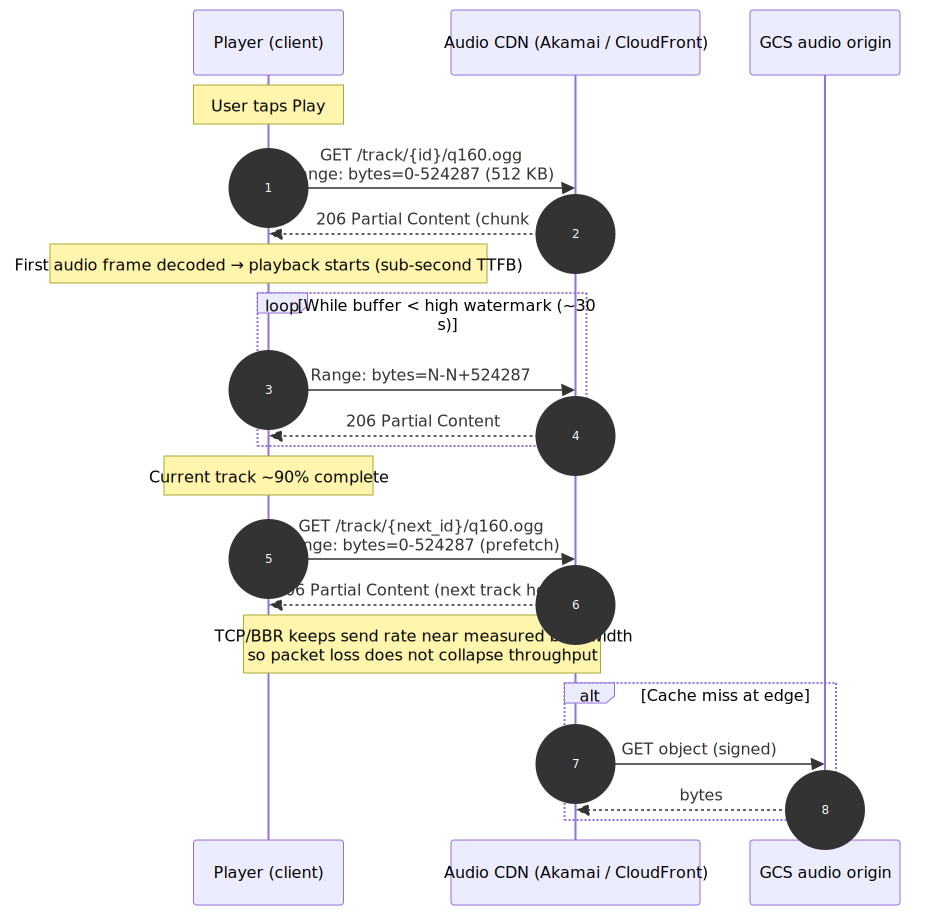
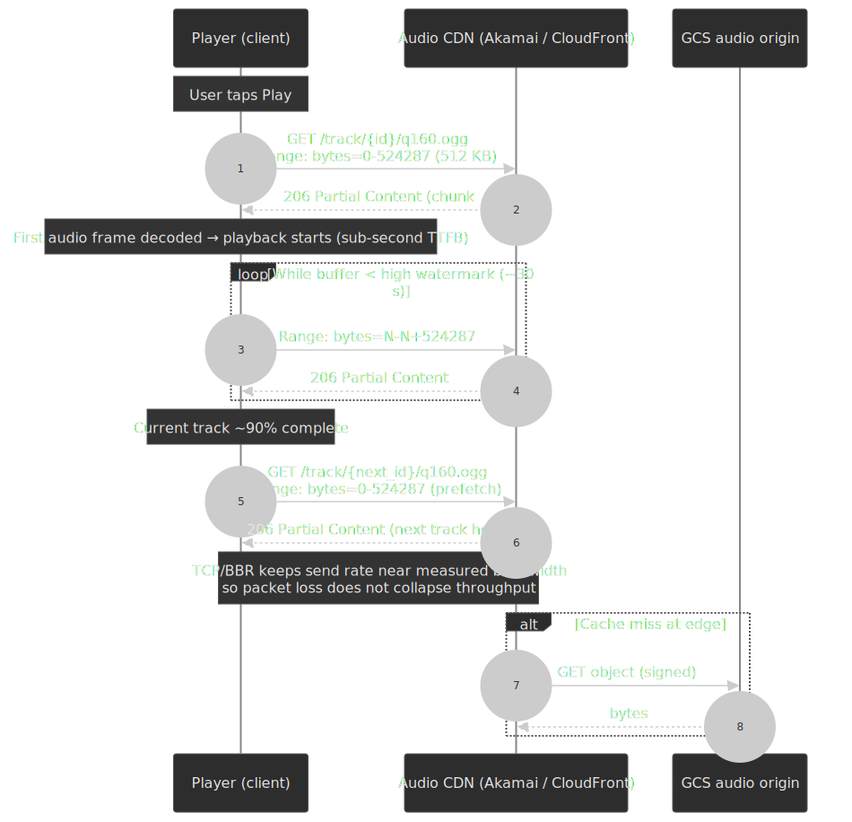

### Adaptive Bitrate Selection

The client picks an initial tier from explicit user preference, network type (Wi-Fi vs. cellular vs. data-saver), and a recent estimate of effective bandwidth. It then adapts in flight on buffer health and observed throughput. The simplified decision loop:

```python
if network_type == "cellular" and data_saver_enabled:
    quality = LOW           # 24 kbps Vorbis
elif network_type == "cellular":
    quality = NORMAL        # 96 kbps Vorbis
elif buffering_recently:
    quality = decrease_one_level()
elif buffer_healthy and bandwidth_sufficient:
    quality = user_preference  # up to 320 kbps Vorbis or FLAC if Premium-Lossless
```

**Buffer management (defaults observed in client behaviour):**

- Target buffer: 10–30 seconds of audio.
- Low watermark: ~5 seconds — trigger a quality drop.
- High watermark: ~30 seconds — allow a quality increase.

Compared to video ABR, the audio knobs are easier in two ways and harder in one. Easier: payloads are an order of magnitude smaller, so even a single 512 KB chunk often covers many seconds of playback, which means the algorithm has more reaction time before the buffer empties. Easier: the codec ladder is short (4 lossy tiers + lossless), so search over actions is trivial. Harder: users *notice* a drop from 320 kbps to 96 kbps far more on a quiet acoustic track than they notice a video resolution change, so quality oscillation is something the client tries hard to avoid — once dropped, the client stays at the lower tier longer than a strictly-greedy controller would.

### Gapless Playback

For seamless album listening:

1. **Prefetch**: Start fetching next track when current is 90% complete
2. **Decode ahead**: Decode first 5 seconds of next track
3. **Crossfade boundary**: Handle precise sample-accurate transitions
4. **Memory management**: Release previous track's buffer

**Implementation challenges:**

- Different sample rates between tracks
- Metadata gaps in some files
- Client memory constraints on mobile

## CDN Architecture

### Multi-CDN Strategy


### CDN Selection Logic

```python
def select_cdn(user_location, content_type, cdns_health):
    """Select optimal CDN for request."""
    candidates = []

    for cdn in available_cdns:
        if not cdns_health[cdn].is_healthy:
            continue

        latency = get_latency_estimate(cdn, user_location)
        availability = cdns_health[cdn].availability_99p
        cost = get_cost_per_gb(cdn, user_location)

        score = (
            0.5 * normalize(latency, lower_is_better=True) +
            0.3 * normalize(availability, lower_is_better=False) +
            0.2 * normalize(cost, lower_is_better=True)
        )
        candidates.append((cdn, score))

    return max(candidates, key=lambda x: x[1])[0]
```

### Cache Key Design

Because the audio path uses `Range:` requests against a single file per (track, quality), the CDN cache key is per-file, not per-segment. The CDN serves arbitrary byte ranges out of the same cached object.

```text
Audio:  /{track_id}/{quality}.{ogg|aac|flac}   (HTTP Range: bytes=N-M)
Images: /{image_id}/{size}.jpg
```

**Cache TTL strategy:**

| Content Type    | TTL       | Rationale              |
| --------------- | --------- | ---------------------- |
| Audio files     | 1 year    | Immutable content      |
| Album artwork   | 30 days   | Rarely changes         |
| Artist images   | 7 days    | Occasional updates     |
| Playlist covers | 1 day     | User-generated         |
| API responses   | 5 minutes | Balance freshness/load |

### Signed URLs

Audio URLs include authentication; the playback service hands the client a signed URL per track-quality, and the client issues range requests against it:

```text
https://audio-cdn.spotify.com/tracks/{track_id}/320.ogg
    ?sig={hmac_signature}
    &exp={expiration_timestamp}
    &uid={user_id}
```

**Signature validation:**

- HMAC-SHA256 with rotating keys
- 1-hour expiration for streaming URLs
- Rate limiting per user/IP

## API Design

### Play Track

**Endpoint:** `POST /v1/me/player/play`

**Request:**

```json
{
  "context_uri": "spotify:playlist:37i9dQZF1DXcBWIGoYBM5M",
  "offset": {
    "position": 0
  },
  "position_ms": 0
}
```

**Response (204 No Content on success)**

**Error Responses:**

- `401 Unauthorized`: Invalid or expired token
- `403 Forbidden`: Premium required for this feature
- `404 Not Found`: Track/playlist not available
- `429 Too Many Requests`: Rate limit exceeded

### Get Track

**Endpoint:** `GET /v1/tracks/{id}`

**Response (200 OK):**

```json
{
  "id": "3n3Ppam7vgaVa1iaRUc9Lp",
  "name": "Mr. Brightside",
  "duration_ms": 222973,
  "explicit": false,
  "popularity": 87,
  "preview_url": "https://p.scdn.co/mp3-preview/...",
  "album": {
    "id": "4OHNH3sDzIxnmUADXzv2kT",
    "name": "Hot Fuss",
    "images": [
      {
        "url": "https://i.scdn.co/image/...",
        "height": 640,
        "width": 640
      }
    ],
    "release_date": "2004-06-07"
  },
  "artists": [
    {
      "id": "0C0XlULifJtAgn6ZNCW2eu",
      "name": "The Killers"
    }
  ],
  "available_markets": ["US", "GB", "DE", ...]
}
```

### Search

**Endpoint:** `GET /v1/search`

**Parameters:**

| Parameter | Type    | Required | Description                                  |
| --------- | ------- | -------- | -------------------------------------------- |
| q         | string  | Yes      | Search query                                 |
| type      | string  | Yes      | Comma-separated: track,artist,album,playlist |
| limit     | integer | No       | Max results per type (default: 20, max: 50)  |
| offset    | integer | No       | Pagination offset                            |
| market    | string  | No       | ISO country code for availability filtering  |

**Response:**

```json
{
  "tracks": {
    "items": [...],
    "total": 1000,
    "limit": 20,
    "offset": 0,
    "next": "https://api.spotify.com/v1/search?offset=20&..."
  },
  "artists": {...},
  "albums": {...}
}
```

### Create Playlist

**Endpoint:** `POST /v1/users/{user_id}/playlists`

**Request:**

```json
{
  "name": "Road Trip",
  "description": "Songs for the drive",
  "public": false,
  "collaborative": false
}
```

**Response (201 Created):**

```json
{
  "id": "7d2D2S5F4d0r33mDf0d33D",
  "name": "Road Trip",
  "owner": {
    "id": "user123",
    "display_name": "John"
  },
  "tracks": {
    "total": 0
  },
  "snapshot_id": "MTY4MzI0..."
}
```

### Rate Limits

| Endpoint Category      | Limit        | Window     |
| ---------------------- | ------------ | ---------- |
| Standard endpoints     | 100 requests | 30 seconds |
| Search                 | 30 requests  | 30 seconds |
| Player control         | 50 requests  | 30 seconds |
| Playlist modifications | 25 requests  | 30 seconds |

## Data Modeling

### Track Schema (PostgreSQL)

```sql
CREATE TABLE tracks (
    id VARCHAR(22) PRIMARY KEY,  -- Spotify base62 ID
    name VARCHAR(500) NOT NULL,
    duration_ms INTEGER NOT NULL,
    explicit BOOLEAN DEFAULT false,
    popularity SMALLINT DEFAULT 0,
    isrc VARCHAR(12),  -- International Standard Recording Code
    preview_url TEXT,

    -- Denormalized for read performance
    album_id VARCHAR(22) REFERENCES albums(id),

    -- Audio features (from Echo Nest analysis)
    tempo DECIMAL(6,3),  -- BPM
    key SMALLINT,  -- 0-11 pitch class
    mode SMALLINT,  -- 0=minor, 1=major
    time_signature SMALLINT,
    danceability DECIMAL(4,3),
    energy DECIMAL(4,3),
    valence DECIMAL(4,3),

    created_at TIMESTAMPTZ DEFAULT NOW(),
    updated_at TIMESTAMPTZ DEFAULT NOW()
);

-- Track-Artist relationship (many-to-many)
CREATE TABLE track_artists (
    track_id VARCHAR(22) REFERENCES tracks(id),
    artist_id VARCHAR(22) REFERENCES artists(id),
    position SMALLINT NOT NULL,  -- Artist order
    PRIMARY KEY (track_id, artist_id)
);

-- Indexes for common queries
CREATE INDEX idx_tracks_album ON tracks(album_id);
CREATE INDEX idx_tracks_popularity ON tracks(popularity DESC);
CREATE INDEX idx_tracks_isrc ON tracks(isrc);
```

### Playlist Schema (Cassandra)

Cassandra excels at playlist storage due to write-heavy patterns:

```cql
CREATE TABLE playlists (
    user_id TEXT,
    playlist_id TEXT,
    name TEXT,
    description TEXT,
    is_public BOOLEAN,
    is_collaborative BOOLEAN,
    snapshot_id TEXT,
    follower_count COUNTER,
    created_at TIMESTAMP,
    updated_at TIMESTAMP,
    PRIMARY KEY (user_id, playlist_id)
) WITH CLUSTERING ORDER BY (playlist_id ASC);

CREATE TABLE playlist_tracks (
    playlist_id TEXT,
    position INT,
    track_id TEXT,
    added_by TEXT,
    added_at TIMESTAMP,
    PRIMARY KEY (playlist_id, position)
) WITH CLUSTERING ORDER BY (position ASC);

-- Denormalized for efficient ordering
CREATE TABLE playlist_tracks_by_added (
    playlist_id TEXT,
    added_at TIMESTAMP,
    position INT,
    track_id TEXT,
    PRIMARY KEY (playlist_id, added_at, position)
) WITH CLUSTERING ORDER BY (added_at DESC, position ASC);
```

**Why Cassandra for playlists:**

- Write-optimized (append-only storage)
- Horizontal scaling for 696M users
- Tunable consistency (eventual for non-critical reads)
- Counter support for follower counts

### User Listening History (Cassandra)

```cql
CREATE TABLE listening_history (
    user_id TEXT,
    listened_at TIMESTAMP,
    track_id TEXT,
    context_uri TEXT,  -- playlist, album, or artist
    duration_ms INT,
    PRIMARY KEY (user_id, listened_at)
) WITH CLUSTERING ORDER BY (listened_at DESC)
  AND default_time_to_live = 7776000;  -- 90 days TTL
```

### Search Index (Elasticsearch)

```json
{
  "mappings": {
    "properties": {
      "track_id": { "type": "keyword" },
      "name": {
        "type": "text",
        "analyzer": "standard",
        "fields": {
          "exact": { "type": "keyword" },
          "autocomplete": {
            "type": "text",
            "analyzer": "autocomplete"
          }
        }
      },
      "artist_names": {
        "type": "text",
        "fields": { "exact": { "type": "keyword" } }
      },
      "album_name": { "type": "text" },
      "popularity": { "type": "integer" },
      "duration_ms": { "type": "integer" },
      "explicit": { "type": "boolean" },
      "available_markets": { "type": "keyword" },
      "release_date": { "type": "date" }
    }
  },
  "settings": {
    "analysis": {
      "analyzer": {
        "autocomplete": {
          "tokenizer": "autocomplete",
          "filter": ["lowercase"]
        }
      },
      "tokenizer": {
        "autocomplete": {
          "type": "edge_ngram",
          "min_gram": 1,
          "max_gram": 20,
          "token_chars": ["letter", "digit"]
        }
      }
    }
  }
}
```

### Database Selection Matrix

| Data Type                         | Store           | Rationale                         |
| --------------------------------- | --------------- | --------------------------------- |
| Catalog (tracks, albums, artists) | PostgreSQL      | Relational queries, complex joins |
| User data (playlists, saves)      | Cassandra       | Write-heavy, horizontal scaling   |
| Listening history                 | Cassandra       | Time-series, high volume          |
| Search index                      | Elasticsearch   | Full-text search, faceting        |
| ML features                       | Cloud Bigtable  | Wide columns, sparse data         |
| Hot metadata                      | Redis/Memcached | Sub-ms latency                    |
| Analytics                         | BigQuery        | Ad-hoc queries, massive scale     |

## Low-Level Design: Recommendation System

### Architecture Overview



### Collaborative Filtering

**Matrix factorization approach:**

Given a user–track interaction matrix $R$ (~696M users × ~100M tracks), learn latent factors:

$$R \approx U \times V^T$$

Where:

- $U$ = user matrix (~696M × 128)
- $V$ = track matrix (~100M × 128)

**Implementation:**

- Alternating Least Squares (ALS) on Spark
- Weekly retraining on full dataset
- Incremental updates for new users/tracks

### Content-based features (Echo Nest lineage)

Spotify acquired The Echo Nest in March 2014 for ~$100M[^echo-nest] and absorbed its music-intelligence pipeline. Each track gets a fingerprint and a vector of perceptual features that look like:

| Feature          | Range     | Description                      |
| ---------------- | --------- | -------------------------------- |
| Tempo            | 0–250 BPM | Beats per minute                 |
| Key              | 0–11      | Pitch class (C=0, C#=1, …)       |
| Mode             | 0–1       | Minor=0, Major=1                 |
| Danceability     | 0.0–1.0   | Rhythmic suitability for dancing |
| Energy           | 0.0–1.0   | Perceptual intensity             |
| Valence          | 0.0–1.0   | Musical positivity               |
| Speechiness      | 0.0–1.0   | Presence of spoken words         |
| Acousticness     | 0.0–1.0   | Acoustic vs. electronic          |
| Instrumentalness | 0.0–1.0   | Absence of vocals                |
| Liveness         | 0.0–1.0   | Presence of audience             |

> [!IMPORTANT]
> These features still drive the *internal* recommender, but the public-facing `audio-features`, `audio-analysis`, `recommendations`, and `related-artists` Web API endpoints were **deprecated for new applications on 27 November 2024**[^api-deprecation]. Existing apps with extended-mode access keep working; new third-party integrations have to live without those signals. Spotify cited security concerns and the risk of competing AI music systems being trained on the data.

[^api-deprecation]: [Introducing some changes to our Web API](https://developer.spotify.com/blog/2024-11-27-changes-to-the-web-api), Spotify for Developers, 27 November 2024.

### Discover Weekly pipeline

**Generation schedule:**

- Refreshes weekly, delivered every **Monday** as a 30-track personalised playlist[^discover-weekly].
- Pre-computed in batch off the Bigtable feature store and a fleet of MapReduce/Dataflow jobs.
- Per-user output for every active listener — at 696M MAU that is hundreds of millions of distinct playlists each week.

**Algorithm sketch:**

1. **Taste profile.** Aggregate recent listening into genre / artist / mood weights from the event pipeline.
2. **Candidate retrieval.** Collaborative-filtering nearest neighbours (users with similar taste vectors) plus content-based neighbours from the audio-feature embeddings.
3. **Filtering.** Drop tracks the user has already heard or explicitly disliked; respect market availability and explicit-content settings.
4. **Diversity injection.** Cap per-artist/per-genre share so the playlist doesn't collapse onto one cluster.
5. **Final ranking.** A learned model predicts skip / save probability and orders the 30 final tracks.

> [!NOTE]
> Spotify is on record that personalised surfaces (Discover Weekly, Daily Mix, Release Radar, the personalised Home) drive a substantial share of total listening, but the often-quoted "30% of listening" figure is not in any first-party source I could verify; treat it as folklore-level, not a hard number.

[^discover-weekly]: ["What made Discover Weekly one of our most successful feature launches to date?"](https://engineering.atspotify.com/2015/11/what-made-discover-weekly-one-of-our-most-successful-feature-launches-to-date), Spotify Engineering, November 2015.

### Approximate nearest-neighbour index — Annoy → Voyager

For online retrieval, Spotify originally built and open-sourced **Annoy** ("Approximate Nearest Neighbors Oh Yeah"), a forest of random-projection trees designed to be `mmap`-friendly so multiple processes could share a single read-only index file[^annoy]. `mmap` matters here because the same binary index can be paged in by many candidate-retrieval workers without each one paying the deserialisation cost — at hundreds of millions of candidate vectors, that is the difference between sub-millisecond retrieval and a cold-start GC pause.

In late 2023 Spotify replaced Annoy internally with **Voyager**[^voyager], a successor library built on **HNSW** (Hierarchical Navigable Small World graphs via `hnswlib`) with first-class Python and Java bindings. Spotify's own published benchmarks claim:

- **>10× the speed of Annoy at the same recall**, or up to 50% higher recall at the same throughput.
- **Up to 4× lower memory** (using `E4M3` 8-bit floating-point quantisation).
- Stream-friendly I/O and corruption detection — useful for serving from Cloud Storage rather than a baked-in artefact.

The 128-dimensional track-embedding vector itself is older than either library; it is fed by the same retrieval/ranking split: retrieve a few thousand candidates from the ANN index, then re-rank with a heavier model that also pulls in user context and freshness.

[^annoy]: [`spotify/annoy`](https://github.com/spotify/annoy) on GitHub. Author: Erik Bernhardsson, then at Spotify. Now in maintenance mode.
[^voyager]: ["Introducing Voyager: Spotify's New Nearest-Neighbor Search Library"](https://engineering.atspotify.com/introducing-voyager-spotifys-new-nearest-neighbor-search-library), Spotify Engineering, October 2023.

## Low-Level Design: Offline Mode

### Download Architecture


### License Management

**DRM implementation:**

- Encrypted audio files using AES-256
- Per-device keys tied to account
- Keys stored in secure enclave (iOS) or hardware-backed keystore (Android)

**License constraints:**

| Constraint         | Value             | Rationale                      |
| ------------------ | ----------------- | ------------------------------ |
| Offline validity   | 30 days           | Requires periodic online check |
| Device limit       | 5 devices         | Prevent account sharing        |
| Track limit        | 10,000 per device | Storage management             |
| Concurrent offline | 1 device          | Licensing terms                |

### Sync Strategy

**Smart downloads:**

```python
def prioritize_downloads(playlist, device_storage):
    """Prioritize which tracks to download first."""
    scored_tracks = []

    for track in playlist.tracks:
        score = 0

        # User explicitly requested
        if track in user_requested:
            score += 100

        # Recently played (likely to play again)
        if track in recent_plays:
            score += 50

        # High popularity in playlist
        score += track.playlist_position_score

        # Already partially downloaded
        if track.partial_download:
            score += 30

        scored_tracks.append((track, score))

    # Download in priority order until storage full
    for track, _ in sorted(scored_tracks, reverse=True):
        if device_storage.available > track.size:
            download(track)
```

### Storage Management

**Eviction policy:**

1. Remove tracks not played in 90+ days
2. Remove tracks from unfollowed playlists
3. LRU eviction when approaching storage limit

**Storage estimation UI:**

```text
Playlist: Road Trip (50 tracks)
Download size: 180 MB (Normal quality)
              350 MB (Very High quality)
Device storage: 2.1 GB available
```

## Search System

### Search Architecture



### Typeahead/Autocomplete

**Implementation using Elasticsearch:**

```json
{
  "query": {
    "bool": {
      "should": [
        {
          "match": {
            "name.autocomplete": {
              "query": "mr bright",
              "operator": "and"
            }
          }
        },
        {
          "match": {
            "artist_names.autocomplete": {
              "query": "mr bright",
              "operator": "and"
            }
          }
        }
      ],
      "minimum_should_match": 1
    }
  },
  "sort": ["_score", { "popularity": "desc" }],
  "size": 10
}
```

**Performance targets:**

- Typeahead latency: p99 < 50ms
- Full search latency: p99 < 200ms
- Index update lag: < 4 hours for new releases

### Ranking Signals

| Signal              | Weight | Description                      |
| ------------------- | ------ | -------------------------------- |
| Text relevance      | 0.3    | BM25 score from Elasticsearch    |
| Popularity          | 0.25   | Global stream count (log-scaled) |
| User affinity       | 0.2    | Based on listening history       |
| Freshness           | 0.15   | Boost for new releases           |
| Market availability | 0.1    | Available in user's region       |

## Frontend Considerations

### Player State Management

**Global player state:**

```typescript
interface PlayerState {
  // Current playback
  currentTrack: Track | null
  position_ms: number
  duration_ms: number
  isPlaying: boolean

  // Queue
  queue: Track[]
  queuePosition: number

  // Context (what initiated playback)
  context: {
    type: "playlist" | "album" | "artist" | "search"
    uri: string
  }

  // Shuffle and repeat
  shuffle: boolean
  repeatMode: "off" | "context" | "track"

  // Device
  activeDevice: Device
  volume: number
}
```

**State synchronization:**

- Local state for immediate UI feedback
- WebSocket for cross-device sync (Spotify Connect)
- Optimistic updates with reconciliation

### Audio Buffering Strategy

```typescript
class AudioBuffer {
  private segments: Map<number, ArrayBuffer> = new Map()
  private prefetchAhead = 30 // seconds

  async ensureBuffered(currentPosition: number): Promise<void> {
    const currentSegment = Math.floor(currentPosition / SEGMENT_SIZE)
    const targetSegment = Math.ceil((currentPosition + this.prefetchAhead) / SEGMENT_SIZE)

    for (let i = currentSegment; i <= targetSegment; i++) {
      if (!this.segments.has(i)) {
        const segment = await this.fetchSegment(i)
        this.segments.set(i, segment)
      }
    }

    // Evict old segments to manage memory
    this.evictOldSegments(currentSegment - 2)
  }
}
```

### Mobile Optimizations

| Constraint | Mitigation                                              |
| ---------- | ------------------------------------------------------- |
| Battery    | Batch network requests, use efficient codecs            |
| Data usage | Quality auto-adjust, download on WiFi                   |
| Memory     | Limit buffer size, lazy-load images                     |
| Background | iOS: Background Audio mode; Android: Foreground Service |
| Offline    | SQLite for metadata, encrypted file storage             |

### Web Player Architecture

**Web Audio API usage:**

```javascript
const audioContext = new AudioContext()
const source = audioContext.createBufferSource()
const gainNode = audioContext.createGain()

// Crossfade between tracks
function crossfade(currentSource, nextSource, duration) {
  const now = audioContext.currentTime

  // Fade out current
  currentSource.gainNode.gain.setValueAtTime(1, now)
  currentSource.gainNode.gain.linearRampToValueAtTime(0, now + duration)

  // Fade in next
  nextSource.gainNode.gain.setValueAtTime(0, now)
  nextSource.gainNode.gain.linearRampToValueAtTime(1, now + duration)

  nextSource.start(now)
}
```

## Infrastructure Design

### Google Cloud Platform Architecture



### Key GCP Services

| Service        | Use Case                    | Scale              |
| -------------- | --------------------------- | ------------------ |
| GKE            | Microservices orchestration | 300+ services      |
| Cloud Pub/Sub  | Event streaming             | 1T+ messages/day   |
| Cloud Dataflow | Stream/batch processing     | Petabytes/day      |
| BigQuery       | Analytics, ML training      | 10M+ queries/month |
| Cloud Bigtable | ML feature store            | Petabytes          |
| Cloud Storage  | Audio files, backups        | Exabytes           |
| Cloud Spanner  | Transactional data          | Global consistency |

### Migration story

**Timeline:**

- **February 2016** — Spotify publicly announces it is moving its data infrastructure to Google Cloud Platform[^gcp-migration].
- **2016–2018** — services and data tracks migrated in parallel, broken into ~1,200 microservices and the Hadoop / event-delivery stacks.
- **End of 2018** — target date for being free of on-premise infrastructure[^road-to-cloud].
- **Reported financial commitment:** ~$450M over three years to Google Cloud[^road-to-cloud]. (No official "60% cost reduction" figure exists; that number is repeated in third-party retellings but I could not find it in any Spotify or Google source.)

**Key technical decisions during the migration:**

- **Kafka 0.7 → Pub/Sub** for event delivery, motivated by chronic single-points-of-failure in the on-prem Hadoop dependency chain and ETL latencies on the order of 30 minutes[^road-to-cloud-blog].
- **Hadoop → Dataflow** for batch and stream processing.
- **Bespoke analytics → BigQuery** as the warehouse-of-record.
- **Strangler-fig migration pattern** — the new pipeline ran in parallel with the old one until traffic could be moved over with zero downtime and zero loss.

[^road-to-cloud-blog]: ["Spotify's Event Delivery — The Road to the Cloud (Part I)"](https://engineering.atspotify.com/2016/02/spotifys-event-delivery-the-road-to-the-cloud-part-i), Spotify Engineering, February 2016.

### Multi-Region Strategy

```text
Regions:
- us-central1 (Primary Americas)
- europe-west1 (Primary EMEA)
- asia-east1 (Primary APAC)

Data replication:
- User data: Multi-region Spanner
- Audio: Cloud Storage multi-region
- Analytics: BigQuery cross-region
```

### Developer platform (Backstage)

Spotify open-sourced **Backstage** on **16 March 2020**[^backstage-launch], the internal developer portal it had been running on for years to corral hundreds of teams and thousands of services into a single navigable surface. It was donated to the CNCF in September 2020 and promoted to **CNCF Incubating** on **15 March 2022**[^backstage-cncf]; it remains at Incubating maturity as of 2026.

**Features:**

- **Service catalog** — every microservice, owner, on-call, dependencies.
- **TechDocs** — documentation-as-code rendered next to the service it documents.
- **Software templates** — scaffolds for new services so teams ship them through one well-paved road.
- **Plugin ecosystem** — first-party plugins for CI, monitoring, security, costs; third-party plugins from the wider community.

**Impact (as of 2025):**

- 3,000+ adopting companies, 2,200+ contributors[^backstage-five-years].
- Spotify also operates a paid SaaS edition (Spotify Portal for Backstage) on top of the open-source core.

[^backstage-launch]: [Announcing Backstage](https://backstage.io/blog/2020/03/16/announcing-backstage/), backstage.io, 16 March 2020.
[^backstage-cncf]: [Backstage on CNCF](https://www.cncf.io/projects/backstage/) — incubating since March 2022.
[^backstage-five-years]: ["Celebrating Five Years of Backstage: From Open Source Project to Enterprise Business"](https://engineering.atspotify.com/2025/4/celebrating-five-years-of-backstage), Spotify Engineering, April 2025.

## Operational reality and failure modes

Designing Spotify-scale streaming is mostly about how it degrades, not how it runs on a sunny Tuesday.

| Failure                              | Detection                                                                                  | Mitigation                                                                                                                              |
| ------------------------------------ | ------------------------------------------------------------------------------------------ | --------------------------------------------------------------------------------------------------------------------------------------- |
| Single CDN region brownout           | Per-CDN p99 + error-rate monitors at the edge router                                       | Pull traffic to the other CDN; the client also re-resolves on segment-fetch failures.                                                   |
| Multi-CDN partial outage (e.g. cert) | Synthetic probes from each region; client-reported segment errors                          | Bypass affected CDN entirely until probes recover; cap re-tries to avoid hammering origin.                                              |
| License server outage                | Spike in `403 license_unavailable` from the player                                         | Premium offline tracks remain playable thanks to the 30-day local license cache; new downloads pause; live playback may degrade to free-tier rules. |
| Recommendation pipeline lag          | Discover Weekly / Daily Mix freshness metrics fall behind                                  | Serve last successful generation; re-run incrementally rather than from scratch.                                                        |
| Pub/Sub backpressure                 | Publisher-side queue depth and retry budget                                                | Drop low-value events first (e.g. impressions) before high-value events (plays, completes, billing).                                     |
| Service-mesh control-plane outage    | Sudden uniform RPC failures across many services                                           | Local service-mesh caches keep endpoints reachable for a short window; freeze deploys until recovered. (See Spotify's well-known 8 March 2022 incident, where a service-mesh control-plane issue propagated widely.[^outage-2022]) |

[^outage-2022]: A widely circulated post-incident analysis of the [Spotify 8 March 2022 outage](https://sukhadanand.medium.com/spotify-outage-march-8-2022-333f4e9a884) attributes the global brownout to a service-mesh control-plane failure. Spotify did not publish a formal public post-mortem, so treat the specific cause as inferred.

## Spotify Connect: cross-device control

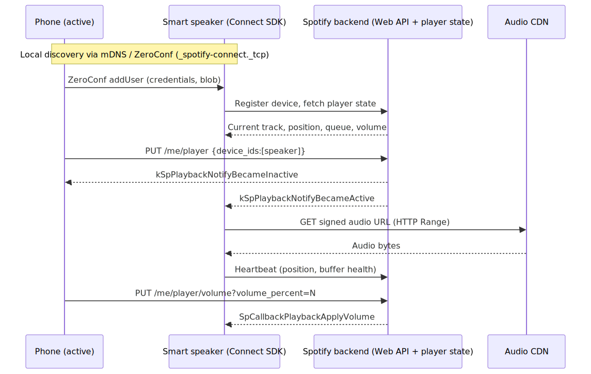
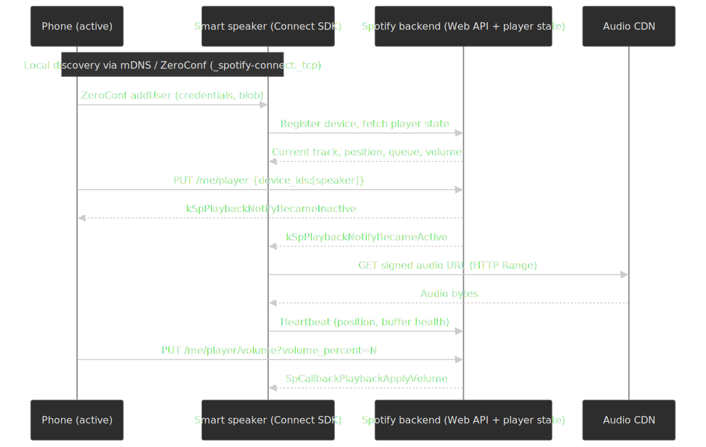

Spotify Connect is the protocol that lets you start a song on your phone and finish it on a TV, smart speaker, or car. Two layers cooperate[^connect-basics][^connect-transfer]:

1. **Local discovery** uses **ZeroConf (mDNS / DNS-SD)** so the Spotify app on your phone can find Connect-capable devices on the same Wi-Fi network without any cloud round-trip. The phone passes credentials to the device through this local channel; no PIN ceremony.
2. **Cloud-mediated state.** Once a device is "active," playback state (current track, position, volume, queue) lives in Spotify's backend. Switching devices is a `PUT /me/player` against the Web API with the new `device_id`; both the new active device and any other client subscribed to player updates reconcile against the cloud state. That is why you can change the active device from a watch you have not used in months.

For commercial hardware, Spotify ships an **Embedded SDK** that handles the audio fetch, the local volume callbacks, and the `kSpPlaybackNotifyBecameActive` lifecycle. Hardware vendors do not implement the wire protocol themselves.

[^connect-basics]: [Spotify Connect Basics](https://developer.spotify.com/documentation/commercial-hardware/implementation/guides/connect-basics), Spotify for Developers.
[^connect-transfer]: [Web API — Transfer Playback](https://developer.spotify.com/documentation/web-api/reference/transfer-a-users-playback), Spotify for Developers.

## Conclusion

Designing Spotify-scale music streaming is a fundamentally different problem than designing video at the same scale: the bytes are small, the personalisation is huge, and the cost centre is engineering complexity, not bandwidth.

**Key architectural decisions:**

1. **Multi-CDN delivery** (Akamai + AWS CloudFront for audio, Fastly for non-audio assets) gives both region-level redundancy and a meaningful pricing lever.
2. **Ogg Vorbis at 24/96/160/320 kbps + AAC for the web + FLAC for the new lossless tier** lets the client adapt across an order of magnitude of bitrate without changing the playback abstraction.
3. **Cassandra for write-heavy user data** (playlists, history, personalisation features) — over 100 production clusters as of public reporting.
4. **Hybrid recommendation** combining collaborative filtering, content-based audio features, and NLP, indexed with Voyager (HNSW) after years of running on Annoy.
5. **GCP since 2016–2018** — Pub/Sub, Dataflow, BigQuery, Bigtable, Spanner, GKE — and a $450M, three-year initial commitment to get out of the data-centre business.
6. **Pub/Sub-backed event pipeline** running at 3M+ events/sec post-migration, feeding both batch warehousing and the online feature store.
7. **Proxyless gRPC service mesh** carrying traffic for ~1.5M Kubernetes pods.
8. **Backstage** as the developer platform that lets 300+ autonomous teams find, ship, and operate services without a ticket queue.

**What this design optimises for:**

- Instant playback (sub-second time-to-first-audio).
- Seamless cross-device handoff via Spotify Connect.
- Deep personalisation (Discover Weekly, Daily Mix, Release Radar, personalised Home).
- Offline reliability through encrypted local audio plus rolling per-device licences.

**What this design sacrifices:**

- A simple, single-vendor stack — multi-CDN, multi-database, and a service mesh are all complexity tax in exchange for resilience and ergonomics.
- A small, predictable platform team — autonomy at the edges costs centralised ownership in the middle (Backstage exists precisely because the squad model created that gap).
- Tight backwards compatibility for third-party recommender integrations (cf. the November 2024 Web API deprecations).

**When to reach for a Spotify-shaped design:**

- Audio streaming at hundreds of millions of users.
- Personalisation as a primary differentiator, not a layer on top.
- A regulated content business that requires per-device DRM and offline rights management.

## Appendix

### Prerequisites

- CDN architecture: edge caching, origin shield concepts
- Audio encoding: codecs, bitrates, compression
- Distributed databases: Cassandra data modeling, consistency trade-offs
- Recommendation systems: collaborative filtering, content-based filtering basics
- Stream processing: event-driven architecture, Pub/Sub patterns

### Terminology

| Term                        | Definition                                                                       |
| --------------------------- | -------------------------------------------------------------------------------- |
| **ABR**                     | Adaptive Bitrate—dynamically selecting audio quality based on network conditions |
| **Ogg Vorbis**              | Open-source, royalty-free audio codec used by Spotify                            |
| **Gapless playback**        | Seamless transition between tracks without silence gaps                          |
| **Crossfade**               | Gradual blend between end of one track and start of next                         |
| **Collaborative filtering** | Recommendation based on similar users' behavior                                  |
| **Content-based filtering** | Recommendation based on item attributes (audio features)                         |
| **Echo Nest**               | Music intelligence company acquired by Spotify in 2014                           |
| **Spotify Connect**         | Protocol for cross-device playback control                                       |
| **Pub/Sub**                 | Publish-Subscribe messaging pattern for event streaming                          |
| **Edge n-gram**             | Tokenization for autocomplete (prefixes: "s", "sp", "spo"...)                    |

### Summary

- Spotify reached **696M MAU and 276M Premium subscribers in Q2 2025**, on a catalog of ~100M tracks plus podcasts.
- Audio is delivered through a **multi-CDN edge** (Akamai + AWS for audio, Fastly for non-audio), with adaptive Ogg Vorbis (24/96/160/320 kbps), AAC for the web, and a new FLAC lossless tier from September 2025.
- **Cassandra** (100+ clusters) holds write-heavy user data; Postgres-style stores hold the catalog; Elasticsearch holds the search index; Bigtable/BigQuery hold features and analytics.
- The recommender is a **two-stage retrieve-then-rank** pipeline indexed with **Voyager (HNSW)**, the in-house successor to Annoy.
- The event pipeline runs on **Pub/Sub** (>3M events/sec post-migration), with Dataflow for stream/batch and BigQuery as warehouse.
- Inter-service traffic uses a **proxyless gRPC service mesh** built on Envoy `xDS`, sized for ~1.5M Kubernetes pods.
- Offline mode uses encrypted local files plus 30-day rolling per-device DRM licences (5 devices, 10K tracks per device).
- Internal developer experience is anchored on **Backstage**, open-sourced in March 2020 and CNCF Incubating since March 2022, with 3,000+ external adopters.

### References

- [How Spotify Aligned CDN Services for a Lightning Fast Streaming Experience](https://engineering.atspotify.com/2020/02/how-spotify-aligned-cdn-services-for-a-lightning-fast-streaming-experience) — multi-CDN, SquadCDN, Fastly standardisation.
- [Smoother Streaming with BBR](https://engineering.atspotify.com/2018/08/smoother-streaming-with-bbr) — canonical Spotify Engineering description of the audio path: one file per (track, quality) on HTTP, fetched in 512 KB byte ranges; CUBIC → BBR experiment.
- [Personalization at Spotify using Cassandra](https://engineering.atspotify.com/2015/01/09/personalization-at-spotify-using-cassandra) — Cassandra architecture for personalisation.
- [Spotify's Event Delivery — The Road to the Cloud (Part I)](https://engineering.atspotify.com/2016/02/spotifys-event-delivery-the-road-to-the-cloud-part-i) — Kafka 0.7 → Pub/Sub migration.
- [Spotify's Event Delivery — Life in the Cloud](https://engineering.atspotify.com/2019/11/12/spotifys-event-delivery-life-in-the-cloud) — post-migration scaling, 3M+ events/sec.
- [Why Spotify migrated its event delivery system from Kafka to Google Cloud Pub/Sub](https://cloud.google.com/blog/products/gcp/spotifys-journey-to-cloud-why-spotify-migrated-its-event-delivery-system-from-kafka-to-google-cloud-pubsub) — Google Cloud Blog, 2 M msg/s load test.
- [Spotify chooses Google Cloud Platform to power data infrastructure](https://cloud.google.com/blog/products/gcp/spotify-chooses-google-cloud-platform-to-power-data-infrastructure) — GCP announcement.
- [How Spotify migrated everything from on-premise to Google Cloud](https://www.computerworld.com/article/1655983/how-spotify-migrated-everything-from-on-premise-to-google-cloud-platform.html) — $450M, 3-year commitment, end-2018 cutover.
- [Spotify Audio Quality (official support)](https://support.spotify.com/us/article/audio-quality/) — bitrate ladder per platform.
- [Lossless Listening Arrives on Spotify Premium](https://newsroom.spotify.com/2025-09-10/lossless-listening-arrives-on-spotify-premium-with-a-richer-more-detailed-listening-experience/) — September 2025 lossless launch.
- [Spotify Q2 2025 Shareholder Deck (PDF)](https://s29.q4cdn.com/175625835/files/doc_financials/2025/q2/Q2-2025-Shareholder-Deck-FINAL.pdf) — MAU / Premium figures.
- [Spotify Q4 2024 Earnings](https://newsroom.spotify.com/2025-02-04/spotify-reports-fourth-quarter-2024-earnings/) — prior-year baseline.
- [Introducing Voyager](https://engineering.atspotify.com/introducing-voyager-spotifys-new-nearest-neighbor-search-library) — Annoy → HNSW successor.
- [`spotify/annoy`](https://github.com/spotify/annoy) — original ANN library, now legacy.
- [What made Discover Weekly one of our most successful feature launches to date?](https://engineering.atspotify.com/2015/11/what-made-discover-weekly-one-of-our-most-successful-feature-launches-to-date) — Discover Weekly origin and weekly cadence.
- [Introducing some changes to our Web API (Nov 2024)](https://developer.spotify.com/blog/2024-11-27-changes-to-the-web-api) — `audio-features`, `audio-analysis`, `recommendations`, `related-artists` deprecation.
- [Spotify Acquired The Echo Nest in a $100M Deal](https://techcrunch.com/2014/03/07/spotify-echo-nest-100m/) — Echo Nest acquisition.
- [Spotify Removes Peer-To-Peer Technology From Its Desktop Client](https://techcrunch.com/2014/04/17/spotify-removes-peer-to-peer-technology-from-its-desktop-client/) — P2P deprecation, April 2014.
- [Spotify — Large Scale, Low Latency, P2P Music-on-Demand Streaming (IEEE)](https://ieeexplore.ieee.org/document/5569963/) — Kreitz & Niemelä, 2010.
- [How We Moved Spotify to a Proxyless gRPC Service Mesh](https://www.youtube.com/watch?v=2_ECK6v_yXc) — Spotify conference talk, ~1.5M Kubernetes pods.
- [Backstage on CNCF](https://www.cncf.io/projects/backstage/) — incubation status and timeline.
- [Celebrating Five Years of Backstage](https://engineering.atspotify.com/2025/4/celebrating-five-years-of-backstage) — 3,000+ adopters, 2,200+ contributors.
- [Spotify Connect Basics (developer docs)](https://developer.spotify.com/documentation/commercial-hardware/implementation/guides/connect-basics) — ZeroConf discovery, embedded SDK.
- [Web API — Transfer Playback](https://developer.spotify.com/documentation/web-api/reference/transfer-a-users-playback) — Connect transfer endpoint.
