# Design System Adoption: Foundations and Governance

A design system is a product whose customers can route around it. Tokens, components, and pipelines are well-trodden engineering work; the hard problems are organizational: securing sustained investment, picking a governance model that survives a 10× change in adoption, codifying a tokens-first foundation that everything else inherits from, and making the system the *path of least resistance* for building UI rather than another source of process tax. This article covers the foundations that determine whether a design system program ever compounds — business case, sponsorship, team and governance shape, tokens-first architecture, an accessibility baseline, a working contribution model, an honest deprecation playbook, and the adoption metrics that tell you whether any of it is landing.

, technical foundation (3–4), and adoption + lifecycle (5–6); deeper engineering for phases 3–6 continues in the sibling implementation article.")

## Mental model

Treat the design system as an internal product:

- It has **customers** (product teams) who can refuse to use it.
- It needs a **business case** denominated in time, quality, and coordination cost.
- It needs **funded ownership** — a team, not a side project.
- It needs **governance** that scales with the consumer base, not with the founders' patience.
- It needs a **tokens-first foundation** so visual decisions cascade instead of being copy-pasted.
- It needs an **accessibility baseline** built in, not bolted on, so consumers inherit conformance.
- It earns **adoption** by lowering friction below the cost of building bespoke UI, and proves it with usage data.

The foundational mistake is treating the system as a centrally-decreed *standard* rather than as a *product*. Standards survive on org charts; products survive on usage. Every governance, staffing, token, accessibility, and roadmap decision in this article is a corollary of that distinction.


## The adoption maturity ladder

Design system maturity models converge on the same shape: a ladder from ad-hoc UI assets to a strategic, multi-product platform. The [Sparkbox model](https://sparkbox.com/foundry/design_system_maturity_model) frames the rungs as *Building V1 → Growing Adoption → Surviving the Teenage Years → Evolving a Healthy Product*; the [Infa five-level model](https://infa.ai/learn/maturity) goes further: *UI Kit → Library → System → Multi-Product → Foundational*. Brad Frost's framing in his [Design Systems Q&A](https://bradfrost.com/blog/post/design-systems-qa/) is more pointed: maturity is a *service model*, not a polish level — the question is how well the team serves consumers, not how many components ship.

The practical synthesis used here is a five-rung ladder. The point of the ladder is not to climb it for its own sake but to know which rung you are on, because the failure modes and the right next investment differ at every step.


| Rung                       | Signals                                                                              | Most likely failure mode                                            | Right next investment                                              |
| :------------------------- | :----------------------------------------------------------------------------------- | :------------------------------------------------------------------ | :----------------------------------------------------------------- |
| **1. Ad-hoc UI kit**       | Shared Figma file, scattered component snippets, no owner.                           | Drift; every team rebuilds the same primitives.                     | Audit the duplication; build the business case.                    |
| **2. Shared library**      | Versioned package, best-effort maintenance from a part-time contributor.             | Bus factor of one; releases stop when champion leaves.              | Fund a core team; lock down a token foundation.                    |
| **3. Funded system**       | Dedicated core team; tokens + primitives shipped; tiered governance documented.      | Bottleneck governance; review queue grows faster than it clears.    | Tier decisions; introduce contribution guardrails.                 |
| **4. Product platform**    | Federated contribution; champions embedded in product teams; coverage metrics live.  | Drift in product-owned components; quality compliance slips.        | Automated quality gates (a11y, visual regression) in CI.           |
| **5. Strategic asset**     | Multi-brand or multi-platform; external consumers; ROI visible in roadmap reviews.   | Scope creep; system tries to solve every problem.                   | Define explicit boundaries; deprecate aggressively.                |

> [!IMPORTANT]
> The ladder is not a roadmap. Most programs that fail do so by trying to leap from rung 2 to rung 4, skipping the funded-system step where governance, tokens, and accessibility get codified. The skip works for a quarter and then collapses under contribution debt.

## Phase 1: Foundation and strategic alignment

### 1.1 Defining the problem space

Before proposing a design system, quantify the pain. Senior leaders fund relief from a measurable problem; they do not fund "consistency" as an abstract good.

The audit answers four questions: which UI inconsistencies cost the most today, which teams and surfaces benefit first, where developer time disappears into UI plumbing, and how much technical debt is already baked into existing components. The deliverable is a small set of numbers a CFO can underwrite, not a 50-page diagnostic.

**Baseline metrics worth measuring**

- **UI inconsistency index** — count distinct visual variants for high-frequency primitives (buttons, inputs, modals) across in-scope products. This becomes the before/after benchmark.
- **Component duplication count** — how many similar implementations exist across teams; expose redundant effort.
- **UI work share of velocity** — share of engineering time spent on UI plumbing versus net-new product work.
- **Design debt catalog** — variations per common element (buttons, forms, navigation), by team and by surface.

> [!TIP]
> Land the audit in 2–3 weeks. Stretch it to a quarter and the executive attention you needed to fund the work has already moved elsewhere. Use the data directly inside the business case rather than treating the audit as a separate deliverable.

The exact numbers are situational; what matters is converting visible duplication into a cost model in dollars and developer-weeks. Audits commonly surface dozens of distinct button styles, near-identical form implementations with differing validation behavior, and significant monthly engineering time spent on consistency fixes — useful as illustrative outputs of the audit, not as universal benchmarks.

### 1.2 Building the business case

The business case must answer four questions: how the system aligns with business objectives, what ROI to expect over a 3–5 year horizon, which stakeholders need convincing, and what initial investment is required. Treat it as a funding ask, not a manifesto.

**The four levers of value**

| Lever                          | What it captures                                                                                | Why it lands with finance                                                                |
| :----------------------------- | :---------------------------------------------------------------------------------------------- | :--------------------------------------------------------------------------------------- |
| **Development time savings**   | Hours per team per month no longer spent re-implementing common UI                              | Largest and most defensible — direct labor cost                                          |
| **Quality gains**              | Reduction in UI-related defects, accessibility regressions, and visual bugs                     | Defendable against existing bug-tracker baselines                                        |
| **Onboarding acceleration**    | Time saved for new engineers / designers who learn one system instead of N                      | Maps cleanly to recruiting and ramp budgets                                              |
| **Coordination overhead**      | Cross-team meetings, design reviews, brand audits the system removes                            | Hardest to quantify but disproportionately compelling for senior IC time                 |

**ROI as a sanity check, not a forecast**

A serviceable working formula is the standard "net benefit over cost" form:

$$
\text{ROI} = \frac{(\text{TS} + \text{QV}) - \text{MC}}{\text{MC}} \times 100
$$

where **TS** is annualized time and cost savings, **QV** is the value of quality improvements, and **MC** is the maintenance cost of the design system itself (team headcount + tooling + infra). Treat the result as directional. The same headline number is achievable with very different inputs — what makes the case credible is showing the assumptions, not the precision of the output. The [Knapsack Design System ROI Calculator](https://www.knapsack.cloud/calculator) and [Maximilian Speicher's Smashing Magazine treatment](https://www.smashingmagazine.com/2022/09/formula-roi-design-system/) are both useful starting points if you want to see the same algebra applied two different ways.

**Industry benchmark snapshot (use as anchors, not promises)**

The most up-to-date public data point is the [zeroheight Design Systems Report 2025](https://zeroheight.com/resource/design-system-report-2025/) (≈300 respondents, fielded Sep–Nov 2024), which describes the *state* of the practice but is deliberately light on quantitative ROI percentages. The headline numbers practitioners actually hold up are:

| Signal                                              | Number                                       | Source                                                                  |
| :-------------------------------------------------- | :------------------------------------------- | :---------------------------------------------------------------------- |
| Teams reporting design tokens in production         | 86% (only 14% report not using tokens)       | zeroheight 2025                                                         |
| Teams with a dedicated design-system team           | 79%                                          | zeroheight 2025                                                         |
| Top efficiency-gain ranges quoted by Knapsack users | 20–46% productivity, 22–35% time-to-market   | Knapsack ROI calculator + practitioner write-ups[^knapsack-ranges]      |

[^knapsack-ranges]: The Knapsack [ROI calculator](https://www.knapsack.cloud/calculator) and [ROI report landing page](https://www.knapsack.cloud/reports/roi-report) supply the model and case studies; the percentage ranges above are the figures community write-ups (e.g. [Design Systems Collective — ROI of Design Systems](https://www.designsystemscollective.com/the-roi-of-design-systems-turning-figma-components-into-business-value-768314733db5)) consistently quote when summarising Knapsack data. Treat them as the upper end of *self-reported* gains from teams who chose to share results.

> [!CAUTION]
> Survey benchmarks are directional, not guaranteed. Reported gains depend on how broadly teams adopt the system, how much duplicate UI work actually disappears, and whether the platform team keeps maintenance cost under control. Anchor your case on your own audit numbers; use industry data only to bound the credible range.

**The J-curve is real and it bites in year one**

| Period       | Realistic shape                                                                                                        |
| :----------- | :--------------------------------------------------------------------------------------------------------------------- |
| **Year 1**   | Often negative or flat ROI. Team headcount and tooling are spent before any consuming team has fully migrated.         |
| **Year 2–3** | ROI compounds as adoption widens, the audit-era duplication is replaced, and per-component maintenance amortizes.      |
| **Year 3+**  | Mature systems can compound further, but the curve depends entirely on adoption depth and ongoing maintenance cost.    |

This shape is not Knapsack-specific; it is the standard "platform investment" J-curve called out in [Smashing Magazine's ROI formula write-up](https://www.smashingmagazine.com/2022/09/formula-roi-design-system/) and the [Design Systems Collective ROI breakdown](https://www.designsystemscollective.com/design-system-roi-formula-c7a9e9292728). Frame it explicitly to sponsors: year one is infrastructure, year two is when adoption pays for it, year three onward is when leverage shows up.


**Operating norms once the case is approved**

- Present to finance and engineering leadership *together* whenever possible — separate pitches breed misaligned expectations.
- Secure the initial funding commitment before any technical work starts.
- Establish a quarterly ROI review from day one. The cadence builds accountability and surfaces drift before it becomes existential.

### 1.3 Securing executive sponsorship

Executive sponsorship determines whether a design system becomes a strategic asset or a stalled initiative. Each stakeholder has a different motivator, and the sponsor's level of involvement should match the scope of organizational change being asked for.

| Stakeholder        | Primary motivator                                                  | Typical commitment they need to make           |
| :----------------- | :----------------------------------------------------------------- | :--------------------------------------------- |
| CTO / VP Eng       | Developer productivity, technical excellence, attrition risk       | Headcount, roadmap protection, policy backing  |
| CFO / FP&A         | Cost reduction, defensible ROI, predictable run-rate               | Budget allocation, run-rate accountability     |
| Head of Product    | Time-to-market, brand consistency across surfaces                  | Roadmap protection, surface-level prioritization|
| Head of Design     | Consistent visual language, design quality, team multiplier        | Designer headcount on the core team            |

**Sponsorship health indicators**

- **Sponsor time**: minutes per month the sponsor actually spends on the program. A sponsor who never attends reviews provides weak support, regardless of public statements.
- **Budget share**: percentage of engineering budget dedicated to the system. Below ~1% in mid-size orgs typically signals chronic understaffing — the [zeroheight 2025 report](https://zeroheight.com/resource/design-system-report-2025/) puts 41% of teams at companies under 500 employees, and 54% of teams at 500+ employees, in the "we lack sufficient personnel" bucket.
- **Leadership participation**: attendance at quarterly reviews and adoption all-hands.
- **Policy support**: number of team processes (PR templates, definition-of-done, design review checklists) that reference the design system as a requirement, not a suggestion.

**Engagement timing**

Secure sponsorship before any technical work begins; building without backing leads to abandoned initiatives the moment priorities shift. Maintain monthly sponsor updates during implementation. Escalate blockers requiring leadership intervention within 24 hours — delays erode sponsor confidence and let problems compound.

## Phase 2: Team structure and governance

### 2.1 Building the core team

The team-structure decision shapes how the system evolves and who controls its direction. The choice is rarely permanent — most healthy systems migrate from one model to the next as adoption widens. The mistake is *starting* in the model that fits your eventual scale rather than the one that fits your current scale.

**The three canonical models**

[Nathan Curtis' 2015 EightShapes essay](https://medium.com/eightshapes-llc/team-models-for-scaling-a-design-system-2cf9d03be6a0) named the three archetypes the industry still uses today: **Solitary** (one team builds for itself), **Centralized** (a dedicated team builds for everyone), and **Federated** (representatives from product teams co-author the system). The "Hybrid" model widely discussed since is a synthesis of centralized + federated and is now the most common pattern in practice.

> [!IMPORTANT]
> Curtis revisited his own framing in [The Fallacy of Federated Design Systems (2024)](https://medium.com/@nathanacurtis/the-fallacy-of-federated-design-systems-23b9a9a05542). The update: these models are not mutually exclusive choices, and a successful system *always* requires a central team. "Federated" is a facet of how product teams *participate*, not a substitute for the core team that owns the system. Read federation as a contribution model layered on top of centralized ownership.

The **Centralized model** establishes a dedicated team that owns all design system decisions: typically 1 product owner, 1–2 designers, 1–2 engineers, and shared QA. It works when consistency is the dominant goal and there is budget for dedicated headcount. It fails when the team's review queue grows faster than it can clear it.

The **Federated model (in Curtis' updated sense)** keeps a small core team for tokens, primitives, and review process, and lets product teams contribute components. Success requires explicit contribution guidelines and quality gates; without them, federation is just drift wearing a costume.

The **Hybrid model** assigns the core team ownership of foundations (tokens, primitives, base components) and lets product teams contribute domain-specific components against shared standards. It is the default for organizations large enough that centralized review becomes a bottleneck but not yet ready for full federation.

**Calibration from the latest practice survey**

The [zeroheight Design Systems Report 2025](https://zeroheight.com/resource/design-system-report-2025/) gives the clearest contemporary snapshot of how teams actually distribute themselves:

| Signal                              | Number                                                                                  |
| :---------------------------------- | :-------------------------------------------------------------------------------------- |
| Centralized model                   | ≈ 50% of teams                                                                          |
| Hybrid model                        | ≈ 41% of teams                                                                          |
| Federated model                     | ≈ 9% of teams                                                                           |
| Average core team size              | 3 people (< 100 emp), 4 people (100–499 emp), 9 people (500+ emp)                       |
| "We don't have enough people"       | 41% (< 500 emp), 54% (500+ emp)                                                         |
| Contribution-process satisfaction   | 44% (< 100 emp) → 28% (500–999 emp) → 32% (1,000+ emp)                                  |

Two implications worth internalizing:

1. **Centralized is the modal starting point and the modal steady state.** Pure federation is rare and fragile.
2. **Larger orgs are systematically under-staffed and increasingly unhappy with how contribution works.** Plan governance and contribution paths *before* hitting the size where dissatisfaction sets in.

**Team structure visualizations**





**Side-by-side comparison**


**Model trade-offs**

| Model           | Best for                                                                       | Pitfalls                                                                                                                       |
| :-------------- | :----------------------------------------------------------------------------- | :----------------------------------------------------------------------------------------------------------------------------- |
| **Centralized** | Consistency, quality control, clear ownership; new programs                    | Bottlenecks at scale; "dictatorship" perception; slow response to product needs                                               |
| **Federated**   | Realistic component coverage, team investment, large orgs (with discipline)    | Demands strong contribution governance and dedicated coordinators; weak fit for early-stage programs or small orgs            |
| **Hybrid**      | Balancing consistency with flexibility; mid-to-large orgs                      | Requires explicit boundary between core and product-owned components; contribution guidelines must be unambiguous              |

**Tracking team effectiveness**

- **Velocity** — components shipped per sprint, but balanced against quality. Shipping fast but buggy components destroys trust.
- **Response time** — how fast the system team answers questions and unblocks consumers. Slow responses are the leading indicator of bottleneck failure.
- **Quality** — defect rate of design system components. Should trend down as the team matures.
- **Internal NPS** — only ~17% of teams report tracking it per the zeroheight 2025 report, but it's a useful tripwire for governance friction. Trend matters more than absolute number.

**Scaling the team**

Start with 1 designer + 1 engineer; constraint is the forcing function that keeps you focused on the highest-value primitives. Grow on demand-pull, not capacity-push. Reassess team shape every 6 months — what worked for three consuming teams routinely fails at fifteen.

### 2.2 Establishing governance

Governance defines how decisions get made at scale. Without it, design systems either become bottlenecks (everything routes through the central team) or fragment (teams diverge without coordination). Govern four things: how design decisions are made, how new components are contributed, how breaking changes are handled, and what quality bar components must clear.

**Tier the decisions, not the team**

Different decision classes deserve different governance weight. The bottleneck failure mode is almost always over-applying the highest tier of process to every decision.

| Decision class           | Governance weight                                                              |
| :----------------------- | :----------------------------------------------------------------------------- |
| **Core components**      | Central team approval required (changes ripple across all consumers)           |
| **Product-specific**     | Team autonomy with lightweight design review                                   |
| **Breaking changes**     | RFC process with stakeholder input and a documented migration window           |
| **Quality gates**        | Automated tests + design review checklist + accessibility audit                |

[Brad Frost's design system governance process](https://bradfrost.com/blog/post/a-design-system-governance-process/) and his follow-up [Master design system governance with this one weird trick](https://bradfrost.com/blog/post/master-design-system-governance-with-this-one-weird-trick/) frame this as a triage step: every request becomes either a design-system component, a *recipe* (a composition of existing components owned by the product team), or a one-off. The triage decision itself is the governance artifact; the rest is mechanism.

**Measuring governance health**

- **Decision velocity** — time from request to decision. Slow governance breeds workarounds.
- **Contribution rate** — number of contributions accepted from outside the core team. Persistently low rates either mean the contribution process is too burdensome or the system lacks coverage that matters.
- **Quality compliance** — share of components meeting accessibility, visual-regression, and a11y test gates. Should trend toward 100% as the team matures.
- **Breaking-change frequency** — too many indicates poor initial API design; zero may indicate the system isn't evolving with user needs.

**Governance timing**

Establish the framework before component development begins; retrofitting governance onto a live API surface is dramatically more expensive. Review and adjust every quarter based on friction reports. Escalate unresolved governance conflicts within 48 hours — letting them stew breeds resentment and bypass behavior.

**Governance failure modes**

| Failure mode              | Symptoms                                                                      | Recovery                                                                                          |
| :------------------------ | :---------------------------------------------------------------------------- | :------------------------------------------------------------------------------------------------ |
| **Bottleneck governance** | Decision queue grows; teams build workarounds; adoption stalls                 | Tier decisions; add async approval paths; publish SLA per tier                                    |
| **Absent governance**     | Component drift; inconsistent patterns; "design system" in name only           | Introduce lightweight review; document canonical patterns; flag deviations in CI                  |
| **Hostile governance**    | Teams perceive the system as an obstacle; detachment rate climbs               | Survey friction points; simplify contribution paths; deliver visible quick wins                   |
| **Scope creep**           | System tries to solve every problem; quality degrades                          | Define explicit boundaries; refuse edge cases; route them to product-owned recipes                |
| **Zombie governance**     | Documented processes exist but aren't followed; reviews are optional in fact   | Enforce or remove — dead rules erode trust faster than missing rules                              |

The most common failure is bottleneck governance: a centralized team that cannot keep pace with demand. The fix is not removing governance but tiering approval — trivial changes self-serve, significant changes need review, breaking changes need RFC. This is the same shape the [Miro design-system governance treatment](https://miro.com/research-and-design/design-system-governance/) and [Frost's TALK framing](https://bradfrost.com/blog/post/master-design-system-governance-with-this-one-weird-trick/) both arrive at from different directions.

> [!TIP]
> Drift is a governance failure, not a design failure. Hardcoded values, one-off components, and "approximate" tokens look insignificant in the moment and compound until the gap between system and production is unrecoverable. Catch them in CI (token-aware lint rules, visual regression baselines) before they become institutional.

### 2.3 The contribution model

A contribution model defines who can contribute, what qualifies, and how proposals move from idea to merged change. It is the single mechanism that determines whether the system scales beyond core-team throughput. Nathan Curtis' [Contributions to Design Systems](https://medium.com/eightshapes-llc/contributions-to-design-systems-89261a9363d8) draws the canonical mapping: small fixes go through low-friction PR review; medium changes get a lightweight proposal; major changes (new components, new patterns, new tokens) go through an RFC process modeled on Rust / Ember.

Industry shape is more conservative than the literature suggests. [Atlassian's contribution overview](https://atlassian.design/contribution) is explicit that they accept fixes and small enhancements only; major new components are off the table because the coordination cost across the system exceeds the value of any single contribution. That is a deliberate choice from a mature centralized program — not a failure to delegate. Treat it as data: the further you push toward true federation, the more contribution machinery you must invest in.

**Contribution tiers (default shape)**

| Tier             | Examples                                                              | Path                                                                       | Owner of merge                |
| :--------------- | :-------------------------------------------------------------------- | :------------------------------------------------------------------------- | :---------------------------- |
| **Small**        | Bug fix, doc edit, missing icon, prop polish                          | Direct PR; one core-team review; CI gates                                  | Core team                     |
| **Medium**       | New variant on existing component; non-breaking API extension         | Lightweight proposal in issue or design doc; design + eng pairing          | Core team after pairing       |
| **Major**        | New component, new pattern, new token category, breaking change       | RFC with problem statement, design exploration, API sketch, migration plan | Core team after RFC consensus |
| **Recipe**       | Composition of existing components for a single product surface       | Lives in the product repo; documented in product team's space              | Product team                  |

**Make the path visible**

- Publish the tiers and the SLA per tier (e.g., small ≤ 3 working days, medium ≤ 2 weeks, major ≤ 6 weeks to decision). Slow governance breeds workarounds.
- Provide an RFC template — problem, proposed API, alternatives considered, accessibility plan, migration impact. Reduce the cognitive cost of contributing.
- Tag "good first issue" candidates so contributors can ramp without fear of being told their change is the wrong shape.
- Recognize contribution in performance reviews. The [Supernova contribution model write-up](https://www.supernova.io/blog/scaling-your-design-system-with-a-contribution-model) and [Ben Callahan's Fixing Design System Contribution](https://bencallahan.com/fixing-design-system-contribution) both flag missing recognition as the most common reason contribution rates collapse.

**Normalization is the core team's job**

Curtis' essay is sharp on this: contributions arrive in different voices, code styles, and naming conventions. The core team must *normalize* — refactor to system conventions, align naming with the token taxonomy, fold the new pattern into the docs in the same voice as everything else. Without normalization, the system becomes a quilt; with it, contributors keep contributing because their work shows up looking like part of the system.

## Phase 3: Tokens-first foundation

The single highest-leverage technical decision a design system makes is to be tokens-first. Components reference tokens, never literal values. Themes and brands are token overlays, not component forks. New surfaces inherit the foundation by referencing tokens, not by re-implementing a styled primitive. The [W3C Design Tokens Community Group](https://www.designtokens.org/) (DTCG) reached its [first stable specification — Format Module 2025.10 — on 2025-10-28](https://www.w3.org/community/design-tokens/2025/10/28/design-tokens-specification-reaches-first-stable-version/), removing the long-running excuse that tokens were a vendor-lock-in concern.

### 3.1 The DTCG specification, in one paragraph

DTCG 2025.10 standardises a JSON file format where any object with a `$value` is a token, any object without one is a group, and `$type` carries the semantics. Core scalar types include `color`, `dimension`, `fontFamily`, and `number`; composite types include `typography`, `shadow`, `gradient`, `transition`, and `border`. Tool-specific metadata lives under `$extensions`. The format is governed by the W3C DTCG (a Community Group, not the W3C Standards Track), but it is the convergence target for [Style Dictionary](https://styledictionary.com/info/dtcg/), Tokens Studio, Figma, Penpot, Knapsack, Supernova, zeroheight, and most other tooling. Treat DTCG as the interchange format; pipe it through Style Dictionary or equivalent to emit per-platform artifacts (CSS custom properties, iOS/Android resources, Tailwind config).

```json title="tokens.json (DTCG 2025.10)"
{
  "$schema": "https://design-tokens.org/schemas/2025.10/format.json",
  "color": {
    "blue": {
      "500": { "$value": "#0F62FE", "$type": "color" }
    },
    "action": {
      "primary": { "$value": "{color.blue.500}", "$type": "color" }
    }
  },
  "button": {
    "primary": {
      "background": { "$value": "{color.action.primary}", "$type": "color" }
    }
  }
}
```

### 3.2 The three-layer cascade

Industry design systems converge on a three-layer token taxonomy: **primitive** (raw values), **semantic** (intent, theme-ready), and **component** (component-specific bindings). Material Design 3 uses [`md.ref.*` → `md.sys.*` → `md.comp.*`](https://m3.material.io/foundations/design-tokens) as its naming convention; IBM Carbon and Shopify Polaris follow analogous shapes. The key invariant: components must reference *semantic* tokens, never *primitive* ones, so theming and rebrand happen at one layer.


| Layer         | Names like                          | Owns                                  | Allowed references          |
| :------------ | :---------------------------------- | :------------------------------------ | :-------------------------- |
| **Primitive** | `color.blue.500`, `space.4`         | Raw scales — color ramps, type ramps  | None (leaf values)          |
| **Semantic**  | `color.action.primary`, `space.inset.md` | Intent, theming, brand variation | Primitives only             |
| **Component** | `button.primary.background`         | Component-local overrides             | Semantics only (never primitives) |

> [!CAUTION]
> The most common drift point is a component referencing a primitive directly ("just this once"). Once that pattern lands, every theme switch and rebrand is an excavation. Lint for it: any component CSS or JS reference to a `*.primitive.*` or `*.500`-style token outside the semantic layer should be a CI error, not a warning.

### 3.3 Theming, brand, and platform overlays

The semantic layer is where themes, brands, and platforms live. Light/dark is a pair of semantic-layer overlays with the same primitive base. Multi-brand is the same shape: each brand provides a semantic-layer override of the primitives. Multi-platform (web / iOS / Android) is solved by emitting platform-specific artifacts from a single source via Style Dictionary; the token tree stays singular. Get this layering right once and the system stops paying tax on every brand acquisition or platform launch.

For deeper coverage of token taxonomy, naming conventions, theming pipeline, and Style Dictionary integration, see [Design Tokens and Theming Architecture](../design-tokens-and-theming/README.md).

## Phase 4: Accessibility baseline

Accessibility is a foundation, not a feature. The core team must ship components that meet the conformance baseline so consumers inherit it for free. The single most damaging anti-pattern is shipping "accessible by default" components that are not — every consumer downstream then ships the same regression at scale.

### 4.1 The conformance bar

[WCAG 2.2](https://www.w3.org/TR/WCAG22/) became a W3C Recommendation in October 2023 and is now the de facto baseline most enterprises require. Adopt WCAG 2.2 Level AA as the system's contract. The criteria most likely to bite design systems are the ones added in 2.2:

| Criterion                              | What it means for components                                                                       |
| :------------------------------------- | :------------------------------------------------------------------------------------------------- |
| **2.4.11 Focus Not Obscured (AA)**     | When a control is focused, no other content (sticky headers, modals, tooltips) may fully cover it. |
| **2.5.8 Target Size — Minimum (AA)**   | Interactive targets ≥ 24×24 CSS px, or have spacing equivalent. Audit icon buttons, chip closes.   |
| **3.3.7 Redundant Entry (A)**          | Don't ask the user to re-enter information they already provided in the same flow.                 |
| **3.3.8 Accessible Authentication (AA)** | No cognitive-function tests (e.g., copy-this-code-from-an-image) without an alternative.         |

The pre-existing AA criteria stay binding: **1.4.3 Contrast (Minimum)** at 4.5:1 for body text and 3:1 for large text; **1.4.11 Non-text Contrast** at 3:1 for UI component boundaries and graphical objects (including focus rings); **2.1.1 Keyboard**; **2.4.7 Focus Visible**. The IBM team's [assessment guide](https://medium.com/design-ibm/assessing-components-and-patterns-for-wcag-2-2-47ee3f0f468e) is a useful per-component checklist.

### 4.2 ARIA Authoring Practices: informative, not normative

The [W3C ARIA Authoring Practices Guide](https://www.w3.org/WAI/ARIA/apg/) (APG) documents reference patterns for combobox, dialog, tabs, listbox, etc. The patterns are *informative*, not normative — meeting WCAG conformance is the contract, the patterns are how to get there robustly. Use APG patterns as the default implementation reference because they bake in keyboard models, ARIA roles/states, and focus management that are easy to get subtly wrong. For complex widgets — combobox, grid, treegrid — diverging from the APG pattern is almost always a regression.

### 4.3 What the design system owes consumers

- **Semantics by default.** Native elements where possible (`<button>`, `<a>`, `<input type="checkbox">`); ARIA only when no native equivalent exists.
- **Keyboard model documented and tested.** Every interactive component ships with the keyboard map (`Enter`, `Space`, `Esc`, `Arrow*`, `Home`, `End`, `Tab`, `Shift+Tab`) tested in CI with a keyboard-driven test runner.
- **Focus management.** Focus traps for modals; focus return on dismiss; visible focus rings that meet 1.4.11 against every supported background.
- **Contrast tokens.** The semantic token layer guarantees pairs that meet AA against the surfaces they sit on. Never let consumers compose color combinations the system has not already validated.
- **Automated audits.** Run `axe-core` or equivalent on every component story in CI. Treat new violations as build-breaking. See [Accessibility testing tooling](../accessibility-testing-tooling/README.md) for the testing layer.
- **A documented escape hatch.** Some product surfaces will need to render outside the system. Document the *minimum* a11y requirements for those surfaces so teams have a target.

## Phase 5: Adoption — codify, champion, measure

Adoption is the only metric that matters at the program level. A beautiful system with 12% adoption has failed; an ugly one with 90% adoption is succeeding. The work splits into three loops: codifying the system into the path of least resistance, building a champion network that acts as the human distribution layer, and measuring usage so the loop closes.

### 5.1 Codify the system into the path of least resistance

Adoption rises when using the system is *easier* than not. Concretely:

- **One canonical install path.** A single package or a small set; aliases and forks fragment immediately.
- **Templates and starters.** New-app generators that ship with tokens, primitives, and a working accessibility configuration pre-wired.
- **IDE and lint plumbing.** ESLint/Stylelint rules that flag hardcoded colors, off-system spacing, and unused props. Extend Storybook controls to document the supported props per component.
- **Codemods for migration.** Every breaking change ships with a [`jscodeshift`](https://github.com/facebook/jscodeshift) or equivalent codemod. Migrations consumers cannot run themselves do not happen.
- **First-class documentation.** Live examples, copy-paste snippets, accessibility notes per component, and a search index that returns the right component for the natural-language query a product engineer would type.

### 5.2 Build a champion network

A champion is a designer or engineer embedded in a product team who carries the system's perspective inward and the product's perspective outward. The Atlassian engineering write-up on [integrating design systems for AI prototyping at scale](https://www.atlassian.com/blog/design/turning-handoffs-into-handshakes-integrating-design-systems-for-ai-prototyping-at-scale) describes formalising a champion program targeting 6–10% of the user base as trained experts; that ratio is a useful starting heuristic.

Champion program operating norms:

- **Selection.** Recruit from the teams already adopting heavily. Reluctant champions are noise; opt-in champions compound.
- **Cadence.** Weekly office hours hosted by the core team. Monthly champions sync to surface friction. Quarterly review of the champion roster — drop the inactive, recruit fresh.
- **Empowerment.** Give champions early access to RFCs, betas, and the migration roadmap. They are the system's distribution channel; treat them as partners.
- **Recognition.** Visible in their performance review. Without this, champion work is unpaid emotional labor that evaporates the moment a deadline lands.

### 5.3 Measure usage, coverage, and detachment

Adoption metrics are the only feedback loop that proves the system is landing. The [Omlet primer on measuring adoption](https://www.omlet.dev/blog/how-leaders-measure-design-system-adoption/) and [Productboard's write-up using `react-scanner`](https://www.productboard.com/blog/how-we-measure-adoption-of-a-design-system-at-productboard/) describe the same pattern from different angles: scan the codebase, count component instances, classify them as system / deprecated / custom, and trend over time.

| Metric                       | Definition                                                                                       | What it tells you                                                                                |
| :--------------------------- | :----------------------------------------------------------------------------------------------- | :----------------------------------------------------------------------------------------------- |
| **Usage**                    | Count of system component instances per repository per release                                   | Breadth — how often the system shows up in code                                                  |
| **Coverage**                 | Share of total UI surface (visual or component-tree) implemented with system components          | Depth — how much of what users see is system-built                                               |
| **Detachment rate**          | Share of design instances detached from the source library in Figma                              | Tells you which components don't fit the actual use case                                         |
| **Custom-component drift**   | Count of bespoke components matching a system primitive's role (e.g., custom buttons)            | Triage list for the next contribution wave                                                       |
| **Deprecated-component lag** | Count of deprecated components still rendering after the deprecation window                      | Identifies migration debt before it forces an emergency support extension                        |
| **Token-purity score**       | Share of style declarations referencing semantic tokens versus literal values                    | Leading indicator of theming readiness; predicts rebrand cost                                    |

Operating norms:

- **Automate the scan.** A nightly job that emits the metrics into a dashboard owned by the core team. Manual audits decay.
- **Per-team breakdowns.** Aggregate metrics hide the team that is dragging the average. Publish per-team coverage so the conversation is concrete.
- **Treat detachment as signal, not failure.** A high detachment rate on a particular component is the system telling you the component does not fit the real use case. Fix the component, not the team.

For the deeper instrumentation playbook (codemod design, migration sequencing, repo scanning), see [Design System Implementation and Scaling](../design-system-implementation-scaling/README.md).

## Phase 6: Deprecation and versioning

A design system that cannot deprecate accumulates dead weight until the cost of maintenance exceeds the cost of rewriting. A predictable deprecation playbook is the difference between a system that ages gracefully and one that turns into a museum.

### 6.1 Versioning policy

Adopt **Semantic Versioning** (SemVer) at the package level, as Nathan Curtis spells out in [Versioning Design Systems](https://medium.com/eightshapes-llc/versioning-design-systems-48cceb5ace4d). MAJOR for any breaking visual or API change; MINOR for additive features; PATCH for fixes. For monorepos, [Changesets](https://github.com/changesets/changesets) is the de facto tool: per-package versioning, automated changelogs, and grouped releases keep the cost of shipping low.

Additional discipline that pays off:

- **Release on cadence, not on demand.** Weekly or biweekly release trains let consumers plan; ad-hoc releases breed avoidance.
- **One release notes audience.** Engineers and designers read the same notes. Annotate visual changes with screenshots; annotate API changes with codemod links.
- **Long-term-support branches** only when consumers are platforms with their own release trains. Otherwise the matrix collapses your maintenance budget.

### 6.2 The deprecation lifecycle

The [Carbon design system deprecations page](https://carbondesignsystem.com/deprecations/) is a useful reference for what a public, predictable deprecation pipeline looks like. The shape every healthy system converges on:

1. **Identify** — zero-usage components for ≥ 6 months, components superseded by a newer pattern, components whose maintenance cost outweighs their value. Use the adoption metrics from Phase 5 as the primary input.
2. **Announce** — publish a deprecation notice with: the replacement, the migration path (codemod link if available), and the removal date. Communicate in the changelog, in the docs, and in the channels champions monitor.
3. **Mark** — annotate exports with `@deprecated` JSDoc tags so IDEs surface a strikethrough; emit a one-time runtime warning in development builds; rename Figma components with a `[DEPRECATED]` prefix. The [Procore CORE deprecation strategy](https://core.procore.com/12.38.0/web/releases/deprecation-strategy/) and [Owen Anderson's Figma deprecation post](https://blog.prototypr.io/communicating-deprecated-components-in-your-figma-design-system-9d1e390ba67a) document these mechanics in detail.
4. **Coexist** — ship the replacement and the deprecated component side by side for a defined window (industry default: 3–6 months for non-breaking deprecations, 12–18 months for high-blast-radius ones).
5. **Remove** — at the end of the window, remove the export in the next MAJOR release. The MAJOR version is the contract that gives consumers a clear audit trigger.
6. **Archive** — keep the source and docs available for historical reference, but excluded from the build. Migration guides remain linked.

> [!WARNING]
> Skipping the announce or coexist steps converts a deprecation into a breaking change masquerading as a release. Trust evaporates immediately and consumers start pinning to the last known-good version. Once they pin, they stop adopting.

### 6.3 Codemods are non-negotiable for breaking changes

If the deprecation requires a non-trivial code change, the system ships the codemod. Every additional minute of consumer migration friction multiplies across all consumers. A simple [`jscodeshift`](https://github.com/facebook/jscodeshift) transform that renames a prop is hours of core-team work and saves weeks of consumer work — the leverage is roughly the inverse of consumer count.

## Decision matrix: foundation choices, when to make them

A summary of the highest-leverage decisions in the order they normally come up.

| Decision                                | Default for new programs            | Revisit when…                                          | Reference                                                     |
| :-------------------------------------- | :---------------------------------- | :----------------------------------------------------- | :------------------------------------------------------------ |
| Team model                              | Centralized                         | Review queue exceeds team throughput                   | [Curtis 2024](https://medium.com/@nathanacurtis/the-fallacy-of-federated-design-systems-23b9a9a05542) |
| Governance tier                         | Tiered (small / medium / RFC)       | Decision SLA misses by > 30%                           | [Frost — governance process](https://bradfrost.com/blog/post/a-design-system-governance-process/)     |
| Token format                            | DTCG 2025.10 + Style Dictionary     | Adopting a tool that needs a non-DTCG dialect          | [DTCG 2025.10](https://www.designtokens.org/TR/2025.10/format/)                                       |
| Token taxonomy                          | Primitive → Semantic → Component    | Adding multi-brand or multi-platform                   | [Material M3 tokens](https://m3.material.io/foundations/design-tokens)                                |
| Accessibility baseline                  | WCAG 2.2 AA + APG patterns          | Regulatory shift (e.g., EAA enforcement)                | [WCAG 2.2](https://www.w3.org/TR/WCAG22/)                                                             |
| Versioning policy                       | SemVer with Changesets              | Moving to a multi-platform release train               | [Changesets](https://github.com/changesets/changesets)                                                |
| Contribution model                      | Tiered (small / medium / RFC) + recipes | Contribution rate stays at zero for a quarter      | [Curtis — contributions](https://medium.com/eightshapes-llc/contributions-to-design-systems-89261a9363d8) |
| Deprecation window                      | 3–6 months minor; 12–18 months major | Consumers report missed migration cycles              | [Carbon deprecations](https://carbondesignsystem.com/deprecations/)                                   |
| Adoption measurement                    | Usage + coverage + detachment       | Coverage stalls or detachment climbs                   | [Omlet — measuring adoption](https://www.omlet.dev/blog/how-leaders-measure-design-system-adoption/)  |

## Cross-cutting failure modes

Most program failures concentrate in five patterns. The earlier they show up on this list, the harder they are to recover from.

| Failure mode                  | Typical first symptom                                                                | Root cause                                                           | Recovery posture                                                                              |
| :---------------------------- | :----------------------------------------------------------------------------------- | :------------------------------------------------------------------- | :-------------------------------------------------------------------------------------------- |
| **Withdrawn sponsorship**     | Roadmap pre-empted; headcount frozen mid-quarter                                     | Business case never re-baselined; sponsor moved on                    | Re-pitch with current adoption + ROI data; widen the sponsor circle                           |
| **Bottleneck governance**     | Backlog grows; consumers fork or build bespoke                                       | One-tier governance applied to all decisions                          | Tier the decisions; publish per-tier SLA; automate the small tier                             |
| **Token drift**               | Primitive tokens leak into components; rebrand cost balloons                          | No CI lint enforcing the cascade                                      | Lint primitive references; refactor the worst offenders; freeze new ones                      |
| **Accessibility drift**       | New components ship without keyboard tests; a11y bug rate climbs                     | Manual a11y review treated as optional                                | Move axe-core checks into required CI; block release on a11y regressions                      |
| **Deprecation paralysis**     | Deprecated components linger past their window; consumers refuse to migrate          | No codemod, no SLA, no MAJOR-version cadence                          | Ship the codemod; restate the removal date; cut the next MAJOR with the removal               |
| **Adoption blind spot**       | Program leadership cannot answer "how much of the UI is system-built?"               | No instrumentation; metrics treated as nice-to-have                   | Stand up the scan; publish per-team coverage; review monthly                                  |

## Conclusion and takeaways

Design system adoption succeeds or fails at the organizational layer first, but the technical foundations — tokens, accessibility, versioning, deprecation — decide whether the organizational success is durable. The patterns above are framework-agnostic; they apply whether the implementation is React, Vue, Web Components, or a multi-platform native stack.

**Decisions that compound.** The governance model chosen in month two constrains how the system can scale in year three. Starting centralized with a small team is almost always correct — it establishes quality standards and builds trust cheaply. The transition toward federated contribution is the hard part: it requires explicit contribution guidelines, automated quality gates, and a champion network *before* product teams will invest in contributing back. Curtis' 2024 correction is the right framing: federation is a contribution mode layered on a still-active central team, not a replacement for one.

**The ROI trap.** First-year ROI is typically negative or marginal. Sponsors who expect quick wins lose patience. Frame the investment honestly: year one builds infrastructure, year two compounds adoption, year three onward delivers leverage. Programs abandoned mid-J-curve sink the cost without ever reaching the returns.

**Tokens-first is the engineering decision that matters most.** A clean primitive → semantic → component cascade, codified to DTCG 2025.10 and emitted via Style Dictionary, makes every subsequent decision — themes, brands, platforms, dark mode — cheap. Skipping it makes every one of those decisions expensive forever.

**Accessibility is a foundation, not a feature.** WCAG 2.2 AA is the contract. APG patterns are the implementation reference. Automated axe-core checks are the enforcement. Consumers should inherit conformance by using the system, not have to re-audit on every surface.

**What distinguishes successful programs.** They treat the design system as a product with customers, not a technical artifact to be maintained. They measure adoption and act on the data. They build contribution paths that *reduce* friction rather than adding process. They deprecate predictably and ship codemods. And they evolve governance as the organization grows, resisting both the bottleneck of over-centralization and the fragmentation of ungoverned federation.

Adoption mechanics covered here — champion programs, codification, usage analytics, deprecation playbooks — are tightly entangled with the implementation surface. For the deeper engineering treatment (codemod design, migration sequencing, monorepo packaging, CI gates), continue with [Design System Implementation and Scaling](../design-system-implementation-scaling/README.md). For the token taxonomy and theming pipeline in depth, see [Design Tokens and Theming Architecture](../design-tokens-and-theming/README.md). For component API patterns and contribution workflows, see [Component Library Architecture and Governance](../component-library-architecture-and-governance/README.md).

## Appendix

### Prerequisites

- Familiarity with component-based UI frameworks (React, Vue, or similar)
- Understanding of semantic versioning and package management
- Experience with cross-functional collaboration (design and engineering)
- Working knowledge of accessibility standards (WCAG 2.2 AA)

### Terminology

| Term                              | Definition                                                                                                                          |
| :-------------------------------- | :---------------------------------------------------------------------------------------------------------------------------------- |
| **Design Token**                  | A named value representing a design decision (color, spacing, typography) in a platform-agnostic format                             |
| **DTCG**                          | Design Tokens Community Group — W3C community group authoring the interoperable token specification (first stable version 2025.10)  |
| **Token cascade**                 | The primitive → semantic → component layering that lets components reference intent rather than raw values                          |
| **Centralized governance**        | Governance model where a dedicated team owns all design-system decisions and approvals                                              |
| **Federated governance**          | Contribution model where product teams co-author the system through a defined process; in Curtis' updated framing, layered on top of a central team |
| **Hybrid governance**             | Centralized ownership of foundations (tokens, primitives) plus federated contribution for product-specific components                |
| **Champion program**              | A network of advocates embedded in product teams who drive adoption and provide feedback                                            |
| **RFC (Request for Comments)**    | A written proposal-and-review process for changes that affect multiple consumers, typically used for breaking changes               |
| **Recipe**                        | In Brad Frost's governance vocabulary, a composition of existing design-system components owned by a product team rather than the core team |
| **Detachment rate**               | Share of component instances where teams have overridden or disconnected from the design system version                             |
| **Coverage**                      | Share of total UI surface implemented with system components, as opposed to bespoke implementations                                 |
| **Codemod**                       | An automated source transformation (e.g., via jscodeshift) that migrates consumer code across a breaking change                    |
| **Strangler fig pattern**         | Migration strategy where new functionality is built with the new system while legacy is incrementally replaced                      |
| **ROI (Return on Investment)**    | Ratio of net benefits (time savings + quality value − maintenance cost) to maintenance cost, expressed as a percentage              |

### Summary

- **Frame the system as a product.** It has customers who can route around it; act accordingly.
- **Quantify the pain before pitching the cure.** A 2–3 week audit of inconsistency, duplication, and UI plumbing share is the most credible input to the business case.
- **Use the J-curve honestly.** Year 1 is investment, Year 2 compounds, Year 3+ delivers leverage. Programs abandoned mid-curve waste the cost.
- **Start centralized; evolve toward hybrid.** ~50% of teams operate centralized today; ~41% sit in hybrid; pure federation stays rare and fragile.
- **Treat federation as a contribution mode, not a substitute for ownership** (per Curtis 2024).
- **Tier governance.** Trivial changes self-serve; significant changes need review; breaking changes go through RFC.
- **Be tokens-first.** DTCG 2025.10 + a primitive → semantic → component cascade. Lint primitives out of components.
- **Bake in WCAG 2.2 AA.** Use APG patterns as the implementation reference; enforce with axe-core in CI.
- **Codify, champion, measure.** Templates, lint rules, and codemods on the codify side; a 6–10% champion ratio on the human side; usage / coverage / detachment metrics on the measurement side.
- **Deprecate predictably.** Mark, announce, coexist, remove on a MAJOR. Always ship the codemod.
- **Watch the failure modes**: withdrawn sponsorship, bottleneck governance, token drift, accessibility drift, deprecation paralysis, adoption blind spot.

### References

**Specifications and standards**

- [W3C Design Tokens Community Group Specification](https://www.designtokens.org/) — DTCG, the cross-tool token interoperability standard.
- [Design Tokens Format Module 2025.10](https://www.designtokens.org/TR/2025.10/format/) — first stable version (October 2025).
- [DTCG First Stable Version Announcement (2025-10-28)](https://www.w3.org/community/design-tokens/2025/10/28/design-tokens-specification-reaches-first-stable-version/) — release notes and tool support snapshot.
- [W3C Web Content Accessibility Guidelines (WCAG) 2.2](https://www.w3.org/TR/WCAG22/) — current accessibility recommendation (October 2023).
- [W3C ARIA Authoring Practices Guide (APG)](https://www.w3.org/WAI/ARIA/apg/) — informative reference patterns for accessible widgets.

**Industry design system references**

- [Material Design 3 — Design tokens](https://m3.material.io/foundations/design-tokens) — Google's reference / system / component token taxonomy.
- [IBM Carbon Design System — Deprecations](https://carbondesignsystem.com/deprecations/) — public deprecation pipeline reference.
- [Atlassian Design System — Contribution overview](https://atlassian.design/contribution) — fixes-and-small-enhancements-only contribution model from a mature program.
- [Shopify Polaris](https://polaris.shopify.com/) — large-org centralized design system reference.
- [Adobe Spectrum](https://spectrum.adobe.com/) — multi-platform tokenized design system.
- [Salesforce Lightning Design System](https://www.lightningdesignsystem.com/) — long-running enterprise design system.

**Maintainer and industry-expert content**

- [Nathan Curtis — Team Models for Scaling a Design System (EightShapes, 2015)](https://medium.com/eightshapes-llc/team-models-for-scaling-a-design-system-2cf9d03be6a0) — the canonical Solitary / Centralized / Federated taxonomy.
- [Nathan Curtis — The Fallacy of Federated Design Systems (2024)](https://medium.com/@nathanacurtis/the-fallacy-of-federated-design-systems-23b9a9a05542) — Curtis' own correction; central team is required, "federated" is a contribution facet.
- [Nathan Curtis — Designing a Systems Team (EightShapes)](https://medium.com/eightshapes-llc/designing-a-systems-team-d22f27a2d81d) — team composition patterns and lessons learned.
- [Nathan Curtis — Contributions to Design Systems](https://medium.com/eightshapes-llc/contributions-to-design-systems-89261a9363d8) — RFC-style contribution model and normalization.
- [Nathan Curtis — Versioning Design Systems](https://medium.com/eightshapes-llc/versioning-design-systems-48cceb5ace4d) — SemVer applied to design systems; deprecation lifecycle.
- [Brad Frost — A Design System Governance Process](https://bradfrost.com/blog/post/a-design-system-governance-process/) — the component / recipe / one-off triage framework.
- [Brad Frost — Master Design System Governance With This One Weird Trick](https://bradfrost.com/blog/post/master-design-system-governance-with-this-one-weird-trick/) — TALK framing; conversation as the unit of governance.
- [Brad Frost — Design Systems Q&A](https://bradfrost.com/blog/post/design-systems-qa/) — service-model framing for maturity.
- [Brad Frost — Maintaining Design Systems (Atomic Design, ch. 5)](https://atomicdesign.bradfrost.com/chapter-5/) — long-term maintenance practices.
- [Martin Fowler — Strangler Fig Application (2004)](https://martinfowler.com/bliki/StranglerFigApplication.html) — original incremental-migration pattern.

**ROI, maturity, and adoption research**

- [Knapsack Design Systems ROI Report](https://www.knapsack.cloud/reports/roi-report) — methodology and case studies.
- [Knapsack Design System ROI Calculator](https://www.knapsack.cloud/calculator) — slider-based estimator.
- [zeroheight Design Systems Report 2025](https://zeroheight.com/resource/design-system-report-2025/) — annual practice survey; current published snapshot of governance models, team sizes, and adoption metrics.
- [Sparkbox Design Systems Maturity Model](https://sparkbox.com/foundry/design_system_maturity_model) — four-stage maturity framework.
- [Infa Design System Maturity Model](https://infa.ai/learn/maturity) — five-stage maturity model with team compositions per stage.
- [Smashing Magazine — One Formula To Rule Them All: The ROI Of A Design System](https://www.smashingmagazine.com/2022/09/formula-roi-design-system/) — accessible derivation of the standard ROI form, including the J-curve framing.
- [Design Systems Collective — Design System ROI Formula](https://www.designsystemscollective.com/design-system-roi-formula-c7a9e9292728) — practitioner write-up of the same algebra with worked examples.
- [Omlet — How design system leaders define and measure adoption](https://www.omlet.dev/blog/how-leaders-measure-design-system-adoption/) — adoption metrics and codebase scanning.
- [Productboard Engineering — How we measure adoption of a design system](https://www.productboard.com/blog/how-we-measure-adoption-of-a-design-system-at-productboard/) — `react-scanner` based instrumentation.
- [Atlassian — Turning Handoffs into Handshakes](https://www.atlassian.com/blog/design/turning-handoffs-into-handshakes-integrating-design-systems-for-ai-prototyping-at-scale) — champion program structure and training.

**Tools and libraries**

- [Style Dictionary](https://styledictionary.com/info/dtcg/) — token transformation and platform output; first-class DTCG support.
- [Changesets](https://github.com/changesets/changesets) — monorepo versioning and changelog automation.
- [jscodeshift](https://github.com/facebook/jscodeshift) — codemod runner for breaking-change migrations.
- [axe-core](https://github.com/dequelabs/axe-core) — accessibility rules engine for automated audits.
- [Radix Primitives](https://www.radix-ui.com/) — headless component library used as a foundation in many production design systems.
- [Vista SWAN Design System](https://vista.design/swan/) — public enterprise design system reference.
