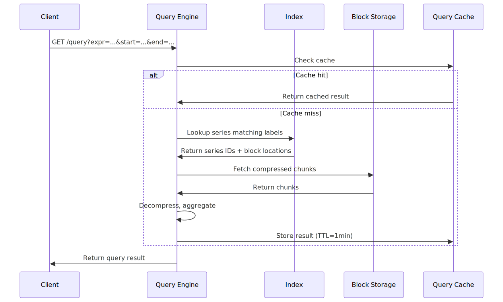
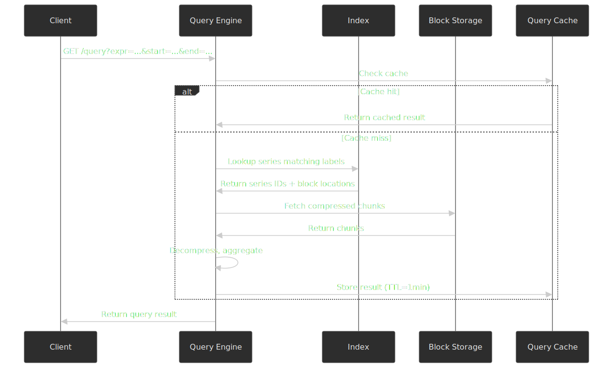

# Design a Time Series Database

A system design for a metrics-and-monitoring time-series database (TSDB) that has to absorb millions of samples per second, answer dashboard queries in tens of milliseconds, keep months of history at affordable cost, and survive the cardinality explosions that come with modern dimensional telemetry. The design lands on an LSM-style block engine modeled after [Prometheus](https://prometheus.io/docs/prometheus/latest/storage/) and [InfluxDB's TSM engine](https://docs.influxdata.com/influxdb/v1/concepts/storage_engine/), with [Gorilla-style compression](https://www.vldb.org/pvldb/vol8/p1816-teller.pdf) inside the chunks and a horizontally fanned query layer in the spirit of [M3](https://m3db.io/) and [Cortex](https://cortexmetrics.io/docs/architecture/).


## Abstract

Time-series databases optimize for an **append-only workload with time-ordered reads**. Samples arrive in near-monotonic timestamp order, are written once, and are read back as range scans grouped by labels. Exploiting that pattern is what unlocks ~10x compression and the order-of-magnitude query gap over general-purpose engines.

The storage engine is an **LSM-style block store**. Writes hit a Write-Ahead Log (WAL) for durability, accumulate in an in-memory head, then flush to immutable, time-partitioned blocks. Prometheus crystallized the canonical layout: 2-hour blocks, 128 MB WAL segments, and background compaction up to 31 days or 10% of retention, whichever is smaller[^prom-storage].

**Compression** lives inside the chunks. Facebook's [Gorilla algorithm](https://www.vldb.org/pvldb/vol8/p1816-teller.pdf) uses delta-of-delta encoding for timestamps and XOR-encoded floats for values; on Facebook's production workload it averaged **~1.37 bytes/sample, a ~12x reduction** over a naive 16-byte (timestamp + double) layout, with **~96% of timestamp delta-of-deltas collapsing to a single bit** because samples arrive at regular scrape intervals.

**Cardinality** — the number of unique `(metric name, label set)` series — is the primary scaling constraint. A single metric like `http_requests{method, status, route}` can explode into millions of series when a label is unbounded (request id, raw URL, user id). The inverted index has to map label terms to series IDs efficiently while staying inside a known memory budget, and the system has to refuse cardinality bombs at the door rather than silently OOM the head block.

## Requirements

### Functional Requirements

| Feature                           | Priority | Scope        |
| --------------------------------- | -------- | ------------ |
| Metric ingestion (push model)     | Core     | Full         |
| Range queries by time             | Core     | Full         |
| Tag-based filtering               | Core     | Full         |
| Aggregations (sum, avg, max, p99) | Core     | Full         |
| Downsampling and rollups          | Core     | Full         |
| Retention policies                | Core     | Full         |
| Distributed queries               | Core     | Full         |
| Cardinality management            | Core     | Full         |
| Alerting integration              | High     | Overview     |
| Multi-tenancy                     | High     | Overview     |
| Exemplar storage (traces)         | Medium   | Brief        |
| Anomaly detection                 | Low      | Out of scope |

### Non-Functional Requirements

| Requirement              | Target                            | Rationale                                          |
| ------------------------ | --------------------------------- | -------------------------------------------------- |
| Write throughput         | 1M+ samples/sec per node          | Modern infrastructure generates massive telemetry  |
| Read latency (hot data)  | p99 < 100 ms                      | Dashboard refresh and alerting requirements        |
| Read latency (cold data) | p99 < 5 s                         | Historical analysis is acceptable with more delay  |
| Storage efficiency       | < 2 bytes/sample compressed       | Cost-effective retention of years of data          |
| Availability             | 99.9%                             | Monitoring must survive partial production outages |
| Data durability          | 99.999%                           | Metrics are forensic evidence after incidents      |
| Retention                | Raw: 15 days, Aggregated: 2 years | Balance granularity vs. storage cost               |

### Scale Estimation

**Metric Sources**

- Hosts: 100K servers, containers, and VMs
- Metrics per host: 500 (CPU, memory, disk, network, application)
- Collection interval: 10 seconds

**Traffic**

- Samples/sec: $100\text{K} \times 500 / 10 = 5\text{M sample/s}$
- Daily samples: $5\text{M} \times 86\,400 \approx 4.32 \times 10^{11}$ per day
- Peak multiplier: 2x during deployments → ~10M samples/sec burst

**Storage (raw)**

- Sample size: 16 bytes (8-byte timestamp + 8-byte double)
- Daily raw: $4.32 \times 10^{11} \times 16 \approx 6.9$ TB/day
- With Gorilla-class compression (~12x): ~575 GB/day
- 15-day raw retention: ~8.6 TB
- 2-year 1-minute downsampled rollup: ~2 TB

**Cardinality**

- Active series (metric + tags): ~50M
- Series per host (avg): ~500
- High-cardinality labels (per-request id, per-user id, raw URL): must be blocked or pre-aggregated

## Design Paths

### Path A: In-memory with disk spillover (Gorilla / Atlas style)

**Best when:** the most valuable data is the last few hours, the memory budget is bounded, and you need sub-millisecond reads on hot data. This is what Facebook described in the original [Gorilla paper](https://www.vldb.org/pvldb/vol8/p1816-teller.pdf), and similar in spirit to [Netflix Atlas](https://netflixtechblog.com/introducing-atlas-netflixs-primary-telemetry-platform-bd31f4d8ed9a).

**Architecture:**

- All active series in memory, each backed by a fixed-size ring buffer
- Disk used only for overflow and crash recovery
- Cold tier handed off to a separate system

**Trade-offs:**

- Sub-millisecond query latency for recent windows
- Predictable memory usage per series
- Limited retention (typically hours to a couple of days)
- Memory cost scales linearly with cardinality
- Cold queries require a second stack

**Real-world example:** Gorilla holds the most recent **26 hours** in memory at Facebook[^gorilla-paper]. Atlas keeps a rolling window for live operational dashboards.

### Path B: LSM-style with tiered storage (Prometheus / InfluxDB)

**Best when:** retention has to stretch from weeks to months, queries hit a mix of hot and cold ranges, and storage cost matters.

**Architecture:**

- Write-ahead log for durability
- In-memory head block with a 2-hour window
- Background compaction to immutable, time-partitioned blocks
- Object storage for cold blocks

**Trade-offs:**

- Cost-effective long retention
- Strong compression (Gorilla-class chunks reach ~1.37 bytes/sample[^gorilla-paper])
- Handles variable cardinality within a known budget
- Cold-tier query latency is higher
- Background compaction adds CPU and write amplification

**Real-world example:** Prometheus uses 2-hour head blocks and compacts upward to 31 days[^prom-storage]. InfluxDB's TSM engine groups data into shards whose duration scales with retention — 7 days for the default infinite-retention `autogen` policy, smaller for shorter retentions[^influx-tsm].

### Path C: Distributed LSM with global index (M3 / Cortex / Mimir)

**Best when:** a single node cannot keep up, you need multi-tenant isolation, or queries need to federate across regions.

**Architecture:**

- Distributors hash by series ID onto a ring of stateful ingesters
- Per-tenant isolated WAL, head, and index
- Query frontends fan out, then merge and aggregate
- Centralized or per-tenant indexing

**Trade-offs:**

- Horizontal scale into the billions of samples/sec
- Multi-tenant isolation
- Geographic distribution becomes feasible
- Operational complexity (rings, replication, rebalancing)
- Network overhead per query
- Consistency surprises during scale-up / scale-down

**Real-world example:** Uber's [M3](https://m3db.io/) is documented as ingesting **over a billion datapoints per second** in production, with internal Uber posts citing ~8.5B datapoints/sec at the query layer in 2018[^uber-billion]. [Cortex](https://cortexmetrics.io/docs/architecture/) and its successor [Grafana Mimir](https://grafana.com/oss/mimir/) provide multi-tenant, Prometheus-compatible storage along the same lines.

### Path Comparison

| Factor                 | Path A (In-Memory)        | Path B (LSM)              | Path C (Distributed) |
| ---------------------- | ------------------------- | ------------------------- | -------------------- |
| Query latency (hot)    | Sub-ms                    | 10-100 ms                 | 50-500 ms            |
| Retention              | Hours                     | Weeks-Months              | Years                |
| Storage efficiency     | Compressed in RAM (~1.37 bytes/sample) | Same compression on disk + tiering | Same plus per-tenant tiers |
| Cardinality limit      | RAM-bound                 | Disk + index-bound        | Per-tenant configurable |
| Operational complexity | Low                       | Medium                    | High                 |
| Best for               | Real-time dashboards      | Single-cluster monitoring | Multi-tenant SaaS    |

### This Article's Focus

The rest of this article implements **Path B (LSM-style)** as the core, with the distributor / query-fanout extensions from Path C. That matches the shape of most production deployments today (Prometheus, InfluxDB, VictoriaMetrics, Mimir) and gives a foundation for both single-node and distributed reasoning.

## High-Level Design

### Service Architecture

#### Ingestion Service (Distributor)

Receives metrics from agents and routes to storage nodes:

- Parse and validate the wire format ([Prometheus remote-write](https://prometheus.io/docs/specs/remote_write_spec/), [InfluxDB line protocol](https://docs.influxdata.com/influxdb/v1/write_protocols/line_protocol_tutorial/), [OpenTelemetry OTLP](https://opentelemetry.io/docs/specs/otlp/))
- Extract metric name, labels, timestamp, value
- Hash the canonical series ID (metric name + sorted labels) for consistent routing
- Forward to one or more replica ingesters
- Apply backpressure via load shedding

#### Storage Engine (Ingester)

Owns the local write path and durable state:

- Append every batch to the Write-Ahead Log (WAL) before acknowledging
- Buffer samples in an in-memory head per series
- Maintain an in-memory inverted index for active series
- Flush head to immutable blocks every 2 hours
- Trigger compaction to merge small blocks into larger ones

#### Compaction Service

Background process that keeps the on-disk shape sane:

- Merge small blocks into larger ones
- Re-encode chunks with the chosen compression
- Drop deleted or expired data
- Rebuild indexes for the merged block
- Enforce retention by deleting blocks past the cutoff

#### Query Engine

Executes queries across hot and cold tiers:

- Parse the query language ([PromQL](https://prometheus.io/docs/prometheus/latest/querying/basics/), InfluxQL, SQL)
- Plan execution: which blocks must be scanned given the time range
- Resolve label selectors via the inverted index
- Fetch and decompress chunks, then aggregate
- Return results with metadata (resolution, source blocks, exemplars)

#### Lifecycle Manager

Owns retention and downsampling:

- Enforce per-tenant time-based retention
- Run downsampling jobs (raw → 1-minute → 1-hour aggregates)
- Move blocks across tiers (hot → warm → cold)
- Track storage usage per tenant for quota and billing

### Data Flow: Write Path


### Data Flow: Query Path




## API Design

### Write Endpoint

**Endpoint:** `POST /api/v1/write`

Accepts metrics in [Prometheus remote-write](https://prometheus.io/docs/specs/remote_write_spec/) (Snappy-compressed protobuf) or InfluxDB line protocol:

```text
# Prometheus exposition format (text)
http_requests_total{method="GET",status="200"} 1234 1704067200000
http_requests_total{method="POST",status="500"} 5 1704067200000
cpu_usage{host="server-1",core="0"} 0.75 1704067200000

# InfluxDB line protocol
http_requests,method=GET,status=200 total=1234 1704067200000000000
cpu,host=server-1,core=0 usage=0.75 1704067200000000000
```

**Request (Prometheus remote-write protobuf):**

```protobuf collapse={1-5}
message WriteRequest {
  repeated TimeSeries timeseries = 1;
  repeated MetricMetadata metadata = 2;
}

message TimeSeries {
  repeated Label labels = 1;  // [{name: "__name__", value: "http_requests_total"}, ...]
  repeated Sample samples = 2;
}

message Sample {
  double value = 1;
  int64 timestamp = 2;  // Unix ms
}
```

**Response:**

- `204 No Content`: success
- `400 Bad Request`: invalid format, missing required labels
- `429 Too Many Requests`: rate-limited (backpressure)
- `503 Service Unavailable`: ingester overloaded

**Design Decision: Push vs. Pull**

Prometheus famously uses a [pull / scrape model](https://prometheus.io/docs/introduction/faq/#why-do-you-pull-rather-than-push), while most TSDBs accept push. For a general-purpose TSDB:

- **Push** (chosen here): simpler client integration, traverses firewalls naturally, scales with stateless distributors.
- **Pull**: better for service discovery, guarantees scrape intervals, but requires bidirectional connectivity to every target.

Remote-write enables a hybrid: a local Prometheus scrapes nearby targets and pushes to a central, multi-tenant TSDB.

### Query Endpoint

**Endpoint:** `GET /api/v1/query_range`

**Query Parameters:**

| Parameter | Type     | Description                               |
| --------- | -------- | ----------------------------------------- |
| `query`   | string   | Query expression (PromQL, InfluxQL)       |
| `start`   | int64    | Start timestamp (Unix seconds or RFC3339) |
| `end`     | int64    | End timestamp                             |
| `step`    | duration | Query resolution (e.g., "1m", "5m")       |

**Example Query:**

```text
GET /api/v1/query_range?query=rate(http_requests_total{status="500"}[5m])&start=1704067200&end=1704153600&step=60
```

**Response:**

```json collapse={1-4, 18-21}
{
  "status": "success",
  "data": {
    "resultType": "matrix",
    "result": [
      {
        "metric": {
          "__name__": "http_requests_total",
          "method": "GET",
          "status": "500",
          "instance": "server-1:9090"
        },
        "values": [
          [1704067200, "0.5"],
          [1704067260, "0.7"],
          [1704067320, "0.3"]
        ]
      }
    ]
  }
}
```

**Rate Limits:** 100 queries/min per tenant, 10 concurrent queries.

### Label Endpoints

**Get label names:** `GET /api/v1/labels`

**Get label values:** `GET /api/v1/label/{label_name}/values`

These query the inverted index and are essential for dashboard tools that build dynamic dropdowns.

### Series Metadata

**Endpoint:** `GET /api/v1/series`

Returns series matching a label selector:

```text
GET /api/v1/series?match[]=http_requests_total{status=~"5.."}
```

Used for cardinality analysis and debugging high-cardinality labels.

## Data Modeling

### Sample Format

**Primary unit:** a sample is a `(timestamp, value)` pair attached to a specific series.

```typescript
interface Sample {
  timestamp: number // Unix milliseconds
  value: number // IEEE 754 double (64-bit)
}

interface Series {
  labels: Map<string, string> // Metric name + tags
  samples: Sample[]
}

// Series identifier (sorted label pairs)
// http_requests_total{method="GET",status="200"}
// → __name__=http_requests_total,method=GET,status=200
// → Hash: fnv64a("__name__\xff http_requests_total\xff method\xff GET\xff ...")
```

**Design Decision: Label Ordering**

Labels are sorted alphabetically before hashing. This ensures the same logical series always hashes to the same ID regardless of label order in the write request — critical for both deduplication on the distributor and consistent routing across replicas.

### Block Format

A block stores a contiguous, immutable time window (2 hours by default in Prometheus[^prom-storage]):

```text
block-<ulid>/
├── meta.json           # Block metadata
├── index               # Inverted index (labels → series)
├── chunks/
│   ├── 000001          # Compressed chunk file
│   ├── 000002
│   └── ...
└── tombstones          # Deleted-series markers
```

**meta.json:**

```json collapse={10-14}
{
  "ulid": "01HQGJ5P1XXXXXXXXX",
  "minTime": 1704067200000,
  "maxTime": 1704074400000,
  "stats": {
    "numSamples": 50000000,
    "numSeries": 100000,
    "numChunks": 150000
  },
  "compaction": {
    "level": 1,
    "sources": ["01HQGJ..."]
  },
  "version": 1
}
```

### Index Structure

The on-disk index is an [inverted index](https://github.com/prometheus/prometheus/blob/main/tsdb/docs/format/index.md) keyed by `(label name, label value)`:

```text
Label → Series IDs
──────────────────
method=GET    → [1, 3, 5, 7, 9, ...]
method=POST   → [2, 4, 6, 8, ...]
status=200    → [1, 2, 3, 4, 5, ...]
status=500    → [6, 7, 8, ...]

Series ID → Chunk Refs
──────────────────────
1 → [(chunk_001, offset=0, len=4096), (chunk_002, offset=0, len=2048)]
2 → [(chunk_001, offset=4096, len=3072)]
```

**Posting list intersection for queries:**

```text
http_requests{method="GET",status="500"}

1. Lookup method=GET → [1, 3, 5, 7, 9]
2. Lookup status=500 → [7, 8, 9, 10]
3. Intersect → [7, 9]
4. Fetch chunks for series 7, 9
```

Posting lists are sorted by series ID, so intersecting two of them is a linear merge in $O(n + m)$. The query planner picks the smallest list first to keep intermediate results tight.

### Schema Design (SQL Representation)

This is **not** the on-disk format — TSDBs do not store samples in a relational table. The SQL below is a reference model only, useful for reasoning about cardinality and indexing:

```sql collapse={1-5, 35-40}
-- Series registry (the inverted index in memory/disk)
CREATE TABLE series (
    id BIGSERIAL PRIMARY KEY,
    labels_hash BIGINT UNIQUE NOT NULL,
    labels JSONB NOT NULL,
    created_at TIMESTAMPTZ DEFAULT NOW()
);

CREATE INDEX idx_series_labels ON series USING GIN (labels);

-- Samples (conceptual — stored in compressed chunks, not SQL)
CREATE TABLE samples (
    series_id BIGINT NOT NULL,
    timestamp TIMESTAMPTZ NOT NULL,
    value DOUBLE PRECISION NOT NULL,
    PRIMARY KEY (series_id, timestamp)
);

-- Block metadata
CREATE TABLE blocks (
    ulid TEXT PRIMARY KEY,
    min_time TIMESTAMPTZ NOT NULL,
    max_time TIMESTAMPTZ NOT NULL,
    num_samples BIGINT NOT NULL,
    num_series INTEGER NOT NULL,
    level INTEGER DEFAULT 1,
    created_at TIMESTAMPTZ DEFAULT NOW()
);

CREATE INDEX idx_blocks_time ON blocks(min_time, max_time);
```

### Storage Selection Matrix

| Data Type        | Storage                 | Rationale                             |
| ---------------- | ----------------------- | ------------------------------------- |
| Active samples   | Memory (memtable)       | Sub-ms writes; recent data is hottest |
| WAL              | Local SSD (sequential)  | Durability; sequential write pattern  |
| Hot blocks       | Local SSD (random read) | Frequent queries; benefit from cache  |
| Warm blocks      | Networked SSD           | Less frequent access; cost efficiency |
| Cold blocks      | Object storage (S3/GCS) | Long retention at lowest $/GB         |
| Inverted index   | Memory + SSD            | Fast label lookups, memory-mapped     |
| Downsampled data | Separate retention tier | Skip raw scan for long ranges         |

## Low-Level Design

### Compression: Gorilla Algorithm

Compression is the core of TSDB efficiency. Facebook's [Gorilla paper (VLDB 2015)](https://www.vldb.org/pvldb/vol8/p1816-teller.pdf) introduced delta-of-delta for timestamps and XOR for values, and reported ~1.37 bytes/sample on production traffic — roughly a 12x reduction over the naive `(int64, double)` layout[^gorilla-paper]. The same scheme (or a close variant) is what Prometheus, InfluxDB TSM, M3, and VictoriaMetrics use inside their chunks.

#### Timestamp Compression (Delta-of-Delta)

Samples typically arrive at regular intervals (e.g., every 10 seconds). Instead of storing absolute timestamps:

```typescript collapse={1-8, 40-50}
// Delta-of-delta encoding
// Timestamps: [1000, 1010, 1020, 1030, 1040]
// Deltas:     [  -,   10,   10,   10,   10]
// Delta-of-delta: [-, -, 0, 0, 0]

// Encoding rules (Gorilla paper, Section 4.1.1):
// - If delta-of-delta = 0: write '0' (1 bit)
// - If fits in [-63, 64]: write '10' + 7 bits
// - If fits in [-255, 256]: write '110' + 9 bits
// - If fits in [-2047, 2048]: write '1110' + 12 bits
// - Otherwise: write '1111' + 32 bits

function encodeTimestamps(timestamps: number[]): BitStream {
  const stream = new BitStream()

  // First timestamp: stored as-is (64 bits)
  stream.writeBits(timestamps[0], 64)

  if (timestamps.length < 2) return stream

  // Second timestamp: delta from first
  let prevDelta = timestamps[1] - timestamps[0]
  stream.writeBits(prevDelta, 14)

  // Remaining: delta-of-delta
  for (let i = 2; i < timestamps.length; i++) {
    const delta = timestamps[i] - timestamps[i - 1]
    const deltaOfDelta = delta - prevDelta

    if (deltaOfDelta === 0) {
      stream.writeBit(0)
    } else if (deltaOfDelta >= -63 && deltaOfDelta <= 64) {
      stream.writeBits(0b10, 2)
      stream.writeBits(deltaOfDelta + 63, 7)
    } else if (deltaOfDelta >= -255 && deltaOfDelta <= 256) {
      stream.writeBits(0b110, 3)
      stream.writeBits(deltaOfDelta + 255, 9)
    } else if (deltaOfDelta >= -2047 && deltaOfDelta <= 2048) {
      stream.writeBits(0b1110, 4)
      stream.writeBits(deltaOfDelta + 2047, 12)
    } else {
      stream.writeBits(0b1111, 4)
      stream.writeBits(deltaOfDelta, 32)
    }

    prevDelta = delta
  }

  return stream
}
```

On Facebook's workload, **~96% of timestamps land on the single-bit branch** because scrapers fire on a fixed cadence[^gorilla-paper].

#### Value Compression (XOR Encoding)

Consecutive metric values usually share most of their bits (e.g., CPU at 0.75 then 0.76):

```typescript collapse={1-10, 50-60}
// XOR encoding for IEEE 754 doubles
// Values: [0.75, 0.76, 0.76, 0.77]
// XOR with previous: [0.75, XOR(0.75,0.76), XOR(0.76,0.76), XOR(0.76,0.77)]

// The XOR of similar floats has many leading and trailing zeros.
// We encode (leading-zeros count, significant-bit count, significant bits).

interface XORState {
  prevValue: bigint
  prevLeadingZeros: number
  prevTrailingZeros: number
}

function encodeValues(values: number[]): BitStream {
  const stream = new BitStream()

  const firstBits = floatToBits(values[0])
  stream.writeBits(firstBits, 64)

  let state: XORState = {
    prevValue: firstBits,
    prevLeadingZeros: 0,
    prevTrailingZeros: 0,
  }

  for (let i = 1; i < values.length; i++) {
    const currentBits = floatToBits(values[i])
    const xor = currentBits ^ state.prevValue

    if (xor === 0n) {
      stream.writeBit(0)
    } else {
      stream.writeBit(1)

      const leadingZeros = countLeadingZeros(xor)
      const trailingZeros = countTrailingZeros(xor)
      const significantBits = 64 - leadingZeros - trailingZeros

      if (leadingZeros >= state.prevLeadingZeros && trailingZeros >= state.prevTrailingZeros) {
        // Fits the previous window: control '0' + significant bits
        stream.writeBit(0)
        const shift = 64 - state.prevLeadingZeros - significantBits
        stream.writeBits(xor >> BigInt(shift), significantBits)
      } else {
        // New window: control '1' + leading zeros + length + bits
        stream.writeBit(1)
        stream.writeBits(leadingZeros, 5)
        stream.writeBits(significantBits - 1, 6)
        stream.writeBits(xor >> BigInt(trailingZeros), significantBits)

        state.prevLeadingZeros = leadingZeros
        state.prevTrailingZeros = trailingZeros
      }
    }

    state.prevValue = currentBits
  }

  return stream
}
```

Gorilla's measured value bucket distribution[^gorilla-paper]:

- ~51% of values: 1 bit (XOR is zero — value unchanged)
- ~30% of values: ~26.6 bits (control `'10'` path — XOR fits the previous leading/trailing-zero window)
- ~19% of values: ~36.9 bits (control `'11'` path — new window, 13 bits of overhead)

> [!NOTE]
> The exact bucket percentages depend on workload (Facebook's production gauges and counters). Workloads with noisier doubles compress less; integer-valued counters compress better.

**Combined compression:** Facebook's published average across both timestamps and values is **~1.37 bytes/sample**, versus 16 bytes raw — roughly a 12x reduction[^gorilla-paper]. Plan for a less rosy ratio in your own workload until you measure: ratios of 6-10x are common in practice once you mix in churning gauge values, irregular scrape intervals, and per-chunk overhead.

### Write-Ahead Log

The WAL guarantees durability before acknowledging a write. Prometheus, for example, stores its WAL in **128 MB segments** and keeps a minimum of three around so it can replay at least the head window after a crash[^prom-storage]:

```typescript collapse={1-10, 45-55}
// WAL segment structure
// Segments are 128MB each, kept for minimum 3 files

interface WALSegment {
  id: number
  path: string
  size: number
  firstTimestamp: number
  lastTimestamp: number
}

interface WALRecord {
  type: "series" | "samples" | "tombstone"
  data: Uint8Array
}

class WriteAheadLog {
  private currentSegment: WALSegment
  private segments: WALSegment[] = []
  private readonly maxSegmentSize = 128 * 1024 * 1024 // 128MB
  private readonly minSegmentsKept = 3

  async append(records: WALRecord[]): Promise<void> {
    const encoded = this.encodeRecords(records)

    if (this.currentSegment.size + encoded.length > this.maxSegmentSize) {
      await this.rotateSegment()
    }

    await this.currentSegment.write(encoded)
    await this.currentSegment.sync() // fsync
  }

  async truncate(checkpointSegmentId: number): Promise<void> {
    const toRemove = this.segments.filter(
      (s) => s.id < checkpointSegmentId && this.segments.length - 1 >= this.minSegmentsKept,
    )

    for (const segment of toRemove) {
      await fs.unlink(segment.path)
      this.segments = this.segments.filter((s) => s.id !== segment.id)
    }
  }

  async replay(): Promise<WALRecord[]> {
    const records: WALRecord[] = []
    for (const segment of this.segments) {
      const segmentRecords = await this.readSegment(segment)
      records.push(...segmentRecords)
    }
    return records
  }
}
```

> [!IMPORTANT]
> WAL replay is the longest single phase of cold-start recovery. Prometheus added optional [WAL compression](https://prometheus.io/docs/prometheus/latest/feature_flags/#wal-compression) (default since v2.20) to keep replay time bounded. Plan capacity for WAL size based on the head window, not just steady-state ingestion.

### In-Memory Index (Series Registry)

The in-memory index maps labels to series IDs for fast query planning:

```typescript collapse={1-10, 55-65}
// Inverted index for label lookups.
// Posting lists are sorted, deduplicated arrays of series IDs.

type SeriesID = number
type PostingList = SeriesID[]

class InMemoryIndex {
  private postings: Map<string, Map<string, PostingList>> = new Map()
  private seriesLabels: Map<SeriesID, Map<string, string>> = new Map()
  private hashToSeries: Map<bigint, SeriesID> = new Map()

  private nextSeriesID: SeriesID = 1

  getOrCreateSeries(labels: Map<string, string>): SeriesID {
    const hash = this.hashLabels(labels)

    const existing = this.hashToSeries.get(hash)
    if (existing !== undefined) {
      return existing
    }

    const id = this.nextSeriesID++
    this.hashToSeries.set(hash, id)
    this.seriesLabels.set(id, labels)

    for (const [name, value] of labels) {
      if (!this.postings.has(name)) {
        this.postings.set(name, new Map())
      }
      const valueMap = this.postings.get(name)!
      if (!valueMap.has(value)) {
        valueMap.set(value, [])
      }
      valueMap.get(value)!.push(id)
    }

    return id
  }

  query(matchers: LabelMatcher[]): SeriesID[] {
    if (matchers.length === 0) {
      return Array.from(this.seriesLabels.keys())
    }

    // Start with the smallest posting list (most selective)
    const sorted = [...matchers].sort((a, b) => this.getPostingListSize(a) - this.getPostingListSize(b))

    let result = this.getPostingList(sorted[0])

    for (let i = 1; i < sorted.length; i++) {
      const other = this.getPostingList(sorted[i])
      result = this.intersect(result, other)
      if (result.length === 0) break // Early exit
    }

    return result
  }

  private intersect(a: PostingList, b: PostingList): PostingList {
    // Sorted-merge intersection: O(n + m)
    const result: SeriesID[] = []
    let i = 0,
      j = 0

    while (i < a.length && j < b.length) {
      if (a[i] === b[j]) {
        result.push(a[i])
        i++
        j++
      } else if (a[i] < b[j]) {
        i++
      } else {
        j++
      }
    }

    return result
  }
}
```

### Block Compaction

Compaction merges small blocks into larger ones, lowering per-block overhead and improving query efficiency. Prometheus caps the result at **31 days or 10% of the configured retention, whichever is smaller**[^prom-storage]:




```typescript collapse={1-10, 50-60}
// Compaction strategy
// - Level 0: 2-hour blocks (from memtable flush)
// - Level 1: 8-hour blocks (4 level-0 merged)
// - Level 2: 24-hour blocks
// - Max block size: 31 days OR 10% of retention (whichever is smaller)

interface CompactionPlan {
  sources: Block[]
  targetLevel: number
  estimatedSize: number
}

class Compactor {
  private readonly maxBlockDuration = 31 * 24 * 60 * 60 * 1000 // 31 days

  async planCompaction(blocks: Block[]): Promise<CompactionPlan[]> {
    const plans: CompactionPlan[] = []
    const byLevel = this.groupByLevel(blocks)

    for (const [level, levelBlocks] of byLevel) {
      const sorted = levelBlocks.sort((a, b) => a.minTime - b.minTime)

      for (let i = 0; i < sorted.length - 1; i++) {
        const candidates = [sorted[i]]
        let j = i + 1

        while (j < sorted.length && sorted[j].minTime === candidates[candidates.length - 1].maxTime) {
          candidates.push(sorted[j])
          j++

          const duration = candidates[j - 1].maxTime - candidates[0].minTime
          if (duration > this.maxBlockDuration) break

          if (candidates.length >= 4) break
        }

        if (candidates.length >= 2) {
          plans.push({
            sources: candidates,
            targetLevel: level + 1,
            estimatedSize: candidates.reduce((sum, b) => sum + b.size, 0) * 0.9,
          })
          i = j - 1
        }
      }
    }

    return plans
  }

  async compact(plan: CompactionPlan): Promise<Block> {
    const iterators = plan.sources.map((b) => b.createIterator())
    const mergedSamples = this.mergeSortIterators(iterators)
    const newBlock = await this.writeBlock(mergedSamples, plan.targetLevel)

    await this.swapBlocks(plan.sources, newBlock)
    for (const source of plan.sources) {
      await source.delete()
    }
    return newBlock
  }
}
```

> [!CAUTION]
> Capping the largest block size matters operationally: deletes happen at block granularity. A 90-day mega-block wastes disk on a 7-day delete request, so the 10%-of-retention cap is not arbitrary.

### Downsampling and Retention Tiers

Long-range queries cannot afford to scan years of raw 10-second samples. Downsampling pre-computes lower-resolution rollups and routes queries to the right tier:




```typescript collapse={1-10, 45-55}
// Downsampling tiers
// - Raw: 10-second resolution, 15 days
// - 1-minute: min/max/sum/count/avg, 90 days
// - 1-hour: min/max/sum/count/avg, 2 years

interface DownsampleConfig {
  sourceResolution: string
  targetResolution: string
  aggregations: string[]
  retention: number
}

interface DownsampledSample {
  timestamp: number // Bucket start time
  min: number
  max: number
  sum: number
  count: number
  // Derived: avg = sum / count
}

class Downsampler {
  async downsample(seriesId: number, sourceBlock: Block, config: DownsampleConfig): Promise<DownsampledSample[]> {
    const bucketMs = this.parseDuration(config.targetResolution)
    const buckets = new Map<number, DownsampledSample>()

    const iterator = sourceBlock.createIterator(seriesId)

    for await (const sample of iterator) {
      const bucketStart = Math.floor(sample.timestamp / bucketMs) * bucketMs

      if (!buckets.has(bucketStart)) {
        buckets.set(bucketStart, {
          timestamp: bucketStart,
          min: sample.value,
          max: sample.value,
          sum: sample.value,
          count: 1,
        })
      } else {
        const bucket = buckets.get(bucketStart)!
        bucket.min = Math.min(bucket.min, sample.value)
        bucket.max = Math.max(bucket.max, sample.value)
        bucket.sum += sample.value
        bucket.count++
      }
    }

    return Array.from(buckets.values())
  }
}

// Query routing: pick the cheapest resolution that still answers the question.
function selectResolution(queryRange: number): string {
  if (queryRange <= 24 * 60 * 60 * 1000) return "raw"            // ≤ 1 day
  if (queryRange <= 30 * 24 * 60 * 60 * 1000) return "1m"        // ≤ 30 days
  return "1h"
}
```

### Cardinality Management

High cardinality is the single most common operational fire in production TSDBs. Each unique `(metric name, label set)` combination is a series with its own posting-list entry and its own in-memory state; an unbounded label like `request_id` can multiply series by orders of magnitude in minutes.

```typescript collapse={1-8, 40-50}
interface CardinalityLimits {
  maxSeriesPerMetric: number       // e.g., 100,000
  maxTotalSeries: number           // e.g., 10,000,000
  maxLabelValueCardinality: number // e.g., 10,000 per label name
}

class CardinalityTracker {
  private seriesPerMetric: Map<string, Set<number>> = new Map()
  private seriesPerLabel: Map<string, Map<string, number>> = new Map()
  private totalSeries: number = 0

  checkLimits(labels: Map<string, string>, limits: CardinalityLimits): CardinalityError | null {
    const metricName = labels.get("__name__")!

    const metricSeries = this.seriesPerMetric.get(metricName)?.size ?? 0
    if (metricSeries >= limits.maxSeriesPerMetric) {
      return {
        type: "metric_cardinality_exceeded",
        metric: metricName,
        current: metricSeries,
        limit: limits.maxSeriesPerMetric,
      }
    }

    for (const [name, value] of labels) {
      const labelValues = this.seriesPerLabel.get(name)
      if (labelValues && labelValues.size >= limits.maxLabelValueCardinality) {
        return {
          type: "label_cardinality_exceeded",
          label: name,
          current: labelValues.size,
          limit: limits.maxLabelValueCardinality,
        }
      }
    }

    if (this.totalSeries >= limits.maxTotalSeries) {
      return {
        type: "total_cardinality_exceeded",
        current: this.totalSeries,
        limit: limits.maxTotalSeries,
      }
    }

    return null
  }

  // Surface labels that are blowing up cardinality so operators can act.
  getHighCardinalityLabels(threshold: number): { label: string; cardinality: number }[] {
    const results: { label: string; cardinality: number }[] = []
    for (const [label, values] of this.seriesPerLabel) {
      if (values.size > threshold) {
        results.push({ label, cardinality: values.size })
      }
    }
    return results.sort((a, b) => b.cardinality - a.cardinality)
  }
}
```

> [!WARNING]
> Common high-cardinality antipatterns: `request_id`, `trace_id`, `user_id`, raw URLs with query strings, IP addresses, UUIDs, free-form error messages. Move these to **exemplars** or **logs/traces** (e.g., [Prometheus exemplars](https://prometheus.io/docs/prometheus/latest/feature_flags/#exemplars-storage)) instead of raising them as labels. Reject offending series at the distributor — silent dropping is harder to debug than a clear `429`.

## Frontend Considerations

### Dashboard Query Optimization

A dashboard with 20 panels, each pulling 1 week of data at 1-minute resolution, generates $20 \times 10\,080 = 201\,600$ datapoints — most of which the browser cannot meaningfully render anyway.

Working levers:

1. **Step alignment** — query at the dashboard refresh resolution, not the storage resolution.
2. **Parallel queries** — fan out panel fetches concurrently.
3. **Query caching** — cache identical queries server-side and CDN-side.
4. **Streaming updates** — WebSocket / SSE for live tails, HTTP for historical scrolls.

```typescript collapse={1-5, 30-40}
interface DashboardQuery {
  panelId: string
  expr: string
  range: { start: number; end: number }
  step: number
}

async function fetchDashboard(queries: DashboardQuery[]): Promise<Map<string, QueryResult>> {
  // Group queries by time range (panels typically share one range)
  const byRange = groupBy(queries, (q) => `${q.range.start}-${q.range.end}`)

  const results = new Map<string, QueryResult>()

  await Promise.all(
    Object.entries(byRange).map(async ([, rangeQueries]) => {
      // Batch multiple expressions if the backend supports it
      const batchResult = await fetchBatch(rangeQueries)
      for (const [panelId, result] of batchResult) {
        results.set(panelId, result)
      }
    }),
  )

  return results
}
```

### Time Range Selection

UX considerations:

- Relative ranges (`Last 1 hour`, `Last 7 days`) for monitoring
- Absolute ranges for incident investigation
- Auto-refresh interval matching the query range
- Timezone displayed in the user's local time, queried in UTC

### Graph Rendering

Performance patterns:

- Downsample on the client for display — a `<canvas>` cannot meaningfully render 10K points per panel
- Use [uPlot](https://github.com/leeoniya/uPlot) or WebGL for high-density graphs (Grafana ships uPlot for many panel types)
- Lazy-load panels as they scroll into view
- Debounce zoom and pan operations

## Infrastructure Design

### Cloud-Agnostic Concepts

| Component        | Requirement                | Options                               |
| ---------------- | -------------------------- | ------------------------------------- |
| Ingest / Query   | Stateless, auto-scaling    | Kubernetes Deployment, ECS Service    |
| Storage Engine   | Stateful, local SSD        | StatefulSet with local volumes        |
| Block Storage    | High IOPS, low latency     | Local NVMe, EBS gp3, Persistent Disks |
| Object Storage   | Cold tier, cheap, durable  | S3, GCS, MinIO                        |
| Coordination     | Leader election, config    | etcd, Consul, ZooKeeper               |

### AWS Reference Architecture




| Component     | AWS Service        | Configuration                            |
| ------------- | ------------------ | ---------------------------------------- |
| Load Balancer | NLB                | TCP passthrough, cross-AZ                |
| Distributors  | EKS (Fargate)      | 3-10 pods, 2 vCPU / 4 GB each            |
| Ingesters     | EKS (EC2)          | i3/i4i.xlarge (NVMe), 3+ nodes, StatefulSet |
| Query Engines | EKS (Fargate)      | 2-10 pods, 4 vCPU / 8 GB each            |
| Cold Storage  | S3 Standard-IA     | Lifecycle to Glacier after 90 days       |
| Query Cache   | ElastiCache Redis  | cache.r6g.large, cluster mode            |
| Coordination  | EKS control plane  | Built-in etcd                            |

### Self-Hosted Alternatives

| Managed Service | Self-Hosted    | When to Self-Host             |
| --------------- | -------------- | ----------------------------- |
| ElastiCache     | Redis on EC2   | Cost, specific modules        |
| S3              | MinIO          | On-premises, data sovereignty |
| EKS             | k3s/k8s on EC2 | Cost, full control            |

### High Availability

**Replication strategy for ingesters:**

- Distributor writes to N ingesters (N=3 typical)
- Query engine reads from any one replica, dedupes
- Consistency: eventual — recently-written samples may lag a replica
- Durability: WAL replicated, blocks uploaded to object storage

**Failure scenarios:**

1. **Ingester crash** — WAL is replayed on the replacement; recent samples can be back-filled from peers.
2. **Query engine crash** — stateless, the load balancer routes to the next healthy instance.
3. **Object storage unavailable** — serve hot data from ingesters, fail cold queries gracefully with a clear error.
4. **Distributor partition** — drop samples for the partitioned tenant rather than blocking the cluster; alert on increased `429`/`503` rate.

## Conclusion

The design prioritizes **write efficiency** (LSM head + WAL), **storage efficiency** (Gorilla-class chunks), and **query performance** (inverted index + time partitioning). The same shape scales from a single Prometheus node up to a distributed Cortex/Mimir/M3 cluster.

Key architectural decisions:

1. **LSM-style storage with 2-hour blocks** — balances write amplification against query efficiency. Compaction merges blocks up to the smaller of 31 days or 10% of retention[^prom-storage].
2. **Gorilla compression (delta-of-delta + XOR)** — averages ~1.37 bytes/sample on Facebook's workload, with ~96% of timestamps collapsing to 1 bit at regular scrape intervals[^gorilla-paper].
3. **Inverted index with posting-list intersection** — label queries are linear merges over sorted posting lists; memory-mapped to handle large cardinalities.
4. **Tiered retention with downsampling** — raw 15 days → 1-minute 90 days → 1-hour 2 years. Queries auto-select the cheapest resolution that still answers the question.
5. **Cardinality limits as a first-class feature** — per-metric, per-label, and total-series budgets prevent the head block from OOMing on a single bad label.

**Limitations and future directions:**

- **Cross-series queries** — aggregations over many series remain expensive; pre-computed [recording rules](https://prometheus.io/docs/prometheus/latest/configuration/recording_rules/) and continuous aggregates help.
- **Exemplars and traces** — linking a metric sample to a trace is increasingly table stakes; budget for exemplar storage and ingestion.
- **Multi-tenancy** — proper isolation requires per-tenant rate limiting, query queueing, and chargeback metering.

## Appendix

### Prerequisites

- Distributed-systems fundamentals (consistency, availability, partitioning)
- Database internals ([LSM trees](https://en.wikipedia.org/wiki/Log-structured_merge-tree), B-trees, write-ahead logs)
- Data compression concepts
- Familiarity with metrics and monitoring

### Terminology

- **Sample** — a `(timestamp, value)` pair for a specific series.
- **Series** — a unique metric identified by its name and label set.
- **Cardinality** — the number of unique series.
- **TSDB** — Time Series Database, optimized for time-indexed, append-only data.
- **LSM Tree** — Log-Structured Merge Tree, a storage structure using sorted runs and background compaction.
- **WAL** — Write-Ahead Log, a sequential log used for durability before in-memory commit.
- **Gorilla** — Facebook's compression algorithm for time-series ([VLDB 2015](https://www.vldb.org/pvldb/vol8/p1816-teller.pdf)).
- **PromQL** — Prometheus Query Language, a functional query language for metrics.
- **Posting list** — sorted list of series IDs matching a label value.

### Summary

- TSDBs exploit **append-only, time-ordered** access for ~10x compression and fast range queries.
- **Gorilla** averages ~1.37 bytes/sample with ~96% of timestamps compressing to 1 bit on regular scrape intervals[^gorilla-paper].
- **LSM-style storage with 2-hour blocks** balances write throughput against query efficiency; compaction caps at 31 days or 10% of retention[^prom-storage].
- **Inverted index** maps labels to series IDs; sorted posting-list intersection drives label queries.
- **Cardinality management** is critical — high-cardinality labels (request_id, user_id) must be blocked or aggregated.
- **Tiered retention** with downsampling (raw → 1m → 1h) keeps multi-year storage affordable.
- A single node can handle 1M+ samples/sec with proper tuning; distributed designs (M3, Mimir, Cortex) reach 1B+[^uber-billion].

### References

- [Gorilla: A Fast, Scalable, In-Memory Time Series Database](https://www.vldb.org/pvldb/vol8/p1816-teller.pdf) — Facebook, VLDB 2015. Compression algorithm and 26-hour in-memory architecture.
- [Prometheus storage documentation](https://prometheus.io/docs/prometheus/latest/storage/) — block format, WAL, compaction, retention.
- [Prometheus TSDB index format](https://github.com/prometheus/prometheus/blob/main/tsdb/docs/format/index.md) — on-disk index spec.
- [InfluxDB Storage Engine (TSM)](https://docs.influxdata.com/influxdb/v1/concepts/storage_engine/) — TSM and TSI architecture.
- [M3: Uber's Open Source, Large-scale Metrics Platform](https://www.uber.com/blog/m3/) — distributed TSDB at scale.
- [The Billion Data Point Challenge](https://www.uber.com/blog/billion-data-point-challenge/) — Uber engineering on M3 query scale.
- [Cortex Architecture](https://cortexmetrics.io/docs/architecture/) — multi-tenant, Prometheus-compatible storage.
- [Grafana Mimir](https://grafana.com/oss/mimir/) — Cortex's spiritual successor; horizontally scalable Prometheus.
- [VictoriaMetrics vs Prometheus](https://docs.victoriametrics.com/faq/#what-is-the-difference-between-victoriametrics-and-prometheus) — performance and architecture comparison.
- [TimescaleDB hypertables](https://docs.timescale.com/use-timescale/latest/hypertables/) — relational TSDB with hypertables and continuous aggregates.
- [QuestDB storage model](https://questdb.com/docs/concept/storage-model/) — column-oriented TSDB.
- [PromQL documentation](https://prometheus.io/docs/prometheus/latest/querying/basics/) — query language reference.

[^gorilla-paper]: Pelkonen et al., [Gorilla: A Fast, Scalable, In-Memory Time Series Database](https://www.vldb.org/pvldb/vol8/p1816-teller.pdf), VLDB 2015. Reports ~1.37 bytes/sample after delta-of-delta + XOR compression, ~96% of timestamps as a single bit, and a 26-hour in-memory window in production at Facebook.
[^prom-storage]: Prometheus project, [Storage documentation](https://prometheus.io/docs/prometheus/latest/storage/). Defines 2-hour head blocks, 128 MB WAL segments, and the "31 days or 10% of retention, whichever is smaller" compaction cap.
[^influx-tsm]: InfluxData, [InfluxDB v1 Storage Engine documentation](https://docs.influxdata.com/influxdb/v1/concepts/storage_engine/) and [Database management — shard group duration](https://docs.influxdata.com/influxdb/v1/query_language/manage-database/#shard-group-duration-management). Shard-group duration defaults vary with retention: ≤2 days → 1 hour, >2 days and <6 months → 1 day, ≥6 months (and the default `autogen` infinite-retention policy) → 7 days.
[^uber-billion]: Uber Engineering, [The Billion Data Point Challenge](https://www.uber.com/blog/billion-data-point-challenge/). Reports an internal M3 query engine handling ~8.5 billion data points per second as of 2018.
