# Design Tokens and Theming Architecture

Design tokens encode design decisions as platform-agnostic data, so the same source of truth drives UI on web, iOS, and Android. This article covers the token taxonomy, the indirection layer that makes theming work, the multi-platform build pipeline, and the governance and versioning practices that keep an enterprise design system stable as it grows.




## Abstract

Design tokens are named entities that store visual design attributes — colours, spacing, typography, motion — as the atomic building blocks of a design system. The core mental model is a three-tier hierarchy:

- **Primitives** answer "what values exist?" (raw palette: `blue-500: #2563eb`)
- **Semantic tokens** answer "what does this value mean?" (purpose: `color-action-primary`)
- **Component tokens** answer "where is this used?" (specificity: `button-background`)

The same three tiers appear under different names across systems — Material 3 calls them [**reference**, **system**, and **component** tokens](https://m3.material.io/foundations/design-tokens/how-to-read-tokens); IBM Carbon talks about background, layer, and component tokens; SLDS uses primitives, aliases, and component-level styling hooks. The vocabulary differs; the layering is the same.

Theming works by swapping the semantic layer while primitives stay constant. A dark theme redefines `color-background-default` from `{color.gray.50}` to `{color.gray.900}`; components that reference the semantic token adapt automatically.

The W3C [Design Tokens Format Module 2025.10](https://www.designtokens.org/TR/2025.10/format/) — the first stable version of the DTCG specification, [published 2025-10-28](https://www.w3.org/community/design-tokens/2025/10/28/design-tokens-specification-reaches-first-stable-version/) — standardises the JSON format using `$`-prefixed reserved properties (`$value`, `$type`, `$description`, `$deprecated`) and a curly-brace alias syntax. Tools like [Style Dictionary v4](https://styledictionary.com/) transform that source into platform-specific outputs (CSS custom properties, Swift, Android XML, Compose, Flutter). The examples in this article stay compact to highlight naming and aliasing mechanics; production token sets add richer type-specific metadata and structured values.

## Token Taxonomy

The three-tier token hierarchy emerged from Salesforce's Lightning Design System work (2014-2015), where Jina Anne and Jon Levine needed to scale design decisions across platforms and partner implementations.

### Primitive Tokens (also: Reference / Global)

Primitives define the raw design palette with no semantic meaning attached. They answer "what options exist?" and form the foundation that semantic tokens reference.

```json title="primitives.tokens.json"
{
  "color": {
    "blue": {
      "100": { "$value": "#dbeafe", "$type": "color" },
      "500": { "$value": "#3b82f6", "$type": "color" },
      "600": { "$value": "#2563eb", "$type": "color" },
      "900": { "$value": "#1e3a8a", "$type": "color" }
    },
    "gray": {
      "50": { "$value": "#f9fafb", "$type": "color" },
      "600": { "$value": "#4b5563", "$type": "color" },
      "900": { "$value": "#111827", "$type": "color" }
    }
  },
  "spacing": {
    "100": { "$value": "4px", "$type": "dimension" },
    "200": { "$value": "8px", "$type": "dimension" },
    "400": { "$value": "16px", "$type": "dimension" }
  }
}
```

**Naming convention**: Primitives use appearance-based names (`blue-500`, `gray-50`) because they carry no semantic intent. The value itself is the identity.

**Scale design**: Avoid sequential integers (`shadow-1`, `shadow-2`) which leave no room for insertion. Use:

- **Numeric scales**: 100, 200, 400, 800 (doubling allows interpolation)
- **T-shirt sizes**: xs, sm, md, lg, xl, 2xl
- **Named variants**: subtle, default, strong

### Semantic Tokens (also: Alias / System / Purpose)

Semantic tokens assign meaning to primitives. They answer "how should this value be used?" and create the indirection layer that enables theming.

```json title="semantic.tokens.json"
{
  "color": {
    "background": {
      "default": { "$value": "{color.gray.50}", "$type": "color" },
      "surface": { "$value": "#ffffff", "$type": "color" },
      "inverse": { "$value": "{color.gray.900}", "$type": "color" }
    },
    "text": {
      "primary": { "$value": "{color.gray.900}", "$type": "color" },
      "secondary": { "$value": "{color.gray.600}", "$type": "color" },
      "inverse": { "$value": "#ffffff", "$type": "color" }
    },
    "action": {
      "primary": { "$value": "{color.blue.500}", "$type": "color" },
      "primary-hover": { "$value": "{color.blue.600}", "$type": "color" }
    }
  }
}
```

The curly-brace syntax `{color.gray.50}` is the [DTCG alias mechanism](https://www.designtokens.org/TR/2025.10/format/#aliases-references): a string `$value` whose entire content is `{path.to.token}` is resolved to the referenced token's value at build time. When the primitive changes, every semantic token referencing it updates automatically.

**Naming convention**: Semantic tokens use purpose-based names. The pattern `{category}.{concept}.{variant}` yields names like `color.action.primary` or `spacing.layout.gutter`. This decouples the "what" (blue) from the "why" (primary action).

### Component Tokens (also: Specific / Application)

Component tokens map semantic values to specific UI component parts. They answer "where exactly is this used?"

```json title="component.tokens.json"
{
  "button": {
    "primary": {
      "background": { "$value": "{color.action.primary}", "$type": "color" },
      "background-hover": { "$value": "{color.action.primary-hover}", "$type": "color" },
      "text": { "$value": "{color.text.inverse}", "$type": "color" },
      "border-radius": { "$value": "{spacing.100}", "$type": "dimension" },
      "padding-x": { "$value": "{spacing.400}", "$type": "dimension" },
      "padding-y": { "$value": "{spacing.200}", "$type": "dimension" }
    }
  }
}
```

**When to use component tokens**: They add significant maintenance overhead. Only introduce this tier when you need:

- **Multi-brand theming**: Different brands require different component appearances beyond color swaps
- **Granular component customization**: Consumers need to override specific component parts
- **White-labeling**: Partners skin components while core semantics stay constant

Most design systems operate well with just primitives and semantic tokens. Component tokens multiply the token count significantly—a system with 200 semantic tokens might balloon to 2000+ with component tokens.

### Tier Trade-offs

| Approach              | Token Count       | Flexibility | Maintenance | Use Case                           |
| --------------------- | ----------------- | ----------- | ----------- | ---------------------------------- |
| Primitives only       | Low (~50-100)     | Limited     | Minimal     | Simple apps, prototypes            |
| Primitives + Semantic | Medium (~200-500) | Good        | Moderate    | Most production systems            |
| All three tiers       | High (~1000+)     | Maximum     | Significant | Multi-brand, white-label platforms |

## Naming Conventions

A token name is a path that needs to round-trip from JSON to CSS, Swift, Kotlin, and XML without ambiguity. The convention that became standard in early design-system work is a Category–Concept–Property–Variant–State path; it grew out of the Category-Type-Item (CTI) classification baked into early Style Dictionary, which the Eightshapes / Nathan Curtis [naming-tokens guide](https://medium.com/eightshapes-llc/naming-tokens-in-design-systems-9e86c7444676) extends with namespace, concept, property, variant, and state segments.

> [!NOTE]
> Style Dictionary v4 has [removed the hard CTI coupling](https://styledictionary.com/reference/hooks/transforms/predefined/): tokens are classified by `$type` (DTCG) or `token.type` (legacy) instead of by their position in a fixed Category/Type/Item hierarchy. The old `name/cti/kebab` transform was renamed to `name/kebab`. CTI survives as a useful naming heuristic, not as a structural requirement.

### Full Naming Structure

| Level         | Purpose             | Examples                                |
| ------------- | ------------------- | --------------------------------------- |
| **Namespace** | System identifier   | `acme-`, `spectrum-`                    |
| **Category**  | Output type         | `color`, `spacing`, `font`, `shadow`    |
| **Concept**   | Semantic grouping   | `background`, `action`, `feedback`      |
| **Property**  | CSS property target | `text`, `border`, `fill`                |
| **Variant**   | Scale position      | `primary`, `secondary`, `100`, `lg`     |
| **State**     | Interaction state   | `default`, `hover`, `disabled`, `focus` |

A fully qualified token: `acme-color-action-background-primary-hover`.

### Practical Naming Rules

**For primitives**: use appearance descriptors.

- `blue-500`, `gray-100` ✓
- `primary-blue`, `link-color` ✗ (semantic meaning doesn't belong in primitives)

**For semantic tokens**: use purpose descriptors.

- `color-text-primary`, `color-action-danger` ✓
- `color-blue`, `dark-gray` ✗ (appearance doesn't belong in semantics)

**Forbidden characters**: the [DTCG spec](https://www.designtokens.org/TR/2025.10/format/#character-restrictions) reserves `{`, `}`, and `.` for the reference syntax and disallows them in token names. Use hyphens or underscores as delimiters.

**Case conventions by platform**:

| Platform     | Convention | Example                |
| ------------ | ---------- | ---------------------- |
| CSS          | kebab-case | `--color-text-primary` |
| JavaScript   | camelCase  | `colorTextPrimary`     |
| Swift/Kotlin | camelCase  | `colorTextPrimary`     |
| Android XML  | snake_case | `color_text_primary`   |

Style Dictionary handles these transformations automatically via [name transforms](https://styledictionary.com/reference/hooks/transforms/predefined/) (`name/kebab`, `name/camel`, `name/snake`, `name/pascal`, etc.).

## Theming Architecture

Theming swaps semantic token values while keeping primitives constant. The semantic layer acts as a "switchboard" between raw values and component consumption — components only ever read semantic tokens, so the same component code works in every theme.


### Theme Structure

```json title="themes/light.tokens.json"
{
  "color": {
    "background": {
      "default": { "$value": "{color.gray.50}" },
      "surface": { "$value": "#ffffff" },
      "elevated": { "$value": "#ffffff" }
    },
    "text": {
      "primary": { "$value": "{color.gray.900}" },
      "secondary": { "$value": "{color.gray.600}" }
    }
  }
}
```

```json title="themes/dark.tokens.json"
{
  "color": {
    "background": {
      "default": { "$value": "{color.gray.900}" },
      "surface": { "$value": "{color.gray.800}" },
      "elevated": { "$value": "{color.gray.700}" }
    },
    "text": {
      "primary": { "$value": "#ffffff" },
      "secondary": { "$value": "{color.gray.300}" }
    }
  }
}
```

### CSS Implementation

Theme switching via CSS custom properties and a data attribute:

```css title="tokens.css"
:root {
  /* Primitives - constant */
  --color-blue-500: #3b82f6;
  --color-gray-50: #f9fafb;
  --color-gray-900: #111827;
}

/* Light theme (default) */
:root,
[data-theme="light"] {
  --color-background-default: var(--color-gray-50);
  --color-text-primary: var(--color-gray-900);
}

/* Dark theme */
[data-theme="dark"] {
  --color-background-default: var(--color-gray-900);
  --color-text-primary: #ffffff;
}
```

```js title="theme-switcher.js" collapse={1-2}
// Theme toggle implementation
function setTheme(theme) {
  document.documentElement.setAttribute("data-theme", theme)
  localStorage.setItem("theme", theme)
}
```

### Browser-native Theming Primitives

CSS now ships first-class theming hooks that complement the data-attribute pattern; reach for them before reinventing.

- **[`prefers-color-scheme`](https://developer.mozilla.org/en-US/docs/Web/CSS/@media/prefers-color-scheme)** — a media query that reflects the OS / browser-level light or dark preference. Use it to pick a sensible *default* before the user has chosen anything; defer to a stored preference (data-attribute) once they have.
- **[`color-scheme`](https://developer.mozilla.org/en-US/docs/Web/CSS/color-scheme)** — declares which schemes the page (or a subtree) is built for. Setting `color-scheme: light dark` opts the page into native dark scrollbars, form controls, spellcheck underlines, and system colours. Without it, dark themes look right until the first `<input>` shows a glaring white background.
- **[`light-dark()`](https://developer.mozilla.org/en-US/docs/Web/CSS/color_value/light-dark)** — a CSS Color 5 function that returns one of two values depending on the active `color-scheme`. Baseline-newly available across Chromium, Firefox 120+, and Safari 17.5+; safe behind a feature query for older browsers.

```css title="native-theming.css"
:root {
  color-scheme: light dark;
  --color-background-default: light-dark(#f9fafb, #111827);
  --color-text-primary:       light-dark(#111827, #ffffff);
}

@media (prefers-color-scheme: dark) {
  :root:not([data-theme]) { /* honour OS only when user hasn't overridden */ }
}

[data-theme="light"] { color-scheme: light; }
[data-theme="dark"]  { color-scheme: dark;  }
```

> [!TIP]
> Keep one source of truth for the active scheme. The pattern above lets the system preference win on first load, then a stored data-attribute take over once the user picks. Setting `color-scheme` per theme keeps native UI controls in step.

### Deriving Theme Variants at Runtime

Hover, pressed, focus-ring, and disabled states multiply the token surface fast. CSS Color 5 lets you derive them from a single base token at runtime instead of authoring each one.

- **[`color-mix()`](https://developer.mozilla.org/en-US/docs/Web/CSS/color_value/color-mix)** — interpolates between two colours in a chosen colour space. Baseline-widely-available since 2023.
- **[Relative color syntax](https://developer.chrome.com/blog/css-relative-color-syntax)** — `color(from <origin> ...)` destructures a token into channels you can transform; broadly shipped in modern browsers as of 2024-2025.

```css title="derived-states.css"
:root {
  --color-action-primary: oklch(64% 0.18 250);
}

button.primary {
  background: var(--color-action-primary);
  --hover:    color-mix(in oklab, var(--color-action-primary) 85%, black);
  --pressed:  color-mix(in oklab, var(--color-action-primary) 70%, black);
  --ring:     oklch(from var(--color-action-primary) calc(l + 0.08) c h / 0.4);
}
button.primary:hover  { background: var(--hover); }
button.primary:active { background: var(--pressed); }
button.primary:focus-visible { box-shadow: 0 0 0 3px var(--ring); }
```

The trade-off is intent vs. derivation: a hand-authored `color-action-primary-hover` token is a *design decision* you can lint and review; a `color-mix(...)` is a *formula*. Use derivation for mechanical states (hover/pressed/disabled overlays) and authored tokens for choices a designer should be able to override per brand or theme.

### CSS Custom Property Pitfalls

CSS custom properties — defined in [CSS Custom Properties for Cascading Variables Module Level 1](https://www.w3.org/TR/css-variables-1/) — are how the semantic layer ships at runtime. The non-obvious behaviour:

- **They cascade and inherit, but they resolve in *computed value time* on the consuming property.** A theme swap on `<html>` invalidates `var(--color-text-primary)` everywhere it is used; the browser recomputes affected styles, which is cheap, but it does invalidate paint on every subtree using the variable.
- **Reading them from JS is *not* free.** `getComputedStyle(el).getPropertyValue('--token')` triggers style/layout flush. Cache results when wiring tokens into Canvas or chart code.
- **Theme attributes belong on `<html>`, not `<body>`.** A FOUC-free theme switch needs the attribute set before the first paint — typically by an inline `<script>` in `<head>` that reads `localStorage` and writes `document.documentElement.dataset.theme` synchronously.
- **`@property`-registered custom properties animate; unregistered ones do not.** If you want a smooth crossfade between themes, register the colour properties with `@property { syntax: '<color>'; inherits: true; initial-value: ... }` and animate the value. Otherwise the change is instantaneous.
- **Specificity still matters.** A theme block on `[data-theme="dark"]` does not beat a more-specific selector that defined the same variable; collisions usually mean the wrong layer authored a value it shouldn't.

### Multi-Dimensional Theming

Production systems often need multiple orthogonal theme dimensions:

| Dimension  | Values                        | Mechanism                 |
| ---------- | ----------------------------- | ------------------------- |
| Color mode | light, dark, high-contrast    | Semantic color layer swap |
| Brand      | primary, partner-a, partner-b | Primitive palette swap    |
| Density    | comfortable, compact          | Spacing token scale swap  |
| Platform   | desktop, mobile               | Component token overrides |

These dimensions compose. A "dark + partner-a + compact" theme combines three orthogonal token sets. The implementation typically uses multiple data attributes or CSS class composition:

```css
[data-mode="dark"][data-brand="partner-a"][data-density="compact"] {
  /* Composed token values */
}
```

#### Density Tokens

Density is the most under-modelled dimension in most design systems. A density mode swaps the *spacing scale* — and sometimes the *line-height scale* and *control-height scale* — without touching colour or typography. Three terms dominate:

| System                                                                              | Modes                                | Mechanism                                                                                       |
| :---------------------------------------------------------------------------------- | :----------------------------------- | :---------------------------------------------------------------------------------------------- |
| [Material 3](https://m3.material.io/blog/material-density-web)                      | `default`, `comfortable`, `compact`  | Density scale `0`, `-1`, `-2`, `-3`; each step trims component height by 4 dp.                  |
| [SAP Fiori](https://www.sap.com/design-system/fiori-design-web/foundations/visual/) | `cozy`, `compact`                    | Body-class swap (`sapUiSizeCozy` / `sapUiSizeCompact`) reskins control padding and line height. |
| [Cloudscape](https://cloudscape.design/foundation/visual-foundation/)               | `comfortable`, `compact`             | 4 px base unit; compact mode shortens spacing by integer 4 px steps.                            |
| [Carbon](https://carbondesignsystem.com/elements/spacing/overview/)                 | per-component (XS / SM / MD / LG)    | Individual size tokens per component rather than a global density toggle.                       |

Implementation rules learned the hard way:

- **Touch targets are non-negotiable.** Even in compact mode keep an interactive bounding box of at least 44×44 CSS pixels for primary controls (per [WCAG 2.2 SC 2.5.8 Target Size (Minimum)](https://www.w3.org/TR/WCAG22/#target-size-minimum)). Visual padding can shrink; the hit area cannot.
- **Density belongs at the application root.** Mixing densities on the same screen breaks rhythm and confuses users. Carbon is the exception: per-component sizing exists because Carbon serves dense data UIs where a 24 px input next to a 48 px button is the desired affordance.
- **Density is a spacing problem first, not a font problem.** Resist scaling typography along with density unless you are also adjusting line height — text becomes illegible faster than UI feels cramped.

### Runtime vs Build-time Token Resolution

A token can be resolved at two very different points: when the build emits the artifact, or when the browser evaluates the cascade. The choice constrains theming, performance, and tooling.

| Concern                              | Build-time inlining (compile to literal values)                | Runtime CSS variables (`var(--token)`)                          |
| :----------------------------------- | :------------------------------------------------------------- | :-------------------------------------------------------------- |
| Theme switching                      | Requires shipping multiple CSS bundles and swapping stylesheet | Atomic — flip a data-attribute, paint reflows, no network round trip |
| Multi-brand on the same page         | Impossible without separate component instances                | Native — scoped variable overrides do the work                  |
| Bundle size                          | Smaller per theme (no indirection); larger total when N themes ship | One bundle for all themes; var indirection costs ~zero          |
| Browser support floor                | Anything with CSS                                              | Custom Properties Level 1 — IE11 is the only modern dropout     |
| Override-ability by consumers        | Hard — values are baked in                                     | Trivial — set the variable in a more-specific scope             |
| Tooling cost                         | Style Dictionary / Tailwind / PostCSS                          | Style Dictionary with `outputReferences: true`, or hand-authored CSS |
| Static analysis (e.g. dead-code, lint) | Easier — values are literal                                   | Harder — needs token-aware linters                              |

Most production systems pick **runtime variables for the semantic / component layers** (so theme + brand + density compose at the cascade) and **build-time inlining for primitives that never theme** (raw fonts, breakpoints, motion curves). Style Dictionary's `outputReferences: true` option is the seam: it preserves the alias chain in the emitted CSS so the runtime cascade can still resolve the reference.

### Dark Mode Pitfalls

Dark mode is not colour inversion. Common mistakes:

**Saturated colours fail contrast**: a vibrant `#3b82f6` blue meets WCAG 4.5:1 contrast on white but typically fails against a near-black surface. Dark themes need desaturated, lighter variants for the same semantic role.

**Elevation reverses direction**: in light mode, elevated surfaces stay light and shadow lifts them visually. In dark mode, elevation works by *lightening* the surface — Material Design 3 implements this with a [surface-tint overlay](https://m3.material.io/styles/elevation/overview) whose opacity scales with elevation level rather than by adding harder shadows.

**Don't invert the entire palette**: simply swapping `gray-100` ↔ `gray-900` collapses visual hierarchy because typical light-theme surfaces use a tight cluster near white that does not invert symmetrically. Dark themes need deliberate surface-level definitions (default → raised → overlay).

### Contrast Validation

The [USWDS colour grade](https://designsystem.digital.gov/design-tokens/color/overview/) ("magic number") approach assigns each colour a 0–100 grade derived from relative luminance, where 0 is white and 100 is black. The grade gap between any two colours predicts WCAG 2 contrast:

- **40+** passes AA Large text (3:1)
- **50+** passes AA normal text (4.5:1)
- **70+** passes AAA normal text (7:1)

Encoded in DTCG-style metadata via the `$extensions` slot:

```json
{
  "gray": {
    "5": { "$value": "#f0f0f0", "$type": "color", "$extensions": { "uswds": { "grade": 5 } } },
    "90": { "$value": "#1b1b1b", "$type": "color", "$extensions": { "uswds": { "grade": 90 } } }
  }
}
```

`90 − 5 = 85` clears the AAA threshold. Lint scripts can then enforce that any `text` × `background` pair in a theme keeps a minimum gap, which is much cheaper to check at build time than running per-component contrast tests.

## Distribution Pipeline

[Style Dictionary](https://styledictionary.com/) (originally open-sourced by Amazon) is the de-facto standard for token transformation. It parses source tokens, resolves aliases, applies a chain of transforms, and emits platform-specific files.

### Pipeline Architecture




### Style Dictionary Configuration

```js title="style-dictionary.config.mjs" collapse={1-3, 35-50}
// Configuration for multi-platform token build
import StyleDictionary from "style-dictionary"

export default {
  source: ["tokens/**/*.json"],
  platforms: {
    css: {
      transformGroup: "css",
      buildPath: "dist/css/",
      files: [
        {
          destination: "tokens.css",
          format: "css/variables",
          options: {
            outputReferences: true, // Preserve aliases in output
          },
        },
      ],
    },
    scss: {
      transformGroup: "scss",
      buildPath: "dist/scss/",
      files: [
        {
          destination: "_tokens.scss",
          format: "scss/variables",
        },
      ],
    },
    ios: {
      transformGroup: "ios-swift",
      buildPath: "dist/ios/",
      files: [
        {
          destination: "Tokens.swift",
          format: "ios-swift/class.swift",
          className: "DesignTokens",
        },
      ],
    },
    // Android configuration
    android: {
      transformGroup: "android",
      buildPath: "dist/android/",
      files: [
        {
          destination: "tokens.xml",
          format: "android/resources",
        },
      ],
    },
  },
}
```

### Transform Types

| Transform Type | Purpose                        | Example                                       |
| -------------- | ------------------------------ | --------------------------------------------- |
| **name**       | Convert token name format      | `color.text.primary` → `--color-text-primary` |
| **value**      | Convert value representation   | `16` → `1rem`, `#ff0000` → `UIColor.red`      |
| **attribute**  | Add metadata based on CTI path | Add `category: 'color'` based on token path   |

### Platform-Specific Value Transformations

The same token requires different representations per platform:

| Token                   | Web CSS   | Android            | iOS                                              |
| ----------------------- | --------- | ------------------ | ------------------------------------------------ |
| `spacing.md: 16`        | `1rem`    | `16dp`             | `16.0` (CGFloat)                                 |
| `color.brand: #2563eb`  | `#2563eb` | `#FF2563EB` (ARGB) | `UIColor(red:0.15,green:0.39,blue:0.92,alpha:1)` |
| `font.weight.bold: 700` | `700`     | `Typeface.BOLD`    | `.bold`                                          |

[Style Dictionary v4](https://styledictionary.com/versions/v4/migration/) (the current major release) supports [transitive transforms](https://styledictionary.com/reference/hooks/transforms/) — transforms can return `undefined` to defer themselves until referenced values resolve, so a chain of `component → semantic → primitive` aliases is unwound iteratively rather than requiring a single-pass topological sort. v4 also moved the API to ESM and asynchronous formats, which matters when transforms hit network resources or do heavy work.

### Tooling Landscape

Style Dictionary is the default, not the only choice. The current options:

| Tool                                                                          | Position                                                                                                | When it fits                                                                                       |
| :---------------------------------------------------------------------------- | :------------------------------------------------------------------------------------------------------ | :------------------------------------------------------------------------------------------------- |
| [Style Dictionary v4](https://styledictionary.com/)                           | Mature, Amazon-originated, widest plugin ecosystem, full DTCG support                                    | Multi-platform (web + iOS + Android + Compose) with custom transforms                              |
| [Terrazzo](https://terrazzo.app/) (formerly Cobalt UI, [renamed in 2024](https://github.com/terrazzoapp/terrazzo/issues/201)) | DTCG-native from day one, plugin-centric API, built-in linting and contrast checks                      | Greenfield projects that want zero-config DTCG-first tooling and want lint as part of the pipeline |
| [Tokens Studio `sd-transforms`](https://github.com/tokens-studio/sd-transforms) | Preprocessor that bridges Tokens Studio's richer types into Style Dictionary                            | When designers author in Figma via Tokens Studio                                                   |
| [Open Props](https://open-props.style/)                                       | A pre-built CSS-variable library with adaptive themes, `light-dark()` defaults, and DTCG-format exports | When you want token *defaults* without authoring a system from scratch                             |
| [Theo](https://github.com/salesforce-ux/theo) (legacy)                        | Salesforce's original generator, predates DTCG                                                          | Maintenance only — new work should not adopt Theo                                                  |

### JSON Schema Validation

The DTCG format is JSON, so the cheapest and earliest gate is a JSON Schema check on every PR. The DTCG repo publishes [an evolving JSON Schema for the format](https://github.com/design-tokens/community-group/tree/main/data); plug it into [Ajv](https://ajv.js.org/) (or any JSON Schema validator) so malformed `$value`, `$type`, or alias references fail before Style Dictionary even runs.

```json title="tokens.schema-check.json"
{
  "$schema": "https://json-schema.org/draft/2020-12/schema",
  "type": "object",
  "patternProperties": {
    "^[^$].*$": {
      "oneOf": [
        { "$ref": "#/$defs/tokenGroup" },
        { "$ref": "#/$defs/token" }
      ]
    }
  },
  "$defs": {
    "token": {
      "type": "object",
      "required": ["$value"],
      "properties": {
        "$value":       { "type": ["string", "number", "object", "array"] },
        "$type":        { "enum": ["color", "dimension", "fontFamily", "fontWeight", "duration", "cubicBezier", "number", "shadow", "border", "transition", "gradient", "typography", "strokeStyle"] },
        "$description": { "type": "string" },
        "$deprecated":  { "type": ["boolean", "string"] },
        "$extensions":  { "type": "object" }
      },
      "additionalProperties": false
    },
    "tokenGroup": {
      "type": "object",
      "patternProperties": {
        "^[^$].*$": {
          "oneOf": [
            { "$ref": "#/$defs/tokenGroup" },
            { "$ref": "#/$defs/token" }
          ]
        }
      }
    }
  }
}
```

Run it as the first job in CI; reject anything that fails before the rest of the build burns minutes.

### CI/CD Integration

```yaml title=".github/workflows/tokens.yml" collapse={1-5, 25-35}
# GitHub Actions workflow for token builds
name: Build Tokens
on:
  push:
    paths: ["tokens/**"]

jobs:
  build:
    runs-on: ubuntu-latest
    steps:
      - uses: actions/checkout@v4

      - uses: actions/setup-node@v4
        with:
          node-version: "20"

      - run: npm ci

      - run: npm run build:tokens

      - name: Publish to npm
        run: npm publish
        env:
          NODE_AUTH_TOKEN: ${{ secrets.NPM_TOKEN }}

      # Upload artifacts for other platforms
      - uses: actions/upload-artifact@v4
        with:
          name: ios-tokens
          path: dist/ios/

      - uses: actions/upload-artifact@v4
        with:
          name: android-tokens
          path: dist/android/
```

### Tokens Studio Integration

[Tokens Studio for Figma](https://docs.tokens.studio/) lets designers define tokens inside Figma and round-trip them through Git. The typical loop:

1. Designer creates or updates tokens in Figma via the Tokens Studio plugin.
2. Plugin [pushes changes](https://docs.tokens.studio/token-storage/remote/sync-git-github) to GitHub, GitLab, or Bitbucket as DTCG-formatted JSON (the [W3C DTCG vs Legacy](https://docs.tokens.studio/manage-settings/token-format) toggle in plugin settings selects the format).
3. CI triggers a Style Dictionary build, usually with the [`@tokens-studio/sd-transforms`](https://github.com/tokens-studio/sd-transforms) preprocessor that bridges Tokens Studio's richer token types into Style Dictionary's transform pipeline.
4. Platform outputs publish to package registries (npm for web, Swift Package Manager for iOS, Maven for Android).
5. Consuming apps bump the dependency version on their own cadence.

Tokens Studio supports composite tokens (typography, shadows, borders) that go beyond what native Figma Variables represent, and can also export to Figma Variables and Styles for parts of the design surface that need them. The plugin and its DTCG export are still evolving, so pin the plugin version in your design governance docs and re-check whenever the format toggle changes upstream.

## Version Management

Design tokens follow semantic versioning with domain-specific considerations for breaking changes.

### Semantic Versioning for Tokens

| Version Bump      | Trigger                                 | Example                                                                    |
| ----------------- | --------------------------------------- | -------------------------------------------------------------------------- |
| **Major (X.0.0)** | Token removed, renamed, or type changed | Removing `color-accent`, renaming `color-primary` → `color-action-primary` |
| **Minor (0.X.0)** | New tokens added                        | Adding `color-accent-subtle`                                               |
| **Patch (0.0.X)** | Value adjustments                       | Changing `blue-500` from `#3b82f6` to `#2563eb`                            |

### Deprecation Strategy

The DTCG spec includes a `$deprecated` property for staged removal:

```json title="deprecated-token.json"
{
  "color-accent": {
    "$value": "{color.action.primary}",
    "$type": "color",
    "$deprecated": "Use color.action.primary instead. Removal in v3.0.0."
  }
}
```

**Deprecation workflow**:

1. **Mark deprecated**: Add `$deprecated` with migration guidance
2. **Emit warnings**: Build tooling warns on deprecated token usage
3. **Maintain alias**: Point deprecated token to replacement value
4. **Stage removal**: Give consumers 1-2 minor versions to migrate
5. **Remove**: Major version bump with changelog documentation

### Migration Tooling

For large codebases, automated migration via codemods:

```js title="codemod-rename-token.js" collapse={1-5}
// Example jscodeshift codemod for token renames
// Run: npx jscodeshift -t codemod-rename-token.js src/

const tokenRenames = {
  "color-accent": "color-action-primary",
  "color-accent-hover": "color-action-primary-hover",
}

export default function transformer(file, api) {
  const j = api.jscodeshift

  return j(file.source)
    .find(j.Literal)
    .filter((path) => tokenRenames[path.value])
    .forEach((path) => {
      path.replace(j.literal(tokenRenames[path.value]))
    })
    .toSource()
}
```

### Changelog Requirements

Token changelogs should include:

- **Added**: New tokens with intended use case
- **Changed**: Value modifications with before/after
- **Deprecated**: Tokens marked for removal with migration path
- **Removed**: Tokens deleted (major version only)

```markdown
## [2.0.0] - 2025-01-15

### Removed

- `color-accent` - Use `color.action.primary`

### Changed

- `color.blue.500` - #3b82f6 → #2563eb (improved contrast)

## [1.5.0] - 2024-12-01

### Deprecated

- `color-accent` - Will be removed in v2.0. Use `color.action.primary`

### Added

- `color.action.primary-subtle` - Low-emphasis action color
```

## Governance

Effective token governance requires clear ownership, change processes, and quality gates.

### Ownership Model

| Role                   | Responsibility                                          |
| ---------------------- | ------------------------------------------------------- |
| **Design System Team** | Token schema, naming conventions, build pipeline        |
| **Platform Leads**     | Platform-specific transforms, integration patterns      |
| **Design Lead**        | Visual decisions, brand alignment, accessibility review |
| **Consumers**          | Adoption, feedback, bug reports                         |

### Change Process

1. **Proposal**: RFC describing token addition/change with rationale
2. **Design Review**: Visual validation against brand guidelines
3. **Accessibility Review**: Contrast ratios, color blindness simulation
4. **Technical Review**: Naming convention compliance, platform impact
5. **Approval**: Sign-off from design system team
6. **Implementation**: Token file changes with tests
7. **Release**: Version bump, changelog, communication

### Quality Gates (CI)

```yaml title=".github/workflows/token-validation.yml" collapse={1-8}
# Validation checks for token PRs
name: Token Validation
on:
  pull_request:
    paths: ["tokens/**"]

jobs:
  validate:
    runs-on: ubuntu-latest
    steps:
      - uses: actions/checkout@v4

      - name: Validate JSON Schema
        run: npx ajv validate -s schema/dtcg.json -d "tokens/**/*.json"

      - name: Check Naming Conventions
        run: npm run lint:tokens

      - name: Validate Contrast Ratios
        run: npm run test:contrast

      - name: Build All Platforms
        run: npm run build:tokens

      - name: Check for Breaking Changes
        run: npm run check:breaking
```

### Linting Rules

Enforce conventions programmatically:

- **Naming**: token names match the team's chosen pattern (Category-Concept-Property-Variant-State, or whatever your style guide locks in).
- **Values**: colours in valid hex/rgb/oklch, dimensions include units, durations include `ms`/`s`.
- **References**: every `{...}` alias resolves to an existing token (no dangling refs).
- **Completeness**: every semantic token has both light and dark variants (or an explicit "no theme variant" annotation).
- **Documentation**: foundational tokens (semantic + component) carry a `$description`.
- **Contrast**: any `text` × `background` semantic pair clears the team's USWDS-grade gap target.

## Real-World Design System Examples

### Salesforce Lightning Design System

SLDS is where the term "design token" originated — [Jina Anne coined it at Salesforce around 2014](https://www.jina.me/work/salesforce-lightning-design-system) while leading the SLDS team with Jon Levine and shipping the [Theo](https://github.com/salesforce-ux/theo) generator. SLDS evolved from version 1 (tokens compiled to build-time values) to SLDS 2 with [styling hooks](https://www.lightningdesignsystem.com/2e1ef8501/p/319e5f-styling-hooks): CSS custom properties exposed at runtime so consumers can theme components without overriding internal CSS classes.

> [!IMPORTANT]
> SLDS 2 currently exposes only **global** styling hooks (`--slds-g-*`). Component-level hooks (`--slds-c-*`) live in SLDS 1; Salesforce's [LWC styling-hooks guide](https://developer.salesforce.com/docs/platform/lwc/guide/create-components-css-custom-properties.html) recommends staying on SLDS 1 themes if you depend on component-level overrides.

Component-level override pattern (SLDS 1):

```css
.my-context .slds-button {
  --slds-c-button-brand-color-background: var(--my-brand-color);
}
```

### Adobe Spectrum

Spectrum publishes its tokens via the [`@adobe/spectrum-tokens`](https://www.npmjs.com/package/@adobe/spectrum-tokens) npm package; the underlying repository was [renamed to `spectrum-design-data`](https://github.com/adobe/spectrum-design-data) in 2025 to reflect its expanded scope (tokens + component schemas + tooling). The package is currently at the v13/v14 line and the team ships dedicated [S1 and S2 visualizers](https://opensource.adobe.com/spectrum-design-data/visualizer/) for browsing tokens by role.

Spectrum's three-layer architecture:

- **Global tokens**: platform-wide raw values (e.g., `spectrum-global-color-blue-500`).
- **Alias tokens**: semantic mappings (e.g., `spectrum-alias-background-color-default`).
- **Component tokens**: per-component CSS custom properties, with Spectrum 2 leaning further into runtime CSS-variable customization than Spectrum 1.

### IBM Carbon

[Carbon v11](https://carbondesignsystem.com/elements/themes/overview/) defines four primary themes — **White** and **Gray 10** (light), **Gray 90** and **Gray 100** (dark) — and uses role-based universal tokens whose *value* changes per theme while the *name* stays constant. The [token catalogue](https://carbondesignsystem.com/elements/color/tokens/) is organised by role (Background, Layer, Text, Link, Icon, Support, Focus, Interactive, …) and each role has variants for state (hover, active, selected, disabled), so the colour token surface per theme runs into the low hundreds rather than a small fixed count.

Representative role tokens (current, v11):

- **Background / surface**: `$background`, `$layer-01`, `$layer-02`, `$layer-03` (the [layering model](https://carbondesignsystem.com/elements/color/usage/) gives nested surfaces a deterministic z-order without a single uniform background).
- **Text**: `$text-primary`, `$text-secondary`, `$text-helper`, `$text-on-color`.
- **Interaction**: `$interactive`, `$button-primary`, `$focus`.
- **Status**: `$support-error`, `$support-warning`, `$support-success`.

Carbon also publishes typography (`$body-01`, `$heading-03`, `$display-01`), spacing (`$spacing-01` through `$spacing-13`), and motion tokens (`$duration-fast-01`, `$easing-standard-productive`) under the same role-based contract.

### Google Material Design 3

[Material Design 3](https://m3.material.io/styles/color/system/how-the-system-works) introduced *dynamic colour* — algorithmic palette generation from a single source colour using the [HCT (Hue, Chroma, Tone) colour space](https://material.io/blog/science-of-color-design) and the open-source [Material Color Utilities](https://github.com/material-foundation/material-color-utilities) library. From one seed it produces five key colours — **Primary**, **Secondary**, **Tertiary**, **Neutral**, and **Neutral Variant** — and expands each into a tonal palette spanning tones **0 → 100** (with extra steps at 95/98/99). Specific tones map to semantic [colour roles](https://m3.material.io/styles/color/roles) (`primary`, `onPrimary`, `primaryContainer`, `onPrimaryContainer`, `surface`, `surfaceVariant`, …) chosen so that role pairs hit WCAG contrast targets by construction.

Token surfaces:

- **Colour**: tonal palettes mapped to roles, including [error/onError pairs](https://m3.material.io/styles/color/roles).
- **Typography**: type-scale tokens (`display-large`, `headline-medium`, `body-medium`, `label-small`).
- **Shape**: corner-radius tokens per component size (`shape.corner.medium`, `shape.corner.extra-large`).
- **Motion**: standard / emphasized easing curves and duration tokens.

## Conclusion

Design tokens succeed when they encode design *intent*, not just design *values*. The three-tier hierarchy — primitive → semantic → component — gives you the right places to put each kind of decision: primitives for the palette, semantic tokens for meaning and theming, component tokens for the slim subset of cases where you need per-component overrides.

The [DTCG Format Module 2025.10](https://www.designtokens.org/TR/2025.10/format/) is the JSON contract the industry was missing; Style Dictionary v4 turns it into platform-specific output without requiring you to maintain a custom transformer. The governance model — clear ownership, deprecation-first change process, automated contrast and breaking-change checks — is what prevents the drift that hollows out a design system over time.

Start with primitives and semantic tokens. Add component tokens only when multi-brand or white-label requirements actually demand them. Version tokens like code: semver, staged deprecation, codemods for renames. The goal is a single source of truth that scales across platforms without anyone manually keeping iOS, Android, and the web in sync.

## Appendix

### Prerequisites

- CSS custom properties (variables) syntax and cascade
- Build tool basics (npm scripts, CI pipelines)
- JSON/JSON5 file formats

### Terminology

| Term                     | Definition                                                                        |
| ------------------------ | --------------------------------------------------------------------------------- |
| **DTCG**                 | Design Tokens Community Group—W3C community group authoring the specification     |
| **CTI**                  | Category-Type-Item — Style Dictionary's original token-classification model; relaxed in v4 in favour of `$type` |
| **Primitive token**      | Raw design value with no semantic meaning (e.g., `blue-500: #3b82f6`)             |
| **Semantic token**       | Alias token with contextual meaning (e.g., `color-action-primary`)                |
| **Component token**      | Token scoped to specific component part (e.g., `button-background-color`)         |
| **Transitive transform** | Style Dictionary feature resolving reference chains through multiple alias levels |

### Summary

- Design tokens are named entities storing design attributes as platform-agnostic data.
- Three-tier hierarchy: primitives (values) → semantic (meaning) → component (specificity). Most teams stop at primitives + semantic.
- The [DTCG Format Module 2025.10](https://www.designtokens.org/TR/2025.10/format/) standardises the JSON format with `$value`, `$type`, `$description`, `$deprecated`, and the `{ref}` alias syntax.
- Theming works by swapping semantic token values; primitives stay constant.
- [Style Dictionary v4](https://styledictionary.com/) transforms source tokens into platform-specific outputs (CSS, Swift, Android XML, Compose, Flutter).
- Version tokens like code: semver, staged deprecation via `$deprecated`, codemods for renames.
- Validate at build time: schema validation, contrast gap (USWDS magic numbers), reference resolution, breaking-change detection.

### References

**Specifications**

- [Design Tokens Format Module 2025.10](https://www.designtokens.org/TR/2025.10/format/) — W3C DTCG, first stable version (2025-10-28).
- [Design Tokens Community Group](https://www.designtokens.org/) — official DTCG site and meeting notes.
- [DTCG repository](https://github.com/design-tokens/community-group) — drafts, RFCs, format issues.

**Tools**

- [Style Dictionary](https://styledictionary.com/) — token transformation pipeline; see [v4 migration guide](https://styledictionary.com/versions/v4/migration/) and [transforms reference](https://styledictionary.com/reference/hooks/transforms/predefined/).
- [Tokens Studio for Figma](https://docs.tokens.studio/) — Figma plugin with [Git sync](https://docs.tokens.studio/token-storage/remote/sync-git-github) and [DTCG export](https://docs.tokens.studio/manage-settings/token-format).
- [`@tokens-studio/sd-transforms`](https://github.com/tokens-studio/sd-transforms) — Tokens Studio → Style Dictionary preprocessor.
- [Terrazzo](https://terrazzo.app/docs/) — DTCG-native transformation tool ([renamed from Cobalt UI in 2024](https://github.com/terrazzoapp/terrazzo/issues/201)).
- [Open Props](https://open-props.style/) — pre-built CSS variable library with adaptive themes and DTCG-format exports.
- [Theo](https://github.com/salesforce-ux/theo) — Salesforce's original token generator (legacy).

**CSS Specifications**

- [CSS Custom Properties for Cascading Variables Module Level 1](https://www.w3.org/TR/css-variables-1/) — runtime variable cascade, computed-value-time resolution.
- [CSS Color Module Level 5](https://www.w3.org/TR/css-color-5/) — `color-mix()`, relative color syntax, `light-dark()`.
- [`color-scheme`](https://developer.mozilla.org/en-US/docs/Web/CSS/color-scheme) and [`prefers-color-scheme`](https://developer.mozilla.org/en-US/docs/Web/CSS/@media/prefers-color-scheme) — native theme affordances.

**Design Systems**

- [Adobe Spectrum design tokens](https://spectrum.adobe.com/page/design-tokens/) and [`spectrum-design-data`](https://github.com/adobe/spectrum-design-data) repo (the renamed home of `@adobe/spectrum-tokens`).
- [IBM Carbon themes](https://carbondesignsystem.com/elements/themes/overview/) and [color tokens](https://carbondesignsystem.com/elements/color/tokens/) (v11 role-based model).
- [Material Design 3 colour system](https://m3.material.io/styles/color/system/how-the-system-works) and [Material Color Utilities](https://github.com/material-foundation/material-color-utilities) — HCT, dynamic colour, tonal palettes.
- [Salesforce SLDS Styling Hooks](https://www.lightningdesignsystem.com/2e1ef8501/p/319e5f-styling-hooks) and [LWC styling-hooks guide](https://developer.salesforce.com/docs/platform/lwc/guide/create-components-css-custom-properties.html).
- [USWDS color tokens](https://designsystem.digital.gov/design-tokens/color/overview/) — magic-number contrast model.

**Core Maintainer Content**

- [Jina Anne on Design Tokens](https://www.smashingmagazine.com/2019/11/smashing-podcast-episode-3/) — Smashing Podcast with the design-tokens pioneer.
- [Nathan Curtis — Naming Tokens in Design Systems](https://medium.com/eightshapes-llc/naming-tokens-in-design-systems-9e86c7444676) — comprehensive naming-conventions guide.
- [Nathan Curtis — Tokens in Design Systems](https://medium.com/eightshapes-llc/tokens-in-design-systems-25dd82d58421) — ten tips for token architecture.
- [Brad Frost — Design Tokens + Atomic Design](https://bradfrost.com/blog/post/design-tokens-atomic-design/) — integration with atomic design methodology.
