# Design Uber-Style Ride Hailing

A reference design for a ride-hailing platform that has to match riders with drivers in seconds, track millions of vehicles in near-real-time, predict ETAs at single-digit-millisecond latency, and price rides dynamically across thousands of micro-markets. This article works through the architecture, the data model, the matching algorithm, and the operational levers a senior engineer should be able to defend in a design review — grounded in [Uber's published engineering work](https://www.uber.com/us/en/blog/engineering/) wherever the public record allows, with explicit hedging where it doesn't.


## Thesis

Three problems sit at the centre of any ride-hailing platform, and the rest of the system mostly exists to feed them:

1. **Spatial indexing.** Find candidate drivers near a pickup in milliseconds, even when there are millions of them moving in real time.
2. **Dispatch optimisation.** Pick which driver gets which rider, optimising the *whole batch* rather than each request in isolation.
3. **Dynamic pricing.** Move price up and down per micro-market to clear demand against supply without scaring the rider or whip-sawing the driver.

Uber's published architecture lands on three opinionated answers: [H3 hexagonal cells](https://www.uber.com/us/en/blog/h3/) for spatial indexing, batch matching ([DISCO](https://www.uber.com/us/en/marketplace/matching/)) on a bipartite graph weighted by ETA, and a hybrid physics-plus-ML ETA model ([DeepETA](https://www.uber.com/us/en/blog/deepeta-how-uber-predicts-arrival-times/)) that runs at p95 ≈ 4 ms. We'll work through each, then assemble the rest of the system around them.

## Mental model

Before the deep dive, the smallest set of concepts the rest of the article assumes:

- **H3 cell.** A hexagonal tile of the Earth at one of [16 hierarchical resolutions](https://h3geo.org/docs/core-library/restable/) (0–15). Every lat/lng resolves to exactly one cell at each resolution. We mostly use res-9 cells (~0.105 km², edge ~174 m) for driver indexing and res-7 cells (~5.16 km², edge ~1.22 km) for surge.
- **k-ring.** The set of cells within `k` "hops" of a center cell. `gridDisk(cell, k)` is the H3 primitive; `k=1` returns the 6 immediate neighbours.
- **DISCO.** Uber's dispatch service. It buffers ride requests for a short window, builds a bipartite graph of riders × candidate drivers weighted by ETA, then solves the assignment globally instead of greedily picking the nearest driver per request.
- **DeepETA.** A small neural network that *post-processes* the routing engine's "naive" ETA, predicting a residual that the routing engine couldn't capture (traffic, time-of-day, route oddities).
- **Schemaless / Docstore.** Uber's append-only, MySQL-backed sharded datastore family. Schemaless was the original ([2014–2016](https://www.uber.com/us/en/blog/schemaless-part-two-architecture/)); it has since [evolved into Docstore](https://www.uber.com/us/en/blog/schemaless-sql-database/), which adds Raft consensus and stricter consistency. Throughout this article, "Schemaless/Docstore" means the same family.

> [!NOTE]
> Hexagons aren't magic. Topologically every interior hexagon has 6 grid neighbours at uniform grid distance, while a square cell has 4 cardinal + 4 diagonal neighbours at √2× the cardinal distance. That uniformity is the win for surge gradients and radius queries. Earth-distance still varies cell-to-cell because H3 projects from an icosahedron, and the system necessarily contains [12 pentagons per resolution](https://h3geo.org/docs/core-library/overview/) (with only 5 neighbours each). Pentagon centres are typically placed over open ocean and rarely matter in practice, but the variation in cell area can be ~2× across a resolution — so for distance-sensitive logic, prefer `greatCircleDistance` (the v4 name for what was `pointDist` in H3 v3) over the average edge-length constant.

## Requirements

### Functional

| Feature                                   | Priority | Scope        |
| ----------------------------------------- | -------- | ------------ |
| Request ride (pickup, destination)        | Core     | Full         |
| Real-time driver matching                 | Core     | Full         |
| Live location tracking (driver → rider)   | Core     | Full         |
| Dynamic / surge pricing                   | Core     | Full         |
| ETA prediction                            | Core     | Full         |
| Driver dispatch and navigation            | Core     | Full         |
| Trip lifecycle (start, complete, cancel)  | Core     | Full         |
| Payment processing                        | Core     | Overview     |
| Driver ratings and feedback               | High     | Overview     |
| Ride history and receipts                 | High     | Brief        |
| Scheduled rides                           | Medium   | Brief        |
| Pooled rides (UberPool)                   | Medium   | Out of scope |
| Driver earnings and payouts               | Low      | Out of scope |

### Non-functional

| Requirement             | Target                                            | Rationale                                     |
| ----------------------- | ------------------------------------------------- | --------------------------------------------- |
| Availability            | 99.99%                                            | Revenue-critical; outage = stranded users     |
| Matching latency        | p99 < 3 s                                         | Threshold for the "instant match" UX          |
| Location update latency | p99 < 500 ms                                      | Smooth pin movement on the rider's map        |
| ETA accuracy            | ±2 min median (illustrative target)               | User trust in time estimates                  |
| Surge price staleness   | < 30 s for displayed price; < 5 min for inputs    | Avoid stale pricing on request submission     |
| Throughput              | 10⁶+ location updates/sec at peak                 | Order-of-magnitude estimate at global scale   |
| Consistency             | Eventual (< 5 s) for location; strong for payments | Location tolerates staleness; payments cannot |

### Scale estimation

Use Uber's public 2024 numbers as the anchor point. Q4 2025 figures are higher; the 2024 anchor gives us round numbers that are easy to reason about.

- **Trips:** 11.27B trips in 2024 ≈ ~30M trips/day on average; Q4 2024 averaged ~33M/day across the platform[^uber-q4-2024].
- **Monthly active platform consumers (MAPCs):** 171M in Q4 2024[^uber-q4-2024]; over 200M in Q4 2025[^uber-q4-2025].
- **Drivers + couriers on the platform:** 6.8M monthly in Q4 2024[^uber-q4-2024]. The "concurrent online" number is materially smaller — call it 1–3M drivers globally at peak as a planning assumption.

[^uber-q4-2024]: [Uber Q4 and Full-Year 2024 results](https://investor.uber.com/news-events/news/press-release-details/2025/Uber-Announces-Results-for-Fourth-Quarter-and-Full-Year-2024/default.aspx).
[^uber-q4-2025]: [Uber Q4 and Full-Year 2025 results](https://investor.uber.com/news-events/news/press-release-details/2026/Uber-Announces-Results-for-Fourth-Quarter-and-Full-Year-2025/).

Derived load envelope:

- **Location updates:** 1–3M concurrent drivers × 1 ping every ~4 s → roughly 0.25M–0.75M updates/sec sustained; bursts to ~1M+/sec[^location-rps]. Design for a 10⁶/sec ceiling.
- **Ride requests:** ~30M/day → ~350 RPS average, ~1,500 RPS peak.
- **Nearby-driver / fare-estimate queries:** 5–10× ride requests; users browse before they book.
- **Kafka:** Uber's published Kafka throughput is in the *trillions of messages and multiple petabytes per day*[^kafka-scale]. The location topic is a meaningful fraction of that.

[^location-rps]: Order-of-magnitude estimate. Uber doesn't publish a single official "X location updates/sec" figure; secondary write-ups place it around 1M ([Hello Interview Uber breakdown](https://www.hellointerview.com/learn/system-design/problem-breakdowns/uber)).
[^kafka-scale]: [Presto on Apache Kafka at Uber Scale](https://www.uber.com/us/en/blog/presto-on-apache-kafka-at-uber-scale/).

**Storage:**

- Trip record: ~5 KB metadata + ~20–50 KB polyline → 25–55 KB per trip → ~1–1.5 TB/day at 30M trips.
- Hot location window: 1M concurrent drivers × ~1 KB latest pos × 30 s TTL is trivial in cache; the firehose is in Kafka.

## Design paths

Three viable architectures, sorted by where they typically appear:

### Path A: Geohash + greedy matching

**Best for:** MVPs and single-city deployments at moderate scale (sub-100K concurrent drivers), where 5+ second matches are acceptable.

- [Geohash](https://en.wikipedia.org/wiki/Geohash) string indexing (e.g. `9q8yyk` for SF downtown).
- Each request matched immediately to the nearest available driver.
- No batching, no global optimisation.

| Pros                              | Cons                                                                  |
| --------------------------------- | --------------------------------------------------------------------- |
| Trivial to implement              | Geohash edge effects (neighbours at unequal Earth-distances)          |
| Lowest per-request matching latency | Greedy is locally optimal; suboptimal across a busy block             |
| Easy to reason about and debug    | Struggles in dense areas where many drivers are equidistant by geohash |

Lyft's earliest matching system was geohash-flavoured and evolved similarly[^lyft-dispatch].

[^lyft-dispatch]: [Solving Dispatch in a Ridesharing Problem Space — Lyft Engineering](https://eng.lyft.com/solving-dispatch-in-a-ridesharing-problem-space-821d9606c3ff).

### Path B: H3 + batch optimisation (chosen)

**Best for:** Dense urban markets, global scale, and any product where total wait time is a top KPI.

- H3 res-9 hexagonal cells for the live driver index.
- Buffer requests in short windows (illustratively 100–200 ms) and solve assignment as a bipartite-matching problem.
- Edge weights = predicted ETA, not Euclidean distance.

| Pros                                                       | Cons                                              |
| ---------------------------------------------------------- | ------------------------------------------------- |
| Uniform topological neighbour distance → cleaner k-rings    | Higher implementation complexity                  |
| Globally-optimised wait times across batched requests      | Adds a small fixed batching delay                 |
| Natural surge-heatmap structure (hex cells stack to res-7)  | Requires a real ETA predictor, not a distance proxy |
| Same primitive (`gridDisk`) covers neighbour search         | 12 pentagons/resolution add edge cases            |

This is the path Uber's engineering team [publicly endorses](https://www.uber.com/us/en/blog/h3/) and the one we'll build out below.

### Path C: Quadtree + real-time streaming

**Best for:** Markets with highly variable density (sparse suburbs vs. dense cores) where adaptive cell size matters more than uniformity.

- Quadtree adapts cell size to local density.
- Stream processing (Flink / Samza) emits matches continuously rather than in batches.

| Pros                                       | Cons                                                |
| ------------------------------------------ | --------------------------------------------------- |
| Adaptive resolution                        | Complex rebalancing as density changes              |
| No fixed batching delay                    | Non-uniform neighbour distances (geohash-like)      |
| Natural fit for streaming-first stacks     | Awkward to aggregate for surge heatmaps             |

### Path comparison

| Factor                    | Path A (geohash)   | Path B (H3 + batch)  | Path C (quadtree) |
| ------------------------- | ------------------ | -------------------- | ----------------- |
| Spatial uniformity        | Low (edge effects) | High (with caveats)  | Medium            |
| Matching optimality       | Greedy (local)     | Global (per batch)   | Local             |
| Implementation complexity | Low                | High                 | Medium            |
| Latency                   | Lowest             | +100–200 ms (buffer) | Low               |
| Scale                     | Moderate           | High                 | High              |
| Best for                  | MVP, low density   | Dense urban, global  | Variable density  |

The rest of the article assumes Path B.

## High-level design

### Service boundaries

The system splits into seven services that each have a single responsibility and a well-defined SLO:

#### Ride Service

Owns the trip lifecycle from request to completion.

- Validates pickup/destination, checks surge, creates the trip record.
- Drives the trip state machine: `REQUESTED → MATCHED → DRIVER_ARRIVING → DRIVER_ARRIVED → IN_PROGRESS → COMPLETED` (with `CANCELLED` from most states).
- Handles cancellations and applies fees/policies.
- Persists trip records for history, analytics, and disputes.

#### Matching Service (DISCO)

The dispatch engine that assigns riders to drivers.

- Receives ride requests from Ride Service.
- Queries Location Service for nearby available drivers.
- Queries Routing/ETA Service for ETA per candidate.
- Builds a bipartite cost matrix and solves the assignment problem.
- Dispatches the chosen driver and flips driver state to `DISPATCHED`.

#### Location Service

Tracks real-time driver positions at high write throughput.

- Ingests GPS pings every 4–5 s from the Driver App.
- Stores the current position in Redis indexed by H3 cell.
- Maintains a rolling hot window for trajectory.
- Publishes location changes to Kafka for downstream consumers (matching, surge, fraud).
- Supports spatial queries: "drivers within k-rings of this H3 cell, status `AVAILABLE`."

#### Pricing Service

Calculates fares and surge.

- Base fare (distance, time, vehicle type).
- Surge multiplier lookup per H3 cell (refreshed on the order of minutes).
- Upfront pricing — show the fare *before* the rider commits.
- Promo / discount application.
- Final fare reconciliation if the actual route differs from the estimate.

#### Routing & ETA Service

Provides navigation and time estimates.

- Road-network graph (OpenStreetMap or licensed equivalent).
- Real-time traffic ingestion.
- Hybrid ETA: a routing engine computes the "naive" baseline; DeepETA predicts the residual[^deepeta-blog].
- Turn-by-turn navigation for the Driver App.

[^deepeta-blog]: [DeepETA: How Uber Predicts Arrival Times Using Deep Learning](https://www.uber.com/us/en/blog/deepeta-how-uber-predicts-arrival-times/) and the [DeeprETA paper (arXiv 2206.02127)](https://arxiv.org/pdf/2206.02127).

#### Payment Service

Owns financial transactions.

- Tokenised payment methods (no raw card numbers).
- Charges on trip completion.
- Split payments and receipts.
- Driver payout aggregation.
- Fraud detection integration.

### Request flow: the happy path


### Trip state machine

The Ride Service is the source of truth for the state machine. Most user-facing surfaces are just projections of the current state.




State transitions are written as new "cells" in Schemaless/Docstore (append-only), so any auditing or reconstruction question can be answered by replaying the cells in `added_id` order.

The orchestration around the state machine — driver-arrived timers, no-show fees, payment retries, refund/compensation flows when a trip cancels mid-charge — is well-suited to a durable workflow engine. Uber built [Cadence](https://www.uber.com/us/en/blog/open-source-orchestration-tool-cadence-overview/) for exactly this class of long-running, fault-tolerant business logic; the original authors later forked it as [Temporal](https://temporal.io/temporal-versus/cadence)[^cadence-blog]. Modeling each trip as a Cadence/Temporal workflow keeps the application code a straightforward sequence of awaits while the engine owns persistence, retries, signal delivery, and crash recovery — so a worker reboot mid-trip resumes from the last checkpoint without dropping the rider.

[^cadence-blog]: [Conducting Better Business with Uber's Open Source Orchestration Tool, Cadence](https://www.uber.com/us/en/blog/open-source-orchestration-tool-cadence-overview/) and [Cadence Multi-Tenant Task Processing](https://www.uber.com/us/en/blog/cadence-multi-tenant-task-processing/).

### Real-time location tracking


The 30 s TTL on the Redis entry doubles as a presence signal: a driver that stops sending pings disappears from the index automatically without an explicit "offline" message.

## API design

### Ride request

**Endpoint:** `POST /api/v1/rides`

```json title="POST /api/v1/rides — request" collapse={1-3, 25-35}
// Headers
Authorization: Bearer {access_token}
Content-Type: application/json

// Request body
{
  "pickup": {
    "latitude": 37.7749,
    "longitude": -122.4194,
    "address": "123 Market St, San Francisco, CA"
  },
  "destination": {
    "latitude": 37.7899,
    "longitude": -122.4014,
    "address": "456 Mission St, San Francisco, CA"
  },
  "vehicleType": "UBER_X",
  "paymentMethodId": "pm_abc123",
  "riderCount": 1,
  "scheduledTime": null
}
```

**Response (`201 Created`):**

```json title="POST /api/v1/rides — response" collapse={1-5, 40-55}
{
  "rideId": "ride_abc123xyz",
  "status": "REQUESTED",
  "pickup": {
    "latitude": 37.7749,
    "longitude": -122.4194,
    "address": "123 Market St, San Francisco, CA"
  },
  "destination": {
    "latitude": 37.7899,
    "longitude": -122.4014,
    "address": "456 Mission St, San Francisco, CA"
  },
  "estimate": {
    "fareAmount": 1850,
    "fareCurrency": "USD",
    "surgeMultiplier": 1.2,
    "distanceMeters": 2100,
    "durationSeconds": 480
  },
  "etaToPickup": null,
  "driver": null,
  "vehicle": null,
  "createdAt": "2024-01-15T14:30:00Z"
}
```

**Error responses:**

| Status | When                                                       |
| ------ | ---------------------------------------------------------- |
| 400    | Invalid coordinates, unsupported area                      |
| 402    | Payment method declined                                    |
| 409    | Rider already has an active ride                           |
| 429    | Rate-limit exceeded (anti-spam / anti-fraud)               |
| 503    | No drivers in area (with `Retry-After`)                    |

**Rate limits:** 10 requests/minute per user (prevents spam requests and click-fatigue retries).

### Driver location update

**Endpoint:** `WebSocket wss://location.uber.com/v1/driver`

```json title="Location update — bidirectional"
// Client → Server (every 4-5 seconds)
{
  "type": "LOCATION_UPDATE",
  "payload": {
    "latitude": 37.7751,
    "longitude": -122.4183,
    "heading": 45,
    "speed": 12.5,
    "accuracy": 5.0,
    "timestamp": 1705329000000
  }
}

// Server → Client (acknowledgment)
{
  "type": "LOCATION_ACK",
  "payload": {
    "received": 1705329000123
  }
}
```

**Why WebSocket, not HTTP polling:**

- Bidirectional — the same socket pushes ride requests to the driver instantly.
- Persistent connection amortises TCP/TLS handshake cost over thousands of pings.
- Battery efficient compared to repeated HTTP requests.
- Sub-second latency is required for the rider to see smooth pin movement.

### Get nearby drivers (fare-estimate screen)

**Endpoint:** `GET /api/v1/drivers/nearby`

| Parameter      | Type    | Description                             |
| -------------- | ------- | --------------------------------------- |
| `latitude`     | float   | Pickup latitude                         |
| `longitude`    | float   | Pickup longitude                        |
| `vehicleTypes` | string  | Comma-separated (`UBER_X,UBER_BLACK`)   |
| `radius`       | integer | Search radius in metres (default 3000)  |

```json title="GET /api/v1/drivers/nearby — response" collapse={1-3, 20-25}
{
  "drivers": [
    {
      "driverId": "driver_xyz",
      "latitude": 37.7755,
      "longitude": -122.418,
      "heading": 90,
      "vehicleType": "UBER_X",
      "etaSeconds": 180
    },
    {
      "driverId": "driver_abc",
      "latitude": 37.774,
      "longitude": -122.42,
      "heading": 270,
      "vehicleType": "UBER_X",
      "etaSeconds": 240
    }
  ],
  "surgeMultiplier": 1.2,
  "surgeExpiresAt": "2024-01-15T14:35:00Z"
}
```

> [!IMPORTANT]
> Return *fuzzed* positions (≈±100 m) on the public nearby-drivers endpoint, not exact lat/lng. The map only needs enough fidelity to draw the cars; exact positions are sensitive PII for the driver and a known scraping target.

### Surge price

**Endpoint:** `GET /api/v1/surge`

| Parameter     | Type   | Description     |
| ------------- | ------ | --------------- |
| `latitude`    | float  | Pickup location |
| `longitude`   | float  | Pickup location |
| `vehicleType` | string | Vehicle type    |

```json title="GET /api/v1/surge — response"
{
  "multiplier": 1.5,
  "reason": "HIGH_DEMAND",
  "h3Cell": "892a100d2c3ffff",
  "expiresAt": "2024-01-15T14:40:00Z",
  "demandLevel": "VERY_HIGH",
  "supplyLevel": "LOW"
}
```

The `expiresAt` is non-negotiable. If the rider takes longer than that to confirm, the client must re-fetch the price; otherwise we either undercharge (rider expects 2×, supply has improved to 1×) or generate disputes (rider expects 1×, supply has dropped and we now want 2×).

## Data modelling

### Trip records — Schemaless / Docstore

Uber's trip store started as Schemaless: a sharded, append-only datastore on top of MySQL. Every "cell" is immutable; updates write a new cell with a higher `ref_key`. The system was [described in detail in 2016](https://www.uber.com/us/en/blog/schemaless-part-two-architecture/) and has since [evolved into Docstore](https://www.uber.com/us/en/blog/schemaless-sql-database/), which adds Raft consensus, stricter consistency, and an [integrated cache (CacheFront) that serves over 150M reads/sec](https://www.uber.com/us/en/blog/how-uber-serves-over-150-million-reads/). The data model below uses the Schemaless shape because it's the cleanest way to model an append-only trip lifecycle; Docstore is a backwards-compatible superset.

```sql title="trips table — Schemaless shape" collapse={1-5}
-- Schemaless stores data as (row_key, column_name, ref_key) tuples.
-- row_key:    trip_id (UUID)
-- column_name: "base", "match", "route", "pricing", "payment", "rating"
-- ref_key:    monotonically increasing version
-- body:       MessagePack-serialised payload (zlib-compressed)

CREATE TABLE trips (
    added_id    BIGINT AUTO_INCREMENT PRIMARY KEY,  -- total ordering, linear writes
    row_key     BINARY(16) NOT NULL,                -- trip_id as UUID
    column_name VARCHAR(64) NOT NULL,
    ref_key     BIGINT NOT NULL,                    -- version
    body        MEDIUMBLOB NOT NULL,
    created_at  DATETIME NOT NULL,

    INDEX idx_row_column (row_key, column_name, ref_key DESC)
);
```

| Column     | Contents                                     | When written  |
| ---------- | -------------------------------------------- | ------------- |
| `base`     | Pickup, destination, rider_id, vehicle_type  | On request    |
| `match`    | driver_id, vehicle_id, match_time, ETA       | On match      |
| `route`    | Polyline, distance, duration, waypoints      | On trip start |
| `pricing`  | Base fare, surge, discounts, final amount    | On completion |
| `payment`  | Transaction ID, status, method               | On charge     |
| `rating`   | Rider rating, driver rating, feedback        | Post-trip     |

**Why this shape:**

- **Append-only writes** keep the hot path linear and avoid in-place update contention on the MySQL primary.
- **Time-travel** is free — you can reconstruct any historical view of a trip by replaying cells up to a given `added_id`.
- **Schema-flexible** — new columns ship without ALTER TABLE.
- **Sharded by `row_key`** (4,096 logical shards in Uber's setup) — all cells for a given trip live on the same shard.

### Driver location — Redis with H3 indexing

The hot read path is "give me drivers within k-rings of cell X with status AVAILABLE." Redis sorted sets are the right primitive: cell membership is a `ZADD`, neighbour expansion is a `gridDisk` lookup followed by N `ZRANGE`s.

```bash title="Redis layout — driver location"
# Driver's current location (TTL = 30s; absent driver = offline)
SET driver:{driver_id}:location \
  '{"lat":37.7751,"lng":-122.4183,"h3":"89283082837ffff","heading":45,"speed":12.5,"status":"AVAILABLE","ts":1705329000}'
EXPIRE driver:{driver_id}:location 30

# H3-cell index (resolution 9 ≈ 100 m cells)
# Score = timestamp; lets us evict stale entries with ZREMRANGEBYSCORE
ZADD drivers:h3:89283082837ffff 1705329000 driver_123
ZADD drivers:h3:89283082837ffff 1705328995 driver_456

# Status index for cheap filtering before a candidate set is materialised
SADD drivers:status:AVAILABLE driver_123 driver_456
SREM drivers:status:AVAILABLE driver_789
SADD drivers:status:ON_TRIP   driver_789
```

**Why H3 resolution 9** (~100 m, edge ≈ 174 m):

- Fine enough to cut a city block into ~3–5 cells.
- Coarse enough that a city's worth of cells fits comfortably in memory.
- A `gridDisk` of `k=3` covers ~1 km radius, `k=10` covers ~3 km — the band we actually search for nearby drivers.

Redis Cluster shards by key, so `drivers:h3:{cell}` distributes naturally; the GEOSEARCH/GEORADIUS family of commands is also on the table, but H3 makes the rest of the system (surge, analytics) easier and is worth the small extra effort over Redis's built-in geohash scoring[^geosearch-deprecation].

[^geosearch-deprecation]: Redis 6.2 deprecated `GEORADIUS`/`GEORADIUSBYMEMBER` in favour of [`GEOSEARCH`](https://redis.io/docs/latest/commands/geosearch/); both are still available but new code should use `GEOSEARCH`.

### Driver state — Cassandra

Driver profile and presence are write-heavy and tolerant of eventual consistency on reads — a good fit for a wide-column store with tunable consistency.

```cql title="driver_state and driver_locations"
-- Driver profile and operational state (high availability)
CREATE TABLE driver_state (
    driver_id            UUID,
    city_id              INT,
    status               TEXT,           -- OFFLINE, AVAILABLE, DISPATCHED, ON_TRIP
    vehicle_id           UUID,
    current_trip_id      UUID,
    last_location_update TIMESTAMP,
    rating               DECIMAL,
    total_trips          INT,
    acceptance_rate      DECIMAL,
    PRIMARY KEY ((city_id), driver_id)
) WITH CLUSTERING ORDER BY (driver_id ASC);

-- Per-driver per-day location time series (write-heavy, TTL'd)
CREATE TABLE driver_locations (
    driver_id  UUID,
    day        DATE,
    timestamp  TIMESTAMP,
    latitude   DOUBLE,
    longitude  DOUBLE,
    h3_cell    TEXT,
    speed      DOUBLE,
    heading    INT,
    PRIMARY KEY ((driver_id, day), timestamp)
) WITH CLUSTERING ORDER BY (timestamp DESC);
```

- **Partition by city** keeps a market's drivers co-located on a small number of nodes — fewer cross-coordinator scatter-gathers for "all drivers in SF."
- **Tunable consistency.** Read at `LOCAL_ONE` for the hot path, write at `LOCAL_QUORUM` for durability. The "what's this driver's current trip?" question can tolerate a few hundred ms of replica lag.
- **TTL on `driver_locations`** keeps the hot keyspace bounded.

### Database-by-workload matrix

| Data type             | Store                            | Why                                          |
| --------------------- | -------------------------------- | -------------------------------------------- |
| Trip records          | Schemaless / Docstore (MySQL)    | Append-only, time-travel, flexible schema    |
| Real-time location    | Redis Cluster (H3 sorted sets)   | Sub-ms reads, neighbour queries, TTL         |
| Driver profile/state  | Cassandra (or Keyspaces)         | Write throughput, tunable consistency        |
| Surge cache           | Redis + Kafka                    | Low-latency reads, event-driven invalidation |
| Payment transactions  | PostgreSQL (Aurora / RDS)        | ACID for money                               |
| Analytics / ML feature | HDFS + Hive (or Iceberg / S3)    | Batch processing, ML training data           |

## Low-level design

### H3 spatial indexing

H3 is Uber's [open-source hexagonal hierarchical spatial index](https://github.com/uber/h3). It tiles the Earth with hexagons (and exactly 12 pentagons per resolution) at [16 hierarchical levels](https://h3geo.org/docs/core-library/restable/).

#### Why hexagons over squares

```text title="square grid (geohash) vs hex grid (H3)"
Square grid (geohash):           Hexagonal grid (H3):

+---+---+---+                    / \ / \ / \
| A | B | C |                   |   |   |   |
+---+---+---+    →              | A | B | C |
| D | X | E |                   |   |   |   |
+---+---+---+                    \ / \ / \ /
| F | G | H |                     |   |   |
+---+---+---+                     | D | E |

Distances from X:                 Distances from X:
  - A,C,F,H: √2 (diagonal)          - all 6 neighbours: 1 (uniform)
  - B,D,E,G: 1 (cardinal)
```

Hexagons have 6 grid neighbours at uniform topological distance. Square cells have 4 cardinal + 4 diagonal neighbours at √2× the cardinal distance. The hexagonal uniformity matters for:

- **Surge pricing** — adjacent cells contribute equally to the gradient.
- **Demand forecasting** — spatial smoothing is unbiased across directions.
- **Driver proximity** — radius queries don't get a √2 penalty along diagonals.

Earth-distance still varies cell-to-cell because H3 projects from an icosahedron — at any given resolution the largest cell is ~2× the area of the smallest. For latency-sensitive code that needs precise neighbour distance, prefer the H3 `greatCircleDistance` API (renamed from `pointDist` in v4) over the resolution's average edge length.

#### Resolution table

| Resolution | Avg edge (km) | Avg area (km²) | Use case                       |
| ---------- | ------------- | -------------- | ------------------------------ |
| 7          | 1.22          | 5.16           | City districts, regional surge |
| 8          | 0.46          | 0.74           | Neighbourhood level            |
| **9**      | **0.17**      | **0.11**       | **Driver indexing (≈100 m)**   |
| 10         | 0.066         | 0.015          | Street level                   |

Numbers from the [H3 cell-stats table](https://h3geo.org/docs/core-library/restable/).

#### Operations in code

```typescript title="h3-helpers.ts" collapse={1-8, 35-45}
import h3 from "h3-js"

// Convert lat/lng to H3 cell at a target resolution.
function locationToH3(lat: number, lng: number, res = 9): string {
  return h3.latLngToCell(lat, lng, res)
  // → e.g. "89283082837ffff" (64-bit cell as hex string)
}

// All cells within `k` rings of a center cell (k=1 → 6 neighbours, k=3 ≈ 1 km).
function getCellsInRadius(centerH3: string, radiusKm: number): string[] {
  // ~170 m per cell at res 9
  const k = Math.ceil(radiusKm / 0.17)
  return h3.gridDisk(centerH3, k)
}

// Find drivers within ~2 km of pickup. One Redis pipeline call per request.
async function findNearbyDrivers(
  pickupLat: number,
  pickupLng: number,
  radiusKm = 2,
): Promise<Driver[]> {
  const centerCell = locationToH3(pickupLat, pickupLng)
  const searchCells = getCellsInRadius(centerCell, radiusKm)

  const pipeline = redis.pipeline()
  for (const cell of searchCells) {
    pipeline.zrange(`drivers:h3:${cell}`, 0, -1)
  }

  const results = await pipeline.exec()
  const driverIds = new Set(results.flat().filter(Boolean))
  return fetchDriverDetails([...driverIds])
}
```

### Matching algorithm (DISCO)

DISCO matches riders to drivers using *batched* optimisation rather than greedy nearest-driver assignment. Uber's marketplace page [explicitly contrasts](https://www.uber.com/us/en/marketplace/matching/) the original "closest first" approach with the current batched matching that "considers all open requests and nearby drivers in a market and finds the best overall combination."


#### Batch optimisation window

```typescript title="matching-batcher.ts" collapse={1-10, 45-55}
interface RideRequest {
  rideId: string
  pickupH3: string
  pickupLat: number
  pickupLng: number
  requestTime: number
}

interface DriverCandidate {
  driverId: string
  h3Cell: string
  lat: number
  lng: number
  etaSeconds: number // To pickup
}

// Buffer ride requests for a short window before solving assignment.
class MatchingBatcher {
  private pendingRequests: RideRequest[] = []
  private batchInterval = 150 // ms — illustrative

  constructor() {
    setInterval(() => this.processBatch(), this.batchInterval)
  }

  addRequest(request: RideRequest) {
    this.pendingRequests.push(request)
  }

  private async processBatch() {
    if (this.pendingRequests.length === 0) return

    const requests = this.pendingRequests
    this.pendingRequests = []

    const candidatesMap = await this.findCandidatesForAll(requests)
    const graph = this.buildBipartiteGraph(requests, candidatesMap)
    const assignments = this.solveAssignment(graph)

    for (const { rideId, driverId, eta } of assignments) {
      await this.dispatchDriver(rideId, driverId, eta)
    }
  }
}
```

#### Solving the assignment

The classic textbook formulation: given N riders and M drivers with a cost matrix (predicted ETAs), find the assignment that minimises the total cost. The Hungarian algorithm gives an exact O(n³) solution; for production-scale batches with thousands of pairs, an [auction algorithm](https://en.wikipedia.org/wiki/Auction_algorithm) or an approximation gives better latency for similar quality.

Uber doesn't publish exactly which solver DISCO runs internally — the published material confirms the batched-bipartite framing without naming an algorithm. Treat the snippet below as a faithful textbook implementation, not as Uber's literal code:

```typescript title="solve-assignment.ts" collapse={1-5, 40-50}
// cost[i][j] = ETA in seconds for driver j to reach rider i's pickup.
// Use Infinity for infeasible pairs (driver too far, wrong vehicle type, etc.)

function solveAssignment(
  requests: RideRequest[],
  candidates: Map<string, DriverCandidate[]>,
): Assignment[] {
  const n = requests.length
  const allDrivers = new Set<string>()
  candidates.forEach(c => c.forEach(d => allDrivers.add(d.driverId)))
  const m = allDrivers.size
  const driverList = [...allDrivers]

  const cost: number[][] = Array(n)
    .fill(null)
    .map(() => Array(m).fill(Infinity))

  for (let i = 0; i < n; i++) {
    const rideCandidates = candidates.get(requests[i].rideId) ?? []
    for (const candidate of rideCandidates) {
      const j = driverList.indexOf(candidate.driverId)
      cost[i][j] = candidate.etaSeconds
    }
  }

  // Hungarian: O(n³). Auction / relaxation: typically faster in practice.
  const assignments = hungarianAlgorithm(cost)

  return assignments.map(([i, j]) => ({
    rideId: requests[i].rideId,
    driverId: driverList[j],
    eta: cost[i][j],
  }))
}
```

**Why the batch window:**

- < 50 ms — too few requests in the window to benefit from global optimisation.
- > 300 ms — riders perceive the delay; you've spent latency budget without buying much more optimality.
- The 100–200 ms band is the typical engineering sweet spot in published write-ups; it's an illustrative target, not a fixed Uber number.

### ETA prediction (DeepETA)

DeepETA is a *post-processing* model: a routing engine produces a "naive" ETA from the road graph and live traffic, and DeepETA predicts a small residual that the routing engine couldn't capture (intersections, detours, time-of-day patterns, vehicle-type biases). This separation is what lets the model be tiny enough to serve at p95 ≈ 4 ms and median ≈ 3.25 ms[^deepeta-paper], at hundreds of thousands of QPS — making it [the highest-QPS model at Uber](https://www.uber.com/us/en/blog/deepeta-how-uber-predicts-arrival-times/).

[^deepeta-paper]: [DeeprETA: An ETA Post-processing System at Scale (arXiv 2206.02127)](https://arxiv.org/pdf/2206.02127), §6 (latency).

#### Architecture

```text title="DeepETA — hybrid ETA flow"
                    ┌─────────────────┐
                    │  Road Network   │
                    │  Graph (OSM)    │
                    └────────┬────────┘
                             │
    Pickup/Destination ──────┼──────────────┐
                             ▼              ▼
                    ┌─────────────────┐ ┌─────────────────┐
                    │ Routing Engine  │ │  DeepETA Model  │
                    │ (Dijkstra/A*)   │ │ (Linear Trans.) │
                    └────────┬────────┘ └────────┬────────┘
                             ▼                   ▼
                    Naive ETA (Y)        ML residual (R)
                             │                   │
                             └───────┬───────────┘
                                     ▼
                            Final ETA = Y + R
```

Implementation details worth knowing:

- The transformer is **linear** (not standard quadratic self-attention) to keep inference O(K·d²) rather than O(K²·d) in the number of features.
- A **segment bias adjustment layer** in the decoder offsets the prediction by request type (rideshare vs delivery vs reservations) so a single model can serve heterogeneous traffic without a multi-head decoder.
- Multi-resolution **location embeddings** with feature hashing keep the embedding table memory under control.
- The loss is an **asymmetric Huber loss** so the model can be trained for the mean (used for fares) or for a quantile (used for the user-facing ETA, where being early is worse than being late).

#### Feature shape

```typescript title="eta-features.ts" collapse={1-5, 30-40}
interface ETAFeatures {
  // Spatial features
  originH3: string
  destH3: string
  routeH3Cells: string[] // H3 cells along the proposed route

  // Temporal features
  hourOfDay: number       // 0-23
  dayOfWeek: number       // 0-6
  isHoliday: boolean
  minutesSinceMidnight: number

  // Traffic features
  currentTrafficIndex: number    // 0-1, free flow → gridlock
  historicalTrafficIndex: number // same time last week
  trafficTrend: number           // improving / worsening

  // Route features
  distanceMeters: number
  numIntersections: number
  numHighwaySegments: number
  routingEngineETA: number       // physics-based baseline

  // Weather (optional)
  precipitation: number
  visibility: number
}

async function predictETA(features: ETAFeatures): Promise<number> {
  // Inference is served via Michelangelo, Uber's ML platform.
  const residual = await mlClient.predict("deepeta", features)
  return features.routingEngineETA + residual
}
```

### Surge pricing engine

Surge balances supply and demand inside an H3 cell by raising the multiplier when there are too few drivers for too many requests. Uber doesn't publish its exact formula, so the formula below is illustrative — it captures the *shape* (piecewise, capped, smoothed) of every surge engine in the wild.


#### Supply/demand calculation

```typescript title="surge.ts — illustrative" collapse={1-8, 40-50}
interface SurgeCell {
  h3Cell: string      // resolution 7 (~5 km²)
  demandCount: number // ride requests in last 5 minutes
  supplyCount: number // available drivers in the cell
  multiplier: number
  updatedAt: number
}

async function calculateSurge(cityId: string): Promise<Map<string, SurgeCell>> {
  const cells = new Map<string, SurgeCell>()
  const cityCells = getCityH3Cells(cityId, 7)

  for (const h3Cell of cityCells) {
    const demandCount = (await redis.get(`demand:${h3Cell}:5min`)) ?? 0

    // Supply is indexed at res 9; expand to the res-7 footprint.
    const childCells = h3.cellToChildren(h3Cell, 9)
    let supplyCount = 0
    for (const child of childCells) {
      supplyCount += await redis.scard(`drivers:h3:${child}:available`)
    }

    const ratio = supplyCount > 0 ? demandCount / supplyCount : 10
    const multiplier = calculateMultiplier(ratio)

    cells.set(h3Cell, {
      h3Cell,
      demandCount,
      supplyCount,
      multiplier,
      updatedAt: Date.now(),
    })
  }

  return cells
}

// Piecewise linear — illustrative shape, not Uber's exact function.
function calculateMultiplier(ratio: number): number {
  if (ratio < 0.5) return 1.0
  if (ratio < 1.0) return 1.0 + (ratio - 0.5)
  if (ratio < 2.0) return 1.5 + (ratio - 1.0)
  return Math.min(3.0, 1.5 + ratio - 1.0)
}
```

#### Temporal smoothing

Raw 5-minute windows are noisy. Two layers of smoothing keep the multiplier stable enough to trust:

```typescript title="surge-smoothing.ts" collapse={1-5}
function smoothSurge(
  current: number,
  previous: number,
  alpha = 0.3, // EMA weight on the new sample
): number {
  const ema = alpha * current + (1 - alpha) * previous

  // Hard cap on per-update delta — avoids "surge whip-saw"
  const maxDelta = 0.3
  const delta = ema - previous
  if (Math.abs(delta) > maxDelta) {
    return previous + Math.sign(delta) * maxDelta
  }
  return ema
}
```

**Two granularities, one product:**

- **Spatial.** Driver index at res 9; surge at res 7. Surge that's too granular ("2× here, 1.2× across the street") confuses riders and creates arbitrage; res 7 (~5 km²) is roughly neighbourhood-sized.
- **Temporal.** Recompute every few minutes, smooth with EMA, cap per-update delta. The displayed multiplier in the rider app refreshes faster than the underlying compute.

### Safety and fraud

Safety and fraud are not a single service — they're cross-cutting checks layered onto the same event streams the marketplace already produces. Two flavours matter most for a ride-hailing platform:

- **Account / payment fraud.** Stolen-card use, account-takeover, promo abuse, collusive driver–rider pairs running fake trips for incentives. The signal lives in payments, login, device, and trip-completion events; the response is a real-time scoring service that can decline a ride request, force a step-up auth, or flag for manual review. Uber's published platform of choice is Michelangelo for the model lifecycle and a dedicated risk-scoring service on the request hot path[^uber-fraud].
- **In-trip safety.** Crash detection (sudden deceleration from on-trip telemetry), route deviation alerts, the "ride check" pattern Uber rolled out publicly[^uber-safety], in-app emergency button with location handoff to a 911 RapidSOS-style dispatcher, and trusted-contact share-trip links. The ingestion path is the same Kafka location stream; the scoring path is a separate Flink job that fires alerts when a trajectory diverges from the planned route or accelerometer data crosses a crash threshold.

Two design heuristics are non-negotiable here. First, **make every dollar-touching path idempotent** — see the offline note above — so a retried charge or a doubled webhook never produces a duplicate transaction. Second, **never let safety pipelines share a queue with billing**: a backed-up surge-pricing job must not delay a crash-detection alert. Use separate Kafka topics, separate consumer groups, and separate on-call rotations.

[^uber-fraud]: [Project RADAR: Intelligent Early Fraud Detection System with Humans in the Loop](https://www.uber.com/us/en/blog/project-radar-intelligent-early-fraud-detection/) — Uber Engineering.
[^uber-safety]: [Detecting Abuse at Scale: Locality Sensitive Hashing at Uber Engineering](https://www.uber.com/us/en/blog/lsh/) and the [RideCheck announcement](https://www.uber.com/us/en/newsroom/ridecheck/).

## Frontend considerations

### Map rendering performance

Drawing 20+ driver pins that each move every 4–5 s is cheap if you batch updates and render to a canvas overlay; it's catastrophic if you mutate DOM nodes per pin per tick.

```typescript title="DriverMapLayer.ts" collapse={1-10, 35-45}
class DriverMapLayer {
  private canvas: HTMLCanvasElement
  private drivers: Map<string, DriverPosition> = new Map()
  private pendingUpdates: DriverPosition[] = []
  private rafId: number | null = null

  // Buffer updates, render on next animation frame.
  updateDriver(position: DriverPosition) {
    this.pendingUpdates.push(position)
    if (!this.rafId) {
      this.rafId = requestAnimationFrame(() => this.render())
    }
  }

  private render() {
    for (const update of this.pendingUpdates) {
      this.drivers.set(update.driverId, update)
    }
    this.pendingUpdates = []
    this.rafId = null

    const ctx = this.canvas.getContext("2d")!
    ctx.clearRect(0, 0, this.canvas.width, this.canvas.height)

    for (const driver of this.drivers.values()) {
      this.drawDriver(ctx, driver)
    }
  }

  private drawDriver(ctx: CanvasRenderingContext2D, driver: DriverPosition) {
    const [x, y] = this.latLngToPixel(driver.lat, driver.lng)
    ctx.save()
    ctx.translate(x, y)
    ctx.rotate((driver.heading * Math.PI) / 180)
    ctx.drawImage(this.carIcon, -12, -12, 24, 24)
    ctx.restore()
  }
}
```

### Real-time trip tracking state

The Ride Service is authoritative. The client is a projection; every WebSocket message moves the local state machine forward.

```typescript title="ride-state.ts" collapse={1-5, 35-45}
type RideStatus =
  | "IDLE"
  | "REQUESTING"
  | "MATCHING"
  | "DRIVER_ASSIGNED"
  | "DRIVER_ARRIVING"
  | "DRIVER_ARRIVED"
  | "IN_PROGRESS"
  | "COMPLETED"
  | "CANCELLED"

interface RideState {
  status: RideStatus
  ride: Ride | null
  driver: Driver | null
  driverLocation: LatLng | null
  etaSeconds: number | null
  route: LatLng[] | null
}

function handleRideUpdate(state: RideState, message: WSMessage): RideState {
  switch (message.type) {
    case "DRIVER_ASSIGNED":
      return {
        ...state,
        status: "DRIVER_ASSIGNED",
        driver: message.driver,
        etaSeconds: message.eta,
      }

    case "DRIVER_LOCATION":
      return {
        ...state,
        driverLocation: message.location,
        etaSeconds: message.eta,
        status: message.eta < 60 ? "DRIVER_ARRIVED" : state.status,
      }

    case "TRIP_STARTED":
      return { ...state, status: "IN_PROGRESS", route: message.route }

    case "TRIP_COMPLETED":
      return {
        ...state,
        status: "COMPLETED",
        ride: { ...state.ride!, fare: message.fare },
      }

    default:
      return state
  }
}
```

### Offline handling

Riders in patchy coverage will lose connectivity mid-request. Queue locally, retry on reconnect, and never silently drop the request.

```typescript title="ride-request-queue.ts" collapse={1-5, 30-40}
class RideRequestQueue {
  private queue: RideRequest[] = []

  async requestRide(request: RideRequest): Promise<void> {
    if (!navigator.onLine) {
      this.queue.push(request)
      localStorage.setItem("pendingRides", JSON.stringify(this.queue))
      throw new OfflineError("Ride queued, will submit when online")
    }
    return this.submitRide(request)
  }

  async processQueue(): Promise<void> {
    const pending = [...this.queue]
    this.queue = []

    for (const request of pending) {
      try {
        await this.submitRide(request)
      } catch (e) {
        this.queue.push(request)
      }
    }
    localStorage.setItem("pendingRides", JSON.stringify(this.queue))
  }
}

window.addEventListener("online", () => rideQueue.processQueue())
```

> [!WARNING]
> The request must be **idempotent on the server** — if the rider regains connectivity twice and submits twice, you don't want two trips. A client-generated `requestId` (UUID) plus server-side dedupe is the cheap fix.

## Infrastructure design

### Cloud-agnostic concepts

| Component             | Requirement                | Options                            |
| --------------------- | -------------------------- | ---------------------------------- |
| **Message queue**     | 10⁶+ msg/sec, ordering     | Kafka, Pulsar, Redpanda            |
| **Real-time cache**   | Sub-ms geo queries         | Redis Cluster, KeyDB               |
| **Time-series DB**    | Location history           | Cassandra, ScyllaDB, TimescaleDB   |
| **Stream processing** | Real-time aggregations     | Flink, Kafka Streams, Samza        |
| **ML serving**        | Low-latency inference      | TensorFlow Serving, Triton, Michelangelo |
| **Object storage**    | Trip receipts, ML models   | S3-compatible (MinIO)              |

### AWS reference architecture


| Component         | AWS service              | Configuration                           |
| ----------------- | ------------------------ | --------------------------------------- |
| API services      | EKS (Kubernetes)         | 50–500 pods, HPA on CPU + RPS           |
| WebSocket gateway | ECS Fargate              | 100–1000 tasks, sticky sessions         |
| Location cache    | ElastiCache Redis        | `r6g.xlarge` cluster mode, 6 shards     |
| Event streaming   | MSK (Kafka)              | 150 nodes, 3 AZs, tiered storage        |
| Driver state      | Keyspaces (Cassandra)    | On-demand capacity                      |
| Payments DB       | Aurora PostgreSQL        | `db.r6g.2xlarge`, Multi-AZ, read replicas |
| ML inference      | SageMaker                | `ml.c5.4xlarge`, auto-scaling           |
| Object storage    | S3 + CloudFront          | Trip receipts, ML models                |

### Multi-region active-active

Uber operates globally with active-active deployments. The mechanics:

1. **Kafka cross-region replication** uses [uReplicator](https://github.com/uber/uReplicator), Uber's open-source Kafka replicator with zero-data-loss guarantees[^ureplicator-blog].
2. **Cassandra multi-DC** writes at `LOCAL_QUORUM`, reads at `LOCAL_ONE` for low latency.
3. **Redis** stays mostly *region-local* — driver location is intrinsically regional, so cross-region replication of the geo index would just spend bandwidth.
4. **DNS-based routing** (Route 53 latency-based or equivalent) sends users to the nearest healthy region.
5. **Failover** is service-by-service: if MSK in one region degrades, uReplicator's federated mode automatically reroutes producers to the surviving region.

[^ureplicator-blog]: [uReplicator: Uber Engineering's Robust Kafka Replicator](https://www.uber.com/us/en/blog/ureplicator-apache-kafka-replicator/) and [Disaster Recovery for Multi-Region Kafka at Uber](https://www.uber.com/us/en/blog/kafka/).

### Self-hosted alternatives

| Managed service | Self-hosted        | When to self-host                       |
| --------------- | ------------------ | --------------------------------------- |
| MSK             | Apache Kafka       | Cost at scale (Uber runs its own Kafka) |
| Keyspaces       | Apache Cassandra   | Specific tuning, cost                   |
| ElastiCache     | Redis on EC2       | Redis modules, cost                     |
| SageMaker       | TensorFlow Serving | Custom models, latency requirements     |

## Failure modes and operational implications

The architecture above survives most steady-state load. The interesting questions are what happens when it doesn't.

| Failure mode                              | Symptom                                         | Mitigation                                                                                                |
| ----------------------------------------- | ----------------------------------------------- | --------------------------------------------------------------------------------------------------------- |
| Hot H3 cell (airport, stadium let-out)    | Redis sorted-set latency spikes; matching slows | Pre-shard hot cells; cap members per set; spillover queue; admission control on the WebSocket gateway     |
| Surge whip-saw                            | Multiplier oscillates 1× ↔ 2× minute-to-minute  | EMA + max-delta cap (above); minimum dwell time before changing direction                                  |
| ETA model drift                           | Wait-time SLO regresses without code changes    | Shadow-evaluate the new model against production traffic; alert on `\|predicted − actual\|` p95 increase   |
| Kafka backpressure on location topic       | Pings buffer client-side; map pins lag           | Adaptive ping rate (lower frequency when stationary); drop oldest in client; per-region topic isolation    |
| WebSocket gateway brownout                | Reconnect storm after restart                   | Jittered reconnect; sticky sessions to a healthy region; resume tokens so clients don't re-fetch state     |
| Payment service partial outage            | Trips complete but charges stall                | Charge-on-completion is async; retry with idempotent transaction IDs; trip state can advance independently |
| Region-wide outage                        | Riders/drivers in region disconnected           | DNS failover to surviving region; Cassandra multi-DC; uReplicator drains queued events when region returns |
| Surge cache miss after Redis evict         | Pricing falls back to base, riders see 1×       | Stale-but-served from background refresher; floor multiplier from last-known good                          |

> [!CAUTION]
> The most common production failure isn't a database meltdown — it's a *contention* problem at a busy cell after an event lets out. Load-test against synthetic concentration, not just aggregate RPS.

## Practical takeaways

- **H3 buys you uniformity, not perfection.** Use it for the index and the surge grid; don't promise exact distances. Watch out for the 12 pentagons per resolution; if your code blindly assumes 6 neighbours it will produce subtle bugs near pentagon centres.
- **Batch matching wins in dense cities; greedy wins in sparse ones.** Don't reach for batched assignment in your MVP. The added latency only pays off when there are enough overlapping requests for global optimisation to find a better arrangement than the greedy nearest.
- **Hybrid ETA scales further than pure ML.** A fast routing engine plus a small residual model is cheaper, more robust, and easier to debug than a single end-to-end neural model. Keep the routing engine.
- **Append-only trip storage is worth its quirks.** Time-travel queries, reconstructable state, no in-place update contention. Pay the storage cost — it's small relative to the support and analytics value.
- **Surge needs two granularities and three forms of damping.** Driver-grid res 9, surge-grid res 7; EMA smoothing, max-delta cap, regulatory ceiling.
- **Plan for hot cells, not aggregate load.** A single Friday-night event can put more pressure on one Redis shard than the whole rest of the system combined. Pre-shard, throttle, and isolate.

## Limitations and follow-ups

- **Pooled rides (UberPool / shared rides)** require a more complex routing problem with pickup/dropoff ordering constraints; out of scope here.
- **Predictive pre-positioning** — pushing drivers toward predicted demand before requests arrive — can shave further off wait times. Lyft's spatial-temporal forecasting work is the canonical reference[^lyft-forecast].
- **Pricing as an ML problem** rather than a piecewise function — optimise multipliers for market equilibrium, not just supply/demand ratios. Worth a follow-up article.

[^lyft-forecast]: [Real-Time Spatial Temporal Forecasting @ Lyft](https://eng.lyft.com/real-time-spatial-temporal-forecasting-lyft-fa90b3f3ec24).

## Appendix

### Prerequisites

- Distributed systems fundamentals (CAP theorem, eventual consistency).
- Database concepts (sharding, replication, time-series data).
- Graph algorithms (Dijkstra, bipartite matching basics).
- Basic understanding of ML inference serving.

### Terminology

- **H3** — Hexagonal Hierarchical Spatial Index, Uber's open-source geospatial system; 16 resolutions; 12 pentagons per resolution.
- **DISCO** — Dispatch Optimisation, Uber's matching service.
- **Schemaless / Docstore** — Uber's MySQL-backed sharded datastore family; Schemaless was the original (2014–2016), Docstore is the current evolution.
- **CacheFront** — the integrated cache layer in Docstore; serves over 150M reads/sec.
- **k-ring / `gridDisk`** — set of all H3 cells within k hops of a center cell.
- **DeepETA / DeeprETA** — Uber's hybrid ETA model; routing engine plus a small ML residual.
- **uReplicator** — Uber's open-source Kafka cross-DC replicator with zero-data-loss guarantees.
- **Cadence / Temporal** — durable workflow engine (originally built at Uber, later forked as Temporal) used to orchestrate long-running, fault-tolerant business workflows like the trip lifecycle.
- **Surge** — dynamic pricing multiplier applied when demand exceeds supply in a cell.
- **Bipartite matching** — assignment problem where two disjoint sets (riders, drivers) are matched to minimise total cost.
- **RADAR / RideCheck** — Uber's published fraud-detection (RADAR) and in-trip safety (RideCheck) systems.

### References

- [H3: Uber's Hexagonal Hierarchical Spatial Index](https://www.uber.com/us/en/blog/h3/) — Uber blog.
- [H3 documentation](https://h3geo.org/) — spec, resolution tables, primitives.
- [H3 GitHub](https://github.com/uber/h3) — open-source implementation.
- [Uber Marketplace Matching](https://www.uber.com/us/en/marketplace/matching/) — closest-first → batched matching, in Uber's own words.
- [DeepETA: How Uber Predicts Arrival Times Using Deep Learning](https://www.uber.com/us/en/blog/deepeta-how-uber-predicts-arrival-times/).
- [DeeprETA: An ETA Post-processing System at Scale](https://arxiv.org/pdf/2206.02127) — the underlying paper.
- [Designing Schemaless, Uber Engineering's Scalable Datastore Using MySQL](https://www.uber.com/us/en/blog/schemaless-part-one-mysql-datastore/).
- [The Architecture of Schemaless, Uber Engineering's Trip Datastore Using MySQL](https://www.uber.com/us/en/blog/schemaless-part-two-architecture/).
- [Evolving Schemaless into a Distributed SQL Database](https://www.uber.com/us/en/blog/schemaless-sql-database/) — Docstore.
- [How Uber Serves over 150 Million Reads Per Second from Integrated Cache](https://www.uber.com/us/en/blog/how-uber-serves-over-150-million-reads/) — CacheFront.
- [Presto on Apache Kafka at Uber Scale](https://www.uber.com/us/en/blog/presto-on-apache-kafka-at-uber-scale/) — trillion-message scale.
- [Disaster Recovery for Multi-Region Kafka at Uber](https://www.uber.com/us/en/blog/kafka/) — uReplicator deployment.
- [uReplicator: Uber Engineering's Robust Kafka Replicator](https://www.uber.com/us/en/blog/ureplicator-apache-kafka-replicator/).
- [Conducting Better Business with Uber's Open Source Orchestration Tool, Cadence](https://www.uber.com/us/en/blog/open-source-orchestration-tool-cadence-overview/) — workflow engine used for trip lifecycle orchestration.
- [Cadence Multi-Tenant Task Processing](https://www.uber.com/us/en/blog/cadence-multi-tenant-task-processing/) — sharding and isolation in the same engine.
- [Project RADAR: Intelligent Early Fraud Detection System with Humans in the Loop](https://www.uber.com/us/en/blog/project-radar-intelligent-early-fraud-detection/).
- [Detecting Abuse at Scale: Locality Sensitive Hashing at Uber Engineering](https://www.uber.com/us/en/blog/lsh/) — fraudulent-trip pattern detection.
- [RideCheck announcement — Uber](https://www.uber.com/us/en/newsroom/ridecheck/) — in-trip safety detection from sensor signals.
- [Uber Q4 and Full-Year 2024 results](https://investor.uber.com/news-events/news/press-release-details/2025/Uber-Announces-Results-for-Fourth-Quarter-and-Full-Year-2024/default.aspx) — scale anchors.
- [Uber Q4 and Full-Year 2025 results](https://investor.uber.com/news-events/news/press-release-details/2026/Uber-Announces-Results-for-Fourth-Quarter-and-Full-Year-2025/).
- [Solving Dispatch in a Ridesharing Problem Space — Lyft Engineering](https://eng.lyft.com/solving-dispatch-in-a-ridesharing-problem-space-821d9606c3ff) — comparable bipartite-matching framing.
- [Real-Time Spatial Temporal Forecasting @ Lyft](https://eng.lyft.com/real-time-spatial-temporal-forecasting-lyft-fa90b3f3ec24) — predictive demand modelling.
