# Design a Web Crawler

A web-scale crawler is a distributed system whose hot path is dominated by three concerns: deciding what to fetch next without overloading any single host, recognising URLs and content that have already been seen, and partitioning work so that politeness can be enforced locally. This article walks through a production-shaped design — Kafka-backed coordination, a Mercator-style dual-queue frontier, Bloom + SimHash dedup, and an RFC 9309-compliant robots layer — anchored on the original Mercator and UbiCrawler papers and on what Common Crawl actually publishes month over month.


## Mental model

A crawler is a closed-loop pipeline whose state lives in two places: the **URL frontier** (what to do next) and the **dedup substrate** (what has already been done). Everything else — fetcher, parser, renderer, storage — is replaceable plumbing.

- The **frontier** is two queues stacked: a *front* layer that ranks URLs by importance, and a *back* layer that keeps each host on its own FIFO so politeness can be enforced without cross-node coordination. This shape was introduced in Mercator and remains the canonical reference design[^mercator-frontier].
- **Dedup** is split by cost: a Bloom filter cheaply rejects already-seen *URLs* with a tunable false-positive rate, and a SimHash index recognises near-duplicate *content* in 64 bits per page[^simhash].
- **Distribution** is a single decision: shard URLs by host (consistent hashing on hostname). Each node owns a host slice and therefore owns its own politeness clock, which is the property that makes the system scale linearly. This is the UbiCrawler insight[^ubicrawler].

Three numbers ground the rest of the article. Common Crawl's recent monthly archives publish roughly **2 billion pages from 44–46 million unique hosts at ~340–360 TiB uncompressed** per crawl[^cc-mar26][^cc-feb26], so any design that cannot trivially carry those numbers is undersized; Pandu Nayak's 2020 DOJ testimony put Google's index at roughly **400 billion documents**[^google-index]. The point is not to build Google — it's to know which order of magnitude you are sized for.

## Requirements

### Functional

| Feature                           | Priority | Scope        |
| --------------------------------- | -------- | ------------ |
| Discover URLs from seed list      | Core     | Full         |
| Fetch HTTP/HTTPS content          | Core     | Full         |
| Comply with robots.txt (RFC 9309) | Core     | Full         |
| Parse HTML and extract links      | Core     | Full         |
| URL deduplication                 | Core     | Full         |
| Near-duplicate content detection  | Core     | Full         |
| Distributed crawling coordination | Core     | Full         |
| Recrawl scheduling for freshness  | Core     | Full         |
| JavaScript rendering              | High     | Full         |
| Sitemap processing                | High     | Full         |
| Content storage and indexing      | High     | Overview     |
| Image/media crawling              | Medium   | Brief        |
| Deep web / form submission        | Low      | Out of scope |

### Non-functional

| Requirement             | Target                       | Notes                                                        |
| ----------------------- | ---------------------------- | ------------------------------------------------------------ |
| Throughput              | ~1,000 pages/sec per node    | Order-of-magnitude; gated by network and parser CPU          |
| Politeness              | ≥1 s between requests / host | A common floor; adapt to response latency, see below         |
| URL dedup false-neg     | 0%                           | Bloom filter never says "not seen" for a known URL           |
| Content dedup threshold | Hamming ≤ 3 on 64-bit SimHash | Manku/Jain/Das Sarma threshold at Google scale[^simhash]    |
| robots.txt cache TTL    | ≤ 24 h                       | RFC 9309 §2.4 explicit upper bound[^rfc9309]                 |
| Fault tolerance         | No URL loss on node failure  | Lease + Kafka durable log handles this                       |
| Horizontal scalability  | Linear with crawler nodes    | Achieved by host-keyed partitioning                          |

### Scale estimation

The public web is fuzzy: counts of total websites range from **~1.34 B to ~1.98 B** depending on how you count parked domains, with around **200 M actively maintained**[^webcount-hostinger][^webcount-da]. For sizing, anchor on Common Crawl's monthly footprint instead — a single observable, methodologically consistent denominator.

A reasonable working target — **1 billion pages in 30 days** — implies:

- Sustained throughput: 33.3 M pages/day ≈ 385 pages/sec; with 3× peak headroom → ~1,200 pages/sec.
- 12–15 crawler nodes at 100 pages/sec each (network-bound at ~50 MB/s ≈ 400 Mbps assuming 500 KB average response).
- Raw HTML: 500 TB; gzip-compressed ~50 TB; URL metadata ~200 GB; SimHash fingerprints ~8 GB; URL Bloom filter (1% FP at ~10 bits/element) **~9.6 Gbits ≈ 1.2 GB**[^bloom-wiki].
- DNS: ~50 M unique hosts in scope; with 1 h TTL caching the active query rate stays in the low millions.

> [!NOTE]
> The 500 KB average response size is the long-pole assumption: it can shift by an order of magnitude depending on whether you count rendered HTML, embedded JSON, or just the document. Re-derive throughput whenever it changes.

## Design paths

### Path A — centralised coordinator

Single node owns the entire frontier; workers pull batches.

- ✅ Simple; perfect global priority; consistent dedup against one truth.
- ❌ Coordinator is the bottleneck and SPOF; ceiling around ~10 worker nodes.

Use this for prototypes or sub-100M-page crawls. Scrapy's redis-backed cluster is a real-world example.

### Path B — fully distributed (UbiCrawler)

No coordinator. Hosts are assigned to nodes by **identifier-seeded consistent hashing**, each agent owns its own frontier, and reassignment on join/leave is a local re-derivation rather than a network protocol[^ubicrawler].

- ✅ Linear horizontal scaling; no SPOF; politeness is purely local.
- ❌ Global priority is approximate; rebalancing on churn is non-trivial; harder to observe.

Use this when you need maximum throughput and can afford to give up perfect global ordering. UbiCrawler's lineage continued into BUbiNG.

### Path C — hybrid with Kafka (chosen)

URLs ride a Kafka topic partitioned by host hash; each crawler node belongs to one consumer group and owns the partitions assigned to it. The frontier inside a node is local; coordination across nodes is reduced to "Kafka rebalancing".

- ✅ Durable replayable log; consumer-group rebalance handles node churn; each node still enforces politeness locally.
- ❌ Operational cost of running Kafka; some message-queue latency; partition count is a hard upper bound on parallelism.

### Comparison

| Factor               | Path A (Centralised) | Path B (Distributed) | Path C (Hybrid) |
| -------------------- | -------------------- | -------------------- | --------------- |
| Practical scale      | ~10 nodes            | Unbounded            | Bounded by partitions (e.g. 256) |
| Complexity           | Low                  | High                 | Medium          |
| Fault tolerance      | Low                  | High                 | High            |
| Global optimisation  | Perfect              | Approximate          | Good            |
| Operational overhead | Low                  | High                 | Medium          |
| Best for             | Prototype / small    | Web-scale            | Production      |

The rest of this article implements **Path C** because it preserves the locality argument that makes UbiCrawler scale (each crawler still owns specific hosts) while replacing the bespoke coordination layer with a managed Kafka cluster. For a clean-room web-scale system, Path B is also defensible — the choice is operational, not algorithmic.

## High-level design

### Component responsibilities

#### URL frontier

Mercator dual-queue: **F front queues** ranked by priority (PageRank, domain authority, change frequency, depth from seed) and **B back queues** keyed by host. The classical heuristic is **B ≈ 3 × crawler threads** so most threads find a non-blocked back queue at any moment[^mercator-frontier]. Selection has three steps:

1. Pick a non-empty front queue, biased by priority.
2. Within that queue, pop the first URL whose back queue's `next_allowed_time ≤ now`.
3. After fetch, set the host's `next_allowed_time = now + politeness_delay`. Refill the back queue from the front queues if it is empty.

#### DNS resolver

DNS must not be on the critical path. Use a process-local LRU cache with TTL-aware expiry, prefetch DNS while a URL is queued, parallelise across multiple recursive resolvers, and negative-cache NXDOMAIN with a shorter TTL. Mercator's original architecture explicitly called out DNS as a bottleneck and shipped its own multithreaded resolver[^mercator-frontier].

#### Fetcher

Plain HTTP client tuned for crawl: per-host connection pooling, HTTP/2 where the server supports it (one connection, multiplexed streams), `Accept-Encoding: gzip, br`, conservative timeouts (10 s connect / 30 s read / 60 s total), max 5 redirects, and a `User-Agent` that includes contact info. Honour `Retry-After` on 429/503.

#### robots.txt service

RFC 9309 is the authoritative source[^rfc9309]. Implementation must:

- **Parse at least the first 500 KiB** of the response (RFC 9309 §2.5).
- **Cache for at most 24 h**, except when the file is unreachable, in which case the previously cached version may be reused (§2.4).
- Apply **longest-match precedence** between `Allow` and `Disallow` rules — the rule with the most matching octets wins; on a tie, `Allow` wins (§2.2.2).
- On **2xx**, parse and apply. On **4xx** ("unavailable", §2.3.1.3), treat as no rules and access freely. On **5xx** ("unreachable", §2.3.1.4) the crawler **MUST** assume complete disallow **immediately**; only after a "reasonably long period (for example, 30 days)" of unreachability MAY the crawler relax to treating the file as unavailable (full access) or keep using a cached copy. Many production crawlers (Google included) lean on the cached-copy escape and never fully relax.
- `Crawl-delay` is **not** in RFC 9309. Bing and Yandex honour it with different semantics; Google explicitly ignores it. Treat it as advisory[^crawl-delay-wiki].

#### Content parser

DOM-based HTML parsing (jsoup, lxml, parse5). Extract `<a href>`, `<link href>`, `<script src>`, ``, plus `Content-Type`, charset, `Last-Modified`, and `<meta name="robots">` directives. Resolve relative URLs against the document base and canonicalise per RFC 3986 §6 before handing them back to the frontier[^rfc3986].

#### JavaScript renderer

A separate, expensive tier — headless Chromium / Playwright — fed by a separate render queue, so the cheap HTML pipeline is not blocked by 30-second renders. Google's own pipeline does this: crawl fetches HTML synchronously, the Web Rendering Service renders later, and the indexer reconciles the two[^google-js]. Heuristics for routing into the render queue: `<noscript>`-only fallbacks, low text/markup ratio, presence of common SPA framework markers, or an explicit per-host opt-in.


#### Duplicate detection

Two layers, two costs:

- **URL-level**: Bloom filter as the front line for "definitely not seen", backed by a persistent URL store for the maybe-cases. URL **must** be normalised first (see [URL normalisation](#url-normalisation)).
- **Content-level**: 64-bit SimHash fingerprint per page; documents whose fingerprints differ by ≤ 3 bits are treated as near-duplicates. This is the threshold Manku, Jain, and Das Sarma validated empirically on an 8 B-page Google corpus[^simhash].

### Crawling one URL — sequence

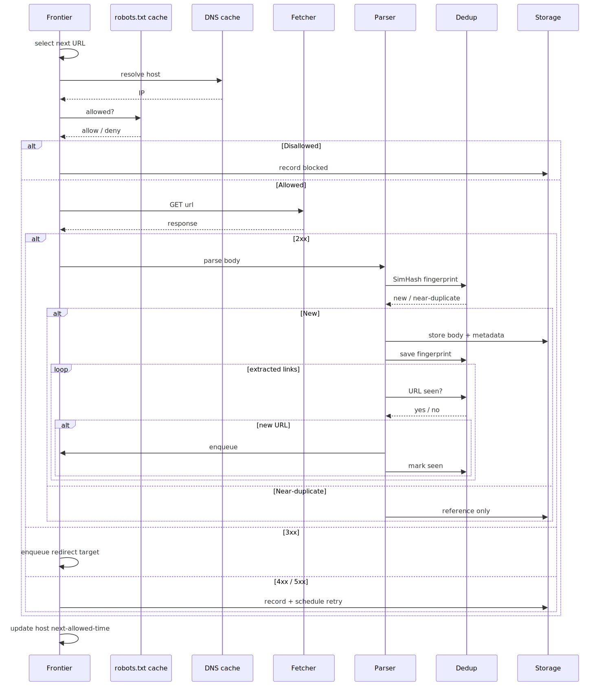
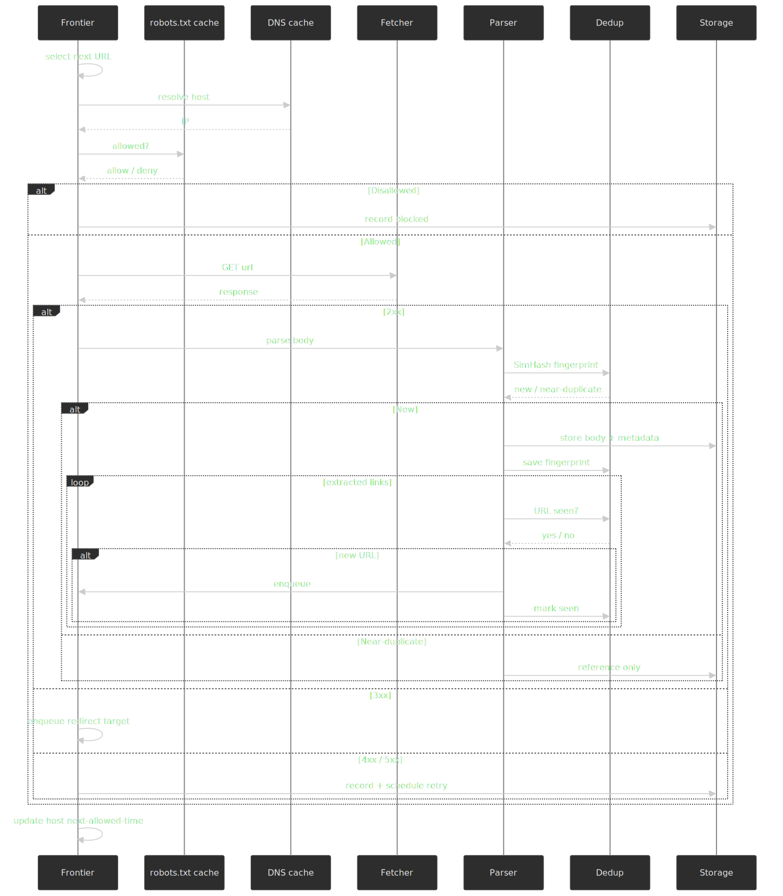

The same flow as a stages pipeline makes the two-layer dedup explicit — URL-level Bloom in front of the persistent URL store, content-level SimHash in front of object storage:


### Distributed URL distribution


The number of partitions is a hard ceiling on parallelism — pick it once, generously (256 is a common starting point), and never reduce it.

## API design

These are internal service APIs, not public ones. Authentication is an internal service token; everything is JSON for diff-friendly ops.

### Submit URLs to frontier

`POST /api/v1/frontier/urls`

```json title="POST /api/v1/frontier/urls"
{
  "crawl_id": "crawl-2026-04-21",
  "urls": [
    { "url": "https://example.com/page1", "priority": 0.85, "source_url": "https://example.com/", "depth": 1, "discovered_at": "2026-04-21T10:30:00Z" },
    { "url": "https://example.com/page2", "priority": 0.72, "source_url": "https://example.com/", "depth": 1, "discovered_at": "2026-04-21T10:30:00Z" }
  ]
}
```

```json title="202 Accepted"
{ "accepted": 2, "rejected": 0, "duplicates": 0 }
```

URLs are submitted in **batches of 100–1,000** to amortise Kafka producer overhead. The frontier deduplicates and prioritises asynchronously.

### Pull next URLs (long-poll)

`GET /api/v1/frontier/next?worker_id=...&batch_size=100&timeout_ms=5000`

```json title="200 OK"
{
  "urls": [
    {
      "url": "https://example.com/page1",
      "priority": 0.85,
      "host": "example.com",
      "ip": "93.184.216.34",
      "robots_rules": { "allowed": true, "crawl_delay": null }
    }
  ],
  "lease_id": "lease-abc123",
  "lease_expires_at": "2026-04-21T10:35:00Z"
}
```

Each batch is **leased**; a worker that fails to report results before the lease expires loses the lease and the URLs are reassigned. This is the standard pattern for at-least-once delivery in worker-pool systems.

### Report results

`POST /api/v1/frontier/results`

```json title="POST /api/v1/frontier/results"
{
  "lease_id": "lease-abc123",
  "results": [
    { "url": "https://example.com/page1", "status": "success", "http_status": 200, "content_type": "text/html", "content_length": 45230, "content_hash": "a1b2c3d4...", "simhash": "0x1234567890abcdef", "fetch_time_ms": 234, "links_found": 47, "is_duplicate": false },
    { "url": "https://other.com/page2", "status": "error", "http_status": 503, "error": "Service Unavailable", "retry_after": 300 }
  ]
}
```

### Crawl statistics

`GET /api/v1/stats` returns an envelope with discovered/queued/fetched/failed counts, current/average/peak throughput, host counts, storage usage, and worker liveness. Nothing exotic; ship it to a time-series store (Prometheus, InfluxDB, TimescaleDB) and you have a dashboard.

## Data modelling

### URL metadata

PostgreSQL holds the slow-changing metadata; Kafka holds the in-flight queue.

```sql title="urls.sql" collapse={1-3, 35-45}
CREATE TABLE urls (
    id BIGSERIAL PRIMARY KEY,
    url_hash BYTEA NOT NULL,         -- SHA-256 of normalised URL (32 B)
    url TEXT NOT NULL,
    normalized_url TEXT NOT NULL,

    host VARCHAR(255) NOT NULL,
    host_hash INT NOT NULL,          -- partition key
    depth SMALLINT DEFAULT 0,
    source_url_id BIGINT REFERENCES urls(id),
    discovered_at TIMESTAMPTZ DEFAULT NOW(),

    priority REAL DEFAULT 0.5,
    last_fetched_at TIMESTAMPTZ,
    next_fetch_at TIMESTAMPTZ,
    fetch_count INT DEFAULT 0,

    last_status_code SMALLINT,
    last_content_hash BYTEA,
    last_simhash BIGINT,
    content_length INT,
    content_type VARCHAR(100),

    state VARCHAR(20) DEFAULT 'pending',
        -- pending | queued | fetching | completed | failed | blocked

    CONSTRAINT url_hash_unique UNIQUE (url_hash)
);

CREATE INDEX idx_urls_host ON urls(host_hash, host);
CREATE INDEX idx_urls_state ON urls(state, next_fetch_at)
    WHERE state IN ('pending', 'queued');
CREATE INDEX idx_urls_refetch ON urls(next_fetch_at)
    WHERE state = 'completed' AND next_fetch_at IS NOT NULL;
```

The unique constraint is on `url_hash`, not `url`: a SHA-256 fits any URL into a fixed 32 bytes, indexes stay tight, and the same hash is reused by the Bloom filter.

### robots.txt cache

```sql title="robots_cache.sql"
CREATE TABLE robots_cache (
    host VARCHAR(255) PRIMARY KEY,
    fetched_at TIMESTAMPTZ NOT NULL,
    expires_at TIMESTAMPTZ NOT NULL, -- ≤ fetched_at + 24h per RFC 9309
    status_code SMALLINT NOT NULL,
    content TEXT,                    -- raw, capped at 500 KiB
    parsed_rules JSONB,              -- pre-parsed for fast lookup
    crawl_delay INT,                 -- non-standard, advisory
    sitemaps TEXT[],
    error_message TEXT
);

CREATE INDEX idx_robots_expires ON robots_cache(expires_at);
```

### Content storage

Page bodies belong in object storage (S3 / MinIO / SeaweedFS); Postgres holds extracted metadata and fingerprints. Partition the metadata table by fetch month so old data can be detached cheaply.

```sql title="page_content.sql" collapse={1-3, 25-35}
CREATE TABLE page_content (
    id BIGSERIAL PRIMARY KEY,
    url_id BIGINT NOT NULL REFERENCES urls(id),
    fetch_id BIGINT NOT NULL,

    raw_content_key TEXT NOT NULL,   -- S3 object key, gzip-compressed
    content_length INT NOT NULL,
    content_type VARCHAR(100),
    charset VARCHAR(50),

    title TEXT,
    meta_description TEXT,
    canonical_url TEXT,
    language VARCHAR(10),

    content_hash BYTEA NOT NULL,
    simhash BIGINT NOT NULL,

    fetched_at TIMESTAMPTZ NOT NULL,
    http_date TIMESTAMPTZ,
    last_modified TIMESTAMPTZ
);

CREATE INDEX idx_content_simhash ON page_content(simhash);
CREATE INDEX idx_content_hash ON page_content(content_hash);
```

### Store selection

| Data                 | Store                | Why                                       |
| -------------------- | -------------------- | ----------------------------------------- |
| In-flight URL queue  | Kafka                | Durable, partitioned, replayable, rebalances on consumer churn |
| URL metadata         | PostgreSQL           | Indexed range queries, ACID, partition pruning |
| URL Bloom filter     | Redis (`BF.*`) or in-process | O(1) lookup; small enough to fit in memory at billions |
| robots.txt cache     | Redis                | TTL-native, hot path lookup               |
| Page bodies          | Object storage (S3)  | Cheap, durable, bandwidth-priced for archival |
| Content fingerprints | PostgreSQL + Redis   | Persistent + warm-set lookup              |
| Crawl metrics        | TimescaleDB / InfluxDB / Prometheus | Time-series         |
| Web graph            | Postgres / Neo4j     | Link analysis (PageRank, hub/authority)   |

### Partitioning

- **URL DB shard key**: `host_hash`. Co-locates a host's URLs and matches the Kafka partitioning so each crawler's hot keys live on one shard.
- **Kafka topic**: 256 partitions keyed by `host_hash` — enough to scale to 256 crawlers without re-partitioning.
- **Content table**: monthly partitions on `fetched_at` so cold data can be detached and archived without a vacuum storm.

## Low-level design

### URL frontier — dual-queue mechanics


The selection algorithm in code (TypeScript shape, JVM/Python equivalents are mechanical translations):

```typescript title="frontier.ts" collapse={1-15, 75-95}
interface FrontierConfig {
  numFrontQueues: number      // F, typically 10–20
  numBackQueues: number       // B ≈ 3 × crawler threads
  defaultPolitenessDelay: number // ms between requests to same host
  maxBackQueueSize: number
}

interface URLEntry {
  url: string
  normalizedUrl: string
  host: string
  priority: number            // 0..1
  depth: number
  discoveredAt: Date
}

class URLFrontier {
  private frontQueues: PriorityQueue<URLEntry>[]
  private backQueues: Map<string, HostQueue>
  private hostToBackQueue: Map<string, number>
  private backQueueHeap: MinHeap<BackQueueEntry>

  constructor(private config: FrontierConfig, private robotsCache: RobotsCache) {
    this.frontQueues = Array(config.numFrontQueues)
      .fill(null)
      .map(() => new PriorityQueue<URLEntry>((a, b) => b.priority - a.priority))
    this.backQueues = new Map()
    this.hostToBackQueue = new Map()
    this.backQueueHeap = new MinHeap((a, b) => a.nextAllowedTime - b.nextAllowedTime)
  }

  async addURL(entry: URLEntry): Promise<void> {
    const idx = Math.floor(entry.priority * (this.config.numFrontQueues - 1))
    this.frontQueues[idx].enqueue(entry)
    this.ensureBackQueue(entry.host)
  }

  async getNext(): Promise<URLEntry | null> {
    const now = Date.now()
    while (this.backQueueHeap.size() > 0) {
      const top = this.backQueueHeap.peek()
      if (top.nextAllowedTime > now) return null  // nothing ready

      const back = this.backQueues.get(top.host)
      if (back && back.size() > 0) {
        const url = back.dequeue()
        this.backQueueHeap.extractMin()
        top.nextAllowedTime = now + this.getPolitenessDelay(top.host)
        this.backQueueHeap.insert(top)
        this.refillBackQueue(top.host)
        return url
      }
      this.backQueueHeap.extractMin()
    }
    return null
  }

  private refillBackQueue(host: string): void {
    const back = this.backQueues.get(host)
    if (!back || back.size() >= 10) return
    for (const front of this.frontQueues) {
      const url = front.findAndRemove((e) => e.host === host)
      if (url) {
        back.enqueue(url)
        if (back.size() >= 10) break
      }
    }
  }

  private getPolitenessDelay(host: string): number {
    return this.robotsCache.getCrawlDelay(host) ?? this.config.defaultPolitenessDelay
  }
}
```

> [!TIP]
> The classical Mercator policy is **adaptive**: wait `10 × t_last_fetch` before contacting the same host again, where `t_last_fetch` is the wall-clock duration of the last fetch[^crawl-delay-wiki]. This bakes server health into the politeness delay automatically — slow hosts naturally back off — and is far better than a fixed 1-second floor.

### Priority calculation

```typescript title="priority.ts" collapse={1-5, 30-45}
interface PriorityFactors {
  pageRank: number          // 0..1, link-graph score
  domainAuthority: number   // 0..1, host-level quality
  changeFrequency: number   // 0..1, how often content changes
  depth: number             // distance from seed
  freshness: number         // 0..1, based on staleness of last fetch
}

function calculatePriority(f: PriorityFactors): number {
  const w = { pageRank: 0.3, domainAuthority: 0.25, changeFrequency: 0.2, depth: 0.15, freshness: 0.1 }
  const depthScore = Math.max(0, 1 - f.depth * 0.1)  // -10% per hop
  const p =
    w.pageRank * f.pageRank +
    w.domainAuthority * f.domainAuthority +
    w.changeFrequency * f.changeFrequency +
    w.depth * depthScore +
    w.freshness * f.freshness
  return Math.max(0, Math.min(1, p))
}
```

The exact weights are application-specific; what matters is that priority is monotone and bounded to `[0, 1]` so the front-queue index calculation is deterministic.

### URL normalisation

Different URL strings can name the same resource. RFC 3986 §6 defines a syntax-based normalisation that is the conservative baseline[^rfc3986]:

- Lowercase the scheme and host.
- Remove the default port (`:80` for `http`, `:443` for `https`).
- Apply `remove_dot_segments` to the path (collapse `./` and `../`).
- Decode percent-encoded triplets that map to unreserved characters; normalise hex digits to uppercase.

Crawler-specific additions go beyond §6 and are **lossy** — apply them only when they are correct for your corpus:

- Strip the `#fragment` (no impact on the resource the server returns).
- Sort query parameters alphabetically.
- Remove a trailing `/` on non-root paths.
- Drop `index.html` / `index.php` / `default.aspx` from path tails.
- Lowercasing or stripping `www.` is **not safe** — many sites serve different content on the bare apex.

```typescript title="normalize-url.ts" collapse={1-10, 55-70}
import { URL } from "url"

interface NormalizationOptions {
  removeFragment: boolean
  removeDefaultPorts: boolean
  removeTrailingSlash: boolean
  removeIndexFiles: boolean
  sortQueryParams: boolean
  lowercaseHost: boolean
  removeWWW: boolean         // off by default; lossy
  decodeUnreserved: boolean
}

const DEFAULT_OPTIONS: NormalizationOptions = {
  removeFragment: true,
  removeDefaultPorts: true,
  removeTrailingSlash: true,
  removeIndexFiles: true,
  sortQueryParams: true,
  lowercaseHost: true,
  removeWWW: false,
  decodeUnreserved: true,
}

function normalizeURL(urlString: string, options = DEFAULT_OPTIONS): string {
  const url = new URL(urlString)
  url.protocol = url.protocol.toLowerCase()
  if (options.lowercaseHost) url.hostname = url.hostname.toLowerCase()
  if (options.removeDefaultPorts) {
    if ((url.protocol === "http:" && url.port === "80") || (url.protocol === "https:" && url.port === "443")) {
      url.port = ""
    }
  }
  if (options.removeFragment) url.hash = ""
  if (options.sortQueryParams && url.search) {
    const params = new URLSearchParams(url.search)
    url.search = new URLSearchParams([...params.entries()].sort()).toString()
  }
  if (options.removeTrailingSlash && url.pathname !== "/") {
    url.pathname = url.pathname.replace(/\/+$/, "")
  }
  if (options.removeIndexFiles) {
    url.pathname = url.pathname.replace(/\/(index|default)\.(html?|php|asp)$/i, "/")
  }
  if (options.decodeUnreserved) {
    url.pathname = decodeURIComponent(url.pathname)
      .split("/")
      .map((segment) => encodeURIComponent(segment))
      .join("/")
  }
  return url.toString()
}
```

### URL deduplication — Bloom filter

A Bloom filter answers "have I seen this URL?" in O(1) with no false negatives — the property a crawler needs to avoid double-fetching. The optimal sizing[^bloom-wiki] for `n` items at false-positive rate `p`:

$$
m = -\frac{n \ln p}{(\ln 2)^2}, \qquad k = \frac{m}{n} \ln 2
$$

For 1 B URLs at `p = 0.01`: `m ≈ 9.585 × 10⁹` bits ≈ **1.2 GB**, `k ≈ 7`. Use Kirsch–Mitzenmacher double-hashing — `g_i(x) = h_1(x) + i·h_2(x) mod m` — to derive `k` positions from two hash functions, not `k` independent ones.

```typescript title="bloom-filter.ts" collapse={1-10, 50-65}
import { createHash } from "crypto"

class BloomFilter {
  private bitArray: Uint8Array
  private numHashFunctions: number
  private size: number

  constructor(expectedElements: number, falsePositiveRate = 0.01) {
    this.size = Math.ceil((-expectedElements * Math.log(falsePositiveRate)) / Math.log(2) ** 2)
    this.numHashFunctions = Math.ceil((this.size / expectedElements) * Math.log(2))
    this.bitArray = new Uint8Array(Math.ceil(this.size / 8))
  }

  private getHashes(item: string): number[] {
    const h1 = this.hash(item, 0)
    const h2 = this.hash(item, 1)
    return Array(this.numHashFunctions)
      .fill(0)
      .map((_, i) => Math.abs((h1 + i * h2) % this.size))
  }

  private hash(item: string, seed: number): number {
    return createHash("md5").update(`${seed}:${item}`).digest().readUInt32LE(0)
  }

  add(item: string): void {
    for (const h of this.getHashes(item)) {
      this.bitArray[Math.floor(h / 8)] |= 1 << (h % 8)
    }
  }

  mightContain(item: string): boolean {
    for (const h of this.getHashes(item)) {
      if ((this.bitArray[Math.floor(h / 8)] & (1 << (h % 8))) === 0) return false
    }
    return true   // probably; check persistent store on positives
  }
}
```

> [!IMPORTANT]
> A Bloom filter has **no false negatives** but **does have false positives**. Treat positives as "maybe seen — confirm against the URL store". If you skip the confirmation step you will lose URLs and have no way of knowing.

### Content deduplication — SimHash

SimHash, introduced by Charikar (2002) and applied to web crawling at Google by Manku, Jain, and Das Sarma (2007), reduces a document to a fixed-width fingerprint where small bit-Hamming distances correspond to high textual similarity[^simhash]. The 2007 paper validates that **64-bit fingerprints** with a **3-bit Hamming-distance threshold** are a good operating point on a corpus of **8 billion pages**.

```typescript title="simhash.ts" collapse={1-10, 60-80}
import { createHash } from "crypto"

function simhash(text: string, hashBits: number = 64): bigint {
  const tokens = tokenize(text)
  const shingles = generateShingles(tokens, 3) // 3-word shingles

  const v = new Array(hashBits).fill(0)
  for (const shingle of shingles) {
    const hash = hashShingle(shingle, hashBits)
    for (let i = 0; i < hashBits; i++) {
      v[i] += ((hash >> BigInt(i)) & 1n) ? 1 : -1
    }
  }

  let fingerprint = 0n
  for (let i = 0; i < hashBits; i++) {
    if (v[i] > 0) fingerprint |= 1n << BigInt(i)
  }
  return fingerprint
}

function tokenize(text: string): string[] {
  return text.toLowerCase().replace(/[^\w\s]/g, " ").split(/\s+/).filter((w) => w.length > 2)
}

function generateShingles(tokens: string[], n: number): string[] {
  const out: string[] = []
  for (let i = 0; i <= tokens.length - n; i++) out.push(tokens.slice(i, i + n).join(" "))
  return out
}

function hashShingle(shingle: string, bits: number): bigint {
  const hash = createHash("sha256").update(shingle).digest("hex")
  return BigInt("0x" + hash.slice(0, bits / 4))
}

function hammingDistance(a: bigint, b: bigint): number {
  let xor = a ^ b
  let d = 0
  while (xor > 0n) { d += Number(xor & 1n); xor >>= 1n }
  return d
}

const DUPLICATE_THRESHOLD = 3

function isNearDuplicate(newFp: bigint, existing: bigint[]): boolean {
  for (const e of existing) if (hammingDistance(newFp, e) <= DUPLICATE_THRESHOLD) return true
  return false
}
```

A naive per-fetch scan over a billion fingerprints is hopeless. The 2007 paper's contribution is the **permuted-table indexing scheme** — store multiple permutations of each fingerprint sorted, and a candidate set lookup becomes O(log n) bounded by the number of tables[^simhash]. Locality-sensitive hashing variants (e.g. MinHash with banding) achieve similar properties for set-similarity rather than bit-Hamming similarity.

### robots.txt parsing

```typescript title="robots-txt.ts" collapse={1-10, 80-100}
interface RobotsRule { path: string; allow: boolean }
interface RobotsRules { rules: RobotsRule[]; crawlDelay?: number; sitemaps: string[] }

function parseRobotsTxt(content: string, userAgent: string): RobotsRules {
  const lines = content.split("\n").map((l) => l.trim())
  const rules: RobotsRule[] = []
  let crawlDelay: number | undefined
  const sitemaps: string[] = []

  let currentUserAgents: string[] = []
  let inRelevantBlock = false

  for (const line of lines) {
    if (line.startsWith("#") || line === "") continue
    const [directive, ...valueParts] = line.split(":")
    const value = valueParts.join(":").trim()
    switch (directive.toLowerCase()) {
      case "user-agent":
        if (currentUserAgents.length > 0 && inRelevantBlock) break
        currentUserAgents.push(value.toLowerCase())
        inRelevantBlock = matchesUserAgent(value, userAgent)
        break
      case "allow":      if (inRelevantBlock) rules.push({ path: value, allow: true });  break
      case "disallow":   if (inRelevantBlock) rules.push({ path: value, allow: false }); break
      case "crawl-delay": if (inRelevantBlock) crawlDelay = parseInt(value, 10);          break
      case "sitemap":    sitemaps.push(value); break
    }
  }

  // RFC 9309 §2.2.2: longest matching path wins
  rules.sort((a, b) => b.path.length - a.path.length)
  return { rules, crawlDelay, sitemaps }
}

function matchesUserAgent(pattern: string, userAgent: string): boolean {
  const p = pattern.toLowerCase(), u = userAgent.toLowerCase()
  return p === "*" || u.includes(p)
}

function isAllowed(rules: RobotsRules, path: string): boolean {
  for (const r of rules.rules) if (pathMatches(r.path, path)) return r.allow
  return true   // §2.2.2: implicit allow if no rule matches
}

function pathMatches(pattern: string, path: string): boolean {
  let regex = pattern.replace(/[.+?^${}()|[\]\\]/g, "\\$&").replace(/\*/g, ".*").replace(/\$$/, "$")
  if (!pattern.endsWith("$")) regex = `^${regex}`
  return new RegExp(regex).test(path)
}
```

> [!WARNING]
> `Crawl-delay` is not part of RFC 9309. Bing treats it as "one request per N-second window", Yandex as a fixed delay between requests, and Google ignores it entirely[^crawl-delay-wiki]. Honour it for compatibility but do not assume any particular semantics.

### Spider-trap defences

Crawler-hostile URL spaces — calendars extending into the year 9999, session IDs minted on every request, repeating path segments — can generate unbounded unique URLs. Defences are heuristic and conservative:

```typescript title="spider-trap.ts" collapse={1-12, 60-80}
interface TrapConfig {
  maxURLLength: number
  maxPathDepth: number
  patternThreshold: number   // path segment repetitions
  futureDateYears: number    // years beyond now to flag as calendar trap
}

const DEFAULT: TrapConfig = { maxURLLength: 2000, maxPathDepth: 15, patternThreshold: 3, futureDateYears: 2 }

class SpiderTrapDetector {
  constructor(private config = DEFAULT) {}

  isTrap(url: string): { isTrap: boolean; reason?: string } {
    try {
      const u = new URL(url)
      if (url.length > this.config.maxURLLength) return { isTrap: true, reason: "url too long" }
      const segs = u.pathname.split("/").filter(Boolean)
      if (segs.length > this.config.maxPathDepth) return { isTrap: true, reason: "path too deep" }
      const repeating = this.detectRepeatingPattern(segs)
      if (repeating) return { isTrap: true, reason: `repeating segment: ${repeating}` }
      if (this.isCalendarTrap(u.pathname)) return { isTrap: true, reason: "far-future date" }
      if (this.hasSessionID(u.search)) return { isTrap: true, reason: "session id in url" }
      return { isTrap: false }
    } catch {
      return { isTrap: true, reason: "invalid url" }
    }
  }

  private detectRepeatingPattern(segs: string[]): string | null {
    for (let len = 1; len <= segs.length / 3; len++) {
      const pat = segs.slice(0, len).join("/")
      let reps = 0
      for (let i = 0; i <= segs.length - len; i += len) {
        if (segs.slice(i, i + len).join("/") === pat) reps++
      }
      if (reps >= this.config.patternThreshold) return pat
    }
    return null
  }

  private isCalendarTrap(pathname: string): boolean {
    const m = pathname.match(/\/(\d{4})\/(\d{1,2})\/(\d{1,2})/)
    return !!m && parseInt(m[1], 10) > new Date().getFullYear() + this.config.futureDateYears
  }

  private hasSessionID(search: string): boolean {
    return [/[?&](session_?id|sid|phpsessid|jsessionid|aspsessionid)=/i, /[?&][a-z]+=[a-f0-9]{32,}/i]
      .some((re) => re.test(search))
  }
}
```

Stronger production defences add a per-host **URL-discovery rate limit** (no more than N new URLs per host per window) and a **diminishing-returns budget** (cap pages per host at, say, the 99th percentile of comparable hosts).

### Sitemap discovery

Per the [Sitemaps protocol](https://www.sitemaps.org/protocol.html), each sitemap file is capped at **50,000 URLs and 50 MB uncompressed**; larger sites use a sitemap index that itself can list up to 50,000 children[^sitemaps]. The crawler should discover sitemaps via the `Sitemap:` directive in `robots.txt` (RFC 9309 explicitly allows it) and prioritise URLs found in sitemaps because they are usually the site's own canonical inventory.

## Operations

### Monitoring surface

Operators care about a small set of signals; everything else is forensic. Ship these to a time-series backend with per-host slicing:

- `urls_per_second{state=fetched|failed|duplicate|blocked}` — the headline.
- `frontier_depth{queue=front|back}` — leading indicator of scheduler stall.
- `host_concurrency{host}` — proves politeness is working.
- `bloom_false_positive_observed_rate` — early warning that the filter is full.
- `render_queue_depth` and `render_p95_latency_ms` — JS rendering is the most common bottleneck.
- `robots_cache_age_p95_seconds` — must stay below 24 h.

A small operator UI with a per-host search and a per-URL inspect view ("show me what I last fetched, when, and what robots said") pays for itself the first time you triage a publisher complaint.

### Failure modes

| Failure                         | Detection                                | Recovery                                                 |
| :------------------------------ | :--------------------------------------- | :------------------------------------------------------- |
| Crawler node crash              | Kafka heartbeat / lease expiry           | Consumer-group rebalance reassigns partitions; leases time out and URLs are re-pulled |
| Kafka partition leader loss     | MSK metric / consumer error              | Replica election; producer retries with idempotency      |
| Bloom filter saturated          | Observed FP rate > target                | Roll a new filter (double-buffered), drain old, swap     |
| Hot-host saturation             | `host_concurrency` rail-pinned           | Apply backoff; widen back-queue refill rate              |
| robots.txt 5xx (unreachable)    | `robots_status_code` per host            | Treat as full Disallow immediately (§2.3.1.4); after ~30 days MAY relax to "unavailable" or keep cached copy |
| Render queue runaway            | `render_queue_depth` slope               | Drop to HTML-only for low-priority URLs; cap render rate |

### Recrawl scheduling

A simple time-based schedule is the default — `next_fetch_at = last_fetched_at + interval(host_class)` — but the better signal is observed change frequency. If `content_hash` changed between the last two fetches, halve the interval; if it did not, double it (capped). This is essentially exponential adaptation of the recrawl cadence to actual page churn, and avoids spending bandwidth on static archives.

## Infrastructure

### Cloud-agnostic targets

| Component        | Requirement                              | Options                                  |
| :--------------- | :--------------------------------------- | :--------------------------------------- |
| Message queue    | Durable, partitioned, high throughput    | Kafka, Apache Pulsar, Redpanda           |
| URL DB           | High write throughput, range queries     | PostgreSQL, CockroachDB, Cassandra       |
| Bloom store      | Low-latency membership test              | Redis Bloom, in-process per node         |
| Content store    | Cheap, durable, object semantics         | S3 / MinIO / SeaweedFS                   |
| Coordination     | Leader election, config                  | ZooKeeper, etcd, Consul                  |
| DNS cache        | Low-latency recursive resolver           | Unbound, PowerDNS, Knot Resolver         |
| Metrics          | Time-series at high cardinality          | Prometheus, InfluxDB, TimescaleDB        |

### AWS reference


| Component       | AWS Service       | Configuration                                |
| --------------- | ----------------- | -------------------------------------------- |
| Message queue   | Amazon MSK        | kafka.m5.2xlarge × 6, 256 partitions         |
| Crawler nodes   | EC2 c6i.2xlarge   | 8 vCPU / 16 GB, ASG 5–50                     |
| Parser nodes    | EC2 c6i.xlarge    | 4 vCPU / 8 GB, ASG 2–20                      |
| JS renderer     | EC2 c6i.4xlarge   | 16 vCPU / 32 GB, spot                        |
| URL DB          | RDS PostgreSQL    | db.r6g.2xlarge, Multi-AZ, 2 TB gp3           |
| Bloom + cache   | ElastiCache Redis | cache.r6g.xlarge × 4 nodes                   |
| Content store   | S3 Standard-IA    | Intelligent-Tiering after 30 days            |

### Cost order-of-magnitude (1 B pages/month, AWS list price)

| Resource                          | Monthly Cost   |
| --------------------------------- | -------------- |
| MSK (6 × m5.2xlarge)              | ~$3,600        |
| Crawler EC2 (15 × c6i.2xlarge)    | ~$5,400        |
| Parser EC2 (10 × c6i.xlarge)      | ~$1,800        |
| Renderer EC2 spot (5 × c6i.4xlarge) | ~$1,500      |
| RDS PostgreSQL                    | ~$1,200        |
| ElastiCache Redis                 | ~$800          |
| S3 storage (50 TB compressed)     | ~$1,150        |
| Data egress (~10 TB)              | ~$900          |
| **Total**                         | **~$16,350**   |

Roughly **$16 per million pages**, dominated by compute (crawler ASG) and Kafka. These are list-price, single-region, list-pricing numbers — a serious operator with reserved instances and a self-hosted Kafka tier will cut this in half.

## Practical takeaways

- **Pick host-keyed partitioning early.** Everything good (local politeness, deterministic dedup, predictable failure recovery) follows from it. Everything bad (cross-node coordination, global locks) follows from not picking it.
- **Measure politeness in `t_last_fetch` units, not seconds.** The Mercator `10 × t` policy adapts to server health for free; a fixed 1 s/host floor either crawls too fast for tiny servers or too slow for cloud-scale CDNs.
- **Deduplicate twice, at different costs.** A Bloom filter on URLs (fits in memory, no false negatives) and SimHash on content (catches boilerplate variants) cover the two failure modes — re-fetching the same page, and storing the same page under different URLs.
- **Render queue is a separate fault domain.** Headless Chromium will eat the whole budget if you let it. Run it as its own ASG, on spot, behind a separate queue with a hard concurrency cap.
- **Treat RFC 9309 as a hard contract.** 500 KiB minimum parse, ≤ 24 h cache, longest-match precedence, no special semantics for `Crawl-delay`. Anything else is folklore.
- **Anchor sizing to Common Crawl, not "the web".** "How many websites exist" has answers spread across an order of magnitude; "how many pages does Common Crawl publish per month" is an unambiguous operational denominator.

## Appendix

### Prerequisites

Distributed-systems fundamentals (consistent hashing, message queues, leases), basic database design (indexing, sharding, partitioning), HTTP wire-level details (status codes, redirects, conditional requests), and probabilistic data structures (Bloom filters, MinHash / SimHash).

### Terminology

- **URL frontier** — the data structure the crawler uses to choose the next URL, balancing priority against politeness.
- **Politeness** — rate-limiting per host so the crawler does not act like a denial-of-service attack.
- **robots.txt** — the file at `/robots.txt` that declares crawl rules; standardised in RFC 9309.
- **SimHash** — locality-sensitive hash whose output bit-distance correlates with input similarity; used for near-duplicate detection.
- **Bloom filter** — probabilistic set with no false negatives but tunable false positives; used for "have I seen this URL?".
- **Spider trap** — a URL pattern that yields infinite unique URLs (calendars, session IDs, repeating paths).
- **Crawl-delay** — non-standard `robots.txt` directive specifying a delay between fetches; Google ignores it.
- **Back queue / front queue** — Mercator's two-tier frontier: front = priority bucket, back = per-host FIFO.

### Summary

- The frontier is two queues — *front* for priority, *back* for politeness — with a min-heap on `next_allowed_time` driving worker selection. Mercator's heuristic of `B ≈ 3 × threads` is still a sensible default[^mercator-frontier].
- URL dedup is a Bloom filter with a persistent backing store on positives. 1 B URLs at 1% FP fits in ~1.2 GB at 7 hash positions[^bloom-wiki].
- Content dedup is SimHash with a 3-bit Hamming threshold on 64-bit fingerprints, the operating point validated by Manku, Jain, and Das Sarma on an 8 B-page corpus[^simhash].
- Sharding by host hash is the choice that makes everything else work: politeness is local, dedup is deterministic, recovery is a Kafka rebalance. UbiCrawler's identifier-seeded consistent hashing remains the cleanest formulation[^ubicrawler].
- Common Crawl's recent monthly archives are ~2 B pages from ~45 M hosts at ~350 TiB uncompressed[^cc-mar26][^cc-feb26]; Google's index sits around 400 B documents per Pandu Nayak's 2020 testimony[^google-index].

### References

- [RFC 9309 — Robots Exclusion Protocol](https://www.rfc-editor.org/rfc/rfc9309.html)
- [RFC 3986 — URI Generic Syntax, §6 (normalization)](https://datatracker.ietf.org/doc/html/rfc3986#section-6)
- [Sitemaps Protocol 0.90](https://www.sitemaps.org/protocol.html)
- [Mercator: A Scalable, Extensible Web Crawler — Heydon & Najork (1999)](https://link.springer.com/article/10.1023/A:1019213109274)
- [The URL Frontier — Stanford IR Book §20.2.3](https://nlp.stanford.edu/IR-book/html/htmledition/the-url-frontier-1.html)
- [UbiCrawler: A Scalable Fully Distributed Web Crawler — Boldi, Codenotti, Santini, Vigna (2004)](https://onlinelibrary.wiley.com/doi/10.1002/spe.587)
- [Detecting Near-Duplicates for Web Crawling — Manku, Jain, Das Sarma (WWW 2007)](https://research.google/pubs/pub33026/)
- [Common Crawl — March 2026 archive notes](https://commoncrawl.org/blog/march-2026-crawl-archive-now-available)
- [Common Crawl — February 2026 archive notes](https://commoncrawl.org/blog/february-2026-crawl-archive-now-available)
- [Google Search Central — Understand JavaScript SEO basics](https://developers.google.com/search/docs/crawling-indexing/javascript/javascript-seo-basics)
- [Google's Index Size Revealed: 400 Billion Docs — Zyppy summary of DOJ exhibit](https://zyppy.com/seo/google-index-size/)

[^rfc9309]: [RFC 9309 — Robots Exclusion Protocol](https://www.rfc-editor.org/rfc/rfc9309.html), §§2.2.2, 2.3.1.4, 2.4, 2.5.

[^rfc3986]: [RFC 3986 — Uniform Resource Identifier (URI): Generic Syntax, §6 Normalization and Comparison](https://datatracker.ietf.org/doc/html/rfc3986#section-6).

[^mercator-frontier]: Heydon & Najork, [Mercator: A Scalable, Extensible Web Crawler](https://link.springer.com/article/10.1023/A:1019213109274), *World Wide Web* 2(4), 1999. The dual-queue frontier and the `B ≈ 3 × threads` heuristic are summarised in the [Stanford IR Book §20.2.3](https://nlp.stanford.edu/IR-book/html/htmledition/the-url-frontier-1.html).

[^simhash]: Manku, Jain, Das Sarma, [Detecting Near-Duplicates for Web Crawling](https://research.google/pubs/pub33026/), WWW 2007. 64-bit fingerprints with `k = 3` Hamming threshold validated on an 8 B-page Google corpus.

[^ubicrawler]: Boldi, Codenotti, Santini, Vigna, [UbiCrawler: A Scalable Fully Distributed Web Crawler](https://onlinelibrary.wiley.com/doi/10.1002/spe.587), *Software: Practice and Experience* 34(8), 2004.

[^cc-mar26]: Common Crawl Foundation, [March 2026 Crawl Archive Now Available](https://commoncrawl.org/blog/march-2026-crawl-archive-now-available) — 1.97 B pages, 44 M hosts, 344.64 TiB uncompressed.

[^cc-feb26]: Common Crawl Foundation, [February 2026 Crawl Archive Now Available](https://commoncrawl.org/blog/february-2026-crawl-archive-now-available) — 2.1 B pages, 45.5 M hosts, 363 TiB uncompressed.

[^google-index]: Cyrus Shepard, [Google's Index Size Revealed: 400 Billion Docs](https://zyppy.com/seo/google-index-size/) — analysis of Pandu Nayak's 2020 testimony in *US v. Google*.

[^webcount-hostinger]: Hostinger Tutorials, [How many websites are there in 2026](https://www.hostinger.com/tutorials/how-many-websites-are-there) — ~1.34 B total, ~201 M actively maintained.

[^webcount-da]: DigitalApplied, [Website Statistics 2026: 180+ Facts, Trends, and Data](https://www.digitalapplied.com/blog/website-statistics-2026-facts-trends-data) — ~1.98 B total.

[^bloom-wiki]: [Bloom filter — Wikipedia](https://en.wikipedia.org/wiki/Bloom_filter#Optimal_number_of_hash_functions). Optimal sizing formulas and the Kirsch–Mitzenmacher double-hashing optimisation.

[^crawl-delay-wiki]: [robots.txt — Wikipedia: Crawl-delay directive](https://en.wikipedia.org/wiki/Robots.txt#Crawl-delay_directive); Google explicitly does not honour `Crawl-delay`. Mercator's adaptive `10 × t` politeness policy is summarised in Najork, "[High-Performance Web Crawling](https://www.cs.cornell.edu/courses/cs685/2002fa/mercator.pdf)" (2002).

[^google-js]: Google Search Central, [Understand JavaScript SEO Basics](https://developers.google.com/search/docs/crawling-indexing/javascript/javascript-seo-basics) — separate render queue using the Web Rendering Service (headless Chromium).

[^sitemaps]: [Sitemaps Protocol 0.90](https://www.sitemaps.org/protocol.html) — ≤ 50,000 URLs and ≤ 50 MB uncompressed per file; sitemap index files cap at 50,000 child sitemaps.
