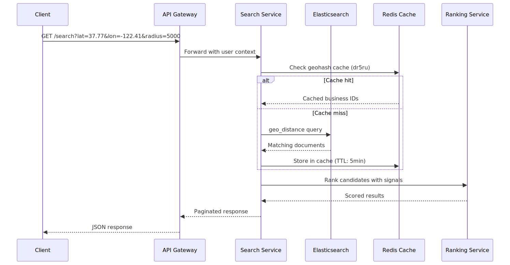
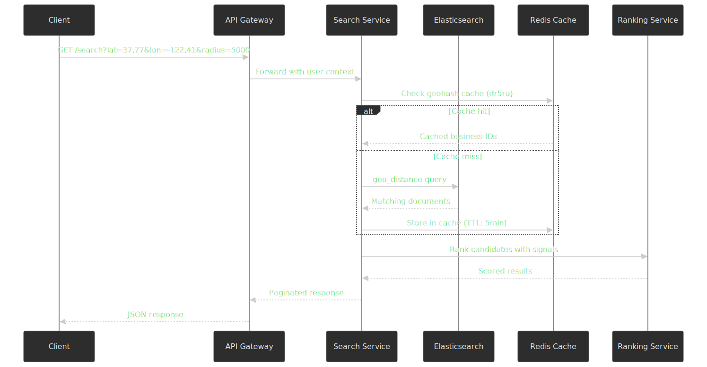

# Design Yelp: Location-Based Business Discovery Platform

A Yelp-shaped proximity service is three loosely-coupled systems pretending to be one product: a geospatial index that answers "what's nearby?", a ranking layer that orders the candidates, and a content platform that ingests reviews, photos, and business edits. The interview question — and the production reality — is how to make those three move together at a 100:1 read/write ratio with a sub-100 ms p99 search budget. This article walks through the indexing trade-offs, an Elasticsearch-shaped reference design, the multi-signal ranking math, the review write path, and the operational footguns that show up at scale.

, and Kafka feeds async workers that close the loop back into the search index.")


## Mental model

Proximity search is unlike text search in one important way: the answer depends on _where_ you are, not just _what_ you typed. The query center moves with every request, so you cannot pre-compute rankings for it; instead you pre-compute spatial **buckets** and rank candidates inside the buckets you touch.

The four moving parts a senior engineer should hold in their head:

1. **Spatial index** — converts a (lat, lon, radius) tuple into a small candidate set. Geohash, quadtree/S2, H3, and BKD-tree-backed engines (Lucene/Elasticsearch) all do this, with different write-vs-read trade-offs.
2. **Filter and rank** — narrow the candidates by category/price/hours, then score them with distance + rating + recency + personalisation.
3. **Source of truth + derived index** — businesses and reviews live in an ACID store; the search index is a derived projection that is allowed to be a few seconds behind.
4. **Write path** — review and business updates use a transactional outbox so the search index, cache, and analytics warehouse stay consistent without distributed transactions.

**Radius search vs k-NN.** Two different question shapes show up in proximity products:

- _Radius search_ — "everything within R metres of P". The candidate count is unbounded; the engine returns a possibly empty set. This is what Yelp / Google Maps "nearby" surfaces, what `ST_DWithin` / Elasticsearch `geo_distance` answer natively, and what most caches assume.
- _k-NN search_ — "the k closest things to P, regardless of distance". The candidate count is bounded; the engine returns exactly k points (or fewer if the index is small). This matches ride-share dispatch ("nearest 5 drivers"), in-vehicle POI ("nearest gas station"), and Elasticsearch's `knn` query with a `geo_point` vector.

In a discovery product, radius search is primary because the user's mental model is "what's nearby". k-NN is the fallback for sparse areas — when fewer than k results land inside R, expand R until you have k or hit a hard cap. Mixing the two paradigms in the same query path is a common source of subtle bugs (k-NN sorted by distance ignores rating; radius search expanded for sparsity needs to be advertised to the UI so "showing nearby" copy can render).

**Real-world frame of reference.** Yelp publishes 330 million cumulative reviews and ~28 million monthly unique mobile devices as of 31 December 2025[^yelp-fast-facts], with 308 million cumulative reviews at the end of 2024[^yelp-2024-pr]. Google Maps is widely cited as indexing more than 200 million businesses and places, although Google does not publish a single canonical figure[^gmaps-200m]. Foursquare's Movement (formerly Pilgrim) SDK ships a global database of ~100M+ POIs and was launched on top of more than 11 billion historical check-ins[^foursquare-pilgrim]. These services demonstrate that sub-100 ms p99 latency is achievable, but only with aggressive caching, denormalisation, and tightly bounded search spaces.

## Requirements

### Functional Requirements

| Feature              | Priority | Description                                 |
| -------------------- | -------- | ------------------------------------------- |
| Nearby search        | Core     | Find businesses within radius of a location |
| Business profiles    | Core     | View business details, hours, attributes    |
| Reviews & ratings    | Core     | Read/write reviews, aggregate ratings       |
| Photos               | Core     | View/upload business photos                 |
| Search by category   | Core     | Filter by cuisine, service type             |
| Search by attributes | High     | Filter by price, hours, amenities           |
| Check-ins            | Medium   | Record visits, see activity                 |
| Bookmarks            | Medium   | Save businesses for later                   |
| Personalization      | Medium   | Recommendations based on history            |
| Business owner tools | Medium   | Claim business, respond to reviews          |

**Scope for this article.** We design the core proximity search, the business data model, and the review pipeline. Check-ins and advanced personalisation are touched on briefly; advertising auctions and business analytics are out of scope.

### Non-Functional Requirements

| Requirement      | Target                                      | Rationale                                                   |
| ---------------- | ------------------------------------------- | ----------------------------------------------------------- |
| Search latency   | p99 < 100 ms                                | User expectation for "instant" results                      |
| Write latency    | p99 < 500 ms                                | Acceptable for review submission                            |
| Availability     | 99.99%                                      | Revenue-critical, user trust                                |
| Read/write ratio | 100:1                                       | Read-heavy workload                                         |
| Data freshness   | < 30 s for reviews, < 5 min for business data | Reviews need quick visibility; business data changes rarely |
| Global coverage  | Multi-region                                | Users travel; businesses are everywhere                     |

### Scale Estimation

These are the planning assumptions for a single, plausible Yelp-shaped tenant — not Yelp's actual numbers. They exist to drive sizing, not to claim accuracy.

**Users.**

- Monthly Active Users (MAU): 100 M
- Daily Active Users (DAU): 30 M
- Peak concurrent users: 3 M (10% of DAU)

**Businesses.**

- Total businesses: 10 M globally
- Active businesses (updated in last year): 5 M
- New businesses per day: 10 K

**Traffic.**

- Search queries: 30 M DAU × 5 searches/day = 150 M searches/day ≈ 1,700 QPS
- Peak search: 3× average ≈ 5,100 QPS
- Business profile views: 30 M × 10 views/day ≈ 3,500 QPS
- Review writes: 30 M × 0.01 reviews/day ≈ 300 K reviews/day ≈ 3.5 writes/sec
- Photo uploads: ~100 K/day

**Storage.**

- Business data: 10 M × 10 KB ≈ 100 GB
- Reviews: 200 M reviews × 2 KB ≈ 400 GB
- Photos: 500 M photos × 500 KB average ≈ 250 TB (object storage)
- Search index: ~50 GB (denormalised business + location data)
- 5-year projection: ~2 PB total (dominated by photos)

## Design Paths

### Path A: Geohash-based indexing

**Best when:** uniform business density, fixed search radius, and operational simplicity matter more than peak performance.

**Architecture:**




**Key characteristics.**

- Geohash interleaves latitude and longitude bits into a base-32 string; cells with a longer common prefix are spatially close ([Wikipedia, Geohash](https://en.wikipedia.org/wiki/Geohash)).
- A 5-character cell is roughly 4.9 km × 4.9 km at the equator, and a 6-character cell is roughly 1.22 km × 0.61 km — width shrinks as you move toward the poles ([OpenSearch geohash-grid table](https://docs.opensearch.org/latest/aggregations/bucket/geohash-grid/), [movable-type.co.uk geohash precision](https://www.movable-type.co.uk/scripts/geohash.html)).
- A query touches the target cell **plus the 8 surrounding cells** to cover points that fall just across a boundary; the final pass re-filters by exact great-circle distance.
- The on-disk index is a flat key-value map: `geohash → [business_id...]`.

**Trade-offs.**

- Simple to implement and debug; nearby queries hit overlapping cache keys.
- Easy to shard by geohash prefix.
- Fixed precision creates density mismatches: a level-6 cell over Manhattan can hold thousands of businesses while the same cell over rural Wyoming holds zero.
- Variable-radius search needs queries at multiple precisions, which inflates work and complicates caching.
- Cell-boundary expansion (the "+8 neighbours" trick) is mandatory and easy to forget.

**Real-world echo.** Uber's [H3 hexagonal hierarchical spatial index](https://www.uber.com/blog/h3/) was developed in part to escape the rectangular distortion and density problems of geohash, but kept the prefix-lookup ergonomics that make geohash so easy to operate. H3 has 16 resolutions and uses an aperture-7 subdivision: each finer resolution has cells with roughly one-seventh the area of the coarser one (edge length scales by $1/\sqrt{7} \approx 0.378$), per the [official H3 cell-statistics table](https://h3geo.org/docs/core-library/restable/). Uniform hexagons make distance and neighbour math much cleaner than geohash rectangles — which is also why H3 is the default choice for **heat-map aggregation** of demand, supply, or visit data.

### Path B: Quadtree / S2 geometry

**Best when:** density varies wildly across regions, the radius is variable, or queries include polygons (delivery zones, contraction-hierarchy tiles).

**Architecture:**




**Key characteristics.**

- Recursively subdivides 2-D space until each leaf cell contains at most N points; dense city blocks descend many levels, sparse rural cells stay shallow.
- Google's [S2 library](http://s2geometry.io/) projects the sphere onto a cube and indexes cells with a Hilbert space-filling curve, so spatially close cells stay numerically close. Cell sizes drop by ~4× per level: level-10 cells average ~81 km² (~9 km on a side) and level-16 cells average ~19,800 m² (~140 m on a side) per the [official S2 cell statistics](http://s2geometry.io/resources/s2cell_statistics.html).
- Cell IDs encode the path from root, so a range scan on cell IDs yields all descendants of an ancestor — useful for region-wide queries.

**Trade-offs.**

- Adapts to density automatically and handles polygon/route queries natively.
- Cache locality is harder because cell sizes vary.
- Tree maintenance under heavy writes is more expensive than a flat geohash bucket.

**Real-world echo.** S2 and H3 are both production-grade choices: S2 is the foundation of Google Maps' geometry layer, while H3 underpins Uber's geofencing and supply/demand heatmaps.

### Path C: BKD-tree / Elasticsearch (Lucene)

**Best when:** queries combine geo with full-text search, attribute filtering, and aggregations — the typical Yelp-shaped workload.

**Architecture:**




**Key characteristics.**

- Since Lucene 6.0, `geo_point` and (since 7.0) `geo_shape` are indexed using **BKD trees** — block-balanced k-d trees, *a variant of k-d trees, not R-trees* — that are highly efficient for multi-dimensional point and bounding-box lookups ([Elastic blog: multi-dimensional points](https://www.elastic.co/blog/lucene-points-6-0), [Elastic blog: BKD-backed geo_shapes](https://www.elastic.co/blog/bkd-backed-geo-shapes-in-elasticsearch-precision-efficiency-speed)).
- The [`geo_distance` query](https://www.elastic.co/docs/reference/query-languages/query-dsl/query-dsl-geo-distance-query) returns documents within a radius and defaults to the `arc` distance type (Haversine on WGS84), so boundary handling is correct out of the box.
- Geo, full-text, and structured attribute predicates compose naturally inside a single `bool` query, which lets one engine answer "espresso bars under $$ within 2 km that are open now".

**Trade-offs.**

- Operational maturity: well-known sharding, snapshotting, and monitoring patterns.
- Combined geo + text + attribute queries in one round trip — the main reason to pick this path.
- Higher per-query latency than a hand-tuned geohash bucket cache (tens of milliseconds rather than single digits).
- Inverted-index memory overhead, and write amplification on every business update.

**Real-world echo.** Yelp ran their core business search on Elasticsearch from 2017 onward ([Yelp Engineering, "Moving Yelp's Core Business Search to Elasticsearch"](https://engineeringblog.yelp.com/2017/06/moving-yelps-core-business-search-to-elasticsearch.html)). In 2021 they replaced it with **Nrtsearch**, an in-house Lucene-based engine with near-real-time segment replication, citing Elasticsearch's CPU cost from document-replicated indexing and difficulty autoscaling under bursty load ([Yelp Engineering, "Nrtsearch: Yelp's Fast, Scalable and Cost Effective Search Engine"](https://engineeringblog.yelp.com/2021/09/nrtsearch-yelps-fast-scalable-and-cost-effective-search-engine.html)). The lesson is not "don't use Elasticsearch" but "the BKD-tree geo primitive lives in Lucene; you can wrap it with whichever query layer fits your cost model".

### Path comparison

| Factor                    | Geohash               | Quadtree / S2         | BKD / Elasticsearch  |
| ------------------------- | --------------------- | --------------------- | -------------------- |
| Implementation complexity | Low                   | High                  | Medium (managed ES)  |
| Query latency (geo only)  | ~5 ms                 | ~10 ms                | ~20–50 ms            |
| Variable radius           | Multiple queries      | Native                | Native               |
| Density handling          | Poor                  | Excellent             | Good                 |
| Text + attribute search   | Separate system       | Separate system       | Integrated           |
| Operational overhead      | Low                   | Medium                | Medium-High          |
| Best for                  | Fixed-radius, uniform | Complex geo, variable | Full-featured search |

> [!NOTE]
> The latency numbers above are typical orders of magnitude under healthy load on commodity hardware; treat them as planning guidance, not benchmarks. For production sizing, measure against your actual document size, shard count, and query mix.

### This article's focus

We continue with **Path C (BKD via Elasticsearch)** because most discovery products need combined text + geo + attribute queries in a single round trip, and the additional latency is acceptable inside a 100 ms budget. For systems that need single-digit-ms geo lookups at extreme scale (e.g. ride-share dispatch), an in-process H3 / S2 index sitting next to the business data store is a better fit.

## API Design

### Search nearby businesses

**Endpoint:** `GET /api/v1/businesses/search`

**Query parameters:**

| Parameter  | Type   | Required | Description                                                             |
| ---------- | ------ | -------- | ----------------------------------------------------------------------- |
| `lat`      | float  | Yes      | Latitude (-90 to 90)                                                    |
| `lon`      | float  | Yes      | Longitude (-180 to 180)                                                 |
| `radius`   | int    | No       | Search radius in meters (default: 5000, max: 50000)                     |
| `category` | string | No       | Category filter (e.g., "restaurants", "coffee")                         |
| `price`    | string | No       | Price filter ("1", "2", "3", "4" or ranges "1,2")                       |
| `open_now` | bool   | No       | Filter to currently open businesses                                     |
| `sort`     | string | No       | Sort order: "distance", "rating", "review_count", "relevance" (default) |
| `cursor`   | string | No       | Pagination cursor                                                       |
| `limit`    | int    | No       | Results per page (default: 20, max: 50)                                 |

**Response (200 OK):**

```json title="GET /businesses/search response"
{
  "businesses": [
    {
      "id": "biz_abc123",
      "name": "Joe's Coffee",
      "slug": "joes-coffee-san-francisco",
      "location": {
        "lat": 37.7749,
        "lon": -122.4194,
        "address": "123 Market St",
        "city": "San Francisco",
        "state": "CA",
        "postal_code": "94102",
        "country": "US"
      },
      "distance_meters": 450,
      "categories": [{ "id": "coffee", "name": "Coffee & Tea" }],
      "rating": 4.5,
      "review_count": 1247,
      "price_level": 2,
      "hours": {
        "is_open_now": true,
        "today": "7:00 AM - 8:00 PM"
      },
      "photos": {
        "thumbnail": "https://cdn.example.com/photos/abc123/thumb.jpg",
        "count": 523
      },
      "attributes": {
        "wifi": true,
        "outdoor_seating": true,
        "takes_reservations": false
      }
    }
  ],
  "total": 847,
  "cursor": "eyJvZmZzZXQiOjIwfQ==",
  "search_metadata": {
    "center": { "lat": 37.7749, "lon": -122.4194 },
    "radius_meters": 5000,
    "query_time_ms": 42
  }
}
```

**Error responses.**

- `400 Bad Request` — invalid coordinates, radius out of range
- `429 Too Many Requests` — rate limit exceeded

**Rate limits.** 100 requests/minute per authenticated user, 20/minute per anonymous IP.

### Get business details

**Endpoint:** `GET /api/v1/businesses/{business_id}`

```json title="GET /businesses/{id} response"
{
  "id": "biz_abc123",
  "name": "Joe's Coffee",
  "slug": "joes-coffee-san-francisco",
  "claimed": true,
  "location": {
    "lat": 37.7749,
    "lon": -122.4194,
    "address": "123 Market St",
    "city": "San Francisco",
    "state": "CA",
    "postal_code": "94102",
    "country": "US",
    "cross_streets": "Market & 4th"
  },
  "contact": {
    "phone": "+1-415-555-0123",
    "website": "https://joescoffee.com"
  },
  "categories": [
    { "id": "coffee", "name": "Coffee & Tea" },
    { "id": "breakfast", "name": "Breakfast & Brunch" }
  ],
  "rating": 4.5,
  "review_count": 1247,
  "price_level": 2,
  "hours": {
    "monday": [{ "open": "07:00", "close": "20:00" }],
    "tuesday": [{ "open": "07:00", "close": "20:00" }],
    "is_open_now": true,
    "special_hours": [{ "date": "2024-12-25", "is_closed": true }]
  },
  "photos": [
    {
      "id": "photo_xyz",
      "url": "https://cdn.example.com/photos/xyz.jpg",
      "caption": "Interior",
      "user_id": "user_123"
    }
  ],
  "attributes": {
    "wifi": true,
    "outdoor_seating": true,
    "parking": "street",
    "noise_level": "moderate",
    "good_for": ["working", "casual_dining"],
    "accepts": ["credit_cards", "apple_pay"]
  },
  "highlights": ["Great for working remotely", "Excellent espresso"]
}
```

### Submit review

**Endpoint:** `POST /api/v1/businesses/{business_id}/reviews`

```json title="POST /reviews request"
{
  "rating": 4,
  "text": "Great coffee and atmosphere. The baristas are friendly and the WiFi is fast. Perfect spot for remote work.",
  "photos": ["upload_token_1", "upload_token_2"]
}
```

```json title="POST /reviews 201 response"
{
  "id": "review_def456",
  "business_id": "biz_abc123",
  "user": {
    "id": "user_789",
    "name": "John D.",
    "review_count": 42,
    "photo_url": "https://cdn.example.com/users/789.jpg"
  },
  "rating": 4,
  "text": "Great coffee and atmosphere...",
  "photos": [{ "id": "photo_1", "url": "https://cdn.example.com/..." }],
  "created_at": "2024-01-15T10:30:00Z",
  "status": "pending_moderation"
}
```

**Error responses.**

- `400 Bad Request` — rating out of range (1-5), text too short (<50 chars) or too long (>5000 chars)
- `401 Unauthorized` — not authenticated
- `403 Forbidden` — user has already reviewed this business
- `429 Too Many Requests` — review rate limit (5/day per user)

### Pagination strategy

We use **cursor-based** pagination over offset because:

- Offset breaks under concurrent writes — at 300 K new reviews/day, `offset=1000` returns different rows seconds apart.
- A cursor encodes the last seen sort key (`{score: 4.5, id: "biz_xyz"}`), so the next page is deterministic for the duration of the snapshot.
- The trade-off is the loss of "jump to page N", which is rarely useful in a discovery UI.

```json title="Pagination cursor"
{
  "cursor": "eyJzY29yZSI6NC41LCJpZCI6ImJpel94eXoifQ==",
  "has_more": true
}
```

### API response optimisation

- The default response includes only the fields needed for list views; detail views opt in via `?expand=hours,attributes,photos`. This trims search payloads by ~60%.
- `distance_meters` and `is_open_now` are returned even though the client could compute them — both require server state (geo center, business timezone) that the client does not have on hand.

## Data modeling

### Business schema

The source of truth for businesses is a SQL store with PostGIS extensions, chosen for ACID writes, foreign keys, and PostGIS's mature geo functions ([PostGIS docs](https://postgis.net/documentation/), [`ST_GeoHash`](https://postgis.net/docs/ST_GeoHash.html)).

```sql title="businesses table"
CREATE TABLE businesses (
    id UUID PRIMARY KEY DEFAULT gen_random_uuid(),
    name VARCHAR(255) NOT NULL,
    slug VARCHAR(255) UNIQUE NOT NULL,

    latitude DECIMAL(10, 8) NOT NULL,
    longitude DECIMAL(11, 8) NOT NULL,
    geohash VARCHAR(12) GENERATED ALWAYS AS (
        ST_GeoHash(ST_SetSRID(ST_MakePoint(longitude, latitude), 4326), 12)
    ) STORED,
    address_line1 VARCHAR(255),
    address_line2 VARCHAR(255),
    city VARCHAR(100),
    state VARCHAR(100),
    postal_code VARCHAR(20),
    country CHAR(2) NOT NULL,
    timezone VARCHAR(64) NOT NULL,

    phone VARCHAR(20),
    website VARCHAR(500),
    price_level SMALLINT CHECK (price_level BETWEEN 1 AND 4),

    rating_avg DECIMAL(2, 1) DEFAULT 0,
    review_count INTEGER DEFAULT 0,
    photo_count INTEGER DEFAULT 0,

    claimed BOOLEAN DEFAULT FALSE,
    owner_id UUID REFERENCES users(id),
    status VARCHAR(20) DEFAULT 'active',

    created_at TIMESTAMPTZ DEFAULT NOW(),
    updated_at TIMESTAMPTZ DEFAULT NOW()
);

CREATE INDEX idx_businesses_location ON businesses
    USING GIST (ST_SetSRID(ST_MakePoint(longitude, latitude), 4326));

CREATE INDEX idx_businesses_geohash ON businesses (geohash varchar_pattern_ops);

CREATE INDEX idx_businesses_city_status ON businesses (city, status)
    WHERE status = 'active';
```

A few non-obvious choices:

- The PostGIS GiST index is a Generalised Search Tree that wraps an R-tree on bounding boxes; `ST_DWithin` and `ST_Intersects` automatically use it ([PostGIS spatial indexes FAQ](https://postgis.net/documentation/faq/spatial-indexes/)).
- We carry a generated `geohash` column for cheap prefix-based bucketing in queries that do not warrant the full GiST scan (e.g. cache key generation).
- `timezone` is stored on the business — this is the only sane way to evaluate "open now" for businesses outside the user's locale.
- Aggregates (`rating_avg`, `review_count`, `photo_count`) are denormalised because every list view needs them; the write path keeps them in sync inside a single transaction.

### Business hours schema

```sql title="business_hours and business_special_hours tables"
CREATE TABLE business_hours (
    business_id UUID REFERENCES businesses(id) ON DELETE CASCADE,
    day_of_week SMALLINT NOT NULL CHECK (day_of_week BETWEEN 0 AND 6),
    open_minute  SMALLINT NOT NULL CHECK (open_minute  BETWEEN 0 AND 1439),
    close_minute SMALLINT NOT NULL CHECK (close_minute BETWEEN 0 AND 2879),
    PRIMARY KEY (business_id, day_of_week, open_minute)
);

CREATE TABLE business_special_hours (
    business_id UUID REFERENCES businesses(id) ON DELETE CASCADE,
    date DATE NOT NULL,
    is_closed BOOLEAN DEFAULT FALSE,
    open_minute  SMALLINT,
    close_minute SMALLINT,
    PRIMARY KEY (business_id, date)
);
```

> [!TIP]
> Storing time-of-day as **minutes-since-midnight** (`0..1439`) is more robust than the `HHMM` integer trick. With `HHMM`, 09:60 is a syntactically valid integer (`960`) that compares incorrectly with 10:00 (`1000`). Allowing `close_minute > 1439` (up to 2879) cleanly encodes overnight bars without an extra row.

### Categories schema

```sql title="categories and join tables"
CREATE TABLE categories (
    id VARCHAR(50) PRIMARY KEY,
    name VARCHAR(100) NOT NULL,
    parent_id VARCHAR(50) REFERENCES categories(id),
    level SMALLINT NOT NULL DEFAULT 0
);

CREATE TABLE business_categories (
    business_id UUID REFERENCES businesses(id) ON DELETE CASCADE,
    category_id VARCHAR(50) REFERENCES categories(id),
    is_primary BOOLEAN DEFAULT FALSE,
    PRIMARY KEY (business_id, category_id)
);

CREATE INDEX idx_business_categories_category ON business_categories (category_id);
```

### Reviews schema

```sql title="reviews table"
CREATE TABLE reviews (
    id UUID PRIMARY KEY DEFAULT gen_random_uuid(),
    business_id UUID NOT NULL REFERENCES businesses(id),
    user_id UUID NOT NULL REFERENCES users(id),
    rating SMALLINT NOT NULL CHECK (rating BETWEEN 1 AND 5),
    text TEXT NOT NULL CHECK (char_length(text) BETWEEN 50 AND 5000),

    status VARCHAR(20) DEFAULT 'pending',
    moderation_score DECIMAL(3, 2),
    moderated_at TIMESTAMPTZ,

    useful_count INTEGER DEFAULT 0,
    funny_count INTEGER DEFAULT 0,
    cool_count INTEGER DEFAULT 0,

    created_at TIMESTAMPTZ DEFAULT NOW(),
    updated_at TIMESTAMPTZ DEFAULT NOW(),

    UNIQUE (business_id, user_id)
);

CREATE INDEX idx_reviews_business ON reviews (business_id, created_at DESC)
    WHERE status = 'approved';
CREATE INDEX idx_reviews_user ON reviews (user_id, created_at DESC);
CREATE INDEX idx_reviews_pending ON reviews (status, created_at)
    WHERE status = 'pending';
```

### Elasticsearch index mapping

```json title="businesses index mapping"
{
  "mappings": {
    "properties": {
      "id": { "type": "keyword" },
      "name": {
        "type": "text",
        "analyzer": "standard",
        "fields": {
          "keyword": { "type": "keyword" },
          "autocomplete": {
            "type": "text",
            "analyzer": "autocomplete"
          }
        }
      },
      "location": { "type": "geo_point" },
      "geohash": { "type": "keyword" },
      "city": { "type": "keyword" },
      "country": { "type": "keyword" },
      "categories": { "type": "keyword" },
      "price_level": { "type": "integer" },
      "rating_avg": { "type": "float" },
      "review_count": { "type": "integer" },
      "attributes": {
        "type": "object",
        "properties": {
          "wifi": { "type": "boolean" },
          "outdoor_seating": { "type": "boolean" },
          "parking": { "type": "keyword" }
        }
      },
      "hours": {
        "type": "nested",
        "properties": {
          "day": { "type": "integer" },
          "open_minute": { "type": "integer" },
          "close_minute": { "type": "integer" }
        }
      },
      "updated_at": { "type": "date" }
    }
  },
  "settings": {
    "index": {
      "refresh_interval": "1s"
    },
    "analysis": {
      "analyzer": {
        "autocomplete": {
          "type": "custom",
          "tokenizer": "standard",
          "filter": ["lowercase", "autocomplete_filter"]
        }
      },
      "filter": {
        "autocomplete_filter": {
          "type": "edge_ngram",
          "min_gram": 2,
          "max_gram": 20
        }
      }
    }
  }
}
```

The `geo_point` field is stored using Lucene's BKD-tree implementation, so `geo_distance` and `geo_bounding_box` queries hit the multi-dimensional index directly. `refresh_interval: 1s` matches the Elasticsearch default and gives near-real-time visibility — newly indexed documents become searchable within ~1 second of an indexing call ([Elasticsearch near real-time docs](https://www.elastic.co/docs/manage-data/data-store/near-real-time-search)).

### Database selection rationale

| Data Type             | Store              | Rationale                                           |
| --------------------- | ------------------ | --------------------------------------------------- |
| Business profiles     | PostgreSQL         | ACID, complex queries, foreign keys, moderate scale |
| Reviews               | PostgreSQL         | ACID for integrity, complex moderation queries      |
| Search index          | Elasticsearch      | Geo queries, full-text, filtering, aggregations     |
| Session/rate limiting | Redis              | Sub-ms latency, TTL support, atomic operations      |
| Photos                | S3 + CloudFront    | Object storage, CDN delivery, cost-effective        |
| Analytics events      | Kafka → ClickHouse | High write throughput, analytical queries           |

### Sharding strategy

**PostgreSQL.** When a single primary stops being enough, shard by `country` or `region`. The vast majority of queries are region-local (people search near where they are), and the rare cross-region query goes through a query router that fans out to relevant shards.

**Elasticsearch.** Shard by geohash prefix, e.g. the first two characters yields up to 1024 routing keys (32^2). Coupled with `_routing` on writes and queries, this lets a search request hit a small subset of shards rather than fanning out across the cluster.

**Write throughput across many writers.** The visible review write rate is small (~3.5/s in the planning model), but the latent write rate is much higher once you fold in business edits, photo metadata updates, hours/menu changes pushed in by partners, check-ins, and reaction counts (`useful_count` etc.). A single business document can take dozens of updates per day, and Elasticsearch reindexes the full document on every update. Three operational levers matter:

- **Coalesce updates per business** in a short window (5–30 s) before flushing to ES; the ratings worker reads the latest aggregates from PostgreSQL once instead of replaying every increment.
- **Separate hot and cold writers** onto different Kafka consumer groups so a backlog of photo-derive events does not delay the rating-aggregate stream.
- **Watch outbox lag as a first-class SLO.** The transactional outbox guarantees correctness, not freshness; lag silently degrades search relevance long before it shows up as user-visible breakage.

## Low-level design: geospatial search

### Search flow




### Elasticsearch query construction

**Basic geo query:**

```json title="geo_distance query (default arc/Haversine)"
{
  "query": {
    "bool": {
      "must": [{ "match": { "status": "active" } }],
      "filter": [
        {
          "geo_distance": {
            "distance": "5km",
            "location": {
              "lat": 37.7749,
              "lon": -122.4194
            }
          }
        }
      ]
    }
  },
  "sort": [
    {
      "_geo_distance": {
        "location": { "lat": 37.7749, "lon": -122.4194 },
        "order": "asc",
        "unit": "m"
      }
    }
  ]
}
```

`geo_distance` defaults to the `arc` distance type, which uses the Haversine formula on WGS84 — boundary-correct without geohash neighbour expansion ([`geo_distance` reference](https://www.elastic.co/docs/reference/query-languages/query-dsl/query-dsl-geo-distance-query)).

**With category and attribute filters:**

```json title="combined geo + attribute filter"
{
  "query": {
    "bool": {
      "must": [{ "match": { "status": "active" } }],
      "filter": [
        {
          "geo_distance": {
            "distance": "5km",
            "location": { "lat": 37.7749, "lon": -122.4194 }
          }
        },
        { "terms": { "categories": ["coffee", "cafe"] } },
        { "term": { "attributes.wifi": true } },
        { "range": { "price_level": { "lte": 2 } } }
      ]
    }
  }
}
```

**"Open now" filter (nested hours):**

The "open now" predicate needs both the day-of-week and minute-of-day in the **business's local timezone**, not the user's:

```json title="open now nested query (minute-of-day)"
{
  "query": {
    "bool": {
      "filter": [
        {
          "nested": {
            "path": "hours",
            "query": {
              "bool": {
                "must": [
                  { "term": { "hours.day": 1 } },
                  { "range": { "hours.open_minute":  { "lte": 630 } } },
                  { "range": { "hours.close_minute": { "gt":  630 } } }
                ]
              }
            }
          }
        }
      ]
    }
  }
}
```

> [!CAUTION]
> Compute `(day, minute_of_day)` server-side from `now_utc` and the business's stored `timezone`. Doing the conversion client-side or with offset arithmetic gives you a DST footgun every March and October. Use a real timezone library (`tzdata`/`zoneinfo` for Python, `java.time.ZoneId`, JS `Intl.DateTimeFormat` with `timeZone`).

### Geospatial caching strategy

```text title="cache key shape"
Key  : geo:search:{geohash6}:{category}:{filters_hash}
Value: [business_id_1, business_id_2, ...]
TTL  : 5 minutes
```

Why bucket by 6-character geohash:

- Two queries with centres less than ~1 km apart usually land in the same prefix, so they share a cache line.
- Different filter combinations get distinct keys, so we never serve a cached result that misses a filter.

Invalidation:

- A business update enqueues an event that drops every cache entry whose geohash prefix matches the business's current location *and* the previous location (so a moved business does not linger).
- New businesses are not invalidated explicitly; the 5-minute TTL absorbs them. This is acceptable because discovery is not a real-time UX.

### Ranking algorithm


The pipeline is two-phase by design — cheap retrieval narrows the candidate set so the expensive multi-signal scoring runs on hundreds of documents, not millions. Diversification (no five Starbucks in a row) and dedup (the same operator across two storefronts in the same plaza) sit downstream of scoring because they need the full ranked list to make sensible swaps.

We blend signals into a single score:

$$
score = w_1 \cdot f_{distance} + w_2 \cdot f_{rating} + w_3 \cdot f_{reviews} + w_4 \cdot f_{recency} + w_5 \cdot f_{personal}
$$

Where:

- $f_{distance} = 1 - \frac{distance}{max\_radius}$ (closer = higher score)
- $f_{rating} = \frac{rating - 1}{4}$ (normalised 0–1)
- $f_{reviews} = \frac{\log(review\_count + 1)}{\log(max\_reviews + 1)}$ (log-scaled to defang very popular outliers)
- $f_{recency} = e^{-\lambda \cdot days\_since\_review}$ (exponential decay)
- $f_{personal}$ — personalisation signal in [0, 1]

**Default weights (tuned via A/B testing, treat as starting point not gospel):**

| Signal       | Weight | Rationale                     |
| ------------ | ------ | ----------------------------- |
| Distance     | 0.25   | Important but not dominant    |
| Rating       | 0.30   | Primary quality signal        |
| Review count | 0.20   | Social proof, data confidence |
| Recency      | 0.15   | Fresh data preferred          |
| Personal     | 0.10   | Light personalisation         |

**Elasticsearch `function_score` implementation:**

```json title="function_score with gauss + log1p"
{
  "query": {
    "function_score": {
      "query": { "bool": { "filter": [ /* geo + attribute filters */ ] } },
      "functions": [
        {
          "gauss": {
            "location": {
              "origin": { "lat": 37.77, "lon": -122.41 },
              "scale": "2km",
              "decay": 0.5
            }
          },
          "weight": 25
        },
        {
          "field_value_factor": {
            "field": "rating_avg",
            "factor": 1,
            "modifier": "none",
            "missing": 3
          },
          "weight": 30
        },
        {
          "field_value_factor": {
            "field": "review_count",
            "factor": 1,
            "modifier": "log1p",
            "missing": 1
          },
          "weight": 20
        }
      ],
      "score_mode": "sum",
      "boost_mode": "replace"
    }
  }
}
```

The `gauss` decay over `geo_point` is the official idiom for distance-aware ranking; `log1p` on `review_count` is the recommended modifier when the field can be 0 (it computes $\log(1 + value)$, avoiding `log(0)` blow-ups) ([function_score reference](https://www.elastic.co/docs/reference/query-languages/query-dsl/query-dsl-function-score-query)).

### Handling edge cases

**Sparse areas (few results):**

- If fewer than 10 results land within the requested radius, expand to 2× radius automatically.
- Cap expansion at 50 km so a search in rural Wyoming does not turn into a continental scan.
- Surface the expansion in the response (`expanded_radius: true`) so the client can show "showing nearby results" copy.

**Dense areas (too many results):**

- Pre-filter by quality threshold (`rating >= 3.0`, `review_count >= 5`) before scoring.
- Cap the candidate set at 1,000 documents per shard; the ranker does not want to score the entire neighbourhood.
- For map-view UIs, switch from per-business markers to **heat-map aggregation** at low zoom: roll counts up into H3 (or geohash) cells with [Elasticsearch's `geohex_grid`](https://www.elastic.co/docs/reference/aggregations/search-aggregations-bucket-geohexgrid-aggregation) / `geohash_grid` aggregation and render polygons coloured by density. This both saves payload (one polygon per cell vs hundreds of pins) and avoids marker-cluster jitter as the user pans.

**Boundary problems.** Because `geo_distance` defaults to the arc/Haversine calculation, you do not need the geohash "+8 neighbours" trick — a single bounding-box-then-distance pass is correct.

## Low-level design: review system

### Review submission flow

 publishes to Kafka, the moderation worker scores spam/toxicity, and a downstream consumer updates the search index and invalidates caches once the review is approved.")


### Spam detection signals

| Signal                | Weight | Description                        |
| --------------------- | ------ | ---------------------------------- |
| Account age           | 0.15   | New accounts more suspicious       |
| Review velocity       | 0.20   | Multiple reviews in short time     |
| Text quality          | 0.25   | Gibberish, excessive caps, links   |
| Sentiment mismatch    | 0.15   | 5-star rating with negative text   |
| IP/device clustering  | 0.15   | Multiple accounts from same source |
| Business relationship | 0.10   | Employee/owner detection           |

**Thresholds.**

- Score < 0.3 → auto-approve.
- Score 0.3–0.7 → auto-approve with a flag for sampling-based human review.
- Score > 0.7 → manual review required.

These weights and thresholds are not principled in the statistical sense; they are starting points to be tuned against a labelled dataset and an FN/FP cost model.

### Rating aggregation

A naive arithmetic mean breaks down on small samples: a business with one 5-star review ranks above a business with a thousand reviews averaging 4.8. Two well-known fixes:

**Bayesian weighted average** ([Wikipedia: Bayesian average](https://en.wikipedia.org/wiki/Bayesian_average), [Evan Miller, "Bayesian Average Ratings"](https://www.evanmiller.org/bayesian-average-ratings.html)):

$$
rating_{adjusted} = \frac{C \cdot m + \sum ratings}{C + n}
$$

Where:

- $C$ = confidence parameter (typically 10–50)
- $m$ = prior mean (the global average rating, ~3.7 for Yelp-style platforms)
- $n$ = number of reviews

Worked example with $C = 10$, $m = 3.7$:

- New business with 2 reviews, both 5 stars.
- Naive mean: 5.0.
- Bayesian: $\frac{10 \times 3.7 + 10}{10 + 2} = 3.92$.

The Bayesian shrinkage pulls under-evidenced businesses toward the prior, which is exactly what you want at the top of a discovery list.

**Wilson lower bound** ([Evan Miller, "How Not To Sort By Average Rating"](https://www.evanmiller.org/how-not-to-sort-by-average-rating.html)) is an alternative when the rating space is binary (upvote/downvote). For 5-star ratings, you have to map stars to fractional positives, which is plausible but introduces tuning of its own. Bayesian shrinkage is the more common pick for star-rated discovery surfaces.

### Review update consistency — the transactional outbox

When a review is approved, four systems need to converge:

1. PostgreSQL — review status flips to `approved`.
2. PostgreSQL — `businesses.rating_avg` and `review_count` are updated.
3. Elasticsearch — the business document is reindexed.
4. Redis — affected cache entries are invalidated.

Doing all four inside a single distributed transaction would require XA or saga compensation. The cheaper, well-established alternative is the **transactional outbox** ([microservices.io: Pattern: Transactional outbox](https://microservices.io/patterns/data/transactional-outbox.html)):

```sql title="approve review with outbox"
BEGIN;
  UPDATE reviews SET status = 'approved' WHERE id = $1;

  UPDATE businesses
  SET rating_avg = (
        SELECT AVG(rating) FROM reviews
        WHERE business_id = $2 AND status = 'approved'),
      review_count = (
        SELECT COUNT(*) FROM reviews
        WHERE business_id = $2 AND status = 'approved')
  WHERE id = $2;

  INSERT INTO outbox (event_type, payload)
  VALUES ('ReviewApproved',
          jsonb_build_object('review_id', $1, 'business_id', $2));
COMMIT;
```

A separate **outbox relay** — either a CDC stream off the WAL via Debezium, or a polling worker — reads the `outbox` table, publishes to Kafka, and downstream consumers reindex Elasticsearch and invalidate Redis. The trade-off is at-least-once delivery: consumers must be idempotent (key on `review_id`) because the relay can crash after publishing but before marking the row processed.

**Consistency window.** PostgreSQL is immediately consistent for the business profile read path. The search index trails by ~1–5 seconds (Elasticsearch refresh + outbox propagation). The author of the review sees their own pending review immediately via a "read your writes" override on the user-scoped review feed, so the eventual consistency is invisible to them.

## Frontend considerations

### Search results data structure

Optimised for list rendering and detail-view reuse:

```ts title="search state shape"
interface SearchState {
  businesses: Record<string, Business>
  resultIds: string[]
  cursor: string | null
  hasMore: boolean
  searchParams: {
    lat: number
    lon: number
    radius: number
    filters: Record<string, unknown>
  }
  isLoading: boolean
  error: string | null
}
```

Why normalised (entity map plus an ID list):

- Moving between list and detail views does not duplicate data.
- A field updated from the detail view (e.g. `is_open_now` flipping at 5pm) propagates to the list.
- React renders are cheap because reference equality holds for unchanged entities.

### Mobile location accuracy

The lat/lon the client hands you is not a point — it is a probability cloud. Phones derive position from GPS / GNSS, Wi-Fi BSSID lookups, cell-tower triangulation, and IP geolocation, in roughly that order of accuracy. Typical reported accuracies (from the W3C [Geolocation API](https://www.w3.org/TR/geolocation/) `coords.accuracy` and the iOS / Android platform docs) are 5–20 m outdoors with a clean GPS fix, 20–100 m on Wi-Fi-only positioning indoors, and >1 km when the device falls back to IP.

Three implications for proximity search:

- **Treat `accuracy` as a search input, not a debug field.** When the radius the user requested is smaller than the location uncertainty (e.g. `radius=200m, accuracy=500m`), expand the server-side search radius to `max(radius, 2 × accuracy)` and surface a "showing nearby" hint. Returning an empty result when the device is just unsure is a worse UX than returning slightly farther matches.
- **Snap "use my location" to the IP-region for cold-start.** First-paint of the search page often runs before the GPS fix arrives; degrade to coarse (city-level) results from IP, then re-issue the query when the precise fix lands.
- **Throttle on the client.** GPS deltas under ~30 m within a 10 s window almost never change the result list. Debounce both the geolocation watcher and the search request, and never refetch on every `watchPosition` callback.

### Map integration

- Cluster markers when more than ~30 businesses are visible in the viewport; 50+ raw markers on mobile drop animation FPS noticeably.
- Debounce map move events (~300 ms). Only refetch when the visible bounds change by more than ~20% of the previous viewport area.

```ts title="viewport-based search"
interface MapSearchParams {
  bounds: {
    ne: { lat: number; lon: number }
    sw: { lat: number; lon: number }
  }
  zoom: number
}
```

### Offline considerations

- Cache the last 5 search results (entity map + list of IDs) plus the top-10 detail payloads.
- Budget ~50 MB on mobile so the offline cache does not crowd out the OS.

```ts title="service worker policy"
// Search results: network-first, cache fallback.
// Business details: stale-while-revalidate.
// Review submission: never cached - must succeed online.
```

### Real-time updates

- Poll review counts and ratings every ~5 minutes; users do not benefit from sub-minute granularity.
- Recompute `is_open_now` client-side every minute when the user is within ±15 minutes of an open/close transition.
- Do not stream live reviews into the UI — it is volatile, low-signal, and confusing.

## Infrastructure

### Cloud-agnostic architecture

, routing (global+regional load balancers), compute (API + workers + ML), data (PostgreSQL, Elasticsearch, Redis), and an async tier feeding Kafka, S3, and the analytics warehouse.")


### AWS reference implementation

| Component          | Service                | Configuration                       |
| ------------------ | ---------------------- | ----------------------------------- |
| Global LB          | Route 53 + CloudFront  | Latency-based routing               |
| Regional LB        | ALB                    | Auto-scaling target groups          |
| API servers        | ECS Fargate            | 2–100 tasks, auto-scaling           |
| Background workers | ECS Fargate            | Spot instances (≈70% savings)       |
| PostgreSQL         | RDS Multi-AZ           | db.r6g.xlarge, 3 read replicas      |
| Elasticsearch      | OpenSearch Service     | 3 master + 6 data nodes, r6g.large  |
| Redis              | ElastiCache cluster    | 3 shards, r6g.large                 |
| Message queue      | MSK (Managed Kafka)    | 3 brokers, kafka.m5.large           |
| Object storage     | S3 + CloudFront        | Intelligent tiering                 |
| ML inference       | SageMaker Serverless   | For spam detection                  |

### Multi-region strategy

**Active-active for reads.** Each region holds full read replicas of the data plane and serves search queries locally to the user.

**Primary region for writes.** Reviews and business edits land in a primary region and replicate asynchronously elsewhere. Lag is typically under 5 seconds and is acceptable because business content changes infrequently.

**Failover.** Route 53 health checks detect a regional outage and shift traffic to a healthy region; RTO target ~1 minute, RPO target ~30 seconds. Run the failover game day at least quarterly — the only failovers that work are the ones you have rehearsed.

### Cost optimisation

> [!IMPORTANT]
> The numbers below are illustrative back-of-envelope estimates for sizing comparison, not vendor pricing. Build your own model from current AWS pricing pages before committing to a budget.

| Component      | Monthly cost (estimate) | Optimisation                            |
| -------------- | ----------------------- | --------------------------------------- |
| Elasticsearch  | $8,000                  | Reserved instances, optimise shards     |
| RDS PostgreSQL | $3,000                  | Reserved instances, right-size replicas |
| ElastiCache    | $1,500                  | Reserved instances                      |
| ECS Fargate    | $5,000                  | Spot for workers, right-size tasks      |
| Data transfer  | $2,000                  | CloudFront caching, compression         |
| S3             | $1,000                  | Intelligent tiering, lifecycle policies |
| **Total**      | ~$20,000/month          | At ~100 M MAU planning scale            |

## Common pitfalls

### 1. Geohash boundary issues

**Problem.** A query at a cell boundary misses nearby businesses that fall into the adjacent cell.
**Cause.** Querying only the target geohash cell.
**Fix.** Query the target cell plus the 8 neighbours, **or** use a true `geo_distance` query (PostGIS `ST_DWithin`, ES `geo_distance`) that handles boundaries on the geometry itself.

### 2. Rating manipulation

**Problem.** Business owners create fake accounts to inflate ratings.
**Cause.** No detection of review authenticity.
**Fix.** Multi-signal spam scoring (the table above), IP/device fingerprinting, account-age requirements, sampling-based manual review, and a Bayesian prior so a handful of perfect reviews cannot dominate the leaderboard.

### 3. Stale search results

**Problem.** Newly added businesses do not appear in search for hours.
**Cause.** Index `refresh_interval` set too high under indexing pressure, or the outbox relay is backed up.
**Fix.** Keep `refresh_interval` at the 1-second default for hot indices; monitor outbox lag as a first-class SLO; trigger an explicit `_refresh` for critical writes.

### 4. "Open now" timezone bugs

**Problem.** Businesses show as open or closed at the wrong times, especially around DST transitions.
**Cause.** Storing only a UTC offset, or doing timezone math by adding hours.
**Fix.** Store the IANA timezone (`America/Los_Angeles`) on the business; convert at query time using a real timezone library; store time-of-day as minutes-since-midnight rather than `HHMM`.

### 5. Photo storage cost explosion

**Problem.** Photo storage costs grow much faster than user growth.
**Cause.** Storing originals at the resolution the phone uploaded, with no resize, compression, or lifecycle.
**Fix.** Resize on ingest (max ~2048 px on long edge), generate thumbnail/medium variants, prefer modern codecs (AVIF/WebP), apply S3 Intelligent-Tiering and a lifecycle that archives photos older than N years.

### 6. Review consistency lag

**Problem.** A user submits a review, refreshes, and does not see it.
**Cause.** Async processing creates a visibility delay that the user reads as "the system lost my review".
**Fix.** Read-your-writes for the author: surface their own pending review on user-scoped views immediately, with a "pending moderation" badge.

## Conclusion

This design treats **search latency** and **result quality** as the primary optimisation targets, accepting complexity in the write path and eventual consistency where the user cannot tell.

**Key architectural decisions.**

1. **Lucene BKD via Elasticsearch (or Nrtsearch)** rather than a hand-rolled geo index — the 20–30 ms latency overhead is comfortable inside a 100 ms budget and avoids running a second specialised store.
2. **Denormalised aggregates** (`rating_avg`, `review_count`) on the business row — trades write complexity for read performance.
3. **Transactional outbox** for the review write path — gives eventual consistency across PostgreSQL, Elasticsearch, and Redis without distributed transactions, with idempotent consumers absorbing the at-least-once delivery.
4. **Multi-signal ranking** with tunable weights — A/B-able without code changes, and Bayesian-shrinkage on rating defangs the small-sample-size pathology.

**What this design sacrifices.**

- Real-time consistency for search results — a 1–5 second window is acceptable.
- Single-digit-millisecond geo lookups — would require an in-process H3/S2 store next to the business data.
- Perfect spam detection — manual review is still required for the long tail.

**Future improvements.**

- Personalised ranking using user history and contextual bandits, à la [Yelp's home personalisation](https://engineeringblog.yelp.com/2021/03/personalizing-yelp-home-with-contextual-bandit.html).
- "Popular times" using check-in and visit data.
- Voice search and image search for mobile.
- Business insights dashboard for owners.

## Appendix

### Prerequisites

- Distributed-systems fundamentals (CAP theorem, consistency models).
- Database indexing concepts (B-trees, inverted indexes, k-d trees).
- Geospatial basics (latitude/longitude, great-circle distance, WGS84).
- Familiarity with Elasticsearch or a similar inverted-index search engine.

### Terminology

| Term             | Definition                                                                                                    |
| ---------------- | ------------------------------------------------------------------------------------------------------------- |
| Geohash          | A hierarchical spatial encoding that converts coordinates to a string where prefix matches indicate proximity. |
| Quadtree         | A tree data structure that recursively subdivides 2-D space into four quadrants.                              |
| R-tree           | A tree data structure for indexing multi-dimensional rectangles, optimised for range queries.                  |
| BKD tree         | A block-balanced k-d tree variant used by Lucene/Elasticsearch for efficient multi-dimensional indexing.       |
| `geo_point`      | Elasticsearch field type that stores a (lat, lon) pair and enables geospatial queries on a BKD-tree index.     |
| Bayesian average | A weighted average that incorporates a prior to handle small sample sizes.                                    |
| Outbox pattern   | Atomically writing business state and a domain event to the same database, then publishing the event asynchronously. |

### Summary

- Proximity search needs a spatial index; the right shape (geohash vs S2/H3 vs BKD) depends on density variance, query mix, and latency budget.
- Multi-signal ranking — distance + rating + review count + recency — beats sorting by distance alone, and Bayesian shrinkage stops new businesses with two perfect reviews from dominating the page.
- Reviews flow through a transactional outbox so the search index, cache, and analytics warehouse stay in step without distributed transactions.
- Denormalisation and aggressive caching are non-negotiable inside a 100 ms p99 search budget.
- Eventual consistency under ~5 seconds is fine for discovery, but the author of new content needs read-your-writes to trust the system.

### References

- [Elasticsearch geo queries reference](https://www.elastic.co/docs/reference/query-languages/query-dsl/query-dsl-geo-distance-query) — `geo_distance`, `geo_bounding_box`, `geo_shape`.
- [Elastic blog: Multi-dimensional points coming in Apache Lucene 6.0](https://www.elastic.co/blog/lucene-points-6-0) — BKD-tree introduction.
- [Elastic blog: BKD-backed `geo_shapes`](https://www.elastic.co/blog/bkd-backed-geo-shapes-in-elasticsearch-precision-efficiency-speed) — modern geo indexing.
- [Elasticsearch near-real-time search](https://www.elastic.co/docs/manage-data/data-store/near-real-time-search) — `refresh_interval` semantics.
- [Elasticsearch `function_score` reference](https://www.elastic.co/docs/reference/query-languages/query-dsl/query-dsl-function-score-query) — `gauss` decay and `field_value_factor`.
- [Google S2 Geometry library](http://s2geometry.io/) and [S2 cell statistics](http://s2geometry.io/resources/s2cell_statistics.html).
- [Uber H3: Hexagonal Hierarchical Spatial Index](https://www.uber.com/blog/h3/).
- [PostGIS documentation](https://postgis.net/documentation/) — `ST_GeoHash`, GIST indexes, `ST_DWithin`.
- [Yelp Engineering: Moving Yelp's core business search to Elasticsearch](https://engineeringblog.yelp.com/2017/06/moving-yelps-core-business-search-to-elasticsearch.html).
- [Yelp Engineering: Nrtsearch](https://engineeringblog.yelp.com/2021/09/nrtsearch-yelps-fast-scalable-and-cost-effective-search-engine.html) — why Yelp moved off Elasticsearch.
- [microservices.io: Transactional outbox pattern](https://microservices.io/patterns/data/transactional-outbox.html).
- [Wikipedia: Bayesian average](https://en.wikipedia.org/wiki/Bayesian_average) and [Evan Miller: Bayesian Average Ratings](https://www.evanmiller.org/bayesian-average-ratings.html).
- [Evan Miller: How Not To Sort By Average Rating](https://www.evanmiller.org/how-not-to-sort-by-average-rating.html) — Wilson lower-bound interval.

[^yelp-fast-facts]: Yelp Inc., ["Fast Facts" company page](https://www.yelp-press.com/company/fast-facts/default.aspx) — values reported as of 31 December 2025.
[^yelp-2024-pr]: Yelp Inc., ["Growth in Services Drove Yelp's 2024 Results"](https://www.yelp-ir.com/news/press-releases/news-release-details/2025/Growth-in-Services-Drove-Yelps-2024-Results/) — 308 million cumulative reviews and 21 million new reviews contributed in 2024.
[^gmaps-200m]: Google does not publish a single canonical figure; the most-cited number is "more than 200 million businesses and places", repeated in industry references and the [Google Maps support forum](https://support.google.com/maps/thread/364746585/does-google-provide-public-statistics-on-the-number-and-categories-of-businesses-listed-on-google-ma?hl=en).
[^foursquare-pilgrim]: [Foursquare Movement (Pilgrim) SDK overview](https://docs.foursquare.com/developer/docs/movement-sdk-overview); the original 2017 launch cited 11 billion historical check-ins as the training base for the visit-detection model ([TechCrunch coverage](https://techcrunch.com/2017/03/01/foursquare-launches-pilgrim-sdk-to-let-developers-leverage-location/)).
