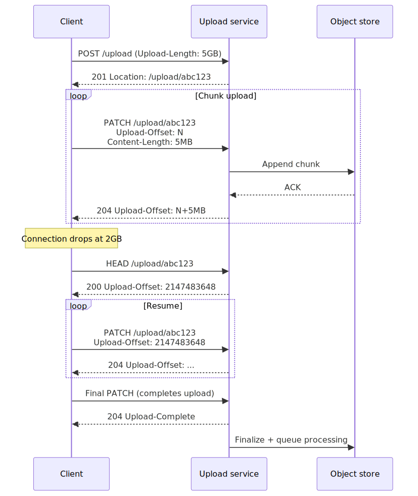
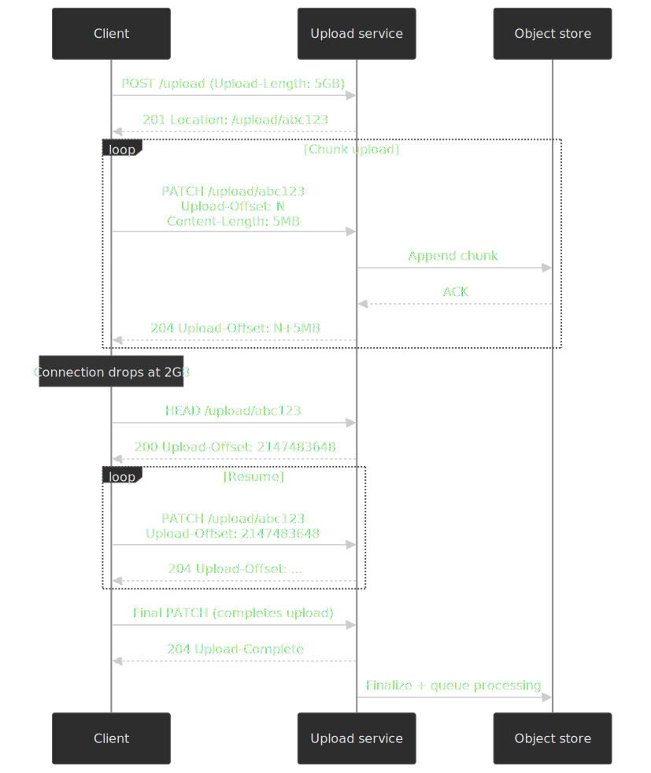

# Design a YouTube-Style Video Platform

A video platform at YouTube scale absorbs hundreds of hours of upload per minute, fans every accepted upload out into dozens of resolution × codec × bitrate variants, and serves segments to a global audience through a deeply tiered CDN. This article designs that system end to end — the upload protocol, the chunk-parallel and per-shot transcoding pipeline, CMAF-packaged HLS/DASH delivery, the hybrid ABR algorithm in the player, multi-tier caching with origin shielding, the Vitess-sharded metadata layer, view counting at billions of events per day, the two-stage watch-time recommender, the Content ID and moderation pipeline, and a brief contrast with the live (LL-HLS / LL-DASH) path. The goal is the strongest possible mental model for a senior engineer designing or interviewing on a VOD platform.




## Mental model

A VOD pipeline is shaped by four constraints that pull in different directions:

1. **Encoding is computationally expensive and embarrassingly parallel.** A single 10-minute upload produces tens of output renditions (resolution × codec × rung). Total wall-clock time scales with chunk count over worker count, not video length.
2. **Latency budgets are asymmetric.** Uploads tolerate seconds to minutes; playback must start in under two seconds and rebuffer rarely. That asymmetry funds aggressive CDN caching, prefetching, and origin shielding.
3. **Demand follows extreme power laws.** A small fraction of videos drive the bulk of plays, so storage tiering and shield-layer consolidation pay disproportionate dividends.
4. **Codec / device matrices are narrow per device, wide per catalog.** Each playback session needs only one codec variant; the catalog needs many. Selective AV1 / HEVC encoding amortizes the high encode cost over expected plays.

Five mechanisms together resolve those constraints:

- **Resumable chunked uploads** keep multi-GB transfers alive over flaky networks. The de-facto protocol is [tus 1.0](https://tus.io/protocols/resumable-upload), now being [standardized at the IETF](https://datatracker.ietf.org/doc/draft-ietf-httpbis-resumable-upload/) as `draft-ietf-httpbis-resumable-upload`.
- **Chunk-parallel encoding** decouples wall time from video length. The split is on GOP / IDR boundaries so chunks can be re-assembled losslessly.
- **Per-shot encoding** allocates bits to scenes that actually need them — Netflix's "Dynamic Optimizer" reports roughly [30% bitrate savings and 65% fewer rebuffers](https://netflixtechblog.com/optimized-shot-based-encodes-now-streaming-4b9464204830) on top of per-title.
- **CMAF** ([ISO/IEC 23000-19](https://www.iso.org/standard/79105.html)) lets a single set of fragmented MP4 segments serve both [HLS](https://datatracker.ietf.org/doc/html/rfc8216) and [MPEG-DASH](https://www.iso.org/standard/79329.html) clients — Apple added `fMP4` to HLS at WWDC 2016 specifically to enable this.
- **Origin shielding** consolidates the long tail of edge misses through a small set of regional caches before any request reaches origin storage. Real-world workloads see [significant origin offload](https://www.fastly.com/blog/origin-offload-a-measure-of-cdn-efficiency-for-reducing-egress-cost), though the precise reduction depends heavily on the request distribution.

## Requirements

### Functional requirements

| Requirement                                | Priority     | Notes                                          |
| ------------------------------------------ | ------------ | ---------------------------------------------- |
| Video upload                               | Core         | Resumable, chunked, multi-GB files             |
| Video playback                             | Core         | Adaptive streaming, multiple quality rungs     |
| Transcoding pipeline                       | Core         | Multi-resolution, multi-codec output           |
| Video metadata (title, description, tags)  | Core         | Editable, searchable                           |
| Video search                               | Core         | Full-text + filters (duration, date, category) |
| Thumbnails (auto-generated + custom)       | Core         | Multiple sizes for different surfaces          |
| View counting                              | Core         | Near real-time, deduplicated                   |
| Recommendations                            | Core         | Two-stage retrieval + ranking, watch-time objective |
| Content moderation + Content ID            | Core         | Hash matching for known-bad, ML for unknown, fingerprint match for rights |
| Comments and engagement                    | Extended     | Threaded, moderation                           |
| Live streaming                             | Compared briefly | Different protocol (LL-HLS / LL-DASH); contrasted at the end |
| Monetization / ads                         | Out of scope | Separate ad-tech stack                         |

### Non-functional requirements

| Requirement            | Target                                      | Rationale                                  |
| ---------------------- | ------------------------------------------- | ------------------------------------------ |
| Upload availability    | 99.9%                                       | Tolerates short maintenance windows        |
| Playback availability  | 99.99%                                      | Revenue-critical, brand-critical           |
| Upload processing time | < 2× video duration (deep ladder)           | Reasonable wait before full-quality rungs land |
| Playback start latency | p99 < 2 s                                   | Industry abandonment threshold             |
| Rebuffering ratio      | < 0.5% of playback time                     | Quality-of-experience floor                |
| Encoder quality        | mean VMAF ≥ 93, 1%-low VMAF ≥ 93 per rung   | [Netflix-style perceptual target](https://netflixtechblog.com/vmaf-the-journey-continues-44b51ee9ed12) |
| Bandwidth efficiency   | 30–50% savings vs single-codec H.264 ladder | Funds modern-codec encode cost             |

### Scale estimation

Public figures place YouTube at roughly **2.7 billion monthly active users** with **500+ hours of video uploaded per minute** and **over a billion hours watched per day**.[^scale-mau] [^scale-uploads] [^scale-watch] We'll size the system from those numbers.

```text title="Ingestion"
500 hours/min × 60 × 24 = 720,000 hours/day uploaded
Average raw bitrate: ~16 Mbps (mixed 1080p / 4K / mobile)
Daily upload bytes:  720,000 × 3600 × 16e6 / 8 ≈ 5.2 PB/day raw

Storage growth:
  Encoded variants: ~5× original (8 rungs × 3 codecs, with per-shot bit budgets)
  Daily encoded growth: ~25 PB/day
  Annual encoded growth: ~9 EB/year (before lifecycle deletes)
```

```text title="Egress"
1 B watch hours/day × 3600 s × ~3 Mbps avg / 8 ≈ 1.35 EB/day egress
Peak concurrent: ~250 M players (estimated, asymmetric across time zones)

CDN with 95% byte-level offload from origin:
  ~67 PB/day from origin instead of 1.35 EB/day
```

> [!NOTE]
> Public scale numbers are estimates. YouTube does not publish daily active users or per-tier cache hit rates. Treat the per-tier offload figures used below as illustrative defaults; in practice they vary heavily by content mix and recency.

## Design paths

### Path A — single-pass centralized transcoding

A small platform encodes each upload as a single ffmpeg-style job per rung on a few large boxes. Job duration scales with video length × ladder size.

- **Pros**: trivially simple, easy to operate, low fixed overhead.
- **Cons**: a 4-hour upload at a deep ladder takes hours of wall clock; failures restart the whole encode; no per-shot bit budgeting.
- **Where it fits**: < ~10 K uploads/day, content where time-to-publish isn't critical.

### Path B — chunk-parallel per-shot encoding (modern VOD)

Split each upload at IDR boundaries, encode chunks in parallel across a worker pool, optionally analyze each shot to set its own bit budget, then assemble.

- **Pros**: encode time decouples from video length; failed chunks retry in isolation; per-shot analysis cuts bandwidth without touching perceived quality; the chunk-level structure aligns with ABR segmentation downstream.
- **Cons**: complex orchestration (job graph, dedup, retries); chunk-boundary artifacts must be handled (overlap or constrained-bitrate at boundaries); scheduling and shuffle dominate the wall-clock at small scale.
- **Where it fits**: anything beyond a few thousand uploads/day, especially user-generated content with bursty viral demand.

| Factor                 | Centralized                | Chunk-parallel + per-shot   |
| ---------------------- | -------------------------- | --------------------------- |
| Wall-clock encode time | O(video duration)          | O(chunk_count / workers)    |
| Scaling axis           | Vertical                   | Horizontal                  |
| Failure blast radius   | Whole video                | One chunk × one rung        |
| Bit budget granularity | Per file or per title      | Per shot                    |
| Operational complexity | Low                        | High (job graph, manifest)  |

The rest of this article assumes Path B. Three real-world data points back the choice:

- YouTube's custom **Argos VCU** ASIC reports **20–33× compute efficiency over optimized software encoding** at warehouse scale, with each chip carrying 10 encoder cores capable of real-time 2160p60.[^argos]
- Netflix's microservice pipeline ("Cosmos") fans out roughly **140 video encodes and 552 audio encodes per hour-long episode**, generating ~27,000 microservice calls and ~1 M tracing spans for that single episode — a chunk-parallel job graph at industrial scale.[^cosmos]
- Netflix's **Dynamic Optimizer** (per-shot encoding) shipped to 4K streams in 2020 with a reported ~30% additional bitrate saving over per-title and a >65% rebuffer reduction.[^dynopt]

## Component overview




The system has three loosely coupled subsystems:

1. **Ingest + processing** — upload service, chunk manager, job queue, transcoder pool, QC, packager.
2. **Storage + delivery** — raw object store, encoded segment store, origin shield, CDN edge, player.
3. **Metadata + discovery** — metadata DB, hot read cache, search index, recommendation pipeline, view counter.

Each subsystem owns its own write path and is rate-limited / scaled independently.

## Upload service

### Resumable upload protocol

The de-facto standard is [tus 1.0](https://tus.io/protocols/resumable-upload), an HTTP-based protocol with `Upload-Offset`, `Upload-Length`, and `Tus-Resumable` headers. The [IETF HTTP working group adopted a tus-derived draft](https://tus.io/blog/2023/08/09/resumable-uploads-ietf), `draft-ietf-httpbis-resumable-upload`, and that draft is on track to subsume the core tus protocol; tus 1.x will likely remain the working spec for the next few years and a future tus 2.0 will hold extensions (Expiration, Concatenation) that the IETF draft omits.




| Header            | Purpose                                                  |
| ----------------- | -------------------------------------------------------- |
| `Upload-Length`   | Total file size (omit for streaming uploads)             |
| `Upload-Offset`   | Byte position for this `PATCH`                           |
| `Tus-Resumable`   | Protocol version (currently `1.0.0`)                     |
| `Upload-Metadata` | Base64-encoded key/value pairs (filename, content-type)  |

Chunk size trades resume granularity against per-chunk overhead:

| Chunk size | Pros                                  | Cons                                  |
| ---------- | ------------------------------------- | ------------------------------------- |
| 1 MB       | Fine-grained resume on flaky networks | Many requests, more TLS / HTTP overhead |
| 5 MB       | Sensible default                      | Good behavior across most networks    |
| 25 MB      | Lower per-byte overhead               | Larger re-transmit on chunk failure   |

> [!TIP]
> Cloudflare Stream's `tus` ingest, AWS S3 multipart, and GCS resumable uploads are all conceptually equivalent; the choice usually comes down to how the rest of the upload service authenticates and authorizes the session.

### Upload validation and processing




Validation is a hard gate before anything queues:

- **Container**: MP4 / MOV / MKV / WebM / AVI accepted; reject obscure formats.
- **Duration**: ≤ 12 hours by default (channel-level overrides).
- **Resolution**: up to 8K (7680×4320) for the catalog.
- **File size**: capped at the upload size limit (YouTube currently allows up to 256 GB per file).[^yt-256gb]
- **Audio tracks**: capped at a small fixed number (e.g. 8) to bound per-rung packaging cost.

Once validated, the upload service writes the raw file to the durable object store, probes container metadata (resolution, codec, FPS, audio layout, color primaries, HDR metadata), and emits a job to the segmentation queue. The video is marked discoverable as soon as a thumbnail is ready — the encoded ladder fills in behind it.

### Thumbnails

Thumbnail generation runs on the raw file before encoding finishes:

1. Extract candidate frames at fixed offsets (25, 50, 75% of duration) plus shot-detection peaks.
2. Score each candidate (sharpness, face detection, composition, no near-black/near-white frames).
3. Encode the chosen thumbnail at multiple sizes.
4. Build a sprite sheet (one tile per ~10 s) for the player's scrub-bar preview.

| Surface         | Dimensions       | Format     |
| --------------- | ---------------- | ---------- |
| Search results  | 320×180          | WebP / JPEG |
| Watch page      | 640×360          | WebP / JPEG |
| Large player    | 1280×720         | WebP / JPEG |
| Scrub preview   | 160×90 (sprite)  | WebP       |

## Transcoding pipeline

### Per-chunk × per-rung × per-codec




The job graph for a single video is:

1. **Demux** raw container into elementary streams (video, audio, subtitles).
2. **Segment** the video stream at IDR boundaries into 2–4 s chunks. Boundaries align to keyframes so each chunk is independently decodable.
3. **Analyze** each shot (scene-change detection + motion / texture complexity) to set a per-shot bit budget.
4. **Encode** the cross-product of (chunk × codec × rung) in parallel. Each chunk is short enough that even AV1's 5–10× higher encode cost over H.264 fits a single-worker budget.
5. **QC** each encoded chunk against VMAF; re-encode at a higher rung if quality drops below threshold.
6. **Package** chunks as CMAF fragmented MP4, then write HLS `.m3u8` and DASH `.mpd` manifests pointing at the same byte streams.

### Codec selection

| Codec          | Compression vs H.264                  | Hardware decode                        | Encode cost vs H.264 | Use case                                |
| -------------- | ------------------------------------- | -------------------------------------- | -------------------- | --------------------------------------- |
| **H.264 (AVC)** | baseline                              | universal                              | 1×                   | Mandatory fallback                      |
| **H.265 (HEVC)** | ~50% better                           | Safari / iOS / Android (royalty-encumbered) | 2–4×                 | Apple ecosystem rungs                   |
| **VP9**         | ~50% better                           | Chrome / Edge / Firefox / Android      | 2–3×                 | Default modern codec for non-Apple stack |
| **AV1**         | ~30% better than VP9 in production[^av1-fb] | Chrome / Firefox / Edge / Safari 17+; widening Android HW decode | 5–10× (software); much lower with custom HW | Bandwidth-constrained or popular content |

A pragmatic ladder strategy:

1. **Always encode H.264** — universal fallback for older devices and embeds.
2. **Encode VP9 by default** for non-Apple modern browsers; well-supported, relatively cheap.
3. **Encode HEVC for Apple devices** that don't support VP9.
4. **Encode AV1 selectively**: trending content, popular catalog titles, mobile-cellular rungs. The 30%+ bitrate saving pays back the encode cost only after a non-trivial number of plays. YouTube has been progressively expanding AV1 to more videos as decoder availability grows.

### Bitrate ladder

A reasonable VP9 ladder for general-purpose UGC:

| Resolution | Bitrate range    | FPS     | Notes                  |
| ---------- | ---------------- | ------- | ---------------------- |
| 4K (2160p) | 12–20 Mbps       | 30 / 60 | High-motion → 20 Mbps  |
| 1440p      | 6–10 Mbps        | 30 / 60 | Common for gaming      |
| 1080p      | 3–6 Mbps         | 30 / 60 | Most common viewing rung |
| 720p       | 1.5–3 Mbps       | 30      | Mobile default         |
| 480p       | 0.5–1 Mbps       | 30      | Bandwidth-constrained  |
| 360p       | 0.3–0.5 Mbps     | 30      | Minimum viable         |
| 240p       | 0.15–0.3 Mbps    | 30      | Extreme-constraint     |
| 144p       | 0.05–0.1 Mbps    | 30      | Audio-focused          |

The ladder is the upper bound. Per-title and per-shot encoding push the actual bitrates lower without losing perceptual quality.

### Per-title and per-shot encoding

Netflix's [original 2015 per-title encoding](https://netflixtechblog.com/per-title-encode-optimization-7e99442b62a2) tunes the bitrate ladder per title by sweeping bitrate / quality and picking the convex hull. For example, *Orange Is the New Black* hit visually-equivalent quality at ~20% lower bitrate than a fixed ladder.

[Per-shot ("Dynamic Optimizer") encoding](https://netflixtechblog.com/optimized-shot-based-encodes-now-streaming-4b9464204830) goes further: each shot gets its own bit budget based on how hard it is to encode (motion, texture, grain). Netflix reports roughly **30% bitrate savings on top of per-title and >65% fewer rebuffers** for 4K streams.

```text title="Per-title vs per-shot, 1080p documentary vs action"
Fixed ladder:        5 Mbps for everything at 1080p
Per-title (doc):     2.5 Mbps achieves VMAF 95     → 50% saving
Per-title (action):  5 Mbps needed for VMAF 95     → ~0% saving
Per-shot (action):   3.8 Mbps avg, 8 Mbps in
                     high-motion shots, 1.5 Mbps in
                     dialog shots                  → ~25% saving
```

> [!IMPORTANT]
> Per-shot encoding only pays back if the analysis cost is amortized across millions of plays. Run it on the high-traffic head and stay on per-title for the long tail.

### Chunk parallelism math

```text title="10-min upload, 8 rungs × 3 codecs"
Chunks at 2s: 300 / 2 = 150 chunks
Variants:     8 × 3 = 24 outputs per chunk
Total tasks:  150 × 24 = 3,600 encode tasks

Serial encode (single worker, software, 1× realtime):
  ~10 min × 24 variants = ~240 min wall clock

Chunk-parallel (150 workers):
  Per-chunk wall clock = max(per-variant encode time)
  At ~2× realtime for AV1 software: ~4 s per chunk × 24 variants
  Wall clock ≈ 4 s × 24 = ~96 s + assembly + manifest overhead
  Speedup: ~150×
```

Boundary handling is the subtlety: the encoder needs reference frames near the chunk edges, so workers either get a small overlap (1–2 GOP) of context that's trimmed during assembly, or the encoder is constrained to closed-GOP encoding that doesn't reference frames outside the chunk. Closed GOPs cost a small amount of efficiency; the operational simplicity is worth it at scale.

### Quality control with VMAF

VMAF is Netflix's open-source perceptual quality metric, scoring 0–100 with a target of ~93+ for "visually transparent" output relative to source.[^vmaf]

| VMAF score | Interpretation              |
| ---------- | --------------------------- |
| 93+        | Excellent (target)          |
| 85–93      | Good                        |
| 70–85      | Fair                        |
| < 70       | Poor — re-encode at higher rung |

The QC stage scores every encoded chunk against the source. A chunk whose 1%-low VMAF dips below threshold is re-encoded at a higher rung and the manifest is patched. Aggregating only on the mean hides quality cliffs in motion-heavy frames, which is why X (formerly Twitter) and Netflix both publish [percentile-based VMAF tracking](https://blog.x.com/engineering/en_us/topics/infrastructure/2020/introducing-vmaf-percentiles-for-video-quality-measurements).

## Adaptive bitrate streaming

### HLS, DASH, and CMAF

[HLS](https://datatracker.ietf.org/doc/html/rfc8216) is documented in the informational RFC 8216 (2017); the active spec is now [`draft-pantos-hls-rfc8216bis`](https://datatracker.ietf.org/doc/draft-pantos-hls-rfc8216bis/) ("HLS 2nd edition"), where Low-Latency HLS lives. [DASH](https://www.iso.org/standard/79329.html) is [ISO/IEC 23009-1](https://www.iso.org/standard/79329.html). At the bytes-on-the-wire level, both protocols can carry the **same** fragmented MP4 segments, thanks to [CMAF](https://www.iso.org/standard/79105.html) (ISO/IEC 23000-19) — Apple [added `fMP4` segments to HLS at WWDC 2016](https://bitmovin.com/blog/hls-news-wwdc-2016/) explicitly to enable a single library to serve both ecosystems.

| Feature              | HLS                           | DASH                       |
| -------------------- | ----------------------------- | -------------------------- |
| Standards body       | Apple, IETF (informational)   | ISO/IEC                    |
| Manifest             | M3U8                          | MPD (XML)                  |
| Segment              | TS or fMP4 (CMAF)             | fMP4 (CMAF) or WebM        |
| Apple support        | Native                        | Not supported in Safari    |
| DRM                  | FairPlay (CMAF cbcs)          | Widevine, PlayReady (cenc) |
| Low-latency variant  | LL-HLS (`8216bis`)            | LL-DASH (chunked transfer) |

Encoding once and packaging twice is the deployment pattern that wins:




### Manifest examples

```m3u8 title="HLS multivariant playlist"
#EXTM3U
#EXT-X-VERSION:7
#EXT-X-INDEPENDENT-SEGMENTS

#EXT-X-STREAM-INF:BANDWIDTH=5000000,RESOLUTION=1920x1080,CODECS="avc1.640028,mp4a.40.2"
1080p/playlist.m3u8

#EXT-X-STREAM-INF:BANDWIDTH=2500000,RESOLUTION=1280x720,CODECS="avc1.64001f,mp4a.40.2"
720p/playlist.m3u8

#EXT-X-STREAM-INF:BANDWIDTH=1000000,RESOLUTION=854x480,CODECS="avc1.64001e,mp4a.40.2"
480p/playlist.m3u8
```

```m3u8 title="HLS media playlist (per rung)"
#EXTM3U
#EXT-X-VERSION:7
#EXT-X-TARGETDURATION:4
#EXT-X-MEDIA-SEQUENCE:0

#EXTINF:4.000,
segment_0001.m4s
#EXTINF:4.000,
segment_0002.m4s
#EXTINF:4.000,
segment_0003.m4s
#EXT-X-ENDLIST
```

### ABR algorithm

Three families of ABR algorithm are worth knowing:

1. **Throughput-based.** Estimate bandwidth from recent segment downloads and pick the highest rung whose bitrate fits, with a safety margin.
   ```text
   est_bw = bytes_downloaded / download_time   # EWMA across recent segments
   safe   = est_bw × 0.7
   pick   = max(rung) where bitrate(rung) < safe
   ```
2. **Buffer-based (BOLA).** [BOLA](https://arxiv.org/abs/1601.06748) (Spiteri, Urgaonkar, Sitaraman, INFOCOM 2016) frames bitrate selection as a Lyapunov-optimization problem on buffer occupancy, with theoretical near-optimality bounds and no need to predict bandwidth. It is the reference buffer-based rule in `dash.js`.
3. **Hybrid (production default).** Combine throughput and buffer signals — throughput drives the upper bound, buffer level decides how aggressively to step toward it. `dash.js`'s default `Dynamic` rule [switches between throughput and BOLA based on buffer level](https://dashif.org/dash.js/pages/usage/abr/settings.html).




Practical constraints layered on top of the algorithm:

- **Startup**: open at a conservative rung (often 720p or below), prefetch 2–3 segments before pressing play.
- **Minimum dwell time** at the chosen rung (e.g. 10 s) to prevent flapping.
- **Maximum drop per switch** (e.g. 2 rungs) to avoid jarring quality dives.
- **Buffer emergency**: if buffer < 5 s, drop to the lowest rung immediately and prioritize survival over quality.

### Segment duration trade-offs

| Duration | Pros                                  | Cons                                |
| -------- | ------------------------------------- | ----------------------------------- |
| 2 s      | Fast adaptation, lower live latency   | More requests per minute, more overhead |
| 4 s      | Balanced default                      | —                                   |
| 6 s      | Better encode efficiency, fewer reqs  | Slower ABR adaptation               |
| 10 s     | Best compression efficiency           | Too coarse for ABR responsiveness   |

YouTube and most VOD providers settle in the 2–4 s range; Netflix tends toward 4–6 s. Live / low-latency workloads use 2 s with chunked-transfer-encoded delivery.

## CDN and delivery

### Multi-tier caching




Three layers between the player and the bytes:

| Tier         | Typical hit rate (popular VOD) | Purpose                                         |
| ------------ | ------------------------------ | ----------------------------------------------- |
| Edge PoP     | 90–95%                         | Serve most requests from the nearest cache      |
| Origin shield | 95–99% cumulative              | Catch edge misses, consolidate origin reads     |
| Origin store | ~1% of requests                | Long-tail content + cache fills                 |

> [!NOTE]
> Specific hit-rate numbers are workload-dependent. CDN-published guidance (e.g. [AWS CloudFront Origin Shield documentation](https://docs.aws.amazon.com/AmazonCloudFront/latest/DeveloperGuide/origin-shield.html), [Fastly origin offload](https://www.fastly.com/blog/origin-offload-a-measure-of-cdn-efficiency-for-reducing-egress-cost)) frames the benefit as a **byte-level origin-offload metric** rather than a request-level cache-hit rate, because shielded misses look like misses to standard CHR.

### Why origin shielding wins

Without a shield layer, every edge PoP that misses sends an independent fetch to origin. With a shield, a single regional cache absorbs many edge misses and forwards at most one origin request per object. The benefit grows with PoP fan-out and with object size — the larger the object, the more dramatic the byte savings even from a small reduction in origin request count.

```text title="Conceptual model"
Without shield:
  N edge PoPs × p_miss = N × p_miss origin fetches per object burst

With shield:
  N edge PoPs → 1 regional shield → ≤ 1 origin fetch per object,
  while the shield serves the rest of the regional misses from cache
```

AWS's [multi-CDN Origin Shield case study](https://aws.amazon.com/blogs/networking-and-content-delivery/using-cloudfront-origin-shield-to-protect-your-origin-in-a-multi-cdn-deployment/) reports production users seeing as much as 57% origin load reduction; Fastly's [origin offload analysis](https://www.fastly.com/blog/origin-offload-a-measure-of-cdn-efficiency-for-reducing-egress-cost) shows a 4× origin-traffic spike when shielding was disabled in a production case.

### Cache key design

```text title="Suggested cache key"
/{video_id}/{rung}/{codec}/{segment_number}.m4s
example: /abc123/1080p/vp9/segment_0042.m4s
```

What stays out of the cache key:

- Session tokens, signed URL parameters (validate, then strip).
- Per-user identifiers (otherwise every user becomes a cache miss).
- Cache-buster timestamps (segments are immutable; use `Cache-Control: public, max-age=31536000, immutable`).
- Analytics query parameters.

### Multi-CDN

For redundancy, geographic optimization, and price arbitrage, large platforms run more than one CDN.

| Factor              | Implementation                                |
| ------------------- | --------------------------------------------- |
| Geographic routing  | DNS-based geo / latency steering              |
| Availability        | RUM + synthetic health probes; auto-failover  |
| Cost optimization   | Route to cheapest CDN per region              |
| Performance         | Real-user metrics drive ongoing rebalancing   |




## Storage

### Tiering and lifecycle

A small fraction of videos drives most plays, so storage is tiered hot → warm → cold → archive and lifecycle-managed.

| Tier        | Access pattern             | Storage class    | Cost  | Read latency |
| ----------- | -------------------------- | ---------------- | ----- | ------------ |
| **Hot**     | Recent uploads, trending   | SSD / NVMe       | $$$   | < 10 ms      |
| **Warm**    | Moderate views (1–100/day) | HDD              | $$    | 50–100 ms    |
| **Cold**    | Long-tail (< 1 view/day)   | Object storage   | $     | 100–500 ms   |
| **Archive** | Original raw bytes for DR  | Glacier-class    | ¢     | minutes–hours |




```text title="Default lifecycle"
Upload                       → Hot tier
After 30 days                → Warm if views/day < N, else stay Hot
After 90 days low traffic    → Cold; archive originals
After 365 days zero traffic  → Lifecycle delete (cold copy only;
                                  archive copy of originals retained)
On traffic spike             → Promote back to Hot on miss
```

### Per-video storage estimate

```text title="10-min 1080p UGC upload"
Original raw (H.264, 1080p, ~6 Mbps): ~450 MB
Encoded outputs:
  H.264 ladder (8 rungs):  ~800 MB
  VP9 ladder (8 rungs):    ~500 MB
  AV1 (top 3 rungs only):  ~150 MB
  HEVC ladder (top 4):     ~250 MB (Apple-only fallback)
  Thumbnails + sprite + manifest: ~10 MB
Total per-video footprint: ~2.2 GB (~5× original)
```

Multi-region replication is then applied selectively:

| Content class      | Replication              | Rationale                  |
| ------------------ | ------------------------ | -------------------------- |
| Hot (popular)      | 3 regions                | Low latency globally       |
| Warm               | 2 regions                | Cost vs. latency balance   |
| Cold               | 1 region + archive       | Cost optimization          |
| Original raw bytes | 2 regions + archive      | Disaster recovery          |

## Metadata and search

### Sharded relational store

YouTube's metadata layer started life as a single MySQL primary and evolved into a horizontally sharded fleet behind [**Vitess**](https://vitess.io/docs/24.0/overview/history/), the project Google open-sourced in 2012 to absorb its sharding, connection-pooling, and online-resharding logic. Two pieces matter for the design:

- **VTGate** is a stateless SQL proxy. Application code talks to it as if it were a single MySQL endpoint; VTGate consults the topology service, parses the query, applies the **vindex** (sharding function) to the keyspace ID column, and routes to the right shard.[^vtgate]
- **VTTablet** is a sidecar in front of each MySQL instance that pools connections, kills runaway queries, rewrites unsafe statements, and drives the online-resharding workflow (split / merge a shard live with minimal write downtime).[^vitess-sharding]

For a YouTube-shaped workload, the practical implications are: keep the schema MySQL-compatible, partition by `channel_id` or `video_id` at the keyspace level, and lean on Vitess to make resharding a runbook event rather than a migration project. The same shape — a thin proxy hiding shard fan-out from the app, with online-resharding as a first-class operation — shows up in PlanetScale, Slack's Vitess deployment, and the GitHub Vitess migration.

### Schema sketch

```sql title="videos.sql"
CREATE TABLE videos (
    video_id            UUID         PRIMARY KEY,
    channel_id          UUID         NOT NULL REFERENCES channels(id),
    title               VARCHAR(100) NOT NULL,
    description         TEXT,
    duration_seconds    INTEGER      NOT NULL,
    upload_timestamp    TIMESTAMPTZ  NOT NULL,
    publish_timestamp   TIMESTAMPTZ,
    status              VARCHAR(20)  NOT NULL DEFAULT 'processing',
    -- denormalized counters (eventually consistent)
    view_count          BIGINT       DEFAULT 0,
    like_count          BIGINT       DEFAULT 0,
    comment_count       INTEGER      DEFAULT 0,
    -- content signals
    category_id         INTEGER,
    language            VARCHAR(10),
    age_restricted      BOOLEAN      DEFAULT false,
    CONSTRAINT valid_status CHECK (status IN ('processing','ready','failed','deleted'))
);

CREATE INDEX idx_videos_channel
    ON videos (channel_id, publish_timestamp DESC);
CREATE INDEX idx_videos_category
    ON videos (category_id, publish_timestamp DESC);
CREATE INDEX idx_videos_trending
    ON videos (view_count DESC)
    WHERE status = 'ready'
      AND publish_timestamp > NOW() - INTERVAL '7 days';
```

### Search index

A typical Elasticsearch / OpenSearch mapping:

```json title="videos.mapping.json"
{
  "mappings": {
    "properties": {
      "video_id": { "type": "keyword" },
      "title": {
        "type": "text",
        "analyzer": "standard",
        "fields": {
          "exact": { "type": "keyword" },
          "autocomplete": { "type": "search_as_you_type" }
        }
      },
      "description": { "type": "text" },
      "channel_name": {
        "type": "text",
        "fields": { "exact": { "type": "keyword" } }
      },
      "tags": { "type": "keyword" },
      "category": { "type": "keyword" },
      "duration_seconds": { "type": "integer" },
      "view_count": { "type": "long" },
      "publish_date": { "type": "date" },
      "language": { "type": "keyword" },
      "transcript": { "type": "text", "analyzer": "standard" }
    }
  }
}
```

```json title="example query — kubernetes tutorials, 5–30 min, English"
{
  "query": {
    "bool": {
      "must": [{
        "multi_match": {
          "query": "kubernetes tutorial",
          "fields": ["title^3", "description", "tags^2", "transcript"]
        }
      }],
      "filter": [
        { "term":  { "language": "en" } },
        { "range": { "duration_seconds": { "gte": 300, "lte": 1800 } } }
      ]
    }
  },
  "sort": [{ "_score": "desc" }, { "view_count": "desc" }]
}
```

### View counting

The view counter must be near real-time, deduplicated, fraud-resistant, and monotonic. The pipeline:




Counting rules in production:

- A view counts only after a minimum watch-time threshold (industry standard ≈ 30 s, shorter for Shorts-style content).
- Per-video bloom filter on `hash(video_id, user_id, ip, ua)` over a rolling window suppresses replays — accept ~1% false-positive rate (slight under-count) in exchange for O(1) memory.
- Same-IP / same-cookie bursts are rate-limited and cross-checked against ML fraud signals before being added to the public count.
- Public counts are computed at lower precision than internal counters (rounded for high-traffic videos) to disincentivize gaming.

## Recommendations

Recommendations drive a striking share of platform watch time — at CES 2018, YouTube's then-CPO Neal Mohan publicly pegged it at >70% of watch time on the platform.[^mohan-70]

The reference architecture from Covington, Adams, and Sargin's RecSys 2016 paper, "Deep Neural Networks for YouTube Recommendations,"[^covington-2016] is still the spine that most production recommender stacks copy: an offline-trained candidate generator narrows millions of videos to ~hundreds, and a heavier ranker scores those candidates with rich per-impression features. The same two stages, often re-skinned with newer architectures (transformers, two-tower retrieval, multi-task learning), show up at TikTok, Spotify, and Netflix.




### Candidate generation

The retrieval model is an extreme multiclass classifier: predict "the next video the user will watch" out of a corpus of millions. The training-time loss is **sampled softmax** — full softmax over millions of classes is infeasible, so each training step samples a few thousand negatives and treats the loss as a logistic approximation.[^covington-2016] At serving time the trained network produces a user embedding $u$, and candidate retrieval reduces to a maximum-inner-product search:

$$\text{top-}k\ \arg\max_{v \in V}\ u \cdot v$$

That MIPS reduction is what makes ANN libraries — **HNSW**, **ScaNN**, **FAISS** — the right substrate. A HNSW or ScaNN index over hundreds of millions of video embeddings returns a few thousand candidates in single-digit milliseconds, on a single replica, with recall well above 95%.

Inputs that feed the user-embedding tower in the original paper:

- Bag-of-watches (embedded video IDs from recent history, average-pooled).
- Bag-of-search-tokens (user search queries, similarly embedded).
- Demographics and geography.
- An **example age** feature — wall-clock seconds since the training example was logged — that lets the model un-bias toward videos popular at training time and surface fresh content at serving time.[^covington-2016]

### Ranking

The ranker scores the few thousand candidates with deep per-impression features — display position, time since last watch of the same channel, language match, the candidate's own engagement priors. Two design choices dominate:

- **Optimize for expected watch time, not click probability.** Click-through-rate ranking rewards clickbait. Watch-time ranking rewards videos people actually finish.
- **Learn the watch-time objective via weighted logistic regression.** Positive impressions (clicks) are weighted by their observed watch time; negative impressions get unit weight. The learned odds $\frac{p}{1-p}$ then approximate $E[T] / (1 - p)$, which for the small click probabilities seen in production is approximately the expected watch time itself.[^covington-2016] At serving time the model emits $e^{w\cdot x + b}$, which the system uses directly as the watch-time score.

Signals layered on top of the base model in production:

| Signal              | Source                  | Used in       |
| ------------------- | ----------------------- | ------------- |
| Watch time          | Playback events         | Ranker target |
| Survey responses    | "Were you satisfied?" prompts | Ranker auxiliary head |
| Likes / dislikes    | Explicit feedback       | Ranker features |
| Comments / shares   | Engagement              | Ranker features |
| Search history      | Intent signals          | Candidate gen |
| Subscriptions       | Long-term preference    | Candidate gen |
| Video co-watch      | Collaborative filtering | Candidate gen |
| Channel / topic embeddings | Content similarity | Both stages |

> [!IMPORTANT]
> The two-stage funnel exists because the cost functions are different. Candidate generation must be **cheap and high-recall** over the full catalog. Ranking must be **expensive and high-precision** over a small candidate set. Collapsing them into one stage either blows the latency budget or degrades quality at the top of the page.

## Content moderation and Content ID

Moderation runs as a fan-out at upload time, before the encoded ladder is published to the catalog. Three pipelines run in parallel; any one of them can hold a video in a `pending_review` state.




### Safety hash matching

For categories with zero tolerance — CSAM, terrorist content, known violent-extremist media — the industry standard is **perceptual hash matching** against an industry-shared blocklist. Microsoft's PhotoDNA and the GIFCT shared hash database are the canonical references for images and short video clips; the hash function is robust to resizing, recompression, color shifts, and minor crops. A match is treated as ground truth: the upload is blocked, the hash is logged, and (for CSAM) the report flows to NCMEC by statutory requirement.

### ML classifiers for unknown harms

Hash matching only catches what's already in the database. A second tier of classifiers — nudity, graphic violence, spam, hate speech, dangerous misinformation — runs over thumbnails, sampled frames, the audio track, and (when available) the transcript. The output is a bank of category scores; thresholds determine whether the video auto-publishes, queues for human review, or holds pending escalation.

### Content ID

[YouTube's Content ID](https://support.google.com/youtube/answer/2797370) is a **rights-management** layer, not a safety layer. Rights holders upload reference assets, the system extracts compact perceptual fingerprints over both video (scene-chunked spatio-temporal features) and audio (spectrogram-derived), and every upload is matched against the reference database.[^contentid] When a match fires, the rights holder's pre-set policy decides:

| Action      | Effect                                                         |
| ----------- | -------------------------------------------------------------- |
| **Block**   | Remove from the public catalog (geo-scoped where requested).   |
| **Monetize** | Run ads against the upload; route revenue to the rights holder. |
| **Track**   | Leave the upload public; share viewership analytics with the holder. |

Three engineering properties are non-obvious:

- **Match on chunks, not files.** The fingerprint matcher operates on short overlapping windows, so a clip embedded inside a longer original still matches.
- **Robust to common adversarial transforms.** The fingerprint survives re-encoding, resolution changes, frame-rate conversion, mirror-flip, and modest crop / overlay. New adversarial attacks (audio pitch-shift, time-stretch, image overlays) trigger re-tuning of the fingerprint extractor.
- **Disputes are first-class.** Creators can dispute a claim; revenue is held in escrow during the dispute window. The system has to keep the public-facing video available during low-confidence claims, because false positives at this scale carry creator-trust costs that exceed the cost of brief unauthorized monetization.

## Live streaming vs VOD

The article above is a **VOD** design. A live-streaming pipeline is shaped by hard real-time constraints that change most stages of the pipeline.


| Concern                | VOD                                            | Live (LL-HLS / LL-DASH)                                           |
| ---------------------- | ---------------------------------------------- | ----------------------------------------------------------------- |
| Time-to-glass target   | Playback start < 2 s; encoding latency hidden | Glass-to-glass 2–6 s; goal often **< 3 s** for sports / chat      |
| Encoder budget         | Multi-pass per-shot, hours of wall time OK     | Strict realtime; one-pass; no per-shot analysis                   |
| Ladder depth           | Deep (8 rungs × 3 codecs)                      | Shallow (3–5 rungs, usually one codec) to bound encoder cost     |
| Segment shape          | 2–4 s immutable segments                       | 2 s segments split into **200–500 ms partial segments** (LL-HLS)[^llhls] or chunked-transfer-encoded chunks (LL-DASH)[^lldash] |
| Manifest update model  | Static playlist + endlist                      | LL-HLS **blocking playlist reload** (`_HLS_msn`, `_HLS_part`); LL-DASH `availabilityTimeOffset` |
| CDN behavior           | Long TTL, immutable, deep shielding            | Short TTL on the live edge; partials must traverse the cache before they expire |
| ABR algorithm          | Hybrid throughput + buffer; large buffers      | Conservative; small buffer (sub-second target) constrains how aggressively the player can step up |
| Storage durability     | Hot/warm/cold tiering for the long tail        | DVR window only (typically 1–4 hours of rolling segments)         |
| Publish path           | Offline catalog insert when encode finishes    | Stream is registered before frames arrive; presence + heartbeat replace `status='ready'` |
| Failure mode of choice | Re-queue the chunk                             | Drop the rung, never the stream — playback survival beats quality |

A practical design rule: a platform that does both should **share CMAF, HLS, and DASH packaging** but not the encoder fleet, the manifest server, or the CDN configuration. The live path needs a separate ingest tier (RTMP, SRT, or WebRTC), a low-latency transcoder pool sized for peaks, and a manifest server that supports blocking playlist reloads and `availabilityTimeOffset` semantics.

## Frontend and player

### Video player responsibilities

1. **Manifest parsing** — HLS / DASH (and CMAF where supported).
2. **ABR algorithm** — usually the platform's hybrid implementation; falls back to the platform default in `<video>` for native HLS on Safari.
3. **Buffer management** — segment prefetch, throttling under `<video>` policies (e.g. autoplay restrictions, low-power modes).
4. **Codec negotiation** — pick the best codec/container the device supports.
5. **DRM** — Widevine / FairPlay / PlayReady license acquisition, key rotation.
6. **QoE telemetry** — startup time, rebuffer events, quality switches, buffer underflows, fatal errors.

### Buffer strategy

```text title="Default buffer thresholds"
Target buffer:                30 s
Minimum to start playback:    5 s
Quality-down threshold:       10 s   (drop a rung if buffer drains below this)
Quality-up threshold:         25 s   (consider stepping up if above)
Max prefetch:                 60 s   (cap so we don't waste bytes on aborts)
```

### Playback start

| Phase           | Target    | Optimization                                         |
| --------------- | --------- | ---------------------------------------------------- |
| DNS resolution  | < 50 ms   | `dns-prefetch`                                       |
| TLS handshake   | < 100 ms  | TLS 1.3, session resumption, 0-RTT where safe        |
| Manifest fetch  | < 200 ms  | CDN edge cache, manifest preload                     |
| First segment   | < 500 ms  | `<link rel="preload" as="fetch">`, small init segment |
| Total startup   | < 2000 ms | End-to-end p99 budget                                |

```html title="resource hints for the watch page"
<link rel="dns-prefetch" href="//cdn.example.com">
<link rel="preconnect"   href="https://cdn.example.com">
<link rel="preload"      href="/video/abc/manifest.m3u8" as="fetch" crossorigin>
```

### Mobile considerations

| Constraint              | Mitigation                                    |
| ----------------------- | --------------------------------------------- |
| Battery drain           | Prefer hardware decode (H.264 / HEVC / AV1 where supported) |
| Cellular data usage     | Default to 480p / 720p on cellular            |
| Memory limits           | Cap buffer at 30 s                            |
| Background restrictions | Pause prefetch when backgrounded              |
| Network variability     | More conservative ABR (bigger throughput safety margin) |

## Infrastructure

### Cloud-agnostic component map

| Component             | Purpose              | Common options                              |
| --------------------- | -------------------- | ------------------------------------------- |
| Object storage        | Raw + encoded videos | S3, GCS, Azure Blob, MinIO                  |
| Transcoding compute   | Encoder workers      | VMs, containers, GPU/CPU/TPU pools, custom HW |
| CDN                   | Global delivery      | CloudFront, Fastly, Akamai, Cloudflare      |
| Message queue         | Job graph + events   | Kafka, SQS, Pub/Sub, RabbitMQ               |
| Metadata DB           | Video records        | PostgreSQL, MySQL, Spanner, CockroachDB     |
| Counter store         | Views / engagement   | Cassandra, Bigtable, ScyllaDB               |
| Search                | Discovery            | Elasticsearch, OpenSearch, Vespa            |
| Cache                 | Hot metadata         | Redis, Memcached                            |
| Telemetry             | QoE + ops metrics    | Prometheus, InfluxDB, Datadog               |

### AWS reference deployment




| Service             | Use case             | Why                                              |
| ------------------- | -------------------- | ------------------------------------------------ |
| S3 + S3 Glacier     | Video storage        | Tiered cost, 11-nines durability                 |
| MediaConvert        | Managed transcoding  | No infrastructure to manage                      |
| AWS Batch + GPU     | Custom transcoding   | Full control, custom codecs / per-shot tooling   |
| CloudFront + Shield | CDN                  | Built-in shielding, Lambda@Edge for routing      |
| RDS PostgreSQL      | Metadata             | Managed, Multi-AZ                                |
| OpenSearch          | Search               | Managed Elasticsearch-compatible                 |
| ElastiCache Redis   | Hot caching          | Sub-ms latency for view counts and metadata      |

### When to self-host

| Managed service       | Self-host equivalent      | Reason to self-host                           |
| --------------------- | ------------------------- | --------------------------------------------- |
| MediaConvert          | FFmpeg + custom workers   | Custom codecs, per-shot, cost at scale        |
| CloudFront            | Nginx / Varnish + multi-CDN | Multi-CDN routing, custom log pipelines        |
| OpenSearch            | Elasticsearch             | Specific plugin requirements                  |
| ElastiCache           | Redis OSS                 | Redis modules, custom configuration           |

## Failure modes and operational implications

A short tour of what breaks, how it shows up, and how to mitigate:

| Failure mode                                  | Symptom                                      | Mitigation                                    |
| --------------------------------------------- | -------------------------------------------- | --------------------------------------------- |
| Single chunk encode fails                     | Partial ladder for one rung                  | Retry the chunk; if persistent, drop that rung from the manifest |
| Per-shot analyzer mis-classifies a shot       | Visible quality cliff inside one segment     | VMAF QC catches it; re-encode at higher rung  |
| Origin shield region down                     | Spike in origin requests, latency rise       | Fail over to peer shield; cap origin concurrency |
| CDN regional brownout                         | RUM error rate climbs in one region          | Multi-CDN failover via DNS / signed URL rewrite |
| Hot trending video                            | Cold-tier read amplification                 | Promote to hot tier on miss; pre-warm via popularity signal |
| View counter pipeline lag                     | Counts visibly stale to creators              | Show "computing" badge; fall back to last-known + delta |
| Player abandons playback start                | Startup p99 climbs, watch time drops         | Lower initial rung, prefetch more; `dns-prefetch` and `preconnect` |
| DRM license server slow                       | Black screen for protected content           | Persistent licenses, retry with backoff, fast-path unprotected previews |

## Practical takeaways

- **Encode once, package twice.** CMAF + HLS + DASH lets a single segment library serve every device.
- **Chunk parallelism is what makes wall time tractable.** Fan out per chunk × per rung × per codec; close GOPs at chunk boundaries to keep assembly trivial.
- **Spend encode CPU where plays will land.** Per-title for everything; per-shot and AV1 only on the head and on bandwidth-sensitive rungs.
- **Cap the player ABR aggression with dwell time and max-drop limits.** A jittering player feels worse than a slightly lower steady rung.
- **Measure CDN cost in bytes offloaded, not in cache-hit rate.** Shield-layer hits are misses to standard CHR but huge wins for origin egress.
- **View counts are a stream-processing problem.** Bloom-filter dedup, watch-time gates, and ML fraud signals are non-negotiable above a certain scale.
- **Treat thumbnails as latency-critical.** They land before the encoded ladder does and drive search / discovery impressions.
- **Storage tiering exploits the power-law.** A small fraction of titles drives most playback; let the cold tier subsidize the hot tier.
- **Two-stage recommenders are the default.** Cheap high-recall retrieval over the full catalog, expensive high-precision ranking on a few thousand candidates; train the ranker against expected watch time, not click probability.
- **Moderation is three pipelines, not one.** Hash-match the known-bad, classify the unknown, fingerprint-match the rights-protected; each writes a separate gate on the publish path.
- **Live shares packaging with VOD, but nothing else.** CMAF / HLS / DASH carry over; the encoder fleet, manifest server, and CDN policy do not.

## Appendix

### Prerequisites

- Video encoding fundamentals: codecs, containers, GOP / IDR / B-frames, bitrate vs. quality.
- Streaming protocols: HLS, DASH, CMAF.
- CDN basics: edge caching, origin shielding, cache key design.
- Distributed systems: message queues, eventual consistency, sharded counters.

### Terminology

| Term            | Definition                                                                                  |
| --------------- | ------------------------------------------------------------------------------------------- |
| **ABR**         | Adaptive Bitrate — runtime quality switching based on network and buffer state              |
| **GOP**         | Group of Pictures — a sequence starting with a keyframe (I-frame) and followed by P/B-frames |
| **IDR**         | Instantaneous Decoder Refresh — a keyframe that resets the decoder; safe chunk boundary     |
| **HLS**         | HTTP Live Streaming — Apple's adaptive streaming protocol (RFC 8216 / `8216bis` draft)      |
| **DASH**        | Dynamic Adaptive Streaming over HTTP — ISO/IEC 23009-1                                      |
| **CMAF**        | Common Media Application Format — ISO/IEC 23000-19; shared fMP4 container for HLS + DASH    |
| **VMAF**        | Video Multimethod Assessment Fusion — Netflix's perceptual quality metric                   |
| **Transcoding** | Converting video from one format / resolution / codec to another                            |
| **Manifest**    | Playlist describing rungs and segments (M3U8 for HLS, MPD for DASH)                         |
| **Segment**    | Self-contained chunk of media (typically 2–6 s) for ABR streaming                            |
| **Origin shield** | Intermediate cache layer that consolidates edge misses before they reach origin storage    |
| **Bitrate ladder** | Set of rungs (resolution + bitrate combinations) the player can switch between           |
| **Per-title encoding** | Optimizing the bitrate ladder per title                                                |
| **Per-shot encoding** | Allocating bits per scene / shot inside a title (Netflix Dynamic Optimizer)             |
| **VCU**         | Video Coding Unit — Google's custom encoding ASIC ("Argos") for YouTube                     |
| **LL-HLS / LL-DASH** | Low-latency variants for live and near-live streaming                                  |

### References

- [tus 1.0 protocol — Resumable Uploads](https://tus.io/protocols/resumable-upload)
- [IETF draft — `draft-ietf-httpbis-resumable-upload`](https://datatracker.ietf.org/doc/draft-ietf-httpbis-resumable-upload/)
- [RFC 8216 — HTTP Live Streaming](https://datatracker.ietf.org/doc/html/rfc8216)
- [`draft-pantos-hls-rfc8216bis` — HLS 2nd Edition](https://datatracker.ietf.org/doc/draft-pantos-hls-rfc8216bis/)
- [ISO/IEC 23009-1 — DASH](https://www.iso.org/standard/79329.html)
- [ISO/IEC 23000-19 — CMAF](https://www.iso.org/standard/79105.html)
- [Apple HLS authoring spec](https://developer.apple.com/documentation/http-live-streaming/hls-authoring-specification-for-apple-devices)
- [BOLA — Near-Optimal Bitrate Adaptation for Online Videos (Spiteri et al.)](https://arxiv.org/abs/1601.06748)
- [`dash.js` ABR settings](https://dashif.org/dash.js/pages/usage/abr/settings.html)
- [Netflix per-title encoding](https://netflixtechblog.com/per-title-encode-optimization-7e99442b62a2)
- [Netflix per-shot ("Dynamic Optimizer") encoding for 4K](https://netflixtechblog.com/optimized-shot-based-encodes-now-streaming-4b9464204830)
- [Netflix VMAF: the journey continues](https://netflixtechblog.com/vmaf-the-journey-continues-44b51ee9ed12)
- [Netflix microservice video pipeline (Cosmos)](https://netflixtechblog.com/rebuilding-netflix-video-processing-pipeline-with-microservices-4e5e6310e359)
- [YouTube Argos VCU — Reimagining video infrastructure](https://blog.youtube/inside-youtube/new-era-video-infrastructure/)
- [AWS CloudFront Origin Shield](https://docs.aws.amazon.com/AmazonCloudFront/latest/DeveloperGuide/origin-shield.html)
- [Fastly — Origin offload as a CDN-efficiency metric](https://www.fastly.com/blog/origin-offload-a-measure-of-cdn-efficiency-for-reducing-egress-cost)
- [Google Media CDN overview](https://cloud.google.com/media-cdn/docs/overview)
- [Meta Engineering — AV1 beats x264 and libvpx-vp9 in practical use](https://engineering.fb.com/2018/04/10/video-engineering/av1-beats-x264-and-libvpx-vp9-in-practical-use-case/)
- [Inside Facebook's video delivery system](https://engineering.fb.com/2024/12/10/video-engineering/inside-facebooks-video-delivery-system/)
- [Vitess — Scaling MySQL at YouTube (USENIX LISA '12)](https://www.usenix.org/conference/lisa12/vitess-scaling-mysql-youtube-using-go)
- [Vitess docs — Sharding](https://vitess.io/docs/24.0/reference/features/sharding/)
- [Covington, Adams, Sargin — Deep Neural Networks for YouTube Recommendations (RecSys 2016)](https://research.google/pubs/deep-neural-networks-for-youtube-recommendations/)
- [YouTube Help — How Content ID works](https://support.google.com/youtube/answer/2797370)
- [Apple — Enabling Low-Latency HTTP Live Streaming](https://developer.apple.com/documentation/http-live-streaming/enabling-low-latency-http-live-streaming-hls)
- [DASH-IF — Low-Latency Live Streaming Guidelines](https://dashif.org/guidelines/low-latency-live-streaming/)

[^scale-mau]: [YouTube Revenue and Usage Statistics (2026)](https://www.businessofapps.com/data/youtube-statistics/) — Business of Apps places YouTube at ~2.74 billion monthly active users in 2024.
[^scale-uploads]: [YouTube Statistics 2026](https://www.globalmediainsight.com/blog/youtube-users-statistics/) — 500+ hours of video uploaded per minute, a figure stable since around 2019.
[^scale-watch]: Same source — over 1 billion hours of video watched per day. YouTube does not publish daily active users; the often-cited "DAU" figures are estimates.
[^argos]: [Reimagining video infrastructure (YouTube blog, 2021)](https://blog.youtube/inside-youtube/new-era-video-infrastructure/) and [Ars Technica's Argos coverage](https://arstechnica.com/gadgets/2021/04/youtube-is-now-building-its-own-video-transcoding-chips/) — Argos VCU reports 20–33× compute efficiency vs optimized software, with 10 encoder cores per ASIC, each capable of real-time 2160p60.
[^cosmos]: [Rebuilding Netflix Video Processing Pipeline with Microservices (Netflix Tech Blog)](https://netflixtechblog.com/rebuilding-netflix-video-processing-pipeline-with-microservices-4e5e6310e359). The per-episode jobs / spans / CPU-hours figures come from Netflix's [observability talk at QCon / InfoQ](https://www.infoq.com/presentations/stream-pipeline-observability/).
[^dynopt]: [Optimized shot-based encodes: Now streaming! (Netflix Tech Blog, 2020)](https://netflixtechblog.com/optimized-shot-based-encodes-now-streaming-4b9464204830).
[^av1-fb]: [AV1 beats x264 and libvpx-vp9 in practical use case (Engineering at Meta, 2018)](https://engineering.fb.com/2018/04/10/video-engineering/av1-beats-x264-and-libvpx-vp9-in-practical-use-case/) and follow-up codec comparisons. Production gains land in the 17–50% range against VP9 depending on encoder settings; 30% is a conservative working figure.
[^vmaf]: [VMAF: The Journey Continues (Netflix Tech Blog)](https://netflixtechblog.com/vmaf-the-journey-continues-44b51ee9ed12) and the [open-source repo](https://github.com/Netflix/vmaf).
[^mohan-70]: Reported by [CNET](https://www.cnet.com/tech/services-and-software/youtube-ces-2018-neal-mohan/), [Quartz](https://qz.com/1178125/youtubes-recommendations-drive-70-of-what-we-watch), and others from Neal Mohan's CES 2018 keynote. The 70% figure is from 2018 and has not been formally updated by YouTube; treat as the order-of-magnitude reference rather than a current precise number.
[^yt-256gb]: [YouTube Help — Upload videos longer than 15 minutes](https://support.google.com/youtube/answer/71673). Maximum file size and duration may evolve; this is the public limit at the time of writing.
[^vtgate]: [Vitess docs — VTGate](https://vitess.io/docs/24.0/concepts/vtgate/) and [Vitess history](https://vitess.io/docs/24.0/overview/history/). Originally presented at USENIX LISA '12: [Vitess: Scaling MySQL at YouTube using Go](https://www.usenix.org/conference/lisa12/vitess-scaling-mysql-youtube-using-go).
[^vitess-sharding]: [Vitess docs — Sharding](https://vitess.io/docs/24.0/reference/features/sharding/) covers keyspaces, vindexes, key ranges, and the live resharding workflow.
[^covington-2016]: Paul Covington, Jay Adams, Emre Sargin. [Deep Neural Networks for YouTube Recommendations](https://research.google/pubs/deep-neural-networks-for-youtube-recommendations/), RecSys 2016. The paper introduces both the candidate-generation softmax model and the watch-time-weighted logistic ranker described above; the "example age" feature and weighted-logistic derivation appear in §4.
[^contentid]: [YouTube Help — How Content ID works](https://support.google.com/youtube/answer/2797370) and [Content eligible for Content ID](https://support.google.com/youtube/answer/2605065). Specific algorithmic details (fingerprint design, match thresholds) are not published; the architectural shape — reference DB + perceptual fingerprinting + per-asset policy — is documented and corroborated by [secondary technical surveys](https://arxiv.org/abs/2408.14155).
[^llhls]: [Apple Developer — Enabling Low-Latency HTTP Live Streaming](https://developer.apple.com/documentation/http-live-streaming/enabling-low-latency-http-live-streaming-hls). Partial Segments default to 200–500 ms; blocking playlist reloads, preload hints, and delta updates are the LL-HLS-specific manifest extensions.
[^lldash]: [DASH-IF — Low-Latency Modes for DASH](https://dashif.org/docs/CR-Low-Latency-Live-r8.pdf) and [DASH-IF guidelines on `availabilityTimeOffset`](https://dashif.org/guidelines/low-latency-live-streaming/). LL-DASH uses HTTP chunked-transfer encoding rather than separately addressable parts, so the player downloads a segment as it is being produced.
