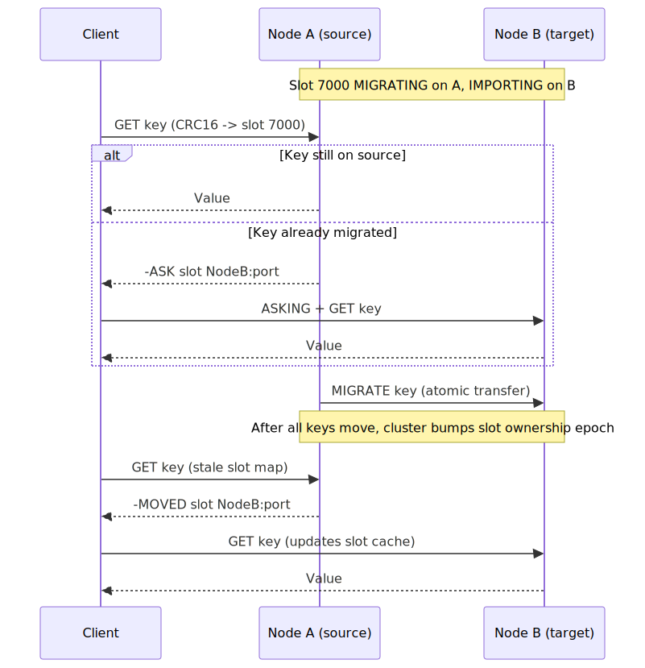
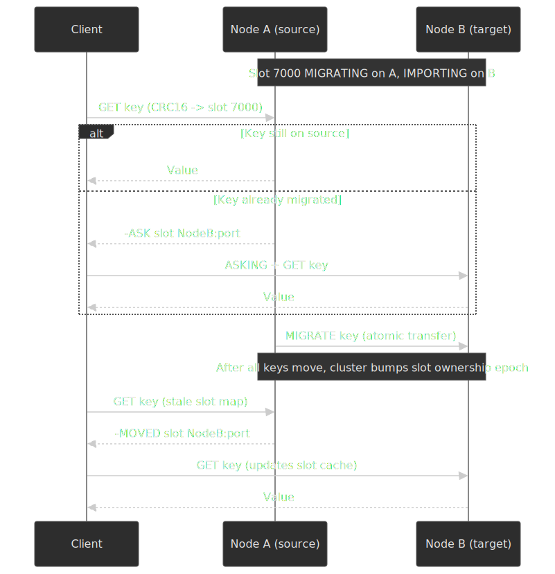
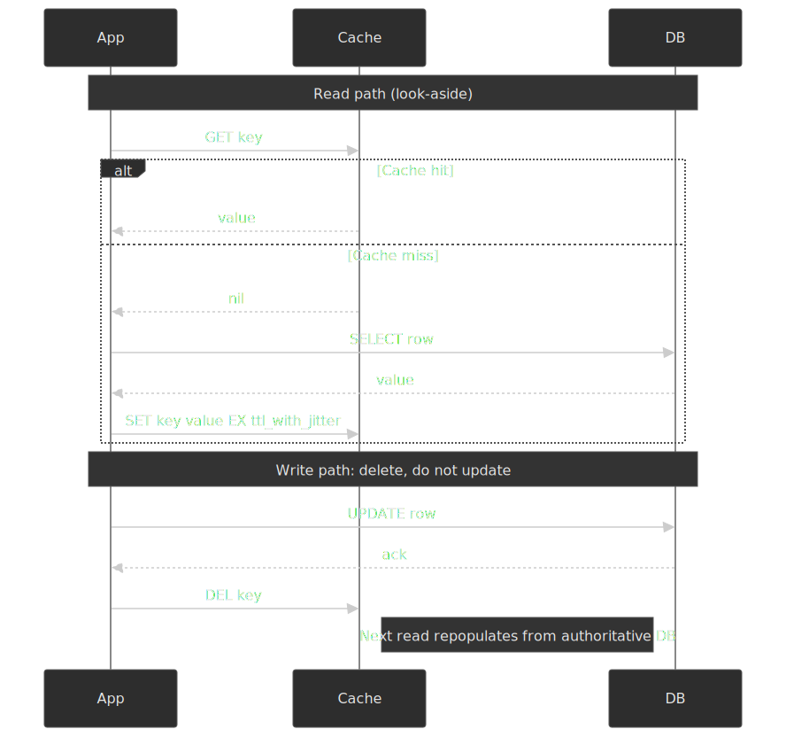
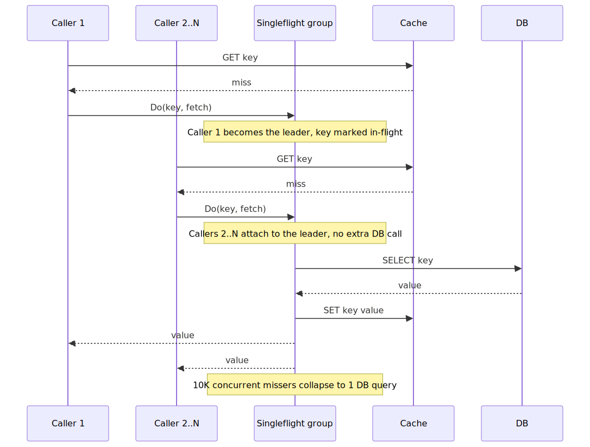
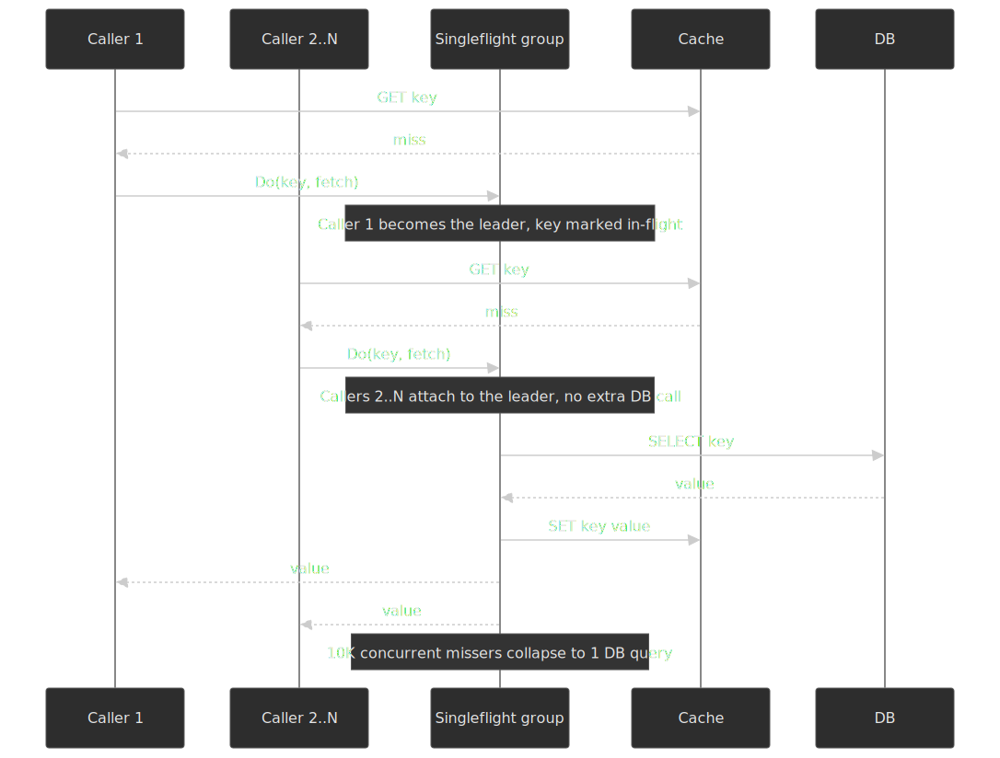
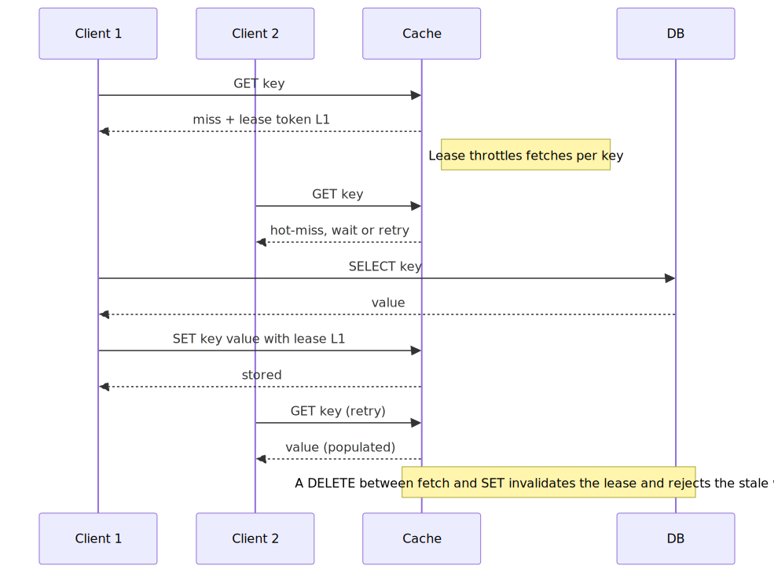
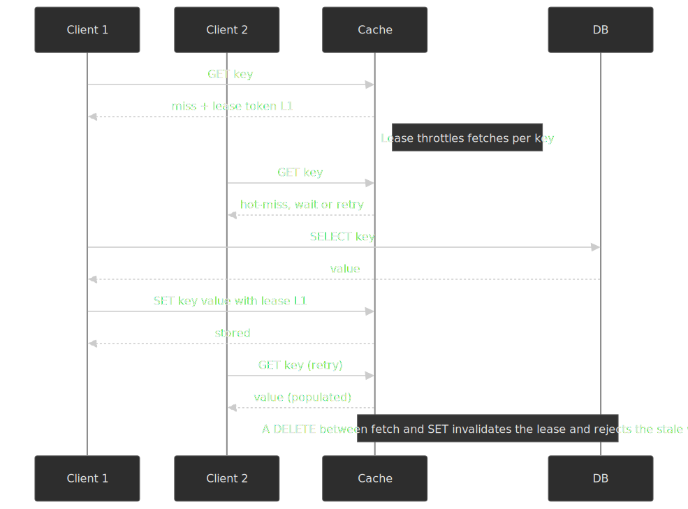

# Distributed Cache Design

A distributed cache trades RAM and operational complexity for latency. This article walks through the four design axes — topology, partitioning, replication, invalidation — then drills into Redis and Memcached internals, hot-key mitigation, stampede prevention, and the published patterns from Meta, Uber, Twitter, and Discord. The bar is: you should be able to pick a topology, a partitioning scheme, and an invalidation strategy with explicit reasoning and a known staleness budget.




## Mental model

Before any architecture, fix four words and what they trade against each other:

- **Topology** — where the cache lives relative to the application. Embedded (in-process), client–server (single external instance), or distributed cluster (sharded + replicated). Determines the failure domain and the smallest unit of consistency.
- **Partitioning** — how keys map to nodes. Modulo, consistent hashing, hash slots, jump hash. Determines what happens when nodes are added or fail.
- **Replication** — how copies of a key are kept in sync. Synchronous (durability, latency) vs. asynchronous (availability, eventual consistency). Caches almost always pick async.
- **Invalidation** — how stale entries are evicted or refreshed. TTL, look-aside delete-on-write, write-through, write-behind, or change-data-capture (CDC) streams. Determines the staleness window the application must tolerate.

Two facts make every choice harder than it looks. First, distributed systems have no global clock, so two updates to the same key at different sites cannot be ordered without explicit coordination — caches almost always sacrifice consistency for availability under [Brewer's CAP theorem](https://www.glassbeam.com/sites/all/themes/glassbeam/images/blog/10.1.1.67.6951.pdf). Second, real workloads are heavy-tailed: a few keys absorb most of the traffic, so the worst-behaved 0.01% of keys often determines the cluster's tail latency. Keep that in mind through the rest of this article — every topology, partitioning, and invalidation decision has to survive both.

## Cache topologies

### Embedded (in-process) cache

The cache lives inside the application process and is queried by a function call. There is no network hop, no serialization, and no shared memory across instances.

**Best when:** sub-microsecond reads matter, the dataset is small (< 1 GB), and your callers can tolerate per-instance staleness. Typical implementations: Caffeine on the JVM, in-process LRU/LFU on Go, Rust, or Python.

**Trade-offs:**

- Reads are essentially free — a hashtable lookup in user space.
- N application instances hold N copies. Memory cost scales linearly with fleet size.
- Invalidation requires coordination — pub/sub, gossip, or simply a short TTL plus willingness to serve stale data for a few seconds.
- Cold starts are visible: a new instance starts with no cache and is slower for tens of seconds.

> [!NOTE]
> Discord rewrote its Read States service from Go to Rust precisely because the in-process LRU cache (millions of entries) was triggering Go GC pauses every two minutes. Moving to Rust eliminated GC stop-the-world events entirely, so they could grow the cache to roughly 8 million entries without latency spikes — see [Why Discord is switching from Go to Rust](https://discord.com/blog/why-discord-is-switching-from-go-to-rust). The lesson is not "use Rust"; it is that an embedded cache makes you accountable for the runtime's memory pauses.

### Client–server (external) cache

A dedicated cache process (Redis, Memcached) sits behind a TCP socket and is shared across applications.

**Best when:** multiple services share data, the dataset exceeds a single process's heap, you want centralized expiration / eviction, or you need richer data structures (sorted sets, streams, pub/sub).

**Trade-offs:**

- One source of truth across the fleet — no cross-instance divergence.
- Network latency adds ~100–500 µs per round trip even on a fast LAN.
- Serialization and connection-pool management become real costs.
- A single Redis instance is hard-capped by one core for command execution (more on that below).

### Distributed cluster

Multiple cache nodes form a cluster. Keys are partitioned via consistent hashing or hash slots; each shard typically has one or more replicas.

**Best when:** the dataset exceeds single-node memory, throughput exceeds single-node capacity (>~200K ops/sec without pipelining, >~1M with pipelining), or you cannot accept a single point of failure.

**Trade-offs:**

- Horizontal scale and fault tolerance.
- Multi-key operations are constrained to a single shard (or expensive cross-shard coordination).
- Topology changes (add/remove node) require slot or key migration.
- Network partitions can produce split-brain — cluster managers (e.g., Redis Sentinel quorum) try to detect and limit it, but the design must assume it can happen.




### Decision matrix

| Factor                | Embedded         | Client–server     | Distributed cluster        |
| --------------------- | ---------------- | ----------------- | -------------------------- |
| Read latency          | ~100 ns          | ~100–500 µs       | ~100–500 µs                |
| Practical dataset     | < 1 GB / process | < 100 GB / node   | terabytes                  |
| Throughput ceiling    | process-bound    | per-instance core | aggregated across shards   |
| Consistency model     | per-instance     | single instance   | eventual + per-shard       |
| Operational overhead  | none             | low–medium        | medium–high                |
| Failure blast radius  | one process      | all clients       | partial (one shard / repl) |
| Cross-app sharing     | no               | yes               | yes                        |




### Hybrid L1 + L2

Most production systems combine topologies:

```text
request → L1 (in-process, ~100 ns, MB-scale)
        → L2 (cluster, ~500 µs, GB–TB scale)
        → DB (~1–10 ms)
```

L1 absorbs hot keys, removing tens of millions of cluster reads per second. L2 holds the working set and is the source of truth for cached data. Meta runs this pattern in production, with [look-aside Memcached clusters](https://engineering.fb.com/2013/04/15/core-infra/scaling-memcache-at-facebook/) backed by application-level local caches and cross-region delete streams.

## Redis architecture

### Single-threaded command execution

Redis executes every command on a single thread. This is a deliberate design choice and the source of much of its predictability.

- **No internal locks.** Atomic operations (`INCR`, `LPUSH`, `SADD`) are atomic by construction — the single thread serializes them.
- **Memory-bound, not CPU-bound.** Most Redis commands touch at most a few hashtable entries; a single core saturates the memory subsystem before CPU becomes a bottleneck.
- **Predictable tail latency.** No lock contention means consistent P99/P99.9, which is much harder to achieve in a multi-threaded design.
- **I/O multiplexing.** The event loop uses `epoll` (Linux) or `kqueue` (BSD) to multiplex thousands of connections on the single command thread.

**Throughput numbers, with the right caveats.** [The official `redis-benchmark` documentation](https://redis.io/docs/latest/operate/oss_and_stack/management/optimization/benchmarks/) reports >1.5M SET/sec and >1.8M GET/sec on commodity hardware, but only with pipelining (`-P 16`). Without pipelining, a single instance typically sustains roughly 100–200K ops/sec for simple GET/SET — the round-trip dominates. If your client cannot batch commands, plan for the lower number.

> [!IMPORTANT]
> Redis 8.0 ships an asynchronous I/O threading implementation that offloads socket reads, command parsing, and reply writing to worker threads while the main thread retains command execution and atomicity. With `io-threads=8` on a multi-core Intel CPU, [Redis reports a 37% to 112% throughput improvement depending on the command mix](https://redis.io/blog/redis-8-0-m03-is-out-even-more-performance-new-features/), and unlike the 6.x/7.x I/O threads, the new implementation supports TLS connections.

### Redis Cluster: hash slots

[Redis Cluster](https://redis.io/docs/latest/operate/oss_and_stack/reference/cluster-spec/) partitions the keyspace into a fixed 16,384 hash slots:

```text
slot = CRC16(key) mod 16384
```

Each node owns a contiguous (or non-contiguous) subset of slots. Clients cache the slot-to-node map and contact the owning node directly; on a stale map the node returns `-MOVED <slot> <ip>:<port>` and the client refreshes.

**Why 16,384?** It is small enough that a node's slot ownership fits in a 2 KB bitmap (cheap to gossip in heartbeats) and large enough that you can rebalance one slot at a time across hundreds of nodes without obvious lumpiness.

**Resharding mechanics.** When you migrate slot 7000 from node A to node B:

1. Mark the slot `MIGRATING` on A and `IMPORTING` on B.
2. Move keys atomically with `MIGRATE`.
3. Until the slot is fully moved, A returns `-ASK` redirects for keys that have already been transferred; the client re-issues with the `ASKING` prefix.
4. After the move completes, A returns `-MOVED` for that slot — every client refreshes its slot cache lazily on the first stale request.




**Multi-key constraints.** `MGET`, `MSET`, transactions, and Lua scripts are slot-local: every key must hash to the same slot. The escape hatch is **hash tags**: only the substring inside `{ }` is hashed, so `{user:123}:profile` and `{user:123}:settings` collocate to the same slot.

### Redis Sentinel: HA without sharding

[Sentinel](https://redis.io/docs/latest/operate/oss_and_stack/management/sentinel/) is the simpler high-availability story for single-master deployments. Three or more Sentinel processes monitor a Redis primary; on failure, a quorum elects a replica as the new primary and reconfigures clients via subscription.

| Aspect               | Sentinel                       | Cluster                              |
| -------------------- | ------------------------------ | ------------------------------------ |
| Scaling              | vertical                       | horizontal (auto-sharding)           |
| Data size            | single-node limit              | terabytes+                           |
| Operational overhead | low                            | medium–high                          |
| Failover             | Sentinel quorum                | cluster gossip + epoch bumps         |
| Multi-key ops        | unrestricted                   | same-slot only                       |
| Best for             | HA for small / medium datasets | sharded large-scale deployments      |

The decision rule is boring and useful: start with Sentinel, migrate to Cluster only when one node's RAM, CPU, or NIC genuinely runs out. The operational cost of Cluster is rarely worth paying preemptively.

## Memcached architecture

### Multi-threaded slab allocator

Memcached's design is the inverse of Redis's: it gives up Redis's data structures and persistence in exchange for clean multi-threading and tight memory predictability. From [the Memcached UserInternals wiki](https://github.com/memcached/memcached/wiki/UserInternals):

- Memory is pre-allocated in 1 MB **pages**.
- Each page is divided into fixed-size **chunks** belonging to a **slab class** (chunk sizes grow geometrically).
- An item lands in the smallest slab class that fits.
- LRU eviction is per slab class, so a flood of small items cannot evict large items.

This allocator eliminates external heap fragmentation in exchange for some internal fragmentation: a 100-byte item in a 128-byte chunk wastes 28 bytes. Tune the chunk-size factor for your value-size distribution.

**Threading model.** A single listener thread accepts TCP connections on port 11211 and hands each one to a worker thread. Workers run their own libevent loops and use fine-grained locking per slab class. Modern Memcached further splits each slab class into hot / warm / cold sub-LRUs to reduce lock contention on the LRU list.

### When Memcached beats Redis

- Pure key/value workloads where you do not need lists, sorted sets, streams, or pub/sub.
- Multi-core machines where you want the cache to scale with cores rather than with shards.
- Memory predictability matters more than persistence.
- Operations are limited to `GET`, `SET`, `DELETE`, `INCR`, `APPEND` — there is no Cluster mode and no command replay log.

### Client-side consistent hashing, twemproxy, and mcrouter

Memcached servers know nothing about each other; clients are responsible for picking the right server. The standard implementation is the **Ketama** ring (consistent hashing with 100–200 virtual nodes per server), but at scale you almost always sit a router in front:

- [**Twitter's twemproxy**](https://github.com/twitter/twemproxy) (also called nutcracker) is the lightweight option. It speaks both the Memcached and Redis protocols, performs consistent hashing, multiplexes client connections, and pipelines requests to backends. It is a *proxy*, not a cluster manager — it does not participate in failover and treats each backend as opaque.
- [**Meta's mcrouter**](https://github.com/facebook/mcrouter) is the heavier reference implementation. It speaks the Memcached ASCII/binary protocol, terminates client connections, multiplexes them onto a small connection pool per server, and adds [a reliable delete stream, prefix routing, replicated pools, two-level local/remote caching, and health checks](https://engineering.fb.com/2014/09/15/web/introducing-mcrouter-a-memcached-protocol-router-for-scaling-memcached-deployments/). The client just talks to mcrouter as if it were one big Memcached. In Meta's deployment, mcrouter is also the in-region delivery surface for the [`mcsqueal`](https://www.usenix.org/system/files/conference/nsdi13/nsdi13-final170_update.pdf) cross-region invalidation pipeline.

## Consistent hashing deep dive

### Why modulo hashing fails

The naive scheme `server = hash(key) mod N` is fine until `N` changes. Adding one server to a 10-server pool changes the modulus from 10 to 11, and roughly 90% of keys now hash to a different server. Every one of those keys is a cache miss, and the database immediately drowns in the resulting stampede.

### Karger consistent hashing (1997)

[Karger et al.](https://www.cs.princeton.edu/courses/archive/fall09/cos518/papers/chash.pdf) introduced consistent hashing to solve exactly this problem:

- Map each server and each key to a point on a logical ring (e.g., `[0, 2^32)`).
- A key belongs to the first server encountered clockwise from the key's position.
- Adding or removing a server only re-homes the keys in the arc between the new server and its clockwise neighbor — `K/N` keys on average, not `K`.

Without virtual nodes, server placement is uneven and load can vary by 50% or more. Each physical server is replicated as 100–1000 virtual nodes on the ring; the variance drops sharply with more replicas. The original paper measures a roughly 3.2% standard deviation in load with about 1000 points per server.




Discord open-sources their Elixir ring implementation as [`ex_hash_ring`](https://github.com/discord/ex_hash_ring); its default of 512 replicas per node is a reasonable starting point.

### Jump consistent hash (Google, 2014)

[Lamping & Veach](https://arxiv.org/abs/1406.2294) published a five-line algorithm with O(1) memory and near-perfect distribution:

```cpp
int32_t JumpConsistentHash(uint64_t key, int32_t num_buckets) {
    int64_t b = -1, j = 0;
    while (j < num_buckets) {
        b = j;
        key = key * 2862933555777941757ULL + 1;
        j = (b + 1) * (double(1LL << 31) / double((key >> 33) + 1));
    }
    return b;
}
```

Properties from the paper:

- O(1) memory — there is no ring or virtual-node table.
- Distribution is so close to uniform that the standard error is essentially numerical noise (the paper measures a sub-millionth-percent deviation).
- Adding bucket `N+1` moves exactly `1/(N+1)` of the keys from each existing bucket — the theoretical minimum.

The catch: buckets must be numbered 0 to N-1. Removing bucket K requires renumbering, so jump hash is a great fit for sharded databases with stable bucket counts (think: ad-serving features with hot reshards) and a poor fit for elastic cache pools where nodes come and go.

### Hash slots vs. ring hashing

| Aspect            | Karger ring          | Hash slots (Redis)        |
| ----------------- | -------------------- | ------------------------- |
| Granularity       | continuous ring      | 16,384 discrete slots     |
| Rebalancing       | per virtual node     | per slot                  |
| Metadata size     | O(virtual nodes)     | fixed 2 KB bitmap         |
| Implementation    | client library       | cluster gossip protocol   |
| Partial migration | not native           | native (`MIGRATING`/`IMPORTING`) |

Slots simplify cluster coordination: nodes only have to agree on slot ownership, not on continuous ring positions. The `-ASK` / `-MOVED` redirect protocol makes slot migration atomic from the client's point of view.

## Cache invalidation strategies

### The hard problem

> "There are only two hard things in Computer Science: cache invalidation and naming things." — Phil Karlton

Cache invalidation is hard because there is no global clock and no atomic write across cache + DB. Pick the strategy whose worst case you can live with, and document the staleness bound.

### Strategy 1: TTL

Every entry has an expiration time; once it expires, the next reader misses and re-populates. TTL is the safety net under every other strategy: even when explicit invalidation is buggy, the data stops being wrong after the TTL.

**Maximum staleness = TTL.** Pick TTL based on how stale the application can tolerate, not based on how often the data changes.

> [!WARNING]
> Synchronized expiration causes stampedes. If 10,000 keys are written in the same second with the same TTL, they all expire in the same second. Add jitter:
>
> ```python
> actual_ttl = base_ttl + random.uniform(0, jitter_seconds)
> ```

### Strategy 2: Cache-aside (look-aside)

The application owns the cache lifecycle. On read, check the cache; on miss, query the DB and populate. On write, update the DB and **delete** the cache entry. The next reader populates with the fresh value.

 — reads populate the cache on miss; writes delete the entry rather than updating it, so the next read pulls fresh data from the database.")


**Why delete, not update?** Updating the cache after a write opens a race that pins stale data:

```text
T1: read DB -> old
T2: write DB -> new
T2: SET cache new
T1: SET cache old   ← cache now stuck on old until TTL
```

Deleting closes that race because the next read fetches fresh data. This is the pattern Meta formalized as "look-aside" caching in [Scaling Memcache at Facebook (NSDI '13)](https://www.usenix.org/system/files/conference/nsdi13/nsdi13-final170_update.pdf), with leases on top to prevent thundering herds and stale sets (see below).

### Strategy 3: Write-through

The application writes to the cache; the cache synchronously writes to the database before acknowledging. Every write blocks on the slowest of the two. Strong consistency between cache and DB at the cost of write latency. Useful when reads dominate writes by orders of magnitude and stale reads are unacceptable.

### Strategy 4: Write-behind (write-back)

The application writes to the cache; the cache flushes to the DB asynchronously in the background. Writes are at memory speed, but a cache failure between write and flush loses data. Acceptable for non-critical write-heavy paths (counters, analytics, telemetry) where losing a few seconds of writes is cheaper than the latency of synchronous persistence.

### Strategy 5: CDC-driven invalidation

The DB emits change events (binlog, WAL, CDC stream like [Debezium](https://debezium.io/)). An invalidation service consumes the stream, maps each row change to the affected cache keys, and issues `DEL`s — typically also broadcasting to L1 caches via pub/sub.




The DB does not need to know about the cache; the stream is durable, so the invalidator can retry; one event can fan out to every cache tier. The cost is staleness: invalidation lags the write by the CDC pipeline's latency (typically 100 ms – 1 s).

### Strategy comparison

| Strategy        | Consistency model            | Write latency        | Failure mode                                | Best for                                  |
| --------------- | ---------------------------- | -------------------- | ------------------------------------------- | ----------------------------------------- |
| TTL only        | bounded staleness = TTL      | none                 | stale data until TTL expires                | rarely-changing data                       |
| Cache-aside     | eventual + delete-on-write   | one DEL              | race window between DB write and DEL        | most read-heavy workloads                  |
| Write-through   | strong (cache ↔ DB)          | DB latency           | cache failure → write fails                  | low write rate, strong consistency need    |
| Write-behind    | eventual, possibly lossy     | memory speed         | data loss on cache failure before flush     | counters, analytics, non-critical writes   |
| CDC stream      | bounded staleness ≈ CDC lag  | none on hot path     | stream backlog → invalidation lag           | multi-tier, multi-region invalidation      |

## Eviction policies

Invalidation removes entries that are *wrong*. Eviction removes entries the cache no longer has *room* for. Pick the wrong eviction policy and your hit ratio collapses long before you run out of RAM.

### LRU and its limits

Least-Recently-Used eviction discards the entry whose last access is oldest. It is the default in Memcached (per slab class) and Redis (`allkeys-lru`, `volatile-lru`). LRU is cheap to implement (a doubly-linked list with O(1) move-to-head) and adapts to recency, but it has two well-known failure modes:

- **Scan pollution.** A one-time linear scan over a large dataset evicts the entire working set; hit ratio crashes until reuse rebuilds it.
- **Frequency blindness.** A key accessed 1,000 times in the last hour is evicted before a key touched once five minutes ago.

### LFU and the freshness problem

Least-Frequently-Used keeps a counter per entry and evicts the lowest counter. Pure LFU never forgets: an item that was popular last year out-competes today's hot item forever. Redis ships an approximate LFU (`allkeys-lfu`) that decays counters on access ([`maxmemory-policy`](https://redis.io/docs/latest/operate/oss_and_stack/management/config/) defaults to `noeviction`, but LFU is the right pick for skewed read workloads) — see [Redis eviction policies](https://redis.io/docs/latest/operate/oss_and_stack/reference/eviction/).

### Segmented LRU (SLRU) and TinyLFU

Memcached's modern LRU is **segmented** into hot, warm, and cold sub-LRUs per slab class to amortize lock contention and protect frequently used items from a single scan. Caffeine on the JVM goes further with [**W-TinyLFU**](https://arxiv.org/abs/1512.00727) — Einziger, Friedman, and Manes (ACM TOS 13:4, 2017):

1. A **count-min sketch** (a few bits per key) tracks approximate access frequency in O(1) memory.
2. A **window LRU** (~1 % of the cache) lets brand-new items build frequency before they have to compete on it — the "sparse burst" defense.
3. The **main SLRU** admits a new item only if its sketch frequency exceeds the eviction candidate's. Old popularity is forgotten by periodically halving the sketch counters.

Caffeine's [efficiency benchmarks](https://github.com/ben-manes/caffeine/wiki/Efficiency) show W-TinyLFU matching ARC and beating LRU/LFU on database, search, and analytic workloads while preserving O(1) behavior. If you are picking an embedded cache today, default to W-TinyLFU.

### Default policy by workload

| Workload                                | Sensible default                                                    |
| --------------------------------------- | ------------------------------------------------------------------- |
| Embedded application cache (JVM, Rust)  | W-TinyLFU (Caffeine, `quick_cache`, `moka`)                         |
| Memcached server                        | Per-slab segmented LRU (default since Memcached 1.5)                |
| Redis with skewed reads                 | `allkeys-lfu` (approximate LFU with decay)                          |
| Redis with rolling time-window data     | `allkeys-lru` plus explicit per-key TTLs                            |
| Cache that must never silently evict    | `noeviction` plus monitoring on `evicted_keys`                      |

## Hot keys

### The Zipf reality

Production traffic is heavy-tailed: a small minority of keys absorbs most of the requests. Consistent hashing routes every read for a given key to the same node, so a hot key concentrates load on one shard regardless of cluster size. This is the most common reason for cache cluster overload.




### Solution 1: request coalescing (single-flight)

Multiple in-flight requests for the same key collapse into one DB read; everyone shares the result.

```go title="single-flight cache fetch"
import "golang.org/x/sync/singleflight"

var group singleflight.Group

func Get(key string) (Value, error) {
    v, err, _ := group.Do(key, func() (any, error) {
        return fetchFromDB(key)
    })
    return v.(Value), err
}
```

10,000 simultaneous requests become 1 DB query and 9,999 waiters. The trade-off: every waiter inherits the first request's latency, so a slow database stalls them all. The Go standard library exposes this in [`golang.org/x/sync/singleflight`](https://pkg.go.dev/golang.org/x/sync/singleflight); equivalents exist in most languages.




### Solution 2: an L1 in front of the L2

Replicate hot keys into per-instance L1 caches. Reads served from L1 do not touch the cluster. The L1 is eventually consistent: it expires via short TTL or is invalidated via pub/sub from the L2 layer. The diagram in the [Mental model](#mental-model) section shows the typical L1+L2 layout; see the [CDC invalidation flow](#strategy-5-cdc-driven-invalidation) for how cross-tier invalidation propagates.

### Solution 3: explicit hot-key replication

Detect hot keys (server-side via `redis-cli --hotkeys`, client-side rate counters, or offline log analysis) and replicate them onto N nodes. Clients pick a replica at random or round-robin. Twitter wrote about doing this for their timeline storage in [Handling Hotkeys in Timeline Storage at Twitter](https://matthewtejo.substack.com/p/handling-hotkeys-in-timeline-storage). The cost is N× memory per replicated key and a more elaborate invalidation path.

### Solution 4: key splitting (sharding within a key)

Split one logical key into N physical keys (`product:12345:0`, `:1`, …) and let the client pick a suffix at random. Distributes reads across nodes; writes have to update every shard. Best for read-heavy, write-rare data — product catalogs, configuration, feature flags.

### Solution 5: probabilistic early recomputation (XFetch)

Instead of refreshing the cache exactly at expiration, occasionally refresh early — with probability that grows as expiration approaches. Spreads the refresh load across the TTL window and prevents a synchronized stampede when popular keys expire.

```python title="XFetch (Vattani et al.)"
import math, random, time

def should_recompute(expiry_time, delta, beta=1.0):
    now = time.time()
    return now - delta * beta * math.log(random.random()) >= expiry_time
```

The algorithm and its proof of optimality are in [Vattani, Chierichetti, Lowenstein — Optimal Probabilistic Cache Stampede Prevention (VLDB 2015)](http://www.vldb.org/pvldb/vol8/p886-vattani.pdf). `delta` is the expected recomputation cost; `beta` tunes how aggressively to refresh early.

## Cache stampedes

### The thundering herd

A popular cache entry expires, thousands of requests miss simultaneously, every miss queries the database, and the database collapses under the duplicate load. Every cache eventually meets this failure mode.

### Solution 1: distributed locks

The first request acquires a short-TTL lock and fetches; other requests either wait for the lock or return stale data.

```python title="lock-based cache fetch"
def get_with_lock(key):
    value = cache.get(key)
    if value is not None:
        return value

    lock_key = f"lock:{key}"
    if cache.set(lock_key, "1", nx=True, ex=5):
        try:
            value = fetch_from_db(key)
            cache.set(key, value, ex=300)
            return value
        finally:
            cache.delete(lock_key)
    else:
        time.sleep(0.1)
        return get_with_lock(key)
```

Simple and effective. Watch out for lock-holder failures — always set a lock TTL — and for retry storms when the lock TTL is shorter than the DB query.

### Solution 2: stale-while-revalidate

Serve the stale entry immediately; refresh in the background. Latency stays low, the database sees one query per stampede, and the application accepts a brief staleness window. This is the pattern HTTP standardized as [`Cache-Control: stale-while-revalidate` (RFC 5861)](https://www.rfc-editor.org/rfc/rfc5861) at the CDN layer.

### Solution 3: leases (Meta's approach)

[Scaling Memcache at Facebook](https://www.usenix.org/system/files/conference/nsdi13/nsdi13-final170_update.pdf) introduces leases as a single mechanism that solves both stampedes and stale-set races:

1. On miss, the cache returns a small lease token along with the miss.
2. The token is required to set the value back into the cache.
3. Concurrent missers either wait for the populated value or receive a "hot miss" — only the lease holder is allowed to refill.
4. If a `DELETE` arrives between fetch and set, the lease is invalidated and the in-flight set is rejected — preventing the classic delete-vs-set race that pins stale data.




### Solution 4: gutter pool

A small secondary cache absorbs traffic when the primary fails or during a stampede.

```text
primary miss/fail → gutter cache → DB
```

Meta's gutter pool runs with a short TTL (seconds) so it does not become a second source of truth — it just shaves off the overload while the primary recovers or until the failed node is replaced.

## Multi-region caches

A single-region cache fronts a single-region database; a multi-region service has to decide what crosses regions and what does not. The four building blocks:

1. **Per-region cache cluster, asynchronous DB replication.** Each region has its own cache fronting its own DB replica. Reads stay local; writes go to the active-region primary; cache invalidation is the hard part.
2. **Invalidation broadcast.** A durable per-region change stream (CDC, Kafka, or Meta's [`mcsqueal`](https://www.usenix.org/system/files/conference/nsdi13/nsdi13-final170_update.pdf)) carries `DEL` messages from the write region to every replica region's cache. Bandwidth is small; staleness is bounded by stream lag.
3. **Optional value replication.** When the read region is read-heavy on the same key, ship the *value* (not just a delete) so the replica region warms its cache without a database round trip. [Netflix EVCache's cross-region replicator](https://netflixtechblog.com/building-a-resilient-data-platform-with-write-ahead-log-at-netflix-127b6712359a) does this through a Kafka WAL: the producer publishes only metadata, a regional reader fetches the value from local EVCache, then a writer synchronously sets it in the target region.
4. **Active-active or active-passive DB.** Determines whether you can write in any region (and need conflict resolution) or only one (and need failover).

 to every replica region. Cache staleness is bounded by stream lag, not by DB replication lag.")


### Write-through vs cache-aside across regions

Cache-aside scales effortlessly across regions because the application owns the cache and can issue local invalidations. Write-through is harder: the cache itself has to fan a synchronous write to every region's cache, and any region's failure stalls the write. The compromise most production systems pick is **cache-aside locally with asynchronous replication of invalidations across regions** — strong consistency inside one region, bounded staleness across regions.

[AWS DynamoDB DAX](https://docs.aws.amazon.com/amazondynamodb/latest/developerguide/DAX.consistency.html) is the rare managed write-through cache, but only within a single cluster: writes via the DAX client go to DynamoDB synchronously and then update the local item cache; intra-cluster replication to read replicas is asynchronous (sub-second). Writes that bypass DAX (or hit DynamoDB from another DAX cluster) leave the cache stale until the entry's TTL expires — a footgun worth flagging in any DAX migration.

### Managed multi-region caches

| Service                                                                                                    | Cross-region model                                                                                            | Consistency window                                              |
| ---------------------------------------------------------------------------------------------------------- | ------------------------------------------------------------------------------------------------------------- | --------------------------------------------------------------- |
| [AWS ElastiCache Global Datastore (Redis/Valkey)](https://docs.aws.amazon.com/AmazonElastiCache/latest/dg/Redis-Global-Datastore.html) | Active primary cluster + up to two read-only secondary clusters; managed async replication                    | Typically < 1 s; manual failover for DR                         |
| [Netflix EVCache](http://techblog.netflix.com/2016/03/caching-for-global-netflix.html)                     | Per-region clusters + Kafka-backed WAL replicating invalidations and (optionally) values across AWS regions   | Best-effort eventual; bounded by Kafka consumer lag             |
| [Meta Memcache regional pools + mcsqueal](https://www.usenix.org/system/files/conference/nsdi13/nsdi13-final170_update.pdf) | Master region writes; per-region delete pipeline broadcasts via mcrouter                                      | Bounded by mcsqueal queue lag; designed to avoid sync coordination |

The shared lesson is that nobody synchronously coordinates cache state across regions. The latency is too high, the failure modes are too coupled, and the staleness window of an async invalidation broadcast is acceptable for almost every workload that wasn't already going to require a multi-region database.

## Production case studies

### Meta — Memcache at billion-request scale

[Scaling Memcache at Facebook (NSDI '13)](https://www.usenix.org/system/files/conference/nsdi13/nsdi13-final170_update.pdf) is the canonical paper on running a giant Memcached deployment, and most of its lessons still apply.

Scale at the time of the paper: trillions of items, billions of requests per second, hundreds of Memcached nodes per cluster, multiple clusters per region, multiple regions. Loading a single popular page averages **521 distinct Memcache fetches**. Around 56% of page requests touch fewer than 20 servers; the remaining 44% touch more, and popular pages routinely contact more than 100 distinct servers — the canonical "all-to-all" communication pattern.

Key mechanisms from the paper:

- **Look-aside (cache-aside) with leases.** Already covered above.
- **Gutter pool** for overload absorption.
- **mcrouter** for connection multiplexing, consistent hashing, and protocol-level routing.
- **Regional pools** that shard by access locality and replicate the hottest cross-region keys.
- **Delete pipelines** that fan invalidation across regions over an asynchronous queue, so cross-region staleness is bounded by the queue's lag rather than synchronous coordination.

### Uber — CacheFront at 150M reads/sec

[How Uber Serves Over 150 Million Reads per Second from Integrated Cache with Stronger Consistency Guarantees](https://www.uber.com/us/en/blog/how-uber-serves-over-150-million-reads/) updates the earlier [40M reads/sec post](https://www.uber.com/us/en/blog/how-uber-serves-over-40-million-reads-per-second-using-an-integrated-cache/). Headline numbers, all from Uber's own blogs:

- 150M+ reads/sec at peak.
- >99.9% cache hit rate after a write-through consistency rework.
- Cache layer integrated into Docstore (Uber's database abstraction); developers do not manage cache directly.
- Keys partitioned by entity ID, independent of the underlying database shard key. The cache layer can rebalance without touching DB sharding.
- Sliding-window circuit breakers per cache node — when a node's error rate exceeds a threshold, requests fall through to the database rather than queueing on a sick node.

The architectural takeaway is the integration: Uber moved cache from a library that every service used incorrectly into a layer of their database that every service uses by default, then improved it once for everyone.

### Twitter — Haplo timeline cache, Nighthawk, Twemproxy, and Pelikan

Twitter's 2017 [The Infrastructure Behind Twitter: Scale](https://blog.x.com/engineering/en_us/topics/infrastructure/2017/the-infrastructure-behind-twitter-scale) puts the cache tier at hundreds of clusters with ~320M packets/sec aggregate. The key components:

- **Nighthawk** — sharded Redis used as the storage tier behind their cache APIs.
- **Twemcache** — Twitter's Memcached fork (still serving production traffic; the [public cache trace dataset](https://github.com/twitter/cache-trace) is collected from these clusters).
- **Twemproxy / nutcracker** — the in-house consistent-hashing proxy that fronts both Memcached and Redis backends and pipelines client requests onto a small backend connection pool. Open-sourced and still widely deployed beyond Twitter.
- **Pelikan** — the modular C++ cache framework that replaces Twemcache in newer clusters. Pelikan separates the protocol, threading, and storage layers so a single binary (e.g., `pelikan_pingserver`, `pelikan_twemcache`, `pelikan_segcache`) can swap storage modules to match the workload — see [Yao Yue's interview on building Pelikan](https://www.infoq.com/interviews/yue-twitter-pelikan-cache/).
- **Haplo** — a custom timeline cache built on a customized Redis with a "Hybrid List" data structure tuned for timeline access patterns. Used by the Timeline service and written to by the Fanout service ([source](https://blog.x.com/engineering/en_us/topics/infrastructure/2017/building-and-serving-conversations-on-twitter)).

Timelines use **fanout-on-write** for normal users (push the new tweet ID into every follower's timeline cache at post time, making reads O(1)), and **fanout-on-read** for accounts with millions of followers (do not push to millions of timelines; instead read those high-fanout accounts' tweets at read time and merge). This asymmetry trades write amplification for read latency — the right call when reads dominate writes by 1000:1.

### Netflix — EVCache, two trillion items across regions

[Caching for a Global Netflix](http://techblog.netflix.com/2016/03/caching-for-global-netflix.html) and Netflix's [2023 re:Invent deep dive](https://d1.awsstatic.com/events/Summits/reinvent2023/NFX304_How-Netflix-uses-AWS-for-multi-Region-cache-replication.pdf) describe EVCache, a Memcached fork that runs on roughly 22,000 EC2 instances across ~200 clusters, holding ~2 trillion items (~14 PB) at the time of the talk.

Three design decisions drive most of EVCache's behavior:

- **Topology-aware client.** The EVCache client knows AZ and region layout. Reads prefer the local AZ; writes fan to all replicas in the region; the client tolerates per-replica failures without falling through to the database.
- **`extstore` for hot/warm tiering.** EVCache leans on Memcached's [`extstore`](https://github.com/memcached/memcached/wiki/Extstore) extension to spill less-frequently-touched items onto NVMe SSD while keeping hot items in RAM, trading a few hundred microseconds for an order-of-magnitude capacity gain per node.
- **WAL-driven cross-region replication.** [Netflix's Write-Ahead Log](https://netflixtechblog.com/building-a-resilient-data-platform-with-write-ahead-log-at-netflix-127b6712359a) carries cache mutations between regions over Kafka. The producer publishes only metadata (key, TTL, timestamp); a regional reader fetches the value from the local EVCache cluster, sends it via REST to the destination region, and a writer commits it locally. For some namespaces, the WAL ships only a `DELETE` so cold remote regions do not pay for values they never read.

Consistency is **eventual** by design: there is no global lock, no quorum, and no transactional update across regions. The trade is explicit — Netflix accepts seconds of cross-region staleness in exchange for low-latency reads everywhere and the ability to serve traffic when an entire region is offline.

### Discord — embedded caches with deterministic memory

Discord's [Why Discord is switching from Go to Rust](https://discord.com/blog/why-discord-is-switching-from-go-to-rust) post is the cleanest published case study on the cost of an embedded LRU on a garbage-collected runtime. The Read States service tracks "what messages has each user read" — millions of entries, billions of reads, every message send touches the cache.

In Go, the LRU eviction set was so large that Go's GC scanned it every two minutes, blocking the service for ~250 ms. Discord rewrote the service in Rust, where eviction frees memory immediately and there is no GC. Result: average response times measured in microseconds, no periodic latency spikes, and the cache could grow to roughly 8M entries without deteriorating.

The lesson is not "Rust beats Go" in any general sense. It is that an embedded cache pushes you into the runtime's memory-management failure modes; you have to plan for them or pay an avoidable tail-latency tax.

## Common pitfalls

### Pitfall 1: caching without TTL

Setting cache entries with no expiration is the single most common cause of "stuck stale data" outages. Even when explicit invalidation is correct today, it will eventually have a bug, and TTL is the safety net that bounds the blast radius. Always set a TTL.

### Pitfall 2: cache–DB race conditions

Update-then-update orderings between cache and DB pin stale data when concurrent requests interleave. Always delete the cache after a successful DB write (look-aside), or use leases / version stamps to reject stale sets.

### Pitfall 3: ignoring serialization cost

Profiling shows ~1 ms cache round trip and the team declares victory — meanwhile JSON serialization of the cached object takes 8 ms on the application side. Profile the entire operation, not just the network call. Use compact serialization (Protobuf, MessagePack, FlatBuffers) for large objects, and consider caching the already-serialized bytes.

### Pitfall 4: hot-key blindness

Synthetic benchmarks distribute keys uniformly; production has a Zipf distribution where 0.01% of keys take 30% of the traffic. Monitor per-key request rates (`redis-cli --hotkeys` for Redis, application-side counters for Memcached) and have a hot-key playbook (request coalescing, L1 caching, replication, splitting) ready before you need it.

### Pitfall 5: invalidating ahead of a database migration

A schema or shard migration that triggers cache invalidation drives every read to the database at exactly the moment the database is busiest. Either suppress invalidation during the migration, warm the cache from the new schema before flipping reads, or shift traffic with a gradual percentage-based ramp.

## Practical takeaways

1. **Write the staleness budget into the design doc.** "Up to 60 seconds stale, except for permission checks" beats "we'll add a TTL later."
2. **Start with one Redis instance behind Sentinel.** Move to Cluster or to Memcached + mcrouter only when one node genuinely runs out of CPU, RAM, or NIC.
3. **Default to cache-aside with delete-on-write and a TTL.** Reach for write-through, write-behind, or CDC only when the staleness budget rules cache-aside out.
4. **Plan hot keys before they hit you.** Single-flight, L1, replication, splitting — pick one and have it ready.
5. **Always set a TTL,** even when explicit invalidation is correct. The TTL is your safety net for the day the invalidation logic is not.
6. **Design for graceful degradation.** Circuit breakers per node, fallback to the database, gutter pool, retries with jitter — caches fail and the system has to keep running.

## Appendix

### Prerequisites

- Hash functions, modular arithmetic, basic probability.
- CAP theorem and the "consistency–availability under partitions" trade-off.
- Familiarity with Redis or Memcached at the command level.

### Summary

- **Topology** ranges from embedded (per-instance, ~100 ns) to distributed cluster (terabytes, ~500 µs). Production usually layers them as L1 + L2.
- **Consistent hashing** minimizes key remapping during topology change. Virtual nodes balance load; jump consistent hash gives O(1) memory on stable bucket sets.
- **Hash slots** (Redis Cluster) trade ring continuity for explicit per-slot ownership and atomic migration over a gossip bus.
- **Invalidation** trades staleness for simplicity. TTL is the floor; cache-aside with delete-on-write is the default; CDC and write-through (DAX) cover the consistency-critical edges.
- **Eviction** matters as much as invalidation. LRU is the default; W-TinyLFU is the modern frequency-aware choice for embedded caches; Redis exposes approximate LFU per key class.
- **Hot keys** break uniform distribution. Use single-flight, L1, replication, splitting, and probabilistic early refresh.
- **Stampedes** are an operational certainty. Locks, stale-while-revalidate, leases, and gutter pools each address a different facet.
- **Multi-region** caches always rely on asynchronous invalidation (mcsqueal, Kafka WAL, ElastiCache Global Datastore). Synchronous cross-region cache coordination is not viable at typical inter-region latencies.

### References

- [Karger, D. et al. — Consistent Hashing and Random Trees (STOC 1997)](https://www.cs.princeton.edu/courses/archive/fall09/cos518/papers/chash.pdf)
- [Lamping, J. & Veach, E. — A Fast, Minimal Memory, Consistent Hash Algorithm (arXiv:1406.2294, 2014)](https://arxiv.org/abs/1406.2294)
- [Nishtala, R. et al. — Scaling Memcache at Facebook (USENIX NSDI 2013)](https://www.usenix.org/system/files/conference/nsdi13/nsdi13-final170_update.pdf)
- [Vattani, A., Chierichetti, F., Lowenstein, K. — Optimal Probabilistic Cache Stampede Prevention (VLDB 2015)](http://www.vldb.org/pvldb/vol8/p886-vattani.pdf)
- [Redis Cluster Specification](https://redis.io/docs/latest/operate/oss_and_stack/reference/cluster-spec/)
- [Redis Sentinel Documentation](https://redis.io/docs/latest/operate/oss_and_stack/management/sentinel/)
- [Redis Benchmark](https://redis.io/docs/latest/operate/oss_and_stack/management/optimization/benchmarks/)
- [Redis 8.0 I/O Threading](https://redis.io/blog/redis-8-0-m03-is-out-even-more-performance-new-features/)
- [Memcached UserInternals](https://github.com/memcached/memcached/wiki/UserInternals)
- [Memcached Protocol](https://github.com/memcached/memcached/blob/master/doc/protocol.txt)
- [Meta — mcrouter](https://github.com/facebook/mcrouter)
- [Meta — Scaling Memcache at Facebook (engineering blog)](https://engineering.fb.com/2013/04/15/core-infra/scaling-memcache-at-facebook/)
- [Uber — How Uber Serves Over 150 Million Reads per Second](https://www.uber.com/us/en/blog/how-uber-serves-over-150-million-reads/)
- [Uber — How Uber Serves Over 40 Million Reads per Second from an Integrated Cache](https://www.uber.com/us/en/blog/how-uber-serves-over-40-million-reads-per-second-using-an-integrated-cache/)
- [Twitter — The Infrastructure Behind Twitter: Scale](https://blog.x.com/engineering/en_us/topics/infrastructure/2017/the-infrastructure-behind-twitter-scale)
- [Twitter — Building and Serving Conversations on Twitter (Haplo)](https://blog.x.com/engineering/en_us/topics/infrastructure/2017/building-and-serving-conversations-on-twitter)
- [Twitter — Handling Hotkeys in Timeline Storage](https://matthewtejo.substack.com/p/handling-hotkeys-in-timeline-storage)
- [Discord — Why Discord is switching from Go to Rust](https://discord.com/blog/why-discord-is-switching-from-go-to-rust)
- [Discord — `ex_hash_ring`](https://github.com/discord/ex_hash_ring)
- [Twitter — twemproxy / nutcracker](https://github.com/twitter/twemproxy)
- [Twitter — Pelikan cache framework (Yao Yue interview)](https://www.infoq.com/interviews/yue-twitter-pelikan-cache/)
- [Twitter — Anonymized cache traces](https://github.com/twitter/cache-trace)
- [Netflix — Caching for a Global Netflix (EVCache)](http://techblog.netflix.com/2016/03/caching-for-global-netflix.html)
- [Netflix — Building a Resilient Data Platform with Write-Ahead Log (cross-region EVCache replication)](https://netflixtechblog.com/building-a-resilient-data-platform-with-write-ahead-log-at-netflix-127b6712359a)
- [Netflix — How Netflix uses AWS for multi-Region cache replication (re:Invent 2023)](https://d1.awsstatic.com/events/Summits/reinvent2023/NFX304_How-Netflix-uses-AWS-for-multi-Region-cache-replication.pdf)
- [Meta — Introducing mcrouter (engineering blog)](https://engineering.fb.com/2014/09/15/web/introducing-mcrouter-a-memcached-protocol-router-for-scaling-memcached-deployments/)
- [AWS — DynamoDB Accelerator (DAX) consistency model](https://docs.aws.amazon.com/amazondynamodb/latest/developerguide/DAX.consistency.html)
- [AWS — ElastiCache Global Datastore](https://docs.aws.amazon.com/AmazonElastiCache/latest/dg/Redis-Global-Datastore.html)
- [Einziger, G., Friedman, R., Manes, B. — TinyLFU: A Highly Efficient Cache Admission Policy (ACM TOS 2017)](https://arxiv.org/abs/1512.00727)
- [Caffeine — Efficiency benchmarks (W-TinyLFU)](https://github.com/ben-manes/caffeine/wiki/Efficiency)
- [Redis — Eviction policies](https://redis.io/docs/latest/operate/oss_and_stack/reference/eviction/)
- [Memcached — `extstore` (RAM + SSD tiering)](https://github.com/memcached/memcached/wiki/Extstore)
- [RFC 5861 — HTTP Cache-Control Extensions for Stale Content](https://www.rfc-editor.org/rfc/rfc5861)
- [Go `singleflight` package](https://pkg.go.dev/golang.org/x/sync/singleflight)
