# Distributed Consensus

Consensus is the problem of getting `N` machines to agree on a single value
even when some of them crash, the network drops or reorders messages, and
local clocks drift. Every replicated database, every leader-elected control
plane, and every blockchain you operate solves a version of it. This article
walks the design space top-down: why consensus is provably impossible in the
fully asynchronous model, how Paxos and Raft escape that result with
partial-synchrony assumptions, what Zab and Multi-Paxos do differently for
log replication, what changes when participants can lie (BFT), and where the
production failure modes actually live (almost always: disk
fsync, partition healing, and quorum sizing).

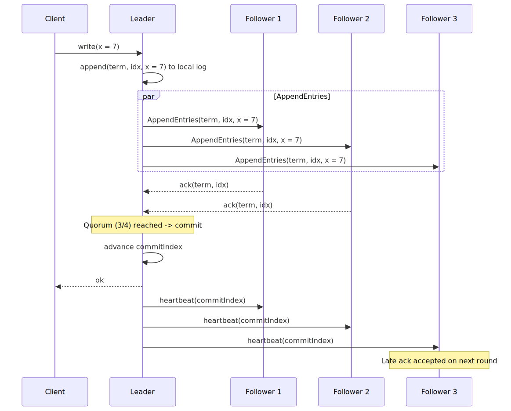
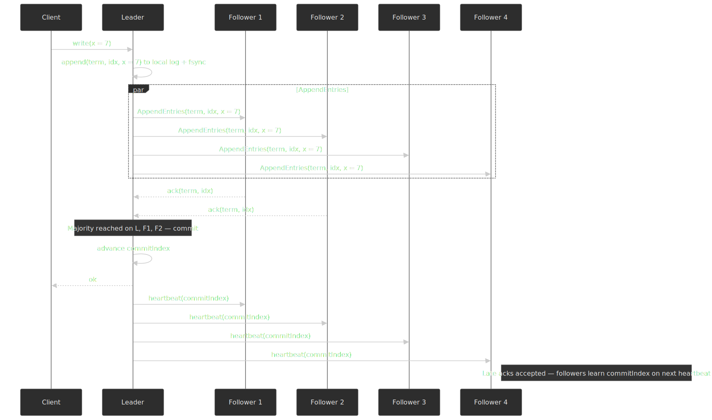

## Mental model

Five ideas you need before reading anything else:

1. **Consensus = atomic broadcast.** Single-value agreement and totally
   ordered broadcast are equivalent reductions of one another in the
   asynchronous-with-failures model[^chandra-toueg-1996]. Every
   "consensus protocol" you actually deploy — Multi-Paxos, Raft, Zab — is
   really an atomic broadcast that decides one log entry at a time.
2. **Safety holds always; liveness only sometimes.** Real protocols
   guarantee correctness (no two replicas commit different values for the
   same slot) under any network behaviour, but only guarantee progress
   when the network is "well-behaved enough" — typically the partial
   synchrony assumption of [Dwork, Lynch, and Stockmeyer
   (1988)][dls-1988].
3. **Quorum intersection is the load-bearing primitive.** If every
   decision is taken by some quorum `Q` and any two quorums share at
   least one node, no committed value is ever lost. Majorities are the
   easiest way to satisfy this — but [Flexible Paxos][fpaxos] showed they
   are not the only way.
4. **A leader is an optimisation, not a requirement.** Classical Paxos is
   leaderless and symmetric; Raft, Zab, Multi-Paxos, ViewstampedReplication,
   and PBFT all elect a leader to amortise the prepare phase across many
   decisions. Leaders cut steady-state messages from `O(n)` round-trips per
   value to one, at the cost of a more complex view-change.
5. **Crash-fault and Byzantine-fault costs are different.** Tolerating `f`
   crashes needs `2f + 1` nodes; tolerating `f` Byzantine nodes (lying,
   colluding, equivocating) needs `3f + 1`[^byzantine-1982]. The factor
   of two on the bound is the headline cost of moving from
   trusted-operator to adversarial environments.

| Protocol           | Failure model        | Min nodes for `f` faults | Steady-state messages per value | Production examples              |
| ------------------ | -------------------- | ------------------------ | ------------------------------- | -------------------------------- |
| Paxos / Multi-Paxos | Crash, async         | `2f + 1`                 | `O(n)` after stable leader      | Spanner, Chubby, DynamoDB[^dyn-2022] |
| Raft                | Crash, async         | `2f + 1`                 | `O(n)` after stable leader      | etcd, Consul, CockroachDB, TiKV  |
| Zab                 | Crash + primary order | `2f + 1`                 | `O(n)` after stable primary     | ZooKeeper                        |
| Viewstamped Replication | Crash, async      | `2f + 1`                 | `O(n)` after stable primary     | Original VR, MongoDB-style designs |
| PBFT                | Byzantine, partial sync | `3f + 1`              | `O(n²)` per slot                | Hyperledger Fabric (variants)    |
| HotStuff / DiemBFT  | Byzantine, partial sync | `3f + 1`              | `O(n)` per phase[^hotstuff-2019] | Diem/Aptos, Espresso             |

> [!NOTE]
> "Paxos" refers to many things in the literature: the original
> single-decree Synod protocol, Multi-Paxos with a stable leader, Fast
> Paxos, Generalised Paxos, EPaxos, and Flexible Paxos. Whenever the
> distinction matters this article uses the precise name.

## Why consensus is hard: FLP and its escape hatches

The [Fischer–Lynch–Paterson theorem (1985)][flp-1985] proves that in a fully
asynchronous message-passing system where even **one** process may crash,
no deterministic protocol can guarantee that consensus terminates in every
execution. The proof (FLP §3, Lemmas 2–3) is constructive: it builds an
adversarial scheduler that keeps the system perpetually "bivalent" — able
to decide either `0` or `1` — by carefully delaying the single message
whose ordering would force the decision. Termination, not safety, is what
FLP takes from you.


Three load-bearing assumptions in the FLP model are what real systems
relax:

- **Fully asynchronous network.** Messages can be delayed arbitrarily but
  not lost. Partial synchrony — where the network is async only for
  bounded periods — is the standard escape hatch.
- **Deterministic protocol.** No randomness allowed. Adding coin flips
  changes the picture: [Ben-Or (1983)][ben-or-1983] showed an
  asynchronous Byzantine agreement protocol that terminates with
  probability `1`, even though any single round may fail.
- **At least one crash.** Without crashes, even synchronous voting is
  trivial.

### The three practical escape hatches

**1. Partial synchrony.** Assume the network is asynchronous most of the
time but eventually behaves synchronously long enough for the protocol to
make progress. Safety holds always; liveness holds eventually. This is
the [DLS model][dls-1988] and the foundation under every leader-based
protocol you actually run. In Raft and Multi-Paxos this assumption shows
up as the election timeout: if the leader fails to heartbeat within a
bounded window, followers assume "the network has been async long
enough" and start a new view.

**2. Randomisation.** Use random coin flips (or a verifiable random
function) to break adversarial schedules. Ben-Or's protocol, Rabin's
shared-coin protocol, and modern random-leader BFT protocols
(Algorand-style) all sit in this branch.

**3. Failure detectors.** Treat "is node `X` alive?" as an oracle. Even
an unreliable oracle suffices: [Chandra and Toueg (1996)][ct-1996]
showed that the eventually-weak detector class `◇W` is enough for
consensus given a majority of correct processes, and
[Chandra–Hadzilacos–Toueg (1996)][cht-1996] proved that the
eventual-leader detector `Ω` is the *weakest* failure detector that
solves consensus. Implementing `Ω` in practice is what every Raft
heartbeat loop is doing.

> [!IMPORTANT]
> FLP is not "consensus is impossible." It is "no protocol can give you
> a worst-case bound on termination under fully adversarial scheduling."
> Real networks are not adversarially scheduled, so timeouts are enough
> in practice — but the result is what forces every production protocol
> to expose a tunable: election timeout, heartbeat interval, lease TTL.

## Paxos: the foundation

Lamport's [Part-Time Parliament][ptp-1998] (TOCS 1998, originally
submitted in 1990) is the classical consensus algorithm. It is not
historically the first — [Oki and Liskov's Viewstamped Replication
(PODC 1988)][vr-1988] arrived a year earlier and provides the same
guarantees with a primary-backup framing — but Paxos is the one whose
framework other protocols mostly build on. Lamport's later [Paxos Made
Simple][pms-2001] is the readable presentation; the original is
deliberately allegorical.

### Roles and the two phases

Paxos splits the protocol into three roles, usually colocated on the
same physical nodes:

- **Proposers** initiate proposals.
- **Acceptors** vote on them.
- **Learners** observe what was decided.

Each consensus round is identified by a globally unique, monotonically
increasing **proposal number** `n` (often a `(round, node-id)` pair so
that ties break deterministically).

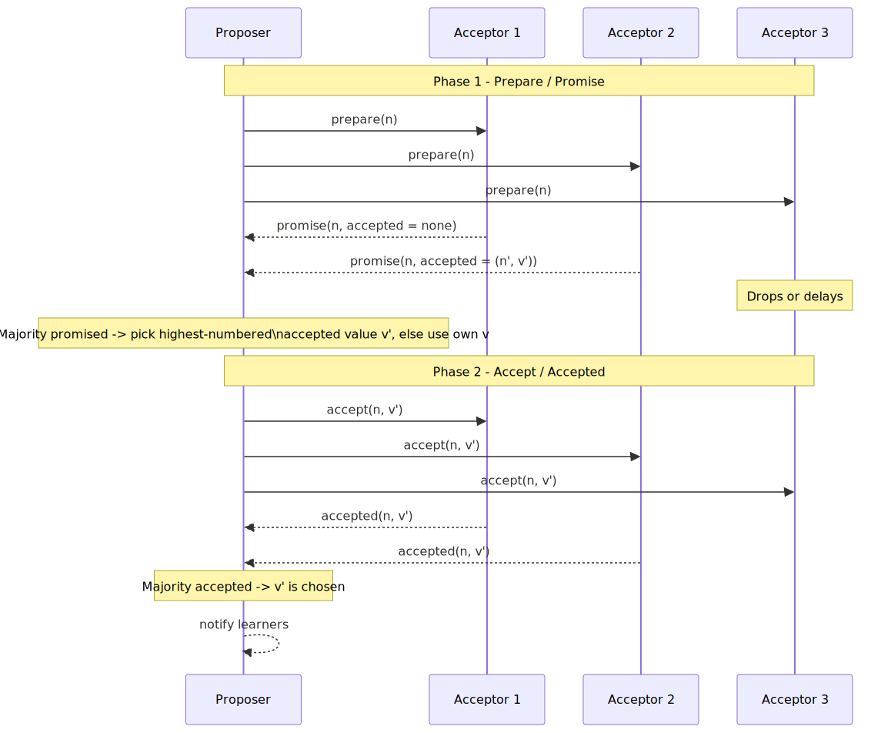
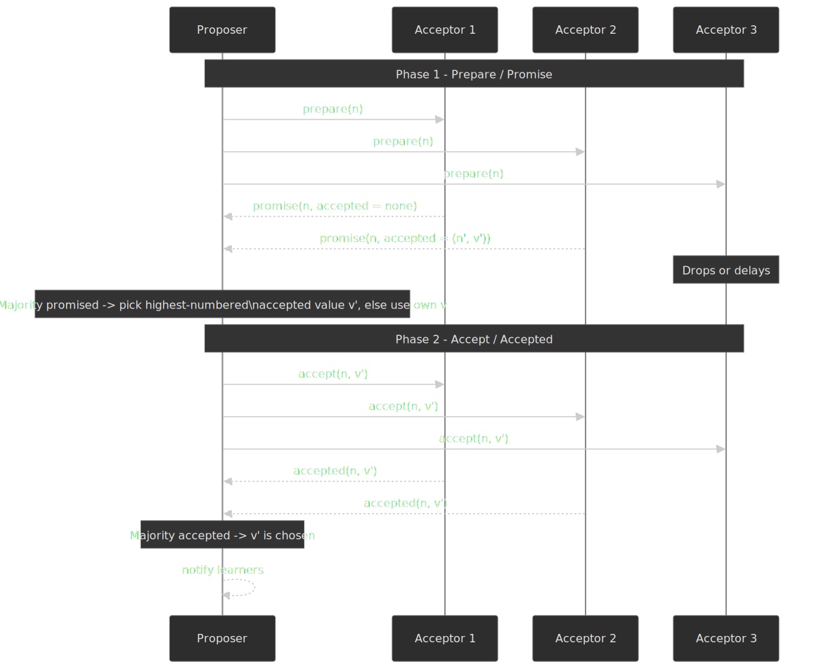

**Phase 1 — Prepare / Promise.** A proposer picks a fresh `n` and sends
`prepare(n)` to a majority of acceptors. Each acceptor either ignores
the prepare (because it has already promised something `≥ n`) or
responds with `promise(n, accepted)` carrying the highest-numbered
value it has previously accepted, if any. Once the proposer hears from a
majority it knows two things: no acceptor in that majority will accept
any older proposal, and if the slot already has an outcome it will be
the value carried by the highest-numbered promise.

**Phase 2 — Accept / Accepted.** The proposer sends `accept(n, v)` —
where `v` is the highest-numbered accepted value from Phase 1, or its
own value if the slot was empty — to (at least) the same majority. An
acceptor that has not promised to a higher proposal accepts and replies.
Once a majority accepts, the value is **chosen**. Any subsequent prepare
with a larger `n` that touches that majority will discover the chosen
value and propagate it.

The whole correctness argument rides on **quorum intersection**: every
two majorities share at least one acceptor, so the highest-numbered
accepted value follows the proposer through Phase 1 and cannot be
overwritten.

### Why "Paxos Made Simple" still produces hard implementations

Single-decree Paxos is concise. Real systems need **Multi-Paxos** —
agreement on a sequence of slots — plus catch-up, snapshotting, leader
stability, and reconfiguration. The team that built Google's Chubby
service [described the gap bluntly][pml-2007]:

> There are significant gaps between the description of the Paxos
> algorithm and the needs of a real-world system.

The gaps they listed (and that every implementor still hits) are:

- **Liveness under contention.** Two competing proposers can livelock,
  each invalidating the other's prepare. Multi-Paxos elects a stable
  distinguished proposer; protocols like
  [Mencius](https://www.usenix.org/legacy/event/osdi08/tech/full_papers/mao/mao.pdf)
  rotate the role.
- **Disk durability.** Every promise and accept must hit stable storage
  before the acceptor replies. fsync latency, not network RTT, ends up
  bounding throughput.
- **Catch-up.** A fallen-behind acceptor needs to replay missed slots
  without holding up new proposals.
- **Reconfiguration.** Adding or removing acceptors. Lamport revisited
  this in
  [*Reconfigurable State Machines*](https://lamport.azurewebsites.net/pubs/reconfiguration.pdf)
  in 2009; production systems instead borrow Raft-style mechanisms (see
  below).
- **Fast Paxos and friends.** [Fast Paxos][fast-paxos-2006] saves a round
  trip in the common case at the cost of needing larger quorums (at
  least `⌈3n/4⌉`) — an early example of the quorum-vs-latency knob that
  Flexible Paxos later generalised.

### Multi-Paxos: a stable leader

Basic Paxos pays two round-trips per decided value. Multi-Paxos pins a
distinguished proposer and runs Phase 1 once for an entire window of
sequence numbers. Each new value then needs only Phase 2: a single
round-trip from leader to majority. If the leader fails, a new leader
must run Phase 1 against the same range to recover any partially
committed slots before proposing fresh ones.

The cost is the operational complexity of leader leases, lease renewal
under skew, and disambiguating "I am no longer leader" from "my
proposal is just slow." Most production "Paxos" systems are really
Multi-Paxos with a leader-lease optimisation on top.

### Cheap Paxos and leaderless variants

Two more Paxos variants matter for the design space, even though almost
no one runs them in plain form:

- **Cheap Paxos** ([Lamport & Massa, DSN 2004][cheap-paxos-2004]) keeps
  `f + 1` "main" acceptors that handle the steady state and `f`
  "auxiliary" acceptors that only participate when a main acceptor is
  unavailable. The total node count is still `2f + 1`, but the
  auxiliaries can be small / cheap (a witness VM, a phone) — the design
  is the ancestor of every "witness" and "tiebreaker" replica that
  modern systems ship with.
- **EPaxos (Egalitarian Paxos)** ([Moraru, Andersen, Kaminsky, SOSP
  2013][epaxos-2013]) is the canonical leaderless multi-decree variant.
  Any replica can propose, and *non-conflicting* commands commit in a
  single round-trip via a "fast quorum" of size `⌊3f/2⌋ + 1`.
  Conflicting commands fall back to a two-round slow path that
  establishes a dependency order. EPaxos's appeal is geographic
  load-spreading (no leader bottleneck), but the dependency tracking is
  notoriously fiddly to implement correctly — recent work
  ([EPaxos Revisited, NSDI 2021][epaxos-revisited]) identified
  long-standing recovery bugs in the original protocol. Almost every
  production "EPaxos-flavoured" system ships a substantially modified
  variant.

### Flexible Paxos: quorums revisited

The classical proof requires every two quorums to intersect. [Howard,
Malkhi, and Spiegelman's Flexible Paxos (OPODIS 2016)][fpaxos] showed
that this is overconservative: only the **Phase 1 quorum** of any round
must intersect with the **Phase 2 quorum** of every previous round. Two
Phase 2 quorums in the same round may be disjoint.

 and phase-2 (replication) quorums; majorities everywhere are sufficient but not necessary.")

The practical consequence: you can shrink the hot-path Phase 2 quorum
(faster commits, lower throughput-floor) by paying with a larger Phase 1
quorum (slower, infrequent leader changes). [Heidi Howard's blog][fp-blog]
walks the design space; CockroachDB's
[Quorum Leases](https://www.cockroachlabs.com/blog/quorum-leases/)
applies similar reasoning to read-only quorums.

### Zab and ZooKeeper

ZooKeeper does not run Paxos. It runs **Zab** (ZooKeeper Atomic
Broadcast), introduced in [Junqueira, Reed, and Serafini's DSN 2011
paper][zab-2011]. Zab is a primary-order atomic broadcast protocol
optimised for ZooKeeper's use case — coordination primitives backed by a
hierarchical znode tree.

The differences from Multi-Paxos that matter in practice:

- **Explicit primary, not symmetric proposers.** All writes go through
  the primary; the primary's transactions commit in the order it
  proposes them.
- **Prefix property.** If transaction `m` is delivered, every
  transaction the primary proposed before `m` has been delivered. This
  is stronger than what multi-decree Paxos gives you across leader
  changes, where two distinguished proposers might interleave decisions
  for adjacent slots.
- **Recovery first, then activation.** A new primary cannot accept
  client requests until it has pushed its committed prefix to a quorum.

ZooKeeper trades that primary-order guarantee for a slightly larger
recovery cost; in exchange you get a small, well-tested coordination
kernel that almost every Hadoop-era system bolted on top of.

> [!NOTE]
> The classic example was Apache Kafka, which used ZooKeeper for broker
> metadata, controller election, and consumer offsets. KRaft (Kafka's
> self-managed Raft quorum, [KIP-833][kip-833]) was marked
> production-ready in **Kafka 3.3.1 (October 2022)**, ZooKeeper mode
> was deprecated in 3.5, and ZooKeeper support was **fully removed in
> [Kafka 4.0 (March 2025)][kafka-4-blog]**. New Kafka clusters are
> KRaft-only.

## Raft: designed for understandability

[Raft (USENIX ATC 2014)][raft-paper] is a deliberate redesign of
Multi-Paxos with one explicit goal — being easier to teach, prove, and
implement. The paper opens with that as the thesis:

> Our approach was unusual in that our primary goal was understandability:
> could we define a consensus algorithm for practical systems and describe
> it in a way that is significantly easier to learn than Paxos?

Raft buys understandability with three opinionated decisions:

| Paxos                      | Raft                              | Pay-off                                       |
| -------------------------- | --------------------------------- | --------------------------------------------- |
| Any node can propose       | Only the current leader proposes  | One source of truth for log order             |
| Acceptors may have gaps in their accepted slots | Followers' logs are strict prefixes of the leader's | Easier recovery; leader pushes one log forward |
| Symmetric reasoning        | Three explicit roles (Follower, Candidate, Leader) | Implementations are state machines, not graphs |

### State machine and election

Each Raft node is in one of three roles: **Follower**, **Candidate**, or
**Leader**. Time is divided into **terms** — Raft's logical clock — each
of which has at most one leader.


A follower that does not hear from the leader within its **election
timeout** transitions to candidate, increments its term, votes for
itself, and asks every peer for a vote. A candidate wins if it collects
votes from a majority for the same term. Two refinements that every
production implementation enables:

- **Randomised timeouts.** Each node draws its election timeout from a
  small range (the paper uses 150–300 ms as a study setting). Different
  timeouts make split votes statistically rare.
- **Vote restriction.** A node only grants a vote if the candidate's log
  is at least as up-to-date — same term with a longer log, or a higher
  last-log term. Combined with the leader-completeness invariant, this
  is what guarantees no committed entry is ever lost across leader
  changes.
- **PreVote.** Before bumping its term, a candidate runs a non-binding
  pre-election to check it would actually win. Without PreVote, a node
  that was network-partitioned and came back with an inflated term
  forces the legitimate leader to step down even though the cluster was
  healthy. PreVote was introduced in §9.6 of [Ongaro's
  dissertation][raft-thesis] and is exposed as `--pre-vote` in
  [etcd][etcd-prevote] and the equivalent flag in TiKV's `raft-rs`.

### Log replication and the safety invariants

The leader receives client writes, appends them to its local log, and
sends `AppendEntries` RPCs to every follower. A follower acknowledges
once the entry is on its disk; the leader advances its `commitIndex`
once a majority — counting itself — has acknowledged. Followers learn
the new commit index on the next heartbeat or `AppendEntries`.

The Raft paper identifies five named safety properties that a correct
implementation must preserve:

1. **Election Safety** — at most one leader per term.
2. **Leader Append-Only** — a leader never overwrites or deletes
   entries in its own log; it only appends.
3. **Log Matching** — if two logs contain an entry with the same index
   and term, the logs are identical in all preceding entries.
4. **Leader Completeness** — if an entry is committed in some term, it
   appears in the log of every leader of all higher-numbered terms.
5. **State Machine Safety** — if a node has applied an entry at a given
   index, no other node ever applies a different entry at the same
   index.

Together those five buy the same end-to-end guarantee as Multi-Paxos.
"Log Matching" is the workhorse: the consistency check on each
`AppendEntries` (the leader includes the index and term of the entry
*before* the new one) lets a follower detect divergence in `O(1)` and
forces the leader to walk back `nextIndex` until logs agree.


> [!IMPORTANT]
> A leader can only mark entries from its **current term** as committed
> by counting acks. Entries from prior terms become committed only
> indirectly — by being the prefix of a current-term entry that reaches
> quorum. Raft §5.4.2 calls this out as the consequence of Figure 8: a
> leader that naively commits a replicated-but-not-current-term entry
> can have it overwritten by a future leader.

### Linearizable reads without paying a Raft round

Naively, a linearizable read needs a fresh consensus round to confirm
the leader is still the leader. That doubles read latency. Two
optimisations are now standard:

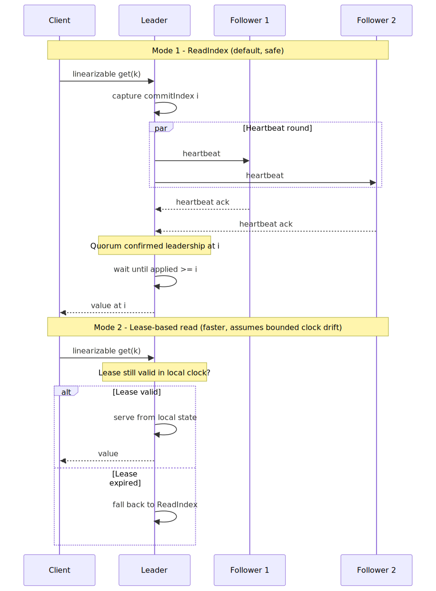
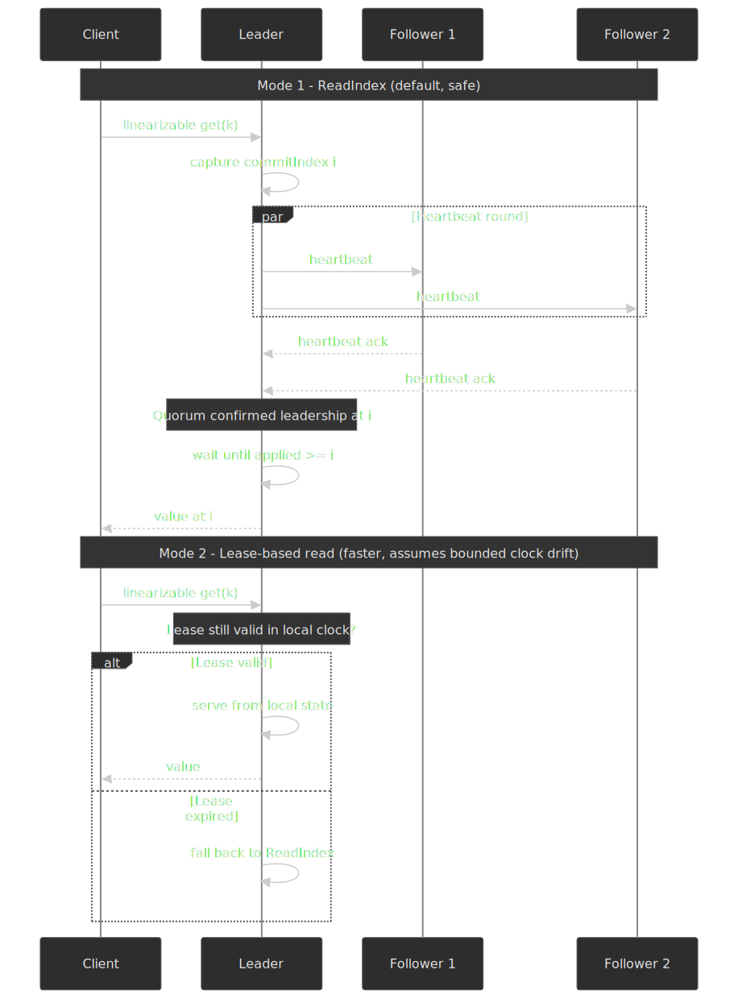

- **ReadIndex** (Raft thesis §6.4, default in [etcd][etcd-api]). The
  leader records its current `commitIndex`, sends a heartbeat, and
  waits for quorum acks. Once it confirms it is still leader, it serves
  the read from local state at that index. No new log entry, but still
  one round-trip of network confirmation.
- **Lease-based reads.** While the leader holds a valid heartbeat
  lease, it serves linearizable reads with no network round-trip at
  all. Safety relies on bounded clock drift between leader and
  followers — a much stronger assumption than ReadIndex needs. etcd
  exposes this as `ReadOnlyLeaseBased` and explicitly warns about
  clock-skew sensitivity.

CockroachDB pushes this further: every range has a **leaseholder** that
serves linearizable reads from local state. By default the leaseholder
is colocated with the Raft leader[^crdb-leaseholder]; a lease-transfer
machinery keeps them together so that the read-serving replica is
always the one driving the consensus group, avoiding an extra hop.

### Membership changes

Adding or removing nodes is the second-classic Raft footgun. Naively
swapping `Cold` for `Cnew` allows two disjoint majorities to exist
simultaneously and commit conflicting values. The original Raft paper
solves this with **joint consensus**: enter a transitional configuration
`Cold,new` that requires a majority of *both* committees, then commit
`Cnew`. The Raft thesis chapter 4 introduces a simpler **single-server
membership change** — only one node added or removed at a time, so
the old and new majorities always intersect. That algorithm had a known
liveness/safety bug across leader changes; the fix is for a leader to
commit a no-op from its current term before processing any membership
change[^single-server-bug].

Most production Raft implementations use the single-server variant plus
a non-voting **Learner / staging** role. etcd added Learners in
[v3.4][etcd-learner]: the new node receives `AppendEntries` like a
follower but does not count toward quorum or vote until the operator
promotes it. That eliminates the most common reconfiguration outage,
which is adding a slow new member and pushing the cluster onto a
quorum that includes a node still snapshotting its initial state.

### Raft in production: etcd

[etcd][etcd-home] is the most widely deployed Raft implementation. It
backs Kubernetes (every cluster keeps API-server state in etcd), CoreDNS
service discovery, M3DB, and any number of internal control planes. It
graduated to a CNCF top-level project in [November 2020][etcd-graduate].

The performance envelope is dominated by two things:

- **fsync latency.** Every Raft entry must be on the leader's disk
  before the leader counts its own ack, and on each follower's disk
  before the follower acks. etcd's hardware guidance is uncompromising:
  the Prometheus metric `wal_fsync_duration_seconds` should keep its
  99th percentile under **10 ms** in production[^etcd-fsync].
- **Heartbeat / election timing.** etcd's defaults are
  `heartbeat-interval = 100 ms` and `election-timeout = 1000 ms`. The
  [tuning guide][etcd-tuning] requires `election-timeout ≥ 10 × RTT`
  between members; cross-region clusters typically run
  `heartbeat-interval ≈ RTT` and election timeouts of several seconds.

> [!WARNING]
> The most common Kubernetes-control-plane outage is "etcd cluster on
> shared/network-attached storage starts seeing P99 fsync above 10 ms,
> which causes the leader to miss its heartbeat window, which triggers
> an unnecessary election, which forces a snapshot to catch the
> followers up, which makes fsync worse." Alert on
> `etcd_disk_wal_fsync_duration_seconds` p99, not just averages, and
> isolate etcd from noisy neighbours on the same disk.

## Quorum systems

Quorum overlap is the engine that makes everything in this article work.
Beyond the Paxos and Raft majorities, two ideas are worth knowing:

### Read/write quorums

The classical [Gifford weighted voting][gifford-1979] result says a
replicated register is linearizable if every read intersects every write
— that is, `R + W > N`. The same arithmetic is the foundation under
Dynamo-style stores ([Cassandra][cassandra-consistency], [DynamoDB][dyn-2022],
Riak), where `R`, `W`, and `N` are exposed to the client per operation:

| Configuration | `R` | `W` | Trade-off                                        |
| ------------- | --- | --- | ------------------------------------------------ |
| Read-heavy    | `1` | `N` | Fast reads, slow and partition-sensitive writes  |
| Write-heavy   | `N` | `1` | Fast writes, expensive reads                     |
| Balanced      | `⌈(N+1)/2⌉` | `⌈(N+1)/2⌉` | Equal latency; what consensus systems do |

Consensus systems fix `R = W = ⌈(N+1)/2⌉` because they need
linearizability *across slots*, not just per register. Dynamo-style
systems give up that cross-slot ordering in exchange for per-operation
tunability.

### Witnesses and learners

Two-node consensus is impossible (no majority survives any failure), but
real deployments still need to tolerate one failure on a budget. The
standard answer is a **witness** node: it participates in elections and
log durability for metadata only, no data. Microsoft Azure Storage uses
witnesses in stretch deployments, etcd Learners are the Raft equivalent
on the read path, and several Paxos implementations expose
"non-voting members" with similar semantics.

## Byzantine fault tolerance

Crash-fault tolerance assumes failed nodes simply stop responding.
Byzantine fault tolerance (BFT) assumes failed nodes can do anything —
send conflicting messages to different peers (equivocate), forge votes,
collude with each other, or selectively delay messages. The 1982
[Byzantine Generals paper][byzantine-1982] proved the basic lower
bound: tolerating `f` Byzantine faults requires `N ≥ 3f + 1`.

| Scenario             | Fault model | Why                                                    |
| -------------------- | ----------- | ------------------------------------------------------ |
| Private datacenter   | Crash       | Nodes are run by the same operator; no incentive to lie |
| Multi-tenant cloud   | Crash       | Hypervisor isolates tenants; control plane is trusted   |
| Public blockchain    | Byzantine   | Untrusted participants with economic incentives to cheat |
| Cross-org consortium | Byzantine   | Operators do not fully trust each other                 |
| Critical / military  | Byzantine   | Adversary may compromise a subset of nodes              |

The intuition for `3f + 1`: with at most `f` Byzantine nodes, you cannot
distinguish "`f` honest replicas are silent" from "`f` Byzantine
replicas are lying." To make any decision safely you must hear from
`2f + 1` replicas, of which at least `f + 1` are honest, so the cluster
must contain at least `3f + 1` nodes total.

### PBFT

[Castro and Liskov's Practical Byzantine Fault Tolerance (OSDI
1999)][pbft-1999] was the first protocol to make BFT cheap enough to
deploy on commodity hardware. It runs in a partial-synchrony model and
has three phases per request once a stable primary exists:

1. **Pre-prepare.** Primary assigns a sequence number and broadcasts
   the request.
2. **Prepare.** Replicas that accept the proposal broadcast a
   `prepare` message; once a node sees `2f + 1` matching prepares (its
   own counts), it knows the request will not be reordered.
3. **Commit.** Replicas broadcast `commit`; on `2f + 1` matching
   commits, the request is delivered.

A separate **view-change** runs whenever a primary is suspected, with
quadratic message complexity — every replica broadcasts its view-change
message to every other replica.

 per slot. HotStuff routes votes through the leader, which aggregates them into a quorum certificate, giving O(n) authenticators per phase.")

The all-to-all fan-out is what limits PBFT to small committees — past
roughly 20–30 nodes, the `O(n²)` message volume drowns useful
throughput.

### HotStuff and the modern BFT family

[HotStuff (PODC 2019)][hotstuff-2019] is the headline modern BFT
protocol. Its two contributions:

- **Linear authenticator complexity per phase.** Replicas send their
  votes to the leader; the leader aggregates them into a single
  threshold-signed **Quorum Certificate (QC)**. Each phase therefore
  costs `O(n)` authenticators instead of PBFT's `O(n²)`.
- **Three-chain commit.** A block is committed once it is the third in
  an unbroken chain of QCs (Prepare, Pre-commit, Commit). The same
  three-phase structure also handles view-changes — there is no
  separate quadratic view-change protocol, which is the headline
  difference from PBFT.

HotStuff is the basis of LibraBFT (then DiemBFT, now Aptos), and several
modern proof-of-stake L1 chains pick up the same QC-based design.
[Tendermint][tendermint-paper], used in the Cosmos ecosystem, predates
HotStuff and shares the leader-aggregated QC idea but couples block
production tightly with consensus rounds.

> [!CAUTION]
> Do not pay BFT prices for crash-fault problems. A 5-node etcd cluster
> tolerates two crashes with `2f + 1` and `O(n)` messages; a BFT
> equivalent needs 7 nodes and several times the message traffic. BFT is
> the right answer for adversarial environments, not for "we want to be
> extra safe."

## Consensus in production: choosing a system

| System      | Protocol      | Data model            | Consistency  | Best fit                                    |
| ----------- | ------------- | --------------------- | ------------ | ------------------------------------------- |
| ZooKeeper   | Zab           | Hierarchical (znodes) | Linearizable | Coordination primitives, locks, leader leases |
| etcd        | Raft          | Flat KV               | Linearizable | Kubernetes, control planes, service registry |
| Consul      | Raft + Serf   | Flat KV               | Strong (Raft) for KV, eventual for membership | Service discovery, multi-DC mesh           |
| CockroachDB | MultiRaft     | SQL                   | Serializable (per-key linearizable) | Distributed OLTP, multi-region apps |
| TiKV        | MultiRaft     | KV / SQL via TiDB     | Snapshot isolation / Serializable | HTAP, large-scale KV |
| Spanner     | Multi-Paxos + TrueTime | SQL          | External consistency (linearizable transactions) | Globally distributed transactional store |

### etcd: the Kubernetes substrate

etcd is the boring, reliable Raft store that backs Kubernetes' API
server. The defaults assume a 3- or 5-node cluster on dedicated SSDs in
a single datacenter. The [Kubernetes operations
guide][k8s-etcd-ops] recommends:

- **3 nodes** for most clusters; **5 nodes** for production where
  surviving two simultaneous failures matters.
- **Always odd.** A 4-node cluster tolerates the same one failure as a
  3-node cluster but pays for an extra ack on every write.
- **Stay below 7.** Raft write latency is set by the slowest member of
  the quorum; more replicas means a higher tail.

The watch API is what makes etcd fit Kubernetes: controllers `WATCH` a
prefix and react to incremental changes without polling. Watch storms
from misbehaving controllers (resyncing entire collections, no
backoff) are the most common etcd-side cause of API-server
unavailability.

### Consul: Raft for catalog, gossip for membership

Consul splits its consistency story by data type. The KV store and
service catalog use HashiCorp's [Raft library][hashicorp-raft] —
linearizable, per-datacenter. Membership and failure detection use
**Serf**, a SWIM-style gossip protocol that propagates state in `O(log
N)` rounds. The reasoning is straightforward: service registration
needs strong consistency so that two clients agree on which instance to
talk to, but liveness signals are fundamentally probabilistic and can
tolerate eventual delivery.

Multi-datacenter Consul keeps one Raft cluster per DC and uses WAN
gossip to exchange catalog snapshots — explicit acknowledgement that
running a single Raft group across the WAN is not viable.

### CockroachDB: MultiRaft and Parallel Commits

CockroachDB shards its keyspace into ranges, each defaulting to **512
MiB**[^crdb-range], and runs an **independent Raft group per range**.
The "MultiRaft" naming is from CockroachDB itself; TiKV uses the same
pattern. Per-range Raft has two consequences:

- **Each range has its own leader / leaseholder.** Different ranges can
  put their leaseholders on different nodes, so write load spreads
  naturally across the cluster instead of bottlenecking on a single
  Raft leader.
- **Cross-range transactions need a separate concurrency-control
  layer.** CockroachDB layers a transactional protocol on top: write
  intents (provisional values) on the affected ranges via Raft, then a
  transaction record that flips the intents to committed.
  [Parallel Commits][parallel-commits] removes one Raft round from the
  commit latency by writing the transaction record in parallel with the
  intents — the price is that recovery must be able to reconstruct
  whether the transaction committed by inspecting intents.

### Spanner: Multi-Paxos plus TrueTime

[Spanner][spanner-osdi-2012] is the only widely deployed system that
gets globally distributed linearizable transactions. It uses
Multi-Paxos within each Paxos group (a few replicas per data shard) and
relies on TrueTime — Google's GPS- and atomic-clock-disciplined time
service — to bound clock uncertainty. Transactions wait out the
uncertainty interval before reporting commit, so external observers see
a strictly increasing commit-time order.

The Spanner architecture is covered in depth in
[*Consistency models and the CAP theorem*](../consistency-and-cap-theorem/README.md);
this article only treats it as the existence proof that consensus +
disciplined time = global linearizability.

## Common production pitfalls

### 1. Disk fsync latency causes phantom elections

The dominant Raft outage pattern is *not* network partition. It is the
storage stack: the leader fails to sync its WAL within the heartbeat
window, follower heartbeats time out, an election runs, the new leader
inherits the same disk problem, and the cluster oscillates.

- Monitor `wal_fsync_duration_seconds` and
  `backend_commit_duration_seconds` p99, not means.
- Use dedicated NVMe with predictable latency. Network-attached storage
  almost always violates the [10 ms p99 fsync floor][etcd-fsync] under
  load.
- Cap concurrent etcd snapshots; a defragmentation that runs while
  Kubernetes is creating thousands of objects will starve fsync.

### 2. Even-numbered or 2-node clusters

A 2-node Raft cluster cannot survive any failure (quorum is 2). A
4-node cluster tolerates the same one failure as a 3-node cluster but
pays for an extra ack per write. Always use 3, 5, or 7. If you need
geographic redundancy without paying for three full datacenters, use a
3-node Raft group with one **witness** replica in the third site (data
goes to the two production sites; the witness votes on elections only).

### 3. Cross-region clusters with default timeouts

`election-timeout = 1000 ms` works in a single datacenter where RTT is
sub-millisecond. Across regions, a 60 ms RTT can blow that budget on
two slow heartbeats and trigger spurious elections. The
[etcd tuning rule][etcd-tuning] is `election-timeout ≥ 10 × RTT`; for a
US-East-to-EU round trip that means at least 800 ms — and you probably
want PreVote enabled to avoid disruptive resets when partitions heal.

### 4. Reading stale data from followers

Load-balancing reads across followers without the lease or ReadIndex
machinery breaks read-your-writes. Either:

- Read from the leader (or CockroachDB leaseholder) to get
  linearizability for free, **or**
- Use ReadIndex / lease-based reads, **or**
- Explicitly opt into bounded staleness with a stale-read API
  (`AS OF SYSTEM TIME` in CockroachDB,
  [`WithSerializable()`](https://etcd.io/docs/v3.5/learning/api_guarantees/#linearizability)
  on the etcd v3 client (or `etcdctl get --consistency=s`),
  follower reads in TiKV).

The wrong fix — pushing reads to followers without changing the
consistency contract — is the single most common cause of
"intermittent stale-data bug" tickets in distributed databases.

### 5. Confusing crash-fault and Byzantine-fault budgets

A 5-node Raft cluster tolerates two crashes (`2f + 1`). A 5-node BFT
cluster tolerates **one** Byzantine fault (`3f + 1`, so `f = 1`). Mixing
the formulas — sizing a BFT cluster as if `2f + 1` worked — silently
breaks safety. Always state the fault model first, then compute the
quorum.

## Practical takeaways

- Pick the smallest plausible model. Crash-fault `2f + 1` is enough for
  any single-operator deployment. Reach for BFT only when you genuinely
  do not trust a subset of operators.
- Almost every "consensus problem" in your stack is really log
  replication. Reach for Raft (etcd, Consul) or Multi-Paxos (Spanner,
  Chubby) before you think about anything more exotic.
- The hot path is dominated by disk fsync, not network latency. Pin
  your consensus group to dedicated NVMe and alert on p99 fsync.
- Read latency is a separate problem from write consensus. Use
  ReadIndex or lease-based reads to avoid paying a Raft round per
  read; use follower reads with explicit staleness when reads dominate.
- The choice between ZooKeeper, etcd, Consul, and a MultiRaft database
  is mostly an ecosystem decision (Hadoop vs Kubernetes vs HashiCorp vs
  SQL workload), not a correctness one.
- Treat election timeouts, lease durations, and quorum sizes as
  load-bearing operational parameters. They embed your assumption about
  partial synchrony; defaults that work at single-DC RTTs do not work
  cross-region.

## Appendix

### Prerequisites

- Distributed-systems basics: [CAP and PACELC](../consistency-and-cap-theorem/README.md),
  network partitions, replication.
- Consistency models: linearizability, sequential consistency,
  serializability, eventual consistency.
- Networking primitives: RTT, TCP retransmits, message ordering
  guarantees.

### Glossary

- **Term / view / ballot.** Logical clock identifying a single
  leadership epoch. "Term" in Raft, "view" in PBFT/HotStuff/VR,
  "ballot" or "round" in Paxos.
- **Quorum.** Minimum number of nodes that must participate in a
  decision such that any two quorums share at least one node.
- **Linearizable.** Operations appear to take effect at some point
  between their invocation and response — the strongest
  single-object consistency model.
- **Liveness.** The system eventually decides.
- **Safety.** The system never decides incorrectly (no two replicas
  commit conflicting values).
- **External consistency.** Spanner's name for linearizability across
  multi-object transactions.
- **Atomic broadcast.** Total-order broadcast to all replicas;
  equivalent to consensus.

### Summary

- **FLP** rules out deterministic consensus in fully async systems with
  even one crash. Real systems escape via partial synchrony, randomness,
  or failure detectors.
- **Paxos** is the foundational protocol; Multi-Paxos pins a stable
  leader; Flexible Paxos shows quorums need only intersect across
  phases.
- **Raft** trades generality for understandability and is what every
  modern crash-fault production system actually runs.
- **Zab** gives ZooKeeper its primary-order broadcast; Kafka has now
  moved off ZooKeeper to its own KRaft.
- **PBFT** made BFT practical at small committee sizes; **HotStuff**
  pulled the per-phase cost down to linear and reused the same
  three-chain structure for view-change.
- **Production failure modes** are dominated by disk fsync latency,
  cross-region timeout misconfiguration, and reading stale data from
  followers.

### References

- Fischer, Lynch, Paterson — [*Impossibility of Distributed Consensus
  with One Faulty Process*][flp-1985] (JACM 1985).
- Dwork, Lynch, Stockmeyer — [*Consensus in the Presence of Partial
  Synchrony*][dls-1988] (JACM 1988).
- Ben-Or — [*Another advantage of free choice: Completely
  asynchronous agreement protocols*][ben-or-1983] (PODC 1983).
- Chandra, Toueg — [*Unreliable Failure Detectors for Reliable
  Distributed Systems*][ct-1996] (JACM 1996).
- Chandra, Hadzilacos, Toueg — [*The Weakest Failure Detector for
  Solving Consensus*][cht-1996] (JACM 1996).
- Lamport — [*The Part-Time Parliament*][ptp-1998] (TOCS 1998).
- Lamport — [*Paxos Made Simple*][pms-2001] (2001).
- Oki, Liskov — [*Viewstamped Replication*][vr-1988] (PODC 1988).
- Chandra, Griesemer, Redstone — [*Paxos Made Live*][pml-2007]
  (PODC 2007).
- Howard, Malkhi, Spiegelman — [*Flexible Paxos: Quorum Intersection
  Revisited*][fpaxos] (OPODIS 2016).
- Lamport — [*Fast Paxos*][fast-paxos-2006] (Distributed Computing
  2006).
- Lamport, Massa — [*Cheap Paxos*][cheap-paxos-2004] (DSN 2004).
- Moraru, Andersen, Kaminsky — [*There Is More Consensus in Egalitarian
  Parliaments*][epaxos-2013] (SOSP 2013).
- Tollman, Park, Ports — [*EPaxos Revisited*][epaxos-revisited]
  (NSDI 2021).
- Junqueira, Reed, Serafini — [*Zab: High-performance broadcast for
  primary-backup systems*][zab-2011] (DSN 2011).
- Ongaro, Ousterhout — [*In Search of an Understandable Consensus
  Algorithm*][raft-paper] (USENIX ATC 2014).
- Ongaro — [*Consensus: Bridging Theory and Practice*][raft-thesis]
  (Stanford PhD dissertation, 2014).
- Lamport, Shostak, Pease — [*The Byzantine Generals
  Problem*][byzantine-1982] (TOPLAS 1982).
- Castro, Liskov — [*Practical Byzantine Fault Tolerance*][pbft-1999]
  (OSDI 1999).
- Yin, Malkhi, Reiter, Gueta, Abraham — [*HotStuff: BFT Consensus with
  Linearity and Responsiveness*][hotstuff-2019] (PODC 2019).
- Corbett et al. — [*Spanner: Google's Globally-Distributed
  Database*][spanner-osdi-2012] (OSDI 2012).
- Elhemali et al. — [*Amazon DynamoDB: A Scalable, Predictably Performant,
  and Fully Managed NoSQL Database Service*][dyn-2022] (USENIX ATC 2022).
- [etcd documentation][etcd-home] — Tuning, hardware, learner, and
  API-guarantees pages.
- [Kafka KIP-833][kip-833] and [Kafka 4.0 release notes][kafka-4-blog].

[^chandra-toueg-1996]: §6 of Chandra & Toueg, *Unreliable Failure
    Detectors for Reliable Distributed Systems*, [JACM 1996][ct-1996],
    proves Atomic Broadcast and Consensus are equivalent in
    asynchronous systems with failure detectors.
[^byzantine-1982]: Lamport, Shostak, Pease, *The Byzantine Generals
    Problem* — [TOPLAS 1982][byzantine-1982] — establishes the
    `N ≥ 3f + 1` bound for Byzantine agreement.
[^dyn-2022]: Elhemali et al., *Amazon DynamoDB* —
    [USENIX ATC 2022][dyn-2022] — describes Multi-Paxos within each
    partition's replication group.
[^hotstuff-2019]: Yin et al., *HotStuff* —
    [PODC 2019][hotstuff-2019] §1 — linear authenticator complexity per
    phase via threshold-signed quorum certificates.
[^crdb-leaseholder]: Cockroach Labs documentation,
    [Reads and Writes in CockroachDB][crdb-reads-writes]: "the
    leaseholder is the same replica as the Raft leader, except during
    lease transfers." A background process actively rebalances leases
    to keep the two colocated.
[^etcd-fsync]: etcd hardware recommendations and
    [etcd FAQ][etcd-tuning] state that
    `wal_fsync_duration_seconds` p99 should stay below 10 ms in
    production; the [Red Hat performance
    guide](https://access.redhat.com/solutions/4885641) reproduces the
    same number for OpenShift's etcd nodes.
[^single-server-bug]: Diego Ongaro,
    [*Bug in single-server membership changes*][raft-bug-2015]
    (raft-dev mailing list, 2015), describes both the safety hole and
    the "leader must commit a no-op from its current term first" fix.
[^crdb-range]: CockroachDB docs,
    [*Range / Shard*][crdb-range-glossary]: "A range is 512 MiB or
    smaller by default."

[flp-1985]: https://groups.csail.mit.edu/tds/papers/Lynch/jacm85.pdf
[dls-1988]: https://groups.csail.mit.edu/tds/papers/Lynch/jacm88.pdf
[ben-or-1983]: https://dl.acm.org/doi/10.1145/800221.806707
[ct-1996]: https://www.cs.princeton.edu/courses/archive/fall08/cos597B/papers/unreliable.pdf
[cht-1996]: https://www.cs.utexas.edu/~lorenzo/corsi/cs380d/papers/weakestfd.pdf
[ptp-1998]: https://lamport.azurewebsites.net/pubs/lamport-paxos.pdf
[pms-2001]: https://lamport.azurewebsites.net/pubs/paxos-simple.pdf
[vr-1988]: https://pmg.csail.mit.edu/papers/vr.pdf
[pml-2007]: https://www.cs.utexas.edu/users/lorenzo/corsi/cs380d/papers/paper2-1.pdf
[fpaxos]: https://arxiv.org/abs/1608.06696
[fp-blog]: https://fpaxos.github.io/
[fast-paxos-2006]: https://www.microsoft.com/en-us/research/wp-content/uploads/2016/02/tr-2005-112.pdf
[cheap-paxos-2004]: https://lamport.azurewebsites.net/pubs/web-dsn-submission.pdf
[epaxos-2013]: https://www.cs.cmu.edu/~dga/papers/epaxos-sosp2013.pdf
[epaxos-revisited]: https://www.usenix.org/system/files/nsdi21-tollman.pdf
[zab-2011]: https://www.cs.cornell.edu/courses/cs6452/2012sp/papers/zab-ieee.pdf
[raft-paper]: https://web.stanford.edu/~ouster/cgi-bin/papers/raft-atc14.pdf
[raft-thesis]: https://github.com/ongardie/dissertation/blob/master/online.pdf
[raft-bug-2015]: https://groups.google.com/g/raft-dev/c/t4xj6dJTP6E
[byzantine-1982]: https://lamport.azurewebsites.net/pubs/byz.pdf
[pbft-1999]: https://pmg.csail.mit.edu/papers/osdi99.pdf
[hotstuff-2019]: https://arxiv.org/abs/1803.05069
[tendermint-paper]: https://arxiv.org/abs/1807.04938
[spanner-osdi-2012]: https://research.google.com/archive/spanner-osdi2012.pdf
[dyn-2022]: https://www.usenix.org/conference/atc22/presentation/elhemali
[gifford-1979]: https://dl.acm.org/doi/10.1145/800215.806583
[cassandra-consistency]: https://cassandra.apache.org/doc/latest/cassandra/architecture/dynamo.html
[parallel-commits]: https://www.cockroachlabs.com/blog/parallel-commits/
[etcd-home]: https://etcd.io/docs/v3.5/
[etcd-tuning]: https://etcd.io/docs/v3.4/tuning/
[etcd-api]: https://etcd.io/docs/v3.5/learning/api_guarantees/
[etcd-prevote]: https://github.com/etcd-io/etcd/issues/17328
[etcd-learner]: https://etcd.io/docs/v3.4/learning/design-learner/
[etcd-graduate]: https://www.cncf.io/announcements/2020/11/24/cloud-native-computing-foundation-announces-etcd-graduation/
[k8s-etcd-ops]: https://kubernetes.io/docs/tasks/administer-cluster/configure-upgrade-etcd/
[hashicorp-raft]: https://github.com/hashicorp/raft
[crdb-reads-writes]: https://www.cockroachlabs.com/docs/stable/architecture/reads-and-writes-overview
[crdb-range-glossary]: https://www.cockroachlabs.com/glossary/distributed-db/range-shard/
[kip-833]: https://cwiki.apache.org/confluence/display/KAFKA/KIP-833%3A+Mark+KRaft+as+Production+Ready
[kafka-4-blog]: https://kafka.apache.org/blog
