# Distributed Locking

Distributed locks coordinate access to shared resources across processes or nodes. Unlike a single-process mutex, they must hold up under network partitions, clock drift, process pauses, and partial failures — all while delivering mutual-exclusion guarantees that range from "best effort" to "correctness critical."

This article covers lease-based locking, the major implementations (Redis, ZooKeeper, etcd, Chubby), the Redlock controversy, fencing tokens, and when to skip locks entirely.


## Mental Model

Distributed locking is fundamentally harder than it appears. The safety property — at most one client holds the lock at any time — needs either a **consensus protocol** (ZooKeeper, etcd, Chubby) or timing assumptions that can fail in real systems (Redlock).

The first split that matters is the [efficiency vs. correctness distinction popularised by Martin Kleppmann](https://martin.kleppmann.com/2016/02/08/how-to-do-distributed-locking.html):

- **Efficiency locks** prevent duplicate work. Occasional double-execution costs cycles or duplicate notifications, but does not corrupt state. Single-node Redis or Redlock is acceptable.
- **Correctness locks** protect an invariant. Double-execution corrupts data, double-bills a customer, or double-publishes a job. These need consensus _and_ fencing tokens.

The second key idea is the **lease**. Almost every practical distributed lock is time-bounded — a lock with a TTL that auto-expires — to avoid deadlocks from crashed clients. Leases solve liveness but introduce the central problem of distributed locking: **what if the lease expires while the client is still working?**

**Fencing tokens** are the answer. The lock service hands out a monotonically increasing token with every grant. The protected resource tracks the highest token it has ever seen and rejects operations carrying a smaller one. Lease expiration during a long operation goes from "silent corruption" to "detected and refused."

**Decision framework:**

| Requirement                     | Implementation              | Trade-off                       |
| ------------------------------- | --------------------------- | ------------------------------- |
| Best-effort deduplication       | Redis single-node           | Single point of failure         |
| Efficiency with fault tolerance | Redlock (5 nodes)           | No fencing, timing assumptions  |
| Correctness critical            | ZooKeeper / etcd + fencing  | Operational complexity          |
| Already running Consul          | Consul session lock + index | Advisory; needs LockIndex check |
| Already using PostgreSQL        | Advisory locks              | Limited to single database      |

A consensus-backed lock funnels every grant through a single elected leader so that the lock state, the grant order, and the token are all derived from the same replicated log:


## The Problem

### Why Naive Solutions Fail

**Approach 1: File-based locks across NFS**

```typescript
// Naive NFS lock - seems simple
async function acquireLock(path: string): Promise<boolean> {
  try {
    await fs.writeFile(path, process.pid, { flag: "wx" }) // exclusive create
    return true
  } catch {
    return false // file exists
  }
}
```

Fails because:

- **NFS semantics vary**: `O_EXCL` isn't atomic on all NFS implementations
- **No expiration**: If the process crashes, lock file persists forever
- **No fencing**: Stale lock holders can still access the resource

**Approach 2: Database row locks**

```sql
-- Lock by inserting a row
INSERT INTO locks (resource_id, holder, acquired_at)
VALUES ('resource-1', 'client-a', NOW())
ON CONFLICT DO NOTHING;
```

Fails because:

- **No automatic expiration**: Crashed clients leave orphan locks
- **Clock drift**: `acquired_at` timestamps unreliable across nodes
- **Single point of failure**: Database becomes bottleneck

**Approach 3: Redis SETNX without TTL**

```
SETNX resource:lock client-id
```

Fails because:

- **No expiration**: Crashed client locks resource forever
- **Race on release**: Client must check-then-delete atomically

### The Core Challenge

The fundamental tension: **distributed systems are asynchronous**. There are no bounded delays on message delivery, no bounded process pauses, and no bounded clock drift. Acquiring a lock is a [compare-and-set operation, which requires consensus](https://martin.kleppmann.com/2016/02/08/how-to-do-distributed-locking.html)[^kleppmann] — and the [FLP impossibility result](http://www.cs.princeton.edu/courses/archive/fall07/cos518/papers/flp.pdf) tells us consensus in a fully asynchronous system with even one faulty process is impossible.

Distributed locks have to provide mutual exclusion in that environment. You cannot reliably distinguish a slow client from a crashed one, and you cannot trust clocks.

[^kleppmann]: Martin Kleppmann. ["How to do distributed locking"](https://martin.kleppmann.com/2016/02/08/how-to-do-distributed-locking.html). 2016.

## Lease-Based Locking

All practical distributed locks use **leases** — time-bounded locks that expire automatically. Leases protect liveness against crashed clients (no lock is held forever) at the cost of a new safety hazard: a slow client can outlive its lease.

### Core Mechanism

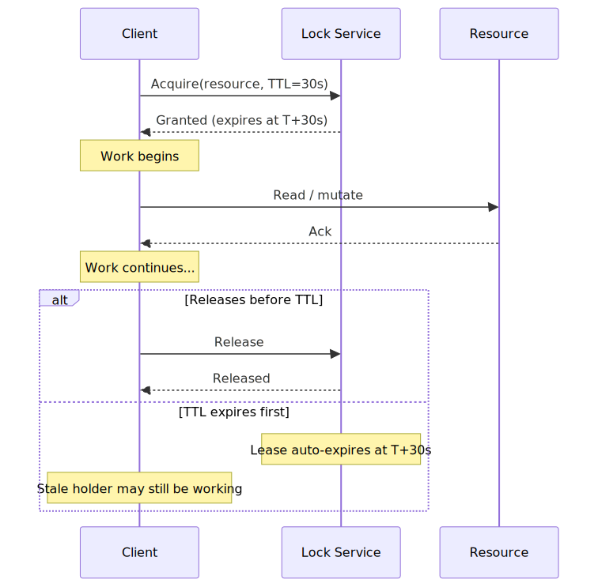
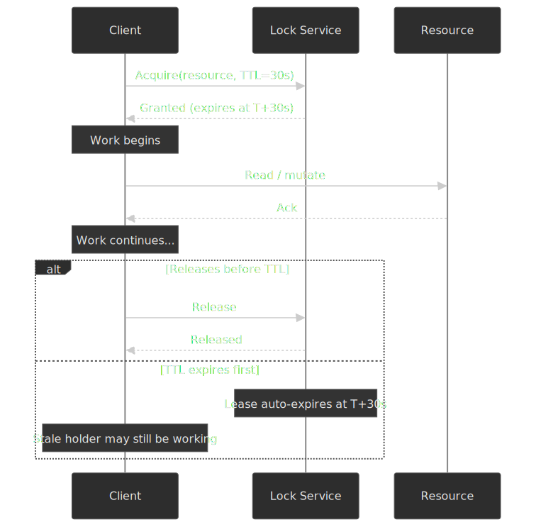

### TTL Selection Formula

The Redlock spec defines the [validity time of a lease](https://redis.io/docs/latest/develop/clients/patterns/distributed-locks/) as:

```
MIN_VALIDITY = TTL - (T_acquire - T_start) - CLOCK_DRIFT
```

Where:

- **TTL** is the initial lease duration.
- **`T_acquire - T_start`** is the wall time spent acquiring the lock across instances.
- **CLOCK_DRIFT** is the maximum tolerated skew between the participating clocks (the spec recommends ~1% of TTL plus a few milliseconds).

If `MIN_VALIDITY` goes non-positive, the acquire is treated as failed and all instances are released.

**Practical guidance** (rules of thumb, calibrate to your workload):

- **JVM applications**: TTL ≥ 60 s. Stop-the-world GC pauses [have been observed in the multi-second range, and full pauses of minutes have been recorded in HBase](https://blog.cloudera.com/avoiding-full-gcs-in-hbase-with-memstore-local-allocation-buffers-part-1/).
- **Go / Rust**: TTL ≥ 30 s. GC is less of a concern, but page faults, EBS reads, and CPU contention still pause the process.
- **General rule**: target TTL ≈ 10 × the p99 of the protected operation, then add a renewal heartbeat for long-running work.

### Clock Skew Issues

**Wall-clock danger.** Redis [uses `gettimeofday`-based wall-clock time, not a monotonic clock, to expire keys](https://martin.kleppmann.com/2016/02/08/how-to-do-distributed-locking.html). If the server clock jumps forward (NTP step, sysadmin adjustment), leases expire ahead of schedule:

1. Client acquires the lock at server time `T` with `TTL = 30 s`.
2. NTP steps the clock forward by 20 s.
3. Redis treats the lock as expired at "T+30 s", actually elapsed `T+10 s`.
4. Another client acquires the lock while the first one is still working.
5. Two clients believe they hold the same lock.

**Mitigation.** Use monotonic clocks where possible. Linux `clock_gettime(CLOCK_MONOTONIC)` measures elapsed time without wall-clock adjustments. In his [rebuttal to Kleppmann](https://antirez.com/news/101), Antirez agreed Redis itself should move TTL expiration off `gettimeofday` onto the monotonic clock API. Internal Redis subsystems have shifted toward monotonic time over the years, but key expiration is still wall-clock-driven, so the clock-jump failure mode has not been retired in practice.

> [!WARNING]
> Configure NTP to **slew** rather than **step** the clock (`-x` / `tinker step 0` on `ntpd`, default for `chronyd`). A slewing clock cannot violate Redlock's bounded-drift assumption; a stepping clock can.

## Design Paths

### Path 1: Redis Single-Node Lock

**When to choose:**

- Lock is for efficiency (prevent duplicate work), not correctness
- Single point of failure is acceptable
- Lowest latency requirement

**Implementation:**

```typescript collapse={1-2}
import { Redis } from "ioredis"

async function acquireLock(redis: Redis, resource: string, clientId: string, ttlMs: number): Promise<boolean> {
  // SET with NX (only if not exists) and PX (millisecond expiry)
  const result = await redis.set(resource, clientId, "NX", "PX", ttlMs)
  return result === "OK"
}

async function releaseLock(redis: Redis, resource: string, clientId: string): Promise<boolean> {
  // Lua script: atomic check-and-delete
  // Only delete if we still own the lock
  const script = `
    if redis.call("get", KEYS[1]) == ARGV[1] then
      return redis.call("del", KEYS[1])
    else
      return 0
    end
  `
  const result = await redis.eval(script, 1, resource, clientId)
  return result === 1
}
```

**Why the Lua script for release:** Without atomic check-and-delete, this race exists:

1. Client A's lock expires
2. Client B acquires lock
3. Client A (still thinking it has lock) calls `DEL`
4. Client A deletes Client B's lock

**Trade-offs:**

| Advantage                 | Disadvantage               |
| ------------------------- | -------------------------- |
| Simple implementation     | Single point of failure    |
| Low latency (~1ms)        | No automatic failover      |
| Well-understood semantics | Lost locks on master crash |

**Real-world:** This approach works well for rate limiting, cache stampede prevention, and other scenarios where occasional double-execution is tolerable.

### Path 2: Redlock (Multi-Node Redis)

**When to choose:**

- Need fault tolerance for efficiency locks
- Can tolerate timing assumptions
- Want Redis ecosystem (Lua scripts, familiar API)

**Algorithm (N=5 independent Redis instances):**

1. Get current time in milliseconds
2. Try to acquire lock on ALL N instances sequentially, with small timeout per instance
3. Lock is acquired if: majority (N/2 + 1) succeeded AND total elapsed time < TTL
4. Validity time = TTL - elapsed time
5. If failed, release lock on ALL instances (even those that succeeded)

```typescript collapse={1-8}
import { Redis } from "ioredis"
import { randomBytes } from "crypto"

interface RedlockResult {
  acquired: boolean
  validity: number
  value: string
}

async function redlockAcquire(instances: Redis[], resource: string, ttlMs: number): Promise<RedlockResult> {
  const value = randomBytes(20).toString("hex")
  const startTime = Date.now()
  const quorum = Math.floor(instances.length / 2) + 1

  let acquired = 0
  for (const redis of instances) {
    try {
      const result = await redis.set(resource, value, "NX", "PX", ttlMs)
      if (result === "OK") acquired++
    } catch {
      // Instance unavailable, continue
    }
  }

  const elapsed = Date.now() - startTime
  const validity = ttlMs - elapsed

  if (acquired >= quorum && validity > 0) {
    return { acquired: true, validity, value }
  }

  // Failed - release all locks
  await Promise.all(instances.map((r) => releaseLock(r, resource, value)))
  return { acquired: false, validity: 0, value }
}
```

**Critical limitation:** Redlock generates random values (20 bytes from `/dev/urandom`), not monotonically increasing tokens. **You cannot use Redlock values for fencing** because resources cannot determine which token is "newer."

**Trade-offs vs single-node:**

| Aspect            | Single-Node | Redlock (N=5)              |
| ----------------- | ----------- | -------------------------- |
| Fault tolerance   | None        | Survives N/2 failures      |
| Latency           | ~1ms        | ~5ms (sequential attempts) |
| Complexity        | Low         | Medium                     |
| Fencing support   | No          | No                         |
| Clock assumptions | Server only | All N servers + client     |

### Path 3: ZooKeeper

**When to choose:**

- Correctness-critical locks (fencing required).
- Already running ZooKeeper (Kafka, HBase, Hadoop ecosystem).
- You can tolerate higher latency for stronger guarantees.

**Ephemeral sequential node recipe** (the canonical [ZooKeeper lock recipe](https://zookeeper.apache.org/doc/current/recipes.html#sc_recipes_Locks)):


**Algorithm:**

1. Client creates an `EPHEMERAL_SEQUENTIAL` node under `/locks/<resource>`.
2. Client lists all children and sorts by sequence number.
3. If the client's node is the lowest sequence, the lock is acquired.
4. Otherwise, set a watch on the immediate predecessor.
5. When the watch fires (predecessor deleted), repeat from step 2.

**Why watch the predecessor, not the parent.** Watching the parent fires every waiter on every release ([thundering herd](https://zookeeper.apache.org/doc/current/recipes.html#sc_recipes_Locks)). Watching only the predecessor wakes exactly one waiter per release.

**Fencing via zxid.** ZooKeeper's transaction ID is a monotonically increasing 64-bit value (`epoch << 32 | counter`). The creation zxid of the lock znode is available via `Stat.getCzxid()` and works as a fencing token.

```java collapse={1-6}
import org.apache.zookeeper.*;
import java.util.List;
import java.util.Collections;

public class ZkLock {
    private final ZooKeeper zk;
    private final String lockPath;
    private String myNode;

    public long acquireLock(String resource) throws Exception {
        // Create ephemeral sequential node
        myNode = zk.create(
            "/locks/" + resource + "/lock-",
            new byte[0],
            ZooDefs.Ids.OPEN_ACL_UNSAFE,
            CreateMode.EPHEMERAL_SEQUENTIAL
        );

        while (true) {
            List<String> children = zk.getChildren("/locks/" + resource, false);
            Collections.sort(children);

            String smallest = children.get(0);
            if (myNode.endsWith(smallest)) {
                // We have the lock - return zxid as fencing token
                Stat stat = zk.exists(myNode, false);
                return stat.getCzxid();
            }

            // Find predecessor and watch it
            int myIndex = children.indexOf(myNode.substring(myNode.lastIndexOf('/') + 1));
            String predecessor = children.get(myIndex - 1);

            // This blocks until predecessor is deleted
            Stat stat = zk.exists("/locks/" + resource + "/" + predecessor, true);
            if (stat != null) {
                // Wait for watch notification
                synchronized (this) { wait(); }
            }
        }
    }
}
```

**Trade-offs:**

| Advantage                           | Disadvantage                  |
| ----------------------------------- | ----------------------------- |
| Strong consistency (Zab consensus)  | Higher latency (2+ RTTs)      |
| Automatic cleanup (ephemeral nodes) | Operational complexity        |
| Fencing tokens (zxid)               | Session management overhead   |
| No clock assumptions                | Quorum unavailable = no locks |

### Path 4: etcd

**When to choose:**

- Kubernetes-native environment
- Prefer gRPC over custom protocols
- Need distributed KV store beyond just locking

**Lease-based locking:**

etcd provides first-class lease primitives. A lease is a token with a TTL; keys can be attached to leases and are automatically deleted when the lease expires.

```go collapse={1-10}
package main

import (
    "context"
    "time"
    clientv3 "go.etcd.io/etcd/client/v3"
    "go.etcd.io/etcd/client/v3/concurrency"
)

func acquireLock(client *clientv3.Client, resource string) (*concurrency.Mutex, error) {
    // Create session with 30s TTL
    session, err := concurrency.NewSession(client, concurrency.WithTTL(30))
    if err != nil {
        return nil, err
    }

    // Create mutex and acquire
    mutex := concurrency.NewMutex(session, "/locks/"+resource)
    ctx, cancel := context.WithTimeout(context.Background(), 5*time.Second)
    defer cancel()

    if err := mutex.Lock(ctx); err != nil {
        return nil, err
    }

    // Use mutex.Header().Revision as fencing token
    return mutex, nil
}
```

**Fencing via revision:** etcd assigns a globally unique, monotonically increasing revision to every modification. Use `mutex.Header().Revision` as your fencing token.

**Critical limitation (Jepsen finding).** Kyle Kingsbury's [Jepsen analysis of etcd 3.4.3](https://jepsen.io/analyses/etcd-3.4.3) found that etcd locks do not provide mutual exclusion. Using etcd mutexes to protect concurrent updates to an in-memory set, with two-second lease TTLs and process pauses every five seconds, "[reliably induced] the loss of ~18% of acknowledged updates." Mutex violations were observed even in healthy clusters — exacerbated by an etcd bug ([etcd-io/etcd#11456](https://github.com/etcd-io/etcd/issues/11456)) where the server did not re-check lease validity after a contended lock was released.

> "etcd locks (like all distributed locks) do not provide mutual exclusion. Multiple processes can hold an etcd lock concurrently, even in healthy clusters with perfectly synchronized clocks."
> — Kyle Kingsbury, Jepsen analysis of etcd 3.4.3 (2020)

The recommended mitigation is exactly what Kleppmann argued for: treat the etcd revision of the lock key as a fencing token and have the protected resource reject operations that present a lower revision than it has already accepted.

**Trade-offs:**

| Advantage                           | Disadvantage                   |
| ----------------------------------- | ------------------------------ |
| Raft consensus (strong consistency) | Jepsen found safety violations |
| Native lease support                | Higher latency than Redis      |
| Kubernetes integration              | Operational complexity         |
| Revision-based fencing              | Quorum unavailable = no locks  |

### Path 5: Database Advisory Locks (PostgreSQL)

**When to choose:**

- Already using PostgreSQL
- Lock scope is single database
- Don't want external dependencies

**Session-level advisory locks:**

```sql
-- Acquire lock (blocks until available)
SELECT pg_advisory_lock(hashtext('resource-1'));

-- Try acquire (returns immediately)
SELECT pg_try_advisory_lock(hashtext('resource-1'));

-- Release
SELECT pg_advisory_unlock(hashtext('resource-1'));
```

**Transaction-level advisory locks:**

```sql
-- Automatically released at transaction end
SELECT pg_advisory_xact_lock(hashtext('resource-1'));

-- Then do your work within the transaction
UPDATE resources SET ... WHERE id = 'resource-1';
```

**Lock ID generation:** Advisory locks take a 64-bit integer key. Use `hashtext()` for string-based resource IDs, or encode your own scheme.

**Connection pooling danger:** Session-level locks are tied to the database connection. With connection pooling (PgBouncer), your "session" may be reused by another client, leaking locks. **Use transaction-level locks with connection pooling.**

**Trade-offs:**

| Advantage                     | Disadvantage                |
| ----------------------------- | --------------------------- |
| No external dependencies      | Single database scope       |
| ACID guarantees               | Connection pooling issues   |
| Already have PostgreSQL       | Not for multi-database      |
| Automatic transaction cleanup | Lock ID collisions possible |

### Path 6: Consul Sessions and KV Locks

**When to choose:**

- Already running Consul for service discovery / config.
- You want session-bound locks tied to node and health-check liveness.
- You need a built-in cool-down window after lock loss (the Consul `LockDelay`).

**Mechanism.** A [Consul session](https://developer.hashicorp.com/consul/docs/automate/session) binds together a node, its health checks, and an optional TTL. The `acquire=<session-id>` parameter on `PUT /v1/kv/<key>` is a [check-and-set](https://developer.hashicorp.com/consul/api-docs/kv) op: it succeeds only if the key is currently unlocked or already held by the same session. `release=<session-id>` is the symmetric CAS. Sessions are invalidated on node deregistration, health-check failure, explicit destroy, or TTL expiry; the `Behavior` field controls whether held locks are `release`d (default) or the keys `delete`d.

```bash frame="terminal"
# Create a session with a 15s TTL, default LockDelay = 15s
curl -X PUT http://consul:8500/v1/session/create \
  -d '{"TTL": "15s", "LockDelay": "15s", "Behavior": "release"}'
# -> {"ID": "<sid>"}

# Acquire (CAS): succeeds iff key is unlocked or already held by <sid>
curl -X PUT "http://consul:8500/v1/kv/locks/order-svc/leader?acquire=<sid>" \
  -d '{"holder": "node-7"}'
# -> true
```

**Fencing via `LockIndex`.** Each successful `acquire` increments the key's `LockIndex` and stamps the holding `Session`. Consul's docs explicitly cast the tuple `(Key, LockIndex, Session)` as a sequencer: a client that intends to mutate a downstream resource can pass `LockIndex` along, and the resource can reject any operation whose `LockIndex` is lower than the highest it has already accepted. This gives Consul the same fencing-token shape as ZooKeeper's `czxid` and etcd's revision.

**`LockDelay` as a safety buffer.** When a session is invalidated, Consul refuses to grant the same lock for a default 15 s (configurable 0–60 s). The window gives a previously-leading client time to notice it lost the lock and stop performing protected operations before any new holder can race ahead — an explicit, advisory mitigation for the slow-client / stale-write problem rather than a substitute for fencing.

> [!WARNING]
> Setting `LockDelay: 0` removes the safety buffer entirely. Pair it with strict `LockIndex` fencing on the protected resource, or you have a Redlock-class race built into Consul.

**Trade-offs:**

| Advantage                            | Disadvantage                              |
| ------------------------------------ | ----------------------------------------- |
| Session-bound + health-check-bound   | Advisory only; resource must check        |
| `LockDelay` reduces stale-write race | TTL bounded to 10 s–24 h                  |
| `LockIndex` works as fencing token   | Tied to Consul cluster availability       |
| Reuses existing Consul infra         | Many subtle session/healthcheck pitfalls  |

### Comparison Matrix

| Factor                 | Redis Single | Redlock         | ZooKeeper    | etcd             | Consul                 | PostgreSQL      |
| ---------------------- | ------------ | --------------- | ------------ | ---------------- | ---------------------- | --------------- |
| Fault tolerance        | None         | N/2 failures    | N/2 failures | N/2 failures     | N/2 failures           | Database HA     |
| Fencing tokens         | No           | No              | Yes (zxid)   | Yes (revision)   | Yes (`LockIndex`)      | No              |
| Latency (acquire)      | ~1 ms        | ~5–10 ms        | ~10–50 ms    | ~10–50 ms        | ~10–50 ms              | ~1–5 ms         |
| Clock assumptions      | Yes          | Yes (all nodes) | No           | No               | TTL only               | No              |
| Correctness guarantee  | No           | No              | Yes          | Partial (Jepsen) | Advisory + `LockIndex` | Yes (single DB) |
| Operational complexity | Low          | Medium          | High         | Medium           | Medium                 | Low             |

### Decision Framework


## Fencing Tokens

### The Problem They Solve

Leases expire. When they do, a "stale" lock holder may still be executing its critical section. Without fencing, this corrupts the protected resource.

**Example failure scenario:**

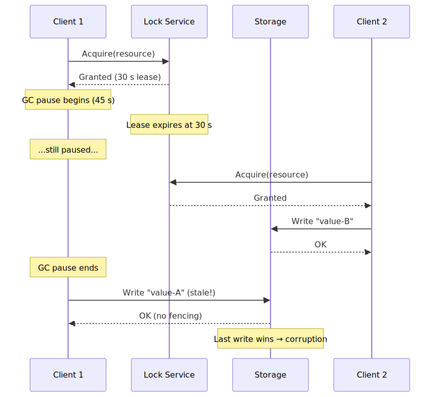
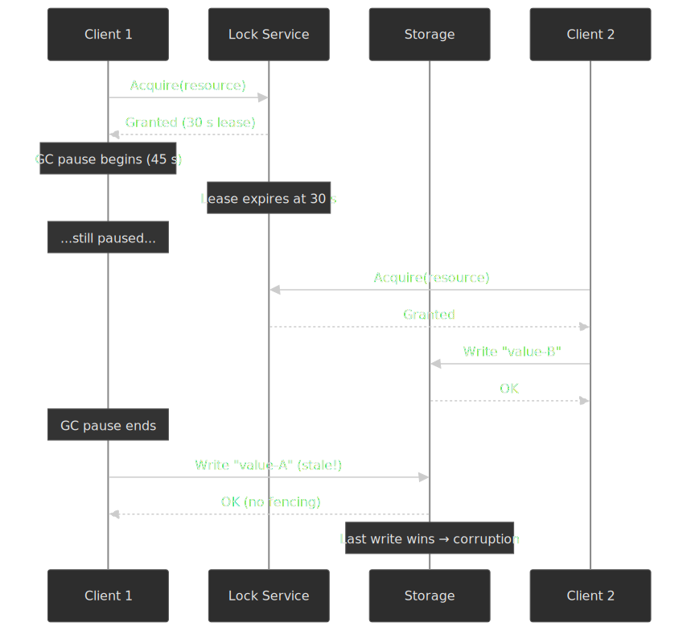

### How Fencing Tokens Work

The fencing-token contract has four pieces, and **the protected resource is the part that does the actual work** — a lock service alone cannot fence:

1. Lock service issues a **strictly monotonically increasing token** with each grant. Without a total order, "stale" is undefined.
2. Client includes the token with every mutating operation against the protected resource (write, RPC, transaction).
3. Resource tracks the **highest token it has ever accepted** for that resource key.
4. Resource **rejects** any operation whose token is lower than the highest it has seen, atomically with the operation it would otherwise perform.

The ordering must come from somewhere — Kleppmann's punchline is that "[it's likely that you would need a consensus algorithm just to generate the fencing tokens](https://martin.kleppmann.com/2016/02/08/how-to-do-distributed-locking.html)"[^kleppmann]. That is exactly what ZooKeeper's `zxid`, etcd's revision, and Chubby's lock-generation number give you for free: a totally-ordered identifier minted from the same replicated log that decided who holds the lock.

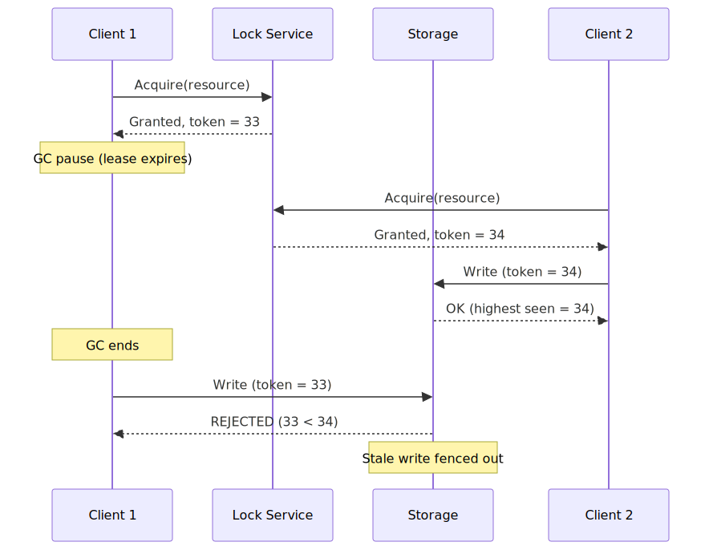
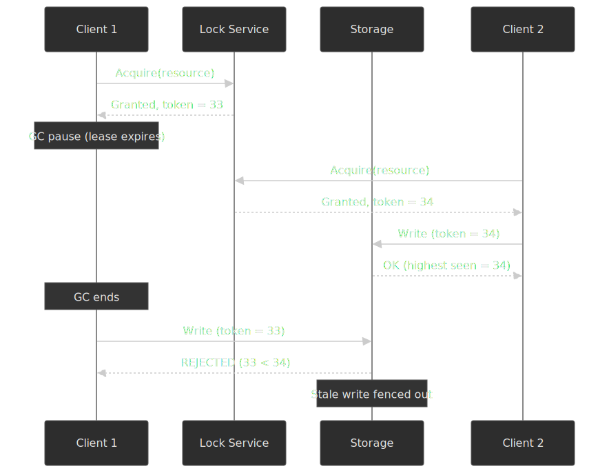

### Implementation Pattern

**Lock service side:**

```typescript collapse={1-4}
interface LockGrant {
  token: bigint // Monotonically increasing
  expiresAt: number
}

class FencingLockService {
  private nextToken: bigint = 1n
  private locks: Map<string, { holder: string; token: bigint; expiresAt: number }> = new Map()

  acquire(resource: string, clientId: string, ttlMs: number): LockGrant | null {
    const existing = this.locks.get(resource)
    if (existing && existing.expiresAt > Date.now()) {
      return null // Lock held
    }

    const token = this.nextToken++
    const expiresAt = Date.now() + ttlMs
    this.locks.set(resource, { holder: clientId, token, expiresAt })

    return { token, expiresAt }
  }
}
```

**Resource side:**

```typescript collapse={1-6}
interface FencedWrite {
  token: bigint
  data: unknown
}

class FencedStorage {
  private highestToken: Map<string, bigint> = new Map()
  private data: Map<string, unknown> = new Map()

  write(resource: string, write: FencedWrite): boolean {
    const highest = this.highestToken.get(resource) ?? 0n

    if (write.token < highest) {
      // Stale token - reject
      return false
    }

    // Accept write, update highest seen
    this.highestToken.set(resource, write.token)
    this.data.set(resource, write.data)
    return true
  }
}
```

### Why Random Values Don't Work

Redlock uses 20 random bytes from `/dev/urandom`, not ordered tokens. A resource cannot determine whether `abc123` is "newer" than `xyz789`. The values lack the **ordering property** required to reject stale operations. As Kleppmann put it: "the algorithm does not produce any number that is guaranteed to increase every time a client acquires a lock … the unique random value it uses does not provide the required monotonicity. … It's likely that you would need a consensus algorithm just to generate the fencing tokens."[^kleppmann]

### ZooKeeper zxid as Fencing Token

ZooKeeper's transaction ID (zxid) is perfect for fencing:

- **Monotonically increasing**: Every ZK transaction increments it
- **Globally ordered**: All clients see same ordering
- **Available at lock time**: `Stat.getCzxid()` returns creation zxid

```java
// When acquiring lock
Stat stat = zk.exists(myLockNode, false);
long fencingToken = stat.getCzxid();

// When accessing resource
resource.write(data, fencingToken);
```

## The Redlock Controversy

### Kleppmann's Critique (2016)

Martin Kleppmann's core argument is that [Redlock is "neither fish nor fowl"](https://martin.kleppmann.com/2016/02/08/how-to-do-distributed-locking.html): too heavy and complex for efficiency locks, not safe enough for correctness locks. Three concrete problems:

**1. Timing assumptions violated by real systems.** Redlock works correctly only if the system is "[partially synchronous](http://www.net.t-labs.tu-berlin.de/~petr/ADC-07/papers/DLS88.pdf)": bounded network delay, bounded process pauses, bounded clock drift. Real systems violate all three:

- Network packets can be delayed arbitrarily — including [GitHub's 2012 incident with ~90 s of network delay](https://github.blog/2012-12-26-downtime-last-saturday/).
- Stop-the-world GC pauses can exceed any reasonable lease TTL ([HBase observed multi-minute pauses](https://blog.cloudera.com/avoiding-full-gcs-in-hbase-with-memstore-local-allocation-buffers-part-1/)).
- Clock skew can be large under adversarial NTP conditions or operator error.

**2. No fencing capability.** Even if every step worked perfectly, Redlock generates random values, not monotonic tokens — so the protected resource has no way to reject stale operations.

**3. Clock-jump scenario** (paraphrased from the post):

1. Client 1 acquires the lock on nodes A, B, C; D and E are unreachable.
2. Clock on node C jumps forward; C's copy of the lease expires.
3. Client 2 acquires the lock on C, D, E.
4. Both clients now hold a quorum.

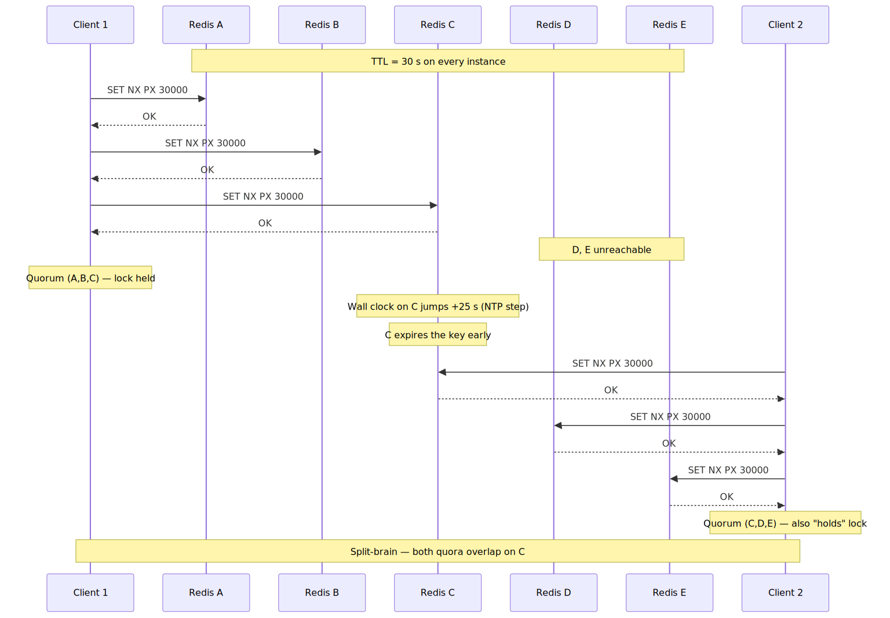
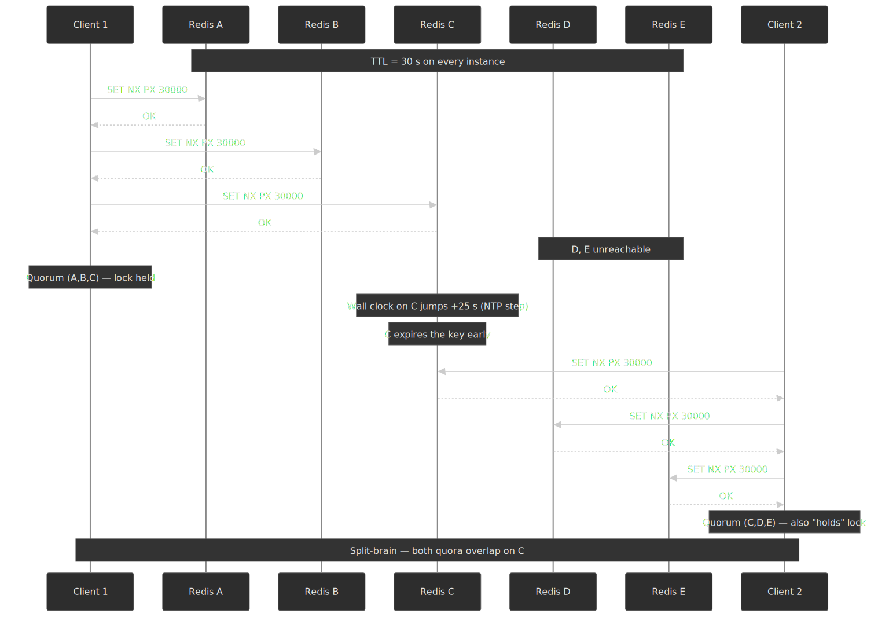

### Antirez's Response

Salvatore Sanfilippo's [rebuttal](https://antirez.com/news/101) argues:

- **A unique random token is enough for many uses.** With check-and-set against the protected resource, only the holder of the matching token can mutate it. Antirez's point: most practical workflows do not in fact need monotonic ordering.
- **Post-acquisition time check.** Redlock's spec instructs the client to record `T_start`, attempt all instances, then re-read the clock and refuse the lock if elapsed time has consumed the TTL. He argues this neutralises the GC-during-acquire scenario, but Kleppmann's reply is that the pause can happen _after_ acquisition, between the validity check and the resource access.
- **Monotonic clocks.** Antirez agreed Kleppmann was right that Redis and Redlock should use the monotonic clock API to eliminate the clock-jump variant of the attack.

### The Verdict

Neither argument is fully satisfying:

| Kleppmann's points       | Antirez's counter-points     | Reality                                                                 |
| ------------------------ | ---------------------------- | ----------------------------------------------------------------------- |
| GC pauses violate timing | Post-acquisition check helps | Pauses can happen _during_ resource access, not just during acquisition |
| No fencing possible      | Random token + CAS works     | CAS works only when the resource itself stores the token                |
| Clock jumps break safety | Use monotonic clocks         | A cross-machine monotonic clock does not exist                          |

**Practical guidance:**

- **Efficiency locks**: Redlock is fine. Occasional double-execution is annoying, not catastrophic.
- **Correctness locks**: use a consensus-based system (ZooKeeper, Chubby, or etcd with revision-based fencing) and enforce fencing on every protected operation. Redlock's random values cannot fence.

## Production Implementations

### Google Chubby: The Original

**Context.** Internal distributed lock service powering GFS, BigTable, and other Google infrastructure. The [Chubby paper](https://research.google/pubs/the-chubby-lock-service-for-loosely-coupled-distributed-systems/) directly inspired ZooKeeper.

**Architecture (Burrows, OSDI 2006):**

- A Chubby cell is typically **5 replicas**; replicas elect a master via Paxos and the master holds a multi-second master lease.
- The master serves all client traffic; writes are committed via Paxos to a quorum of replicas.
- Client sessions hold a session lease (default ~12 s); on lease loss, the client enters a "jeopardy" state and waits a default **45 s grace period** before declaring the session dead and releasing locks.
- The data model is a small filesystem; locks are advisory and attached to files.

**Key design decisions:**

- **Coarse-grained locks** — designed for locks held seconds to hours (leader election, configuration), not millisecond-scale critical sections.
- **Advisory by default** — files do not refuse reads or writes from non-holders; correctness depends on holders honouring the protocol or using sequencers.
- **Master lease renewal** — brief network blips do not cause leadership churn.
- **Client grace period** — sessions survive transient outages without dropping every lock the client holds.

**Fencing via sequencers.** Chubby exposes `GetSequencer()` / `SetSequencer()` / `CheckSequencer()`. A sequencer is an opaque byte-string carrying the lock name, mode, and lock generation number. The protected service can either pass it back to Chubby for validation or compare generation numbers locally. The Chubby paper notes: if a sequencer is no longer valid (the lock was lost or re-acquired), the validation call fails. This is the same fencing-token pattern Kleppmann argues for, predating his blog by a decade.

**Scale.** Chubby is optimised for reliability and small numbers of long-lived locks, not lock throughput. Heavy fan-in workloads use it for leader election and route the actual lock traffic through purpose-built systems (BigTable's metadata, for example).

### Industry Patterns

Public engineering write-ups about distributed lock usage tend to be short on first-party detail, but the same patterns recur across companies:

- **Per-key efficiency locks for assignment / matching.** Ride-hailing, ad-serving, and inventory systems hold a millisecond-scale lock on the contended entity (driver ID, ad slot, SKU) so only one of N concurrent matchers attempts the write. Failures are caught downstream — the booking system rejects a duplicate driver assignment, the inventory system rejects a double-decrement — so the lock can use the cheapest possible backend (single-node Redis or Redlock).
- **Per-event deduplication around side effects.** Event-driven pipelines acquire `job:{event_id}` for the expected job duration so a re-delivered event does not re-fire the side effect. Locks deduplicate; idempotency keys at the downstream API are the safety net; monitoring catches the drift between the two.
- **Layered defence.** No production system relies on a single layer. The pattern is lock-for-deduplication + idempotency-for-correctness + reconciliation-for-eventual-fix. Treat any "we use Redis locks for correctness" claim with suspicion until you find the layer that actually enforces it.

### Implementation Comparison

| Aspect    | Google Chubby                  | Efficiency lock (typical)            | Job-dedup lock (typical)            |
| --------- | ------------------------------ | ------------------------------------ | ----------------------------------- |
| Lock type | Correctness                    | Efficiency                           | Efficiency                          |
| Duration  | Seconds–hours                  | Milliseconds                         | Seconds–minutes                     |
| Backend   | Paxos (custom)                 | Redis (single-node or Redlock)       | Redis or ZK + idempotency keys      |
| Fencing   | Sequencers                     | None (downstream rejects duplicates) | None (idempotent downstream)        |
| Scale     | Low frequency, high durability | High frequency, occasional loss OK   | High frequency, occasional loss OK  |

## Lock-Free Alternatives

### When to Avoid Locks Entirely

Distributed locks add complexity and failure modes. Before reaching for a lock, consider:

**1. Idempotent operations:**

If your operation can safely execute multiple times with the same result, you don't need a lock.

```typescript
// Bad: non-idempotent
async function incrementCounter(id: string) {
  const current = await db.get(id)
  await db.set(id, current + 1)
}

// Good: idempotent with versioning
async function setCounterIfMatch(id: string, expectedVersion: number, newValue: number) {
  await db
    .update(id)
    .where("version", expectedVersion)
    .set({ value: newValue, version: expectedVersion + 1 })
}
```

**2. Compare-and-Swap (CAS):**

Many databases support atomic CAS. Use it instead of external locks.

```sql
-- CAS-based update
UPDATE resources
SET value = 'new-value', version = version + 1
WHERE id = 'resource-1' AND version = 42;

-- Check rows affected - if 0, retry with fresh version
```

**3. Optimistic concurrency:**

Assume no conflicts; detect and retry on collision.

```typescript collapse={1-6}
interface VersionedResource {
  data: unknown
  version: number
}

async function optimisticUpdate(id: string, transform: (data: unknown) => unknown) {
  while (true) {
    const resource = await db.get(id)
    const newData = transform(resource.data)

    const updated = await db.update(id, {
      data: newData,
      version: resource.version + 1,
      _where: { version: resource.version },
    })

    if (updated) return // Success
    // Version conflict - retry
  }
}
```

**4. Queue-based serialization:**

Route all operations for a resource to a single queue or partition. This is how Kafka, Kinesis, and most modern command-bus designs avoid locks entirely.


Concurrent access is eliminated by design — at the cost of latency (queue depth) and operational complexity (partition rebalancing, hot partitions).

### Decision: Lock vs Lock-Free

| Factor                  | Use Distributed Lock         | Use Lock-Free                    |
| ----------------------- | ---------------------------- | -------------------------------- |
| Operation complexity    | Multi-step, non-decomposable | Single atomic operation          |
| Conflict frequency      | Rare                         | Frequent (CAS retries expensive) |
| Side effects            | External (can't retry)       | Local (can retry)                |
| Existing infrastructure | Lock service available       | Database has CAS                 |
| Team expertise          | Lock patterns understood     | Lock-free patterns understood    |

## Common Pitfalls

### 1. Holding Locks Across Async Boundaries

**The mistake:** Acquiring lock, then making RPC calls or doing I/O while holding it.

```typescript
// Dangerous: lock held during external call
const lock = await acquireLock(resource)
const data = await externalService.fetch() // Network call!
await db.update(resource, data)
await releaseLock(lock)
```

**What goes wrong:**

- External call takes 10s; lock TTL is 5s
- Lock expires while you're still working
- Another client acquires and corrupts data

**Solution:** Minimize lock scope. Fetch data first, then lock-update-unlock quickly.

```typescript
// Better: minimize lock duration
const data = await externalService.fetch()

const lock = await acquireLock(resource)
await db.update(resource, data)
await releaseLock(lock)
```

### 2. Ignoring Lock Acquisition Failure

**The mistake:** Assuming lock acquisition always succeeds.

```typescript
// Dangerous: no failure handling
await acquireLock(resource)
await criticalOperation()
await releaseLock(resource)
```

**What goes wrong:**

- Lock service unavailable → operation proceeds without lock
- Lock contention → silent failure, concurrent access

**Solution:** Always check acquisition result and handle failure.

```typescript
const acquired = await acquireLock(resource)
if (!acquired) {
  throw new Error("Failed to acquire lock - cannot proceed")
}
try {
  await criticalOperation()
} finally {
  await releaseLock(resource)
}
```

### 3. Lock-Release Race with TTL

**The mistake:** Releasing a lock you no longer own (it expired and was re-acquired).

```typescript
// Dangerous: release without ownership check
await lock.release() // May delete another client's lock!
```

**What goes wrong:**

1. Your lock expires due to slow operation
2. Another client acquires the lock
3. Your `release()` deletes their lock
4. Third client acquires, now two clients think they have it

**Solution:** Atomic release that checks ownership (shown in Redis Lua script earlier).

### 4. Thundering Herd on Lock Release

**The mistake:** All waiting clients wake simultaneously when lock releases.

**What goes wrong with ZooKeeper naive implementation:**

- 1000 clients watch `/locks/resource` parent node
- Lock releases, all 1000 receive watch notification
- All 1000 call `getChildren()` simultaneously
- ZooKeeper overloaded, lock acquisition stalls

**Solution:** Watch predecessor only (shown in ZooKeeper recipe earlier). Only one client wakes per release.

### 5. Missing Fencing on Correctness-Critical Locks

**The mistake:** Using Redlock (or any lease-based lock) without fencing for correctness-critical operations.

```typescript
// Dangerous: no fencing
const lock = await redlock.acquire(resource)
await storage.write(data) // Stale lock holder can overwrite!
await redlock.release(lock)
```

**Solution:** Either use a lock service with fencing tokens (ZooKeeper) or accept that this lock is efficiency-only.

### 6. Session-Level Locks with Connection Pooling

**The mistake:** Using PostgreSQL session-level advisory locks with PgBouncer.

```sql
-- Acquired by connection in pool
SELECT pg_advisory_lock(12345);
-- Connection returned to pool
-- Other client reuses connection
-- Lock is still held by "other" client!
```

**Solution:** Use transaction-level locks with pooling.

```sql
BEGIN;
SELECT pg_advisory_xact_lock(12345);
-- Do work
COMMIT; -- Lock automatically released
```

## Conclusion

Distributed locking is a coordination primitive that requires careful consideration of failure modes, timing assumptions, and fencing requirements.

**Key decisions:**

1. **Efficiency vs correctness:** Most locks are for efficiency (preventing duplicate work). These can use simpler implementations with known failure modes. Correctness-critical locks require consensus protocols and fencing.

2. **Fencing is non-negotiable for correctness:** Without fencing tokens, lease expiration during long operations corrupts data. Random lock values (Redlock) cannot fence.

3. **Timing assumptions are dangerous:** Redlock's safety depends on bounded network delays, process pauses, and clock drift. Real systems violate all three.

4. **Consider lock-free alternatives:** Idempotent operations, CAS, optimistic concurrency, and queue-based serialization often work better than distributed locks.

**Start simple:** Single-node Redis locks work for most efficiency scenarios. Graduate to ZooKeeper with fencing only when correctness is critical and you understand the operational cost.

## Appendix

### Prerequisites

- Distributed systems fundamentals (network partitions, consensus)
- CAP theorem and consistency models
- Basic understanding of lease-based coordination

### Terminology

| Term               | Definition                                                                                                  |
| ------------------ | ----------------------------------------------------------------------------------------------------------- |
| **Lease**          | Time-bounded lock that expires automatically                                                                |
| **Fencing token**  | Monotonically increasing identifier that resources use to reject stale operations                           |
| **Sequencer**      | Chubby's term for a fencing token: opaque byte-string carrying lock name, mode, and lock generation number  |
| **TTL**            | Time-To-Live; duration before lease expires                                                                 |
| **Quorum**         | Majority of nodes (N/2 + 1) required for consensus                                                          |
| **Split-brain**    | Network partition where multiple partitions believe they are authoritative                                  |
| **zxid**           | ZooKeeper transaction ID; monotonically increasing, usable as fencing token                                 |
| **Lock delay**     | Consul's cool-down window after session invalidation during which the lock cannot be re-acquired            |
| **Advisory lock**  | Lock that does not prevent access — just signals intention; correctness depends on holders honoring the protocol |
| **Ephemeral node** | ZooKeeper node that is automatically deleted when the client session ends                                   |

### Summary

- Distributed locks are **harder than they appear**—network partitions, clock drift, and process pauses all cause multiple clients to believe they hold the same lock
- **Leases** (auto-expiring locks) prevent deadlock but introduce the lease-expiration-during-work problem
- **Fencing tokens** solve this by having the resource reject operations from stale lock holders
- **Redlock** provides fault-tolerant efficiency locks but **cannot fence** (random values lack ordering)
- **ZooKeeper/etcd** provide fencing tokens (zxid/revision) but add operational complexity
- **Lock-free alternatives** (CAS, idempotency, queues) often work better than distributed locks
- For **correctness-critical** locks: use consensus + fencing; for **efficiency** locks: Redis single-node is often sufficient

### References

**Foundational:**

- [How to do distributed locking](https://martin.kleppmann.com/2016/02/08/how-to-do-distributed-locking.html) — Martin Kleppmann's analysis of Redlock (2016).
- [Is Redlock safe?](https://antirez.com/news/101) — Salvatore Sanfilippo's rebuttal (2016).
- [The Chubby Lock Service for Loosely-Coupled Distributed Systems](https://research.google/pubs/the-chubby-lock-service-for-loosely-coupled-distributed-systems/) — Mike Burrows, OSDI 2006.
- [Consensus in the Presence of Partial Synchrony](http://www.net.t-labs.tu-berlin.de/~petr/ADC-07/papers/DLS88.pdf) — Dwork, Lynch & Stockmeyer, JACM 1988. The model that Redlock implicitly assumes.
- [Impossibility of Distributed Consensus with One Faulty Process](http://www.cs.princeton.edu/courses/archive/fall07/cos518/papers/flp.pdf) — Fischer, Lynch & Paterson, JACM 1985 (FLP).

**Implementation documentation:**

- [Redis Distributed Locks](https://redis.io/docs/latest/develop/clients/patterns/distributed-locks/) — official Redis distributed-lock pattern (the Redlock spec).
- [ZooKeeper Recipes and Solutions](https://zookeeper.apache.org/doc/current/recipes.html#sc_recipes_Locks) — canonical lock recipe with predecessor-watch.
- [etcd Concurrency API](https://etcd.io/docs/v3.5/dev-guide/api_concurrency_ref/) — etcd lease, mutex, and election APIs.
- [Consul Sessions and Distributed Locks](https://developer.hashicorp.com/consul/docs/automate/session) — session lifecycle, `LockDelay`, `LockIndex` sequencer.
- [Consul KV HTTP API](https://developer.hashicorp.com/consul/api-docs/kv) — `acquire` / `release` CAS semantics on KV keys.
- [PostgreSQL Advisory Locks](https://www.postgresql.org/docs/current/explicit-locking.html#ADVISORY-LOCKS) — session and transaction-scoped advisory locks.

**Testing and analysis:**

- [Jepsen: etcd 3.4.3](https://jepsen.io/analyses/etcd-3.4.3) — Kyle Kingsbury's analysis finding mutex violations in etcd locks even in healthy clusters.
- [etcd Jepsen results blog](https://etcd.io/blog/2020/jepsen-343-results/) — etcd team's response and patch reference.
- [Designing Data-Intensive Applications](https://dataintensive.net/) — Martin Kleppmann. Chapter 8 covers distributed coordination and locking.

**Libraries:**

- [Redisson](https://redisson.org/) — Redis Java client with distributed locks (implements Redlock and a single-node variant).
- [node-redlock](https://github.com/mike-marcacci/node-redlock) — Redlock implementation for Node.js.
- [Apache Curator](https://curator.apache.org/) — ZooKeeper recipes, including `InterProcessMutex` and `LeaderLatch`.
