# Distributed Monitoring Systems

Observability infrastructure for metrics, logs, and traces is fundamentally a budgeting problem: every signal trades resolution against cost and queryability. This article gives a senior engineer the mental model and the load-bearing numbers — Gorilla compression, head-vs-tail sampling, multi-window burn-rate alerts, cardinality limits — needed to design a monitoring stack that survives a 100× growth in services.

 flow through a collection plane (pull, push, OpenTelemetry Collector) into specialised stores, then feed dashboards, alerts, and trace/log drill-down.")

## Abstract

Distributed monitoring is governed by three tensions:

- **Cardinality vs. cost.** Every unique label combination materialises one time series, each consuming index entries, memory, and storage. A `user_id` label across 1M users explodes a metric into 1M series.
- **Sampling vs. completeness.** Google's Dapper sampled 1 in 1,024 traces in production [^dapper]. You miss rare anomalies but stay within the CPU budget.
- **Aggregation vs. detail.** Metrics are cheap and fast but lose per-request context. Traces preserve the call tree but cost roughly three orders of magnitude more per event.

The signal mental model:

| Signal      | Cardinality                                  | Relative cost / event | Query speed  | Best for                 |
| ----------- | -------------------------------------------- | --------------------- | ------------ | ------------------------ |
| **Metrics** | Must be bounded (target < 10 K series/metric) | Lowest                | Milliseconds | Dashboards, alerts, SLOs |
| **Logs**    | Effectively unbounded                        | ~100×                 | Seconds      | Debugging, audit trails  |
| **Traces**  | Unbounded (sample at scale)                  | ~1000×                | Seconds      | Request-flow analysis    |

(Cost ratios are order-of-magnitude rules of thumb; absolute prices depend on storage tier, ingestion path, and retention.)

Modern observability links these signals: **exemplars** [^exemplars] connect metric samples to specific traces; **trace IDs in structured logs** enable correlation. The goal is to start from a metric alert, drill into the offending trace, and land on the specific log line — without pre-aggregating everything.

## What to monitor: USE, RED, and the Four Golden Signals

Before designing how to ingest, store, and query, decide *what* to instrument. Three established methodologies cover the surface, and the right one depends on whether the target is a resource, a service, or the user-facing system as a whole.


### USE — Brendan Gregg

The [USE method](https://www.brendangregg.com/usemethod.html) targets hardware and OS resources: CPUs, memory, disks, NICs, interconnects, queues. For every resource, check three numbers [^use]:

- **Utilization** — average fraction of time the resource was busy.
- **Saturation** — degree of extra work the resource cannot service (queue depth, runnable threads).
- **Errors** — count of error events.

Order: errors first (cheapest to interpret and almost always actionable), then utilization, then saturation. A 100% utilization is not always a bottleneck (a CPU pinned at 100% can still meet latency targets), but any non-zero saturation means latency has already been added — that is the signal to treat as urgent. The method's value is its completeness: it forces a checklist over every resource and prevents the streetlight effect of "looking where the dashboard already is".

### RED — Tom Wilkie

The [RED method](https://grafana.com/blog/the-red-method-how-to-instrument-your-services/) (introduced by Tom Wilkie at Weaveworks in 2015) targets request-driven services [^red]:

- **Rate** — requests per second.
- **Errors** — failed requests per second.
- **Duration** — distribution of request latency (use a histogram, not a summary, so it aggregates across instances).

The point of RED is *uniformity*. Every service exports the same three signals with the same labels (`service`, `route`, `status_class`), and an on-call engineer can navigate any service's dashboard without having written a line of its code. RED is the service-level counterpart to USE.

### Four Golden Signals — Google SRE

The [Four Golden Signals](https://sre.google/sre-book/monitoring-distributed-systems/) target user-facing distributed systems and add **saturation** to RED:

- **Latency** — split successful and failed requests; track p50, p95, p99 (averages hide tail behavior). Fast errors compress the average and look like good performance.
- **Traffic** — demand on the system in a domain-specific unit (HTTP req/s, transactions/s, MB/s).
- **Errors** — explicit (HTTP 5xx), implicit (200 with wrong content), and policy errors (response over the latency budget).
- **Saturation** — how full the system is, leading the cliff well before 100% utilization.

The golden signals are the canonical "what to alert on" set when budget for monitoring is limited.

| Method     | Best for                       | Signals                                     | Typical owner          |
| ---------- | ------------------------------ | ------------------------------------------- | ---------------------- |
| **USE**    | Hardware / OS resources        | Utilization, Saturation, Errors             | Platform / SRE         |
| **RED**    | Internal request-driven services | Rate, Errors, Duration                    | Service team           |
| **Golden** | User-facing distributed system | Latency, Traffic, Errors, Saturation        | Product SRE / on-call  |

> [!TIP]
> RED and Golden Signals overlap on three of four signals; in practice teams instrument the same RED histograms and read them through both lenses. The discipline is to keep the *labels* low-cardinality (`service`, `route`, `status_class`) so the same metric powers per-service dashboards and the global SLO panel.

## Metrics: types and data models

### Counter

A **counter** is a monotonically increasing value that resets to zero on restart. Use for request counts, bytes transferred, error counts.

Counters must be queried with `rate()` or `increase()`; raw values are meaningless. A counter showing `1,000,000` tells you nothing — `rate(http_requests_total[5m]) = 500` is actionable. The monotonic constraint is what makes reset detection unambiguous: any decrease signals a process restart, and Prometheus's [counter-handling rules](https://prometheus.io/docs/concepts/metric_types/#counter) compensate accordingly.

```promql
# Bad: querying a raw counter
http_requests_total{service="api"}            # 847_293_847

# Good: rate over time
rate(http_requests_total{service="api"}[5m])  # 127.3 / s
```

### Gauge

A **gauge** is a value that can move in either direction — temperature, queue depth, in-flight requests, resident memory.

A common mistake is to use a gauge for "requests since startup". You then lose the ability to detect resets and to compute rates correctly. If the value should only ever go up between restarts, it is a counter.

### Histogram

A **histogram** counts observations into configurable buckets. Use for latency and response-size distributions.

The classic Prometheus histogram is **cumulative**: `le="0.1"` includes every observation ≤ 100 ms. Cumulative encoding is what makes [`histogram_quantile()`](https://prometheus.io/docs/prometheus/latest/querying/functions/#histogram_quantile) valid across instances — you can sum bucket counters across pods and compute a global p99 from the result.

```promql
# Latency histogram with 10ms / 50ms / 100ms / 500ms / 1s buckets
http_request_duration_seconds_bucket{le="0.01"}  2451
http_request_duration_seconds_bucket{le="0.05"}  8924
http_request_duration_seconds_bucket{le="0.1"}  12847
http_request_duration_seconds_bucket{le="0.5"}  15234
http_request_duration_seconds_bucket{le="1"}    15401
http_request_duration_seconds_bucket{le="+Inf"} 15523
http_request_duration_seconds_sum             892.47
http_request_duration_seconds_count            15523
```

The trade-off is that bucket boundaries are fixed at instrumentation time. If your real distribution has a shoulder at 250 ms but your buckets jump from 100 ms straight to 500 ms, you cannot recover the percentile.

**OpenTelemetry's exponential histogram** [^otel-exp] solves this. Bucket boundaries are computed from a `scale` parameter: `base = 2^(2^-scale)`. The default `MaxSize` is **160 buckets**, which the [OTel SDK spec](https://github.com/open-telemetry/opentelemetry-specification/blob/main/specification/metrics/sdk.md) shows covers 1 ms – 100 s with ~4.3% relative error at scale 3, and 1 ms – 4 ms with ~0.5% error at scale 6. Implementations downscale automatically when observations fall outside the current range.

The wire format is also dramatically smaller: an explicit histogram serialises N–1 boundary doubles; an exponential histogram serialises one scale and one offset.

### Summary

A **summary** computes streaming quantiles inside the client. Use it only when the percentile must be exact for a single instance and you do not need to aggregate across instances.

The aggregation limitation is fundamental: there is no mathematically valid way to combine the p99 of three pods into a global p99. For multi-instance services you almost always want a histogram.

| Feature             | Histogram                          | Summary                            |
| ------------------- | ---------------------------------- | ---------------------------------- |
| Cross-instance agg. | Yes (sum bucket counters)          | No                                 |
| Percentile accuracy | Approximate (bucket-dependent)     | Exact within the configured window |
| Server cost         | Low (counter increments)           | Higher (streaming quantile state)  |
| Configuration       | Bucket boundaries / exponential scale | Quantile targets + decay window |

### The cardinality problem

**Cardinality** = unique combinations of metric name × label values. A label-free metric is one series. Add labels and the count multiplies:

```promql
http_requests_total{method, status, endpoint, user_id}
# 5 methods × 50 statuses × 100 endpoints × 1 M users
# = 25 billion series
```

This will crash any time-series database. Three rules keep it bounded:

1. **Never use unbounded labels.** `user_id`, `request_id`, `trace_id`, `email`, IP address — none belong in a metric label set.
2. **Target ≤ 10 distinct values per label.** If a label can grow past ~100 values, redesign before instrumenting.
3. **Push high-cardinality detail to logs and traces.** They are designed for it; the metric pipeline is not.

Symptoms of cardinality explosion in a Prometheus deployment:

- OOM crashes during compaction.
- Dashboard query timeouts.
- Scrape duration approaching scrape interval (the [`up`](https://prometheus.io/docs/concepts/jobs_instances/) metric flips to 0 intermittently).
- Memory growth that outpaces ingest growth.

> [!CAUTION]
> Cardinality explosion is the single most common production-incident pattern in self-hosted Prometheus. Treat any new label as a capacity decision, not a developer convenience.

## Collection architecture: pull vs. push

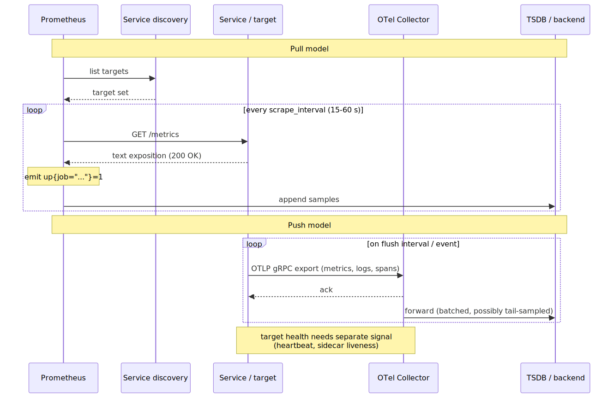
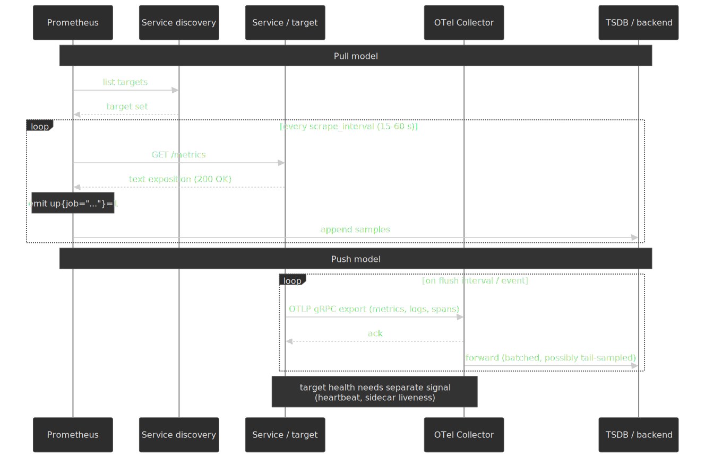

### Pull-based (Prometheus)

Prometheus polls HTTP endpoints at a configured interval (typical: 15–60 s). Each target exposes plain-text metrics at `/metrics`. The Prometheus team's [own design rationale](https://prometheus.io/blog/2016/07/23/pull-does-not-scale-or-does-it/) lays out the case.

Strengths:

- **Free target health.** A failed scrape immediately surfaces as `up{job="..."} == 0`.
- **Debuggable.** Anyone can `curl http://target:9090/metrics`.
- **Centralised control.** Scrape interval changes without redeploying applications.
- **Natural rate limiting.** The Prometheus server controls load on targets, not the other way around.

Weaknesses:

- **Network reachability.** Prometheus must reach every target — painful through NAT, serverless platforms, or air-gapped environments.
- **Short-lived jobs.** A batch job that lives less than one scrape interval may never be observed.
- **Service discovery is mandatory.** You need a source of truth for "what targets exist".

A single Prometheus server typically ingests in the **hundreds of thousands of samples per second** range; the actual ceiling depends primarily on cardinality, scrape interval, and disk throughput, and Prometheus's own [storage docs](https://prometheus.io/docs/prometheus/latest/storage/) recommend planning capacity from `bytes_per_sample × ingested_samples_per_second × retention_seconds`.

### Push-based (StatsD, InfluxDB, OTLP)

Applications send samples to a collector or backend. OTLP, the OpenTelemetry Protocol, is the modern standard for push.

Strengths:

- **Outbound only.** Works through restrictive firewalls.
- **Suits ephemeral workloads.** Lambda functions, batch jobs, sidecar workloads.
- **Event-triggered.** Significant events can push immediately rather than waiting for the next scrape window.

Weaknesses:

- **Target health is a separate signal.** You build heartbeats, sidecar liveness, or use the receiver-side ingest rate as a proxy.
- **Backpressure surface.** When the collector slows down, every application has to decide whether to drop, buffer, or block.
- **Restart thundering herd.** Naïve clients all flush on the same boundary.

### Pushgateway: bridging the gap

For batch jobs that cannot be scraped, Prometheus ships a [Pushgateway](https://prometheus.io/docs/practices/pushing/):

```bash frame="terminal"
echo "batch_job_duration_seconds 47.3" | curl --data-binary @- \
  http://pushgateway:9091/metrics/job/nightly_report
```

> [!WARNING]
> The Pushgateway **never expires** the metrics it has accepted. A job that ran once months ago still appears in scrapes until you `DELETE` it via the API. The official guidance is to use it only for *service-level* batch jobs and never as a general workaround for firewalls; long-running services hidden behind a firewall belong in a service mesh or a federation hierarchy.

### OpenTelemetry Collector

The [OpenTelemetry Collector](https://opentelemetry.io/docs/collector/) is a vendor-neutral pipeline for receiving, processing, and exporting telemetry — the *de facto* glue layer between modern instrumentation and arbitrary backends.

```yaml title="otel-collector-pipeline.yaml"
receivers:    # OTLP, Prometheus scrape, Jaeger, Kafka, ...
  otlp: { protocols: { grpc: {}, http: {} } }
processors:   # Batching, sampling, attribute editing, redaction
  batch: {}
  tail_sampling: { policies: [...] }
exporters:    # Prometheus remote write, Tempo, vendor backends
  otlp: { endpoint: tempo:4317 }
```

| Deployment pattern | Use case              | Trade-off                                       |
| ------------------ | --------------------- | ----------------------------------------------- |
| **Sidecar**        | Per-pod in Kubernetes | Maximum isolation, highest resource overhead    |
| **DaemonSet**      | Per-node agent        | Balanced; supports node-level enrichment        |
| **Gateway**        | Centralised cluster   | Lowest overhead, single point of failure        |

#### Tail sampling needs two collector tiers

To make a sampling decision *after* a trace has finished, every span for that trace must reach the same collector instance — otherwise no single instance has the complete picture. The conventional architecture uses two tiers:

1. **Load-balancing tier.** Stateless. Hashes on `trace_id` and forwards to a stable backend instance.
2. **Sampling tier.** Stateful. Buffers spans until either the trace closes or a deadline elapses, then runs policies.


This is a non-trivial operational commitment: consistent hashing must be stable under sampler scaling events, and the buffer wait introduces latency and memory pressure proportional to your trace duration distribution.

## Time-series database internals

### Gorilla compression (Facebook, 2015)

The Gorilla paper [^gorilla] introduced two complementary compressors that together brought average sample size down to **1.37 bytes** from a naïve 16 bytes (8 B timestamp + 8 B float) — roughly a 12× reduction.

**Delta-of-delta timestamp compression.** Most metrics arrive at fixed intervals. With a 15-second scrape interval the timestamp stream is `1000, 1015, 1030, 1045, ...`; the deltas are `15, 15, 15`; the second-order deltas are `0, 0`. When the second-order delta is zero you store a single bit. The paper reports that **96% of timestamps compress to a single bit**.

**XOR float compression.** Consecutive metric values often share most of their bits. XOR a value with the previous and the result has long runs of zero bits — store only the meaningful window. The paper reports that **51% of values compress to one bit** (identical to the previous sample).

```text
Value 1   0x4059000000000000   (100.0)
Value 2   0x4059100000000000   (100.25)
XOR       0x0000100000000000   ← one nibble of changed bits
```

### Prometheus TSDB

Prometheus's [storage layer](https://prometheus.io/docs/prometheus/latest/storage/) is a purpose-built TSDB that combines an in-memory **head block**, a write-ahead log, memory-mapped chunks, and time-bucketed persistent blocks.

 and the head block. Closed chunks are memory-mapped to disk; on the 2-hour boundary the head block becomes a persistent block and joins the compaction pipeline.")

Key facts:

- **Head block** holds roughly the last two hours of data in memory.
- **WAL segments are 128 MB** and provide durability for the head block.
- **Memory-mapped head chunks** were introduced in [Prometheus v2.19](https://grafana.com/blog/new-in-prometheus-v2-19-0-memory-mapping-of-full-chunks-of-the-head-block-reduces-memory-usage-by-as-much-as-40/), reducing peak heap by ~20–40% by paging full chunks back from disk on demand.
- **Compaction** merges 2-hour blocks into wider blocks for better compression and faster queries — but burns CPU and RAM, which is where high-cardinality deployments tend to OOM.

A persistent block on disk:

```text frame="none"
01BKGTZQ1WNWHNJNAC82/        # ULID block directory
├── meta.json                 # block metadata, time range
├── index                     # postings list + label index (roaring bitmaps)
├── chunks/                   # compressed time-series data
│   └── 000001
└── tombstones                # deletion markers
```

The index is an inverted index keyed by label-value pairs, encoded as **roaring bitmaps** [^roaring]. A query like `{job="api", status="500"}` resolves by intersecting the postings list for `job=api` with the postings list for `status=500`.

### VictoriaMetrics

[VictoriaMetrics](https://docs.victoriametrics.com/) is a Prometheus-compatible TSDB optimised for high cardinality. Its docs and benchmarks claim several-times-better storage density and lower RAM footprint than Prometheus or InfluxDB at the same workload, though the exact ratio swings with the cardinality and value distribution of the test set; treat the headline numbers as "right order of magnitude" rather than precise.

The cluster topology is shared-nothing [^vm-cluster]:

- **vminsert** — stateless. Receives data, distributes to vmstorage nodes via consistent hashing on labels.
- **vmstorage** — stateful. Stores its shard, serves shard-local queries.
- **vmselect** — stateless. Fans queries out to every vmstorage node and merges results.

vmstorage nodes never communicate with each other. That simplifies operations enormously, but every query becomes a fan-out — capacity planning has to account for the slowest replica.

### Netflix Atlas

Netflix's [Atlas](https://netflix.github.io/atlas-docs/) is an in-memory, dimensional TSDB that grew with the platform: from 2 million distinct series in 2011 to **over 1.2 billion** by 2014, sustaining billions of data points per minute [^atlas].

Three design choices make this work at that scale:

- **In-memory hot path.** Recent data lives in the JVM heap (and explicitly off-heap structures) so query latency is dominated by aggregation work, not disk seeks.
- **Roaring-bitmap inverted index.** The same data structure Prometheus uses for postings, deployed at much higher cardinality.
- **Streaming alert evaluation.** Alerts are computed as the data flows in, not by polling the query API. This is the design that makes per-alert query cost essentially free.

A typical Netflix service might multiply device type (~1000) by country (~50) to get 50K series per node × 100 nodes = 5M series for one metric. That is normal at Netflix's scale and abnormal almost everywhere else; the Atlas architecture is the floor of "what it takes" to handle it.

## Global view: federation, remote write, and downsampling tiers

A single Prometheus tops out somewhere in the millions of active series and tens of GB of head block. Multi-region or multi-cluster deployments need a *global view* — one query surface, one alert pipeline, long retention — without reverting to one giant TSDB.

. The compactor downsamples blocks into 5-minute and 1-hour resolutions for cheap long-term queries.")

### Hierarchical federation (`/federate`)

Prometheus's [`/federate` endpoint](https://prometheus.io/docs/prometheus/latest/federation/) lets one Prometheus scrape selected series from another. The canonical pattern is hierarchical: leaf Prometheus servers per cluster scrape local targets at full resolution, and a regional or global Prometheus periodically pulls only the **pre-aggregated recording rules** (e.g. `job:http_requests:rate5m`) from each leaf.

Two non-negotiables:

- `honor_labels: true` so the leaf's `instance`, `region`, etc. survive the scrape.
- A tight `match[]` filter so the global server only pulls aggregations, not raw series. Pulling raw series via `/federate` recreates the cardinality problem one level up and is the single most common mistake in federated deployments.

Federation is fine when the global view is small (alerting summaries, per-cluster SLO panels). It is the wrong tool for arbitrary ad-hoc queries against raw samples — for that, the modern answer is remote write into a horizontally scalable backend.

### Remote write to Thanos / Cortex / Mimir / VictoriaMetrics

Prometheus's [`remote_write`](https://prometheus.io/docs/practices/remote_write/) ships every accepted sample to a downstream system. The downstream is typically an object-storage-backed TSDB designed for global query and long retention:

| System             | Origin / steward      | Distinguishing trait                                                                                  |
| ------------------ | --------------------- | ----------------------------------------------------------------------------------------------------- |
| **Thanos**         | Originally Improbable | Sidecar uploads TSDB blocks to object storage; queriers fan out across sidecars and store gateways.   |
| **Cortex**         | CNCF (Tom Wilkie)     | Microservices: distributor, ingester, querier, store-gateway, compactor; multi-tenant by header.      |
| **Grafana Mimir**  | Grafana Labs (Cortex fork) | Split-and-merge compactor; designed for very large per-tenant ingest and consistent long-range query. |
| **VictoriaMetrics**| VictoriaMetrics Inc.  | Shared-nothing cluster (vminsert / vmstorage / vmselect); higher cardinality density.                 |

Mimir, Cortex, and Thanos all use the **same write/read split**: a stateless ingest tier accepts `remote_write`, a stateful tier flushes blocks to object storage, a compactor merges blocks and downsamples them, and queriers fan out across hot ingesters and cold object storage.

### Downsampling tiers

Long-term retention without downsampling is unaffordable. The Thanos compactor's [downsampling pipeline](https://thanos.io/tip/components/compact.md/) is the reference design and Mimir/Cortex follow the same shape:

| Resolution | Created when block age exceeds | Typical retention | Use                          |
| ---------- | ------------------------------ | ----------------- | ---------------------------- |
| **Raw**    | (always written)               | days to weeks     | Recent debugging, alerting   |
| **5 min**  | ~40 hours                      | months            | Capacity dashboards          |
| **1 hour** | ~10 days                       | 1+ years          | Trends, capacity planning, audits |

Two operational notes that bite teams later:

- Downsampling **adds storage** rather than replacing it — the compactor writes additional `AggrChunk` blocks alongside the originals. Keeping all three resolutions roughly triples object-storage volume; the multiplier is acceptable because object storage is cheap, but plan for it.
- Pick the resolution to query at *based on the panel time range*, not by default. Querying `1h` resolution over a 5-minute range hides incidents; querying `raw` over a 90-day range melts the querier.

> [!IMPORTANT]
> Once `remote_write` is enabled, the leaf Prometheus is no longer the source of truth for long-term data — the central backend is. Treat the leaf's local retention as a *short* buffer (typically 6–24 hours) sized to survive central-tier outages, and run the central backend with at least 3-way replication on its ingest path so a single AZ outage does not lose samples.

## Logs

Metrics live or die by cardinality bounds; logs work the opposite way — every event is unique by design. Three storage families dominate, with very different cost/query profiles:

| Backend                          | Index strategy                            | Strength                                   | Trade-off                                                            |
| -------------------------------- | ----------------------------------------- | ------------------------------------------ | -------------------------------------------------------------------- |
| **Elasticsearch / OpenSearch**   | Inverted index on every field             | Sub-second full-text and aggregation       | Storage and RAM cost grow with field cardinality                     |
| **[Grafana Loki](https://grafana.com/oss/loki/)** | Index only on labels, content stored as compressed chunks | Cheap; uses object storage for hot+cold | Full-text search scans chunks, so latency grows with time range      |
| **ClickHouse / columnar stores** | Columnar with sparse primary index        | Scans hundreds of GB/s with SQL            | Query author has to think about partitioning and sort keys           |

The right pick depends on what you actually query. Free-text needle-in-a-haystack search wants Elasticsearch. Label-scoped grep — "all error lines from `service=checkout` in the last hour" — wants Loki. Aggregations and joins over weeks of data want ClickHouse.

> [!TIP]
> For correlation, structure your logs as JSON and emit `trace_id` and `span_id` on every line. The cost is one object key per record; the payoff is one-click navigation from a trace to its log stream.

## Distributed tracing

### Spans and traces

A **span** is one operation: an HTTP handler, a SQL query, a queue publish. Every span carries:

- A trace ID shared by every span in the trace.
- A unique span ID.
- A parent span ID (forming the call tree).
- Start time and duration.
- Attributes (key-value metadata).
- Events (timestamped annotations).

A **trace** is the tree of spans for one logical request, possibly spanning many services.

### W3C Trace Context

[W3C Trace Context](https://www.w3.org/TR/trace-context/) is the modern propagation standard, supported by every major tracing system. The `traceparent` header is fixed-width:

```text
00-0af7651916cd43dd8448eb211c80319c-b9c7c989f97918e1-01
│   │                                │                 │
│   │                                │                 └─ Trace flags (here: sampled)
│   │                                └─ Parent span ID (8 bytes / 16 hex chars)
│   └─ Trace ID (16 bytes / 32 hex chars)
└─ Version (8 bits, currently 00)
```

The optional [`tracestate`](https://www.w3.org/TR/trace-context/#tracestate-header-field-values) header carries vendor-specific key-value pairs and may contain at most **32 list members**:

```text
tracestate: congo=t61rcWkgMzE,rojo=00f067aa0ba902b7
```

The header names use no hyphens deliberately — trace context propagates beyond HTTP (message queues, database protocols, RPC frames), where hyphenated names cause portability headaches.

### Sampling strategies

At scale, capturing every trace is impossible. Google's Dapper used a default uniform sampling rate of **1 in 1024** in its first production deployment [^dapper], with a median latency of ~15 seconds between span creation and the trace being queryable.

**Head-based sampling.** The decision is made at trace start.

- ✅ Stateless and trivially distributable.
- ✅ No buffering required.
- ❌ Likely to miss the rare interesting trace (the one error in a thousand).

**Tail-based sampling.** The decision is made after the trace completes.

- ✅ Can keep every error and every slow trace deterministically.
- ✅ Supports rich policies (latency thresholds, attribute matches, rate limits).
- ❌ Needs the two-tier collector topology shown above.
- ❌ Adds end-to-end latency proportional to trace duration.

The OpenTelemetry Collector's [tail-sampling processor](https://github.com/open-telemetry/opentelemetry-collector-contrib/tree/main/processor/tailsamplingprocessor) bundles a dozen-plus policies — probabilistic, latency, status code, string-attribute match, rate limiting, composite, and so on.

A common hybrid pattern: head-sample at 10% to bound CPU and span budget, then tail-sample on that 10% to catch errors and slow traces precisely.

### Dapper, in summary

Dapper's three design constraints [^dapper] still describe most production tracing systems:

1. **Ubiquitous deployment.** The instrumentation lives in the RPC library; application code does not have to opt in.
2. **Low overhead.** Sampling and lightweight in-process buffering keep the CPU and bandwidth cost bounded.
3. **Application transparency.** Service authors see consistent traces without writing tracing code.

The data flow is span → local log → out-of-process daemon → BigTable, where each row is a trace and each column a span. The 1/1024 default sampling and the asynchronous collection pipeline are what keep that model affordable at Google's request volume.

> [!TIP]
> Modern alternatives — eBPF-based auto-instrumentation (e.g. Pixie, Beyla, Parca) and OpenTelemetry's auto-instrumentation agents — let you achieve Dapper-style "no app changes" coverage without owning the RPC library. The trade-off is reduced semantic context: an eBPF agent sees the syscall and the wire format, not the business operation.

## Alerting systems

### Alertmanager architecture

Prometheus's [Alertmanager](https://prometheus.io/docs/alerting/latest/alertmanager/) decouples alert evaluation (in Prometheus) from alert delivery. Its pipeline:

1. **Dispatcher** — routes alerts based on label matchers.
2. **Inhibition** — silences derived alerts when a parent alert is firing.
3. **Silencing** — mutes alerts during maintenance windows.
4. **Grouping** — batches related alerts into a single notification.
5. **Notification** — sends to Slack, PagerDuty, email, webhooks.

Grouping is the difference between "100 pods in cluster-east are unreachable" as a single page and 100 separate pages.

```yaml title="alertmanager.yml"
route:
  group_by: ["alertname", "cluster"]
  group_wait: 30s          # wait for more alerts before firing the first
  group_interval: 5m       # gap between grouped notifications
  repeat_interval: 4h      # re-page if still firing
```

Inhibition lets you suppress symptoms when the root cause is alerting:

```yaml title="alertmanager.yml"
inhibit_rules:
  - source_matchers: [severity="critical", alertname="ClusterDown"]
    target_matchers: [severity="warning"]
    equal: ["cluster"]
```

### Static thresholds vs. anomaly detection

**Static thresholds.** "Alert when error rate > 1%."

- ✅ Predictable and explainable.
- ❌ Doesn't adapt to traffic patterns or growth.
- ❌ Requires per-service tuning.

**Anomaly detection.** Alert when the value drifts from a learned baseline.

- ✅ Adapts to diurnal and weekly cycles.
- ❌ Black box: hard to explain why it alerted.
- ❌ Cold-start problem: needs weeks of representative history.
- ❌ Notoriously high false-positive rates in general use.

In practice, most teams stick with static thresholds and reserve anomaly detection for narrow use cases where the baseline is well-understood (capacity headroom, fraud detection).

### SLO-based alerting

The Google SRE Workbook's [Alerting on SLOs](https://sre.google/workbook/alerting-on-slos/) chapter is the canonical reference. The argument against threshold alerts is direct: a 1% error rate for one minute is a non-event; a 1% error rate sustained for one hour is a major incident. A static threshold cannot distinguish them.

**Error budget** = `1 − SLO`. For a 99.9% availability SLO that is 0.1% / 30 days ≈ 43 minutes of failure per month.

**Burn rate** is how fast you are consuming that budget. Burn rate 1 means you are exactly on pace; burn rate 10 means you will exhaust the budget in 3 days instead of 30.

**Multi-window, multi-burn-rate alerts** [^sre-alerting] are the recommended SRE pattern:

| Burn rate | Long window | Short window | Severity | Budget consumed |
| --------- | ----------- | ------------ | -------- | --------------- |
| 14.4      | 1 hour      | 5 min        | Page     | 2% in 1 hour    |
| 6         | 6 hours     | 30 min       | Page     | 5% in 6 hours   |
| 1         | 3 days      | 6 hours      | Ticket   | 10% in 3 days   |


The two-window structure is what makes this work in practice. The long window catches sustained issues; the short window prevents alerts on incidents that have already self-resolved and lets the alert reset quickly once the burn rate drops.

> [!IMPORTANT]
> Low-traffic services break burn-rate math. If a service receives 10 requests/hour, one failure is a 10% error rate and a ~100× burn rate. Either lengthen the evaluation window, switch to count-based thresholds, or aggregate multiple low-traffic services into one SLO.

## Observability vs monitoring

The terms "monitoring" and "observability" are routinely conflated; the distinction Charity Majors has argued for over the last several years is operationally meaningful [^charity-obs]:

- **Monitoring** answers *known unknowns*. You decide in advance which questions matter, instrument them as metrics or checks, and alert when a threshold is breached. The classic three-pillar stack (metrics + logs + traces) is mostly monitoring.
- **Observability** answers *unknown unknowns*. The bar is whether you can ask a new question about an arbitrary slice of production traffic — partitioned by `customer_id`, `build_sha`, `feature_flag`, region — without shipping new instrumentation.

The two modes share signals but trade off differently. Metrics enforce *bounded cardinality* by construction; observability tooling (Honeycomb-style wide structured events, columnar log stores, trace search) accepts *unbounded cardinality* and indexes the dimensions you might want to slice by. You need both: low-cardinality metrics for cheap dashboards and SLO alerts, high-cardinality events for the next outage you have not predicted.

### High-cardinality exploration: heatmaps and BubbleUp

Two interaction patterns turn high-cardinality data into actionable signals:

- **Latency heatmaps.** Each column is a time bucket, each row is a latency bucket, each cell is the count of requests in that latency bucket at that time. Bimodal latency distributions ("two clusters of users seeing different performance"), tail-only regressions, and noisy neighbours are visible at a glance — a percentile line is not.
- **Outlier explanation (Honeycomb's [BubbleUp](https://www.honeycomb.io/platform/bubbleup), Grafana's "compare" panels).** Select a region of the heatmap that looks anomalous; the system compares the dimensional makeup of that region against the baseline and surfaces which fields ( `customer_id`, `region`, `build_sha`, …) are over-represented. This is essentially a chi-squared / mutual-information lift across every label, computed lazily over the query window.

These are the techniques that make "trace and log everything, sample on output" — the modern OpenTelemetry pattern — repayable in debugging time.

### Layered dashboards mirror the drill-down

A good dashboard set is a top-down stack that follows the on-call drill-down path: SLO at the top (is it bad?), Golden Signals next (which signal is bad?), RED per service (which service?), USE per resource (which resource?), then exemplars/traces, then logs.


The point is not the layers themselves but the *links* between them: an exemplar takes you from a histogram bucket directly to a trace; a `trace_id` field on a log line takes you from the trace to the log stream; a service-name label on a USE panel takes you back to that service's RED dashboard. Without those links each layer is a separate tool and the on-call is the integration layer.

## Observability correlation

### Exemplars: metrics → traces

An [exemplar](https://opentelemetry.io/docs/specs/otel/metrics/data-model/#exemplars) is a trace ID attached to a specific metric sample. When you look at a latency spike on a dashboard, you can click straight through to a real trace from that spike.

```text
http_request_duration_seconds_bucket{le="0.5"} 24054 # {trace_id="abc123"} 0.47
```

The histogram says "24,054 requests landed in the ≤500 ms bucket"; the exemplar says "here's one specific request that took 470 ms — and here's its trace ID".

Requirements:

- The instrumentation library must support exemplars (OpenTelemetry does; the [Prometheus client libraries](https://prometheus.io/docs/instrumenting/exposition_formats/#exemplars) gained support in the OpenMetrics text format).
- The TSDB must store them (Prometheus 2.25+).
- The visualisation layer must surface them (Grafana, Perses).

### Trace–log correlation

Emit `trace_id` and `span_id` as structured-log fields:

```json title="example structured log line"
{
  "timestamp": "2026-01-15T10:23:45Z",
  "level": "error",
  "message": "Database connection timeout",
  "trace_id": "0af7651916cd43dd8448eb211c80319c",
  "span_id": "b9c7c989f97918e1",
  "service": "order-service"
}
```

A trace UI can now query "all logs where `trace_id = ...`" and reconstruct the per-span log stream without manual hunting.

### Metrics from traces

Tools like Tempo, the [OTel `spanmetrics` connector](https://github.com/open-telemetry/opentelemetry-collector-contrib/tree/main/connector/spanmetricsconnector), and Datadog APM compute **RED metrics** (Rate, Errors, Duration) directly from spans. The benefit is uniform definitions across services and one-click drill-down from metric to trace. The cost is end-to-end latency (spans must be processed first) and accuracy that scales with your sampling rate.

## Design choices summary

### Collection method

| Factor                   | Pull (Prometheus)        | Push (OTLP)                  | Hybrid (Collector)           |
| ------------------------ | ------------------------ | ---------------------------- | ---------------------------- |
| Target health visibility | Built-in `up` metric     | Requires separate signal     | Via receiver health metric   |
| Works through firewalls  | Needs network access     | Outbound only                | Configurable                 |
| Short-lived jobs         | Often misses             | Push before exit             | Pushgateway or OTLP sidecar  |
| Configuration location   | Centralised              | Per-application              | Centralised                  |

**Default recommendation.** Pull for long-running services (simpler, health is free). Push via OpenTelemetry Collector for serverless or otherwise ephemeral workloads.

### Time-series database

| Factor             | Prometheus                | VictoriaMetrics              | Managed (Datadog, NR, etc.) |
| ------------------ | ------------------------- | ---------------------------- | --------------------------- |
| Cost               | Infrastructure only       | Infrastructure only          | Per-metric pricing          |
| Operational burden | Moderate                  | Low–moderate                 | None                        |
| High availability  | Federation / Thanos / Mimir | Built-in clustering         | Built-in                    |
| Cardinality limits | Practically ~10M series   | Practically ~100M series     | Soft limits + overage fees  |

Approximate scale thresholds:

- < 1 M active series → single Prometheus.
- 1 – 10 M series → Prometheus + remote write to long-term storage (Thanos, Mimir, Cortex).
- 10 M+ series → VictoriaMetrics cluster, Mimir, or a managed service.

### Tracing sampling

| Approach   | Overhead | Capture rate              | Operational complexity   |
| ---------- | -------- | ------------------------- | ------------------------ |
| Head 100%  | Highest  | All traces                | Simple                   |
| Head 1%    | Low      | 1% random                 | Simple                   |
| Tail-based | Medium   | All errors + sampled rest | High (needs LB tier)     |
| Hybrid     | Low      | Best of both              | Highest                  |

**Default recommendation.** Start head-based at 10–100% in dev/staging and a single low-volume service. Move to tail-based when error capture matters or volume forces sub-1% sampling.

### Alerting approach

| Approach          | False positives | Actionability                | Setup effort |
| ----------------- | --------------- | ---------------------------- | ------------ |
| Static thresholds | Medium          | High (clear trigger)         | Low          |
| Anomaly detection | High            | Medium (why did it alert?)   | Medium       |
| SLO burn rate     | Low             | High (budget impact clear)   | High         |

**Default recommendation.** SLO-based alerting with multi-window burn rates for critical services. Static thresholds for utility metrics where SLO definition is fuzzy.

## Common pitfalls

### Cardinality explosion from dynamic labels

**Mistake.** Adding `request_id`, `user_id`, IP address, or session ID as a metric label.

**Why it happens.** Engineers want to filter metrics by these dimensions; it works in dev with 100 users.

**Consequence.** Production with a million users → a million series per metric → Prometheus OOMs, queries time out, alerts go silent.

**Fix.** Move high-cardinality dimensions to logs and traces. If you genuinely need per-user numeric metrics, route them through a columnar store (ClickHouse, BigQuery), not a TSDB.

### Alerting on raw counter values

**Mistake.** `alert: requests_total > 1_000_000`.

**Why it happens.** The counter looks big; the threshold seems intuitive.

**Consequence.** The alert fires based on uptime, not request rate. A restart "fixes" it. A long-running healthy service pages.

**Fix.** Always wrap counters in `rate()` or `increase()`:

```promql title="alert.rules.yml"
- alert: HighRequestRate
  expr: rate(http_requests_total[5m]) > 1000
  for: 10m
```

### Sampling that loses every error trace

**Mistake.** Head-based 1% sampling on a service with 0.1% error rate.

**Why it happens.** Sampling is configured for cost; nobody computes the joint probability with error rate.

**Consequence.** You keep 0.001% of requests as error traces. When you need to debug, you have nothing.

**Fix.** Tail-based sampling with an explicit error policy, or a hybrid head-then-tail pipeline:

```yaml title="otel-collector.yaml"
processors:
  tail_sampling:
    policies:
      - name: errors
        type: status_code
        status_code: { status_codes: [ERROR] }
      - name: probabilistic
        type: probabilistic
        probabilistic: { sampling_percentage: 1 }
```

### Alert fatigue from noisy alerts

**Mistake.** Alerting on every metric deviation without grouping or inhibition.

**Why it happens.** "Better to over-alert than miss something" feels safe.

**Consequence.** On-call ignores alerts. Real incidents drown in noise. The team burns out.

**Fix.**

1. SLO-based alerts — only page when the error budget is meaningfully burning.
2. Aggressive grouping in Alertmanager — one page per incident, not per pod.
3. Inhibition rules so symptoms stay quiet when the root cause is firing.
4. Track signal-to-noise: target ≥ 50% actionable alerts, audit weekly.

## Conclusion

Distributed monitoring is not about collecting more data — it is about collecting the **right data at the right resolution for the right cost**.

Operating principles:

1. **Metrics for dashboards and alerts** — bounded cardinality, high aggregation.
2. **Logs for debugging** — high cardinality, full detail, structured payload.
3. **Traces for request flow** — sampled, correlated, used as the third axis when the metric and the log do not agree.
4. **Correlation is the multiplier.** Exemplars, trace IDs in logs, and metrics derived from spans are what turn three separate stores into one debugging experience.

A defensible starting stack:

- Pull-based metrics with Prometheus (or its drop-in replacements for higher cardinality).
- Head-based trace sampling at 10%, with a plan to migrate to tail-based once error capture becomes a problem.
- SLO-defined burn-rate alerts for the services that have meaningful traffic.
- Structured JSON logs with `trace_id` on every line.

Scale moves the dial:

- Tail-based sampling once errors are too rare to catch.
- VictoriaMetrics, Mimir, or a managed TSDB once cardinality crosses ~10 M series.
- An OpenTelemetry Collector layer once you have more than two backends or need centralised processing.

The 1.37 bytes/sample compression from Gorilla and the 1/1024 sampling rate from Dapper are not arbitrary — they are battle-tested trade-offs from systems handling billions of data points per minute. Internalise the trade-offs and you can design a monitoring stack that scales with the system rather than fighting it.

## Appendix

### Prerequisites

- Comfort with distributed systems concepts: latency, throughput, consistency.
- Familiarity with basic statistics: percentiles, rates, distributions.
- Hands-on experience with at least one monitoring system (Prometheus, Datadog, or equivalent).

### Terminology

- **Cardinality** — number of distinct time series (metric name × label-value combinations).
- **Scrape** — Prometheus pulling samples from a target's `/metrics` endpoint.
- **Span** — a single operation in a distributed trace; carries trace ID, span ID, parent ID.
- **Exemplar** — a trace ID attached to a metric sample for drill-down.
- **Burn rate** — speed of error-budget consumption relative to the SLO; 1 = on pace.
- **Head block** — in-memory portion of the Prometheus TSDB containing recent samples.
- **WAL (Write-Ahead Log)** — durability mechanism that records writes before they are committed.
- **OTLP (OpenTelemetry Protocol)** — standard wire protocol for transmitting telemetry data.

### Summary

- **Pick the method by target.** USE for resources, RED for services, Four Golden Signals for user-facing systems; SLO burn-rate sits on top.
- **Cardinality is the primary scaling constraint** for metrics — keep labels bounded (target ≤ 10 distinct values per label).
- **Gorilla compression** achieves 1.37 bytes/sample via delta-of-delta timestamps and XOR-encoded values.
- **Pull-based collection** gives free target-health visibility; push wins for ephemeral workloads.
- **Global view** = leaf Prometheus + remote write into Thanos / Cortex / Mimir / VictoriaMetrics with raw / 5 min / 1 h downsampling tiers.
- **Tail-based sampling** captures every error but requires consistent routing and trace-duration buffering.
- **SLO burn-rate alerts** with multi-window evaluation cut both false positives and false negatives.
- **Exemplars, trace IDs in logs, latency heatmaps, and BubbleUp-style outlier explanation** are what turn separate stores into one debugging surface.

### References

#### Foundational papers

- [Gorilla: A Fast, Scalable, In-Memory Time Series Database](https://www.vldb.org/pvldb/vol8/p1816-teller.pdf) — Facebook, VLDB 2015.
- [Dapper, a Large-Scale Distributed Systems Tracing Infrastructure](https://research.google.com/archive/papers/dapper-2010-1.pdf) — Google, 2010.

#### Specifications

- [W3C Trace Context (Recommendation)](https://www.w3.org/TR/trace-context/).
- [OpenTelemetry Metrics Data Model](https://opentelemetry.io/docs/specs/otel/metrics/data-model/) — including exponential histograms and exemplars.
- [OpenTelemetry SDK specification](https://github.com/open-telemetry/opentelemetry-specification/blob/main/specification/metrics/sdk.md) — exponential-histogram defaults.
- [OpenTelemetry Sampling concepts](https://opentelemetry.io/docs/concepts/sampling/) — head-based and tail-based.

#### Official documentation

- [Prometheus Storage](https://prometheus.io/docs/prometheus/latest/storage/) — TSDB layout, WAL, compaction.
- [Prometheus TSDB: The Head Block](https://ganeshvernekar.com/blog/prometheus-tsdb-the-head-block/) — deep dive by a Prometheus maintainer.
- [Memory-mapping head chunks (Prometheus 2.19)](https://grafana.com/blog/new-in-prometheus-v2-19-0-memory-mapping-of-full-chunks-of-the-head-block-reduces-memory-usage-by-as-much-as-40/).
- [Alertmanager configuration](https://prometheus.io/docs/alerting/latest/configuration/) — routing, grouping, inhibition.
- [VictoriaMetrics cluster architecture](https://docs.victoriametrics.com/victoriametrics/cluster-victoriametrics/).
- [OpenTelemetry Collector tail-sampling processor](https://github.com/open-telemetry/opentelemetry-collector-contrib/tree/main/processor/tailsamplingprocessor).

#### SRE practices and methodologies

- [Google SRE Book: Monitoring Distributed Systems](https://sre.google/sre-book/monitoring-distributed-systems/) — origin of the Four Golden Signals.
- [Google SRE Workbook: Alerting on SLOs](https://sre.google/workbook/alerting-on-slos/) — multi-window, multi-burn-rate methodology.
- [Brendan Gregg: The USE Method](https://www.brendangregg.com/usemethod.html) — utilization, saturation, errors for resource analysis.
- [Tom Wilkie: The RED Method](https://grafana.com/blog/the-red-method-how-to-instrument-your-services/) — rate, errors, duration for services.
- [Charity Majors: Observability is a Many-Splendored Definition](https://charity.wtf/2020/03/03/observability-is-a-many-splendored-thing/) — observability vs monitoring.
- [Prometheus pull-vs-push rationale](https://prometheus.io/blog/2016/07/23/pull-does-not-scale-or-does-it/).
- [When to use the Pushgateway](https://prometheus.io/docs/practices/pushing/).

#### Global view, federation, downsampling

- [Prometheus federation](https://prometheus.io/docs/prometheus/latest/federation/).
- [Prometheus remote_write](https://prometheus.io/docs/practices/remote_write/).
- [Thanos compactor and downsampling](https://thanos.io/tip/components/compact.md/).
- [Grafana Mimir architecture](https://grafana.com/docs/mimir/latest/references/architecture/).

#### Production case studies and observability tooling

- [Netflix Atlas: Primary Telemetry Platform](https://netflixtechblog.com/introducing-atlas-netflixs-primary-telemetry-platform-bd31f4d8ed9a).
- [Grafana on observability correlation](https://grafana.com/blog/2020/03/31/how-to-successfully-correlate-metrics-logs-and-traces-in-grafana/).
- [Managing high cardinality in Prometheus and Kubernetes](https://grafana.com/blog/2022/10/20/how-to-manage-high-cardinality-metrics-in-prometheus-and-kubernetes/).
- [Honeycomb: Identify Outliers with BubbleUp](https://www.honeycomb.io/platform/bubbleup) — high-cardinality outlier explanation.

[^gorilla]: T. Pelkonen et al. "Gorilla: A Fast, Scalable, In-Memory Time Series Database". *Proc. VLDB Endowment* 8(12), 2015. [https://www.vldb.org/pvldb/vol8/p1816-teller.pdf](https://www.vldb.org/pvldb/vol8/p1816-teller.pdf).
[^dapper]: B. H. Sigelman et al. "Dapper, a Large-Scale Distributed Systems Tracing Infrastructure". Google Technical Report, 2010. [https://research.google.com/archive/papers/dapper-2010-1.pdf](https://research.google.com/archive/papers/dapper-2010-1.pdf).
[^otel-exp]: OpenTelemetry SDK specification, *Base2 Exponential Bucket Histogram Aggregation*. [opentelemetry-specification/specification/metrics/sdk.md](https://github.com/open-telemetry/opentelemetry-specification/blob/main/specification/metrics/sdk.md).
[^exemplars]: OpenTelemetry Metrics Data Model, *Exemplars*. [opentelemetry.io](https://opentelemetry.io/docs/specs/otel/metrics/data-model/#exemplars).
[^roaring]: D. Lemire et al. "Consistently faster and smaller compressed bitmaps with Roaring". *Software: Practice and Experience*, 2016. [https://arxiv.org/abs/1603.06549](https://arxiv.org/abs/1603.06549).
[^vm-cluster]: VictoriaMetrics, *Cluster version*. [docs.victoriametrics.com](https://docs.victoriametrics.com/victoriametrics/cluster-victoriametrics/).
[^atlas]: Netflix Open Source, *Atlas Documentation – Introduction*. [netflix.github.io/atlas-docs](https://netflix.github.io/atlas-docs/).
[^sre-alerting]: B. Beyer et al. *The Site Reliability Workbook*, "Alerting on SLOs". O'Reilly / Google. [sre.google/workbook/alerting-on-slos](https://sre.google/workbook/alerting-on-slos/).
[^use]: B. Gregg. "The USE Method". [brendangregg.com/usemethod.html](https://www.brendangregg.com/usemethod.html); see also "Thinking Methodically About Performance", *Communications of the ACM*. [cacm.acm.org/practice/thinking-methodically-about-performance](https://cacm.acm.org/practice/thinking-methodically-about-performance/).
[^red]: T. Wilkie. "The RED Method: How to Instrument Your Services". Grafana Labs blog, 2018. [grafana.com/blog/the-red-method-how-to-instrument-your-services](https://grafana.com/blog/the-red-method-how-to-instrument-your-services/).
[^charity-obs]: C. Majors. "Observability — A 3-Year Retrospective" / "Observability is a Many-Splendored Definition". [charity.wtf/2020/03/03/observability-is-a-many-splendored-thing](https://charity.wtf/2020/03/03/observability-is-a-many-splendored-thing/).
