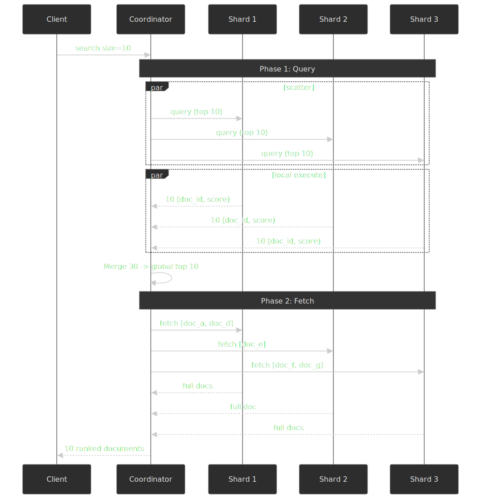

# Distributed Search Engine

Search engines trade write-time complexity — building and maintaining inverted indexes — for read-time speed: sub-second queries over collections too large for a single machine. This article reconstructs that bargain end-to-end for senior engineers: how Lucene's segment architecture works, why every production cluster picks document-based partitioning, what BM25 actually computes, how near-real-time indexing reconciles searchability with durability, and how scatter-gather queries scale (and where they break). The case studies at the end show the same primitives wired into Twitter, Uber, DoorDash, Yelp, and Airbnb.




## Mental model

Five primitives explain every design decision in this article:

- **Inverted index** — the mapping `term → posting list` that turns full-text retrieval from O(corpus) into O(matching docs). Built from a [term dictionary](https://lucene.apache.org/core/9_0_0/core/org/apache/lucene/codecs/lucene90/Lucene90PostingsFormat.html) and per-term posting lists carrying doc IDs, term frequencies, and optionally positions.
- **Segment** — an immutable mini-index. Lucene never edits a segment; it appends new ones and later merges them. Immutability is what enables lock-free reads, OS page-cache reuse, and crash-safe writes.
- **Shard** — a single Lucene index. A logical search index is partitioned into N primary shards plus M replicas per primary.
- **Coordinator** — the node that parses a query, scatters it to shards, gathers and re-ranks the results.
- **Translog** — a per-shard write-ahead log. Decouples *searchability* (refresh creates a new searchable segment in the filesystem cache) from *durability* (flush + fsync makes the segment crash-safe).

Throughout the article, "ES" refers to Elasticsearch and "OS" to OpenSearch; both are thin layers over Apache Lucene. Vendor-specific behavior is called out explicitly.

## The inverted index

### Why inverted indexes exist

A naive document scan is O(N · L) where N is the corpus size and L is the average document length. The inverted index flips that: instead of asking "which terms appear in document d?" it answers "which documents contain term t?". Lookup becomes O(1) on the term, plus a streaming scan of the posting list — typically far smaller than the full corpus.




A posting list typically carries:

- **Document IDs**, ascending and delta-encoded so neighbouring values are small.
- **Term frequency (TF)** per document — how often the term appears.
- **Positions** — token offsets, required for phrase queries (`"distributed search"` requires adjacent positions).
- **Payloads** — optional per-position metadata (part-of-speech tags, weights, etc.).

### Term dictionary: finite state transducers

Lucene stores the term dictionary as a [Finite State Transducer (FST)](https://blog.mikemccandless.com/2010/12/using-finite-state-transducers-in.html), a finite-state machine that maps each term to an opaque value (a block address into the dictionary file). FSTs share both common *prefixes* and common *suffixes*; for `["distributed", "distribution", "district"]` the path through `distri` is reused.

The change to a memory-resident FST term dictionary landed under [LUCENE-3069](https://issues.apache.org/jira/browse/LUCENE-3069) in the 4.x line and was described in the [Lucene 4.1 changes](https://lucene.apache.org/core/4_1_0/changes/Changes.html) as "much more RAM efficient" than the previous fixed-gap index. Mike McCandless's [original write-up](https://blog.mikemccandless.com/2010/12/using-finite-state-transducers-in.html) walks through the construction algorithm: "We share both prefixes and suffixes... this can be a big space savings."

> [!NOTE]
> The exact memory and lookup wins depend on vocabulary shape. Lucene's own change log uses qualitative language; specific percentages floating around the web come from cherry-picked vocabularies. Treat them as illustrative, not as a budget.

The trade-off: FSTs are immutable. Adding a term means rebuilding the structure. This is *fine* in Lucene because segments themselves are immutable — the FST is built once per segment and discarded when the segment is merged.

### Posting list compression

Raw posting lists would be enormous — billions of 32- or 64-bit integers per term. Compression is mandatory, and the most-cited survey is [Pibiri & Venturini (2020)](https://dl.acm.org/doi/10.1145/3415148).

| Encoding | Mechanism | Decoding | Compression | When to use |
| --- | --- | --- | --- | --- |
| **Variable-byte (VByte)** | 7 data bits per byte; high bit signals continuation. | Byte-aligned, branchy. | Baseline. | Hardware without SIMD; simple implementations. |
| **PForDelta** | Pick `k` so most integers fit in `k` bits; encode larger values as exceptions ("patches"). | SIMD-friendly block decoding. | ~30–40% better than VByte on skewed integer streams. | Skewed/zipfian streams; modern CPUs. |
| **SIMD bit-packing (e.g. ForUtil)** | Pack fixed blocks of 128 integers in `k` bits; decode with vector instructions. | Decodes whole blocks in one pass. | Comparable to PForDelta with substantially higher decode throughput. | Modern x86/ARM with SIMD; hot scoring loops. |

Lucene's `ForUtil`-based block decoding became the default in the 8.x line; SIMD-friendly decoding of postings was tracked under [LUCENE-9027](https://issues.apache.org/jira/browse/LUCENE-9027) and shipped in Lucene 8.4 (not 8.0), driven by Adrien Grand. Subsequent issues like [#12396](https://github.com/apache/lucene/issues/12396) push more of the prefix-sum and skip work into vector intrinsics.

### Segment-based architecture

Lucene does not maintain a single mutable index. It writes immutable segments — each a complete mini-index with its own term dictionary and posting lists.

Why segments?

1. **Immutability enables OS-level caching.** The kernel page cache holds segment pages indefinitely because nothing rewrites them.
2. **Lock-free reads.** A search uses a point-in-time `SegmentReader` snapshot; writers and merges run concurrently without read locks.
3. **Cheap writes.** New documents accumulate in an in-memory buffer and flush as a *new* segment. Existing data is never rewritten.
4. **Tombstone deletes.** Deletions are recorded in a `.liv` bitmap; documents are physically removed only during a later merge.

The cost is bookkeeping: every additional segment means an additional term dictionary in RAM, more file handles, and more skip-list cursors at query time. Merge policy is what keeps that cost bounded — see [Segment merging](#segment-merging) below.

## Index partitioning strategies

When an index exceeds a single machine's resources you must partition it. Two strategies exist; one wins in practice.


### Document-based (horizontal) partitioning

Each shard holds a complete inverted index over a subset of documents. Writes hash to one shard; queries fan out to all shards.

- Even write distribution: any shard accepts any document.
- Predictable query fanout: always all shards in the routing set.
- Predictable rebalancing: move documents (or split shards in ES 7+).
- Pays for it with high read fanout — every query touches every shard.

This is what Elasticsearch, OpenSearch, Solr, Twitter Earlybird, and Google web search all use [^docpart].

### Term-based (vertical) partitioning

Each shard holds posting lists for a subset of terms over *all* documents. A query for `distributed AND search` is routed to the shards owning those two terms; their posting lists are intersected (often by streaming the smaller list to the larger one's owner).

- Selective queries hit fewer shards (good in theory).
- Severely uneven shard sizes: term frequencies are zipfian, so a few shards own enormous posting lists.
- Each indexed document touches one shard *per term* — write fan-out is O(unique terms in document).
- Rebalancing means moving posting lists across the network.
- Multi-term queries require cross-shard intersection, often shipping postings.

The theoretical fanout savings are real. They are dwarfed by write amplification, hot shards, and load-balancing complexity at scale. No mainstream production search engine uses pure term-based partitioning today.

### Decision matrix

| Factor | Document-based | Term-based |
| --- | --- | --- |
| Write cost per doc | 1 shard | O(unique terms) shards |
| Query fanout | All shards in routing set | Only shards owning query terms |
| Shard balance | Even by doc count | Severely zipfian by term frequency |
| Rebalancing | Move documents | Move posting lists |
| Used in production by | Elasticsearch, OpenSearch, Solr, Earlybird, Google | Effectively no one |

### Shard sizing guidelines

[Elastic's sizing guidance](https://www.elastic.co/docs/deploy-manage/production-guidance/optimize-performance/size-shards) crystallises the operational defaults:

| Knob | Default rule of thumb |
| --- | --- |
| Shard size | 10–50 GB (write-heavy workloads bias toward smaller; archival toward larger) |
| Documents per shard | Aim well below 200M |
| Shards per node | Roughly ≤ 20 per GB of JVM heap |
| Primary shards | Fixed at index creation pre-7.0; splittable via the [split index API](https://www.elastic.co/docs/api-reference/elasticsearch/elasticsearch/operation/operation-indices-split) since 7.0 |

The intuition: smaller shards are cheap to recover and rebalance but multiply per-shard overhead (term dictionaries, file handles, coordinator merge work); larger shards minimize that overhead but recover slowly and limit parallelism.

## Query processing and ranking

### Boolean retrieval and skip lists

Boolean retrieval intersects or unions posting lists:

```text
posting("distributed") = [1,   7,  42, 100, 250]
posting("search")      = [1,   7,  15, 42,  101]

distributed AND search = [1, 7, 42]
```

The naive intersection is O(|A| + |B|). For `common_term AND rare_term`, where `|A| ≈ 10^7` and `|B| ≈ 10^2`, that wastes nearly all of A. Lucene posting lists embed *skip lists*: at fixed intervals (one skip per Lucene block — currently 128 docs in the [Lucene90 postings format](https://lucene.apache.org/core/9_0_0/core/org/apache/lucene/codecs/lucene90/Lucene90PostingsFormat.html)) the postings include the next document ID and a file offset. The intersection iterates the smaller list and `advance()`s through the larger one, dropping the cost to roughly O(|small| · log(|large|)).

### TF-IDF: the foundation

TF-IDF weights term–document pairs by combining how often a term appears in a document with how rare the term is in the corpus.

$$
\text{TF-IDF}(t, d) = \text{TF}(t, d) \times \log\left(\frac{N}{\text{DF}(t)}\right)
$$

Where $\text{TF}(t,d)$ is the count of $t$ in $d$, $N$ is the corpus size, and $\text{DF}(t)$ is the number of documents containing $t$. The intuition is hard-baked into modern IR: rare terms carry more signal than common ones. Karen Spark Jones introduced IDF in her 1972 *Journal of Documentation* paper, ["A statistical interpretation of term specificity"](https://www.staff.city.ac.uk/~sbrp622/papers/foundations_bm25_review.pdf).

### BM25: the production standard

[Okapi BM25](https://www.staff.city.ac.uk/~sbrp622/papers/foundations_bm25_review.pdf) extends TF-IDF with two corrections that matter in practice: term-frequency saturation and document-length normalization.

$$
\text{BM25}(D, Q) = \sum_{i=1}^{|Q|} \text{IDF}(q_i) \cdot \frac{f(q_i, D) \cdot (k_1 + 1)}{f(q_i, D) + k_1 \cdot \left(1 - b + b \cdot \frac{|D|}{\text{avgdl}}\right)}
$$

Where $f(q_i, D)$ is the term frequency, $|D|$ is the document length in tokens, $\text{avgdl}$ is the average document length, and $k_1$ and $b$ are tuning parameters. Lucene's [`BM25Similarity`](https://lucene.apache.org/core/9_0_0/core/org/apache/lucene/search/similarities/BM25Similarity.html) defaults to $k_1 = 1.2$ and $b = 0.75$, the values Robertson and Spark Jones empirically settled on.

Two reasons BM25 beats raw TF-IDF:

1. **Term-frequency saturation.** $(k_1 + 1)/(f + k_1)$ is concave; doubling occurrences past the saturation point yields diminishing relevance. A term appearing 100 times is not 10× more relevant than 10 times.
2. **Length normalization.** A 100-word document matching a term is more relevant than a 1000-word document with the same hit. The $b$ parameter controls how much length is penalised.

BM25 became the default Lucene similarity in [Lucene 6.0 (April 2016)](https://issues.apache.org/jira/browse/LUCENE-6789), replacing the legacy vector-space `DefaultSimilarity` (now `ClassicSimilarity`). Elasticsearch and OpenSearch inherit that default.

| Variant | Modification | Use case |
| --- | --- | --- |
| BM25F | Per-field weighted scoring | Structured documents (title, body, anchor text) |
| BM25+ | Floor on the length normalization term | Very short documents where standard BM25 over-penalises |

### Learning to rank

BM25 is a fixed formula. *Learning to rank* (LTR) layers a model on top, using BM25 (and other features) as inputs.

| Approach | Training target | Pros | Cons |
| --- | --- | --- | --- |
| Pointwise | Predict an absolute relevance score per (query, doc) | Simple; reuses regression / classification stacks | Ignores ranking context — a doc's score depends on its neighbours |
| Pairwise | Predict the relative order of (query, doc-A, doc-B) | Directly optimises ranking | O(n²) candidate pairs |
| Listwise | Optimise a list-level metric (e.g. NDCG) directly | Best ranking quality | Complex losses; slower training |

Production systems typically run BM25 (or another lexical signal) as a fast first-pass retriever, then re-rank the top-K with a more expensive model — gradient-boosted trees (XGBoost, LambdaMART) or, increasingly, neural rankers. The natural next step is to retrieve from a second, semantic, index in parallel — see [Hybrid retrieval](#hybrid-retrieval-lexical--dense-vector) below.

## Hybrid retrieval: lexical + dense vector

BM25 retrieves what was *typed*. Dense vectors retrieve what was *meant*. Modern relevance stacks run both lanes in parallel, fuse the result lists, then re-rank — because each lane fails on the queries the other handles best.


### Why fuse instead of pick

| Query class | BM25 | Dense vector |
| --- | --- | --- |
| Exact identifier (`SKU-219183`, `ENOENT`) | Wins — token-exact match | Loses — out-of-vocabulary or paraphrased away |
| Rare technical terms not in the embedding's training set | Wins | Loses — the encoder has never seen the token |
| Semantic / paraphrase (`beach house` → `oceanfront cottage`) | Loses — no token overlap | Wins — vectors are close in embedding space |
| Long natural-language questions | Mixed — IDF dominated by stop-word tail | Wins — sentence-level semantics |
| Short keyword queries with synonyms | Mixed | Wins |

Hybrid retrieval is the empirically observed Pareto front, not a hedge.

### Approximate-nearest-neighbour indexes

Exact k-NN over millions of vectors is O(N · d). Production hybrid stacks rely on ANN structures that trade a small recall loss for sublinear search.

| Index | Structure | Memory | Recall@k vs. exact | Build / train | When it shines |
| --- | --- | --- | --- | --- | --- |
| **HNSW** | Hierarchical small-world graph; greedy descent through layers | High — full graph in RAM | Highest at low latency; best Pareto curve at small/medium scale | No training; incremental insert | Default for ES `dense_vector`, OpenSearch Lucene engine, FAISS in-memory workloads |
| **IVF (Inverted File)** | k-means coarse quantizer; probe `nprobe` clusters | Medium | Depends on `nprobe` | k-means training pass | Disk-friendly; recall tunable per query |
| **IVF-PQ** | IVF + product quantization on residuals | Very low (32–128× smaller) | Drops noticeably under aggressive PQ | Trained; rebuilt on drift | Billion-scale deployments where RAM is the budget |
| **ScaNN** | Anisotropic vector quantization tuned for inner-product search | Medium | Top of the curve in Google's benchmarks | Trained | Inner-product-heavy workloads where ScaNN is available |

Engines:

- **FAISS** (Meta) — the reference C++/CUDA library. Backs OpenSearch's k-NN plugin (`faiss` engine) and many in-house systems.
- **Lucene HNSW** — Lucene's native HNSW codec. Powers Elasticsearch `dense_vector`, OpenSearch's `lucene` engine, and Solr's vector field.
- **NMSLIB / hnswlib** — predecessor to Lucene HNSW; still used in OpenSearch's `nmslib` engine path.
- **ScaNN** (Google) — used in Vertex AI Matching Engine.

> [!NOTE]
> HNSW recall is sensitive to the build-time parameters `M` (graph fan-out, default 16) and `efConstruction` (default 100–200) and the query-time `efSearch` (default 100). Higher values trade index size and latency for recall. Tune against a labelled set, not against feel.

### Score fusion

The two lanes return lists on incompatible scales — BM25 is unbounded, cosine similarity is in `[-1, 1]`. Two fusion strategies are mainstream:

- **Reciprocal Rank Fusion (RRF).** Ignore raw scores; combine by *rank*: $\text{score}(d) = \sum_i \frac{1}{k + \text{rank}_i(d)}$ with $k$ typically 60. Robust, requires no calibration, and is the default in Elasticsearch's [`rrf` retriever](https://www.elastic.co/docs/reference/elasticsearch/rest-apis/retrievers/rrf-retriever) (GA in 8.16) and is one of the supported normalizations in OpenSearch's [hybrid query](https://opensearch.org/blog/building-effective-hybrid-search-in-opensearch-techniques-and-best-practices/).
- **Linear combination.** Min-max normalise each lane, weight by a tuned $\alpha$: $\text{score}(d) = \alpha \cdot \tilde{s}_\text{lex}(d) + (1 - \alpha) \cdot \tilde{s}_\text{vec}(d)$. Higher ceiling than RRF when you have judgment data; brittle when score distributions drift.

Production guidance: ship RRF first; switch to a tuned linear blend (or a learned fusion) only after you can measure NDCG / MRR on a stable judgment set.

### Hybrid in Elasticsearch and OpenSearch

- **Elasticsearch** combines a `standard` (BM25) retriever and a `knn` retriever inside an `rrf` retriever; sparse-vector retrieval (ELSER) plugs into the same pipeline.
- **OpenSearch** uses a `hybrid` query inside a search pipeline with a normalization processor; engines for the vector lane are `lucene`, `faiss`, or `nmslib`.

The serving pattern is the same: two retrievers, one fuser, optional cross-encoder re-ranker on the survivors. The cross-encoder is intentionally small and per-candidate — running it on every shard's full index would re-introduce the cost ANN was meant to remove.

### Multi-tenant isolation in hybrid stacks

Vector indexes inherit the same multi-tenant trade-offs as the lexical side:

- **Per-tenant index** — strongest isolation, highest fixed cost (one HNSW graph per tenant). Works up to hundreds of tenants; collapses past that under file-handle and recovery overhead.
- **Shared index with tenant filter** — one HNSW graph per shard, query-time filter on `tenant_id`. Cheapest at scale; naive post-filtering kills recall when the filter is highly selective, so use Lucene's filtered HNSW path which prunes during graph traversal. Filtered kNN landed in [Lucene 9.1](https://github.com/opensearch-project/k-NN/issues/519) and was further accelerated by [ACORN-1 in Lucene 10.2](https://www.elastic.co/search-labs/blog/filtered-hnsw-knn-search), which Elastic reports as up to 5× faster on selective filters.
- **Custom routing on tenant key** — collapses both the lexical and ANN search to a single shard per tenant; matches the pattern in [Custom routing](#custom-routing) above and is the default for high-tenant-count SaaS workloads.

## Near-real-time indexing

### The NRT bargain

Classical Lucene only made documents searchable once a *commit* (fsync of all segments) finished — seconds to minutes of write-to-search latency, depending on workload. Elasticsearch's near-real-time model exposes uncommitted segments by separating *searchability* from *durability*.


| Operation | What happens | Durable? | Searchable? |
| --- | --- | --- | --- |
| **Refresh** | Flush in-memory buffer into a new segment in the **filesystem cache** | No (filesystem cache only) | Yes |
| **Flush** | Lucene commit: write segment files, fsync, truncate translog | Yes (Lucene level) | Yes |
| **Translog fsync** | fsync the translog itself per the configured durability mode | Yes (op-level) | n/a |

Elasticsearch defaults [^esdefaults]:

- `index.refresh_interval = 1s` — but only triggers when the index has received a search in the last `index.search.idle.after = 30s`. Idle indexes stop refreshing until the next search. This is what lets bulk-loaded indexes avoid a "merge storm".
- `index.translog.flush_threshold_size = 512mb`, plus a 30-minute time-based trigger.
- `index.translog.durability = request` (fsync every operation), `sync_interval = 5s` when set to `async`.

### Translog mechanics

Every indexing op writes to both the in-memory buffer and the translog. Refreshing every second is cheap; fsyncing every second would not be. The translog absorbs the latency cost: on a crash, the most recent committed Lucene snapshot is reopened and the translog tail is replayed.

> [!IMPORTANT]
> `index.translog.durability=async` trades a window of un-fsync'd ops for indexing throughput. With `request` (the default), each successful index/bulk op is durable on disk before the response. Pick deliberately — the choice is invisible until a node crashes.

### Segment merging

NRT indexing creates many small segments. Without merging, every search opens an ever-growing list of files and per-segment dictionaries.


Lucene's default [`TieredMergePolicy`](https://lucene.apache.org/core/10_1_0/core/org/apache/lucene/index/TieredMergePolicy.html) groups segments by size tier and merges within a tier once the count reaches a threshold. Out-of-the-box defaults:

| Knob | Default | Effect |
| --- | --- | --- |
| `maxMergedSegmentMB` | 5,120 (5 GB) | Segments above this are not merged further. |
| `segmentsPerTier` | 10.0 | Triggering count per size tier. |
| `maxMergeAtOnce` | 10 | Segments combined per natural merge. |
| `maxMergeAtOnceExplicit` | 30 | Used for `forceMerge` calls. |

Mike McCandless's [merge visualizations](https://blog.mikemccandless.com/2011/02/visualizing-lucenes-segment-merges.html) make the steady-state shape vivid: a "staircase" of small recent segments at the bottom, mid-sized segments in the middle, a few large segments capped by `maxMergedSegment` at the top.

> [!WARNING]
> Force-merging a hot index down to one segment is a common foot-gun. The merged segment exceeds `maxMergedSegmentMB` and becomes ineligible for future natural merges, so deleted documents accumulate forever inside it. Only force-merge indexes you have stopped writing to.

## Distributed query execution

### Scatter-gather (query then fetch)

Document-based partitioning forces fanout: every search visits every shard in the routing set. Elasticsearch implements this as the [query-then-fetch](https://www.elastic.co/docs/reference/elasticsearch/rest-apis/search-your-data) two-phase pattern.

; the coordinator merges to global top-K, then fetches only the surviving full documents.")


1. **Parse.** Coordinator parses, validates, and rewrites the query.
2. **Scatter (query phase).** Coordinator forwards the query to every routed shard.
3. **Local execute.** Each shard scores its segments and returns the local top-K with `(doc_id, score, sort_values)` only.
4. **Merge.** Coordinator does an N-way merge across shard results to produce the global top-K.
5. **Fetch.** Coordinator pulls the full source for *only* the surviving K documents (potentially from different shards than scored them).
6. **Reply.** Final result returned to the caller.

The two-phase split exists because document source bodies are large compared to `(doc_id, score)` tuples. Returning all `K · num_shards` full documents in phase one would balloon network usage by 1–2 orders of magnitude.

### The deep-pagination problem

Asking for "page 1000" over `S` shards with `size=10` requires every shard to return its top `10,010` documents — the coordinator cannot know which 10 are correct without merging the top `10,010` from each. Cost is O(`from · S · size`).

| Approach | Mechanism | Trade-offs |
| --- | --- | --- |
| `from` / `size` | Each shard returns `from + size` docs | Simplest; capped by [`index.max_result_window` (default 10,000)](https://www.elastic.co/docs/reference/elasticsearch/index-settings/index-modules) for exactly this reason |
| [`search_after`](https://www.elastic.co/docs/reference/elasticsearch/rest-apis/paginate-search-results) | Cursor-based pagination using sort values from the previous page | Stateless and efficient; no random page jumps |
| [`scroll`](https://www.elastic.co/docs/reference/elasticsearch/rest-apis/paginate-search-results) (deprecated for live queries) | Snapshot a point-in-time view; iterate | Consistent over long iterations; resource-intensive; not for user pagination |
| [Point-in-time + `search_after`](https://www.elastic.co/docs/reference/elasticsearch/rest-apis/point-in-time-api) | Stateless cursor over a stable view | Modern recommendation in place of `scroll` |

> [!CAUTION]
> "Jump to page 100" UIs are the source of most production deep-pagination outages. Ninety-eighth-percentile users do not need it; design pagination as a cursor and the entire class of failures vanishes.

### Adaptive replica selection

When a shard has multiple healthy copies, the coordinator must pick one. Round-robin ignores load. Elasticsearch's [Adaptive Replica Selection](https://www.elastic.co/docs/reference/elasticsearch/index-modules/shard-allocation#shard-allocation-adaptive-replica-selection) — on by default since 6.x — ranks copies by a function of recent service time and outstanding queue depth, biasing traffic away from hot or slow nodes automatically.

### Custom routing

By default `shard = hash(doc_id) mod num_shards`. Custom routing overrides the routing key:

```json title="POST /users/_doc/1?routing=tenant_123"
{
  "name": "Alice",
  "tenant_id": "tenant_123"
}
```

This collapses queries with the same routing key to a single shard:

- **Tenant isolation.** All of `tenant_123`'s documents on one shard; tenant queries are single-shard.
- **Co-location of related data.** A user and their posts on the same shard for joinful queries.

The price is shard skew: a high-cardinality routing key tail (one whale tenant) creates hot shards. Always model the routing distribution before turning this on.

## Elasticsearch and OpenSearch architecture

### Node roles

| Role | Responsibilities | Resource profile |
| --- | --- | --- |
| Master | Cluster state, shard allocation, mapping changes | Low CPU/RAM, high reliability — run an odd number ≥ 3 |
| Data | Hold segments, execute queries, index | High disk, RAM, CPU |
| Coordinating | Parse and dispatch requests, merge results | High CPU; moderate RAM |
| Ingest | Document pre-processing pipelines | High CPU |

[Elastic's sizing guidance](https://www.elastic.co/docs/deploy-manage/deploy/self-managed/important-settings-configuration) recommends keeping the JVM heap at ≤ 50% of node RAM and capped near 31 GB to stay inside the JVM's compressed-OOPs window. Dedicated coordinating nodes pay off mostly above ~50-node clusters.

### Primary and replica shards

Every index has N primaries (set at creation pre-7.0; splittable since) and M replicas per primary.

Write path:

1. Client sends to any node; that node routes to the primary.
2. Primary indexes the doc in-memory and appends to its translog.
3. Primary forwards to in-sync replicas.
4. Replicas apply, acknowledge.
5. Primary acknowledges to the client (consistency level controlled by `wait_for_active_shards`).

Read path:

1. Coordinator routes to one copy per shard (primary or replica).
2. Adaptive replica selection picks the healthiest copy.
3. Each copy contributes its local top-K; coordinator merges.

Elasticsearch tracks an "in-sync" set per shard; only in-sync replicas can be promoted on primary failure.

### Segment replication (OpenSearch)

Default replication is *document replication*: each replica re-indexes every document, paying the analyzer / tokenizer / posting-list-build cost N times.

[OpenSearch's segment replication](https://opensearch.org/blog/segment-replication/), GA in [OpenSearch 2.7 (released May 2 2023)](https://opensearch.org/blog/get-started-opensearch-2-7-0/), inverts the model: only the primary indexes; replicas pull and apply segment files. The [original design proposal](https://github.com/opensearch-project/OpenSearch/issues/2229) reported approximately 40–45% lower CPU/memory on replicas and 50%+ higher indexing throughput on early benchmarks; the GA blog post and [docs](https://docs.opensearch.org/latest/tuning-your-cluster/availability-and-recovery/segment-replication/index/) report indexing-throughput gains in the 9–68% range depending on dataset, replica count, and shard size.

The trade-off is network bandwidth: segment files are larger than the operation stream. The choice favours segment replication when indexing is CPU-bound (rich analyzers, many fields, vector indexing) and document replication when network is the constraint.

### OpenSearch vs. Elasticsearch — licensing and feature drift

Timeline:

- **January 2021:** Elastic [moves Elasticsearch and Kibana](https://www.elastic.co/blog/elastic-license-update) from Apache 2.0 to dual SSPL / Elastic License v2.
- **April 2021:** AWS announces and launches [OpenSearch](https://aws.amazon.com/blogs/opensource/introducing-opensearch/), a fork of Elasticsearch 7.10.2 / Kibana 7.10.2 under Apache 2.0.
- **August / September 2024:** Elastic adds [AGPLv3 as a third licensing option](https://www.elastic.co/blog/elasticsearch-is-open-source-again) for Elasticsearch and Kibana.
- **September 2024:** AWS donates OpenSearch to the [Linux Foundation as the OpenSearch Software Foundation](https://www.linuxfoundation.org/press/linux-foundation-announces-opensearch-software-foundation-to-foster-open-collaboration-in-search-and-analytics).

| Dimension | Elasticsearch | OpenSearch |
| --- | --- | --- |
| License | SSPL + ELv2 + AGPLv3 (since 2024) | Apache 2.0 |
| Replication | Document replication | Document or segment replication |
| Security | Free basic auth; advanced features in paid tiers | Built-in security plugin, free |
| Vector search | Built-in `dense_vector` field (HNSW) | k-NN plugin (FAISS/Nmslib backends) |
| Governance | Vendor-controlled (Elastic NV) | Foundation-controlled (Linux Foundation) |

Feature parity has drifted measurably since 2021; pin your decision to the workload (vector search vs. lexical, license constraints, plugin ecosystem) rather than to the brand.

## Real-world case studies

### Twitter Earlybird — real-time tweet search

The [Earlybird paper (Busch et al., SIGIR 2012)](https://stephenholiday.com/notes/earlybird/) describes Twitter's first real-time search engine: a Lucene fork tuned for write throughput and sub-10-second indexing latency. Headline numbers from the paper: ~50 ms average query latency and over two billion queries per day, with end-to-end indexing latency around 10 seconds. Twitter's 2014 ["Building a complete tweet index"](https://blog.x.com/engineering/en_us/a/2014/building-a-complete-tweet-index) post extended that to a full historical archive going back to 2006 — described in the post as "roughly half a trillion documents" with "average latency under 100ms." The current incarnation lives under [`twitter/the-algorithm/src/java/com/twitter/search`](https://github.com/twitter/the-algorithm/blob/main/src/java/com/twitter/search/README.md) and still runs Lucene, now split into real-time, protected, and archive clusters.

The interesting engineering choices:

- **In-memory inverted indexes** for recent tweets to avoid the OS-page-cache warm-up cost.
- **Temporal partitioning.** Earlybird handles the recent window; archive clusters handle history.
- **Merge policy tuned for high write velocity.** Newest segments merge aggressively to keep search-time fanout bounded.

### Uber — search platform evolution

Uber's [evolution of the search platform](https://www.uber.com/us/en/blog/evolution-of-ubers-search-platform/) describes building Sia (later "LucenePlus"), an in-house Lucene-based engine, to overcome Elasticsearch's blocking commit semantics for true concurrent read/write workloads, and decoupling write ingestion (Kafka / Flink) from the read path. Uber's [Lucene version-upgrade post](https://www.uber.com/us/en/blog/lucene-version-upgrade/) notes the platform supports more than 30 internal use cases. More recent posts describe migration toward [OpenSearch](https://www.uber.com/us/en/blog/powering-billion-scale-vector-search-with-opensearch/) and a [native gRPC contribution](https://www.uber.com/us/en/blog/high-performance-grpc/) to replace REST/JSON serialization. Geospatial routing uses Uber's [H3 hexagonal hierarchical index](https://www.uber.com/us/en/blog/h3/), which gives more uniform area cells than rectangular bounding boxes — particularly important when partitioning marketplace data by neighbourhood.

> [!NOTE]
> Headline scale numbers ("X billion documents, Y million writes/sec") drift quickly across Uber's posts and aggregator summaries. Treat any specific figure with skepticism unless it appears in a single primary post; the architectural patterns are stable, the numbers are not.

### DoorDash — custom Lucene engine with segment replication

[DoorDash's introduction post](https://careersatdoordash.com/blog/introducing-doordashs-in-house-search-engine/) describes a custom Lucene engine with strict indexer / searcher separation: a single indexer service writes segments to S3, replicated searcher services pull and serve them. The migration delivered a reported 50% p99.9 latency reduction and a 75% hardware cost decrease versus their prior Elasticsearch deployment. A 2025 [optimization follow-up](https://careersatdoordash.com/blog/doordash-optimizing-in-house-search-engine-platform/) reports another ~30% p99.9 win and ~30% hardware reduction from a Lucene 10.2 upgrade and a Shenandoah → G1 GC switch.

The architectural lesson is the same as OpenSearch's: when indexing is CPU-bound, segment replication beats document replication, and the storage layer (S3) becomes the synchronization primitive.

### Yelp Nrtsearch

Yelp's [Nrtsearch post](https://engineeringblog.yelp.com/2021/09/nrtsearch-yelps-fast-scalable-and-cost-effective-search-engine.html) describes a Lucene-based gRPC search engine they built to replace Elasticsearch for cost and operability reasons. The design choices echo DoorDash's: native segment replication, decoupled indexer/searcher, gRPC over REST. They report migrating most of Yelp's search traffic onto Nrtsearch with substantial cost savings.

### Airbnb — embedding-based retrieval

Airbnb's [embedding-based retrieval post](https://medium.com/airbnb-engineering/improving-deep-learning-for-ranking-stays-at-airbnb-959c3fec6212) describes a two-tower neural network that encodes queries and listings into a shared vector space; approximate-nearest-neighbour (ANN) search retrieves candidates that are then blended with traditional BM25 scores. The hybrid is the production reality: lexical search for exact-token queries, vector search for semantic ones ("beach house" matching "oceanfront cottage"), and a re-ranker on top.

## Common pitfalls

### Over-sharding for "future growth"

Creating too many shards up front because shards are not splittable in older Elasticsearch versions. Each shard carries fixed overhead — heap, file handles, cluster-state entry — so 1,000 shards × 20 replicas = 20,000 shard copies the master must track. Start with the right shard count for current data volume and either use [shard splitting](https://www.elastic.co/docs/api-reference/elasticsearch/elasticsearch/operation/operation-indices-split) (ES 7+) or a [rollover](https://www.elastic.co/docs/reference/elasticsearch/rest-apis/index-lifecycle-management) strategy as you grow.

### Mapping explosion

Dynamic mapping over user-controlled JSON keys creates a new mapping entry per unique field. Cluster state lives in memory on every master and gets replicated on every change, so 100k+ fields will eventually hang the master. Disable dynamic mapping, use the [`flattened` field](https://www.elastic.co/docs/reference/elasticsearch/mapping-reference/flattened) for arbitrary keys, or set [`index.mapping.total_fields.limit`](https://www.elastic.co/docs/reference/elasticsearch/mapping-reference/mapping-settings-limit) to a sane ceiling.

### Deep pagination in user-facing UIs

Allowing `from=10000&size=100` is the canonical way to OOM a coordinator. Default [`max_result_window`](https://www.elastic.co/docs/reference/elasticsearch/index-settings/index-modules) is 10,000 for that reason. Replace with cursor pagination ([`search_after`](https://www.elastic.co/docs/reference/elasticsearch/rest-apis/paginate-search-results) on a stable sort, ideally backed by a point-in-time).

### Forgetting to relax `refresh_interval` during bulk loads

Bulk loading at the default 1-second refresh interval creates a segment-per-second on every active shard. Within minutes you have a segment count that triggers continuous merges. Either set `refresh_interval = -1` for the duration of the bulk and refresh manually at the end, or stretch it to `30s` for sustained write-heavy workloads.

### Ignoring segment count in monitoring

Merges run in the background; the symptom (slow search, high I/O) is downstream. Always alert on `indices.segments.count` per shard and on merge throttling. After a one-shot bulk load, force-merge to a sensible target — but never against an index you're still writing to (see the warning in [Segment merging](#segment-merging)).

## Practical takeaways

1. **Default to document-based partitioning.** Term-based partitioning's theoretical fanout savings do not survive write amplification and zipfian shard skew.
2. **BM25 is your starting line.** Tune $k_1$ and $b$ on real judgment data before reaching for LTR; reach for LTR before reaching for embeddings; reach for hybrid (BM25 + vector + rerank) when the queries that matter most are semantic, not lexical, and you can measure the lift on a labelled set.
3. **Keep the NRT trichotomy in your head.** *Refresh* makes documents searchable; *flush* makes them durable; *translog fsync* makes individual ops durable. Pick the matching durability mode for your workload — and never assume the defaults.
4. **Treat segments as the unit of work.** Sharding, replication, merging, snapshotting all happen at segment granularity. Numbers you should know: `segments_per_tier=10`, `max_merged_segment=5GB`, default `refresh_interval=1s`, `translog.flush_threshold_size=512mb`, `max_result_window=10000`.
5. **Optimise the read path with cheap moves first.** Adaptive replica selection (free), custom routing for tenant-locked queries, cursor pagination, and avoiding `from + size` past 10,000 fix more incidents than re-architecting your cluster.
6. **Custom search engines pay back at scale.** Twitter, Uber, DoorDash, Yelp built their own not because Lucene/Elasticsearch are bad, but because at their scale a specific bottleneck — usually document replication, commit semantics, or operability — becomes existential. For everyone else, managed Elasticsearch or OpenSearch is the right default.

## Appendix

### Prerequisites

- Comfort with B-tree / hash-index trade-offs.
- Familiarity with distributed-systems primitives (partitioning, replication, quorum, write-ahead logs).
- Working knowledge of basic information retrieval (term frequency, document frequency, precision/recall).

### Glossary

- **Inverted index** — `term → docs containing term` mapping; the core read-path data structure.
- **Posting list** — ordered, often delta- and bit-packed list of `(doc_id, tf, [positions], [payloads])` for one term.
- **Segment** — immutable Lucene mini-index. The unit of write, search, replication, and merge.
- **Shard** — a single Lucene index. ES/OS distribute data across primary shards (each replicated M times).
- **Coordinator** — node that parses, scatters, and merges a search.
- **Translog** — per-shard write-ahead log that decouples searchability from durability.
- **TF-IDF** — term-frequency × inverse-document-frequency lexical scoring.
- **BM25** — Okapi Best Match 25; default Lucene similarity since 6.0.
- **NRT** — near-real-time; documents searchable within ~1 s via refresh, before fsync.
- **FST** — finite state transducer; Lucene's compact term-dictionary structure.
- **Scatter-gather** — distributed query pattern: scatter to all routed shards, gather and merge top-K.
- **ANN** — approximate nearest neighbour; sublinear vector retrieval (HNSW, IVF, IVF-PQ, ScaNN).
- **HNSW** — Hierarchical Navigable Small World graph; the default ANN index in Lucene, Elasticsearch, and OpenSearch's `lucene` engine.
- **RRF** — Reciprocal Rank Fusion; rank-based score fusion across heterogeneous retrievers, default in Elasticsearch's `rrf` retriever.
- **Hybrid retrieval** — combining a lexical retriever (BM25) and a dense / sparse vector retriever, fused (RRF / linear) and optionally re-ranked.

### References

#### Foundational papers

- Robertson, S. & Zaragoza, H. — [The Probabilistic Relevance Framework: BM25 and Beyond](https://www.staff.city.ac.uk/~sbrp622/papers/foundations_bm25_review.pdf), *Foundations and Trends in Information Retrieval*, 2009.
- Pibiri, G. & Venturini, R. — [Techniques for Inverted Index Compression](https://dl.acm.org/doi/10.1145/3415148), *ACM Computing Surveys*, 2020.
- Spark Jones, K. — [A statistical interpretation of term specificity and its application in retrieval](https://www.staff.city.ac.uk/~sbrp622/papers/foundations_bm25_review.pdf) (cited within the Robertson & Zaragoza review), *Journal of Documentation*, 1972.
- Busch, M. et al. — [Earlybird: Real-Time Search at Twitter](https://stephenholiday.com/notes/earlybird/), *SIGIR 2012*.

#### Official documentation

- [Apache Lucene API documentation](https://lucene.apache.org/core/) — `BM25Similarity`, `TieredMergePolicy`, `Lucene90PostingsFormat`.
- [Elasticsearch reference](https://www.elastic.co/docs/reference/elasticsearch/) — index settings, translog, search APIs.
- [OpenSearch documentation](https://docs.opensearch.org/latest/) — segment replication, shard allocation, k-NN.
- [OpenSearch — k-NN methods and engines](https://docs.opensearch.org/latest/mappings/supported-field-types/knn-methods-engines/) — HNSW, IVF, PQ, Lucene/FAISS/NMSLIB engine matrix.
- [FAISS wiki](https://github.com/facebookresearch/faiss/wiki) — index types, training, GPU acceleration.
- [ScaNN paper (Guo et al., ICML 2020)](https://arxiv.org/abs/1908.10396) — anisotropic vector quantization.

#### Engineering blogs

- Mike McCandless — [Using Finite State Transducers in Lucene](https://blog.mikemccandless.com/2010/12/using-finite-state-transducers-in.html); [Visualizing Lucene's Segment Merges](https://blog.mikemccandless.com/2011/02/visualizing-lucenes-segment-merges.html).
- [Twitter — Building a complete Tweet index](https://blog.x.com/engineering/en_us/a/2014/building-a-complete-tweet-index).
- [Uber — Evolution of Uber's Search Platform](https://www.uber.com/us/en/blog/evolution-of-ubers-search-platform/); [Powering Billion-Scale Vector Search with OpenSearch](https://www.uber.com/us/en/blog/powering-billion-scale-vector-search-with-opensearch/).
- [DoorDash — Introducing DoorDash's in-house search engine](https://careersatdoordash.com/blog/introducing-doordashs-in-house-search-engine/); [Optimizing DoorDash's in-house search engine](https://careersatdoordash.com/blog/doordash-optimizing-in-house-search-engine-platform/).
- [Yelp — Nrtsearch](https://engineeringblog.yelp.com/2021/09/nrtsearch-yelps-fast-scalable-and-cost-effective-search-engine.html).
- [Airbnb — Improving Deep Learning for Ranking Stays](https://medium.com/airbnb-engineering/improving-deep-learning-for-ranking-stays-at-airbnb-959c3fec6212).
- [OpenSearch — Segment replication, GA in 2.7](https://opensearch.org/blog/segment-replication/).
- [Elastic — License update](https://www.elastic.co/blog/elastic-license-update); [Elasticsearch is open source again](https://www.elastic.co/blog/elasticsearch-is-open-source-again).

#### Textbooks

- Manning, C., Raghavan, P., & Schütze, H. — [Introduction to Information Retrieval](https://nlp.stanford.edu/IR-book/), Cambridge University Press, 2008. The standard IR textbook; freely available online.

[^docpart]: Document-based partitioning is the default in [Elasticsearch](https://www.elastic.co/docs/reference/elasticsearch/index-settings/index-modules), [OpenSearch](https://docs.opensearch.org/latest/), and Apache Solr; Twitter's [Earlybird paper](https://stephenholiday.com/notes/earlybird/) explicitly hashes tweets across shards by tweet ID. Term-based partitioning has been extensively studied — see Pibiri & Venturini (2020) for the theoretical comparison — but does not appear in any production system at the scale of those above.

[^esdefaults]: Sourced from the current [Elasticsearch index-settings reference](https://www.elastic.co/docs/reference/elasticsearch/index-settings/index-modules), [translog settings](https://www.elastic.co/docs/reference/elasticsearch/index-settings/translog), and [search-idle behavior](https://www.elastic.co/docs/reference/elasticsearch/index-settings/index-modules). Defaults occasionally shift between major versions (`flush_threshold_size` was the most recent example) — re-verify against the version you actually run.
