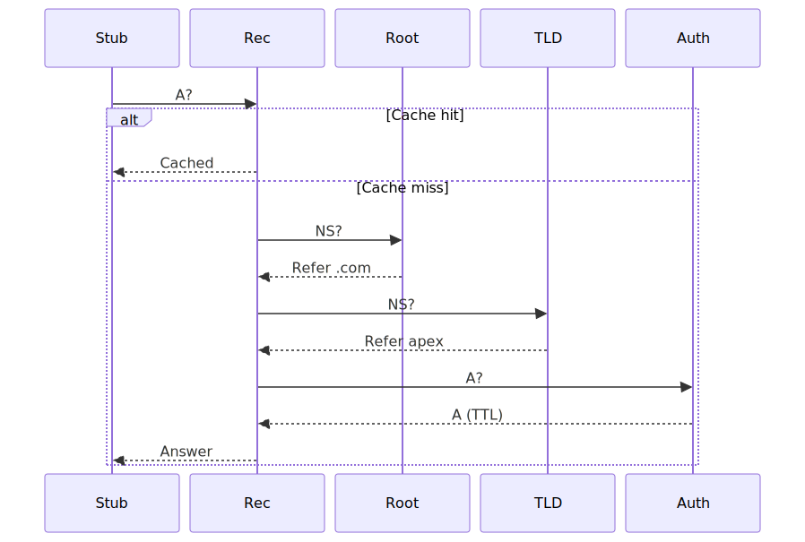
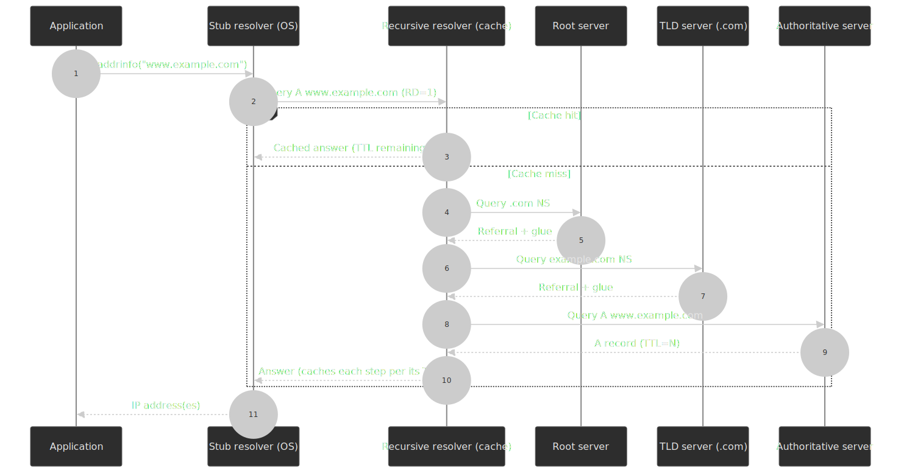
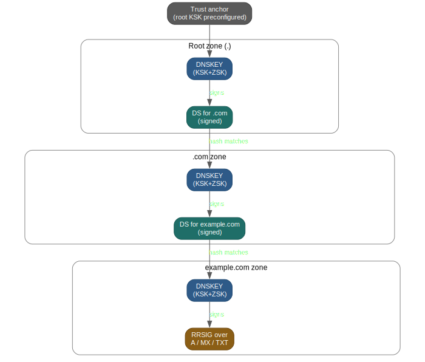

# DNS Deep Dive

The Domain Name System is the hierarchical, eventually consistent database that maps names to addresses (and to mail exchangers, service endpoints, public keys, and policy strings). Paul Mockapetris first specified DNS in [RFC 882 / 883 in 1983](https://datatracker.ietf.org/doc/html/rfc882); the modern protocol is defined by [RFC 1034](https://datatracker.ietf.org/doc/html/rfc1034) and [RFC 1035](https://datatracker.ietf.org/doc/html/rfc1035) in 1987 and refined by dozens of follow-ons (EDNS(0), DNSSEC, DoH/DoT/DoQ, SVCB/HTTPS). The design choices baked into those RFCs — UDP-first transport, per-record TTLs, hierarchical delegation, no transport authentication — show up in production as failover latency, cache-poisoning surface, and load-distribution constraints decades later.

This article is the **infrastructure-level survey** that opens the DNS series. It establishes the mental model and trade-offs at the level you need to make architecture decisions. The four companion articles drill in further:

- [DNS Resolution Path](../dns-resolution-path/README.md) — packet-level walk from stub to authoritative, glue records, SERVFAIL.
- [DNS Records, TTL, and Caching](../dns-records-ttl-and-caching/README.md) — every record type and the cache semantics that make "DNS propagation" really mean "cache expiry".
- [DNS Security: DNSSEC, DoH, DoT](../dns-security-doh-dot-dnssec/README.md) — authenticity vs. confidentiality, chain of trust, NSEC vs. NSEC3.
- [DNS Troubleshooting Playbook](../dns-troubleshooting-playbook/README.md) — `dig`/`delv`/`kdig` recipes for SERVFAIL, NXDOMAIN, and propagation issues.




## Mental model

DNS is a **hierarchical, eventually consistent, globally distributed key-value store** optimized for read-heavy workloads. Three layers, each with a distinct caching role:

| Layer                | Role                                | Caching behavior                                                                |
| -------------------- | ----------------------------------- | ------------------------------------------------------------------------------- |
| Stub resolver        | OS / browser client                 | Browser: short fixed window (Chrome ~60 s); OS resolver: typically honors TTL[^chrome-cache] |
| Recursive resolver   | Walks hierarchy on cache miss       | TTL-bound; supports negative caching ([RFC 2308](https://datatracker.ietf.org/doc/html/rfc2308)) |
| Authoritative server | Source of truth for a zone          | No caching — serves from zone file                                              |

[^chrome-cache]: Chromium's `HostCache` uses a fixed ~60 s positive-result TTL and does not honor server TTLs above or below that. See the [Chromium issue](https://issues.chromium.org/40956526) and the [text/plain write-up of Chromium's DNS cache](https://textslashplain.com/2022/03/31/chromiums-dns-cache/).

Core design trade-offs:

- **UDP first, TCP when needed.** DNS uses UDP for low latency; the historical 512-byte limit was relaxed by [EDNS(0) (RFC 6891)](https://datatracker.ietf.org/doc/html/rfc6891), and [DNS Flag Day 2020](https://dns-violations.github.io/dnsflagday/2020/) recommends a default EDNS UDP buffer of 1232 bytes to avoid IP fragmentation. Larger responses or zone transfers fall back to TCP, which is mandatory in conformant implementations ([RFC 7766](https://datatracker.ietf.org/doc/html/rfc7766)).
- **TTL-based caching** dramatically reduces authoritative load but ties change-propagation latency to the longest cached TTL on the path.
- **Hierarchical delegation** scales horizontally with no single point of failure but costs extra round trips on cache miss (root → TLD → authoritative).
- **No transport authentication in the original design** opened the door to cache poisoning. [DNSSEC](https://datatracker.ietf.org/doc/html/rfc4033) added cryptographic authenticity; [DoT (RFC 7858)](https://datatracker.ietf.org/doc/html/rfc7858), [DoH (RFC 8484)](https://datatracker.ietf.org/doc/html/rfc8484), and [DoQ (RFC 9250)](https://datatracker.ietf.org/doc/rfc9250/) added confidentiality on the client–resolver leg.

Operational implications worth keeping front of mind:

- Failover speed is bounded by TTL plus client-side caches; sub-minute failover is essentially impossible at the DNS layer alone.
- Negative responses (NXDOMAIN, NODATA) are cached — typos in DNS configuration take as long to clear as the SOA `MINIMUM` field.
- [EDNS Client Subnet (RFC 7871)](https://datatracker.ietf.org/doc/html/rfc7871) improves GeoDNS accuracy at the cost of leaking client subnet to authoritative servers and intermediate caches.

## DNS resolution process

> [!TIP]
> The packet-level walk-through — including SERVFAIL, glue records, and resolver `RD/RA` flag combinations — lives in the [DNS Resolution Path](../dns-resolution-path/README.md) companion article. This section gives the architectural shape.

### Query types: recursive vs. iterative

DNS supports two query modes that serve different purposes:

- **Recursive queries** (client → recursive resolver). The client asks for a complete answer; the resolver takes responsibility for walking the hierarchy. Most client queries are recursive — the `RD` (Recursion Desired) flag is set to 1 ([RFC 1035 §4.1.1](https://datatracker.ietf.org/doc/html/rfc1035#section-4.1.1)).
- **Iterative queries** (recursive resolver → authoritative servers). Each server returns a referral to the next. The resolver follows the chain: root → TLD → authoritative.

This separation is what makes DNS cache effectively. Clients only know their configured resolver; the resolver amortizes hierarchy walks across many clients. Authoritative servers see vastly fewer queries than they'd see if every client walked the hierarchy itself.

### Resolution chain in detail

For `www.example.com` from a cold cache:

1. **Root query**: Resolver queries a root server (e.g., `a.root-servers.net`). Root returns referral to `.com` TLD servers with their IP addresses (glue records).

2. **TLD query**: Resolver queries `.com` TLD server. TLD returns referral to `example.com` authoritative servers.

3. **Authoritative query**: Resolver queries `example.com` nameserver. Authoritative returns the A record with IP address.

4. **Caching**: Resolver caches all responses per their TTLs—root referrals (48 hours typical), TLD referrals (24-48 hours), final answer (varies by record).

**Latency breakdown** (typical uncached):

- Root query: 5-20ms (anycast)
- TLD query: 10-30ms
- Authoritative query: 10-100ms+ (depends on server location)
- Total: 25-150ms uncached vs. <1ms cached

### Negative caching (RFC 2308, updated by RFC 9520)

When a domain doesn't exist (NXDOMAIN) or has no records of the requested type (NODATA), the response is cached to prevent repeated queries. The authoritative server returns its SOA record in the authority section, and the negative-cache TTL is the **minimum of the SOA record's TTL and the SOA `MINIMUM` field** ([RFC 2308 §5](https://datatracker.ietf.org/doc/html/rfc2308#section-5)).

Without this rule, an attacker could flood resolvers with queries for nonexistent names and force them to walk the hierarchy on every miss. The trade-off is operational: setting SOA `MINIMUM` to 86400 s (1 day) means a typo in a record name persists in caches for a day; setting it too low increases authoritative load. A 300–3600 s window is a common middle ground.

[RFC 9520](https://datatracker.ietf.org/doc/rfc9520/) (2023) tightens the rules for the related but distinct case of *resolution failures* (timeouts, broken zones, validation failures): resolvers must cache failures for at least 1 second and at most 5 minutes, preventing the "retry storm against a broken authoritative" failure mode that previously had no normative bound. Modern terminology for both cases is consolidated in [RFC 9499](https://datatracker.ietf.org/doc/html/rfc9499) (March 2024), which obsoletes RFC 8499.

```bind title="example SOA record"
example.com.  IN SOA ns1.example.com. admin.example.com. (
    2024010101  ; serial
    7200        ; refresh (2 hours)
    900         ; retry (15 minutes)
    1209600     ; expire (2 weeks)
    3600        ; minimum TTL for negative caching
)
```

## Record types and design rationale

> [!TIP]
> Each record type has subtle constraints (NS glue, CAA inheritance, MX 0-only "null MX", etc.) covered exhaustively in [DNS Records, TTL, and Caching](../dns-records-ttl-and-caching/README.md). This section explains the ones most architecture decisions actually depend on.

### Address records: A and AAAA

- **A** maps a name to a 32-bit IPv4 address ([RFC 1035 §3.4.1](https://datatracker.ietf.org/doc/html/rfc1035#section-3.4.1), 1987).
- **AAAA** maps a name to a 128-bit IPv6 address ([RFC 3596](https://datatracker.ietf.org/doc/html/rfc3596), 2003). The name reflects that an IPv6 address is 4× the size of IPv4.

Modern stacks query A and AAAA in parallel and select the address per [RFC 6724](https://datatracker.ietf.org/doc/html/rfc6724) — typically preferring IPv6 when reachable. Multiple A/AAAA records for the same name enable round-robin distribution; resolvers may rotate the returned order, but client behavior varies (some use the first record, some randomize, some sort).

### CNAME: canonical name

`CNAME` creates an alias from one name to another. When a resolver encounters one, it must follow the chain to the canonical name and re-query.

[RFC 1034 §3.6.2](https://datatracker.ietf.org/doc/html/rfc1034#section-3.6.2) prohibits `CNAME` from coexisting with any other records at the same name. The intuition: a `CNAME` says "this name *is* that name", which is ambiguous if you also have an `A` record asserting an address. Because the zone apex (`example.com`) requires `NS` and `SOA` records by definition, **`CNAME` is not legal at the apex**.

Three ways out:

- **`CNAME` flattening** ([Cloudflare](https://developers.cloudflare.com/dns/manage-dns-records/reference/cname-flattening/)). The authoritative resolves the alias at query time and returns `A`/`AAAA` records to the client. Implementation lives entirely on the authoritative side and is invisible to the client.
- **Vendor `ALIAS`/`ANAME` records** (Route 53, DNSimple, NS1). Proprietary record types that behave like `CNAME` but resolve to addresses at the authoritative level. Route 53's [`ALIAS`](https://docs.aws.amazon.com/Route53/latest/DeveloperGuide/resource-record-sets-choosing-alias-non-alias.html) only targets specific AWS resources (CloudFront, ALB/NLB, S3 static sites, another Route 53 record).
- **`HTTPS`/`SVCB` AliasMode** ([RFC 9460](https://www.rfc-editor.org/rfc/rfc9460.html), Nov 2023). The standardized answer to apex aliasing for HTTP services: an `HTTPS` record with `SvcPriority = 0` aliases the apex without colliding with `MX` or `TXT` at the same owner. Browsers that issue `HTTPS` queries (Chrome, Safari, Firefox) follow this directly. It does **not** replace `CNAME` flattening for non-HTTP services or for clients that ignore `HTTPS` records — but the long-term direction of travel is clear.

`CNAME` chains (`A` → `B` → `C` → IP) are valid but add round trips on uncached queries. [RFC 1034 §3.6.2](https://datatracker.ietf.org/doc/html/rfc1034#section-3.6.2) explicitly recommends keeping them short.

### MX: mail exchange

`MX` records direct email traffic to mail servers. Each `MX` has a **priority** (lower = preferred) and a **target hostname**.

```bind
example.com.  IN MX  10 mail1.example.com.
example.com.  IN MX  20 mail2.example.com.
```

Priority enables failover: senders try priority 10 first, fall back to priority 20 if unreachable. Equal priorities are load-balanced.

> [!WARNING]
> The `MX` target must be a hostname (resolvable to `A`/`AAAA`), not an IP literal, and **must not be a `CNAME`** ([RFC 2181 §10.3](https://datatracker.ietf.org/doc/html/rfc2181#section-10.3)). This is a frequent source of broken mail delivery — many MTAs simply refuse `CNAME`-targeted MX.

### TXT: text records

`TXT` records store arbitrary text, limited to 255 characters per string but with multiple strings allowed in a single record (the resolver concatenates).

Primary uses:

- **SPF** (Sender Policy Framework). Lists authorized mail servers. The dedicated SPF record type (99) was deprecated by [RFC 7208 §3.1](https://datatracker.ietf.org/doc/html/rfc7208#section-3.1); use `TXT`.
- **DKIM**. Public key for mail signature verification.
- **DMARC**. Policy for handling SPF/DKIM failures.
- **Domain verification**. Google, AWS, GitHub, and most SaaS issuers use `TXT` records to prove domain ownership.

```bind
example.com.       IN TXT "v=spf1 include:_spf.google.com -all"
selector._domainkey.example.com. IN TXT "v=DKIM1; k=rsa; p=MIGf..."
_dmarc.example.com. IN TXT "v=DMARC1; p=reject; rua=mailto:dmarc@example.com"
```

### SRV: service records

`SRV` records ([RFC 2782](https://datatracker.ietf.org/doc/html/rfc2782), 2000) specify host and port for services. Format: `_service._proto.name TTL IN SRV priority weight port target`.

```bind
_sip._tcp.example.com. IN SRV 10 60 5060 sipserver.example.com.
_sip._tcp.example.com. IN SRV 10 40 5060 sipbackup.example.com.
```

| Field      | Meaning                                                             |
| ---------- | ------------------------------------------------------------------- |
| Priority   | Lower is preferred (like `MX`)                                      |
| Weight     | Load distribution among same-priority records (60/40 split above)   |
| Port       | Service port — decouples service location from port number          |
| Target     | Hostname (must not be `CNAME`)                                      |

`SRV` is widely used for SIP, XMPP, LDAP, and Minecraft servers. Kubernetes' DNS-based service discovery generates `SRV` records for each named port.

### NS: nameserver records

`NS` records delegate a zone to authoritative nameservers. They appear at the zone apex (asserting "I am authoritative for this zone") and at delegation points (subdomains delegated to different servers).

When an `NS` target lives inside the zone being delegated (`ns1.example.com` for `example.com`), the parent zone must include `A`/`AAAA` **glue records** to break the circular dependency: the resolver can't ask `ns1.example.com` for `example.com` without first resolving `ns1.example.com`.

```bind title="parent (.com) zone"
example.com.    IN NS  ns1.example.com.
example.com.    IN NS  ns2.example.com.
ns1.example.com. IN A   192.0.2.1    ; glue record
ns2.example.com. IN A   192.0.2.2    ; glue record
```

[RFC 9471](https://datatracker.ietf.org/doc/rfc9471/) (2023) clarifies a long-standing ambiguity in [RFC 1034](https://datatracker.ietf.org/doc/html/rfc1034): authoritative servers **must** return glue for *every* in-domain nameserver, not just the first one. If response size would exceed the requestor's UDP buffer, the server must set the `TC` (truncation) bit so the resolver retries over TCP — silently omitting glue is a conformance bug.

### Record-type decision matrix

| Use case                    | Record         | Notes                                                                  |
| --------------------------- | -------------- | ---------------------------------------------------------------------- |
| IPv4 endpoint               | `A`            | Multiple records → round-robin                                         |
| IPv6 endpoint               | `AAAA`         | Publish alongside `A` for dual-stack                                   |
| Alias to another name       | `CNAME`        | Not legal at apex; use `HTTPS`/`SVCB` AliasMode or vendor `ALIAS`      |
| Apex aliasing for HTTP      | `HTTPS`/`SVCB` | Standardized AliasMode ([RFC 9460](https://www.rfc-editor.org/rfc/rfc9460.html)) — coexists with `MX`/`TXT`     |
| Email routing               | `MX`           | Hostname target only — no IP, no `CNAME`                               |
| Email auth (SPF/DKIM/DMARC) | `TXT`          | Note 255-char per-string limit; long DKIM keys span multiple strings   |
| Service + port              | `SRV`          | Used by Kubernetes, SIP, XMPP, LDAP                                    |
| Zone or subzone delegation  | `NS`           | Include glue when nameserver is in-zone                                |
| Public key for TLSA / SSHFP | `TLSA` / `SSHFP` | DANE / SSH host-key pinning, requires DNSSEC validation              |
| DNSSEC DS automation        | `CDS` / `CDNSKEY` | Child signals desired DS to parent (RFCs 7344 / 8078 / 9615)       |

## TTL strategies and trade-offs

TTL controls how long resolvers cache a record. A single value has to balance fast failover, low query load, and change-propagation speed — and the *effective* delay your users see depends on every cache layer between the authoritative server and the application.




### Low TTL (60–300 s)

Use when records change with infrastructure events: health-checked failover, blue/green cutovers, active/passive DR.

- Fast change propagation (minutes).
- Higher query rate against authoritative servers.
- Some recursive resolvers floor very short TTLs (often around 30–60 s) to protect themselves; in practice, you cannot rely on TTLs below ~30 s being honored end-to-end.
- Browser and OS caches add their own floor on top — Chrome's `HostCache` uses ~60 s regardless of server TTL[^chrome-cache], so users may see a stale answer well past the resolver's TTL expiry.

### High TTL (3600–86400 s)

Use for stable records: production `NS`, `MX` for established domains, root/TLD referrals, durable CDN endpoints.

- Reduced authoritative load and higher cache hit rate.
- Resilient to short authoritative outages — cached answers continue to serve.
- Mistakes are slow to undo. A bad record at 1-day TTL is a bad record for up to 1 day from the moment it's first served.

### TTL migration strategy

To change a long-cached record without long propagation:

1. **T − 2 × old-TTL**: lower TTL from 86400 s → 3600 s, then to 300 s. You must wait at least the *previous* TTL between each step or the lower value won't be in cache when the change goes live.
2. **T = 0**: make the change.
3. **T + ~5 min**: verify from multiple vantage points (open public resolvers, your own clients).
4. **T + 24 h**: raise TTL back to the steady-state value.

> [!IMPORTANT]
> Step 1 is the part teams forget. If your previous TTL was 86400 s, you must publish the lower TTL ≥ 24 h before the change, or older caches will still be holding 24 h-stale records when you swing traffic.

## DNS-based load balancing

DNS can distribute traffic across servers, but it's a coarse-grained mechanism. The decision of "which IP do you give this client" happens once per cache miss, not per request, which limits how reactive any DNS-level scheme can be.

### Round-robin DNS

Return multiple `A`/`AAAA` records and let the client pick. Resolvers may rotate the order across responses; clients vary in how they pick (first, random, address-selection rules per [RFC 6724](https://datatracker.ietf.org/doc/html/rfc6724)).

Round-robin alone is rarely enough on its own:

- No health checking — dead IPs stay in rotation until removed manually.
- No session affinity — clients can land on different IPs across cache refresh.
- No load awareness — distribution is by-record, not by-load.
- Caching at the resolver and client defeats short-window rotation.

In practice, large sites combine round-robin with BGP anycast: each advertised IP fans out to the nearest datacenter, so traffic distribution happens at the routing layer rather than at DNS.

### Weighted routing

Route 53, Cloudflare, and others support weighted DNS where records have relative weights.

```bind
; 70% to primary, 30% to secondary
www  300  IN A  192.0.2.1  ; weight 70
www  300  IN A  192.0.2.2  ; weight 30
```

**Use cases**:

- Canary deployments (1% to new version)
- Gradual migration (shift traffic over time)
- A/B testing (split by DNS)

> [!CAUTION]
> Weights apply to DNS *responses*, not the requests that follow. A single resolver cache hit serves the same answer to every client behind that resolver until TTL expiry — so weight distribution is approximate, especially behind large public resolvers.

### Latency-based routing

Managed providers (Route 53, Cloudflare Load Balancer, Azure Traffic Manager) measure latency from resolver locations to provider POPs/regions and return the lowest-latency endpoint per query. Accuracy improves with [EDNS Client Subnet](https://datatracker.ietf.org/doc/html/rfc7871) when the client's resolver supports it.

The catch: latency is measured to *provider regions*, not to your specific endpoints, and the measurement is over a sliding window. A server overloaded *right now* may still look "lowest latency" to the routing fabric.

### GeoDNS

Return different records based on the client's geographic location. The location signal comes from one of two sources:

- **Resolver IP** with a GeoIP database. Inaccurate when users sit behind centralized public resolvers (`8.8.8.8`, `1.1.1.1`) that may be far from the actual user.
- **EDNS Client Subnet (ECS)** ([RFC 7871](https://datatracker.ietf.org/doc/html/rfc7871)). The recursive resolver forwards a truncated client subnet to the authoritative, which uses it to localize the answer. More accurate; but the client's network leaks to every resolver and authoritative on the path.

> [!NOTE]
> Privacy-focused resolvers minimize or disable ECS by default. Cloudflare's `1.1.1.1` strips ECS in most cases, which is why GeoDNS targeting clients behind it loses precision.

Netflix routes users to Open Connect appliances using GeoDNS-style answers. Content not available in a region? The authoritative returns a different IP that serves a region-blocked page.

### Anycast DNS

Instead of returning different IPs by region, use the *same* IP announced from multiple locations via BGP. Routing delivers packets to the topologically nearest origin.

Trade-offs:

- No DNS-level steering — works with every resolver, ECS or not.
- Instant failover at the routing layer (withdraw the BGP announcement).
- DDoS resilience — attack traffic spreads across all origins.
- Requires BGP and an AS number; long-lived TCP connections can break if a route changes mid-flow.
- Operational visibility is harder — "which POP answered this query?" needs explicit telemetry.

`1.1.1.1`, `8.8.8.8`, and every root DNS letter use anycast. Cloudflare's network of 330+ cities all advertise the same `1.1.1.1` and `1.0.0.1`.[^cf-cities]

[^cf-cities]: [Cloudflare — What is 1.1.1.1?](https://www.cloudflare.com/learning/dns/what-is-1.1.1.1/) (network spans 330+ cities; DNSPerf ranks 1.1.1.1 as the fastest public resolver).

### Load-balancing decision matrix

| Approach               | Health checks        | Granularity          | Operational complexity |
| ---------------------- | -------------------- | -------------------- | ---------------------- |
| Round-robin            | No                   | Per record           | Low                    |
| Weighted               | Optional             | Per record           | Low                    |
| Latency-based          | Provider-side        | Per region/POP       | Medium                 |
| GeoDNS                 | Optional             | Per country/region   | Medium                 |
| Anycast + BGP          | BGP withdrawal       | Per datacenter       | High                   |

For most applications, the right answer is **a load balancer (ALB/NLB/HAProxy/Envoy) behind DNS**. DNS distributes traffic to load balancers; the load balancer handles per-request balancing, health checks, and connection draining.

## DNS security

> [!TIP]
> The full treatment of DNSSEC chain-of-trust mechanics, NSEC vs NSEC3, key rollover, and DoH/DoT/DoQ deployment lives in [DNS Security: DNSSEC, DoH, DoT](../dns-security-doh-dot-dnssec/README.md). This section frames the threat model and surface area so the rest of the article makes sense.

### The original problem: no authentication

[RFC 1034](https://datatracker.ietf.org/doc/html/rfc1034) and [RFC 1035](https://datatracker.ietf.org/doc/html/rfc1035) defined DNS without authentication. Resolvers trust any response that matches a query's question section, transaction ID, source port, and (for UDP) destination address. Three classes of attack follow:

- **Cache poisoning** — an attacker races to inject a forged response before the legitimate one arrives.
- **On-path tampering** — an attacker between client and resolver (or resolver and authoritative) modifies responses in flight.
- **DNS hijacking** — ISPs, hotel Wi-Fi, or governments redirect queries to their own infrastructure.

### The Kaminsky attack (2008)

Dan Kaminsky [showed in 2008](https://en.wikipedia.org/wiki/Dan_Kaminsky) that a 16-bit transaction ID gives only 65,536 possibilities — small enough to brute-force during the open window of a query.

The attack uses non-existent subdomain queries (`random123.example.com`) to force the resolver to ask upstream, then floods spoofed responses for every transaction ID, including malicious `NS` records that re-delegate the entire zone. If a forged response arrives before the legitimate one, the cache is poisoned at the zone level.

The standard mitigation since 2008 is **source-port randomization**, adding ~16 bits of entropy (~32 bits total) on top of the transaction ID.

**SAD DNS (2020)** revived the attack. Researchers from UC Riverside and Tsinghua showed that global ICMP rate limiting in modern OS network stacks acts as a side channel: an attacker sends spoofed UDP packets and probes whether the rate limiter is engaged to infer which source ports are open ([Cloudflare's SAD DNS Explained](https://blog.cloudflare.com/sad-dns-explained/)). Once the attacker narrows the source port, the transaction-ID space is back in brute-force range. Defenses include [DNS Cookies (RFC 7873)](https://datatracker.ietf.org/doc/html/rfc7873) — a 64-bit shared secret carried in queries and responses — and DNSSEC validation, which rejects forged responses regardless of how they reach the resolver.

### DNSSEC: cryptographic authenticity

[DNSSEC](https://datatracker.ietf.org/doc/html/rfc4033) (RFCs 4033/4034/4035, 2005) adds digital signatures to DNS responses. Validators verify that a response was produced by the zone's private key and has not been altered.

The four record types you need to know:

- **DNSKEY** — public keys for the zone. Typically a Key Signing Key (KSK) and one or more Zone Signing Keys (ZSK).
- **RRSIG** — signature over an RRset, produced by the ZSK.
- **DS** — hash of a child zone's KSK, stored in the parent. The DS in the parent and the matching DNSKEY in the child are what link two zones into a chain.
- **NSEC / NSEC3** — authenticated denial of existence; proves "this name does not exist" without letting an attacker forge an NXDOMAIN.




The validating resolver starts from a preconfigured trust anchor (the root zone's KSK, distributed by IANA and managed by ICANN) and walks down: root DNSKEY signs root DS, root DS hashes match the TLD DNSKEY, TLD DNSKEY signs TLD DS, and so on until the answer's RRSIG is verified by the leaf zone's ZSK.

Two header flags govern the validator handshake between stub and recursive ([RFC 4035 §3.2.2 / §4.6](https://datatracker.ietf.org/doc/html/rfc4035#section-3.2.2)):

- **`AD` (Authenticated Data)** — set by the recursive in *responses* to indicate that every RRset in the Answer/Authority sections passed DNSSEC validation. A non-validating stub trusts this only over a secure channel to a trusted resolver (DoT/DoH); otherwise it's a hint, not proof.
- **`CD` (Checking Disabled)** — set by the resolver in *queries* to ask the recursive to skip validation and return data even if signatures don't verify. Used by validating stubs that prefer to validate locally, and as a debugging escape hatch (`dig +cd …`) to distinguish "broken DNSSEC" from "broken zone."

**Authenticated denial of existence** — proving a name does not exist without forging an NXDOMAIN — uses NSEC or NSEC3 records. NSEC chains the canonical names alphabetically, which lets an attacker enumerate the zone by walking the chain. NSEC3 hashes names with a salted iteration count to prevent walking, but the hashes are still vulnerable to offline dictionary attacks against weak iteration counts ([RFC 9276](https://datatracker.ietf.org/doc/rfc9276/) recommends iterations = 0 and an empty salt for that reason).

Operational pain points are mostly about keeping the chain valid:

- **Signature expiration** — RRSIGs carry inception and expiration timestamps. Forget to re-sign before expiry and validating resolvers return SERVFAIL.
- **Clock skew** — validators check signature timestamps. Drift on either side breaks validation spuriously.
- **Key rollover** — changing keys requires coordinating with the parent (DS update) and respecting TTLs on both sides. The first root KSK rollover, originally planned for 2017, was delayed and finally completed in October 2018 ([ICANN 2018-10-11 announcement](https://www.icann.org/en/announcements/details/ksk-rollover-on-11-october-completed-without-significant-issues-12-10-2018-en)).
- **DS upload friction** — historically the DS update at the parent was a manual registrar workflow, which is why so many production zones never rotated. [RFC 7344](https://datatracker.ietf.org/doc/html/rfc7344) defines `CDS` and `CDNSKEY` records (published at the child apex) that signal the desired DS to the parent; [RFC 8078](https://datatracker.ietf.org/doc/html/rfc8078) extends this to initial enablement and a "delete" signal (`CDS 0 0 0 00`) that turns DNSSEC off cleanly. [RFC 9615](https://datatracker.ietf.org/doc/rfc9615/) (2024) standardises automatic bootstrapping for the very first DS. Where the registrar/registry supports it, this collapses key rollover from a ticketed change to a polled reconciliation.

Adoption is uneven. APNIC Labs measures the share of users *behind* validating resolvers — around 36% globally as of early 2026, with very large country-level variation ([APNIC DNSSEC stats](https://stats.labs.apnic.net/dnssec); see also the [APNIC 2026-02 industry summary](https://blog.apnic.net/2026/02/25/towards-an-industry-best-practice-for-dnssec-automation/)). The share of *queries* validated end-to-end (signed zone × validating resolver × no fallback) is far smaller — secure delegation rates are around 7%, so end-to-end protected queries land in single-digit percentages of total DNS traffic.

```bash title="Debugging DNSSEC validation"
dig +dnssec +multi example.com
delv example.com           # explicit DNSSEC validator from BIND
dig +cd example.com        # +cd = checking disabled — bypass validation to isolate
```

### DoH, DoT, and DoQ: confidentiality on the client–resolver leg

DNSSEC authenticates *answers*; it does not encrypt *questions*. Anyone on the network path can still see which names you look up. Three encrypted transports add confidentiality on the stub-to-recursive leg:

| Aspect          | DoT ([RFC 7858](https://datatracker.ietf.org/doc/html/rfc7858), 2016) | DoH ([RFC 8484](https://datatracker.ietf.org/doc/html/rfc8484), 2018) | DoQ ([RFC 9250](https://datatracker.ietf.org/doc/rfc9250/), 2022) |
| --------------- | --------------------------------------------------------------- | --------------------------------------------------------------- | ----------------------------------------------------------- |
| Transport       | TLS over TCP                                                    | HTTPS (HTTP/2 or HTTP/3)                                        | QUIC                                                        |
| Port            | 853 (dedicated)                                                 | 443 (shared with web traffic)                                   | 853/UDP                                                     |
| Network blocking| Easy — block port 853                                           | Hard — looks like any HTTPS traffic                             | Easy — block port 853/UDP                                   |
| Latency         | TCP handshake                                                   | TCP + TLS + HTTP framing                                        | 1-RTT (or 0-RTT on resumption); avoids head-of-line blocking|
| Typical use     | OS-level resolver (Android Private DNS, iOS, systemd-resolved)  | Browser-level (Chrome, Firefox, Edge); Windows 11               | Recursive ↔ authoritative; emerging stub support             |

Important caveats:

- These protocols encrypt only the **client ↔ resolver** leg. The resolver ↔ authoritative path remains plaintext UDP unless the authoritative also supports an encrypted protocol — which most do not yet.
- Your chosen resolver still sees every query you make. 1.1.1.1 and 8.8.8.8 publish privacy policies; an ISP resolver typically does not.
- Encryption hides query *content* but not *length*. Without padding, query and response sizes leak information about the name being looked up. The [EDNS(0) Padding option (RFC 7830)](https://datatracker.ietf.org/doc/html/rfc7830) and the [block-length padding policy in RFC 8467](https://datatracker.ietf.org/doc/html/rfc8467) (clients pad queries to multiples of 128 octets, servers pad responses to multiples of 468) close this side channel. Padding is only useful over an encrypted transport — over plaintext UDP it just wastes bandwidth.
- [Oblivious DoH (RFC 9230)](https://datatracker.ietf.org/doc/rfc9230/) splits the trust by introducing an oblivious proxy: the proxy sees the client's IP but not the query content; the target resolver sees the query but not the client's IP. No single party correlates both.

### DNS amplification attacks

Open resolvers and certain authoritative configurations let attackers turn small queries into large responses, amplifying spoofed traffic against a victim:

1. Attacker spoofs the victim's IP as source.
2. Attacker sends small queries (60-ish bytes) that elicit large responses (3+ KB with DNSSEC).
3. The resolver returns the large response to the victim.
4. The amplification factor for ANY queries with DNSSEC commonly hits 50× and can exceed 100×.

Mitigations stack at multiple layers:

- **Response Rate Limiting (RRL)** on authoritative servers caps responses per source IP per second.
- **BCP 38 / BCP 84** ingress filtering at ISPs prevents the spoofed traffic from leaving the source network in the first place.
- **Refusing recursion from arbitrary clients** on resolvers is now standard.
- **[RFC 8482](https://datatracker.ietf.org/doc/html/rfc8482)** explicitly allows authoritative servers to refuse `ANY` queries and respond with a small synthetic answer (Cloudflare's well-known `HINFO "RFC8482"` reply), shrinking the amplification surface.

### Security checklist

| Threat                | Mitigation                              | Status                                                      |
| --------------------- | --------------------------------------- | ----------------------------------------------------------- |
| Cache poisoning       | Source-port randomization               | Standard in every modern resolver since 2008                |
| Cache poisoning (SAD) | DNS Cookies + DNSSEC                    | DNS Cookies default in BIND 9.11+; DNSSEC adoption uneven   |
| Eavesdropping         | DoT / DoH / DoQ on stub ↔ resolver leg  | Growing — Android, iOS, Chrome, Firefox, Windows 11        |
| Size-based traffic analysis | EDNS(0) Padding (RFC 7830 / RFC 8467) | Block-length padding; only useful over encrypted transport |
| DS update friction    | CDS / CDNSKEY (RFC 7344, 8078, 9615)    | Server-side support common (Cloudflare, deSEC, BIND); registrar/TLD pickup uneven (e.g. Route 53 still requires a manual DS upload at the registrar) |
| Amplification DDoS    | RRL on authoritative + BCP 38 at ISPs   | Partial; BCP 38 deployment remains a stubborn gap           |
| Zone hijacking        | Registrar lock + MFA + DNSSEC           | Recommended for any production zone                         |
| Apex aliasing         | `HTTPS`/`SVCB` AliasMode (RFC 9460)     | Standardized 2023; browser support landing                  |

## DNS failover and health checks

DNS-based failover removes unhealthy endpoints from responses. It's slower than a load balancer's per-request health check but works across regions and DNS providers.

### How DNS health checks work (Route 53 example)

1. Health checkers in multiple regions probe your endpoint on a fixed interval (commonly 10–30 s).
2. If the endpoint fails checks from a majority of checkers, the record is marked unhealthy.
3. Route 53 stops returning that record (or fails over to a designated secondary).
4. Existing cached responses continue to serve until each cache's TTL expires.

Health-check options typically include HTTP/HTTPS path/status checks, TCP connectivity probes, calculated combinations of multiple checks, and (on Route 53) CloudWatch alarm-driven checks.

### Failover latency analysis

```text title="Best-case failover timeline (60s TTL, no browser cache)"
T+0:00 — Primary fails
T+0:30 — Health check fails (30 s interval)
T+1:00 — Majority of checkers confirm failure
T+1:30 — Provider marks record unhealthy, stops returning it
T+1:30 → T+2:30 — Cached answers continue serving until TTL expires
T+2:30 — Recursive caches refresh; traffic flows to secondary
```

End-to-end failover with a 60 s TTL is on the order of 2–3 minutes for clients past the recursive layer. Add another 1–2 minutes for browser caches that floor TTLs (Chrome) or that pre-resolve. A load balancer health check, by contrast, typically detects failure in 10–30 s and shifts traffic on the next request.

### Active–active vs. active–passive

**Active–active**: multiple endpoints in rotation; unhealthy ones removed.

```bind
www.example.com.  60  IN  A  192.0.2.1  ; health checked
www.example.com.  60  IN  A  192.0.2.2  ; health checked
```

**Active–passive**: secondary only used when primary fails.

```bind title="Route 53 failover routing policy"
www.example.com.  60  IN  A  192.0.2.1  ; primary, health checked
www.example.com.  60  IN  A  192.0.2.2  ; secondary, returned only if primary fails
```

> [!WARNING]
> With active–passive, if the secondary isn't health-checked, failover may route to a dead endpoint that simply hadn't been monitored. Always health-check both legs.

## Real-world examples

### Cloudflare 1.1.1.1: building a fast resolver

A public recursive resolver optimized for speed and privacy. Key design choices:

- **Anycast from 330+ cities** advertising the same `1.1.1.1` and `1.0.0.1` addresses. BGP delivers queries to the nearest healthy POP.
- **Aggressive edge caching** with pre-population of popular domains.
- **Minimal logging** — Cloudflare's [public privacy commitments](https://www.cloudflare.com/privacypolicy/1111/) include short retention and a no-sale policy, audited by KPMG.
- **DNSSEC validation enabled by default** for client queries.
- **DoT, DoH, and DoQ support** for confidentiality.

Independent benchmarks (DNSPerf) consistently rank 1.1.1.1 as the fastest of the major public resolvers globally.

**October 4, 2023 SERVFAIL incident.** From 07:00 to 11:00 UTC, 1.1.1.1 returned SERVFAIL for a growing share of queries (peaking at ~15% in larger DCs like Ashburn, Frankfurt, and Singapore). Root cause: Cloudflare's recursive infrastructure preloads the root zone, and the cached zone file did not parse the new `ZONEMD` resource record type that was added to the root zone on 2023-09-21. When the cached zone's DNSSEC signatures expired on 2023-10-04, the resolver could not refresh and started failing validation ([Cloudflare postmortem](https://blog.cloudflare.com/1-1-1-1-lookup-failures-on-october-4th-2023/)). The lesson: even mature DNSSEC operations can be undone by a parser that has not kept pace with new record types.

### Route 53: DNS at AWS scale

Route 53 is the authoritative DNS service AWS exposes for hosted zones, plus a recursive (`Resolver`) service for VPC-attached workloads. The architectural choices that show up in production:

- **Globally distributed anycast** announcing nameserver IPs from AWS's edge footprint (50+ edge locations). Anycast routes queries to the topologically nearest server.[^route53-anycast]
- **Shuffle sharding** of nameservers per hosted zone: each zone is assigned 4 nameservers drawn from 4 distinct delegation "stripes" (`.com`, `.net`, `.co.uk`, `.org`), so any two customer zones overlap in at most 2 of 4 nameservers. This gives strong per-customer fault isolation against nameserver-level failures.[^route53-anycast]
- **EDNS Client Subnet** support for latency-based and geo routing.
- **`ALIAS` records** that resolve AWS resources (CloudFront, ALB/NLB, S3 static hosting, another Route 53 record) at the authoritative level — avoiding `CNAME` chains and side-stepping the apex restriction for AWS endpoints.
- **Public 100% SLA** (compensated via service credits) — unique among AWS services, reflecting how central DNS is.

[^route53-anycast]: AWS Architecture Blog — [A Case Study in Global Fault Isolation](https://aws.amazon.com/blogs/architecture/a-case-study-in-global-fault-isolation/) describes the anycast topology and shuffle-sharding scheme.

### GitHub: DNS and DDoS

GitHub is a perpetual target for DDoS — high value, high public profile, large surface area. Their public posture combines:

- **Multiple DNS providers** (and historically multiple anycast IPs) to survive provider-level outages.
- **DDoS mitigation partners** (Akamai Prolexic, Cloudflare Magic Transit) for upstream scrubbing.

The most famous incident is the **February 28, 2018 memcached-amplification attack** that peaked at 1.35 Tbps and 126.9 Mpps. GitHub's edge alarmed at 17:21 UTC, BGP-shifted to Akamai Prolexic at 17:26 UTC, and confirmed recovery by 17:30 UTC — roughly 8–10 minutes of degraded service ([GitHub postmortem](https://github.blog/news-insights/company-news/ddos-incident-report/)). The attack vector was memcached reflection rather than DNS, but it's a useful baseline for "what does a real-world high-amplification UDP attack look like" — DNS amplification operates on the same physics with smaller multipliers.

### Root DNS: the foundation

The root zone is served by 13 logical server *identities*, lettered `A` through `M`, operated by 12 independent organizations. Each identity is realized as hundreds of anycast instances; the [Root Server Technical Operations Association](https://root-servers.org/) tracks the live count, currently in the **2,000+ instances globally** range.

Why 13? Pre-EDNS, DNS responses were capped at 512 bytes. The list of root nameservers and their glue records had to fit a single UDP packet, which constrained the count to 13. EDNS(0) lifted that limit, but the 13-identity structure is preserved for stability and compatibility.

The system's resilience comes from anycast: an attack on "A root" hits different physical servers depending on the attacker's location. No single instance failure has visible global impact, and operators can withdraw and re-announce instances independently. The root zone is DNSSEC-signed and the trust anchor (root KSK) is preconfigured in validating resolvers; the [first KSK rollover](https://www.icann.org/en/announcements/details/ksk-rollover-on-11-october-completed-without-significant-issues-12-10-2018-en) completed in October 2018 after years of staged trust-anchor distribution.

## Common pitfalls

### 1. `CNAME` at the zone apex

Setting `example.com IN CNAME loadbalancer.example.net` is rejected by [RFC 1034 §3.6.2](https://datatracker.ietf.org/doc/html/rfc1034#section-3.6.2) because `CNAME` cannot coexist with the apex's mandatory `NS` and `SOA`. Use vendor `ALIAS`/`ANAME` records, `CNAME` flattening, or — increasingly — [`HTTPS`/`SVCB` AliasMode](https://www.rfc-editor.org/rfc/rfc9460.html) for HTTP services.

### 2. Setting the negative TTL too high "for stability"

A 1-day SOA `MINIMUM` is a popular but counterproductive default. A typo in any record name caches as NXDOMAIN for a full day across every recursive resolver in the world. Keep negative TTL in the 300–3600 s range unless you have a specific reason otherwise.

### 3. Over-relying on DNS failover

DNS TTL + recursive caches + browser/OS caches = minutes of stale responses, even with a 60 s authoritative TTL. DNS failover is appropriate for regional/datacenter outages where minutes are acceptable. For server-level failures, you need a load balancer or service mesh that operates at request granularity.

### 4. Missing glue records on in-zone nameservers

Delegating `example.com` to `ns1.example.com` without glue creates a circular dependency: the resolver needs `ns1.example.com`'s address to query it, but can only learn that address from `example.com` — which it cannot reach. Most registrars insert glue automatically, but this still bites self-hosted setups.

### 5. DNSSEC signature expiration

Sign a zone, then forget to re-sign before the RRSIGs expire. Validating resolvers return SERVFAIL; users behind those resolvers (a non-trivial slice of global traffic — see DNSSEC adoption above) cannot reach the domain. Always automate signing — Route 53 and Cloudflare manage rollover for you; if you self-host, OpenDNSSEC with automated key management is the standard answer.

### 6. Confusing "DNS propagation" with intentional cache expiry

There is no propagation step. The authoritative server's view changes the moment you publish; what you're waiting for is every cache between the authoritative and your users to expire its old entry. This is why pre-lowering TTLs *before* a change is the only reliable way to bound the user-visible delay.

## Practical takeaways

- DNS is a read-optimized hierarchical cache. Plan for the cache, not the lookup.
- Failover speed is bounded by **every** TTL on the path — authoritative, recursive, OS, browser. Lower TTLs *before* a change, not during it.
- Use DNS for coarse-grained distribution (global → regional load balancer) and let the load balancer handle per-request health and balancing.
- Apex aliasing is no longer a niche problem: standard `HTTPS`/`SVCB` AliasMode is the long-term answer; vendor `ALIAS` is the today answer.
- DNSSEC and DoH/DoT/DoQ solve **different** problems (authenticity vs. confidentiality). Deploy both if the threat model warrants.
- Use managed DNS (Route 53, Cloudflare, NS1) unless you have a specific reason to self-host. The operational tail of DNS — DDoS surface, DNSSEC rollover, multi-region availability — is exactly the kind of work managed providers do well.
- Test failover regularly. The first time you exercise a failover should not be an outage.

DNS will outlive most of the systems it serves. Architecting *around* its constraints — eventual consistency, cache layering, soft authentication — leads to more resilient systems than fighting them.

## Appendix

### Prerequisites

- Basic networking concepts (IP, TCP/UDP, ports).
- Familiarity with client–server architecture.
- Some exposure to certificates and TLS helps for the security section.

### Terminology

- **Authoritative server** — DNS server that holds source-of-truth records for a zone.
- **Recursive resolver** — server that walks the hierarchy on behalf of clients and caches results.
- **Stub resolver** — the minimal resolver in the OS or application that forwards to a recursive resolver.
- **Zone** — administrative boundary in the DNS namespace (e.g., `example.com` and any non-delegated subdomains).
- **TTL** — duration a record can be cached before re-query.
- **Glue record** — `A`/`AAAA` in the parent zone providing the address for an in-zone nameserver.
- **EDNS(0)** — Extension Mechanisms for DNS; allows larger UDP responses and adds option fields ([RFC 6891](https://datatracker.ietf.org/doc/html/rfc6891)).
- **ECS** — EDNS Client Subnet; passes a truncated client subnet to authoritative servers.
- **Anycast** — routing technique where the same IP prefix is announced from multiple locations.

### References

Specifications (primary sources):

- [RFC 1034 — Concepts and Facilities](https://datatracker.ietf.org/doc/html/rfc1034) and [RFC 1035 — Implementation and Specification](https://datatracker.ietf.org/doc/html/rfc1035)
- [RFC 2181 — Clarifications to the DNS Specification](https://datatracker.ietf.org/doc/html/rfc2181)
- [RFC 2308 — Negative Caching of DNS Queries](https://datatracker.ietf.org/doc/html/rfc2308)
- [RFC 2782 — DNS SRV Records](https://datatracker.ietf.org/doc/html/rfc2782)
- [RFC 3596 — DNS Extensions to Support IPv6 (AAAA)](https://datatracker.ietf.org/doc/html/rfc3596)
- [RFC 4033 / 4034 / 4035 — DNSSEC](https://datatracker.ietf.org/doc/html/rfc4033)
- [RFC 6724 — Default Address Selection for IPv6](https://datatracker.ietf.org/doc/html/rfc6724)
- [RFC 6891 — Extension Mechanisms for DNS (EDNS(0))](https://datatracker.ietf.org/doc/html/rfc6891)
- [RFC 7344 — Automating DNSSEC Delegation Trust Maintenance (CDS / CDNSKEY)](https://datatracker.ietf.org/doc/html/rfc7344)
- [RFC 7766 — DNS Transport over TCP — Implementation Requirements](https://datatracker.ietf.org/doc/html/rfc7766)
- [RFC 7830 — The EDNS(0) Padding Option](https://datatracker.ietf.org/doc/html/rfc7830)
- [RFC 7858 — DNS over TLS (DoT)](https://datatracker.ietf.org/doc/html/rfc7858)
- [RFC 7871 — EDNS Client Subnet](https://datatracker.ietf.org/doc/html/rfc7871)
- [RFC 7873 — DNS Cookies](https://datatracker.ietf.org/doc/html/rfc7873)
- [RFC 8078 — Managing DS Records from the Parent via CDS/CDNSKEY](https://datatracker.ietf.org/doc/html/rfc8078)
- [RFC 8467 — Padding Policies for EDNS(0)](https://datatracker.ietf.org/doc/html/rfc8467)
- [RFC 8482 — Providing Minimal-Sized Responses to DNS `ANY`](https://datatracker.ietf.org/doc/html/rfc8482)
- [RFC 8484 — DNS over HTTPS (DoH)](https://datatracker.ietf.org/doc/html/rfc8484)
- [RFC 9230 — Oblivious DNS over HTTPS](https://datatracker.ietf.org/doc/rfc9230/)
- [RFC 9250 — DNS over Dedicated QUIC Connections (DoQ)](https://datatracker.ietf.org/doc/rfc9250/)
- [RFC 9276 — Guidance for NSEC3 Parameter Settings](https://datatracker.ietf.org/doc/rfc9276/)
- [RFC 9460 — Service Binding and Parameter Specification (SVCB / HTTPS records)](https://www.rfc-editor.org/rfc/rfc9460.html)
- [RFC 9471 — DNS Glue Requirements in Referral Responses](https://datatracker.ietf.org/doc/rfc9471/)
- [RFC 9499 — DNS Terminology](https://datatracker.ietf.org/doc/html/rfc9499) (obsoletes RFC 8499)
- [RFC 9520 — Negative Caching of DNS Resolution Failures](https://datatracker.ietf.org/doc/rfc9520/) (updates RFC 2308)
- [RFC 9615 — Automatic DNSSEC Bootstrapping using Authenticated Signals from the Zone's Operator](https://datatracker.ietf.org/doc/rfc9615/)

Operational and engineering sources:

- [Cloudflare — 1.1.1.1 Lookup Failures on October 4, 2023 (postmortem)](https://blog.cloudflare.com/1-1-1-1-lookup-failures-on-october-4th-2023/)
- [Cloudflare — SAD DNS Explained](https://blog.cloudflare.com/sad-dns-explained/)
- [Cloudflare — Introducing CNAME Flattening](https://blog.cloudflare.com/introducing-cname-flattening-rfc-compliant-cnames-at-a-domains-root/)
- [Cloudflare — RFC 8482, Saying Goodbye to ANY](https://blog.cloudflare.com/rfc8482-saying-goodbye-to-any/)
- [GitHub — February 28th DDoS Incident Report](https://github.blog/news-insights/company-news/ddos-incident-report/)
- [AWS Architecture Blog — A Case Study in Global Fault Isolation (Route 53)](https://aws.amazon.com/blogs/architecture/a-case-study-in-global-fault-isolation/)
- [AWS Route 53 Developer Guide](https://docs.aws.amazon.com/Route53/latest/DeveloperGuide/)
- [DNS Flag Day 2020 — EDNS buffer size 1232](https://dns-violations.github.io/dnsflagday/2020/)
- [APNIC Labs — DNSSEC validation measurement](https://stats.labs.apnic.net/dnssec) and [How we measure: DNSSEC validation](https://blog.apnic.net/2023/10/31/how-we-measure-dnssec-validation/)
- [Root Server Technical Operations Association](https://root-servers.org/)

Companion articles in this series:

- [DNS Resolution Path](../dns-resolution-path/README.md)
- [DNS Records, TTL, and Caching](../dns-records-ttl-and-caching/README.md)
- [DNS Security: DNSSEC, DoH, DoT](../dns-security-doh-dot-dnssec/README.md)
- [DNS Troubleshooting Playbook](../dns-troubleshooting-playbook/README.md)

Books:

- Cricket Liu, Paul Albitz — [DNS and BIND, 5th Edition](https://www.oreilly.com/library/view/dns-and-bind/0596100574/) (canonical operator's reference).
