# DNS Resolution Path: Stub to Recursive to Authoritative

A DNS query traverses multiple actors before returning an answer: stub resolver, recursive resolver, and a chain of authoritative servers (root, TLD, domain). Each hop introduces latency, caching decisions, and potential failure modes. Understanding this path is essential for diagnosing resolution delays, debugging SERVFAIL responses, and architecting systems that depend on DNS availability.

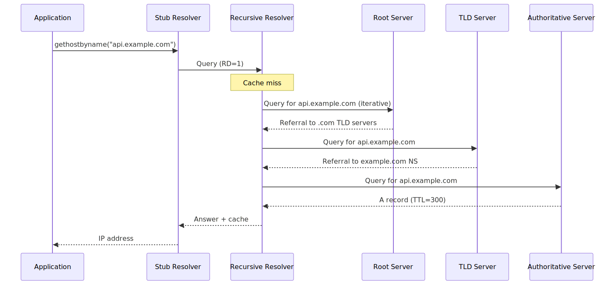
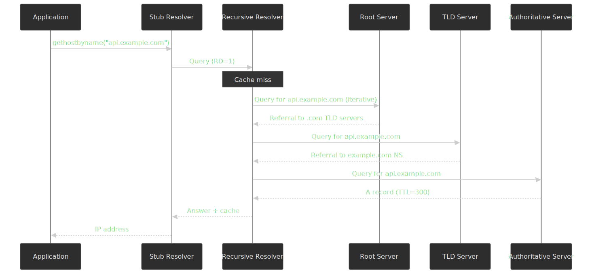

## Abstract

DNS resolution is a hierarchical delegation system. The stub resolver on your machine forwards queries to a recursive resolver, which iteratively walks the namespace tree—root servers delegate to TLD servers, which delegate to authoritative servers for the target domain. Each response is cached according to its TTL (Time To Live), and subsequent queries for the same name hit cache until expiry.

Key mental model:

- **Stub**: Forwards queries, minimal caching, sets RD (Recursion Desired) flag
- **Recursive**: Performs iterative resolution, maintains authoritative cache, enforces TTLs
- **Authoritative**: Holds zone data, returns definitive answers or referrals
- **Caching**: Dominates real-world latency; a cached response returns in <1ms, uncached may take 100-400ms
- **Failure modes**: NXDOMAIN (domain doesn't exist), SERVFAIL (upstream failure), REFUSED (policy rejection), timeouts (network/server issues)

## Pre-Resolution Cache Layers

Before a query ever leaves the host, several caches and overrides are consulted in order. Most "DNS is slow" reports actually live in this section, not in the iterative walk.


| Layer | What it is | Bypass / control |
| :--- | :--- | :--- |
| Browser internal cache | Per-process `HostResolver` (Chrome / Edge / Brave) or `nsHostResolver` (Firefox). Holds recent name → address mappings, gated by the OS-returned TTL and a fixed cap on entries. Inspected via `chrome://net-internals/#dns` and `about:networking#dns`. | Cleared on browser restart, network change, or via the debug pages. Speculative entries seeded by `<link rel="dns-prefetch">` and `rel="preconnect"` live here too. |
| `hosts` file / NSS | `/etc/hosts` (Linux/macOS) or `%SystemRoot%\System32\drivers\etc\hosts` (Windows). On Linux, ordering is governed by `/etc/nsswitch.conf` (`hosts: files dns ...`). On Windows, hosts entries are preloaded into the DNS Client cache, so they show up under `ipconfig /displaydns`. | Static mapping; bypasses every downstream resolver entirely. Useful for pinning hostnames during incident response or local development. |
| Multicast DNS (mDNS) | RFC 6762. Names ending in `.local` resolve via multicast on `224.0.0.251` / `FF02::FB`, port 5353, with no central server. Implemented by Apple Bonjour, `systemd-resolved`, and `avahi`. | Stays on the link; never reaches a recursive resolver. Disable per-interface to suppress noisy multicast on production hosts. |
| OS / system resolver cache | Windows DNS Client service (`Dnscache`), `systemd-resolved`, macOS `mDNSResponder`. Honors the TTL returned by the recursive resolver. Optionally extended by Windows' Name Resolution Policy Table (NRPT) for split DNS, DNSSEC enforcement, or per-namespace resolver pinning. | Flush via `ipconfig /flushdns` (Windows), `sudo resolvectl flush-caches` (Linux), `sudo dscacheutil -flushcache && sudo killall -HUP mDNSResponder` (macOS). |
| Stub resolver | The DNS client library proper (glibc `getaddrinfo`, `mDNSResponder`, Windows DNS Client). Caches little or nothing of its own — it sits on top of the system cache. | Configured via `/etc/resolv.conf`, NetworkManager, `systemd-resolved`, or DHCP-pushed servers. |

> [!IMPORTANT]
> A browser DNS cache hit can mask a stale recursive answer. When debugging propagation, also clear the in-browser cache (`chrome://net-internals/#dns`, `about:networking#dns`) before declaring a TTL-related issue resolved.

## DNS Actors and Their Roles

### Stub Resolver

The stub resolver is the DNS client library on your machine—`gethostbyname()`, `getaddrinfo()`, or the resolver in `/etc/resolv.conf`. [RFC 1034 §5.3.1](https://www.rfc-editor.org/rfc/rfc1034#section-5.3.1) discusses but does not formally define stub resolvers; [RFC 1123 §6.1.3.1](https://www.rfc-editor.org/rfc/rfc1123#section-6.1.3.1) and [RFC 9499 §6](https://www.rfc-editor.org/rfc/rfc9499#section-6) make it precise: a stub resolver cannot perform full resolution itself and depends on a recursive resolver to do the work.

**Behavior:**

- Sets the RD (Recursion Desired) flag in outgoing queries
- Forwards queries to configured recursive resolvers (typically 1-3 servers)
- Validates that RA (Recursion Available) is set in responses
- Maintains minimal cache (OS-dependent, typically seconds to minutes)

**Timeout behavior varies by platform:**

| Platform      | Default Timeout | Retries | Notes                                               |
| ------------- | --------------- | ------- | --------------------------------------------------- |
| Linux (glibc) | 5 seconds       | 2       | Configurable via `options timeout:N` in resolv.conf |
| macOS         | 5 seconds       | 2       | mDNSResponder adds complexity                       |
| Windows       | 1 second        | 2       | Per-server, then cycles                             |

The stub resolver is intentionally simple. It offloads complexity to the recursive resolver, which has the resources to cache, validate DNSSEC, and handle iterative resolution.

### Recursive Resolver

The recursive resolver (also called a full-service resolver or caching resolver) performs the actual work of walking the DNS tree. Per [RFC 9499 §6](https://www.rfc-editor.org/rfc/rfc9499#section-6), a server in *recursive mode* receives a query with RD=1 and is obligated to either return the final answer or pursue the resolution itself by querying other servers — the client never sees referrals.

**Key characteristics:**

- Maintains a cache of previously resolved records
- Performs iterative queries to authoritative servers
- Enforces TTLs and negative caching
- May validate DNSSEC signatures
- Implements rate limiting, prefetching, and serve-stale policies

**Recursive vs iterative — two modes, one resolver:**

The same word "resolver" describes two distinct query modes. RFC 9499 §6 nails the contract:

- **Recursive mode** (stub → recursive). The client sets RD=1 and the server is obligated to return either a final answer or an error. The client never sees referrals.
- **Iterative mode** (recursive → authoritative). The client sets RD=0 and the server returns *whatever it knows* — an authoritative answer for its own zones, or an NS-set referral pointing the client one step closer. The client follows referrals itself.

A "recursive resolver" is the actor that *takes* recursive queries from stubs and *makes* iterative queries to authoritative servers. This split exists for three reasons:

- **Caching leverage**: every referral the recursive resolver collects (root → TLD → registrar nameservers) is cacheable and reusable by every downstream client.
- **Trust isolation**: an authoritative server only ever has to answer for its own zones. It never executes arbitrary lookups for unknown clients.
- **Operational separation**: authoritative servers can be rate-limited, geo-restricted, or DDoS-mitigated independently from the recursive layer.

Popular recursive resolvers include BIND, Unbound, PowerDNS Recursor, and public services like Google Public DNS (8.8.8.8), Cloudflare (1.1.1.1), and Quad9 (9.9.9.9).

### Authoritative Servers

Authoritative servers hold the definitive DNS records for zones they serve. They respond to queries with either:

1. **Authoritative answer**: AA (Authoritative Answer) flag set, contains the requested record
2. **Referral**: NS records pointing to child zone nameservers (for delegated subdomains)
3. **Negative response**: NXDOMAIN or NODATA, with SOA record in Authority section for negative caching

**The authoritative hierarchy:**

```text
. (root)
├── com. (TLD)
│   └── example.com. (domain)
│       └── api.example.com. (subdomain)
└── org. (TLD)
    └── example.org.
```

Each level delegates to the next. Root servers know TLD servers; TLD servers know domain nameservers; domain nameservers know their subdomains.

**Root servers** are the entry point when the recursive resolver has no cached data. There are 13 logical root server identifiers (A through M), operated by 12 independent organizations. As of April 2026 the root system reports roughly 2,000 anycast instances worldwide ([root-servers.org](https://root-servers.org/)), all sharing the same set of IPv4 + IPv6 addresses through BGP anycast.

**TLD servers** handle generic TLDs (.com, .org, .net) and country-code TLDs (.uk, .de, .jp). They return referrals to the authoritative nameservers for second-level domains.

## Iterative Resolution: Step by Step

When a recursive resolver receives a query for `api.example.com` with an empty cache, it performs iterative resolution:

### Step 1: Root Priming

Before the first query, the resolver loads root hints—a file containing the names and IP addresses of root servers. RFC 9609 specifies the priming process:

1. Resolver sends: `QNAME=".", QTYPE=NS` to a randomly selected root server address
2. Root server responds with authoritative NS records for the root zone
3. Resolver caches these records, replacing the hints

This priming query ensures the resolver has accurate root server data, not stale hints.

### Step 2: Query the Root

```text
Query:  api.example.com. IN A
From:   Recursive resolver
To:     Root server (e.g., 198.41.0.4, A-root)

Response:
  Header: RCODE=NOERROR, AA=0 (not authoritative for this name)
  Authority section:
    com.  172800  IN  NS  a.gtld-servers.net.
    com.  172800  IN  NS  b.gtld-servers.net.
    ...
  Additional section:
    a.gtld-servers.net.  172800  IN  A  192.5.6.30
    ...
```

The root server returns a referral—NS records for the `.com` TLD along with glue records (A/AAAA records for the nameservers themselves).

**Why glue records?** If `a.gtld-servers.net` is the nameserver for `.net`, you'd need to resolve `.net` to find `a.gtld-servers.net`, creating a circular dependency. Glue records break this cycle by embedding IP addresses directly in the referral.

### Step 3: Query the TLD

```text
Query:  api.example.com. IN A
From:   Recursive resolver
To:     a.gtld-servers.net (192.5.6.30)

Response:
  Header: RCODE=NOERROR, AA=0
  Authority section:
    example.com.  172800  IN  NS  ns1.example.com.
    example.com.  172800  IN  NS  ns2.example.com.
  Additional section:
    ns1.example.com.  172800  IN  A  93.184.216.34
    ...
```

The TLD server returns another referral, pointing to the authoritative nameservers for `example.com`.

### Step 4: Query the Authoritative Server

```text
Query:  api.example.com. IN A
From:   Recursive resolver
To:     ns1.example.com (93.184.216.34)

Response:
  Header: RCODE=NOERROR, AA=1 (authoritative)
  Answer section:
    api.example.com.  300  IN  A  93.184.216.50
```

The authoritative server returns the final answer with the AA flag set. The recursive resolver caches this record for 300 seconds (the TTL) and returns it to the stub resolver.

### QNAME Minimization

A naive iterative resolver sends the *full* QNAME (`api.example.com`) to every server in the chain — including the root and the TLD, which have no business knowing the leaf label. [RFC 9156](https://www.rfc-editor.org/rfc/rfc9156) (November 2021, Standards Track; obsoletes the experimental RFC 7816) tightens that to the "need to know" principle: send only the labels the next server requires to return a referral.

For `api.example.com`, a QMIN-enabled resolver issues:

| Step | Sent to              | QNAME           | QTYPE | What it learns          |
| ---: | :------------------- | :-------------- | :---- | :---------------------- |
|    1 | Root                 | `com.`          | NS    | NS for `.com`           |
|    2 | `.com` TLD           | `example.com.`  | NS    | NS for `example.com`    |
|    3 | `example.com` auth   | `api.example.com.` | A   | The actual A record     |

Notes from RFC 9156 §2 and §3:

- The minimised query type is **NS** at intermediate steps, not the original QTYPE. The full QTYPE is only sent at the final, authoritative step.
- A response of NXDOMAIN at an intermediate label can be cached and combined with [RFC 8020](https://www.rfc-editor.org/rfc/rfc8020) (NXDOMAIN cut) to short-circuit further resolution.
- §3.4 caps the number of labels minimised per query (default ~10) to prevent pathological cases on very long names from causing a query storm.

QMIN is enabled by default in modern recursives — BIND 9.14+, Unbound 1.7+, and Knot Resolver — and is one of the cheapest privacy wins available because it changes only the recursive's behavior, not the wire format.

### Resolution Latency Breakdown

| Hop                       | Typical Latency | Notes                           |
| ------------------------- | --------------- | ------------------------------- |
| Stub → Recursive          | 1-50ms          | LAN or ISP network              |
| Cache lookup              | <1ms            | In-memory hash table            |
| Recursive → Root          | 10-30ms         | Anycast, well-distributed       |
| Recursive → TLD           | 10-50ms         | .com has many anycast instances |
| Recursive → Authoritative | 10-200ms        | Depends on server location      |
| **Total (uncached)**      | **50-400ms**    | Varies significantly            |
| **Total (cached)**        | **1-50ms**      | Cache hit at recursive          |

## Caching Layers and TTL Mechanics


### TTL Semantics

TTL (Time To Live) is a 32-bit unsigned integer specifying the maximum duration a record may be cached, in seconds. Per RFC 1035, TTL "specifies the time interval that the resource record may be cached before the source of the information should again be consulted."

**Key behaviors:**

- **Zero TTL**: Use only for the current transaction; do not cache
- **TTL countdown**: Cached records decrement TTL; at zero, the entry expires
- **TTL cap**: RFC 8767 recommends capping at 604,800 seconds (7 days) to limit stale data risk

**TTL at each layer:**

| Layer         | Behavior                                        | Typical Values             |
| ------------- | ----------------------------------------------- | -------------------------- |
| Authoritative | Sets TTL in zone file; value is constant        | 300-86400 seconds          |
| Recursive     | Caches with countdown; honors TTL from response | Respects authoritative TTL |
| Stub          | Minimal caching, OS-dependent                   | Seconds to minutes         |

### Negative Caching

Negative responses (NXDOMAIN, NODATA) are cached to reduce load on authoritative servers. RFC 2308 specifies that the negative cache TTL is:

```text
Negative TTL = min(SOA.MINIMUM, SOA TTL)
```

Authoritative servers MUST include the SOA record in the Authority section of negative responses. Without it, the negative response SHOULD NOT be cached.

**Historical note:** The SOA MINIMUM field originally specified the minimum TTL for all zone records. RFC 2308 repurposed it specifically for negative caching.

### Resolution Failure Caching

[RFC 9520](https://datatracker.ietf.org/doc/rfc9520/) (December 2023) makes caching of *resolution failures* mandatory — situations where no useful response was received at all (timeouts, malformed responses, SERVFAIL from every authoritative target, DNSSEC validation failures). Without it, retrying resolvers can multiply authoritative-server load by 10× during incidents.

The normative requirements are tight:

- Resolvers **MUST** cache each resolution failure for at least 1 second.
- They **MUST NOT** cache a single failure for longer than 5 minutes (300 s).
- For persistent failures, resolvers **SHOULD** apply exponential or linear backoff up to that 5-minute ceiling.
- During the cached window, the resolver **MUST NOT** issue any outgoing query that would match the failed entry.

**Distinction:**

- **NXDOMAIN / NODATA** — not failures; the authoritative server gave a useful negative answer (cached per RFC 2308).
- **Resolution failure** — no useful answer received at all; cached per RFC 9520 to prevent retry floods.

### Prefetching

Modern resolvers prefetch records before TTL expiry to eliminate cache-miss latency for popular domains:

| Resolver | Trigger Condition             | Eligibility                                      |
| -------- | ----------------------------- | ------------------------------------------------ |
| BIND 9   | ≤ 2 s remaining TTL (default) | Original TTL ≥ 9 s ([ISC docs](https://kb.isc.org/docs/aa-01122)) |
| Unbound  | ~10% of original TTL remaining | `prefetch: yes` opt-in; popular records         |
| PowerDNS | Configurable percentage        | Popular domains                                  |

### Serve-Stale (RFC 8767)

When an authoritative server is unreachable, [RFC 8767](https://datatracker.ietf.org/doc/html/rfc8767) lets resolvers serve expired cache data rather than returning SERVFAIL:

- **Stale answer TTL** — TTL stamped on the served stale record. RFC 8767 §4 mandates a value `> 0` and recommends **30 seconds**.
- **Max stale TTL** — upper bound on how long past-original-TTL data may be served. RFC 8767 §5.11 suggests **1 to 3 days**.
- **Stale-refresh timer** — the resolver keeps trying the authoritative server in the background; until it succeeds, repeat queries are answered from the stale cache to absorb load.

This improves resilience during authoritative outages at the cost of potentially serving outdated data — the trade-off is explicit and operator-tunable.

## EDNS Client Subnet (ECS)

A geo-aware authoritative server has a problem: by default it only sees the *recursive resolver's* IP, not the client's. A user in Tokyo on Google Public DNS looks indistinguishable from a user in São Paulo on the same resolver — and gets the same nearest-PoP answer, which may be wildly wrong.

EDNS Client Subnet, defined in [RFC 7871](https://www.rfc-editor.org/rfc/rfc7871), is the EDNS0 option that lets a recursive resolver forward a *prefix* of the client's address to the authoritative server, so geo-aware authoritatives (CDN DNS, traffic managers) can answer based on client location instead of resolver location.

, forwards it as ECS, and caches the geo-targeted answer keyed on the returned scope.")
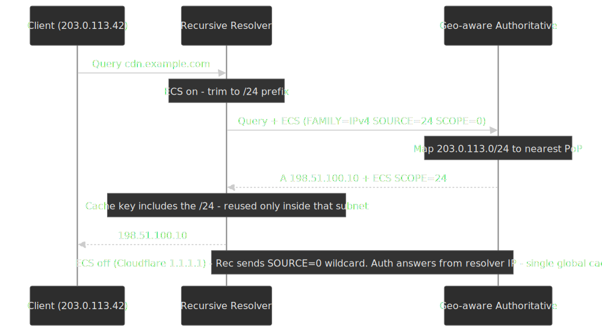

### How ECS changes the cache key

The ECS option carries three fields: `FAMILY` (IPv4/IPv6), `SOURCE PREFIX-LENGTH` (how many bits the resolver is willing to share, typically `/24` for IPv4 and `/56` for IPv6), and `SCOPE PREFIX-LENGTH` (how broadly the authoritative says the answer applies). RFC 7871 §7.3.1 makes the cache-key behavior explicit: an ECS-aware recursive must extend its cache key with the returned `SCOPE` subnet. A single popular hostname can balloon from one cache entry to thousands — one per `/24` of the user base — which is the main reason ECS makes recursive cache footprints grow.

### Operator policy: who runs ECS today

| Public resolver | ECS behavior | Source |
| :--- | :--- | :--- |
| Google Public DNS (`8.8.8.8`) | Forwards ECS by default at `/24` (IPv4) and `/56` (IPv6) | [Google ECS docs](https://developers.google.com/speed/public-dns/docs/ecs) |
| OpenDNS / Cisco Umbrella | Forwards ECS by default | OpenDNS engineering posts |
| Cloudflare 1.1.1.1 | Strips ECS by default; relies on its own anycast PoP density to localize answers | [Cloudflare 1.1.1.1 announcement](https://blog.cloudflare.com/announcing-1111/) |
| Quad9 | Does not forward ECS | Quad9 privacy policy |

### Privacy and operational trade-offs

RFC 7871 itself opens with an unusually candid privacy warning: ECS exposes a slice of the user's network identity to every authoritative on the resolution path, which is exactly the leakage that DoT and DoH set out to remove. [RFC 9076 (DNS Privacy Considerations)](https://www.rfc-editor.org/rfc/rfc9076) — which obsoletes RFC 7626 — discusses ECS as one of the "active" privacy degradations of DNS in deployment.

Operationally, ECS is a sharp tool. It is the right answer when:

- The authoritative is a CDN traffic manager that needs to map clients to nearest PoP.
- The recursive is closer to the authoritative than to its own clients (e.g., a centralized open resolver).

It is the wrong answer when:

- The recursive is *already* close to the user (ISP resolver, on-net resolver, dense anycast like Cloudflare). The added cache cardinality and privacy cost buy nothing.
- DNSSEC is in use end-to-end and you want responses that depend only on the QNAME, for cacheable, signature-stable answers.

Per RFC 7871 §12.1, the spec recommends ECS be **off by default** and enabled only where it provides measurable benefit; a recursive can also signal anonymity to authoritatives by sending `SOURCE=0` (the wildcard).

## Failure Modes and Response Codes


### RCODE Values

DNS responses include a 4-bit RCODE (Response Code) field. The primary values from RFC 1035:

| RCODE | Name     | Meaning                                           |
| ----- | -------- | ------------------------------------------------- |
| 0     | NOERROR  | Query succeeded (may or may not have answer data) |
| 1     | FORMERR  | Server couldn't parse the query                   |
| 2     | SERVFAIL | Server failed to complete the query               |
| 3     | NXDOMAIN | Domain does not exist                             |
| 4     | NOTIMP   | Query type not implemented                        |
| 5     | REFUSED  | Server refuses to answer (policy)                 |

### When Each Failure Occurs

**NXDOMAIN (Non-Existent Domain)**

The queried name does not exist anywhere in DNS. The authoritative server for the parent zone confirms non-existence.

```bash
$ dig nonexistent.example.com
;; ->>HEADER<<- opcode: QUERY, status: NXDOMAIN
```

[RFC 8020](https://www.rfc-editor.org/rfc/rfc8020) tightens NXDOMAIN semantics: an NXDOMAIN at name `N` means *nothing exists at or below* `N`. A resolver receiving NXDOMAIN for `foo.example.com` **MUST** treat any descendant query (`bar.foo.example.com`, `baz.bar.foo.example.com`, …) as NXDOMAIN as well — the "NXDOMAIN cut". This collapses entire query subtrees into a single cached negative answer.

**SERVFAIL (Server Failure)**

The recursive resolver couldn't complete resolution. Common causes:

- All authoritative servers timed out
- DNSSEC validation failed
- Lame delegation (NS records point to servers that don't serve the zone)
- Upstream server returned malformed response

SERVFAIL is the catch-all for "something went wrong." Debugging requires checking resolver logs.

**REFUSED**

The server refuses to answer based on policy:

- Query from unauthorized IP (ACL restriction)
- Rate limiting triggered
- Recursive query to authoritative-only server

**Timeout (no response)**

No RCODE—the query never received a response. Causes:

- Network connectivity issues
- Firewall blocking UDP/53 or TCP/53
- Server overloaded or crashed
- Anycast routing issues

### Timeout and Retry Behavior

RFC 1035 leaves retry logic to implementations. Typical patterns:

1. Send query to first configured server
2. Wait timeout period (1-5 seconds)
3. No response → try next server
4. Cycle through all servers
5. End of cycle → double timeout (exponential backoff)
6. Maximum retries (typically 2-4)

**Early termination:** Any NXDOMAIN response stops retries—it's a definitive negative answer.

## Latency Bottlenecks and Mitigation

### Where Latency Hides

1. **Cache misses**: Dominant factor. Cold cache resolution takes 100-400ms; cached response <1ms
2. **Geographic distance**: Authoritative servers on another continent add 100-200ms RTT
3. **Packet loss**: Triggers retries with exponential backoff; one lost packet can add seconds
4. **Lame delegations**: NS records pointing to non-responsive servers waste query attempts
5. **DNSSEC validation**: Additional queries for DNSKEY and DS records

### Anycast for Roots, TLDs, and Public Resolvers

All root servers and most major TLD and public resolvers use BGP anycast: a single IP (or a small `/24`) is announced from many physical PoPs, and the network routes each client to whichever PoP its provider's BGP best path points to. The same `1.1.1.1` is answered by hundreds of independent servers worldwide.


**What this gets the operator:**

- **Latency**: most clients reach a PoP a few hops away; cold-cache resolution still does the iterative walk, but every leg starts from a nearby box.
- **DDoS spread**: a volumetric attack lands on hundreds of PoPs in parallel, so each PoP only sees a fraction of the attack.
- **Availability**: a PoP failure withdraws its BGP announcement and traffic re-converges to the next-best PoP, usually within a few seconds.
- **Per-PoP cache**: caches are local to each PoP. The same hot record can have a hundred independent TTL countdowns; cache-miss probability for a global domain is higher than the per-PoP hit rate suggests.

**Public resolver architectures (verified):**

- **Cloudflare 1.1.1.1** runs its recursive on its global anycast network, the same fabric that serves CDN traffic. It explicitly strips ECS to keep client identity off the wire and relies on PoP density to localize CDN answers ([1.1.1.1 launch post, 2018](https://blog.cloudflare.com/announcing-1111/)).
- **Google Public DNS 8.8.8.8** runs anycast across Google's edge POPs; it forwards ECS by default so that geo-aware authoritatives (including non-Google CDNs) can localize answers despite Google's centralized resolver footprint ([Public DNS performance docs](https://developers.google.com/speed/public-dns/docs/performance)).
- **Quad9 9.9.9.9** anycasts a security-filtering recursive operated by a non-profit; threat-feed-driven blocklists are applied at the recursive layer.

**Caveat:** "nearest" means BGP-shortest, not geographically closest. A Tokyo client may end up at a Singapore PoP because of how its transit provider peers — a useful debugging hypothesis when a single resolver is mysteriously slow from one network.

### DNS over TCP and Large Responses

DNS messages historically used UDP/53 for queries and TCP/53 only for zone transfers. That model broke once DNSSEC, large RRsets, and EDNS(0) pushed responses past the safe UDP MTU.

[RFC 7766](https://www.rfc-editor.org/rfc/rfc7766) updates the contract: every modern DNS implementation **MUST** support both UDP and TCP. Servers must accept TCP for any standard query, not just zone transfers, and clients must fall back to TCP when a response arrives with the TC (truncation) bit set or when EDNS-advertised UDP buffer sizes are too small.

In practice, this matters because:

- DNSSEC-signed responses regularly exceed 1232 bytes (the modern recommended EDNS UDP buffer), forcing TC=1 and a TCP retry.
- Stateful firewalls that only allow UDP/53 silently break DNSSEC validation; symptoms look like SERVFAIL or timeouts.
- DoT (RFC 7858) and DoH (RFC 8484) are pure TCP/TLS — TCP support is the foundation that the encrypted transports build on.

### Mitigation Strategies

| Strategy                           | Mechanism                          | Trade-off                     |
| ---------------------------------- | ---------------------------------- | ----------------------------- |
| **Aggressive caching**             | Longer TTLs                        | Slower propagation of changes |
| **Prefetching**                    | Refresh before expiry              | Additional background queries |
| **Serve-stale**                    | Return expired data during outages | Risk of stale data            |
| **Multiple authoritative servers** | Geographic distribution            | Operational complexity        |
| **Low TTL during migrations**      | 60-300 seconds temporarily         | Higher authoritative load     |

### Browser DNS Prefetching

Browsers speculatively resolve hostnames discovered in page links and resource hints:

- Reduces perceived latency by overlapping DNS with HTML parsing and rendering.
- Behaviour varies by browser and context — some browsers disable speculative prefetch on HTTPS-loaded pages or in private-browsing modes for privacy reasons.
- Controlled per-document via the [`X-DNS-Prefetch-Control`](https://developer.mozilla.org/docs/Web/HTTP/Headers/X-DNS-Prefetch-Control) response header or per-link via [`<link rel="dns-prefetch">`](https://developer.mozilla.org/docs/Web/HTML/Attributes/rel/dns-prefetch).

### Happy Eyeballs and the Dual-Stack DNS Race

Resolution does not end at "got an A record." On a dual-stack host, the connection logic — [RFC 8305 (Happy Eyeballs v2)](https://www.rfc-editor.org/rfc/rfc8305) — interleaves DNS and TCP/QUIC setup to hide IPv6 brokenness from the user.

The salient DNS-side rules from RFC 8305 §3:

- The client issues `AAAA` and `A` queries **in parallel**, with the `AAAA` sent first.
- It does **not** wait for both responses before continuing.
- If the `A` response arrives first, the client waits up to a **Resolution Delay of 50 ms** for the `AAAA` (recommended default; tunable). If `AAAA` arrives in that window, IPv6 is preferred.
- If the delay expires, the client starts connecting using the IPv4 address but keeps the `AAAA` request alive; once any `AAAA` arrives, those addresses are interleaved into the connection list.
- Connection attempts are then staggered by the **Connection Attempt Delay (250 ms recommended)**, with IPv6 first in the interleaved list.

Implications for the resolution path:

- A slow `AAAA` answer never delays a working IPv4 connection by more than 50 ms — but it does mean the recursive resolver's `AAAA` performance directly shapes IPv6 adoption on the wire.
- A `SERVFAIL` on `AAAA` for a dual-stack name still allows the client to connect over IPv4. A *timeout*, by contrast, can trigger Happy Eyeballs to fall back later than the user notices, but rarely catastrophically.
- For latency-sensitive clients, both record types should live in the resolver cache. Negative caching of `AAAA` (NODATA on an IPv4-only host) is just as important as positive caching of `A`.

## Diagnostics with dig and drill

### Basic Query

```bash
$ dig api.example.com

; <<>> DiG 9.18.18 <<>> api.example.com
;; ->>HEADER<<- opcode: QUERY, status: NOERROR, id: 12345
;; flags: qr rd ra; QUERY: 1, ANSWER: 1, AUTHORITY: 0, ADDITIONAL: 1

;; ANSWER SECTION:
api.example.com.    300    IN    A    93.184.216.50

;; Query time: 23 msec
;; SERVER: 8.8.8.8#53(8.8.8.8)
```

Key fields:

- `status: NOERROR` — Query succeeded
- `flags: qr rd ra` — Query Response, Recursion Desired, Recursion Available
- `Query time: 23 msec` — Round-trip to recursive resolver

### Trace Mode

```bash
$ dig +trace api.example.com
```

Trace mode bypasses the recursive resolver and performs iterative resolution directly, showing each hop:

```text
.                       518400  IN  NS  a.root-servers.net.
...
com.                    172800  IN  NS  a.gtld-servers.net.
...
example.com.            172800  IN  NS  ns1.example.com.
...
api.example.com.        300     IN  A   93.184.216.50
```

This reveals which server returned each referral and helps identify where resolution stalls.

### Check Specific Server

```bash
$ dig @ns1.example.com api.example.com
```

Query a specific nameserver directly. Useful for verifying authoritative server configuration or comparing responses across replicas.

### Inspect TTL and Caching

```bash
$ dig +norecurse @8.8.8.8 api.example.com
```

The `+norecurse` flag asks the resolver to return only cached data. If the record isn't cached, you'll get a referral or empty response.

### DNSSEC Validation

```bash
$ dig +dnssec example.com
```

Requests DNSSEC records (RRSIG, DNSKEY) in the response. Check the `ad` (Authenticated Data) flag in the response header—if set, the resolver validated the DNSSEC chain.

## Modern DNS: Encryption and Security

### DNS over HTTPS (DoH) — RFC 8484

DoH encapsulates DNS queries in HTTPS, providing:

- **Confidentiality**: TLS encrypts the query and response
- **Integrity**: TLS prevents tampering
- **Authentication**: Server certificate validates resolver identity

DoH uses the `application/dns-message` media type with standard DNS wire format. It integrates with HTTP caching—HTTP freshness lifetime MUST be ≤ smallest Answer TTL.

**Trade-offs:**

- Pro: Bypasses network-level DNS interception/filtering
- Con: Centralizes DNS at browser-configured resolver (often Cloudflare or Google)
- Con: Breaks enterprise DNS policies and split-horizon setups

### DNS over TLS (DoT) — RFC 7858

DoT runs DNS over TLS on port 853. Unlike DoH, it's a dedicated protocol, not tunneled through HTTP.

**Design decision:** RFC 7858 mandates port 853 for DoT and prohibits port 53. This separation reduces downgrade attack risk but makes DoT easier to block at the network level.

### DNSSEC — RFC 4033-4035

DNSSEC provides cryptographic authentication of DNS responses:

1. Zone operator signs records with private key
2. Signatures published as RRSIG records
3. Public key published as DNSKEY record
4. Parent zone publishes DS record (hash of child's DNSKEY)
5. Resolver follows chain of trust from root to target

**NSEC/NSEC3** provide authenticated denial—proof that a name doesn't exist, preventing attackers from forging NXDOMAIN responses.

**Adoption:** DNSSEC is widely deployed at TLDs but inconsistently at domain level. Validation failures result in SERVFAIL, which can break resolution for misconfigured zones.

## Related articles in this series

This article focuses on the resolution path itself. The other entries in the **Networking Protocols** series go deeper on the surrounding topics:

- [DNS Records, TTL Strategy, and Cache Behavior](../dns-records-ttl-and-caching/README.md) — every record type, how TTLs propagate, and how to plan migrations around cache layers.
- [DNS Security: DoH, DoT, and DNSSEC](../dns-security-doh-dot-dnssec/README.md) — encryption-in-transit and authenticated denial in detail.
- [DNS Troubleshooting Playbook](../dns-troubleshooting-playbook/README.md) — symptom-driven debugging using `dig`, `delv`, and packet captures.

## Conclusion

DNS resolution is deceptively simple on the surface — a name goes in, an IP comes out. The underlying system is a distributed, hierarchical database with caching at every layer, starting on the host itself. Performance depends on cache hit rates at each layer (browser, OS, recursive); reliability depends on redundant authoritative servers, proper delegation, and TCP fallback for large or DNSSEC-signed responses. When debugging, walk the layers in order: browser cache → hosts file → OS cache → stub → recursive → root → TLD → authoritative. Check TTLs, verify RCODE, account for ECS-induced cache fragmentation, and use `dig +trace` to pinpoint where resolution fails.

## Appendix

### Prerequisites

- TCP/IP networking fundamentals
- Basic command-line familiarity (`dig`, `nslookup`)
- Understanding of client-server architecture

### Terminology

| Term                     | Definition                                                        |
| ------------------------ | ----------------------------------------------------------------- |
| **Stub resolver**        | DNS client library that forwards queries to a recursive resolver  |
| **Recursive resolver**   | Server that performs iterative resolution and maintains cache     |
| **Authoritative server** | Server that holds definitive records for a zone                   |
| **TTL**                  | Time To Live; seconds a record may be cached                      |
| **RCODE**                | Response Code; 4-bit field indicating query result                |
| **Glue record**          | A/AAAA record embedded in referral to break circular dependencies |
| **Anycast**              | Routing technique where multiple servers share one IP address     |
| **DNSSEC**               | DNS Security Extensions; cryptographic authentication of DNS data |
| **DoH**                  | DNS over HTTPS (RFC 8484)                                         |
| **DoT**                  | DNS over TLS (RFC 7858)                                           |
| **ECS**                  | EDNS Client Subnet (RFC 7871); recursive forwards client prefix to authoritative |
| **mDNS**                 | Multicast DNS (RFC 6762); link-local resolution for `.local` names |
| **Happy Eyeballs**       | RFC 8305; parallel A/AAAA queries with 50 ms resolution delay     |
| **NRPT**                 | Windows Name Resolution Policy Table; per-namespace resolver pinning |
| **QMIN**                 | QNAME Minimization (RFC 9156); recursive sends only the labels each upstream needs |

### Summary

- Resolution starts in pre-network caches (browser → hosts/NSS → mDNS → OS) before any packet leaves the host
- The wire path then flows from stub → recursive → root → TLD → authoritative, following referrals down the namespace tree
- "Recursive" and "iterative" are two query modes; one resolver does both — recursive toward stubs, iterative toward authoritatives
- QNAME minimization (RFC 9156) makes the iterative walk privacy-respecting by sending only the labels each upstream needs
- Caching at the recursive resolver dominates latency; TTLs control cache lifetime; RFC 9520 makes failure caching mandatory
- Negative responses (NXDOMAIN, NODATA) are cached using SOA.MINIMUM; RFC 8020 turns NXDOMAIN into a subtree cut
- SERVFAIL indicates resolution failure; use `dig +trace` to identify the failing hop
- ECS (RFC 7871) is the price geo-DNS pays for centralized resolvers; Cloudflare 1.1.1.1 opts out, Google 8.8.8.8 opts in
- Modern DNS adds encryption (DoH, DoT) and authentication (DNSSEC); TCP support is mandatory per RFC 7766
- Anycast distributes load and reduces latency for root, TLD, and major public resolvers — but "nearest" means BGP-shortest, not geographic
- Happy Eyeballs (RFC 8305) means dual-stack clients race A and AAAA in parallel with a 50 ms resolution delay

### References

- [RFC 1034 - Domain Names: Concepts and Facilities](https://www.rfc-editor.org/rfc/rfc1034) - Foundational DNS architecture
- [RFC 1035 - Domain Names: Implementation and Specification](https://www.rfc-editor.org/rfc/rfc1035) - Wire format, message structure
- [RFC 9499 - DNS Terminology](https://datatracker.ietf.org/doc/rfc9499/) - Current terminology definitions (BCP 219)
- [RFC 2308 - Negative Caching of DNS Queries](https://datatracker.ietf.org/doc/html/rfc2308) - NXDOMAIN/NODATA caching
- [RFC 9520 - Negative Caching of DNS Resolution Failures](https://datatracker.ietf.org/doc/rfc9520/) - Failure caching (December 2023)
- [RFC 6891 - Extension Mechanisms for DNS (EDNS0)](https://datatracker.ietf.org/doc/html/rfc6891) - Larger UDP payloads, extended RCODE
- [RFC 8484 - DNS Queries over HTTPS (DoH)](https://datatracker.ietf.org/doc/html/rfc8484) - DoH specification
- [RFC 7858 - DNS over Transport Layer Security (DoT)](https://datatracker.ietf.org/doc/html/rfc7858) - DoT specification
- [RFC 4033 - DNSSEC Introduction and Requirements](https://datatracker.ietf.org/doc/html/rfc4033) - DNSSEC overview
- [RFC 4034 - DNSSEC Resource Records](https://www.rfc-editor.org/rfc/rfc4034.html) - DNSKEY, DS, RRSIG, NSEC
- [RFC 4035 - DNSSEC Protocol Modifications](https://datatracker.ietf.org/doc/html/rfc4035) - DNSSEC validation process
- [RFC 8767 - Serving Stale Data to Improve DNS Resiliency](https://datatracker.ietf.org/doc/html/rfc8767) - Stale data serving
- [RFC 9609 - Initializing a DNS Resolver with Priming Queries](https://datatracker.ietf.org/doc/rfc9609/) - Root priming (obsoletes RFC 8109)
- [RFC 9156 - DNS Query Name Minimisation to Improve Privacy](https://www.rfc-editor.org/rfc/rfc9156) - QMIN, "need to know" iterative queries (obsoletes RFC 7816)
- [RFC 8020 - NXDOMAIN: There Really Is Nothing Underneath](https://www.rfc-editor.org/rfc/rfc8020) - NXDOMAIN cut behavior
- [RFC 9076 - DNS Privacy Considerations](https://www.rfc-editor.org/rfc/rfc9076) - Current threat model that motivated DoT, DoH, QMIN, and ECS opt-out (obsoletes RFC 7626)
- [RFC 7766 - DNS Transport over TCP - Implementation Requirements](https://www.rfc-editor.org/rfc/rfc7766) - TCP is mandatory; truncation and EDNS interaction
- [RFC 7871 - Client Subnet in DNS Queries (ECS)](https://www.rfc-editor.org/rfc/rfc7871) - ECS option, scope semantics, privacy guidance
- [RFC 8305 - Happy Eyeballs Version 2](https://www.rfc-editor.org/rfc/rfc8305) - Parallel A/AAAA, Resolution Delay, Connection Attempt Delay
- [RFC 6762 - Multicast DNS](https://www.rfc-editor.org/rfc/rfc6762) - `.local` resolution on the link
- [Cloudflare 1.1.1.1 launch post](https://blog.cloudflare.com/announcing-1111/) - Anycast architecture and ECS policy of a major public resolver
- [Google Public DNS — Performance](https://developers.google.com/speed/public-dns/docs/performance) - 8.8.8.8 anycast and ECS posture
- [root-servers.org](https://root-servers.org/) - Live count of root anycast instances per letter
- [IANA DNS Parameters](https://www.iana.org/assignments/dns-parameters) - Authoritative RCODE, QTYPE registries
