# DNS Security and Privacy: DNSSEC, DoH, and DoT

Plaintext DNS over UDP/53 ([RFC 1035](https://datatracker.ietf.org/doc/html/rfc1035)) is both spoofable and visible to every on-path observer. Two distinct defences exist: **DNSSEC** ([RFC 4033–4035](https://datatracker.ietf.org/doc/html/rfc4033)) gives responses cryptographic authenticity through a chain of trust rooted at the IANA-managed root zone, and **DoH** ([RFC 8484](https://datatracker.ietf.org/doc/html/rfc8484)) / **DoT** ([RFC 7858](https://datatracker.ietf.org/doc/html/rfc7858)) / **DoQ** ([RFC 9250](https://www.rfc-editor.org/rfc/rfc9250.html)) give the stub-to-recursive hop confidentiality. They are independent — a zone can be DNSSEC-signed but reached over plaintext, and DoH happily transports unsigned answers — and reaching the full privacy posture also requires **Encrypted ClientHello** ([RFC 9849](https://www.rfc-editor.org/rfc/rfc9849.html)) on the subsequent TLS connection.


This article is the security entry in the DNS series — see also [DNS Resolution Path](../dns-resolution-path/README.md), [DNS Records, TTL, and Caching](../dns-records-ttl-and-caching/README.md), and the [DNS Troubleshooting Playbook](../dns-troubleshooting-playbook/README.md) for adjacent ground.

## Mental model

DNS security splits cleanly along two axes; conflating them is the most common reasoning mistake.

| Axis                 | Protects against                                              | Mechanism                                                           |
| -------------------- | ------------------------------------------------------------- | ------------------------------------------------------------------- |
| **Authenticity**     | Cache poisoning, on-path forgery, malicious authoritative     | DNSSEC — signed RRsets verified along a chain rooted at the IANA KSK |
| **Confidentiality**  | Passive ISP/coffee-shop surveillance of *what* you query      | DoH / DoT / DoQ — TLS or QUIC between stub and recursive            |
| **Hostname privacy** | TLS SNI in the *next* connection leaking the destination name | ECH — encrypts the inner ClientHello using a key fetched from DNS   |

A useful analogy: DNSSEC is a notarised letter (anyone reads it, but you can verify the sender); DoH/DoT/DoQ is a sealed envelope (the carrier sees only the address); ECH closes the last gap by encrypting the recipient name on the TLS envelope as well.

| Goal                           | DNSSEC                  | DoH                       | DoT                     | DoQ                       | ECH                          |
| ------------------------------ | ----------------------- | ------------------------- | ----------------------- | ------------------------- | ---------------------------- |
| Detects forged responses       | Yes                     | No                        | No                      | No                        | No                           |
| Hides queries from on-path     | No                      | Yes                       | Yes                     | Yes                       | n/a                          |
| Hides destination hostname     | No                      | No                        | No                      | No                        | Yes (TLS SNI)                |
| Indistinguishable from web     | n/a                     | Yes (port 443, HTTP)      | No (port 853)           | No (UDP 853)              | Partial (cover SNI is fixed) |
| Operationally manageable       | Hard (key + sig timing) | Hard at edge (port 443)   | Easy (port 853)         | Medium (QUIC ACLs)        | Hard (DNS dependency)        |
| Mature browser/OS support      | Validating resolvers    | Firefox, Chrome, Edge     | Android 9+, iOS profile | AdGuard, dnsdist, libs    | Chrome 117+, Firefox 119+    |

## DNSSEC: cryptographic authentication

### Chain of trust

DNSSEC signs every RRset (resource-record set) inside a zone and ties zones together with hashes published in the parent. The validator anchors at one pre-configured key — the root KSK — and walks down [^rfc4033].

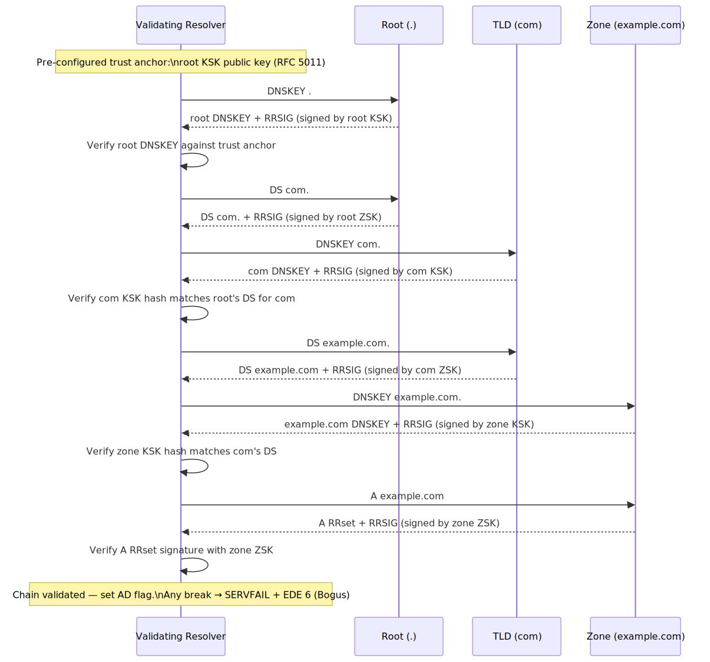
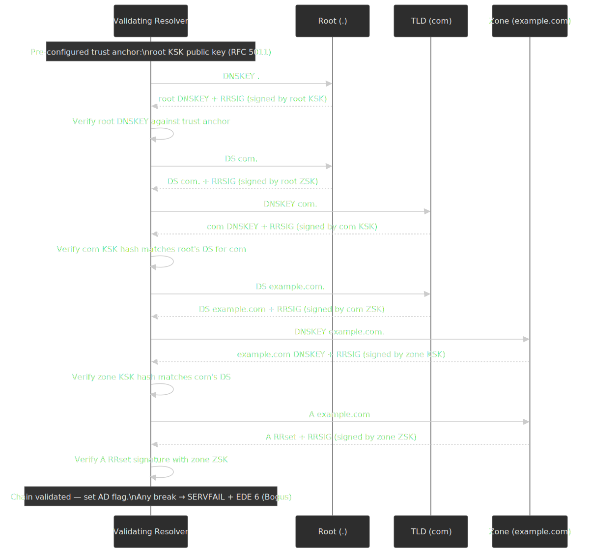

A signed zone publishes three record types beyond the regular A/AAAA/MX:

| Record   | Contains                                                         | Lives in       |
| -------- | ---------------------------------------------------------------- | -------------- |
| `DNSKEY` | Public keys (one or more KSKs, one or more ZSKs)                 | The zone       |
| `RRSIG`  | Signature over a single RRset, made with the matching ZSK or KSK | Beside the RRset |
| `DS`     | Hash of the child zone's KSK                                     | The parent zone |

The root KSK is the only key that must be trusted out-of-band — every other public key is reached via a `DS` published by its parent. Validating resolvers refresh the trust anchor via [RFC 5011](https://datatracker.ietf.org/doc/html/rfc5011) so a planned KSK rollover does not require manual reconfiguration.

> [!IMPORTANT]
> **Root KSK rollover schedule (as of April 2026):** the successor key **KSK-2024** was generated on 26 April 2024, pre-published into the root zone on 11 January 2025, and is scheduled to begin signing on **11 October 2026**, with KSK-2017 revoked on 11 January 2027 — see the [IANA DNSSEC Trust Anchors page](https://www.iana.org/dnssec/files) and the [Verisign field report on early adoption](https://blog.verisign.com/security/2024-2026-root-zone-ksk-rollover-initial-observations/). A separate proposal would migrate the root from RSA-SHA-256 to ECDSA P-256 starting in 2027 [^icann-algo-roll].

### Key types: KSK and ZSK

| Key                     | Signs                | Rollover impact                  | Typical validity |
| ----------------------- | -------------------- | -------------------------------- | ---------------- |
| **KSK** (Key Signing)   | The zone's `DNSKEY` RRset | Requires DS update at parent zone | 1–2 years        |
| **ZSK** (Zone Signing)  | All other RRsets     | No parent interaction            | 1–3 months       |

Splitting the role lets the ZSK rotate often — limiting exposure if it leaks — without dragging the parent registrar into every change. The KSK signs only the `DNSKEY` RRset, so it can sit in an HSM or offline ceremony and roll on a multi-year cadence. [RFC 7583](https://datatracker.ietf.org/doc/html/rfc7583) covers the timing constraints: during a rollover both keys must be visible long enough for every cache to see them, and signature validity must overlap so resolvers with either key still validate.

### Algorithms

[RFC 8624](https://datatracker.ietf.org/doc/html/rfc8624) is the current algorithm matrix. Pick by validator support, not by what the signer can produce:

| Algorithm           | ID  | Signing recommendation | Validation recommendation | Notes                                                                |
| ------------------- | --- | ---------------------- | ------------------------- | -------------------------------------------------------------------- |
| **RSASHA256**       | 8   | MUST                   | MUST                      | The DNS root and most TLDs sign with this; ~256-byte signatures      |
| **RSASHA512**       | 10  | NOT RECOMMENDED        | MUST                      | Legacy; do not deploy for new zones                                  |
| **ECDSAP256SHA256** | 13  | MUST                   | MUST                      | ~64-byte signatures; default for new deployments                     |
| **ECDSAP384SHA384** | 14  | MAY                    | RECOMMENDED               | Higher security margin; rarely needed                                 |
| **ED25519**         | 15  | RECOMMENDED            | RECOMMENDED               | Smallest signatures, deterministic; broad but not yet universal validator support |
| **ED448**           | 16  | MAY                    | RECOMMENDED               | Highest security; obscure                                             |

The pragmatic default for a modern signer is ECDSA P-256: the matrix marks it `MUST` for both signing and validation, and ECDSA's ~64-byte signatures cut response sizes 3–4× versus RSA-2048, reducing UDP truncation and TCP fallback. ED25519 is preferable on paper but surveys still report meaningful pockets of validators that fall back to "insecure" rather than validating it [^algo-validators]; if a tier-1 audience is involved, prefer ECDSA P-256 for deployment compatibility and treat ED25519 as the next step.

### Authenticated denial: NSEC vs NSEC3

When a name does not exist, a signed zone must still *prove* it does not exist — otherwise an attacker could forge `NXDOMAIN` and break a query without leaving a trace.


**NSEC** ([RFC 4034](https://datatracker.ietf.org/doc/html/rfc4034#section-4)) returns the canonically adjacent existing names:

```dns
alpha.example.com.    NSEC    beta.example.com. A AAAA RRSIG NSEC
```

A "no name exists between alpha and beta" proof. Replay it for every gap and you trivially **walk the zone** — every hostname becomes public.

**NSEC3** ([RFC 5155](https://datatracker.ietf.org/doc/html/rfc5155)) hashes names with SHA-1 plus a salt and (optionally) `iterations` extra rounds, ordering on the hash:

```dns
1AVVQN7M7RBL98TR3NBLTI3BNDQR0OQU.example.com.   NSEC3   J8DF92KL9PORK10VC...
```

You now have to reverse the hash to walk the zone — feasible for short labels with rainbow tables, much harder for high-entropy names.

> [!WARNING]
> **NSEC3 iterations are a footgun, not a security feature.** [RFC 9276](https://datatracker.ietf.org/doc/html/rfc9276) (BCP 236, August 2022) recommends `iterations=0` and **empty salt**: extra iterations add no real defence against attackers willing to spend compute, but they amplify CPU cost on every validating resolver. [CVE-2023-50868](https://nvd.nist.gov/vuln/detail/CVE-2023-50868) (CVSS 7.5) demonstrated a denial-of-service on validators by issuing random-subdomain queries against zones with high iteration counts, forcing each query into N × SHA-1 hashes.

Modern validators enforce a hard ceiling regardless of zone configuration:

| Validator               | Iteration ceiling | Behaviour above ceiling                                  |
| ----------------------- | ----------------- | -------------------------------------------------------- |
| BIND 9 (≥ 9.16.16)      | 150               | Treats responses as **insecure** (skips validation) [^isc-150] |
| Unbound (`val-nsec3-keysize-iterations`) | 150 | Treats responses as **insecure**; tunable [^unbound-conf] |
| BIND 9.20+              | Configurable lower | ISC are reducing the limit over time toward the RFC 9276 default of 0 |

If you operate a signed zone, run `dnssec-policy` (BIND) or your signer's equivalent with `iterations: 0` and an empty salt today — older guidance to "use a high iteration count" is wrong and actively dangerous. APNIC's measurements show many zones still drift; treat compliance as a recurring audit item.

### Validation behaviour and Extended DNS Errors

When validation fails, the resolver returns `SERVFAIL`. That is the *same* code as a network timeout, an unreachable authoritative, and a dozen other failures, which is why DNSSEC outages historically looked invisible from the client side. [RFC 8914](https://www.rfc-editor.org/rfc/rfc8914.html) added the **Extended DNS Errors (EDE)** option to disambiguate; the codes most relevant here:

| EDE | Meaning                          | Likely cause                                       |
| --- | -------------------------------- | -------------------------------------------------- |
| 6   | DNSSEC Bogus                     | A signature failed verification                    |
| 7   | Signature Expired                | RRSIG `inception/expiration` window passed          |
| 8   | Signature Not Yet Valid          | Inception in the future — clock skew on signer or validator |
| 9   | DNSKEY Missing                   | Zone delegated DS but no DNSKEY present             |
| 10  | RRSIGs Missing                   | Authoritative dropped signatures (e.g. forwarder strip) |
| 27  | Unsupported NSEC3 Iterations     | Iteration count above validator's RFC 9276 ceiling  |

`dig` (BIND 9.18+) and `kdig` print EDE codes inline; expose them in your monitoring so an expiring signature surfaces as code 7 rather than as a generic SERVFAIL. The `AD` flag is the positive counterpart — set on a successful chain validation, useful for stub resolvers that trust their recursive operator. Setting `CD` ("Checking Disabled") on a query asks the resolver to skip validation; in practice, comparing `dig name` and `dig name +cd` is the fastest way to isolate a DNSSEC-only failure.

### Adoption and operational reality

DNSSEC adoption splits sharply between *validation* (resolvers asking for signatures) and *signing* (zones publishing them). [APNIC Labs measurements](https://stats.labs.apnic.net/dnssec) (April 2026) put global validation at **~36%** of users behind a fully validating resolver; Europe is materially higher at **~46%**, with national outliers like Sweden (~86%) and the Netherlands (~76%). Zone signing trails badly: the last public APNIC measurement of `.com` put it near **4–5%** [^apnic-2023-measure].

Where adoption is high, it correlates with explicit incentives. SIDN, the `.nl` registry, integrated DNSSEC into a "Registrar Scorecard" that ties qualification for various commercial benefits to securing customer domains — and `.nl` signing now sits near 60% [^sidn-incentives]. Sweden's `.se` registry runs an analogous program. TLDs without such incentives stagnate, because the operational cost (key management, signature monitoring, rollover planning) is borne by the zone operator while the benefit (a slightly more honest answer when a resolver bothers to validate) is invisible to end users.

> [!CAUTION]
> The most common DNSSEC outage is not a key compromise — it is an **expired RRSIG**. Resolvers cache up to the RRSIG `expiration` timestamp, not just the TTL, so a missed re-sign turns a zone dark for validating clients with no error visible to the operator's normal monitoring. Alert on RRSIG expiry > 3 days minimum, and run signing on a cadence comfortably tighter than the validity window.

### Provisioning automation: CDS, CDNSKEY, and CSYNC

KSK rollovers used to require an out-of-band ticket to the registrar to update the parent's `DS` record — exactly the kind of manual step that breeds expired-signature outages. [RFC 7344](https://datatracker.ietf.org/doc/html/rfc7344) (elevated to Standards Track by [RFC 8078](https://datatracker.ietf.org/doc/html/rfc8078)) defines two child-side records that flip the polarity:

| Record     | Carries                                  | Parent action                                             |
| ---------- | ---------------------------------------- | --------------------------------------------------------- |
| `CDS`      | The `DS` the child wants in the parent  | Poll the child, validate via DNSSEC, publish as `DS`     |
| `CDNSKEY`  | The full `DNSKEY` the child wants signed | Same, with the parent computing the digest itself         |
| Delete     | `CDS 0 0 0 00` / `CDNSKEY 0 3 0 AA==`   | Remove the `DS` (RFC 8078 §4 — opt-out path)             |

RFC 8078 also specifies the bootstrap case (parent polls a brand-new signed child and accepts the first `DS` after a publication-stability window — typical policies require 72 hours of consistency from multiple vantage points). `.ch`, `.li`, `.nl`, `.se`, and Cloudflare-managed zones consume `CDS` automatically [^cds-deployment]; `.com` does not as of early 2026, which is the practical reason large `.com` operators still own a registrar API integration. Pair `CDS`/`CDNSKEY` with [RFC 7477 `CSYNC`](https://datatracker.ietf.org/doc/html/rfc7477) to also keep parental NS / glue in sync.

### Complementary defence: DNS cookies

Encrypted transport is the heavyweight answer; [DNS cookies (RFC 7873)](https://datatracker.ietf.org/doc/html/rfc7873), updated by [RFC 9018](https://datatracker.ietf.org/doc/html/rfc9018), are the lightweight one. Each side echoes a 64-bit pseudorandom token, so an off-path attacker has to guess the cookie before they can poison a cache or spoof a response — comparable to the protection a 32-bit TCP sequence number gives. Cookies are cheap (one EDNS option, no key material) and supported in BIND, Unbound, Knot, and PowerDNS, but they buy nothing against an on-path attacker who can read the cookie in flight, and they are not a substitute for DNSSEC's response authenticity. Treat them as the last cleartext-DNS hardening before the recursive-to-authoritative hop you cannot easily encrypt.

## DoH — DNS over HTTPS

DoH ([RFC 8484](https://datatracker.ietf.org/doc/html/rfc8484)) wraps DNS messages in HTTP/2 (or HTTP/3) on port 443. The wire format is unchanged binary DNS; the framing is HTTP. Two encodings:

```http title="DoH GET — wire format, base64url-encoded query string"
GET /dns-query?dns=AAABAAABAAAAAAAAA3d3dwdleGFtcGxlA2NvbQAAAQAB HTTP/1.1
Host: cloudflare-dns.com
Accept: application/dns-message
```

```http title="DoH POST — wire format in body, used for cache-hostile queries"
POST /dns-query HTTP/1.1
Host: cloudflare-dns.com
Content-Type: application/dns-message
Content-Length: 32

[binary DNS query]
```

A non-standard JSON encoding (`application/dns-json`) is offered by Google and Cloudflare for browser/SDK convenience [^doh-json] but is not part of RFC 8484; do not depend on it for anything beyond demos.

**HTTP semantics that matter for DNS:**

- **Cache layering.** The effective TTL is the minimum of the DNS TTL and the HTTP `Cache-Control` window. RFC 8484 explicitly recommends that clients send DNS ID `0` so HTTP caches can reuse responses across requests for the same name.
- **Method choice.** GET enables HTTP intermediate caches to share results; POST avoids URL-bound caching for queries you would rather not log. The query name is still visible in the HTTP request itself either way.
- **Connection reuse.** A single HTTP/2 stream pools many outstanding queries on one TCP+TLS connection, amortising the handshake — important because DoH adds at minimum 1-RTT versus UDP DNS.

### Browser behaviour

Browsers ship two distinct DoH strategies, and the difference matters operationally.

| Browser       | Default DoH                                                | Resolver chosen                              | Enterprise control                |
| ------------- | ---------------------------------------------------------- | -------------------------------------------- | --------------------------------- |
| **Firefox**   | On in US since 2020, enabled regionally elsewhere [^moz-doh] | Cloudflare 1.1.1.1 (Trusted Recursive Resolver) | `network.trr.mode` pref, GPO, [canary domain](https://support.mozilla.org/en-US/kb/canary-domain-use-application-dnsnet) |
| **Chrome**    | "Auto-upgrade" — keeps the user's existing DNS server, switches to DoH if that server publishes a DoH endpoint [^chrome-doh] | System resolver (auto-upgraded)              | `DnsOverHttpsMode` policy         |
| **Edge**      | Same auto-upgrade model as Chrome                           | System resolver                              | Group Policy                      |
| **Safari**    | No built-in toggle                                          | Configured via system DNS profile            | MDM profile                       |

The **canary domain** `use-application-dns.net` is Mozilla's signal: if a recursive returns `NXDOMAIN` for it, Firefox disables automatic DoH on that network — the conventional way for an enterprise to prevent surprise off-network DNS. It only blocks the *automatic* path; a user who manually configures DoH bypasses it.

Chrome's auto-upgrade preserves split-horizon DNS and corporate logging — at the cost of leaving the existing resolver as your privacy posture. Firefox's default-to-Cloudflare gives a stronger privacy posture against the local ISP but hands all queries to one operator and breaks any internal resolution that depended on the original DNS server.

### Privacy reality check

DoH gives confidentiality between client and resolver, not unconditional privacy:

- **The resolver still sees every query.** Centralising DNS at Cloudflare/Google/Quad9 just changes who that operator is.
- **The IP destination still leaks.** Once DNS resolves, the client connects to a target IP that is visible to every on-path observer.
- **TLS SNI still leaks the hostname** until ECH is deployed (see [the ECH section](#ech--encrypted-clienthello)).
- **Traffic-analysis fingerprints DoH itself.** The resolver IP and TLS handshake pattern identify DoH usage; in censorship contexts that is sometimes enough.

### Oblivious DoH (RFC 9230)

ODoH inserts a privacy proxy between client and resolver so neither party holds both pieces of information:

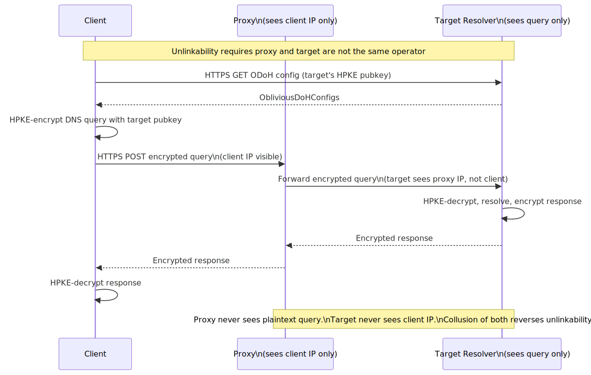
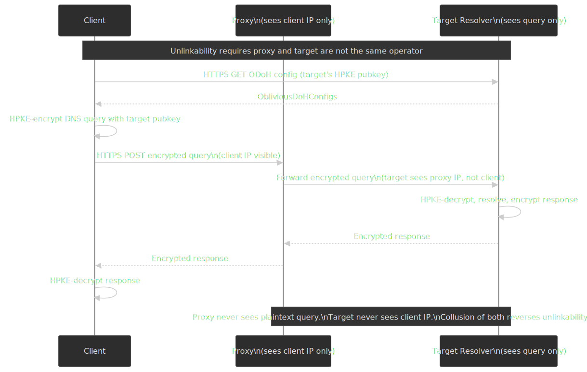

The query is encrypted to the *target's* HPKE public key (fetched out-of-band over HTTPS), wrapped in an HTTP request to the proxy, and forwarded. The proxy never sees the plaintext query; the target never sees the client IP. Cloudflare runs `odoh.cloudflare-dns.com` and Apple's iCloud Private Relay uses ODoH (with HPKE) for DNS resolution, distributing traffic across multiple partner resolvers including Cloudflare, Akamai, and Fastly [^icloud-pr].

> [!NOTE]
> [RFC 9230](https://datatracker.ietf.org/doc/rfc9230/) is an Independent Submission with **Experimental** status — it was published outside the IETF stream and explicitly is "not a candidate for any level of Internet Standard". Useful in production today, but expect it to evolve.

ODoH costs an extra hop in latency and assumes the proxy and target are operated by genuinely independent parties — collusion (or a single legal jurisdiction compelling both) reverses the privacy property.

## DoT — DNS over TLS

DoT ([RFC 7858](https://datatracker.ietf.org/doc/html/rfc7858)) is the simpler relative: TLS on a dedicated port (853), then DNS messages prefixed with a 2-byte length field. There is no HTTP layer; framing is essentially "DNS over TCP, but encrypted". RFC 7858 deliberately mandates port 853 *and* prohibits cleartext DNS on it, so the port itself becomes a policy lever — operators can allow or block DoT independently of HTTPS.

[RFC 8310](https://datatracker.ietf.org/doc/html/rfc8310) defines two security profiles:

- **Opportunistic privacy:** Try DoT, fall back to cleartext DNS if 853 is blocked or the TLS handshake fails. Defends against passive attackers; trivially defeated by an active downgrade.
- **Strict privacy:** Require an authenticated DoT connection (typically via DNS-based pin or hostname verification). No fallback — DNS fails closed.

Most managed environments (Android 9+ "Private DNS" being the largest deployment) use strict mode with a configured hostname.

### DoH vs DoT trade-off

| Aspect                  | DoT                                       | DoH                                          |
| ----------------------- | ----------------------------------------- | -------------------------------------------- |
| Port                    | 853, dedicated TCP (and UDP for DoQ)      | 443, shared with web traffic                 |
| Network visibility      | Identifiable as DNS by port               | Indistinguishable from HTTPS                 |
| Block-ability           | Block port 853 or filter by IP            | Requires breaking HTTPS or deep inspection   |
| Multiplexing            | One stream per TLS connection, with pipelining | HTTP/2 streams over one TLS connection      |
| HTTP-cache reuse        | None                                      | Enabled (RFC 8484 GET, ID = 0)               |
| Enterprise stance       | Manageable, often *preferred* for visibility | Harder to govern, often blocked at edge      |
| Censorship resistance   | Lower (port-based fingerprint)            | Higher (blends with HTTPS)                   |
| OS-level adoption       | Android 9+, iOS Private Relay (partial)   | Browsers (Firefox, Chrome, Edge), some libs  |

The choice often follows the threat model: a corporate environment that wants visibility-with-encryption prefers DoT; a user trying to circumvent censorship prefers DoH (or DoQ) precisely because it is harder to single out.

## DoQ — DNS over QUIC


[RFC 9250](https://www.rfc-editor.org/rfc/rfc9250.html) (May 2022, Standards Track) runs DNS over QUIC on **UDP port 853** — same number as DoT, different protocol. The properties carry over from QUIC itself ([RFC 9000](https://www.rfc-editor.org/rfc/rfc9000.html)):

- **Combined transport + crypto handshake:** 1-RTT new connections, **0-RTT** for resumed sessions.
- **No head-of-line blocking:** independent QUIC streams, so a lost UDP datagram delays only the affected query.
- **Connection migration:** the QUIC connection ID survives an IP change (Wi-Fi to cellular).

The IMC 2022 measurement paper "DNS Privacy with Speed?" found DoQ to be roughly **10% faster than DoH for simple page loads** and only **~2% slower than cleartext UDP DNS** [^doq-imc]. A 2026 follow-up comparing DoQ to DNS over HTTP/3 reported the two are within ~1% on low-latency paths [^doq-pam].

Production deployment is sparse: AdGuard DNS exposes DoQ as a public resolver, and dnsdist 1.9+, Technitium, and dnspython 2.7+ ship server/library support, but no major browser has shipped DoQ as of early 2026. The blocker is QUIC stack maturity, not the protocol itself.

## ECH — Encrypted ClientHello

Even after DoH/DoT/DoQ encrypts the resolution, the very next thing the client does is open a TLS connection — and the original TLS ClientHello carries the destination hostname in the **SNI extension** in plaintext. That is what most national-firewall systems actually filter on. **Encrypted ClientHello** ([RFC 9849](https://www.rfc-editor.org/rfc/rfc9849.html), March 2026) closes that gap.

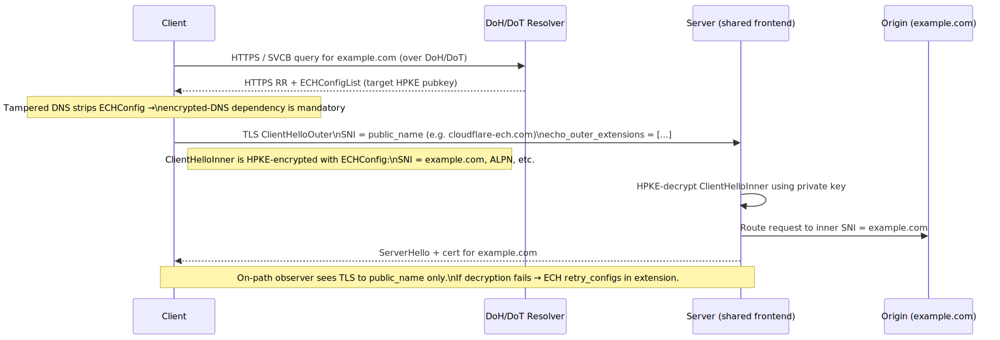
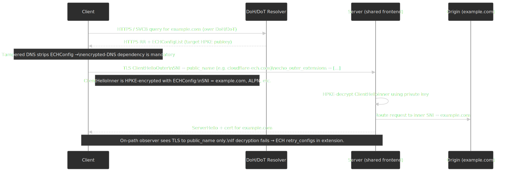

The mechanics:

1. The client resolves the destination via DoH/DoT and gets back an `HTTPS` (SVCB) record containing an **`ECHConfig`** with the server's HPKE public key.
2. The client sends a TLS `ClientHelloOuter` with a generic *public name* in the SNI (e.g. `cloudflare-ech.com`) plus an `encrypted_client_hello` extension carrying the HPKE-encrypted `ClientHelloInner`.
3. The server (which holds the HPKE private key) decrypts the inner ClientHello, extracts the real SNI, and continues the handshake for the actual destination.

> [!IMPORTANT]
> **ECH has a hard DNS dependency.** If an attacker can rewrite the `HTTPS` record (because DNS is plaintext), they can strip the `ECHConfig`, forcing the client to fall back to the cleartext outer SNI. ECH's privacy property therefore *requires* the DNS lookup itself to be encrypted and ideally validated — DoH or DoT plus DNSSEC. Without that, ECH is theatre.

**Browser support:** Chrome shipped ECH in v117 (September 2023); Firefox enabled it by default in v119 (October 2023). Cloudflare turned ECH on by default for its hosted properties in October 2024 [^cdt-ech].

**Censorship pushback:** Russia's regulator Roskomnadzor began dropping TLS ClientHellos that contain both the `encrypted_client_hello` extension *and* the SNI value `cloudflare-ech.com` in November 2024 [^russia-ech]; iOS and Windows users routed to Cloudflare-fronted sites saw immediate breakage. China and Iran have similar filters. The episode underscores the design risk of a single popular outer SNI: it becomes the easiest fingerprint to filter on.

## Enterprise deployment

Encrypted DNS is a policy minefield: it removes a long-standing observability and control point. The NSA's January 2021 guidance ["Adopting Encrypted DNS in Enterprise Environments"](https://media.defense.gov/2021/Jan/14/2002564889/-1/-1/0/CSI_ADOPTING_ENCRYPTED_DNS_U_OO_102904_21.PDF) lays out the dominant pattern: route *all* enterprise DNS — encrypted or not — through a designated internal resolver, and block external encrypted DNS at the egress.


### Split-horizon breakage

The first thing that breaks when a managed laptop turns on Firefox's default-Cloudflare DoH is split-horizon (split-brain) DNS. Internal names like `payroll.corp.example.com` are not in the public zone; Cloudflare returns `NXDOMAIN`, the laptop fails to find the internal app, and your security team loses DNS-based egress logging in the same step.

Mitigations, in increasing order of strength:

| Approach                          | Mechanism                                                | Trade-off                                              |
| --------------------------------- | -------------------------------------------------------- | ------------------------------------------------------ |
| **Canary domain**                 | Internal resolver returns `NXDOMAIN` for `use-application-dns.net` | Only disables Firefox *auto*-DoH; manual config bypasses |
| **Block port 853**                | Firewall outbound TCP/UDP 853                            | Stops DoT and DoQ; useless against DoH on 443          |
| **Block known DoH endpoints**     | IP / SNI deny-list for known public resolvers            | Cat-and-mouse; new endpoints appear constantly         |
| **Internal encrypted resolver**   | Run BIND/Unbound with DoH/DoT, push as the configured resolver | Requires infrastructure but preserves logs and split-horizon |
| **Endpoint policy (MDM/GPO)**     | `DnsOverHttpsMode` / `network.trr.mode` policy           | Requires managed devices                                |

The defensible default is "internal encrypted resolver + MDM-pushed policy + canary domain", with port 853 firewalled and DoH on port 443 left open because trying to block it without breaking the web is hopeless.

### Resolver selection cheat-sheet

| Use case                          | Resolver                          | Why                                                                |
| --------------------------------- | --------------------------------- | ------------------------------------------------------------------ |
| Enterprise managed devices        | Internal recursive with DoH/DoT   | Preserves split-horizon, logging, EDE pass-through                 |
| Privacy-first individual          | Cloudflare 1.1.1.1 or Quad9 9.9.9.9 | Both publish "no logs / no monetisation" policies; no ECS by default |
| CDN-routing-sensitive workloads   | Google 8.8.8.8 with EDNS Client Subnet | ECS lets the authoritative pick a closer CDN POP                 |
| Malware/threat filtering          | Quad9 9.9.9.9                     | Threat intel feed blocks known-bad domains                          |

EDNS Client Subnet ([RFC 7871](https://datatracker.ietf.org/doc/html/rfc7871)) trades privacy for routing accuracy: by sending an anonymised client prefix to the authoritative server, GeoDNS routing can pick a regionally optimal answer — but the authoritative now learns roughly where you are. Cloudflare deliberately omits ECS; Google sends it. For most consumer users the latency win is real and the privacy loss minor; for sensitive workloads, prefer the operator that does not.

## Operational verification

### DNSSEC checks

```bash title="DNSSEC sanity checks with dig and delv"
dig example.com DNSKEY +dnssec
dig example.com +dnssec
dig example.com +cd
delv example.com +vtrace
```

Interpretation:

- `flags: ... ad` in the response header means the resolver verified the chain and you can trust the answer.
- `SERVFAIL` from `dig example.com` *and* a clean answer from `dig example.com +cd` is the unambiguous DNSSEC signature — the chain is broken.
- Both commands failing points at an authoritative or network problem, not DNSSEC.
- `delv` with `+vtrace` walks each link and prints which one failed; pair it with `dnsviz.net/d/<name>/analyze/` for a visual chain map.

### DoH / DoT / DoQ checks

```bash title="Probing each encrypted-transport variant"
kdig @1.1.1.1 example.com +tls
kdig @1.1.1.1 example.com +https
kdig @dns.adguard-dns.com example.com +quic

curl -H 'accept: application/dns-message' \
  --data-binary @- \
  -X POST 'https://cloudflare-dns.com/dns-query' < query.bin | xxd | head
```

For ECH a contemporary `curl` (`curl --ech true ...`) or a browser network log will tell you whether the negotiated handshake actually used the encrypted inner SNI.

### What to monitor

| Metric                                 | Healthy band         | Alert threshold        |
| -------------------------------------- | -------------------- | ---------------------- |
| DNSSEC validation success rate         | ≥ 99.9%              | < 99% sustained        |
| RRSIG time-to-expiry on owned zones    | > 7 days             | < 3 days               |
| `DS` ↔ child `DNSKEY` digest match     | 100%                 | Any mismatch (instant page) |
| DoH/DoT connection failure rate        | < 1%                 | > 5% sustained         |
| EDE codes 6/7/8/27 frequency           | Near zero            | Any sustained increase |
| Outbound queries to non-approved DoH endpoints | 0                | Any                    |

```bash title="One-liner to surface RRSIG expiry on an owned zone"
dig example.com RRSIG +dnssec +multiline | grep -A1 "RRSIG"
```

## Practical takeaways

- DNSSEC and encrypted DNS solve **different** problems; you need both for end-to-end protection, and neither hides the destination IP.
- For a new signed zone, default to **ECDSA P-256 (algorithm 13)**, **NSEC3 with iterations = 0 and empty salt**, automated re-signing tighter than the validity window, and RRSIG-expiry alerts.
- For client-side privacy, prefer DoH (or DoQ where available); accept that it concentrates queries at one operator.
- For enterprise rollouts, run an internal recursive resolver that supports DoH/DoT, push it with MDM/GPO, return `NXDOMAIN` for `use-application-dns.net`, block outbound 853, and accept that DoH on 443 is unblockable without breaking HTTPS.
- For full hostname privacy, layer **ECH** over DoH/DoT — with the explicit caveat that ECH's privacy property is only as good as the DNS lookup that fetched its key.
- Treat the **root KSK rollover (October 2026)** and the **proposed RSA→ECDSA root algorithm rollover (2027 onward)** as planned events: validators that fall behind RFC 5011 trust-anchor updates will silently start serving SERVFAIL.

## Appendix

### Prerequisites

- DNS resolution fundamentals — see [DNS Resolution Path](../dns-resolution-path/README.md).
- DNS records and TTL behaviour — see [DNS Records, TTL, and Caching](../dns-records-ttl-and-caching/README.md).
- TLS handshake basics — see [TLS 1.3 Handshake and HTTPS](../tls-1-3-handshake-and-https/README.md).
- HTTP/2 and HTTP/3 transport (used by DoH and DoQ respectively) — see [HTTP/3, QUIC and TLS](../http3-quic-and-tls/README.md).
- Public-key cryptography fundamentals: asymmetric keys, digital signatures, HPKE.

When something is broken in production, jump to the [DNS Troubleshooting Playbook](../dns-troubleshooting-playbook/README.md) for symptom-driven recipes.

### Glossary

| Term             | Meaning                                                                                |
| ---------------- | -------------------------------------------------------------------------------------- |
| DNSSEC           | Domain Name System Security Extensions; cryptographic authentication of DNS responses  |
| KSK              | Key Signing Key; signs the `DNSKEY` RRset, hash published as `DS` in the parent zone   |
| ZSK              | Zone Signing Key; signs all other RRsets in the zone, rolled more frequently            |
| `DS`             | Delegation Signer; hash of the child zone's KSK, in the parent zone                    |
| `RRSIG`          | Resource Record Signature; cryptographic signature over an RRset                       |
| `DNSKEY`         | Public-key record; carries KSK and ZSK public keys                                     |
| NSEC / NSEC3     | Records proving the non-existence of a name (clear-text vs hashed)                     |
| DoH              | DNS over HTTPS ([RFC 8484](https://datatracker.ietf.org/doc/html/rfc8484))             |
| DoT              | DNS over TLS ([RFC 7858](https://datatracker.ietf.org/doc/html/rfc7858))               |
| DoQ              | DNS over QUIC ([RFC 9250](https://www.rfc-editor.org/rfc/rfc9250.html))                 |
| ODoH             | Oblivious DoH ([RFC 9230](https://datatracker.ietf.org/doc/rfc9230/), Experimental)    |
| ECH              | Encrypted ClientHello ([RFC 9849](https://www.rfc-editor.org/rfc/rfc9849.html))        |
| ECS              | EDNS Client Subnet ([RFC 7871](https://datatracker.ietf.org/doc/html/rfc7871))         |
| EDE              | Extended DNS Errors ([RFC 8914](https://www.rfc-editor.org/rfc/rfc8914.html))          |
| `CDS` / `CDNSKEY` | Child-published records that signal the desired parent `DS` for automated rollover    |
| `CSYNC`          | Child-side record signalling parental NS / glue updates ([RFC 7477](https://datatracker.ietf.org/doc/html/rfc7477)) |
| DNS cookies      | 64-bit token exchanged in EDNS to deter off-path forgery ([RFC 7873](https://datatracker.ietf.org/doc/html/rfc7873) / [RFC 9018](https://datatracker.ietf.org/doc/html/rfc9018)) |
| `AD` flag        | Authenticated Data; resolver set this when DNSSEC validation succeeded                  |
| `CD` flag        | Checking Disabled; client requests the resolver skip validation                        |
| Trust anchor     | The pre-configured root-zone KSK public key; the only key trusted out-of-band           |

### References

- [RFC 4033 — DNSSEC Introduction and Requirements](https://datatracker.ietf.org/doc/html/rfc4033)
- [RFC 4034 — DNSSEC Resource Records](https://datatracker.ietf.org/doc/html/rfc4034)
- [RFC 4035 — DNSSEC Protocol Modifications](https://datatracker.ietf.org/doc/html/rfc4035)
- [RFC 5011 — Automated Updates of DNSSEC Trust Anchors](https://datatracker.ietf.org/doc/html/rfc5011)
- [RFC 5155 — DNSSEC NSEC3 Hashed Authenticated Denial of Existence](https://datatracker.ietf.org/doc/html/rfc5155)
- [RFC 7344 — Automating DNSSEC Delegation Trust Maintenance (CDS / CDNSKEY)](https://datatracker.ietf.org/doc/html/rfc7344)
- [RFC 7477 — Child-to-Parent Synchronization in DNS (CSYNC)](https://datatracker.ietf.org/doc/html/rfc7477)
- [RFC 7583 — DNSSEC Key Rollover Timing Considerations](https://datatracker.ietf.org/doc/html/rfc7583)
- [RFC 7858 — DNS over TLS (DoT)](https://datatracker.ietf.org/doc/html/rfc7858)
- [RFC 7871 — Client Subnet in DNS Queries (ECS)](https://datatracker.ietf.org/doc/html/rfc7871)
- [RFC 7873 — DNS Cookies](https://datatracker.ietf.org/doc/html/rfc7873) / [RFC 9018 — Interoperable DNS Server Cookies](https://datatracker.ietf.org/doc/html/rfc9018)
- [RFC 8078 — Managing DS Records via CDS / CDNSKEY](https://datatracker.ietf.org/doc/html/rfc8078)
- [RFC 8310 — Usage Profiles for DoT and DoH](https://datatracker.ietf.org/doc/html/rfc8310)
- [RFC 8484 — DNS Queries over HTTPS (DoH)](https://datatracker.ietf.org/doc/html/rfc8484)
- [RFC 8624 — Algorithm Implementation Requirements for DNSSEC](https://datatracker.ietf.org/doc/html/rfc8624)
- [RFC 8914 — Extended DNS Errors (EDE)](https://www.rfc-editor.org/rfc/rfc8914.html)
- [RFC 9230 — Oblivious DNS over HTTPS (ODoH)](https://datatracker.ietf.org/doc/rfc9230/)
- [RFC 9250 — DNS over Dedicated QUIC Connections (DoQ)](https://www.rfc-editor.org/rfc/rfc9250.html)
- [RFC 9276 — Guidance for NSEC3 Parameter Settings (BCP 236)](https://datatracker.ietf.org/doc/html/rfc9276)
- [RFC 9849 — TLS Encrypted Client Hello (ECH)](https://www.rfc-editor.org/rfc/rfc9849.html)
- [ICANN Root KSK Rollover programme](https://www.icann.org/resources/pages/ksk-rollover) and [IANA DNSSEC Trust Anchors](https://www.iana.org/dnssec/files)
- [APNIC DNSSEC validation measurement](https://stats.labs.apnic.net/dnssec)
- [NSA — Adopting Encrypted DNS in Enterprise Environments (Jan 2021)](https://media.defense.gov/2021/Jan/14/2002564889/-1/-1/0/CSI_ADOPTING_ENCRYPTED_DNS_U_OO_102904_21.PDF)
- [DNSViz — DNSSEC visualisation and analysis](https://dnsviz.net/)

[^rfc4033]: [RFC 4033 §3](https://datatracker.ietf.org/doc/html/rfc4033#section-3) — chain-of-trust definition; trust anchor configured at the validating resolver.
[^icann-algo-roll]: [ICANN proposal — Root Zone KSK Algorithm Rollover (open for public comment, 2026)](https://www.icann.org/en/public-comment/proceeding/proposed-root-ksk-algorithm-rollover-03-02-2026); the [PDF proposal](https://itp.cdn.icann.org/en/files/domain-name-system-dns-engineering/proposal-for-root-zone-ksk-algorithm-rollover-03-02-2026-en.pdf) sets ECDSA-key generation in 2027 and RSA retirement in 2029.
[^algo-validators]: ED25519 has been a `MUST`-validate algorithm for several years, but operator surveys still report a non-zero share of recursive resolvers that treat it as `INSECURE` — see the [APNIC measurement of DNSSEC algorithm support](https://labs.apnic.net/index.php/2023/09/09/measuring-the-use-of-dnssec/) and re-check before deploying for a wide audience.
[^isc-150]: [ISC — DNSSEC signed zones: best-practice guidance for NSEC3 iterations](https://kb.isc.org/docs/dnssec-signed-zones-best-practice-guidance-for-nsec3-iterations) — BIND 9.16.16 / 9.16.19 and onward treat zones with NSEC3 iterations > 150 as insecure; subsequent BIND releases continue to reduce the limit toward RFC 9276's recommended `0`.
[^unbound-conf]: [Unbound `example.conf.in` — `val-nsec3-keysize-iterations`](https://github.com/NLnetLabs/unbound/blob/master/doc/example.conf.in) — default table caps iterations at 150 across key sizes; zones above the cap are validated as insecure.
[^apnic-2023-measure]: [APNIC Labs — Measuring the Use of DNSSEC (Sep 2023)](https://labs.apnic.net/index.php/2023/09/09/measuring-the-use-of-dnssec/) — country and TLD breakdowns including `.com` ≈ 4.3%, `.net` ≈ 5.3%.
[^sidn-incentives]: [SIDN — DNSSEC adoption heavily dependent on incentives and active promotion](https://www.sidn.nl/en/news-and-blogs/dnssec-adoption-heavily-dependent-on-incentives-and-active-promotion); cf. SIDN's [Registrar Scorecard](https://www.sidn.nl/en/modern-internet-standards/dnssec).
[^moz-doh]: [Mozilla — Firefox DNS-over-HTTPS](https://support.mozilla.org/en-US/kb/firefox-dns-over-https) — TRR rollout, Cloudflare default in the US, regional expansion thereafter.
[^chrome-doh]: [Chromium — Secure DNS auto-upgrade design doc](https://chromeenterprise.google/policies/#DnsOverHttpsMode) and the [Chrome blog on Secure DNS](https://blog.chromium.org/2020/05/a-safer-and-more-private-browsing-DoH.html) — the auto-upgrade behaviour preserves the user's chosen DNS server.
[^doh-json]: [Google Public DNS — DNS-over-HTTPS JSON API](https://developers.google.com/speed/public-dns/docs/doh/json) and [Cloudflare docs — DoH JSON format](https://developers.cloudflare.com/1.1.1.1/encryption/dns-over-https/make-api-requests/dns-json/) — both predate and sit outside RFC 8484.
[^icloud-pr]: [Apple — iCloud Private Relay overview (Dec 2021)](https://www.apple.com/icloud/docs/iCloud_Private_Relay_Overview_Dec2021.pdf) §"Domain name resolution" — DNS uses ODoH with HPKE; partner resolvers include Cloudflare, Akamai, and Fastly.
[^doq-imc]: Kosek et al., "DNS Privacy with Speed? Evaluating DNS over QUIC and its Impact on Web Performance", [ACM IMC 2022](https://dl.acm.org/doi/abs/10.1145/3517745.3561445) — DoQ ≈ 10% faster than DoH and ≈ 2% slower than UDP DNS for simple page loads.
[^doq-pam]: Kosek et al., "A Comparison of DNS over QUIC and DNS over HTTP/3", [PAM 2026](https://vaibhavbajpai.com/documents/papers/proceedings/2026-pam-doq-doh3.pdf) — DoQ and DoH/3 are within ~1% on low-latency paths.
[^cdt-ech]: [CDT — Do Not Stick Out: The Dynamics of the ECH Rollout](https://cdt.org/insights/do-not-stick-out-the-dynamics-of-the-ech-rollout/) — Chrome 117, Firefox 119, Cloudflare default-on October 2024.
[^russia-ech]: [net4people/bbs #417 — Blocking of Cloudflare ECH in Russia, 2024-11-05](https://github.com/net4people/bbs/issues/417) and the [PETS FOCI 2025 paper on ECH censorship](https://www.petsymposium.org/foci/2025/foci-2025-0016.pdf) — Roskomnadzor drops TLS ClientHellos containing both an ECH extension and SNI `cloudflare-ech.com`.
[^cds-deployment]: [APNIC — DNSSEC provisioning automation with CDS/CDNSKEY in the real world (Nov 2021)](https://blog.apnic.net/2021/11/02/dnssec-provisioning-automation-with-cds-cdnskey-in-the-real-world/) and the [Internetstiftelsen automated DNSSEC provisioning policy](https://internetstiftelsen.se/domaner/domannamnsbranschen/teknik/policy-and-guidelines-for-automated-dnssec-provisioning/) for `.se`.
