# DNS Troubleshooting Playbook

DNS incidents look chaotic until you isolate the layer they live in. This playbook gives you a symptom-first triage tree, a small but precise tool kit (`dig`, `delv`, `kdig`, `drill`), and concrete recovery patterns for the failure modes that drive most production outages — DNSSEC validation breakage, lame delegation, stale caches, and CDN/GeoDNS surprises.

It is the operations companion to [DNS Resolution Path](../dns-resolution-path/README.md), [DNS Records, TTL, and Cache Behavior](../dns-records-ttl-and-caching/README.md), and [DNS Security: DNSSEC, DoH, and DoT](../dns-security-doh-dot-dnssec/README.md). Read those for the protocol mechanics; read this when something is on fire.


## Mental Model

DNS resolution traverses three failure domains in series. A bad answer at the top hides everything below it, so always isolate top-down:

1. **Authoritative infrastructure** — the zone's own nameservers and the data they publish. Symptoms surface as wrong answers, missing records, or no AA flag.
2. **The delegation chain** — root → TLD → zone, plus DNSSEC trust from `.` down. Symptoms surface as `+trace` stalls, lame delegation, or `SERVFAIL` with EDE 6/9/10 ([RFC 8914 §4](https://www.rfc-editor.org/rfc/rfc8914#section-4)).
3. **Recursive resolvers and client caches** — public/ISP resolvers, OS stubs, browser caches. Symptoms surface as one resolver disagreeing with another, "propagation" lag after a TTL expires, or stale records served per [RFC 8767](https://www.rfc-editor.org/rfc/rfc8767).

Four reflexes drive the rest of the playbook:

- **`dig +cd` first when you see `SERVFAIL`.** If `+cd` succeeds the failure is DNSSEC validation, not the zone. CD is the [RFC 4035](https://www.rfc-editor.org/rfc/rfc4035) Checking Disabled bit.
- **Distinguish NXDOMAIN from NODATA.** NXDOMAIN means the name does not exist; NODATA means the name exists but has no records of the requested type — `NOERROR` with an empty answer section ([RFC 2308 §2](https://www.rfc-editor.org/rfc/rfc2308#section-2)).
- **"Propagation" is cache expiry, not active distribution.** Old answers persist for the record's remaining TTL; negative answers persist for `min(SOA.MINIMUM, SOA TTL)` ([RFC 2308 §5](https://www.rfc-editor.org/rfc/rfc2308#section-5)).
- **Lame delegation is silent.** A nameserver that does not consider itself authoritative for the zone returns answers without the `aa` flag, or `REFUSED` ([RFC 1034 §4.2.2](https://www.rfc-editor.org/rfc/rfc1034#section-4.2.2)). Always check the AA flag, never assume.

## Diagnostic Tool Kit

Different tools expose different layers. Keep all four in muscle memory; they are not interchangeable.

| Tool    | Source                                                   | Best for                                                              |
| ------- | -------------------------------------------------------- | --------------------------------------------------------------------- |
| `dig`   | [BIND 9](https://bind9.readthedocs.io/)                  | General-purpose query inspection, header flags, RCODEs, EDE.          |
| `delv`  | [BIND 9](https://bind9.readthedocs.io/)                  | Local DNSSEC validation with chain traces (`+rtrace`, `+vtrace`).     |
| `kdig`  | [Knot DNS](https://www.knot-dns.cz/docs/latest/html/man_kdig.html) | DoT, DoH, and DoQ end-to-end testing.                          |
| `drill` | [NLnet Labs ldns](https://nlnetlabs.nl/projects/ldns/about/) | DNSSEC chain visualization (`-T -D -S`).                           |

### dig: the Primary Tool

Understanding `dig`'s flags and header is the single highest-leverage skill in DNS triage.

**Essential flags:**

| Flag         | Purpose                           | When to Use                                      |
| ------------ | --------------------------------- | ------------------------------------------------ |
| `+trace`     | Iterate from root downward        | Identify which NS in the chain fails             |
| `+norecurse` | Skip recursion, query directly    | Test an authoritative server's own answer        |
| `+cd`        | Checking Disabled (bypass DNSSEC) | Confirm a `SERVFAIL` is DNSSEC-related           |
| `+dnssec`    | Set the DO bit, request RRSIGs    | Verify signatures and DNSKEY records exist       |
| `+nsid`      | Request the Name Server ID        | Identify which anycast instance answered         |
| `+subnet`    | Send EDNS Client Subnet           | Reproduce GeoDNS answers from a target subnet    |
| `+short`     | Concise output                    | Quick answer verification, scripting             |
| `+tcp`       | Force TCP transport               | Test when UDP responses are truncated or dropped |
| `+bufsize=N` | Set advertised EDNS UDP bufsize   | Force truncation (`+bufsize=512`) or test Flag Day default (`1232`) |
| `+cookie`    | Send DNS Cookies (RFC 7873)       | Off-path-spoofing test; on by default in modern dig |
| `+noedns`    | Strip the EDNS OPT RR             | Detect EDNS-stripping middleboxes                |
| `-4` / `-6`  | Force IPv4/IPv6                   | Isolate address-family-specific issues           |

These are documented in the BIND 9 ARM under `dig` and `delv` ([BIND 9 manpages](https://bind9.readthedocs.io/en/latest/manpages.html)).

**Interpreting dig output:**

```bash collapse={1-2}
$ dig example.com

; <<>> DiG 9.18.18 <<>> example.com
;; ->>HEADER<<- opcode: QUERY, status: NOERROR, id: 54321
;; flags: qr rd ra ad; QUERY: 1, ANSWER: 1, AUTHORITY: 0, ADDITIONAL: 1

;; ANSWER SECTION:
example.com.        86400   IN  A   93.184.216.34

;; Query time: 23 msec
;; SERVER: 8.8.8.8#53(8.8.8.8)
```


**Header flags decoded** ([RFC 1035 §4.1.1](https://www.rfc-editor.org/rfc/rfc1035#section-4.1.1) and [RFC 4035 §3.2](https://www.rfc-editor.org/rfc/rfc4035#section-3.2)):

| Flag | Meaning                                                                         |
| ---- | ------------------------------------------------------------------------------- |
| `qr` | Query Response — message is a response, not a query                             |
| `rd` | Recursion Desired — the client asked for full resolution                        |
| `ra` | Recursion Available — the responder offers recursion                            |
| `aa` | Authoritative Answer — answer comes from the zone's nameserver                  |
| `ad` | Authenticated Data — DNSSEC validation succeeded at this resolver               |
| `cd` | Checking Disabled — client requested validation be skipped                      |

**RCODE values** (full list in the [IANA DNS Parameters registry](https://www.iana.org/assignments/dns-parameters/dns-parameters.xhtml#dns-parameters-6)):

| Status     | Meaning            | Common Causes                                              |
| ---------- | ------------------ | ---------------------------------------------------------- |
| `NOERROR`  | Success            | Query succeeded; may be NODATA if the answer section is empty |
| `SERVFAIL` | Server failure     | DNSSEC validation, upstream timeout, lame delegation, RRL  |
| `NXDOMAIN` | Name doesn't exist | Domain not registered, typo, deleted record                |
| `REFUSED`  | Query refused      | ACL, rate limiting, server not authoritative               |
| `FORMERR`  | Format error       | Malformed query (rare; usually a buggy stub or middlebox)  |

### delv: Local DNSSEC Validation

`delv` ships with BIND and reuses `named`'s validator, so it can prove validation locally — independent of the resolver you queried. Use it whenever `dig +cd` succeeds but plain `dig` returns `SERVFAIL`.

```bash collapse={1-2}
$ delv example.com

; fully validated
example.com.        86400   IN  A   93.184.216.34
```

**Key delv flags** ([BIND 9 ARM — delv](https://bind9.readthedocs.io/en/latest/manpages.html)):

| Flag         | Purpose                                                                       |
| ------------ | ----------------------------------------------------------------------------- |
| `+rtrace`    | Resolver fetch logging — every query delv issues to build the chain           |
| `+vtrace`    | Validation trace — every signature it checks against the trust anchor         |
| `+mtrace`    | Message trace — full responses received                                       |
| `-i`         | Insecure mode (disable validation; for plain lookups, prefer `dig +cd`)       |
| `+multiline` | Wrap RRSIG, DNSKEY, and SOA records into a readable form                      |

When validation fails, `delv` prints the broken hop:

```bash
$ delv dnssec-failed.org
;; resolution failed: SERVFAIL
;; DNSSEC validation failure
```

> [!NOTE]
> `delv -i` does **not** set `CD` on upstream queries. If your forwarder is itself validating, it will withhold bogus data and `delv` will time out. To examine bogus data, use `dig +cd` — never `delv -i`. ([BIND 9 ARM — delv](https://bind9.readthedocs.io/en/latest/manpages.html))

### kdig: Encrypted DNS Testing

`kdig` from Knot DNS speaks DoT ([RFC 7858](https://www.rfc-editor.org/rfc/rfc7858)), DoH ([RFC 8484](https://www.rfc-editor.org/rfc/rfc8484)), and DoQ ([RFC 9250](https://www.rfc-editor.org/rfc/rfc9250)) out of the box. It is the right tool when you suspect TLS handshake failures, ALPN mismatches, or DoH path/method differences:

```bash
kdig @1.1.1.1 example.com +tls
kdig @1.1.1.1 example.com +https
kdig @1.1.1.1 example.com +quic

kdig @8.8.8.8 +https +tls-hostname=dns.google +fastopen example.com
```

The full option set is in the [kdig manpage](https://www.knot-dns.cz/docs/latest/html/man_kdig.html); particularly useful for triage are `+tls-hostname`, `+tls-pin`, `+keepopen`, and `+padding`.

### drill: DNSSEC Chain Tracing

`drill` from NLnet Labs ships with `ldns` and is the cleanest way to walk the DNSSEC chain by hand:

```bash
drill -TDS example.com
```

Per the [`drill(1)` manpage](https://linux.die.net/man/1/drill), the flags are independent:

| Flag | Purpose                                                                          |
| ---- | -------------------------------------------------------------------------------- |
| `-T` | Trace from root to the queried name                                              |
| `-D` | Set the DNSSEC OK (DO) bit, requesting DNSSEC records in responses               |
| `-S` | Chase signatures up to a known trust anchor                                      |

`-TDS` combined produces a per-hop trace that includes RRSIG and DS records, surfacing chain breaks visually before you reach for [DNSViz](https://dnsviz.net/).

## Symptom-Driven Triage

Pick the entry point matching what users (or your synthetic monitor) reported, then drill down. None of the steps below mutate state — they are safe to run in production at any time.

### Complete Resolution Failure

**Symptom:** All queries to a domain fail across multiple resolvers — no responses, or every response is an error.

```bash
dig example.com NS +short
# Returns: ns1.example.com, ns2.example.com

dig @ns1.example.com example.com A +norecurse
dig @ns2.example.com example.com A +norecurse

dig ns1.example.com A +short
# Returns: 192.0.2.1

nc -zv 192.0.2.1 53
```

**Failure patterns:**

| Pattern                      | Likely Cause                                            |
| ---------------------------- | ------------------------------------------------------- |
| No response from any NS      | Authoritative servers down or unreachable               |
| Response but no AA flag      | Lame delegation — NS does not serve this zone           |
| Response but `REFUSED`       | ACL blocking your source IP, or zone not loaded         |
| Timeout to NS but ICMP works | Firewall blocking UDP/TCP 53, or DNS-over-something only |

**Lame delegation check.** A nameserver that is listed in the parent's NS records but does not consider itself authoritative for the zone is a lame delegation:

```bash
dig @ns1.example.com example.com SOA +norecurse

# Healthy: status: NOERROR, flags include 'aa'
# Lame:    REFUSED, SERVFAIL, or NOERROR without the 'aa' flag
```

This is one of the oldest and most common DNS failure modes. The classic reference is [RFC 1912 §2.8](https://www.rfc-editor.org/rfc/rfc1912#section-2.8); modern resolvers downrank lame nameservers automatically, which makes intermittent breakage hard to spot.

### SERVFAIL Responses

**Symptom:** A resolver returns `SERVFAIL` for a domain that should resolve.

`SERVFAIL` is a catch-all the resolver returns whenever it cannot produce a trustworthy answer. The dominant causes today:

1. DNSSEC validation failure (most common since DNSSEC adoption rose past ~30% of zones).
2. All authoritative servers unreachable from the resolver.
3. Lame delegation.
4. Resolver-side timeout, RRL throttling ([RFC 7873 cookies](https://www.rfc-editor.org/rfc/rfc7873)), or upstream loop detection.

The [RFC 9520](https://www.rfc-editor.org/rfc/rfc9520) cache rules require resolvers to negatively cache resolution failures themselves, which is why a single bad event can persist for the full negative-cache TTL even after you fix the source.

**Decision tree.** Always start by ruling DNSSEC in or out:

```bash
dig example.com +cd

# If +cd succeeds and plain dig fails → DNSSEC problem
# If both fail                        → authoritative or network problem
```


**Extended DNS Errors (EDE).** [RFC 8914](https://www.rfc-editor.org/rfc/rfc8914) defines an EDNS0 OPT field carrying an `INFO-CODE` that explains the underlying reason for a `SERVFAIL` (or any other RCODE). Most major recursors emit it; Cloudflare's "[Unwrap the SERVFAIL](https://blog.cloudflare.com/unwrap-the-servfail/)" post documents their adoption.

```bash
dig @1.1.1.1 example.com

;; OPT PSEUDOSECTION:
; EDE: 6 (DNSSEC Bogus)
```

The codes most often seen in the wild ([IANA Extended DNS Errors registry](https://www.iana.org/assignments/dns-parameters/dns-parameters.xhtml#extended-dns-error-codes)):

| Code | Name                       | Meaning                                                                   |
| ---: | -------------------------- | ------------------------------------------------------------------------- |
|    6 | DNSSEC Bogus               | Validation failed — chain or signature inconsistency                      |
|    7 | Signature Expired          | RRSIG inception/expiration window has passed; re-sign the zone            |
|    8 | Signature Not Yet Valid    | RRSIG inception is in the future; usually clock skew on the signer        |
|    9 | DNSKEY Missing             | RRSIG references a key not in the published DNSKEY RRset                  |
|   10 | RRSIGs Missing             | The zone is signed but a queried RRset has no RRSIG                       |
|   11 | No Zone Key Bit Set        | DNSKEY used to sign does not have the Zone Key flag                       |
|   12 | NSEC Missing               | Negative answer cannot be authenticated — denial-of-existence chain broken |

**Trace to find the failing hop:**

```bash
dig +trace example.com
```

The last successful referral identifies the layer immediately above the failure.

### Intermittent Failures

**Symptom:** Queries succeed sometimes and fail other times, often correlated with location or time of day.

| Cause                              | How to detect                                                                                |
| ---------------------------------- | -------------------------------------------------------------------------------------------- |
| Inconsistent authoritative servers | Different answers / SOA serials per NS                                                       |
| Anycast routing instability        | Same NS IP, different `+nsid` instances, different latencies                                 |
| Partial outage                     | Some NS instances respond, others time out                                                   |
| Network path issues                | Packet loss to specific NS IPs; UDP fragmentation past the [EDNS bufsize](https://www.rfc-editor.org/rfc/rfc6891) |

**Compare authoritative responses:**

```bash
for ns in $(dig example.com NS +short); do
    echo "=== $ns ==="
    dig @$ns example.com A +norecurse +short
done

for ns in $(dig example.com NS +short); do
    echo "$ns: $(dig @$ns example.com SOA +short | awk '{print $3}')"
done
```

Different SOA serials across nameservers indicate a zone-transfer problem (AXFR/IXFR ACLs, NOTIFY drops, signer not pushing) rather than an answer problem.

**Anycast instance identification:**

```bash
dig +nsid @1.1.1.1 example.com

;; OPT PSEUDOSECTION:
; NSID: 4c 41 58 ("LAX" = Los Angeles instance)
```

NSID is defined by [RFC 5001](https://www.rfc-editor.org/rfc/rfc5001) and is widely supported by the major public resolvers; vendors document their site code conventions in their resolver docs.

### Slow Resolution

**Symptom:** Queries take seconds when they should take milliseconds.

| Cause                                | Detection signal                                                |
| ------------------------------------ | --------------------------------------------------------------- |
| Cache miss on a long delegation chain | Normal on the first query; subsequent queries should be fast    |
| Per-NS timeout before failover       | Latency clusters near the resolver's `query-timeout`            |
| Lame delegation requiring retries    | `+trace` shows retries, several seconds spent at one hop        |
| DNSSEC adds DNSKEY/DS fetches        | Chain queries visible in `delv +rtrace`                         |

```bash
dig example.com | grep "Query time"

dig +trace +stats example.com

dig @8.8.8.8 example.com | grep -E "^example.com.*IN"
# example.com.        142   IN  A  ...
# TTL 142 means the record was fetched ~158 seconds ago (original 300)
```

The remaining TTL is your free side-channel for "how cached is this answer?" — useful when comparing resolvers without flushing them.

### Unexpected NXDOMAIN

**Symptom:** A domain you know exists returns `NXDOMAIN`.

| Cause                            | Verification                                                                |
| -------------------------------- | --------------------------------------------------------------------------- |
| Record actually deleted          | Authoritative NS also returns NXDOMAIN                                      |
| Negative cache                   | Authoritative answers correctly; resolver returns NXDOMAIN until TTL expires |
| Split-horizon DNS                | Public resolvers see NXDOMAIN; internal resolvers see the record            |
| Registry / registrar removal     | Parent zone has no NS for the domain                                        |

```bash
dig @ns1.example.com api.example.com A +norecurse

dig example.com NS @$(dig com NS +short | head -1)

whois example.com
```

**Negative cache duration** is governed by [RFC 2308 §5](https://www.rfc-editor.org/rfc/rfc2308#section-5):

```bash
dig example.com SOA +short
# ns1.example.com. hostmaster.example.com. 2024011501 7200 3600 1209600 3600
#                                                                        ^^^^
# Last value (MINIMUM, here 3600) bounds negative cache TTL.
# Effective negative TTL = min(SOA.MINIMUM, SOA RR TTL).
```

Resolvers may also enforce their own ceilings on negative TTL ([RFC 8767](https://www.rfc-editor.org/rfc/rfc8767) for serve-stale, [RFC 9520](https://www.rfc-editor.org/rfc/rfc9520) for failure caching), so an aggressive `MINIMUM` is not a safety net.

## Resolver vs Authoritative Isolation

### Testing Authoritative Servers

Always verify authoritative servers before blaming a resolver. Resolvers are usually right; zones often are not.

```bash
dig example.com NS +short

dig @ns1.example.com example.com A +norecurse

# Healthy:
# - status: NOERROR
# - flags include 'aa'
# - Answer section contains the record
```

**Red flags in the authoritative response:**

| Issue                               | Meaning                                                                             |
| ----------------------------------- | ----------------------------------------------------------------------------------- |
| No `aa` flag                        | Server does not consider itself authoritative — lame delegation                     |
| `REFUSED`                           | ACL blocking the query, or zone not loaded                                          |
| `SERVFAIL`                          | Zone load failure (syntax error, missing file, signing pipeline crash)              |
| Different answers from different NS | Replication broken — AXFR/IXFR failure or out-of-band edits to one server only      |

### Glue Records and In-Bailiwick NS

When a zone's nameservers live **inside** the zone (`ns1.example.com` for `example.com`), the parent zone must publish **glue** A/AAAA records in the delegation, otherwise resolvers face a chicken-and-egg lookup ([RFC 1034 §4.2.1](https://www.rfc-editor.org/rfc/rfc1034#section-4.2.1)). Missing or stale glue is silent — the resolver simply gives up and the zone "intermittently disappears" for cold caches.

```bash
dig com. NS @a.root-servers.net +norecurse
dig example.com. NS @a.gtld-servers.net +norecurse
# Look in ADDITIONAL section for A/AAAA glue.
# Empty ADDITIONAL + in-bailiwick NS = broken delegation.
```

| Symptom                                | Likely cause                                                            |
| -------------------------------------- | ----------------------------------------------------------------------- |
| Cold-cache resolvers SERVFAIL          | Glue missing or stale at the registry; primed caches still work         |
| Glue IPs differ from in-zone A records | Operator updated the in-zone record but not the registrar's glue        |
| IPv6-only resolvers fail               | AAAA glue missing while A glue is present (or vice versa)               |

Update glue at the registrar in the same change set as any NS IP change, and verify with `dig @<TLD-NS> <zone> NS +norecurse` rather than trusting your own resolver.

### Comparing Public Resolvers

Different resolvers cache differently and apply different policies. Querying several in parallel triangulates whether the issue is global or local:

```bash
echo "Google:     $(dig @8.8.8.8 example.com +short)"
echo "Cloudflare: $(dig @1.1.1.1 example.com +short)"
echo "Quad9:      $(dig @9.9.9.9 example.com +short)"
echo "OpenDNS:    $(dig @208.67.222.222 example.com +short)"
```

| Result               | Meaning                                                       |
| -------------------- | ------------------------------------------------------------- |
| All match            | Likely correct; check authoritative if the answer is unexpected |
| One differs          | That resolver has stale cache or a different policy            |
| All differ           | Authoritative inconsistency — check zone replication           |
| Some return SERVFAIL | DNSSEC issue, EDE often present, or resolver-specific problem  |

**Resolver-specific behaviors:**

| Resolver             | DNSSEC validation | EDE   | EDNS Client Subnet                      | Notes                              |
| -------------------- | ----------------- | ----- | --------------------------------------- | ---------------------------------- |
| Google (8.8.8.8)     | Yes               | Yes   | [Yes, /24 default](https://developers.google.com/speed/public-dns/docs/ecs) | Largest anycast footprint          |
| Cloudflare (1.1.1.1) | Yes               | Yes   | [Privacy-focused, off by default](https://developers.cloudflare.com/1.1.1.1/faq/) | Sends ECS only to the Akamai debug domain |
| Quad9 (9.9.9.9)      | Yes               | Yes   | No                                      | Threat-block list; may NXDOMAIN bad reputation hosts |
| OpenDNS              | Yes               | Partial | Partial                              | Content filtering available; aliases NXDOMAIN to a landing page in some tiers |

### Tracing the Resolution Path

`dig +trace` performs iterative resolution from your machine, showing each referral. It bypasses your configured resolver entirely, so it catches local resolver bugs that other tools miss:

```bash collapse={1-3}
$ dig +trace api.example.com

.                       518400  IN  NS  a.root-servers.net.
.                       518400  IN  NS  b.root-servers.net.
;; Received 239 bytes from 192.168.1.1#53(192.168.1.1) in 12 ms

com.                    172800  IN  NS  a.gtld-servers.net.
com.                    172800  IN  NS  b.gtld-servers.net.
;; Received 772 bytes from 198.41.0.4#53(a.root-servers.net) in 24 ms

example.com.            172800  IN  NS  ns1.example.com.
example.com.            172800  IN  NS  ns2.example.com.
;; Received 112 bytes from 192.5.6.30#53(a.gtld-servers.net) in 32 ms

api.example.com.        300     IN  A   93.184.216.50
;; Received 56 bytes from 192.0.2.1#53(ns1.example.com) in 45 ms
```

Read the trace as a sequence of referrals; the final section should answer with the `aa` flag set. If the trace stalls, the layer above the stall is where to look first.


| Pattern                   | Cause                                       |
| ------------------------- | ------------------------------------------- |
| Stops at TLD              | Delegation not registered or NS unreachable |
| `SERVFAIL` at zone NS     | Zone not loaded or DNSSEC bogus             |
| Timeout at one NS         | That instance is down; failover should mask it |
| Loop in referrals         | Misconfigured delegation (sibling NS records pointing at each other) |

> [!TIP]
> `dig +trace` does not perform DNSSEC validation. To trace **and** validate, combine `delv +rtrace` (validates) with `drill -TDS` (visualizes the chain).

## DNSSEC Troubleshooting

### Validation Failure Workflow

When validation fails, resolvers return `SERVFAIL` to the client and (if EDE-aware) attach an INFO-CODE. The decision diagram above maps the common path. The command sequence:

```bash
dig example.com +cd       # Should succeed (validation disabled)
dig example.com           # Fails with SERVFAIL → DNSSEC

dig @1.1.1.1 example.com  # Look for "EDE: N (...)" in OPT pseudo-section

delv example.com +rtrace  # Detailed validation trace from local validator

# Visualize the chain:
# https://dnsviz.net/d/example.com/analyze/
```

DNSViz is the standard chain visualizer; it surfaces missing DS records, algorithm rollovers, and partial signing in one view. For a shell-only workflow, [`dnsviz probe`](https://dnsviz.net/doc/dnsviz/) emits the analysis as JSON. The [Verisign DNSSEC Debugger](https://dnssec-debugger.verisignlabs.com/) is a faster second opinion when DNSViz reports a lattice of warnings — it focuses on the chain-of-trust pass/fail at each tier.

### Common DNSSEC Failures

**Expired signatures (EDE 7).**

```bash
dig example.com RRSIG +dnssec +multiline

example.com.  300 IN RRSIG A 13 2 300 (
                20240215000000 20240115000000 12345 example.com.
                abc123...signature... )
#               ^^^^^^^^^^^^^^
#               Signature expires 2024-02-15
```

Re-sign the zone. Check that automatic resigning (BIND `inline-signing`, PowerDNS LIVE-signed zones, Knot DNS automatic-policy) is running and that the signer's clock is correct.

**DS / DNSKEY mismatch (EDE 6 or 9).** The DS record in the parent zone must match the active KSK in your DNSKEY RRset:

```bash
dig example.com DS @$(dig com NS +short | head -1)

dig @ns1.example.com example.com DNSKEY +dnssec
```

The DS is a hash of one of your DNSKEYs (typically the KSK). After a key rollover the parent must publish a DS that matches the new key **before** the old one is removed.

**Algorithm mismatch.** Per the [IANA DNS Security Algorithm Numbers registry](https://www.iana.org/assignments/dns-sec-alg-numbers/dns-sec-alg-numbers.xhtml), the algorithms recommended for both signing and validation today are:

| ID  | Name            | Status                                       |
| --- | --------------- | -------------------------------------------- |
| 8   | RSASHA256       | RECOMMENDED for signing and validation       |
| 13  | ECDSAP256SHA256 | RECOMMENDED for signing and validation       |
| 14  | ECDSAP384SHA384 | MAY for signing, RECOMMENDED for validation  |
| 15  | Ed25519         | RECOMMENDED for signing and validation       |

Resolvers implementing only RFC 8624's "MUST validate" set will treat zones signed with newer algorithms (ECDSA, Ed25519) as Insecure rather than Bogus when the algorithm is unknown — but middleboxes and old validators may still return `SERVFAIL`.

**Chain of trust broken.** Use [DNSViz](https://dnsviz.net/) for visual analysis. Most chain breaks come from either a DS record at the parent that does not match any current DNSKEY, or a DNSKEY RRset that is not signed by the KSK referenced in the DS.

### Key Rollover Issues

Key rollovers cause more DNSSEC outages than any other category. The two safe patterns are documented in [RFC 6781 §4](https://www.rfc-editor.org/rfc/rfc6781#section-4): the **pre-publication** scheme for ZSKs and the **double-DS** scheme for KSKs (also called double-KSK in some references).

**ZSK pre-publication rollover:**

1. Generate `ZSK_new`.
2. Publish DNSKEY RRset with both `ZSK_old` and `ZSK_new` (still signing with `ZSK_old`).
3. Wait at least DNSKEY TTL so resolvers cache both keys.
4. Re-sign the zone with `ZSK_new`.
5. Wait at least the longest RRSIG TTL so old signatures expire from caches.
6. Remove `ZSK_old`.

**KSK double-DS rollover:**

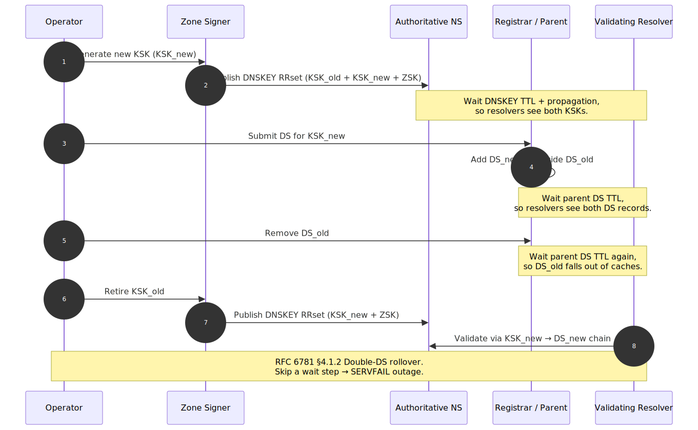
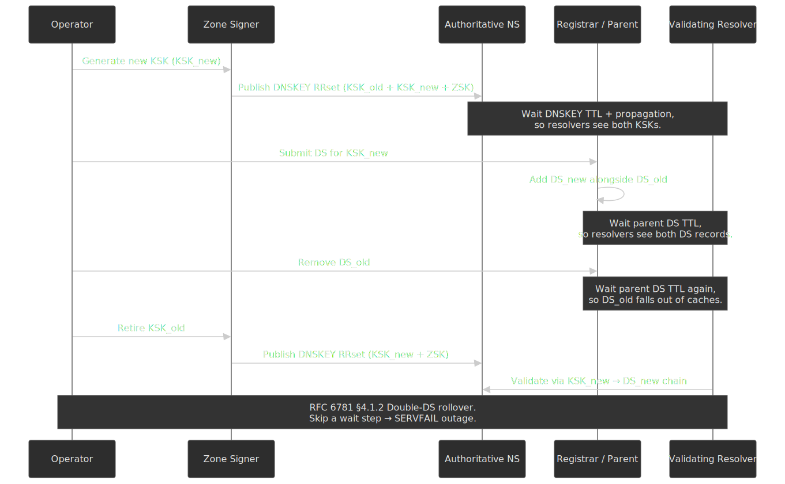

| Failure symptom                          | Cause                                                       | Recovery                                              |
| ---------------------------------------- | ----------------------------------------------------------- | ----------------------------------------------------- |
| `SERVFAIL` immediately after DS swap     | Old DS removed before resolvers cached the new DS           | Restore old DS; wait at least the parent DS TTL      |
| `SERVFAIL` after publishing new keys     | Zone signed with a key not yet in the DNSKEY RRset          | Ensure DNSKEY publication precedes any new RRSIG     |
| Intermittent `SERVFAIL` (EDE 9)          | Some resolver caches still hold the old DNSKEY set          | Wait full DNSKEY TTL; do not roll the zone again     |
| `SERVFAIL` after algorithm change        | Validators that don't implement the new algorithm fail closed | Roll algorithms via [RFC 6781 §4.1.4](https://www.rfc-editor.org/rfc/rfc6781#section-4.1.4) (algorithm rollover) |

> [!CAUTION]
> Never run a KSK rollover and a DS replacement in the same operational window. Wait the parent's DS TTL between every state change. The fastest safe recovery from a botched rollover is usually to restore the previous DS at the registrar and let caches drain.

## Transport-Layer Issues: EDNS0, Cookies, and TCP Fallback

DNSSEC is not the only common SERVFAIL source. The transport layer — EDNS0 buffer-size negotiation, UDP fragmentation, TCP fallback, and DNS Cookies — produces the second-most confusing class of failures because errors usually surface as plain timeouts.

### EDNS0 Buffer Size and DNS Flag Day 2020

EDNS0 ([RFC 6891](https://www.rfc-editor.org/rfc/rfc6891)) lets a stub or resolver advertise the largest UDP response it is willing to accept. In 2020, the DNS community standardized on a default of **1232 bytes** ([DNS Flag Day 2020](https://dnsflagday.net/2020/)), derived from the IPv6 minimum MTU (1280) minus IPv6 + UDP headers. The change closes a long-standing class of UDP-fragmentation attacks and middlebox failures, and shifts large responses (DNSSEC RRSIGs, DNSKEY RRsets, `ANY` queries) onto TCP.

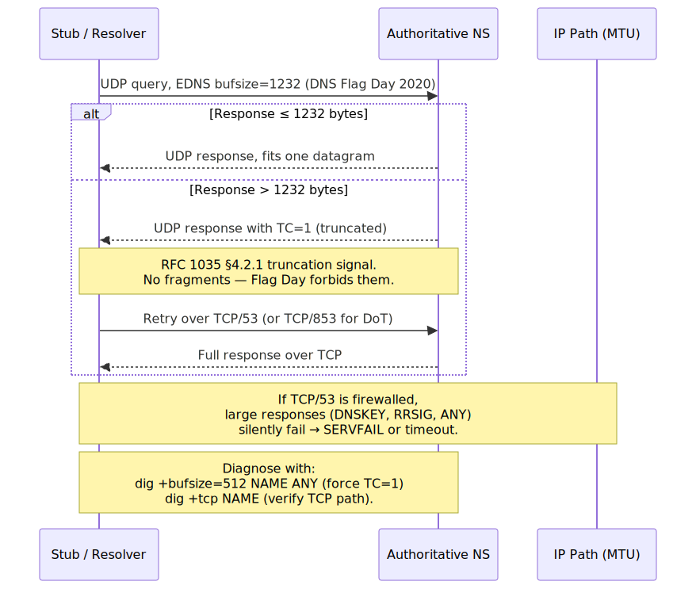
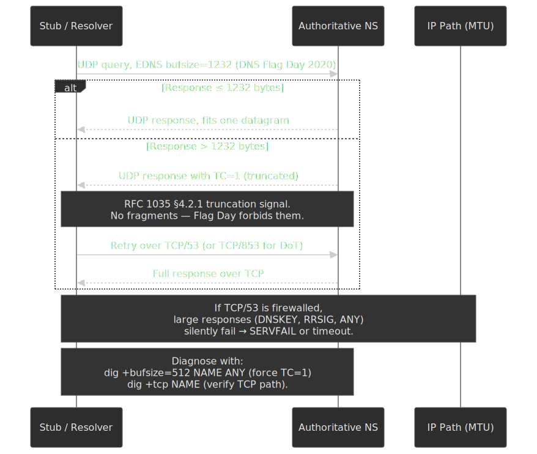

Two failure modes dominate:

1. **TCP/53 (or TCP/853 for DoT) firewalled.** Truncated responses cannot be retried, and large RRsets fail intermittently — usually for DNSSEC-signed zones, the DNSKEY RRset, or `ANY` queries. Symptoms: timeouts only on certain query types; small queries succeed.
2. **Middlebox strips EDNS or rewrites bufsize.** Some legacy CPE devices and load balancers either drop EDNS OPT RRs or claim a bufsize the path cannot carry. Symptoms: `FORMERR`, persistent UDP timeouts despite TCP working.

```bash
dig +bufsize=512 example.com ANY      # Force a TC=1 response on signed zones
dig +tcp example.com DNSKEY           # Verify TCP/53 reachability end-to-end
dig +bufsize=1232 example.com DNSKEY  # The Flag Day default

dig +noedns example.com               # EDNS-stripping middlebox check
```

ISC's [DNS Flag Day 2020 announcement](https://www.isc.org/blogs/dns-flag-day-2020/) and the [APNIC measurement study](https://blog.apnic.net/2020/12/14/measuring-the-impact-of-dns-flag-day-2020/) cover the operational rationale and the long tail of broken networks.

### DNS Cookies and BADCOOKIE

DNS Cookies ([RFC 7873](https://www.rfc-editor.org/rfc/rfc7873), updated by [RFC 9018](https://www.rfc-editor.org/rfc/rfc9018)) provide a lightweight off-path-spoofing defense and a way for servers to soft-rate-limit unknown clients. `dig` sends the COOKIE option by default; the relevant flags:

| Flag           | Effect                                                                              |
| -------------- | ----------------------------------------------------------------------------------- |
| `+cookie`      | Send the COOKIE option (default)                                                    |
| `+nocookie`    | Suppress the COOKIE option — useful when testing legacy resolvers                   |
| `+nobadcookie` | Disable the automatic retry when the server returns RCODE 23 `BADCOOKIE`            |

A `BADCOOKIE` (RCODE 23) from a server you have not previously contacted is **not** an error — it is the server asking the client to retry with the issued server cookie. Resolvers handle this transparently; bare `dig` shows the retry. If you see `BADCOOKIE` *not* followed by a successful retry, suspect a stateful middlebox swallowing the second packet. ISC's [DNS Cookies in BIND 9](https://kb.isc.org/docs/aa-01387) describes the production interaction with Response-Rate Limiting.

### Wireshark and Server-Side Captures

When `dig` cannot reproduce the failure, drop to packet capture. Wireshark's DNS dissector handles plain DNS, EDNS0 OPT records, DoT, and DoQ; the standard capture filters are `port 53` (Do53), `port 853` (DoT), and `port 443` for DoH (with a TLS keylog file to decrypt). On the server side:

```bash
sudo tcpdump -i any -nn -s0 -w dns.pcap '(port 53 or port 853)'
```

Then open `dns.pcap` in Wireshark and use display filters like `dns.flags.rcode != 0`, `dns.qry.name contains "example"`, or `edns0.opt.code == 15` (Extended DNS Errors). Wireshark's [DNS dissector documentation](https://www.wireshark.org/docs/dfref/d/dns.html) lists every available field reference.

### dnstap and Resolver Query Logs

Text-format `query-log` in BIND or `unbound-control` log dumps are I/O-heavy and lose detail. **dnstap** ([dnstap.info](https://dnstap.info/)) — a Frame Streams + protobuf binary format — is supported by BIND, Unbound, Knot Resolver, CoreDNS, and dnsdist. It captures every authoritative or resolver-side message asynchronously, and `dnstap-read -y` decodes a `.tap` file to YAML for grep-friendly inspection.

```bind title="named.conf — BIND dnstap"
options {
    dnstap { all; };
    dnstap-output unix "/var/run/named/dnstap.sock";
};
```

```bash
dnstap-read -y /var/log/named/dnstap.log | less
```

dnstap is the right tool when the question is "what did *this* resolver actually do?" — it shows upstream queries, cache hits, validation outcomes, and EDE codes that never reach the client. Pair it with [`unbound-control dump_cache`](https://nlnetlabs.nl/documentation/unbound/unbound-control/) when you need to inspect a resolver's view of a name without restarting it.

## Cache and Propagation Debugging

### "DNS Propagation" Is Cache Expiry

DNS does not actively push updates. Changes take effect as cached records expire. Four caches matter:

1. **Record TTL** — how long any resolver may cache a successful answer ([RFC 1035 §3.2.1](https://www.rfc-editor.org/rfc/rfc1035#section-3.2.1)).
2. **Negative cache TTL** — how long NXDOMAIN/NODATA persists, bounded by `min(SOA.MINIMUM, SOA TTL)` ([RFC 2308 §5](https://www.rfc-editor.org/rfc/rfc2308#section-5)).
3. **Resolver minimum / maximum TTL** — many resolvers cap both ends. Cloudflare and Google publish their floors and ceilings; assume a 30s floor and a 24h–48h ceiling.
4. **Browser and OS caches** — Chrome, Firefox, and the OS stub all cache independently, with their own (often shorter) TTLs.

**Propagation verification:**

```bash
dig @ns1.example.com example.com A +norecurse

dig @8.8.8.8 example.com +norecurse
# Empty answer → not cached; the next query will fetch fresh.
# Answer with TTL → cached; remaining TTL shows time-to-live.

dig @8.8.8.8 example.com
```

### Flushing Caches

**Public resolver cache flush** (only flushes that resolver, not the internet):

| Resolver   | Method                                                                              |
| ---------- | ----------------------------------------------------------------------------------- |
| Google     | [Google Public DNS cache flush](https://developers.google.com/speed/public-dns/cache) |
| Cloudflare | [Cloudflare 1.1.1.1 purge cache](https://1.1.1.1/purge-cache/)                       |
| OpenDNS    | [OpenDNS cache check / flush](https://cachecheck.opendns.com/)                       |

**Browser cache flush:**

| Browser | Method                                           |
| ------- | ------------------------------------------------ |
| Chrome  | `chrome://net-internals/#dns` → Clear host cache |
| Firefox | `about:networking#dns` → Clear DNS Cache         |
| Edge    | `edge://net-internals/#dns` → Clear host cache   |
| Safari  | Clear via macOS system cache                     |

**Operating system cache flush:**

```bash
sudo dscacheutil -flushcache
sudo killall -HUP mDNSResponder

sudo resolvectl flush-caches

ipconfig /flushdns
```

The systemd-resolved command is documented in [`resolvectl(1)`](https://www.freedesktop.org/software/systemd/man/resolvectl.html); macOS requires both commands because `dscacheutil` only flushes the legacy DirectoryService cache and `mDNSResponder` holds the active stub cache.

### Pre-Migration TTL Strategy

Before changing any record that will be queried during a migration, lower its TTL to the migration window you can tolerate, then **wait for the old TTL to expire** before making the actual change:

```bash
dig example.com +short   # Note the current TTL

# 1. Lower TTL to 300 (or your migration TTL) at the provider
# 2. Wait at least the OLD TTL — if it was 86400, that is 24 hours
# 3. Verify the new TTL is in effect everywhere:
dig @8.8.8.8 example.com   # TTL should be ≤ 300
# 4. Make the actual change
# 5. After verification, restore the higher steady-state TTL
```

> [!WARNING]
> The most common DNS migration mistake is lowering TTL and immediately making the change. Resolvers still hold the old record at the old TTL — the new TTL only applies to the next refresh. Skipping the wait can quadruple your effective propagation time.

## CDN and GeoDNS Pitfalls

### Resolver Location vs Client Location

GeoDNS uses the resolver's IP — not the end-client's IP — to pick a region. When users on the same continent route through a public resolver in another region (or through corporate DNS in a far-away office), routing degrades silently.

**EDNS Client Subnet (ECS).** [RFC 7871](https://www.rfc-editor.org/rfc/rfc7871) lets a resolver forward a truncated client subnet so authoritative GeoDNS can localize the answer:

```bash
dig +subnet=203.0.113.0/24 example.com @8.8.8.8

dig +subnet=203.0.113.0/24 example.com @ns1.example-cdn.net
```

**ECS privacy stance varies:**

- Google Public DNS sends ECS by default ([Google Public DNS — ECS docs](https://developers.google.com/speed/public-dns/docs/ecs)).
- Cloudflare 1.1.1.1 does not send ECS to authoritative servers other than a single Akamai debug zone, by design ([Cloudflare 1.1.1.1 FAQ](https://developers.cloudflare.com/1.1.1.1/faq/)).
- Quad9 and most privacy-focused resolvers strip ECS entirely.

If your CDN relies on ECS for steering and your users go through a privacy resolver, you will see a population concentrate at whichever region is closest to the resolver's anycast PoP.

### Health Check and Failover Delays

CDN and load balancer DNS can serve stale records when:

1. The health check has not yet detected failure.
2. The DNS TTL has not yet expired in downstream caches.
3. A resolver is intentionally serving stale data per [RFC 8767](https://www.rfc-editor.org/rfc/rfc8767) because the authoritative is unreachable.

```bash
dig @authoritative-ns.example.com www.example.com +short
dig @8.8.8.8 www.example.com +short
```

Mitigation:

- Use a low TTL (60–300s) for health-checked records.
- Tighten health-check intervals and failure thresholds.
- Prefer anycast at the IP layer — failover happens in BGP, not DNS — when sub-second cutover matters.

### CNAME Flattening Complications

CNAME at a zone apex is forbidden by [RFC 1034 §3.6.2](https://www.rfc-editor.org/rfc/rfc1034#section-3.6.2): a CNAME at a node may not coexist with the SOA and NS records that the apex requires. Providers work around this with CNAME flattening (Cloudflare) or ALIAS records (Route 53, NS1) — the authoritative server resolves the target itself and serves the resulting A/AAAA at the apex.

**Complications:**

1. **Domain verification fails** — a TXT record at the apex coexists fine, but tooling that walks CNAMEs may give up.
2. **Certificate renewal issues** — ACME `dns-01` challenges target the apex but resolve through the flattened indirection; latency or stale upstream caches break the challenge window.
3. **GeoDNS accuracy** — flattening happens at the authoritative server, so the upstream sees the authoritative's source IP, not the end client's.

```bash
dig example.com CNAME   # No answer when flattened
dig example.com A       # Returns the resolved IP

dig _underlying.example.com CNAME  # Provider-specific debug name, where exposed
```

## Incident Playbook

### Initial Triage Script

A 30-second triage script you can paste into any production shell:

```bash title="dns-triage.sh" collapse={1-3}
#!/bin/bash
DOMAIN=${1:?Usage: $0 domain.com}

echo "=== DNS Triage for $DOMAIN ==="
echo ""

echo "--- Authoritative Nameservers ---"
dig $DOMAIN NS +short
echo ""

echo "--- Direct Query to Each NS ---"
for ns in $(dig $DOMAIN NS +short 2>/dev/null); do
    echo "$ns:"
    dig @$ns $DOMAIN A +norecurse +short 2>/dev/null || echo "  FAILED"
done
echo ""

echo "--- SOA Serial Consistency ---"
for ns in $(dig $DOMAIN NS +short 2>/dev/null); do
    serial=$(dig @$ns $DOMAIN SOA +short 2>/dev/null | awk '{print $3}')
    echo "$ns: $serial"
done
echo ""

echo "--- Public Resolver Comparison ---"
echo "Google 8.8.8.8:     $(dig @8.8.8.8 $DOMAIN A +short 2>/dev/null)"
echo "Cloudflare 1.1.1.1: $(dig @1.1.1.1 $DOMAIN A +short 2>/dev/null)"
echo "Quad9 9.9.9.9:      $(dig @9.9.9.9 $DOMAIN A +short 2>/dev/null)"
echo ""

echo "--- DNSSEC Status ---"
dig $DOMAIN +dnssec +short 2>/dev/null
echo ""
echo "With +cd (validation disabled):"
dig $DOMAIN +cd +short 2>/dev/null
echo ""

echo "--- TTL Check ---"
dig $DOMAIN | grep -E "^$DOMAIN.*IN" | head -1
```

### Escalation Decision Tree

| Finding                     | Escalation Path                                |
| --------------------------- | ---------------------------------------------- |
| All NS unreachable          | Infrastructure team / managed DNS provider     |
| Lame delegation             | DNS administrator (zone not loaded on the NS)  |
| DNSSEC validation failure   | DNSSEC key management team / registrar (DS)    |
| Resolver-specific issue     | Affected ISP / public resolver operator (rare) |
| Inconsistent NS responses   | Zone-transfer / replication owner              |
| Registry delegation missing | Registrar account or domain status (e.g. `clientHold`) |

### Rollback Strategies

**Record change rollback:**

If you lowered TTL before the change, just revert the record — propagation is bounded by the new low TTL. If you did not lower TTL first, revert and either wait for the old TTL or flush major resolver caches (incomplete, but covers most user impact).

**Nameserver change rollback:** NS changes propagate slowly because TLD-served NS RRs typically have 48-hour TTLs. Three options, in increasing impact:

1. **Revert at the registrar** — easiest if no real traffic shifted yet.
2. **Keep new NS, fix the zone there** — usually faster than waiting for NS rollback to propagate.
3. **Run both old and new NS with consistent data** — gives the safest soft-cutover; leaves you free to revert at the registrar later.

**DNSSEC rollback:**

If DNSSEC is breaking resolution and you need traffic restored immediately:

1. **Emergency DS removal at the registrar** — the parent's DNSSEC chain becomes Insecure and resolvers stop validating. Resolution returns within the parent's DS negative TTL (~1 hour for most TLDs).
2. **Wait the DS negative TTL** so any cached DS records expire.
3. **Re-enable DNSSEC** only after the signing pipeline is fixed and verified end-to-end.

### Postmortem Checklist

- [ ] **Timeline.** When did the issue start? When was it detected? When was it resolved?
- [ ] **Symptoms.** What queries failed and from where? Which RCODE/EDE were users seeing?
- [ ] **Root cause.** Which specific misconfiguration, expired key, or replication failure?
- [ ] **Resolution.** Which change fixed it? Was a rollback necessary?
- [ ] **TTL impact.** How long were stale or NXDOMAIN-cached records served beyond the fix?
- [ ] **Detection gap.** Could synthetic monitoring or RUM have caught this earlier?
- [ ] **Prevention.** Which process change (rollover automation, DS-monitoring, signing observability) prevents recurrence?

## Conclusion

DNS troubleshooting is layer isolation discipline. Start with symptoms, verify the authoritative serves the right data, compare resolvers to spot stale or filtered responses, and trace the resolution path to find the failing component. The three high-leverage commands — `dig +norecurse`, `dig +trace`, and `dig +cd` — isolate the authoritative, the chain, and DNSSEC respectively.

`SERVFAIL` in 2026 is overwhelmingly DNSSEC. Always test with `+cd` first, read the EDE INFO-CODE if present, and fall back to `delv +rtrace` plus DNSViz when the chain itself looks broken.

"Propagation" is cache expiry. Lower TTL before a change, wait the **old** TTL, change, verify, restore. Flushing public resolvers shortens your own test loop, not the internet's.

For DNSSEC, almost every outage traces to a key rollover that skipped a wait gate. Use the double-DS pattern from RFC 6781 §4.1.2, never collapse two state changes into one window, and keep an emergency DS-removal runbook at the registrar.

## Appendix

### Prerequisites

- Familiarity with DNS resolution flow ([DNS Resolution Path](../dns-resolution-path/README.md))
- Understanding of DNS record types and TTL ([DNS Records, TTL, and Cache Behavior](../dns-records-ttl-and-caching/README.md))
- DNSSEC, DoH, and DoT mechanics ([DNS Security: DNSSEC, DoH, and DoT](../dns-security-doh-dot-dnssec/README.md))
- Command-line access with `dig` (BIND tools) installed; `delv`, `kdig`, `drill` recommended

### Terminology

| Term                | Definition                                                                |
| ------------------- | ------------------------------------------------------------------------- |
| **RCODE**           | Response Code; 4-bit field in the DNS header indicating query result      |
| **EDE**             | Extended DNS Error (RFC 8914); detailed error information via EDNS option |
| **SERVFAIL**        | Server failure response; catch-all for resolution errors                  |
| **NXDOMAIN**        | Non-Existent Domain; name does not exist                                  |
| **NODATA**          | Name exists but no records of the requested type; NOERROR with empty answer |
| **Lame delegation** | NS records point to a server that does not serve the zone                 |
| **AA flag**         | Authoritative Answer; set when response comes from the zone's nameserver  |
| **AD flag**         | Authenticated Data; set when DNSSEC validation succeeded                  |
| **CD flag**         | Checking Disabled; client requests validation be skipped                  |
| **`+trace`**        | dig flag to perform iterative resolution from root                        |
| **KSK**             | Key Signing Key; signs DNSKEY RRset, referenced by DS at parent           |
| **ZSK**             | Zone Signing Key; signs zone data                                         |
| **ECS**             | EDNS Client Subnet (RFC 7871); resolver-forwarded client subnet for GeoDNS |

### Cheat Sheet

- **`SERVFAIL` + `+cd` succeeds** → DNSSEC validation failure; read EDE, check signatures and DS.
- **`SERVFAIL` + `+cd` fails** → authoritative or network issue; query NS directly with `+norecurse`.
- **Intermittent failures** → compare NS responses, check SOA serial consistency, identify anycast instance with `+nsid`.
- **Slow resolution** → use `+trace +stats` to find the slow hop; check for lame delegation and DNSSEC fetch overhead.
- **Unexpected NXDOMAIN** → verify authoritative servers, then check negative cache (SOA `MINIMUM`).
- **Propagation delay** → verify authoritative has new data, wait for old TTL, flush downstream caches.
- **Key rollover failure** → ensure DS at parent matches active DNSKEY; never remove old DS until new is fully cached; recover by restoring old DS.
- **Large-response timeouts (DNSKEY/`ANY`)** → suspect TCP/53 firewalled or EDNS-stripping middlebox; verify with `dig +tcp` and `dig +bufsize=512 ANY`.
- **Cold-cache zone disappears** → check parent glue with `dig @<TLD-NS> <zone> NS +norecurse` and inspect the ADDITIONAL section.

### References

- [RFC 1034 — Domain Names: Concepts and Facilities](https://www.rfc-editor.org/rfc/rfc1034)
- [RFC 1035 — Domain Names: Implementation and Specification](https://www.rfc-editor.org/rfc/rfc1035)
- [RFC 1912 — Common DNS Operational and Configuration Errors](https://www.rfc-editor.org/rfc/rfc1912)
- [RFC 2308 — Negative Caching of DNS Queries (DNS NCACHE)](https://www.rfc-editor.org/rfc/rfc2308)
- [RFC 4033/4034/4035 — DNSSEC Introduction, Records, and Protocol](https://www.rfc-editor.org/rfc/rfc4035)
- [RFC 5001 — DNS Name Server Identifier (NSID) Option](https://www.rfc-editor.org/rfc/rfc5001)
- [RFC 6781 — DNSSEC Operational Practices, Version 2](https://www.rfc-editor.org/rfc/rfc6781)
- [RFC 6891 — Extension Mechanisms for DNS (EDNS(0))](https://www.rfc-editor.org/rfc/rfc6891)
- [RFC 7858 — DNS over TLS](https://www.rfc-editor.org/rfc/rfc7858)
- [RFC 7871 — Client Subnet in DNS Queries](https://www.rfc-editor.org/rfc/rfc7871)
- [RFC 7873 — DNS Cookies](https://www.rfc-editor.org/rfc/rfc7873)
- [RFC 8484 — DNS over HTTPS](https://www.rfc-editor.org/rfc/rfc8484)
- [RFC 8767 — Serving Stale Data to Improve DNS Resiliency](https://www.rfc-editor.org/rfc/rfc8767)
- [RFC 8914 — Extended DNS Errors](https://www.rfc-editor.org/rfc/rfc8914)
- [RFC 9018 — Interoperable DNS Server Cookies](https://www.rfc-editor.org/rfc/rfc9018)
- [RFC 9250 — DNS over Dedicated QUIC Connections](https://www.rfc-editor.org/rfc/rfc9250)
- [RFC 9520 — Negative Caching of DNS Resolution Failures](https://www.rfc-editor.org/rfc/rfc9520)
- [IANA DNS Parameters Registry](https://www.iana.org/assignments/dns-parameters/dns-parameters.xhtml)
- [IANA DNS Security Algorithm Numbers](https://www.iana.org/assignments/dns-sec-alg-numbers/dns-sec-alg-numbers.xhtml)
- [BIND 9 Administrator Reference Manual](https://bind9.readthedocs.io/) — `dig`, `delv`, resolver configuration
- [Knot DNS — kdig manpage](https://www.knot-dns.cz/docs/latest/html/man_kdig.html)
- [NLnet Labs — ldns / drill](https://nlnetlabs.nl/projects/ldns/about/) and [`drill(1)`](https://linux.die.net/man/1/drill)
- [DNSViz](https://dnsviz.net/) — DNSSEC chain visualization
- [Verisign DNSSEC Debugger](https://dnssec-debugger.verisignlabs.com/) — alternative chain analyzer
- [DNS Flag Day 2020](https://dnsflagday.net/2020/) — EDNS bufsize 1232 and the end of UDP fragmentation
- [ISC — DNS Flag Day 2020](https://www.isc.org/blogs/dns-flag-day-2020/) — operator guidance
- [ISC — DNS Cookies in BIND 9](https://kb.isc.org/docs/aa-01387) — RFC 7873 in production
- [dnstap.info](https://dnstap.info/) — high-rate structured DNS logging
- [Wireshark DNS dissector reference](https://www.wireshark.org/docs/dfref/d/dns.html) — display-filter fields
- [Cloudflare — Unwrap the SERVFAIL](https://blog.cloudflare.com/unwrap-the-servfail/) — Extended DNS Errors in production
- [Cloudflare 1.1.1.1 FAQ](https://developers.cloudflare.com/1.1.1.1/faq/) — privacy stance and ECS handling
- [Google Public DNS — EDNS Client Subnet](https://developers.google.com/speed/public-dns/docs/ecs)
- [Julia Evans — How to use dig](https://jvns.ca/blog/2021/12/04/how-to-use-dig/) — practical dig usage guide
