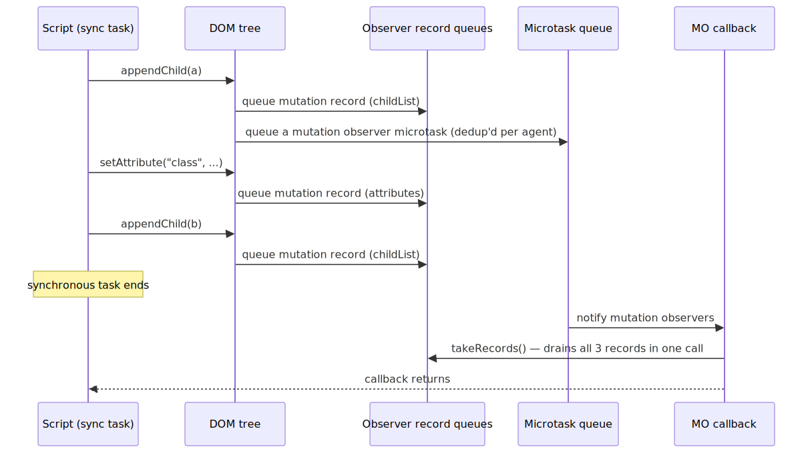
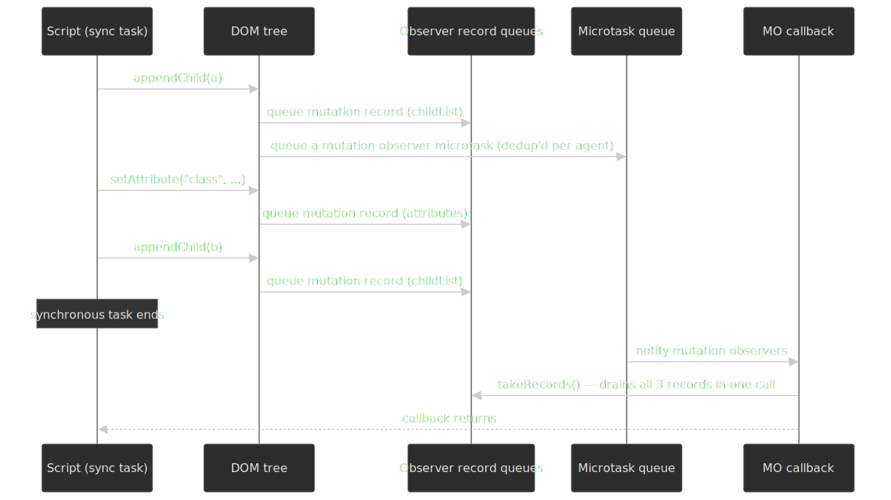

# DOM API Essentials: Structure, Events, Observers, Cancellation

The DOM is one large API surface arranged around a small set of design choices: a layered interface hierarchy that separates universal element operations from markup-specific ones; two collection types whose liveness rules decide whether your iteration is correct; a quiet split of mutation methods between the `ParentNode` and `ChildNode` mixins; an event model whose three-phase dispatch and shadow-boundary retargeting are spec-defined, not implementation detail; observer APIs whose delivery timing is part of the spec; and an `AbortSignal` primitive that is now the standard way to cancel everything from a `fetch` to an `addEventListener`. This article is the mental model and reference for those layers, written for senior engineers who want to know **why** the surface looks the way it does, not just which method to call.

The normative source is the [WHATWG DOM Living Standard](https://dom.spec.whatwg.org/), with HTML-element specifics in the [WHATWG HTML Living Standard](https://html.spec.whatwg.org/multipage/dom.html#htmlelement). Everything below traces back to those two specs unless noted.




## Mental model in seven rules

- **`Element` is the markup-neutral base.** `querySelector`, `getAttribute`, and `classList` live on `Element` so they work for HTML, SVG, and MathML alike. Markup-specific behavior (text content semantics, editability, accessibility hooks) lives on `HTMLElement`.
- **A small set of HTML-ish properties are shared with SVG.** `dataset`, `tabIndex`, `autofocus`, `nonce`, `focus()`, and `blur()` come from the `HTMLOrSVGElement` interface mixin, not from `HTMLElement` — they are valid on both `<div>` and `<svg>`.[^hosmixin]
- **Collections are live by default.** The DOM Standard states that "a collection can be either live or static. Unless otherwise stated, a collection must be live."[^domcoll] Only `querySelectorAll` (and `StaticRange`) opt out.
- **Mutation methods come in two flavors.** Old DOM-1 methods (`appendChild`, `removeChild`, `insertBefore`) operate from the parent's perspective. Modern methods on the `ParentNode` and `ChildNode` mixins (`append`, `prepend`, `replaceChildren`, `before`, `after`, `replaceWith`, `remove`) accept variadic `Node | string` arguments and are how you should be writing new code.
- **Every event has three phases — but the target sees both.** Dispatch is a fixed sequence of capture (root → target), target, then bubble (target → root). The "capture" / "bubble" choice for a listener decides which traversal it sees; listeners on the actual target run regardless of that flag.[^dispatchspec]
- **Observers do not run synchronously.** `MutationObserver` is a microtask; `ResizeObserver` runs in a defined slot between layout and paint; `IntersectionObserver` and `PerformanceObserver` are driven by the rendering steps. Each timing slot has consequences for what you can safely do inside the callback.
- **`AbortSignal` is the unified cancellation primitive.** `addEventListener`, `fetch`, `ReadableStream`, `setTimeout` (where supported), `WebSocketStream`, and any well-designed async API now accept a `signal`. One `controller.abort()` tears down everything attached to that signal — and `AbortSignal.any([…])` lets you compose them.[^anymdn]

## The interface hierarchy

Each interface is a thin layer that adds capabilities to its ancestor. Cross-markup compatibility is the reason `Element` and `HTMLElement` exist as separate types: an SVG `<circle>` is a perfectly real `Element` but is **not** an `HTMLElement`.

 shared between HTMLElement and SVGElement; that is why dataset and tabIndex work on both.")


### What each layer adds

- **[`EventTarget`](https://dom.spec.whatwg.org/#interface-eventtarget)** — `addEventListener`, `removeEventListener`, `dispatchEvent`. Anything that can receive events is one, including `Window`, `XMLHttpRequest`, `AbortSignal`, message ports, and offscreen workers — not just elements. The interface even has a public constructor (`new EventTarget()`), which makes it a useful building block for in-process pub/sub.
- **[`Node`](https://dom.spec.whatwg.org/#interface-node)** — tree participation: `parentNode`, `childNodes`, `firstChild`, `lastChild`, `appendChild`, `removeChild`, `insertBefore`, `nodeType`, `nodeName`, `cloneNode`. Text nodes, comments, document fragments, and the document itself are all `Node`s.
- **[`Element`](https://dom.spec.whatwg.org/#interface-element)** — the cross-markup element surface: `getAttribute`/`setAttribute`, `classList`, `id`, `tagName`, namespace-aware variants (`getAttributeNS`), CSS selectors (`querySelector`, `querySelectorAll`, `matches`, `closest`), and box geometry (`getBoundingClientRect`, `getClientRects`, scroll APIs). All work on HTML, SVG, and MathML elements.
- **[`HTMLElement`](https://html.spec.whatwg.org/multipage/dom.html#htmlelement)** — HTML-specific semantics: `innerText`, `outerText`, `contentEditable`, `isContentEditable`, `accessKey`, `lang`, `dir`, `translate`, `hidden`, `inputMode`, `enterKeyHint`, `popover`, the inline-style `style` setter, the `click()` activation behavior, and (on supporting browsers) `editContext` for custom editable surfaces.[^editcontext]
- **[`SVGElement`](https://www.w3.org/TR/SVG2/types.html#InterfaceSVGElement)** — SVG-specific surface: `ownerSVGElement`, `viewportElement`, and SVG-specific style and class plumbing.
- **[`HTMLOrSVGElement`](https://html.spec.whatwg.org/multipage/dom.html#htmlorsvgelement)** — a Web IDL **interface mixin** (not a class) shared by `HTMLElement` and `SVGElement`. It contributes `dataset`, `nonce`, `autofocus`, `tabIndex`, `focus()`, and `blur()`. This is the reason you can write `circle.dataset.userId` on an SVG element.[^hosmixin]

### Why the split matters in practice

Typing a utility as `Element` instead of `HTMLElement` is the difference between "works on icons too" and "throws on the SVG sprite":

```typescript title="utilities.ts"
function setActive(el: Element, active: boolean): void {
  el.classList.toggle("active", active)
  el.setAttribute("aria-selected", String(active))
}

function setLabel(el: HTMLElement, text: string): void {
  el.innerText = text
}

const tab: Element = document.querySelector('[role="tab"]')!
const icon: Element = document.querySelector("svg.icon")!

setActive(tab, true)
setActive(icon, true)
```

`innerText` is HTML-only, so `setLabel` correctly demands `HTMLElement`. TypeScript's lib types reflect the spec — and the `instanceof` check is also a real runtime narrowing, not just a typing trick.

> [!NOTE]
> The historical "`dataset` is HTML-only" line is wrong. `dataset` and `tabIndex` are on `HTMLOrSVGElement` and have been since the mixin was introduced; both work on SVG. `contentEditable`, `innerText`, `accessKey`, `lang`, `dir`, `translate`, `hidden`, and `inputMode` are the genuinely HTML-only members.[^hosmixin]

## Selection and collection liveness

Five DOM methods give you a collection. They differ along two axes — **type** (`HTMLCollection` vs `NodeList`) and **liveness** (live vs static) — and the combination decides what loop patterns are safe.


### The matrix

| Method                                | Return type                                                                            | Live?      | Includes non-element nodes? |
| ------------------------------------- | -------------------------------------------------------------------------------------- | ---------- | --------------------------- |
| `querySelectorAll(selectors)`         | [`NodeList`](https://dom.spec.whatwg.org/#interface-nodelist)                          | **static** | no                          |
| `getElementsByClassName(classNames)`  | [`HTMLCollection`](https://dom.spec.whatwg.org/#interface-htmlcollection)              | live       | no                          |
| `getElementsByTagName(qualifiedName)` | `HTMLCollection`                                                                       | live       | no                          |
| `getElementsByName(name)`             | `NodeList`                                                                             | **live**   | no                          |
| `children`                            | `HTMLCollection`                                                                       | live       | no                          |
| `childNodes`                          | `NodeList`                                                                             | live       | yes (text, comment)         |

`querySelectorAll` is the odd one out: the spec defines it as returning the **static result** of running scope-match against the selectors string, and that snapshot is captured once.[^qsastatic] Everything else either explicitly returns a live `HTMLCollection` or — in the cases of `childNodes` and the spec quirk that is `getElementsByName` — a **live `NodeList`**.[^genlive]

### The for-i mutation footgun

Live collections re-evaluate as the DOM mutates. A naive `for (let i = 0; i < items.length; i++)` that removes the matched class from each element will skip every other one because the collection shrinks under the iterator:

```typescript
const items = document.getElementsByClassName("item")

for (let i = 0; i < items.length; i++) {
  items[i].classList.remove("item")
}

for (const item of [...document.getElementsByClassName("item")]) {
  item.classList.remove("item")
}
```

The same trap appears with `for...of` on a live collection if the body adds or removes matching elements. The fix is to materialize a snapshot first — `Array.from(...)`, the spread operator, or just call `querySelectorAll` instead.

### `NodeList` versus `HTMLCollection` capabilities

- `NodeList` has a native `forEach`. `HTMLCollection` does not.
- `HTMLCollection` has `namedItem(name)`, which returns the first element whose `id` or `name` matches. `NodeList` has only `item(index)` and indexed access.
- Both are iterable with `for...of`, both support indexed access, and neither is an `Array` — `map`, `filter`, `reduce`, and the rest live on `Array.prototype`. Spread or `Array.from` to use them.
- Never use `for...in` on either — you will enumerate `length` and `item` along with the indices.

> [!TIP]
> Default to `querySelectorAll` for one-shot processing and `getElementsByClassName`/`children` only when you actually want a live view. The live collections amortize their cost over many mutations, but the overhead of maintaining them is real and the mental model they impose on code is heavier than the snapshot.

### `getElementById` vs `querySelector('#id')`

Both work; their cost models differ. Every `Document` maintains an internal map from `id` attribute values to elements, kept in sync as the tree mutates — `getElementById` is a hash lookup against that map and is the spec-defined fast path for "find the element with this id".[^getbyid] `querySelector` walks a parsed selector against the scope's tree using the standard scope-match algorithm; in modern engines, simple `#id` selectors are pattern-matched into the same id-map lookup, but anything more complex (`'#id .child'`, `'main #id'`) drops out of that fast path and traverses normally.[^selectorperf]

Practically: prefer `getElementById` when you actually have an `id` and you want the cheapest possible lookup; reach for `querySelector` when the predicate is anything richer than "this exact id". The difference is usually invisible at single-call scale but compounds inside hot loops or framework reconciliation paths that resolve thousands of nodes per render.

## Traversal and structural mutation

The DOM gives you four traversal surfaces. They overlap in capability but differ in what they include and how programmable they are.

### Sibling and parent navigation

Every `Node` exposes `parentNode`, `firstChild`, `lastChild`, `previousSibling`, and `nextSibling`. Every `Node` that participates as an element also exposes the **element-only** variants on the [`NonDocumentTypeChildNode`](https://dom.spec.whatwg.org/#interface-nondocumenttypechildnode) mixin: `previousElementSibling` and `nextElementSibling`. The element variants skip text nodes and comments — you almost always want them when walking siblings.

`parentNode` returns a `Node`; `parentElement` returns an `Element` or `null` (the document itself has no parent element). `closest(selectors)` walks up the ancestor chain (including the starting element) and returns the first ancestor that matches a CSS selector — the right tool for "find the enclosing form" or "find the nearest section".

### `ParentNode` and `ChildNode` mixins

Two interface mixins define the modern manipulation surface:

- **[`ParentNode`](https://dom.spec.whatwg.org/#interface-parentnode)** is implemented by `Document`, `DocumentFragment`, and `Element`. It contributes `children`, `firstElementChild`, `lastElementChild`, `childElementCount`, `querySelector`, `querySelectorAll`, and the variadic mutation methods `append(...nodes)`, `prepend(...nodes)`, `replaceChildren(...nodes)`, and (newer) `moveBefore(node, child)`.
- **[`ChildNode`](https://dom.spec.whatwg.org/#interface-childnode)** is implemented by `Element`, `CharacterData` (text/comment), and `DocumentType`. It contributes `before(...nodes)`, `after(...nodes)`, `replaceWith(...nodes)`, and `remove()`.

All variadic methods accept `(Node | string)...`. Strings become `Text` nodes automatically, which removes a whole class of `document.createTextNode` boilerplate. They also accept zero arguments — `replaceChildren()` with no arguments empties the parent, and `remove()` is the modern replacement for `parent.removeChild(child)` from `child`'s perspective.

```typescript
list.append(item, " · ", footer)
list.replaceChildren()
list.replaceChildren(...newItems)

stale.remove()
stale.replaceWith(replacement)
target.before("Section: ", heading)
```

Compared to the DOM-1 methods these are not just shorter; they are also unambiguous. `parent.appendChild(node)` returns the appended node and throws if `node` is not a `Node`. `parent.append(node, " ", other)` returns `undefined` and accepts any number of nodes and strings. The asymmetric return type is one of the small reasons DOM-1 code reads strangely today.

### Fragments, ranges, and selections

For larger structural moves and editor-style operations, four interfaces become relevant:

- **[`DocumentFragment`](https://dom.spec.whatwg.org/#interface-documentfragment)** is a parent-less container. Append a fragment to a real parent and the spec moves the fragment's children to the parent and **empties** the fragment in one tree-mutating step.[^docfrag] That coalesces what would otherwise be N separate insertions into one mutation observation and one layout invalidation.
- **[`Range`](https://dom.spec.whatwg.org/#interface-range)** is a live boundary pair `(startContainer, startOffset)` to `(endContainer, endOffset)`. The spec calls these "live ranges" because tree mutations move the boundary points as the underlying content shifts. `range.deleteContents()`, `range.extractContents()` (returns a `DocumentFragment`), and `range.insertNode(node)` let you operate on arbitrary slices of a tree, including across element boundaries.
- **[`StaticRange`](https://dom.spec.whatwg.org/#interface-staticrange)** is the snapshot equivalent: cheaper because it does not maintain itself across mutations. Used by `InputEvent.getTargetRanges()` and similar APIs that just need to describe a region without owning it.
- **[`Selection`](https://w3c.github.io/selection-api/#selection-interface)** is the user-visible selection — the highlighted text in a document. It is a single live range per document (multi-range selections were spec'd but never implemented in WebKit/Blink). `window.getSelection()` returns it; `selection.getRangeAt(0)` lifts it into a `Range` you can manipulate.

> [!TIP]
> Reach for `replaceChildren(...batch)` first; reach for `DocumentFragment` only when you need to build the subtree elsewhere (e.g., a `<template>` clone or an off-thread parsed document) before attaching it. Both produce a single mutation; the fragment is just the bring-your-own-container variant.

### CSS Custom Highlight API: ranges without DOM mutation

Until 2025 the only way to render a "highlight" in the document was either to wrap the highlighted text in a `<span>` (mutating the DOM, which can disturb live ranges, observers, and editor state) or to lean on the user-controlled `Selection`. The [CSS Custom Highlight API](https://drafts.csswg.org/css-highlight-api-1/) is the third option: register `Range`s in the document's `Highlight` registry and style them via the `::highlight()` pseudo-element, with **no DOM mutation at all**.[^cssch]

```typescript title="highlight-search-results.ts"
function highlightMatches(article: HTMLElement, query: string) {
  CSS.highlights.delete("search-results")
  if (!query) return

  const walker = document.createTreeWalker(article, NodeFilter.SHOW_TEXT)
  const ranges: Range[] = []
  for (let node = walker.nextNode(); node; node = walker.nextNode()) {
    const text = node.nodeValue ?? ""
    const lower = text.toLowerCase()
    let from = 0
    for (let i; (i = lower.indexOf(query.toLowerCase(), from)) !== -1; ) {
      const r = new Range()
      r.setStart(node, i)
      r.setEnd(node, i + query.length)
      ranges.push(r)
      from = i + query.length
    }
  }
  CSS.highlights.set("search-results", new Highlight(...ranges))
}
```

```css
::highlight(search-results) { background: #ff0; color: #000; }
```

Compared to `Selection`, `::highlight()` lets you maintain **multiple independent highlight layers** (search results, spelling errors, collaborator cursors), it does not steal user focus from the actual selection, and it leaves the DOM unchanged — which means `MutationObserver`, `IntersectionObserver` sentinels, and live `Range`s outside the registry are not perturbed. Use the API when the highlight is decorative or informational; reach for `Selection` only when you are actually setting the user's selection.

### `TreeWalker` and `NodeIterator`

CSS selectors only see elements. When you need to visit text nodes, comments, processing instructions, or to express a programmatic filter that no selector can capture, the DOM gives you the [traversal API](https://dom.spec.whatwg.org/#traversal):

```typescript
const walker = document.createTreeWalker(
  article,
  NodeFilter.SHOW_TEXT,
  {
    acceptNode(node) {
      return /\d{4}-\d{2}-\d{2}/.test(node.nodeValue ?? "")
        ? NodeFilter.FILTER_ACCEPT
        : NodeFilter.FILTER_REJECT
    },
  },
)

for (let n = walker.nextNode(); n !== null; n = walker.nextNode()) {
  highlightDate(n)
}
```

Two callable types live here:

- **`NodeIterator`** is a flat, in-order cursor with `nextNode()` / `previousNode()`.
- **`TreeWalker`** maintains a `currentNode` and exposes hierarchical navigation (`parentNode`, `firstChild`, `nextSibling`, …) so you can walk by structure instead of in linear order.

`NodeFilter.SHOW_*` is a bitmask (`SHOW_ELEMENT`, `SHOW_TEXT`, `SHOW_COMMENT`, `SHOW_ALL`, …) that pre-filters by node type before the `acceptNode` callback runs. `acceptNode` returns `FILTER_ACCEPT`, `FILTER_SKIP` (skip this node, descend into its children), or `FILTER_REJECT` (skip this node and its subtree). For `NodeIterator`, `FILTER_REJECT` is treated identically to `FILTER_SKIP` — there is no concept of "subtree" in a flat iterator.[^treewalker]

> [!NOTE]
> Use `querySelectorAll` whenever a CSS selector covers your filter. Reach for `TreeWalker`/`NodeIterator` when you need text/comment nodes, when the filter is too dynamic to express in CSS, or when pruning whole subtrees with `FILTER_REJECT` is materially cheaper than walking them.

## Events: dispatch, composition, cancellation

Every `Event` traverses the tree in three spec-defined phases and every `addEventListener` chooses which phase it sees. The dispatch algorithm in DOM §2.9 is what makes the model predictable across HTML, SVG, custom elements, and shadow DOM.[^dispatchspec]

 returns the full path only for events whose composed flag is true.")


### Capture, target, bubble

`event.eventPhase` reports `CAPTURING_PHASE`, `AT_TARGET`, or `BUBBLING_PHASE` while a listener runs. The third argument to `addEventListener` chooses which traversal a listener participates in — `true` (or `{ capture: true }`) for capture, default `false` for bubble. **The target itself fires both kinds**, in the order they were added.[^addeventlistener] `stopPropagation()` halts the rest of the path; `stopImmediatePropagation()` also skips remaining listeners on the current target.

A handful of events are **non-bubbling by default**: `focus`, `blur`, `mouseenter`, `mouseleave`, `loadstart`, `progress`, `scroll` (on most elements), and the media-element events. Use the bubbling counterparts (`focusin`/`focusout`, `mouseover`/`mouseout`) or capture-phase listeners on an ancestor when you need delegation.

### Listener options that change behavior

`addEventListener(type, listener, options)` takes an options dictionary that controls more than capture vs bubble:

| Option       | Effect                                                                                                  |
| ------------ | ------------------------------------------------------------------------------------------------------- |
| `capture`    | Run during the capture phase (default `false`).                                                         |
| `once`       | Auto-remove the listener after the first invocation. Cheaper than a manual `removeEventListener` dance. |
| `passive`    | Promise not to call `preventDefault()`; lets the browser keep scrolling on the compositor thread.       |
| `signal`     | An `AbortSignal`; calling `controller.abort()` removes the listener.[^addeventlistener]                  |

Two of these are quietly load-bearing for performance and lifetime management:

- **`passive: true`** is the difference between butter-smooth and janky scrolling. Chromium and WebKit treat `wheel`, `touchstart`, and `touchmove` listeners on `Window`, `Document`, and `<body>` as passive by default — the spec calls these the **passive default targets**.[^passivedefault] If you genuinely need to call `preventDefault()` on these, set `passive: false` explicitly.
- **`signal`** is the modern way to clean up listeners. One controller can tear down dozens of subscriptions, including `MutationObserver`s and `fetch`es, with a single `abort()`.

### `EventInit`, `CustomEvent`, and `EventTarget` as a base class

`Event` is constructible: `new Event(type, { bubbles, cancelable, composed })`. The `composed` flag controls whether the event crosses shadow boundaries. For carrying a payload, use `CustomEvent`:

```typescript
class Cart extends EventTarget {
  add(item: Item) {
    this.#items.push(item)
    this.dispatchEvent(new CustomEvent<Item>("itemadded", {
      detail: item,
      bubbles: false,
    }))
  }
  #items: Item[] = []
}

const cart = new Cart()
cart.addEventListener("itemadded", (e: CustomEventMap["itemadded"]) => {
  console.log(e.detail.sku)
})
```

`EventTarget`'s public constructor makes it the right base for any in-process pub/sub bus — you get capture/bubble (vacuously), `once`, `signal`, and the rest of the listener machinery without inventing your own. Don't import an event-emitter library when the platform ships one.

### Shadow DOM and event retargeting

When an event is dispatched inside an open shadow tree, the algorithm composes a path that crosses the boundary. As the event propagates **outside** the shadow root, `event.target` is **retargeted** to the shadow host so that consumers of the host element never see internal nodes they were not given access to. Inside the shadow tree, `event.target` still points at the real target. `event.composedPath()` returns the full crossing path **only** if the event's `composed` flag is true (UI events like `click`, `keydown`, `input` are composed; many synthetic events default to `composed: false`).[^composedpath]

```typescript
host.addEventListener("click", (e) => {
  console.log(e.target)         // the host (retargeted)
  console.log(e.composedPath()) // [button, …shadowRoot, host, body, html, document, window]
})
```

`{ mode: "closed" }` shadow roots elide their internals from `composedPath()` entirely — the path stops at the host. This is a privacy boundary, not a security boundary; treat it accordingly.

### Cancellation as a first-class primitive

`AbortController` and `AbortSignal` (DOM §3) are the unified cancellation primitive across the web platform.[^abortcontroller] Beyond `fetch`, every modern API that takes time accepts a `signal` — `addEventListener`, `EventSource`, `ReadableStream.pipeTo`, `WritableStream.close`, `WebSocketStream`, the streams `cancel()` family, and many newer APIs (`scheduler.postTask`, `Web Locks`, the View Transitions API). Two static helpers make composition cheap:

- **`AbortSignal.timeout(ms)`** returns a signal that aborts with a `TimeoutError` `DOMException` after `ms` milliseconds.
- **`AbortSignal.any([sig1, sig2, …])`** returns a signal that aborts when any input aborts; the resulting `signal.reason` is the first input's reason.[^anymdn]




The pattern that replaces nearly every "manual cleanup" idiom you used to write:

```typescript title="component-lifecycle.ts"
function mount(host: HTMLElement) {
  const controller = new AbortController()
  const { signal } = controller

  host.addEventListener("click", onClick, { signal })
  window.addEventListener("resize", onResize, { signal, passive: true })

  const observer = new MutationObserver(onMutate)
  observer.observe(host, { childList: true, subtree: true })
  signal.addEventListener("abort", () => observer.disconnect(), { once: true })

  fetch("/state", { signal }).then(applyState).catch(reportIfNotAbort)

  return () => controller.abort()
}
```

One `controller.abort()` removes both listeners, disconnects the `MutationObserver`, and cancels the in-flight `fetch`. This is now the canonical lifecycle pattern — for components, for routes, for anything with a teardown.

> [!IMPORTANT]
> Authoring an async API today? Take a `{ signal }` parameter. Call `signal.throwIfAborted()` early, and attach an `'abort'` listener with `{ once: true }` so the listener is collectable after firing. The MDN [implementing an abortable API](https://developer.mozilla.org/en-US/docs/Web/API/AbortSignal#implementing_an_abortable_api) recipe is the template.

## Observer APIs

Four observers cover most of the DOM change surface: **`MutationObserver`** for tree changes, **`ResizeObserver`** for box-size changes, **`IntersectionObserver`** for visibility against a root rectangle, and **`PerformanceObserver`** for entries on the performance timeline. They share a tiny shape — `new Observer(callback); observer.observe(target, options); observer.unobserve(target); observer.disconnect()` — but each is timed differently, and the timing is the part of the spec you have to internalize.


### Cleanup is your responsibility

None of the observer constructors take a `signal` directly. Wire them into the `AbortSignal` lifecycle by attaching a one-shot listener:

```typescript
function watch(host: Element, signal: AbortSignal) {
  const mo = new MutationObserver(handle)
  const ro = new ResizeObserver(handle)
  const io = new IntersectionObserver(handle, { threshold: [0, 1] })

  mo.observe(host, { childList: true, subtree: true })
  ro.observe(host)
  io.observe(host)

  signal.addEventListener("abort", () => {
    mo.disconnect()
    ro.disconnect()
    io.disconnect()
  }, { once: true })
}
```

Forgetting `disconnect()` is one of the most common leaks in long-lived SPAs: each observer keeps strong references to its targets and to the closure of its callback.

### `MutationObserver` — microtask-timed

The DOM Standard schedules MutationObserver delivery via "queue a mutation observer microtask", which sets a per-agent flag, queues a microtask to "notify mutation observers", and clears the flag when the microtask runs.[^moqueue] All mutations from a synchronous task therefore arrive in **one** callback invocation, scheduled on the microtask queue alongside resolved promises.




Practical consequences:

- **Batching is automatic and inescapable.** You cannot get a synchronous notification per mutation. If you need the synchronous behavior of the deprecated `MutationEvent` API, the answer is "you do not".[^mutevents]
- **Microtask, not task.** Because delivery happens in the microtask checkpoint at the end of the current synchronous task, your callback runs before any subsequent rendering and before the next event loop task. Heavy work in the callback delays paint just like heavy work in a `Promise.then`.
- **Records survive disconnection.** `observer.takeRecords()` drains anything still queued when you `disconnect()`, useful when you want to flush before tearing down.

The options object must specify at least one of `childList`, `attributes`, `characterData`. Add `subtree: true` to watch the entire descendant tree, `attributeFilter: ["class", "data-state"]` to limit attribute watching, and `attributeOldValue` / `characterDataOldValue` to capture the prior value:

```typescript title="watch-validation-state.ts"
function watchInvalid(form: HTMLFormElement, signal: AbortSignal) {
  const observer = new MutationObserver((records) => {
    for (const r of records) {
      if (r.type !== "attributes") continue
      const field = r.target as HTMLElement
      const errorId = field.getAttribute("aria-describedby")
      const errorEl = errorId ? document.getElementById(errorId) : null
      if (errorEl) {
        errorEl.hidden = field.getAttribute("aria-invalid") !== "true"
      }
    }
  })

  for (const field of form.querySelectorAll("input, textarea, select")) {
    observer.observe(field, {
      attributes: true,
      attributeFilter: ["aria-invalid"],
      attributeOldValue: true,
    })
  }

  signal.addEventListener("abort", () => observer.disconnect(), { once: true })
}
```

### `ResizeObserver` — between layout and paint

The [Resize Observer specification](https://www.w3.org/TR/resize-observer/) defines a deterministic slot in the rendering steps: after layout is up to date, the user agent gathers active observations, broadcasts them to your callback, and only then proceeds to paint.[^rospec] If your callback dirties layout for an element deeper in the tree than the deepest one whose observation it just delivered, the loop runs again at the new depth. If something stays dirty after the loop terminates, the user agent fires an `ErrorEvent` on `Window` with the message **"ResizeObserver loop completed with undelivered notifications"** and defers the leftovers to the next opportunity.[^roloop]




This timing is what makes ResizeObserver safe for layout-modifying callbacks: the changes you make invalidate layout but the user agent has not yet painted, so they coalesce into the same paint instead of triggering an extra one. It also explains the cardinal rule:

> [!CAUTION]
> Modifying the observed element's box from inside its own callback risks the loop error. Either modify a child whose layout depth is greater (the loop will pick it up at the next depth), or defer the change with `requestAnimationFrame` so it happens in the next frame instead of inside this one.

Other edge cases worth knowing:

- **Three box options.** `box: "content-box"` (the default), `"border-box"`, or `"device-pixel-content-box"`. Read the corresponding entry array — `entry.contentBoxSize`, `entry.borderBoxSize`, or `entry.devicePixelContentBoxSize` — instead of the legacy `entry.contentRect`, which only describes content-box CSS pixels.
- **`inlineSize` and `blockSize`.** The size entries are writing-mode aware; `inlineSize` is width in horizontal writing modes and height in vertical ones.
- **CSS transforms do not fire.** Transforms move pixels, not boxes — the spec explicitly excludes them.[^rotransform]
- **Non-replaced inline elements report zero.** They have no box of their own; observe a containing block-level element instead.
- **Insertion and removal fire.** A first observation arrives once after `observe()` if the element has any box; setting `display: none` reports zero dimensions in a fresh entry.

### `IntersectionObserver` — driven by the rendering steps

`IntersectionObserver` watches whether a target is visible against a **root** (the viewport by default) inflated or shrunk by **`rootMargin`**, and fires when the visible ratio crosses any of the configured **`threshold`** values. The detailed mechanics (root, rootMargin, threshold semantics, sentinel patterns, batching, and when to prefer scroll listeners) are covered in the dedicated [Intersection Observer API](../intersection-observer/README.md) article. The two cross-cutting facts worth keeping in this article:

- **Cross-origin privacy.** When the target is in a cross-origin-domain document, `entry.rootBounds` is `null` and any `rootMargin` or `scrollMargin` offsets are ignored. The W3C spec says this prevents a cross-origin frame from "probing for global viewport geometry information that could deduce user hardware configuration".[^iocrossorigin]
- **Asynchronous batched delivery.** Like the other observers, `IntersectionObserver` callbacks are batched and delivered as part of the rendering steps, so a single callback can carry intersection changes for many targets.

### `PerformanceObserver` — the timeline subscription

`PerformanceObserver` subscribes to the [Performance Timeline](https://w3c.github.io/performance-timeline/) and is how you observe Core Web Vitals (`largest-contentful-paint`, `layout-shift`, `event` and `first-input` for INP), long animation frames (`long-animation-frame`), navigation, resource, and `paint` entries.[^perfobs] Two patterns dominate:

```typescript title="cwv.ts"
new PerformanceObserver((list) => {
  for (const entry of list.getEntries()) {
    sendBeacon("lcp", entry.startTime, entry as PerformanceEntry)
  }
}).observe({ type: "largest-contentful-paint", buffered: true })

new PerformanceObserver((list) => {
  for (const e of list.getEntries() as PerformanceEventTiming[]) {
    if (e.duration > 40) reportSlowInteraction(e)
  }
}).observe({ type: "event", durationThreshold: 40, buffered: true })
```

`buffered: true` replays entries that arrived before the observer was constructed — essential for early-page metrics like LCP. Use the `type`/`buffered` form (not the older `entryTypes` array) when you need that replay or `durationThreshold`.

### Custom editable surfaces: `EditContext`

The newest piece of the editor stack is the [EditContext API](https://w3c.github.io/edit-context/) (Chromium 121+, behind a flag in WebKit, Firefox not yet shipping). `element.editContext = new EditContext()` makes any element — including a `<canvas>` — focusable and connected to the OS text input service, with IME composition, dead keys, and language switching delegated to the platform. Combined with `Selection`, `Range`, and the CSS Custom Highlight API, this is the modern foundation for building a real editor in the browser without the `contenteditable`-and-pray approach that has failed every previous generation of editors.[^editcontext]

### Compared to scroll/resize event listeners

| Concern             | `scroll` / `resize` listener            | Observer                                                     |
| ------------------- | --------------------------------------- | ------------------------------------------------------------ |
| Runs on             | Every event the page emits              | Only when the watched property changes                       |
| Forced sync layout  | Common — `getBoundingClientRect` reads  | Browser computes geometry once, off the listener hot path    |
| Batching            | Manual (`requestAnimationFrame`, debounce) | Spec-defined timing slot                                  |
| Cleanup             | Per listener, easy to forget            | One `disconnect()` clears every observed target             |
| Visibility for many | Single listener, N `getBoundingClientRect` | One observer, N targets, no per-target geometry calls    |

The takeaway is not "always use observers" — `pointermove` and `keydown` will never be observers — but rather: any time you find yourself reaching for `scroll`/`resize` to derive **geometry** or **structure**, the observer API is the version that the platform optimized for that job.

## Decision matrix: which API for which problem

| Problem                                                  | Reach for                                                              | Avoid                                                                       |
| -------------------------------------------------------- | ---------------------------------------------------------------------- | --------------------------------------------------------------------------- |
| Find one or many elements once                           | `querySelector` / `querySelectorAll`                                   | `getElementsBy*` (live, harder to reason about)                             |
| Continuously reflect a count of children                 | `children` (live `HTMLCollection`)                                     | `querySelectorAll` in a loop                                                |
| Append/replace a batch of children                       | `replaceChildren(...batch)`                                            | N×`appendChild` (N mutation observations, N layout invalidations)           |
| Build a subtree off-tree before attaching                | `DocumentFragment` (or `<template>.content.cloneNode(true)`)           | Hand-rolled detached parents                                                |
| Operate on text crossing element boundaries              | `Range` + `extractContents` / `insertNode`                             | Manual node splitting                                                       |
| Highlight matches, errors, collaborator cursors          | CSS Custom Highlight API + `::highlight()`                             | Wrapping text in `<span>` (DOM mutation, observer churn)                    |
| Walk text or comment nodes                               | `TreeWalker` / `NodeIterator`                                          | Recursive `childNodes` walks                                                |
| Watch tree changes                                       | `MutationObserver`                                                     | The deprecated `MutationEvent` family                                       |
| Watch box-size changes                                   | `ResizeObserver`                                                       | `window.resize` + `getBoundingClientRect`                                   |
| Watch visibility / lazy-load / infinite-scroll sentinels | `IntersectionObserver`                                                 | `scroll` + `getBoundingClientRect`                                          |
| Observe Core Web Vitals / long tasks / paint timing      | `PerformanceObserver`                                                  | Manual `performance.getEntries()` polling                                   |
| Cancel listeners, fetches, observers together            | `AbortController` + `{ signal }` everywhere                            | Per-handle `removeEventListener` / per-fetch ad-hoc cancel flags            |
| Compose user-cancel + timeout                            | `AbortSignal.any([ctrl.signal, AbortSignal.timeout(ms)])`              | Hand-coded `setTimeout` + cleanup                                           |
| Encapsulate component internals                          | Shadow DOM + `composedPath()` for boundary-aware listeners             | CSS-only "BEM" containment, runtime `Object.freeze` games                   |
| Build a custom editor surface                            | `EditContext` (where supported), `Selection`, `Range`, `::highlight()` | `contenteditable` + `execCommand` + DOM rewriting                           |

## Performance pitfalls

A short list of the patterns that consistently show up in profiles:

- **Reading layout inside a write loop** triggers forced synchronous layout. `getBoundingClientRect`, `offsetTop`, `clientWidth`, `getComputedStyle` all read live geometry. Either batch all reads before all writes, or do the geometric work inside a `ResizeObserver`/`IntersectionObserver` callback that runs after layout.
- **Holding live collections across mutations** keeps the document's name/class indices warm. Convert to a snapshot (`[...coll]`) when you only need it once.
- **Heavy `MutationObserver` callbacks** delay paint because they run in the microtask checkpoint. Move expensive work to `requestIdleCallback` or `scheduler.postTask({ priority: 'background' })`.
- **Non-passive `wheel`/`touchmove` listeners** force scrolling onto the main thread. Always set `passive: true` unless you actually call `preventDefault()`.
- **One listener per child element** for delegated events. Use a single capture-phase listener on the container and dispatch by `event.target.closest(...)`.
- **Unbounded `ResizeObserver` loops** that mutate the observed element's own box will eventually fire the loop error and skip a frame. Mutate a deeper element or defer to `requestAnimationFrame`.
- **Forgotten observers and listeners** in long-lived SPAs leak both DOM nodes and the closures their callbacks capture. Wire every subscription to an `AbortSignal`.

## Practical defaults

- Type cross-markup utilities as `Element`. Reach for `HTMLElement` only when you actually need an HTML-only member.
- Default to `querySelectorAll` plus `for...of`. Keep live collections for the cases where you genuinely want auto-updating views.
- Prefer `append`/`prepend`/`replaceChildren`/`before`/`after`/`replaceWith`/`remove` over the DOM-1 methods. Use `replaceChildren(...batch)` to swap a subtree atomically; reach for `DocumentFragment` when you need to build the batch off-tree first.
- Use `closest(selector)` instead of hand-rolled `parentNode` walks, and `previousElementSibling`/`nextElementSibling` instead of the all-node sibling pointers.
- Default to `MutationObserver` over polling and over the deprecated `MutationEvent` API. Trust the microtask delivery; don't wrap callbacks in `setTimeout(..., 0)` chasing some "more synchronous" behavior.
- Inside a `ResizeObserver` callback, avoid mutating the observed element's own box. Modify a deeper element or defer to `requestAnimationFrame`.
- For visibility, reach for `IntersectionObserver`. For geometry-derived behavior on scroll, ask whether an observer can do it before reaching for a scroll handler.
- Pass `{ passive: true, signal }` to every `addEventListener` you don't need to `preventDefault` on. One `AbortController` per component teardown.
- For decorative or informational text highlights, reach for the CSS Custom Highlight API. Reserve `Selection` for actually setting the user's selection.

## Appendix

### Prerequisites

- JavaScript fundamentals (classes and prototypal inheritance, microtasks, promises).
- Basic HTML/CSS.
- DevTools "Elements" and "Performance" panel familiarity.

### Summary

- `Element` is the cross-markup base. `HTMLElement` adds HTML-only semantics; `HTMLOrSVGElement` is the mixin that gives `dataset`, `tabIndex`, `autofocus`, `nonce`, `focus()`, and `blur()` to both HTML and SVG.
- Collections are live by default. `querySelectorAll` is the only spec-static collection method; `getElementsByName` is the spec-quirk live `NodeList`.
- The modern manipulation API is the variadic `ParentNode`/`ChildNode` mixin methods. `DocumentFragment`, `Range`, and the CSS Custom Highlight API cover the rest of the structural-edit surface.
- `TreeWalker`/`NodeIterator` exist for traversals selectors cannot express (text/comment nodes, programmatic filters, subtree pruning).
- Events propagate capture → target → bubble; the target sees both phases. `passive` matters for scroll performance; `signal` matters for cleanup. Shadow DOM retargets `event.target` outside the boundary; `composedPath()` reveals the full path only for `composed` events.
- Observers have spec-defined timing. `MutationObserver` is microtask-timed. `ResizeObserver` runs between layout and paint with a depth-monotone loop and a defined error path. `IntersectionObserver` is driven by the rendering steps and suppresses geometry across origin boundaries. `PerformanceObserver` is the subscription model for the performance timeline.
- `AbortController` / `AbortSignal` is the unified cancellation primitive. `AbortSignal.any` and `AbortSignal.timeout` compose. Use one signal per unit of work and attach it to every cancellable thing the unit owns.

### References

**Specifications**

- [DOM Standard](https://dom.spec.whatwg.org/) — WHATWG Living Standard.
- [HTML Standard — DOM section](https://html.spec.whatwg.org/multipage/dom.html) — `HTMLElement`, `HTMLOrSVGElement` mixin, `getElementsByName`.
- [Resize Observer](https://www.w3.org/TR/resize-observer/) — W3C Working Draft.
- [Intersection Observer](https://www.w3.org/TR/intersection-observer/) — W3C Working Draft.
- [Performance Timeline Level 2](https://w3c.github.io/performance-timeline/) — `PerformanceObserver`, `buffered` flag.
- [CSS Custom Highlight API Module Level 1](https://drafts.csswg.org/css-highlight-api-1/).
- [Selection API](https://w3c.github.io/selection-api/) — W3C.
- [EditContext API](https://w3c.github.io/edit-context/) — W3C.
- [SVG 2 — Basic Data Types and Interfaces](https://www.w3.org/TR/SVG2/types.html#InterfaceSVGElement).

**MDN reference**

- [Element](https://developer.mozilla.org/en-US/docs/Web/API/Element), [HTMLElement](https://developer.mozilla.org/en-US/docs/Web/API/HTMLElement), [SVGElement](https://developer.mozilla.org/en-US/docs/Web/API/SVGElement)
- [NodeList](https://developer.mozilla.org/en-US/docs/Web/API/NodeList), [HTMLCollection](https://developer.mozilla.org/en-US/docs/Web/API/HTMLCollection)
- [ParentNode](https://developer.mozilla.org/en-US/docs/Web/API/ParentNode), [ChildNode](https://developer.mozilla.org/en-US/docs/Web/API/ChildNode)
- [TreeWalker](https://developer.mozilla.org/en-US/docs/Web/API/TreeWalker), [NodeIterator](https://developer.mozilla.org/en-US/docs/Web/API/NodeIterator), [NodeFilter](https://developer.mozilla.org/en-US/docs/Web/API/NodeFilter)
- [DocumentFragment](https://developer.mozilla.org/en-US/docs/Web/API/DocumentFragment), [Range](https://developer.mozilla.org/en-US/docs/Web/API/Range), [StaticRange](https://developer.mozilla.org/en-US/docs/Web/API/StaticRange), [Selection](https://developer.mozilla.org/en-US/docs/Web/API/Selection)
- [EventTarget](https://developer.mozilla.org/en-US/docs/Web/API/EventTarget), [addEventListener](https://developer.mozilla.org/en-US/docs/Web/API/EventTarget/addEventListener), [Event.composedPath](https://developer.mozilla.org/en-US/docs/Web/API/Event/composedPath), [CustomEvent](https://developer.mozilla.org/en-US/docs/Web/API/CustomEvent)
- [AbortController](https://developer.mozilla.org/en-US/docs/Web/API/AbortController), [AbortSignal](https://developer.mozilla.org/en-US/docs/Web/API/AbortSignal), [AbortSignal.any](https://developer.mozilla.org/en-US/docs/Web/API/AbortSignal/any_static), [AbortSignal.timeout](https://developer.mozilla.org/en-US/docs/Web/API/AbortSignal/timeout_static)
- [Using shadow DOM](https://developer.mozilla.org/en-US/docs/Web/API/Web_components/Using_shadow_DOM)
- [MutationObserver](https://developer.mozilla.org/en-US/docs/Web/API/MutationObserver), [ResizeObserver](https://developer.mozilla.org/en-US/docs/Web/API/ResizeObserver), [IntersectionObserver](https://developer.mozilla.org/en-US/docs/Web/API/IntersectionObserver), [PerformanceObserver](https://developer.mozilla.org/en-US/docs/Web/API/PerformanceObserver)
- [CSS Custom Highlight API](https://developer.mozilla.org/en-US/docs/Web/API/CSS_Custom_Highlight_API), [EditContext API](https://developer.mozilla.org/en-US/docs/Web/API/EditContext_API)

[^hosmixin]: WHATWG HTML Standard, [HTMLOrSVGElement interface mixin](https://html.spec.whatwg.org/multipage/dom.html#htmlorsvgelement) — declares `dataset`, `nonce`, `autofocus`, `tabIndex`, `focus()`, `blur()` and is implemented by both `HTMLElement` and `SVGElement`.
[^domcoll]: WHATWG DOM Standard §4.2.10, [Old-style collections: NodeList and HTMLCollection](https://dom.spec.whatwg.org/#old-style-collections-nodelist-and-htmlcollection): "A collection can be either live or static. Unless otherwise stated, a collection must be live."
[^qsastatic]: WHATWG DOM Standard, [`querySelectorAll(selectors)` method steps](https://dom.spec.whatwg.org/#dom-parentnode-queryselectorall): "to return the static result of running scope-match a selectors string …".
[^genlive]: WHATWG HTML Standard, [`document.getElementsByName(name)`](https://html.spec.whatwg.org/multipage/dom.html#dom-document-getelementsbyname): "must return a live `NodeList` containing all the HTML elements in that document that have a name attribute whose value is equal to the name argument".
[^moqueue]: WHATWG DOM Standard §4.3, [`queue a mutation observer microtask`](https://dom.spec.whatwg.org/#queue-a-mutation-observer-microtask) and [`notify mutation observers`](https://dom.spec.whatwg.org/#notify-mutation-observers).
[^mutevents]: Chrome for Developers, [Mutation Events deprecation and removal](https://developer.chrome.com/blog/mutation-events-deprecation).
[^docfrag]: WHATWG DOM Standard, the insert algorithm moves a `DocumentFragment`'s children to the parent and leaves the fragment empty; see [`DocumentFragment`](https://dom.spec.whatwg.org/#interface-documentfragment) and the [insert steps](https://dom.spec.whatwg.org/#concept-node-insert).
[^treewalker]: WHATWG DOM Standard §6, [Traversal](https://dom.spec.whatwg.org/#traversal); `NodeFilter.FILTER_REJECT` for `NodeIterator` is treated identically to `FILTER_SKIP`.
[^rospec]: W3C Resize Observer §3, [Algorithms](https://www.w3.org/TR/resize-observer/#algorithms): the rendering steps gather active observations, broadcast them, recalc styles and layout, gather at the new depth, and only then update the rendering.
[^roloop]: W3C Resize Observer §3.5, [Deliver Resize Loop Error notification](https://www.w3.org/TR/resize-observer/#deliver-resize-loop-error); MDN, [ResizeObserver](https://developer.mozilla.org/en-US/docs/Web/API/ResizeObserver) for the exact `ErrorEvent` message.
[^rotransform]: W3C Resize Observer, "Observations will not be triggered by CSS transforms" — transforms do not change box dimensions.
[^iocrossorigin]: W3C Intersection Observer, [§2 Intersection Observer Concepts](https://www.w3.org/TR/intersection-observer/#intersection-observer-concepts) — for cross-origin-domain targets, `rootBounds` is `null` and `rootMargin`/`scrollMargin` offsets are ignored.
[^dispatchspec]: WHATWG DOM Standard §2.9, [Dispatching events](https://dom.spec.whatwg.org/#dispatching-events) and [the dispatch algorithm](https://dom.spec.whatwg.org/#concept-event-dispatch).
[^addeventlistener]: MDN, [EventTarget.addEventListener — `options` parameter](https://developer.mozilla.org/en-US/docs/Web/API/EventTarget/addEventListener#options) — `capture`, `once`, `passive`, `signal`.
[^passivedefault]: WHATWG DOM Standard, [event listener options — passive](https://dom.spec.whatwg.org/#dom-addeventlisteneroptions-passive); the spec specifies the **passive default targets** for which `wheel`, `touchstart`, and `touchmove` are passive unless explicitly overridden.
[^composedpath]: MDN, [Event.composedPath](https://developer.mozilla.org/en-US/docs/Web/API/Event/composedPath) — closed shadow roots elide their internals; WHATWG DOM Standard, [`composed`](https://dom.spec.whatwg.org/#dom-event-composed) and [retargeting](https://dom.spec.whatwg.org/#retarget).
[^abortcontroller]: WHATWG DOM Standard §3, [`AbortController`](https://dom.spec.whatwg.org/#interface-abortcontroller) and [`AbortSignal`](https://dom.spec.whatwg.org/#interface-abortsignal).
[^anymdn]: MDN, [`AbortSignal.any()`](https://developer.mozilla.org/en-US/docs/Web/API/AbortSignal/any_static) and [`AbortSignal.timeout()`](https://developer.mozilla.org/en-US/docs/Web/API/AbortSignal/timeout_static) — Baseline 2024.
[^cssch]: W3C, [CSS Custom Highlight API Module Level 1](https://drafts.csswg.org/css-highlight-api-1/); MDN, [CSS Custom Highlight API](https://developer.mozilla.org/en-US/docs/Web/API/CSS_Custom_Highlight_API) — Baseline June 2025.
[^perfobs]: W3C, [Performance Timeline](https://w3c.github.io/performance-timeline/#dom-performanceobserver); MDN, [PerformanceObserver](https://developer.mozilla.org/en-US/docs/Web/API/PerformanceObserver).
[^editcontext]: W3C, [EditContext API](https://w3c.github.io/edit-context/); MDN, [EditContext API](https://developer.mozilla.org/en-US/docs/Web/API/EditContext_API) — currently experimental, behind flags in non-Chromium engines.
[^getbyid]: WHATWG DOM Standard, [`Document.getElementById()`](https://dom.spec.whatwg.org/#dom-nonelementparentnode-getelementbyid) (on the `NonElementParentNode` mixin) — returns the first element in tree order whose ID is `elementId`, using the document's id-to-element map.
[^selectorperf]: Chromium documentation, [Selector matching and the simple-selector fast path](https://chromium.googlesource.com/chromium/src/+/refs/heads/main/third_party/blink/renderer/core/css/README.md); WebKit, [CSS Selector JIT compiler](https://webkit.org/blog/3271/webkit-css-selector-jit-compiler/) — engines pattern-match trivial selectors (a single `#id`, `.class`, or `tag`) into direct map / sibling-bucket lookups; anything richer falls back to the general selector matcher.
