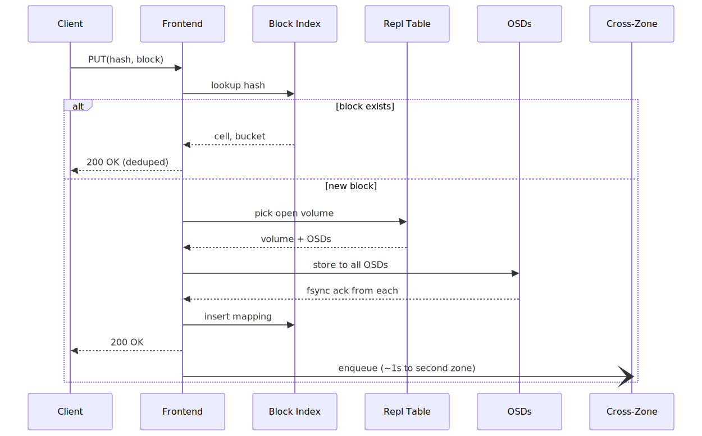
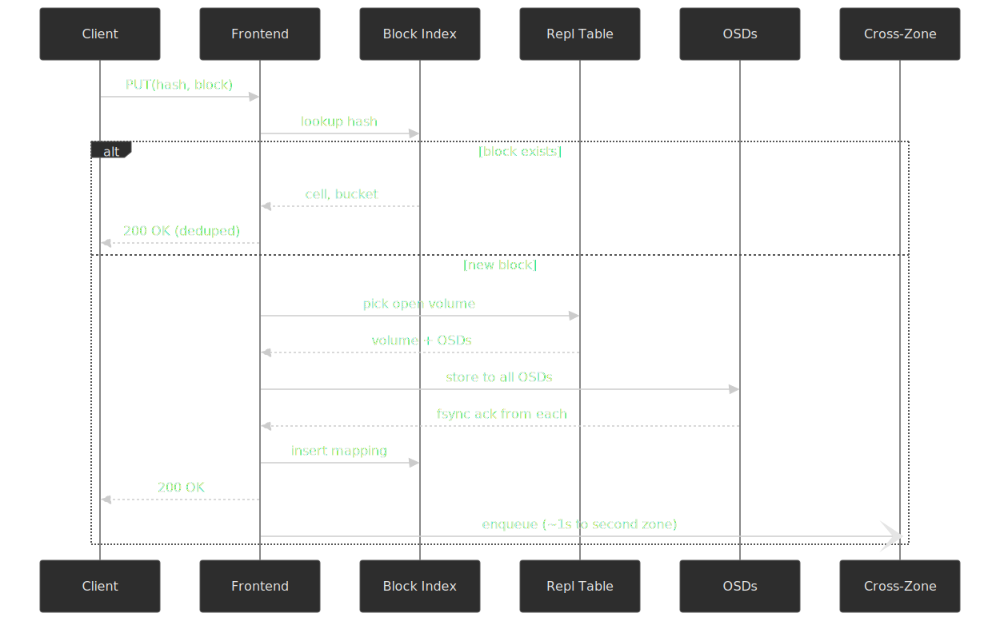
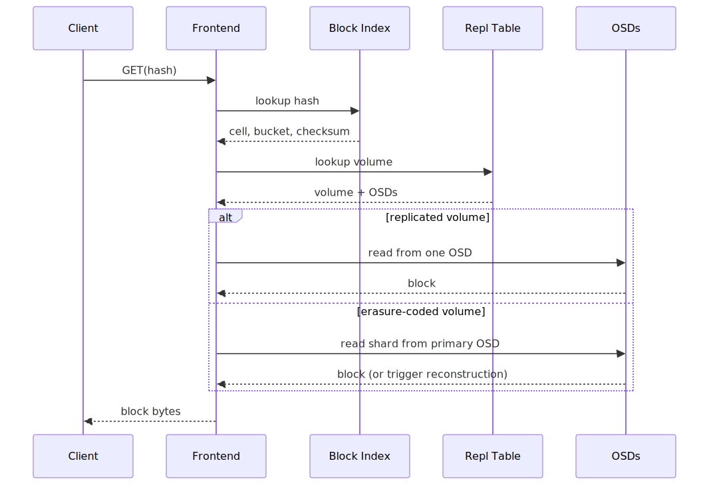
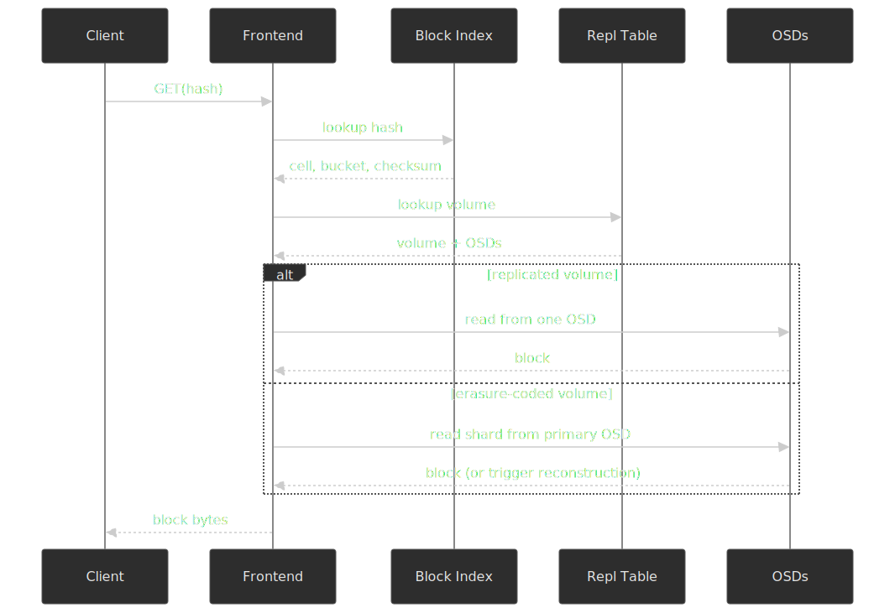

# Dropbox Magic Pocket: Building Exabyte-Scale Blob Storage

How Dropbox migrated 500+ petabytes off AWS S3 onto custom infrastructure in roughly two years, saving $74.6 million net while matching or exceeding the durability of the service it replaced. Magic Pocket is a content-addressable, immutable block store [originally built by a team of fewer than six engineers](https://dropbox.tech/infrastructure/inside-the-magic-pocket), and as of 2023 serves [700+ million registered users](https://documents.westerndigital.com/content/dam/doc-library/en_us/assets/public/western-digital/collateral/case-study/case-study-dropbox-magic-pocket-achieves-exabyte-scale-with-smr-hdds.pdf) across [more than 600,000 storage drives](https://www.infoq.com/articles/dropbox-magic-pocket-exabyte-storage/).

## Abstract

Magic Pocket is a **content-addressable, immutable block store** where the key is a block's SHA-256 hash and the value is a compressed, encrypted blob [up to 4 MB](https://dropbox.tech/infrastructure/inside-the-magic-pocket). The mental model has three layers:

- **Metadata layer** ([Edgestore](https://dropbox.tech/infrastructure/reintroducing-edgestore) + Block Index): Maps file paths to block hashes, and block hashes to physical locations. Sharded MySQL under the hood.
- **Placement and routing layer** (Frontends + Master): Determines which cell and volume stores each block. Handles deduplication at write time via hash lookup. The Master orchestrates repair and garbage collection but holds no authoritative state — the Replication Table does.
- **Physical storage layer** (OSD nodes + Diskotech servers): roughly [100 Shingled Magnetic Recording (SMR) drives per chassis](https://dropbox.tech/infrastructure/extending-magic-pocket-innovation-with-the-first-petabyte-scale-smr-drive-deployment), [over 2 PB per machine](https://www.infoq.com/articles/dropbox-magic-pocket-exabyte-storage/), written append-only with no filesystem. Blocks start as [4x replicas (hot)](https://www.infoq.com/articles/dropbox-magic-pocket-exabyte-storage/), then get erasure-coded to ~1.5x overhead as they cool.

The design bets: immutable blocks eliminate consistency complexity, content-addressing enables deduplication, and SMR's sequential-write constraint aligns with append-only semantics. The verification system ([Pocket Watch](https://dropbox.tech/infrastructure/pocket-watch)) spends [more than 50% of disk and database I/O](https://dropbox.tech/infrastructure/pocket-watch) on continuous integrity checking — an unusual choice that reflects Dropbox's stance that detecting corruption matters more than optimizing throughput.

## Context

### The System

Dropbox's core product is file synchronization and storage. By 2015, the platform served 500+ million users, making it one of the largest consumers of AWS S3 globally.

| Metric                  | Value (2015)                                       |
| ----------------------- | -------------------------------------------------- |
| Total data stored       | 500+ PB                                            |
| Users                   | 500+ million                                       |
| Primary storage backend | AWS S3                                             |
| Data growth rate        | ~40 PB/year (estimated from 2012's 40 PB baseline) |
| AWS relationship        | One of S3's largest customers                      |

### The Trigger

Storage is Dropbox's core product — not a supporting service. When your entire business is storing files, the economics of renting per-GB storage from a cloud provider diverge sharply from owning infrastructure at scale.

Three factors drove the decision:

1. **Cost**: [Dropbox's S-1 filing](https://www.sec.gov/Archives/edgar/data/1467623/000119312518055809/d451946ds1.htm) attributed a **$74.6 million net reduction in operating costs over 2016-2017** to its infrastructure-optimization initiative. The gross third-party data-center expense reduction in 2016 alone was $92.5 million, offset by $53.0 million in new depreciation, facility, and support costs.
2. **Control**: A custom stack allowed co-designing hardware and software for Dropbox's specific workload — immutable 4 MB blobs, write-once-read-rarely access patterns, extreme deduplication potential.
3. **Performance**: End-to-end optimization of network, disk I/O, and encoding strategies that S3's general-purpose design could not provide.

### Constraints

- **Team size**: [Fewer than six engineers initially](https://dropbox.tech/infrastructure/inside-the-magic-pocket). James Cowling later noted that "most of MP was built by a team of less than half a dozen people, which required us to focus on the things that mattered."
- **Zero downtime**: Migration had to be invisible to users. No maintenance windows, no degraded service.
- **Durability guarantee**: Must match or exceed S3's 11 nines of annual data durability.
- **Geographic distribution**: US colocation in West, Central, and East regions. European data continued to live on S3.
- **Timeline**: [Major work began in summer 2013](https://dropbox.tech/infrastructure/magic-pocket-infrastructure); production serving by February 2015.

## The Opportunity

### Why Not Just Optimize S3 Usage?

At Dropbox's scale, the unit economics flip. For most companies, S3's operational burden elimination justifies its per-GB premium. For Dropbox, storage is the product, not supporting infrastructure. Three properties of their workload made custom infrastructure particularly attractive:

**Immutable blocks with content-addressing.** Dropbox splits files into blocks (up to 4 MB), compresses them, and identifies each by its SHA-256 hash. A block never changes after creation. This eliminates the consistency complexity that makes general-purpose storage hard — no in-place updates, no concurrent modification conflicts, no cache invalidation for data.

**Write-once-read-rarely access patterns.** [Over 40% of all file retrievals target data uploaded in the last 24 hours, over 70% in the last month, and over 90% in the last year](https://dropbox.tech/infrastructure/how-we-optimized-magic-pocket-for-cold-storage). This extreme skew means most stored data is cold, and cold storage can be optimized aggressively for density over latency.

**Massive deduplication potential.** Content-addressing means identical blocks (common across users who share files, or across versions of the same file) are stored once. At 500+ PB, even small deduplication ratios yield enormous savings.

### What S3 Could Not Provide

S3 is a general-purpose object store. It cannot:

- Allow co-design of disk firmware, server chassis, and storage software as a unified system
- Use Shingled Magnetic Recording (SMR) drives that require application-level sequential write management
- Provide erasure coding tuned to Dropbox's specific durability and read-latency trade-offs
- Enable the 50%+ I/O budget dedicated to integrity verification that Dropbox's Pocket Watch system requires

## Options Considered

### Option 1: Optimize S3 Usage

**Approach:** Negotiate better rates, use S3 storage tiers (Glacier for cold data), optimize deduplication before upload.

**Pros:**

- Zero engineering investment
- Operational burden stays with AWS

**Cons:**

- Per-GB economics still unfavorable at 500+ PB scale
- No control over hardware or storage engine optimization
- Cannot co-design for immutable-block workload

**Why not chosen:** Even with aggressive optimization, the cost differential at exabyte scale was too large. Storage is Dropbox's core product, not ancillary infrastructure.

### Option 2: Use Another Cloud Provider or Open-Source Stack

**Approach:** Migrate to a cheaper cloud provider (Google Cloud, Azure) or deploy an open-source distributed storage system (Ceph, HDFS) on leased hardware.

**Pros:**

- Faster time to market than custom-built
- Existing community and tooling

**Cons:**

- General-purpose systems carry overhead for features Dropbox does not need (mutable objects, POSIX semantics, directory hierarchies)
- Cannot optimize for immutable, content-addressed blocks
- Limited hardware co-design possibilities

**Why not chosen:** The workload is narrow enough (immutable blobs, hash-keyed, append-only) that a purpose-built system could be dramatically simpler and more efficient than any general-purpose alternative.

### Option 3: Build Custom Storage (Chosen)

**Approach:** Build a purpose-built, content-addressable block store optimized for immutable 4 MB blobs.

**Pros:**

- Hardware-software co-design (custom server chassis, SMR drives, no filesystem)
- Erasure coding and replication tuned to exact durability requirements
- 50%+ I/O budget for verification without impacting cost efficiency
- Long-term cost advantage compounds as data grows

**Cons:**

- Multi-year engineering investment
- Operational expertise must be built in-house
- Single point of organizational risk (small team)

**Why chosen:** The narrow workload (immutable blobs) meant the system could be architecturally simple despite the scale. A team of fewer than 6 engineers could build it because the design eliminated most distributed systems complexity.

### Decision Factors

| Factor                        | Optimize S3 | Alternative Stack | Custom Build             |
| ----------------------------- | ----------- | ----------------- | ------------------------ |
| Cost at 500+ PB               | High        | Medium            | Low (after amortization) |
| Hardware co-design            | No          | Limited           | Full                     |
| Time to production            | Immediate   | 6-12 months       | ~18 months               |
| Workload optimization         | None        | Partial           | Complete                 |
| Operational complexity        | Low         | Medium            | High (initially)         |
| Long-term compounding savings | No          | Partial           | Yes                      |

## Implementation

### Architecture Overview

Magic Pocket's architecture reflects a single design principle: **immutable, content-addressed blocks eliminate most distributed systems complexity**. There are no distributed transactions, no consensus protocols, no cache invalidation for data. The system is a distributed key-value store where keys are SHA-256 hashes and values are compressed, encrypted blobs.

| Level      | Size                | Description                                                                            |
| ---------- | ------------------- | -------------------------------------------------------------------------------------- |
| **Block**  | Up to 4 MB          | Compressed, encrypted chunk; identified by SHA-256 hash                                |
| **Bucket** | ~1 GB               | Logical container aggregating blocks uploaded around the same time                     |
| **Volume** | One or more buckets | Replicated or erasure-coded across multiple OSD nodes                                  |
| **Extent** | 1-2 GB              | Physical on-disk unit; written append-only, immutable once sealed                      |
| **Cell**   | ~50-100+ PB raw     | Self-contained storage cluster with its own frontends, coordinators, and storage nodes |
| **Zone**   | Multiple cells      | Geographic region (US West, Central, East)                                             |

The original architecture sized cells at ~50 PB of raw storage, with a per-cell ceiling around 100 PB before the Master coordinator's memory and CPU became a bottleneck. By 2023, Tech Lead Facundo Agriel reported [cells "can be over 100 PBs"](https://www.infoq.com/articles/dropbox-magic-pocket-exabyte-storage/) as the design has matured.

A cell is the unit of deployment, the unit of failure isolation, and the unit of capacity addition. Adding storage to Magic Pocket usually means [bringing up a new cell rather than growing an existing one](https://dropbox.tech/infrastructure/inside-the-magic-pocket); each cell stripes its volumes across racks for physical diversity, and the Volume Managers run on the same hardware as the OSDs so the heavy network demand of repair amortises across otherwise-idle storage hosts.

### Core Components

#### Block Index

The Block Index is a sharded MySQL (InnoDB) cluster fronted by an RPC (Remote Procedure Call) service layer. It maps `block_hash -> (cell, bucket_id, checksum)`. The primary key is the SHA-256 hash of each block.

**Why MySQL?** At write time, the only coordination required is checking whether a block hash already exists (deduplication) and recording where it was placed. This is a simple key-value lookup and insert---exactly what sharded MySQL excels at. The immutability of blocks means no updates, no conflicting writes, and no consistency concerns beyond initial placement.

#### Replication Table

A smaller MySQL database within each cell that maps `bucket -> volume` and `volume -> (OSDs, open/closed, type, generation)`. The entire working set fits in memory for fast lookups. This is the authoritative record of where data physically lives within a cell.

**Design choice:** The Replication Table is the source of truth, not the Master coordinator. The Master is entirely soft-state---it can be restarted without losing any placement information. This avoids the complexity of distributed consensus for coordination.

#### Object Storage Devices (OSDs)

Custom storage machines running the Diskotech server chassis. The first table reflects the SMR design Dropbox shipped in [June 2018](https://dropbox.tech/infrastructure/extending-magic-pocket-innovation-with-the-first-petabyte-scale-smr-drive-deployment); the second reflects the [sixth-generation "Scooby" platform shipped in 2022](https://dropbox.tech/infrastructure/sixth-generation-server-hardware).

| Specification        | SMR launch (2018)                          | Sixth-generation "Scooby" (2022) |
| -------------------- | ------------------------------------------ | -------------------------------- |
| Form factor          | 4U chassis                                 | 4U chassis                       |
| Drives per chassis   | ~100 Large Form Factor (LFF)               | 100+ LFF                         |
| Capacity per chassis | ~1.4 PB (at 14 TB drives)                  | 2+ PB                            |
| Chassis per rack     | 8                                          | 8                                |
| Capacity per rack    | ~11 PB                                     | 20+ PB                           |
| Memory               | 96 GB per host                             | (see source)                     |
| CPU                  | 20 cores, 40 threads                       | (see source)                     |
| Network              | 50 Gbps NIC                                | 100 Gb NIC                       |
| Controller           | Host Bus Adapter (HBA), no RAID controller | Same                             |
| Disk access          | Direct via [libzbc](https://github.com/hgst/libzbc) (now [libzbd](https://github.com/westerndigitalcorporation/libzbd)), no filesystem | Same |

Performance-critical components — the OSD daemon and the Volume Manager — were [rewritten from Go to Rust](https://qconsf.com/sf2016/sf2016/presentation/going-rust-optimizing-storage-dropbox.html) by a team led by Jamie Turner. Go's garbage collector caused unpredictable latency spikes; Rust's manual memory model let the team control allocation explicitly and handle [more disks per machine without increased CPU overhead](https://dropbox.tech/infrastructure/extending-magic-pocket-innovation-with-the-first-petabyte-scale-smr-drive-deployment). Turner [reported on Hacker News](https://news.ycombinator.com/item?id=11283688) that the Rust rewrites delivered roughly 3-5x better tail latencies; this number has not been published in a primary Dropbox blog post, so treat it as a practitioner-reported figure rather than a benchmarked one.

> [!NOTE]
> **Organizational lesson:** Cowling later reflected that the Rust components ran reliably with little maintenance, but when the original authors departed, the team had limited Rust expertise to extend them. The components kept running but stopped evolving — a useful warning for any small team putting critical infrastructure on a niche stack.

#### Master Coordinator

The cell-level coordinator handles OSD health monitoring, triggering repair operations, creating storage buckets, and orchestrating garbage collection. Critically, the Master holds **no authoritative state**---the Replication Table is the source of truth. The Master can crash and restart without data loss or placement confusion.

This design avoids Paxos, Raft, or any quorum-based consensus for the coordination layer. The trade-off: recovery after Master failure requires rebuilding soft state from the Replication Table, but this is fast since the working set fits in memory.

#### Frontends

Gateway nodes that accept storage requests, determine block placement by balancing cell load and network traffic, and route read/write commands to appropriate OSD nodes.

#### Cross-Zone Replication Daemon

Asynchronously replicates all PUTs to at least one other geographic zone within approximately **one second**. Each block exists in at least two zones, ensuring zone-level fault tolerance.

### Write Path

1. Frontend checks the Block Index for the block hash (deduplication via SHA-256).
2. If absent, the frontend selects a target volume from a list of currently open volumes, balancing cell load and network traffic.
3. It issues store commands to **all OSDs in the volume**; each OSD must [`fsync` to disk before responding](https://dropbox.tech/infrastructure/inside-the-magic-pocket).
4. On success, the frontend writes the new entry to the Block Index and acknowledges the client.
5. On any failure (OSD or Block Index), the frontend retries on a different volume, possibly in another cell.
6. The Cross-Zone Replication daemon asynchronously replicates the block to at least one other zone, [typically within one second](https://dropbox.tech/infrastructure/inside-the-magic-pocket).

**Why synchronous replication within a volume?** Data loss from a partial write (acknowledged to the client but not durable on all replicas) would violate the immutability contract. By requiring every replica to fsync before acknowledging, the system guarantees that a successful write is immediately durable at the volume's replication factor. Cowling notes a quorum scheme would have lower tail latency at the cost of significantly more protocol complexity — they preferred careful timeout management on a simpler all-or-nothing path.

### Read Path

1. Frontend queries the Block Index for `(cell, bucket_id, checksum)`.
2. It consults the Replication Table inside that cell for the bucket's volume and OSD set.
3. For **replicated volumes**: fetches from a single OSD; retries on another OSD on failure.
4. For **erasure-coded volumes**: the encoding is structured so the entire block is normally readable from a single OSD; if that OSD is down, the frontend reconstructs the block from the surviving shards with Volume Manager assistance.

### Block Lifecycle and Erasure Coding

A block's redundancy scheme is not static. New blocks land as full replicas optimized for read latency; as access cools, background processes re-encode them into denser formats.

Magic Pocket uses two erasure-coding schemes — classical Reed-Solomon and a [Local Reconstruction Codes (LRC) variant](https://dropbox.tech/infrastructure/pocket-watch) that trades a small overhead penalty for cheaper single-shard repair:

| Scheme           | Configuration                              | Intra-zone overhead | Use case                                    |
| ---------------- | ------------------------------------------ | ------------------- | ------------------------------------------- |
| **Replicated**   | [4x within zone](https://www.infoq.com/articles/dropbox-magic-pocket-exabyte-storage/) | 4x | Recently uploaded (hot) data; single-OSD reads |
| **Reed-Solomon** | 6+3 (6 data, 3 parity)                     | 1.5x                | Standard encoding for warm data             |
| **LRC**          | ~12+2+2                                    | ~1.33x              | Optimized reads, tolerates 3 failures       |

Each of these is then stored in [at least two geographic zones](https://dropbox.tech/infrastructure/inside-the-magic-pocket), so the cross-zone factor multiplies the intra-zone overhead — until cold-tier migration replaces full cross-zone replication with regional fragmentation (next section).

**Why start with replication?** Over 40% of file retrievals target data uploaded in the last 24 hours. High-redundancy replication ensures fast single-OSD reads for the hottest data. As blocks cool (access frequency drops), they are aggregated into a closed volume and erasure-coded — trading some read complexity for far better storage efficiency. The system never pays the full 4x intra-zone cost for the 90%+ of data that is rarely accessed.

### Cold Storage Optimization

Introduced [in 2019](https://dropbox.tech/infrastructure/how-we-optimized-magic-pocket-for-cold-storage), the cold tier replaces full cross-zone replication with **fragment-based striping across geographic regions**:

- **2+1 scheme**: A block is split into 2 data fragments plus 1 XOR parity fragment, each placed in a different geographic zone.
- Cross-zone factor drops from 2x to 1.5x — **a 25% disk reduction** with 3 zones; a 4-region 3+1 model would cut another 8 points to 33%. Each fragment is still internally erasure-coded inside its region.
- Reads issue requests to all three regions in parallel, use the fastest two responses, and cancel the rest.

Counter-intuitively, the [99th-percentile read latency for cold storage was *lower* than warm storage](https://dropbox.tech/infrastructure/how-we-optimized-magic-pocket-for-cold-storage). The parallel cross-region reads with hedged cancellation reduced tail latency even though average single-region latency was higher. Dropbox later applied the same hedging technique to the warm tier.

> [!IMPORTANT]
> Cold-tier writes are migrations, not user-facing. The system can pause cold-tier writes during a regional outage without affecting the user-facing write path that still hits the warm tier.

### SMR Drive Deployment

Dropbox was the [first major technology company to deploy Shingled Magnetic Recording (SMR) drives at petabyte scale](https://dropbox.tech/infrastructure/extending-magic-pocket-innovation-with-the-first-petabyte-scale-smr-drive-deployment). SMR drives overlap write tracks like roof shingles, increasing areal density but requiring sequential writes aligned to zone boundaries.

**Why this is a perfect fit:** Magic Pocket's append-only, immutable write pattern naturally produces sequential writes. The OSD daemon manages sequential zones directly via libzbc/libzbd, bypassing the filesystem entirely.

| Milestone                              | Date           |
| -------------------------------------- | -------------- |
| First petabyte-scale SMR deployment    | June 2018      |
| All new drives deployed as SMR         | September 2018 |
| ~25% of HDD fleet on SMR               | 2019           |
| ~90% of HDD fleet on SMR               | 2023           |

> [!NOTE]
> The 2019 [first-year SMR retrospective](https://dropbox.tech/infrastructure/smr-what-we-learned-in-our-first-year) projected ~40% by year-end; the [2023 four-year retrospective](https://dropbox.tech/infrastructure/four-years-of-smr-storage-what-we-love-and-whats-next) reported the actual 2019 number at ~25%, growing to 90% by 2023.

**Drive capacity progression:** 4 TB → 8 TB → 14 TB → 18 TB → 20 TB, with [HAMR-based 50+ TB drives projected next](https://dropbox.tech/infrastructure/four-years-of-smr-storage-what-we-love-and-whats-next).

**Power efficiency gains:** 5-6x reduction in power per terabyte since the original 4 TB deployment. The latest 18-20 TB drives operate at ~0.30 watts/TB idle and ~0.50 watts/TB under random reads. The [sixth-generation server requires five fewer megawatts and one third the rack space to serve one exabyte](https://dropbox.tech/infrastructure/four-years-of-smr-storage-what-we-love-and-whats-next) versus the fourth generation.

### Encryption

[Data at rest is encrypted](https://dropbox.tech/infrastructure/magic-pocket-infrastructure) inside Magic Pocket. Dropbox's [security white paper](https://www.dropbox.com/security) describes the broader hierarchy: blocks are encrypted with [AES-256 keys](https://help.dropbox.com/security/how-security-works) before being stored, and Dropbox uses a tiered key system where per-object encryption keys are wrapped by higher-level keys, enabling key rotation without rewriting ciphertext. The architectural consequences for Magic Pocket are:

- **Per-block encryption** means deduplication still works only when two users hold identical plaintext; cross-user dedup is a property of the upper file-handling layers, not Magic Pocket itself.
- **Key rotation** is metadata-only — Magic Pocket never has to rewrite an exabyte of ciphertext to roll a master key.
- **Deletion** can be implemented by destroying the encryption metadata that decrypts a block, with physical garbage collection of the ciphertext following asynchronously.

### Network Architecture

Dropbox's data center network evolved to a [**quad-plane, 3-tier Clos fabric**](https://dropbox.tech/infrastructure/the-scalable-fabric-behind-our-growing-data-center-network):

| Specification    | Value                                |
| ---------------- | ------------------------------------ |
| Racks per pod    | 16                                   |
| Pods per fabric  | 16 (expandable to 31 for ~500 racks) |
| Spine switches   | 64 (16 per plane × 4 planes)         |
| Link speed       | 100G everywhere                      |
| Oversubscription | 1:1 (non-blocking)                   |
| Routing          | eBGP per device, ECMP per flow       |
| Uplink per rack  | 4x100G (one per plane)               |

The non-blocking fabric is essential for Magic Pocket's repair operations, which must move terabytes of data across hundreds of OSD nodes simultaneously when a drive fails. The four planes are physically routed across two main distribution frames (MDFs) so that a single MDF or power event takes out at most 50% of fabric capacity.

### SSD Cache Removal (2021-2022)

When SMR was introduced in 2018, [each storage host had a single SSD acting as a write-back cache](https://dropbox.tech/infrastructure/extending-magic-pocket-innovation-with-the-first-petabyte-scale-smr-drive-deployment) for live writes — both block metadata and raw block data landed on the SSD first, then were lazily flushed to SMR as sequential writes. As drive density grew (14-20 TB per disk, 100+ drives per host), [the single SSD became the host's write-throughput bottleneck at ~15-20 Gbps](https://dropbox.tech/infrastructure/increasing-magic-pocket-write-throughput-by-removing-our-ssd-cache-disks), regardless of cumulative SMR throughput.

A 2020 incident in which many SSDs reached their write-endurance limit at roughly the same time made the bottleneck a durability concern, not just a performance one.

**Solution:** Store both metadata and raw data inline on SMR disks using [a new extent format](https://dropbox.tech/infrastructure/increasing-magic-pocket-write-throughput-by-removing-our-ssd-cache-disks) that serializes blocks with their metadata directly to disk. On startup the storage engine parses the extent and rebuilds an in-memory hash → offset index.

| Metric                                  | Before   | After              |
| --------------------------------------- | -------- | ------------------ |
| Peak write throughput (load test)       | Baseline | 2-2.5x improvement |
| Production write throughput             | Baseline | 15-20% improvement |
| P95 write latency (load test, peak)     | Baseline | 15-20% improvement |
| P95 last-mile disk write (avg load)     | Baseline | 10-15% **regression** |
| End-to-end P95 write (avg load)         | Baseline | ~2% regression     |
| Monthly SSD failure repairs per fleet   | 8-10     | 0                  |

The trade-off was deliberate: the 2-2.5x peak throughput gain and the elimination of the SSD failure mode were worth a 2% increase in end-to-end P95 latency under average load. Rollout completed [fleet-wide by Q1 2022](https://dropbox.tech/infrastructure/increasing-magic-pocket-write-throughput-by-removing-our-ssd-cache-disks).

## Migration

### Timeline

[Akhil Gupta's 2016 announcement](https://dropbox.tech/infrastructure/magic-pocket-infrastructure) lays out the schedule:

| Date              | Milestone                                                          |
| ----------------- | ------------------------------------------------------------------ |
| Summer 2013       | Small team (fewer than 6 engineers) begins coding prototype        |
| August 2014       | **Dark launch**: mirroring data between two regional locations     |
| February 27, 2015 | **Launch**: production serving exclusively from own infrastructure |
| April 30, 2015    | **BASE Jump**: rapid scale-out phase begins                        |
| October 7, 2015   | **90% milestone**: 90% of user data on Magic Pocket (~3 weeks ahead of the October 30 internal goal) |
| March 14, 2016    | Public announcement via engineering blog                           |

### Migration Strategy

**Dual-stack mirroring:** During the dark-launch period (August 2014 → February 2015), data was [mirrored between two regional locations](https://dropbox.tech/infrastructure/magic-pocket-infrastructure) and Dropbox kept "extra backups for another six months" before retiring the safety net.

**Peak transfer rate:** Over [**half a terabit per second**](https://dropbox.tech/infrastructure/magic-pocket-infrastructure) on the internal network during bulk migration. The team noted they were pushing up against the physical limit of how many racks could fit through the loading dock at once.

**Gradual cutover:** [The system scaled from "double-digit-petabyte prototypes to a multi-exabyte behemoth within around six months."](https://dropbox.tech/infrastructure/inside-the-magic-pocket)

### Post-Migration

Approximately [10% of data remained on AWS S3](https://dropbox.tech/infrastructure/magic-pocket-infrastructure) — primarily for European business customers who requested EU data residency. In 2020, Dropbox built the [**Object Store** abstraction layer](https://dropbox.tech/infrastructure/abstracting-cloud-storage-backends-with-object-store), providing a unified API (PUT, GET, DELETE, LIST) that routes requests transparently between S3 and Magic Pocket. Object Store added write batching, range-based reads, and encryption, and let Dropbox deprecate most HDFS (Hadoop Distributed File System) usage by late 2021.

## Verification: Pocket Watch

[More than **50% of the workload on disks and databases** is internal verification traffic](https://dropbox.tech/infrastructure/pocket-watch). This is an unusual design choice — most storage systems optimize for user-facing throughput. Dropbox chose to dedicate half their I/O capacity to catching corruption before it becomes data loss.

### Disk Scrubber

Continuously reads back every bit on disk and validates against checksums. Full disk sweep every **1-2 weeks**, with recently modified areas scanned more frequently. On detecting corruption it schedules re-replication and pushes the disk into the remediation workflow. The scrubber is the only verifier whose normal-operation graph is *not* a flat zero line — disks routinely surface bit rot.

### Metadata Scanner

Iterates through the Block Index at approximately **1 million blocks per second**, confirming that each block actually exists on the storage nodes the index claims. Full scans complete roughly weekly per zone, gating code releases between zones.

### Storage Watcher

Independent black-box verification, written by an engineer outside the storage team to avoid shared blind spots. It samples [**1% of all blocks written**](https://dropbox.tech/infrastructure/pocket-watch), enqueues their hashes in Kafka, then re-fetches each one after 1 minute, 1 hour, 1 day, 1 week, and 1 month. The multi-interval cadence catches different failure modes — immediate write loss, short-term disk degradation, and long-term bit rot.

### Trash Inspector and Extent Referee

The Trash Inspector iterates over deleted extents and confirms that every block in them was either safely re-replicated elsewhere or itself marked for deletion. Trash extents survive an extra day on disk after inspection passes, as a last-chance recovery window. The Extent Referee watches filesystem transitions on storage nodes and alerts on any unlink that did *not* go through Trash Inspector and a corresponding Master instruction — a guard against rogue scripts or operator error.

### Cross-Zone Verifier

Walks Dropbox's File Journal (the source of truth for which file maps to which blocks) and confirms that every block exists in every zone it should. Catches cross-zone replication gaps that the one-second async replication might miss during transient failures.

## Repair Operations

When an OSD has been unreachable for [15 minutes](https://dropbox.tech/infrastructure/inside-the-magic-pocket) — [Cowling's stated balance between absorbing routine restarts and minimising the window of vulnerability](https://dropbox.tech/infrastructure/inside-the-magic-pocket):

1. Master closes every volume on the failed OSD so they will accept no new writes.
2. Master builds a reconstruction plan that spreads the read load across **hundreds of OSD nodes** to avoid creating a new hotspot.
3. Volume Managers run the data transfer, doing erasure-coded reconstruction where needed.
4. Master increments the generation number on the new volumes (so a stale OSD coming back to life will be detected as out-of-date).
5. Master updates the Replication Table — that update is the atomic commit point of the repair.

The open/closed volume distinction is what makes this safe: a volume that has been closed will not accept new writes, so the data is free to move around the cell without coordinating with the live PUT path. The same property is what lets the Master crash mid-repair without leaving the cell in an inconsistent state — a recovering Master simply re-derives soft state from the Replication Table and either reissues or rolls back the in-flight repair via the Reconcile background task.

**Repair rate:** [~4 extents per second](https://www.infoq.com/articles/dropbox-magic-pocket-exabyte-storage/) (each 1-2 GB).

**Repair SLA:** [Less than 48 hours for a full OSD reconstruction](https://www.infoq.com/articles/dropbox-magic-pocket-exabyte-storage/).

**Auto-repair volume:** [Hundreds of hardware failures are repaired automatically per day](https://www.infoq.com/articles/dropbox-magic-pocket-exabyte-storage/) across the fleet.

## Disaster Readiness

On [November 18, 2021 at 5:00 PM PT](https://dropbox.tech/infrastructure/disaster-readiness-test-failover-blackhole-sjc), Dropbox physically unplugged its San Jose (SJC) metro from the network for 30 minutes. Three Dropboxers stood by in each of SJC's three data-center facilities and pulled the network fiber on command.

**Result:** Zero impact to global availability. Magic Pocket's active-active multi-zone design (and a year of metadata-stack work to multi-home critical services) handled the loss transparently. Dropbox reports that this and the broader DR program reduced its [Recovery Time Objective (RTO) by more than an order of magnitude](https://dropbox.tech/infrastructure/disaster-readiness-test-failover-blackhole-sjc) versus pre-2020 capabilities.

This was not a simulated failover — it was a real disconnection of production infrastructure serving user traffic.

## Outcome

### Financial Impact

| Year      | Gross third-party data-center savings | New infra costs (depreciation + facilities + support) | Net savings |
| --------- | ----------------- | ------------------------------------------ | ----------- |
| 2016      | $92.5M            | $53.0M                                     | $39.5M      |
| 2017      | —                 | —                                          | $35.1M      |
| **Total** | —                 | —                                          | **$74.6M**  |

Source: [Dropbox S-1 filing, 2018](https://www.sec.gov/Archives/edgar/data/1467623/000119312518055809/d451946ds1.htm).

### Durability and Availability

| Metric                                | Value              | Source |
| ------------------------------------- | ------------------ | ------ |
| Theoretical durability (Markov model) | 27 nines           | [Pocket Watch](https://dropbox.tech/infrastructure/pocket-watch) |
| Published durability guarantee        | Over 12 nines      | [Magic Pocket announcement](https://dropbox.tech/infrastructure/magic-pocket-infrastructure) |
| Availability                          | 99.99%             | [Magic Pocket announcement](https://dropbox.tech/infrastructure/magic-pocket-infrastructure) |
| Cross-zone replication latency        | ~1 second          | [Inside the Magic Pocket](https://dropbox.tech/infrastructure/inside-the-magic-pocket) |
| Repair SLA (full OSD)                 | Less than 48 hours | [InfoQ 2023](https://www.infoq.com/articles/dropbox-magic-pocket-exabyte-storage/) |

### Scale (2023)

| Metric                          | Value                                     |
| ------------------------------- | ----------------------------------------- |
| Storage drives deployed         | [600,000+](https://www.infoq.com/articles/dropbox-magic-pocket-exabyte-storage/) |
| SMR fleet percentage            | [~90% of HDD fleet](https://dropbox.tech/infrastructure/four-years-of-smr-storage-what-we-love-and-whats-next) |
| Registered users                | [700+ million](https://documents.westerndigital.com/content/dam/doc-library/en_us/assets/public/western-digital/collateral/case-study/case-study-dropbox-magic-pocket-achieves-exabyte-scale-with-smr-hdds.pdf) |
| Request throughput              | Tens of millions per second               |
| Auto-repaired hardware failures | Hundreds per day                          |
| Geographic zones                | 3 US (West, Central, East) + AWS for Europe |
| Latest drive capacity in fleet  | 18-20 TB; HAMR 50+ TB on roadmap          |
| Hardware generation             | 6th in production, 7th in development     |

### Unexpected Benefits

- **SMR alignment:** The append-only, immutable write pattern turned out to be ideal for SMR drives, letting Dropbox adopt higher-density drives years ahead of most competitors.
- **Cold-tier latency improvement:** Cross-region parallel reads with hedged cancellation produced lower P99 latency than warm-tier single-region reads.
- **Key-rotation simplification:** Two-tier encryption keys meant master-key rotation could happen at the metadata layer without rewriting any ciphertext on disk.

### Remaining Limitations

- **US-only custom infrastructure:** ~10% of data still lives on AWS S3, mainly serving European customers who request EU data residency.
- **Rust expertise concentration:** The Rust components ran reliably but stopped evolving after their original authors departed.
- **Vendor-collaboration dependency:** SMR (and the upcoming HAMR) require deep firmware co-design with HDD vendors; the model only works as long as Dropbox can maintain those partnerships at the scale it qualifies new drives.

## Lessons Learned

### Technical Lessons

#### 1. Narrow Workloads Enable Radical Simplification

**The insight:** Magic Pocket avoids distributed consensus, distributed transactions, and cache invalidation for data — the three hardest problems in distributed storage. It can do this because blocks are immutable and content-addressed. Fewer than six engineers built a system that replaced AWS S3 as Dropbox's primary storage backend.

**How it applies elsewhere:**

- Before building general-purpose infrastructure, ask whether your workload has properties that eliminate entire categories of complexity.
- Append-only, immutable data models are dramatically simpler to distribute than mutable ones.

**Warning signs to watch for:**

- Your storage system handles consistency edge cases that your actual data model does not require.
- You are paying for POSIX semantics or mutable-object support that your application never uses.

#### 2. Hardware-Software Co-Design Compounds Over Time

**The insight:** By designing the Diskotech chassis, choosing SMR drives, writing a custom OSD engine without a filesystem, and building a non-blocking Clos network, Dropbox created an integrated stack where each layer amplifies the others. The power efficiency gains (5-6x per TB) and the SSD cache removal are examples of optimizations only possible with full-stack control.

**How it applies elsewhere:**

- At sufficient scale, the cost of understanding hardware intimately pays for itself.
- General-purpose layers (filesystems, RAID controllers, general-purpose SSDs) add overhead and limit optimization options.

#### 3. Verification is Worth Half Your I/O Budget

**The insight:** Pocket Watch's five verification subsystems consume over 50% of disk and database I/O. This seems wasteful until you consider that undetected corruption at exabyte scale would mean certain data loss. The cost of verification is the cost of maintaining durability guarantees.

**How it applies elsewhere:**

- Durability claims without continuous verification are aspirational, not actual.
- Multi-interval sampling (1 minute to 1 month) catches failure modes that single-point-in-time checks miss.

**Warning signs to watch for:**

- Your durability SLA depends on assumptions about disk reliability that you are not actively validating.
- You discover corruption through user reports rather than automated systems.

### Process Lessons

#### 1. Small Teams Can Build at Extreme Scale

**What they'd do differently:** James Cowling later reflected that the Rust rewrite, while technically successful, created a skills gap when original authors departed. A small team building critical infrastructure must plan for knowledge transfer from day one.

### Organizational Lessons

#### 1. Storage Economics Change the Build-vs-Buy Equation

When storage is your product (not a supporting service), the economics of building custom infrastructure become favorable at a lower scale threshold than most engineers assume. Dropbox's $74.6M net savings in two years funded the ongoing engineering investment many times over.

## Edgestore and Panda: The Metadata Layer

Magic Pocket stores blocks, but mapping files to blocks requires a separate metadata system. Dropbox built [**Edgestore**](https://dropbox.tech/infrastructure/reintroducing-edgestore), a strongly consistent, read-optimized, horizontally scalable, geo-distributed metadata store.

- **Storage engine:** MySQL (InnoDB)
- **Data model:** Entities (objects with attributes) and Associations (relationships between entities)
- **Architecture:** Language-specific SDKs (Go, Python) → stateless Cores → Caching Layer → Engines → MySQL
- **Consistency:** Strong by default (cache invalidation on writes); eventual consistency available as opt-in
- **Scale:** Thousands of machines, [several trillion entries, millions of queries per second, 5 nines of availability](https://dropbox.tech/infrastructure/reintroducing-edgestore)

To survive Edgestore's continued growth without doubling the MySQL fleet on every split, Dropbox later introduced [**Panda**](https://dropbox.tech/infrastructure/panda-metadata-stack-petabyte-scale-transactional-key-value-store) — a petabyte-scale transactional key-value store that sits between Edgestore and sharded MySQL. Panda exposes a key-value API with ACID transactions backed by two-phase commit and hybrid-logical clocks, supports MVCC for non-blocking reads, and can rebalance ranges across storage nodes — features that allow incremental capacity expansion instead of fleet-doubling shard splits.

## Future Direction: HAMR

Dropbox is preparing for [**Heat-Assisted Magnetic Recording (HAMR)** drives](https://dropbox.tech/infrastructure/four-years-of-smr-storage-what-we-love-and-whats-next), which use a write head that briefly heats the recording medium to ~450 °C in nanosecond pulses. The localized heating softens the medium so smaller, thermally stable grains can be flipped, enabling smaller bits and projected capacities of 50+ TB per drive. Crucially, HAMR is transparent to the host, so Magic Pocket should be able to absorb it without the architectural rework that SMR required.

For the seventh-generation server (in development), Dropbox is [re-architecting the network so a single chassis can theoretically support more than 6 PB](https://dropbox.tech/infrastructure/four-years-of-smr-storage-what-we-love-and-whats-next) without breaking repair SLAs.

## Conclusion

Magic Pocket's success rests on a single architectural insight: **immutable, content-addressed blocks eliminate the hardest problems in distributed storage**. That choice let a team of fewer than six engineers replace AWS S3 for the bulk of Dropbox's data, save $74.6 million net in the first two years, and operate a system that now sits behind 700+ million registered users on 600,000+ drives.

The design decisions compound: immutability enables append-only writes, append-only writes enable SMR drives, SMR drives enable higher density, higher density justifies custom chassis, custom chassis justify a non-blocking custom network, and so on. Each choice unlocks the next optimization.

The most counterintuitive decision — spending 50%+ of disk and database I/O on verification rather than user-facing throughput — reflects a posture about durability that distinguishes production storage systems from academic designs. At exabyte scale, undetected corruption is not a risk to be modeled; it is a certainty to be continuously hunted.

## Appendix

### Prerequisites

- Distributed storage fundamentals (replication, erasure coding)
- Content-addressable storage concepts
- Basic understanding of disk technologies (HDD, SSD, SMR)

### Terminology

| Term            | Definition                                                                                                              |
| --------------- | ----------------------------------------------------------------------------------------------------------------------- |
| **SMR**         | Shingled Magnetic Recording — HDD technology that overlaps write tracks for higher density, requiring sequential writes |
| **PMR**         | Perpendicular Magnetic Recording — conventional HDD technology that allows arbitrary random writes                      |
| **HAMR**        | Heat-Assisted Magnetic Recording — next-generation HDD technology that briefly heats the medium to ~450 °C during writes |
| **LRC**         | Local Reconstruction Codes — erasure-coding variant enabling local repair without reading all shards                    |
| **OSD**         | Object Storage Device — a Magic Pocket storage node with ~100 drives                                                    |
| **Extent**      | 1-2 GB append-only physical storage unit on disk                                                                        |
| **Cell**        | Self-contained 50-100+ PB storage cluster within a zone                                                                 |
| **Volume**      | Set of buckets replicated or erasure-coded across a fixed set of OSDs                                                   |
| **Bucket**      | ~1 GB logical container that aggregates blocks uploaded around the same time                                            |
| **Clos fabric** | Non-blocking multi-tier network topology providing full bisection bandwidth                                             |
| **MVCC**        | Multi-Version Concurrency Control — used by Panda for non-blocking reads                                                |

### Summary

- Magic Pocket is a content-addressable, immutable block store keyed by SHA-256 hashes, originally built by fewer than six engineers.
- It migrated 500+ PB off AWS S3 with a dual-stack mirroring strategy between August 2014 and October 2015, saving $74.6M net in the first two years per Dropbox's S-1.
- Hot blocks land as 4x intra-zone replicas (mirrored to a second zone); as they cool they are erasure-coded to ~1.33-1.5x intra-zone overhead, and cold blocks are XOR-fragmented across regions for ~1.5x cross-zone factor.
- Pocket Watch verification consumes 50%+ of disk and database I/O across five subsystems, continuously validating durability at exabyte scale.
- Custom Diskotech servers with ~100 SMR drives per chassis (over 2 PB per machine on the sixth-gen platform) deliver 5-6x power-per-TB improvement since the original 4 TB deployment.
- The narrow workload (immutable blobs, hash-keyed) eliminates distributed consensus, distributed transactions, and cache invalidation for data — making extreme scale tractable for a small team.

### References

- [Inside the Magic Pocket](https://dropbox.tech/infrastructure/inside-the-magic-pocket) - Architecture deep-dive by James Cowling (2016)
- [Scaling to Exabytes and Beyond](https://dropbox.tech/infrastructure/magic-pocket-infrastructure) - Migration announcement and timeline (2016)
- [Pocket Watch: Verifying Exabytes of Data](https://dropbox.tech/infrastructure/pocket-watch) - Durability verification systems (2016)
- [Extending Magic Pocket Innovation with SMR](https://dropbox.tech/infrastructure/extending-magic-pocket-innovation-with-the-first-petabyte-scale-smr-drive-deployment) - First petabyte-scale SMR deployment (2018)
- [How We Optimized Magic Pocket for Cold Storage](https://dropbox.tech/infrastructure/how-we-optimized-magic-pocket-for-cold-storage) - Cold tier design (2019)
- [SMR: What We Learned in Our First Year](https://dropbox.tech/infrastructure/smr-what-we-learned-in-our-first-year) - SMR lessons (2019)
- [Four Years of SMR Storage](https://dropbox.tech/infrastructure/four-years-of-smr-storage-what-we-love-and-whats-next) - SMR evolution and HAMR preview (2022)
- [Increasing Write Throughput by Removing SSD Cache Disks](https://dropbox.tech/infrastructure/increasing-magic-pocket-write-throughput-by-removing-our-ssd-cache-disks) - SSD cache removal (2022)
- [Object Store: Cloud Storage Abstraction](https://dropbox.tech/infrastructure/abstracting-cloud-storage-backends-with-object-store) - Unified storage API (2023)
- [(Re)Introducing Edgestore](https://dropbox.tech/infrastructure/reintroducing-edgestore) - Metadata system architecture
- [Panda: Petabyte-Scale Transactional Key-Value Store](https://dropbox.tech/infrastructure/panda-metadata-stack-petabyte-scale-transactional-key-value-store) - Metadata evolution
- [Disaster Readiness Test: Failover Blackhole SJC](https://dropbox.tech/infrastructure/disaster-readiness-test-failover-blackhole-sjc) - Data center disconnection test (2021)
- [The Scalable Fabric Behind Our Growing Data Center Network](https://dropbox.tech/infrastructure/the-scalable-fabric-behind-our-growing-data-center-network) - Network architecture
- [Dropbox S-1 Filing](https://www.sec.gov/Archives/edgar/data/1467623/000119312518055809/d451946ds1.htm) - Financial data and infrastructure cost savings (2018)
- [Magic Pocket: Dropbox's Exabyte-Scale Blob Storage System (QCon 2022)](https://www.infoq.com/presentations/magic-pocket-dropbox/) - Andrew Fong & Akhil Gupta conference talk
- [Dropbox Magic Pocket at Exabyte Scale (InfoQ 2023)](https://www.infoq.com/articles/dropbox-magic-pocket-exabyte-storage/) - Detailed architecture article by Facundo Agriel
- [Software Engineering Daily: Dropbox's Magic Pocket with James Cowling (2016)](https://softwareengineeringdaily.com/2016/05/17/dropboxs-magic-pocket-james-cowling/) - Podcast interview
- [SE Radio Episode 285: James Cowling on Distributed Storage (2017)](https://se-radio.net/2017/03/se-radio-episode-285-james-cowling-on-dropboxs-distributed-storage-system/) - Podcast interview
- [Western Digital Case Study: Dropbox Magic Pocket with SMR HDDs](https://documents.westerndigital.com/content/dam/doc-library/en_us/assets/public/western-digital/collateral/case-study/case-study-dropbox-magic-pocket-achieves-exabyte-scale-with-smr-hdds.pdf) - Vendor case study
