# E-commerce SSG to SSR Migration: Strategy and Pitfalls

Marketing launches a campaign at 09:00. By 09:15 the featured product still shows yesterday's price because the static rebuild has not finished. By 10:00 Google Ads has rejected the campaign for price mismatch. This is the moment most e-commerce teams decide their static-first front end has become a liability — and the moment the real work starts.

This article is a playbook for migrating an e-commerce front end from Static Site Generation (SSG) to Server-Side Rendering (SSR) without breaking SEO, conversion, or cost. It is opinionated about three things: that the migration is risk-management more than feature delivery; that you almost always want the [Strangler Fig pattern](https://martinfowler.com/bliki/StranglerFigApplication.html) at the edge rather than a big-bang cutover; and that the right destination for many teams is not pure SSR but [Incremental Static Regeneration with on-demand revalidation](https://nextjs.org/docs/app/getting-started/revalidating).


## Terminology

| Term     | Definition                                                                              |
| -------- | --------------------------------------------------------------------------------------- |
| SSG      | Static Site Generation — HTML emitted at build time, served from CDN                    |
| SSR      | Server-Side Rendering — HTML rendered per request on the origin                         |
| ISR      | Incremental Static Regeneration — static HTML refreshed in the background after expiry  |
| PPR      | Partial Pre-Rendering — static shell with streamed dynamic "holes" inside one route     |
| SWR      | `stale-while-revalidate` — serve stale, refresh in the background                       |
| CDN      | Content Delivery Network — edge cache and request router                                |
| Surrogate key | Tag attached to a cached response so writes can purge sets of URLs at once         |
| LCP      | Largest Contentful Paint — Web Vital for perceived load                                 |
| INP      | Interaction to Next Paint — Web Vital for responsiveness                                |
| CLS      | Cumulative Layout Shift — Web Vital for visual stability                                |
| TTFB     | Time to First Byte — origin or edge response latency                                    |
| BFF      | Backend for Frontend — request-shaping API tier between client and microservices        |

## Why an SSG front end fails an e-commerce business

SSG's contract is simple: every URL is HTML on disk, ready before the request arrives. That contract collapses on four predictable dimensions for e-commerce, all of which trace back to the same root cause — **price, inventory, and per-user content are request-time facts**, and SSG resolves everything at build time.

- **Build time vs. content velocity.** Marketing publishes faster than the site can rebuild. With even a few thousand product pages, a clean rebuild can run for tens of minutes; pricing campaigns expect changes in seconds. The `revalidate` budget on Next.js ISR exists exactly because a full rebuild is too coarse a unit for product data[^next-revalidate-isr].
- **Inventory bursts and oversell risk.** A static "in stock" badge written 10 minutes ago is a lie when a flash sale drains the warehouse in 30 seconds. The cost of getting this wrong is concrete: oversold orders, refunds, and customer-service load. Anything stock-sensitive belongs on a per-request path or behind a soft purge keyed on the SKU.
- **Code-content coupling.** A bundle is a snapshot of code plus content. Rolling back a bug also rolls back content, which silently 404s newly launched products.
- **Layout stability under personalization.** Anything personalized — price, inventory, geo-locale, A/B variant — has to load client-side after hydration, which guarantees [Cumulative Layout Shift](https://web.dev/articles/cls) and a Web Vitals regression. PPR exists exactly to give per-request content a server-rendered home that does not shift the layout[^next-ppr].
- **Pricing parity for ad networks.** Static HTML cannot keep up with dynamic pricing. The DOM-rewrite tricks teams use to paper over this (`img.onError` callbacks, `data-pricing` attributes patched before React hydrates) are fragile, and Google Ads will reject the campaign the first time the cached price diverges from the canonical one.

[^next-revalidate-isr]: [Incremental Static Regeneration (Pages Router) — Next.js](https://nextjs.org/docs/pages/guides/incremental-static-regeneration). The `revalidate` value is a per-route freshness budget, not a publish primitive.

[^next-ppr]: [Partial Prerendering Platform Guide — Next.js](https://nextjs.org/docs/app/guides/ppr-platform-guide). PPR ships a static shell with streamed dynamic regions; it became stable in Next.js 16 under the Cache Components model (`cacheComponents: true` plus the `'use cache'` directive).

There is also a real bill attached to SSG at scale. CloudFront's automatic compression only applies to objects between 1 KB and 10 MB; anything above that is served uncompressed[^cf-compress]. A heavy home-page payload (hero JSON, product cards, structured data) can drift past 10 MB on a single deploy and 10× the day's egress cost.

[^cf-compress]: [Serve compressed files — Amazon CloudFront](https://docs.aws.amazon.com/AmazonCloudFront/latest/DeveloperGuide/ServingCompressedFiles.html). The 1 KB lower bound and 10,000,000-byte upper bound are documented in the [CloudFront quotas](https://docs.aws.amazon.com/AmazonCloudFront/latest/DeveloperGuide/cloudfront-limits.html) page.

The migration is worth doing when these symptoms are recurring, not when they are theoretical. If you are still inside SSG's comfort zone (mostly-static content, low publishing cadence, no real-time pricing), you are probably better off staying.

## Migration recipe at a glance

The remainder of the article expands the same six steps. They run in order, but step 5 routinely loops back to step 3 — TTLs and tag taxonomies are the levers you reach for when a phase regresses.

 routinely loops back to step 3 (cache strategy) — TTLs and tag taxonomies are the regression-recovery levers.")

1. **Audit routes by content shape.** Per-user vs. shared, change rate (per-second to per-quarter), build-budget cost, SEO weight, ad-network dependency.
2. **Split the rendering boundary per route.** SSG, ISR, PPR, SSR — see the decision tree below. Write the route → mode mapping into the repo so it is reviewable.
3. **Design the cache strategy.** TTLs, surrogate-key taxonomy, edge-bucketing key, what is private vs. shared. This is where most of the SSR savings (and most of the failure modes) live.
4. **Run a Strangler rollout.** Edge bucketing with a sticky cookie in the cache key, route family by route family.
5. **Measure CWV per bucket.** RUM, synthetic, APM. Compare A vs. B with everything else held equal. Loop back to step 3 on any regression.
6. **Decommission SSG.** Retire the build pipeline, the bucket-routing code, and the parallel hosting cost only after the SSR bucket has been at 100% long enough to clear seasonal effects.

## Mental model: pick the rendering mode per route, not per platform

A clean migration starts by accepting that "SSG" and "SSR" are not platforms; they are per-route rendering decisions. A modern Next.js or Remix app routinely mixes all four modes. Choose by content shape, not by team preference.


| Mode                       | Where the HTML lives                  | Best for                                              | Failure mode                                       |
| -------------------------- | ------------------------------------- | ----------------------------------------------------- | -------------------------------------------------- |
| SSG                        | CDN, prebuilt at deploy               | Blog, marketing, legal, low-cardinality pages         | Slow publishing, content-code coupling             |
| ISR (with revalidation)    | CDN, refreshed in background          | PDP, listings, search; staleness is acceptable        | Stale-while-revalidate fan-out under invalidation  |
| PPR / Cache Components     | Static shell on CDN, dynamic streamed | PDP with shared shell + per-user price/stock/cart     | Suspense boundary placement; shell drift on regen  |
| SSR + CDN cache            | Origin renders, CDN caches            | PDP with short TTLs, geo-personalized landing pages   | Origin capacity at low cache-hit rate              |
| SSR (no cache)             | Origin renders every request          | Account, cart, checkout, anything per-user            | Cold-start latency; throughput-bound on origin     |
| CSR (after first paint)    | Browser fetches and renders           | Heavy interactive widgets below the fold              | INP/JS budget regression; SEO-invisible            |

ISR is the under-discussed midpoint. Pages render on demand the first time and then sit in cache; on-demand revalidation invalidates the cached entry by tag (`revalidateTag('product:123')`) or path (`revalidatePath('/p/123')`)[^next-revalidate]. Reads stay cheap; writes converge on the order of seconds. For most catalog pages, ISR is closer to SSG than to SSR in cost and to SSR in freshness — frequently the right answer.

PPR is the newer midpoint and the one that maps cleanly onto e-commerce: the static shell (chrome, hero, copy) is cached at the edge, and each per-request region (price, stock badge, cart, recommendations) becomes a streamed dynamic hole behind a `<Suspense>` boundary[^next-ppr]. The shell ships at SSG TTFB; the holes resolve in parallel with the network roundtrip. Stable in Next.js 16 under the Cache Components model, with the same rendering shape available — engine-side — in Remix/React Router via `<Await>` and `defer()`[^remix-defer]. When SSG-trained teams ask "do I need SSR?" the honest answer is often "you need PPR."

[^next-revalidate]: [Next.js — Revalidating](https://nextjs.org/docs/app/getting-started/revalidating). Pages Router uses `res.revalidate('/path')` per [the ISR guide](https://nextjs.org/docs/pages/guides/incremental-static-regeneration).

[^remix-defer]: [Streaming with Suspense — React Router](https://reactrouter.com/start/framework/data-loading#streaming-with-suspense). The `Await` component plus a `Promise` returned from `loader` gives the same "static shell + streamed hole" rendering shape as PPR, without a framework-level static/dynamic distinction.

## The Strangler Fig at the edge

The pattern that makes SSG → SSR survivable is [Martin Fowler's Strangler Fig](https://martinfowler.com/bliki/StranglerFigApplication.html) — also documented as an [AWS prescriptive pattern](https://docs.aws.amazon.com/prescriptive-guidance/latest/cloud-design-patterns/strangler-fig.html) and an [Azure architecture pattern](https://learn.microsoft.com/en-us/azure/architecture/patterns/strangler-fig). Run both stacks side by side; route a controlled percentage of traffic to the new one; ratchet the percentage up as confidence grows; rip out the old one when traffic is zero.

The mechanics live in the CDN layer. The reference implementation here uses CloudFront with a hybrid of [CloudFront Functions](https://docs.aws.amazon.com/AmazonCloudFront/latest/DeveloperGuide/cloudfront-functions.html) for the cheap viewer-side work and [Lambda@Edge](https://docs.aws.amazon.com/AmazonCloudFront/latest/DeveloperGuide/lambda-at-the-edge.html) for the origin-side decision. This split is forced by AWS: CloudFront Functions only run on `viewer-request` and `viewer-response`; modifying `request.origin` requires a Lambda@Edge function on `origin-request`[^edge-fns].

[^edge-fns]: [Differences between CloudFront Functions and Lambda@Edge](https://docs.aws.amazon.com/AmazonCloudFront/latest/DeveloperGuide/edge-functions-choosing.html). CloudFront Functions are JavaScript, sub-millisecond, free up to a high threshold, and limited to `viewer-request` / `viewer-response`. Lambda@Edge is Node.js or Python, more expensive, and required for `origin-request` / `origin-response`.

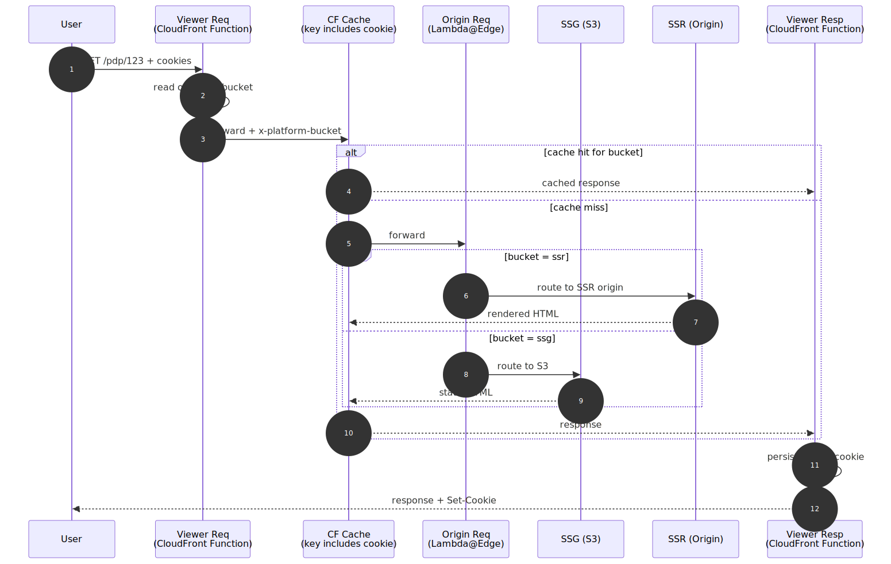
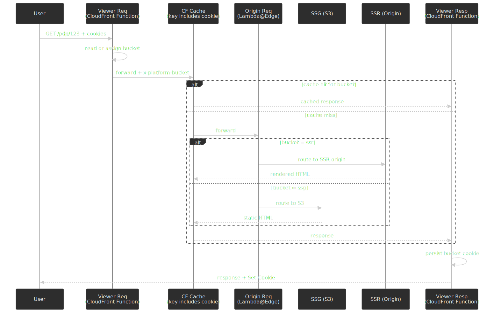

### Viewer Request — CloudFront Function

The viewer-request stage runs on every request, before cache lookup. It is the right place to assign a sticky bucket because anything it writes onto `request.headers` participates in the cache key when the cache policy whitelists it. CloudFront Functions are deliberately constrained — they cannot make network calls and they run on a JavaScript runtime closer to ES5 than to Node — but they are dramatically cheaper than Lambda@Edge for the volume that hits viewer triggers.

```javascript title="viewer-request.js (CloudFront Function)"
var BUCKET_PERCENT_SSR = 25

function handler(event) {
  var request = event.request
  var cookies = request.cookies || {}

  var bucket = cookies["platform-ab"] && cookies["platform-ab"].value
  if (!bucket) {
    bucket = Math.random() * 100 < BUCKET_PERCENT_SSR ? "ssr" : "ssg"
  }

  request.headers["x-platform-bucket"] = { value: bucket }
  return request
}
```

Two non-obvious points: the assignment is non-deterministic on the first request (`Math.random()` runs at the edge with no shared seed), but the cookie set by the viewer-response stage makes every subsequent request sticky. Once a user is bucketed, the cache key change forces them onto the right origin permanently. There is no need for a hash-based router unless you want bucket consistency to survive cookie loss — in which case derive the bucket from the user ID hash instead.

### Origin Request — Lambda@Edge

CloudFront Functions cannot rewrite `request.origin`; only Lambda@Edge can. The origin-request function is the cheap part of Lambda@Edge to run because it only fires on cache miss.

```javascript title="origin-request.js (Lambda@Edge, Node.js)"
const ORIGINS = {
  ssr: { domainName: "ssr-app.example.com" },
  ssg: { domainName: "ssg-bucket.s3.amazonaws.com" },
}

exports.handler = async (event) => {
  const request = event.Records[0].cf.request
  const bucketHeader = request.headers["x-platform-bucket"]
  const bucket = bucketHeader && bucketHeader[0] ? bucketHeader[0].value : "ssg"
  const target = ORIGINS[bucket] || ORIGINS.ssg

  request.origin = {
    custom: {
      domainName: target.domainName,
      port: 443,
      protocol: "https",
      path: "",
      sslProtocols: ["TLSv1.2"],
      readTimeout: 30,
      keepaliveTimeout: 5,
      customHeaders: {},
    },
  }
  request.headers["host"] = [{ key: "host", value: target.domainName }]
  return request
}
```

Note the header shape — Lambda@Edge expects `request.headers[name]` to be an **array** of `{ key, value }` objects, not the single `{ value }` shape that CloudFront Functions use[^edge-events]. The `host` header must be rewritten to match the new origin or the origin will reject the request as a host-header mismatch.

[^edge-events]: [CloudFront Functions event structure](https://docs.aws.amazon.com/AmazonCloudFront/latest/DeveloperGuide/functions-event-structure.html) vs. [Lambda@Edge event structure](https://docs.aws.amazon.com/AmazonCloudFront/latest/DeveloperGuide/lambda-event-structure.html). The two runtimes deliberately use different request shapes; mixing them produces silent failures.

### Viewer Response — CloudFront Function

The viewer-response stage persists the bucket and the user identifier as cookies so the next request lands in the same bucket without renegotiation.

```javascript title="viewer-response.js (CloudFront Function)"
var COOKIE_OPTIONS = "Path=/; Secure; SameSite=Lax; Max-Age=2592000"

function handler(event) {
  var request = event.request
  var response = event.response

  var bucketHeader = request.headers["x-platform-bucket"]
  if (!bucketHeader) return response

  response.cookies = response.cookies || {}
  response.cookies["platform-ab"] = {
    value: bucketHeader.value,
    attributes: COOKIE_OPTIONS,
  }
  return response
}
```

### The cache key is the whole game

Without the bucket in the cache key, the first user to land on `/product/123` poisons the cache for everyone else, regardless of bucket. With it, CloudFront keeps a separate cached entry per bucket per URL.

> [!IMPORTANT]
> Whitelist the `platform-ab` cookie in the cache policy. Configure the [CloudFront cache policy](https://docs.aws.amazon.com/AmazonCloudFront/latest/DeveloperGuide/controlling-the-cache-key.html) to include the cookie in the cache key. Do **not** use `Vary: Cookie` from the origin as a substitute — CloudFront only varies cache entries by what is in the cache key, not by `Vary` headers.

Two routine mistakes show up in production:

- **Forgetting the cookie in the cache key.** Manifests as users being randomly routed depending on who hit the URL first. Hard to reproduce because a CDN flush makes it disappear for hours.
- **Setting `Vary: Cookie` everywhere.** Tanks cache hit rate because every cookie value invalidates the entry; for example, a session cookie set by analytics will fragment the cache infinitely.

## Cache invalidation: tag the response, not the URL

Once SSR is on the hot path, the cache strategy stops being "set a TTL and pray" and starts being a write-side problem. The mechanism every modern CDN converges on is the same: tag each response with a set of opaque keys on the way out, then purge by tag on the way in.

| Provider                | Tag header            | Invalidation API                         | Notes                                                                                                                                              |
| ----------------------- | --------------------- | ---------------------------------------- | -------------------------------------------------------------------------------------------------------------------------------------------------- |
| Fastly                  | `Surrogate-Key`       | Single-key purge + Batch API             | Keys ≤ 1 KB each, header ≤ 16 KB total. Soft purge marks entries stale and serves SWR while the origin re-renders[^fastly-sk].                     |
| Cloudflare              | `Cache-Tag`           | Purge by Tag (was Enterprise, now broad) | Header stripped before reaching the user. Purge fan-out is sub-second across the edge[^cf-tag].                                                    |
| Vercel (Next.js)        | `next.tags` on fetch  | `revalidateTag('product:123')`           | Tags propagate through the Data Cache and ISR. Works the same in App Router (`fetch(..., { next: { tags } })`) and on Vercel's edge network[^next-revalidate]. |
| Shopify Hydrogen (Oxygen) | Cache-Control + SWR | `CacheShort` / `CacheLong` / `CacheCustom` | Built on top of `stale-while-revalidate`; sub-request caching inside loaders is the primary lever[^hydrogen-cache].                                |

The taxonomy matters more than the mechanism. A pragmatic e-commerce starter set:

- `product:<sku>` — purges every page that renders that product.
- `collection:<id>` — purges every listing or PLP that includes the collection.
- `pricelist:<currency>` — purges every page priced in that currency when the price feed updates.
- `inventory:<sku>` — purges only stock-sensitive regions (with PPR, just the dynamic hole).
- `cms:<entry-id>` — purges marketing copy independent of catalog data.

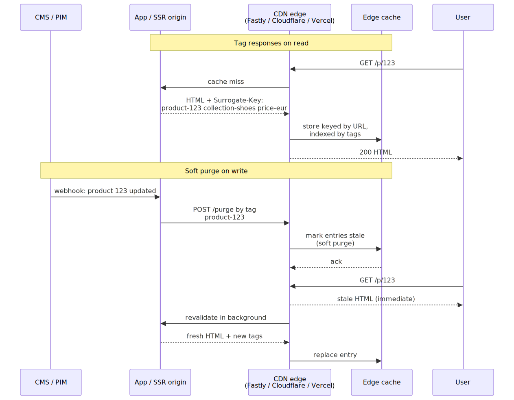
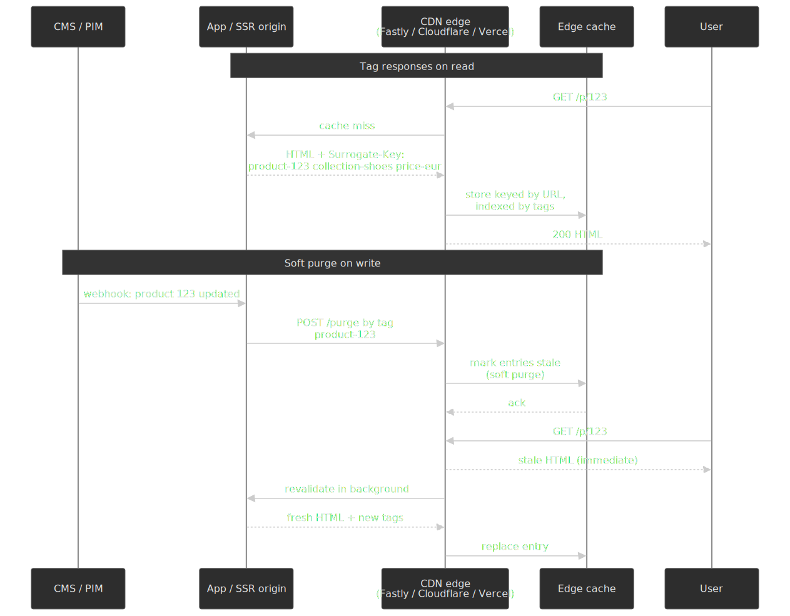

[^fastly-sk]: [`Surrogate-Key` HTTP header — Fastly Documentation](https://www.fastly.com/documentation/reference/http/http-headers/Surrogate-Key/) and [Purging with surrogate keys](https://www.fastly.com/documentation/guides/full-site-delivery/purging/purging-with-surrogate-keys/). The 1 KB / 16 KB limits and the `Surrogate-Key` header stripping are documented there.

[^cf-tag]: [Purge cache — Cloudflare Cache docs](https://developers.cloudflare.com/cache/how-to/purge-cache/) and [Instant Purge for all](https://blog.cloudflare.com/instant-purge-for-all/) for the rollout from Enterprise-only to all plans.

[^hydrogen-cache]: [Caching Shopify API data with Hydrogen and Oxygen](https://shopify.dev/docs/storefronts/headless/hydrogen/caching). `CacheShort` is roughly `s-maxage=1, stale-while-revalidate=9`; `CacheLong` is roughly `s-maxage=3600, stale-while-revalidate=82800`. Sub-request caching is opt-in inside loaders.

> [!IMPORTANT]
> Use **soft purge** (mark stale, serve SWR, revalidate in the background) by default. Hard purge causes a thundering-herd cache miss on every purged URL the next second — a real outage shape during high-frequency price updates. Hard purge is for compliance takedowns, not for catalog edits.

## Edge personalization without breaking the cache

Edge personalization fails the same way SSR does on day one: every personalization signal silently joins the cache key, hit rate collapses, origin load spikes. The defensive shape is the same on every platform — Cloudflare Workers, Vercel Edge Middleware, Netlify Edge Functions, AWS CloudFront Functions: derive a small, stable, low-cardinality bucket at the edge from the request signals, and key the cache on the bucket, not the signals[^vercel-em].

[^vercel-em]: [Optimizing web experiences with Vercel Edge Middleware](https://vercel.com/resources/edge-middleware-experiments-personalization-performance) and [Location-based personalization with Cloudflare Workers](https://blog.cloudflare.com/location-based-personalization-using-workers/). Both vendors document the "rewrite to a bucketed variant URL, vary the cache on the bucket" pattern as the supported shape.

The buckets that earn their keep on an e-commerce front end:

- **Country / currency / tax zone.** Native `request.geo` (Vercel), `cf.country` (Cloudflare), `context.geo` (Netlify) — no external lookup needed.
- **Logged in vs. anonymous.** Two cache entries per URL, not N entries per session.
- **A/B variant.** A single cookie value drawn from a stable hash; never a random per-request value.
- **Device class.** Mobile / desktop / tablet, only when the rendered HTML genuinely differs.

Anything finer-grained than a bucket — the actual user ID, the cart contents, the recommendation list — belongs in a PPR dynamic hole, not in the shell. The shell stays shared and cacheable; the hole stays fresh and uncacheable. This split is the single biggest reason PPR is more interesting than full SSR for an e-commerce migration: you keep the SSG hit rate on the parts that do not need to be personal.

## Cost and latency model

The bill changes shape, not just size, on the way from SSG to SSR. The four numbers worth modelling before the cutover:

- **Origin compute per render × cache miss rate × QPS.** Under SSG this is zero. Under SSR with a 90% cache hit rate it is one tenth of QPS times the per-render cost. A 10× swing in cache hit rate is a 10× swing in origin bill — which is why the cache-key discipline above is a cost lever, not just a correctness lever.
- **Edge function invocations.** Cheap per invocation, expensive in aggregate. CloudFront Functions are billed per request and run on every viewer-request; Lambda@Edge fires only on cache miss but at a higher unit cost. Vercel Edge Middleware bills "execution units" with a similar split. Model the steady-state QPS, not the peak.
- **Egress.** SSG with CDN compression and an oversized payload is the worst combination — large bytes served from cache to every viewer. SSR with a smaller, dynamic payload often pays back the origin compute on egress alone. Re-check the [CloudFront 10 MB compression ceiling](https://docs.aws.amazon.com/AmazonCloudFront/latest/DeveloperGuide/ServingCompressedFiles.html) on the heaviest route.
- **TTFB at p95, not p50.** SSR's mean is fine; the long tail is what regresses Web Vitals. The dominant cause is one slow downstream call (search, recommendations, BFF) per route. Every SSR route needs an explicit downstream timeout budget — usually 200–400 ms, with a fallback render for the dynamic region rather than a blocked response.

A useful pre-cutover sanity check: render the same route 1000 times in CI against a warm origin, take the p95, multiply by expected QPS, and compare to the origin's documented concurrency budget. If the headroom is less than 3×, you are one failed downstream call away from an incident at peak.

## Phased rollout

The phasing exists to give you observability windows where you can compare bucket A and bucket B with everything else held equal. Each phase has a quantitative go/no-go before traffic moves up.

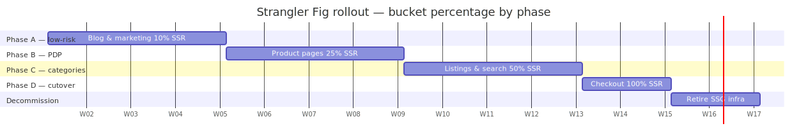
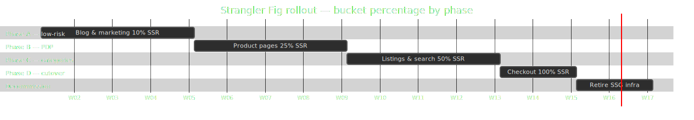

| Phase | Scope                          | SSR % | Primary success metric                          | Rollback trigger                          |
| ----- | ------------------------------ | ----- | ----------------------------------------------- | ----------------------------------------- |
| A     | Blog, marketing, static pages  | 10%   | LCP p75 ≤ 2.5 s; organic traffic flat or up    | LCP p75 regression > 10% for 24 h         |
| B     | Product detail pages           | 25%   | CLS p75 ≤ 0.1; add-to-cart rate flat            | Add-to-cart rate drop > 10% for 24 h      |
| C     | Listings, search, faceted nav  | 50%   | TTFB p95 ≤ 400 ms; funnel progression flat      | Critical bug affecting > 5% of users      |
| D     | Checkout, account, full cutover| 100%  | Revenue per session flat; no P0/P1 open         | Any P0; revenue per session drop > 5%     |

Numbers in this table are illustrative defaults. Replace each value with the baseline measured on the SSG platform during Phase 0 — you cannot define "regression" without knowing where you started.

The Web Vitals targets (LCP ≤ 2.5 s, INP ≤ 200 ms, CLS ≤ 0.1) are the [Google "good" thresholds](https://web.dev/articles/defining-core-web-vitals-thresholds), measured at the 75th percentile across mobile and desktop. They are not arbitrary — Google Search uses them as a ranking signal — and they are deliberately set at a level that real engineering can hit with discipline rather than perfection.

## The cache-header capability gap

The single architectural decision that derails most Next.js migrations is which router to start on. The choice is forced by how the App Router and Pages Router treat the `Cache-Control` response header.

- **Pages Router** exposes the raw response object inside `getServerSideProps`. You set `res.setHeader('Cache-Control', 's-maxage=60, stale-while-revalidate=300')` and the CDN does the rest. This is the model SSG-trained teams understand intuitively[^next-pages-gssp].
- **App Router** historically owned cache headers. Until [Next.js 14.2.10](https://github.com/vercel/next.js/discussions/52491), `next.config.js` `headers()` could not override the framework's per-route defaults — Next would unconditionally rewrite `Cache-Control` based on whether the route was static, ISR, or dynamic. Custom overrides were silently discarded.

[^next-pages-gssp]: [Next.js — getServerSideProps](https://nextjs.org/docs/pages/building-your-application/data-fetching/get-server-side-props). The `res` argument is the raw Node response, so headers behave the way every Node engineer expects.

This matters because the migration's caching plan is exactly the inverse of the App Router's defaults. You want short, surgical TTLs informed by route data (product type, inventory state, locale) and possibly different Cache-Control on weekday vs weekend campaigns. The App Router's "let the framework decide" model fights you at every step until 14.2.10.

> [!NOTE]
> If you are starting today on Next.js 16 or later, the App Router's caching is more flexible and you can also set headers from the new [`proxy.ts`](https://nextjs.org/docs/app/api-reference/file-conventions/proxy) (the renamed [`middleware.ts`](https://nextjs.org/docs/messages/middleware-to-proxy)). For a migration off SSG, the conservative path is still Pages Router unless your team has prior production experience on App Router with ISR + on-demand revalidation.

The migration playbook this article advocates: start on Pages Router with full CDN caching that mirrors SSG behaviour, then ratchet TTLs down route-by-route. Move to App Router as a second, separate project once SSR is stable.

## Real-time content updates require an operational shift, not just a webhook

The seductive mid-migration story: hook Contentful's webhooks into your revalidation API, and content goes live in seconds without a build. It works on day one. It breaks in three predictable ways once a real organisation uses it.

- **Race conditions with backend systems.** A content author publishes a new product page in Contentful. The webhook fires, the cache is invalidated, the next user hits the new URL — and the product API returns 404 because the catalog ingest has not run yet. Users see broken pages until the backend catches up.
- **Implicit ordering between content pieces.** Under SSG, all content for a build is consistent because it was all read at the same instant. Under real-time invalidation, every publish is independent. Banner-publishes-before-landing-page is a wrong-order bug class that did not exist on SSG.
- **Bundled-publish habits.** Site-ops teams trained on SSG batch their changes (preview, review, ship). Real-time tools do not naturally support that workflow, and authors will not learn dependency graphs by themselves.

The pragmatic answer is to wrap real-time publishing in a thin "release" layer: changes accumulate in a draft state, an explicit Release action publishes them atomically, and each release is versioned for instant rollback. This preserves the SSG bundling experience that authors actually want while keeping the SSR mechanism underneath.

> [!WARNING]
> Do not turn on per-publish revalidation until upstream systems (catalog, inventory, pricing) can absorb the same write rate as the CMS. Otherwise you will spend more time apologising for 404s than you saved on rebuild time.

## Security baseline for SSR

Moving from a static origin to a rendered one changes the threat model. Static HTML on a CDN has roughly two attack surfaces; an SSR origin has four. Establish the baseline once, in framework code, instead of per-route.

| Risk           | Why SSR raises it                                                | Primary mitigation                                                          |
| -------------- | ---------------------------------------------------------------- | --------------------------------------------------------------------------- |
| Reflected XSS  | Server interpolates request data into rendered HTML              | Strict CSP with nonces; framework-level template encoding                   |
| CSRF           | Origin can perform mutations on behalf of the user               | `SameSite=Lax` on auth cookies + CSRF tokens on POST                        |
| Clickjacking   | Pages can be embedded in iframes by attacker-controlled domains  | `frame-ancestors 'self'` in CSP (preferred over `X-Frame-Options`)          |
| Cache poisoning| Cache key omits a header that the origin uses to vary content    | Pin the cache key explicitly; use `Vary` only when the cache respects it    |

`Cache-Control` privacy is also worth pinning early: `private` on anything user-specific, `s-maxage` only on what is genuinely shared, and avoid `must-revalidate` on hot paths because it forces revalidation under load.

## Observability stack

Three classes of telemetry have to be in place before the first traffic switch, not after the first incident.

- **Real-User Monitoring (RUM).** Vercel Analytics, Datadog RUM, or New Relic Browser. Capture LCP / INP / CLS per route and per bucket, segmented by device class and country. Without per-bucket segmentation you cannot tell whether a regression is the new platform or the day's traffic mix.
- **Synthetic monitoring.** Calibre, SpeedCurve, or Lighthouse CI in pull requests. Synthetic numbers are noisier than RUM but more controllable; they are how you catch a 200 ms regression before it ships.
- **APM and tracing.** Distributed tracing through the SSR origin (Datadog APM, New Relic, Honeycomb). The single most common SSR perf regression is a slow downstream call (BFF, search, recommendations) that was previously absorbed by the build.

Alert on the four numbers that change the experience: p95 TTFB > 800 ms, CDN cache hit rate < 90%, revalidation failure rate > 1%, and SSR error rate > 0.5%. Everything else can wait for the weekly review.

## Failure modes and recovery

The post-cutover incidents converge on a small set of shapes. Recognise them in advance so the runbook is written before the pager fires.

| Failure mode                                | Symptom                                                            | First-line recovery                                                                  |
| ------------------------------------------- | ------------------------------------------------------------------ | ------------------------------------------------------------------------------------ |
| Cache stampede on hard purge                | Origin error rate spike seconds after a CMS publish                | Switch the purge to soft purge / SWR; cap revalidation concurrency per route         |
| Cache key fragmentation                     | Cache hit rate collapse after an analytics or auth change          | Audit `Vary` headers and edge-function-injected headers; remove anything not bucketed |
| Slow downstream call on SSR                 | p95 TTFB regression on one route family only                       | Add per-call timeout + fallback render; move the call into a PPR dynamic hole        |
| Webhook outpaces upstream ingest            | New URLs return 404 for minutes after publish                      | Gate revalidation on an upstream readiness probe; use the release-flow pattern       |
| Bucket cookie loss after CDN config change  | Users randomly oscillate between SSG and SSR after a deploy        | Derive bucket from a stable hash (user ID, IP) instead of an opaque cookie value     |
| Long tail of orphaned ISR pages             | Storage bloat and stale entries after a taxonomy change            | Purge by tag, not by URL list; rotate the surrogate-key namespace on schema changes  |

The common thread is that every SSR failure mode is a cache-key or write-path problem in disguise. The fix is almost never "add more origin capacity" — it is "tighten the cache contract."

## Lessons from the field

The mistakes below cost real time. They are framed as antipatterns to make them easy to recognise in your own design reviews.

### Lesson 1 — Same React, different framework

Gatsby and Next.js are both React-based, so component code ports easily. Everything around the components — data fetching idioms, route conventions, build configuration, plugin ecosystems — does not. "React-based" is not "interchangeable". Budget calendar time for framework-specific re-learning, not just for the components that move file-by-file.

### Lesson 2 — Migrate cleanly, then change behaviour

Mixing technology migration with behaviour changes is the single largest source of post-launch ambiguity. If conversion rate moves down 2% after launch, you cannot tell whether the framework regressed something or the product change you piggybacked also regressed something. Treat the migration as a no-op refactor to match the SSG behaviour exactly. Run feature changes as separate experiments after the platform is stable.

### Lesson 3 — Conservative architecture first

Starting on App Router with streaming and no caching looked progressive in 2023; in production, it surfaced cache-header limitations, unbounded origin load, and a router pivot mid-project. Start on the most boring stack that solves your immediate problems (Pages Router + full CDN caching at SSG-equivalent TTLs) and adopt newer patterns only after the foundation is stable.

### Lesson 4 — Phased platform rollout, not phased feature rollout

The phases are about traffic to the new platform, not about features inside the new platform. Phase A (10% SSR on low-risk content) and Phase B (25% on PDP) earn organisational confidence by being legibly safe — the rollback is a one-line config change, the blast radius is a known fraction of users, the metrics are comparable side by side. Internal stakeholders only stop being nervous when they have watched a rollback work.

### Lesson 5 — Real-time publishing is an org change

The webhook is twenty lines of code. The org change is teaching site-ops to think about content dependency graphs instead of build snapshots. Without the org change, real-time publishing creates more incidents than it removes. The "versioned release" pattern is a humane compromise: SSR mechanism, SSG-style bundled publish.

### Antipattern summary

| Antipattern                                       | Recommended approach                                                              |
| ------------------------------------------------- | --------------------------------------------------------------------------------- |
| Combine framework migration with behaviour fixes  | Pure migration first; behaviour changes as labelled, measurable experiments       |
| Start on cutting-edge router patterns             | Start on the most conservative router that solves the cache-header problem        |
| Big-bang cutover                                  | Strangler Fig with edge-bucketed traffic split                                    |
| Ship and watch dashboards                         | Set go/no-go thresholds per phase before traffic moves                            |
| Estimate from surface similarity                  | Budget for the framework-specific layer, not just component portability           |
| Enable per-publish revalidation by default        | Wrap CMS writes in a versioned release flow until upstream systems are aligned    |

## Practical takeaways

- Choose rendering mode per route, not per platform. ISR with on-demand revalidation is the right answer for many catalog pages, sitting between SSG's freshness limits and SSR's cost.
- Run the rollout at the edge with a sticky bucket cookie included in the cache key. Hybrid CloudFront Functions (viewer triggers) plus Lambda@Edge (origin trigger) is the cheapest correct shape on AWS.
- Pick the router based on how cache headers behave today. On Next.js, that means Pages Router for any migration where the App Router cannot give you per-route Cache-Control control you need.
- Treat real-time content publishing as an organisational capability, not a feature toggle. Wrap it in a release step until upstream systems and content authors are ready.
- Define rollback triggers in numbers before each phase, not in adjectives after each incident.

## References

- [Strangler Fig Application — Martin Fowler](https://martinfowler.com/bliki/StranglerFigApplication.html) — original pattern description
- [Strangler Fig pattern — AWS Prescriptive Guidance](https://docs.aws.amazon.com/prescriptive-guidance/latest/cloud-design-patterns/strangler-fig.html)
- [Strangler Fig pattern — Microsoft Azure Architecture Center](https://learn.microsoft.com/en-us/azure/architecture/patterns/strangler-fig)
- [Web Vitals — web.dev](https://web.dev/articles/vitals) — current LCP / INP / CLS thresholds
- [How the Core Web Vitals thresholds were defined — web.dev](https://web.dev/articles/defining-core-web-vitals-thresholds)
- [Differences between CloudFront Functions and Lambda@Edge — AWS](https://docs.aws.amazon.com/AmazonCloudFront/latest/DeveloperGuide/edge-functions-choosing.html)
- [CloudFront Functions event structure — AWS](https://docs.aws.amazon.com/AmazonCloudFront/latest/DeveloperGuide/functions-event-structure.html)
- [Lambda@Edge event structure — AWS](https://docs.aws.amazon.com/AmazonCloudFront/latest/DeveloperGuide/lambda-event-structure.html)
- [Controlling the cache key — CloudFront](https://docs.aws.amazon.com/AmazonCloudFront/latest/DeveloperGuide/controlling-the-cache-key.html)
- [Serve compressed files — CloudFront](https://docs.aws.amazon.com/AmazonCloudFront/latest/DeveloperGuide/ServingCompressedFiles.html)
- [Next.js — getServerSideProps](https://nextjs.org/docs/pages/building-your-application/data-fetching/get-server-side-props)
- [Next.js — Revalidating (App Router)](https://nextjs.org/docs/app/getting-started/revalidating)
- [Next.js — Incremental Static Regeneration (Pages Router)](https://nextjs.org/docs/pages/guides/incremental-static-regeneration)
- [Custom Cache-Control headers with App Router — Next.js Discussion #52491](https://github.com/vercel/next.js/discussions/52491)
- [Next.js — Renaming Middleware to Proxy](https://nextjs.org/docs/messages/middleware-to-proxy)
- [Next.js — proxy.js file convention](https://nextjs.org/docs/app/api-reference/file-conventions/proxy)
- [Next.js — Partial Prerendering Platform Guide](https://nextjs.org/docs/app/guides/ppr-platform-guide)
- [React Router — Streaming with Suspense (`Await` + `defer`)](https://reactrouter.com/start/framework/data-loading#streaming-with-suspense)
- [Fastly — Surrogate-Key HTTP header](https://www.fastly.com/documentation/reference/http/http-headers/Surrogate-Key/)
- [Fastly — Purging with surrogate keys](https://www.fastly.com/documentation/guides/full-site-delivery/purging/purging-with-surrogate-keys/)
- [Cloudflare — Purge cache (Cache-Tag)](https://developers.cloudflare.com/cache/how-to/purge-cache/)
- [Cloudflare — Instant Purge for all](https://blog.cloudflare.com/instant-purge-for-all/)
- [Shopify — Caching Shopify API data with Hydrogen and Oxygen](https://shopify.dev/docs/storefronts/headless/hydrogen/caching)
- [Vercel — Optimizing web experiences with Edge Middleware](https://vercel.com/resources/edge-middleware-experiments-personalization-performance)
- [Cloudflare — Location-based personalization with Workers](https://blog.cloudflare.com/location-based-personalization-using-workers/)
