# Edge Delivery and Cache Invalidation

A modern CDN is two systems welded together: a globally distributed read-through cache governed by [HTTP caching semantics](https://www.rfc-editor.org/rfc/rfc9111.html), and a programmable purge plane that lets you reach into hundreds of points of presence to expire content on demand. Both halves have to be designed deliberately; defaults will give you a hot origin, fragmented cache, or stale pages on incident day. This article is the mental model and the failure-mode catalogue a senior engineer needs to design cache keys, pick TTLs, choose an invalidation strategy, and make edge compute pay its way.


## Thesis

Cache delivery reduces to three coupled decisions: **what to cache** (cache key design), **how long** (TTL strategy), and **how to invalidate** (path, tag, version, or wait). Get the cache key wrong and users see other users' content. Get the TTL wrong and you either hammer your origin or serve stale pages through an incident. Get invalidation wrong and you can't ship.

| Decision                       | Optimises                       | Sacrifices                                     |
| ------------------------------ | ------------------------------- | ---------------------------------------------- |
| Long TTL                       | Origin load, latency            | Freshness; needs deliberate invalidation       |
| Short TTL                      | Freshness                       | Hit ratio, origin load                         |
| Wide cache key (more `Vary`)   | Variant correctness             | Fragmentation; lower hit ratio                 |
| Versioned / fingerprinted URLs | Eliminates invalidation         | URL management at build / deploy time          |
| Surrogate-key (tag) purge      | Granular invalidation           | Application + CDN tooling                      |
| Path purge                     | Simplicity                      | No relationship awareness; coarse              |
| Stale-while-revalidate         | User-visible latency on refresh | Brief staleness; only useful with steady traffic |

Two non-negotiables that keep coming back through the rest of the article:

1. **The cache key controls correctness; the TTL controls cost and freshness.** They fail in different ways and need separate review.
2. **Prefer the highest invalidation method on this ladder you can reach:** versioned URLs → `stale-while-revalidate` → surrogate-key purge → path purge → full clear.

## Mental model

A request fans out through three caches before it reaches origin: the **browser** (private cache, governed by `Cache-Control`), the **edge PoP** (shared cache geographically nearest to the client), and optionally an **origin shield** (a single regional cache layer that collapses misses from many edges into one origin request). RFC 9111 calls these "private" and "shared" caches and uses the directive surface — `private` vs. `s-maxage`, in particular — to make the distinction enforceable.[^rfc9111]

[^rfc9111]: [RFC 9111 — HTTP Caching](https://www.rfc-editor.org/rfc/rfc9111.html), STD 98, June 2022. Obsoletes [RFC 7234](https://datatracker.ietf.org/doc/html/rfc7234).

Each cache layer answers two questions on every request: *do I have a cached response under this key?* and *is it still fresh?* The cache key is built from the request (default: method + host + path + query string, plus whatever the cache configuration adds via `Vary` or explicit policy). Freshness comes from the `max-age` / `s-maxage` directives, the response date, and the various `stale-*` extensions. Everything else — purges, surrogate keys, edge compute — is a way to bend those two answers without rewriting your application.

## Cache fundamentals

### `Cache-Control` directives that actually matter at the edge

| Directive         | Target          | Behaviour                                                    | When to reach for it                                           |
| ----------------- | --------------- | ------------------------------------------------------------ | -------------------------------------------------------------- |
| `max-age=N`       | All caches      | Response is fresh for N seconds                              | The default knob; everything else modifies it.                 |
| `s-maxage=N`      | Shared caches  | Overrides `max-age` for CDNs and proxies                      | When the CDN should cache longer than the browser does.        |
| `no-cache`        | All caches      | Cache, but revalidate before serving                          | Documents you must serve fresh on every navigation.             |
| `no-store`        | All caches      | Never store                                                   | PII, auth-bearing responses you cannot risk leaking.            |
| `private`         | Browser only    | Excluded from shared caches                                   | Per-user content that may still be browser-cached.              |
| `public`          | All caches      | Cacheable even with `Authorization`                          | Explicit override for authenticated-but-shareable responses.    |
| `must-revalidate` | All caches      | Cannot serve stale once expired                              | Strict-freshness requirements; e.g. financial pages.            |
| `immutable`       | All caches      | Will not change during the freshness window                   | Fingerprinted assets — skips conditional revalidation entirely. |

> [!CAUTION]
> `no-cache` does **not** mean "do not cache". It means "cache, but revalidate before each use" ([RFC 9111 §5.2.2.4](https://www.rfc-editor.org/rfc/rfc9111#section-5.2.2.4)). Use `no-store` if you need to forbid caching entirely. Mixing the two up has been the root cause of more than one credential leak.

Two header recipes cover most production responses:

```http title="Fingerprinted asset (1 year, no revalidation)"
Cache-Control: public, max-age=31536000, immutable
```

```http title="HTML document (always revalidate)"
Cache-Control: no-cache, must-revalidate
```

#### Targeted cache control: `CDN-Cache-Control` and `Surrogate-Control`

The standard `Cache-Control` header is shared by the browser and every intermediary, which makes it awkward when you want different semantics at the edge versus the client. Two header families exist for that split:

- **`Surrogate-Control`** — defined in the W3C [Edge Architecture Specification 1.0](https://www.w3.org/TR/edge-arch/) (2001) by Akamai and Oracle. Targets only "surrogates" (CDN nodes); compliant surrogates strip the header before forwarding to the client.[^surrogate-control] Honored by Fastly and parts of Akamai; not by Cloudflare or CloudFront.
- **`CDN-Cache-Control`** — standardized as [RFC 9213](https://www.rfc-editor.org/rfc/rfc9213.html) (Targeted HTTP Cache Control, June 2022). Same directive grammar as `Cache-Control`; explicitly addresses the CDN tier and is co-supported by Cloudflare,[^cf-cdn-cc] Vercel, and other modern CDNs. Use this for greenfield work — `Surrogate-Control` is the older, vendor-fragmented sibling.

[^surrogate-control]: [Edge Architecture Specification 1.0](https://www.w3.org/TR/edge-arch/), W3C Note, August 2001. The header set (`Surrogate-Control`, `Surrogate-Capability`) was authored by Mark Nottingham (Akamai) and Xiang Liu (Oracle); it is a W3C Note, not a W3C Recommendation.
[^cf-cdn-cc]: [`CDN-Cache-Control` — Cloudflare docs](https://developers.cloudflare.com/cache/concepts/cdn-cache-control/); [CDN-Cache-Control: precision control for your CDN(s)](https://blog.cloudflare.com/cdn-cache-control/), Cloudflare blog.

### Cache key design

The cache key uniquely identifies a stored response. Most CDNs default to `method + host + path + query string`. Anything else that affects the response — the `Accept-Language`, the device class, the user segment — has to be in the key, either explicitly via the cache policy or implicitly via the `Vary` response header.

> [!IMPORTANT]
> The cache-key correctness rule: **if a request header changes the response body, that header has to participate in the cache key.** Skip this and the cache will serve user A's response to user B; the bug is silent until someone notices.

A poorly designed key fails in two directions:

- **Too narrow** → the cache returns the wrong variant. (Auth user sees anon shell; English user sees German content.)
- **Too wide** → the cache fragments. Hit ratio collapses, origin load climbs, and you debug a cost spike instead of a correctness bug.

The textbook fragmentation case is `Vary: Accept-Language`. Browsers send raw locale strings (`en-US`, `en-US,en;q=0.9`, `en-GB,en;q=0.8,fr;q=0.5`) and the cardinality is effectively unbounded — Fastly's data shows this header alone can produce thousands of variants per URL.[^fastly-vary] Worse, browsers don't actually store multiple variants per URL the way intermediaries do; they treat `Vary` as a validator and refetch on mismatch, so the win you wanted at the edge often doesn't materialise in the browser at all.[^fastly-vary-browser]

[^fastly-vary]: [Best practices for using the `Vary` header](https://www.fastly.com/blog/best-practices-using-vary-header), Fastly engineering blog.
[^fastly-vary-browser]: [Understanding the `Vary` header in the browser](https://www.fastly.com/blog/understanding-vary-header-browser), Fastly engineering blog.

Three working strategies, in rough order of preference:

1. **Normalise at the edge.** Collapse `Accept-Language` to a closed set (`en`, `de`, `fr`, fallback) in a request-side edge function or VCL block, then `Vary` on the normalised value.
2. **Encode the variant in the URL.** `/en/products`, `/de/products`. Google explicitly recommends locale-specific URLs over `Accept-Language` for international SEO,[^google-i18n] and it makes the cache key obvious.
3. **Move the dimension to a custom header.** `X-Device-Class: mobile|tablet|desktop`, populated by a device-detection layer, then `Vary: X-Device-Class`.

[^google-i18n]: [Managing multi-regional and multilingual sites](https://developers.google.com/search/docs/specialty/international/managing-multi-regional-sites), Google Search Central.

| Do                                                       | Don't                                                                  |
| -------------------------------------------------------- | ---------------------------------------------------------------------- |
| Include only headers that change the response body        | `Vary: User-Agent` — high-cardinality, effectively disables caching     |
| Normalise high-cardinality headers before they hit cache | Pass raw locale, UA, or cookie blobs into the key                       |
| Whitelist allowed query parameters                        | Include the entire query string verbatim — tracking IDs fragment cache  |
| Use URL path variants for stable dimensions               | Lean on `Vary` for anything with more than ~10 distinct values          |

### TTL strategies by content type

Pick TTL by content volatility and staleness tolerance, not by gut feel:

| Content type                                | Recommended TTL              | Cache-Control example                                  |
| ------------------------------------------- | ---------------------------- | ------------------------------------------------------ |
| Fingerprinted JS/CSS/images (`main.abc123.js`) | 1 year                      | `max-age=31536000, immutable`                          |
| Static images, no fingerprint               | Hours to days                | `max-age=86400`                                        |
| HTML documents                              | Revalidate or short TTL      | `no-cache` or `max-age=60, stale-while-revalidate=600` |
| API responses, read-heavy                   | Minutes                      | `s-maxage=300, stale-while-revalidate=60`              |
| User-specific responses                     | Don't share-cache            | `private, no-store`                                    |
| Real-time data                              | Don't cache                  | `no-store`                                             |

The interesting failure mode is the **HTML-with-fingerprinted-assets** trap. The HTML references assets by URL; if the HTML is cached for an hour and you deploy new CSS, users get yesterday's HTML pointing at yesterday's CSS path until the HTML cache turns over. Three reliable workarounds: serve HTML with `no-cache`, use a short `max-age` paired with `stale-while-revalidate`, or purge the HTML key on every deploy. Pick one and write it down — this is one of the most common "site looks broken after deploy" classes.

## Cache invalidation strategies

> [!NOTE]
> The mental shortcut: **prefer mechanisms that don't require invalidation, then mechanisms that hide invalidation latency, then mechanisms that purge precisely.** Path purges and full clears are the bottom of the ladder.


### Versioned URLs — avoid invalidation

The cheapest invalidation is the one you never issue. Content-addressed URLs (`main.abc123.js`) make a new version a cache miss by definition; old versions stay cached until they're evicted under memory pressure. The lifecycle is mechanical:


```js title="vite.config.js"
export default {
  build: {
    rollupOptions: {
      output: {
        entryFileNames: "[name].[hash].js",
        chunkFileNames: "[name].[hash].js",
        assetFileNames: "[name].[hash][extname]",
      },
    },
  },
}
```

Combined with `Cache-Control: public, max-age=31536000, immutable`, browsers don't even ask for revalidation during the freshness window. This pattern only works for assets referenced by another file (the HTML or the previous JS chunk needs to know the new URL). Documents at fixed URLs (`/`, `/products/123`) cannot use it and need explicit invalidation.

### Path-based purge

The simplest active invalidation: tell the CDN to drop specific URLs.

```bash title="path purge — single URL and wildcard"
aws cloudfront create-invalidation \
  --distribution-id E1234567890AB \
  --paths "/products/123"

aws cloudfront create-invalidation \
  --distribution-id E1234567890AB \
  --paths "/products/*"
```

Limitations to plan around:

- **No relationship awareness.** Purging `/products/123` does nothing to `/categories/electronics` even if the listing renders that product.
- **Rate and cost.** [CloudFront](https://docs.aws.amazon.com/AmazonCloudFront/latest/DeveloperGuide/PayingForInvalidation.html) charges $0.005 per path beyond 1,000 free paths/month per account; a wildcard counts as one path no matter how many objects it covers. [Google Cloud CDN](https://cloud.google.com/cdn/docs/cache-invalidation-overview) caps invalidations at 500/minute.
- **Propagation isn't instant.** See the next section.

Path purge is the right answer for emergency removals, simple sites with direct URL-to-content mapping, or as the fallback layer underneath a tag-based scheme.

### Tag-based purge (surrogate keys)

When one entity (a product, a user, a feature flag) feeds many cached responses, surrogate keys let you invalidate by relationship. The origin tags responses; the CDN indexes entries by tag; one purge call fans out to every URL bound to the tag. The mechanism predates RFC-track standardization — the closest specification is the W3C [Edge Architecture Specification 1.0](https://www.w3.org/TR/edge-arch/) (2001), which defined `Surrogate-Capability` and `Surrogate-Control` for CDN-targeted directives. Each vendor layered its own tag header (`Surrogate-Key`, `Cache-Tag`, `Edge-Cache-Tag`) on top, and tag-based invalidation is now the workhorse of every serious CMS-on-CDN deployment.

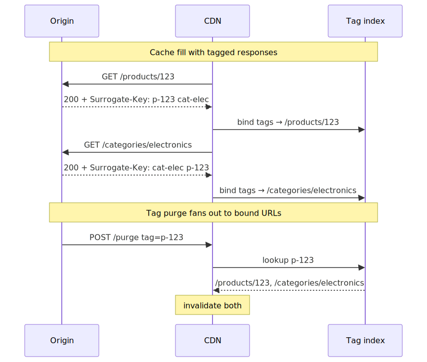
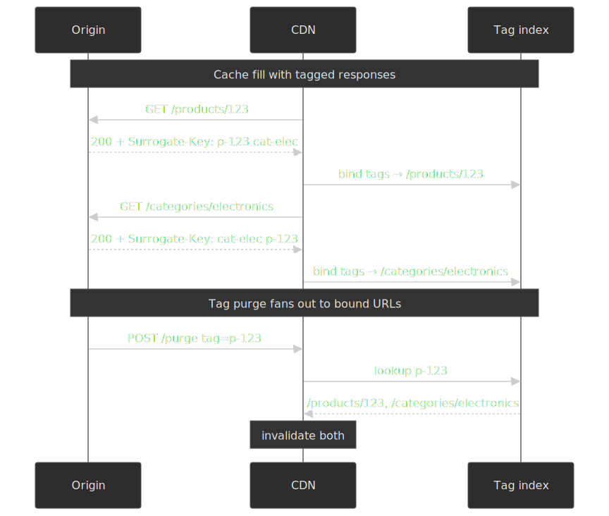

The header conventions and limits differ enough across vendors that you should never assume portability:

| CDN          | Tag header                  | Per-key limit  | Per-header limit             | Notes                                                                                                |
| ------------ | --------------------------- | -------------- | ---------------------------- | ---------------------------------------------------------------------------------------------------- |
| Fastly       | `Surrogate-Key`             | 1,024 bytes    | 16,384 bytes                 | Native; instant purge ~150 ms global P50.[^fastly-keys][^fastly-purge]                                |
| Akamai       | `Edge-Cache-Tag`            | 128 chars      | 128 tags per object          | Fast Purge API; 5,000 tag purges/hour, 10,000 objects/min per account.[^akamai-tags]                 |
| Cloudflare   | `Cache-Tag`                 | 1,024 chars (API)  | 16 KB total per response | Purge by tag is now available on **all plans**, not just Enterprise.[^cf-tags-all][^cf-tags-docs]    |
| Varnish      | `xkey` VCL module           | implementation-defined | implementation-defined | Operator-controlled secondary index.                                                                  |
| CloudFront   | none (no native support)    | n/a            | n/a                          | Workaround: maintain a tag→URL index in your app or a Lambda@Edge-fronted DynamoDB and purge paths.   |

[^fastly-keys]: [Surrogate-Key — Fastly HTTP headers](https://www.fastly.com/documentation/reference/http/http-headers/Surrogate-Key/).
[^fastly-purge]: [Fastly Instant Purge: under 150 ms for over a decade](https://www.fastly.com/blog/fastly-instant-purge-under-150ms-for-over-a-decade).
[^akamai-tags]: [Purge content by cache tag — Akamai](https://techdocs.akamai.com/purge-cache/docs/purge-content-cache-tag).
[^cf-tags-all]: [Cloudflare — Instant Purge for All](https://blog.cloudflare.com/instant-purge-for-all/), Sep 2024. Tag, prefix, and hostname purge are no longer Enterprise-only.
[^cf-tags-docs]: [Purge cache by cache-tags — Cloudflare](https://developers.cloudflare.com/cache/how-to/purge-cache/purge-by-tags/).

A worked example. The origin emits:

```http title="response from /products/123"
HTTP/1.1 200 OK
Content-Type: text/html; charset=utf-8
Surrogate-Key: product-123 cat-electronics homepage
Surrogate-Control: max-age=86400
Cache-Control: public, max-age=60, stale-while-revalidate=600
```

When the catalogue editor saves a price change, the application issues:

```bash title="purge by surrogate key (Fastly)"
curl -X POST "https://api.fastly.com/service/${SERVICE_ID}/purge/product-123" \
  -H "Fastly-Key: ${FASTLY_API_KEY}"
```

That single call invalidates `/products/123`, `/categories/electronics`, and `/homepage` — anywhere `product-123` was attached. The trade-off is real: you pay for it with origin code that has to compute and emit the right tags on every response, and you constrain yourself to vendors that support the feature.

### Soft purge vs hard purge

A purge can mean two materially different things:

- **Hard purge** — the entry is dropped. The next request is a guaranteed cache MISS and pays the full origin RTT synchronously. This is the only behavior that satisfies "must not serve this content again" (legal takedowns, leaked secrets, broken responses).
- **Soft purge** — the entry is *marked stale* but kept in cache, so it remains eligible for `stale-while-revalidate` and `stale-if-error`. The next request serves the stale body instantly while the CDN refetches in the background. Origin load step is bounded to one request per key per region, not N.

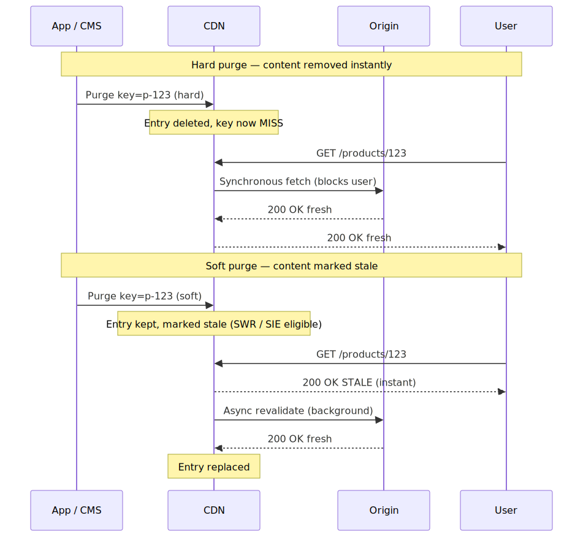
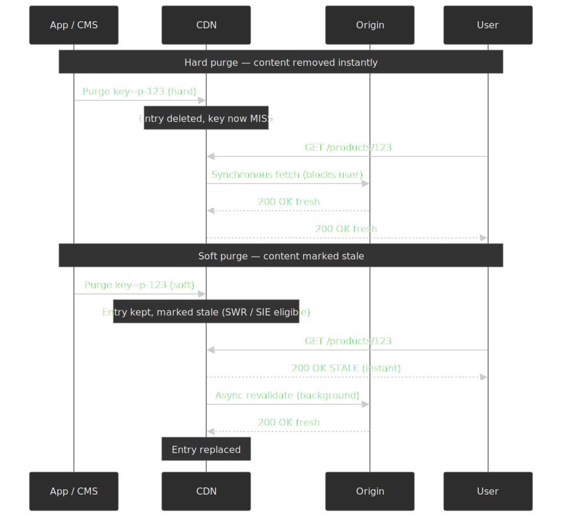

Vendor support for the soft variant differs:

| CDN        | Soft purge mechanism                                                                                                                          |
| ---------- | --------------------------------------------------------------------------------------------------------------------------------------------- |
| Fastly     | `Fastly-Soft-Purge: 1` request header on URL or surrogate-key purge.[^fastly-soft-purge] Combine with `stale-while-revalidate` for SWR fan-out. |
| Akamai     | Fast Purge `Invalidate` action marks objects stale (next request triggers conditional GET); `Delete` evicts immediately.[^akamai-tags]        |
| Cloudflare | Purge always evicts; closest equivalent is `stale-while-revalidate` on the origin response (no soft-purge API).                               |
| CloudFront | Invalidations always evict; no native soft-purge primitive.                                                                                   |

[^fastly-soft-purge]: [Soft purges — Fastly documentation](https://www.fastly.com/documentation/guides/full-site-delivery/purging/soft-purges/); [Introducing Soft Purge](https://www.fastly.com/blog/introducing-soft-purge-more-efficient-way-mark-outdated-content), Fastly blog.

> [!TIP]
> Default to **soft purge** for CMS edits, deploys, and content updates. Reserve **hard purge** for the cases where serving the old body even once would be wrong (PII, security, legal takedown). The user-visible latency difference on the first post-purge request is the entire point of the distinction.

### Invalidation propagation timing

Purge is asynchronous. Plan for it.

| CDN              | Typical global propagation                | Notes                                                                                              |
| ---------------- | ----------------------------------------- | -------------------------------------------------------------------------------------------------- |
| Cloudflare       | < 150 ms P50                              | "Instant Purge" via distributed coreless architecture.[^cf-instant-purge]                          |
| Fastly           | ~ 150 ms global                           | Sub-second for most regions; primarily bounded by speed-of-light to PoPs.[^fastly-purge]            |
| AWS CloudFront   | Typically < 2 min, up to 10–15 min globally | Per-edge propagation; varies with distribution size.[^cf-propagation]                                |
| Google Cloud CDN | ~ 10 s per request, full propagation in minutes | 500 invalidations/minute account-level rate limit.[^gcp-cache]                                     |
| Akamai           | Seconds to minutes via Fast Purge API     | "Invalidate" (conditional GET) and "Delete" (force fetch) modes.[^akamai-tags]                     |

[^cf-instant-purge]: [Instant Purge: invalidating cached content in under 150 ms](https://blog.cloudflare.com/instant-purge/), Cloudflare.
[^cf-propagation]: [Pay for file invalidation — Amazon CloudFront](https://docs.aws.amazon.com/AmazonCloudFront/latest/DeveloperGuide/PayingForInvalidation.html); see also [Invalidating files](https://docs.aws.amazon.com/AmazonCloudFront/latest/DeveloperGuide/Invalidation.html).
[^gcp-cache]: [Cache invalidation overview — Google Cloud CDN](https://cloud.google.com/cdn/docs/cache-invalidation-overview).

> [!WARNING]
> Don't deploy a "purge then immediately verify in CI" step that assumes the purge is global by the time the verification request lands. On AWS this can fail intermittently for tens of minutes. Either wait, or query a known-cold edge with a cache-busting query string for verification.

#### Deploy + purge race conditions

The classic incident is "deployed at T, purged at T+1, but a PoP that hadn't seen the purge yet re-pulled the *old* origin between T and T+1 and re-cached it for the full TTL." Three rules contain it:

1. **Order matters.** Make the new origin authoritative before issuing the purge — atomic-swap behind a load balancer, blue/green deploy, or content-addressed origin paths. A purge against an origin still serving the old body just refills the cache with stale.
2. **Purge after deploy completes globally**, not after the deploy step kicks off. CD systems that fire purges from the build runner before the rollout finishes ship this bug routinely.
3. **For HTML that references content-addressed assets**, purge the HTML key, not the assets. The asset URLs change with the deploy and never collide.

## Stale-while-revalidate and stale-if-error

[RFC 5861](https://datatracker.ietf.org/doc/html/rfc5861) adds two `Cache-Control` extensions that change the freshness-vs-availability calculus. They are the closest thing the cache layer has to a free lunch.

### Stale-while-revalidate (SWR)

```http
Cache-Control: max-age=600, stale-while-revalidate=30
```

The lifecycle of a cached response under this directive:

1. **0 – 600 s.** Fresh. Served from cache.
2. **600 – 630 s.** Stale but inside the SWR window. The cache **returns the stale response immediately** and triggers an asynchronous revalidation in the background. The next request gets fresh content.
3. **> 630 s.** Truly stale. The cache must fetch synchronously before responding.

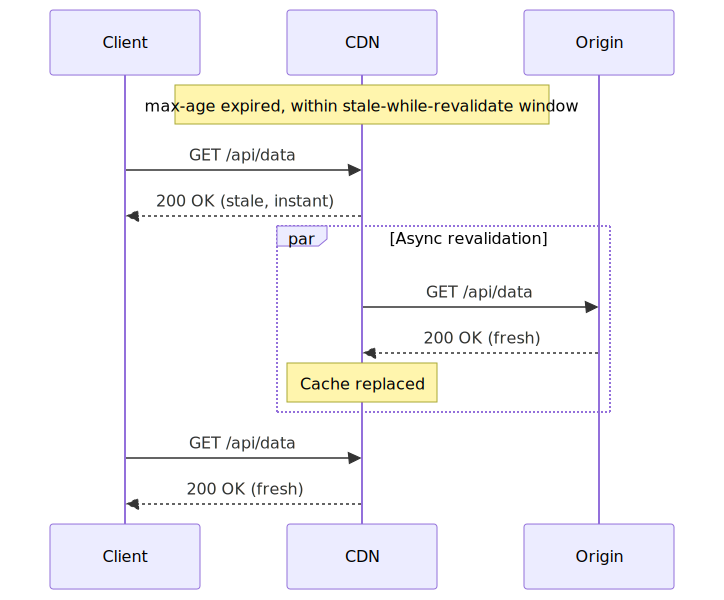
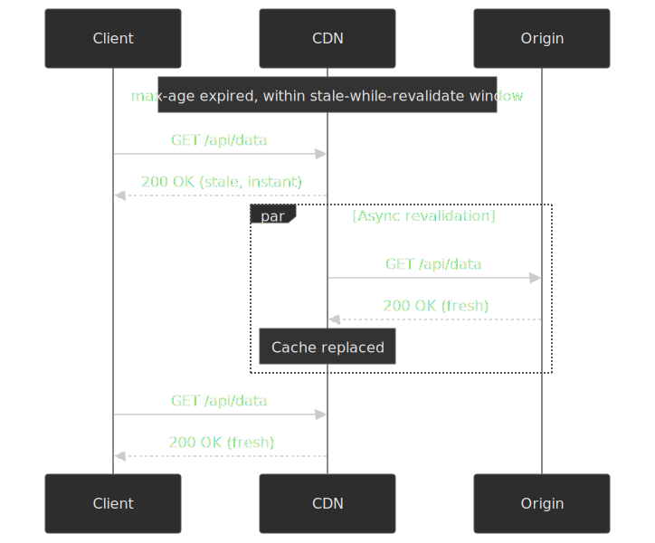

The point is to push revalidation latency off the user-visible path. It also de-fangs the thundering herd: the first concurrent request serves stale and fires one background fetch; the rest still see cache hits.

Browser support landed in **Chrome 75+, Edge 79+, Firefox 68+, and Safari 14+**.[^swr-caniuse] Browsers that don't recognise the directive simply ignore it and fall back to `max-age` semantics. CDN support is mature on Cloudflare, Fastly, KeyCDN, and Varnish; CloudFront needs Lambda@Edge to implement true SWR. One subtle constraint: if no traffic arrives during the SWR window, the entry truly expires and the next request pays the full origin RTT — SWR is only a steady-state win for warm endpoints.

[^swr-caniuse]: [`stale-while-revalidate` browser support — Can I use](https://caniuse.com/?search=stale-while-revalidate); [Keeping things fresh with stale-while-revalidate](https://web.dev/articles/stale-while-revalidate), web.dev.

### Stale-if-error (SIE)

```http
Cache-Control: max-age=600, stale-if-error=86400
```

Origin returned a 5xx or is unreachable? Serve the stale response for the SIE window instead of propagating the error. This trades freshness for availability, and it makes a bad deploy look like a slightly stale page rather than a 503 storm.

The combined production recipe:

```http
Cache-Control: max-age=300, stale-while-revalidate=60, stale-if-error=86400
```

Five minutes fresh; one minute of async-refresh window; one day of error-survival cushion. This single header turns a 30-minute origin outage into a non-event for read-heavy endpoints.

### Varnish grace mode

Varnish predates RFC 5861 and exposes the same idea with finer control via VCL:

```vcl title="grace.vcl"
sub vcl_backend_response {
    set beresp.ttl = 300s;
    set beresp.grace = 1h;
}

sub vcl_recv {
    if (std.healthy(req.backend_hint)) {
        set req.grace = 10s;
    } else {
        set req.grace = 24h;
    }
}
```

The interesting move is the split between `beresp.grace` (how long the cache *retains* a stale object after expiry) and `req.grace` (how stale a *given request* is willing to accept). When the backend health probe flips, you can extend the request-side grace from 10 s to 24 h on the fly without re-emitting any responses.

## Operational guardrails

### Cache hit ratio (CHR)

CHR is the primary health metric for a CDN. The formula is trivial:

$$
\text{CHR} = \frac{\text{cache hits}}{\text{cache hits} + \text{cache misses}}
$$

Useful target bands, from operating sites at scale:

- **Static assets:** > 95 %.
- **Mixed-content sites:** > 85 %.
- **Investigate:** anything below 80 % on a previously healthy endpoint.

A global average is a **bad** target because it hides the failure that hurts. Always segment by content type, region, and URL pattern. A 90 % global CHR with 50 % CHR on `/api/*` is a hot origin waiting to happen.

The recurring CHR killers, in order of how often they show up in real incidents:

1. **High-cardinality `Vary` headers** (Accept-Language, User-Agent) — the cache splits into thousands of variants per URL.
2. **Tracking parameters in the cache key** — `?utm_source=...&fbclid=...` makes every share a unique key. Strip them with a query-string allow-list.
3. **Aggressive `Vary: Cookie`** — usually unintended, usually catastrophic; one session cookie effectively turns the cache off.
4. **TTL too short for actual change rate** — e.g. 60 s TTL on content that changes hourly.
5. **Origin emitting `Cache-Control: no-store` unintentionally** — common after a deploy of an auth middleware that "secures" everything.

### Cache stampede (thundering herd)

When a popular cached entry expires, every concurrent request misses the cache and hits the origin in the same instant.

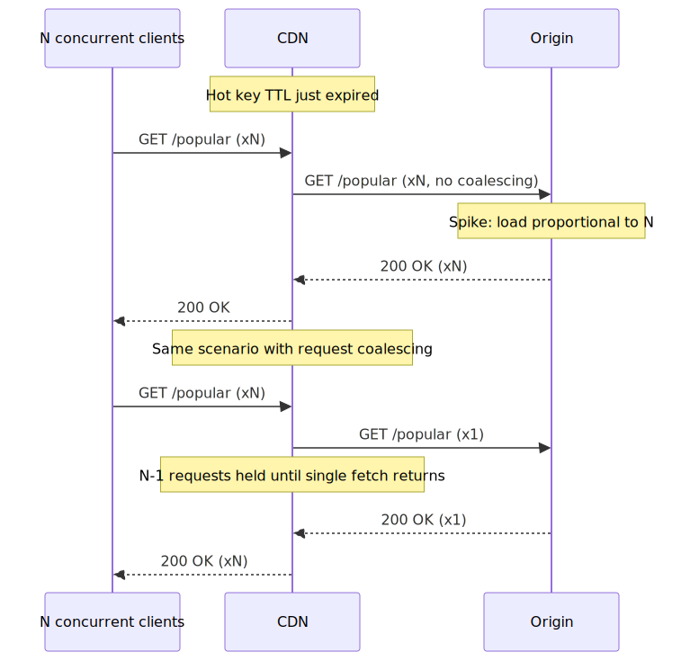
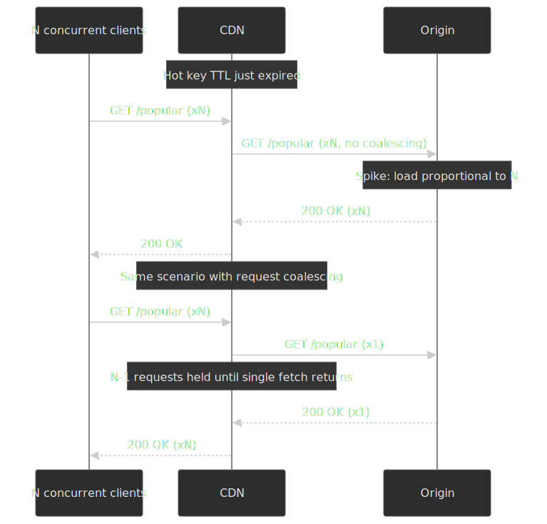

A 98 % CHR endpoint at 50k RPS sees a load step from ~1k RPS to 50k RPS the moment a hot key expires — a 50× origin spike. The mitigations stack:

1. **Request coalescing at the edge.** [CloudFront does this natively](https://docs.aws.amazon.com/AmazonCloudFront/latest/DeveloperGuide/RequestAndResponseBehaviorCustomOrigin.html#request-collapsing): concurrent requests for the same key are paused while one fetch goes upstream, and the response is fanned back out. Fastly does the same by default. [Cloudflare's Tiered Cache](https://developers.cloudflare.com/cache/how-to/tiered-cache/) adds upper-tier collapsing.
2. **Stale-while-revalidate.** First miss after expiry serves stale and fires one background refresh; subsequent requests still hit the cache. No stampede.
3. **Probabilistic early expiration (XFetch).** Refresh slightly before TTL with a probability that grows as expiry approaches. Vattani et al. show this is optimal under reasonable assumptions:[^xfetch] for a key with recompute cost $\delta$, expiry time $T$, and a tunable $\beta \approx 1$, refresh whenever $\text{now} - \delta \beta \ln(\text{rand}) \geq T$. The effect is to spread re-fetches across a window instead of bunching them at the boundary.
4. **Origin Shield.** A single mid-tier cache that funnels misses from many edges. Multi-region misses become one origin request.

[^xfetch]: A. Vattani, F. Chierichetti, K. Lowenstein. [Optimal Probabilistic Cache Stampede Prevention](http://www.vldb.org/pvldb/vol8/p886-vattani.pdf). VLDB 2015.

> [!TIP]
> Coalescing has one ugly footgun. If your origin response varies by cookie or other private dimension and you have request collapsing on, two users can end up sharing one origin response. [CloudFront's documented rule](https://docs.aws.amazon.com/AmazonCloudFront/latest/DeveloperGuide/RequestAndResponseBehaviorCustomOrigin.html) is: collapsing is disabled when cookie forwarding is enabled, and is otherwise opt-out only by setting Min TTL to 0 *and* having the origin emit `Cache-Control: private`, `no-store`, `no-cache`, `max-age=0`, or `s-maxage=0`. If you depend on per-user variants, verify the equivalent rule on your CDN before turning collapsing on.

### Origin Shield architecture

Without a shield, every edge PoP that misses goes directly to origin:

```text
Edge NYC miss → Origin
Edge London miss → Origin
Edge Tokyo miss → Origin
= 3 origin requests
```

With a shield (a single regional cache between edges and origin):

```text
Edge NYC miss → Shield → Origin
Edge London miss → Shield (HIT)
Edge Tokyo miss → Shield (HIT)
= 1 origin request
```

When it earns its keep:

- High traffic with mediocre CHR (< 95 %) — the absolute miss volume is what hurts.
- Origins that cannot scale past a known ceiling (legacy systems, expensive databases).
- Globally distributed traffic over many edge PoPs — the multiplier on coalescing is largest.

The cost is real: AWS [charges $0.0075–$0.0160 per 10K requests at the shield](https://docs.aws.amazon.com/AmazonCloudFront/latest/DeveloperGuide/origin-shield.html) depending on region. Justify it by measuring origin RPS reduction, not by intuition.

### Graceful degradation patterns

Designing for origin failure is a full second axis on top of the freshness/cost trade-off. Three patterns that should be in every production playbook:

1. **Extended `stale-if-error`** — `stale-if-error=172800` keeps cached content alive for two days during outages.
2. **Static fallback at the edge** — if origin returns 5xx, serve a baked-in static page from edge KV/storage. Cloudflare Workers, Lambda@Edge, and Fastly Compute can all do this.
3. **Health-aware grace** — Varnish's pattern above: extend the stale-acceptance window when the backend probe flips unhealthy.
4. **Edge circuit breaker** — after N consecutive origin errors, stop sending traffic for a cooldown period and serve stale or a static fallback instead.

## Edge compute use cases

Edge compute moves logic from origin (typically 100–300 ms RTT) to the edge PoP closest to the client (sub-ms). Used well, it shifts the personalisation boundary outward and lets you cache responses you couldn't cache before. Used badly, it's a slower, more expensive way to do work the origin was already doing.

### Platform comparison

| Platform                | Runtime                | Cold start                                    | Per-invocation execution limit | Best for                                              |
| ----------------------- | ---------------------- | --------------------------------------------- | ------------------------------ | ----------------------------------------------------- |
| CloudFront Functions   | JavaScript (subset)    | Effectively none (executes in request path)  | < 1 ms CPU                     | Header rewrites, redirects, simple URL transforms     |
| Lambda@Edge            | Node.js, Python        | Tens to hundreds of ms on cold path           | 5 s viewer / 30 s origin       | Complex logic, async I/O, surrogate-key workarounds   |
| Cloudflare Workers     | V8 isolate             | ~5 ms isolate startup; often ~0 user-visible via TLS-handshake prewarm[^cf-coldstart] | 10 ms (free) / 30 ms+ (paid) CPU | Full edge applications, KV-backed APIs               |
| Fastly Compute         | WASM (Rust, Go, AssemblyScript, …) | ~35 µs Wasmtime instance instantiation[^fastly-cold] | No hard cap; single-tenant per request   | High-performance compute, structured data transforms |

[^cf-coldstart]: [How Workers works](https://developers.cloudflare.com/workers/reference/how-workers-works/); [Eliminating Cold Starts 2: shard and conquer](https://blog.cloudflare.com/eliminating-cold-starts-2-shard-and-conquer/).
[^fastly-cold]: [Performance matters: why Compute does not yet support JavaScript](https://www.fastly.com/blog/why-edge-compute-does-not-yet-support-javascript), Fastly. Note: 35 µs is hot-instance instantiation; cold-path latency is higher in practice.

| Platform               | Per 1M invocations | Notes                                                                    |
| ---------------------- | ------------------ | ------------------------------------------------------------------------ |
| CloudFront Functions  | $0.10              | First 2M invocations/month free.                                          |
| Lambda@Edge           | $0.60 + GB-seconds | No free tier; viewer-request and origin-request have different limits.    |
| Cloudflare Workers    | $0.30 (Standard)   | $5/month minimum on the paid plan covers 10M requests; CPU billed separately. |
| Fastly Compute        | Bundled with Compute@Edge plan | Pricing model is bundled, not per-invocation; consult your contract. |

### Personalisation without origin load

Classic personalisation needs an origin per request. Edge compute lets you cache the variants:

```js title="personalisation.js — CloudFront Functions"
function handler(event) {
  const request = event.request;
  const cookies = request.cookies;

  const segment = cookies.user_segment?.value ?? "default";

  request.headers["x-user-segment"] = { value: segment };
  return request;
}
```

Wire `x-user-segment` into the cache key policy. Three segments × 1,000 pages = 3,000 cached variants — all served from the edge, none from origin. The trade-off is variant explosion: if you also vary by language, device, and feature flag, segments multiply quickly. Cap your dimensions at three or four with explicit fallbacks.

### A/B testing at the edge

```js title="ab-testing.js — Cloudflare Workers"
export default {
  async fetch(request) {
    const url = new URL(request.url);
    let variant = getCookie(request, "ab_variant");

    if (!variant) {
      variant = Math.random() < 0.5 ? "a" : "b";
    }

    url.pathname = `/${variant}${url.pathname}`;

    const response = await fetch(url.toString(), request);
    const newResponse = new Response(response.body, response);
    if (!getCookie(request, "ab_variant")) {
      newResponse.headers.set("Set-Cookie", `ab_variant=${variant}; Path=/; Max-Age=86400`);
    }
    return newResponse;
  },
};
```

Why move A/B at the edge:

- No layout shift — the variant decision is made before HTML is sent.
- No JavaScript dependency on the client.
- Consistent assignment across page loads via cookie persistence.
- Works for users with JS disabled.

### Geo-routing and compliance

Edge compute is the cleanest place to express data-locality rules:

```js title="geo-routing.js — Lambda@Edge"
exports.handler = async (event) => {
  const request = event.Records[0].cf.request;
  const country = request.headers["cloudfront-viewer-country"][0].value;

  const euCountries = ["DE", "FR", "IT", "ES", "NL", "BE", "AT", "PL"];

  if (euCountries.includes(country)) {
    request.origin.custom.domainName = "eu-origin.example.com";
  } else {
    request.origin.custom.domainName = "us-origin.example.com";
  }

  return request;
};
```

For compliance-driven routing (GDPR data residency, sectoral regulation) the contract is: the request never reaches an origin outside the allowed region. Verify this with synthetic probes from each region, not just code review.

## Practical takeaways

- **Cache key controls correctness; TTL controls cost and freshness.** Review them on different cadences and treat them as separate failure domains.
- **Climb the invalidation ladder.** Versioned URLs first; SWR for documents and APIs; surrogate keys for content with relationships; path purges for emergencies; full clears never.
- **Default to `Cache-Control: max-age=N, stale-while-revalidate=M, stale-if-error=K`** for HTML and JSON APIs. The combination hides revalidation latency, prevents stampedes, and survives origin outages.
- **Segment your CHR dashboards.** Global numbers hide the next incident.
- **Buy request coalescing.** Whether through native CDN behaviour, Origin Shield, Tiered Cache, or SWR — make sure a popular key expiring cannot send N requests to your origin.
- **Treat purge as eventually consistent.** Build for it in deploy pipelines; verify against cold edges with cache-busting query strings.
- **Pick the cheapest edge runtime that fits the work.** CloudFront Functions for header munging; Workers / Compute when you need real logic; Lambda@Edge when you need AWS APIs and you've measured the latency.

## Appendix

### Prerequisites

- HTTP caching model (request/response headers, freshness, validation).
- CDN concepts (edge PoPs, origin, cache keys).
- Basic familiarity with distributed-systems failure modes.

### Glossary

- **Cache key.** Identifier used to look up a stored response — typically `method + host + path + query` plus selected headers.
- **TTL (time to live).** Duration content is considered fresh.
- **CHR (cache hit ratio).** Hits divided by total requests.
- **PoP (point of presence).** Edge data centre where a CDN serves traffic.
- **Origin Shield.** Centralised cache layer between edges and origin.
- **Surrogate key (cache tag).** Tag attached to a response so groups of cached entries can be invalidated together.
- **Thundering herd / stampede.** Concurrent miss storm at origin after a popular cache entry expires.
- **SWR.** `stale-while-revalidate` — serve stale content while asynchronously refreshing.
- **SIE.** `stale-if-error` — serve stale content when origin returns errors.

### References

**Specifications**

- [RFC 9111 — HTTP Caching](https://www.rfc-editor.org/rfc/rfc9111.html), STD 98 (June 2022).
- [RFC 9110 — HTTP Semantics](https://www.rfc-editor.org/rfc/rfc9110.html).
- [RFC 5861 — HTTP Cache-Control extensions for stale content](https://datatracker.ietf.org/doc/html/rfc5861).
- [RFC 8246 — `immutable` Cache-Control extension](https://datatracker.ietf.org/doc/html/rfc8246).
- [RFC 9213 — Targeted HTTP Cache Control (`CDN-Cache-Control`)](https://www.rfc-editor.org/rfc/rfc9213.html), June 2022.
- [W3C Edge Architecture Specification 1.0](https://www.w3.org/TR/edge-arch/) — origin of `Surrogate-Control` and `Surrogate-Capability`.

**CDN provider documentation**

- [CloudFront — Cache key and origin requests](https://docs.aws.amazon.com/AmazonCloudFront/latest/DeveloperGuide/understanding-the-cache-key.html).
- [CloudFront — Edge functions: choose between CloudFront Functions and Lambda@Edge](https://docs.aws.amazon.com/AmazonCloudFront/latest/DeveloperGuide/edge-functions-choosing.html).
- [CloudFront — Origin Shield](https://docs.aws.amazon.com/AmazonCloudFront/latest/DeveloperGuide/origin-shield.html).
- [CloudFront — Pay for file invalidation](https://docs.aws.amazon.com/AmazonCloudFront/latest/DeveloperGuide/PayingForInvalidation.html).
- [Fastly — Working with surrogate keys](https://www.fastly.com/documentation/guides/full-site-delivery/purging/working-with-surrogate-keys).
- [Fastly — Serving stale content](https://www.fastly.com/documentation/guides/full-site-delivery/performance/serving-stale-content/).
- [Cloudflare — Instant Purge architecture](https://blog.cloudflare.com/instant-purge/).
- [Cloudflare — Purge cache by cache-tags](https://developers.cloudflare.com/cache/how-to/purge-cache/purge-by-tags/).
- [Cloudflare — Tiered Cache](https://developers.cloudflare.com/cache/how-to/tiered-cache/).
- [Cloudflare Workers — How Workers works](https://developers.cloudflare.com/workers/reference/how-workers-works/).
- [Google Cloud CDN — Cache invalidation overview](https://cloud.google.com/cdn/docs/cache-invalidation-overview).
- [Akamai — Purge content by cache tag](https://techdocs.akamai.com/purge-cache/docs/purge-content-cache-tag).

**Educational and primary-source practitioner**

- [MDN — HTTP caching](https://developer.mozilla.org/en-US/docs/Web/HTTP/Guides/Caching).
- [MDN — `Cache-Control`](https://developer.mozilla.org/en-US/docs/Web/HTTP/Reference/Headers/Cache-Control).
- [web.dev — Keeping things fresh with stale-while-revalidate](https://web.dev/articles/stale-while-revalidate).
- [Varnish — Grace mode](https://varnish-cache.org/docs/7.3/users-guide/vcl-grace.html).
- [Cloudflare — Rethinking cache purge (coreless purge)](https://blog.cloudflare.com/part1-coreless-purge/).
- [Fastly — Best practices for using the `Vary` header](https://www.fastly.com/blog/best-practices-using-vary-header).
- [Vattani et al. — Optimal Probabilistic Cache Stampede Prevention (VLDB 2015)](http://www.vldb.org/pvldb/vol8/p886-vattani.pdf).
- [Philip Walton — Performant A/B testing with Cloudflare Workers](https://philipwalton.com/articles/performant-a-b-testing-with-cloudflare-workers/).
