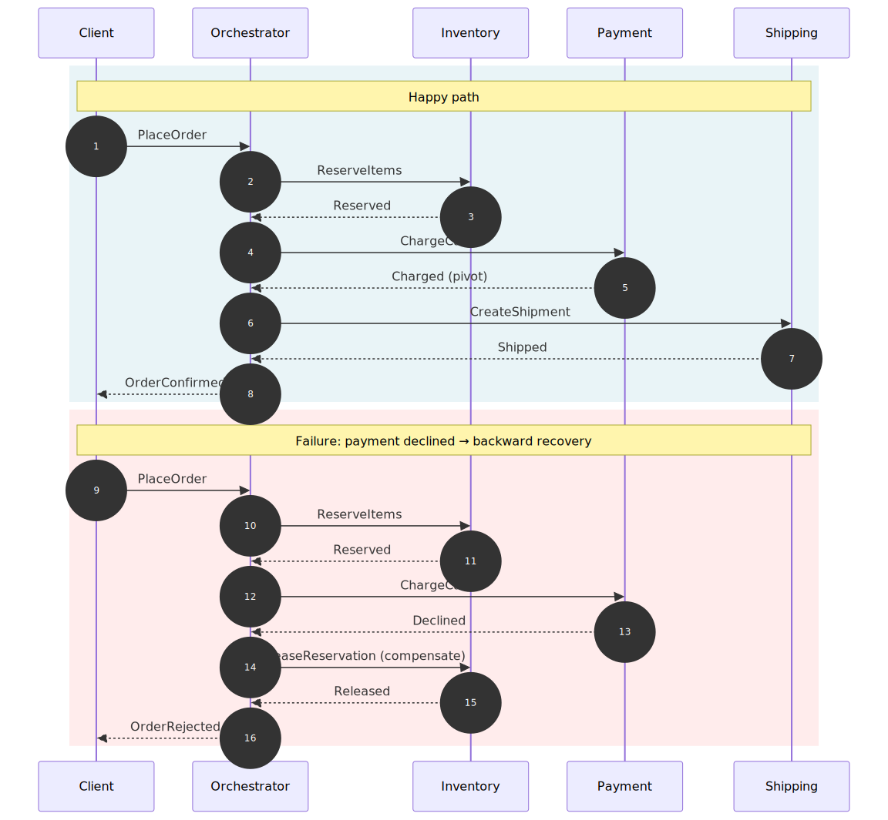
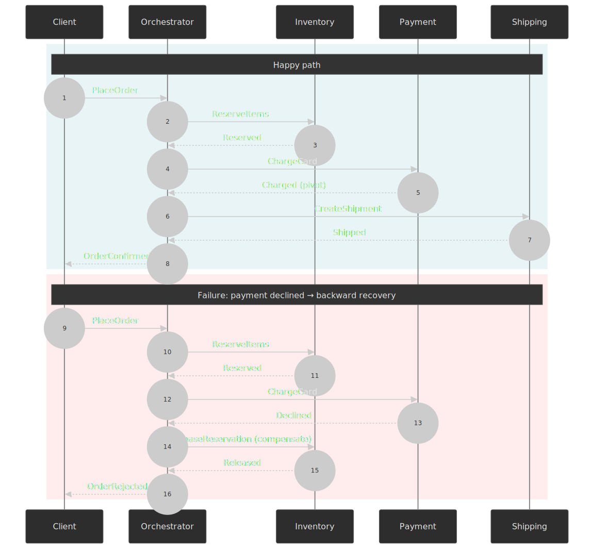
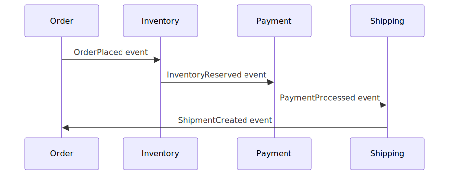
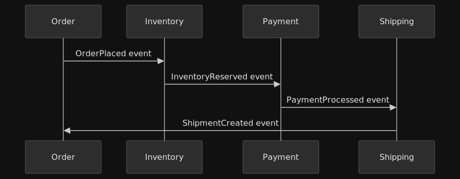
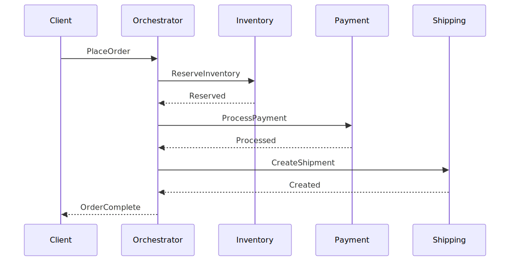
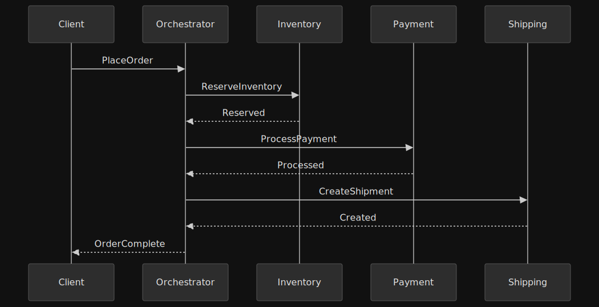
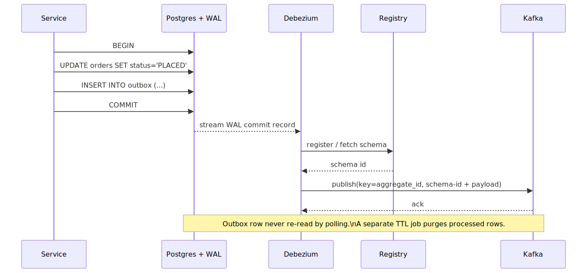
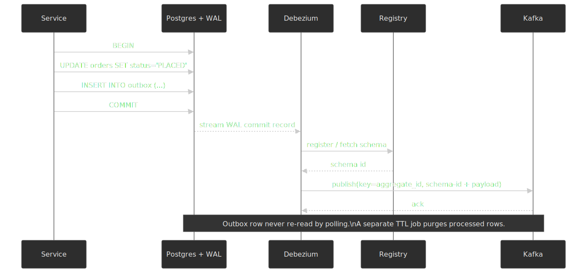
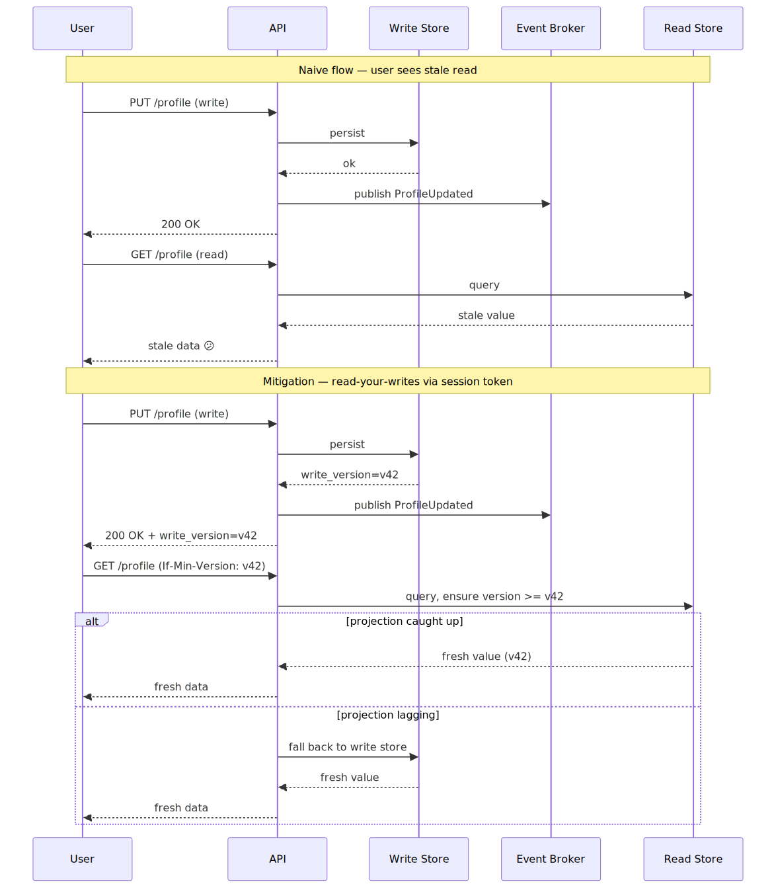
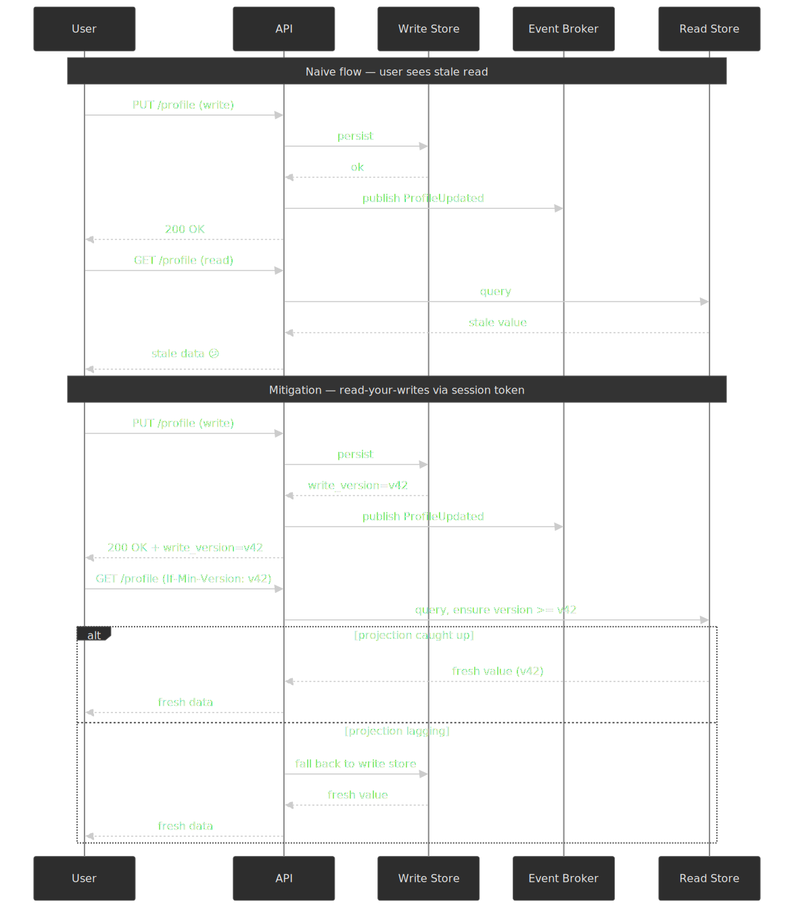

# Event-Driven Architecture

Event-driven architecture (EDA) replaces synchronous request chains with asynchronous event publishing. The producer emits a fact about something that happened; consumers independently decide how to react. The pattern is liberating when you need decoupling and elastic fan-out, and a tax when you need a transactional `OK / not OK` answer to a user. This article covers when to choose EDA, the four patterns that decide whether it succeeds or collapses (sagas, transactional outbox, schema evolution, idempotency), and the operational reality that prose-only EDA tutorials gloss over.

 which consumers exist.")


## What you should already know

This article assumes you've read the sibling pieces in this series:

- [Queues and Pub/Sub](../queues-and-pubsub/README.md) — broker semantics, delivery guarantees, ordering, fan-out vs. competing-consumer patterns. The "is it Kafka, RabbitMQ, or SQS?" decision lives there.
- [Event Sourcing](../event-sourcing-deep-dive/README.md) — the storage variant of EDA where events are the source of truth. This article only sketches it; the deep-dive covers stream design, snapshots, projections, upcasting, and operational cost.
- [Exactly-Once Delivery](../exactly-once-delivery/README.md) — idempotency strategies, deduplication windows, and why "exactly-once" is a UX guarantee, not a delivery guarantee.

This article is the umbrella: when EDA is the right paradigm, how to wire services together with events, and how to keep the system honest under failure.

## Mental model

| Axis              | Request-driven (sync)               | Event-driven (async)                    |
| ----------------- | ----------------------------------- | --------------------------------------- |
| Communication     | Caller waits for response           | Producer emits, moves on                |
| Coupling          | Caller knows downstream services    | Producer does not know consumers        |
| Consistency       | Strong (at the cost of latency)     | Eventual (latency is bounded, not zero) |
| Failure blast     | Cascades up the call chain          | Isolated to each consumer               |
| Scaling unit      | Slowest service in the chain        | Each consumer independently             |
| Adding a consumer | Coordinated change to the producer  | Subscribe to the broker                 |
| Debugging         | Single stack trace                  | Distributed trace across topics         |

Three vocabulary clarifications that catch teams out:

1. An **event** is a fact about the past (`OrderPlaced`, `EmailAddressChanged`). It is not a command (`SendEmail`, `ChargeCard`). Mixing the two re-introduces the coupling EDA was meant to remove ([Fowler, 2017](https://martinfowler.com/articles/201701-event-driven.html)).
2. **Event-driven** is the integration pattern (services react to events). **Event sourcing** is a storage pattern (events are the source of truth). You can do either without the other; this article focuses on the integration variant and points to the [storage deep-dive](../event-sourcing-deep-dive/README.md) when relevant.
3. **Eventual consistency** is not "consistency, eventually" with no upper bound. In a healthy system the lag is observable and bounded — same datacenter typically tens of milliseconds, cross-region hundreds of milliseconds. Calling out the actual window is the difference between an SLA and a hand-wave.

## Message taxonomy: events are not the only thing on the wire

The literature uses "message" for anything sent through a broker and "event" for one specific kind of message. Hohpe and Woolf's *Enterprise Integration Patterns* groups asynchronous messages into three intents: [Command Message](https://www.enterpriseintegrationpatterns.com/patterns/messaging/CommandMessage.html), [Event Message](https://www.enterpriseintegrationpatterns.com/patterns/messaging/EventMessage.html), and [Document Message](https://www.enterpriseintegrationpatterns.com/patterns/messaging/DocumentMessage.html). Within events, Fowler distinguishes by payload weight — a thin "something happened, go ask me" notification versus a fat self-contained snapshot ([Martin Fowler — *What do you mean by "Event-Driven"?*](https://martinfowler.com/articles/201701-event-driven.html)).

The two axes — intent and payload — collapse into a useful 2×2:




| Kind                                | Tense / mood     | Receiver knowledge       | Coupling shape                    | Typical use                                 |
| ----------------------------------- | ---------------- | ------------------------ | --------------------------------- | ------------------------------------------- |
| Command Message                     | Imperative       | Sender knows the handler | Sender → handler (point-to-point) | Workflow steps, orchestrator → service      |
| Event Notification                  | Past, lightweight| Sender oblivious         | Pub/sub, callbacks query source   | Cache invalidations, "go fetch" triggers    |
| Event-Carried State Transfer (ECST) | Past, full state | Sender oblivious         | Pub/sub, consumers materialise locally | Read-model sync, downstream services avoid call-back   |
| Document Message                    | Neutral          | Bilateral contract       | Bulk transfer, file drop          | Batch handoff, ETL inputs                   |

Three operational consequences:

- **Commands carry coupling.** A `SendEmail` event is a command in disguise — the producer has decided what the consumer should do. Rename the fact (`OrderConfirmed`) and let consumers decide. This is the most common EDA mistake and it silently re-creates the synchronous coupling the team was trying to remove.
- **Notifications keep the producer authoritative.** Consumers must call back for the current state, which keeps coupling on the source service — fine for cache invalidations, painful when the source is on the critical path of every consumer.
- **ECST removes the call-back at the cost of payload size and stale-read risk.** Consumers materialise their own copy of the state in the event payload; they no longer need to call the producer, but the payload is bigger and cross-event ordering matters more (an `OrderUpdatedV2` event must not overwrite a more recent state). Pair with version stamps in the payload.

A standardised envelope helps regardless of intent. The CNCF [CloudEvents 1.0.2 specification](https://github.com/cloudevents/spec/blob/main/cloudevents/spec.md) defines a minimal set of context attributes (`id`, `source`, `specversion`, `type`, plus optional `subject`, `time`, `datacontenttype`, `dataschema`, and extensions) and protocol bindings for HTTP, Kafka, NATS, MQTT, AMQP, and others — useful when events cross trust or platform boundaries. The [AsyncAPI 3.0](https://www.asyncapi.com/docs/reference/specification/v3.0.0) specification plays the same role for the *interface* (channels, operations, message contracts) that OpenAPI plays for synchronous HTTP. Treat them as cheap insurance: they cost a few attributes per message and pay back the first time a downstream team builds a generic consumer or a router.

> [!TIP]
> **Event Storming** ([Alberto Brandolini — *Introducing Event Storming*](https://www.eventstorming.com/book/)) is the discovery technique most teams use to map the events worth publishing. Pin orange "domain event" stickies on a wall in past tense, then add blue "command" and yellow "actor" stickies; the gaps and contradictions surface fast. Run it before you commit topic names.

## Production reality, in numbers

EDA is not a niche pattern. Three current data points to calibrate scale:

- **LinkedIn** runs over 100 Kafka clusters and 4,000+ brokers, processing more than 7 trillion messages per day across 100,000+ topics ([LinkedIn Engineering — Apache Kafka for Trillion Messages, 2019](https://www.linkedin.com/blog/engineering/open-source/apache-kafka-trillion-messages)). LinkedIn has not published a refreshed top-line number since, but downstream stream-processing now runs on Apache Beam at the same scale ([LinkedIn Engineering — Stream Processing with Apache Beam at LinkedIn](https://www.linkedin.com/blog/engineering/open-source/unified-streaming-and-batch-pipelines-at-linkedin-reducing-process)). The 2015 Kafka-at-LinkedIn post[^linkedin-2015] (800 billion messages per day, 13M/sec peak, ~1,100 brokers) is the next-most-recent published baseline.
- **Uber** runs over 300 microservices on Kafka with multi-petabyte daily throughput ([Uber Engineering — Kafka Async Queuing with Consumer Proxy](https://www.uber.com/us/en/blog/kafka-async-queuing-with-consumer-proxy/)). The ad-event pipeline uses Flink + Kafka transactions with two-phase commit for end-to-end exactly-once analytics ([Uber Engineering — Real-Time Exactly-Once Ad Event Processing](https://www.uber.com/us/en/blog/real-time-exactly-once-ad-event-processing/)).
- **Netflix** uses event sourcing on Cassandra for downloads license accounting, with snapshotting and "delayed materialization" so projections re-query source services for current entity state instead of relying on potentially out-of-order event payloads ([Netflix TechBlog — Scaling Event Sourcing for Netflix Downloads (Episode 2)](https://netflixtechblog.com/scaling-event-sourcing-for-netflix-downloads-episode-2-ce1b54d46eec)).

The shape that recurs in all three: request-driven for the user-facing operation that needs an immediate answer, event-driven for everything that hangs off it (analytics, billing, downstream notifications, fraud, audit). EDA is a complement, not a replacement.

[^linkedin-2015]: [LinkedIn Engineering — Running Kafka at Scale (2015)](https://engineering.linkedin.com/kafka/running-kafka-scale). Useful as historical context for the early shape of multi-tenant Kafka, but the current numbers are eight to ten times larger.

## When events beat requests

The mistake is treating "EDA vs. request-driven" as an architectural style war. It is a per-interaction decision. Pick request-driven when the caller needs a synchronous answer; pick events when the caller is publishing a fact others care about.

### Request-driven keeps making sense for

- User-facing transactions where the response reflects committed state — checkout, login, payment authorisation.
- Operations bounded by a single aggregate where ACID is cheaper than the choreography to coordinate it (decrement inventory by 1, transfer balance).
- New systems where the consumer count is fixed (one client, one server) and the team has not built operational muscle for async failure modes yet.

The price you pay: the slowest service in the chain bounds the SLO of the whole call. Cascading failure is one timeout away. Adding a consumer ("we also want to track conversions") is a producer change.

### Events become the right answer when

- Multiple downstream consumers exist or will exist. Adding a consumer should be `kafka-console-consumer --topic order.placed`, not a deploy of the order service.
- Producers and consumers must scale independently. The producer publishes 50k events/sec at peak; the audit-log consumer happily lags behind by 30 seconds; the search-index consumer batches into 100ms windows.
- The downstream work is genuinely asynchronous from the user's perspective ("we'll email you when it ships").
- A team boundary cuts through the workflow. The order team should not block on the analytics team's deployment.
- Throughput exceeds what a synchronous chain can carry without warming up enough connections to saturate the network.

### The decision in one picture




The hybrid pattern is what almost everyone settles on: a synchronous response on the front edge, an event published in the same transaction, and a swarm of independent consumers behind it.

## Distributed transactions: the saga pattern

Once you accept events, the next question is what replaces ACID across services. There is no distributed two-phase commit you actually want to operate (the coordinator is a single point of failure and a latency hot-spot). The standard answer is the **saga**: a sequence of local transactions where each step has a compensating action to undo it on failure ([Garcia-Molina & Salem, 1987 — *SAGAS*](https://www.cs.princeton.edu/techreports/1987/070.pdf)).

A saga has two recovery strategies ([AWS — Saga patterns](https://docs.aws.amazon.com/prescriptive-guidance/latest/cloud-design-patterns/saga.html)):

- **Backward recovery** — run compensating transactions in reverse for steps already completed.
- **Forward recovery** — retry the failed step until it succeeds; useful past the **pivot transaction** (the point of no return, e.g. payment captured), after which only retry is meaningful.




### Choreography: services react to each other's events

In a choreographed saga, every service subscribes to the events it cares about and emits its own. There is no central coordinator.




| Pro                                       | Con                                                                                |
| ----------------------------------------- | ---------------------------------------------------------------------------------- |
| No coordinator to fail or bottleneck      | The workflow is implicit — to read it you tail topics across N services            |
| Each service owns its logic               | Adding a step in the middle is a multi-service deploy                              |
| Easy to add reactive consumers            | Compensation logic is scattered; testing requires the whole system                 |
| Loose coupling between services           | Cyclic event loops are easy to introduce by accident                               |

Compensation is reactive: each service listens for failure events and undoes its own work. `PaymentFailed` arrives → Inventory releases its reservation. Works fine for two or three steps; quickly becomes archaeology when the workflow grows.

### Orchestration: a stateful coordinator drives the workflow

In an orchestrated saga, a stateful orchestrator (Temporal, AWS Step Functions, Camunda, a homegrown workflow engine) holds the state machine and explicitly issues commands to each service.




| Pro                                          | Con                                                                       |
| -------------------------------------------- | ------------------------------------------------------------------------- |
| Workflow is in one place — readable and testable | Orchestrator becomes a critical-path service                            |
| Compensation paths are explicit and auditable   | Risk of "smart orchestrator, dumb services" — domain logic leaks into it |
| Easy to instrument with traces and timeouts     | Orchestrator can become a coupling point if every workflow lives in it   |
| Versioning the workflow is one deploy            | Adds a stateful dependency to operate (state store, leader election)    |

Modern orchestrators (Temporal in particular) lean on durable timers and event sourcing internally so the workflow survives restarts mid-execution.

### Picking the right shape

The two styles are not just sequence-diagram differences — they imply different *topologies*. Choreography is a mesh around a broker; orchestration is hub-and-spoke around a stateful coordinator.




| Factor                       | Lean choreography                       | Lean orchestration                            |
| ---------------------------- | --------------------------------------- | --------------------------------------------- |
| Steps in the workflow        | 2-3                                     | 5+                                            |
| Cross-team coordination      | Independent teams own services          | Central platform team can own the workflow    |
| Visibility / audit pressure  | Low (internal pipeline)                 | High (regulated, customer-visible)            |
| Workflow change frequency    | Stable                                  | Evolves often or has many branches            |
| Compensation complexity      | Simple per-step rollback                | Conditional, multi-step, partial rollbacks    |

In practice, large systems mix both: choreography between bounded contexts ("the Order context publishes `OrderPlaced`, the Billing context decides what to do") and orchestration inside a context when a workflow has more than a handful of steps.

### Compensations have rules

A compensating action is not a database `ROLLBACK`; it's a domain operation that semantically undoes a previous step ([Garcia-Molina & Salem, 1987](https://www.cs.princeton.edu/techreports/1987/070.pdf); [Microsoft Learn — Saga design pattern](https://learn.microsoft.com/en-us/azure/architecture/patterns/saga)). To survive retries it must be:

- **Idempotent** — `RefundPayment(txn-123)` called five times must produce one refund. Use a deterministic key, not a fresh one per attempt.
- **Retryable** — transient failures during compensation must not leave the saga wedged. Cap retries and route to a dead-letter for human triage when exceeded.
- **Order-tolerant** — if the orchestrator restarts, compensations may not arrive in the original order. Design them to commute when feasible.
- **Aware of the pivot** — past the pivot transaction (e.g. funds captured, shipment released) compensation often becomes a *forward* action: a refund, not a "cancel the charge that already cleared". Some things genuinely cannot be undone (an email that was sent, an item that has shipped). Make those constraints explicit in the workflow.

> [!CAUTION]
> The most common saga bug is a compensation that succeeds at the database level but fails to publish its corresponding event, leaving downstream consumers convinced the original step still holds. Treat compensation events as production-critical first-class events: same outbox, same retries, same monitoring as the forward step.

## The transactional outbox: bridging state and events

Even before sagas, every event-publishing service hits the **dual-write problem**. The handler must commit local state *and* publish an event. Doing them separately means a crash between the two leaves the system inconsistent in one of two flavors:

- DB committed, event lost → consumers never see the change.
- Event published, DB rolled back → consumers act on a state that does not exist.

The transactional outbox pattern ([microservices.io — Transactional outbox](https://microservices.io/patterns/data/transactional-outbox.html); [AWS — Transactional outbox pattern](https://docs.aws.amazon.com/prescriptive-guidance/latest/cloud-design-patterns/transactional-outbox.html)) makes the two writes atomic by routing both through the database transaction.




The relay has two implementations:

| Relay style       | Mechanism                                     | Trade-offs                                                                                                      |
| ----------------- | --------------------------------------------- | --------------------------------------------------------------------------------------------------------------- |
| Polling publisher | Background job `SELECT … FROM outbox` on a tick | Simple to operate, language-agnostic. Adds DB load and 1 × tick worth of publish latency.                       |
| Log-tailing CDC   | Tail Postgres WAL / MySQL binlog with Debezium | Zero polling load; events arrive in commit order; lower latency. Adds a Kafka Connect / Debezium dependency.    |

Debezium ships a dedicated [Outbox Event Router SMT](https://debezium.io/documentation/reference/3.4/transformations/outbox-event-router.html) that maps outbox rows to topic + key + headers, making the CDC variant near-turnkey ([Debezium — Reliable Microservices Data Exchange](https://debezium.io/blog/2019/02/19/reliable-microservices-data-exchange-with-the-outbox-pattern/)).




The pattern is *at-least-once*, not exactly-once: the relay can crash after publishing but before marking the row processed, so consumers must be idempotent (see [Exactly-Once Delivery](../exactly-once-delivery/README.md)). Plan an `outbox` cleanup job — a TTL or a `DELETE WHERE created_at < now() - interval '7 days'` — or the table will dwarf your business data within a quarter.

> [!IMPORTANT]
> Do not use a separate "send to Kafka, then update DB" with try/catch. That's the dual-write problem with extra steps. The two writes have to share a single transactional resource — and the broker is not one of them.

## Schema evolution: events outlive their producers

Events are immutable facts about the past. You cannot "fix" old events; they say what happened. But producers and consumers will keep evolving, and the deploy order matters.

### Compatibility modes ([Confluent Schema Registry docs](https://docs.confluent.io/platform/current/schema-registry/fundamentals/schema-evolution.html))

| Mode                  | New consumer reads old? | Old consumer reads new? | Allowed changes                         | Deploy order               |
| --------------------- | ----------------------- | ----------------------- | --------------------------------------- | -------------------------- |
| `BACKWARD` (default)  | Yes                     | No                      | Add optional fields, delete fields      | Consumers first, producers second |
| `FORWARD`             | No                      | Yes                     | Add fields, delete optional fields      | Producers first, consumers second |
| `FULL`                | Yes                     | Yes                     | Add or delete optional fields only      | Either order               |
| `NONE`                | n/a                     | n/a                     | Anything (you own the consequences)    | Coordinated big-bang       |

Each has a `*_TRANSITIVE` variant that checks against every prior schema, not just the immediate predecessor. Confluent ships `BACKWARD` (non-transitive) as the default; `BACKWARD` only validates against the latest registered version, which is fine when consumers are routinely on the newest schema and topic retention is short, but lets a chain of compatible single-step changes drift away from the oldest schema still in retention. For shared event topics where consumers might lag (or replay weeks of history), promote the topic to `BACKWARD_TRANSITIVE`. Avro and Protobuf both support these checks; JSON Schema's `oneOf`/`additionalProperties` semantics make it the awkward one of the three.

, FORWARD (producer-first), FULL (any order), and breaking changes via a new event type.")


The compatibility *modes* are about which changes are legal. The *lifecycle* — who deploys first, when an upcaster retires, when a breaking change forces a new event type — is where teams trip up.




### Strategies for actual change

- **Optional-with-default.** New field added with a default value. Backward and forward compatible. The 80% case.
- **Upcasting.** Read-time transform from the older schema to the new shape. Lets the event store stay untouched but adds a maintenance burden in the consumer. Common in event-sourced systems where you cannot rewrite history.
- **New event type.** When the change is structural — `OrderPlaced` becomes `OrderPlacedV2` with a different aggregate boundary — version the type, not the field. Run both in parallel for a deprecation window, drain V1, then retire it.
- **Compensating events.** If a previously-emitted event was wrong (a bug, a re-imported dataset), append a corrective event (`EmailCorrected`) rather than mutating history. Projections must learn to handle the correction.

### Schema registry pays for itself

A central registry (Confluent Schema Registry, AWS Glue Schema Registry, Apicurio) registers each schema at publish time, hands the producer back a schema ID, and lets consumers fetch by ID. The wins:

- Fail-fast at publish, not at consume. An incompatible change is rejected before the bad event lands in the topic.
- The registry holds the audit trail of every schema version.
- Cross-team discovery — anyone can browse the schemas a topic accepts.
- Smaller wire payloads (Avro / Protobuf with the schema fetched once and cached).

The cost is an extra component to operate. Worth it as soon as you have more than two teams sharing a topic.

## Idempotency, briefly (and a pointer)

Brokers ship at-least-once delivery by default, so duplicates are inevitable. The depth on idempotency, deduplication windows, sequence numbers, and exactly-once semantics lives in the dedicated [Exactly-Once Delivery](../exactly-once-delivery/README.md) article. The minimum a consumer in this article must own:

- Treat every consumer handler as idempotent. Either the operation is naturally idempotent (`SET email = 'x'`) or you store an `INSERT … ON CONFLICT DO NOTHING` against a deterministic event key in the same transaction as the side effect.
- Do not rely on broker-level "exactly-once" outside of stream-processing topologies that stay inside the broker. Kafka's idempotent producer (introduced in [v0.11.0 via KIP-98](https://cwiki.apache.org/confluence/display/KAFKA/KIP-98+-+Exactly+Once+Delivery+and+Transactional+Messaging)) deduplicates retries within a single producer session; new sessions get new producer IDs. Kafka transactions ([Confluent — Exactly-Once Semantics](https://www.confluent.io/blog/exactly-once-semantics-are-possible-heres-how-apache-kafka-does-it/)) extend exactly-once to consumer offsets *plus* topic writes, but external side effects (HTTP calls, non-Kafka databases) still need application-level idempotency.
- Use the broker's deduplication window when it exists. AWS SQS FIFO deduplicates messages with the same `MessageDeduplicationId` over a [5-minute window](https://docs.aws.amazon.com/AWSSimpleQueueService/latest/SQSDeveloperGuide/using-messagededuplicationid-property.html); past that window, your application owns the dedupe.

## CQRS: separating read and write models

CQRS — Command Query Responsibility Segregation — separates the model that mutates state from the model(s) that serve reads. Commands flow through domain logic into the write store; events fan out to one or more read stores optimised for query patterns.

 from the read path (queries → read model). Events synchronise the two asynchronously.")


### When the asymmetry pays off

| Concern        | Writes                       | Reads                                    |
| -------------- | ---------------------------- | ---------------------------------------- |
| Optimisation   | Transactional integrity      | Query latency                            |
| Storage        | Normalised, single leader    | Denormalised, replicated or specialised  |
| Throughput     | 100s–1000s/sec               | 100k+ qps (cache + replicas + specialised stores) |
| Schema cadence | Slow, governed by domain     | Fast, governed by feature needs          |

The classic fit: an e-commerce catalog where writes are an admin updating a few hundred SKUs a day with strict validation, and reads are millions of customer queries with full-text search, faceted filtering, and per-SKU recommendations. PostgreSQL holds the write model; Elasticsearch holds the read model; events synchronise them.

### Three flavours, ascending complexity

- **CQRS-lite (read replicas).** Writes go to the primary, reads to replicas. No new storage tech, no event pipeline, just standard DB replication. Use this when the bottleneck is read concurrency on the same schema.
- **CQRS with a separate read store.** Commands update the primary; events project into Elasticsearch / Redis / DynamoDB for query patterns the primary can't serve cheaply. The synchronisation pipeline becomes infrastructure you operate.
- **CQRS + event sourcing.** Commands produce events that *are* the write store; read models are projections. New read models are a backfill, not a schema migration. The most flexible variant and also the highest operational bill — see [Event Sourcing](../event-sourcing-deep-dive/README.md).

### When CQRS is the wrong answer

> "For some situations, this separation can be valuable, but beware that for most systems CQRS adds risky complexity." — [Martin Fowler, *CQRS* (bliki)](https://martinfowler.com/bliki/CQRS.html)

CQRS is one of those patterns that looks like a clean refactor and turns into two systems to keep in sync. Skip it when:

- Reads and writes hit the same model with similar shape and similar load.
- Total RPS is a few thousand and a single Postgres handles both comfortably.
- The team has not yet built tooling for end-to-end observability across an async pipeline.
- The product genuinely needs read-after-write consistency on every read (you can still bolt on a synchronous read path, but the value of CQRS evaporates).

The honest test: if you cannot point at a specific read pattern that the write store is structurally bad at, you do not need CQRS yet.

## Event sourcing, briefly (and a pointer)

Event sourcing is the storage variant of EDA: instead of overwriting rows, append immutable events; derive current state by replay; persist snapshots so replay stays bounded. It is *one* implementation choice for the write side of CQRS and is sometimes appropriate without CQRS at all (e.g. an audit log that nobody reads in the hot path).

The headline benefits — full audit trail, temporal queries ("what did the account look like on December 31?"), reprocessing under new business logic — and the headline costs — schema evolution complexity, projection lag, snapshot operations — are covered end-to-end in [Event Sourcing](../event-sourcing-deep-dive/README.md). The Netflix downloads system referenced earlier is a worked example of running it at scale on Cassandra ([Netflix TechBlog — Episode 2](https://netflixtechblog.com/scaling-event-sourcing-for-netflix-downloads-episode-2-ce1b54d46eec)).

The signal that event sourcing is the right write model for the bounded context: the auditors, the support team, and the analytics team all want different views of the same business reality, and "what was the state at time T?" is a routine question.

## Surviving eventual consistency

Eventual consistency is not a defect to apologise for; it is the property that makes the rest of the architecture work. The work is making it survivable for the user.

### Where the lag actually lives

| Hop                       | Typical p99 lag      | Notes                                                |
| ------------------------- | -------------------- | ---------------------------------------------------- |
| Same process, in-memory   | < 1 ms               | A view materialised from the same write             |
| Within a datacenter       | 10–100 ms            | Async fan-out, projection rebuild                    |
| Cross-region replication  | 100 ms – several s   | Network RTT + replication queue                      |
| Human-bounded workflows   | minutes – hours      | Fraud review, manual approvals                       |

These are starting points to measure against, not promises. Instrument the actual lag (Kafka consumer-group lag, Debezium snapshot lag, projection update timestamp) and alert on it the same way you alert on latency.

### Read-your-writes for the user who just clicked Save

The classic UX failure: a user updates their profile, the response comes back `200 OK`, the immediate refresh shows the old data, the user submits the same change again. Four mitigations, in order of how much rework they cost:

| Mitigation                | Mechanism                                                       | Cost                                  |
| ------------------------- | --------------------------------------------------------------- | ------------------------------------- |
| Optimistic UI             | Render the write client-side without waiting for confirmation   | Need rollback if the server rejects   |
| Read from leader window   | After a write, route reads to the write store for N seconds     | Loads the leader; needs sticky routing |
| Version token             | Return write version with the response; require it on reads     | Client and read store must understand it |
| Synchronous projection    | Update the read model in the same transaction as the write      | Eliminates the lag at the cost of write latency and tight coupling |




### Causal ordering

Some sequences of events are causally linked — `MessagePosted` then `MessageEdited` for the same message must arrive in that order to every consumer, even though events from unrelated users may interleave freely. Tools:

- **Partitioning by aggregate key.** Kafka guarantees ordering within a partition. Hash the message ID into the partition key and the events for that message arrive in order on every consumer.
- **Hybrid Logical Clocks.** Combine a physical timestamp with a logical counter. Used by CockroachDB, YugabyteDB, MongoDB, and other systems that need causal ordering without TrueTime-grade hardware ([Kulkarni et al., *Logical Physical Clocks*, 2014](https://cse.buffalo.edu/tech-reports/2014-04.pdf)). Useful when partitioning isn't available or when ordering must hold across topics.
- **Vector clocks.** Strictly more powerful (capture concurrency) and strictly more expensive (one entry per replica). Used by Riak and a handful of CRDT-heavy systems; rarely the right answer for application-level event streams.

### Conflict resolution when concurrent updates happen

| Approach              | Mechanism                                                  | Use when                                                |
| --------------------- | ---------------------------------------------------------- | ------------------------------------------------------- |
| Last-write-wins (LWW) | Keep the update with the latest timestamp                  | The "last" write is the one that matters (preferences, config) |
| CRDTs                 | Mathematically convergent data structures (G-Counter, OR-Set, ...) | Counters, sets, presence — automatic merge is acceptable |
| Custom merge          | Domain-specific resolution                                 | Carts, edits — the merge encodes a business rule        |

CRDTs deserve their own deep-dive ([CRDTs for Collaborative Systems](../crdt-for-collaborative-systems/README.md)) — they are powerful, but the data types they cover do not span arbitrary business logic.

## The operational bill

EDA shifts complexity from "the call chain is brittle" to "the system is asynchronous and observable failure modes look weird". Plan for the following from day one, not after the first incident:

### Dead-letter queues are part of the service

Every consumer needs a DLQ for messages that fail beyond a retry budget; otherwise a single poison message wedges the partition or backs up the queue ([Confluent — Apache Kafka Dead Letter Queue](https://www.confluent.io/learn/kafka-dead-letter-queue/); [AWS — Using dead-letter queues in Amazon SQS](https://docs.aws.amazon.com/AWSSimpleQueueService/latest/SQSDeveloperGuide/sqs-dead-letter-queues.html)). Three operational rules:

- The DLQ retention must outlast the source queue's retention, or you'll lose evidence on the way to triage.
- DLQ growth is a leading indicator. Alert on a non-zero rate, not just absolute size.
- A message in the DLQ is a question, not a recovery — have a runbook for "inspect, fix the consumer, redrive".

Kafka does not ship a built-in DLQ; you implement it via a separate topic and the consumer's error path, or via Kafka Connect's `errors.tolerance=all` for source/sink connectors ([Confluent — Kafka Connect Error Handling and DLQs](https://developer.confluent.io/courses/kafka-connect/error-handling-and-dead-letter-queues/)).

### Replay needs to be a first-class capability

When something goes wrong (bug in a consumer, projection drift, schema migration), the answer is to rewind and re-process. That requires:

- A retention policy long enough to cover the realistic blast radius (often days, sometimes weeks).
- Deterministic, idempotent consumers — replaying must not double-charge anyone.
- Tooling to reset consumer offsets to a timestamp or a specific sequence number (Kafka has this built in; SQS does not, which is one reason event-store systems pick log-structured brokers).

### Distributed tracing is not optional

A request that goes through five services synchronously is one stack trace. The same workflow expressed as five events across three topics is opaque without explicit causation IDs. The minimum viable instrumentation:

- Every event carries an `event_id`, `correlation_id` (the workflow it belongs to), and `causation_id` (the event that produced it).
- Producers stamp them; consumers propagate them; observability tooling joins them across topic hops (OpenTelemetry now propagates these natively across most brokers).

### Backpressure is on you

A producer pushing 50k events/sec into a consumer that handles 5k/sec ends in one of three places: lag grows unboundedly, broker fills up and rejects writes, or the consumer falls over. Build for backpressure from the start — bounded queues, autoscaling consumer groups (`kafka cgroup` lag as the scaling signal), shedding via priority topics for non-critical events.

## Common pitfalls that show up in production

The mistakes are predictable enough to enumerate.

1. **Events shaped like commands.** `SendEmailEvent` is a command in disguise — the producer has decided what the consumer should do. Re-coupled. Rename to `OrderConfirmed` and let the notification service decide what to send.
2. **Dual-write without an outbox.** "We'll write to the DB and then publish — usually it's fine." Until the network blips between the two and you spend a week reconciling. Use the outbox.
3. **No deduplication strategy on the consumer.** Brokers retry. The producer retries. Networks retry. If the consumer relies on exactly-once delivery, the first crash will produce duplicate side-effects. Idempotency is non-negotiable.
4. **Schemas that grow without bounds.** Every team adds fields, no team removes them. Three years in, the event payload is 4 KB of mostly nulls and the schema has a deprecation graveyard. Treat field removal as a planned migration, not a hopeful TODO.
5. **No DLQ, or a DLQ nobody reads.** Either the queue wedges the first time a poison message arrives, or the DLQ silently absorbs everything and the next compliance audit finds 200k orphan messages.
6. **Hidden temporal coupling.** `OrderShipped` arrives at the analytics consumer before `OrderPlaced` because the producer races. Solutions: partition by aggregate key (so a consumer sees a single aggregate's events in order), buffer-and-reorder at the consumer, or model the consumer as a state machine that tolerates out-of-order arrival.
7. **Treating the broker as a database.** Kafka is a log, not a query engine. Don't `topic.find_by(user_id=...)` — that's a projection's job.

## Practical defaults

When you have to make a call without time to redesign:

- Default to request-driven for user-facing transactions; default to event-driven for the work that happens after the response.
- Always pair a publishing service with the transactional outbox; do not rely on best-effort dual-writes.
- Start on the registry's `BACKWARD` default; promote any topic with multiple long-lived consumers (or consumer-driven replay) to `BACKWARD_TRANSITIVE`. Tighten to `FULL_TRANSITIVE` only if producers and consumers can be constrained to optional-only changes.
- Make every consumer idempotent. Plan as if the broker promised at-least-once and nothing more.
- Use orchestration when the workflow has more than three steps or crosses team boundaries; use choreography for tight, stable, two-or-three-step pipelines inside a context.
- Add a DLQ to every consumer at deploy time, not after the first poison message.
- Attach `correlation_id` and `causation_id` to every event from day one. Backfilling them later is a multi-quarter project.

## Conclusion

EDA is not a style — it's a tool that fits the integration shape between services where consumers must scale or evolve independently and the producer cannot wait for them. The patterns that decide whether it succeeds are not the events themselves but the surrounding machinery: the outbox that makes publishing reliable, the saga that makes multi-service workflows recoverable, the schema discipline that lets producers and consumers evolve independently, and the operational habits (DLQ, replay, tracing, backpressure) that make the resulting system observable.

Pair this article with [Queues and Pub/Sub](../queues-and-pubsub/README.md) for the broker substrate, [Event Sourcing](../event-sourcing-deep-dive/README.md) for the storage variant, and [Exactly-Once Delivery](../exactly-once-delivery/README.md) for the idempotency depth. The goal is never architectural purity — it is matching the pattern to the failure modes you can actually live with.

## References

**Foundational pattern definitions**

- [Hector Garcia-Molina & Kenneth Salem — *SAGAS* (Princeton tech report, 1987)](https://www.cs.princeton.edu/techreports/1987/070.pdf) — original definition of long-lived transactions and compensations.
- [Sandeep Kulkarni et al. — *Logical Physical Clocks and Consistent Snapshots in Globally Distributed Databases* (2014)](https://cse.buffalo.edu/tech-reports/2014-04.pdf) — the HLC paper.
- [Martin Fowler — *Event Sourcing*](https://martinfowler.com/eaaDev/EventSourcing.html) and [*CQRS*](https://martinfowler.com/bliki/CQRS.html) — pattern definitions and the explicit complexity warning.
- [Martin Fowler — *What do you mean by "Event-Driven"?*](https://martinfowler.com/articles/201701-event-driven.html) — disambiguates event-driven, event-sourcing, CQRS, event-collaboration; defines event notification vs. event-carried state transfer.
- [Gregor Hohpe — *Enterprise Integration Patterns*: Command, Event, and Document message types](https://www.enterpriseintegrationpatterns.com/patterns/messaging/MessagingPatternsIntro.html) — the canonical taxonomy.
- [Alberto Brandolini — *Introducing Event Storming*](https://www.eventstorming.com/book/) — discovery technique for finding the events worth publishing.

**Platform and pattern catalogs**

- [microservices.io — Transactional outbox](https://microservices.io/patterns/data/transactional-outbox.html), [Saga](https://microservices.io/patterns/data/saga.html), [Idempotent Consumer](https://microservices.io/patterns/communication-style/idempotent-consumer.html).
- [Microsoft Learn — Saga design pattern](https://learn.microsoft.com/en-us/azure/architecture/patterns/saga) — pivot/compensable/retryable terminology.
- [AWS Prescriptive Guidance — Saga patterns](https://docs.aws.amazon.com/prescriptive-guidance/latest/cloud-design-patterns/saga.html) and [Transactional outbox](https://docs.aws.amazon.com/prescriptive-guidance/latest/cloud-design-patterns/transactional-outbox.html).
- [Confluent — Schema evolution and compatibility](https://docs.confluent.io/platform/current/schema-registry/fundamentals/schema-evolution.html) — the modes table.
- [CNCF CloudEvents 1.0.2 specification](https://github.com/cloudevents/spec/blob/main/cloudevents/spec.md) — vendor-neutral envelope for event metadata across HTTP/Kafka/NATS/MQTT/AMQP.
- [AsyncAPI 3.0 specification](https://www.asyncapi.com/docs/reference/specification/v3.0.0) — contract description for message-driven APIs.
- [Apache Kafka — KIP-98: Exactly Once Delivery and Transactional Messaging](https://cwiki.apache.org/confluence/display/KAFKA/KIP-98+-+Exactly+Once+Delivery+and+Transactional+Messaging) — idempotent producer + transactions.
- [Confluent — Exactly-Once Semantics in Kafka](https://www.confluent.io/blog/exactly-once-semantics-are-possible-heres-how-apache-kafka-does-it/) — the limits of broker-level EOS.
- [Debezium — Reliable Microservices Data Exchange with the Outbox Pattern](https://debezium.io/blog/2019/02/19/reliable-microservices-data-exchange-with-the-outbox-pattern/) and the [Outbox Event Router SMT](https://debezium.io/documentation/reference/3.4/transformations/outbox-event-router.html).

**Production write-ups**

- [LinkedIn Engineering — How LinkedIn customizes Apache Kafka for 7 trillion messages (2023)](https://www.linkedin.com/blog/engineering/open-source/apache-kafka-trillion-messages).
- [Uber Engineering — Kafka Async Queuing with Consumer Proxy](https://www.uber.com/us/en/blog/kafka-async-queuing-with-consumer-proxy/) and [Real-Time Exactly-Once Ad Event Processing with Flink, Kafka, and Pinot](https://www.uber.com/us/en/blog/real-time-exactly-once-ad-event-processing/).
- [Netflix TechBlog — Scaling Event Sourcing for Netflix Downloads (Episode 2)](https://netflixtechblog.com/scaling-event-sourcing-for-netflix-downloads-episode-2-ce1b54d46eec) — Cassandra event sourcing and "delayed materialization".
- [Slack Engineering — Real-time Messaging](https://slack.engineering/real-time-messaging/) — Channel/Gateway/Admin/Presence server architecture for the chat fan-out path.

**Operational guidance**

- [Confluent — Apache Kafka Dead Letter Queue](https://www.confluent.io/learn/kafka-dead-letter-queue/) and [Kafka Connect Error Handling and DLQs](https://developer.confluent.io/courses/kafka-connect/error-handling-and-dead-letter-queues/).
- [AWS — Using dead-letter queues in Amazon SQS](https://docs.aws.amazon.com/AWSSimpleQueueService/latest/SQSDeveloperGuide/sqs-dead-letter-queues.html).
- [AWS SQS — Using the message deduplication ID](https://docs.aws.amazon.com/AWSSimpleQueueService/latest/SQSDeveloperGuide/using-messagededuplicationid-property.html) — the 5-minute window.

**Books**

- Martin Kleppmann — *Designing Data-Intensive Applications* (O'Reilly, 2017). Chapters 11 (Stream Processing) and 12 (Future of Data Systems) are the canonical primer.
- Gregor Hohpe & Bobby Woolf — *Enterprise Integration Patterns* (Addison-Wesley, 2003). The vocabulary set every messaging system still uses.
- Vaughn Vernon — *Implementing Domain-Driven Design* (Addison-Wesley, 2013). Event-sourcing-meets-DDD framing.
