# Event Sourcing

Event sourcing stores application state as an append-only log of domain events; current state is a derived view, not the source of truth. This article is for senior engineers deciding whether to adopt the pattern, or operating a system that already uses it. By the end you should know when event sourcing is the right answer, how to choose between inline and async projections, how to evolve event schemas without rewriting history, when to add snapshots, why Apache Kafka is a streaming bus and not an event store, and how teams like LMAX, Netflix, and Uber actually run it in production.


## Mental model

Three loops:

- **Write path.** A command hits a handler, the handler loads the aggregate by folding its event stream, runs the decision, and appends new events to the stream with an expected version (optimistic concurrency).
- **Read path.** Subscribers consume the event log and project it into one or more read-optimised models. There is no general "query the event store"; every read serves a projection.
- **Recovery.** State is rebuilt by replaying events. Snapshots are an optimisation for that replay, never a source of truth.

The core invariant is a deterministic left fold:

```ts
currentState = events.reduce(applyEvent, initialState)
```

So long as `applyEvent` is pure and the event stream is ordered within a stream, replay is reproducible.

> [!IMPORTANT]
> Event sourcing implies CQRS — reads come from projections, never from the event store directly. CQRS does not imply event sourcing — you can split commands and queries while still using a CRUD database for both sides. [Martin Fowler distinguishes the two explicitly](https://martinfowler.com/bliki/CQRS.html) and warns that combining them adds significant complexity.

### Vocabulary you need before reading the rest

| Term | Working definition |
| --- | --- |
| **Event** | Immutable fact: something that already happened in the domain. Past tense (`OrderPlaced`, not `PlaceOrder`). |
| **Stream** | Ordered sequence of events for one aggregate (one order, one account). |
| **Aggregate** | DDD consistency boundary; the unit you load, decide on, and append against. |
| **Projection** | Read model produced by folding events from one or more streams. |
| **Snapshot** | Materialised state at a stream position; an optimisation, not the source of truth. |
| **Upcasting** | Transforming an old event payload to the current schema on read. |
| **Optimistic concurrency** | Append succeeds only if the stream's current version equals the version the handler read. |

## Why CRUD and bolt-on audit tables fall short

Event sourcing exists because the obvious alternatives quietly fail at the bar that drove someone to consider it.

| Approach | What it gives up | Concrete failure |
| --- | --- | --- |
| **Mutable state in a row** (CRUD) | History — every write overwrites the previous value | "What was the balance at 15:00 yesterday?" needs a separate audit pipeline that may or may not exist |
| **Audit tables alongside CRUD** | Single source of truth — current state and audit can diverge | A code path forgets to write the audit row; reconciliation jobs become a permanent tax |
| **Database triggers for audit** | Domain semantics — the trigger sees `status: pending → cancelled` but not *why* | Debugging an order cancellation reveals the diff but not the customer's reason or the actor |

Event sourcing reframes this: the event log *is* the database. Current state and the audit trail are no longer two artefacts that have to agree — they come from the same fold.

## The pattern in code

Events carry domain meaning plus metadata for ordering and tracing:

```ts collapse={1-3}
interface DomainEvent<TPayload = unknown> {
  eventId: string         // unique, used for idempotency
  streamId: string        // aggregate id
  eventType: string       // e.g. "OrderPlaced"
  data: TPayload          // domain payload
  metadata: {
    timestamp: Date
    version: number       // position within the stream
    causationId?: string  // event/command that caused this one
    correlationId?: string // saga / request id
  }
}
```

A command handler loads the aggregate, decides, and appends with optimistic concurrency:

```ts collapse={1-4, 24-30} title="commandHandler.ts"
async function handle<TState, TEvent>(
  command: Command,
  deps: {
    eventStore: EventStore
    evolve: (state: TState, event: TEvent) => TState
    decide: (state: TState, command: Command) => TEvent[]
    initialState: TState
  },
): Promise<void> {
  const events = await deps.eventStore.readStream<TEvent>(command.aggregateId)
  const state = events.reduce(deps.evolve, deps.initialState)
  const newEvents = deps.decide(state, command)
  await deps.eventStore.appendEvents(
    command.aggregateId,
    /* expectedVersion */ events.length,
    newEvents,
  )
}
```

If another writer wins the race, the store rejects the append on the version check and the handler retries — `decide` runs again on the now-newer state.

### Invariants that the rest of the system relies on

1. **Append-only.** No update, no delete on the event log; everything else assumes this.
2. **Deterministic replay.** Same events, same order, same final state — no clocks, no random IDs, no implicit time-of-day reads inside `evolve`.
3. **Total order within a stream.** Across streams, only causal order matters; pretending you have a global clock is a footgun.
4. **Idempotent projections.** Subscribers will see duplicates and replays — handlers must tolerate them.

### Failure modes worth designing for

| Failure | Impact | Mitigation |
| --- | --- | --- |
| Event store unavailable | Writes block; reads from existing projections may continue | Multi-AZ replication, read replicas, write retries |
| Projection lag | Stale read models | Lag SLOs, alert on staleness, circuit-break stale-sensitive features |
| Schema mismatch on replay | Projection crashes or produces nonsense | Schema registry, upcasters, versioned projections |
| Unbounded event growth | Replay too slow to cold-start | Snapshots, archival to cold storage, time-segmented streams |
| Concurrent writes to the same stream | Optimistic concurrency violation | Smaller aggregates, retry on conflict |

## Design paths

The four shapes below trade consistency, throughput, and operational complexity in different ways. They are not mutually exclusive — large systems usually mix them per bounded context.

### Path 1: Pure event sourcing

**Choose when** the audit trail is regulatory (finance, healthcare), temporal queries are first-class, the domain naturally expresses itself as state changes, or you expect to grow new read models from the same events for years.

**Shape.** Events are the only persisted state. Every read goes through a projection. Aggregates are loaded by replay. There is no shadow CRUD database.

**Real-world.** [LMAX Exchange](https://martinfowler.com/articles/lmax.html) demonstrated the upper bound of this style: a single-threaded, in-memory **Business Logic Processor** (BLP) handling around 6 million orders per second on a 3 GHz Nehalem-class server, with the [LMAX Disruptor](https://lmax-exchange.github.io/disruptor/disruptor.html) ring buffer (20 M input slots, 4 M output slots) decoupling I/O from the BLP. The BLP recovers by replaying events from the most recent nightly snapshot; replication keeps two BLPs in the primary data centre and one in DR so a restart causes no downtime.

The lesson is not "you'll hit 6 M ops/s," but that when state lives in memory and the only durable artefact is the event log, the database stops being the bottleneck. You pay for that with complete event-driven discipline.

### Path 2: Hybrid event sourcing (ES + CRUD)

**Choose when** only some bounded contexts need history (transactions yes, product catalog no), the team has uneven event-driven experience, or you are migrating from CRUD incrementally.

**Shape.** The event-sourced contexts own their streams and projections. CRUD contexts publish events for integration but their own state is the row in the database, not the event log. Boundaries are explicit.

**Real-world.** [Walmart's Inventory & Availability system](https://medium.com/walmartglobaltech/design-inventory-availability-system-using-event-sourcing-1d0f022e399f) uses this hybrid: inventory is event-sourced (stock movements, reservations, business-rule application), partitioned in Cosmos DB by `<product, node>` id; the Change Feed streams events into materialised views that power real-time availability queries. The product catalog (descriptions, imagery) stays in conventional storage.

```ts collapse={1-3} title="hybrid.ts"
class OrderAggregate {
  apply(event: OrderEvent): void {
    switch (event.type) {
      case 'OrderPlaced':  this.status = 'placed';  this.items = event.data.items; break
      case 'OrderShipped': this.status = 'shipped'; break
    }
  }
}

class ProductService {
  async updatePrice(productId: string, newPrice: number): Promise<void> {
    await this.db.products.update(productId, { price: newPrice })
    await this.outbox.enqueue({ type: 'PriceUpdated', productId, newPrice })
  }
}
```

Note the outbox on the CRUD side — even when the row is the source of truth, the integration event still needs the [transactional outbox](https://microservices.io/patterns/data/transactional-outbox.html) to avoid the dual-write trap (see "Pitfalls" below).

### Path 3: Inline (synchronous) projections

**Choose when** read-after-write must be strong, projections are cheap, throughput requirements are moderate, and you want a single failure domain for the write.

**Shape.** Append the events and apply the projections in the same database transaction. When the command returns, the read model is already current.

**Real-world.** [Marten](https://martendb.io/events/projections/inline) (a Postgres-backed event store for .NET) supports exactly this: inline projections "are running as part of the same transaction as the events being captured" via `IDocumentSession.SaveChangesAsync()`. Append + projection update commit together or roll back together.

```ts collapse={1-2, 18-22} title="inlineProjection.ts"
async function handlePlaceOrder(command: PlaceOrderCommand): Promise<void> {
  await db.transaction(async (tx) => {
    const order = await loadFromEvents(tx, command.orderId)
    const events = order.place(command.items)
    await appendEvents(tx, command.orderId, events)
    for (const event of events) {
      await updateOrderListProjection(tx, event)
      await updateInventoryProjection(tx, event)
    }
  })
}
```

The price is throughput: every projection blocks the write, every projection's failure fails the command, and you cannot scale projections independently of writes.

### Path 4: Async projections

**Choose when** write throughput matters more than read freshness, projections are expensive (aggregations, fan-out), or you want to scale reads independently from writes.

**Shape.** Commands return as soon as events commit. Subscribers tail the log, project asynchronously, and checkpoint their position. Projections must be idempotent because subscribers will replay on restart and the bus may deliver out of order on rebalance.

**Real-world.** [Netflix Downloads](https://netflixtechblog.com/scaling-event-sourcing-for-netflix-downloads-episode-2-ce1b54d46eec) (launched November 2016, built in roughly six months) is event-sourced on Cassandra with three components — Event Store, Aggregate Repository, Aggregate Service — and async projections rebuilt on demand for debugging. During development, full re-runs over historical events took *days*; snapshots and event archival were the path out.

```ts collapse={1-4, 20-28} title="asyncProjection.ts"
interface ProjectionState {
  lastProcessedPosition: number
}

async function runProjection(
  subscription: EventSubscription,
  project: (state: ProjectionState, event: DomainEvent) => ProjectionState,
  checkpoint: (position: number) => Promise<void>,
): Promise<void> {
  let state = await loadProjectionState()
  for await (const event of subscription.fromPosition(state.lastProcessedPosition)) {
    state = project(state, event)
    if (event.position % 100 === 0) {
      await checkpoint(event.position)
    }
  }
}

function projectOrderPlaced(state: OrderListState, event: OrderPlacedEvent): OrderListState {
  if (state.processedEventIds.has(event.eventId)) return state // idempotency
  return {
    ...state,
    orders: [...state.orders, { id: event.data.orderId, status: 'placed' }],
    processedEventIds: state.processedEventIds.add(event.eventId),
  }
}
```

The diagram below contrasts the two projection lifecycles end-to-end:

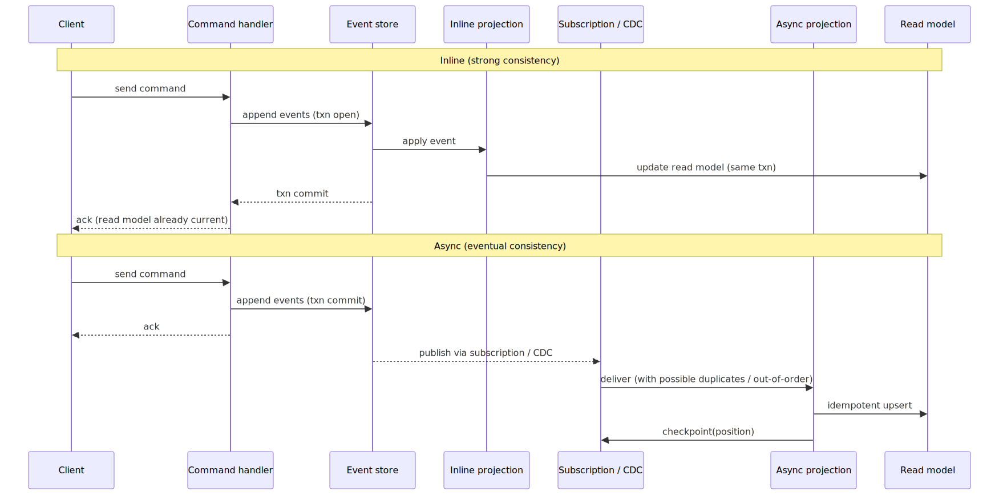
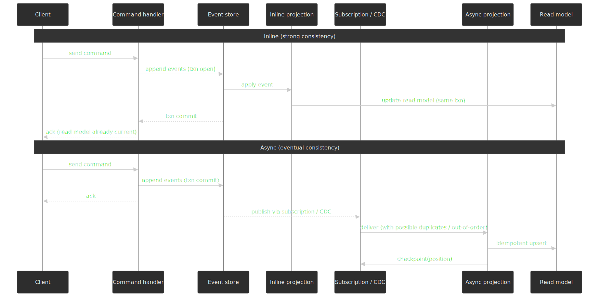

### Picking a path


## Snapshots

Replaying every event for every command is fine until your hot aggregates carry tens of thousands of events. Snapshots store materialised state at a stream position so replay only has to fold the tail.

> [!TIP]
> Do not snapshot eagerly. The [EventStoreDB / Kurrent guidance](https://www.kurrent.io/) and most practitioner posts agree: aggregates with hundreds of events do not need them. Wait until measured cold-start or load times push past your SLO.

### When to snapshot

Add snapshots when at least one of these holds:

- A hot aggregate routinely carries more events than your replay budget allows (measure before guessing).
- Cold-start latency on rebalancing or restart is unacceptable to upstream callers.
- A new projection rebuild would otherwise take days.

### Trigger strategies

| Strategy | Trigger | Strengths | Weaknesses |
| --- | --- | --- | --- |
| **Event-count** | Every N events (e.g. 100) | Predictable replay cost | Snapshots a quiet aggregate unnecessarily |
| **Time-based** | Every N hours / days | Operationally simple | Variable event count between snapshots |
| **State-triggered** | On natural transitions (`draft → published`) | Snapshots at semantic boundaries | Requires domain knowledge per aggregate |
| **On-demand** | First load that exceeds a threshold | Only when needed | First slow load before snapshot exists |

### Implementation and load path

```ts collapse={1-5, 22-30} title="snapshotLoad.ts"
interface Snapshot<TState> {
  state: TState
  version: number
  schemaVersion: number
}

async function loadWithSnapshot<TState, TEvent>(
  streamId: string,
  eventStore: EventStore,
  snapshotStore: SnapshotStore,
  evolve: (state: TState, event: TEvent) => TState,
  initialState: TState,
): Promise<{ state: TState; version: number }> {
  const snapshot = await snapshotStore.load<TState>(streamId)
  const startVersion = snapshot?.version ?? 0
  const startState = snapshot?.state ?? initialState
  const events = await eventStore.readStream(streamId, { fromVersion: startVersion + 1 })
  const state = events.reduce(evolve, startState)
  return { state, version: startVersion + events.length }
}

async function maybeSnapshot<TState>(
  streamId: string,
  state: TState,
  version: number,
  snapshotStore: SnapshotStore,
  threshold = 100,
): Promise<void> {
  const lastSnapshot = await snapshotStore.getVersion(streamId)
  if (version - lastSnapshot > threshold) {
    await snapshotStore.save(streamId, { state, version, schemaVersion: 1 })
  }
}
```

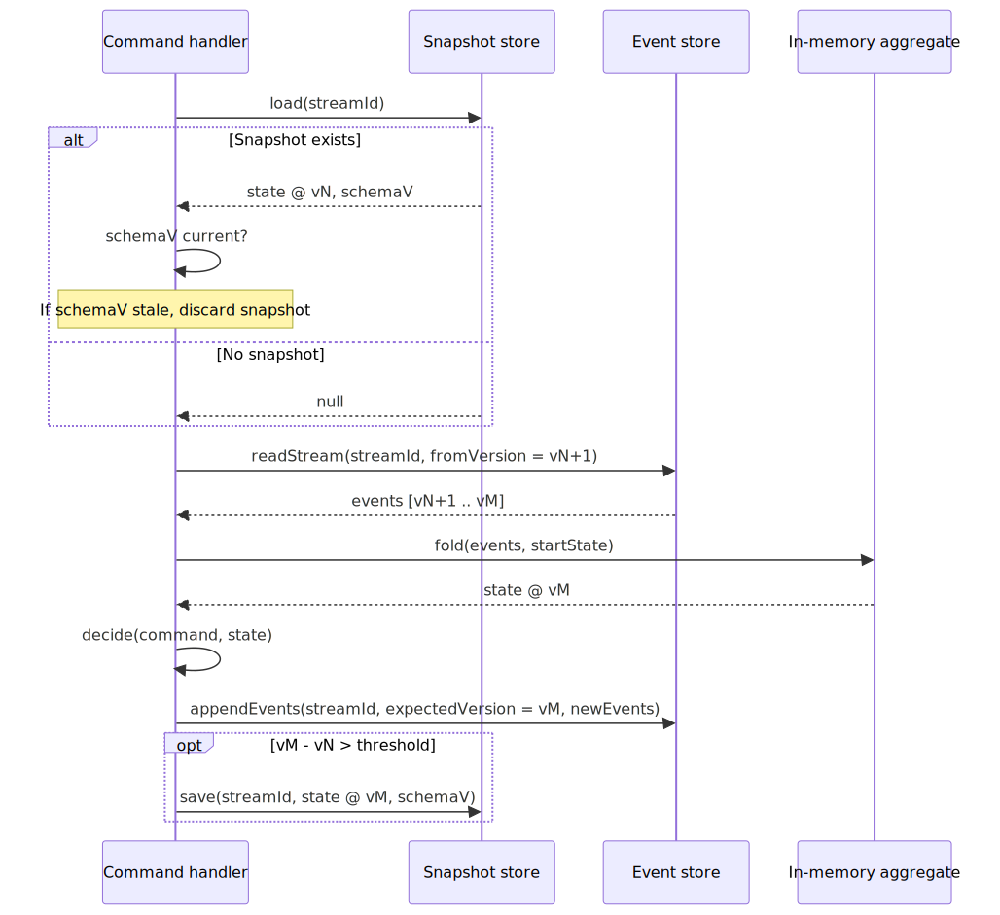
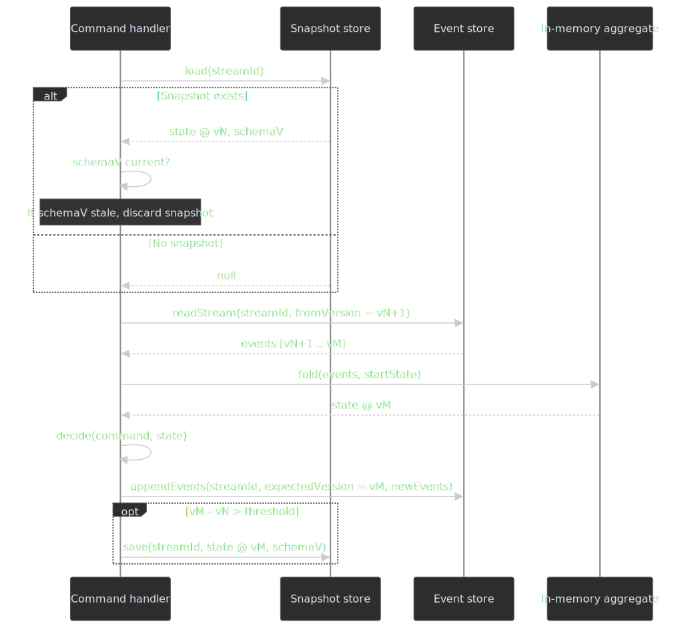

### Snapshots and schema evolution

Snapshots are derived state, so when the snapshot shape changes:

1. Bump the `schemaVersion` on new snapshots.
2. On load, compare the stored `schemaVersion` to the current one.
3. If outdated, discard the snapshot and rebuild from events.

This is much simpler than migrating snapshots in place. It only works because events are still the source of truth.

## Event schema evolution

Events are stored forever. Schema changes have to be backward-compatible or applied through a transformation step.

> [!IMPORTANT]
> Greg Young's rule, from [*Versioning in an Event Sourced System*](https://leanpub.com/esversioning/read): "A new version of an event must be convertible from the old version of the event. If not, it is not a new version of the event but rather a new event."

### Strategy 1 — additive only (default)

Add optional fields. Never remove or rename. Projections must accept both shapes.

```ts collapse={1-3} title="versioning-additive.ts"
interface OrderPlacedV1 {
  orderId: string
  customerId: string
  items: OrderItem[]
}

interface OrderPlacedV2 extends OrderPlacedV1 {
  discountCode?: string
}

function projectOrder(event: OrderPlacedV1 | OrderPlacedV2): Order {
  return {
    id: event.orderId,
    customerId: event.customerId,
    items: event.items,
    discountCode: 'discountCode' in event ? event.discountCode : undefined,
  }
}
```

Use this until you genuinely cannot.

### Strategy 2 — upcasting (transform on read)

Old payloads pass through a chain of upcasters that lift them to the current schema before they reach domain logic. The fold and projections only ever see the current shape.

```ts collapse={1-4, 18-22} title="upcasters.ts"
type Upcaster<TIn, TOut> = (old: TIn) => TOut

const orderPlacedUpcasters = new Map<number, Upcaster<unknown, OrderPlacedV3>>([
  [1, (v1: OrderPlacedV1) => ({ ...v1, discountCode: undefined, source: 'unknown' })],
  [2, (v2: OrderPlacedV2) => ({ ...v2, source: 'unknown' })],
])

function upcast(event: StoredEvent): DomainEvent {
  const upcaster = orderPlacedUpcasters.get(event.schemaVersion)
  return upcaster ? upcaster(event.data) : event.data
}
```

**Use when** schema churns and you want every consumer to think in the present tense. **Trade-off**: a small CPU cost on every read and a chain that grows over time — eventually you will either snapshot to compress it or graduate to Strategy 3.

### Strategy 3 — stream transformation (rewrite history)

Copy the stream into a new stream with transformed events, then point readers at the new stream during a release window. Preserve event ids, timestamps, and order.

**Use when** the change is genuinely breaking (units, semantics, identity), or when the upcaster chain has become technical debt.

> [!WARNING]
> Never modify events in place — even small edits propagate to every projection that already saw the original. Always rewrite into a new stream and switch over atomically.

### Schema registry

For anything multi-team, register event schemas (Avro, Protobuf, JSON Schema) and validate on write. The registry gives you:

- Compile-time types generated from the schema.
- A reject-on-write barrier so producers cannot quietly diverge.
- A history of versions per event type that upcasters can reference.

## Projections and read models

Projections turn the event log into the shapes the read side actually needs. The lifecycle (using [Marten's vocabulary](https://martendb.io/events/projections/), which most stores follow):

| Type | Execution | Consistency | Use case |
| --- | --- | --- | --- |
| **Inline** | Same transaction as events | Strong | Critical reads with cheap projections |
| **Async** | Background subscriber | Eventual | Complex aggregations, high throughput, fan-out |
| **Live** | Computed on demand, not persisted | Computed at query time | Ad-hoc analytics, debugging |

### Building a projection

```ts collapse={1-6} title="orderListProjection.ts"
interface Projection<TState> {
  initialState: TState
  apply: (state: TState, event: DomainEvent) => TState
}

const orderListProjection: Projection<OrderListState> = {
  initialState: { orders: [], totalRevenue: 0 },

  apply(state, event) {
    switch (event.type) {
      case 'OrderPlaced':
        return {
          ...state,
          orders: [...state.orders, { id: event.data.orderId, status: 'placed', total: event.data.total }],
          totalRevenue: state.totalRevenue + event.data.total,
        }
      case 'OrderShipped':
        return {
          ...state,
          orders: state.orders.map((o) => (o.id === event.data.orderId ? { ...o, status: 'shipped' } : o)),
        }
      case 'OrderRefunded':
        return {
          ...state,
          orders: state.orders.map((o) => (o.id === event.data.orderId ? { ...o, status: 'refunded' } : o)),
          totalRevenue: state.totalRevenue - event.data.refundAmount,
        }
      default:
        return state
    }
  },
}
```

### Rebuilding projections

Because events are the source of truth, projections are disposable. Rebuild whenever:

- A bug in projection logic produced wrong state.
- A new query pattern needs a new shape.
- The read database schema changes.

The safe rebuild shape is **blue/green**, not in-place replay. Stand up the new projection from position 0 in a parallel read-model store, let it catch up to the live tail, then atomically swap the reader pointer when its lag drops under your SLO. In-place replay is tempting and almost always wrong: it serves partially-rebuilt state to live readers, and any failure mid-replay leaves the read model in a state nobody can describe.


Rebuild cost grows with the event log; this is exactly what snapshots and archival exist to bound. Netflix's experience — re-runs taking days — is a good warning that "we can always rebuild" only holds if you also designed for it.

### Cross-projection dependencies

> [!CAUTION]
> Projections that read other projections are a footgun during rebuilds — the dependency may sit at a different position in the log than its consumer. Either denormalise so each projection stands alone, declare dependencies so the rebuild engine orders them, or have dependents wait until their dependencies' positions catch up. Dennis Doomen's ["The Ugly of Event Sourcing"](https://www.dennisdoomen.com/2017/11/the-ugly-of-event-sourcingreal-world.html) has a long catalogue of variations on this failure.

## Choosing an event store

### Purpose-built: KurrentDB (formerly EventStoreDB)

KurrentDB is what was previously called EventStoreDB; the project rebranded under the company [Kurrent](https://www.kurrent.io/) in 2024. Whichever name you encounter, it is the same engine — purpose-built for streams, subscriptions, and event-sourced workloads.

- Around **15 k writes/sec and 50 k reads/sec** in Kurrent's published benchmarks, configuration- and disk-bound — see Kurrent's own ["What if you need better performance than 15k writes per second?"](https://discuss.kurrent.io/t/what-if-you-need-better-performance-than-15k-writes-per-second/4974) and [product page](https://www.kurrent.io/kurrent).
- Native primitives: streams, optimistic concurrency per stream, persistent subscriptions with checkpoints, JavaScript projections.
- Vertical replica-set scaling; sharding is on you. Performance is dominated by disk I/O.

### Apache Kafka — streaming, not sourcing

Kafka is excellent for event *streaming* (transport, fan-out, integration). It is the wrong default for event *sourcing*. The widely cited [Serialized.io article "Apache Kafka is not for Event Sourcing"](https://medium.com/serialized-io/apache-kafka-is-not-for-event-sourcing-81735c3cf5c) lays this out:

1. **Topic granularity.** Aggregates can easily reach millions; Kafka is not designed for millions of topics, and a topic per entity type forces consumers to scan the whole partition to load one aggregate.
2. **No cheap "load events for entity X."** The streaming API gives you an offset-ordered scan, not a stream-by-id read.
3. **No optimistic concurrency.** "Append only if version is still N" is not a Kafka primitive; you bolt that on with a coordinating database.
4. **Log compaction destroys history.** Compaction keeps only the latest value per key — the exact opposite of what an event store needs.

Use Kafka as the bus that ships events from your real event store to downstream consumers; do not let it own the source of truth.

### PostgreSQL-backed stores

A relational engine works as long as you accept the patterns:

- **Transactional outbox** to publish events together with state changes.
- **`LISTEN/NOTIFY`** for low-latency subscription wake-ups.
- **Advisory locks** for projection coordination.

Libraries: [Marten](https://martendb.io/) (.NET), [pg-event-store](https://github.com/team-supercharge/pg-event-store) (Node), [Eventide](https://eventide-project.org/) (Ruby).

| Aspect | PostgreSQL-backed | KurrentDB / EventStoreDB |
| --- | --- | --- |
| Operational familiarity | High — same DB you already run | New engine and ops surface |
| ES primitives | Library-provided | Native |
| Transactionality with app data | Full ACID | Event store separate from app DB |
| Scaling | Conventional Postgres patterns | Purpose-built but limited sharding |

### Cloud message-grid services (and what they are not)

- **AWS EventBridge** — routing and orchestration across 90+ AWS services. Useful as a serverless event bus; not an event store.
- **Azure Event Hubs** — Kafka-compatible high-volume ingestion with geo-DR. Same caveats as Kafka for sourcing.

## Production patterns from real systems

### LMAX — pure ES, in-memory, single-thread

[LMAX's architecture](https://martinfowler.com/articles/lmax.html) is the textbook upper bound of pure event sourcing.

- **Business Logic Processor**: single-threaded, in-memory, event-sourced; ~6 M orders/sec on commodity hardware.
- **Disruptor**: lock-free ring buffer for I/O — input ring of 20 M slots, output rings of 4 M slots; benchmarks claim [25 M+ messages/sec and sub-50 ns latency](https://lmax-exchange.github.io/disruptor/disruptor.html).
- **Replication**: three BLPs running the same input — two in the primary DC, one in DR.
- **Snapshots**: nightly; restart cycles every night with no downtime.

What worked: in-memory state with the log as the durability story made the database irrelevant to throughput. What was hard: enforcing determinism in business logic and debugging replay-driven incidents.

### Netflix Downloads — Cassandra-backed, async projections, 6-month build

[Netflix's downloads service](https://netflixtechblog.com/scaling-event-sourcing-for-netflix-downloads-episode-2-ce1b54d46eec) launched in November 2016 with a tight deadline ("a 6 am global press release"). They built it in roughly six months on a Cassandra-backed event store with three components — Event Store, Aggregate Repository, Aggregate Service — and async projections.

What worked: requirements churn during the build was absorbable because new questions only needed new projections, not migrations. What was hard: rebuild times during development took days, which forced snapshotting and event archival earlier than they would have liked.

### Uber Cadence — event sourcing for durable execution

[Cadence](https://www.uber.com/us/en/blog/open-source-orchestration-tool-cadence-overview/) (and its fork [Temporal](https://temporal.io/)) is event sourcing applied to workflow state, not just data. Each workflow's history is the event stream; the worker reconstructs state by deterministic replay before continuing execution.

- Multi-tenant clusters host hundreds of domains.
- A [single Cadence service](https://cadenceworkflow.io/docs/concepts/topology) runs more than a hundred applications at Uber.
- The [host-level priority task processor](https://www.uber.com/us/en/blog/cadence-multi-tenant-task-processing/) reduced worker goroutines on each history host from **16 000 to about 100** (a 95 %+ reduction) at the same load.

The lesson is that "event sourcing" generalises beyond database design — durable execution platforms reuse the same deterministic-replay primitive.

### Comparing the three

| Aspect | LMAX | Netflix Downloads | Uber Cadence |
| --- | --- | --- | --- |
| Domain | Financial exchange | Media licensing | Workflow orchestration |
| Throughput | ~6 M orders/sec (BLP) | Not disclosed | Hundreds of domains, multi-tenant |
| Consistency | Single-threaded, deterministic | Eventual | Per-workflow, deterministic replay |
| Storage | In-memory + on-disk log | Cassandra | Cassandra |
| Snapshots | Nightly | On demand | Per workflow history |
| Team shape | Small, specialised | 6-month feature team | Platform team |

## Pitfalls in production

### 1. Unbounded event growth

Storing every tick or every micro-event without an archival plan eventually breaks rebuilds. Mitigate with snapshots, time-segmented streams (`orders-2026-q1`), and tiered storage (recent in hot store, older in S3 / Glacier).

### 2. Assuming event order across streams

Within a stream, events are totally ordered. Across streams, the bus may deliver duplicates, reorder, or replay. Build projections that treat each event as an independent input keyed by `eventId`, and never rely on arrival order for correctness.

### 3. Dual-write to event store and message bus

Writing the event then publishing in two operations is the classic distributed bug — append succeeds, publish fails, downstream silently misses the event. Use the [transactional outbox pattern](https://microservices.io/patterns/data/transactional-outbox.html), Change Data Capture from the event table, or an event store with built-in subscriptions (KurrentDB).

### 4. Projection complexity sprawl

Projections that join across streams, aggregate across long windows, or reach into other projections become rebuild monsters. Denormalise aggressively, accept duplication in read models, and prefer many small focused projections over one universal one. If the question is genuinely analytical ("revenue by region by category by month"), push it into the warehouse instead.

### 5. Schema drift without a strategy

Adding a field "just for new events" and assuming projections will cope works exactly until you replay history through new logic. Make additive changes the default, mark new fields optional, and embed the producing code version in the event metadata so projections can branch on intent rather than presence.

### 6. Time-travel debugging is oversold

Event sourcing gives you an audit trail; it does not magically reduce debugging effort. Chris Kiehl's first-hand take in ["Don't Let the Internet Dupe You, Event Sourcing is Hard"](https://chriskiehl.com/article/event-sourcing-is-hard) argues that "99% of the time 'bad states' were *bad events* caused by your standard run-of-the-mill human error" — the ledger added little over a normal database for those cases. Practical questions to answer before you rely on time travel: how do you fix the bad event for already-affected users (a compensating event, almost always), how do you inspect intermediate state if events are binary, and how do you scope a replay to production data without polluting projections?

Invest in the tooling instead — event visualisation, projection-state-at-event inspection, and a documented compensating-event playbook.

## GDPR and the right to erasure

Event sourcing's immutability collides head-on with the GDPR right to erasure. The two practical workarounds:

### Crypto-shredding

[Mathias Verraes' crypto-shredding pattern](https://verraes.net/2019/05/eventsourcing-patterns-throw-away-the-key/) is the most common answer:

1. Encrypt personal data with a per-subject key before writing it into the event.
2. Store the keys in a separate, mutable key store keyed by subject.
3. On erasure, delete the key. The encrypted payload becomes permanently unreadable.

```ts collapse={1-4, 18-25} title="cryptoShredding.ts"
interface OrderPlacedEvent {
  orderId: string
  customerRef: string
  encryptedCustomerData: string
  items: OrderItem[]
}

interface CustomerKeyStore {
  getKey(customerRef: string): Promise<CryptoKey | null>
  deleteKey(customerRef: string): Promise<void>
}

async function projectOrder(event: OrderPlacedEvent, keyStore: CustomerKeyStore): Promise<OrderReadModel> {
  const key = await keyStore.getKey(event.customerRef)
  const customerData = key
    ? await decrypt(event.encryptedCustomerData, key)
    : { name: '[deleted]', address: '[deleted]' }
  return {
    orderId: event.orderId,
    customerName: customerData.name,
  }
}
```

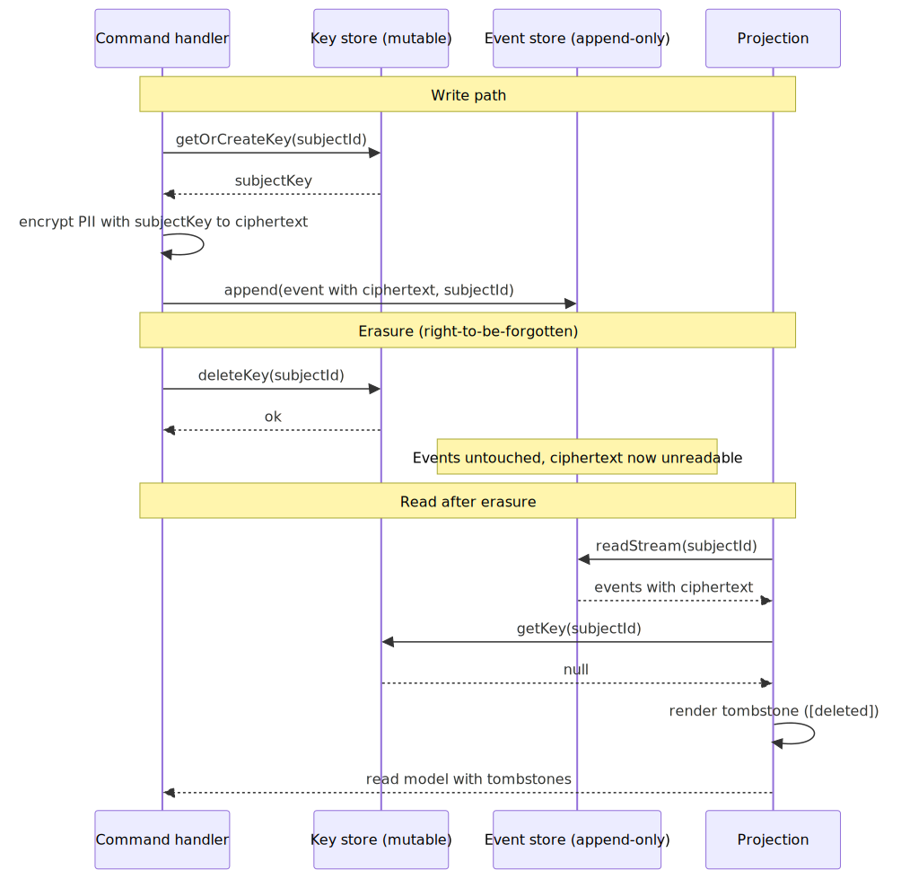
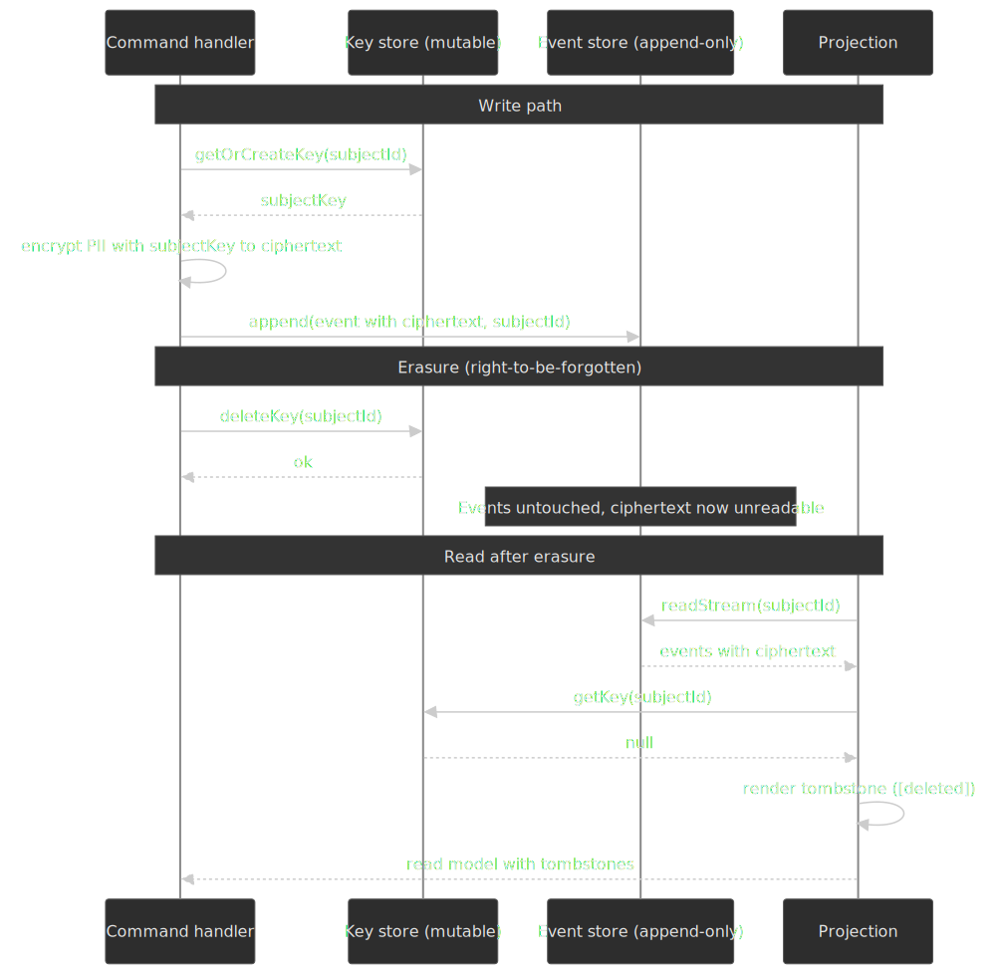

> [!WARNING]
> Encrypted personal data is still personal data under GDPR. Verraes himself is explicit that crypto-shredding renders data unreadable but may not satisfy a formal erasure request, and recommends pairing it with retention policies, key-management hygiene, and legal review.

### Forgettable payloads

[Verraes' "Forgettable Payloads"](https://verraes.net/2019/05/eventsourcing-patterns-forgettable-payloads/) takes the opposite trade-off: store personal data in a separate, mutable store and reference it from the event by id. Erasure becomes a normal `DELETE`. The cost is a join at projection time and another datastore to operate.

The two patterns compose — keep ids and immutable facts in the event, push PII into a forgettable side store, and use crypto-shredding for the few PII fields you really do need to keep alongside the event for replay.

## Practical takeaways

- **Default to CRUD until the audit/temporal need is real.** Event sourcing carries genuine cost and "we might need history later" rarely justifies it up front.
- **Pick the smallest path that solves the problem.** Hybrid > pure for most teams; inline projections > async until throughput forces the trade.
- **Hold off on snapshots, schema registries, and stream transformations.** Add them when measurements demand it, not before.
- **Treat events as the source of truth and everything else as derived.** Projections, snapshots, and read databases are all rebuildable; events are not.
- **Use Kafka as transport, not as the store.** Pair it with a purpose-built or relational event store.
- **Plan for erasure on day one.** Decide between crypto-shredding and forgettable payloads before personal data lands in the log.

## Appendix

### Prerequisites

- Working knowledge of domain-driven design (aggregates, bounded contexts).
- Familiarity with consistency models (strong vs eventual; optimistic vs pessimistic concurrency).
- Comfort with CQRS as a separate concept from event sourcing.

### References

#### Foundational

- [Martin Fowler — Event Sourcing](https://martinfowler.com/eaaDev/EventSourcing.html)
- [Martin Fowler — CQRS](https://martinfowler.com/bliki/CQRS.html)
- [Greg Young — *Versioning in an Event Sourced System*](https://leanpub.com/esversioning/read)
- [Microsoft patterns & practices — Exploring CQRS and Event Sourcing](https://learn.microsoft.com/en-us/previous-versions/msp-n-p/jj554200(v=pandp.10))

#### Production case studies

- [Martin Fowler — The LMAX Architecture](https://martinfowler.com/articles/lmax.html)
- [LMAX Disruptor — design and benchmarks](https://lmax-exchange.github.io/disruptor/disruptor.html)
- [Netflix Tech Blog — Scaling Event Sourcing for Netflix Downloads (Episode 2)](https://netflixtechblog.com/scaling-event-sourcing-for-netflix-downloads-episode-2-ce1b54d46eec)
- [Walmart Global Tech — Inventory Availability with Event Sourcing](https://medium.com/walmartglobaltech/design-inventory-availability-system-using-event-sourcing-1d0f022e399f)
- [Uber Engineering — Cadence Overview](https://www.uber.com/us/en/blog/open-source-orchestration-tool-cadence-overview/)
- [Uber Engineering — Cadence Multi-Tenant Task Processing](https://www.uber.com/us/en/blog/cadence-multi-tenant-task-processing/)

#### Implementation patterns

- [Event-Driven.io — Projections and read models](https://event-driven.io/en/projections_and_read_models_in_event_driven_architecture/)
- [Event-Driven.io — How to (not) do event versioning](https://event-driven.io/en/how_to_do_event_versioning/)
- [Marten — Inline projections](https://martendb.io/events/projections/inline)
- [Microservices.io — Transactional outbox](https://microservices.io/patterns/data/transactional-outbox.html)

#### Failure modes and lessons

- [Dennis Doomen — The Ugly of Event Sourcing](https://www.dennisdoomen.com/2017/11/the-ugly-of-event-sourcingreal-world.html)
- [Chris Kiehl — Don't Let the Internet Dupe You, Event Sourcing is Hard](https://chriskiehl.com/article/event-sourcing-is-hard)
- [Serialized.io — Apache Kafka is not for Event Sourcing](https://medium.com/serialized-io/apache-kafka-is-not-for-event-sourcing-81735c3cf5c)

#### GDPR and compliance

- [Mathias Verraes — Crypto-Shredding](https://verraes.net/2019/05/eventsourcing-patterns-throw-away-the-key/)
- [Mathias Verraes — Forgettable Payloads](https://verraes.net/2019/05/eventsourcing-patterns-forgettable-payloads/)
- [Event-Driven.io — GDPR in event-driven systems](https://event-driven.io/en/gdpr_in_event_driven_architecture/)

#### Tools and frameworks

- [KurrentDB (formerly EventStoreDB)](https://www.kurrent.io/)
- [Marten — Postgres event store for .NET](https://martendb.io/)
- [Axon Framework — Java CQRS/ES toolkit](https://www.axoniq.io/products/axon-framework)
- [Temporal](https://temporal.io/) (Cadence fork)
