# Exactly-Once Delivery

Exactly-once **delivery** — moving a message across an unreliable network so that it arrives once and only once — is impossible. The [Two Generals' Problem](https://en.wikipedia.org/wiki/Two_Generals%27_Problem) (Akkoyunlu, Ekanadham, Huber, 1975) shows that no finite acknowledgement protocol over a lossy channel can give both sides certainty that the last message arrived; the [FLP impossibility result](https://groups.csail.mit.edu/tds/papers/Lynch/jacm85.pdf) (Fischer, Lynch, Paterson, 1985) shows that even with reliable channels no deterministic protocol can solve consensus when one process may fail. What production systems call "exactly-once" is really exactly-once **processing**: at-least-once delivery composed with an **idempotent sink** (or transactional offset commit) so each message's *effect* lands once even when the message itself is delivered many times. Tyler Treat frames the distinction as ["delivery is a transport-layer semantic — it's impossible; processing is an application-layer semantic — it's achievable"](https://bravenewgeek.com/you-cannot-have-exactly-once-delivery/), and Jay Kreps reframes Kafka's guarantee the same way in ["Exactly-once, once more"](https://medium.com/@jaykreps/exactly-once-one-more-time-901181d592f9).


## Mental Model

Six anchors that the rest of the article builds on:

1. **Delivery vs processing.** "Exactly-once delivery" is a transport-layer claim and is impossible (Two Generals). "Exactly-once processing" is an application-layer claim and is achievable when the producer, the transport, the consumer's state, and its offset commit form a closed system.
2. **Network unreliability is fundamental.** Messages can be lost, duplicated, or reordered. No protocol can guarantee exactly-once delivery at the network layer.
3. **Effective exactly-once is a composition**, not a primitive: at-least-once delivery (never lose a message) + idempotency or deduplication (make duplicates harmless) = single observable effect.
4. **Three layers can carry the dedup**: producer (idempotent producers with sequence numbers in Kafka, idempotency keys in Stripe), broker (dedup windows — 5 min fixed in [SQS FIFO](https://docs.aws.amazon.com/AWSSimpleQueueService/latest/SQSDeveloperGuide/FIFO-queues-exactly-once-processing.html), 20s–7d in [Azure Service Bus](https://learn.microsoft.com/en-us/azure/service-bus-messaging/duplicate-detection)), or consumer (processed-message table, transactional offset commits).
5. **Every dedup mechanism has a window**, and the window is the bug. Retry timeouts that exceed the window silently re-introduce duplicates.
6. **Most guarantees stop at the system boundary.** Kafka EOS does not extend to your Postgres write; Pub/Sub exactly-once is regional. Cross-system delivery still needs the outbox pattern, an idempotent sink, or a coordinator that participates in both transactions (Flink-style 2PC, KIP-939).

## The Problem

### Why Naive Solutions Fail

**Approach 1: Fire-and-forget (at-most-once)**

Send the message once with no retries. If the network drops it, the message is lost forever.

- Fails because: Message loss is common—TCP connections drop, services restart, packets get corrupted
- Example: Payment notification lost → customer never knows payment succeeded → duplicate payment attempt

**Approach 2: Retry until acknowledged (at-least-once)**

Keep retrying until you receive an acknowledgment. Never lose a message.

- Fails because: The acknowledgment itself can be lost. Producer retries a message that was actually processed.
- Example: Transfer $100 → ack lost → retry → transfer $100 again → $200 withdrawn

**Approach 3: Distributed transactions across the network (two-phase commit)**

Coordinate sender and receiver in a 2PC transaction so that the message and its effect commit atomically.

- Fails because: 2PC is a **blocking** protocol — if the coordinator crashes after the prepare phase, participants stay locked until it recovers (no termination under partitions). It also requires both endpoints to expose XA-style transaction semantics, which most messaging stacks deliberately do not.
- 2PC is not useless — it is the basis of Flink's `TwoPhaseCommitSinkFunction` and Kafka's transaction coordinator — but it only delivers effective exactly-once **inside a closed system** with bounded coordination, never across an arbitrary network of independent peers.
- Example: a textbook XA transaction across a TCP socket between sender and receiver leaves both sides locked indefinitely if the coordinator dies between prepare and commit.

### The Core Challenge

The fundamental tension: **reliability requires retries, but retries create duplicates**.

The Two Generals' Problem proves this for the network: two parties cannot achieve certainty of agreement over an unreliable channel — any finite sequence of confirmations leaves doubt about whether the final message arrived. An "exactly-once delivery" protocol would solve Two Generals; therefore no such protocol exists.

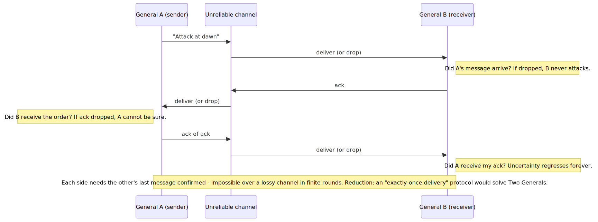
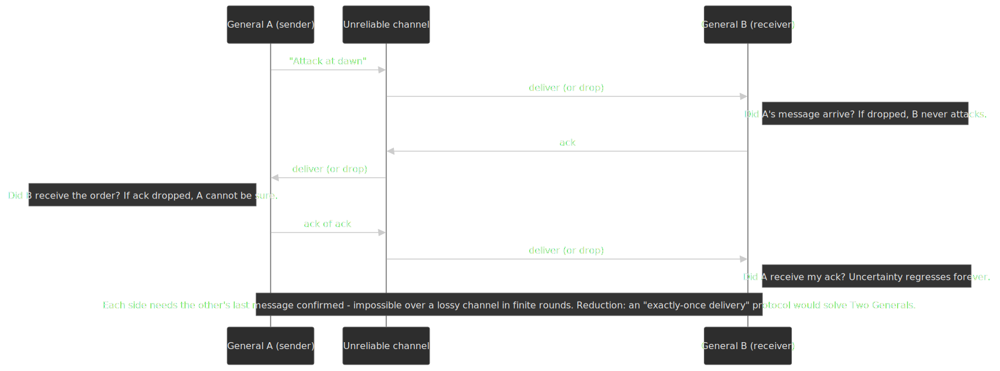

> [!IMPORTANT]
> **FLP impossibility (Fischer, Lynch, Paterson, 1985).** No deterministic algorithm can solve consensus in an asynchronous system where even one process may fail. The theorem assumes reliable message delivery but unbounded delays — every fault-tolerant consensus algorithm has runs that never terminate.[^flp]

Practical systems circumvent FLP through randomised algorithms (Ben-Or, Rabin), partial-synchrony assumptions ([Paxos](https://lamport.azurewebsites.net/pubs/paxos-simple.pdf), Raft), or unreliable failure detectors. The implication for exactly-once: we cannot guarantee it at the protocol level, so we shift the work and make duplicates harmless instead. Every "effectively exactly-once" system in this article rests on a small Paxos- or Raft-replicated coordinator to commit the closed-system 2PC — Kafka's transaction coordinator, Flink's JobManager, the database's transaction log.

[^flp]: Michael J. Fischer, Nancy A. Lynch, Michael S. Paterson. "[Impossibility of Distributed Consensus with One Faulty Process](https://groups.csail.mit.edu/tds/papers/Lynch/jacm85.pdf)", Journal of the ACM 32(2), April 1985.

## Delivery Semantics

### At-Most-Once

Each message is delivered zero or one times. Messages may be lost but are never redelivered.

**Implementation**: Send once, no retries, no acknowledgment tracking.

**Trade-offs**:

- ✅ Lowest latency and complexity
- ✅ No duplicate handling needed
- ❌ Data loss is guaranteed over time
- ❌ Unsuitable for critical operations

**Use cases**: Metrics collection, logging, real-time analytics where occasional loss is acceptable.

### At-Least-Once

Each message is delivered one or more times. Messages are never lost, but duplicates occur.

**Implementation**: Retry with exponential backoff until acknowledgment received. Store unacked messages durably.

**Trade-offs**:

- ✅ No data loss
- ✅ Simple to implement
- ❌ Consumer must handle duplicates
- ❌ Ordering not guaranteed with retries

**Use cases**: Event sourcing, audit logs, any system where data loss is unacceptable and consumers are idempotent.

### Exactly-Once (Effectively)

Each message's effect occurs exactly once. The message may be delivered multiple times, but the system ensures idempotent processing.

**Implementation**: At-least-once delivery + one of:

- Idempotent operations (natural or designed)
- Deduplication at consumer (track processed message IDs)
- Transactional processing (atomic read-process-write)

**Trade-offs**:

- ✅ No data loss, no duplicate effects
- ❌ Higher complexity and latency
- ❌ Requires coordination between producer, broker, and consumer
- ❌ Deduplication window creates edge cases

**Use cases**: Financial transactions, order processing, any operation where duplicates cause real-world harm.

### Comparison

| Aspect         | At-Most-Once | At-Least-Once | Exactly-Once              |
| -------------- | ------------ | ------------- | ------------------------- |
| Message loss   | Possible     | Never         | Never                     |
| Duplicates     | Never        | Possible      | Prevented                 |
| Complexity     | Low          | Medium        | High                      |
| Latency        | Lowest       | Medium        | Highest                   |
| State required | None         | Retry queue   | Dedup store + retry queue |

## Design Paths

### Path 1: Idempotent Operations

Make the operation itself idempotent—applying it multiple times produces the same result as applying it once.

**When to choose this path:**

- Operations are naturally idempotent (SET vs INCREMENT)
- You control the consumer's state model
- Minimal infrastructure investment desired

**Key characteristics:**

- No deduplication storage required
- Works regardless of delivery semantics
- Requires careful operation design

**Natural idempotency examples:**

```typescript
// SET operations are naturally idempotent
await db.query("UPDATE users SET email = $1 WHERE id = $2", [email, userId])

// DELETE with specific criteria is idempotent
await db.query("DELETE FROM sessions WHERE user_id = $1 AND token = $2", [userId, token])

// GET operations are always idempotent
const user = await db.query("SELECT * FROM users WHERE id = $1", [userId])
```

**Non-idempotent operations that need transformation:**

```typescript
// ❌ Non-idempotent: INCREMENT
await db.query("UPDATE accounts SET balance = balance + $1 WHERE id = $2", [amount, accountId])

// ✅ Idempotent version: SET with version check
await db.query(
  `
  UPDATE accounts
  SET balance = $1, version = $2
  WHERE id = $3 AND version = $4
`,
  [newBalance, newVersion, accountId, expectedVersion],
)
```

**Trade-offs vs other paths:**

| Aspect            | Idempotent Operations       | Deduplication           |
| ----------------- | --------------------------- | ----------------------- |
| Storage overhead  | None                        | Message ID store        |
| Design complexity | Higher (rethink operations) | Lower (add dedup layer) |
| Failure modes     | Version conflicts           | Window expiry           |
| Latency           | Lower                       | Higher (dedup lookup)   |

### Path 2: Idempotency Keys (API Pattern)

Client generates a unique key per logical operation. Server tracks keys and returns cached results for duplicates.

**When to choose this path:**

- Exposing APIs to external clients
- Operations are not naturally idempotent
- Client controls retry behavior

**Key characteristics:**

- Client generates unique key (UUID v4)
- Server stores operation result keyed by idempotency key
- Subsequent requests with same key return cached result
- Keys expire after a window (typically 24 hours)

**Implementation approach:**

```typescript collapse={1-8, 26-35}
// Server-side idempotency key handling
import { Redis } from "ioredis"

interface IdempotencyRecord {
  status: "processing" | "completed" | "failed"
  response?: unknown
  createdAt: number
}

async function handleWithIdempotency(
  redis: Redis,
  idempotencyKey: string,
  operation: () => Promise<unknown>,
): Promise<{ cached: boolean; response: unknown }> {
  // Check for existing record
  const existing = await redis.get(`idem:${idempotencyKey}`)
  if (existing) {
    const record: IdempotencyRecord = JSON.parse(existing)
    if (record.status === "completed") {
      return { cached: true, response: record.response }
    }
    // Still processing - return 409 Conflict
    throw new Error("Request already in progress")
  }

  // Mark as processing (with TTL to handle crashes)
  await redis.set(
    `idem:${idempotencyKey}`,
    JSON.stringify({ status: "processing", createdAt: Date.now() }),
    "EX",
    3600, // 1 hour TTL for processing state
    "NX", // Only set if not exists
  )

  // Execute operation and store result
  // ... operation execution and result caching
}
```

**Stripe's implementation details:**

- Keys stored in Redis cluster shared across all API servers
- 24-hour retention window
- Keys recycled after window expires
- Response includes original status code and body

**Real-world example:**

Stripe processes millions of payment requests daily. Their idempotency key system:

- Client includes `Idempotency-Key` header with UUID
- Server returns `Idempotent-Replayed: true` header for cached responses
- First request that fails partway through is re-executed on retry
- First request that succeeds is returned from cache on retry

Result: Zero duplicate charges from network retries.

### Path 3: Broker-Side Deduplication

Message broker tracks message IDs and filters duplicates before delivery to consumers.

**When to choose this path:**

- Using a message broker that supports deduplication
- Want to offload deduplication from consumers
- Willing to accept deduplication window constraints

**Key characteristics:**

- Producer assigns unique message ID
- Broker maintains recent message IDs in memory/storage
- Duplicates filtered before consumer delivery
- Window-based: IDs forgotten after expiry

**Kafka idempotent producer (since 0.11, default since 3.0):**

The broker assigns a 64-bit Producer ID (PID) to each producer instance. The producer assigns monotonically increasing 32-bit sequence numbers per topic-partition:

```text
Producer → [PID: 12345, Seq: 0] → Broker (accepts)
Producer → [PID: 12345, Seq: 1] → Broker (accepts)
Producer → [PID: 12345, Seq: 1] → Broker (duplicate, rejects)
Producer → [PID: 12345, Seq: 3] → Broker (out-of-order, error)
```

**Configuration (Kafka 3.0+):**

```properties
# Defaults changed in Kafka 3.0 - these are now on by default
enable.idempotence=true
acks=all
```

> **Prior to Kafka 3.0**: `enable.idempotence` defaulted to `false` and `acks` defaulted to `1`. Enabling idempotence required explicit configuration.

**Key limitation**: Idempotence is only guaranteed within a producer session. If the producer crashes and restarts without a `transactional.id`, it gets a new PID and sequence numbers reset—previously sent messages may be duplicated.

**AWS SQS FIFO deduplication:**

- **Fixed** 5-minute deduplication window (cannot be changed)
- Two methods: explicit `MessageDeduplicationId` or content-based (SHA-256 of body)
- After window expires, same ID can be submitted again
- Best practice: anchor `MessageDeduplicationId` to business context (e.g., `order-12345.payment`)
- With partitioning enabled: `MessageDeduplicationId + MessageGroupId` determines uniqueness

**Trade-offs vs other paths:**

| Aspect               | Broker-Side    | Consumer-Side        |
| -------------------- | -------------- | -------------------- |
| Consumer complexity  | Lower          | Higher               |
| Dedup window control | Broker-defined | Application-defined  |
| Cross-broker dedup   | No             | Yes                  |
| Storage location     | Broker         | Application database |

### Path 4: Consumer-Side Deduplication

Consumer tracks processed message IDs and skips duplicates.

**When to choose this path:**

- Broker doesn't support deduplication
- Need longer deduplication windows than broker provides
- Want application-level control over dedup logic

**Key characteristics:**

- Consumer stores processed message IDs durably
- Check before processing; skip if seen
- ID storage must be in same transaction as state updates
- Flexible window: can retain IDs indefinitely

**Implementation with database constraints:**

```typescript collapse={1-6, 28-35}
// Idempotent consumer with database constraints
import { Pool } from "pg"

interface Message {
  id: string
  payload: unknown
}

async function processIdempotently(
  pool: Pool,
  subscriberId: string,
  message: Message,
  handler: (payload: unknown) => Promise<void>,
): Promise<{ processed: boolean }> {
  const client = await pool.connect()
  try {
    await client.query("BEGIN")

    // Insert message ID - fails if duplicate (primary key violation)
    const result = await client.query(
      `INSERT INTO processed_messages (subscriber_id, message_id, processed_at)
       VALUES ($1, $2, NOW())
       ON CONFLICT DO NOTHING
       RETURNING message_id`,
      [subscriberId, message.id],
    )

    if (result.rowCount === 0) {
      // Duplicate - skip processing
      await client.query("ROLLBACK")
      return { processed: false }
    }

    // Process message (state updates happen here)
    await handler(message.payload)

    await client.query("COMMIT")
    return { processed: true }
  } finally {
    client.release()
  }
}
```

**Schema:**

```sql
CREATE TABLE processed_messages (
  subscriber_id VARCHAR(255) NOT NULL,
  message_id VARCHAR(255) NOT NULL,
  processed_at TIMESTAMP NOT NULL DEFAULT NOW(),
  PRIMARY KEY (subscriber_id, message_id)
);

-- Index for cleanup queries
CREATE INDEX idx_processed_messages_time
  ON processed_messages (processed_at);
```

**Real-world example:**

A payment processor handling webhook retries:

- Each webhook includes unique `event_id`
- Before processing: check if `event_id` exists in `processed_webhooks` table
- If exists: return 200 OK immediately (idempotent response)
- If not: process event, insert ID, return 200 OK
- Daily job: delete records older than 30 days

Result: Webhooks can be retried indefinitely without duplicate effects.

### Path 5: Transactional Processing

Wrap read-process-write into an atomic transaction. Either all effects happen or none do.

**When to choose this path:**

- Using Kafka with exactly-once requirements
- Processing involves read → transform → write pattern
- Need atomicity across multiple output topics/partitions

**Key characteristics:**

- Producer, consumer, and state updates are transactional
- Consumer offset committed as part of transaction
- Aborted transactions don't affect state
- Requires `isolation.level=read_committed` on consumers

**Kafka transactional producer/consumer:**

```typescript collapse={1-12, 45-55}
// Kafka exactly-once consume-transform-produce
import { Kafka, EachMessagePayload } from "kafkajs"

const kafka = new Kafka({ brokers: ["localhost:9092"] })

const producer = kafka.producer({
  transactionalId: "my-transactional-producer",
  maxInFlightRequests: 1,
  idempotent: true,
})

const consumer = kafka.consumer({
  groupId: "my-group",
  readUncommitted: false, // read_committed isolation
})

async function processExactlyOnce() {
  await producer.connect()
  await consumer.connect()
  await consumer.subscribe({ topic: "input-topic" })

  await consumer.run({
    eachMessage: async ({ topic, partition, message }: EachMessagePayload) => {
      const transaction = await producer.transaction()

      try {
        // Transform message
        const result = transform(message.value)

        // Produce to output topic (within transaction)
        await transaction.send({
          topic: "output-topic",
          messages: [{ value: result }],
        })

        // Commit consumer offset (within same transaction)
        await transaction.sendOffsets({
          consumerGroupId: "my-group",
          topics: [{ topic, partitions: [{ partition, offset: message.offset }] }],
        })

        await transaction.commit()
      } catch (error) {
        await transaction.abort()
        throw error
      }
    },
  })
}

function transform(value: Buffer | null): string {
  // Your transformation logic
  return value?.toString().toUpperCase() ?? ""
}
```

**Kafka's transactional guarantees:**

- **Atomicity**: All messages in transaction commit together or none commit
- **Isolation**: Consumers with `read_committed` only see committed messages
- **Durability**: Committed transactions survive broker failures

**Flink-style end-to-end 2PC.** Apache Flink generalises this pattern into the [`TwoPhaseCommitSinkFunction`](https://nightlies.apache.org/flink/flink-docs-stable/docs/concepts/stateful-stream-processing/#exactly-once-vs-at-least-once) so any sink that supports transactions (Kafka, Pulsar, JDBC with XA) can participate in Flink's checkpoint barrier as a 2PC coordinator. The checkpoint barrier acts as the prepare phase; `notifyCheckpointComplete` from the JobManager is the commit phase.[^flink-2pc]

 after every operator has acked the checkpoint, otherwise abort() rolls the open transactions back.")
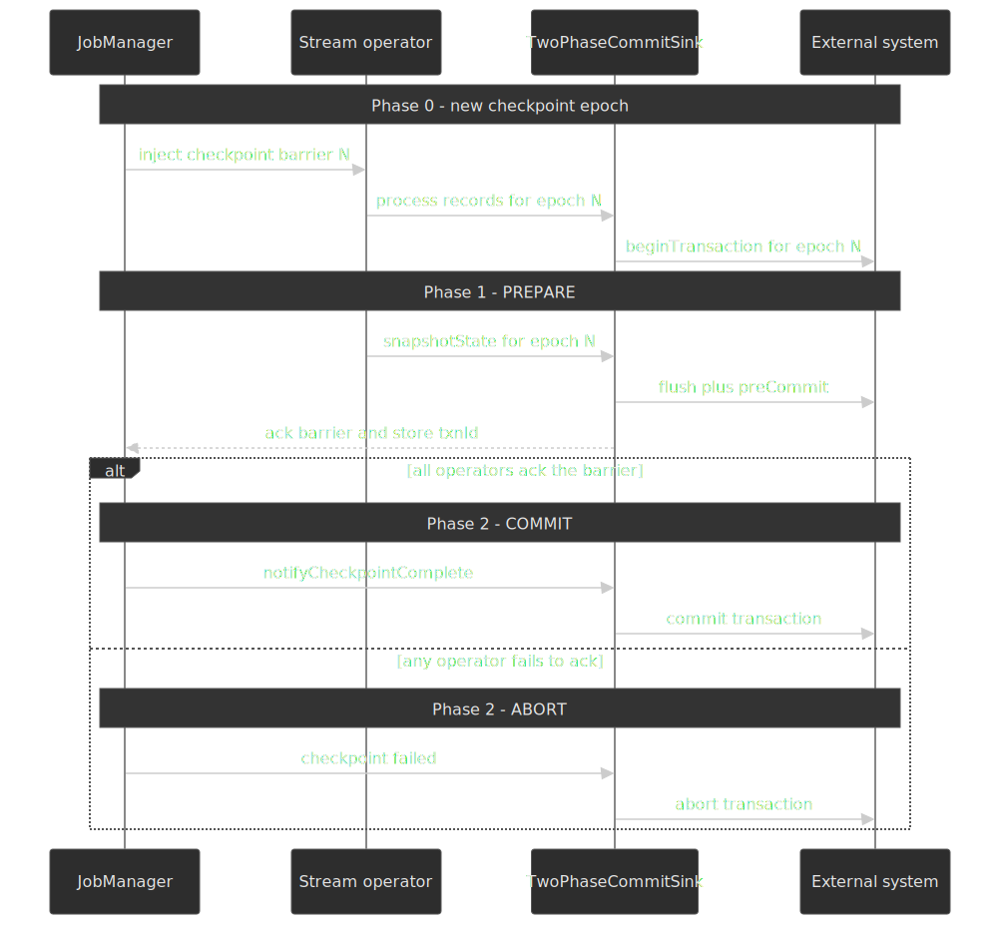

The four hooks: `beginTransaction()` opens a new external transaction at the start of each checkpoint epoch; `invoke()` writes records into it; `preCommit()` flushes and stores the transaction id in the checkpoint state; `commit()` is called by the JobManager only after every operator has acked the checkpoint; `abort()` rolls back if any operator fails. End-to-end latency is bounded by the checkpoint interval — downstream consumers never see a record from a checkpoint that did not commit. Pulsar 2.8.0 ships an equivalent transaction API that plugs into the same Flink contract.[^pulsar-txn]

[^flink-2pc]: Apache Flink. "[An Overview of End-to-End Exactly-Once Processing in Apache Flink (with Apache Kafka, too!)](https://flink.apache.org/2018/02/28/an-overview-of-end-to-end-exactly-once-processing-in-apache-flink-with-apache-kafka-too/)", 2018.

[^pulsar-txn]: Apache Pulsar. "[What are transactions?](https://pulsar.apache.org/docs/next/txn-what/)" and "[Why transactions?](https://pulsar.apache.org/docs/next/txn-why/)" — atomic produce + ack across multiple topic-partitions since Pulsar 2.8.0.

**Trade-offs vs other paths:**

| Aspect       | Transactional         | Consumer-Side Dedup      |
| ------------ | --------------------- | ------------------------ |
| Latency      | Higher (coordination) | Lower                    |
| Complexity   | Framework handles     | Application handles      |
| Cross-system | Kafka ecosystem only  | Works with any broker    |
| Recovery     | Automatic             | Manual offset management |

### Path 6: Transactional Outbox

Solve the dual-write problem by writing business data and events to the same database transaction, then asynchronously publishing events to the message broker.

**When to choose this path:**

- Need to update a database AND publish an event atomically.
- Cannot tolerate lost events or phantom events (event published but DB write failed, or vice versa).
- Using a broker that doesn't support distributed transactions with your database.

**Key characteristics:**

- Business data and outbox event written in a single database transaction.
- Background relay (poller or CDC reader) publishes outbox rows to the broker.
- Rows marked as published or deleted after successful publish.
- Requires idempotent consumers — the relay can publish duplicates on crash recovery.


**Implementation approaches:**

| Approach                  | Description                                            | Trade-offs                                          |
| ------------------------- | ------------------------------------------------------ | --------------------------------------------------- |
| Polling Publisher         | Background service polls outbox table periodically     | Simple, adds latency (polling interval)             |
| Change Data Capture (CDC) | Tools like Debezium read database transaction logs     | Lower latency, preserves order, more infrastructure |
| Log-only outbox           | PostgreSQL logical decoding without materializing rows | Minimal database growth, Postgres-specific          |

**Implementation with polling publisher:**

```typescript collapse={1-10, 35-50}
// Transactional outbox pattern
import { Pool, PoolClient } from "pg"

interface OutboxEvent {
  id: string
  aggregateType: string
  aggregateId: string
  eventType: string
  payload: unknown
  createdAt: Date
}

async function createOrderWithEvent(pool: Pool, order: Order): Promise<void> {
  const client = await pool.connect()
  try {
    await client.query("BEGIN")

    // Write business data
    await client.query(
      `INSERT INTO orders (id, customer_id, total, status)
       VALUES ($1, $2, $3, $4)`,
      [order.id, order.customerId, order.total, "created"],
    )

    // Write event to outbox in same transaction
    await client.query(
      `INSERT INTO outbox (id, aggregate_type, aggregate_id, event_type, payload)
       VALUES ($1, $2, $3, $4, $5)`,
      [crypto.randomUUID(), "Order", order.id, "OrderCreated", JSON.stringify(order)],
    )

    await client.query("COMMIT")
  } catch (error) {
    await client.query("ROLLBACK")
    throw error
  } finally {
    client.release()
  }
}

// Polling publisher (separate process)
async function publishOutboxEvents(pool: Pool, publisher: MessagePublisher): Promise<void> {
  const client = await pool.connect()
  // ... polling and publishing logic
}
```

**Outbox table schema:**

```sql
CREATE TABLE outbox (
  id UUID PRIMARY KEY,
  aggregate_type VARCHAR(255) NOT NULL,
  aggregate_id VARCHAR(255) NOT NULL,
  event_type VARCHAR(255) NOT NULL,
  payload JSONB NOT NULL,
  created_at TIMESTAMP NOT NULL DEFAULT NOW(),
  published_at TIMESTAMP NULL
);

CREATE INDEX idx_outbox_unpublished ON outbox (created_at)
  WHERE published_at IS NULL;
```

**Trade-offs vs direct publishing:**

| Aspect         | Transactional Outbox      | Direct to Broker   |
| -------------- | ------------------------- | ------------------ |
| Atomicity      | Guaranteed                | Dual-write problem |
| Latency        | Higher (async relay)      | Lower (direct)     |
| Complexity     | Higher (outbox + relay)   | Lower              |
| Ordering       | Preserved (by created_at) | Depends on broker  |
| Infrastructure | Database + relay process  | Broker only        |

**Real-world usage:**

Debezium's outbox connector reads the outbox table via CDC and publishes to Kafka. This eliminates the need for a custom polling publisher and provides exactly-once delivery when combined with Kafka transactions.

### Decision Framework

The six paths above can be selected with a small set of questions about who controls the consumer, whether operations are naturally idempotent, and which broker family is in play.


## Production Implementations

### Kafka: Confluent's EOS

**Context:** Apache Kafka, originally developed at LinkedIn, now maintained by Confluent. Processes trillions of messages per day across major tech companies.

**Implementation choices:**

- Pattern variant: Idempotent producer + transactional processing
- Key customization: Producer ID (PID) with per-partition sequence numbers
- Scale: Tested at 1M+ messages/second with exactly-once guarantees

**Architecture:**


**Specific details:**

- Broker assigns a 64-bit Producer ID (PID) to each producer on init.
- Per topic-partition sequence numbers are 32-bit integers, monotonically increasing per producer.
- The broker tracks the **last 5 record batches** per `(PID, topic-partition)`. This is why `max.in.flight.requests.per.connection` is capped at 5 when idempotence is enabled — exceed it and the broker can no longer detect duplicates or gaps.[^kafka-batches]
- A gap (`seq > last_acked + 1`) raises `OutOfOrderSequenceException` instead of silently re-ordering.
- `transactional.id` persists the PID across producer restarts; without it, a restart gets a fresh PID and previously-sent messages can be redelivered.
- A transaction coordinator runs a two-phase commit across topic-partitions and offsets so the consume-transform-produce loop is atomic.

[^kafka-batches]: Confirmed by the librdkafka maintainers in [Default for max.in.flight.requests.per.connection breaks idempotency](https://github.com/confluentinc/librdkafka/discussions/4070): "the broker tracks the last 5 sequence numbers per producer-partition for duplicate detection".

**Version evolution:**

| Version       | Change                                                                                                  |
| ------------- | ------------------------------------------------------------------------------------------------------- |
| Kafka 0.11    | [KIP-98](https://cwiki.apache.org/confluence/display/KAFKA/KIP-98+-+Exactly+Once+Delivery+and+Transactional+Messaging) introduced idempotent producers and transactions.                                                 |
| Kafka 2.6     | EOS v2 ([KIP-447](https://cwiki.apache.org/confluence/display/KAFKA/KIP-447%3A+Producer+scalability+for+exactly+once+semantics)) — one transactional producer per Streams thread instead of per task. Streams added the `exactly_once_beta` config name. |
| Kafka 3.0     | `enable.idempotence=true` and `acks=all` become producer defaults ([KIP-679](https://issues.apache.org/jira/browse/KAFKA-10619)). Streams renames the option to `exactly_once_v2`.                                          |
| Kafka 3.3     | [KIP-618](https://www.confluent.io/blog/apache-kafka-3-3-0-new-features-and-updates/) adds exactly-once for Kafka Connect source connectors.                                                                              |
| Kafka 4.0     | Removed deprecated `exactly_once` and `exactly_once_beta` Streams guarantees; users must migrate to `exactly_once_v2`.[^kafka-4]                                                                                          |

[^kafka-4]: See the [Kafka 4.0 Streams upgrade guide](https://kafka.apache.org/40/streams/upgrade-guide/).

> [!NOTE]
> [KIP-939: Support Participation in 2PC](https://cwiki.apache.org/confluence/display/KAFKA/KIP-939%3A+Support+Participation+in+2PC) is **Accepted** with implementation tracked in [KAFKA-15370](https://issues.apache.org/jira/browse/KAFKA-15370). It adds a `PrepareTransaction` RPC so an external coordinator (e.g. Flink, an XA transaction manager) can drive an atomic dual-write across Kafka and a database — eventually removing the need for an outbox in some topologies. As of 2026-Q2 the feature has not landed in a released Kafka version.

**What worked:**

- Idempotency is on by default since 3.0, so the common case has no extra configuration to remember.
- The consume-transform-produce loop is the canonical Streams pattern; the framework handles offset commits inside the transaction.

**What was hard:**

- The transaction coordinator is a single point of coordination per `transactional.id`. Hot transactional ids can become a bottleneck.
- Consumer rebalancing during a transaction can cause duplicates if the consumer is not using `isolation.level=read_committed`.
- **EOS stops at the Kafka cluster boundary** — beyond Kafka, consumers must still be idempotent.

**Source:** [KIP-98 — Exactly Once Delivery and Transactional Messaging](https://cwiki.apache.org/confluence/display/KAFKA/KIP-98+-+Exactly+Once+Delivery+and+Transactional+Messaging).

### Stripe: Idempotency Keys

**Context:** Payment processing platform handling millions of API requests daily. A single duplicate charge causes real financial harm.

**Implementation choices:**

- Pattern variant: Client-generated idempotency keys with server-side caching
- Key customization: 24-hour retention, Redis-backed distributed cache
- Scale: Handles all Stripe API traffic with idempotency support

**Architecture:**

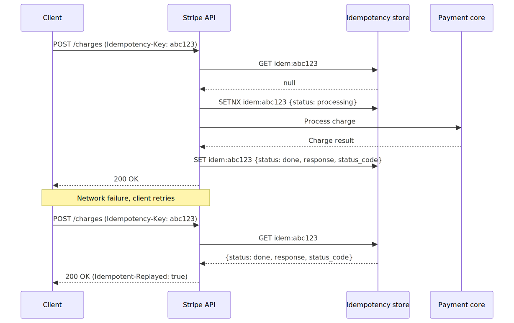
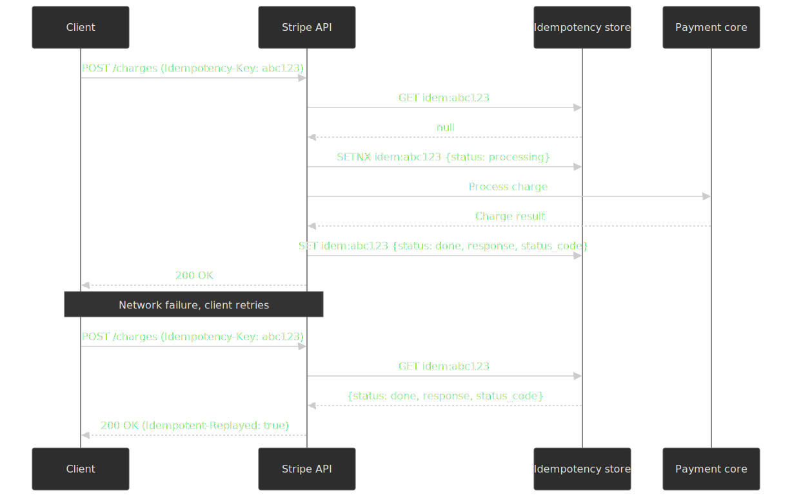

**Specific details:**

- Keys are client-provided strings, [up to 255 characters](https://docs.stripe.com/api/idempotent_requests).
- The cached entry includes the original status code and body.
- A successful retry receives the cached response with the [`Idempotent-Replayed: true`](https://docs.stripe.com/error-low-level) header.
- Keys still in `processing` state return `409 Conflict` so concurrent retries cannot race past each other.
- A separate Redis cluster isolates the idempotency store from the rest of the platform's failure domains.

> [!NOTE]
> Stripe's API v1 retains idempotency keys for ~24 hours; [API v2 extends this to 30 days](https://docs.stripe.com/api-v2-overview). Pick a window longer than your worst-case retry budget — see "Deduplication window expiry" below.

**What worked:**

- Completely eliminates duplicate charges from network issues
- Clients can safely retry with exponential backoff
- No application logic changes needed for idempotent endpoints

**What was hard:**

- Determining correct 24-hour window (too short = duplicates, too long = storage cost)
- Handling partial failures (charge succeeded but idempotency record write failed)
- Cross-datacenter replication of idempotency store

**Source:** [Designing robust and predictable APIs with idempotency](https://stripe.com/blog/idempotency)

### Google Pub/Sub: Exactly-Once Delivery

**Context:** Google Cloud's managed messaging service. Added exactly-once delivery (GA December 2022).

**Implementation choices:**

- Pattern variant: Broker-side deduplication with acknowledgment tracking
- Key customization: Regional scope, unique message IDs
- Scale: Google-scale messaging with exactly-once in single region

**Specific details:**

- Exactly-once is guaranteed **within a single cloud region only** — subscribers spread across regions can still receive duplicates.[^pubsub-eos]
- Pub/Sub assigns unique message IDs; the subscriber doesn't have to invent its own.
- Subscribers receive acknowledgement confirmation (success or failure).
- Only the **latest acknowledgement ID** can acknowledge a message; older IDs fail with `INVALID_ARGUMENT`.
- Default ack deadline is 60 seconds if unspecified.

[^pubsub-eos]: All Pub/Sub-specific behaviour in this section is from [Cloud Pub/Sub exactly-once delivery](https://cloud.google.com/pubsub/docs/exactly-once-delivery) and the [GA announcement (1 December 2022)](https://cloud.google.com/blog/products/data-analytics/cloud-pub-sub-exactly-once-delivery-feature-is-now-ga).

**Supported configurations:**

| Feature              | Exactly-once support |
| -------------------- | -------------------- |
| Pull subscriptions   | Yes                  |
| StreamingPull API    | Yes                  |
| Push subscriptions   | No                   |
| Export subscriptions | No                   |

**Performance trade-offs:**

- **Higher latency**: Significantly higher publish-to-subscribe latency than regular subscriptions, because the service runs an internal delivery-state persistence layer.
- **Throughput limitation**: client throughput is bounded by ~1,000 messages/second per ordering key when exactly-once is combined with ordered delivery (ordered delivery alone is also capped at 1 MB/s per ordering key).
- **Publish-side duplicates**: the subscription may still see duplicates that originate on the publish side (the guarantee covers redelivery, not republish).

**Client library minimum versions (required for exactly-once):**

| Language | Version   |
| -------- | --------- |
| Python   | v2.13.6+  |
| Java     | v1.139.0+ |
| Go       | v1.25.1+  |
| Node.js  | v3.2.0+   |

**What worked:**

- Eliminates need for application-level deduplication in many cases
- Ack confirmation tells subscriber definitively if message was processed

**What was hard:**

- **Regional constraint**: Cross-region subscribers may receive duplicates
- Push subscriptions excluded (no ack confirmation mechanism)
- Still requires idempotent handlers for regional failover scenarios
- "The feature does not provide any guarantees around exactly-once side effects"—side effects are outside scope

**Source:** [Cloud Pub/Sub exactly-once delivery](https://cloud.google.com/pubsub/docs/exactly-once-delivery)

### Azure Service Bus: Duplicate Detection

**Context:** Microsoft's managed messaging service with configurable deduplication windows.

**Implementation choices:**

- Pattern variant: Broker-side deduplication with configurable window
- Key customization: Window from 20 seconds to 7 days
- Limitation: Standard/Premium tiers only (not Basic)

**Specific details:**

- Tracks `MessageId` for every message inside the configured detection window (default 10 minutes, range 20 seconds to 7 days).
- Duplicate messages are **accepted** at the API (the send succeeds) but **silently dropped** by the broker.
- Duplicate detection cannot be enabled or disabled after queue/topic creation.
- With partitioning: `MessageId + PartitionKey` determines uniqueness.

**Configuration:**

```yaml
duplicateDetectionHistoryTimeWindow: P7D # ISO 8601 duration, max 7 days
```

**Best practice for MessageId:**

```text
{application-context}.{message-subject}
Example: purchase-order-12345.payment
```

**Trade-off:** Longer windows provide better duplicate protection but consume more storage for tracking message IDs.

**Source:** [Azure Service Bus duplicate detection](https://learn.microsoft.com/en-us/azure/service-bus-messaging/duplicate-detection)

### NATS JetStream: Message Deduplication

**Context:** High-performance messaging system with built-in deduplication.

**Implementation choices:**

- Pattern variant: Header-based deduplication with sliding window
- Key customization: Configurable window (default 2 minutes)
- Alternative: Infinite deduplication via `DiscardNewPerSubject` (NATS 2.9.0+)

**Specific details:**

- Uses `Nats-Msg-Id` header for duplicate detection
- Server tracks message IDs within deduplication window
- **Double acknowledgment** mechanism prevents erroneous re-sends after failures

**Infinite deduplication pattern (NATS 2.9.0+):**

```jsonc
// Stream configuration for infinite deduplication
{
  "discard": "new",
  "discard_new_per_subject": true,
  "max_msgs_per_subject": 1,
}

// Include unique ID in subject
// Subject: orders.create.{order-id}
```

Publish fails if a message with that subject already exists—provides infinite exactly-once publication.

**Source:** [JetStream Model Deep Dive](https://docs.nats.io/using-nats/developer/develop_jetstream/model_deep_dive)

### Apache Pulsar: Transactions

**Context:** Multi-tenant distributed messaging with native exactly-once support since Pulsar 2.8.0.

**Implementation choices:**

- Pattern variant: Transaction API for atomic produce and acknowledgement
- Key customization: Cross-topic atomicity
- Scale: Used in production at Yahoo, Tencent, Verizon

**Specific details:**

- Transaction API enables atomic produce and acknowledgement across multiple topics
- Idempotent producer + exactly-once semantics at single partition level
- If transaction aborts, all writes and acknowledgments roll back

**Transaction flow:**

```text
1. Begin transaction
2. Produce to topic A (within transaction)
3. Produce to topic B (within transaction)
4. Acknowledge consumed message (within transaction)
5. Commit or abort
```

**Integration:** Works with Apache Flink via `TwoPhaseCommitSinkFunction` for end-to-end exactly-once.

**Source:** [Pulsar Transactions](https://pulsar.apache.org/docs/next/txn-what/)

### Implementation Comparison

| Aspect         | Kafka EOS               | Stripe Idempotency  | Pub/Sub         | Azure Service Bus | NATS JetStream  | Pulsar               |
| -------------- | ----------------------- | ------------------- | --------------- | ----------------- | --------------- | -------------------- |
| Variant        | Producer + transactions | Client keys + cache | Broker dedup    | Broker dedup      | Header dedup    | Transactions         |
| Scope          | Kafka cluster           | Any HTTP client     | Single region   | Queue/Topic       | Stream          | Multi-topic          |
| Dedup window   | Session/configurable    | 24 hours            | Regional        | 20s–7 days        | 2 min (default) | Transaction          |
| Latency impact | 3%                      | Cache lookup        | Significant     | Minimal           | Minimal         | Transaction overhead |
| Client changes | Config only             | Add header          | Library upgrade | None              | Add header      | Transaction API      |

## Common Pitfalls

### 1. Deduplication Window Expiry

**The mistake:** Retry timeout longer than the broker's deduplication window.

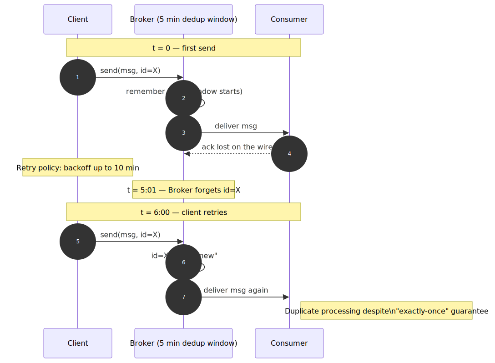
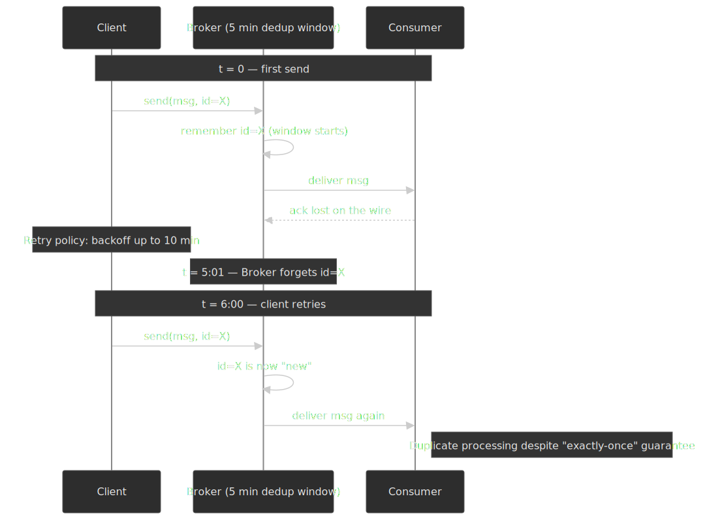

**Example:**

- Send message with id `X` at T = 0.
- AWS SQS FIFO has a fixed 5-minute deduplication window.
- Client retry policy: exponential backoff up to 10 minutes.
- At T = 6 minutes the client retries; SQS no longer remembers `X` and accepts it as a new message.
- Result: the consumer processes the same logical operation twice despite the "exactly-once" guarantee.

**Solutions:**

- Ensure max retry delay < deduplication window. With SQS FIFO that means capping at well under 5 minutes.
- Use exponential backoff with a cap: `min(2^attempt * 100ms, windowSize * 0.8)`.
- For critical operations: implement consumer-side deduplication as a backup so the consumer survives any window expiry upstream.

### 2. Producer Restart Losing Sequence State

**The mistake:** Idempotent producer without `transactional.id` loses sequence state on restart.

**Example:**

- Kafka producer with `enable.idempotence=true` but no `transactional.id`
- Producer crashes after sending message with seq=42
- Producer restarts, gets new PID, sequence resets to 0
- Messages with seq 0-42 are accepted again as "new"
- Result: 43 duplicate messages

**Solutions:**

- Set `transactional.id` for producers that must survive restarts
- Or: accept potential duplicates and ensure consumer idempotency

### 3. Consumer Rebalancing Race Condition

**The mistake:** Processing message but not committing offset before rebalance.

**Example:**

- Consumer processes message from partition 0
- Before offset commit: rebalance triggered (session timeout, new consumer joins)
- Partition 0 reassigned to different consumer
- New consumer reads from last committed offset (before the processed message)
- Result: Message processed twice by two different consumers

**Solutions:**

- Use transactional consumers (offset committed with output)
- Implement idempotent consumer pattern (database constraint on message ID)
- Increase `session.timeout.ms` for slow processing
- Use cooperative rebalancing (`partition.assignment.strategy=CooperativeStickyAssignor`)

### 4. Assuming Idempotency Key Uniqueness

**The mistake:** Using predictable keys that collide across users/operations.

**Example:**

- Developer uses `orderId` as idempotency key
- User A creates order 12345, key = "12345"
- User B creates order 12345 in different tenant, same key = "12345"
- User B's request returns User A's cached response
- Result: Data leakage between tenants

**Solutions:**

- Include tenant/user ID in key: `{tenantId}:{operationId}`
- Use client-generated UUIDs (UUID v4)
- Never derive keys solely from user-provided identifiers

### 5. Idempotency for GET Requests

**The mistake:** Adding idempotency keys to read operations.

**Example:**

- Developer adds idempotency keys to all endpoints including GET
- GET /user/123 with key "abc" returns user data, cached
- User updates their profile
- GET /user/123 with key "abc" returns stale cached data
- Result: Clients see outdated data indefinitely

**Solutions:**

- Idempotency keys only for state-changing operations (POST, PUT, DELETE)
- GET requests are naturally idempotent—no key needed
- If caching reads, use standard HTTP caching (ETags, Cache-Control)

### 6. Clock Skew in Last-Write-Wins

**The mistake:** Using wall-clock timestamps for conflict resolution in distributed system.

**Example:**

- Node A (clock +100ms skew) writes value V1 at local time T1
- Node B (accurate clock) writes value V2 at local time T2
- T1 > T2 due to clock skew, but V2 was actually written later
- LWW comparison: V1 wins because T1 > T2
- Result: Causally later write (V2) is discarded

**Solutions:**

- Use Lamport timestamps or vector clocks instead of wall clocks
- Use hybrid logical clocks (HLC) for ordering with physical time hints
- Accept that LWW with physical clocks is eventually consistent, not causally consistent

### 7. Assuming EOS Extends Beyond System Boundaries

**The mistake:** Believing Kafka's exactly-once guarantees extend to downstream systems.

**Example:**

- Kafka Streams app with `processing.guarantee=exactly_once_v2`
- App reads from Kafka, processes, writes to PostgreSQL
- Assumption: "Kafka handles exactly-once, so PostgreSQL writes are safe"
- Reality: Kafka EOS only covers Kafka-to-Kafka. The PostgreSQL write is outside the transaction.
- Result: Consumer crashes after PostgreSQL write but before Kafka offset commit → duplicate write on restart

**Solutions:**

- Use transactional outbox pattern for database writes
- Implement idempotent database operations (upsert with message ID)
- Use KIP-939 (when available) for native 2PC with external databases
- Always design downstream consumers as idempotent regardless of upstream guarantees

### 8. Dual-Write to Database and Broker

**The mistake:** Writing to a database and then publishing to a message broker as two independent operations, treating success of the first as permission to attempt the second.

**Example:**

- Order service does `INSERT orders` → returns 200, then `producer.send("OrderCreated", ...)`.
- The DB row commits, the broker call fails (network blip, broker reboot, slow GC).
- The order exists; downstream services never learn about it. A retry from the caller may produce a second row but still no event — or, worse, an event with no row if the order is reordered.
- Symmetric failure: broker accepts, DB commit fails — phantom event for an order that does not exist.

**Solutions:**

- Replace the dual-write with a transactional outbox (Path 6): the event row commits in the same DB transaction as the business data, and a relay (poller or CDC) publishes it at-least-once.
- Or use a coordinator that participates in both transactions (Flink `TwoPhaseCommitSinkFunction`, future Kafka KIP-939).
- Never use a "best-effort" `try { send } catch { log.warn }` — the warning is the bug.

### 9. Ack Before Side Effect (or Side Effect Before Ack)

**The mistake:** Choosing the wrong ordering of "process the message" vs "ack the broker".

- **Ack-then-process**: ack first, then run the side effect. If the consumer crashes between the two, the message is acked but the side effect never happened — *message loss*, indistinguishable from at-most-once.
- **Process-then-ack**: run the side effect, then ack. If the consumer crashes between the two, the broker redelivers the message and the side effect runs again — *duplicate*, indistinguishable from naive at-least-once.

This is a re-statement of Two Generals at the consumer boundary: there is no ordering of "ack" and "side effect" that is safe under crash without an external invariant.

**Solutions:**

- Make the side effect idempotent (Path 1 or Path 2) so process-then-ack is safe to replay.
- Or commit the side effect and the offset in the **same transaction** (Path 5: Kafka EOS, Flink 2PC sink, JDBC + Kafka KIP-939).
- Or write the offset to the same database as the side effect (consumer-side dedup, Path 4) so a crash recovers a consistent `(state, last_processed_offset)` pair.
- Never rely on "if the side effect throws, we don't ack" alone — partial side effects (HTTP call sent but response lost; DB row written but commit ack lost) are common and break the assumption.

## Implementation Guide

### System Selection Guide

| Requirement           | Recommended System  | Reason                           |
| --------------------- | ------------------- | -------------------------------- |
| Kafka ecosystem       | Kafka with EOS v2   | Native support, minimal overhead |
| Serverless/managed    | SQS FIFO or Pub/Sub | No infrastructure to manage      |
| Configurable window   | Azure Service Bus   | 20s to 7 days window             |
| High performance      | NATS JetStream      | Low latency, simple model        |
| Cross-topic atomicity | Pulsar or Kafka     | Transaction APIs                 |
| HTTP API idempotency  | Redis + custom code | Stripe pattern                   |

### When to Build Custom

**Build custom when:**

- Existing solutions don't fit your consistency requirements
- Cross-system exactly-once needed (Kafka → external database)
- Need longer deduplication windows than broker provides
- Performance requirements exceed library capabilities

**Implementation checklist:**

- [ ] Define deduplication key format (unique, collision-resistant)
- [ ] Choose deduplication storage (Redis, database, in-memory)
- [ ] Set deduplication window (longer than max retry delay)
- [ ] Implement atomic state update + dedup record insert
- [ ] Add cleanup job for expired deduplication records
- [ ] Test with network partition simulation
- [ ] Test with producer/consumer restart scenarios
- [ ] Document failure modes and recovery procedures

### Testing Exactly-Once

**Unit tests:**

- Same message ID processed twice → single state change
- Different message IDs → independent state changes
- Concurrent identical requests → single effect

**Integration tests:**

- Producer crash mid-send → no duplicates after restart
- Consumer crash mid-process → message reprocessed once
- Broker failover → no duplicates or losses

**Chaos testing:**

- Network partition between producer and broker
- Kill consumer during processing
- Slow consumer causing rebalance
- Clock skew between nodes

## Conclusion

Exactly-once *delivery* is mathematically impossible across an unreliable network — Two Generals and FLP both close that door. What we ship is exactly-once *processing*: at-least-once delivery composed with an idempotent sink or a transactional offset commit, so each message's observable effect lands exactly once even when the message itself is delivered many times.

The key insight is that exactly-once is a **composition**, not a primitive:

1. Never lose messages (at-least-once delivery with retries and persistence)
2. Make duplicates harmless (idempotent operations, deduplication tracking, or transactional processing)

Choose your implementation based on your constraints:

- **Idempotent operations** when you control the state model
- **Idempotency keys** for external-facing APIs
- **Broker-side deduplication** when your broker supports it (Kafka, SQS FIFO, Pub/Sub, Azure Service Bus, NATS JetStream)
- **Consumer-side deduplication** for maximum control and longer windows
- **Transactional processing** for Kafka/Pulsar consume-transform-produce patterns
- **Transactional outbox** when you need atomic database + event writes

Every approach has failure modes around the deduplication window. Design your retry policies to fit within the window, and consider layered approaches (broker + consumer deduplication) for critical paths.

**Critical reminder**: Most exactly-once guarantees stop at system boundaries. Kafka EOS doesn't extend to your PostgreSQL database. Pub/Sub exactly-once is regional. Always design downstream consumers as idempotent, regardless of upstream guarantees.

## Appendix

### Prerequisites

- Understanding of distributed systems fundamentals (network failures, partial failures)
- Familiarity with message brokers (Kafka, SQS, or similar)
- Basic knowledge of database transactions

### Terminology

- **Idempotency**: Property where applying an operation multiple times produces the same result as applying it once
- **PID (Producer ID)**: Unique 64-bit identifier assigned to a Kafka producer instance by the broker
- **Deduplication window**: Time period during which the system remembers message IDs for duplicate detection
- **EOS (Exactly-Once Semantics)**: Kafka's term for effectively exactly-once processing guarantees
- **2PC (Two-Phase Commit)**: Distributed transaction protocol that ensures atomic commits across multiple participants
- **CDC (Change Data Capture)**: Technique for reading database changes from transaction logs
- **Transactional outbox**: Pattern where events are written to an outbox table in the same database transaction as business data

### Summary

- Exactly-once **delivery** is impossible (Two Generals 1975, FLP 1985); exactly-once **processing** is achievable inside a closed system with idempotent sinks or a transactional offset commit.
- Six implementation paths: idempotent operations, idempotency keys, broker-side dedup, consumer-side dedup, transactional processing (Kafka EOS / Flink 2PC sink), transactional outbox.
- Every deduplication mechanism has a window — design retry policies to fit inside it.
- Kafka EOS: idempotent producers (PID + per-partition sequence, broker tracks last 5 batches) + transactional consumers (`read_committed`); idempotence has been the default since Kafka 3.0, EOS v2 since 2.6, source-connector EOS since 3.3, KIP-939 (external 2PC participation) accepted but not yet released as of 2026-Q2.
- Flink generalises the same 2PC pattern via `TwoPhaseCommitSinkFunction`: the checkpoint barrier is the prepare phase, `notifyCheckpointComplete` is the commit phase. Pulsar 2.8.0 ships the matching transaction API.
- Deduplication windows vary: SQS FIFO (5 min fixed), Azure Service Bus (20 s – 7 d, default 10 min), NATS JetStream (2 min default, infinite via `discard_new_per_subject` since 2.9), Pub/Sub (regional only, push subscriptions excluded).
- Most exactly-once guarantees stop at system boundaries — always design downstream consumers as idempotent.
- Anti-patterns to avoid: dual-write (DB then broker), ack-then-process or process-then-ack without idempotency, idempotency keys on GETs, wall-clock LWW, predictable idempotency keys.
- Test with chaos: network partitions, restarts, rebalancing, clock skew.

### References

**Theoretical Foundations**

- [Impossibility of Distributed Consensus with One Faulty Process](https://groups.csail.mit.edu/tds/papers/Lynch/jacm85.pdf) - FLP impossibility theorem (1985)
- [A Brief Tour of FLP Impossibility](https://www.the-paper-trail.org/post/2008-08-13-a-brief-tour-of-flp-impossibility/) - Accessible explanation of FLP
- [Two Generals' Problem](https://en.wikipedia.org/wiki/Two_Generals%27_Problem) - First computer communication problem proven unsolvable

**Apache Kafka**

- [KIP-98 - Exactly Once Delivery and Transactional Messaging](https://cwiki.apache.org/confluence/display/KAFKA/KIP-98+-+Exactly+Once+Delivery+and+Transactional+Messaging) - Kafka's exactly-once specification
- [KIP-129 - Streams Exactly-Once Semantics](https://cwiki.apache.org/confluence/display/KAFKA/KIP-129%3A+Streams+Exactly-Once+Semantics) - Kafka Streams exactly-once
- [KIP-447 - Producer scalability for exactly once semantics](https://cwiki.apache.org/confluence/display/KAFKA/KIP-447:+Producer+scalability+for+exactly+once+semantics) - EOS v2 improvements
- [KIP-939 - Support Participation in 2PC](https://cwiki.apache.org/confluence/display/KAFKA/KIP-939:+Support+Participation+in+2PC) - Kafka + external database atomic writes
- [Message Delivery Guarantees for Apache Kafka](https://docs.confluent.io/kafka/design/delivery-semantics.html) - Confluent official docs
- [Exactly-once Support in Apache Kafka](https://medium.com/@jaykreps/exactly-once-support-in-apache-kafka-55e1fdd0a35f) - Jay Kreps on Kafka EOS
- [Exactly-once, once more](https://medium.com/@jaykreps/exactly-once-one-more-time-901181d592f9) - Jay Kreps reframing the delivery vs processing debate

**Cloud Messaging Services**

- [Cloud Pub/Sub exactly-once delivery](https://cloud.google.com/pubsub/docs/exactly-once-delivery) - Google Pub/Sub implementation
- [AWS SQS FIFO exactly-once processing](https://docs.aws.amazon.com/AWSSimpleQueueService/latest/SQSDeveloperGuide/FIFO-queues-exactly-once-processing.html) - AWS implementation
- [Azure Service Bus duplicate detection](https://learn.microsoft.com/en-us/azure/service-bus-messaging/duplicate-detection) - Azure implementation

**Other Messaging Systems**

- [JetStream Model Deep Dive](https://docs.nats.io/using-nats/developer/develop_jetstream/model_deep_dive) - NATS deduplication
- [Pulsar Transactions](https://pulsar.apache.org/docs/next/txn-what/) - Apache Pulsar exactly-once

**API Idempotency**

- [Designing robust and predictable APIs with idempotency](https://stripe.com/blog/idempotency) - Stripe's idempotency key pattern
- [Implementing Stripe-like Idempotency Keys in Postgres](https://brandur.org/idempotency-keys) - Detailed implementation guide

**Patterns**

- [Transactional outbox pattern](https://microservices.io/patterns/data/transactional-outbox.html) - Microservices.io pattern reference
- [Reliable Microservices Data Exchange With the Outbox Pattern](https://debezium.io/blog/2019/02/19/reliable-microservices-data-exchange-with-the-outbox-pattern/) - Outbox pattern with CDC
- [Idempotent Consumer Pattern](https://microservices.io/patterns/communication-style/idempotent-consumer.html) - Microservices.io pattern reference
- [An Overview of End-to-End Exactly-Once Processing in Apache Flink (with Apache Kafka, too!)](https://flink.apache.org/2018/02/28/an-overview-of-end-to-end-exactly-once-processing-in-apache-flink-with-apache-kafka-too/) - Flink TwoPhaseCommitSinkFunction explained
- [Paxos Made Simple](https://lamport.azurewebsites.net/pubs/paxos-simple.pdf) - Lamport's relevance: every closed-system 2PC coordinator in this article (Kafka, Flink, JobManager) is a small Paxos- or Raft-replicated state machine

**General**

- [The impossibility of exactly-once delivery](https://blog.bulloak.io/post/20200917-the-impossibility-of-exactly-once/) - Theoretical foundations
- [You Cannot Have Exactly-Once Delivery](https://bravenewgeek.com/you-cannot-have-exactly-once-delivery/) - Why true exactly-once is impossible
