# Exponential Backoff and Retry Strategy

Naive retries do not just fail to help — they actively cause the outages they are trying to recover from. This article unpacks the contention model that makes exponential backoff with jitter the canonical answer, derives the three jitter algorithms from the [2015 AWS analysis](https://aws.amazon.com/blogs/architecture/exponential-backoff-and-jitter/), shows where retry budgets and circuit breakers fit, and walks through real postmortems where one or more of these defences was missing.


## Mental model

Retry strategy is a contention-resolution problem. Multiple uncoordinated clients are competing for a recovering resource, and the goal is to spread their attempts out enough that the resource can drain its backlog before the next wave hits.

Three orthogonal mechanisms cooperate:

1. **Backoff** spreads load over **time**. The formula `delay = min(cap, base × 2^attempt)` creates exponentially growing inter-arrival windows: with `base = 100 ms`, the fifth retry waits up to 3.2 s, giving the server room to drain its queue.
2. **Jitter** spreads load **across clients**. Without randomness, a thousand clients that all failed at `t = 0` will all retry at exactly `t = 100 ms`, then at `t = 200 ms`, then `t = 400 ms` — synchronised spikes that look like the original failure. [Full jitter](https://aws.amazon.com/blogs/architecture/exponential-backoff-and-jitter/) (`random(0, calculated_delay)`) replaces every spike with a near-uniform stream.
3. **Budgets and breakers** stop retries from amplifying further. A per-client retry budget caps how many of your outbound requests are retries; a circuit breaker cuts the call entirely when failures persist.

| Layer | Mechanism                    | Failure it handles  | Typical configuration                |
| ----- | ---------------------------- | ------------------- | ------------------------------------ |
| 1     | Single retry                 | Network blips       | 1 attempt, no delay                  |
| 2     | Exponential backoff + jitter | Transient overload  | 3-5 attempts, 100 ms base, 30 s cap  |
| 3     | Retry budget                 | Cascade prevention  | 10% retry-to-request ratio per client |
| 4     | Circuit breaker              | Persistent failure  | 50% failure rate → open for 30 s     |

> [!IMPORTANT]
> Idempotency is a prerequisite. Non-idempotent operations (charge a card, send an SMS, create a row without an idempotency key) cannot be safely retried. Build [`Idempotency-Key`](https://datatracker.ietf.org/doc/draft-ietf-httpapi-idempotency-key-header/) handling into write APIs **before** reaching for retry logic.

## Why naive retries fail: contention resolution

The most damaging retry anti-pattern is the immediate retry. A `while (true)` with a fixed delay, replicated across thousands of callers, creates a feedback loop the industry has named the **thundering herd**: a recovering service is hit by a synchronised flood of retries that exhausts its connection pool, threads, or memory, and crashes it again before it can stabilise.

The same problem appeared in 1973 in the Aloha network and was carried into Ethernet: when multiple stations try to use a shared medium at once, mutual interference drops throughput to zero. The truncated **Binary Exponential Backoff** algorithm in [IEEE 802.3](https://standards.ieee.org/ieee/802.3/7071/) (CSMA/CD) is the same idea: after each collision, double the random window the station picks its next slot from, capped at `2^10 = 1024` slots, and give up after 16 attempts.[^beb-spec]

Service-to-service retries are the same problem at a different scale. The shared resource is a queue, a database, or a connection pool instead of a cable, but the contention dynamics — and the solution — are identical.

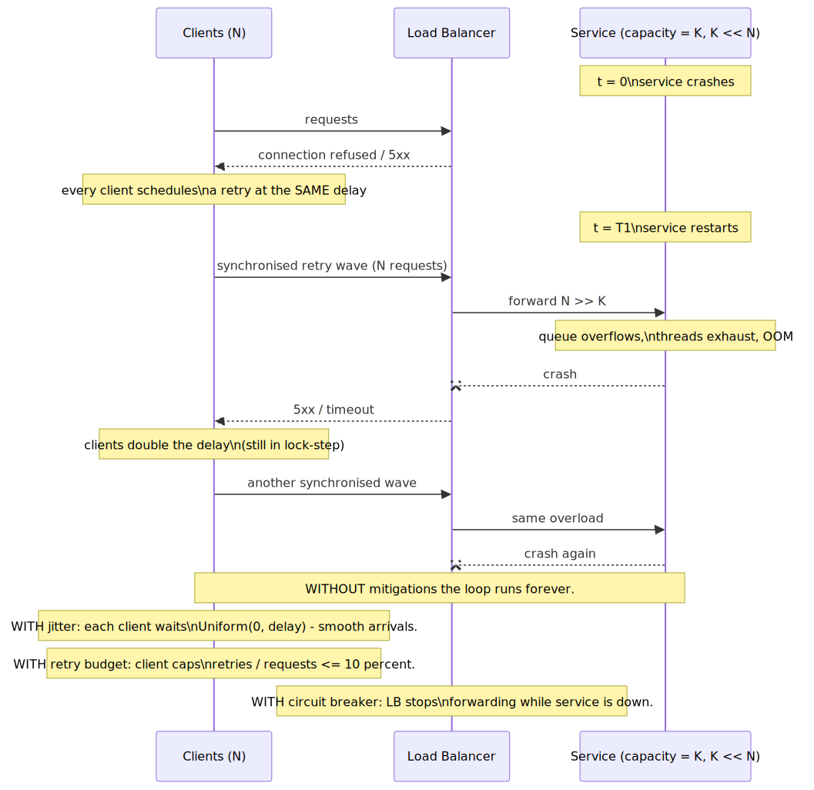
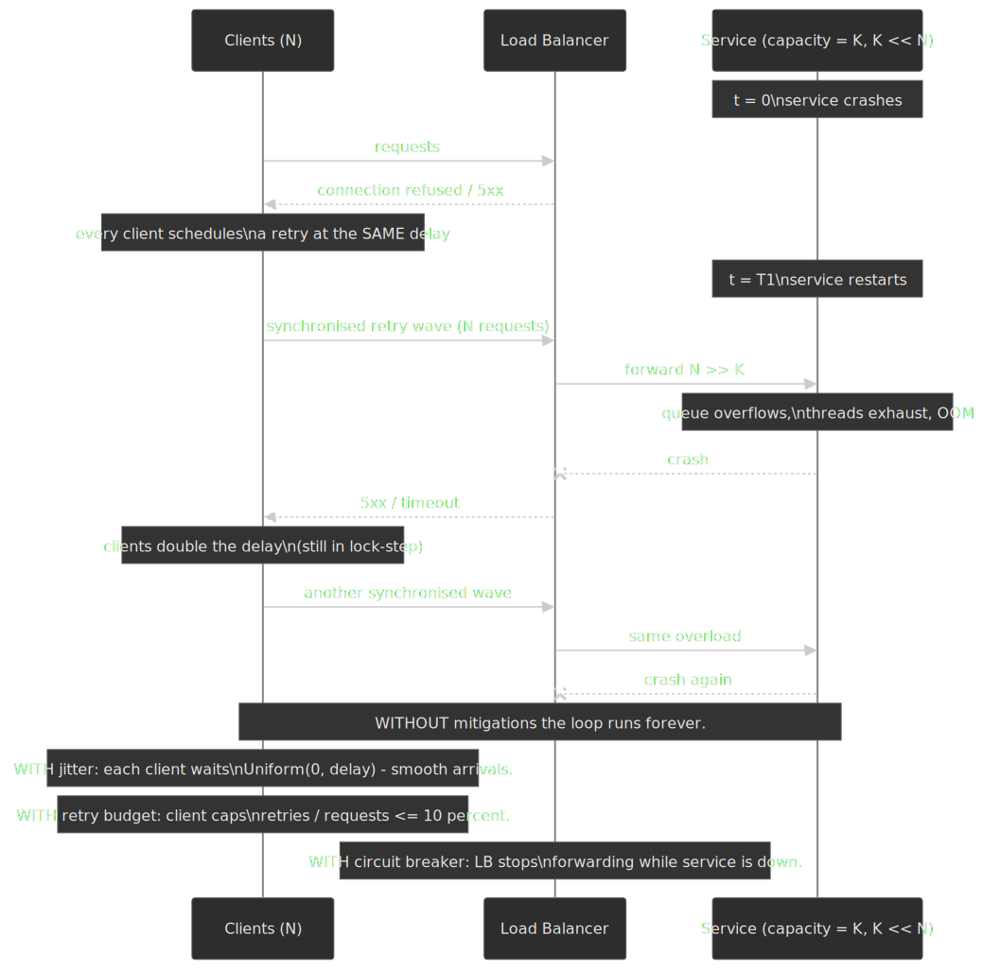

[^beb-spec]: Truncated BEB freezes the slot window at `2^10` after the 10th collision and reports an excessive-collision error after the 16th attempt. See [the IEEE 802.3 standard](https://standards.ieee.org/ieee/802.3/7071/) and the [Wikipedia summary of the truncation rules](https://en.wikipedia.org/wiki/Exponential_backoff#Truncated_exponential_backoff).

## The mechanics of exponential backoff

### Why exponential and not linear

| Strategy    | Formula                    | First four delays (base = 1s) | Problem with this growth                     |
| ----------- | -------------------------- | ----------------------------- | -------------------------------------------- |
| Constant    | `delay = base`             | 1 s, 1 s, 1 s, 1 s            | No adaptation to the severity of overload    |
| Linear      | `delay = base × attempt`   | 1 s, 2 s, 3 s, 4 s            | Growth too slow for severe overload          |
| Exponential | `delay = base × 2^attempt` | 1 s, 2 s, 4 s, 8 s            | Matches the geometric recovery of queues     |

Exponential growth matches the typical recovery curve of an overloaded system. When a queue is backed up, the time to drain it is proportional to the depth of the backlog, which itself grows with the duration of the incident. Linear backoff under-corrects; constant backoff does not correct at all.

### The capped formula and its parameters

The canonical implementation is **capped** exponential backoff. The cap prevents delays from drifting into useless territory — a 30-minute retry serves nobody.

$$
\text{delay} = \min(\text{cap},\ \text{base} \times \text{factor}^{\text{attempt}})
$$

| Parameter | Typical value      | Tuning hint                                                                         |
| --------- | ------------------ | ----------------------------------------------------------------------------------- |
| `base`    | 100 ms             | Start at the round-trip latency floor for healthy responses.                        |
| `factor`  | 2                  | 2 is the [BEB](https://en.wikipedia.org/wiki/Exponential_backoff) default; 1.5 is gentler when many clients share the budget. |
| `attempt` | 0-indexed counter  | Cap `maxAttempts` based on the operation's user-facing latency budget.              |
| `cap`     | 30 s (heuristic)   | Long enough to ride out a typical outage; short enough not to hold caller threads.  |

> [!NOTE]
> The "30-60 s cap" heuristic comes from the [AWS Builders' Library](https://aws.amazon.com/builders-library/timeouts-retries-and-backoff-with-jitter/) and matches what most SDKs use, but it is not specified anywhere — choose a cap that fits your call site's deadline.

### Contention math: why doubling the window is enough

For `N` independent clients picking uniformly random slots in a window of size `W = 2^c` after `c` collisions:

- The probability that any two specific clients pick the same slot is `1 / W`.
- The expected number of pairwise collisions is `\binom{N}{2} / W ≈ N² / (2W)`.

So the window has to grow with `N²`, not `N`, to keep collisions rare. Doubling per collision (multiplying `W` by 2 each time) catches up to a quadratic growth target in `O(log N)` rounds, which is why the BEB doubling rule works in practice. With `N = 1000` and `c = 10` (`W = 1024`), the expected pairwise collision count is still around `488` — the network is still heavily contended at a single window, which is exactly why CSMA/CD also relies on transmission-level back-pressure beyond the backoff window.

The takeaway for service retries is that doubling alone does not magically eliminate contention; it makes contention recoverable. **Jitter does the rest.**

## Jitter: decorrelating clients

### The "thundering herd" in service retries

Pure exponential backoff is deterministic. A thousand clients that fail at the same instant will all calculate `base × 2^1`, all sleep for the same number of milliseconds, and all hit the recovering service at the same moment again. The shape of the load is unchanged; only the timing has shifted.

Jitter — controlled randomness on top of the calculated delay — breaks this correlation. Each client picks a different point in the backoff window, so a synchronised failure becomes a smooth, near-constant arrival rate at the server.


### Three jitter algorithms (AWS, 2015)

The 2015 [AWS Architecture Blog post by Marc Brooker](https://aws.amazon.com/blogs/architecture/exponential-backoff-and-jitter/) is the canonical source for the three jitter strategies in production use today.

#### Full jitter (recommended default)

$$
\text{sleep} = \mathrm{Uniform}\!\left(0,\ \min(\text{cap},\ \text{base} \times 2^{\text{attempt}})\right)
$$

- **Spread**: maximum — clients scatter uniformly across the entire window.
- **Trade-off**: occasional near-zero delays, but the **lowest server load** of any approach in [Brooker's simulations](https://github.com/aws-samples/aws-arch-backoff-simulator). Decorrelated jitter finishes slightly faster on the same workload; full jitter trades a small amount of completion time for less work.
- **In practice**: this is the default in the AWS SDKs' [standard retry mode](https://docs.aws.amazon.com/sdkref/latest/guide/feature-retry-behavior.html) and the Google Cloud client libraries; pick it unless you specifically need a minimum spacing or want delays to grow off the previous draw.

#### Equal jitter

$$
\text{temp} = \min(\text{cap},\ \text{base} \times 2^{\text{attempt}}); \quad \text{sleep} = \tfrac{\text{temp}}{2} + \mathrm{Uniform}\!\left(0, \tfrac{\text{temp}}{2}\right)
$$

- **Spread**: half the window; guarantees a minimum wait of `temp / 2`.
- **Trade-off**: slightly more total work than full jitter, but bounded minimum delay.
- **Use case**: when the caller needs at least a known minimum to release a resource (close a connection, drain a buffer) before retrying.

#### Decorrelated jitter

$$
\text{sleep} = \min\!\left(\text{cap},\ \mathrm{Uniform}(\text{base},\ \text{prev\_sleep} \times 3)\right)
$$

- **Spread**: depends on the previous delay, not the attempt count.
- **Trade-off**: naturally adaptive — the window grows in response to actual conditions rather than a precomputed schedule.
- **Caveat**: once `prev_sleep × 3 > cap`, repeated clamping to `cap` causes consecutive delays to cluster near the cap, which re-correlates clients. Full jitter avoids this edge case entirely.

> [!TIP]
> If your call site can store one float across attempts, decorrelated jitter is fine. Otherwise full jitter is simpler, statelessly correct, and the AWS recommendation.

## A production-ready implementation

A retry helper is small enough to write once and reuse everywhere. The four traits that distinguish a usable one from a toy:

- **Configurability**: every parameter is a knob.
- **Pluggable jitter**: the jitter function is an injected dependency.
- **Error filtering**: the helper knows the difference between transient and permanent errors.
- **Cancellation**: integrates with `AbortSignal` so callers can stop a retry chain mid-sleep.

```typescript title="retry-with-backoff.ts" collapse={1-22, 63-85}
export type JitterStrategy = (delay: number) => number

export interface RetryOptions {
  maxRetries?: number
  initialDelay?: number
  maxDelay?: number
  backoffFactor?: number
  jitterStrategy?: JitterStrategy
  isRetryableError?: (error: unknown) => boolean
  abortSignal?: AbortSignal
}

export const fullJitter: JitterStrategy = (delay) => Math.random() * delay

export const equalJitter: JitterStrategy = (delay) => {
  const halfDelay = delay / 2
  return halfDelay + Math.random() * halfDelay
}

export async function retryWithBackoff<T>(operation: () => Promise<T>, options: RetryOptions = {}): Promise<T> {
  const {
    maxRetries = 5,
    initialDelay = 100,
    maxDelay = 30_000,
    backoffFactor = 2,
    jitterStrategy = fullJitter,
    isRetryableError = (error: unknown) => !(error instanceof Error && error.name === "AbortError"),
    abortSignal,
  } = options

  let attempt = 0
  let lastError: unknown

  while (attempt <= maxRetries) {
    if (abortSignal?.aborted) {
      throw new DOMException("Aborted", "AbortError")
    }

    try {
      return await operation()
    } catch (error) {
      lastError = error

      if (!isRetryableError(error) || attempt === maxRetries || abortSignal?.aborted) {
        throw lastError
      }

      const exponentialDelay = initialDelay * Math.pow(backoffFactor, attempt)
      const cappedDelay = Math.min(exponentialDelay, maxDelay)
      const jitteredDelay = jitterStrategy(cappedDelay)

      console.warn(`Attempt ${attempt + 1} failed. Retrying in ${Math.round(jitteredDelay)}ms...`)

      await delay(jitteredDelay, abortSignal)
      attempt++
    }
  }

  throw lastError
}

const delay = (ms: number, signal?: AbortSignal): Promise<void> => {
  return new Promise((resolve, reject) => {
    if (signal?.aborted) {
      return reject(new DOMException("Aborted", "AbortError"))
    }

    const onAbort = () => {
      clearTimeout(timeoutId)
      reject(new DOMException("Aborted", "AbortError"))
    }

    const timeoutId = setTimeout(() => {
      signal?.removeEventListener("abort", onAbort)
      resolve()
    }, ms)

    signal?.addEventListener("abort", onAbort, { once: true })
  })
}
```

```typescript title="example-usage.ts" collapse={1-22}
class HttpError extends Error {
  constructor(
    public status: number,
    message: string,
  ) {
    super(message)
    this.name = "HttpError"
  }
}

function isHttpErrorRetryable(error: unknown): boolean {
  if (error instanceof Error && error.name === "AbortError") {
    return false
  }

  if (error instanceof HttpError) {
    return error.status >= 500 || error.status === 429
  }

  return true
}

async function resilientFetchExample() {
  const controller = new AbortController()

  try {
    const data = await retryWithBackoff(() => fetchSomeData("https://api.example.com/data", controller.signal), {
      maxRetries: 4,
      initialDelay: 200,
      maxDelay: 5_000,
      jitterStrategy: equalJitter,
      isRetryableError: isHttpErrorRetryable,
      abortSignal: controller.signal,
    })
    console.log("Successfully fetched data:", data)
  } catch (error) {
    console.error("Operation failed after all retries:", error)
  }
}
```

## The broader resilience ecosystem

Backoff with jitter is one layer in a stack. The other three layers it composes with — circuit breakers, retry budgets, and request hedging — each address a failure mode that backoff alone cannot.

### Circuit breakers wrap retries; not the other way around

Backoff handles **a single request** that hit a transient error. A circuit breaker handles **all requests to an endpoint** that has been consistently failing. Wrapping retries inside a breaker means that once an endpoint has clearly broken, the breaker fast-fails new attempts without even invoking the retry loop.

| Pattern             | Scope                    | Trigger                       | Response                |
| ------------------- | ------------------------ | ----------------------------- | ----------------------- |
| Exponential backoff | Single request           | Transient error per attempt   | Wait, retry             |
| Circuit breaker     | All requests to endpoint | Failure rate over a window    | Fast-fail, stop calling |


The implementation order matters: the breaker must wrap the retry loop, not the other way around. The full sequence inside one call:

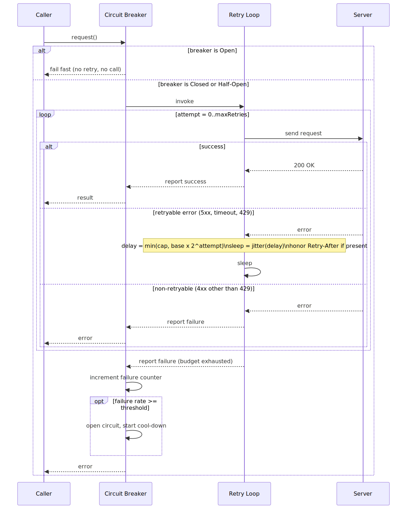
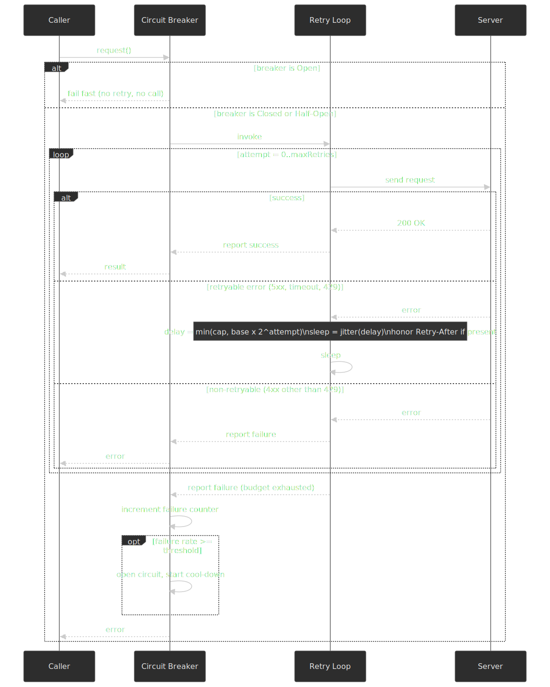

In a service mesh, both patterns can be configured at the infrastructure layer rather than in application code. [Istio](https://istio.io/latest/docs/tasks/traffic-management/circuit-breaking/) splits them across two CRDs:

```yaml title="virtualservice-retry.yaml"
apiVersion: networking.istio.io/v1
kind: VirtualService
spec:
  http:
    - retries:
        attempts: 3
        perTryTimeout: 2s
        retryOn: 5xx,reset,connect-failure
```

```yaml title="destinationrule-outlier.yaml"
apiVersion: networking.istio.io/v1
kind: DestinationRule
spec:
  trafficPolicy:
    outlierDetection:
      consecutive5xxErrors: 5
      interval: 30s
      baseEjectionTime: 30s
```

[Outlier detection](https://istio.io/latest/docs/reference/config/networking/destination-rule/#OutlierDetection) ejects an upstream host once it has returned `consecutive5xxErrors` 5xx responses in a row, and keeps it ejected for `baseEjectionTime × ejectionCount` (the ejection time scales with how often a host has been kicked out). That is Envoy's circuit-breaker primitive — and because the retry policy lives on a different resource, application code does not need to know about either.

### Retry budgets cap retry amplification

Even with perfect jitter, retries amplify multiplicatively in deep call chains. A user request that fans out through three services, each retrying up to four times on failure, produces up to `4 × 4 × 4 = 64` attempts at the leaf — exactly when the leaf is least able to handle them.


Two complementary controls from the [Google SRE book's "Handling Overload" chapter](https://sre.google/sre-book/handling-overload/) bound the damage:

- **Per-request limit**: hard cap of three retry attempts per request. After that, propagate the error.
- **Per-client retry budget**: track the ratio of retries to total requests, and only retry when

  $$
  \frac{\text{retries}}{\text{requests} + \text{retries}} < 0.10
  $$

  This caps worst-case amplification at roughly `1.1×` per layer instead of `3×` or worse. The same chapter also notes that retries should happen **at the layer immediately above the rejecting one** — never at every layer, because that is exactly what produces the multiplicative blow-up.

Backends help by signalling intent. gRPC distinguishes [`UNAVAILABLE`](https://grpc.io/docs/guides/status-codes/) (transient, OK to retry on the same or another backend) from `RESOURCE_EXHAUSTED` (you are being back-pressured — do not retry immediately). Google SRE's pattern goes further: an overloaded backend can reply with an explicit "overloaded; don't retry" status that tells the caller other backends in the cell are likely also overloaded, so retrying anywhere is futile.[^sre-overloaded]

[^sre-overloaded]: From [Handling Overload](https://sre.google/sre-book/handling-overload/): "When the client sees a large fraction of requests failing with the 'overloaded; don't retry' error, it stops retrying... If a single client is overloading the backend, then retries are likely to fix the problem... If the backend cluster is broadly overloaded, retries don't help and just make the problem worse."

### Honouring server signals: `Retry-After` and friends

When a server replies `429 Too Many Requests` or `503 Service Unavailable`, it can include a [`Retry-After` header (RFC 9110 §10.2.3)](https://www.rfc-editor.org/rfc/rfc9110.html#section-10.2.3) telling the client how long to wait. The header takes one of two forms:

- `Retry-After: 120` — seconds to wait (`delay-seconds`).
- `Retry-After: Wed, 21 Oct 2026 07:28:00 GMT` — absolute time (`HTTP-date`).

A correct client honours `Retry-After` when present, falls back to its own backoff calculation otherwise, and **adds jitter even when honouring the header** so that a thousand clients told to retry in 120 s do not all retry at exactly 120 s.

```typescript title="parse-retry-after.ts" collapse={1-5}
function getRetryDelayMs(response: Response, calculatedDelay: number): number {
  const retryAfter = response.headers.get("Retry-After")
  if (!retryAfter) return calculatedDelay

  const seconds = Number.parseInt(retryAfter, 10)
  if (!Number.isNaN(seconds)) return seconds * 1000

  const date = Date.parse(retryAfter)
  if (!Number.isNaN(date)) return Math.max(0, date - Date.now())

  return calculatedDelay
}
```

The [AWS SDK retry behavior docs](https://docs.aws.amazon.com/sdkref/latest/guide/feature-retry-behavior.html) describe the same idea at the SDK level. The default **standard** mode does jittered exponential backoff and circuit-breaks on persistent failure. The **adaptive** mode (still marked experimental at the time of writing) adds a client-side rate-limiter that maintains a token bucket and drops or delays even initial requests when throttling responses come back. Adaptive mode is powerful but assumes the client is scoped to a single resource — a single S3 bucket, one DynamoDB table — because throttling on one resource will throttle all traffic through that client.

### Request hedging: a different problem entirely

Retries handle failures. **Hedging** handles **tail latency** — the small fraction of requests that take an order of magnitude longer than the median because of a GC pause, a cold cache, or a hot shard. The 2013 [_Tail at Scale_](https://www.barroso.org/publications/TheTailAtScale.pdf) paper showed that deferring the duplicate request until the primary has been outstanding past the 95th-percentile latency keeps the extra load to roughly 5 % while collapsing the tail.

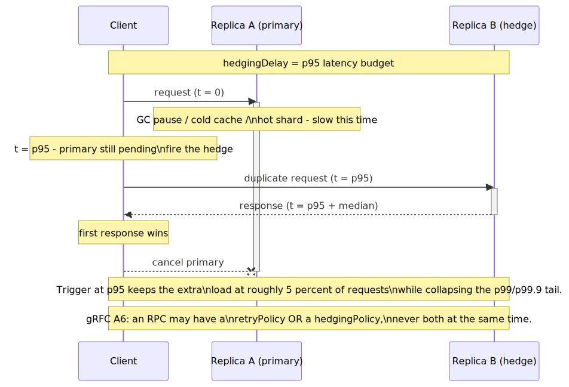
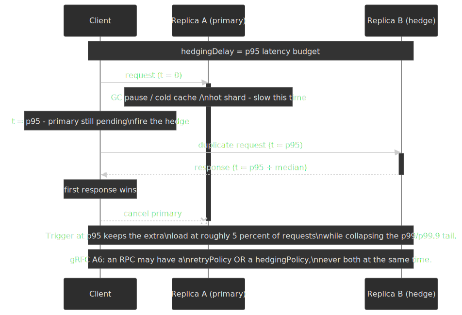

| Aspect       | Exponential backoff           | Request hedging                              |
| ------------ | ----------------------------- | -------------------------------------------- |
| Goal         | Handle failures               | Reduce tail latency (p99, p99.9)             |
| Execution    | Serial — fail, wait, retry    | Parallel — request, wait, send a duplicate   |
| Trigger      | Error response                | Time-based (e.g. p95 latency exceeded)       |
| Load impact  | Reduces load during outage    | Increases load (~5% extra at a p95 trigger, per [Dean & Barroso](https://www.barroso.org/publications/TheTailAtScale.pdf)) |
| gRPC support | `retryPolicy`                 | `hedgingPolicy` ([gRFC A6](https://github.com/grpc/proposal/blob/master/A6-client-retries.md)) |

[gRPC's hedging configuration](https://grpc.io/docs/guides/request-hedging/) sends parallel copies after `hedgingDelay` and cancels the others as soon as one succeeds:

```json title="hedging.json"
{
  "hedgingPolicy": {
    "maxAttempts": 3,
    "hedgingDelay": "0.5s",
    "nonFatalStatusCodes": ["UNAVAILABLE", "UNKNOWN"]
  }
}
```

> [!IMPORTANT]
> [gRFC A6](https://github.com/grpc/proposal/blob/master/A6-client-retries.md) specifies that an individual RPC may be governed by **either** a retry policy or a hedging policy, not both. Pick the failure mode you are optimising for and configure the matching one.

## Operationalising backoff

### Idempotency is non-negotiable for write retries

For idempotent operations (`GET`, `HEAD`, `PUT`, `DELETE`), retries are safe by construction. For non-idempotent ones (`POST`, charge a card, dispatch an SMS), the API has to be **explicitly designed** to be idempotent — usually by accepting a client-generated key in an `Idempotency-Key` header that the server uses to deduplicate.

The semantics are pinned down in the active IETF draft [`draft-ietf-httpapi-idempotency-key-header`](https://datatracker.ietf.org/doc/draft-ietf-httpapi-idempotency-key-header/) (currently at `-07`, October 2025). Briefly:

- The client generates a unique key per logical operation and includes it in the `Idempotency-Key` request header.
- A first-time key triggers normal processing; the server caches the result against the key.
- A retry with the same key and same payload returns the cached result.
- A retry while the original is still in flight should return `409 Conflict`.
- Reuse of the key with a different payload should return `422 Unprocessable Content`.

Stripe, Square, AWS, and others have run variants of this pattern in production for years; the draft codifies what was already de facto practice.

### Tuning parameters from production data

Library defaults are starting points, not answers. Tune from your own metrics:

- **Per-attempt timeout**: a common heuristic from the [AWS Builders' Library](https://aws.amazon.com/builders-library/timeouts-retries-and-backoff-with-jitter/) is to set it slightly above the downstream's healthy `p99` or `p99.5` latency. Lower is too aggressive (you cancel real work); higher leaks slow tail latency back to the caller.
- **`maxRetries`**: derive from the operation's user-facing latency budget and from the service SLO/error-budget. A user-facing path with a 2 s budget and a 200 ms `p50` cannot afford five retries with a 30 s cap.
- **`base`**: at least one healthy round-trip (typically `≥ 100 ms`); too low and the first retry hits before the server can drain.
- **`cap`**: a few times the typical incident duration; for most internal services 30 s is plenty.

### Observability: what to log and dashboard

For every retry, log:

- The operation being retried.
- The attempt number (e.g. `retry 2 of 5`).
- The calculated delay before jitter, the final jittered delay, and the actual sleep.
- The error type and any retry-relevant headers (`Retry-After`, `x-amzn-RequestId`, gRPC status code).

For the system as a whole, dashboard:

- **Retry rate** per second per endpoint and per call site.
- **Success rate after retries** vs first-attempt success rate.
- **Final failure rate** after the budget is exhausted.
- **Circuit breaker state** (Closed / Open / Half-Open) and transition counts.
- **Retry delay histogram** to confirm jitter is actually spreading load.

When retry rate spikes without a matching error rate, your retry budget or breaker thresholds are wrong; when retries climb but never converge, the upstream is broken in a way that retries cannot fix.

## Real-world failures

Three postmortems cover the failure modes the layered defence is designed to prevent.

### Discord: thundering herd from a flapping service

Discord's [`dj3l6lw926kl` incident](http://status.discordapp.com/incidents/dj3l6lw926kl) (catalogued in [Dan Luu's postmortems list](https://github.com/danluu/post-mortems#thundering-herd--cascading-failure)) is a textbook thundering herd. A central service was flapping — coming up, accepting connections, and falling over — and every flap triggered a synchronised storm of reconnection attempts from millions of clients. The recovery storm exhausted memory in the frontend services, which then crashed and re-triggered the storm.

**Lesson**: connection establishment is a retry too, and it needs jittered backoff just as much as RPCs do. Without it, a recovering service guarantees its own re-failure.

### Google SRE: retry amplification across layers

The Google SRE book's [Cascading Failures chapter](https://sre.google/sre-book/addressing-cascading-failures/) describes a deeply-nested architecture where a database started failing under load. Each of three layers above it implemented its own retry policy with up to four attempts, multiplying load by `4³ = 64×` at exactly the moment the database was least able to handle it.

**Lesson**: retry at one well-chosen layer (usually the layer immediately above the one rejecting requests). The same chapter recommends retry budgets and the "overloaded; don't retry" backend signal as the second line of defence.

### Twilio: non-idempotency turns a config bug into a billing incident

The [Twilio billing incident postmortem from July 2013](https://www.twilio.com/en-us/blog/company/communications/billing-incident-post-mortem-breakdown-analysis-and-root-cause-html) shows what happens when retry logic meets a non-idempotent operation. The proximate cause was unrelated to retries: when engineers restarted a Redis master after a network partition, it loaded the wrong config file and came up as a slave-of-itself in read-only mode. All balance writes silently failed.

The amplifying cause was that the auto-recharge code was **not idempotent**: every usage event (an SMS, a call) checked the account balance, saw zero, and re-attempted to charge the customer's credit card. Because the balance write was failing, every subsequent event re-triggered the charge. Roughly 1.4% of customers were billed multiple times for the same operation.

**Lesson**: idempotency is a property of the operation, not of the retry helper. A retry library cannot make a charge-card-then-update-balance flow safe. Either the operation has to be redesigned around an idempotency key, or it must not be subject to automated retry at all.

## Practical takeaways

A retry strategy is a system property, not a function call. The defaults that hold up under load:

1. **Default to capped exponential backoff with full jitter** (`delay = min(cap, base × 2^attempt)`, `sleep = Uniform(0, delay)`). Use `base ≈ 100 ms`, `factor = 2`, `cap = 30 s`, `maxAttempts = 3-5` and tune from there.
2. **Wrap retries inside a circuit breaker.** Backoff handles transient errors; the breaker handles sustained failure. They compose; they don't substitute for each other.
3. **Cap retry amplification** with a per-client retry budget (~10% retry-to-request ratio) and retry at one layer only.
4. **Honour `Retry-After`** when present, and add jitter on top of it.
5. **Make writes idempotent before you retry them.** [`Idempotency-Key`](https://datatracker.ietf.org/doc/draft-ietf-httpapi-idempotency-key-header/) is the standard pattern; build it in early.
6. **Instrument the retry path** so you can see whether retries are recovering from real transient errors or amplifying a permanent one.

The discipline is not "retry harder when things fail." It is "retry only when retrying is likely to help, only as much as your budget allows, only at the right layer, and only for operations that are safe to repeat."

## Appendix

### Prerequisites

- HTTP status code semantics (4xx vs 5xx, `429`, `503`).
- `async/await` and `AbortSignal` in JavaScript/TypeScript.
- Distributed-systems vocabulary: latency, availability, percentile, idempotency.

### Terminology

| Term                    | Definition                                                                       |
| ----------------------- | -------------------------------------------------------------------------------- |
| **BEB**                 | Binary Exponential Backoff — the truncated retry algorithm in IEEE 802.3 Ethernet. |
| **`p99` / `p99.5`**     | 99th / 99.5th percentile latency — the latency below which 99% / 99.5% of requests complete. |
| **SLO**                 | Service Level Objective — a target reliability or performance metric.             |
| **Idempotency**         | Property where repeating an operation produces the same result as a single execution. |
| **Thundering herd**     | Coordinated retry storm when many clients fail and retry in lock-step.            |
| **Retry amplification** | Multiplicative load increase across multi-layer systems where every layer retries. |
| **Hedging**             | Sending parallel duplicate requests to reduce tail latency, cancelling on first response. |

### References

**Standards and specifications**

- [RFC 9110 - HTTP Semantics, §10.2.3 Retry-After](https://www.rfc-editor.org/rfc/rfc9110.html#section-10.2.3)
- [`draft-ietf-httpapi-idempotency-key-header-07`](https://datatracker.ietf.org/doc/draft-ietf-httpapi-idempotency-key-header/) — Idempotency-Key HTTP header (active IETF WG draft, October 2025)
- [IEEE 802.3 — CSMA/CD with truncated BEB](https://standards.ieee.org/ieee/802.3/7071/)
- [gRFC A6 — gRPC Client Retries (and Hedging)](https://github.com/grpc/proposal/blob/master/A6-client-retries.md)

**First-party documentation**

- [AWS Architecture Blog — Exponential Backoff and Jitter (2015)](https://aws.amazon.com/blogs/architecture/exponential-backoff-and-jitter/) — canonical jitter analysis
- [AWS Builders' Library — Timeouts, Retries, and Backoff with Jitter](https://aws.amazon.com/builders-library/timeouts-retries-and-backoff-with-jitter/)
- [AWS SDK retry behavior — standard vs adaptive modes](https://docs.aws.amazon.com/sdkref/latest/guide/feature-retry-behavior.html)
- [Google SRE Book — Handling Overload](https://sre.google/sre-book/handling-overload/) — retry budgets and "overloaded; don't retry"
- [Google SRE Book — Addressing Cascading Failures](https://sre.google/sre-book/addressing-cascading-failures/) — retry amplification math
- [Google Cloud Storage — Retry Strategy](https://cloud.google.com/storage/docs/retry-strategy)
- [gRPC — Retry guide](https://grpc.io/docs/guides/retry/) and [Request Hedging](https://grpc.io/docs/guides/request-hedging/)
- [Istio — Circuit Breaking](https://istio.io/latest/docs/tasks/traffic-management/circuit-breaking/) and [DestinationRule reference](https://istio.io/latest/docs/reference/config/networking/destination-rule/#OutlierDetection)
- [Azure — Retry Pattern](https://learn.microsoft.com/en-us/azure/architecture/patterns/retry) and [Circuit Breaker Pattern](https://learn.microsoft.com/en-us/azure/architecture/patterns/circuit-breaker)

**Postmortems**

- [Twilio — Billing Incident Post-Mortem (2013)](https://www.twilio.com/en-us/blog/company/communications/billing-incident-post-mortem-breakdown-analysis-and-root-cause-html)
- [Discord — `dj3l6lw926kl` thundering-herd incident](http://status.discordapp.com/incidents/dj3l6lw926kl) (via [danluu/post-mortems](https://github.com/danluu/post-mortems#thundering-herd--cascading-failure))

**Practitioner write-ups and reference implementations**

- [Marc Brooker — Jitter: Making Things Better With Randomness](https://brooker.co.za/blog/2015/03/21/backoff.html)
- [Marc Brooker — What is Backoff For?](https://brooker.co.za/blog/2022/08/11/backoff.html)
- [aws-samples/aws-arch-backoff-simulator](https://github.com/aws-samples/aws-arch-backoff-simulator) — simulator for the 2015 jitter analysis
- [Code samples and tests for the retry helper above](https://github.com/sujeet-pro/code-samples/tree/main/patterns/exponential-backoff)
