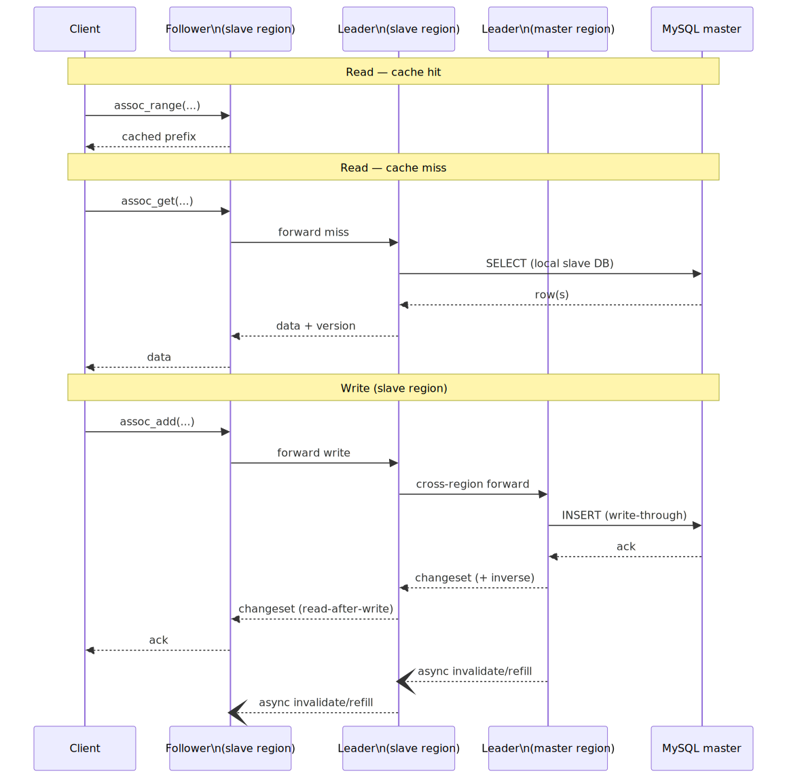
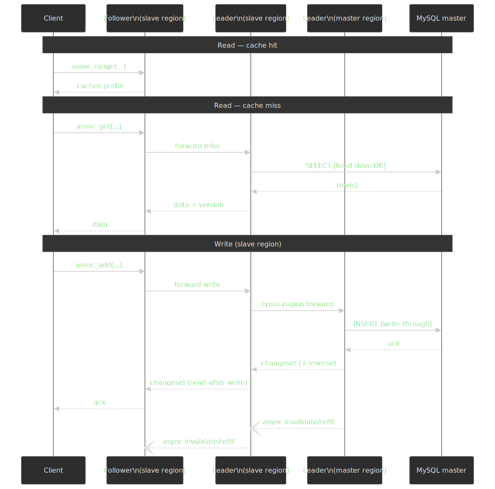
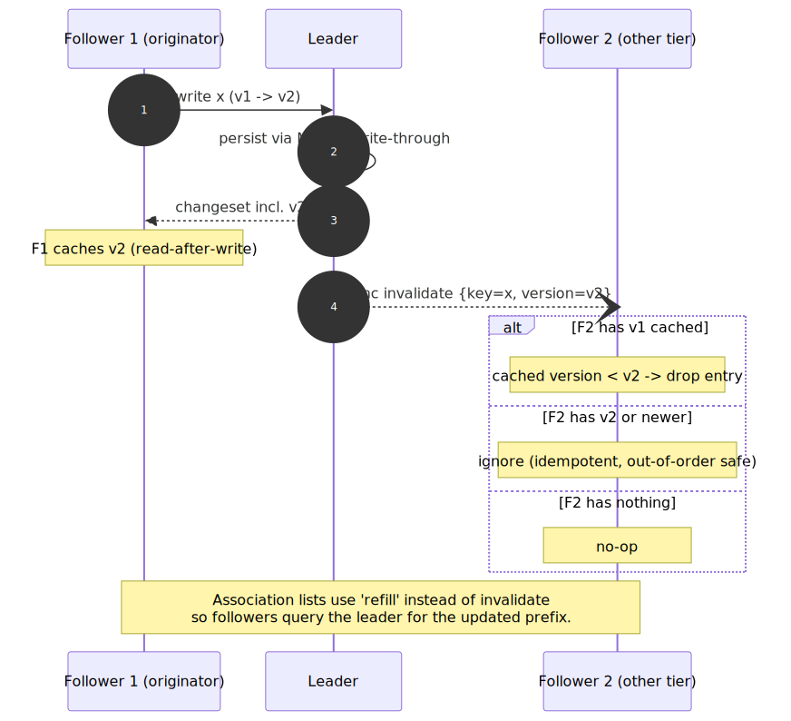
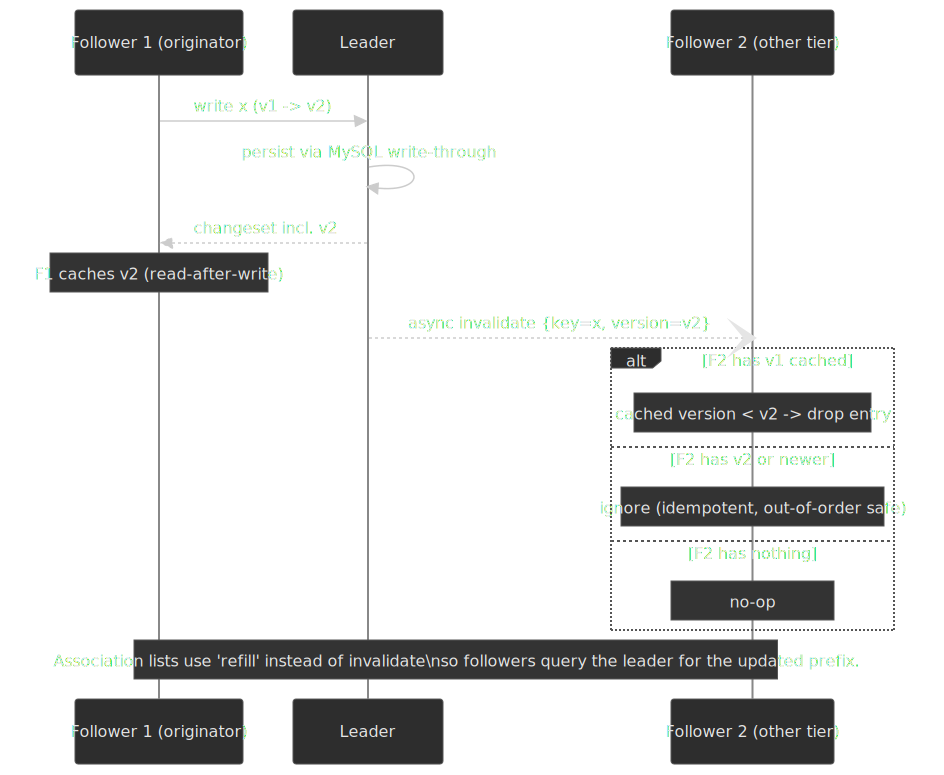

# Facebook TAO: The Social Graph's Distributed Cache

Facebook's social graph is read-mostly, deeply interconnected, and queried hundreds of times per page render. Before TAO, every product team coordinated MySQL and a lookaside `memcache` from PHP, which left graph semantics, invalidation, and consistency to client code. TAO ("The Associations and Objects") is the graph-aware cache that replaced that lookaside model: a fixed objects-and-edges API, a two-tier (leader + follower) cache, write-through to sharded MySQL, and asynchronous invalidations propagated through the database replication stream. The 2013 paper reported a billion reads per second at a 96.4% follower hit rate;[^bronson2013] by 2021 the same system served "over ten billion reads and tens of millions of writes per second" against "many petabytes" of graph data.[^ramptao]

This article reads the original USENIX paper closely, layers in what Meta has published since (RAMP-TAO in 2021, Polaris and consistency tracing in 2022, TAOBench in 2022), and pulls out the design decisions worth borrowing for any read-mostly, latency-sensitive cache.




## Thesis

> A cache that understands the data's shape can do things a generic key-value cache cannot: incrementally update edge lists, serialize writes per object, and maintain read-after-write within a tier without the client coordinating anything.

TAO is not a replacement for MySQL. MySQL stays the source of truth. TAO is a graph-aware façade in front of it that absorbs the read load, smooths writes, and lets a small core team ship correctness fixes (versioning, refills, critical reads, RAMP-TAO atomic visibility) without touching every product. The interesting design choices are all in service of three constraints: read latency below 2 ms in the common case, geographic distribution without forcing every read to cross a region boundary, and a feature set narrow enough to keep one operations team in front of it.

## Mental model

Three concepts carry the rest of the article:

1. **Objects and associations.** Every node is a typed `Object` with a 64-bit `id`; every edge is a typed `Association` from `id1` to `id2` with a 32-bit `time`. Optional inverse types keep paired edges (e.g. `AUTHORED` / `AUTHORED_BY`) in lockstep.[^bronson2013]
2. **Two-tier cache, single coordinator per shard.** Each shard maps to exactly one **leader** in each region. Many **follower** tiers in front of the leaders absorb reads. Clients only ever talk to followers.[^bronson2013]
3. **Per-shard master region.** Each shard has one master MySQL primary in some region and slaves in the others. Writes for a shard are forwarded to the master region's leader; invalidations and refills propagate back through the MySQL replication stream.[^bronson2013]

Most of the rest of TAO's complexity — refills versus invalidates, version numbers, shard cloning, critical reads, RAMP-TAO — is consequence, not foundation.

## Why a graph-aware cache, not a smarter memcache

The 2013 paper is unusually direct about what the lookaside memcache architecture got wrong for graph data.[^bronson2013] Three things, in order:

- **Edge lists are not key-value blobs.** Adding one friend to a million-edge friend list either rewrites the entire serialized list or invents a list-append protocol on the cache server — at which point it is no longer a simple key-value cache. Concurrent appends without coordination silently lose updates.
- **Distributed control logic.** With lookaside, every PHP frontend talks directly to memcache and MySQL and runs the invalidation logic itself. A bug in any client reduces consistency for everyone, and there is no single coordinator to coalesce concurrent misses (the original "thundering herd" problem that the Memcache@Facebook paper addressed with leases[^memcache]).
- **Read-after-write across regions is expensive.** Memcache@Facebook used "remote markers" — keys that mark a write as in-flight to the master region so a subsequent read can detect staleness and bypass the cache. The TAO authors observed that a graph-shaped cache can update the local replica's cache at write time and let graph semantics resolve cache-maintenance races without any inter-regional round trip.[^bronson2013]

TAO does not "fix memcache." It accepts a narrower data model — a fixed objects-and-edges API instead of arbitrary key-value — and trades that flexibility for the ability to put the control logic inside the cache.

## Data model and API

### Objects and associations

> [!NOTE]
> The original paper presents this in §3. The summary here is condensed; the API surface in production is small enough to fit on a slide.

```text title="TAO core types"
Object:      (id) -> (otype, (key -> value)*)
Association: (id1, atype, id2) -> (time, (key -> value)*)
```

- `id` is a globally unique 64-bit integer with an **embedded shard id**; the same id is used regardless of `otype`. Both ends of an association live on the shard of `id1`, so any single-edge query goes to one server.[^bronson2013]
- An association is uniquely identified by `(id1, atype, id2)`. At most one edge of a given type exists between two objects.
- `time` is an application-assigned integer; in practice it is a 32-bit timestamp, and association lists are kept sorted descending by `time` so that "most recent first" queries hit the cached prefix.




### Inverse edges, atomically-ish

For bidirectional relationships (`FRIEND`/`FRIEND`, `AUTHORED`/`AUTHORED_BY`), TAO maintains the inverse automatically when the type is configured with one. Because the inverse lives on `id2`'s shard, an inverse write is a second-shard RPC and **is not atomic with the forward write**: if a failure interleaves, you get a "hanging association" that an asynchronous repair job cleans up.[^bronson2013] The trade-off is deliberate — single-shard atomicity is enough for the common case, and a 2-phase commit across shards is the kind of cost TAO refuses to pay on the hot path.

### The query surface

Four read queries and three mutations cover essentially every graph-traversal need:

| Query                                              | Returns                              | When to reach for it                    |
| -------------------------------------------------- | ------------------------------------ | --------------------------------------- |
| `assoc_get(id1, atype, id2set)`                    | edges to a specific set of `id2`s    | "is X friends with Y?" / privacy checks |
| `assoc_count(id1, atype)`                          | size of the association list         | "how many comments?"                    |
| `assoc_range(id1, atype, pos, limit)`              | edges by index, newest first         | paginated feeds                         |
| `assoc_time_range(id1, atype, hi, lo)`             | edges within a time window           | "events in the last 24 hours"           |
| `assoc_add` / `assoc_delete` / `assoc_change_type` | write mutations (auto-paired inverse) | edge create / delete / re-type          |

TAO enforces a per-`atype` upper bound on the returned `limit`, "typically 6,000," because cached prefixes are a finite resource and the API exists to serve interactive page renders, not bulk graph mining.[^bronson2013] If a client wants more, it pages with `pos` or `high`. The 2013 production trace showed that 95% of `assoc_range`/`assoc_time_range` queries with `limit ≥ 1` used a `limit` of at least 1,000, but **fewer than 1% actually hit that limit** — in practice, the cap rarely fires.[^bronson2013]

The deliberately-omitted operation is interesting: there is **no compare-and-set**. The 2013 paper notes that CAS would conflict with TAO's eventual-consistency story and is not worth its complexity at the API surface.[^bronson2013]

## Architecture

### Storage layer: MySQL, sharded

Objects and associations are persisted in MySQL — the same MySQL that backed the pre-TAO PHP API.[^bronson2013] Each shard is a logical database with one table for objects and one for associations; an extra `(id1, atype, time)` index supports range queries; counts live in their own table so `SELECT COUNT(*)` never gets called on the hot path.

The paper is candid about why MySQL was kept rather than swapped for an "alternate store": besides the API, you need backups, bulk import/delete, schema migration, replica creation, asynchronous replication, consistency monitoring tooling, atomic transactions, efficient granular writes, and predictable tail latency. Inventing all of that to replace MySQL at Facebook scale was not worth the win.[^bronson2013]

> [!TIP]
> The lesson generalises: the "boring" parts of a storage system — backup, restore, migration tooling — are usually 80% of the work and the first thing a custom replacement loses.

### Caching layer: leaders and followers

A single cache tier could in theory absorb any read rate, but very large all-to-all-connected tiers exhibit hot spots and quadratic growth in connections. So TAO splits the cache into a **leader tier** and **multiple follower tiers** per region.[^bronson2013]

- **Followers** answer all client traffic. On a miss or a write, a follower forwards to its region's leader. Clients are configured with a primary follower tier and a backup tier; if the primary is down they retry against the backup.
- **Leaders** are the only cache layer that talks to MySQL. Every shard maps to exactly one leader in each region, so the leader is naturally serialised: it can coalesce concurrent misses (no thundering herd to MySQL) and serialise concurrent writes for the same `id1`.

The two-tier split is the thing that makes single-coordinator semantics tractable: there is one leader per shard per region, so all the consistency machinery only has to keep a *handful* of caches in sync, not the entire follower fleet.

### Multi-region: per-shard master

The naïve "single global leader tier" assumption breaks the moment data centres are thousands of miles apart. TAO's solution is a master/slave configuration **per shard**, not per region.[^bronson2013] In aggregate Facebook clusters their datacentres into a few regions where intra-region latency is under 1 ms; each region holds one full copy of the graph.

```text
For a given shard S:
  region M holds the MySQL master and the "master leader"
  regions R1, R2, … hold MySQL slaves and "slave leaders"

Reads: served by the local follower; misses go to the local leader;
       leader queries the local DB (master or slave) regardless.
Writes: forwarded by the local leader to the master leader;
        applied to MySQL master synchronously;
        invalidations + refills ride the replication stream
        back to slave regions.
```

The choice of master is per-shard, automatically reassigned when a master DB fails, and can produce a single physical leader that is master for some shards and slave for others.[^bronson2013] When inverse edges live on a shard mastered in a different region, the inverse write takes an extra inter-region hop — TAO does not pretend otherwise.




With the production workload running ~500 reads per write,[^bronson2013] master/slave (rather than active-active) replication is cheap to defend: the cost is the cross-region write hop on the slow path, and the prize is that every read stays local. In modern TAO, the same per-shard write-forwarding model holds, but the invalidation pipeline runs over Wormhole, Meta's pub-sub system, instead of a custom binlog tailer.[^ramptao]

## Consistency model

TAO is eventually consistent, with three useful refinements that matter for application code.

### Eventual consistency, with measured tails

Asynchronous invalidations and refills mean that "after some time, all caches will agree." The 2013 production trace put concrete numbers on that "some time":[^bronson2013]

| Replication lag bound | Fraction of writes |
| --------------------- | ------------------ |
| < 1 second            | 85%                |
| < 3 seconds           | 99%                |
| < 10 seconds          | 99.8%              |

For social-graph reads (timeline, profile, friend list), sub-second staleness is invisible; for something that needs absolute freshness, applications opt into a stronger path (see "Critical reads" below).

### Read-after-write within a tier

When a follower forwards a write, the master leader returns a **changeset**: the new value plus its version number. The originating follower (and the slave leader, when relevant) applies the changeset synchronously before responding to the client.[^bronson2013]

Two consequences:

- A user who issued the write sees their own update on the next read **as long as they keep talking to the same follower tier**.
- Other follower tiers learn about the write later, via the asynchronous invalidation/refill stream; until then, their cached value is the old version.

If the user fails over to a backup follower tier between the write and the next read, read-after-write can break. The 2013 paper calls this out explicitly.[^bronson2013]




### Invalidate vs. refill

TAO uses two different cache-maintenance messages, and the choice is not arbitrary.[^bronson2013]

- **Objects** receive **invalidation messages**. The follower drops its cached entry; the next read repopulates it. This is cheap because objects are bounded in size.
- **Association lists** receive **refill messages**. Followers cache only the *contiguous prefix* of the list (newest items first); a naïve invalidate would discard the entire prefix and force a re-fetch of potentially thousands of edges. Instead the follower keeps the prefix and queries the leader for the changed slice, preserving cache locality.

Both message types carry a version number so they are idempotent and order-independent: a follower that already has version `v2` cached safely ignores a delayed invalidation for version `v1`.[^bronson2013]

### Critical reads

For the small set of operations where stale data is unsafe — the paper's example is using a stale credential during authentication — TAO exposes a `critical=true` flag on reads. A critical read is proxied all the way to the master region's leader, which reads from the MySQL master synchronously.[^bronson2013] The cost is at least one inter-region round trip; the 2013 trace measured ~58 ms between the two specific data centres it studied.[^bronson2013] Use sparingly.




### A real race that almost cannot happen

The version-number scheme leaves one rare race in slave regions: if a cached entry is evicted *after* a changeset is applied but *before* the slave MySQL has caught up, a subsequent miss can refill from the stale slave row, and a single follower's view of one key can appear to go backward in time. The 2013 paper describes this as "rare in practice."[^bronson2013] In 2022 Meta described how they hunted similar invalidation bugs systematically with Polaris and a stateful tracing library; see the "Operational consistency" section below.[^cacheconsistent]

## Implementation details worth borrowing

### Memory: arenas, slabs, and small-item optimisations

TAO inherits much of its memory machinery from Facebook's customised `memcached`:[^bronson2013][^memcache] a slab allocator with equal-size slabs, a thread-safe hash table, and LRU eviction within a slab. Two project-specific additions matter:

- **Arenas by type.** The available RAM is partitioned into arenas, one per object/association type. This isolates cache-unfriendly types (large lists, low-locality counts) from well-behaved types so the former cannot evict the latter. Arenas are configured manually today but could in principle be auto-sized to maximise overall hit rate.
- **Direct-mapped 8-way associative caches for tiny items.** For things like association counts, the per-entry hash-table overhead dwarfs the data itself. Storing them in fixed-size, pointer-free buckets — much like a CPU cache — packs about 20% more items into the same RAM. A separate 16-bit dictionary for active `atype`s lets `(id1, atype) → 32-bit count` fit in 14 bytes, and an explicit "no edges" marker takes only 10 bytes.[^bronson2013]

The pattern is general: when the data unit shrinks below a few dozen bytes, hash-table bookkeeping starts to dominate; specialised structures pay back fast.

### Hot shards and high-degree objects

Consistent hashing places shards on followers. Two pathologies are handled in production:

- **Shard cloning.** When a follower for a popular shard saturates, the shard is cloned across multiple followers in the tier; consistency-management messages are broadcast to all hosting followers.[^bronson2013]
- **Per-client hot-item cache.** When a follower notices an item with very high access rate, it tells the client to cache it locally with the version. Subsequent client requests include the version; the follower can omit the body if nothing has changed. The same access-rate signal also throttles client requests for very hot items.[^bronson2013]

For **high-degree objects** (more than ~6,000 edges of a single `atype`), the follower caches only the contiguous prefix. A query for an `id2` that does not match the prefix has to go all the way to MySQL, even when the answer is "no such edge." The mitigation is application-side: rewrite the query to use `assoc_count` to pick the cheaper direction, or exploit creation-time invariants (an edge cannot pre-date its endpoints) to bound the search to the cached prefix.[^bronson2013]

### Client communication

Page renders fan out to many TAO requests in parallel; an out-of-order response protocol multiplexes them on a single connection so a slow database hit does not head-of-line-block a fast cache hit.[^bronson2013] TAO and memcache share most of the underlying Nishtala et al. client stack.[^memcache]

## Production reality

### Scale

The numbers depend on the year. Use the right one when discussing TAO:

| Metric                       | 2013 (paper)[^bronson2013] | 2021 (RAMP-TAO)[^ramptao] | 2022 (TAOBench)[^taobench] |
| ---------------------------- | -------------------------- | ------------------------- | -------------------------- |
| Reads per second (aggregate) | ~1 billion                 | "over 10 billion"         | "over 10 billion"          |
| Writes per second            | "millions"                 | "tens of millions"        | "tens of millions"         |
| Follower cache hit rate      | 96.4%                      | not restated              | not restated               |
| Data set                     | "many petabytes"           | "many petabytes"          | "many petabytes"           |
| Daily query volume           | not stated                 | not stated                | "more than one quadrillion"[^cacheconsistent] |

> [!IMPORTANT]
> The "1 billion reads / 96.4% hit rate" figure is the most-cited TAO number, but it is from 2013. Anyone claiming a current TAO statistic should cite the 2021 or 2022 sources, which put the system an order of magnitude higher.

### Latency

The 2013 paper measured client-observed latencies (including network and PHP client overhead) for the major read operations:[^bronson2013]

| Operation         | Hit P50 | Hit avg | Hit P99 | Miss P50 | Miss avg | Miss P99 |
| ----------------- | ------: | ------: | ------: | -------: | -------: | -------: |
| `assoc_count`     |  1.1 ms |  2.5 ms | 28.9 ms |   5.0 ms |  26.2 ms |  186.8 ms |
| `assoc_get`       |  1.0 ms |  2.4 ms | 25.9 ms |   5.8 ms |  14.5 ms |  143.1 ms |
| `assoc_range`     |  1.1 ms |  2.3 ms | 24.8 ms |   5.4 ms |  11.2 ms |   93.6 ms |
| `assoc_time_range`|  1.3 ms |  3.2 ms | 32.8 ms |   5.8 ms |  11.9 ms |   47.2 ms |
| `obj_get`         |  1.0 ms |  2.4 ms | 27.0 ms |   8.2 ms |  75.3 ms |  186.4 ms |

Writes are synchronous to the MySQL master. The same paper measured an average write latency of **12.1 ms** in the master region and **74.4 ms** from a region 58.1 ms away — i.e., roughly the same-region time plus the inter-region round-trip.[^bronson2013] Treat these as design references, not modern numbers; the publicly reported scale has grown ~10× since.

### Workload shape

A 2013 trace of 6.5 million requests over 40 days established the workload that TAO is tuned for:[^bronson2013]

- 99.8% reads, 0.2% writes (~500:1).
- Most edge queries return empty results: `assoc_get` finds an edge only 19.6% of the time; only 31.0% of `assoc_range` calls return anything; `assoc_time_range` returns edges in just 1.9% of calls.
- 45% of `assoc_count` calls return zero; 1% of non-zero counts are ≥ 500,000.
- 64% of non-empty range/time-range results contain a single edge.

Later TAOBench analysis added a more pointed observation: "over 99 percent of data items that are frequently written to are, on average, read less than once per day."[^taobench] In other words, the read-hot set and the write-hot set are largely disjoint — exactly the workload shape that makes write-through caching cheap, because most writes never need to populate a cache.

### Availability and failover

Over a 90-day window the 2013 paper measured:[^bronson2013]

- TAO query failure rate: **4.9 × 10⁻⁶** (~5 failures per million requests, as observed by web servers).
- Direct follower-to-DB failover used on **0.15% of follower cache misses** (when the leader was unavailable).
- Write failover to a random leader on **0.045% of writes**.
- Master DB promotions on **0.25% of shard-time** due to maintenance or unplanned downtime.

The failure-handling primitives are simple by design: per-destination timeouts, mark-down on consecutive failures, active probes for recovery, and a configured backup follower tier that requests fail over to without changing semantics.[^bronson2013] During a slave-DB outage, cache misses route to the master-region leaders, and an extra binlog tailer on the master delivers invalidations and refills inter-regionally until the slave returns.

## Operational consistency: Polaris and consistency tracing (2022)

The hardest part of running an eventually consistent cache is not the protocol — it is finding the rare bug that violates it. Meta's 2022 write-up describes two pieces of infrastructure that turned that into a tractable engineering problem.[^cacheconsistent]

- **Polaris** is a separate service that pretends to be a cache server on the invalidation bus. When it sees an invalidation `(key, version=v)`, it queries every cache replica and flags any that still hold a strictly older version. Polaris reports inconsistency at multiple time scales (1 / 5 / 10 minutes); inconsistencies that resolve quickly are categorised as transient (replication lag), and ones that persist are flagged as "permanent" cache bugs. By Polaris's 5-minute measure, Meta improved TAO from **99.9999% to 99.99999999% (six nines to ten nines)** consistent — fewer than 1 in 10 billion cache writes inconsistent after 5 minutes.[^cacheconsistent]
- **Consistency tracing** is a stateful library embedded in cache servers and the invalidation pipeline. Logging *every* state change is impossible at quadrillion-queries-per-day scale; instead the library logs only mutations inside a small "interesting" window after each write, where invalidations and refills can race. With Polaris triggering an alarm and consistency tracing providing the timeline, Meta describes diagnosing a race-condition bug in the cache error-handling path — one that left a key stale indefinitely — in **less than 30 minutes**, where the same class of bug used to take weeks.[^cacheconsistent]

Both ideas generalise. If a system claims eventual consistency, "by what time scale, and at what percentile?" is the right operating question, and you cannot answer it without something like Polaris.

## Evolution beyond the 2013 paper

### 2021 — RAMP-TAO: read transactions

By the late 2010s product code at Facebook had drifted toward an `Ent` query framework on top of TAO and had begun to need transactional guarantees. RAMP-TAO[^ramptao] adds **atomic visibility (Read Atomic isolation)** for reads: a read transaction either sees all of a write transaction's effects or none of them. It does *not* introduce general ACID transactions or serialisability; the paper is explicit about that scoping. Three notable engineering choices:

- A measurement study found "fractured reads" (reading part of a write-transaction's updates) at a rate of about **1 in 1,500 batched reads** under the existing eventual-consistency model.[^ramptao] Modest in percentage, large in absolute numbers at TAO's scale.
- The protocol layers on top of the existing cache and only pays its overhead for opt-in transactional reads, leaving non-transactional traffic untouched.
- The reported overhead is small: **0.42% memory increase**, with **>99.93% of reads completing in a single round trip**.[^ramptao]

> [!NOTE]
> Read-atomic is *not* full ACID. RAMP-TAO does not provide serialisability, snapshot isolation, or read-your-writes for concurrent transactions. Treat it as the cheapest useful step above eventual consistency.

### 2022 — TAOBench and the workload-shape benchmark

TAOBench[^taobench] is an open-source benchmark Meta released to capture TAO's workload — including transaction sizes, shard-colocation preferences, request distributions, and multitenancy — and to evaluate how alternative systems behave under it. Meta has used the benchmark with Cloud Spanner, CockroachDB, PlanetScale, TiDB, and YugabyteDB, primarily to study trade-offs and identify optimisations rather than to declare a winner.[^taobench] If you are evaluating a graph or general-purpose distributed store for a TAO-shaped workload, this is the benchmark to start from rather than YCSB.

## What's actually transferable

TAO is a 2013-vintage design under a heavy 2022 maintenance regime. Two things make it worth studying even if you will never run something at this scale:

### 1. A narrow API enables strong invariants

Memcache's surface ("any key, any value") is the reason its consistency story is hard. TAO's surface ("typed objects and typed edges, point and range queries, no CAS") is small enough to push the control logic — invalidation, refills, version numbers, leader-side serialisation, refill vs. invalidate semantics — into the cache server itself. If your cache is fighting consistency bugs, the first lever is to *reduce the API surface*, not to add more coordination primitives on top of a generic one.

### 2. Coordinator per shard, not per region

Per-shard master selection, with one leader per shard per region, is the linchpin that makes single-coordinator semantics survive geographic distribution. Anything stronger ("global leader") gives up local-read latency; anything weaker ("any leader") gives up the read-after-write story. The shard-level granularity also lets the system rebalance master assignments around failures without touching the read path.

### When this pattern is *not* a fit

- **Write-heavy workloads.** TAO's write-through-to-MySQL cost is borderline acceptable at a 500:1 read:write ratio. At 5:1 it dominates.
- **Strong cross-shard transactions.** TAO punts on multi-shard atomicity (the "hanging association" repair job is the honest version of "we don't do it"). RAMP-TAO adds *read atomic*, not full ACID. If you need cross-partition serialisability, look at Spanner-class systems.
- **Workloads where the read-hot and write-hot sets coincide.** TAOBench's headline observation — that the frequently-written items are read less than once per day — is the precondition that makes write-through cheap. If your hottest write keys are also your hottest read keys, write-back, write-around, or stream-update designs win.

## Glossary

- **Object.** A typed node in the social graph, identified by a 64-bit `id` with an embedded shard id.
- **Association.** A typed directed edge from `id1` to `id2`, carrying a 32-bit time and key→value data. Stored on the shard of `id1`.
- **Inverse association.** An auto-paired edge in the opposite direction; lives on `id2`'s shard, written non-atomically with the forward edge, repaired by a background job on failure.
- **Leader / follower.** The two cache tiers per region. Followers serve clients; leaders coordinate writes and shield MySQL.
- **Master / slave (per shard).** Each shard's MySQL master lives in one region; other regions hold slaves. Writes for a shard are forwarded to that shard's master region.
- **Critical read.** Opt-in flag that proxies the read to the master region's leader for fresh data, at the cost of an inter-region round trip.
- **Refill vs. invalidate.** Object updates send invalidate messages (drop the entry); association-list updates send refill messages (followers keep the prefix and re-fetch the changed slice).
- **Polaris.** A standalone consistency observer that flags cache replicas inconsistent with a recent invalidation, used to measure and improve TAO's consistency.
- **RAMP-TAO.** A read-atomic transaction protocol layered on TAO that prevents fractured reads with sub-percent overhead.

## References

- The 2013 USENIX ATC paper is the primary source; everything else is secondary or evolutionary.
- Meta's 2022 engineering posts are the best public source for current scale and operational practice.
- The 2021 VLDB RAMP-TAO paper and the 2022 VLDB TAOBench paper are the right entry points for transactional and benchmarking aspects respectively.

[^bronson2013]: Bronson, N. et al. ["TAO: Facebook's Distributed Data Store for the Social Graph,"](https://www.usenix.org/system/files/conference/atc13/atc13-bronson.pdf) USENIX ATC 2013.
[^memcache]: Nishtala, R. et al. ["Scaling Memcache at Facebook,"](https://research.facebook.com/publications/scaling-memcache-at-facebook/) NSDI 2013.
[^ramptao]: Cheng, A. et al. ["RAMP-TAO: Layering Atomic Transactions on Facebook's Online TAO Data Store,"](https://www.vldb.org/pvldb/vol14/p3014-cheng.pdf) PVLDB 14(12), 2021.
[^cacheconsistent]: ["Cache made consistent: Meta's cache invalidation solution,"](https://engineering.fb.com/2022/06/08/core-infra/cache-made-consistent/) Meta Engineering, 8 June 2022.
[^taobench]: ["Open-sourcing TAOBench: An end-to-end social network benchmark,"](https://engineering.fb.com/2022/09/07/core-infra/taobench/) Meta Engineering, 7 September 2022. See also Cheng, A. et al. ["TAOBench: An End-to-End Benchmark for Social Network Workloads,"](https://www.vldb.org/pvldb/vol15/p1965-cheng.pdf) PVLDB 15(9), 2022.
