# Failure Modes and Resilience Patterns

Distributed systems fail in complex, often surprising ways. The hard part is not implementing one resilience pattern; it is choosing which to compose, where to put the boundary, and accepting that every defense has its own failure mode. This article maps the failure taxonomy from the distributed-systems literature onto the production patterns that mitigate each class — with the parameters, postmortems, and footguns that decide whether a pattern actually helps.


## Mental model

Failures form a spectrum from **fail-stop** (clean crash, easy to detect) to **Byzantine** (arbitrary behavior, expensive to detect). The class that does the most damage in production is **gray failure**: partial degradation that passes synthetic health checks but breaks real traffic — a class formalised by Microsoft Research's HotOS '17 paper [_Gray Failure: The Achilles' Heel of Cloud-Scale Systems_](https://www.microsoft.com/en-us/research/publication/gray-failure-achilles-heel-cloud-scale-systems/) [^gray-failure]. Detecting gray failures requires **differential observability** — comparing what different observers see, because no single probe is reliable.

Resilience is layered defense, not a silver bullet. Each layer is fallible:

1. **Timeouts** bound waiting time, but tuning them too tight produces false positives and tuning them too loose lets resource exhaustion through.
2. **Retries** recover from transient faults, but uncoordinated retries amplify load and can knock a stressed dependency over.
3. **Circuit breakers** stop calling a failing dependency, but flap when their thresholds are wrong for the traffic shape.
4. **Bulkheads** isolate failures so one bad neighbour cannot drain shared resources, at the cost of utilisation.
5. **Load shedding** protects capacity by rejecting work, which forces a priority decision the system must own.
6. **Blast-radius isolation** (cells, shuffle sharding, zones) limits how many users a single failure can touch.

The rest of this article expands each layer with mechanism, defaults from systems you already trust, and the operational pitfalls that show up in real postmortems.

## Failure taxonomy

The classic distributed-systems literature organises failures by what the faulty process does, in roughly increasing order of detection cost. The chart below places each class against the two axes that matter operationally: how cheap it is to detect, and how likely it is to spread before you notice.


### Fail-stop

The process crashes and stays crashed. Other processes can detect the failure (eventually) through timeout or missed heartbeats.

- **Detection:** heartbeat timeout, supervisor's restart loop.
- **Real-world example:** an OOM-killed container — Kubernetes' [liveness probe](https://kubernetes.io/docs/tasks/configure-pod-container/configure-liveness-readiness-startup-probes/) fires, the pod restarts, recovery is straightforward.
- **Design implication:** if you can guarantee fail-stop semantics (crash rather than corrupt), recovery is simpler. This is why crash-only software prefers `panic()` on inconsistency over best-effort recovery.

### Crash-recovery

The process crashes but restarts with partial or stale state — a more realistic assumption than fail-stop for any system that touches storage.

- **Detection:** distinguish "slow" from "dead" via heartbeat plus stable storage cookies (epoch, generation).
- **Real-world example:** a database replica crashes mid-replication, restarts, and replays its write-ahead log to reach a consistent state. During replay it may reject reads or serve stale data.
- **Design implication:** recovery procedures must be idempotent. In-flight operations may re-execute when the process comes back.

### Omission

The process fails to send or receive messages but otherwise behaves correctly. Splits into **send omission** (drops outgoing messages) and **receive omission** (silently discards incoming ones). Often caused by full queues, transient network drops, or socket back-pressure.

- **Real-world example:** a message-queue producer drops messages when the broker is slow; the producer keeps running, health checks pass, and data is being lost silently.
- **Design implication:** critical paths require acknowledgement and retry. Fire-and-forget is acceptable only for best-effort telemetry.

### Timing

The response is correct but late. Indistinguishable from omission once the caller's timeout fires.

- **Real-world example:** a database query that normally takes 10 ms takes 5 s under lock contention. The caller times out at 1 s, assumes failure, retries — making the contention worse.
- **Design implication:** timeouts must distinguish "failed" from "slow", and idempotent operations can use hedged requests (see [Retries](#retries)) to mask the tail.

### Byzantine

The process exhibits arbitrary behaviour, including malicious or irrational responses. The original [Byzantine Generals](https://lamport.azurewebsites.net/pubs/byz.pdf) result requires `3f + 1` replicas to tolerate `f` Byzantine nodes [^byzantine].

- **Real-world example:** a corrupted replica that returns syntactically valid but semantically wrong data, or a compromised node in a permissionless network.
- **Design implication:** BFT protocols are expensive. Most internal systems assume the crash-only model and rely on authentication, integrity checks, and signed messages for adversarial scenarios.

### Gray failure

Partial degradation that evades health checks. The defining characteristic is **observer divergence**: different vantage points disagree about whether the component is healthy [^gray-failure].

- **Health checks pass:** the failing component still answers synthetic probes.
- **Partial impact:** only certain request types, customers, or shards are affected.
- **Cascading potential:** slow responses tie up caller resources, propagating the problem.
- **Detection delay:** can take minutes to hours to confirm because no single signal is sufficient.

The Microsoft paper's canonical example is an Azure storage front-end where most requests succeeded but a particular code path stalled — heartbeats stayed green and only deep request-tracing surfaced the issue. The Cloudflare WAF outage on 2 July 2019 has the same shape at a different layer: a [poorly-bounded regex caused catastrophic backtracking](https://blog.cloudflare.com/details-of-the-cloudflare-outage-on-july-2-2019/) that pinned every CPU core handling HTTP traffic, returning 502s to ~82% of requests for 27 minutes [^cloudflare-2019]. Simple HTTP probes that did not exercise the WAF path stayed green throughout.

> [!IMPORTANT]
> Gray failures are why "the dashboards say everything is fine" is the most expensive sentence in operations. If your only signal is a probe you wrote yourself, you have not measured the system — you have measured your probe.

### Cascading failure

A single fault propagates because the dependent components are not isolated from it. Cascade is a consequence of the failure modes above, not a category on its own — but it is what turns a small fault into a global outage.

| Mechanism               | Description                                  | Example                                                   |
| ----------------------- | -------------------------------------------- | --------------------------------------------------------- |
| **Resource exhaustion** | Failing component ties up caller resources   | Slow DB → thread pool exhaustion → upstream timeout       |
| **Retry storms**        | Failed requests trigger coordinated retries  | Service degrades → all clients retry → load amplified     |
| **Load redistribution** | Remaining capacity receives diverted traffic | Node failure → remaining nodes overloaded → more failures |
| **Dependency chain**    | Failure propagates through call graph        | Auth service down → all authenticated endpoints fail      |
| **Shared-fate dependency** | Recovery tools depend on the failed system | Internal control plane unreachable during the outage      |

The shared-fate row is the lesson of the [Meta outage on 4 October 2021](https://engineering.fb.com/2021/10/05/networking-traffic/outage-details/) [^meta-2021]: a routine maintenance command on the backbone disconnected every data centre. Meta's authoritative DNS servers were configured to **withdraw their BGP advertisements** when they lost backbone reachability — a sensible safety property in isolation. The combination removed Meta from the public internet and, because the same backbone carried internal control-plane traffic, locked engineers out of the very tools they needed to recover. Restoration required physical access to data centres.

The two AWS US-EAST-1 outages most often cited as cascade examples — the [S3 disruption on 28 February 2017](https://aws.amazon.com/message/41926/) and the [DynamoDB DNS race on 19–20 October 2025](https://aws.amazon.com/message/101925/) [^aws-s3-2017] [^aws-dynamodb-2025] — both share the recovery-time amplification pattern: the initial fault was bounded, but downstream services that depended on the affected service amplified the impact through retries and re-issued work for hours after the underlying issue was identified. The 2025 event is a particularly clean case study in shared-fate dependency: a latent race between DynamoDB's "DNS Planner" and "DNS Enactor" emptied the regional endpoint's record set, and the very automation needed to repair the records depended on resolving that endpoint.

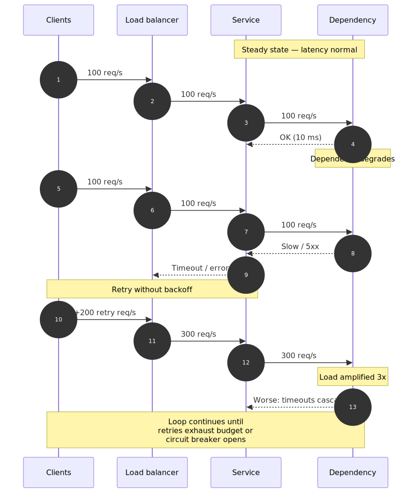
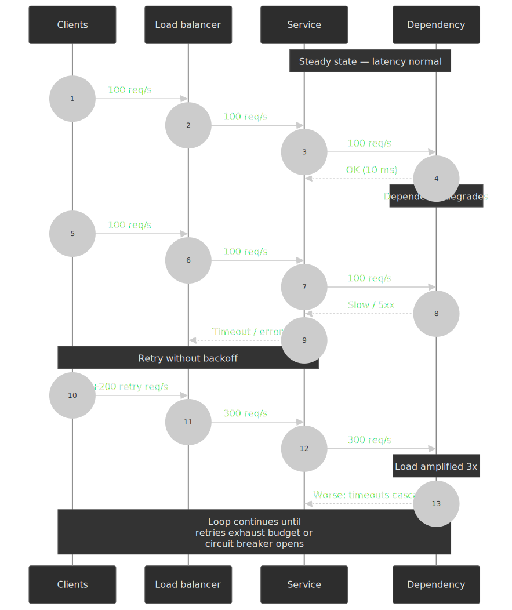

#### Capacity and queueing utilisation

Resource exhaustion is rarely a step function. Underneath every "the server fell over" postmortem is a queue whose utilisation crossed a threshold. For an idealised single-server queue (M/M/1), the expected waiting time scales as

$$
W = \frac{1}{\mu (1 - \rho)}
$$

where $\rho = \lambda / \mu$ is the utilisation. Past about $\rho \approx 0.7$ the curve bends sharply; past $\rho \approx 0.9$ it goes vertical. Real systems are not M/M/1 — service times are heavy-tailed, arrivals are bursty, and concurrency is bounded — but the qualitative shape is universal: latency explodes long before throughput does. This is why Google SRE's [_Addressing Cascading Failures_](https://sre.google/sre-book/addressing-cascading-failures/) chapter argues for **bounded queues, deadline propagation, and load shedding before saturation** rather than after [^sre-cascading]. By the time the queue is full, the work in it is already past most callers' deadlines.

## Detection

You cannot mitigate what you cannot see. Detection has three pillars: liveness signals, health probes, and the differential observability that catches what the first two miss.

### Heartbeat and liveness

Periodic messages prove the sender is alive. The non-trivial part is the parameter set:

| Parameter    | Consideration                                                                                          |
| ------------ | ------------------------------------------------------------------------------------------------------ |
| **Interval** | Shorter = faster detection, more overhead.                                                             |
| **Timeout**  | Always greater than `interval × missed_count + network_jitter`. Setting timeout = interval is the most common bug. |
| **Payload**  | Include load metrics so callers can react proactively rather than after a hard failure.                |

**Real-world tuning (Cassandra):** the [Phi accrual failure detector](https://www.cs.utexas.edu/~lorenzo/corsi/cs395t/04S/notes/hayashibara.pdf) lets operators trade detection speed for false-positive rate. Cassandra's [`phi_convict_threshold`](https://cassandra.apache.org/doc/4.0/cassandra/configuration/cass_yaml_file.html) defaults to `8`; DataStax's documentation recommends raising it to `10` or `12` in noisy environments such as EC2 to suppress transient-network false positives [^cassandra-phi].

### Health checks

Shallow vs. deep is the central design decision:

| Type                   | What it tests                  | Failure modes                                     |
| ---------------------- | ------------------------------ | ------------------------------------------------- |
| **Shallow** (TCP/HTTP) | Process running, port open     | Misses gray failures, resource exhaustion         |
| **Deep** (functional)  | Critical path works end-to-end | Expensive, may timeout, can mask partial failures |
| **Dependency**         | Checks downstream connectivity | Can cause cascade if a slow dependency drags every instance unhealthy |

The orthodox split is to **separate liveness from readiness** [^k8s-probes]:

- **Liveness:** "should this process be restarted?" Fail only when the process is fundamentally stuck (deadlock, OOM, unrecoverable state). A liveness probe that touches the database is an outage waiting to happen.
- **Readiness:** "should traffic be routed here?" Fail when the instance cannot serve requests right now — warm-up incomplete, dependencies unavailable, queue saturated.

> [!CAUTION]
> A health check that calls the database is the canonical anti-pattern. If the database is slow, every instance fails its health check, the load balancer pulls them all, and the surviving instances inherit the load — accelerating the very cascade the probe was meant to detect.

### Differential observability

Detecting gray failure requires multiple, independent observers and cross-checking their answers [^gray-failure]:

1. **Active probing** — synthetic requests from multiple vantage points (region, AZ, third-party).
2. **Passive observation** — real-traffic latency, error rate, success rate per shard / per route.
3. **Internal instrumentation** — queue depth, thread-pool utilisation, GC pauses.
4. **External correlation** — compare metrics across components to find divergence.

A simple gray-failure score is to gate alerting on the **disagreement** between observers, not on any single signal:

```python title="gray-failure-score.py"
def is_gray_failure(probe_pass, error_rate, p99_latency, throughput):
    """Flag gray failure when probes pass but real traffic disagrees."""
    real_traffic_healthy = (
        error_rate < ERROR_RATE_THRESHOLD
        and p99_latency < P99_THRESHOLD
        and throughput > THROUGHPUT_FLOOR
    )
    return probe_pass and not real_traffic_healthy
```

This pattern — assert that probes and real traffic agree, alert when they disagree — is what the Microsoft paper calls "perspective-based" detection.

## Resilience patterns

### Timeouts

Every network call needs a timeout. Without one, a hung dependency can exhaust caller resources indefinitely. The interesting question is how to pick the value.

#### Static timeouts

Fixed value, configured per operation. Works when the latency distribution is well-understood and stable.

```text
timeout = p99_latency × safety_factor + network_jitter

Example:
  p99 latency:    100 ms
  Safety factor:  2.5x
  Network jitter:  10 ms
  Timeout:        100 ms × 2.5 + 10 ms = 260 ms (round to 300 ms)
```

Trade-offs:

- Simple to debug, predictable behaviour.
- Does not adapt to changing conditions; can be too aggressive during GC pauses or too lenient during partial failures.

> [!IMPORTANT]
> Propagate **deadlines**, not just timeouts. If service A calls B with a 5 s budget, B should call C with `min(remaining, own_default)`, not its own independent 10 s. Without deadline propagation, B happily waits past A's timeout and burns capacity on a result no one will read. gRPC's [deadline propagation](https://grpc.io/docs/guides/deadlines/) is the canonical implementation.

#### Adaptive timeouts and hedging

When latency is bursty or workload-dependent, an adaptive scheme can outperform static timeouts:

| Approach             | Mechanism                                            | Reference                                                |
| -------------------- | ---------------------------------------------------- | -------------------------------------------------------- |
| **Percentile-based** | Track recent p99, set timeout = p99 × buffer.        | Common in service-mesh sidecars.                         |
| **Moving average**   | Exponentially-weighted moving average of latencies.  | gRPC's adaptive sub-channel selection.                   |
| **Hedging**          | Issue a second request to a different replica after a delay near the **95th percentile** latency, then race them. | Dean & Barroso, [_The Tail at Scale_](https://cacm.acm.org/research/the-tail-at-scale/) [^tail-at-scale]. |

> [!NOTE]
> Earlier drafts of this section claimed hedged requests fire after the median (p50). That's wrong. Dean and Barroso recommend waiting until ~p95 specifically because firing earlier doubles the load with little tail-latency benefit; firing at p95 catches the bottom 5% of slow tails while adding only a few percent of extra calls.

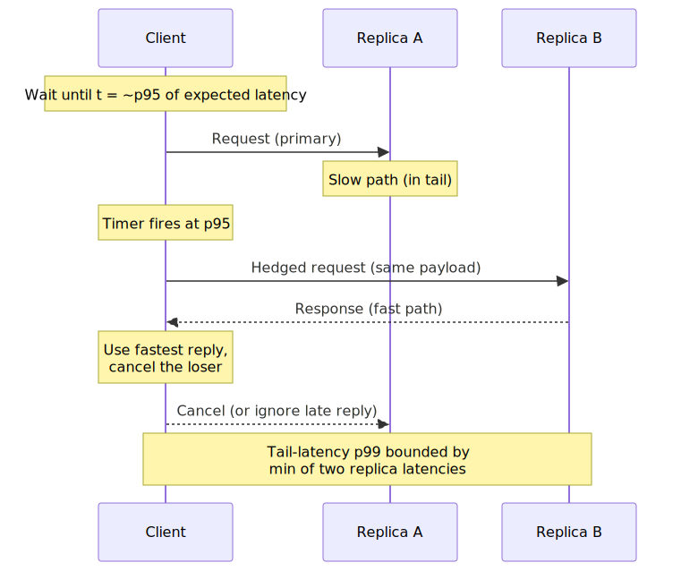
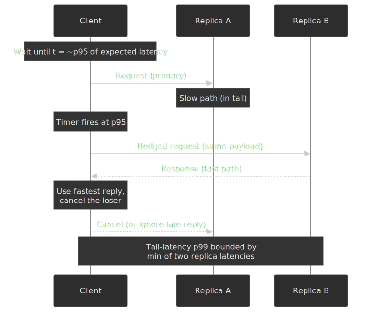

Hedging is only safe for **idempotent** reads (and idempotent writes with idempotency keys). For everything else, fall back to retries with explicit deduplication.

### Retries

Retries recover from transient faults and amplify everything else. Three knobs decide whether they help or hurt: backoff, jitter, and budget.

#### Exponential backoff

Each attempt waits longer than the previous, spreading retries over time:

```text
wait = min(base × 2^attempt, cap)

AWS SDK defaults (illustrative — varies by SDK):
  base = 100 ms, cap = 20 s
  attempt 1: 100 ms
  attempt 2: 200 ms
  attempt 3: 400 ms
  attempt 4: 800 ms
```

Linear backoff still produces coordinated load spikes; exponential gives the dependency room to recover before the next wave.

#### Jitter

Without jitter, clients that fail together retry together. The choice of distribution matters:

| Strategy                | Formula                                            | Use case                               |
| ----------------------- | -------------------------------------------------- | -------------------------------------- |
| **Full jitter**         | `random(0, calculated_delay)`                      | Default choice, maximum spread         |
| **Equal jitter**        | `delay/2 + random(0, delay/2)`                     | When you need a minimum wait floor     |
| **Decorrelated jitter** | `min(cap, random(base, prev_delay × 3))`           | AWS's recommendation in the original analysis |

Marc Brooker's [_Exponential Backoff and Jitter_](https://aws.amazon.com/blogs/architecture/exponential-backoff-and-jitter/) on the AWS Architecture Blog is the standard reference. In Brooker's simulation of 100 contending clients, both **full jitter** and **decorrelated jitter** completed the workload using **less than half** the total work of unjittered exponential backoff [^aws-jitter]. Full jitter is the simplest defensible default; decorrelated jitter is preferable when the backoff cap is large and you want to avoid clients piling up at the cap [^decorrelated-clamp].

#### Retry budgets

Per-request retries multiply load by the retry factor. A 3-retry policy can turn 100 req/s of baseline into 400 req/s during a partial failure. **Retry budgets** cap the system-wide retry rate as a fraction of in-flight requests.

[Envoy's retry budget](https://www.envoyproxy.io/docs/envoy/latest/api-v3/config/cluster/v3/circuit_breaker.proto) is the standard implementation: `budget_percent` defaults to 20% of active requests with a `min_retry_concurrency` of 3 [^envoy-retry-budget]. Once the budget is exhausted, additional retries are rejected immediately, preventing one misbehaving upstream from consuming all retry capacity.

#### Retry classification

Not every error should be retried:

| Response                  | Retry?                   | Rationale                              |
| ------------------------- | ------------------------ | -------------------------------------- |
| **5xx Server Error**      | Yes, with backoff        | Transient; server may recover          |
| **429 Too Many Requests** | Yes, honour `Retry-After`| Server is asking you to slow down      |
| **408 Request Timeout**   | Yes, with backoff        | May be transient                       |
| **4xx Client Error**      | No                       | Request is malformed; retry won't help |
| **Connection refused**    | Yes, limited             | Server may be restarting               |
| **Connection reset**      | Yes                      | Network blip                           |
| **TLS handshake failure** | No                       | Certificate / config issue             |

> [!WARNING]
> Only retry operations that are safe to repeat. POST requests that create resources need an [idempotency key](https://datatracker.ietf.org/doc/draft-ietf-httpapi-idempotency-key-header/) so the server can deduplicate retried writes.

### Circuit breaker

Stop calling a failing dependency, give it time to recover. Originally formalised in Michael Nygard's _[Release It!](https://pragprog.com/titles/mnee2/release-it-second-edition/)_


| State         | Behaviour                                                  |
| ------------- | --------------------------------------------------------- |
| **Closed**    | Normal operation; requests pass through; failures counted |
| **Open**      | Requests fail immediately; no calls to dependency         |
| **Half-Open** | Limited probe requests allowed; success closes the circuit |

#### Failure-counting strategy

| Strategy        | Mechanism                         | Best for                               |
| --------------- | --------------------------------- | -------------------------------------- |
| **Count-based** | Open after N failures             | Simple, predictable                    |
| **Rate-based**  | Open when error rate > X%         | Handles varying traffic                |
| **Consecutive** | Open after N consecutive failures | Avoids flapping on intermittent errors |

**Reference defaults from Hystrix** (a useful baseline even though [Netflix moved Hystrix to maintenance mode in November 2018](https://github.com/Netflix/Hystrix#hystrix-status)) [^hystrix-defaults]:

```text
circuitBreaker.requestVolumeThreshold      = 20    // min requests in window before evaluating
circuitBreaker.errorThresholdPercentage    = 50    // open when error rate exceeds this
circuitBreaker.sleepWindowInMilliseconds   = 5000  // time in Open before allowing a probe
```

#### Tuning

| Parameter            | Consideration                                                         |
| -------------------- | --------------------------------------------------------------------- |
| **Error threshold**  | Too low = flapping; too high = slow detection                         |
| **Volume threshold** | Prevents opening on low-traffic services                              |
| **Reset timeout**    | Too short = probe during ongoing failure; too long = delayed recovery |
| **Half-open probes** | Single probe is fragile; multiple probes add load                     |

> [!WARNING]
> One circuit breaker per dependency, not per request type. If the dependency is down, it's down for every endpoint. Splitting the breaker per route hides the failure across many breakers, none of which trip.

**Adaptive alternative.** Netflix's successor library, [`concurrency-limits`](https://github.com/Netflix/concurrency-limits), replaces hand-tuned thresholds with a TCP-inspired algorithm — the recommended `VegasLimit` is delay-based (modelled on Brakmo & Peterson's [TCP Vegas](https://www.cs.princeton.edu/courses/archive/fall06/cos561/papers/vegas.pdf)) and infers the queue size from the gap between minimum and current observed RTT, while `AIMDLimit` uses additive-increase / multiplicative-decrease for the simpler case [^netflix-concurrency] [^tcp-vegas]. Both eliminate the per-dependency tuning burden of a Hystrix-style breaker.

### Bulkhead

Isolate components so a failure in one cannot drain shared resources. Named for the watertight compartments that keep a flooded ship from sinking.


#### Thread-pool isolation

Separate thread pool per dependency. If a dependency hangs, only its pool's threads are blocked.

- ✅ Strong isolation; failure is contained.
- ✅ Timeouts are enforceable from the pool boundary.
- ❌ Thread overhead; underutilisation when traffic is uneven.
- ❌ Context-switch cost.

#### Semaphore isolation

A counting semaphore caps concurrent requests; the work runs on the caller's thread.

- ✅ No thread overhead; low latency.
- ❌ A slow dependency blocks the caller's thread; the timeout cannot interrupt it without thread interruption support.

When to use which:

| Isolation type  | Use when                                           |
| --------------- | -------------------------------------------------- |
| **Thread pool** | Dependency is unreliable; need timeout enforcement |
| **Semaphore**   | Dependency is reliable; latency is critical        |

#### Connection-pool sizing

The most common bulkhead in practice. Total concurrent connections across all instances must not exceed the dependency's capacity:

```text
Instance count:                  10
Per-instance pool size:          50
Total connections to dependency: 500

Postgres max_connections = 500  → at the limit
Postgres max_connections = 200  → connection exhaustion under fan-out
```

For Postgres specifically, a connection pooler such as [PgBouncer](https://www.pgbouncer.org/) sits between the app pools and the database, multiplexing many client connections onto a small pool of server connections.

### Load shedding

Reject excess load to protect capacity for requests that can be served. Load shedding makes a priority decision the system must own.

#### LIFO queue dropping

When the queue is full, drop the **oldest** requests rather than the newest. The intuition: requests that have waited longest are most likely to have callers that have already timed out, so processing them is wasted work. Used in some Amazon services and described in the [AWS Builders' Library](https://aws.amazon.com/builders-library/using-load-shedding-to-avoid-overload/) [^aws-load-shedding].

#### Priority-based shedding

Classify requests by importance; shed lower priorities first.

| Priority     | Examples                           | Shed first?     |
| ------------ | ---------------------------------- | --------------- |
| **Critical** | Health checks, auth tokens         | Never (or last) |
| **High**     | Paid user requests, real-time APIs | Last resort     |
| **Normal**   | Standard requests                  | When overloaded |
| **Low**      | Analytics, batch jobs              | First           |

Priority typically lives in a request header, JWT claim, or is derived from path / user. Netflix's recent [service-level prioritised load shedding](https://netflixtechblog.com/enhancing-netflix-reliability-with-service-level-prioritized-load-shedding-e735e6ce8f7d) post is a good production walkthrough.

#### Admission control

Reject requests at the edge before they consume internal resources.

| Approach         | Mechanism                             |
| ---------------- | ------------------------------------- |
| **Token bucket** | Allow N requests per time window      |
| **Leaky bucket** | Smooth bursty traffic                 |
| **Adaptive**     | Adjust limit based on observed latency |
| **Per-client**   | Quotas per identity                    |

[CoDel (Controlled Delay)](https://datatracker.ietf.org/doc/html/rfc8289) is the queue-aware variant: instead of counting items, it measures how long requests have been sitting in the queue. If the minimum sojourn time exceeds the `target` (default 5 ms over a 100 ms `interval`) the queue starts dropping packets [^codel]. The same idea translates to application-layer admission control — drop when queue latency exceeds a target rather than when queue length exceeds a count, so the threshold adapts to varying service capacity.

### Fallback

When the primary path fails, what's the backup?

| Strategy           | Description                | Trade-off                       |
| ------------------ | -------------------------- | ------------------------------- |
| **Cache fallback** | Return stale cached data   | Data may be outdated            |
| **Degraded mode**  | Return partial result      | Feature may be incomplete       |
| **Static default** | Return hard-coded response | May be inappropriate            |
| **Fail silent**    | Return empty, continue     | Data loss may go unnoticed      |
| **Fail fast**      | Return error immediately   | Bad UX but honest               |

Fallback appropriateness depends on the use case. A product catalog tolerates a stale cache; an account balance does not. Authentication has no useful fallback — either the request is authorised or it isn't. Recommendations naturally degrade: Netflix's home-row pipeline famously falls back from personalised → genre-based → top-10 in region → static curated list, each tier providing worse UX but maintaining core functionality.

> [!WARNING]
> The fallback must be independent of the primary failure. If both paths share the same client, connection, or service, they share the same outage. The Meta 2021 outage compounded this way: the recovery tools depended on the same backbone that had failed, and engineers had to walk into data centres to fix it [^meta-2021].

## Blast-radius isolation

Resilience patterns slow the spread of failures within a system. Architectural decisions decide how far the spread can reach in the first place.

### Cell-based architecture

Divide the system into independent cells, each serving a subset of users. AWS describes the pattern in the Well-Architected guide [_Reducing the Scope of Impact with Cell-Based Architecture_](https://docs.aws.amazon.com/wellarchitected/latest/reducing-scope-of-impact-with-cell-based-architecture/what-is-a-cell-based-architecture.html) [^aws-cells]. Each cell is a complete, isolated stack — its own compute, storage, and dependencies — fronted by a thin "cell router" that maps requests to a cell using a partition key (often a hash of account ID).

| Aspect           | Cell architecture                                |
| ---------------- | ------------------------------------------------ |
| **Blast radius** | One cell's worth of customers                    |
| **Scaling**      | Add more cells; cells scale linearly             |
| **Complexity**   | Cell-aware routing, deployment, and observability |
| **Efficiency**   | Some duplication of stateless infra across cells |

Cells differ from sharding: sharding splits the data layer alone, while a cell contains the entire application stack. Both reduce blast radius, but cells survive code-deployment regressions, configuration mistakes, and "poison pill" requests in ways that pure data sharding does not [^aws-cells].

### Shuffle sharding

Assign each customer to a **random subset** of resources rather than a single shard. With pure sharding, one bad actor on shard 3 affects every customer on shard 3. With shuffle sharding, the probability that two customers share their full set of resources is exponentially small.


The combinatorics are the point. With $W$ workers and $k$ workers per customer, the number of distinct shuffle shards is $\binom{W}{k}$. With $W = 8, k = 2$ that is 28; with $W = 100, k = 4$ it is over 3.9 million. The probability that two random customers share all $k$ workers shrinks as $1 / \binom{W}{k}$.

**Real-world example (Route 53):** Amazon Route 53 organises its capacity as 2,048 virtual nameservers and assigns each hosted zone a shuffle shard of 4 nameservers, ensuring that no two customer zones share more than two nameservers — roughly 730 billion possible combinations [^aws-shuffle-sharding]. A DDoS targeting one customer's nameservers has near-zero probability of affecting another customer's full set.

### Zone and region isolation

| Scope            | Use case               | Trade-off                                   |
| ---------------- | ---------------------- | ------------------------------------------- |
| **Single zone**  | Minimise latency       | No zone-failure tolerance                   |
| **Multi-zone**   | Survive zone failure   | Cross-zone data-transfer cost               |
| **Multi-region** | Survive region failure | Complexity, latency, consistency challenges |

**Capacity planning for zone failure** comes down to whether you over-provision or accept degradation:

```text
Required capacity:          1000 req/s
Zones:                      3

Option A — survive any zone failure with full capacity
  Per-zone provision:       1000 req/s   (3x over-provisioned)

Option B — accept degradation during zone failure
  Per-zone provision:        500 req/s
  Steady state:             1500 req/s capacity, 67% headroom
  During zone loss:         1000 req/s capacity, 0% headroom
```

The second option requires tighter load-shedding policy because there is no headroom left during the failure.

## Chaos engineering

Resilience patterns are hypotheses. Chaos engineering is how you validate them — empirically, in a controlled experiment, before a real incident does it for you. The canonical reference is the [_Principles of Chaos Engineering_](https://principlesofchaos.org/).

### Process

1. **Define steady state** — what "normal" looks like in measurable terms (success rate, p99 latency, throughput).
2. **Hypothesise** that steady state continues during a specific failure.
3. **Inject the failure** in a bounded scope.
4. **Observe** whether the hypothesis holds.
5. **Fix** discovered weaknesses; iterate.

Chaos is not random destruction in production. It is controlled experimentation with explicit blast-radius limits and abort criteria.

### Failure injection types

| Category           | Examples                                                |
| ------------------ | ------------------------------------------------------- |
| **Infrastructure** | VM termination, disk failure, network partition         |
| **Application**    | Process crash, memory exhaustion, CPU contention        |
| **Network**        | Latency injection, packet loss, DNS failure             |
| **Dependency**     | Database slowdown, cache failure, third-party API error |

### Tooling

| Tool                | Scope          | Approach                        |
| ------------------- | -------------- | ------------------------------- |
| **Chaos Monkey**    | Instance       | Randomly terminates instances   |
| **Chaos Kong**      | Region         | Simulates entire region failure |
| **AWS FIS**         | AWS resources  | Managed fault injection         |
| **Gremlin**         | Multi-platform | Commercial chaos platform       |
| **LitmusChaos**     | Kubernetes     | CNCF chaos project              |

### Game days

Scheduled chaos exercises with teams prepared to observe and respond. A typical structure: announce in advance, define scope, agree abort criteria, execute, observe dashboards and on-call signals, debrief and prioritise fixes. Progression usually starts in staging, graduates to production during low-traffic windows, and — in mature shops — runs continuously (Netflix's Chaos Monkey terminates production instances every business day).

## Common pitfalls

The following recur in every postmortem corpus.

### 1. Retry without backoff

The mistake: immediate retry on failure, "if it failed, try again". The consequence: a service degraded under load receives 3× the load from retries, guaranteeing it stays down. The fix: always exponential backoff with jitter, plus a retry budget.

### 2. Timeout longer than the caller's deadline

Service A calls B with a 5 s timeout. B calls C with a 10 s timeout. B will happily wait 10 s — but A has already given up at 5 s, so B's work is wasted and B's resources are tied up. The fix is **deadline propagation**: each hop's timeout is `min(remaining_deadline, own_default)`. gRPC and most modern RPC frameworks support this natively.

### 3. Health check that masks gray failure

A "ping" endpoint that returns 200 unconditionally passes during exactly the failures you most need to detect. The fix: liveness probes that test the process's basic health, readiness probes that test the path real traffic uses — and never let a deep readiness probe become a cascade trigger (see the warning in [Health checks](#health-checks)).

### 4. Circuit breaker that never opens

Either the error threshold is too high or the volume threshold is never reached. The breaker provides no protection; it might as well not exist. The fix: tune to actual traffic, log every state transition, alert on Closed→Open as a leading indicator.

### 5. Bulkhead sized wrong

Thread pool of 100 for a dependency that can serve 10 concurrent requests. The bulkhead admits 100 requests, the dependency falls over. Bulkheads are sized to **dependency capacity**, not caller expectations.

### 6. Fallback that depends on the same failure

The primary path calls service A. The fallback also calls service A (different endpoint, same client, same connection pool, same DNS). When A is down, both fail. The fix: the fallback must use a genuinely independent path — local cache, static data, a different service. The Meta 2021 outage is the lesson at scale: recovery tooling depended on the failed network [^meta-2021].

### 7. Fallbacks without observability

A silent fallback is worse than a loud failure: traffic looks healthy on dashboards while the system is degraded. Every fallback path must emit a metric (`fallback_invocations_total{reason="..."}`), and a sustained non-zero rate must be alertable. The Cloudflare 2019 outage [^cloudflare-2019] and the AWS DynamoDB 2025 event [^aws-dynamodb-2025] both depended on engineers cross-checking real traffic against the assumption baked into health checks; without that discipline, a fallback hides the very gray failure it was added to mask.

## Practical takeaways

- **Assume failure.** Every dependency will fail. Design for it on day one, not as a hardening pass.
- **Detect quickly, but trust nothing single-source.** Gray failures evade single observers; differential observability is the default, not an upgrade.
- **Contain blast radius before you start tuning patterns.** Cells and shuffle sharding cap the worst case; the patterns inside each cell decide the average case.
- **Degrade gracefully.** Fallbacks should still provide value, and they must not share fate with the primary.
- **Recover automatically where you can.** Self-healing beats operator intervention; for the cases that need humans, runbook the recovery and game-day it.
- **Validate continuously.** Chaos engineering proves resilience. Documentation does not.

The goal is not to prevent all failures — it is to ensure the system degrades gracefully and recovers quickly when failures occur. Every resilience pattern has its own failure mode; resilience engineering is layering imperfect defenses, not finding a perfect one.

## Appendix

### Prerequisites

- Distributed systems fundamentals (network partitions, replication, consensus at a high level).
- Comfort with microservice or service-oriented architectures.
- Working knowledge of latency percentiles (p50, p95, p99) and tail-latency reasoning.

### Further reading

- Nygard, M. _[Release It! Design and Deploy Production-Ready Software](https://pragprog.com/titles/mnee2/release-it-second-edition/)_ — the foundational book; the circuit-breaker and bulkhead patterns originate here.
- Kleppmann, M. _Designing Data-Intensive Applications_ — DDIA's chapters 8 and 11 cover the consistency / failure-mode background this article assumes.
- [Amazon Builders' Library](https://aws.amazon.com/builders-library/) — Marc Brooker, Colm MacCárthaigh and others on retries, backoff, timeouts, cells, and shuffle sharding.
- [Google SRE Book — Handling Overload](https://sre.google/sre-book/handling-overload/) and [Addressing Cascading Failures](https://sre.google/sre-book/addressing-cascading-failures/).
- [Microsoft Research — Gray Failure paper](https://www.microsoft.com/en-us/research/publication/gray-failure-achilles-heel-cloud-scale-systems/) [^gray-failure].
- Postmortem corpus: [Cloudflare blog](https://blog.cloudflare.com/), [AWS service event summaries](https://aws.amazon.com/premiumsupport/technology/pes/), [Meta engineering](https://engineering.fb.com/), Jepsen analyses for storage systems.

[^gray-failure]: Huang, P., Guo, C., Zhou, L., Lorch, J. R., Dang, Y., Chintalapati, M., & Yao, R. (2017). [_Gray Failure: The Achilles' Heel of Cloud-Scale Systems_](https://www.microsoft.com/en-us/research/publication/gray-failure-achilles-heel-cloud-scale-systems/). HotOS '17.
[^byzantine]: Lamport, L., Shostak, R., & Pease, M. (1982). [_The Byzantine Generals Problem_](https://lamport.azurewebsites.net/pubs/byz.pdf). ACM TOPLAS.
[^cloudflare-2019]: Graham-Cumming, J. (2019). [_Details of the Cloudflare outage on July 2, 2019_](https://blog.cloudflare.com/details-of-the-cloudflare-outage-on-july-2-2019/). Cloudflare blog.
[^meta-2021]: Janardhan, S. (2021). [_More details about the October 4 outage_](https://engineering.fb.com/2021/10/05/networking-traffic/outage-details/). Meta Engineering blog.
[^aws-s3-2017]: AWS (2017). [_Summary of the Amazon S3 Service Disruption in the Northern Virginia (US-EAST-1) Region_](https://aws.amazon.com/message/41926/).
[^aws-dynamodb-2025]: AWS (2025). [_Summary of the Amazon DynamoDB Service Disruption in the Northern Virginia (US-EAST-1) Region_](https://aws.amazon.com/message/101925/).
[^cassandra-phi]: Apache Cassandra documentation, [`cassandra.yaml` reference](https://cassandra.apache.org/doc/4.0/cassandra/configuration/cass_yaml_file.html); DataStax, [_Failure detection and recovery_](https://docs.datastax.com/en/cassandra-oss/2.2/cassandra/architecture/archDataDistributeFailDetect.html).
[^k8s-probes]: Kubernetes documentation, [_Configure Liveness, Readiness and Startup Probes_](https://kubernetes.io/docs/tasks/configure-pod-container/configure-liveness-readiness-startup-probes/).
[^tail-at-scale]: Dean, J., & Barroso, L. A. (2013). [_The Tail at Scale_](https://cacm.acm.org/research/the-tail-at-scale/). Communications of the ACM, 56(2), 74–80.
[^aws-jitter]: Brooker, M. (2015). [_Exponential Backoff and Jitter_](https://aws.amazon.com/blogs/architecture/exponential-backoff-and-jitter/). AWS Architecture Blog.
[^decorrelated-clamp]: Wright, T. (2024). [_The problem with decorrelated jitter_](https://thomwright.co.uk/2024/04/24/decorrelated-jitter/) — analysis of the cap-clamping pathology in long-running outages.
[^envoy-retry-budget]: Envoy Project, [_Cluster circuit breakers proto_](https://www.envoyproxy.io/docs/envoy/latest/api-v3/config/cluster/v3/circuit_breaker.proto) — `RetryBudget.budget_percent` defaults to 20%, `min_retry_concurrency` to 3.
[^hystrix-defaults]: Netflix, [_Hystrix Configuration_](https://github.com/netflix/hystrix/wiki/configuration); [Hystrix README](https://github.com/Netflix/Hystrix#hystrix-status) — moved to maintenance mode in November 2018, final release 1.5.18.
[^netflix-concurrency]: Netflix, [`concurrency-limits`](https://github.com/Netflix/concurrency-limits); [_Performance Under Load_](https://netflixtechblog.medium.com/performance-under-load-3e6fa9a60581), Netflix Tech Blog.
[^aws-load-shedding]: MacCárthaigh, C. _[Using load shedding to avoid overload](https://aws.amazon.com/builders-library/using-load-shedding-to-avoid-overload/)_. Amazon Builders' Library.
[^codel]: Nichols, K., & Jacobson, V. (2018). [_RFC 8289 — Controlled Delay Active Queue Management_](https://datatracker.ietf.org/doc/html/rfc8289). IETF.
[^aws-cells]: AWS Well-Architected, [_Reducing the Scope of Impact with Cell-Based Architecture_](https://docs.aws.amazon.com/wellarchitected/latest/reducing-scope-of-impact-with-cell-based-architecture/what-is-a-cell-based-architecture.html).
[^aws-shuffle-sharding]: MacCárthaigh, C. _[Workload isolation using shuffle-sharding](https://aws.amazon.com/builders-library/workload-isolation-using-shuffle-sharding/)_. Amazon Builders' Library — Route 53 uses 2,048 virtual nameservers; each hosted zone is assigned a 4-of-2,048 shuffle shard.
[^tcp-vegas]: Brakmo, L. S., & Peterson, L. L. (1995). [_TCP Vegas: End to End Congestion Avoidance on a Global Internet_](https://www.cs.princeton.edu/courses/archive/fall06/cos561/papers/vegas.pdf). IEEE Journal on Selected Areas in Communications, 13(8), 1465–1480.
[^sre-cascading]: Beyer, B., Jones, C., Petoff, J., & Murphy, N. R. (eds.) (2016). [_Site Reliability Engineering_, Chapter 22 — Addressing Cascading Failures](https://sre.google/sre-book/addressing-cascading-failures/). O'Reilly / Google.
