# Fetch, Streams, and AbortController

Three WHATWG standards — [Fetch](https://fetch.spec.whatwg.org/), [Streams](https://streams.spec.whatwg.org/), and [DOM §3.3 AbortController](https://dom.spec.whatwg.org/#aborting-ongoing-activities) — were designed together. `response.body` is a `ReadableStream` by spec, not by accident; `pipeTo` accepts an `AbortSignal`; and a single signal can tear down the network socket, the response stream, and any downstream transform. Treating them as one system unlocks patterns — incremental parsing, NDJSON tailing, cancel-on-navigation — that take pages of boilerplate with `XMLHttpRequest`. This article unpacks the integration points, the non-obvious rules (body disturbance, single-reader locks, backpressure semantics, half-duplex uploads), and the browser support cliffs you actually hit in 2026.


## Mental model

Three primitives, three responsibilities, one pipeline:

| Primitive          | Concrete artifact                  | Responsibility                                        |
| ------------------ | ---------------------------------- | ----------------------------------------------------- |
| **Fetch**          | `Request` / `Response`             | One round trip; exposes the body as a `ReadableStream`[^body-stream] |
| **Streams**        | `ReadableStream` / `WritableStream` / `TransformStream` | Move chunks with automatic, advisory backpressure[^backpressure] |
| **AbortController**| `AbortController` / `AbortSignal`  | Composable cancellation; reason flows downstream[^abort] |

Three rules a senior engineer should hold in their head:

1. **The body is the stream.** `body.json()`, `body.text()`, and friends are convenience wrappers that drain the same `ReadableStream`. Once it has been read or piped, the stream is "disturbed" and `clone()`/`json()` will throw.[^body-spec]
2. **Backpressure is advisory.** `controller.desiredSize` is computed by the spec, but a misbehaved source that ignores it will happily blow memory; the runtime does not enforce throttling.[^cf-streams]
3. **Cancellation propagates both ways.** A `pipeTo` cancel on the destination cancels the source; a source error aborts the destination. `signal` on `pipeTo` plus `signal` on `fetch()` is one switch for the whole pipeline.[^pipe-options]

## The Fetch API: request and response lifecycle

The Fetch Standard unifies network requests across the platform — `` loading, navigation, Service Worker interception, and explicit `fetch()` calls all funnel through the same algorithm.[^fetch-intro] That uniformity is the reason Fetch options that look ergonomic (e.g., `cache: 'no-store'`) actually shape the browser's HTTP cache decisions, not just JavaScript behavior.

### Request configuration

Defaults for the options that bite most often in production:

| Option        | Default          | Why this default                                                                                                |
| ------------- | ---------------- | --------------------------------------------------------------------------------------------------------------- |
| `method`      | `GET`            | Safe for retries, cached by intermediaries.                                                                     |
| `mode`        | `cors`           | Forces an explicit CORS check cross-origin; `no-cors` returns an opaque response that JS cannot inspect.[^opaque] |
| `credentials` | `same-origin`    | Privacy default; cross-origin cookies require opt-in.                                                            |
| `redirect`    | `follow`         | Follows up to **20** redirects, then errors with a network error.[^redirects]                                   |
| `cache`       | `default`        | Honors HTTP cache semantics from RFC 9111; `no-store`, `reload`, etc. let you override.                          |
| `signal`      | `undefined`      | Optional `AbortSignal` for cancellation/timeout.                                                                 |
| `duplex`      | `half` (required when `body` is a `ReadableStream`) | Browsers cannot read response bytes until the request body finishes.[^streaming-uploads] |

**Body source types.** A request body may be a `string`, `ArrayBuffer`, typed array / `DataView`, `Blob`, `File`, `URLSearchParams`, `FormData`, or a `ReadableStream`.[^body-source] The browser sets `Content-Type` automatically (`application/x-www-form-urlencoded` for `URLSearchParams`, `multipart/form-data` with a generated boundary for `FormData`, the `Blob`'s own `type` for blobs).

```typescript title="post-json.ts"
const response = await fetch(`${API_BASE}/users`, {
  method: "POST",
  headers: { "Content-Type": "application/json" },
  body: JSON.stringify({ name: "Alice", role: "admin" }),
  credentials: "include", // send cookies cross-origin
  signal: AbortSignal.timeout(5000),
})

if (!response.ok) {
  throw new Error(`HTTP ${response.status}: ${response.statusText}`)
}
const user = await response.json()
```

### Response tainting and CORS

The `Response.type` property surfaces the security context applied by the browser:

| `type`           | When                                          | What JS can see                          |
| ---------------- | --------------------------------------------- | ---------------------------------------- |
| `basic`          | Same-origin                                   | Full headers and body                    |
| `cors`           | Cross-origin with valid CORS headers          | CORS-safelisted response headers + body  |
| `opaque`         | Cross-origin with `mode: 'no-cors'`           | `status === 0`, headers empty, body null |
| `opaqueredirect` | Redirect captured with `redirect: 'manual'`   | Cannot inspect target                    |

The opaque response is, per spec, "indistinguishable from a network error" to JavaScript — by design, so `no-cors` cannot leak data through side channels.[^opaque]

### Body consumption: stream under the hood

In the spec, a body is a `(stream, source, length)` triple where `stream` is **always** a `ReadableStream`.[^body-spec] Every consumption helper — `json()`, `text()`, `blob()`, `arrayBuffer()`, `formData()` — drains that stream to completion. Once drained, the body is **disturbed** and cannot be read again:

```typescript title="body-disturbed.ts"
const response = await fetch("/api/data")
const data1 = await response.json()
const data2 = await response.json() // TypeError: body has already been used
```

`response.clone()` is the spec's escape hatch: it teases the underlying stream into two independent branches via `ReadableStream.tee()` and returns a new `Response` over the second branch.[^clone] The cost is real: tee buffers the chunk queue for the slower branch. In browsers the queue grows as fast as the *faster* consumer reads, so a parked clone can hold the whole body in memory.[^tee-buffer]

 tees into two independent bodies.")

### HTTP errors do not reject

A spec corner that costs juniors at least one outage: `fetch()` only rejects on **network** failure (DNS, TCP, TLS, CORS, abort).[^fetch-errors] HTTP 4xx/5xx are valid responses — the server replied — so the promise resolves and `response.ok` is `false`.

```typescript title="check-ok.ts"
const response = await fetch("/api/data")
if (!response.ok) {
  // 4xx/5xx land here, not in the catch block
  throw new HTTPError(response.status, response.statusText)
}
const data = await response.json()
```

## The Streams API: incremental data with backpressure

`ReadableStream` is the bridge between source-pacing (push or pull) and consumer-pacing.


### Constructor anatomy

```typescript title="readable-stream.ts"
const stream = new ReadableStream<Uint8Array>(
  {
    start(controller) {
      // run-once setup; return a Promise to delay the first pull()
    },
    pull(controller) {
      // called whenever the queue can accept more (desiredSize > 0)
      // controller.enqueue(chunk) | controller.close() | controller.error(e)
    },
    cancel(reason) {
      // consumer aborted; release sockets, file handles, timers
    },
  },
  { highWaterMark: 3, size: (chunk) => 1 }, // queue 3 chunks before backpressure
)
```

### Backpressure: `desiredSize` and pipe chains

`desiredSize` is defined by the spec as `highWaterMark - (sum of queued chunk sizes)`. When zero or negative, the stream is at or over capacity; well-behaved sources stop enqueuing until `pull()` is called again.[^desired-size] A `pipeTo` chain composes these signals end-to-end: `WritableStream.writer.ready` resolves when the sink's queue drains, which lets the upstream `TransformStream` resume `write()` calls, which lets *its* upstream stream call `pull()` again.[^pipe-chains]

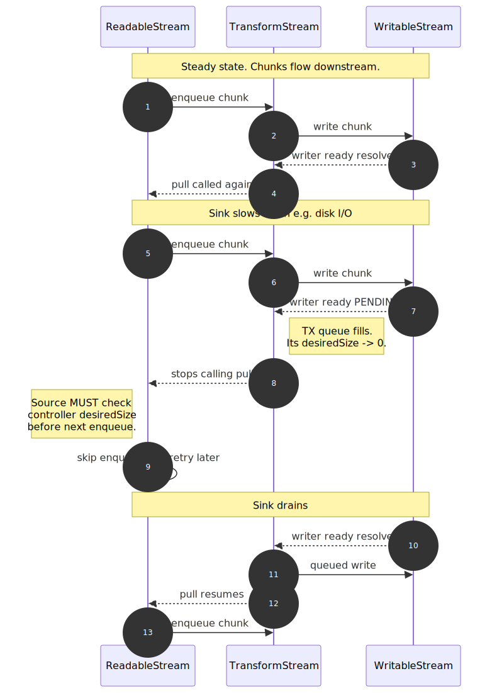
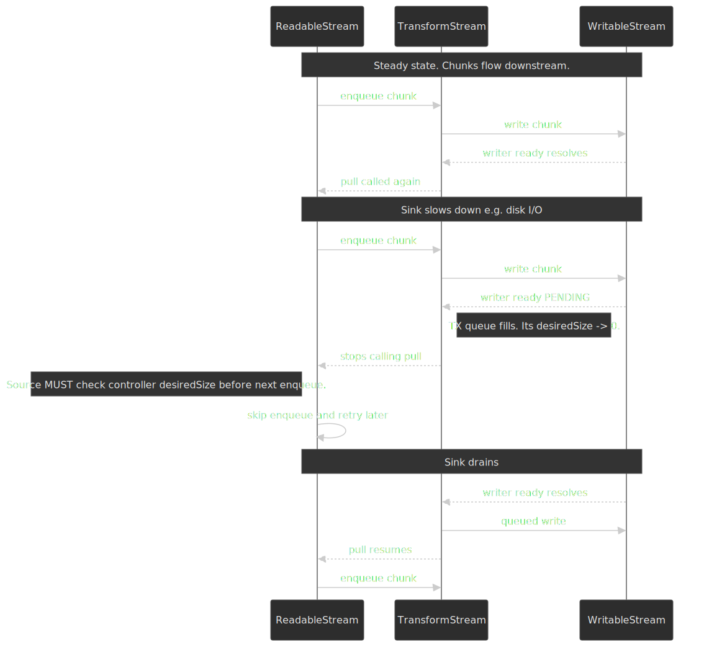

> [!IMPORTANT]
> Backpressure is **advisory**. The runtime computes `desiredSize` but cannot prevent a misbehaving source from calling `controller.enqueue()` past it; that is how stream-based code leaks memory in practice.[^cf-streams]

A push source that respects backpressure looks like this:

```typescript title="push-source.ts" mark={9-13}
const stream = new ReadableStream({
  start(controller) {
    let offset = 0
    const produceChunk = () => {
      if (offset >= TOTAL_SIZE) {
        controller.close()
        return
      }
      // Honor backpressure: bail out and try again later
      if (controller.desiredSize !== null && controller.desiredSize <= 0) {
        setTimeout(produceChunk, 50)
        return
      }
      controller.enqueue(generateChunk(offset, CHUNK_SIZE))
      offset += CHUNK_SIZE
      queueMicrotask(produceChunk)
    }
    produceChunk()
  },
})
```

### Reading: three patterns

```typescript title="reader-patterns.ts"
// 1. Manual reader — most control, must release the lock
const reader = stream.getReader()
try {
  while (true) {
    const { done, value } = await reader.read()
    if (done) break
    process(value)
  }
} finally {
  reader.releaseLock()
}

// 2. Async iteration — cleanest; auto-cancels on `break` unless you opt out
for await (const chunk of stream) {
  process(chunk)
}
for await (const chunk of stream.values({ preventCancel: true })) {
  if (foundTarget) break // stream remains live for another consumer
}

// 3. pipeTo — one call handles read, backpressure, error and cleanup
await stream.pipeTo(writableStream, { signal })
```

`for await...of` is the WHATWG-spec'd async iterator on `ReadableStream` and accepts `{ preventCancel: true }` via `stream.values()`.[^async-iter] Browser support arrived late: Chrome 124, Firefox 110, Safari 26.4.[^async-iter-caniuse]

### Single-reader lock and `tee()`

`getReader()` locks the stream — calling it twice throws `TypeError`. The single-reader rule is what enables the runtime to optimize the queue without per-consumer buffering. When you genuinely need two consumers, call `stream.tee()` to get two independent branches, accepting the buffering cost for the slower branch.

### `WritableStream` and the writer's `ready` promise

`WritableStream` is the destination half of the pipeline. The most useful detail for production code is `writer.ready`: it's a promise that resolves when the sink's `desiredSize > 0`, i.e., when there is room for another `write()`.[^writer-ready] Awaiting it before each write is the manual equivalent of `pipeTo` backpressure:

```typescript title="manual-backpressure.ts" mark={4-5}
const writer = writableStream.getWriter()
for (const chunk of chunks) {
  await writer.ready          // wait until the sink has capacity
  await writer.write(chunk)   // resolves when the chunk is accepted
}
await writer.close()
```

### `TransformStream` and built-in transforms

A `TransformStream` is a paired `(writable, readable)` whose `transform(chunk, controller)` runs between them. The built-ins cover most of what you would otherwise hand-roll:

| Transform             | Purpose                          | Notes                                                                 |
| --------------------- | -------------------------------- | --------------------------------------------------------------------- |
| `TextDecoderStream`   | `Uint8Array` → `string`          | Buffers partial UTF-8 sequences across chunk boundaries.[^text-decode]|
| `TextEncoderStream`   | `string` → `Uint8Array`          | Required when piping a string source into an HTTP body stream.        |
| `CompressionStream`   | gzip / deflate / deflate-raw     | `new CompressionStream('gzip')` — Compression Streams spec.[^compress]|
| `DecompressionStream` | inverse of above                 | Same algorithms.                                                      |

`pipeTo` and `pipeThrough` accept an options object that controls error and close propagation:

```typescript title="pipe-options.ts"
await readableStream.pipeTo(writableStream, {
  preventClose: false,  // default: close the sink when the source closes
  preventAbort: false,  // default: abort the sink on source error
  preventCancel: false, // default: cancel the source on sink error
  signal,               // tear the whole pipe down on abort
})
```

## AbortController: composable cancellation

`AbortController` is the single cancellation primitive across `fetch`, streams, timers (via `AbortSignal.timeout`), and your own async code. Its design is intentionally small: a controller emits one `signal`; the signal fires `'abort'` exactly once and exposes `aborted`, `reason`, and `throwIfAborted()`.

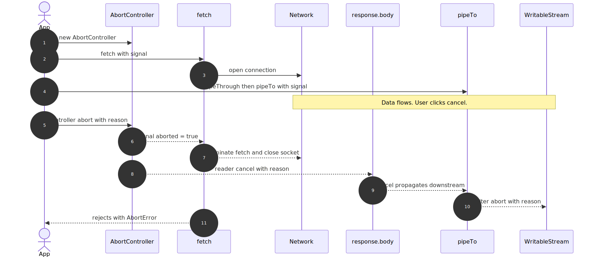
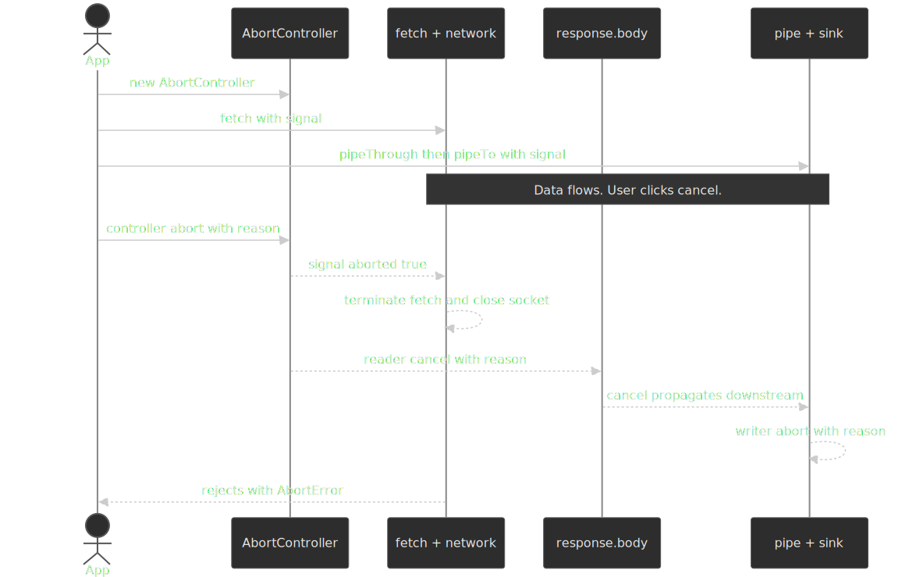

### Static factories

`AbortSignal.timeout(ms)` returns a signal that auto-aborts after the given duration with a `TimeoutError` `DOMException` (distinct from the `AbortError` raised by manual `controller.abort()`).[^timeout] The timer is **active time**, not wall clock — it pauses while the document is in the back/forward cache or in a suspended worker, which prevents bfcache restores from firing stale timeouts.

```typescript title="timeout.ts"
try {
  const response = await fetch("/api/data", { signal: AbortSignal.timeout(5000) })
  return await response.json()
} catch (err) {
  if (err.name === "TimeoutError") /* exceeded 5 s */ ;
  else if (err.name === "AbortError") /* user-initiated */ ;
  else throw err
}
```

`AbortSignal.any([...signals])` returns a signal that aborts as soon as **any** of its inputs aborts, propagating that input's `reason`.[^abort-any] It is the right tool for "cancel on user click *or* timeout":

```typescript title="signal-any.ts"
const userCancel = new AbortController()
const response = await fetch("/api/data", {
  signal: AbortSignal.any([userCancel.signal, AbortSignal.timeout(10_000)]),
})
cancelButton.onclick = () => userCancel.abort()
```

`signal.throwIfAborted()` throws `signal.reason` if the signal already aborted — useful at the top of long-running async work to bail out before doing the expensive thing.

### One-shot rule

A signal can only abort once. Reusing an already-aborted signal causes the next `fetch()` to reject **synchronously** with `AbortError`, which is the most common cause of "why is my retry call failing instantly":

```typescript title="signal-reuse.ts" del={3-5}
const ctrl = new AbortController()
ctrl.abort()
await fetch("/a", { signal: ctrl.signal }) // rejects immediately
await fetch("/b", { signal: ctrl.signal }) // rejects immediately
// Always create a fresh controller per logical operation.
```

### Custom abortable operations

Wire `AbortSignal` into your own code with `addEventListener('abort', …, { once: true })` for long waits, `signal.throwIfAborted()` between unit-of-work iterations, or a polled `signal.aborted` inside tight loops:

```typescript title="custom-abortable.ts"
function delay(ms: number, signal?: AbortSignal): Promise<void> {
  return new Promise((resolve, reject) => {
    if (signal?.aborted) return reject(signal.reason)
    const timer = setTimeout(resolve, ms)
    signal?.addEventListener("abort", () => {
      clearTimeout(timer)
      reject(signal.reason)
    }, { once: true })
  })
}
```

## Streaming downloads

### Streaming with progress

The naive "loaded / Content-Length" progress UI has a sharp edge:

> [!WARNING]
> If the response is compressed (`Content-Encoding: gzip`/`br`/`zstd`), `Content-Length` is the **encoded** size while `response.body` chunks are **decoded** bytes. Your `loaded` will exceed `total` and your bar will jump past 100%. Disable compression for the endpoint or accept the imprecision.[^archibald-progress]

```typescript title="download-with-progress.ts"
type ProgressCallback = (loaded: number, total: number | null) => void

async function downloadWithProgress(
  url: string,
  onProgress: ProgressCallback,
  signal?: AbortSignal,
): Promise<Uint8Array> {
  const response = await fetch(url, { signal })
  if (!response.ok) throw new Error(`HTTP ${response.status}`)

  const total = response.headers.get("Content-Length")
  const totalBytes = total ? parseInt(total, 10) : null

  const reader = response.body!.getReader()
  const chunks: Uint8Array[] = []
  let loaded = 0

  while (true) {
    const { done, value } = await reader.read()
    if (done) break
    chunks.push(value)
    loaded += value.length
    onProgress(loaded, totalBytes)
  }

  const result = new Uint8Array(loaded)
  let offset = 0
  for (const chunk of chunks) { result.set(chunk, offset); offset += chunk.length }
  return result
}
```

### Line-delimited and NDJSON streaming

For NDJSON or any newline-framed protocol — distinct from SSE, which has its own grammar and framing rules covered [below](#server-sent-events-vs-streaming-fetch) — pipe `response.body` through [`TextDecoderStream`](https://encoding.spec.whatwg.org/#interface-textdecoderstream) and split on `\n`. The decoder buffers partial UTF-8 sequences across chunk boundaries, but you must still buffer the trailing partial *line* yourself:

```typescript title="ndjson-stream.ts"
async function* streamNDJSON<T>(response: Response): AsyncGenerator<T> {
  const reader = response.body!
    .pipeThrough(new TextDecoderStream())
    .getReader()
  let buffer = ""
  while (true) {
    const { done, value } = await reader.read()
    if (done) {
      if (buffer.trim()) yield JSON.parse(buffer) as T
      return
    }
    buffer += value
    const lines = buffer.split("\n")
    buffer = lines.pop()! // keep incomplete trailing line
    for (const line of lines) {
      if (line.trim()) yield JSON.parse(line) as T
    }
  }
}

for await (const record of streamNDJSON<UserRecord>(response)) {
  await processUser(record)
}
```

### Range requests and resumable downloads

`Range: bytes=N-` is the spec-defined way to resume a broken download or grab a slice of a large object.[^range] Servers advertise support with `Accept-Ranges: bytes`; a successful partial returns `206 Partial Content` with `Content-Range: bytes N-M/Total`. Three failure modes worth wiring into your retry path:

- **`200 OK`** — the server ignored the `Range` header. Discard whatever you already have and start over.
- **`416 Range Not Satisfiable`** — the offset is past the end of the resource. Refetch metadata; the resource may have shrunk.
- **`If-Range` mismatch** — pair the `Range` request with `If-Range: <ETag>` (or `Last-Modified`). If the validator no longer matches, the server returns the full `200` instead of a stale partial, and the client knows to restart.[^if-range]

```typescript title="resumable-download.ts" mark={5-6,11}
async function resumableFetch(url: string, etag: string, offset: number, signal?: AbortSignal) {
  const response = await fetch(url, {
    signal,
    headers: {
      Range: `bytes=${offset}-`,
      "If-Range": etag, // server returns full 200 if the resource changed
    },
  })
  if (response.status === 200) return { mode: "restart", body: response.body! }
  if (response.status === 206) return { mode: "resume", body: response.body! }
  if (response.status === 416) throw new Error("Stored offset past EOF")
  throw new Error(`Unexpected ${response.status}`)
}
```

The `Range` header also enables parallel chunked downloads (request `0-N`, `N+1-2N`, … in parallel) and on-demand seeks for HLS / DASH players, where the player asks for a few seconds of media at a time rather than the whole file.

### Background Fetch (Chromium-only escape hatch)

The [Background Fetch API](https://wicg.github.io/background-fetch/) lets a Service Worker hand a long download (AI model weights, podcast episode, large dataset) to the user agent so it survives tab close and connectivity blips:[^bgfetch]

```typescript title="background-fetch.ts"
const reg = await navigator.serviceWorker.ready
const bgFetch = await reg.backgroundFetch.fetch(
  "ai-model-2026-04",
  ["/models/llama-7b.bin"],
  { title: "Downloading model", downloadTotal: 4_200_000_000 },
)
```

It is a WICG draft, not a W3C Recommendation, and ships in Chromium only as of 2026-04 (Chrome 74+, Edge 79+); Firefox and Safari have not implemented it. Use it as an opportunistic upgrade — fall back to plain `fetch()` when `'backgroundFetch' in registration` is `false`.

## Server-sent events vs streaming fetch

Server-Sent Events (`EventSource`) and streaming `fetch()` solve overlapping problems with very different ergonomics. Both ride on a single long-lived HTTP response; only one of them gives you reconnection for free.


### SSE wire format

The HTML Living Standard defines `text/event-stream` as a UTF-8 line-oriented format with five legal field names: `event`, `data`, `id`, `retry`, plus comments starting with `:`.[^sse-format] An empty line dispatches the accumulated event:

```text title="event-stream wire format"
retry: 5000

id: 42
event: tick
data: {"ts": 1714579200, "load": 0.42}

: keepalive
```

### Reconnection semantics

`EventSource` is the only browser API with built-in reconnect. The processing model:

1. On any disconnect that is not a fatal `error` (non-200 status, wrong `Content-Type`, `connection.close()`), the user agent waits for the current **reconnection time** and re-opens the request.[^sse-reconnect]
2. The `retry: <ms>` field updates that reconnection time for the lifetime of the `EventSource`. The default is user-agent defined — Chromium and Firefox ship 3000 ms — and the spec leaves room for exponential backoff.
3. If any received event has an `id:` field, the user agent stores it as the **last event ID**. On every reconnection attempt, that value is sent back as the `Last-Event-ID` request header so the server can resume from the right offset.[^sse-resume]
4. An empty `id:` resets the stored value; subsequent reconnects omit `Last-Event-ID`.

```typescript title="sse-reconnect.ts"
const es = new EventSource("/api/ticks", { withCredentials: true })
es.addEventListener("tick", (e) => render(JSON.parse(e.data)))
es.onerror = () => {
  // The browser will already reconnect; only intervene to give up.
  if (es.readyState === EventSource.CLOSED) showOfflineBanner()
}
```

### Decision matrix

| Concern                            | `EventSource` (SSE)                                                   | Streaming `fetch()`                                                                 |
| :--------------------------------- | :-------------------------------------------------------------------- | :---------------------------------------------------------------------------------- |
| HTTP method                        | `GET` only                                                            | Any                                                                                 |
| Custom request headers             | Not allowed (only `Cookie` via `withCredentials`)                     | Full control                                                                        |
| Auth tokens (`Authorization`)      | Workaround via cookie or query string                                 | Native                                                                              |
| Reconnection                       | Built-in; `retry:` and `Last-Event-ID` resume                         | Manual; you write the loop                                                          |
| Wire format                        | `text/event-stream` UTF-8 only                                        | Anything — JSON, NDJSON, protobuf, binary                                           |
| Cancellation                       | `EventSource.close()`                                                 | `AbortController` (composable with `AbortSignal.any`)                               |
| HTTP/1.1 connection budget         | Each open `EventSource` burns one of the **6** per-origin sockets.[^sse-conn] An app with many tabs starves images and other XHRs. | Same socket budget, but lifetimes are usually shorter.                              |
| HTTP/2 / HTTP/3 multiplexing       | Lifts the 6-connection limit; all streams share one TCP/QUIC connection. | Same.                                                                               |
| Server complexity                  | Trivial: write `data: ...\n\n`                                        | Trivial: write any framing you like                                                 |

> [!TIP]
> If you reach for SSE only because you want auto-reconnect, ship it over **HTTP/2 or HTTP/3** — the per-origin 6-connection HTTP/1.1 cap will otherwise lock up the rest of your page when users open multiple tabs.

## Service Worker stream relay

A Service Worker's `FetchEvent.respondWith()` can resolve to a `Response` whose body is any `ReadableStream` you assemble — including one composed from a `TransformStream` written to from multiple sources. This is how App Shell + dynamic content stitching achieves first-byte latency near the cache and rest-of-document latency near the network.[^sw-stream]

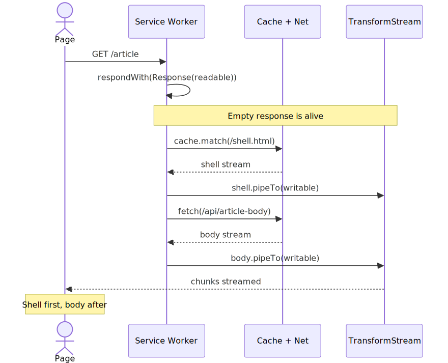
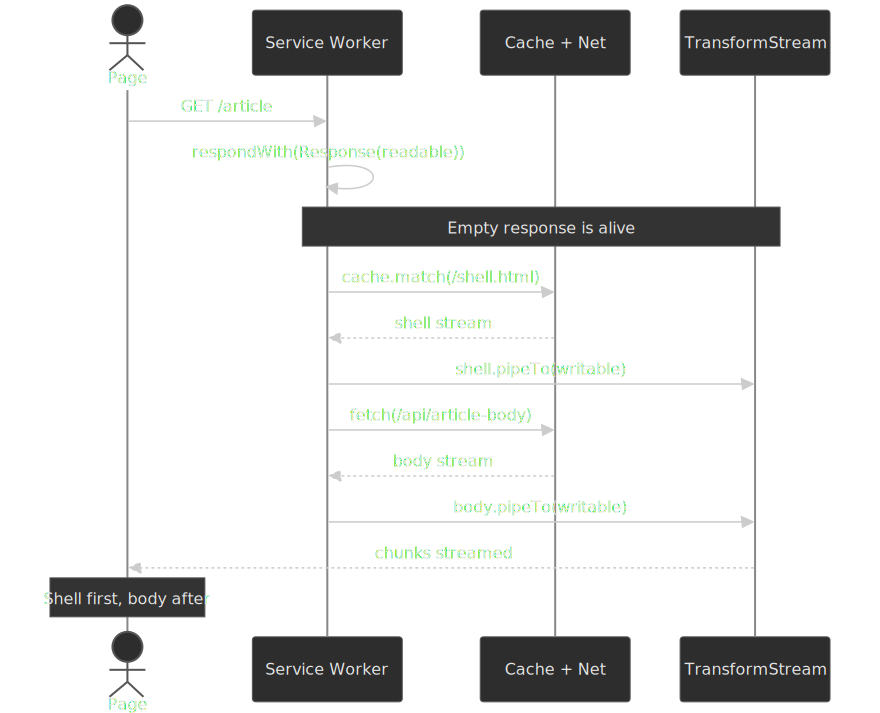

```typescript title="sw-stream-relay.ts"
self.addEventListener("fetch", (event) => {
  const url = new URL(event.request.url)
  if (url.pathname !== "/article") return

  const { readable, writable } = new TransformStream()
  event.respondWith(new Response(readable, {
    headers: { "Content-Type": "text/html; charset=utf-8" },
  }))

  event.waitUntil((async () => {
    const cache = await caches.open("shell-v1")
    const shell = await cache.match("/shell.html")
    if (shell?.body) {
      await shell.body.pipeTo(writable, { preventClose: true })
    }
    const body = await fetch(`/api/articles${url.search}`)
    if (body.body) await body.body.pipeTo(writable) // closes writable on completion
  })())
})
```

Operational gotchas a senior engineer should hold:

- **Lifetime.** A Service Worker can be terminated when idle. `event.waitUntil(...)` keeps it alive only as long as the controlled client is open *and* the worker has time budget; very long-running streams (multi-GB downloads) are precisely what `BackgroundFetch` is for.[^sw-lifetime]
- **Bytes only.** A `Response` body coming from a `ReadableStream` must enqueue `Uint8Array` chunks. Strings need `TextEncoder`/`TextEncoderStream` first.
- **Stream identity is not transferred.** When a `ReadableStream` crosses from a Service Worker to a controlled page via `respondWith`, the runtime relays *chunks* — both sides get distinct stream objects, not the same instance.

## Request metadata: `Sec-Fetch-*` and priority hints

Two newer Fetch ecosystem features change how your requests are *labelled* on the wire — one for security, one for performance.

### Fetch Metadata headers (`Sec-Fetch-*`)

The W3C [Fetch Metadata Request Headers](https://www.w3.org/TR/fetch-metadata/) spec asks the user agent to attach four forbidden request headers describing why a request was made. They are forbidden — JS cannot set or override them — which is exactly what makes them useful as a server-side trust signal:[^fetch-metadata]

| Header             | Values                                                              | What it tells the server                                                              |
| :----------------- | :------------------------------------------------------------------ | :------------------------------------------------------------------------------------ |
| `Sec-Fetch-Site`   | `same-origin` \| `same-site` \| `cross-site` \| `none`              | Relationship between initiator and target.                                            |
| `Sec-Fetch-Mode`   | `cors` \| `navigate` \| `no-cors` \| `same-origin` \| `websocket`   | Request mode. Most XHR/Fetch requests are `cors` or `same-origin`.                    |
| `Sec-Fetch-Dest`   | `document`, `image`, `script`, `style`, `font`, `audio`, …          | The Fetch destination — what the response will be used for.                           |
| `Sec-Fetch-User`   | `?1` (only sent when truthy)                                        | The navigation was triggered by an explicit user gesture.                             |

A "Resource Isolation Policy" pattern reduces a wide class of CSRF / XS-Leaks to a few lines:

```typescript title="resource-isolation.ts"
function isAllowed(req: Request): boolean {
  const site = req.headers.get("Sec-Fetch-Site") ?? "none"
  const mode = req.headers.get("Sec-Fetch-Mode") ?? "navigate"
  const dest = req.headers.get("Sec-Fetch-Dest") ?? "document"
  if (site === "same-origin" || site === "none") return true   // own pages, bookmarks, address bar
  if (mode === "navigate" && req.method === "GET" && dest === "document") return true
  return false                                                  // reject cross-site image/script/etc.
}
```

Always include the three discriminating headers in the response `Vary` so caches do not collapse a permitted same-origin response into a cached cross-origin one.

### Priority Hints (`fetchpriority` and `RequestInit.priority`)

The Priority Hints spec (now folded into the Fetch Standard and HTML Standard as `fetchpriority`) lets you nudge the browser's internal request-priority queue with three values: `'high'`, `'low'`, `'auto'`. The hint is advisory — browsers reserve the right to override based on resource type and network conditions.[^priority-hints]

```html title="lcp-image.html"

```

```typescript title="fetch-priority.ts"
fetch("/api/critical", { priority: "high" })   // boost a critical XHR above siblings
fetch("/api/analytics", { priority: "low" })   // deprioritise so it never competes with LCP
```

Two patterns that pay off:

- **Boost the LCP image / API call** that paints above the fold. Browsers default `` to "low" until layout proves visibility — `fetchpriority="high"` lets you skip that round trip.
- **Deprioritise telemetry, prefetch warming, and cache hydration.** Reserve scarce bandwidth for the requests that block paint and interactivity.

Browser support reached cross-engine interop in 2024 (Baseline 2024); use it freely in 2026.

## Streaming uploads

Browsers gained `ReadableStream` request bodies, but the path is narrower than most articles suggest.

```typescript title="upload-stream.ts"
async function uploadStream(
  url: string,
  source: AsyncGenerator<Uint8Array>,
  signal?: AbortSignal,
): Promise<Response> {
  const body = new ReadableStream({
    async pull(controller) {
      const { done, value } = await source.next()
      if (done) controller.close()
      else controller.enqueue(value)
    },
  })
  return fetch(url, {
    method: "POST",
    body,
    duplex: "half", // mandatory when body is a ReadableStream
    signal,
  })
}
```

> [!CAUTION]
> Streaming request bodies are **Chrome- and Edge-only** (≥ 105) as of 2026-04. Firefox tracks the work in [Bugzilla 1387483](https://bugzilla.mozilla.org/show_bug.cgi?id=1387483) (open since 2017); Safari/iOS 26.x still report no support.[^upload-caniuse]

Operational constraints to internalise before designing around it:

- **HTTP/2 or HTTP/3 required.** HTTP/1.1 needs `Content-Length` or chunked encoding up front; streaming bodies provide neither, so the browser will not negotiate it.[^upload-chrome]
- **Half-duplex only.** `duplex: 'half'` means the response is held until the request finishes — there is no bidirectional streaming via `fetch()` in browsers. WebTransport/WebSocket are the bidirectional escape hatches.[^upload-chrome]
- **CORS preflight always.** Streaming requests are never "simple", so every cross-origin call costs a round trip.
- **303 is the only redirect honored.** Non-303 redirects on a streaming body are rejected, because the body cannot be replayed to the new URL.[^upload-chrome]
- **Server buffering negates the win.** Many origins and proxies buffer the full request before invoking the handler — measure end-to-end before building a UX around streaming uploads.

For the long tail (Firefox, Safari, older Chromium), `XMLHttpRequest` remains the only way to stream uploads with progress events.

```typescript title="xhr-upload-progress.ts"
function uploadWithProgress(
  url: string,
  formData: FormData,
  onProgress: (loaded: number, total: number) => void,
  signal?: AbortSignal,
): Promise<Response> {
  return new Promise((resolve, reject) => {
    const xhr = new XMLHttpRequest()
    xhr.upload.addEventListener("progress", (e) => {
      if (e.lengthComputable) onProgress(e.loaded, e.total)
    })
    xhr.addEventListener("load", () =>
      resolve(new Response(xhr.response, { status: xhr.status })))
    xhr.addEventListener("error", () => reject(new Error("Upload failed")))
    signal?.addEventListener("abort", () => {
      xhr.abort()
      reject(signal.reason)
    })
    xhr.open("POST", url)
    xhr.send(formData)
  })
}
```

## BYOB readers: zero-copy byte streams

A "Bring Your Own Buffer" reader fills a caller-provided `ArrayBuffer` instead of allocating a new one per chunk. It is only available on streams whose underlying source declares `type: 'bytes'` (a `ReadableByteStreamController`), or via `autoAllocateChunkSize` on the same source.[^byob-mdn]

```typescript title="byob-reader.ts"
async function readWithBYOB(stream: ReadableStream<Uint8Array>): Promise<Uint8Array[]> {
  const reader = stream.getReader({ mode: "byob" })
  const chunks: Uint8Array[] = []
  let buffer = new Uint8Array(64 * 1024)
  while (true) {
    const { done, value } = await reader.read(buffer)
    if (done) break
    // value is a view into the now-detached buffer; copy what was filled
    chunks.push(value.slice())
    // The original buffer's ArrayBuffer was transferred; rebuild a view.
    buffer = new Uint8Array(value.buffer)
  }
  return chunks
}
```

When BYOB pays off:

- Long-running binary processing (media demuxing, archive extraction) where allocation pressure dominates.
- WebAssembly interop, where you pre-allocate memory inside the Wasm heap.
- Anything where you measured GC pressure from per-chunk `Uint8Array` allocations.

For everyday use, the default reader is simpler, faster to write, and within a few percent of BYOB throughput.

## Error handling

Three error sources, three strategies. Combine them in one wrapper:

```typescript title="robust-fetch.ts"
class HTTPError extends Error {
  constructor(public status: number, public statusText: string) {
    super(`HTTP ${status}: ${statusText}`)
    this.name = "HTTPError"
  }
}
class NetworkError extends Error { name = "NetworkError" as const }

async function robustFetch<T>(url: string, options: RequestInit = {}): Promise<T> {
  const { signal: userSignal, ...rest } = options
  const timeoutSignal = AbortSignal.timeout(30_000)
  const signal = userSignal
    ? AbortSignal.any([userSignal, timeoutSignal])
    : timeoutSignal

  let response: Response
  try {
    response = await fetch(url, { ...rest, signal })
  } catch (e) {
    if (e instanceof Error && e.name === "TimeoutError") {
      throw new NetworkError("Request timed out after 30 s")
    }
    if (e instanceof Error && e.name === "AbortError") throw e
    throw new NetworkError(`Network failure: ${e}`)
  }

  if (!response.ok) throw new HTTPError(response.status, response.statusText)
  const contentType = response.headers.get("Content-Type")
  if (!contentType?.includes("application/json")) {
    throw new Error(`Expected JSON, got ${contentType}`)
  }
  return (await response.json()) as T
}
```

For partial downloads, `Range: bytes=N-` lets you resume after a network blip — but only if the server returns `206 Partial Content`. Anything else (200, 416) means fall back to a full retry.

## Browser support, verified

All version numbers below are from caniuse and MDN browser-compat-data as of **2026-04-21**. Where the article previously reported earlier versions, those were copied from older support tables that conflated "feature exists" with "feature behaves to spec".

| Feature                              | Chrome | Firefox | Safari | Source                                                        |
| ------------------------------------ | -----: | ------: | -----: | ------------------------------------------------------------- |
| `fetch()`                            |    42+ |     39+ |  10.1+ | [caniuse](https://caniuse.com/fetch)                          |
| `ReadableStream` (response body)     |    43+ |     65+ |  10.1+ | [caniuse](https://caniuse.com/streams)                        |
| `WritableStream`                     |    59+ |    100+ |  14.1+ | [caniuse](https://caniuse.com/mdn-api_writablestream_writablestream) |
| `TransformStream`                    |    67+ |    102+ |  14.1+ | [MDN](https://developer.mozilla.org/en-US/docs/Web/API/TransformStream) |
| `AbortController`                    |    66+ |     57+ |  11.1+ | [caniuse](https://caniuse.com/abortcontroller)                |
| `AbortSignal.timeout()` (full)       |   124+ |    100+ |  16.0+ | [caniuse](https://caniuse.com/mdn-api_abortsignal_timeout_static) |
| `AbortSignal.any()`                  |   116+ |    124+ |  17.4+ | [caniuse](https://caniuse.com/wf-abortsignal-any)             |
| `for await...of` on `ReadableStream` |   124+ |    110+ |  26.4+ | [caniuse](https://caniuse.com/mdn-api_readablestream_--asynciterator) |
| Request body `ReadableStream`        |   105+ |       — |      — | [caniuse](https://caniuse.com/mdn-api_request_request_request_body_readablestream) |

> [!NOTE]
> The async-iteration row deserves attention: many polyfills and older articles claimed Safari 14.1 / Firefox 65, conflating `ReadableStream` itself with the async iterator protocol on it. The real interop date is **Safari 26.4 (April 2026)**.

### Feature detection

```typescript title="feature-detection.ts"
const supportsUploadStreaming = (() => {
  let duplexAccessed = false
  try {
    new Request("data:,", {
      method: "POST",
      body: new ReadableStream(),
      get duplex() { duplexAccessed = true; return "half" },
    })
  } catch { return false }
  return duplexAccessed
})()

const supportsSignalAny = typeof AbortSignal.any === "function"
const supportsSignalTimeout = typeof AbortSignal.timeout === "function"
const supportsAsyncIteration =
  typeof (ReadableStream.prototype as any)[Symbol.asyncIterator] === "function"
```

## Practical takeaways

- Treat `response.body` as the **default** way to consume large payloads; reach for `.json()`/`.text()` only when the response fits comfortably in memory.
- Always pass an `AbortSignal` from your call site, even if it's just `AbortSignal.timeout(...)`. Untimed `fetch()` calls are how tabs leak.
- Compose with `AbortSignal.any([userSignal, AbortSignal.timeout(ms)])` — one signal, two reasons to cancel, native cleanup.
- Honour `controller.desiredSize` in custom sources. The runtime will not save you.
- Avoid `response.clone()` on large bodies. If you need two consumers, design the second one to operate on parsed data.
- Don't ship "loaded / Content-Length" progress UI on compressed endpoints; either disable encoding or stop showing a percentage.
- Streaming uploads are still a Chromium-only optimisation in 2026. Plan the fallback path before you build the happy path.
- Reach for `EventSource` when reconnect-with-`Last-Event-ID` is the spec you would otherwise re-implement; reach for streaming `fetch()` when you need POST, custom headers, or non-text framing.
- For App Shell + dynamic body, compose a `TransformStream` inside `FetchEvent.respondWith` — it is the fastest way to ship cached HTML before the network responds.
- Trust `Sec-Fetch-Site` / `Sec-Fetch-Mode` server-side as a cheap, unforgeable defense-in-depth check, and remember to add them to `Vary`.
- Use `fetchpriority="high"` (or `priority: 'high'`) on the LCP-critical request and `'low'` on telemetry / prefetch — most apps mis-prioritize at least one of the two.

## Appendix

### Terminology

- **Backpressure** — flow-control mechanism where consumer pacing throttles producer output via `desiredSize`.
- **Body source** — the spec name for the original data backing a body (a byte sequence, `Blob`, `FormData`, etc.) before it becomes a stream.
- **BYOB (Bring Your Own Buffer)** — a reader mode that fills a caller-allocated `ArrayBuffer` instead of allocating per-chunk; only available on byte streams.
- **Disturbed** — a body whose stream has had `read()` called on it; cannot be re-read or cloned.
- **Half-duplex** — request must finish before the response can be read; full-duplex would allow interleaved reads and writes (browsers do not).
- **High water mark** — the queue-size threshold at which a stream signals backpressure (`desiredSize <= 0`).
- **Locked** — the state of a stream while a reader holds it; only one reader can be active at a time.
- **Opaque response** — cross-origin response with `mode: 'no-cors'`; status `0`, headers empty, body `null`. Indistinguishable from a network error.
- **Tee** — duplicating a stream into two independent branches; the slower branch causes the queue to grow.

### References

#### Specifications

- [Fetch Standard](https://fetch.spec.whatwg.org/) — WHATWG Living Standard (Request, Response, body, CORS, response tainting)
- [Streams Standard](https://streams.spec.whatwg.org/) — WHATWG Living Standard (`ReadableStream`, `WritableStream`, `TransformStream`, pipe chains, backpressure)
- [Encoding Standard](https://encoding.spec.whatwg.org/) — `TextEncoderStream`, `TextDecoderStream`
- [DOM Standard §3.3 Aborting ongoing activities](https://dom.spec.whatwg.org/#aborting-ongoing-activities) — `AbortController`, `AbortSignal`
- [HTML Standard §9.2 Server-sent events](https://html.spec.whatwg.org/multipage/server-sent-events.html) — `EventSource`, `text/event-stream`, reconnection
- [Service Workers — W3C](https://www.w3.org/TR/service-workers/) — `FetchEvent.respondWith`, `ExtendableEvent.waitUntil`
- [Background Fetch — WICG](https://wicg.github.io/background-fetch/) — `BackgroundFetchManager`
- [Fetch Metadata Request Headers — W3C](https://www.w3.org/TR/fetch-metadata/) — `Sec-Fetch-Site`, `Sec-Fetch-Mode`, `Sec-Fetch-Dest`, `Sec-Fetch-User`
- [RFC 9110 — HTTP Semantics](https://www.rfc-editor.org/rfc/rfc9110.html) — `Range` requests, conditional requests, response status codes
- [Compression Streams](https://wicg.github.io/compression/) — `CompressionStream`/`DecompressionStream`

#### Official documentation and engineering posts

- [Using the Fetch API — MDN](https://developer.mozilla.org/en-US/docs/Web/API/Fetch_API/Using_Fetch)
- [`ReadableStream` — MDN](https://developer.mozilla.org/en-US/docs/Web/API/ReadableStream)
- [Using readable byte streams — MDN](https://developer.mozilla.org/en-US/docs/Web/API/Streams_API/Using_readable_byte_streams)
- [`AbortSignal.timeout()` — MDN](https://developer.mozilla.org/en-US/docs/Web/API/AbortSignal/timeout_static)
- [`AbortSignal.any()` — MDN](https://developer.mozilla.org/en-US/docs/Web/API/AbortSignal/any_static)
- [Streaming requests with the fetch API — Chrome for Developers](https://developer.chrome.com/docs/capabilities/web-apis/fetch-streaming-requests)
- [Streams — the definitive guide — web.dev](https://web.dev/articles/streams)
- [We deserve a better streams API — Cloudflare](https://blog.cloudflare.com/a-better-web-streams-api/)
- [Fetch streams are great, but not for measuring upload/download progress — Jake Archibald, 2025](https://jakearchibald.com/2025/fetch-streams-not-for-progress/)

[^body-stream]: [Fetch Standard §body](https://fetch.spec.whatwg.org/#concept-body): a body is a tuple of (`stream`, `source`, `length`) where `stream` is a `ReadableStream`.
[^backpressure]: [Streams Standard §1.1.4 Backpressure](https://streams.spec.whatwg.org/#pipe-chains) — pipe chains propagate backpressure from sink to source.
[^abort]: [DOM Standard §3.3](https://dom.spec.whatwg.org/#aborting-ongoing-activities) defines `AbortController`, `AbortSignal`, and the `abort` algorithm.
[^body-spec]: [Fetch Standard §6.2.5 Body mixin](https://fetch.spec.whatwg.org/#body-mixin) — once a body is "disturbed" it cannot be consumed again.
[^cf-streams]: Cloudflare engineering: [We deserve a better streams API](https://blog.cloudflare.com/a-better-web-streams-api/) — backpressure is advisory, not enforced.
[^pipe-options]: [Streams Standard §`pipeTo()`](https://streams.spec.whatwg.org/#rs-pipe-to) — `signal`, `preventAbort`, `preventCancel`, `preventClose` semantics.
[^fetch-intro]: [Fetch Standard §Introduction](https://fetch.spec.whatwg.org/#fetching) — Fetch is the unified network primitive across the platform.
[^opaque]: [Fetch Standard §filtered response opaque](https://fetch.spec.whatwg.org/#concept-filtered-response-opaque) — "indistinguishable from a network error".
[^redirects]: [Fetch Standard §HTTP-redirect fetch](https://fetch.spec.whatwg.org/#http-redirect-fetch) — redirect count limit is 20.
[^streaming-uploads]: [Fetch Standard §request `duplex`](https://fetch.spec.whatwg.org/#dom-requestinit-duplex) and [Chrome streaming requests docs](https://developer.chrome.com/docs/capabilities/web-apis/fetch-streaming-requests).
[^body-source]: [Fetch Standard §`BodyInit`](https://fetch.spec.whatwg.org/#bodyinit) lists the supported source types.
[^clone]: [`Response.clone()` — MDN](https://developer.mozilla.org/en-US/docs/Web/API/Response/clone) — implemented via `ReadableStream.tee()`.
[^tee-buffer]: [`ReadableStream.tee()` — MDN](https://developer.mozilla.org/en-US/docs/Web/API/ReadableStream/tee) — chunks are buffered for the slower branch.
[^fetch-errors]: [`fetch()` error semantics — MDN](https://developer.mozilla.org/en-US/docs/Web/API/Window/fetch) — only network-level failures reject the promise.
[^desired-size]: [`ReadableStreamDefaultController.desiredSize` — Streams Standard](https://streams.spec.whatwg.org/#dom-readablestreamdefaultcontroller-desiredsize): defined as `highWaterMark - chunk-size sum`.
[^pipe-chains]: [Streams Standard §pipe chains](https://streams.spec.whatwg.org/#pipe-chains) and [MDN Streams concepts](https://developer.mozilla.org/en-US/docs/Web/API/Streams_API/Concepts).
[^async-iter]: [Streams Standard §async iteration](https://streams.spec.whatwg.org/#rs-asynciterator) — `stream.values({ preventCancel })`.
[^async-iter-caniuse]: [`ReadableStream` `[Symbol.asyncIterator]` — caniuse](https://caniuse.com/mdn-api_readablestream_--asynciterator).
[^writer-ready]: [`WritableStreamDefaultWriter.ready` — MDN](https://developer.mozilla.org/en-US/docs/Web/API/WritableStreamDefaultWriter/ready).
[^text-decode]: [`TextDecoderStream` — MDN](https://developer.mozilla.org/en-US/docs/Web/API/TextDecoderStream) — handles UTF-8 sequences split across chunk boundaries.
[^compress]: [Compression Streams](https://wicg.github.io/compression/) defines `gzip`, `deflate`, and `deflate-raw`.
[^timeout]: [`AbortSignal.timeout()` — MDN](https://developer.mozilla.org/en-US/docs/Web/API/AbortSignal/timeout_static) — aborts with a `TimeoutError` `DOMException`; uses active time.
[^abort-any]: [`AbortSignal.any()` — DOM Standard](https://dom.spec.whatwg.org/#dom-abortsignal-any) — composite signal aborts when any input aborts.
[^archibald-progress]: Jake Archibald, [Fetch streams are great, but not for measuring upload/download progress](https://jakearchibald.com/2025/fetch-streams-not-for-progress/) (2025-09).
[^upload-caniuse]: [Send `ReadableStream` in request body — caniuse](https://caniuse.com/mdn-api_request_request_request_body_readablestream); [Bugzilla 1387483](https://bugzilla.mozilla.org/show_bug.cgi?id=1387483) tracks Firefox status.
[^upload-chrome]: [Streaming requests with the fetch API — Chrome for Developers](https://developer.chrome.com/docs/capabilities/web-apis/fetch-streaming-requests) — HTTP/2 requirement, half-duplex constraint, redirect rules.
[^byob-mdn]: [Using readable byte streams — MDN](https://developer.mozilla.org/en-US/docs/Web/API/Streams_API/Using_readable_byte_streams) — BYOB requires `type: 'bytes'`; `autoAllocateChunkSize` enables BYOB-style behavior with a default reader.
[^range]: [RFC 9110 §14 Range Requests](https://www.rfc-editor.org/rfc/rfc9110#section-14) — `Range`, `Accept-Ranges`, `Content-Range`, `206 Partial Content`, and `416 Range Not Satisfiable` semantics.
[^if-range]: [RFC 9110 §13.1.5 If-Range](https://www.rfc-editor.org/rfc/rfc9110#section-13.1.5) — conditional ranges fall back to a full `200` when the validator fails to match.
[^bgfetch]: [Background Fetch — WICG draft](https://wicg.github.io/background-fetch/) and [Background Fetch API — MDN](https://developer.mozilla.org/en-US/docs/Web/API/Background_Fetch_API). Chromium-only as of 2026-04.
[^sse-format]: [HTML Standard §9.2 Server-sent events](https://html.spec.whatwg.org/multipage/server-sent-events.html#parsing-an-event-stream) defines the line-oriented `text/event-stream` grammar.
[^sse-reconnect]: [HTML Standard §9.2.5 The `EventSource` interface](https://html.spec.whatwg.org/multipage/server-sent-events.html#the-eventsource-interface) — reconnection algorithm, the `retry` field, and fatal-error rules.
[^sse-resume]: [HTML Standard §9.2.4 Processing model](https://html.spec.whatwg.org/multipage/server-sent-events.html#processing-the-field) — `id:` updates the last event ID; the user agent sends it as `Last-Event-ID` on reconnection.
[^sse-conn]: [HTML Standard §9.2.5 EventSource constructor](https://html.spec.whatwg.org/multipage/server-sent-events.html#dom-eventsource): per-origin connection limits apply; on HTTP/1.1 each `EventSource` consumes one of the six allowed sockets.
[^sw-stream]: [Stream your way to immediate responses — Chrome for Developers](https://developer.chrome.com/blog/sw-readablestreams) — composing cached shells with network-streamed bodies inside `FetchEvent.respondWith`.
[^sw-lifetime]: [`ExtendableEvent.waitUntil()` — MDN](https://developer.mozilla.org/en-US/docs/Web/API/ExtendableEvent/waitUntil): the worker stays alive until the promise settles, but UAs may still terminate after long idle windows.
[^fetch-metadata]: [Fetch Metadata Request Headers — W3C](https://www.w3.org/TR/fetch-metadata/) and [Protect your resources from web attacks with Fetch Metadata — web.dev](https://web.dev/articles/fetch-metadata).
[^priority-hints]: [Optimize resource loading with the Fetch Priority API — web.dev](https://web.dev/articles/fetch-priority); [`fetchpriority` — MDN](https://developer.mozilla.org/en-US/docs/Web/HTML/Reference/Attributes/fetchpriority); [`RequestInit.priority` — MDN](https://developer.mozilla.org/en-US/docs/Web/API/RequestInit#priority).
