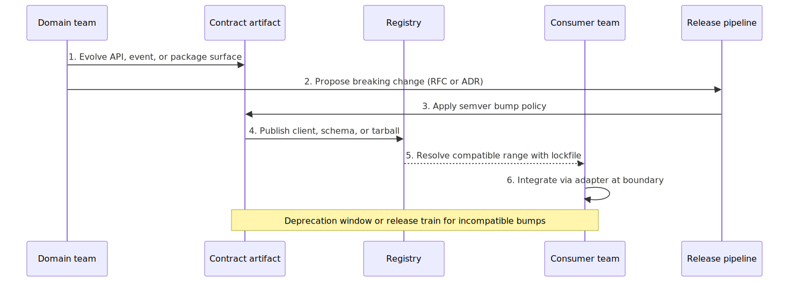
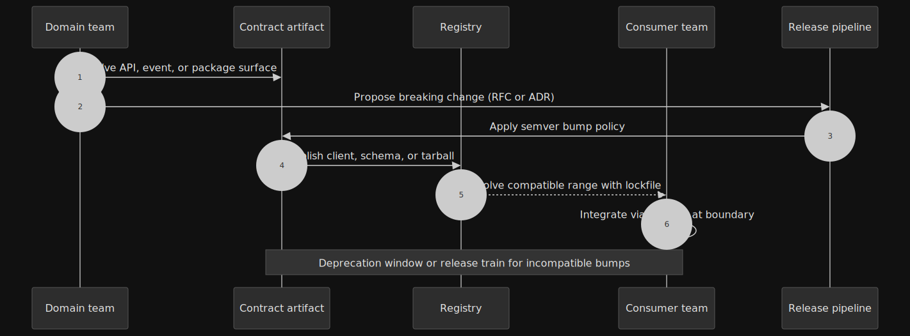

# Frontend Architecture at Scale: Boundaries, Ownership, and Platform Governance

At small scale, frontend architecture is mostly folder structure and lint rules. At large scale, it becomes an organizational problem that happens to be implemented in TypeScript: who may change what, how incompatible changes propagate, and which teams wait on which releases. The systems that survive are not the ones with the cleverest abstractions, but the ones with **clear boundaries**, **explicit contracts**, and **governed platform layers** that make safe change the default.

This article is a decision-oriented map of that terrain. It assumes you are already shipping a modularized UI (components, packages, or micro-frontends) and need durable rules for **ownership**, **contracts**, **release models**, **repository shape**, **dependency governance**, and **day-two operations**.

## Why boundaries matter before micro-frontends

[Conway’s law](https://martinfowler.com/bliki/ConwaysLaw.html) is not destiny, but it is gravity: systems tend to mirror communication structure. If your repository graph says “anything can import anything,” your teams will coordinate like a single committee. The [inverse Conway maneuver](https://www.thoughtworks.com/radar/techniques/inverse-conway-maneuver) is the deliberate act of shaping software boundaries so teams can execute independently.

For frontend work, a **boundary** is a place where:

- **Ownership** is unambiguous (a named team or domain is on the hook for breakage and evolution).
- **Change risk** is localized (a regression is unlikely to silently corrupt unrelated product surfaces).
- **Integration** is **contract-first** (consumers depend on stable artifacts and documented compatibility rules, not on incidental file proximity).

Boundaries can live inside one deployable (“modular monolith”) or span several. The governance problems are similar in both cases; only the failure modes differ.

## Domain boundaries in the UI

Treat each major product area as a **bounded context** in the domain-driven sense: language, invariants, and UX flows should cohere internally and integrate externally through narrow ports. In practice, that usually means **vertical slices** (feature- or domain-oriented folders) rather than purely technical layers (`components/`, `hooks/`, `utils/`) that invite cross-feature coupling.

Useful rules of thumb:

- **Colocate** state, UI, tests, and thin integration code with the domain they serve. Shared code should default to “pull up reluctantly,” not “push down eagerly.”
- Prefer **public entrypoints** (`index.ts` that re-exports a curated surface) over deep imports that freeze internal layout.
- Make **routing and composition** a shell concern, not a dumping ground for business rules. The shell decides *where* a surface mounts; domains decide *how* it behaves.

### Cross-domain workflows without a shared everything-store

Most customer journeys cut across domains. The failure mode is a stealth **distributed monolith**: every screen imports a global client store, reaches into another team’s hooks, or reads mutable singletons that encode half the business rules.

Prefer orchestration at the shell boundary (navigation, handoff parameters, and explicit context passed as props or typed route state) over **peer imports** between domains. When two domains must coordinate, expose a **narrow port**: an event on a documented bus, a command API, or a tiny façade package with a semver contract rather than “import their internals because it is faster this sprint.”

### Anti-patterns that quietly undo boundaries

- **Shared “utils” sprawl** that becomes a second standard library with no owner.
- **Emergency re-exports** from platform packages to unblock a deadline; those become permanent coupling.
- **Stringly typed cross-team events** without schema validation or versioning.
- **Global CSS** or theme overrides that leak layout assumptions across unrelated surfaces.

If your linter cannot express the boundary, humans will not hold the line under schedule pressure.

## Ownership models that actually ship

Ownership is not a RACI chart in a wiki. It is **runtime accountability**: who gets paged, who approves breaking changes, and who funds migrations. The taxonomy from [Team Topologies](https://teamtopologies.com/key-concepts) — stream-aligned, platform, enabling, complicated-subsystem — gives a useful vocabulary; the patterns below are how that vocabulary tends to land in frontend orgs specifically.

Common patterns:

| Model | What it optimizes | Failure mode |
| --- | --- | --- |
| **Central platform team** | Consistency, accessibility, performance baselines | Bottleneck if platform is understaffed or treated as “internal vendor” without product partnership |
| **Embedded specialists** | Fast iteration inside a domain | Fragmented UX and duplicated primitives without strong platform standards |
| **Federated governance** (guild + standards + shared tools) | Balance of autonomy and coherence | Standards drift unless backed by CI and executive sponsorship |

Whatever the model, publish **interfaces between roles**: design review expectations, performance budgets, accessibility gates, and which RFC or architecture decision record (ADR) path applies to breaking platform changes.

## Contracts: the integration surface

If two teams depend on each other through source-level intimacy, they share fate. **Contracts** turn implicit coordination into artifacts with versions and compatibility rules.

Strong contract types in frontend-heavy systems:

- **HTTP APIs** described with [OpenAPI](https://spec.openapis.org/oas/latest.html), with generated clients or hand-written adapters that are owned by the consumer or a neutral client package.
- **Schema-first GraphQL** federated across teams. [Apollo Federation v2](https://www.apollographql.com/docs/graphos/schema-design/federated-schemas/composition) composes per-team subgraphs into a single supergraph; subgraphs opt in via `extend schema @link(url: "https://specs.apollo.dev/federation/v2.x", ...)` and use directives like `@key`, `@shareable`, and `@external` to declare ownership of types and fields. Composition fails the build when subgraphs disagree, which turns "who owns this field" into a CI error rather than a 3am incident.
- **Browser-friendly RPC** for typed cross-service calls. [Connect](https://connectrpc.com/docs/protocol/) (from Buf) speaks Connect, gRPC, and gRPC-Web from the same handler over plain HTTP/1.1 or HTTP/2, generates idiomatic TypeScript clients, and removes the Envoy translating-proxy that classic [gRPC-Web](https://github.com/grpc/grpc/blob/master/doc/PROTOCOL-WEB.md) requires in the browser.
- **Events and async messages** validated with [JSON Schema](https://json-schema.org/) or equivalent schema registries, with explicit versioning and compatibility tests.
- **Shared libraries** versioned with [semantic versioning](https://semver.org/) and consumed through ranges locked in package managers, not ad hoc git URLs.

TypeScript types alone are not a distribution contract unless they ship as a **published package** with semver discipline. Otherwise they are a build-time accident: useful, but not a substitute for schema-backed evolution across service or team boundaries. Where you split compilation units, [TypeScript project references](https://www.typescriptlang.org/docs/handbook/project-references.html) can make graph boundaries explicit.

### Contract evolution: who breaks whom, and how loudly

Versioning is a user-experience problem for other engineers. A practical policy stack:

- **Additive changes first**: new optional fields, new events, new exports behind explicit entrypoints. Reserve breaking removals for rare, planned windows.
- **Major bumps are a product decision**, not a refactor whim. If a major bump forces ten consuming services to coordinate, you have re-created a monolithic release even if the git history looks modular.
- **Document compatibility rules** alongside the artifact. For HTTP, OpenAPI’s compatibility expectations are widely understood; for events, encode version in the subject or payload envelope and test consumers against fixtures.
- **Consumer-driven contract tests** catch silent drift before production. Frameworks such as [Pact](https://docs.pact.io/) formalize expectations between producers and consumers; whether you adopt the tool or not, the *idea* belongs in your CI story.

## Release models and blast radius

**Release model** is how often incompatible change is allowed to land in production relative to consumer readiness. It is the bridge between **team autonomy** and **user-visible coherence**.

| Model | Coupling | Operational complexity | Best when |
| --- | --- | --- | --- |
| **Single train / batched release** | High human coordination, low runtime surprise | Lowest number of moving artifacts | Early product, tight regulatory windows, or genuinely monolithic runtime |
| **Trunk-based continuous delivery** on one deployable | Medium; requires discipline on flags and contracts | Medium; demands strong CI and observability | Mature org shipping many small changes behind safe defaults |
| **Independent deployables** (micro-frontends, federated modules, server-included fragments) | Low for code ownership, **high** for compatibility | High; caching, routing, and version skew become first-class | Very large orgs with stable platform teams and explicit UX ownership for seams |

Concrete options you will see in the wild:

- **Single release train** for a tightly coupled UI: simplest operationally, highest coordination tax for unrelated workstreams.
- **Continuous delivery per domain** behind stable contracts: best velocity when contracts and feature flags are mature.
- **Runtime composition** (for example [Module Federation](https://webpack.js.org/concepts/module-federation/), whose [2.0 line](https://module-federation.io/blog/announcement.html) — maintained jointly by Zack Jackson and ByteDance's Web Infra team — released April 26, 2024 with a build-tool-agnostic runtime that works with Webpack and Rspack and an `mf-manifest.json` deploy protocol) or server-driven composition: shifts complexity to deployment, caching, and compatibility matrices across independently built artifacts.

Feature flags reduce release coupling when the contract surface is stable but behavior needs gradual rollout. Vendor-neutral feature flag abstractions such as [OpenFeature](https://openfeature.dev/specification/) — whose `Provider` interface lets you swap or compose backends like [LaunchDarkly](https://launchdarkly.com/docs/home/getting-started/architecture) (server-sent-event flag delivery network with SDK-side caching) or [Statsig](https://www.statsig.com/) (warehouse-native experimentation) — help avoid hard-wiring callsites to a single vendor SDK.

Whatever you pick, make **version skew** a documented scenario: what happens when shell vN mounts remote vN-1, and how users recover without hard refreshes that drop state.

Pick a default model and make exceptions expensive. Ambiguity here is how “independent teams” revert to “we all ship Friday because the bundle.”

## Composition strategies for the UI

Once you pick a release model, you still have to decide **where the page is assembled**. There are four broad topologies; production systems usually mix two or three rather than picking one purely.

- **Modular monolith** — one deployable, internal module boundaries enforced by lint, typecheck, and CODEOWNERS. The cheapest model when one team (or a tightly coordinated set of teams) owns the whole UI. Most "we should split into micro-frontends" conversations are actually unfinished modular-monolith work.
- **Build-time composition** — domains ship as semver-versioned packages consumed by an app shell. Integration risk surfaces at build (typecheck, contract tests, bundle budgets) instead of in the browser, but every breaking change still forces a coordinated re-build of consumers.
- **Server-side composition** — the page is assembled on the server or at the edge from independently rendered fragments. The current generation of this pattern is built around [React Server Components](https://react.dev/reference/rsc/server-components): server components run only on the server and stream a wire format (the [RSC / Flight payload](https://nextjs.org/docs/app/getting-started/server-and-client-components) — references to client-component bundles, serialized props, and `Suspense` placeholders) to the browser, where React reconciles it into the existing tree without re-fetching HTML for subsequent navigations. The server/client boundary is declared with the `"use client"` directive; treat that boundary as a contract, not a refactor convenience. [Astro Islands](https://docs.astro.build/en/concepts/islands/) make the same trade explicit at the page level — static HTML by default, with `client:load` / `client:idle` / `client:visible` / `server:defer` directives controlling which islands hydrate when. The older fragment patterns (Edge Side Includes, Server Side Includes, Nginx subrequests) survive in commerce and CMS stacks for the same reason: cache the static parts, defer the personalized parts.
- **Runtime composition** — the host shell loads independently deployed remotes in the browser. [Single-spa](https://single-spa.js.org/docs/getting-started-overview/) is a top-level router that can host multiple frameworks (React, Vue, Angular) under one shell with explicit `bootstrap` / `mount` / `unmount` lifecycles; Module Federation 2.0 lets remotes share singletons (React, the design-system runtime) through `requiredVersion` and `singleton: true`, with `strictVersion` to fail loudly on incompatible skew. The price is real: you now own version negotiation, an `mf-manifest.json`-style deploy registry, and end-to-end tests that exercise the *combinations* shipped to users.

When teams reach for runtime composition, the usual driver is **independent release cadence** for organizational reasons (separate orgs, separate compliance scopes, acquisitions). When the driver is "the bundle is too big," server-side composition or aggressive code-splitting almost always wins for less operational cost.

> [!IMPORTANT]
> The RSC payload is parsed and trusted by the client React runtime. Treat its transport like any other deserialization boundary: pin framework versions, watch CVEs against your runtime, and do not deserialize attacker-controlled payloads as RSC. The [CVE-2025-55182](https://apiiro.com/blog/critical-vulnerability-rce-in-react-server-components-next-js/) class of issues is the reminder that "it's just JSON-ish" is not a security model.

## Monorepo versus polyrepo: governance, not religion

Repository shape changes **visibility** and **enforcement**, not the underlying need for contracts.

**Monorepos** (often powered by workspaces such as [npm workspaces](https://docs.npmjs.com/cli/using-npm/workspaces) and build orchestration like [Nx](https://nx.dev/concepts/more-concepts/applications-and-libraries) or [Turborepo](https://turbo.build/repo/docs)) excel when you need atomic refactors, shared CI templates, and graph-level policies (for example, "product domains must not import each other laterally"). Pay attention to [GitHub `CODEOWNERS`](https://docs.github.com/en/repositories/managing-your-repositorys-settings-and-features/customizing-your-repository/about-code-owners) (or your forge's equivalent), path-scoped CI, and automated detection of forbidden edges.

The hard part is not the workspace; it is the **dependency graph itself**. A healthy graph has layered, acyclic dependencies — apps depend on domain libraries, domain libraries depend on platform libraries, nothing depends sideways. Express that in a tag-based lint rule (Nx tags, ESLint `no-restricted-imports`, or a custom checker) so a forbidden import fails CI the first time it appears, not the tenth time someone notices it during code review.

For frontend-only graphs, [Nx](https://nx.dev/docs/concepts/how-caching-works) and [Turborepo](https://turborepo.dev/docs/core-concepts/remote-caching) compute a project graph, hash inputs, and reuse outputs from a remote cache (Nx Replay; Turborepo's Remote Cache API, with HMAC-signed artifacts). For polyglot or multi-platform graphs (TypeScript next to Go, Python, mobile, protobuf), [Bazel](https://bazel.build/) and [Pants](https://www.pantsbuild.org/) trade more upfront modeling (`BUILD` files, hermetic actions) for genuinely reproducible builds and remote execution at scale — Airbnb's web build, for example, runs on Bazel for exactly that reason. The right answer is rarely "rip and replace"; it is **start with Nx or Turborepo, escape to Bazel/Pants when build cost or polyglot scope demands hermeticity**.

**Polyrepos** push the contract to **published packages** and per-repository CI. That can reduce accidental coupling, but it raises the cost of coordinated change and makes "update the types everywhere" a multi-step release dance unless you invest heavily in automation (cross-repo PR bots, contract-test publishers, schema registries).

## Shared platform layers: what “platform” should mean

“Platform” is not a dumping ground for code nobody wants to own. It is the **narrow set of surfaces** where consistency materially reduces risk: identity bootstrap, navigation chrome, design tokens, telemetry and error reporting hooks, accessibility primitives, and the build or deploy steps that enforce policy.

Design tokens are increasingly standardized through community work such as the [Design Tokens Community Group](https://www.w3.org/community/design-tokens/) at W3C; whether or not you adopt the format, the lesson is the same: **visual contracts** deserve the same rigor as API contracts.

For cross-cutting telemetry, prefer stable, vendor-neutral instrumentation baselines. [OpenTelemetry](https://opentelemetry.io/docs/languages/js/getting-started/browser/) documents browser-oriented setup patterns; the exact exporter stack can change, but consistent trace and log correlation IDs should not.

Treat each platform surface like a product:

- **A published API** (even if consumers are internal), with semver or an equivalent compatibility story.
- **Written SLOs** for regressions: time-to-fix for broken releases, response for security patches in transitive dependencies, and maximum supported drift for major versions.
- **A deprecation policy** with dates, codemods where feasible, and explicit owners for migrations.

If a helper is only used by one domain, it probably should not live in platform. Keeping the platform small is how you preserve both **governance** and **autonomy**.

### Developer portals and golden paths

Once the platform surface stabilizes, the limiting factor stops being the code and starts being **discovery**: which template should I scaffold from, who owns this package, what is the supported way to add a new route, where is the runbook? An internal developer portal is how mature platform teams answer those questions at scale. The canonical open-source example is [Backstage](https://backstage.io/), originally built at Spotify and [accepted into the CNCF Sandbox in September 2020](https://backstage.io/blog/2020/09/23/backstage-cncf-sandbox/). Its [Software Templates](https://backstage.io/docs/features/software-templates/) (the Scaffolder engine) encode **golden paths** — opinionated, supported, scaffold-once flows for "new domain UI", "new design-system component", "new generated API client" — backed by a Software Catalog that records ownership and lifecycle for every component the platform team supports. The mechanism matters more than the tool: even without Backstage, a small `npx create-<org>-app` CLI plus an ownership manifest is enough to make the right path the easy path.

## Dependency governance: budgets, not vibes

Dependency graphs are where frontend architectures go to die quietly. Large transitive trees amplify supply-chain risk, slow CI, and make “minor” upgrades expensive.

**Lockfiles** (`package-lock.json`, `pnpm-lock.yaml`, `yarn.lock`) are part of your reproducibility contract: they pin the graph you tested. Policy debates about “exact pins versus ranges” matter less than consistency: applications should not silently float across transitive versions between CI and production. The npm CLI documents lockfile behavior in the context of [`npm install`](https://docs.npmjs.com/cli/commands/npm-install).

Operational patterns that scale:

- **Pin or lock** consistently in applications, and automate upgrades with tools like Renovate or similar dependency bots so security work is continuous rather than heroic.
- Maintain an **allowlist** (or carefully scoped denylist) for high-risk dependency classes: postinstall scripts, native addons, packages with frequent ownership churn.
- Run [`npm audit`](https://docs.npmjs.com/cli/commands/npm-audit) as signal, not as gospel: triage by exploitability and reachability, not raw counts alone.
- For regulated or high-assurance environments, align with a **software bill of materials** practice; the U.S. NTIA publishes widely referenced [minimum elements for an SBOM](https://www.ntia.gov/report/2021/minimum-elements-software-bill-materials-sbom) that many enterprises map their programs to.

The goal is not zero dependencies. The goal is **knowable** dependencies with **bounded** upgrade work.

## Migration heuristics when reality does not match the diagram

Most teams inherit a ball of mud. The safe moves are incremental and contract-shaped:

- **[Strangler fig](https://martinfowler.com/bliki/StranglerFigApplication.html)** the UI: route new work through new boundaries while legacy surfaces shrink behind stable routes. Keep the user journey continuous even when the implementation is heterogeneous.
- **Extract contracts first**, implementations second: publish read-only clients, event schemas, or token packages before moving code across repositories or bundles.
- Prefer **one-way data flow** across boundaries at first (events up, commands down) until you trust bidirectional coupling.
- Time-box “temporary” shims. Permanent compatibility layers need owners and retirement dates.

If a migration does not change who can merge what, it is a refactor, not an architecture improvement.

### When splitting the deployable is justified

Independent deployables buy organizational parallelism at the cost of **runtime integration** work: consistent routing, style isolation, shared authentication handoff, and operational ownership of each artifact’s SLOs. As a rule of thumb, split when **coordination cost** and **different change cadences** dominate **locality of user experience**. If your bottleneck is duplicated business logic, splitting bundles rarely fixes it; extracting **contracts and domains** inside one deployable often will.

## Enforcement: make the default path the safe path

Architecture diagrams age faster than code. **Continuous integration** is where boundaries live day to day.

Patterns that hold up in production:

- **Graph linting** for import rules (domains cannot import each other laterally; UI cannot reach into server-only packages). In TypeScript-heavy repos, [`typescript-eslint`](https://typescript-eslint.io/) is the common baseline for static analysis integrated with ESLint.
- **Typecheck budgets** as a merge requirement, not a nightly curiosity. Project references plus incremental builds reward teams for keeping graphs shallow.
- **Performance budgets** tied to user-centric metrics — see the next section, since this is where most platform teams stall.
- **Accessibility checks** in CI for components and flows that claim platform compliance. Treat regressions like test failures, not "nice to have."

If a rule is not enforced automatically, assume it will be violated the week before launch.

### Performance budgets as SLOs

Performance budgets are how you keep the deployable from rotting between architecture reviews. Treat them like service-level objectives, not aspirational scores.

Anchor on the current [Core Web Vitals](https://web.dev/articles/vitals): **LCP** for loading (good ≤ 2.5s at p75), **CLS** for visual stability (≤ 0.1), and — since [March 12, 2024](https://web.dev/blog/inp-cwv-march-12) — **INP** (Interaction to Next Paint, ≤ 200ms at p75) replacing FID. INP measures the full input-to-paint latency of *every* interaction across the page lifecycle, not just the first one, which is why teams that were green on FID often discover real INP regressions when they switch.

Healthy budget governance is a four-step loop:

1. **Define** budgets per route at the platform level — Web Vitals SLOs plus byte budgets (e.g. JS ≤ 170 KB gzipped on the marketing route, ≤ 350 KB on the authenticated dashboard). Numbers come from your last 2–4 weeks of field data, not from a generic Lighthouse green band.
2. **Gate** each pull request in CI with lab tools (Lighthouse CI, bundle-stats) against the budget. Block the merge with an actionable diff, not a scary score.
3. **Measure** the field with the [Chrome User Experience Report](https://developer.chrome.com/docs/crux) and a RUM provider, segmented by route, device class, and country. Lab numbers are necessary but not sufficient; INP especially only tells the truth in the field.
4. **Respond** when p75 breaches an SLO: page the owning team via `CODEOWNERS`, auto-revert or feature-flag the offending change where possible, and require an RFC if the team wants to permanently relax a budget.

The loop is what turns "we care about performance" into something an on-call rotation can actually defend.

## Operating heuristics: governance without committee death

Autonomy without governance becomes cowboy coding. Governance without feedback loops becomes bureaucracy. Healthy systems invest in **mechanisms**, not meetings:

- **RFCs or ADRs** for breaking platform changes, with explicit consumer impact statements and rollout plans.
- **Scorecards** for internal packages: adoption, open issues, test coverage on public entrypoints, and median upgrade lag across consumers.
- **Canary metrics** that catch bundle regressions early: JavaScript and CSS size, Largest Contentful Paint in lab pipelines, and error rates tagged by release and domain.

When a platform team says “no,” they should be able to point at a published rule or measured risk, not personal taste.

## A practical review checklist

Use this as a quarterly architecture review agenda, not a gate for every line of code:

- **Boundaries**: Can you name the owning team for each major route or package root? Are forbidden imports blocked in CI?
- **Contracts**: Are cross-team integrations expressed as versioned artifacts with compatibility tests?
- **Releases**: Is there a documented default release model, and are exceptions rare and time-bounded?
- **Platform surface area**: Is the platform catalog small enough to document and staff?
- **Dependencies**: Are upgrades automated, triaged, and measured against CI time and bundle budgets?
- **Migrations**: Do deprecations have dates, owners, and measurable completion?

If several answers are “no,” you do not have an architecture problem yet. You have a **scaling debt** problem that will become architectural soon enough.

## Closing

Frontend architecture at scale is mostly **social technology** expressed as graphs, artifacts, and pipelines. Boundaries create the space for parallel work; contracts make that parallelism safe; release models decide how expensive coordination is; repository shape decides what your tools can enforce automatically. Invest there first, and the implementation details (framework choices, micro-frontend technology, monorepo vendor) become solvable engineering problems instead of existential debates.