# Graceful Degradation

Graceful degradation is the discipline of designing distributed systems that keep serving *something useful* when components fail, rather than collapsing to a hard error for every caller. The thesis: a system serving a degraded response to all users is almost always preferable to one returning errors to most users — provided the degradation is *deliberate*, *bounded*, and *observable*. This article catalogues the patterns that make that possible (circuit breakers, bulkheads, load shedding, retries-with-jitter, fallback chains), the failure modes each one prevents, and the production trade-offs that distinguish a resilient system from a fragile one.


## Mental model

Graceful degradation turns *hard* dependencies into *soft* dependencies through an ordered hierarchy of fallback behaviors. Four ideas carry most of the weight:

1. **Degradation hierarchy.** The system has named, ordered states between "fully healthy" and "completely down" — each one trades capability for availability. Operators and users know what each state looks like.
2. **Failure isolation.** Circuit breakers, bulkheads, and aggressive timeouts contain a single failing component so it cannot pull the rest of the request graph down with it. Michael Nygard's *Release It!* introduced this vocabulary; most modern resilience libraries are direct descendants. [^releaseit]
3. **Load management.** Admission control and load shedding reject excess work *early* so admitted requests still meet their latency SLO. The Google SRE Book frames this as preferring "slowed but stable" over "uniformly broken" service. [^sre-overload]
4. **Recovery coordination.** Exponential backoff with jitter, retry budgets, and staggered restart prevent a recovering system from being immediately re-overwhelmed by clients that all wake up at the same moment. [^aws-jitter]

The animating tension is **availability vs. correctness**. Aggressive fallbacks improve uptime but may serve stale or incomplete data. Conservative fallbacks preserve correctness but invite cascade failure. Production systems usually err toward availability with explicit SLOs that bound how stale "stale" is allowed to be.

## Why naive approaches fail

Three patterns recur in postmortems of cascading outages:

**Fail-fast on every dependency.** Returning an error the moment any downstream call fails is honest, but the failure propagates upstream. A single slow database query becomes thousands of error responses, each one a blocked connection in the next service up.

**Unbounded retries.** Retrying until success looks resilient until you do the math. A service handling 10k req/s that fails for 10 seconds, with naive 3-attempt retries, generates ~30k extra requests during the outage and the recovery window — almost guaranteed to keep the dependency saturated. Microsoft's Azure architecture guidance catalogs this as the "retry storm" antipattern. [^azure-retry-storm]

**Generous timeouts.** A 30-second timeout that "lets things recover" exhausts thread and connection pools when the dependency does slow down. A service with 100 worker threads and a 30-second timeout can serve ~3.3 req/s during a slowdown — a 1000× capacity reduction relative to a 100 ms target.

The escape from these patterns is not "try harder" — it is to make degradation a first-class state with its own monitoring and trade-offs.

## The degradation hierarchy

Graceful degradation works by defining an ordered list of fallback behaviors, activated as failures accumulate. The Google SRE Workbook's *Managing Load* and *Addressing Cascading Failures* chapters call this "serving degraded responses" — results that are cheaper to compute and explicitly less complete than the steady-state response. [^sre-cascading]

| Level | State       | Behavior                                                  | Trade-off                       |
| ----: | ----------- | --------------------------------------------------------- | ------------------------------- |
|     0 | Healthy     | Full functionality, real-time data                        | None                            |
|     1 | Degraded    | Serve cached or stale data                                | Staleness vs. availability      |
|     2 | Limited     | Disable non-critical features (recommendations, search)   | Functionality vs. stability     |
|     3 | Minimal     | Read-only mode; reject writes                             | Writes lost vs. reads preserved |
|     4 | Static      | Return default / cached responses; no personalization     | Personalization vs. uptime      |
|     5 | Unavailable | Return a clear error with `Retry-After`                   | Total failure                   |


Three invariants make the hierarchy actually work in production:

1. **Monotonic progression.** The system moves through levels in order. Skipping straight from "healthy" to "unavailable" indicates a missing fallback layer rather than a sudden total failure.
2. **Bounded blast radius.** A single component failure affects only the features that depend on it; unrelated functionality keeps working. This is what the cell, pod, and bulkhead patterns enforce structurally.
3. **Explicit recovery.** Systems do not silently re-promote themselves to "healthy" — circuit breakers probe with a small fraction of traffic, and full restoration may be human-gated for high-blast-radius systems.

### Failure modes the hierarchy must handle

| Failure              | Mechanism                                                       | Mitigation                                            |
| -------------------- | --------------------------------------------------------------- | ----------------------------------------------------- |
| Cascade failure      | One failure propagates up the dependency graph                  | Circuit breakers, timeouts, bulkheads                 |
| Retry storm          | Failed requests amplified by retry attempts                     | Exponential backoff + jitter, retry budgets           |
| Thundering herd      | Synchronous reconnect after recovery overwhelms the dependency  | Staggered recovery, jitter on the *first* request too |
| Stale data served    | Users act on outdated information                               | TTLs on cached fallbacks, "as of" UI indicators       |
| Split-brain state    | Different replicas in different degradation states              | Centralized health checks, shared degradation signal  |

## Pattern 1: Circuit breaker

**Choose this when** dependencies have distinct, repeated failure modes (timeout, error, slow), you need automatic recovery detection, and you can tolerate failing fast for a window. The pattern was named by Michael Nygard in *Release It!* [^releaseit] and popularized at scale by Netflix Hystrix [^hystrix-blog].

A circuit breaker monitors call results and *trips* — fails subsequent calls immediately — when failure rate exceeds a threshold over a sliding window. This buys the dependency time to recover without continued load.

, Open (fail fast), Half-Open (test for recovery).")

- **Closed** — normal operation. Requests pass through; the breaker tracks failures.
- **Open** — failure threshold exceeded. Requests fail immediately without calling the dependency, returning either a fallback or an error.
- **Half-Open** — the configured wait elapsed. A small number of probe requests are admitted; success transitions to Closed, failure returns to Open.

### Reference implementation

```typescript title="circuit-breaker.ts" collapse={1-5, 35-50}
import { EventEmitter } from "events"

type CircuitState = "closed" | "open" | "half-open"

interface CircuitBreakerConfig {
  failureThreshold: number // failures before opening (e.g., 5)
  successThreshold: number // successes in half-open to close (e.g., 2)
  timeout: number // time spent in open state, ms (e.g., 30000)
  monitorWindow: number // sliding window size in calls (e.g., 10)
}

class CircuitBreaker {
  private state: CircuitState = "closed"
  private failures = 0
  private successes = 0
  private lastFailureTime = 0

  async execute<T>(fn: () => Promise<T>): Promise<T> {
    if (this.state === "open") {
      if (Date.now() - this.lastFailureTime > this.config.timeout) {
        this.state = "half-open"
        this.successes = 0
      } else {
        throw new CircuitOpenError("Circuit is open")
      }
    }

    try {
      const result = await fn()
      this.onSuccess()
      return result
    } catch (error) {
      this.onFailure()
      throw error
    }
  }

  private onSuccess(): void {
    this.failures = 0
    if (this.state === "half-open") {
      this.successes++
      if (this.successes >= this.config.successThreshold) {
        this.state = "closed"
      }
    }
  }

  private onFailure(): void {
    this.failures++
    this.lastFailureTime = Date.now()
    if (this.failures >= this.config.failureThreshold) {
      this.state = "open"
    }
  }
}
```

### Production configuration

Default values worth defending. These mirror the Resilience4j defaults [^r4j-cb] and the Netflix Hystrix operations guidance [^hystrix-ops]:

| Parameter                               | Typical value | Why                                              |
| --------------------------------------- | ------------- | ------------------------------------------------ |
| `failureRateThreshold`                  | 50%           | Trip when half of recorded calls fail            |
| `slidingWindowSize`                     | 10–20 calls   | Enough samples for statistical significance      |
| `minimumNumberOfCalls`                  | 5–10          | Avoid tripping on the first few failures         |
| `waitDurationInOpenState`               | 10–30 s       | Give the dependency time to actually recover     |
| `permittedNumberOfCallsInHalfOpenState` | 2–3           | Enough probes to confirm recovery, few to harm   |

> [!IMPORTANT]
> The combination `failureThreshold=2` + `successThreshold=1` is the classic thrashing config: the breaker trips on two failures, closes on the next success, trips again immediately. Use `minimumNumberOfCalls ≥ 5`, a sliding *rate* (not raw count), and `permittedNumberOfCallsInHalfOpenState ≥ 2` to avoid this.

### Production reality at Netflix

Netflix Hystrix processes "10+ billion thread-isolated and 200+ billion semaphore-isolated command executions per day" across 100+ command types and 40+ thread pools [^hystrix-ops]. Hystrix entered maintenance mode in November 2018; Netflix recommends [Resilience4j](https://github.com/resilience4j/resilience4j) for new projects [^hystrix-readme]. Resilience4j moved away from Hystrix's Java-6/7-era thread-pool isolation toward functional decorators that can be composed (`circuitBreaker.andThen(rateLimiter).andThen(retry)`) and ship with first-class metrics integration:

```java title="Resilience4jExample.java" collapse={1-8, 18-25}
import io.github.resilience4j.circuitbreaker.CircuitBreaker;
import io.github.resilience4j.circuitbreaker.CircuitBreakerConfig;
import io.vavr.control.Try;

import java.time.Duration;
import java.util.function.Supplier;

CircuitBreakerConfig config = CircuitBreakerConfig.custom()
    .failureRateThreshold(50)
    .waitDurationInOpenState(Duration.ofSeconds(10))
    .slidingWindowSize(10)
    .minimumNumberOfCalls(5)
    .permittedNumberOfCallsInHalfOpenState(3)
    .build();

CircuitBreaker circuitBreaker = CircuitBreaker.of("userService", config);

Supplier<User> decoratedSupplier = CircuitBreaker
    .decorateSupplier(circuitBreaker, () -> userService.getUser(userId));

Try<User> result = Try.ofSupplier(decoratedSupplier)
    .recover(throwable -> getCachedUser(userId));
```

Beyond Resilience4j, Netflix has progressively shifted toward [adaptive concurrency limits](https://netflixtechblog.com/performance-under-load-3e6fa9a60581) — measuring tail latency and dynamically adjusting in-flight request limits — which are a closer cousin of load shedding than of the binary trip-state circuit breaker.

### Trade-offs vs. simpler patterns

| Aspect             | Circuit breaker                 | Timeout only      | Retry only           |
| ------------------ | ------------------------------- | ----------------- | -------------------- |
| Failure detection  | Automatic via threshold         | Per-request       | None                 |
| Recovery detection | Automatic via half-open probe   | Manual            | None                 |
| Overhead           | State per dependency            | Minimal           | Minimal              |
| Configuration      | Multiple parameters             | Single timeout    | Retry count, backoff |
| Best for           | Repeatedly unstable dependency  | Single slow call  | Transient failure    |

## Pattern 2: Load shedding

**Choose this when** the system periodically receives more traffic than it can serve, some requests are more important than others, and you control the server-side admission logic.

Load shedding rejects excess requests *before* they consume CPU, memory, or downstream connections. The AWS Builders' Library article on the pattern (by David Yanacek) frames the goal as not wasting work in overload — throwing away requests that have already lost their TTL, preferring to fail closer to the front door than at the back end. [^aws-shed] Without shedding, the typical metastable pattern is: latency rises → clients time out and retry → effective load increases → latency rises further → throughput collapses to ~0 even though CPU is "only" at saturation.

> [!NOTE]
> Marc Brooker's *Good performance for bad days* makes the same point in queueing-theory language: the goal is to find the breaking point in advance and shed *before* you reach it, not in the middle of the cliff. [^brooker-icpe]

### Server-side admission control

```typescript title="load-shedder.ts" collapse={1-3, 30-45}
import { Request, Response, NextFunction } from "express"

interface LoadShedderConfig {
  maxConcurrent: number
  maxQueueSize: number
  priorityHeader: string
}

class LoadShedder {
  private currentRequests = 0

  middleware = (req: Request, res: Response, next: NextFunction) => {
    const priority = this.getPriority(req)
    const capacity = this.getAvailableCapacity()

    const threshold = priority === "high" ? 0 : 0.3

    if (capacity < threshold) {
      res.status(503).header("Retry-After", "5").send("Service overloaded")
      return
    }

    this.currentRequests++
    res.on("finish", () => this.currentRequests--)
    next()
  }

  private getPriority(req: Request): "high" | "low" {
    if (req.path.includes("/checkout") || req.path.includes("/payment")) {
      return "high"
    }
    return (req.headers[this.config.priorityHeader] as "high" | "low") ?? "low"
  }

  private getAvailableCapacity(): number {
    return 1 - this.currentRequests / this.config.maxConcurrent
  }
}
```

### Priority tiers and criticality classes

Random shedding sheds the wrong half of the traffic. Tag requests with a priority at the edge and shed the lowest tier first.

The Google SRE Workbook standardizes four **criticality classes** in the RPC stack and propagates them downstream automatically — so a CRITICAL request that fans out to ten dependencies fans out as ten CRITICAL requests, not ten unlabelled ones. A backend rejects requests of class `N` only after it is already rejecting *all* classes below `N`. [^sre-overload]

| Class             | Examples                                  | Provisioning                                              | Shed order            |
| ----------------- | ----------------------------------------- | --------------------------------------------------------- | --------------------- |
| `CRITICAL_PLUS`   | Auth, payments, health checks             | Provision for full traffic, including spikes              | Last (never under steady load) |
| `CRITICAL`        | User-facing reads, checkout flow          | Provision for full traffic                                | Only after SHEDDABLE classes are gone |
| `SHEDDABLE_PLUS`  | Recommendations, search refinements       | Partial unavailability tolerated for minutes              | Second                |
| `SHEDDABLE`       | Batch jobs, prefetch, analytics ingestion | Frequent partial loss expected; full outages tolerated    | First                 |


Netflix applies the same principle inside a single service. Their *Service-Level Prioritized Load Shedding* in PlayAPI uses the [Netflix/concurrency-limits](https://github.com/Netflix/concurrency-limits) library to assign user-initiated playback requests a higher class than pre-fetch requests, so a single API can shed the cheap traffic without sharding into separate clusters. [^netflix-prioritized]

### Adaptive concurrency limits

Static rate limits drift out of date the moment a node's CPU mix, JVM behavior, or downstream latency changes. Netflix's [concurrency-limits](https://github.com/Netflix/concurrency-limits) library and Lyft's Envoy `adaptive_concurrency` HTTP filter both treat a server's **inflight** count as a TCP-style congestion window: probe upward when latency is steady, back off when sampled latency exceeds `minRTT` by more than a margin. [^netflix-acl] [^envoy-acl]

The math is Little's Law. For a system in steady state, $L = \lambda W$ — the number of requests in the system equals arrival rate times time-in-system. If the server can serve $W_{\min}$ at no contention and you observe $W_{\text{sample}}$ now, the queue depth is roughly $L \cdot (1 - W_{\min} / W_{\text{sample}})$. When that estimate exceeds a small threshold, the controller shrinks the limit; when it stays small, the controller grows the limit. The result is a per-instance ceiling that tracks the real bottleneck instead of an SRE's last guess.

> [!TIP]
> Adaptive concurrency is a load-shedding *primitive*, not a circuit breaker. It does not need a "tripped" state — it simply refuses new admissions once inflight ≥ limit, returning 503. Pair it with criticality-aware admission so the cap is spent on the highest-class traffic.

### Decision tree: what to do with the request


Two non-obvious rules:

- **Drop fast on expired deadlines.** A request whose client has already given up is pure waste — Yanacek's AWS Builders' Library article calls this "doing the most expensive work last." [^aws-shed] Reject before any I/O.
- **Coalesce duplicates.** If a hundred clients request the same key, run one query and fan out the result. Discord's Rust Read States service does exactly this with `oneshot` channels; Go's `golang.org/x/sync/singleflight` is the canonical reference implementation. Request coalescing converts a thundering herd of N reads into one. [^discord-rust] [^go-singleflight]

### Production examples

**Shopify.** During Black Friday / Cyber Monday 2024, Shopify's platform sustained peak sales of $4.6 M/min, peak app-server traffic of 80 M req/min, and pushed 12 TB/min of data on Black Friday [^shopify-bfcm-2024]. The platform sheds non-essential paths (recommendations, recently-viewed, wish-lists) before checkout; Shopify's open-sourced [Semian](https://github.com/Shopify/semian) library provides per-resource circuit breakers for MySQL/Redis/Memcached, and [Toxiproxy](https://github.com/Shopify/toxiproxy) is used to inject failures in dev and staging so the shed paths are exercised before production. [^shopify-cb-misconfig]

**Google Front End (GFE).** Per the SRE book chapter on handling overload, Google enforces per-request retry caps (max 3 attempts) and per-client retry budgets (retries kept under ~10% of normal traffic). With a naive 3-retry config, a saturating backend can amplify traffic by ~3×; the 10% budget bounds amplification to ~1.1×. [^sre-overload]

### Trade-offs

| Aspect                | Load shedding              | No shedding                |
| --------------------- | -------------------------- | -------------------------- |
| Latency under load    | Stable for admitted        | Degrades for everyone      |
| Throughput under load | Maintained at capacity     | Collapses                  |
| User experience       | Some users see 503         | All users see slow         |
| Implementation        | Needs priority scheme      | Simpler                    |
| Capacity planning     | Less headroom required     | Need spike headroom        |

## Pattern 3: Bulkheads

**Choose this when** multiple independent workloads share resources, one workload's failure must not affect others, and you can pay the cost of duplicating capacity.

Named for ship compartments that prevent a hull breach from sinking the entire vessel, bulkheads isolate failures to the affected component. They show up at four levels of granularity:

| Level             | Isolation unit                       | Use case                       |
| ----------------- | ------------------------------------ | ------------------------------ |
| Thread pools      | Per-dependency thread pool           | Different latency profiles     |
| Connection pools  | Per-service connection pool/limit    | Database / cache isolation     |
| Process           | Separate processes / containers      | Memory-fault isolation         |
| Cell              | Independent infrastructure stacks    | Regional / tenant blast radius |

### Thread pool isolation

```typescript title="bulkhead.ts" collapse={1-4, 30-40}
import { Worker } from "worker_threads"
import { Queue } from "./queue"

interface BulkheadConfig {
  maxConcurrent: number
  maxWait: number
  name: string
}

class Bulkhead {
  private executing = 0
  private queue: Queue<() => void> = new Queue()

  async execute<T>(fn: () => Promise<T>): Promise<T> {
    if (this.executing >= this.config.maxConcurrent) {
      if (this.queue.size >= this.config.maxConcurrent) {
        throw new BulkheadFullError(`${this.config.name} bulkhead full`)
      }
      await this.waitForCapacity()
    }

    this.executing++
    try {
      return await fn()
    } finally {
      this.executing--
      this.queue.dequeue()?.()
    }
  }

  private waitForCapacity(): Promise<void> {
    return new Promise((resolve, reject) => {
      const timeout = setTimeout(() => {
        reject(new BulkheadTimeoutError(`${this.config.name} wait timeout`))
      }, this.config.maxWait)

      this.queue.enqueue(() => {
        clearTimeout(timeout)
        resolve()
      })
    })
  }
}
```

### Cell-based architecture (the largest bulkhead)

AWS uses cell-based architecture to bound blast radius across services [^aws-cells]. A cell is a fully independent stack — compute, storage, networking, observability — that handles a subset of customers (typically by hash on customer or tenant ID).


AWS's published guidance avoids prescribing a single "right" cell size; it is an explicit trade-off between operational overhead and blast radius [^aws-cell-size]:

- Each cell has a known *maximum* capacity (TPS, tenant count, throughput).
- Smaller cells reduce blast radius and are cheaper to stress-test, but increase the count of replicas to operate.
- Larger cells reduce operational overhead but make each outage hurt more.
- Always start with **more than one** cell — adding cells later is harder than provisioning them upfront.
- Cells must not share state. Shuffle sharding can be used *within* a cell to further isolate components, but not across cells.

### Pod-based isolation at Shopify

Shopify's "pod" model assigns each merchant to a self-contained slice with its own MySQL shard, Redis, Memcached, and background job workers, routed by a Lua-based "Sorting Hat" at the load balancer [^shopify-shards] [^bytebytego-shopify]. A pod failure affects only merchants in that pod, not the platform. High-traffic merchants can be moved to dedicated pods to avoid noisy-neighbor effects.

### Trade-offs

| Aspect                 | Bulkhead             | Shared resources |
| ---------------------- | -------------------- | ---------------- |
| Resource efficiency    | Lower (duplication)  | Higher           |
| Blast radius           | Contained            | System-wide      |
| Operational complexity | Higher (more units)  | Lower            |
| Cost                   | Higher               | Lower            |
| Recovery time          | Faster (smaller scope) | Slower         |

## Pattern 4: Timeouts and retries

**Choose this when** failures are transient (network blips, brief overloads), the operation is idempotent, and you have a latency budget to spend on retry attempts.

Timeouts prevent slow dependencies from exhausting your resource pools. Retries handle transient failures. The pair is genuinely useful when configured well — and a primary cause of cascading failure when configured badly. The single best primer is Marc Brooker's "Timeouts, retries and backoff with jitter" in the AWS Builders' Library [^aws-jitter].

### Setting timeouts

A defensible default is *P99.9 latency + 20–30%*, not an arbitrary round number:

| Metric        | Observed | Suggested timeout  |
| ------------- | -------- | ------------------ |
| P50 latency   | 20 ms    | —                  |
| P90 latency   | 80 ms    | —                  |
| P99 latency   | 300 ms   | —                  |
| P99.9 latency | 800 ms   | 1000 ms (800 + 25%) |

If you do not have P99.9 data yet, picking timeouts from P50 will time out under any load spike; picking from worst-observed will exhaust your pool the moment something is slow.

### Exponential backoff with jitter

```typescript title="retry.ts" collapse={1-2, 25-35}
interface RetryConfig {
  maxAttempts: number
  baseDelay: number
  maxDelay: number
  jitterFactor: number
}

async function retryWithBackoff<T>(fn: () => Promise<T>, config: RetryConfig): Promise<T> {
  let lastError: Error

  for (let attempt = 0; attempt < config.maxAttempts; attempt++) {
    try {
      return await fn()
    } catch (error) {
      lastError = error
      if (attempt < config.maxAttempts - 1) {
        const delay = calculateDelay(attempt, config)
        await sleep(delay)
      }
    }
  }

  throw lastError
}

function calculateDelay(attempt: number, config: RetryConfig): number {
  const exponential = config.baseDelay * Math.pow(2, attempt)
  const capped = Math.min(exponential, config.maxDelay)
  const jitter = 1 + (Math.random() * 2 - 1) * config.jitterFactor
  return Math.floor(capped * jitter)
}
```

### Why jitter matters

Without jitter, every client retries on the same schedule and the recovering dependency sees synchronized spikes:

```text
Time:     0s    1s    2s    4s    8s
Client A: X     R     R     R     R
Client B: X     R     R     R     R
Client C: X     R     R     R     R
          ↓     ↓     ↓     ↓     ↓
Load:     3     3     3     3     3   (spikes)
```

With jitter applied to each retry, the same load is smeared across time:

```text
Time:     0s    1s    2s    3s    4s    5s
Client A: X     R           R
Client B: X           R              R
Client C: X        R              R
          ↓     ↓  ↓  ↓     ↓     ↓  ↓
Load:     3     1  1  1     1     1  1   (distributed)
```

Marc Brooker's foundational AWS Architecture post compares "no jitter / equal jitter / full jitter / decorrelated jitter" empirically and concludes that *full jitter* (sleep a uniform random value in `[0, capped]`) gives the best overall behavior for typical load patterns [^aws-jitter-blog].

> [!TIP]
> Sophia Willows' "Jitter the first request, too" makes the underrated point that jitter is also needed on the *initial* request when many clients start simultaneously — for example after a deploy, after a region failover, or after a cron-triggered job fires fan-out across thousands of workers. [^willows-jitter]
>
> ```typescript
> await sleep(Math.random() * initialJitterWindow)
> ```

### Retry budgets

Per-request retry caps (e.g. "max 3 attempts") are necessary but not sufficient — they bound a single client but not aggregate amplification. The Google SRE Book's *Handling Overload* chapter advocates a **per-client retry budget**: track retries as a fraction of total successful traffic and refuse new retries once the budget is exceeded. With a 10% cap, the worst-case retry-induced amplification falls from ~3× to ~1.1×. [^sre-overload]

```typescript title="retry-budget.ts" collapse={1-3}
class RetryBudget {
  private requestCount = 0
  private retryCount = 0
  private readonly budgetPercent = 0.1 // 10% of traffic

  canRetry(): boolean {
    return this.retryCount < this.requestCount * this.budgetPercent
  }

  recordRequest(): void {
    this.requestCount++
  }

  recordRetry(): void {
    this.retryCount++
  }

  reset(): void {
    this.requestCount = 0
    this.retryCount = 0
  }
}
```

### Defensible defaults

| Parameter     | Value   | Why                                  |
| ------------- | ------- | ------------------------------------ |
| Max attempts  | 3       | Diminishing returns beyond 3         |
| Base delay    | 100 ms  | Fast enough for user-facing paths    |
| Max delay     | 30–60 s | Cap unbounded waits                  |
| Jitter factor | 0.5–1.0 | "Full jitter" sleeps in `[0, cap]`   |
| Retry budget  | 10%     | Caps amplification (Google SRE)      |

## Pattern 5: Fallback chains

**Choose this when** *some* response is better than no response, the data has a sensible default or cached form, and you have a clear order of preference for what to serve.

Fallbacks define what to return when the primary path fails. The hierarchy is almost always: *fresh data → cached data → simplified data → static default → error*.

```typescript title="fallback-chain.ts" collapse={1-4, 35-50}
interface FallbackChain<T> {
  primary: () => Promise<T>
  fallbacks: Array<{
    name: string
    fn: () => Promise<T>
    condition?: (error: Error) => boolean
  }>
  default: T
}

async function executeWithFallbacks<T>(chain: FallbackChain<T>): Promise<{
  result: T
  source: string
  degraded: boolean
}> {
  try {
    return { result: await chain.primary(), source: "primary", degraded: false }
  } catch (primaryError) {
    for (const fallback of chain.fallbacks) {
      if (fallback.condition && !fallback.condition(primaryError)) {
        continue
      }
      try {
        const result = await fallback.fn()
        return { result, source: fallback.name, degraded: true }
      } catch {
        // continue to next fallback
      }
    }
    return { result: chain.default, source: "default", degraded: true }
  }
}

const productChain: FallbackChain<Product> = {
  primary: () => productService.getProduct(id),
  fallbacks: [
    { name: "cache", fn: () => cache.get(`product:${id}`) },
    { name: "cdn", fn: () => cdnCache.getProduct(id) },
  ],
  default: { id, name: "Product Unavailable", price: null },
}
```

### Common fallback shapes

| Pattern             | Use case                            | Trade-off                     |
| ------------------- | ----------------------------------- | ----------------------------- |
| Cached data         | Read-heavy paths                    | Staleness                     |
| Default values      | Configuration, feature flags        | Loss of personalization       |
| Simplified response | Complex aggregations                | Incomplete data               |
| Read-only mode      | Write-path failure                  | No updates accepted           |
| Static content      | Total backend failure               | No dynamic data               |

### Production examples

**Netflix recommendations.** When the personalized-recommendations service is slow or unavailable, the chain falls back through cached recommendations → region-popular content → globally-popular content → a static "Trending Now" list. The UI surface is identical in every case, so the user does not see "broken." Netflix's broader operational philosophy — fallbacks must be simpler than the primary path, and they must be exercised — is captured throughout the Hystrix wiki and tech-blog series [^hystrix-blog] [^hystrix-readme].

**PostHog feature flags.** PostHog's server-side SDKs support [local evaluation](https://posthog.com/docs/feature-flags/local-evaluation): the SDK periodically downloads flag definitions and evaluates them in-process, falling back to a server call only when local evaluation cannot decide. Latency drops from ~50 ms (remote) to <1 ms (local), and flag evaluation continues working when PostHog itself is unreachable. [^posthog-resilience]

### Trade-offs

| Aspect                    | Rich fallbacks       | Simple fallbacks     |
| ------------------------- | -------------------- | -------------------- |
| User experience           | Better degraded UX   | Worse degraded UX    |
| Implementation complexity | Higher               | Lower                |
| Testing burden            | Higher (more paths)  | Lower                |
| Cache infrastructure      | Required             | Optional             |
| Staleness risk            | Higher               | Lower                |

## Choosing a pattern

.")

In practice, production systems compose multiple patterns: a circuit breaker around a remote call, with a bulkhead limiting concurrent in-flight requests, retries with jitter for transient failures, a fallback chain when the breaker is open, and load shedding at the edge so the breaker rarely needs to trip in the first place.

## Production case studies

### Slack: orchestration-level circuit breakers in CI/CD

Slack's *Checkpoint* CI/CD orchestrator added orchestration-level circuit breakers in 2020–2022 to break cascading failures between internal tools (Git, Jenkins, search clusters). The circuit breaker pulls health metrics from Prometheus via [Trickster](https://corporate.comcast.com/stories/announcing-trickster-an-open-source-dashboard-accelerator-for-prometheus) and decides whether to defer or shed jobs *before* enqueueing them downstream. One non-obvious choice: Checkpoint deliberately omitted the half-open state because the background-job retry mechanism already provides equivalent recovery probing. [^slack-cb]

The blog also emphasizes an "awareness phase" — surface the impending trip to service owners in metrics dashboards *before* the breaker opens — so teams can intervene before a hard cutover. This is a useful general pattern: a circuit breaker is more politically tolerable when its threshold is a *signal*, not a *surprise*.

### AWS: cell-based architecture

Cell-based architecture is the canonical way to put a hard upper bound on blast radius. A failure in one cell affects only the customers routed to that cell. AWS's published guidance covers cell sizing as a deliberate trade-off [^aws-cell-size], the importance of starting with multiple cells from day one, and the constraint that cells must not share state [^aws-cells]. Routing happens at a thin global layer that maps customer / request identity to a cell; failover moves cells, not individual requests.

### Shopify: pods, Semian, and Toxiproxy

Shopify's pod model isolates merchants into independent stacks (MySQL shard + Redis + Memcached + workers), with stateless application workers routing requests via a Lua-based "Sorting Hat" at the edge [^shopify-shards] [^bytebytego-shopify]. Pod-local circuit breakers come from Shopify's open-sourced [Semian](https://github.com/Shopify/semian) library; failure injection in dev/staging uses [Toxiproxy](https://github.com/Shopify/toxiproxy), which Shopify has run in every non-production environment since 2014. The combined effect is that "checkout never degrades" is not a slogan — it is an engineering invariant enforced by feature flags, per-resource circuit breakers, and pod-level isolation.

The scale numbers are useful as a forcing function. Shopify's BFCM 2024 infrastructure recap reported peak sales of $4.6 M/min, peak app-server traffic of 80 M req/min, and 12 TB/min of data on Black Friday [^shopify-bfcm-2024]; BFCM 2025 numbers were higher still — peak sales of $5.1 M/min and 489 M req/min at the edge [^shopify-bfcm-2025]. None of that is achievable without aggressive degradation rules.

### Discord: backpressure and request coalescing

Discord's push-notification pipeline uses Elixir's [GenStage](https://discord.com/blog/how-discord-handles-push-request-bursts-of-over-a-million-per-minute-with-elixirs-genstage) for explicit backpressure: a Push Collector producer buffers events and a Pusher consumer pulls demand-driven, with `buffer_size` controlling how aggressively to drop on sustained overload [^discord-genstage]. Their Rust data services (Read States) implement request coalescing — multiple concurrent requests for the same key share a single in-flight call, with results fanned out to all waiters via `oneshot` channels [^discord-rust]. Both patterns are degradation primitives: rather than failing under spike load, the system slows admission and merges duplicate work.

## Observability of degraded state

A degradation that nobody can see is indistinguishable from a bug. Treat the degraded state as a first-class signal, not a side effect.

- **Per-level "% degraded" metric.** Emit a counter per degradation level keyed by feature and dependency. The dashboard answers "how much of our traffic is currently being served by the L1 cached path?" at a glance. The Google SRE book argues for these metrics as the canonical leading indicator of overload [^sre-cascading].
- **Source label on every response.** Tag responses with the path that produced them (`primary` / `cache` / `cdn` / `default`) and surface it as a structured log field, an HTTP header for internal callers, or both. Without this, a stale-data incident is unprovable after the fact.
- **User-visible "as-of" markers.** Any cached fallback that a user can act on — prices, balances, inventory — needs an "as-of *t*" indicator and an action gate. The trading-app pitfall below is the canonical example of what happens without it.
- **Awareness phase before the trip.** Slack's *Checkpoint* circuit breaker explicitly surfaces an "approaching trip" signal in dashboards before opening, so on-call engineers can intervene before a hard cutover. [^slack-cb] A breaker that flips with no warning is politically expensive even when it is technically correct.
- **Synthetic monitors that exercise fallbacks.** Hit the L1 / L2 / L3 paths directly on a schedule. The "fallback throws because nobody has touched it in six months" failure mode has only two known fixes: keep using it, or test it.

## Tabletop exercises and game days

Degradation is the part of the system that gets used least, so it rots fastest. Production reality at every team that does this well is a regular cadence of deliberate failure injection.

- **Tabletop drills (low cost, high value).** Walk through a hypothetical incident at a whiteboard: "the recommendations service is returning 503 at 70% rate, what does each downstream do?" The drill exposes missing fallbacks, undocumented owners, and unclear escalation paths without touching production.
- **Game days (medium cost, high value).** Inject a scoped failure in production-like environments using [Toxiproxy](https://github.com/Shopify/toxiproxy), [Chaos Monkey](https://github.com/Netflix/chaosmonkey), or a service-mesh fault rule. Verify that the documented degradation level activates, the right alerts fire, and the SLO holds.
- **Continuous overload (high cost, very high value).** Google SREs deliberately run a small fraction of servers at near-overload all the time, so the shed paths are exercised in steady state instead of going stale until the next incident. [^sre-cascading]
- **Recovery rehearsals.** Practising the failover is half the value; practising the *failback* is the other half. Coming back from "read-only mode" without a thundering herd is a learnable skill.

## Implementation guide

### Library and platform options

| Library / platform | Language     | Patterns covered                  | Notes                            |
| ------------------ | ------------ | --------------------------------- | -------------------------------- |
| Resilience4j       | Java/Kotlin  | CB, Retry, Bulkhead, RateLimiter  | Netflix-recommended successor    |
| Polly              | .NET         | CB, Retry, Timeout, Bulkhead      | Composable policy pipelines      |
| opossum            | Node.js      | Circuit Breaker                   | Simple, well-tested              |
| cockatiel          | Node.js      | CB, Retry, Timeout, Bulkhead      | TypeScript-first                 |
| go-resiliency      | Go           | CB, Retry, Semaphore              | Idiomatic Go                     |
| Semian             | Ruby         | CB per resource                   | Shopify, in-process resource CB  |
| Istio / Linkerd    | Service mesh | CB, Retry, Timeout, OutlierEject  | Sidecar — no code changes        |

### Service-mesh configuration (Istio)

Istio's `DestinationRule` exposes connection-pool limits and outlier ejection (a sidecar-level circuit breaker), and `VirtualService` exposes per-route timeouts and retry policy [^istio-dr]:

```yaml title="istio-destination-rule.yaml"
apiVersion: networking.istio.io/v1beta1
kind: DestinationRule
metadata:
  name: user-service
spec:
  host: user-service
  trafficPolicy:
    connectionPool:
      tcp:
        maxConnections: 100
      http:
        h2UpgradePolicy: UPGRADE
        http1MaxPendingRequests: 100
        http2MaxRequests: 1000
    outlierDetection:
      consecutive5xxErrors: 5
      interval: 30s
      baseEjectionTime: 30s
      maxEjectionPercent: 50
```

```yaml title="istio-virtual-service.yaml" collapse={1-8}
apiVersion: networking.istio.io/v1beta1
kind: VirtualService
metadata:
  name: user-service
spec:
  hosts:
    - user-service
  http:
    - route:
        - destination:
            host: user-service
      timeout: 5s
      retries:
        attempts: 3
        perTryTimeout: 2s
        retryOn: 5xx,reset,connect-failure
```

### Library-selection decision tree

.")

### Implementation checklist

- [ ] **Document the degradation hierarchy.** Each level, what it looks like, what users see.
- [ ] **Identify critical paths.** Which features must never degrade? (Payments, auth, health checks.)
- [ ] **Set timeouts from data**, not from round numbers. Use P99.9 + 20–30%.
- [ ] **Configure circuit breakers** with a sliding *rate* window and `minimumNumberOfCalls ≥ 5–10`.
- [ ] **Build and test fallbacks.** Untested fallbacks are not fallbacks.
- [ ] **Cap retry amplification** with budgets (≤ 10% of traffic) and jitter on first request.
- [ ] **Instrument every degradation level.** Surface "% requests degraded" in dashboards.
- [ ] **Run failure-mode tests** (Toxiproxy, Chaos Monkey, fault injection) before production.
- [ ] **Document recovery.** How does an operator confirm health and re-promote a service?

## Common pitfalls

### 1. Untested fallbacks

A team builds an elaborate cache fallback for the user service. In production the cache is always warm, so the fallback is never executed. When the cache fails during an incident, the fallback throws `NullPointerException` because nobody ever exercised that path.

**Mitigations.** Periodically force the fallback in production for a small fraction of traffic. Synthetic monitors that hit fallback paths directly. Game-day exercises where fallbacks are deliberately triggered.

### 2. Synchronous retry storms

A service has 10 000 clients. The DB has a 1-second outage. Without jitter, all 10 000 retry at exactly 1 s, then 2 s, then 4 s — synchronized spikes that make recovery impossible. Microsoft Azure's documentation classifies this as the canonical "retry storm" antipattern. [^azure-retry-storm]

**Mitigations.** Always combine exponential backoff with jitter. Apply a per-client retry budget. Jitter the *first* request when many clients start simultaneously.

### 3. Circuit-breaker thrashing

`failureThreshold=2`, `successThreshold=1` — the breaker opens after two failures, closes after one success, opens again immediately. State changes consume more time than the failures save.

**Mitigations.** `minimumNumberOfCalls ≥ 5–10`. Track failure *rate* over a sliding window, not raw counts. Extend `waitDurationInOpenState` to give the dependency time to actually recover. Require multiple successes in half-open before re-closing.

### 4. Stale data without indication

A trading app falls back to cached prices during an outage. Users see prices from 30 minutes ago, think they are current, and trade on stale data.

**Mitigations.** Surface "as-of" timestamps. Visual indicators for degraded state (banner, icon). Disable actions that require fresh data. Set TTLs that bound how stale a fallback may be.

### 5. Missing bulkheads

Service A has 100 worker threads. Dependency B becomes slow (10 s response). All 100 threads block on B. Healthy dependency C is starved because no thread is available — a slow dependency causes total failure.

**Mitigations.** Per-dependency thread pools. Per-dependency connection limits. Semaphore isolation for fast dependencies, thread-pool isolation for slow or risky ones.

### 6. Random load shedding

Under overload, a checkout service sheds 50% of requests randomly. Half of payment confirmations are lost. Meanwhile, prefetch requests for thumbnails continue to consume capacity.

**Mitigations.** Define explicit priority tiers — ideally Google's CRITICAL_PLUS / CRITICAL / SHEDDABLE_PLUS / SHEDDABLE. [^sre-overload] Shed lowest tier first; never shed `CRITICAL_PLUS`. Tag requests with class at the entry point and propagate the class header over RPC so downstream services can honor it.

### 7. Silent fallbacks and hidden failures

A search endpoint silently returns popular results when the personalized index is unavailable. There is no log line, no metric, no header, no UI indicator. The recommendations team sees CTR drop 18% over a week and spends two sprints "improving the model" before someone realizes the index has been failing the entire time.

**Mitigations.** Every fallback emits a counter (`source=cache|default`) and a structured log line. Internal responses include a source header. User-visible degradations include a banner or icon. Fail loud where users *can* tolerate it, fail visible where they cannot — never fail invisible.

## Practical takeaways

- Degradation hierarchy should be *explicit* and *documented*. If your team can't draw it on a whiteboard, it doesn't exist.
- Fallbacks must be *exercised*. The strongest possible signal that a fallback works is that you ran it last Tuesday.
- Amplification (retries, reconnects) is the proximate cause of most "soft" outages; bound it with jitter and retry budgets, not with a hope that nothing will ever fail at the same time.
- Blast radius is structural. A single shared resource — one database, one cache cluster, one Kubernetes cluster — is the upper bound of how well *any* runtime pattern can degrade. If the structural answer is wrong, no amount of circuit breakers will save you.
- Start with timeouts and circuit breakers; add load shedding and bulkheads when scale demands it; reach for cells / pods only when you need to defend a hard SLA across very different blast radii.

## Appendix

### Prerequisites

Distributed-systems fundamentals (network partitions, CAP), service-oriented architecture, observability basics (metrics, traces, logs).

### Terminology

- **Blast radius** — the scope of impact when a component fails. Smaller is better.
- **Bulkhead** — an isolation boundary that prevents failures from spreading.
- **Circuit breaker** — a pattern that stops calling a failing dependency once a failure threshold is exceeded.
- **Degradation hierarchy** — the ordered list of fallback behaviors between fully healthy and fully failed.
- **Graceful degradation (frontend sense)** — the older web-design usage popularised in the progressive-enhancement debate is the *opposite* directionality: build the rich experience first, then make sure older browsers still render *something*. Jeremy Keith's *Resilient Web Design* and his "Hijax" / progressive-enhancement writing on adactio.com are the canonical references. [^keith-pe] This article uses the *systems* sense: a running service that gives up capability to preserve availability under failure.
- **Goodput** — the fraction of work that produces useful results (vs. retries / dead requests).
- **Jitter** — random variation added to timing to prevent synchronized client behavior.
- **Load shedding** — rejecting excess requests early to maintain latency for admitted requests.
- **Retry budget** — a cap on retries as a fraction of normal traffic (typically ~10%).
- **Shuffle sharding** — assigning each tenant a small random subset of resources so per-tenant blast radii rarely overlap.
- **Thundering herd** — many clients simultaneously retrying or reconnecting after an outage.

### Related reading

- [AWS Well-Architected Framework: Reliability Pillar](https://docs.aws.amazon.com/wellarchitected/latest/reliability-pillar/welcome.html) — system-level reliability practices.
- [Google SRE Book: Handling Overload](https://sre.google/sre-book/handling-overload/) — load shedding, retry budgets, criticality classes.
- [Google SRE Book: Addressing Cascading Failures](https://sre.google/sre-book/addressing-cascading-failures/) — failure-propagation mechanisms.
- [Release It! 2nd Edition](https://pragprog.com/titles/mnee2/release-it-second-edition/) — Michael Nygard's stability-patterns canon.
- [AWS Builders' Library: Using load shedding to avoid overload](https://aws.amazon.com/builders-library/using-load-shedding-to-avoid-overload/).
- [AWS Builders' Library: Timeouts, retries, and backoff with jitter](https://aws.amazon.com/builders-library/timeouts-retries-and-backoff-with-jitter/).
- [Reducing the Scope of Impact with Cell-Based Architecture](https://docs.aws.amazon.com/wellarchitected/latest/reducing-scope-of-impact-with-cell-based-architecture/what-is-a-cell-based-architecture.html).
- [Microsoft Azure: Retry Storm Antipattern](https://learn.microsoft.com/en-us/azure/architecture/antipatterns/retry-storm/).
- [Slack Engineering: Slowing Down to Speed Up — Circuit Breakers for Slack's CI/CD](https://slack.engineering/circuit-breakers/).
- [Encore Blog: The Thundering Herd Problem](https://encore.dev/blog/thundering-herd-problem).

[^releaseit]: Michael Nygard. *Release It! Design and Deploy Production-Ready Software*, 2nd ed. (Pragmatic Bookshelf, 2018). <https://pragprog.com/titles/mnee2/release-it-second-edition/>
[^sre-overload]: Alejandro Forero Cuervo et al. "Handling Overload," *Site Reliability Engineering* (O'Reilly / Google, 2016), Ch. 21. <https://sre.google/sre-book/handling-overload/>
[^aws-jitter]: Marc Brooker. "Timeouts, retries and backoff with jitter," AWS Builders' Library. <https://aws.amazon.com/builders-library/timeouts-retries-and-backoff-with-jitter/>
[^aws-jitter-blog]: Marc Brooker. "Exponential Backoff And Jitter," AWS Architecture Blog. <https://aws.amazon.com/blogs/architecture/exponential-backoff-and-jitter/>
[^azure-retry-storm]: Microsoft Learn. "Retry storm antipattern." <https://learn.microsoft.com/en-us/azure/architecture/antipatterns/retry-storm/>
[^aws-shed]: David Yanacek. "Using load shedding to avoid overload," AWS Builders' Library. <https://aws.amazon.com/builders-library/using-load-shedding-to-avoid-overload/>
[^brooker-icpe]: Marc Brooker. "Good Performance for Bad Days," brooker.co.za, 2025-05-20. <https://brooker.co.za/blog/2025/05/20/icpe.html>
[^aws-cells]: AWS. "Reducing the Scope of Impact with Cell-Based Architecture," Well-Architected whitepaper. <https://docs.aws.amazon.com/wellarchitected/latest/reducing-scope-of-impact-with-cell-based-architecture/what-is-a-cell-based-architecture.html>
[^aws-cell-size]: AWS. "Cell sizing — Reducing the Scope of Impact with Cell-Based Architecture." <https://docs.aws.amazon.com/wellarchitected/latest/reducing-scope-of-impact-with-cell-based-architecture/cell-sizing.html>
[^hystrix-blog]: Netflix Technology Blog. "Introducing Hystrix for Resilience Engineering," 2012-11. <http://techblog.netflix.com/2012/11/hystrix.html>
[^hystrix-readme]: Netflix Hystrix repository README — Hystrix entered maintenance mode in November 2018; Resilience4j recommended for new projects. <https://github.com/Netflix/Hystrix>
[^hystrix-ops]: Netflix Hystrix wiki, "Operations" — "10+ billion thread isolated and 200+ billion semaphore isolated command executions per day." <https://github.com/Netflix/Hystrix/wiki/Operations>
[^r4j-cb]: Resilience4j Documentation, CircuitBreaker. <https://resilience4j.readme.io/docs/circuitbreaker>
[^slack-cb]: Frank Chen. "Slowing Down to Speed Up — Circuit Breakers for Slack's CI/CD," Engineering at Slack, 2022-08-19. <https://slack.engineering/circuit-breakers/>
[^shopify-shards]: Shopify Engineering. "Shard Balancing: Moving Shops Confidently with Zero-Downtime at Terabyte-scale." <https://shopify.engineering/mysql-database-shard-balancing-terabyte-scale>
[^bytebytego-shopify]: ByteByteGo. "Shopify Tech Stack." <https://blog.bytebytego.com/p/shopify-tech-stack>
[^shopify-cb-misconfig]: Shopify Engineering. "Your Circuit Breaker is Misconfigured." <https://shopify.engineering/circuit-breaker-misconfigured>
[^shopify-bfcm-2024]: Shopify. "BFCM 2024 by the numbers" — peak $4.6 M/min, 80 M app-server req/min, 12 TB/min on Black Friday. <https://www.shopify.com/news/bfcm-data-2024>
[^shopify-bfcm-2025]: Shopify. "Shopify Merchants Achieve Record-Breaking $14.6 Billion in BFCM 2025" — peak $5.1 M/min, 489 M edge req/min. <https://www.shopify.com/investors/press-releases/shopify-merchants-achieve-record-breaking-14-6-billion-in-black-friday-cyber-monday-sales>
[^discord-genstage]: Discord. "How Discord Handles Push Request Bursts of Over a Million per Minute with Elixir's GenStage." <https://discord.com/blog/how-discord-handles-push-request-bursts-of-over-a-million-per-minute-with-elixirs-genstage>
[^discord-rust]: Discord. "Why Discord is switching from Go to Rust" — Read States migration. <https://discord.com/blog/why-discord-is-switching-from-go-to-rust>
[^posthog-resilience]: PostHog. "How we made feature flags faster and more reliable." <https://posthog.com/blog/how-we-improved-feature-flags-resiliency>
[^willows-jitter]: Sophia Willows. "Jitter the first request, too," 2025-07-25. <https://sophiabits.com/blog/jitter-the-first-request>
[^istio-dr]: Istio. "DestinationRule reference." <https://istio.io/latest/docs/reference/config/networking/destination-rule/>
[^sre-cascading]: Mike Ulrich. "Addressing Cascading Failures," *Site Reliability Engineering* (O'Reilly / Google, 2016), Ch. 22. <https://sre.google/sre-book/addressing-cascading-failures/>
[^netflix-prioritized]: Anirudh Mendiratta et al. "Enhancing Netflix Reliability with Service-Level Prioritized Load Shedding," Netflix Tech Blog, 2024. <https://netflixtechblog.com/enhancing-netflix-reliability-with-service-level-prioritized-load-shedding-e735e6ce8f7d>
[^netflix-acl]: Eran Landau, William Thurston, Tim Bozarth. "Performance Under Load — Adaptive Concurrency Limits @ Netflix," Netflix Tech Blog, 2018. <https://netflixtechblog.medium.com/performance-under-load-3e6fa9a60581>
[^envoy-acl]: Envoy Proxy. "Adaptive Concurrency HTTP filter — Gradient Controller." <https://www.envoyproxy.io/docs/envoy/latest/configuration/http/http_filters/adaptive_concurrency_filter>
[^go-singleflight]: Go authors. "`golang.org/x/sync/singleflight`." <https://pkg.go.dev/golang.org/x/sync/singleflight>
[^keith-pe]: Jeremy Keith. *Resilient Web Design*. <https://resilientwebdesign.com/> — and "Be progressive," adactio.com, 2014. <https://adactio.com/journal/7706>
