# Heaps and Priority Queues: Internals, Trade-offs, and When Theory Breaks Down

Heaps provide the fundamental abstraction for "give me the most important thing next" in O(log n) time. Priority queues — the abstract interface — power task schedulers, shortest-path algorithms, and event-driven simulations. Binary heaps dominate in practice not because they're theoretically optimal, but because array storage exploits cache locality. Understanding the gap between textbook complexity and real-world performance reveals when to use standard libraries, when to roll your own, and when the "better" algorithm is actually worse.


## Abstract

A heap is a complete binary tree stored in an array where each parent dominates its children (min-heap: parent ≤ children, max-heap: parent ≥ children). Array indices encode parent-child relationships: for a node at index `i`, the parent is at `⌊(i-1)/2⌋`, children at `2i+1` and `2i+2`[^binary-heap-wiki]. This implicit structure eliminates pointer overhead and enables contiguous memory access.

The core operations:

| Operation         | Binary Heap   | What Happens                      |
| ----------------- | ------------- | --------------------------------- |
| `peek`            | O(1)          | Root is always min/max            |
| `insert`          | O(log n)      | Add at end, bubble up             |
| `extractMin/Max`  | O(log n)      | Swap root with last, bubble down  |
| `buildHeap`       | O(n)          | Heapify bottom-up (not n × log n) |
| `decreaseKey`     | O(log n)      | Update value, bubble up           |

The O(n) `buildHeap` complexity is counterintuitive — it works because most nodes are near the leaves where heapify is cheap[^build-heap-stanford]. Fibonacci heaps offer O(1) amortized `decreaseKey`[^fibonacci-wiki], but their constant factors make them slower than binary heaps in practice for all but very large, dense graphs[^fib-disadvantages].

> [!IMPORTANT]
> Theoretical complexity is dominated by cache effects once the heap exceeds L1/L2. A 4-ary heap is consistently faster than a binary heap on large workloads — LaMarca and Ladner measured roughly $1.2\times$–$2.2\times$ end-to-end speedups on out-of-cache workloads, and follow-up benchmarks routinely report 10–30% wins — because the shorter tree fits more children per cache line, despite costing more comparisons per level[^lamarca-heaps][^d-ary-wiki].

> [!WARNING]
> Binary-heap `decreaseKey` is only $O(\log n)$ if you already know the element's index. Without an auxiliary `value → index` map maintained on every swap, you must scan to find the node first — turning the operation into $O(n)$. This is the single most common heap pitfall in graph code; see the [duplicate-node strategy](#the-duplicate-node-strategy) below for the simpler escape hatch.

## The Heap Property and Array Representation

A binary heap satisfies two constraints[^binary-heap-wiki]:

1. **Shape property** — a complete binary tree: all levels filled except possibly the last, which fills left-to-right.
2. **Heap property** — each node dominates its children (min-heap: `A[parent] ≤ A[child]`, max-heap: `A[parent] ≥ A[child]`).

The complete-tree constraint is what makes the array representation work. Without it, gaps would appear in the array as nodes are removed.

### Why Array Storage Works

The complete binary tree constraint enables an elegant array representation without explicit pointers:

```ts title="Heap index arithmetic (0-indexed)" collapse={1-2}
// Fundamental relationships for array-based heaps

function parent(i: number): number {
  return Math.floor((i - 1) / 2) // Equivalent: (i - 1) >> 1
}

function leftChild(i: number): number {
  return 2 * i + 1 // Equivalent: (i << 1) + 1
}

function rightChild(i: number): number {
  return 2 * i + 2 // Equivalent: (i << 1) + 2
}
```

[CLRS](https://mitpress.mit.edu/9780262046305/introduction-to-algorithms/) uses 1-indexed arrays where `parent(i) = ⌊i/2⌋`, `left(i) = 2i`, `right(i) = 2i + 1`. Production implementations almost always use 0-indexed arrays — the arithmetic is slightly messier but avoids wasting index 0.


**Memory layout advantage**: with 64-byte cache lines and 8-byte elements, one cache line holds eight heap nodes. Sequential access during heapify loads multiple nodes for free. This is the structural reason array-based heaps outperform pointer-based structures despite identical asymptotic complexity[^lamarca-heaps].

### The Shape Guarantee

The complete tree property means:

- A heap with n nodes has height `⌊log₂ n⌋`.
- Level k contains at most `2^k` nodes.
- The last level may be incomplete, but fills left-to-right.

This guarantees balanced structure without rotations or rebalancing — unlike binary search trees, where adversarial insertion order creates O(n) height.

## Core Operations: How Bubbling Works

### Insert (Bubble Up / Sift Up)

Insert places the new element at the end (maintaining completeness), then restores the heap property by repeatedly swapping with the parent if violated:

```ts title="Insert with bubble up" collapse={1-4, 20-25}
// Binary min-heap implementation
// heap is an array, size is the current element count

class MinHeap<T> {
  private heap: T[] = []
  private compare: (a: T, b: T) => number

  constructor(compareFn: (a: T, b: T) => number = (a, b) => (a as number) - (b as number)) {
    this.compare = compareFn
  }

  insert(value: T): void {
    this.heap.push(value) // Add at end (O(1) amortized)
    this.bubbleUp(this.heap.length - 1) // Restore heap property
  }

  private bubbleUp(index: number): void {
    while (index > 0) {
      const parentIdx = Math.floor((index - 1) / 2)
      if (this.compare(this.heap[index], this.heap[parentIdx]) >= 0) {
        break // Heap property satisfied
      }
      // Swap with parent
      ;[this.heap[index], this.heap[parentIdx]] = [this.heap[parentIdx], this.heap[index]]
      index = parentIdx
    }
  }
}
```

**Worst case**: the new element is smaller than the root, requiring `log n` swaps up the entire height. **Best case**: the element belongs at the bottom, O(1). **Average case for random insertions**: about half the path to root, still O(log n).


### Extract Min/Max (Bubble Down / Sift Down)

Extraction swaps the root with the last element, removes the last, then restores the heap property by bubbling down:

```ts title="Extract with bubble down" collapse={1-6}
// Continuing the MinHeap class

extractMin(): T | undefined {
  if (this.heap.length === 0) return undefined;
  if (this.heap.length === 1) return this.heap.pop();

  const min = this.heap[0];
  this.heap[0] = this.heap.pop()!;  // Move last to root
  this.bubbleDown(0);               // Restore heap property
  return min;
}

private bubbleDown(index: number): void {
  const size = this.heap.length;
  while (true) {
    const left = 2 * index + 1;
    const right = 2 * index + 2;
    let smallest = index;

    // Find smallest among node and its children
    if (left < size && this.compare(this.heap[left], this.heap[smallest]) < 0) {
      smallest = left;
    }
    if (right < size && this.compare(this.heap[right], this.heap[smallest]) < 0) {
      smallest = right;
    }

    if (smallest === index) break;  // Heap property satisfied

    [this.heap[index], this.heap[smallest]] = [this.heap[smallest], this.heap[index]];
    index = smallest;
  }
}
```

**Key detail**: we compare with both children and swap with the smaller one (min-heap). Swapping with the larger child would violate the heap property for the other subtree.


### Why Swap-with-Last Works

Removing the root directly would leave a hole requiring expensive restructuring. Swapping with the last element:

1. Maintains the complete tree shape (last element gone, root replaced).
2. Only potentially violates the heap property at the root.
3. Bubbling down is bounded by tree height.

> [!TIP]
> CPython's `heapq` deliberately violates the textbook bubble-down at this point. After moving the tail to the root, it bubbles up the smaller child along the path to a leaf, then sifts the original tail element down only once — a bottom-up technique attributed to Knuth (TAOCP Vol. 3, §5.2.3) that measurably reduces comparisons because the moved element usually does belong near the bottom[^cpython-heapq-py].

## Build Heap: The O(n) Surprise

The naive approach — insert n elements one by one — costs O(n log n). But building a heap by calling heapify (bubble down) from the middle of the array upward runs in O(n)[^build-heap-stanford].

### The Mathematical Insight

At most `⌈n/2^(h+1)⌉` nodes exist at height h. Heapify at height h costs O(h). The total work:

$$
\sum_{h=0}^{\lfloor \log n \rfloor} \frac{n}{2^{h+1}} \cdot O(h) = O(n) \sum_{h=0}^{\infty} \frac{h}{2^h} = O(n) \cdot 2 = O(n)
$$

The infinite series $\sum_{h=0}^{\infty} h/2^h = 2$ converges. Most nodes are leaves (height 0, zero work). Only one node has height log n (the root). The work distribution is heavily skewed toward cheap operations.

: work concentrates at the leaves. Roughly half the nodes are leaves with zero work, a quarter cost O(1), and only the lone root costs O(log n) — the geometric series of (n / 2^(h+1)) * h converges.")

```ts title="Build heap in O(n)" collapse={1-3}
// Convert arbitrary array to valid heap

function buildHeap<T>(arr: T[], compare: (a: T, b: T) => number): void {
  const n = arr.length
  // Start from last non-leaf node, heapify each
  for (let i = Math.floor(n / 2) - 1; i >= 0; i--) {
    heapify(arr, n, i, compare)
  }
}

function heapify<T>(arr: T[], size: number, index: number, compare: (a: T, b: T) => number): void {
  let smallest = index
  const left = 2 * index + 1
  const right = 2 * index + 2

  if (left < size && compare(arr[left], arr[smallest]) < 0) smallest = left
  if (right < size && compare(arr[right], arr[smallest]) < 0) smallest = right

  if (smallest !== index) {
    ;[arr[index], arr[smallest]] = [arr[smallest], arr[index]]
    heapify(arr, size, smallest, compare)
  }
}
```

**Practical implication**: when you have all elements upfront, use `buildHeap`. It's roughly 2× faster than repeated `insert` for the same result, and standard libraries expose it directly (`heapq.heapify` in Python, `std::make_heap` in C++, `heap.Init` in Go).

## Heap Sort: O(n log n) Guaranteed, But Slower in Practice

Heap sort works by building a max-heap, then repeatedly extracting the maximum:

```ts title="Heap sort algorithm" collapse={1-3}
// In-place, unstable, O(n log n) guaranteed

function heapSort<T>(arr: T[], compare: (a: T, b: T) => number): void {
  const n = arr.length

  // Build max-heap (reverse comparison)
  for (let i = Math.floor(n / 2) - 1; i >= 0; i--) {
    maxHeapify(arr, n, i, compare)
  }

  // Extract elements one by one
  for (let i = n - 1; i > 0; i--) {
    ;[arr[0], arr[i]] = [arr[i], arr[0]] // Move max to end
    maxHeapify(arr, i, 0, compare) // Restore heap on reduced array
  }
}
```

### Why Heap Sort Loses to Quicksort

| Factor            | Heap Sort                     | Quicksort                              |
| ----------------- | ----------------------------- | -------------------------------------- |
| Worst case        | O(n log n) always             | O(n²) without pivot optimization       |
| Cache locality    | Poor — jumps across the array | Excellent — linear partitioning        |
| Branch prediction | Poor — unpredictable swap paths | Better — partition scans are predictable |
| Practical speed   | 1× baseline                   | Typically 2-3× faster                  |

Quicksort scans memory linearly during partitioning, loading cache lines efficiently. Heap sort jumps between parent and children nodes, causing cache misses[^lamarca-sorting]. Modern implementations like [introsort](https://en.wikipedia.org/wiki/Introsort) use heap sort as a fallback when quicksort recursion exceeds `2 ⌊log₂ n⌋` — getting quicksort's average speed with heap sort's worst-case guarantee. C++ `std::sort` is required to be O(n log n), and libstdc++ implements it as introsort precisely because of this trade-off.

### Heap Sort Is Not Stable

Stability means equal elements maintain their original relative order. Heap sort swaps elements across large distances (root with last position), breaking stability[^heapsort-wiki]. For stability use merge sort, Timsort (Python's `list.sort`), or pdqsort (Rust's slice sort).

## D-ary Heaps: When More Children Means Faster

A d-ary heap generalizes binary heaps to d children per node[^d-ary-wiki]:

- Index calculations: `parent(i) = ⌊(i-1)/d⌋`, children at `d*i + 1` through `d*i + d`.
- Tree height: `log_d(n)` instead of `log_2(n)`.
- `insert`: fewer levels to bubble up (faster).
- `extractMin`: more comparisons per level to find the smallest child (slower).

### Why 4-ary Heaps Win in Practice

LaMarca and Ladner's foundational study on caches and heaps showed that aligning the fanout with the cache line size dramatically reduces cache misses for `extractMin`-heavy workloads, and that 4-ary aligned heaps consistently beat binary heaps on out-of-cache workloads[^lamarca-heaps]. The original paper measured roughly $1.2\times$–$2.2\times$ end-to-end speedups across Pentium / PowerPC / Alpha; later cache-tuned implementations have pushed past $2\times$ on memory-bound workloads[^sanders-fast-pq], with general-purpose follow-ups settling into the often-cited 10-30% range[^d-ary-wiki].

The reasons:

1. **Reduced height** — a 4-ary heap with 1M elements has height ~10 vs ~20 for binary.
2. **Cache line utilization** — four 8-byte children fit in a 64-byte cache line, so all candidate children are usually loaded by a single line fetch.
3. **Fewer cache misses** — despite more comparisons per level, the dominant cost on modern hardware is memory traffic, not ALU work.

```ts title="4-ary heap parent/child calculations" collapse={1-2}
// D-ary heap with d=4

const D = 4

function parent(i: number): number {
  return Math.floor((i - 1) / D)
}

function firstChild(i: number): number {
  return D * i + 1
}

// During bubble-down, compare all D children
function findSmallestChild(heap: number[], parentIdx: number, size: number): number {
  let smallest = parentIdx
  const start = D * parentIdx + 1
  const end = Math.min(start + D, size)

  for (let i = start; i < end; i++) {
    if (heap[i] < heap[smallest]) {
      smallest = i
    }
  }
  return smallest
}
```

**When to use d-ary**: large heaps that exceed L2 cache and where memory access dominates CPU cycles. For small heaps (< ~1000 elements), binary heaps are simpler and fast enough — the tree fits in L1 and the wider fanout buys nothing.

## Fibonacci Heaps: Theoretically Optimal, Practically Slow

Fibonacci heaps achieve[^fibonacci-wiki]:

- `insert`: O(1) amortized
- `findMin`: O(1)
- `decreaseKey`: O(1) amortized
- `extractMin`: O(log n) amortized
- `merge`: O(1)

This makes Dijkstra's algorithm O(E + V log V) instead of O((V + E) log V) with a binary heap[^baeldung-dijkstra] — a meaningful improvement when E approaches V².

### Why Fibonacci Heaps Lose in Practice

1. **High constant factors** — the lazy consolidation machinery and per-node bookkeeping (parent, child, sibling pointers, mark bit, degree) add substantial overhead[^fib-disadvantages].
2. **Pointer chasing** — the node-based structure defeats cache prefetching.
3. **Complex implementation** — more opportunities for bugs, harder to optimize.
4. **Amortized ≠ consistent** — individual operations can spike to O(n).

Experimental studies — Stasko & Vitter (1987)[^stasko-pairing], Moret & Shapiro (1992), and Larkin, Sen & Tarjan (2014)[^larkin-tarjan-2014] — consistently show pairing heaps outperform Fibonacci heaps in `decreaseKey`-heavy graph workloads despite weaker theoretical guarantees[^pairing-wiki]. For most applications, a binary heap with the "duplicate node" strategy beats both.

### The Duplicate Node Strategy

Instead of `decreaseKey`, insert a new node with the updated priority. When extracting, skip stale entries[^baeldung-dijkstra]:

```ts title="Priority queue without decrease-key" collapse={1-5}
// Used in Dijkstra's algorithm implementations
// Trade memory for simplicity—no need to track node positions

interface PQEntry<T> {
  priority: number
  value: T
  valid: boolean // Or use a Set to track processed nodes
}

class SimplePriorityQueue<T> {
  private heap: PQEntry<T>[] = []

  insert(priority: number, value: T): void {
    this.heap.push({ priority, value, valid: true })
    this.bubbleUp(this.heap.length - 1)
  }

  // Instead of decrease-key, insert again and mark old as invalid
  update(oldEntry: PQEntry<T>, newPriority: number): void {
    oldEntry.valid = false
    this.insert(newPriority, oldEntry.value)
  }

  extractMin(): T | undefined {
    while (this.heap.length > 0) {
      const entry = this.extractRoot()
      if (entry?.valid) return entry.value
      // Skip invalid entries from previous decrease-key operations
    }
    return undefined
  }
}
```

This wastes memory (duplicate entries) but avoids tracking node positions in the heap — a significant implementation simplification. The heap can grow to O(E) in the worst case for Dijkstra, which is rarely an issue in practice.

## Other Variants Worth Knowing

Most production code never reaches for these, but they fill specific gaps in the design space and show up in algorithms papers.

| Variant         | Headline property                                                                          | When to reach for it                                                                       |
| :-------------- | :----------------------------------------------------------------------------------------- | :----------------------------------------------------------------------------------------- |
| Leftist heap    | $O(\log n)$ worst-case `merge` via right-spine bound on rank[^leftist-cmu]                | You need a mergeable heap and want a simple pointer-based structure with proven bounds.    |
| Skew heap       | Self-adjusting cousin of leftist; same amortized $O(\log n)$ `merge`, no rank stored      | Same as leftist when amortized bounds are acceptable; less code.                           |
| Binomial heap   | $O(\log n)$ insert and merge; foundation for Fibonacci's amortization                     | Educational; rarely shipped except as a Fibonacci-heap building block.                     |
| Brodal queue    | Worst-case $O(1)$ for `insert`, `findMin`, `meld`, `decreaseKey`; $O(\log n)$ delete-min[^brodal-wiki][^brodal-overview] | Real-time systems where a single $O(\log n)$ amortized spike is unacceptable. Implementation is notoriously complex. |

> [!NOTE]
> CLRS treats binary, binomial, and Fibonacci heaps end-to-end; Sedgewick adds leftist and pairing variants. The Tarjan / Sleator pairing-heap paper (1986) and the Brodal–Okasaki (1996) and Brodal (1996) papers cover the worst-case end of the spectrum. None of these has displaced the binary heap from standard libraries.

## Standard Library Implementations

Almost every mainstream standard library that ships a priority queue ships a binary heap. The interface differences matter more than the algorithmic ones.

### Python: heapq Module

Python's [`heapq`](https://docs.python.org/3/library/heapq.html) provides functions operating on regular lists. It is min-heap only — for a max-heap, negate values or use `_heapq_max` (private).

```python title="Python heapq usage" collapse={1-2}
# heapq operates on lists, doesn't wrap them

import heapq

data = [5, 1, 8, 3, 2]
heapq.heapify(data)       # O(n) in-place transformation
heapq.heappush(data, 4)   # O(log n) insert
smallest = heapq.heappop(data)  # O(log n) extract min

# No decrease-key—use duplicate node strategy
# No max-heap—negate values or use custom comparison
```

CPython ships a C accelerator at [`Modules/_heapqmodule.c`](https://github.com/python/cpython/blob/main/Modules/_heapqmodule.c); `import heapq` transparently uses it when available and falls back to the pure-Python [`Lib/heapq.py`](https://github.com/python/cpython/blob/main/Lib/heapq.py)[^cpython-heapq-py].

> [!WARNING]
> `heapq` is **not stable**. Equal-priority items may come out in any order. The Python docs explicitly recommend `(priority, count, task)` tuples with a monotonically increasing `count` from `itertools.count()` as the standard tiebreaker — this also avoids `TypeError` when `task` itself is unorderable[^python-heapq-docs].

### Go: container/heap Package

Go's [`container/heap`](https://pkg.go.dev/container/heap) requires implementing an interface rather than providing a ready-to-use type:

```go title="Go heap interface implementation" collapse={1-5, 25-35}
// Go's heap requires implementing heap.Interface
// which embeds sort.Interface (Len, Less, Swap) plus Push and Pop

package main

import (
    "container/heap"
)

type IntHeap []int

func (h IntHeap) Len() int           { return len(h) }
func (h IntHeap) Less(i, j int) bool { return h[i] < h[j] }
func (h IntHeap) Swap(i, j int)      { h[i], h[j] = h[j], h[i] }

// Push and Pop are called by heap package, not directly
func (h *IntHeap) Push(x any) { *h = append(*h, x.(int)) }
func (h *IntHeap) Pop() any {
    old := *h
    n := len(old)
    x := old[n-1]
    *h = old[0 : n-1]
    return x
}

// Usage
func main() {
    h := &IntHeap{5, 1, 8, 3, 2}
    heap.Init(h)           // O(n)
    heap.Push(h, 4)        // O(log n)
    min := heap.Pop(h)     // O(log n)
}
```

**Why Go's design is confusing**: the `Push` and `Pop` methods on your type are for the heap package to call internally — you call `heap.Push(h, x)` and `heap.Pop(h)`. This indirection enables generic algorithms without generics (pre-Go 1.18 design), and `container/heap` was never re-typed after generics landed[^dolthub-go-heaps].

### C++ and Java

- **C++** does not expose a "heap object". The standard library provides the algorithm trio `std::make_heap`, `std::push_heap`, `std::pop_heap` operating on any random-access range, and `std::priority_queue` is a thin container adaptor over a `std::vector` plus those algorithms. Default is a max-heap; pass `std::greater<T>` as the comparator for min-heap behavior[^cpp-priority-queue].
- **Java** ships [`java.util.PriorityQueue`](https://docs.oracle.com/en/java/javase/21/docs/api/java.base/java/util/PriorityQueue.html), an array-backed binary heap. Default is a min-heap; pass `Comparator.reverseOrder()` for max-heap behavior. Like `heapq`, it is unbounded, unsynchronised, and not stable for equal priorities.

### JavaScript: No Built-in Heap

JavaScript has no standard heap or priority queue — neither ECMAScript nor the WHATWG runtime specs define one. Common approaches:

1. **Third-party libraries** — [`fastpriorityqueue`](https://github.com/lemire/FastPriorityQueue.js) is V8-tuned; [`heap-js`](https://github.com/ignlg/heap-js) is API-friendly.
2. **Roll your own** — ~50 lines for a basic binary heap.
3. **Sorted array** — O(n) insert but trivial; fine for very small n.

```ts title="Minimal TypeScript binary heap" collapse={1-3}
// Production-grade implementation would add error handling

class MinHeap<T> {
  private heap: T[] = []

  constructor(private compare: (a: T, b: T) => number = (a, b) => (a as any) - (b as any)) {}

  push(val: T): void {
    this.heap.push(val)
    let i = this.heap.length - 1
    while (i > 0) {
      const p = (i - 1) >> 1
      if (this.compare(this.heap[i], this.heap[p]) >= 0) break
      ;[this.heap[i], this.heap[p]] = [this.heap[p], this.heap[i]]
      i = p
    }
  }

  pop(): T | undefined {
    if (this.heap.length <= 1) return this.heap.pop()
    const top = this.heap[0]
    this.heap[0] = this.heap.pop()!
    let i = 0
    while (true) {
      const l = 2 * i + 1,
        r = 2 * i + 2
      let min = i
      if (l < this.heap.length && this.compare(this.heap[l], this.heap[min]) < 0) min = l
      if (r < this.heap.length && this.compare(this.heap[r], this.heap[min]) < 0) min = r
      if (min === i) break
      ;[this.heap[i], this.heap[min]] = [this.heap[min], this.heap[i]]
      i = min
    }
    return top
  }

  peek(): T | undefined {
    return this.heap[0]
  }
  get size(): number {
    return this.heap.length
  }
}
```

## Real-World Applications

### Dijkstra's Shortest Path

The canonical priority-queue application. Each vertex gets a tentative distance; the heap efficiently finds the next vertex to process:

```ts title="Dijkstra with binary heap" collapse={1-10, 35-45}
// Graph represented as adjacency list
// Edge: { to: number, weight: number }

interface Edge {
  to: number
  weight: number
}
type Graph = Edge[][]

interface HeapEntry {
  vertex: number
  distance: number
}

function dijkstra(graph: Graph, source: number): number[] {
  const n = graph.length
  const dist = Array(n).fill(Infinity)
  dist[source] = 0

  const heap = new MinHeap<HeapEntry>((a, b) => a.distance - b.distance)
  heap.push({ vertex: source, distance: 0 })

  const visited = new Set<number>()

  while (heap.size > 0) {
    const { vertex, distance } = heap.pop()!

    if (visited.has(vertex)) continue // Skip stale entries
    visited.add(vertex)

    for (const { to, weight } of graph[vertex]) {
      const newDist = distance + weight
      if (newDist < dist[to]) {
        dist[to] = newDist
        heap.push({ vertex: to, distance: newDist }) // Duplicate node strategy
      }
    }
  }

  return dist
}
```

 pair; pops are filtered through a visited set so stale entries are skipped without ever calling decrease-key.")
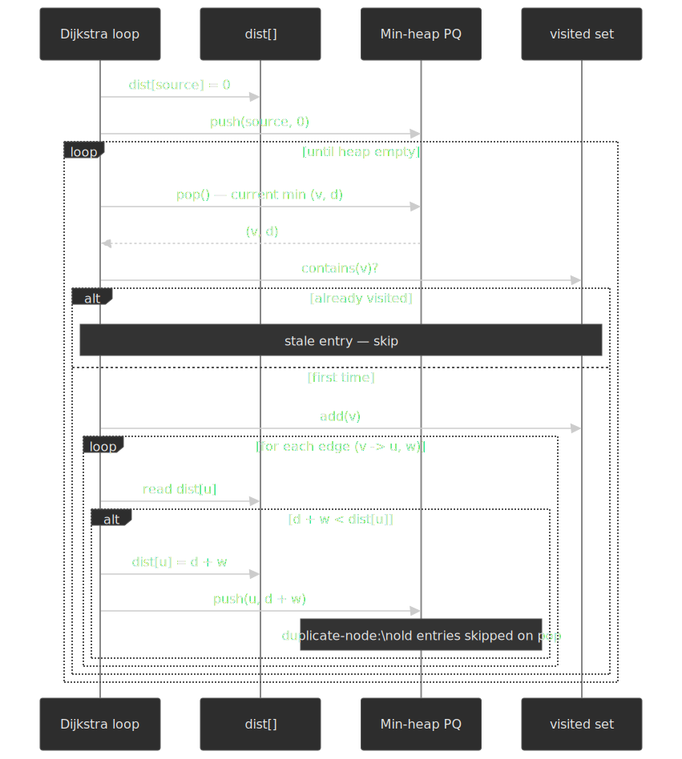

**Complexity**: O((V + E) log V) with binary heap. For dense graphs (E ≈ V²) this becomes O(V² log V); a Fibonacci heap improves it to O(E + V log V), but the constant-factor penalty is rarely worth it on real hardware[^baeldung-dijkstra].

### K-way Merge (External Sorting)

Merging k sorted streams using a heap of size k:

```ts title="K-way merge with heap" collapse={1-8}
// Merge k sorted iterators into one sorted output
// Used in external sorting, merge sort, database joins

interface StreamEntry<T> {
  value: T
  streamIndex: number
}

function* kWayMerge<T>(streams: Iterator<T>[], compare: (a: T, b: T) => number): Generator<T> {
  const heap = new MinHeap<StreamEntry<T>>((a, b) => compare(a.value, b.value))

  // Initialize heap with first element from each stream
  for (let i = 0; i < streams.length; i++) {
    const result = streams[i].next()
    if (!result.done) {
      heap.push({ value: result.value, streamIndex: i })
    }
  }

  // Extract min and refill from same stream
  while (heap.size > 0) {
    const { value, streamIndex } = heap.pop()!
    yield value

    const next = streams[streamIndex].next()
    if (!next.done) {
      heap.push({ value: next.value, streamIndex })
    }
  }
}
```


**Complexity**: O(n log k) where n is the total elements across all streams. Each of n elements enters and leaves the heap once at O(log k). This is the engine inside `heapq.merge`, external merge sort in databases, and the merge step of LSM-tree compaction. A loser-tree (tournament tree) variant cuts the per-pop comparison count from $2\log_2 k$ to $\log_2 k$ at the cost of more bookkeeping; binary heaps still dominate for moderate $k$.

### Event-Driven Simulation / Task Scheduling

Priority queues order events by timestamp, enabling efficient simulation:

```ts title="Event scheduler pattern" collapse={1-5}
// Generic event-driven simulation framework

interface Event {
  timestamp: number
  execute: () => Event[] // Returns new events to schedule
}

class EventScheduler {
  private queue = new MinHeap<Event>((a, b) => a.timestamp - b.timestamp)
  private currentTime = 0

  schedule(event: Event): void {
    if (event.timestamp < this.currentTime) {
      throw new Error("Cannot schedule event in the past")
    }
    this.queue.push(event)
  }

  run(until: number): void {
    while (this.queue.size > 0 && this.queue.peek()!.timestamp <= until) {
      const event = this.queue.pop()!
      this.currentTime = event.timestamp
      const newEvents = event.execute()
      for (const e of newEvents) {
        this.schedule(e)
      }
    }
  }
}
```

### Finding K Largest/Smallest Elements

A min-heap of size k efficiently tracks the k largest elements in a stream:

```ts title="Top-K with bounded heap" collapse={1-3}
// O(n log k) for n elements, O(k) space

function topK<T>(items: Iterable<T>, k: number, compare: (a: T, b: T) => number): T[] {
  const heap = new MinHeap<T>(compare)

  for (const item of items) {
    if (heap.size < k) {
      heap.push(item)
    } else if (compare(item, heap.peek()!) > 0) {
      heap.pop()
      heap.push(item)
    }
  }

  // Extract in sorted order
  const result: T[] = []
  while (heap.size > 0) {
    result.push(heap.pop()!)
  }
  return result.reverse()
}
```

For the k largest, use a min-heap of size k and keep only elements larger than the current minimum. The heap always contains the k largest seen so far. This is exactly how `heapq.nlargest` and `heapq.nsmallest` work internally.

## Edge Cases and Failure Modes

### Empty Heap Operations

`extractMin` and `peek` on an empty heap should be handled gracefully:

```ts title="Defensive heap operations" collapse={1-2}
// Return undefined rather than throw

peek(): T | undefined {
  return this.heap[0];  // undefined if empty
}

pop(): T | undefined {
  if (this.heap.length === 0) return undefined;
  // ... rest of implementation
}
```

### Comparison Function Pitfalls

Incorrect comparisons cause subtle bugs:

```ts title="Comparison function gotchas" collapse={1-2}
// Common mistakes in comparison functions

// WRONG: NaN comparison
const badCompare = (a: number, b: number) => a - b
// NaN - anything = NaN, which is neither < 0 nor >= 0

// WRONG: Inconsistent ordering
const unstable = (a: Obj, b: Obj) => Math.random() - 0.5
// Heap operations require transitive, antisymmetric comparison

// CORRECT: Handle edge cases
const safeCompare = (a: number, b: number) => {
  if (Number.isNaN(a)) return 1 // Push NaN to bottom
  if (Number.isNaN(b)) return -1
  return a - b
}
```

### Heap Corruption from External Mutation

If stored objects are mutated, the heap property breaks:

```ts title="Mutation corruption example" collapse={1-5}
// DO NOT mutate objects in a heap without re-heapifying

interface Task {
  priority: number
  name: string
}

const heap = new MinHeap<Task>((a, b) => a.priority - b.priority)
const task = { priority: 5, name: "important" }
heap.push(task)

// WRONG: This corrupts the heap
task.priority = 1 // Heap doesn't know about this change

// CORRECT: Remove, update, re-insert
// Or use immutable objects
// Or implement decrease-key that maintains heap invariant
```

> [!CAUTION]
> A silent heap corruption surfaces as `extractMin` returning elements out of order, sometimes thousands of operations later. The original mutation site is long gone. If you cannot guarantee immutability, defensively re-heapify (O(n)) before any read-critical extraction.

### Integer Overflow in Index Calculations

For very large heaps (>2³⁰ elements), 32-bit index arithmetic can overflow. In JavaScript, `Number` is double-precision so safe up to 2⁵³, but the bitwise shift trick `(i - 1) >> 1` truncates to int32 — guard with `Math.floor((i - 1) / 2)` for heaps that could exceed 2³¹ entries.

```ts title="Safe index calculations" collapse={1-2}
// Use Math.floor for very large heaps; bitwise shift truncates to int32

function leftChild(i: number): number {
  const result = 2 * i + 1
  if (result < i) throw new Error("Index overflow")
  return result
}
```

In practice, heaps rarely exceed millions of elements — a 4-byte integer index handles up to ~2 billion entries.

## Conclusion

Binary heaps provide the right balance of simplicity, performance, and generality for most priority-queue needs. The array representation eliminates pointer overhead and exploits cache locality. Understanding the O(n) `buildHeap` analysis and why heap sort underperforms quicksort despite better worst-case bounds illuminates the gap between theoretical and practical performance.

For graph algorithms, the duplicate-node strategy — insert new entries instead of `decreaseKey` — usually beats sophisticated heaps by avoiding position-tracking overhead. When the heap exceeds cache, consider a 4-ary heap for the cache-friendlier wider tree. Fibonacci heaps remain a textbook curiosity except for specialised applications on very large, dense graphs.

The priority-queue abstraction itself matters more than the heap variant. Standard libraries provide adequate implementations; optimise the data structure only after profiling proves it's the bottleneck.

## Appendix

### Prerequisites

- Big O notation and amortized analysis.
- Basic tree terminology (height, complete, balanced).
- Array indexing and memory layout concepts.

### Terminology

- **Heap property** — parent dominates children (min-heap: parent ≤ children, max-heap: parent ≥ children).
- **Complete binary tree** — all levels filled except possibly the last, which fills left-to-right.
- **Bubble up (sift up)** — move an element toward the root to restore the heap property.
- **Bubble down (sift down, heapify)** — move an element toward the leaves to restore the heap property.
- **Decrease-key** — update an element's priority and restore the heap property; critical for graph algorithms.
- **Amortized analysis** — average cost per operation over a sequence, allowing expensive operations if rare.
- **D-ary heap** — generalisation where each node has d children instead of 2.
- **Implicit data structure** — structure encoded in array positions rather than explicit pointers.

### Summary

- Binary heaps store complete trees in arrays; parent/child relationships come from index arithmetic.
- Insert bubbles up (O(log n)), extract bubbles down (O(log n)), peek is O(1).
- `buildHeap` runs in O(n), not O(n log n) — most nodes are cheap to heapify.
- Heap sort guarantees O(n log n) but loses to quicksort due to cache effects.
- 4-ary heaps run roughly 10-30% faster than binary heaps on out-of-cache workloads.
- Fibonacci heaps have better theoretical bounds but lose to pairing heaps and binary heaps in practice.
- For Dijkstra without explicit decrease-key, use the duplicate-node strategy with a binary heap.
- JavaScript lacks a built-in heap; Python's `heapq` is min-heap only; Go requires interface implementation; C++ ships max-heap algorithms; Java ships a min-heap class.

[^binary-heap-wiki]: [Binary heap — Wikipedia](https://en.wikipedia.org/wiki/Binary_heap). Comprehensive overview of binary heap structure and array-index relationships.

[^build-heap-stanford]: [CS 161 Lecture 4 — Stanford](https://web.stanford.edu/class/archive/cs/cs161/cs161.1168/lecture4.pdf). The bottom-up `buildHeap` O(n) proof from CLRS, with the converging $\sum h/2^h$ series.

[^fibonacci-wiki]: [Fibonacci heap — Wikipedia](https://en.wikipedia.org/wiki/Fibonacci_heap). Detailed analysis of Fibonacci heap amortized bounds.

[^fib-disadvantages]: ["What are the disadvantages of Fibonacci Heaps?" — CS Stack Exchange](https://cs.stackexchange.com/questions/128226/what-are-the-disadvantages-of-fibonacci-heaps). Summary of constant-factor and cache penalties; cross-validates against the Larkin/Sen/Tarjan paper.

[^lamarca-heaps]: A. LaMarca and R. E. Ladner, ["The Influence of Caches on the Performance of Heaps"](https://dl.acm.org/doi/10.1145/235141.235145), ACM Journal of Experimental Algorithmics, 1996. Foundational measurement of cache misses across heap fanouts; introduces aligned 4-heaps.

[^lamarca-sorting]: A. LaMarca and R. E. Ladner, ["The Influence of Caches on the Performance of Sorting"](https://www.sciencedirect.com/science/article/pii/S0196677498909853), Journal of Algorithms, 1999. Companion paper covering heap sort, merge sort, and quicksort cache behaviour.

[^d-ary-wiki]: [d-ary heap — Wikipedia](https://en.wikipedia.org/wiki/D-ary_heap). Summary of cache-performance benefits and reported speedups for d > 2.

[^heapsort-wiki]: [Heapsort — Wikipedia](https://en.wikipedia.org/wiki/Heapsort). Stability and cache-performance characteristics, plus links to bottom-up variants.

[^cpython-heapq-py]: [`Lib/heapq.py` — CPython source](https://github.com/python/cpython/blob/main/Lib/heapq.py). Comments at the top of the file describe the bottom-up `_siftup` optimization and explicitly cite Knuth, TAOCP Vol. 3, §5.2.3.

[^python-heapq-docs]: [`heapq` — Heap queue algorithm — Python documentation](https://docs.python.org/3/library/heapq.html). Documents min-heap-only behaviour, the `(priority, count, task)` tiebreaker pattern, and the lack of stability.

[^baeldung-dijkstra]: ["Time Complexity of Dijkstra's Algorithm" — Baeldung on CS](https://www.baeldung.com/cs/dijkstra-time-complexity). Side-by-side derivation of binary-heap and Fibonacci-heap variants; covers the duplicate-node strategy.

[^stasko-pairing]: J. T. Stasko and J. S. Vitter, ["Pairing Heaps: Experiments and Analysis"](http://webhotel4.ruc.dk/~keld/teaching/algoritmedesign_f04/Artikler/02/Stasko87.pdf), CACM, 1987. Earliest large experiment showing pairing heaps beat Fibonacci heaps in practice.

[^larkin-tarjan-2014]: D. H. Larkin, S. Sen, and R. E. Tarjan, ["A Back-to-Basics Empirical Study of Priority Queues"](https://arxiv.org/abs/1403.0252), ALENEX 2014. Modern replication of pairing-vs-Fibonacci experiments.

[^pairing-wiki]: [Pairing heap — Wikipedia](https://en.wikipedia.org/wiki/Pairing_heap). Survey of pairing-heap experiments, including Larkin-Sen-Tarjan.

[^cpp-priority-queue]: [`std::priority_queue` — cppreference](https://en.cppreference.com/w/cpp/container/priority_queue). Specifies the binary-heap algorithms (`make_heap`/`push_heap`/`pop_heap`) underneath the adaptor.

[^dolthub-go-heaps]: ["Why Are Golang Heaps So Complicated?" — DoltHub](https://www.dolthub.com/blog/2023-12-01-why-are-go-heaps-confusing/). Walkthrough of `container/heap`'s pre-generics interface design.

[^leftist-cmu]: ["15-210 Lecture 27 — Priority Queues and Leftist Heaps"](https://www.cs.cmu.edu/afs/cs/academic/class/15210-f12/www/lectures/lecture27.pdf), Carnegie Mellon. Proves the $O(\log(|A| + |B|))$ work bound for leftist-heap `meld`.

[^brodal-wiki]: [Brodal queue — Wikipedia](https://en.wikipedia.org/wiki/Brodal_queue). Summary of the worst-case bounds achieved by Brodal (1996) and Brodal–Okasaki (1996).

[^brodal-overview]: G. S. Brodal, ["Worst-case efficient priority queues"](https://users-cs.au.dk/gerth/papers/soda96.pdf), SODA 1996. Original construction with worst-case $O(1)$ insert / find-min / meld / decrease-key.

[^sanders-fast-pq]: P. Sanders, ["Fast Priority Queues for Cached Memory"](https://ae.iti.kit.edu/documents/people/sanders/papers/spqjea.pdf), ACM JEA, 1999. Shows aligned 4-ary and sequence heaps running >$2\times$ faster than binary heaps in cache hierarchies.
