# HTTP/3 and QUIC: Transport Layer Revolution

HTTP/3 is the same HTTP semantics layered on a different transport. The interesting story is that transport: [QUIC](https://www.rfc-editor.org/rfc/rfc9000.html) is a UDP-based, user-space protocol with [TLS 1.3](https://www.rfc-editor.org/rfc/rfc8446.html) bolted directly into the handshake, per-stream loss recovery so a dropped packet on one request stops only that request, and connection identifiers that survive a network change. This article walks the mechanism end-to-end: why TCP's design forced the change, how QUIC's encryption levels work, what 0-RTT actually costs you, how QPACK avoids re-introducing head-of-line blocking, and how browsers discover h3 in production.


## Mental model

The smallest set of facts that lets the rest of the article click:

- **QUIC = UDP datagrams + TLS 1.3 + per-stream byte streams.** The transport runs in user space, the TLS handshake is folded into the QUIC handshake, and every stream has its own retransmission state.
- **Stream independence.** Loss on stream A does not stop streams B and C. This is the property HTTP/2-over-TCP cannot provide because TCP delivers a single ordered byte stream to the socket consumer.[^hol-rfc9000]
- **Connection IDs, not 4-tuples.** A QUIC connection is identified by short opaque IDs the endpoints chose, so a client can switch from WiFi to cellular and keep the same encrypted session.[^cid]
- **Encryption is the API contract.** Header bits, packet numbers, and frames are all encrypted. Only the long-header version field, the connection IDs, and the packet-type bits are visible to middleboxes — and they're designed to be unreliable so middleboxes don't ossify on them.[^manageability]
- **1-RTT new connections, 0-RTT resumption.** TLS 1.3's handshake messages travel inside QUIC's own handshake, cutting setup to one round trip; resumption can ship request bytes alongside the ClientHello at the cost of replay risk.[^rfc9001-99]

[^hol-rfc9000]: [RFC 9000 §2.2 — Sending and Receiving Data](https://www.rfc-editor.org/rfc/rfc9000.html#section-2.2): "QUIC ensures that lost STREAM data is retransmitted independently per stream so that a packet loss does not block the progress of other streams." See also Salesforce's measurement-driven write-up: [The full picture on HTTP/2 and HOL blocking](https://engineering.salesforce.com/the-full-picture-on-http-2-and-hol-blocking-7f964b34d205/).
[^cid]: [RFC 9000 §5.1 — Connection ID](https://www.rfc-editor.org/rfc/rfc9000.html#section-5.1).
[^manageability]: [draft-ietf-quic-manageability — Manageability of the QUIC Transport Protocol](https://quicwg.org/ops-drafts/draft-ietf-quic-manageability.html); RFC 9001 §5 on header protection.
[^rfc9001-99]: [RFC 9001 §9.2 — Replay Attacks with 0-RTT](https://www.rfc-editor.org/rfc/rfc9001.html#section-9.2).

## Why QUIC exists: TCP's structural limits

Three constraints made QUIC inevitable. Each is fixable in isolation; together they argued for a clean transport.

### TCP-level head-of-line blocking

HTTP/2 multiplexes many request streams onto one TCP connection. TCP only knows about a single ordered byte stream. When a segment carrying part of stream A is lost, the kernel will not deliver any later bytes — including bytes belonging to streams B and C — until A's gap is filled.

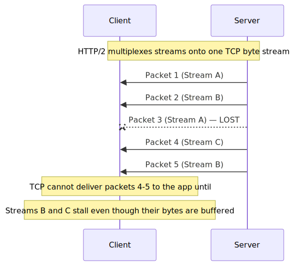
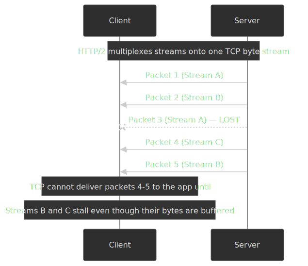

The practical effect is that as packet loss climbs, HTTP/2 over a single TCP connection can fall behind HTTP/1.1 with multiple parallel connections, because in the HTTP/1.1 case loss on one connection does not stall the others. Salesforce's measurements walk through the regimes where each one wins.[^hol-rfc9000]

QUIC fixes this by giving each stream its own retransmission state and reassembly buffer. Loss on stream A is recovered by retransmitting on stream A; streams B and C continue to advance at the application layer.


### TCP ossification

TCP succeeded so completely that middleboxes — firewalls, NATs, load balancers, carrier-grade NATs — make routing and policy decisions based on specific values in TCP headers. New TCP options or unfamiliar header layouts get dropped, blackholed, or rewritten.

The canonical example is [TCP Fast Open (RFC 7413)](https://datatracker.ietf.org/doc/html/rfc7413): it lets a client ship payload alongside the SYN, in principle saving an RTT. In practice, measurements found that a meaningful fraction of paths drop SYNs that carry data or unknown options, which forced clients to time out and retry without TFO.[^tfo]

[^tfo]: [Paasch et al., 2015 — TCP Fast Open: initial measurements (CoNEXT)](http://www.it.uc3m.es/amandala/conext2015.pdf): "Only 41.3 % of the paths supported TFO end-to-end."

QUIC sidesteps this by living on UDP, which middleboxes have been forwarding since [RFC 768 (1980)](https://www.rfc-editor.org/rfc/rfc768.html), and by encrypting almost everything else.

### Kernel-space ceiling

TCP lives in the kernel. Improving congestion control or loss detection means an OS upgrade and a slow ramp through device fleets. Kernel-space implementations also diverge across platforms, which makes uniform behavior at scale difficult.

QUIC ships in the application — typically inside the browser or the server binary — so a Cloudflare or Chrome team can roll out a new congestion controller, a new probing strategy, or a CVE patch on its own release cadence.[^quiche]

[^quiche]: Cloudflare's open-source QUIC stack [`quiche`](https://github.com/cloudflare/quiche) and Google's Chromium QUIC stack are both user-space libraries shipped inside browser/server binaries.

## QUIC architecture

### Packet and frame structure

QUIC nests three units inside a single UDP datagram, defined in [RFC 9000 §12](https://www.rfc-editor.org/rfc/rfc9000.html#section-12) and §17–§19:

1. **UDP datagram** — the IP-level unit a middlebox sees. May carry one or more coalesced QUIC packets.
2. **QUIC packet** — has either a *long header* (Initial, 0-RTT, Handshake, Retry, Version Negotiation) or a *short header* (1-RTT). Long headers carry version + DCID + SCID; short headers carry only the DCID, since both peers already agreed on a CID set.
3. **Frame** — the unit of meaning inside the AEAD-encrypted payload. Every frame starts with a variable-length type byte; the rest depends on the type.


The frame zoo is small but load-bearing — most production behavior comes from a handful of types:

| Frame                          | Purpose                                                                                          |
| ------------------------------ | ------------------------------------------------------------------------------------------------ |
| `STREAM` (0x08–0x0f)           | Application bytes for a single stream; offset + length encode position in the per-stream space.  |
| `ACK` (0x02 / 0x03)            | Cumulative + ranged acknowledgments; type 0x03 carries ECN counts (see below).                   |
| `CRYPTO` (0x06)                | TLS 1.3 handshake records; carried at Initial / Handshake / 1-RTT levels (never in 0-RTT).       |
| `PATH_CHALLENGE` / `PATH_RESPONSE` (0x1a / 0x1b) | 8-byte echo used to validate a candidate path before migration completes.    |
| `NEW_CONNECTION_ID` / `RETIRE_CONNECTION_ID` (0x18 / 0x19) | Issue and retire CIDs so peers always have a fresh ID for migration.   |
| `MAX_DATA` / `MAX_STREAM_DATA` / `MAX_STREAMS` (0x10–0x13) | Connection- and stream-level flow-control credit.                       |
| `CONNECTION_CLOSE` (0x1c / 0x1d) | Transport-level (0x1c) or application-level (0x1d) termination with an error code.            |

Two structural consequences flow from this layout:

- **Frames are not packets.** The transport never retransmits a packet; it retransmits the *frames* that were inside a lost packet, which is what makes per-stream loss recovery possible.[^rfc9002-loss]
- **Datagram coalescing is allowed.** A single UDP datagram may pack an Initial, a Handshake, and a 1-RTT packet so the OS only pays one syscall and one IP/UDP header overhead per send. [RFC 9000 §12.2](https://www.rfc-editor.org/rfc/rfc9000.html#section-12.2) constrains the order: Initial first, then 0-RTT, then Handshake, then 1-RTT.

[^rfc9002-loss]: [RFC 9002 §6 — Loss Detection](https://www.rfc-editor.org/rfc/rfc9002.html#section-6): "QUIC senders use both ack-eliciting frames in lost packets and timer-based loss detection."

### Wire image and what middleboxes see

QUIC packets carry a small unencrypted prefix and a fully encrypted body. Per [RFC 9001 §5 (Packet Protection)](https://www.rfc-editor.org/rfc/rfc9001.html#section-5), only a tiny invariant set is intelligible to anything between the endpoints.

| Field                     | Visibility                                       | Purpose                                                            |
| ------------------------- | ------------------------------------------------ | ------------------------------------------------------------------ |
| Version (long header)     | Cleartext                                        | Version negotiation; clients must tolerate unknown versions.       |
| Destination Connection ID | Cleartext                                        | Routing the datagram to the right server-side QUIC connection.    |
| Source Connection ID      | Cleartext (long header only)                     | Letting the peer address the new connection.                       |
| Packet number             | Header-protected (encrypted with derived key)    | Reordering and replay protection.                                  |
| All frames in payload     | AEAD-encrypted                                   | Application data, ACKs, flow control, stream metadata, everything. |

The deliberate consequence: middleboxes cannot reliably read packet numbers, ACK frames, or stream IDs, so they cannot make policy decisions on them. The price is that load balancers and DDoS scrubbers need explicit support to read the connection ID for routing.[^manageability]

> [!IMPORTANT]
> The Initial-packet keys are derived with HKDF from the Destination Connection ID and a version-specific salt — values anyone on the path can see. Initial packets are encrypted but **not confidential**: any observer who knows the salt can decrypt them. The protection they offer is integrity and reorder/loss detection, not secrecy.[^rfc9001-52]

[^rfc9001-52]: [RFC 9001 §5.2 — Initial Secrets](https://www.rfc-editor.org/rfc/rfc9001.html#section-5.2): the salt is fixed per QUIC version; the initial secret is derived as `HKDF-Extract(initial_salt, client_dst_connection_id)`.

### Connection IDs and migration

A TCP connection is named by the 4-tuple `(src IP, src port, dst IP, dst port)`. Any change — NAT rebinding, switching to cellular, IPv6 temporary address rotation — kills it. QUIC names connections by opaque connection IDs the endpoints chose, so the same logical connection can survive 4-tuple changes.[^cid]

When a peer first sees datagrams arrive from a new address, it does not blindly trust the new path. It runs a [path validation](https://www.rfc-editor.org/rfc/rfc9000.html#section-8.2):

1. Send a `PATH_CHALLENGE` containing 8 random bytes on the candidate path.
2. The peer echoes the same 8 bytes in a `PATH_RESPONSE`.
3. A matching response confirms the peer can both receive and transmit on that path; the round-trip also seeds RTT estimation for it.

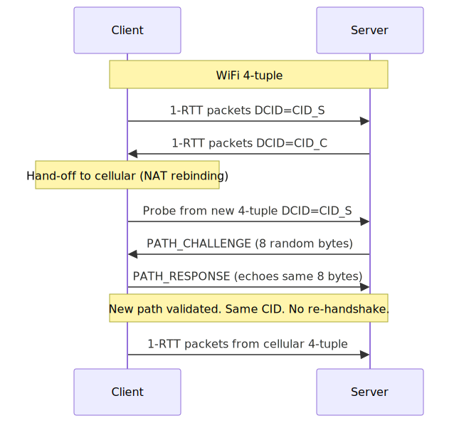
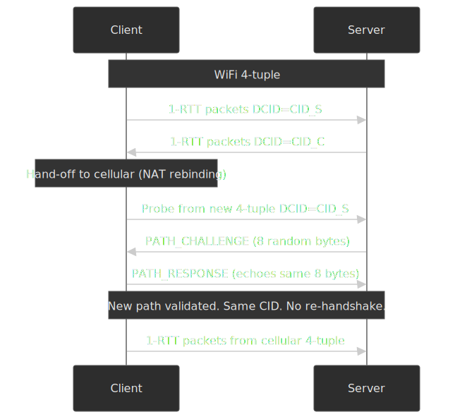

> [!WARNING]
> Connection IDs are observable on the wire, so a stable CID is a tracking surface. RFC 9000 §5.1 requires that "the connection ID MUST NOT contain any information that can be used by an external observer (that is, one that does not cooperate with the issuer) to correlate it with other connection IDs for the same connection." Endpoints rotate to new CIDs (issued via `NEW_CONNECTION_ID`) when migrating to a new path.

**Where migration works:**

- NAT rebinding (port or external IP change behind the same client interface).
- WiFi → cellular hand-offs and the reverse.
- IPv6 temporary address expiration ([RFC 8981](https://datatracker.ietf.org/doc/html/rfc8981)).

**Where it doesn't:**

- Server-initiated migration is not in [RFC 9000](https://www.rfc-editor.org/rfc/rfc9000.html).
- Zero-length CIDs make migration impossible (no demultiplexing key on the new path).
- Anycast or ECMP routing without QUIC-aware load balancing — the post-migration packets may land on a server that doesn't hold the connection state.[^lb]

[^lb]: See [RFC 9000 §5.1.1](https://www.rfc-editor.org/rfc/rfc9000.html#section-5.1.1) and the [QUIC-LB draft](https://datatracker.ietf.org/doc/draft-ietf-quic-load-balancers/) for how load balancers route by encoding routing hints into CIDs.

### Streams and stream IDs

Every QUIC stream maintains its own flow control window, retransmission buffer, and ordering state. Per [RFC 9000 §2.1](https://www.rfc-editor.org/rfc/rfc9000.html#section-2.1), the low two bits of the 62-bit stream ID encode the stream's category:

| Bits | Type                            | Stream IDs            | Used by HTTP/3 for                            |
| :--: | ------------------------------- | --------------------- | --------------------------------------------- |
| `00` | Client-initiated, bidirectional | 0, 4, 8, 12, …        | Request streams (HTTP request + response).    |
| `01` | Server-initiated, bidirectional | 1, 5, 9, 13, …        | Unused in HTTP/3.                             |
| `10` | Client-initiated, unidirectional | 2, 6, 10, 14, …      | Client control, QPACK encoder, QPACK decoder. |
| `11` | Server-initiated, unidirectional | 3, 7, 11, 15, …       | Server control, QPACK encoder, QPACK decoder, server push. |

HTTP/3 then layers its own per-stream type byte on every unidirectional stream — `0x00` for the control stream, `0x02` for the QPACK encoder stream, `0x03` for the QPACK decoder stream — per [RFC 9114 §6.2](https://www.rfc-editor.org/rfc/rfc9114.html#section-6.2). [RFC 9114](https://www.rfc-editor.org/rfc/rfc9114.html) recommends (SHOULD, not MUST) that endpoints permit at least 100 concurrent client-initiated bidirectional streams to avoid throttling normal page loads.

## TLS 1.3 inside the QUIC handshake

### Why fusion matters

Traditional HTTPS pays for two handshakes in sequence: TCP's three-way handshake, then TLS's. QUIC carries TLS 1.3 records as `CRYPTO` frames inside its own packets, so the transport handshake and the cryptographic handshake share round trips.

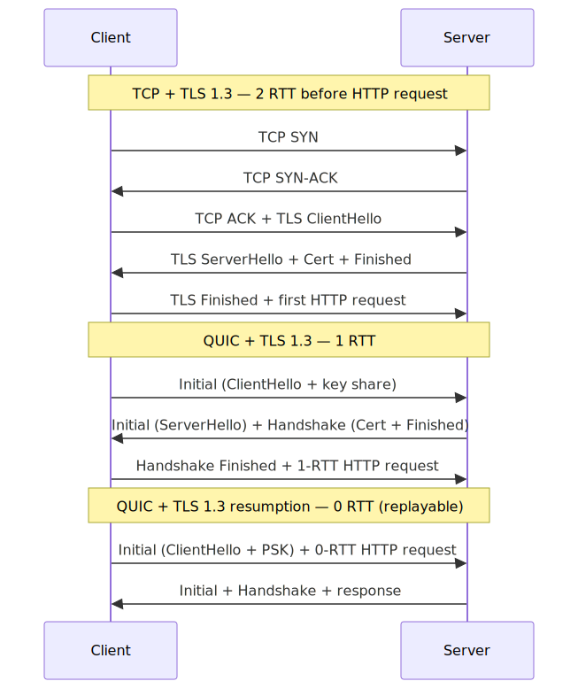
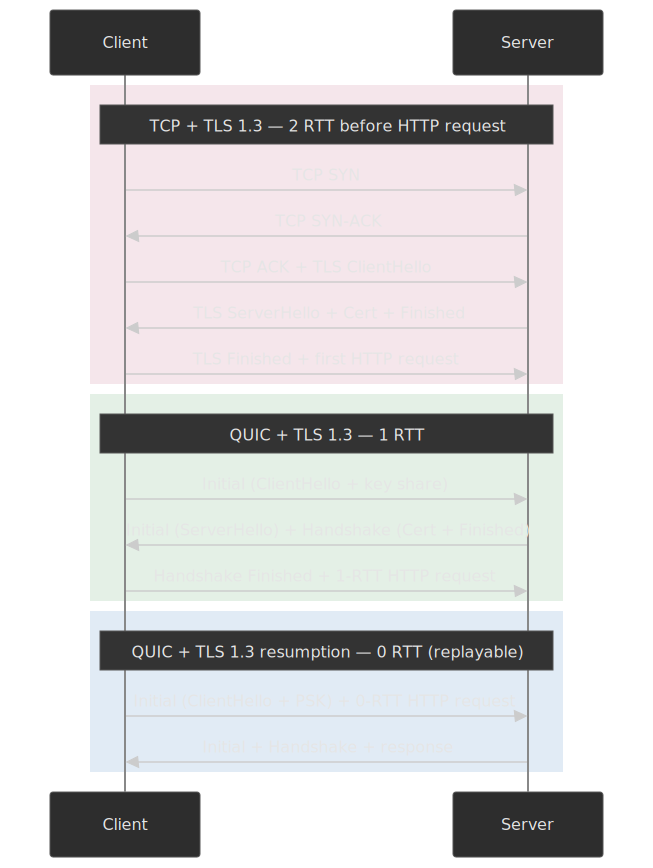

| Stack          | New connection | Resumption                |
| -------------- | -------------- | ------------------------- |
| TCP + TLS 1.2  | 3 RTT          | 2 RTT                     |
| TCP + TLS 1.3  | 2 RTT          | 1 RTT (0-RTT data possible) |
| QUIC + TLS 1.3 | 1 RTT          | 0 RTT (early data)        |

### Encryption levels

QUIC uses four encryption levels with distinct keys, defined in [RFC 9001 §4](https://www.rfc-editor.org/rfc/rfc9001.html#section-4):

1. **Initial.** Keys derived from the public DCID + version salt. Provides integrity for the first ClientHello / ServerHello exchange. Anyone on the path can decrypt.
2. **0-RTT.** Keys derived from a Pre-Shared Key cached from a prior session. Lets the client send application data immediately on resumption — but the server cannot prove the data wasn't replayed.
3. **Handshake.** Keys derived from the ECDHE shared secret established during the Initial exchange. Used to finish authenticating the server and complete the handshake.
4. **1-RTT (Application).** Keys derived from the same ECDHE-rooted secret. Carries all post-handshake application data.


### 0-RTT: speed for replay risk

0-RTT lets a returning client ship request bytes alongside the ClientHello. The server processes them before the handshake completes. The trade-off is unavoidable and is called out plainly in [RFC 9001 §9.2](https://www.rfc-editor.org/rfc/rfc9001.html#section-9.2):

> "Use of TLS early data comes with an exposure to replay attack. The use of 0-RTT in QUIC is similarly vulnerable to replay attack."

QUIC's own frame machinery is idempotent under replay; the replay risk is whatever the application protocol adds on top. RFC 9001 is explicit that "the responsibility for managing the risks of replay attacks with 0-RTT lies with an application protocol." The replay attack is straightforward:

1. Client sends 0-RTT request: "transfer $100 to Alice".
2. An on-path attacker captures the encrypted UDP datagram.
3. Attacker re-sends the same datagram to the server.
4. The server, in the absence of application-level deduplication, processes the request twice.

[RFC 8470](https://datatracker.ietf.org/doc/html/rfc8470) gives HTTP a way to negotiate this: an intermediary that forwards a request received as early data adds an `Early-Data: 1` header, and the origin can refuse with `425 Too Early` (and a `Retry-After`) if the request isn't safe to process speculatively.

```javascript title="zero-rtt-policy.js" collapse={1-5, 25-35}
class ZeroRTTPolicy {
  allowedMethods = ["GET", "HEAD", "OPTIONS"]
  replayWindow = 60_000

  validate(request) {
    if (!this.allowedMethods.includes(request.method)) {
      return { allowed: false, reason: "Non-idempotent method in 0-RTT" }
    }

    if (request.headers["early-data"] === "1") {
      // Intermediary forwarded this as early data; decide carefully.
    }

    if (request.idempotencyKey) {
      const cached = this.replayCache.get(request.idempotencyKey)
      if (cached) return { allowed: false, reason: "Replay detected", cachedResponse: cached }
    }

    return { allowed: true }
  }
}

const handleEarlyData = (req, res) => {
  if (req.headers["early-data"] === "1" && !isIdempotent(req)) {
    res.status(425).set("Retry-After", "0").send("Too Early")
    return
  }
  // Process request normally
}
```

Production policies follow the same shape:

- Cloudflare enables 0-RTT only for `GET`, `HEAD`, and `OPTIONS`, and its default-on configuration restricts it further to `GET` requests without query parameters; everything else is forced to wait for the full handshake.[^cf-0rtt-1] [^cf-0rtt-2]
- Most CDNs default to disabling 0-RTT for `POST`/`PUT`/`DELETE` regardless of payload.
- Financial and payments APIs require an idempotency key on every state-changing request, so even if 0-RTT replays slip through they're absorbed by the idempotency cache.

[^cf-0rtt-1]: [Cloudflare — Introducing Zero Round Trip Time Resumption (0-RTT)](https://blog.cloudflare.com/introducing-0-rtt/): "We have decided … to allow 0-RTT for GET requests with no query parameters."
[^cf-0rtt-2]: [Cloudflare Speed docs — 0-RTT Connection Resumption](https://developers.cloudflare.com/speed/optimization/protocol/0-rtt-connection-resumption/).

> [!CAUTION]
> 0-RTT data lacks forward secrecy. The early-data keys derive from the cached PSK, not from a fresh (EC)DHE exchange — RFC 9001 §4.1 spells out that "PSK is the basis for Early Data (0-RTT); the latter provides forward secrecy (FS) when the (EC)DHE keys are destroyed." If an attacker later compromises the PSK, every captured 0-RTT datagram becomes decryptable. 1-RTT data (everything after the handshake) keeps forward secrecy because its keys are rooted in the ECDHE exchange. See also [RFC 8446 §2.3](https://www.rfc-editor.org/rfc/rfc8446.html#section-2.3) on 0-RTT semantics.

## Loss detection, congestion control, and ECN

QUIC's reliability machinery lives in [RFC 9002](https://www.rfc-editor.org/rfc/rfc9002.html). It borrows TCP's vocabulary — RTT, RTO, congestion window, slow start — but the implementation is materially different in three ways.

### Per-packet-number space, monotonic, encrypted ACKs

QUIC has three packet number spaces (Initial, Handshake, Application) and a single packet number is never reused inside a space. That's a deliberate departure from TCP's sequence-number-as-byte-offset design and it removes TCP's classic "retransmission ambiguity": the sender always knows whether an ACK refers to the original transmission or a retransmission, because each transmission gets a fresh, strictly increasing packet number.[^rfc9002-pn] The result is a much cleaner RTT estimator, especially under loss.

[^rfc9002-pn]: [RFC 9002 §3 — Design of the QUIC Transmission Machinery](https://www.rfc-editor.org/rfc/rfc9002.html#section-3): "QUIC packet numbers are strictly increasing within a packet number space and directly encode transmission order."

### Loss detection

QUIC declares a packet lost using two complementary signals defined in [RFC 9002 §6](https://www.rfc-editor.org/rfc/rfc9002.html#section-6):

- **Packet threshold.** An unacknowledged packet is lost once a packet sent later by `kPacketThreshold` (3 by default) is acknowledged.
- **Time threshold.** An unacknowledged packet is lost once it has been outstanding longer than `max(kTimeThreshold * max(SRTT, latest_rtt), kGranularity)`.

When the sender has nothing else to send and the loss timer has not fired, it arms a **Probe Timeout (PTO)** that triggers retransmission of probe packets to elicit an ACK. PTO replaces TCP's RTO and avoids the legacy "double-on-timeout" backoff penalty for the common case.

### Congestion control

QUIC does not mandate a specific algorithm; [RFC 9002 §7](https://www.rfc-editor.org/rfc/rfc9002.html#section-7) specifies a NewReno-style algorithm as the default, and implementations are free to swap in CUBIC, BBRv2, or research variants. Because the stack runs in user space, that swap is a library upgrade, not a kernel rebuild — Cloudflare, Google, and Meta have all shipped non-NewReno controllers in production.[^cc-bbr]

[^cc-bbr]: Google's BBR work is documented in the [BBRv2 IETF drafts](https://datatracker.ietf.org/doc/draft-cardwell-iccrg-bbr-congestion-control/); Cloudflare describes its `quiche` congestion-control plumbing in [The road to QUIC](https://blog.cloudflare.com/the-road-to-quic/).

### ECN: signalling congestion without dropping packets

Explicit Congestion Notification ([RFC 3168](https://datatracker.ietf.org/doc/html/rfc3168), wired into QUIC by [RFC 9000 §13.4](https://www.rfc-editor.org/rfc/rfc9000.html#section-13.4)) lets routers signal congestion by *flipping two bits in the IP header* instead of dropping a packet. The sender marks outgoing packets with `ECT(0)` or `ECT(1)`; a congested router can rewrite those bits to `CE` ("Congestion Experienced") rather than dropping; the receiver counts CE marks and feeds them back in the ECN-aware ACK frame (type `0x03`).

QUIC carries three counters in every ECN-bearing ACK — `ECT(0)`, `ECT(1)`, and `ECN-CE` — per packet number space. The sender treats CE-marked acknowledgments as a congestion signal equivalent to loss, but without paying the retransmission cost.

> [!IMPORTANT]
> Faulty middleboxes still rewrite or zero the ECN field. RFC 9000 §13.4.2 requires endpoints to **validate** ECN per path: send ECT-marked probes, watch for the corresponding ECN counts in returning ACKs, and disable ECN on that path if the counts are missing or implausible. Validation runs at connection start and again after every successful migration to a new path.

The combination — strictly increasing packet numbers, encrypted ACKs that include CE counts, and per-path validation — is what makes ECN deployable on QUIC where it has been hard to deploy reliably on TCP for two decades.

## QPACK: header compression for out-of-order delivery

### Why HPACK doesn't transplant

HTTP/2's [HPACK (RFC 7541)](https://www.rfc-editor.org/rfc/rfc7541) compresses headers by referencing a dynamic table that both peers maintain in lock-step. The dynamic table grows when an encoder inserts a new header; subsequent header blocks reference that entry by index. This works only because TCP gives the decoder a single ordered stream.

[RFC 9204 §1](https://www.rfc-editor.org/rfc/rfc9204.html#section-1) calls this out:

> "If HPACK were used for HTTP/3, it would induce head-of-line blocking due to built-in assumptions of a total ordering across frames on all streams."

### How QPACK localizes the blocking

QPACK splits the dynamic-table updates onto two dedicated unidirectional QUIC streams:

| Stream         | Direction         | Purpose                                                       |
| -------------- | ----------------- | ------------------------------------------------------------- |
| Encoder (0x02) | Encoder → Decoder | Insertion instructions for the dynamic table.                  |
| Decoder (0x03) | Decoder → Encoder | Section / insert acknowledgments and stream cancellations.    |

Each header block carries a `Required Insert Count` — the smallest dynamic-table state the decoder needs to decode it. If the decoder hasn't yet processed enough encoder-stream insertions to reach that count, **only that one request stream blocks**, not every stream sharing the connection.

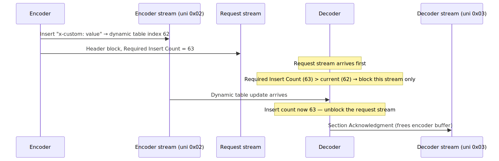
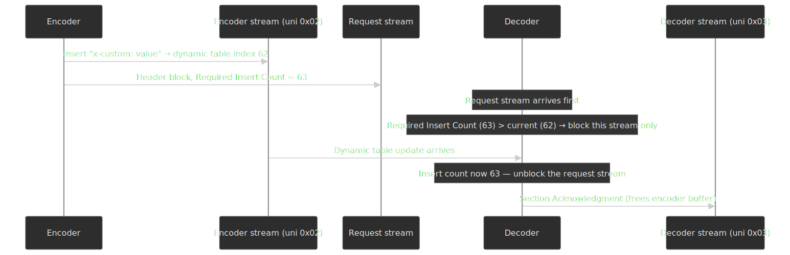

Implementations tune `SETTINGS_QPACK_BLOCKED_STREAMS` (number of streams the decoder is willing to leave blocked) and `SETTINGS_QPACK_MAX_TABLE_CAPACITY` to trade compression density against blocking risk.[^qpack-settings]

[^qpack-settings]: [RFC 9204 §5 — Configuration](https://www.rfc-editor.org/rfc/rfc9204.html#section-5).

### Static table differences

| Property                  | HPACK (RFC 7541) | QPACK (RFC 9204) |
| ------------------------- | ---------------- | ---------------- |
| Static table size         | 61 entries       | 99 entries       |
| Static table indexing     | 1-based (1…61)   | 0-based (0…98)   |
| `:authority` static index | 1                | 0                |

QPACK's larger static table reduces dynamic-table pressure for headers that are common in HTTP/3 deployments (e.g. `alt-svc`, `early-data`, `content-security-policy`, `strict-transport-security`).

## Protocol discovery and negotiation

### DNS HTTPS records (RFC 9460)

Discovery via DNS lets a client know an origin supports HTTP/3 *before* opening any connection. The `HTTPS` resource record (RR type 65, defined in [RFC 9460](https://www.rfc-editor.org/rfc/rfc9460.html)) advertises ALPN, ports, IP hints, and ECH config at the apex of the zone.

```dns title="example.com zone"
example.com. 3600 IN HTTPS 1 . alpn="h3,h2" port=443
example.com. 3600 IN HTTPS 1 . alpn="h3,h2" ipv4hint=192.0.2.1 ipv6hint=2001:db8::1
example.com. 3600 IN HTTPS 1 . alpn="h3,h2" ech="..."
```

| SvcParam              | Purpose                                            |
| --------------------- | -------------------------------------------------- |
| `alpn`                | Supported application protocols (e.g. `h3`, `h2`, `http/1.1`). |
| `port`                | Alternative port (default 443).                    |
| `ipv4hint` / `ipv6hint` | IP hints to skip an A/AAAA lookup.               |
| `ech`                 | Encrypted Client Hello config (encrypts the SNI in the TLS handshake). |
| `no-default-alpn`     | Disable implicit ALPN derived from the scheme.     |

Why HTTPS records matter:

1. **Pre-connection signal.** A client knows about h3 before it spends any RTT opening TCP.
2. **Apex support.** Unlike `CNAME`, `HTTPS` records are valid at the zone apex.
3. **ECH integration.** Encrypted SNI requires the server's ECH config to be distributed in DNS.

### Alt-Svc header (fallback discovery)

When no DNS hint exists, servers advertise alternative endpoints via the `Alt-Svc` HTTP header (originally [RFC 7838](https://datatracker.ietf.org/doc/html/rfc7838), updated by HTTP/3-aware drafts):

```http
HTTP/2 200 OK
Alt-Svc: h3=":443"; ma=86400, h3-29=":443"; ma=86400
```

| Field      | Meaning                                       |
| ---------- | --------------------------------------------- |
| `h3`       | HTTP/3 over QUIC v1 ([RFC 9114](https://www.rfc-editor.org/rfc/rfc9114.html)). |
| `h3-29`    | HTTP/3 draft-29 (legacy interop).             |
| `:443`     | Same-origin port.                             |
| `ma=86400` | Cache the alt-svc entry for 24 hours.         |


### Browser protocol selection

Browsers race QUIC and TCP+TLS, prefer QUIC when both succeed within a small window, and remember failed h3 endpoints to avoid penalising the next request.


The race matters because UDP is occasionally rate-limited, blocked, or simply slow on enterprise paths. Falling back to TCP+TLS without a user-visible delay is what makes h3 deployable on the open internet.

## Middlebox interference and ossification

### Why UDP, not a brand-new IP protocol

QUIC runs on UDP because deploying a new IP-level protocol on today's internet is essentially impossible.

- **SCTP ([RFC 4960](https://datatracker.ietf.org/doc/html/rfc4960), 2007).** Designed as a better TCP, but blocked by enough middleboxes that it never reached general internet deployment.
- **DCCP ([RFC 4340](https://datatracker.ietf.org/doc/html/rfc4340), 2006).** Same outcome.
- **Unknown IP protocol numbers.** Default-deny firewall behavior drops them.

UDP has been forwarded by middleboxes since 1980, so a protocol that nests inside UDP datagrams gets the deployability of UDP and supplies its own reliability, ordering, and congestion control above it.

### Encryption as anti-ossification

QUIC encrypts everything that a middlebox might otherwise inspect and accidentally encode into routing or filtering rules. Header protection covers the packet number; AEAD covers the entire frame payload. The only fields that remain in the clear are the ones an endpoint *needs* a middlebox to read (version, CID, packet-type bits) — and even those are designed to be unreliable signals so middleboxes don't ossify on them.[^manageability]

### GREASE and version negotiation

[RFC 9287 — Greasing the QUIC Bit](https://www.rfc-editor.org/rfc/rfc9287) formalises a GREASE-style mechanism for the so-called "fixed bit" in the first byte of every QUIC packet. The bit was originally fixed to `1` so middleboxes could distinguish QUIC traffic from other UDP payloads; predictably, vendors started relying on the value, which is exactly the ossification QUIC was built to avoid. RFC 9287 lets endpoints negotiate the ability to send arbitrary values for that bit so middlebox vendors can no longer assume it.

[RFC 9369 — QUIC Version 2](https://www.rfc-editor.org/rfc/rfc9369.html) is wire-image-different from QUIC v1 only in its version number, packet-type bits, and Initial-secret salt; the protocol itself is unchanged. Its sole purpose is to keep the version-negotiation path warm, so middleboxes that ossified on v1's exact bit patterns don't survive into the next decade. Adoption is still small, but the existence of a second version on the wire is the deterrent that matters.

> [!NOTE]
> Greasing only works if endpoints actually deploy it. Measurement work shows that adoption of optional QUIC features (the spin bit is a frequently studied proxy) is uneven across operators and skewed toward smaller providers. Treat the existence of an RFC as the start of the deployment curve, not the end.[^spin]

[^spin]: [Yang & Bauer, 2023 — Does It Spin? On the Adoption and Use of QUIC's Spin Bit](https://arxiv.org/pdf/2310.02599): the spin bit is implemented by ~10% of QUIC-supporting domains, with adoption skewed away from hypergiants.

### State censorship and DPI

QUIC's wire-level encryption does not hide the SNI inside the ClientHello, and Initial-packet keys are derivable from the public DCID. A motivated censor can therefore decrypt the ClientHello and apply SNI-based filtering. The Great Firewall of China is the documented case study: SNI-based QUIC blocking has been observed since 2024-04-07, with the censor deriving Initial keys from the DCID, parsing the ClientHello, and dropping subsequent UDP packets to the same 3-tuple if the SNI matches a blocklist.[^gfw-quic]

[^gfw-quic]: [Zohaib et al., USENIX Security 2025 — Exposing and Circumventing SNI-based QUIC Censorship of the Great Firewall of China](https://www.usenix.org/system/files/usenixsecurity25-zohaib.pdf).

The fix is [Encrypted Client Hello (ECH)](https://datatracker.ietf.org/doc/draft-ietf-tls-esni/), which encrypts the inner ClientHello (including the SNI) under a key distributed via the same DNS HTTPS records described above. ECH is the long-term answer; until it's universal, "QUIC encrypts everything" overstates the privacy properties of the Initial flight.

## Server support and configuration

### Support matrix (2026-Q2)

| Server          | HTTP/3 status                                                                                                  |
| --------------- | -------------------------------------------------------------------------------------------------------------- |
| nginx           | Built into the mainline branch since 1.25.0 (May 2023); `--with-http_v3_module` plus `listen 443 quic`.[^nginx] |
| Caddy           | HTTP/3 enabled by default; automatic certificate management.                                                   |
| HAProxy         | Experimental QUIC in 2.6 (2022); refined and made production-friendly across 2.7 and 2.8.[^haproxy]            |
| Envoy           | Downstream HTTP/3 production-ready; upstream still alpha.[^envoy]                                              |
| Apache HTTPD    | No first-party HTTP/3 module as of 2026-Q2; deployments terminate h3 in front (CDN, nginx, Caddy).[^apache]    |

[^nginx]: [nginx — Support for QUIC and HTTP/3](https://nginx.org/en/docs/quic.html).
[^haproxy]: [HAProxy 2.6 announcement — experimental HTTP/3 over QUIC](https://www.haproxy.com/blog/announcing-haproxy-2-6).
[^envoy]: [Envoy docs — HTTP/3 overview](https://www.envoyproxy.io/docs/envoy/latest/intro/arch_overview/http/http3): "Downstream HTTP/3 support is ready for production use … Upstream HTTP/3 support is alpha."
[^apache]: [HTTP Toolkit — HTTP/3 is everywhere but nowhere](https://httptoolkit.com/blog/http3-quic-open-source-support-nowhere/) summarises the gap; the Apache HTTPD project has not shipped a `mod_http3`.

### nginx configuration

```nginx title="nginx.conf" collapse={1-3, 22-26}
http {
    server {
        listen 443 ssl;
        listen 443 quic reuseport;

        http2 on;
        http3 on;

        ssl_certificate     /etc/ssl/cert.pem;
        ssl_certificate_key /etc/ssl/key.pem;

        add_header Alt-Svc 'h3=":443"; ma=86400';

        ssl_early_data on;
        quic_retry on;

        location / {
            # ... location config ...
        }
    }
}
```

Knobs that earn their keep:

- `listen 443 quic reuseport` — bind UDP/443 with `SO_REUSEPORT` so the kernel load-balances QUIC traffic across worker processes.
- `quic_retry on` — require the [Retry packet](https://www.rfc-editor.org/rfc/rfc9000.html#section-8.1.2) address-validation token, blocking source-address spoofing that would otherwise enable amplification attacks.
- `ssl_early_data on` — accept 0-RTT data; only enable if the application can handle replay (see the policy section above).

### CDN-fronted deployment

For most teams, fronting origin servers with a CDN that already speaks HTTP/3 is simpler than building it into the stack:

| CDN            | HTTP/3 default | 0-RTT default                                  |
| -------------- | -------------- | ---------------------------------------------- |
| Cloudflare     | Default-on     | GET-only, no query parameters.[^cf-0rtt-2]     |
| AWS CloudFront | Opt-in         | Configurable per distribution.                 |
| Fastly         | Default-on     | Configurable; full QUIC implementation.        |
| Akamai         | Default-on     | Configurable; large QUIC deployment.           |

The trade-off is the usual one: the CDN absorbs the protocol surface area, but you lose visibility into origin-side connection characteristics (RTT distributions, congestion-controller behavior, migration counts).

## Performance monitoring

### Metrics that earn dashboard space

| Metric                          | What it tells you                                  |
| ------------------------------- | -------------------------------------------------- |
| TTFB by protocol (h2 vs h3)     | Whether the handshake savings are showing up.      |
| QUIC handshake completion time  | Tail latency in the QUIC implementation itself.    |
| 0-RTT acceptance rate           | Session-ticket health, clock skew, replay policy.  |
| QUIC fallback rate              | UDP blocking on the path, middlebox interference.  |
| Connection migration success    | Mobile experience, load-balancer correctness.      |
| h3 vs h2 stall counts at high loss | Real-world value of per-stream loss recovery.   |

### Sketch of an instrumentation layer

```javascript title="protocol-metrics.js" collapse={1-8, 35-50}
class ProtocolMetrics {
  constructor() {
    this.metrics = new Map()
    this.thresholds = {
      quicFallbackRate: 0.05,
      zeroRTTAcceptance: 0.6,
      migrationSuccess: 0.95,
    }
  }

  recordConnection(event) {
    const { protocol, handshakeTime, ttfb, wasResumed, usedZeroRTT } = event

    this.increment(`protocol.${protocol}`)
    this.histogram(`handshake.${protocol}`, handshakeTime)

    if (protocol === "h3" && wasResumed) {
      this.increment(usedZeroRTT ? "0rtt.accepted" : "0rtt.rejected")
    }

    if (event.quicAttempted && protocol !== "h3") {
      this.increment("quic.fallback")
      this.recordFallbackReason(event.fallbackReason)
    }
  }

  recordMigration(event) {
    this.increment(event.success ? "migration.success" : "migration.failed")
    if (!event.success) this.recordMigrationFailure(event.reason)
  }

  getAlerts() {
    const alerts = []
    const fallbackRate = this.getRate("quic.fallback", "quic.attempted")
    if (fallbackRate > this.thresholds.quicFallbackRate) {
      alerts.push({
        severity: "warning",
        message: `QUIC fallback rate ${(fallbackRate * 100).toFixed(1)}% exceeds threshold`,
        action: "Check UDP 443 reachability and middlebox interference",
      })
    }
    return alerts
  }
}
```

What to alert on:

- **QUIC fallback rate** climbing above your normal baseline → UDP/443 is being throttled or blocked somewhere on the path.
- **0-RTT rejection rate** climbing → session-ticket lifetime, server clock skew, or replay-window exhaustion.
- **Connection-migration failures** → load balancer dropping the new path's packets because it doesn't know how to route the migrated CID.

## When HTTP/3 actually pays off

HTTP/3 is not strictly faster than HTTP/2; it's *less likely to be slow*. The handshake savings show up in TTFB everywhere, but the per-stream loss recovery only matters when you have loss, and the migration story only matters when networks change.

| Scenario                                                | Net benefit                                                       |
| ------------------------------------------------------- | ----------------------------------------------------------------- |
| Mobile and lossy networks                               | Large — HOL blocking and migration both pay off.                  |
| High-latency paths (intercontinental, satellite)        | Large — handshake compression dominates.                          |
| Short-lived connections / many origins                  | Medium — handshake savings recover quickly.                       |
| Server-to-server in the same datacenter                 | Small — RTT is sub-millisecond and loss is rare.                  |
| Long-lived single-connection downloads on clean wires   | Negligible — both protocols look the same once warmed up.         |

## Implementation priorities

The order that maximises value per unit of effort:

1. Get to TLS 1.3 on every endpoint — pure latency win, no new failure modes.
2. Publish DNS HTTPS records so clients learn h3 support before opening a connection.
3. Front origin servers with a CDN that already speaks HTTP/3.
4. Instrument fallback rate, 0-RTT acceptance, and migration success so regressions are visible.
5. Write down a 0-RTT policy that says exactly which methods are allowed and how non-idempotent requests get an idempotency key.

## Appendix

### Prerequisites worth refreshing

- TCP three-way handshake, segments, sequence numbers, retransmission.
- TLS 1.2 vs 1.3 handshake messages and extensions (ALPN, SNI, key shares).
- HTTP/2 framing, streams, HPACK.
- DNS resolution and the difference between A/AAAA, CNAME, SVCB, and HTTPS records.

### Terminology

| Term              | Meaning                                                                              |
| ----------------- | ------------------------------------------------------------------------------------ |
| **HOL blocking**  | Head-of-line blocking — later items wait on the earliest unfinished one.             |
| **ALPN**          | Application-Layer Protocol Negotiation — TLS extension for picking a protocol.       |
| **CID**           | Connection ID — QUIC's transport-layer connection identifier.                        |
| **PSK**           | Pre-Shared Key — cached secret reused for resumption.                                |
| **SVCB / HTTPS RR** | DNS record types for service binding (RFC 9460).                                   |
| **ECH**           | Encrypted Client Hello — encrypts the SNI inside the TLS handshake.                  |
| **QPACK**         | HTTP/3 header compression; replaces HPACK with explicit synchronization.             |
| **AEAD**          | Authenticated Encryption with Associated Data — the cipher mode QUIC uses.           |
| **GREASE**        | Generate Random Extensions And Sustain Extensibility — randomise reserved values.    |

### References

**Specifications:**

- [RFC 9000 — QUIC: A UDP-Based Multiplexed and Secure Transport](https://www.rfc-editor.org/rfc/rfc9000.html)
- [RFC 9001 — Using TLS to Secure QUIC](https://www.rfc-editor.org/rfc/rfc9001.html)
- [RFC 9002 — QUIC Loss Detection and Congestion Control](https://www.rfc-editor.org/rfc/rfc9002.html)
- [RFC 9114 — HTTP/3](https://www.rfc-editor.org/rfc/rfc9114.html)
- [RFC 9204 — QPACK](https://www.rfc-editor.org/rfc/rfc9204.html)
- [RFC 9287 — Greasing the QUIC Bit](https://www.rfc-editor.org/rfc/rfc9287.html)
- [RFC 9368 — Compatible Version Negotiation for QUIC](https://www.rfc-editor.org/rfc/rfc9368.html)
- [RFC 9369 — QUIC Version 2](https://www.rfc-editor.org/rfc/rfc9369.html)
- [RFC 9460 — Service Binding (SVCB) and HTTPS RRs](https://www.rfc-editor.org/rfc/rfc9460.html)
- [RFC 8999 — Version-Independent Properties of QUIC](https://www.rfc-editor.org/rfc/rfc8999.html)
- [RFC 8470 — Using Early Data in HTTP](https://www.rfc-editor.org/rfc/rfc8470)
- [RFC 8446 — TLS 1.3](https://www.rfc-editor.org/rfc/rfc8446.html)
- [RFC 7838 — HTTP Alternative Services](https://www.rfc-editor.org/rfc/rfc7838.html)
- [RFC 3168 — The Addition of Explicit Congestion Notification (ECN) to IP](https://datatracker.ietf.org/doc/html/rfc3168)

**Implementation guides:**

- [nginx — QUIC and HTTP/3](https://nginx.org/en/docs/quic.html)
- [Cloudflare — HTTP/3](https://blog.cloudflare.com/http3-the-past-present-and-future/)
- [Cloudflare — 0-RTT Connection Resumption](https://developers.cloudflare.com/speed/optimization/protocol/0-rtt-connection-resumption/)
- [Envoy — HTTP/3 overview](https://www.envoyproxy.io/docs/envoy/latest/intro/arch_overview/http/http3)
- [HAProxy 2.6 — Experimental HTTP/3 over QUIC](https://www.haproxy.com/blog/announcing-haproxy-2-6)

**Analysis and measurement:**

- [Salesforce Engineering — The full picture on HTTP/2 and HOL blocking](https://engineering.salesforce.com/the-full-picture-on-http-2-and-hol-blocking-7f964b34d205/)
- [USENIX Security 2025 — Exposing and Circumventing SNI-based QUIC Censorship of the Great Firewall of China](https://www.usenix.org/system/files/usenixsecurity25-zohaib.pdf)
- [arXiv 2310.02599 — Does It Spin? On the Adoption and Use of QUIC's Spin Bit](https://arxiv.org/pdf/2310.02599)
- [Paasch et al., CoNEXT 2015 — TCP Fast Open: initial measurements](http://www.it.uc3m.es/amandala/conext2015.pdf)
- [HTTP Toolkit — HTTP/3 is everywhere but nowhere](https://httptoolkit.com/blog/http3-quic-open-source-support-nowhere/)
