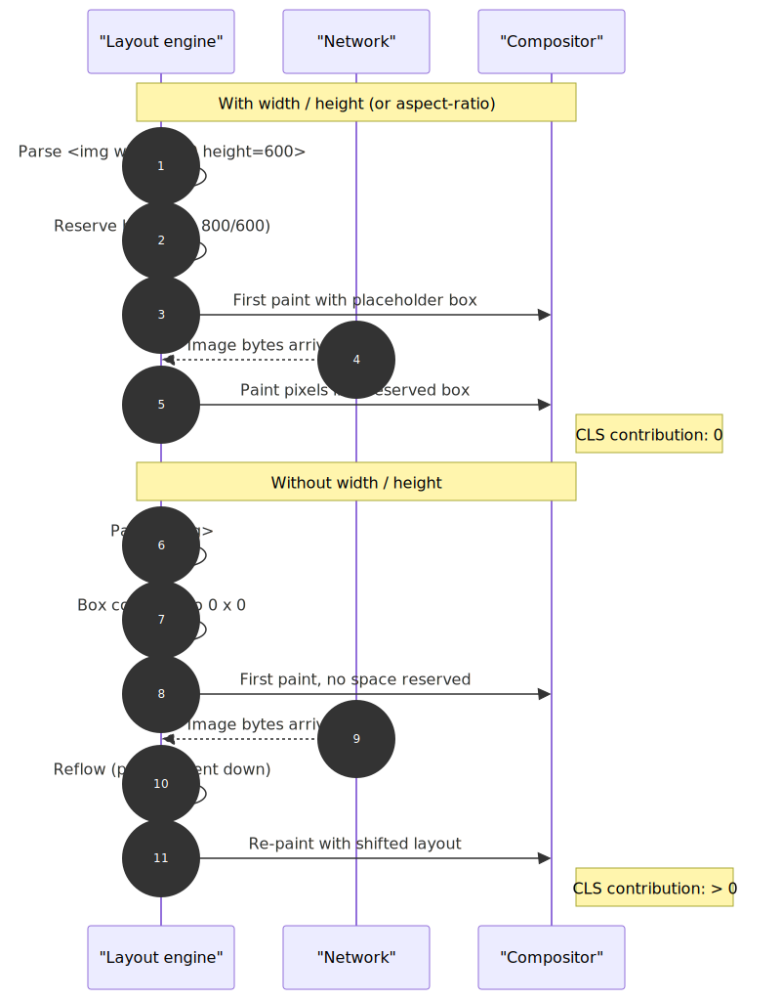
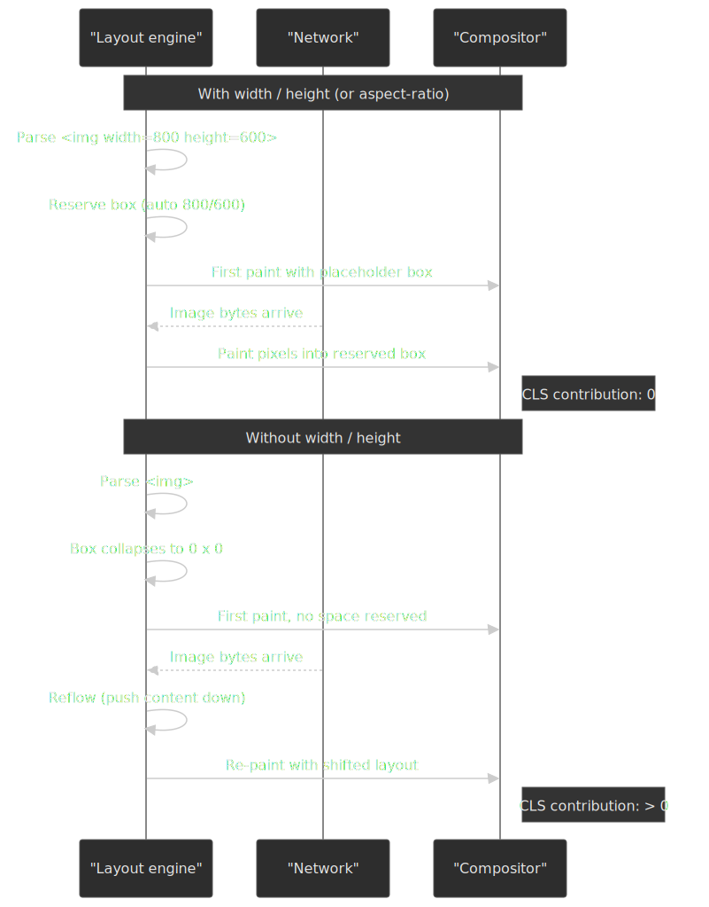

# Image Loading Optimization

Image delivery on the web is a four-axis optimization: load the [LCP](https://web.dev/articles/lcp) candidate fast, defer everything else, ship the smallest format the client can decode, and reserve space before pixels arrive so the page does not jump under the user's finger. Almost every "slow site" investigation that ends in an image fix lands on one of those four axes; the platform now exposes good primitives for each, but they are easy to combine wrong.

This article is for senior frontend engineers who want a single mental model for the mechanics — the [preload scanner](https://web.dev/articles/preload-scanner), [`loading`](https://html.spec.whatwg.org/multipage/urls-and-fetching.html#lazy-loading-attributes), [`fetchpriority`](https://html.spec.whatwg.org/multipage/urls-and-fetching.html#fetch-priority-attribute), [`<picture>`](https://html.spec.whatwg.org/multipage/embedded-content.html#the-picture-element), [`srcset`/`sizes`](https://html.spec.whatwg.org/multipage/images.html#sizes-attributes), and the implicit [`aspect-ratio`](https://html.spec.whatwg.org/multipage/rendering.html#map-to-the-aspect-ratio-property-(using-dimension-rules)) mapping — plus the trade-offs you only see at production scale (CDNs, format negotiation, placeholders, accessibility).




## Mental model

Three browser subsystems and two HTML attributes do almost all of the work. Hold these in your head and the rest of the article is a tour of failure modes.

| Subsystem | What it does | What you control |
| :--- | :--- | :--- |
| Preload scanner | Speculatively parses HTML ahead of the main parser to discover `src`, `srcset`, `<link rel=preload>`, etc. ([web.dev](https://web.dev/articles/preload-scanner)) | Anything in HTML — not in CSS or runtime JS |
| Resource scheduler | Assigns each fetch a priority based on resource type, position, and `fetchpriority` ([WHATWG](https://html.spec.whatwg.org/multipage/urls-and-fetching.html#fetch-priority-attribute)) | `fetchpriority="high"`, `<link rel=preload>` |
| Layout / paint pipeline | Reserves a box for each replaced element, paints once decode completes ([web.dev — CLS](https://web.dev/articles/cls)) | `width`/`height` attributes, CSS `aspect-ratio` |

The two attributes that gate the most user-visible behavior:

- **`loading="lazy"`** — defers the request until the image is "about to intersect the viewport". The exact distance is browser-defined and varies by connection ([WHATWG HTML — lazy loading attribute](https://html.spec.whatwg.org/multipage/urls-and-fetching.html#lazy-loading-attributes)).
- **`fetchpriority="high|low|auto"`** — a hint, not a directive, that nudges the resource scheduler ([web.dev — Fetch Priority](https://web.dev/articles/fetch-priority)).

> [!IMPORTANT]
> The single highest-impact rule: **never `loading="lazy"` on the LCP image**, and always declare its dimensions. Everything else in this article tunes the long tail.

## The constraint surface

Images compete for every constrained resource on the page-load path:

| Resource | Budget | Image impact |
| :--- | :--- | :--- |
| Network connections | 6 per origin on HTTP/1.1 (Chromium, hardcoded[^chromium-conns]) | Large images block other GETs on the same host |
| Frame budget | ~16.7 ms at 60 Hz | Synchronous decode of a hero image easily blows it |
| Memory | Mobile devices commonly cap a process at hundreds of MB | A 4K image in RGBA is ~33 MB uncompressed (3840 × 2160 × 4 bytes[^web-dev-compress]) |
| Bandwidth | Variable; the 90th percentile site ships > 5 MB of images[^http-archive] | Dominant payload on most pages |

[^chromium-conns]: Chromium ships a hardcoded `kMaxSocketsPerGroup = 6` for HTTP/1.1; see the long-running configurability discussion at [Chromium issue 40580943](https://issues.chromium.org/issues/40580943).
[^web-dev-compress]: [web.dev — Choose the correct level of compression](https://web.dev/articles/compress-images) walks through the bytes-per-pixel math.
[^http-archive]: [HTTP Archive — Page Weight](https://httparchive.org/reports/page-weight) reports that images remain the largest payload on most sites.

Three goals are in tension and you can only optimize for two at a time per image:

| Goal | Lever | What it costs |
| :--- | :--- | :--- |
| Fast LCP | Preload, `fetchpriority="high"` | Bandwidth and contention for other above-the-fold assets |
| Bandwidth efficiency | `loading="lazy"`, modern formats, responsive variants | Slightly later off-screen image discovery, server/build complexity |
| Layout stability | `width`/`height` or `aspect-ratio` | Markup discipline; sometimes cropping |

The right answer is per-image, not per-site. The decision tree later in [§ Priority hints and preloads](#priority-hints-and-preloads) makes it concrete.

## Native lazy loading

`loading="lazy"` defers the request until the browser's heuristic decides the image is close enough to the viewport to matter. It is the simplest, most cache-friendly option and is correct for every below-the-fold image that is not the LCP candidate.

```html title="lazy.html"

```

### What "about to intersect" actually means

The HTML spec deliberately leaves the threshold to the user agent ([WHATWG — will lazy load image steps](https://html.spec.whatwg.org/#will-lazy-load-image-steps)). Each engine picks its own:

| Browser | Behavior | Source |
| :--- | :--- | :--- |
| Chromium | Distance from viewport: **1250 px on 4G**, **2500 px on slow connections** (down from 3000/4000 in July 2020) | [web.dev](https://web.dev/articles/browser-level-image-lazy-loading#improved-data-savings-and-distance-from-viewport-thresholds), pulled from [`settings.json5`](https://source.chromium.org/chromium/chromium/src/+/main:third_party/blink/renderer/core/frame/settings.json5) |
| Firefox | Loads when the image intersects the viewport (effectively zero margin); configurable via `dom.image-lazy-loading.root-margin.*` prefs | [Bugzilla 1618240 — RESOLVED WORKSFORME](https://bugzilla.mozilla.org/show_bug.cgi?id=1618240) |
| Safari | "When the user scrolls near the image" — no public threshold; in practice closer to Firefox's behavior than Chromium's | [WebKit blog — Safari 15.4](https://webkit.org/blog/12445/new-webkit-features-in-safari-15-4/) |

Treat the threshold as opaque. If you need a guaranteed margin (e.g. "load the next two screens of an infinite feed"), drop down to Intersection Observer — see the next section.

Browser support is universal in modern browsers: Chrome 77+, Edge 79+, Firefox 75+, Safari 15.4+ ([web.dev](https://web.dev/articles/browser-level-image-lazy-loading)).

### Failure modes

> [!CAUTION]
> Lazy-loading the LCP image directly delays it. The browser must complete layout to decide the image is in-viewport before requesting it; that pushes the GET past the critical path and tanks LCP. The web.dev page on lazy loading [calls this out explicitly](https://web.dev/articles/browser-level-image-lazy-loading#eager-load-first-images).

Two more sharp edges that bite in production:

- **Missing dimensions promote to eager.** Without `width`/`height`, Chromium cannot determine whether the image fits in the initial viewport and may load it immediately, defeating `loading="lazy"`. Always declare dimensions.
- **Print stylesheets defer too.** Lazy images may not render in print. If print fidelity matters, force eager via JS before `window.print()`.
- **`display: none` is implementation-defined.** Engines disagree on whether to skip the request. Don't rely on `loading="lazy"` as a way to suppress hidden images; gate the markup itself.

Browsers without support simply ignore the attribute and load eagerly — a safe degradation.

## Intersection Observer for finer control

Native lazy loading covers ~95% of cases. Reach for [Intersection Observer](https://developer.mozilla.org/en-US/docs/Web/API/Intersection_Observer_API) when you need behavior the platform doesn't expose: a custom `rootMargin`, lazy loading inside a non-viewport scroll container, or pre-warming images in the user's scroll direction.

```typescript title="lazy-observer.ts" collapse={1-3}
const loaded = new WeakSet<HTMLImageElement>()

export function lazyLoadImages(options: IntersectionObserverInit = {}) {
  const observer = new IntersectionObserver(
    (entries) => {
      for (const entry of entries) {
        if (!entry.isIntersecting) continue
        const img = entry.target as HTMLImageElement
        const src = img.dataset.src
        if (src && !loaded.has(img)) {
          img.src = src
          loaded.add(img)
          observer.unobserve(img)
        }
      }
    },
    {
      rootMargin: "200px 0px",
      threshold: 0.01,
      ...options,
    },
  )

  document.querySelectorAll<HTMLImageElement>("img[data-src]").forEach((img) => observer.observe(img))
  return observer
}
```

| Capability | `loading="lazy"` | Intersection Observer |
| :--- | :--- | :--- |
| Distance threshold | Browser-defined, opaque | `rootMargin` — any value |
| Visibility trigger | Browser-defined | `threshold` — 0 to 1 |
| Scroll root | Viewport only | Any scrollable element |
| Connection awareness | Chrome only | Manual via `navigator.connection` |
| JS required | No | Yes |

If you go this route, set the placeholder `src` to a 1×1 transparent SVG (or omit it and rely on `data-src`) so the browser does not issue a request before the observer fires.

## Responsive images: srcset and sizes

`srcset` + `sizes` lets the user agent pick the smallest candidate that satisfies the rendered width and DPR — the single biggest win for image bandwidth on a multi-device site.

```html title="resolution-switching.html"

```

### How the browser resolves a candidate

The selection algorithm is in the [WHATWG sizes attribute](https://html.spec.whatwg.org/multipage/images.html#sizes-attributes) section. The shape of it:




Two consequences worth internalizing:

- **`sizes` is required when you use `w` descriptors.** If you omit it, the browser assumes `100vw` and almost always overshoots, which wastes the entire point of `srcset`. The spec [defines this default explicitly](https://html.spec.whatwg.org/multipage/images.html#sizes-attribute).
- **The browser will reuse a larger cached candidate.** Once it has the 1920w version, it will not re-request the 640w version on a smaller viewport. This means `srcset` saves bytes on first load, not on subsequent navigations.

### Resolution switching vs art direction vs format switching

Three separate use cases, three different markup patterns:

| Goal | Markup | Why |
| :--- | :--- | :--- |
| Same image, different sizes | `` | One alt text, one composition; UA picks the variant |
| Same image, different DPRs | `` (with explicit DPR descriptors) | Cleaner than `w` when you really mean DPR |
| Different compositions per breakpoint | `<picture><source media="..."></picture>` | Crops, aspect ratios, or wholly different images |
| Different formats (AVIF, WebP) | `<picture><source type="..."></picture>` | Server-side branchless format negotiation |

`<picture>` evaluates `<source>` elements top-to-bottom and uses the first one whose `media` matches and whose `type` is supported ([WHATWG](https://html.spec.whatwg.org/multipage/embedded-content.html#the-picture-element)). The fallback `` carries `alt`, `width`, `height`, and the default `src`.

## Format negotiation: AVIF, WebP, JPEG XL

The format gap is large enough that picking the right one is usually a bigger win than tuning loading. Compression numbers come from the original Google and Netflix studies; in practice they vary by content type, so always validate on your own corpus.

| Format | Vs. JPEG (typical) | Browser support | Best for |
| :--- | :--- | :--- | :--- |
| AVIF | ~50 % smaller at equivalent quality ([Netflix Tech Blog](https://netflixtechblog.com/avif-for-next-generation-image-coding-b1d75675fe4)) | Chrome 85+, Firefox 93+, Safari 16.4+ ([caniuse](https://caniuse.com/avif)) | Photos, complex images |
| WebP | ~25–34 % smaller ([Google study](https://developers.google.com/speed/webp/docs/webp_study)) | Chrome 23+, Firefox 65+, Safari 14+ ([caniuse](https://caniuse.com/webp)) | Broad compatibility floor |
| JPEG XL | ~30–60 % smaller (informal) | Safari 17+ ([WebKit](https://webkit.org/blog/14445/webkit-features-in-safari-17-0/)); returned to Chrome 145 (Feb 2026) behind `chrome://flags/#enable-jxl-image-format` via a memory-safe Rust decoder ([Chrome Status](https://chromestatus.com/feature/5114042131808256)) | Worth shipping behind `<picture>` + `image/jxl` for Safari today; Chrome rollout is flag-gated, so always provide an AVIF / WebP / JPEG fallback |
| JPEG | Baseline | Universal | Fallback |

> [!NOTE]
> AVIF decode is meaningfully slower than JPEG decode on low-end mobile, especially for very large images. The bandwidth win usually outweighs it on the first-load LCP path, but if your hero image is 4K AVIF on a $50 Android, profile before you assume.

### Two ways to deliver multiple formats

**Approach 1 — `<picture>` with `type`** (markup-driven, CDN-agnostic):

```html title="picture-format.html"
<picture>
  <source srcset="photo.avif" type="image/avif" />
  <source srcset="photo.webp" type="image/webp" />
  
</picture>
```

Sources are tried top-to-bottom; put the most efficient first. Each source can also carry its own `srcset` and `sizes`.

**Approach 2 — `Accept`-header content negotiation** (server- or CDN-driven). Chrome sends `Accept: image/avif,image/webp,...` and the server returns the best match. This requires `Vary: Accept` so caches do not serve the wrong format to the wrong client ([RFC 9110 § 12.5.5](https://www.rfc-editor.org/rfc/rfc9110#field.vary)).

| Approach | Control | Complexity | CDN compat |
| :--- | :--- | :--- | :--- |
| `<picture>` with `type` | Client-side | Markup per image | Universal — every URL is its own cache key |
| `Accept` negotiation | Server-side | Server / CDN config + `Vary: Accept` | Requires Vary-aware caches; many image CDNs do this for you |

Most teams should use `<picture>` for one-offs and let the image CDN do `Accept` negotiation for everything else.

### Picking a format from a single source

The decision is mostly mechanical once you classify the asset.




## Priority hints and preloads

`fetchpriority` and `<link rel="preload">` are how you tell the resource scheduler what matters. `fetchpriority` is a [hint, not a directive](https://web.dev/articles/fetch-priority): it influences priority but does not guarantee it. The two work together.

```html title="priority.html"
<!-- LCP hero: load immediately, high priority -->


<!-- Decorative: defer and deprioritize -->

```

Combinations and what they mean:

| `loading` | `fetchpriority` | Behavior |
| :--- | :--- | :--- |
| `eager` (default) | `high` | Immediate fetch, high priority. Default for the LCP candidate. |
| `eager` | `low` | Immediate fetch, deprioritized. Use for above-the-fold-but-not-critical assets. |
| `lazy` | `high` | Deferred, then high once near viewport. Rarely useful — see web.dev caveat below. |
| `lazy` | `low` | Deferred, low priority. The right default for footer / decorative images. |

> [!NOTE]
> web.dev points out that `loading="lazy" fetchpriority="high"` is mostly redundant: when the lazy image becomes eligible, the browser would have raised its priority anyway ([Fetch Priority article](https://web.dev/articles/fetch-priority)).

### Preloading the LCP image

When the LCP image is referenced from CSS, JS, or late in the HTML, the preload scanner cannot find it in time. A `<link rel="preload">` in `<head>` makes the request kick off during HTML parsing instead.

```html title="preload-lcp.html"
<link rel="preload" as="image" href="hero.jpg" fetchpriority="high" />
```

For responsive heroes, preload the same `srcset`/`sizes` the `` will use — otherwise you race two GETs:

```html title="preload-responsive.html"
<link
  rel="preload"
  as="image"
  imagesrcset="hero-400.jpg 400w, hero-800.jpg 800w, hero-1200.jpg 1200w"
  imagesizes="(max-width: 600px) 100vw, 50vw"
  fetchpriority="high"
/>
```

`imagesrcset` and `imagesizes` are standardized on `<link rel="preload" as="image">` and have the same semantics as on `` ([web.dev — Preload responsive images](https://web.dev/articles/preload-responsive-images)). Omit `href` so non-supporting browsers do not download a fallback you do not want.

### What the waterfall actually looks like

The mechanism is easier to internalize as a timeline. Without a preload, the LCP image is not discovered until the parser reaches the `` deep in the body — and any blocking CSS in `<head>` widens that gap. With `<link rel="preload" as="image" fetchpriority="high">` the preload scanner queues the request alongside the first CSS / font fetches, so it can finish well before first contentful paint instead of after it.




In production, a single `fetchpriority="high"` on the LCP `` (or matching `<link rel="preload">`) commonly moves LCP by 0.5–2 s when the image was being discovered late ([web.dev — Fetch Priority](https://web.dev/articles/fetch-priority)). It is a hint, so do not stack it on more than the single LCP element — handing out `high` to many resources just demotes them all back to neutral.

### Decision tree

For each image on a page, the right combination falls out of three editorial questions: is it the LCP candidate, is it above the fold, and is it decorative?




## Preventing layout shift

[Cumulative Layout Shift](https://web.dev/articles/cls) is a Core Web Vital with a "good" threshold of 0.1 ([web.dev — Web Vitals](https://web.dev/articles/vitals)). Images without reserved space are the dominant cause of image-related CLS.




### How the implicit aspect ratio actually works

A long-standing piece of folklore says modern browsers add `aspect-ratio: attr(width) / attr(height)` to the UA stylesheet. They do not — `attr()` does not work on non-`content` properties in any current browser ([Jake Archibald, Chrome team](https://jakearchibald.com/2022/img-aspect-ratio/)).

What actually happens, per the [HTML rendering spec](https://html.spec.whatwg.org/multipage/rendering.html#map-to-the-aspect-ratio-property-(using-dimension-rules)):

> If the element has both a `width` and `height` attribute … the user agent is expected to use the parsed dimensions as a presentational hint for the `aspect-ratio` property of the form `auto w / h`.

The `auto` keyword matters. For replaced elements like ``, once the natural aspect ratio is known (i.e. the image bytes have arrived), it overrides the hint. So if you specify `width="4" height="3"` on a 16:9 image, the browser uses 4:3 to reserve space initially, then corrects to 16:9 once the image loads — much better than a stretched render. This shipped in Chrome and Firefox in 2019 and Safari 14 in late 2020.

### Solution 1 — `width` and `height` attributes

```html

```

This is the right default for content images. Combine with `width: 100%; height: auto;` in CSS to make it responsive without losing the reserved space.

### Solution 2 — CSS `aspect-ratio`

```css title="aspect-ratio.css"
.responsive-image {
  width: 100%;
  height: auto;
  aspect-ratio: 16 / 9;
}
```

Use when:

- The intrinsic dimensions are not known at markup time (e.g. user-uploaded images without metadata in the API response).
- You want a consistent layout aspect across a gallery, regardless of the source image.
- The aspect ratio is a design constraint and you are willing to crop with `object-fit: cover`.

Browser support: Chrome 88+, Firefox 89+, Safari 15+ ([MDN](https://developer.mozilla.org/en-US/docs/Web/CSS/aspect-ratio)).

### Solution 3 — padding-bottom hack

Pre-2021 baseline browsers needed a `padding-bottom: 56.25%` wrapper to reserve aspect ratio. There is no reason to write this today; CSS `aspect-ratio` is supported everywhere modern lazy loading is.

### Measuring CLS

```javascript title="cls-observer.js"
new PerformanceObserver((list) => {
  for (const entry of list.getEntries()) {
    if (!entry.hadRecentInput) {
      console.log("CLS contribution:", entry.value, entry.sources)
    }
  }
}).observe({ type: "layout-shift", buffered: true })
```

`entry.sources` is the most useful field — it tells you which DOM node moved, so you can attribute the shift to a specific image.

## Placeholder strategies

Placeholders smooth perceived latency between layout reservation and pixel paint. Pick by payload-vs-fidelity, not by aesthetic.

| Strategy | Payload | JS required | Visual fidelity |
| :--- | :--- | :--- | :--- |
| Dominant color | ~7 bytes (hex) | No | Low |
| LQIP (tiny base64) | 200–500 bytes | No | Medium |
| BlurHash | ~20–30 bytes | Yes (decode + canvas) | Medium |
| CSS skeleton | 0 (CSS only) | No | Structural only |

### Dominant color

Extract a single representative color server-side or at build-time, set it as `background-color` on the ``:

```html title="dominant-color.html"

```

Lowest-effort option. Good for grids where the visual loss of detail is invisible.

### LQIP (low-quality image placeholder)

Inline a heavily compressed thumbnail as a data URI. 20–40 px wide, blurred via CSS `filter: blur(...)`. The user sees a recognizable approximation almost immediately. Cloudinary's [LQIP write-up](https://cloudinary.com/blog/low_quality_image_placeholders_lqip_explained) covers the encoding choices.

### BlurHash

[BlurHash](https://blurha.sh/) is a ~20-byte string that decodes into a soft gradient via a small canvas operation. The result looks better than a flat color but worse than LQIP. Use when you need a low-payload placeholder that travels in JSON API responses.

```typescript title="blurhash.ts" collapse={1-5, 12-18}
import { decode } from "blurhash"

const hash = "LEHV6nWB2yk8pyo0adR*.7kCMdnj"
const pixels = decode(hash, 32, 32)

const canvas = document.createElement("canvas")
canvas.width = 32
canvas.height = 32
const ctx = canvas.getContext("2d")!
const imageData = ctx.createImageData(32, 32)
imageData.data.set(pixels)
ctx.putImageData(imageData, 0, 0)

img.style.backgroundImage = `url(${canvas.toDataURL()})`
img.style.backgroundSize = "cover"
```

### Skeleton

CSS-only animated placeholder, sized to the reserved box. Good for card grids where you do not have per-image color metadata and BlurHash adds too much pipeline work.

```css title="skeleton.css"
.image-skeleton {
  background: linear-gradient(90deg, var(--skeleton-base) 25%, var(--skeleton-highlight) 50%, var(--skeleton-base) 75%);
  background-size: 200% 100%;
  animation: shimmer 1.5s infinite;
}

@keyframes shimmer {
  0% { background-position: 200% 0; }
  100% { background-position: -200% 0; }
}
```

## Image CDNs

An image CDN moves resizing, format conversion, and quality tuning out of the build pipeline and into the URL. Most teams running serious image traffic should be on one — the operational savings dwarf the per-asset cost.

### Capabilities

| Capability | Why it matters |
| :--- | :--- |
| On-demand resize | One source asset, infinite delivery sizes; no build-time fan-out |
| Format negotiation | Serve AVIF / WebP / JPEG by `Accept` header without per-image markup |
| Quality optimization | Adjust compression by content type, content-aware encoders |
| Edge caching | Variants cached close to the user; cold-start cost amortizes quickly |
| URL-based transforms | Reproducible without infra access |

### URL pattern

```text
https://cdn.example.com/images/photo.jpg?w=800&h=600&f=webp&q=75
```

| Parameter | Purpose |
| :--- | :--- |
| `w` | Width |
| `h` | Height |
| `f` | Format (`webp`, `avif`, `auto`) |
| `q` | Quality (1–100) |

### Drop-in with responsive images

```html title="cdn-responsive.html"

```

`f=auto` lets the CDN pick the best format from the `Accept` header. Make sure the CDN sets `Vary: Accept` on the response so downstream caches do not poison.

### Cache strategy

| Header | Value | Purpose |
| :--- | :--- | :--- |
| `Cache-Control` | `public, max-age=31536000, immutable` | Long cache; images at content-hashed URLs do not change |
| `Vary` | `Accept` (only when format-negotiating) | Cache per format ([RFC 9110 § 12.5.5](https://www.rfc-editor.org/rfc/rfc9110#field.vary)) |
| `ETag` | Hash of source + transforms | Conditional revalidation |

Invalidation strategies:

- **Content-hashed filenames** — `photo-a1b2c3.jpg`. Simplest; no CDN purge required.
- **Version query string** — `photo.jpg?v=2`. Cheap, but cache-key handling depends on the CDN.
- **Purge API** — vendor-specific; use sparingly.

### Vendors

| Vendor | Notable |
| :--- | :--- |
| Cloudinary | Largest transformation API, content-aware optimization |
| Imgix | Performance focus, strong responsive image tooling |
| Cloudflare Images | Tight integration with the Cloudflare CDN |
| Fastly Image Optimizer | Edge compute for custom transform logic |
| Vercel / Next.js Image | Framework-native; Vercel hosting only |

## Patterns from real systems

### Instagram — prefetch the next page

Instagram's web team [documented their image-loading pipeline](https://instagram-engineering.com/making-instagram-com-faster-part-1-62cc0c327538) (Glenn Conner, Instagram Engineering): `srcset` to right-size each image, prioritized prefetch of the next page of feed posts, and `<link rel="preload">` for above-the-fold media. Progressive JPEG remains in their delivery mix because perceived performance on slow links matters more than peak bytes saved by AVIF.

### Pinterest — constrained aspect ratio for masonry

Pinterest's masonry feed depends on a predictable aspect ratio per card. The platform specifies a [2:3 standard pin](https://help.pinterest.com/en/business/article/pinterest-product-specs) (e.g. 1000 × 1500); pins outside that ratio are truncated in the feed. The lesson is structural: enforce an aspect-ratio contract at the data layer so the layout engine never has to reflow.

### Unsplash — store full, serve resized

Unsplash stores high-resolution originals and resizes on the edge. Third parties consume the same CDN with query-param transforms — `imix.net/photo-xxx?w=1200&fit=crop`. The pattern generalizes: for any image you might re-crop, store the source at maximum fidelity and let the CDN absorb the variant explosion.

### Figma — bypass the DOM

For images at design-tool scale (100K+ objects, real-time collaboration), DOM-based image handling is the bottleneck. Figma renders to `<canvas>` via WebGL, with a recently announced [WebGPU upgrade](https://www.figma.com/blog/figma-rendering-powered-by-webgpu/) and a custom shader translation pipeline. Worth knowing exists; not worth reaching for unless you're building a similarly extreme product.

## Operational implications

### LCP optimization checklist

1. **Identify the LCP element** in the field, not in your local DevTools — [`web-vitals`](https://github.com/GoogleChrome/web-vitals) attributes LCP to a specific node in production.
2. **If it is an image, preload it** with `fetchpriority="high"` and the same `srcset`/`sizes` the `` will use.
3. **Never `loading="lazy"` it.** This is the single most common LCP regression we see in code review.
4. **Serve the smallest sufficient variant** — usually AVIF or WebP at `q=75–80` for hero photos.
5. **Avoid CSS background-image for the LCP element.** The preload scanner cannot find it; you pay a full stylesheet round-trip before the request fires.

### Monitoring

```typescript title="vitals.ts" collapse={1-2, 12-15}
import { onLCP, onCLS, onINP } from "web-vitals"

onLCP((metric) => {
  const entry = metric.entries[metric.entries.length - 1] as LargestContentfulPaint | undefined
  if (entry?.element?.tagName === "IMG") {
    console.log("LCP image:", (entry.element as HTMLImageElement).src)
    console.log("LCP time:", metric.value)
  }
})

onCLS((metric) => {
  console.log("CLS:", metric.value, metric.entries)
})
```

### Image size budget

Treat as starting points, not policy:

| Viewport | Total images | LCP target |
| :--- | :--- | :--- |
| Mobile (360 px) | < 500 KB | < 100 KB |
| Tablet (768 px) | < 1 MB | < 200 KB |
| Desktop (1920 px) | < 2 MB | < 400 KB |

### `decoding` attribute

Off-main-thread decoding is the default in Chromium ([Addy Osmani — Image Decoding in Blink](https://gist.github.com/addyosmani/ffa9706d8d354e5354a33ac9f17e9689)) and other modern engines. The `decoding` attribute primarily controls whether the browser is allowed to *paint-hold* an in-DOM image while async decode finishes:

| Value | Behavior | When to use |
| :--- | :--- | :--- |
| `async` | Decode off-thread; do not block adjacent updates on its completion | The right default for most images |
| `sync` | Wait for decode before showing this paint, to keep image in lockstep with surrounding content | Animations/sprites where a partial frame would tear |
| `auto` (default) | UA decides | Leave as default unless you have a reason to override |

If you need the image to be fully decoded before insertion, prefer the [`HTMLImageElement.decode()` Promise API](https://developer.mozilla.org/en-US/docs/Web/API/HTMLImageElement/decode) — it gives you a hook to await without holding up other paints.

### `content-visibility: auto` for long image feeds

For long, scroll-heavy pages with many off-screen images (feeds, archives, gallery grids), wrapping each card in `content-visibility: auto` lets the browser skip layout, paint, *and* image decode for off-screen subtrees until they enter the viewport ([CSS Containment Module Level 2](https://drafts.csswg.org/css-contain-2/#content-visibility), [web.dev](https://web.dev/articles/content-visibility)).

```css title="feed-card.css"
.feed-card {
  content-visibility: auto;
  contain-intrinsic-size: auto 320px;
}
```

`contain-intrinsic-size` is mandatory — without it the off-screen boxes collapse to zero and you reintroduce the same layout-shift problem `width`/`height` solve for individual images. This composes with `loading="lazy"`: native lazy loading skips the network fetch, `content-visibility: auto` additionally skips the rendering work for already-loaded images you have scrolled past.

### Connection-aware delivery

```typescript title="connection.ts"
type Quality = "high" | "medium" | "low"

export function getImageQuality(): Quality {
  const c = (navigator as Navigator & { connection?: { saveData: boolean; effectiveType: string } }).connection
  if (!c) return "medium"
  if (c.saveData) return "low"
  if (c.effectiveType === "4g") return "high"
  if (c.effectiveType === "3g") return "medium"
  return "low"
}
```

Caveats: `navigator.connection` is not in Safari; `effectiveType` is itself a heuristic. Treat it as a hint, not a contract.

## Accessibility

```html title="alt.html"
<!-- Informative image: describe content -->


<!-- Decorative image: empty alt -->


<!-- Complex image: detailed description -->

<p id="arch-details">The system consists of three layers...</p>
```

The [WAI Image Tutorial](https://www.w3.org/WAI/tutorials/images/decision-tree/) is the canonical decision tree for `alt`. Two often-missed patterns:

```css title="reduced-motion.css"
@media (prefers-reduced-motion: reduce) {
  .image-transition { transition: none; }
  .skeleton-loader {
    animation: none;
    background: var(--skeleton-base);
  }
}

@media (forced-colors: active) {
  .image-placeholder {
    forced-color-adjust: none;
    background-color: Canvas;
    border: 1px solid CanvasText;
  }
}
```

`forced-colors` (Windows High Contrast Mode) is the case where your placeholder backgrounds will silently disappear unless you explicitly opt out.

## Practical takeaways

In rough order of impact:

1. **Always reserve space.** `width`/`height` on every ``, or CSS `aspect-ratio` when intrinsic dimensions are unknown.
2. **Preload the LCP image.** `<link rel="preload" as="image" fetchpriority="high">`, with `imagesrcset`/`imagesizes` if responsive. Never `loading="lazy"` it.
3. **Serve modern formats** through `<picture>` or `f=auto` on a CDN. AVIF for photos, WebP as the floor.
4. **Right-size with `srcset`/`sizes`.** Always set `sizes` when you use `w` descriptors.
5. **Lazy-load the rest** with native `loading="lazy"`. Drop to Intersection Observer only when you need a custom threshold or scroll root.
6. **Pick a placeholder strategy that matches the API surface.** Dominant color in JSON, BlurHash if you need detail, skeletons for chrome.
7. **Push variant generation onto a CDN.** It eliminates an entire class of build-time complexity.

## Appendix

### Prerequisites

- HTML image element semantics
- CSS layout fundamentals
- HTTP caching basics ([RFC 9111](https://www.rfc-editor.org/rfc/rfc9111))
- Core Web Vitals (LCP, CLS, INP)

### References

- [WHATWG HTML — Images](https://html.spec.whatwg.org/multipage/images.html) — authoritative spec for `srcset`, `sizes`, `loading`, `decoding`
- [WHATWG HTML — Fetch priority attribute](https://html.spec.whatwg.org/multipage/urls-and-fetching.html#fetch-priority-attribute)
- [WHATWG HTML — Mapping to aspect-ratio](https://html.spec.whatwg.org/multipage/rendering.html#map-to-the-aspect-ratio-property-(using-dimension-rules))
- [CSS Sizing Level 4 — `aspect-ratio`](https://drafts.csswg.org/css-sizing-4/#aspect-ratio)
- [web.dev — Browser-level image lazy loading](https://web.dev/articles/browser-level-image-lazy-loading)
- [web.dev — Optimize LCP](https://web.dev/articles/optimize-lcp)
- [web.dev — Optimize CLS](https://web.dev/articles/optimize-cls)
- [web.dev — Fetch Priority](https://web.dev/articles/fetch-priority)
- [web.dev — Preload responsive images](https://web.dev/articles/preload-responsive-images)
- [web.dev — `content-visibility`](https://web.dev/articles/content-visibility)
- [Chrome Status — JPEG XL decoding (image/jxl) in Blink](https://chromestatus.com/feature/5114042131808256)
- [Jake Archibald — Avoiding `` layout shifts](https://jakearchibald.com/2022/img-aspect-ratio/)
- [Addy Osmani — Image Decoding in Blink](https://gist.github.com/addyosmani/ffa9706d8d354e5354a33ac9f17e9689)
- [Netflix Tech Blog — AVIF for Next-Generation Image Coding](https://netflixtechblog.com/avif-for-next-generation-image-coding-b1d75675fe4)
- [BlurHash](https://blurha.sh/)
- [Cloudinary — LQIP explained](https://cloudinary.com/blog/low_quality_image_placeholders_lqip_explained)
