# Indexing and Query Optimization

Database indexes accelerate reads by trading write overhead and storage for faster lookups. This article covers the index data structures used by PostgreSQL, MySQL, and modern LSM-based stores, the rules a senior engineer needs to design composite and covering indexes, and the cost-based query planner machinery that decides when an index is actually used. Examples lean on PostgreSQL because its planner exposes the cost model most clearly, but the same trade-offs apply to MySQL/InnoDB and LSM-based engines.


## Mental model

Indexing is a space-time trade-off: you pay storage and write overhead to reduce read latency. Five ideas carry the rest of the article:

- **B-tree** indexes maintain sorted order, enabling range queries and equality lookups in $O(\log_f n)$ where $f$ is the per-page fan-out — typically several hundred to a few thousand, so real indexes are 3–4 levels deep even at hundreds of millions of rows[^btree-fanout].
- **Hash** indexes provide $O(1)$ equality lookups but cannot support range queries or ordering.
- **LSM trees** optimize for write-heavy workloads by buffering writes in memory and flushing them as immutable sorted runs that compaction later merges; reads pay for this by checking multiple runs[^oneil1996].
- **Composite indexes** follow the **leftmost-prefix rule** — queries must filter on the leading columns of the key for the index to drive the scan.
- **Covering indexes** include every column the query needs, enabling index-only scans that skip the heap entirely.

Two cost levers govern whether the planner picks an index over a sequential scan:

- **Selectivity** — the fraction of rows the predicate keeps. High-selectivity (a few rows) favours indexes; low-selectivity (much of the table) favours sequential scans because sequential I/O is cheaper per page than the random I/O an index walk implies.
- **Write amplification** — every additional secondary index increases the work each `INSERT`/`UPDATE`/`DELETE` performs. PostgreSQL's MVCC amplifies this further when an update cannot be served as a Heap-Only Tuple (HOT) update[^hot].

The query planner reconciles these levers with cost-based optimisation, using statistics about data distribution and the configured `seq_page_cost` / `random_page_cost` ratio[^pg-cost]. Understanding the cost model explains why the planner sometimes "ignores" a carefully crafted index — often, it is correct to do so.

[^btree-fanout]: PostgreSQL B-trees follow Lehman & Yao (1981) with right-link concurrency; with the default 8 KB page and typical key sizes the per-page fan-out lands in the hundreds to low thousands, keeping real indexes ~3–4 levels deep ([Postgres Indexes Under the Hood, Russell Cohen](https://rcoh.me/posts/postgres-indexes-under-the-hood/)).
[^oneil1996]: O'Neil, Cheng, Gawlick & O'Neil, ["The Log-Structured Merge-Tree (LSM-Tree)", *Acta Informatica*, 1996](https://www.cs.umb.edu/~poneil/lsmtree.pdf).
[^hot]: PostgreSQL [HOT (Heap-Only Tuples)](https://www.postgresql.org/docs/current/storage-hot.html) — when an update touches no indexed columns and there is room on the same page, no secondary index entries are created.
[^pg-cost]: PostgreSQL docs, [19.7. Query Planning](https://www.postgresql.org/docs/current/runtime-config-query.html) — `seq_page_cost` (default `1.0`), `random_page_cost` (default `4.0`), `cpu_tuple_cost` (default `0.01`), `cpu_index_tuple_cost` (default `0.005`), `cpu_operator_cost` (default `0.0025`).

## Index Data Structures

### B-tree: The Default Choice

B-tree — technically a B+ tree variant in most implementations[^pg-btree-impl] — is the default index type in PostgreSQL, MySQL, and nearly every relational database. It maintains sorted key-value pairs with $O(\log_f n)$ lookup, insertion, and deletion, where $f$ is the per-node fan-out.

**How it works:** Internal nodes contain keys and child-page pointers; leaf nodes hold the actual key plus a heap pointer (`ctid` in PostgreSQL, or the primary key value in InnoDB secondary indexes), and are linked to their right sibling so a range scan walks the leaf level without revisiting the root. All leaves sit at the same depth, so every lookup costs the same number of page reads — typically 3–4 even for hundred-million-row tables. PostgreSQL adds Lehman & Yao right-link concurrency: a reader that races a page split follows the new right-link instead of restarting the descent[^pg-btree-impl].


[^pg-btree-impl]: PostgreSQL docs, [65.1. B-Tree Indexes](https://www.postgresql.org/docs/current/btree.html) and [67.4. Implementation](https://www.postgresql.org/docs/current/btree-implementation.html). PostgreSQL's B-tree uses a Lehman & Yao right-link variant for high concurrency; B-tree deduplication was added in v13 and does not apply to indexes with `INCLUDE` columns.

**Supported operations:**

- Equality: `WHERE col = value`
- Range: `WHERE col > value`, `BETWEEN`, `IN`
- Prefix matching: `WHERE col LIKE 'prefix%'`
- Sorting: `ORDER BY col` without additional sort step

**Best when:**

- Mixed read/write workloads
- Need range queries or ordering
- General-purpose indexing needs

**Trade-offs:**

- ✅ Supports both equality and range queries
- ✅ Natural ordering enables efficient `ORDER BY`
- ✅ Mature, well-understood, stable
- ❌ Write amplification on updates (all indexes must be updated)
- ❌ Random I/O for non-sequential access patterns
- ❌ Page splits can fragment index over time

**Real-world example:** MySQL InnoDB uses B+ trees for both primary (clustered) and secondary indexes. The primary index *is* the table — leaf pages store the row data — while secondary indexes store primary key values as pointers, requiring a second B-tree descent to fetch the row[^innodb-clustered]. PostgreSQL, by contrast, has a separate heap and every index (including the primary key) points at heap tuples by physical address (`ctid`).

[^innodb-clustered]: MySQL Reference Manual, [17.6.2.1 Clustered and Secondary Indexes](https://dev.mysql.com/doc/refman/8.4/en/innodb-index-types.html).

### Hash Index: O(1) Equality Lookups

Hash indexes compute a hash of the indexed value and store it in a hash table. This provides constant-time lookups for exact matches.

**Supported operations:**

- Equality only: `WHERE col = value`

**Limitations:**

- No range queries (`<`, `>`, `BETWEEN`)
- No ordering (`ORDER BY`)
- No prefix matching (`LIKE 'prefix%'`)

**When to use:**

- Point lookups on high-cardinality columns
- Equality-only access patterns
- When B-tree overhead is measurable

> [!NOTE]
> PostgreSQL hash indexes were not WAL-logged before PostgreSQL 10 (2017), which meant they were neither crash-safe nor replicated and required a manual `REINDEX` after a crash[^pg10-hash]. They are now fully supported but still rarely outperform B-trees in practice — pganalyze's benchmark on a 10M-row, 13 GB table found a B-tree composite index ~100× faster than the equivalent hash setup, partly because hash indexes lack B-tree v13's deduplication[^pganalyze-bench].

[^pg10-hash]: PostgreSQL [10.0 release notes](https://www.postgresql.org/docs/release/10.0/); see also Robert Haas, ["PostgreSQL's Hash Indexes Are Now Cool"](http://rhaas.blogspot.com/2017/09/postgresqls-hash-indexes-are-now-cool.html).
[^pganalyze-bench]: pganalyze, ["Benchmarking multi-column, covering and hash indexes in Postgres"](https://pganalyze.com/blog/5mins-postgres-benchmarking-indexes).

**Trade-offs:**

- ✅ O(1) lookup for equality
- ✅ Smaller index size for certain data types
- ❌ No range queries or ordering
- ❌ Hash collisions degrade performance
- ❌ Cannot be used for `ORDER BY`

### LSM Trees: Write-Optimized Storage

Log-Structured Merge (LSM) trees optimize for write-heavy workloads by buffering writes in memory and flushing them to disk as immutable, sorted runs that background compaction merges over time. The structure traces back to [O'Neil et al., 1996][lsm-paper], and is the storage substrate for Cassandra, ScyllaDB, RocksDB, LevelDB, and HBase.

[lsm-paper]: https://www.cs.umb.edu/~poneil/lsmtree.pdf


**Write path:**

1. The write is appended to the WAL and inserted into an in-memory sorted buffer (memtable).
2. When the memtable fills, it is sealed (immutable memtable) and flushed to disk as a sorted SSTable in level 0.
3. Background compaction merges SSTables across levels — RocksDB's default leveled compaction guarantees non-overlapping key ranges below L0[^rocks-compaction].

**Read path:** Probe the memtable → probe immutable memtables → probe each SSTable level. Per-SSTable Bloom filters short-circuit reads for keys that are definitely absent[^rocks-compaction].

[^rocks-compaction]: RocksDB Wiki, [Compaction](https://github.com/facebook/rocksdb/wiki/Compaction); LSM-tree design discussion in the [RocksDB docs](https://github.com/facebook/rocksdb/wiki/RocksDB-Overview).

**Three-way amplification trade-off.** LSM design is governed by the tension between write, read, and space amplification:

| Compaction style | Write amplification | Read amplification | Space amplification |
| ---------------- | ------------------- | ------------------ | ------------------- |
| Leveled (RocksDB default) | High (10×–30×) | Low — at most one file per level below L0 | ~1.1× |
| Size-tiered (Cassandra default) | Lower | Higher — multiple overlapping runs per level | Higher (up to 2×) during merges |

**Trade-offs:**

- ✅ High sustained write throughput (sequential I/O, batched flushes).
- ✅ Compaction amortises write amplification across many writes.
- ✅ Bloom filters keep negative lookups cheap.
- ❌ Read amplification grows with the number of levels and SSTables per level.
- ❌ Range scans must merge runs from every level.
- ❌ Compaction causes periodic I/O and CPU spikes; tail latency is the typical operational hazard.

**Real-world example:** CockroachDB uses Pebble (a Go reimplementation of RocksDB-style LSM) as its storage engine while providing serialisable SQL semantics. The team accepts read amplification because the workload prioritises write throughput and predictable replication across distributed nodes.

### Decision Matrix: Index Data Structures

| Factor                 | B-tree    | Hash                 | LSM Tree                   |
| ---------------------- | --------- | -------------------- | -------------------------- |
| Equality queries       | O(log n)  | O(1)                 | O(log n) + levels          |
| Range queries          | Excellent | Not supported        | Slower than B-tree         |
| Write throughput       | Moderate  | Moderate             | Excellent                  |
| Read throughput        | Excellent | Excellent (equality) | Good with Bloom filters    |
| Space efficiency       | Moderate  | Good                 | Better (compaction)        |
| Operational complexity | Low       | Low                  | Higher (compaction tuning) |

## Specialized Index Types

### GIN: Generalized Inverted Index

GIN indexes map element values to the rows containing them—essentially an inverted index. Designed for composite values like arrays, JSONB, and full-text search.

**Use cases:**

- Full-text search: `WHERE document @@ to_tsquery('search terms')`
- JSONB containment: `WHERE data @> '{"key": "value"}'`
- Array membership: `WHERE tags @> ARRAY['tag1', 'tag2']`

**How it works:** GIN breaks composite values into elements and creates an entry for each element pointing to all rows containing it. For JSONB, this means indexing each key-value pair separately.

**Trade-offs:**

- ✅ Fast containment queries on composite types.
- ✅ Supports complex operators (`@>`, `?`, `?|`, `?&`).
- ❌ Higher write overhead (multiple index entries per row); the `fastupdate` queue absorbs writes but flushes to the main index in the foreground if it overflows[^gin-docs].
- ❌ Only supports Bitmap Index Scans — never plain Index Scans, never Index-Only Scans, because a GIN entry can list the same heap tuple under multiple keys[^gin-only-bitmap].
- ❌ Slower to build than B-tree (build time scales with `maintenance_work_mem`, unlike GiST).

[^gin-docs]: PostgreSQL docs, [65.4. GIN Indexes](https://www.postgresql.org/docs/current/gin.html).
[^gin-only-bitmap]: PostgreSQL docs, [11.9. Index-Only Scans and Covering Indexes](https://www.postgresql.org/docs/current/indexes-index-only-scans.html) — "GiST and SP-GiST support index-only scans... GIN does not."

**JSONB operator classes:**

- `jsonb_ops` (default): Supports all JSONB operators, larger index
- `jsonb_path_ops`: Only supports `@>`, smaller and faster for containment

```sql title="GIN index for JSONB" collapse={1-2}
-- Create GIN index on JSONB column
CREATE INDEX idx_data_gin ON events USING GIN (data);

-- This query uses the index
SELECT * FROM events WHERE data @> '{"type": "purchase"}';

-- This does NOT use the index (equality, not containment)
SELECT * FROM events WHERE data->>'type' = 'purchase';
```

### GiST: Generalized Search Tree

GiST provides a framework for building custom index types. PostgreSQL uses it for geometric types, range types, and full-text search.

**Built-in GiST use cases:**

- Geometric queries: `WHERE point <@ polygon`
- Range overlaps: `WHERE daterange && '[2024-01-01, 2024-12-31]'`
- Nearest-neighbor: `ORDER BY location <-> point '(x,y)' LIMIT 10`

**GIN vs GiST for full-text search** (from the official PG documentation[^gin-vs-gist]):

| Factor          | GIN                                         | GiST           |
| --------------- | ------------------------------------------- | -------------- |
| Lookup speed    | ~3× faster                                  | Slower (lossy) |
| Build time      | ~3× longer                                  | Faster         |
| Update overhead | Moderately slower (≈10× slower with `fastupdate=off`) | Lower          |
| Index size      | 2–3× larger                                 | Smaller        |

**Recommendation:** GIN for read-heavy, GiST for write-heavy full-text search workloads — and consider GiST for highly dynamic data where its non-lossy concurrency wins matter.

[^gin-vs-gist]: PostgreSQL docs, [12.9. Preferred Index Types for Text Search](https://www.postgresql.org/docs/current/textsearch-indexes.html).

### BRIN: Block Range Index

BRIN (Block Range INdex) stores summary information about ranges of physical table blocks. Extremely small but only effective when data is physically clustered with respect to the indexed column[^brin-docs].

**How it works:** PostgreSQL divides the table into ranges of `pages_per_range` consecutive 8 KB pages (default `128`, so ~1 MB per range) and stores summary metadata per range — min/max for the default `minmax` opclass, a Bloom filter for `bloom_ops`, etc. Crucially, BRIN does *not* store row pointers; the *N*ᵗʰ index entry implicitly describes the *N*ᵗʰ block range. Query execution skips ranges whose summary cannot match the predicate, then bitmap-scans and rechecks the surviving ranges.

[^brin-docs]: PostgreSQL docs, [65.5. BRIN Indexes](https://www.postgresql.org/docs/current/brin.html). PG 16+ allows HOT updates on tables with BRIN indexes, since BRIN entries describe pages rather than tuples ([pganalyze E66](https://pganalyze.com/blog/5mins-postgres-16-HOT-Updates-BRIN-Index)).

**Ideal for:**

- Time-series data with append-only writes
- Naturally ordered data (timestamps, sequential IDs)
- Very large tables where B-tree overhead is prohibitive

**Trade-offs:**

- ✅ Tiny index size (orders of magnitude smaller than B-tree)
- ✅ Minimal write overhead
- ❌ Only effective when data is physically clustered
- ❌ Coarse-grained filtering (may scan many false-positive blocks)
- ❌ Updates that break clustering destroy effectiveness

```sql title="BRIN for time-series data" collapse={1-2}
-- BRIN index on timestamp column for append-only time-series
CREATE INDEX idx_events_created_brin ON events USING BRIN (created_at);

-- Effective query (scans only relevant block ranges)
SELECT * FROM events
WHERE created_at BETWEEN '2024-01-01' AND '2024-01-02';
```

### Partial Indexes: Index a Subset of Rows

Partial indexes include only rows matching a predicate. They reduce index size and maintenance overhead when queries consistently filter on specific conditions.

**Use cases:**

- Active records: `WHERE status = 'active'`
- Unprocessed items: `WHERE processed = false`
- Soft-deleted exclusion: `WHERE deleted_at IS NULL`

```sql title="Partial index for active orders" collapse={1-2}
-- Full index: indexes all 10M rows
CREATE INDEX idx_orders_customer ON orders (customer_id);

-- Partial index: only indexes ~100K active orders
CREATE INDEX idx_orders_customer_active ON orders (customer_id)
WHERE status = 'pending';

-- This query uses the partial index
SELECT * FROM orders WHERE customer_id = 123 AND status = 'pending';

-- This query CANNOT use the partial index (different predicate)
SELECT * FROM orders WHERE customer_id = 123 AND status = 'shipped';
```

**Critical limitation:** The query's `WHERE` clause must logically imply the index predicate. If the planner cannot prove the implication, it won't use the partial index.

**Trade-offs:**

- ✅ Smaller index size (only indexed rows)
- ✅ Lower write overhead (only maintains index for matching rows)
- ✅ Better selectivity on indexed subset
- ❌ Only usable when query implies index predicate
- ❌ Query changes may invalidate index usage

**Real-world example:** Queue tables often have millions of historical rows but only thousands of pending items. A partial index on `WHERE status = 'pending'` keeps the index small regardless of table growth.

### Expression Indexes: Index a Computed Value

Expression (functional) indexes store the result of an expression rather than a raw column value. They turn an otherwise non-sargable predicate — a function call applied to a column — back into an indexable lookup, and they let you cache an expensive computation at write time so reads pay nothing[^pg-expr-idx].

```sql title="Expression index for case-insensitive lookup"
-- Without the expression index, this is a full scan
CREATE INDEX idx_users_email_ci ON users (LOWER(email));

-- The planner uses the index because the WHERE expression
-- syntactically matches the indexed expression
SELECT * FROM users WHERE LOWER(email) = 'alice@example.com';
```

Three rules to keep in mind:

- The query expression must match the index expression structurally; `LOWER(email) = ?` matches `(LOWER(email))`, but `email ILIKE ?` does not.
- Expression indexes are not currently allowed as `INCLUDE` payload, and PostgreSQL's planner does not always recognise an opportunity for an Index-Only Scan over an expression index — adding the underlying column as `INCLUDE` is a documented workaround[^pg-ios].
- The function being indexed must be marked `IMMUTABLE`. Indexing a `STABLE` or `VOLATILE` function (e.g. `now()`-based predicates) silently produces wrong answers after timezone or session changes.

[^pg-expr-idx]: PostgreSQL docs, [11.7. Indexes on Expressions](https://www.postgresql.org/docs/current/indexes-expressional.html).

## Composite Index Design

### The Leftmost Prefix Rule

Composite indexes are B-trees on multiple columns. The index sorts by the first column, then by the second within each first-column value, and so on.

**Critical rule:** Queries can only use a composite index if they filter on a leftmost prefix of the index columns.


For index `(a, b, c)`:

- ✅ `WHERE a = 1` — uses index.
- ✅ `WHERE a = 1 AND b = 2` — uses index.
- ✅ `WHERE a = 1 AND b = 2 AND c = 3` — uses index (full).
- ❌ `WHERE b = 2` — cannot use the index for the scan (PostgreSQL may still consider it via a *Bitmap Index Scan* if the planner thinks scanning the entire index is cheaper than the heap, but that is rare).
- ❌ `WHERE b = 2 AND c = 3` — same as above.
- ⚠️ `WHERE a = 1 AND c = 3` — uses index only for `a`, then post-filters on `c`.

**Range predicates stop index usage for subsequent columns:**

```sql title="Range predicates in composite indexes"
-- Index: (a, b, c)

-- Full index usage: equality on all columns
WHERE a = 1 AND b = 2 AND c = 3

-- Partial usage: range on 'b' stops index at 'b'
WHERE a = 1 AND b > 2 AND c = 3  -- only (a, b) used, c filtered later

-- Optimal reordering: equality columns first, range last
WHERE a = 1 AND c = 3 AND b > 2  -- if index is (a, c, b), full usage
```

### Column Ordering Strategy

**General principle:** Order columns by query patterns and selectivity.

1. **Equality columns first:** Columns used with `=` should precede range columns
2. **High selectivity for leading columns:** More selective columns narrow the search faster
3. **Range/ORDER BY columns last:** Range predicates terminate index traversal for subsequent columns

**Example: E-commerce order queries**

```sql title="Composite index design for orders" collapse={1-4}
-- Common queries:
-- 1. SELECT * FROM orders WHERE customer_id = ? AND status = ? ORDER BY created_at DESC
-- 2. SELECT * FROM orders WHERE customer_id = ? AND created_at > ?
-- 3. SELECT * FROM orders WHERE status = ? ORDER BY created_at DESC

-- Optimal index for query 1:
CREATE INDEX idx_orders_cust_status_created
ON orders (customer_id, status, created_at DESC);

-- For query 2, same index works (uses customer_id, skips status, filters created_at)
-- For query 3, need separate index:
CREATE INDEX idx_orders_status_created
ON orders (status, created_at DESC);
```

### Selectivity and Cardinality

**Cardinality:** Number of distinct values in a column.
**Selectivity:** Fraction of rows returned by a predicate. Higher selectivity = fewer rows = better index candidate.

```
Selectivity = 1 / Cardinality
```

**High-cardinality examples:** User IDs, order numbers, timestamps
**Low-cardinality examples:** Status codes, boolean flags, country codes

**Composite index selectivity:** The combined selectivity of multiple columns can make even low-cardinality columns index-worthy.

| Column                | Cardinality | Selectivity |
| --------------------- | ----------- | ----------- |
| status                | 5           | 20%         |
| customer_id           | 100,000     | 0.001%      |
| (status, customer_id) | ~500,000    | 0.0002%     |

**Pitfall:** Don't index low-cardinality columns alone. A boolean flag with 50/50 distribution has 50% selectivity—the planner will likely prefer a sequential scan.

### Covering Indexes and Index-Only Scans

A covering index includes all columns needed by a query, enabling an *Index-Only Scan* that can return rows without touching the heap. PostgreSQL imposes two structural requirements and one runtime requirement[^pg-ios]:

1. The access method must support index-only scans — B-tree always does, GiST and SP-GiST do for some operator classes, GIN never does (a GIN entry only stores a fragment of the original value).
2. The query must reference only columns the index physically stores (key columns or `INCLUDE` payload).
3. At runtime, every candidate heap page must have its *visibility map* `all-visible` bit set; if it isn't, the executor falls back to a heap visit to recheck MVCC visibility for that tuple.

That third requirement is why index-only scans usually win on read-mostly tables and slowly-updated tables — recently churned pages have their `all-visible` bit cleared until `VACUUM` clears the dead tuples and re-marks the page. A covering index on a hot OLTP table can quietly degrade into a regular Index Scan plus heap fetches if `VACUUM` falls behind.



[^pg-ios]: PostgreSQL docs, [11.9. Index-Only Scans and Covering Indexes](https://www.postgresql.org/docs/current/indexes-index-only-scans.html). The doc spells out the AM, projection, and visibility-map requirements, and notes that GIN cannot support index-only scans because index entries store only fragments of the original value.

**PostgreSQL syntax (INCLUDE clause):**

```sql title="Covering index with INCLUDE" collapse={1-2}
-- Index columns used for filtering/ordering
-- INCLUDE columns used only for retrieval
CREATE INDEX idx_orders_covering ON orders (customer_id, status)
INCLUDE (total_amount, created_at);

-- This query can be satisfied entirely from the index
SELECT customer_id, status, total_amount, created_at
FROM orders
WHERE customer_id = 123 AND status = 'completed';

-- EXPLAIN shows: Index Only Scan
```

**MySQL approach:** InnoDB secondary indexes automatically include primary key columns. For true covering indexes, include needed columns in the index definition.

**Trade-offs:**

- ✅ Eliminates heap access (major I/O savings)
- ✅ Significant speedup for read-heavy queries
- ❌ Larger index size (included columns stored in every leaf)
- ❌ No B-tree deduplication in PostgreSQL for covering indexes
- ❌ Increased write overhead

**When to use:**

- Frequently executed queries returning few columns
- Read-heavy workloads with stable query patterns
- Hot queries identified via `pg_stat_statements` or slow query log

**When to avoid:**

- Write-heavy tables with frequent updates
- Large included columns (text, JSON)
- Volatile query patterns

**Real-world example:** pganalyze benchmarked composite, covering, and hash indexes on a 10 M-row, 13 GB table; the composite/covering B-tree configuration was on the order of `0.06 ms` per lookup and roughly 100× faster than two separate B-tree indexes or a hash index on the same workload[^pganalyze-bench]. The headline take-away is the order of magnitude, not the absolute milliseconds.

## Query Planner Behavior

### Cost-Based Optimization

PostgreSQL's query planner estimates execution cost for each candidate plan and chooses the lowest-cost option[^pg-cost]. Costs are dimensionless — what matters is the *ratio* between them.

**Key cost parameters** (PG 18 defaults):

| Parameter              | Default | Meaning                            |
| ---------------------- | ------- | ---------------------------------- |
| `seq_page_cost`        | 1.0     | Cost of a sequential 8 KB page read |
| `random_page_cost`     | 4.0     | Cost of a random 8 KB page read     |
| `cpu_tuple_cost`       | 0.01    | Cost of processing one heap tuple   |
| `cpu_index_tuple_cost` | 0.005   | Cost of processing one index entry  |
| `cpu_operator_cost`    | 0.0025  | Cost of executing one operator      |

> [!TIP]
> The `random_page_cost = 4.0` default reflects spinning-disk economics. On NVMe SSDs random and sequential reads are within a factor of two; lowering `random_page_cost` to `1.1`–`2.0` is a common (and often correct) tweak to nudge the planner back toward index scans on modern hardware.

**Why indexes get ignored:**

1. **Low selectivity.** Once a query returns more than roughly 5–10 % of rows, the cost model usually prefers a sequential scan because the heap fetches an index would trigger become more expensive than streaming the table sequentially. The exact crossover depends on storage, correlation, and `random_page_cost`.
2. **Small tables.** A table that fits in one or two pages will always get a sequential scan — touching the index would cost more than reading the table.
3. **Stale statistics.** `ANALYZE` hasn't run; the planner's row estimate is wrong by an order of magnitude.
4. **High correlation.** When physical row order matches index order (`pg_stats.correlation` near `±1`), the planner can do a cheap sequential scan with a filter and beat a random-walked index.


> [!NOTE]
> When the planner's cost crosses `jit_above_cost` (default `100000`), PostgreSQL will JIT-compile parts of the plan via LLVM — typically expression evaluation and tuple deforming. JIT helps long analytical scans but adds compile latency that can dominate short OLTP queries. If your hot OLTP plans suddenly show large `Planning Time` spikes, check `jit_above_cost` / `jit_optimize_above_cost` and consider disabling JIT for the affected role[^pg-jit].

[^pg-jit]: PostgreSQL docs, [Chapter 32. Just-in-Time Compilation (JIT)](https://www.postgresql.org/docs/current/jit.html).

### Reading EXPLAIN Output

```sql title="EXPLAIN ANALYZE example" collapse={1-3}
EXPLAIN (ANALYZE, BUFFERS, FORMAT TEXT)
SELECT * FROM orders WHERE customer_id = 12345 AND status = 'pending';

-- Output:
Index Scan using idx_orders_cust_status on orders
    (cost=0.43..8.45 rows=1 width=120)
    (actual time=0.025..0.027 rows=3 loops=1)
  Index Cond: ((customer_id = 12345) AND (status = 'pending'))
  Buffers: shared hit=4
Planning Time: 0.152 ms
Execution Time: 0.045 ms
```

**Key metrics:**

- **cost:** Estimated startup cost..total cost (in arbitrary units)
- **rows:** Estimated rows returned
- **actual time:** Real execution time in milliseconds
- **Buffers: shared hit:** Pages found in buffer cache
- **Buffers: shared read:** Pages read from disk

**Scan types:**

| Scan Type         | Description                     | When Used                                 |
| ----------------- | ------------------------------- | ----------------------------------------- |
| Seq Scan          | Full table scan                 | Low selectivity, small tables             |
| Index Scan        | Traverse index, fetch from heap | High selectivity, single rows             |
| Index Only Scan   | Index satisfies query entirely  | Covering index, clean visibility map      |
| Bitmap Index Scan | Build bitmap of matching pages  | Multiple conditions, moderate selectivity |
| Bitmap Heap Scan  | Fetch pages from bitmap         | Follows Bitmap Index Scan                 |

### When Planner Chooses Sequential Scan

**Threshold behavior:** As selectivity decreases, index scan cost rises while sequential scan cost stays constant. At some crossover point, sequential scan wins.

```
Index Scan Cost ∝ (matching_rows × random_page_cost) + (matching_rows × cpu_tuple_cost)
Sequential Scan Cost ∝ (total_pages × seq_page_cost) + (total_rows × cpu_tuple_cost)
```

**Practical heuristics** (storage- and correlation-dependent — measure before relying on them):

- < 5 % of rows: index scan usually wins.
- 5–10 % of rows: bitmap index scan often wins (the planner builds a bitmap then visits the heap in physical order).
- \> 10 % of rows: sequential scan often wins; on SSDs the threshold can be higher with a lower `random_page_cost`.

**Forcing index usage (for testing only):**

```sql title="Temporarily disable sequential scans"
SET enable_seqscan = off;  -- Forces index usage for testing
EXPLAIN ANALYZE SELECT ...;
SET enable_seqscan = on;   -- Re-enable for production
```

> [!WARNING]
> Never disable `seqscan` in production. If the planner prefers sequential scan, it is usually correct — fix the root cause (statistics, index design, `random_page_cost` for SSDs) instead.

### Statistics and ANALYZE

The planner relies on statistics in `pg_statistic` (PostgreSQL) or `information_schema.STATISTICS` (MySQL). Stale statistics cause poor plans.

**PostgreSQL statistics collection:**

- `autovacuum` runs `ANALYZE` automatically based on row changes (controlled by `autovacuum_analyze_scale_factor`/`_threshold`).
- Manual: `ANALYZE table_name;` or `ANALYZE table_name(column);`.
- Statistics come from a *random sample*, not exact counts. The `default_statistics_target` GUC (default `100`) controls both the sample size and the maximum number of `most_common_vals` and `histogram_bounds` entries kept per column. The sample contains roughly `300 × default_statistics_target` rows per table — `30 000` rows by default[^pg-stats]. Override per column for skewed distributions: `ALTER TABLE t ALTER COLUMN c SET STATISTICS 1000;`.

**Key statistics:**

- **n_distinct** — estimated number of distinct values (often the most consequential when wrong).
- **most_common_vals** + **most_common_freqs** — the top-N values and their frequencies.
- **histogram_bounds** — buckets describing the rest of the distribution.

**MySQL InnoDB statistics:**

- Persistent stats (`innodb_stats_persistent=ON`, default since 5.6.6) sample `innodb_stats_persistent_sample_pages` index pages — default `20`[^innodb-stats].
- Transient stats (legacy mode) sample `innodb_stats_transient_sample_pages` pages — default `8`.
- `ANALYZE TABLE` recomputes stats; `STATS_PERSISTENT=1` on the table preserves them across restarts.

[^pg-stats]: PostgreSQL docs, [14.2. Statistics Used by the Planner](https://www.postgresql.org/docs/current/planner-stats.html); [Crunchy Data: Postgres' Clever Query Planning System](https://www.crunchydata.com/blog/indexes-selectivity-and-statistics).
[^innodb-stats]: MySQL Reference Manual, [17.8.10.1 Configuring Persistent Optimizer Statistics Parameters](https://dev.mysql.com/doc/refman/8.4/en/innodb-persistent-stats.html) and [17.8.10.2 Non-Persistent Optimizer Statistics](https://dev.mysql.com/doc/refman/8.4/en/innodb-statistics-estimation.html).

**Symptoms of stale statistics:**

- Planner estimates differ wildly from actual rows
- Unexpected sequential scans on indexed columns
- Nested loop joins on large tables

### Join Algorithms

Join choice often matters more than index choice once the query touches more than one table. PostgreSQL has three physical join algorithms, and the planner picks between them with the same cost model that picks scan types[^pg-join].


| Algorithm   | Cost shape                                            | Wins when                                                                                              | Hazards                                                                                |
| :---------- | :---------------------------------------------------- | :----------------------------------------------------------------------------------------------------- | :------------------------------------------------------------------------------------- |
| Nested loop | $O(R \cdot S)$, or $O(R \cdot \log S)$ with inner index | Outer side is small, inner side has an index on the join key, or the join is non-equality (`<`, `>`, `!=`) — only choice for non-equality joins. | Catastrophic when the outer estimate is wrong by 100×; "row goes to 1 → 1M" disasters. |
| Hash join   | Build $O(S)$ + probe $O(R)$, in memory                | Equality joins, no useful index, smaller side fits in `work_mem`.                                      | Spills to disk in batches when build side overflows `work_mem`.                        |
| Merge join  | $O(R + S)$ when inputs are pre-sorted                 | Equality joins on large inputs already sorted by the join key (e.g. via index scans).                  | Pays the sort cost if either input is unsorted.                                        |

> [!IMPORTANT]
> The planner can be turned off-axis with `enable_nestloop`, `enable_hashjoin`, `enable_mergejoin` for diagnosis. Prefer `enable_nestloop = off` over `enable_seqscan = off` when investigating bad plans — a runaway nested loop is the single most common cause of "the query was fast yesterday and locked the database today".

[^pg-join]: PostgreSQL docs, [14.6. Controlling the Planner with Explicit JOIN Clauses](https://www.postgresql.org/docs/current/explicit-joins.html); [19.7.1. Planner Method Configuration](https://www.postgresql.org/docs/current/runtime-config-query.html#RUNTIME-CONFIG-QUERY-CONSTANTS) — `enable_nestloop`, `enable_hashjoin`, `enable_mergejoin`, `enable_memoize`.

### Cross-Engine Notes

A few cross-engine planner mechanics are worth carrying as defaults when you move between Postgres, MySQL, and SQL Server:

- **Index Condition Pushdown (MySQL InnoDB).** With ICP (default on), the storage engine evaluates parts of the `WHERE` clause that only reference indexed columns *before* fetching the full row, so a `(zipcode, lastname, firstname)` index plus `WHERE zipcode = ? AND lastname LIKE '%etrunia%'` skips heap reads for non-matching tuples. EXPLAIN shows `Using index condition` in the `Extra` column[^mysql-icp].
- **Combining indexes via BitmapOr (PostgreSQL).** When a query has multiple OR'd predicates with separate indexes, PostgreSQL can build per-index bitmaps and BitmapOr them, then visit the heap once in physical order — better than two independent index scans, often worse than one composite index covering both predicates[^pg-bitmap].
- **Parameter sniffing (SQL Server).** SQL Server compiles a plan based on the *first* parameter value it sees and caches it. With skewed data this caches a "mouse" plan that then runs against an "elephant" value (or vice versa). Mitigations: `OPTION (RECOMPILE)`, `OPTIMIZE FOR`, local-variable trick, or — in SQL Server 2022+ — Parameter Sensitive Plan optimization, which keeps several active plans for a single statement[^psp]. Postgres has the analogous concept for prepared statements (custom vs generic plans, controlled by `plan_cache_mode`).

[^mysql-icp]: MySQL 8.4 Reference Manual, [10.2.1.6 Index Condition Pushdown Optimization](https://dev.mysql.com/doc/refman/8.4/en/index-condition-pushdown-optimization.html).
[^pg-bitmap]: PostgreSQL docs, [11.5. Combining Multiple Indexes](https://www.postgresql.org/docs/current/indexes-bitmap-scans.html).
[^psp]: Microsoft Learn, [Parameter Sensitive Plan Optimization](https://learn.microsoft.com/en-us/sql/relational-databases/performance/parameter-sensitive-plan-optimization).

## Write Amplification and Index Overhead

### The Cost of Indexes

Every index adds overhead to write operations. With $n$ indexes on a table, each `INSERT` performs roughly $n + 1$ writes (heap + each index). Updates are worse, and the worst case differs sharply between PostgreSQL and InnoDB.

**PostgreSQL's MVCC and HOT optimisation.** PostgreSQL stores indexes as direct pointers to heap tuples (`ctid`). An update never overwrites a row in place; it writes a new tuple version. Two paths follow from there[^hot]:

1. **HOT (Heap-Only Tuple) update.** If the update touches *no indexed column* and there is room on the same heap page, the new version lives on the same page and the old version's `ctid` chains to it. No secondary indexes are touched. This is the common, cheap case for OLTP.
2. **Non-HOT update.** If any indexed column changed *or* the page is full, PostgreSQL writes a new tuple (often on a new page) and must insert a new entry into *every* secondary index that references the row. Even unchanged secondary indexes pay because the new tuple has a new `ctid`.

You can see HOT effectiveness in `pg_stat_user_tables.n_tup_hot_upd` vs `n_tup_upd`. Lowering the table `FILLFACTOR` (default `100`) reserves free space per page and increases HOT eligibility — a standard tuning lever for hot OLTP tables.


**MySQL InnoDB difference.** InnoDB secondary indexes store the primary key, not a physical pointer. A row update that does not change indexed columns or the primary key needs zero secondary-index work, regardless of how many secondary indexes exist. The trade-off is that secondary-index lookups always cost two B-tree descents (secondary → PK → row).

**Real-world impact — Uber's 2016 migration.** Uber's analysis was on PostgreSQL 9.2 with tables carrying many secondary indexes. Because pre-HOT-friendly schemas often updated indexed columns, a single update triggered an index entry per secondary index, producing[^uber]:

- High write amplification — Uber reported the WAL stream becoming "extremely verbose".
- Large physical replication volume, since PostgreSQL replicates WAL byte-for-byte and each new tuple version carries `ctid` updates for every index.
- Replica MVCC issues where long-running queries on standbys blocked or were cancelled.

The Uber post is a case study in *workload-architecture mismatch*, not a blanket indictment of PostgreSQL — and modern PostgreSQL has narrowed the gap with logical replication, improved HOT, and per-table FILLFACTOR tuning. Robert Haas's contemporaneous response is required reading[^haas-uber].

[^uber]: Uber Engineering, ["Why Uber Engineering Switched from Postgres to MySQL"](https://www.uber.com/us/en/blog/postgres-to-mysql-migration/), 2016.
[^haas-uber]: Robert Haas, ["Uber's Move Away from PostgreSQL"](http://rhaas.blogspot.com/2016/08/ubers-move-away-from-postgresql.html), 2016.

### Measuring Index Overhead

**PostgreSQL: `pg_stat_user_indexes`**

```sql title="Find unused indexes" collapse={1-3}
SELECT schemaname, relname, indexrelname,
       idx_scan, idx_tup_read, idx_tup_fetch,
       pg_size_pretty(pg_relation_size(indexrelid)) AS size
FROM pg_stat_user_indexes
WHERE idx_scan = 0  -- Never used
ORDER BY pg_relation_size(indexrelid) DESC;
```

**MySQL: Performance Schema**

```sql title="Find unused indexes in MySQL" collapse={1-3}
SELECT object_schema, object_name, index_name
FROM performance_schema.table_io_waits_summary_by_index_usage
WHERE index_name IS NOT NULL
  AND count_star = 0
ORDER BY object_schema, object_name;
```

### Index Maintenance Strategies

**1. Identify and remove unused indexes**

Unused indexes waste storage and slow writes with zero benefit. Query `pg_stat_user_indexes` (PostgreSQL) or Performance Schema (MySQL) for indexes with zero scans over a representative time period.

**2. Identify redundant indexes**

Index `(a, b)` makes index `(a)` redundant for most queries. Tools like `pg_idx_advisor` can detect redundancies.

**3. Consolidate overlapping indexes**

Multiple indexes with similar column prefixes can often be merged:

- `(a)`, `(a, b)`, `(a, b, c)` → Keep only `(a, b, c)` if all queries use leftmost prefix

**4. Consider partial indexes for skewed data**

If 95% of queries filter on `status = 'active'` and only 5% of rows are active, a partial index `WHERE status = 'active'` is dramatically smaller and faster.

## Index Bloat and Maintenance

### Understanding Bloat

Index bloat occurs when deleted or updated rows leave dead space in index pages. PostgreSQL's MVCC creates dead tuples that remain until `VACUUM` cleans them.

**Causes:**

- High update/delete rates
- Long-running transactions holding old snapshots
- Aggressive `autovacuum` settings not keeping pace

**Symptoms:**

- Index size grows despite stable row count
- Query performance degrades over time
- Higher-than-expected I/O for index operations

### Measuring Bloat

**PostgreSQL: `pgstattuple` extension**

```sql title="Check index bloat" collapse={1-3}
CREATE EXTENSION IF NOT EXISTS pgstattuple;

SELECT * FROM pgstattuple('idx_orders_customer');
-- avg_leaf_density < 70% indicates significant bloat

-- For indexes specifically:
SELECT * FROM pgstatindex('idx_orders_customer');
-- leaf_fragmentation > 30% suggests rebuild needed
```

**Heuristic:** Index size significantly larger than `(rows × avg_row_size × 1.2)` suggests bloat.

### VACUUM vs REINDEX

**VACUUM:** Marks dead tuples as reusable but doesn't reclaim space. Index pages with dead entries remain allocated.

**REINDEX:** Rebuilds the index from scratch, reclaiming all bloat.

```sql title="Concurrent reindex" collapse={1-2}
-- Non-blocking rebuild (PostgreSQL 12+)
REINDEX INDEX CONCURRENTLY idx_orders_customer;

-- Table-level (all indexes)
REINDEX TABLE CONCURRENTLY orders;
```

**REINDEX CONCURRENTLY:**

- Builds new index alongside old
- Multiple passes to capture concurrent changes
- Swaps pointers atomically
- Takes longer but allows reads/writes throughout

**When to REINDEX:**

- Bloat exceeds 20-30%
- Query performance has degraded
- After bulk deletes or large schema changes

**Scheduling:** Run `REINDEX CONCURRENTLY` during low-traffic periods. Even concurrent rebuilds consume I/O and CPU.

### Autovacuum Tuning

**Key parameters:**

| Parameter                        | Default | Recommendation                     |
| -------------------------------- | ------- | ---------------------------------- |
| `autovacuum_vacuum_scale_factor` | 0.2     | Lower for large tables (0.01-0.05) |
| `autovacuum_vacuum_threshold`    | 50      | Keep default                       |
| `autovacuum_naptime`             | 1min    | Keep default or lower              |
| `maintenance_work_mem`           | 64MB    | Increase for faster vacuum         |

**Per-table settings for hot tables:**

```sql title="Aggressive autovacuum for hot table"
ALTER TABLE hot_events SET (
    autovacuum_vacuum_scale_factor = 0.01,
    autovacuum_vacuum_threshold = 1000,
    autovacuum_analyze_scale_factor = 0.005
);
```

## Monitoring and Diagnostics

### PostgreSQL: pg_stat_statements

`pg_stat_statements` tracks execution statistics for all queries, normalized by parameter values.

```sql title="Find slow queries" collapse={1-3}
-- Enable extension
CREATE EXTENSION IF NOT EXISTS pg_stat_statements;

-- Top queries by total time
SELECT query,
       calls,
       mean_exec_time::numeric(10,2) AS avg_ms,
       total_exec_time::numeric(10,2) AS total_ms,
       rows
FROM pg_stat_statements
ORDER BY total_exec_time DESC
LIMIT 20;

-- Reset statistics
SELECT pg_stat_statements_reset();
```

**Key metrics:**

- `total_exec_time`: Cumulative execution time
- `calls`: Number of executions
- `mean_exec_time`: Average execution time
- `rows`: Total rows returned
- `shared_blks_hit/read`: Buffer cache efficiency

### MySQL: Slow Query Log and Performance Schema

**Slow query log:**

```sql title="Enable slow query log"
SET GLOBAL slow_query_log = 'ON';
SET GLOBAL long_query_time = 1;  -- Log queries > 1 second
SET GLOBAL slow_query_log_file = '/var/log/mysql/slow.log';
```

**Performance Schema:**

```sql title="Top queries by execution time" collapse={1-2}
SELECT DIGEST_TEXT,
       COUNT_STAR AS calls,
       AVG_TIMER_WAIT/1000000000 AS avg_ms,
       SUM_TIMER_WAIT/1000000000 AS total_ms
FROM performance_schema.events_statements_summary_by_digest
ORDER BY SUM_TIMER_WAIT DESC
LIMIT 20;
```

### Index Usage Monitoring

**Track which indexes are actually used:**

```sql title="Index usage statistics (PostgreSQL)" collapse={1-2}
SELECT schemaname, relname AS table_name,
       indexrelname AS index_name,
       idx_scan AS scans,
       idx_tup_read AS tuples_read,
       idx_tup_fetch AS tuples_fetched
FROM pg_stat_user_indexes
ORDER BY idx_scan DESC;
```

**Alert thresholds:**

- Index with 0 scans over 30 days → candidate for removal
- Index scan count dropping → query pattern changed, investigate

## Common Pitfalls

A few of these are worth visualising up front because they share a single shape: the predicate is *not sargable* — the optimizer cannot translate it into a range scan on the index — and the rewrite restores sargability.


### 1. Over-Indexing

**The mistake:** Creating indexes for every query pattern without measuring impact.

**Why it happens:** "More indexes = faster reads" intuition ignores write overhead.

**The consequence:** Write latency increases linearly with index count. At scale, this causes replication lag, transaction timeouts, and storage bloat.

**The fix:** Measure before adding indexes. Use `pg_stat_statements` or slow query log to identify actual slow queries. Add indexes incrementally, measuring write impact.

### 2. Wrong Column Order in Composite Indexes

**The mistake:** Ordering columns by table schema rather than query patterns.

**Example:** Index `(status, customer_id)` when most queries filter on `customer_id` alone.

**The consequence:** Index is useless for common queries (violates leftmost prefix rule).

**The fix:** Analyze actual query patterns. Order columns by: equality predicates first, then range predicates, then ORDER BY columns.

### 3. Indexing Low-Cardinality Columns Alone

**The mistake:** Creating an index on a boolean flag or status column with few distinct values.

**Example:** `CREATE INDEX idx_active ON users (is_active);` when 80% of users are active.

**The consequence:** Planner ignores the index (prefers sequential scan for 80% selectivity).

**The fix:** Use composite indexes that combine low-cardinality with high-cardinality columns. Or use partial indexes if one value dominates queries: `WHERE is_active = true`.

### 4. Ignoring Index Bloat

**The mistake:** Never monitoring or maintaining indexes after initial creation.

**Why it happens:** Autovacuum handles tables but doesn't reclaim index space effectively.

**The consequence:** Indexes grow 2-5x actual data size, causing I/O amplification and cache pressure.

**The fix:** Monitor bloat with `pgstattuple`. Schedule periodic `REINDEX CONCURRENTLY` for high-churn tables.

### 5. Function Calls Preventing Index Usage

**The mistake:** Applying functions to indexed columns in WHERE clauses.

```sql
-- Index on created_at is NOT used
WHERE DATE(created_at) = '2024-01-15'

-- Index IS used
WHERE created_at >= '2024-01-15' AND created_at < '2024-01-16'
```

**The consequence:** Full table scan instead of index lookup.

**The fix:** Rewrite queries to apply functions to constants, not columns. Or create expression indexes: `CREATE INDEX idx_date ON orders (DATE(created_at));`

### 6. Leading Wildcards in `LIKE`

**The mistake:** `WHERE name LIKE '%term%'` against a B-tree index on `name`.

**Why it happens:** Substring search feels like the obvious tool, and the planner *will* sometimes use the index — but only as an inefficient full-index scan, which is no faster than reading the heap.

**The mechanism:** A B-tree can only use the prefix of a `LIKE` pattern up to the first wildcard as an access predicate; everything after is a filter[^utl-like]. `LIKE 'WIN%D'` walks the index for the `WIN%` range and then filters; `LIKE '%WIN'` has no usable prefix at all.

**The fix:** Anchor the pattern to a prefix when the use case allows (`LIKE 'term%'`), or move to a structure designed for substring search:

- PostgreSQL: `pg_trgm` extension + GIN/GiST trigram index supports leading-wildcard `LIKE` and `ILIKE` efficiently.
- PostgreSQL full-text search via `tsvector` + GIN for word-level search.
- MySQL: InnoDB `FULLTEXT` index for `MATCH ... AGAINST`.

[^utl-like]: Markus Winand, [Use The Index, Luke — Indexing LIKE Filters](https://use-the-index-luke.com/sql/where-clause/searching-for-ranges/like-performance-tuning).

### 7. `OR` Across Separate Single-Column Indexes

**The mistake:** `WHERE a = ? OR b = ?` with two separate single-column indexes on `a` and `b`.

**Why it happens:** "There's an index on each column, so each disjunct should be an index scan."

**The mechanism:** A regular B-tree Index Scan walks one index and cannot satisfy two unrelated predicates in one descent. PostgreSQL handles this via a *BitmapOr* — one Bitmap Index Scan per side, then a single Bitmap Heap Scan in physical order[^pg-bitmap-pitfall]. That works, but it touches both indexes and rebuilds bitmaps every time. When the OR fires repeatedly on the hot path, three rewrites are usually faster:

1. A composite or covering index that satisfies both predicates in one descent (where the leftmost-prefix rule allows).
2. `UNION ALL` of two separate index scans, deduplicated explicitly when needed.
3. A computed/expression index over a single canonical key when the two columns are semantically equivalent.

[^pg-bitmap-pitfall]: PostgreSQL docs, [11.5. Combining Multiple Indexes](https://www.postgresql.org/docs/current/indexes-bitmap-scans.html).

## Conclusion

Index design is about understanding trade-offs, not memorizing rules. The key principles:

1. **Measure first:** Use `pg_stat_statements`, EXPLAIN ANALYZE, and slow query logs to identify actual bottlenecks before adding indexes.

2. **Understand the planner:** Cost-based optimization means the "best" index depends on data distribution, selectivity, and correlation. Sometimes sequential scan is correct.

3. **Design for queries:** Column order, covering columns, and partial predicates should match your actual query patterns, not theoretical ideals.

4. **Pay attention to writes:** Every index taxes every write. At scale, over-indexing causes more problems than missing indexes.

5. **Maintain continuously:** Index bloat, stale statistics, and unused indexes accumulate silently. Monitor and maintain proactively.

The best index strategy emerges from understanding your workload, measuring actual performance, and iterating based on production data—not from following prescriptive rules.

## Appendix

### Prerequisites

- SQL fundamentals (SELECT, WHERE, JOIN, ORDER BY)
- Basic understanding of relational database storage (tables, rows, pages)
- Familiarity with at least one RDBMS (PostgreSQL or MySQL)

### Summary

- **B-tree** indexes support equality and range queries in $O(\log_f n)$; the default choice for most workloads.
- **Composite indexes** require queries to filter on the leftmost-prefix columns; order columns by equality → range → `ORDER BY`.
- **Covering indexes** (`INCLUDE`) enable index-only scans by including every column the query reads.
- **Partial indexes** reduce size and write overhead by indexing only rows matching a predicate.
- **Query planner** decisions are cost-based; low-selectivity queries usually prefer sequential scans, and on SSDs lowering `random_page_cost` is a common (and often correct) tuning step.
- **Write amplification** in PostgreSQL is shaped by HOT updates — non-HOT updates pay the full secondary-index cost.
- **Index bloat** needs periodic `REINDEX CONCURRENTLY`; `VACUUM` alone does not reclaim index space.

### References

- [PostgreSQL Documentation: Indexes](https://www.postgresql.org/docs/current/indexes.html) — Official PostgreSQL index documentation.
- [PostgreSQL Documentation: Using EXPLAIN](https://www.postgresql.org/docs/current/using-explain.html) — Query plan analysis.
- [PostgreSQL Documentation: Planner/Optimizer](https://www.postgresql.org/docs/current/planner-optimizer.html) — Cost-based optimization internals.
- [PostgreSQL Documentation: Heap-Only Tuples (HOT)](https://www.postgresql.org/docs/current/storage-hot.html) — The mechanism that breaks the "every update touches every index" assumption.
- [PostgreSQL Documentation: B-Tree Indexes](https://www.postgresql.org/docs/current/btree.html) and [BRIN Indexes](https://www.postgresql.org/docs/current/brin.html) and [GIN Indexes](https://www.postgresql.org/docs/current/gin.html) — Per-AM internals.
- [PostgreSQL Documentation: Index-Only Scans and Covering Indexes](https://www.postgresql.org/docs/current/indexes-index-only-scans.html).
- [PostgreSQL Documentation: Statistics Used by the Planner](https://www.postgresql.org/docs/current/planner-stats.html) — `default_statistics_target`, sampling, and MCVs.
- [MySQL 8.4 Reference Manual: Optimization and Indexes](https://dev.mysql.com/doc/refman/8.4/en/optimization-indexes.html) and [InnoDB Index Types](https://dev.mysql.com/doc/refman/8.4/en/innodb-index-types.html).
- [O'Neil et al., "The Log-Structured Merge-Tree (LSM-Tree)", *Acta Informatica*, 1996](https://www.cs.umb.edu/~poneil/lsmtree.pdf) — Original LSM paper.
- [RocksDB: Compaction](https://github.com/facebook/rocksdb/wiki/Compaction) — Modern leveled-vs-tiered compaction in production.
- [Why Uber Engineering Switched from Postgres to MySQL](https://www.uber.com/us/en/blog/postgres-to-mysql-migration/) and [Robert Haas's response](http://rhaas.blogspot.com/2016/08/ubers-move-away-from-postgresql.html) — Read together.
- [Use The Index, Luke](https://use-the-index-luke.com/) — Markus Winand's comprehensive SQL indexing guide; the [Indexing LIKE Filters](https://use-the-index-luke.com/sql/where-clause/searching-for-ranges/like-performance-tuning) chapter is the canonical reference for leading-wildcard pathology.
- [pganalyze: Benchmarking multi-column, covering and hash indexes in Postgres](https://pganalyze.com/blog/5mins-postgres-benchmarking-indexes) and [Understanding Postgres GIN Indexes](https://pganalyze.com/blog/gin-index).
- [Crunchy Data: Why Covering Indexes Are Helpful](https://www.crunchydata.com/blog/why-covering-indexes-are-incredibly-helpful) and [Postgres Scan Types in EXPLAIN Plans](https://www.crunchydata.com/blog/postgres-scan-types-in-explain-plans).
- [PostgreSQL: Combining Multiple Indexes](https://www.postgresql.org/docs/current/indexes-bitmap-scans.html) — BitmapAnd / BitmapOr semantics for OR-style predicates.
- [PostgreSQL: Indexes on Expressions](https://www.postgresql.org/docs/current/indexes-expressional.html) — expression-index rules, `IMMUTABLE` requirement.
- [PostgreSQL: Just-in-Time Compilation (JIT)](https://www.postgresql.org/docs/current/jit.html) — `jit_above_cost` thresholds and trade-offs.
- [MySQL: Index Condition Pushdown Optimization](https://dev.mysql.com/doc/refman/8.4/en/index-condition-pushdown-optimization.html) — what `Using index condition` means in EXPLAIN.
- [Microsoft Learn: Parameter Sensitive Plan Optimization (SQL Server 2022+)](https://learn.microsoft.com/en-us/sql/relational-databases/performance/parameter-sensitive-plan-optimization) — modern mitigation for parameter sniffing.
