# Intersection Observer API: visibility without scroll listeners

Before [Intersection Observer](https://developer.mozilla.org/en-US/docs/Web/API/Intersection_Observer_API), “is this element on screen?” usually meant listening to `scroll` (or `resize`) and calling geometry APIs such as [`getBoundingClientRect()`](https://developer.mozilla.org/en-US/docs/Web/API/Element/getBoundingClientRect) on the hot path. That pattern couples your logic to high-frequency input, tends to force synchronous layout work, and is easy to get subtly wrong when nested scroll containers or dynamic layout are involved.

Intersection Observer inverts the relationship: you register interest, the user agent tracks how a **target** intersects a **root intersection rectangle** derived from a **root** and **rootMargin**, and the browser delivers [`IntersectionObserverEntry`](https://developer.mozilla.org/en-US/docs/Web/API/IntersectionObserverEntry) objects when those intersections **cross** configured **thresholds**. The processing model and terminology are defined in the [HTML Standard — Intersection Observer](https://html.spec.whatwg.org/multipage/intersection-observers.html#intersectionobserver) section.

This article stays practical: options semantics, callback delivery, performance characteristics, sharp edges, cleanup, and cases where a different API is the better tool.

## From scroll math to observer notifications

At a high level, the browser repeatedly answers a geometry question—“how much of `target` lies inside the root’s effective clip, possibly inflated by margins?”—and only runs your callback when the answer **changes in a threshold-relevant way**. That keeps visibility-driven work off scroll handlers while still aligning with layout updates.




## Lifecycle: observe, deliver, unobserve

The observer object itself is cheap; the ongoing cost is whatever work you do when notifications arrive. A typical lifecycle registers targets, reacts to `entries`, then narrows or tears down observation when the DOM or route changes.




## `root`, `rootMargin`, and `threshold`

These three options define **what** you are intersecting against and **when** you want to hear about it. They are specified on [`IntersectionObserver`](https://developer.mozilla.org/en-US/docs/Web/API/IntersectionObserver/IntersectionObserver) and implemented in terms of the [intersection root and root intersection rectangle](https://html.spec.whatwg.org/multipage/intersection-observers.html#intersectionobserver-root-margin-slot).

### `root`

- `root: null` uses the [implicit root](https://html.spec.whatwg.org/multipage/intersection-observers.html#intersectionobserver-implicit-root): effectively the viewport for visibility, which matches most lazy-loading and “in view” UX patterns.
- `root: element` uses that element’s padding box as the basis for the root intersection rectangle, **clipped** by ancestor overflow as described in the [update intersection observations algorithm](https://html.spec.whatwg.org/multipage/intersection-observers.html#update-intersection-observations-algo). The root should be a scrollable ancestor of the target for intuitive “container visibility” semantics; if targets are not actually clipped/scrolled by that subtree, results can look “stuck” or unintuitive compared to viewport-based observation.

### `rootMargin`

`rootMargin` grows or shrinks the root intersection rectangle before intersection with the target is evaluated. Syntax mirrors CSS margin values (for example `200px 0px` or `10px 20px 10px 20px`), as noted in [MDN’s `rootMargin` documentation](https://developer.mozilla.org/en-US/docs/Web/API/IntersectionObserver/rootMargin).

Typical uses:

- **Prefetch / lazy media**: trigger slightly before the element enters the visible region so network or decode work can overlap scrolling.
- **Tighter or looser “in view”** for analytics: treat “almost visible” as visible without rewriting geometry code.

Margins are not free imagination: extremely large virtual roots can cause **more elements** to be considered intersecting at once, which can increase notification churn if many thresholds are configured.

### `threshold`

`threshold` is a single ratio or a list of ratios in the range **0.0–1.0**. The user agent computes an [`intersectionRatio`](https://developer.mozilla.org/en-US/docs/Web/API/IntersectionObserverEntry/intersectionRatio) for each target and queues a notification when the ratio **crosses** any configured threshold compared to the previous observation (for example from `0.09` to `0.11` when `0.1` is in the list).

Common choices:

- `0` (default): fire when any pixel intersection toggles between “none” and “some”.
- `1`: fire when the target is fully visible **within the root intersection rectangle** (subject to the spec’s handling of sub-pixel and degenerate geometry).
- `[0, 0.25, 0.5, 0.75, 1]`: useful for progress-style effects; remember each crossing can enqueue work.

For degenerate targets (zero width or height), ratio math is a corner case; rely on [`isIntersecting`](https://developer.mozilla.org/en-US/docs/Web/API/IntersectionObserverEntry/isIntersecting) when you only care about “any overlap” rather than interpreting raw ratios.

## Callback delivery: batching, ordering, and timing

The callback receives an array of `IntersectionObserverEntry` objects, not a single entry. In one invocation you may see **multiple targets** that changed in the same update, which is why the first argument is plural. This batching behavior follows from the [intersection observer processing model](https://html.spec.whatwg.org/multipage/intersection-observers.html#intersection-observer-processing-model): the browser coalesces observation updates rather than calling your listener per element per frame like a raw scroll event stream.

Implications:

- **Keep callbacks cheap**: defer heavy work (`requestIdleCallback`, scheduling a fetch, splitting work across frames) if you observe many nodes.
- **Do not assume a 1:1 mapping** between scroll frames and callbacks; you are observing **intersection transitions**, not continuous scroll offsets.
- After [`observe()`](https://developer.mozilla.org/en-US/docs/Web/API/IntersectionObserver/observe), the observer typically receives an **initial** delivery once the target’s intersection is first computed (see MDN’s note on the **initial callback** on the same page), which helps one-shot lazy loaders but can surprise you if side effects run before the element is painted the way you expect.

The HTML specification describes these steps in terms of **tasks** and **intersection observer updates** rather than synchronous hooks from layout; treat notifications as **eventually consistent** with respect to scrolling and DOM mutations in the same turn of work.

## Patterns that tend to work well

### Lazy-loaded images or iframes

Observe `img`/`iframe` nodes, swap `src` when `isIntersecting` is true, then [`unobserve`](https://developer.mozilla.org/en-US/docs/Web/API/IntersectionObserver/unobserve) to stop paying for completed targets.

```js
const io = new IntersectionObserver(
  (entries, obs) => {
    for (const entry of entries) {
      if (!entry.isIntersecting) continue
      const el = entry.target
      if (el instanceof HTMLImageElement && el.dataset.src) {
        el.src = el.dataset.src
        delete el.dataset.src
      }
      obs.unobserve(el)
    }
  },
  { rootMargin: "300px 0px", threshold: 0 },
)

for (const img of document.querySelectorAll("img[data-src]")) io.observe(img)
```

### Sentinel elements for sticky UI

Place a **zero-height** sentinel just beyond a sticky header’s logical threshold and observe it against the viewport. Toggling a class when the sentinel leaves the root intersection rectangle avoids reading scroll position directly; the technique is widely used and pairs naturally with `root: null`.

### Container-scoped infinite scroll

Use a non-null `root` set to the scrolling list container, a `rootMargin` at the bottom to prefetch the next page, and a `threshold` near `0` so you trigger when the sentinel row barely enters the scrollable region.

## Gotchas and failure modes

- **Wrong `root` for the DOM structure**: if the root is not the element that actually clips scrolling, intersection state may not change when you visually expect it to. Validate against real markup, especially with portaled UI (dialogs, shadow DOM boundaries) where “what scrolls” is non-obvious.
- **Transform, filter, and will-change**: intersection uses the **border box** after CSS transforms and some visual effects; very large composited layers can change effective overlap compared to untransformed layout boxes. When in doubt, measure in DevTools and read the spec’s integration with [DOM geometry](https://html.spec.whatwg.org/multipage/intersection-observers.html#dom-intersectionobserverentry-boundingclientrect).
- **Display and detachment**: elements with `display: none` or targets not in a document produce **no intersection**; re-observe after they become measurable if you reuse nodes.
- **Rapid threshold lists on huge lists**: many thresholds × many observed nodes can multiply notifications. Prefer fewer thresholds and unobserve aggressively.
- **Assuming scroll position**: Intersection Observer does not give you `scrollTop`; pairing it with scroll listeners for the same feature often defeats the purpose.

## Cleanup

Long-lived SPAs should treat observers like any other subscription:

- [`unobserve(target)`](https://developer.mozilla.org/en-US/docs/Web/API/IntersectionObserver/unobserve) when a component unmounts or a one-shot action completes.
- [`disconnect()`](https://developer.mozilla.org/en-US/docs/Web/API/IntersectionObserver/disconnect) when tearing down a feature that registered many targets.

Holding references to large DOM subtrees **through** observer closures can leak memory even after disconnect if your callback captures nodes unnecessarily; prefer reading from `entry.target` and avoid closing over entire component trees.

## When **not** to use Intersection Observer

Reach for scroll, resize, or animation-frame loops when you truly need:

- **Per-frame or per-pixel** coupling to scroll position (parallax tied to exact offsets, custom scrollbar math).
- **Synchronous** layout-dependent reads during user input where you cannot tolerate a task delay.
- **Hit testing** semantics unrelated to a root rectangle (for example detailed pointer paths), where [`elementFromPoint`](https://developer.mozilla.org/en-US/docs/Web/API/Document/elementFromPoint) or event target geometry may be clearer.

Intersection Observer is optimized for **coarse, transition-based** visibility signals, not a general replacement for the scroll event.

## Further reading

- [HTML Standard — Intersection Observer](https://html.spec.whatwg.org/multipage/intersection-observers.html#intersectionobserver)
- [MDN — Intersection Observer API](https://developer.mozilla.org/en-US/docs/Web/API/Intersection_Observer_API)
- [W3C Intersection Observer repository](https://github.com/w3c/IntersectionObserver) (historical spec text, tests, and the reference polyfill implementation)
