# Intersection Observer API: visibility without scroll listeners

Before [Intersection Observer](https://developer.mozilla.org/en-US/docs/Web/API/Intersection_Observer_API), "is this element on screen?" usually meant subscribing to `scroll` (or `resize`) and calling geometry APIs such as [`getBoundingClientRect()`](https://developer.mozilla.org/en-US/docs/Web/API/Element/getBoundingClientRect) on the hot path. That pattern couples your logic to high-frequency input, forces synchronous style and layout work, and is easy to get wrong with nested scroll containers, dynamic layout, transforms, or composited overflow. The W3C [Intersection Observer specification](https://www.w3.org/TR/intersection-observer/) was added precisely to retire that pattern.

Intersection Observer inverts the relationship: you register interest, the user agent tracks how a **target** intersects a **root intersection rectangle** derived from a **root**, **rootMargin**, and **scrollMargin**, and the browser delivers [`IntersectionObserverEntry`](https://developer.mozilla.org/en-US/docs/Web/API/IntersectionObserverEntry) objects when the intersection **crosses** a configured **threshold**. The processing model is integrated into the HTML event loop's [Update the rendering](https://html.spec.whatwg.org/multipage/webappapis.html#update-the-rendering) step via the spec's [HTML Processing Model: Event Loop](https://www.w3.org/TR/intersection-observer/#html-processing-model-event-loop) section.

This article is a practitioner's reference: option semantics, callback timing, the entry shape, cross-origin and V2 caveats, sharp edges, cleanup, and the cases where a different API is the better tool. It assumes you know the rendering pipeline at the level of "style → layout → paint → composite" and have used `MutationObserver`, `ResizeObserver`, or one of their kin.

## Mental model: from scroll math to async notifications

The browser repeatedly answers a single geometry question — "how much of `target` lies inside the root's effective clip, possibly inflated by margins?" — and only invokes your callback when the answer **crosses** a configured threshold or the `isIntersecting` flag flips. That keeps visibility-driven work out of scroll handlers and lets the user agent batch and coalesce updates with the rest of its rendering work.

Three pieces of state govern every notification:

- **The root intersection rectangle** — the rectangle the target is intersected against, derived from the explicit `root` element (its padding area when it has a content clip, otherwise its bounding client rect) or the top-level document's viewport for the implicit root, then expanded by `rootMargin`.
- **The intersection rectangle** — the target's `getBoundingClientRect()`, walked up the [containing block chain](https://drafts.csswg.org/css-display/#containing-block-chain), clipped by every ancestor's overflow and `clip-path`, and finally intersected with the root intersection rectangle.
- **The threshold index** — the index of the first configured threshold strictly greater than the current `intersectionRatio` (`intersectionRect.area / boundingClientRect.area`), or the list length when the ratio meets or exceeds the last threshold. A notification fires when this index changes, **or** when `isIntersecting` flips while the index stays put.

That last point is subtler than it looks. The default `threshold = [0]` collapses to two effective states because `0 >= 0` is true: once observed, `thresholdIndex` is always `1` (length of the list), and changes to it can never themselves drive a notification. Under the default, every notification after the first comes from an `isIntersecting` transition. Both signals are spec-defined in the [update intersection observations algorithm](https://www.w3.org/TR/intersection-observer/#update-intersection-observations-algo); see also the threshold-transition diagram further down.


## Lifecycle: observe, deliver, unobserve

The observer object itself is cheap; the ongoing cost is whatever work you do when notifications arrive. A typical lifecycle registers targets, reacts to entries, then narrows or tears down observation when the DOM or the route changes. Per the spec's [`IntersectionObserver` lifetime](https://www.w3.org/TR/intersection-observer/#intersection-observer-lifetime) rule, an observer stays alive while either it has script references **or** it has at least one observation target — calling `disconnect()` while you still hold a reference does not free it.


## Configuration: `root`, `rootMargin`, `scrollMargin`, `threshold`

These four options define **what** you are intersecting against and **when** you want to hear about it. They are passed to the [`IntersectionObserver()` constructor](https://developer.mozilla.org/en-US/docs/Web/API/IntersectionObserver/IntersectionObserver) and are immutable for the life of the observer. The spec deliberately attaches them to the constructor — not to `observe()` — because per-target options would not solve any use case the constructor pattern doesn't already cover, per the [interface design note](https://www.w3.org/TR/intersection-observer/#intersection-observer-interface).

### `root`

- `root: null` (default) uses the [implicit root](https://www.w3.org/TR/intersection-observer/#intersection-observer-interface): the top-level browsing context's document, with the viewport as the root intersection rectangle. This matches lazy-loading, viewport "in view" analytics, and most one-shot patterns.
- `root: element` uses an explicit root. The target must be a descendant of the root in the [containing block chain](https://drafts.csswg.org/css-display/#containing-block-chain). The rectangle is the root's padding area when the root has a content clip (i.e. CSS `overflow` clipping its children), otherwise the root's bounding client rect.

> [!IMPORTANT]
> An "explicit root" only behaves intuitively when it is actually the element that clips the target's scrolling. If your target lives in a portaled subtree (dialog, popover, [Shadow DOM](https://developer.mozilla.org/en-US/docs/Web/API/Web_components/Using_shadow_DOM) host that does not clip), or under an ancestor with `overflow: visible` between target and root, the target may never appear to enter or leave the root in a way you expect. Use the implicit root unless you have a real scrollable ancestor to point at.

### `rootMargin`

`rootMargin` grows or shrinks the root intersection rectangle before the intersection is computed. Syntax mirrors the CSS [`margin`](https://drafts.csswg.org/css-box-4/#propdef-margin) shorthand (`"200px 0px"`, `"10px 20px 10px 20px"`); only `px` and `%` units are accepted, and percentages resolve against the **width** of the undilated rectangle, per the [`rootMargin` definition](https://www.w3.org/TR/intersection-observer/#dom-intersectionobserver-rootmargin). A malformed string throws `SyntaxError` from the constructor, per the [initialize-a-new-IntersectionObserver](https://www.w3.org/TR/intersection-observer/#initialize-new-intersection-observer) algorithm.

Typical uses:

- **Prefetch / lazy media** — trigger before the element enters the visible region so network and decode work can overlap scrolling (`rootMargin: "300px 0px"`).
- **Tighter or looser "in view"** for analytics — treat "almost visible" as visible without rewriting the geometry code.

A large positive `rootMargin` is not free: more elements stay considered intersecting at once, and notification churn rises with the number of thresholds you have configured.

### `scrollMargin`

`scrollMargin` was added to the spec to fix a real ergonomics gap with `rootMargin`. It expands or shrinks the [scrollport](https://www.w3.org/TR/css-overflow-3/#scrollport) of every nested scroll container on the path between the target and the intersection root, so a single observer rooted on (say) the viewport can prefetch items that are still off-screen inside an inner carousel or virtualized list. The spec text is in the [`scrollMargin` definition](https://www.w3.org/TR/intersection-observer/#dom-intersectionobserver-scrollmargin); MDN documents the surface in [`IntersectionObserver.scrollMargin`](https://developer.mozilla.org/en-US/docs/Web/API/IntersectionObserver/scrollMargin).

> [!NOTE]
> Per the MDN [browser-compat table](https://developer.mozilla.org/en-US/docs/Web/API/IntersectionObserver/scrollMargin), `scrollMargin` shipped in Chromium 120 (December 2023), Firefox 141, and Safari 26.0. It reached Baseline (Newly available) in September 2025 once Safari 26.0 landed. Until you can drop pre-Safari-26 traffic, feature-detect with `"scrollMargin" in IntersectionObserver.prototype` and fall back to per-container observers.

### `threshold`

`threshold` is a single ratio or a list of ratios in `[0.0, 1.0]`. The user agent computes [`intersectionRatio`](https://developer.mozilla.org/en-US/docs/Web/API/IntersectionObserverEntry/intersectionRatio) for each target and queues a notification when the **threshold index** changes (or `isIntersecting` flips). Out-of-range values throw `RangeError` from the constructor.

Common shapes:

| Threshold value | When the callback fires | Use case |
| :--- | :--- | :--- |
| `0` (default) | When any pixel intersection toggles between "none" and "some" | Lazy-load triggers, in-view analytics |
| `1` | When the target is fully inside the root intersection rectangle | "Read 100% of the article" tracking, autoplay-when-fully-visible |
| `[0, 0.25, 0.5, 0.75, 1]` | At each quartile crossing | Progress indicators, scroll-driven UI |
| `Array.from({length: 101}, (_, i) => i/100)` | Every percentage point | Debug visualization; expensive — avoid in production |

For degenerate targets (`width === 0` or `height === 0`), the spec defines `intersectionRatio` as `1` when `isIntersecting` is true and `0` otherwise — so a zero-area target still produces sensible flags but its ratio carries no useful gradient. Read [`isIntersecting`](https://developer.mozilla.org/en-US/docs/Web/API/IntersectionObserverEntry/isIntersecting) directly when you only care about overlap, not coverage.

![State diagram of thresholdIndex transitions for threshold = [0, 0.5, 1.0], with note that the default [0] collapses to two effective states](./diagrams/threshold-transitions-light.svg "How thresholdIndex evolves as intersectionRatio crosses configured thresholds; notifications fire on every state change, or when isIntersecting flips at the same index.")
![State diagram of thresholdIndex transitions for threshold = [0, 0.5, 1.0], with note that the default [0] collapses to two effective states](./diagrams/threshold-transitions-dark.svg)

> [!NOTE]
> The spec also treats an **edge-adjacent** intersection (zero-area overlap, target touching the root rectangle from outside) as `isIntersecting === true`. That distinguishes a true "entered the root" transition from a target that has zero area for unrelated reasons. See the [update-intersection-observations](https://www.w3.org/TR/intersection-observer/#update-intersection-observations-algo) algorithm step that sets `isIntersecting`.

## The `IntersectionObserverEntry` shape

Every callback receives a sequence of entries. Each entry is a snapshot at the moment the spec's task ran, not a continuous signal. The full IDL lives at the [`IntersectionObserverEntry` interface](https://www.w3.org/TR/intersection-observer/#intersection-observer-entry-interface):

| Field | Type | Meaning |
| :--- | :--- | :--- |
| `time` | `DOMHighResTimeStamp` | When the observation was recorded, relative to the observer's time origin. Use this — not `performance.now()` inside the callback — when ordering across coalesced batches. |
| `target` | `Element` | The element whose intersection changed. |
| `boundingClientRect` | `DOMRectReadOnly` | The target's bounding client rect at observation time (post-transform). Read this instead of calling `getBoundingClientRect()` again in the callback to avoid forcing a synchronous layout. |
| `intersectionRect` | `DOMRectReadOnly` | The portion of `boundingClientRect` actually inside the root intersection rectangle, after walking and clipping by ancestors. |
| `intersectionRatio` | `double` | `intersectionRect.area / boundingClientRect.area`, or `1`/`0` for zero-area targets per the rules above. |
| `isIntersecting` | `boolean` | True when the target intersects (or is edge-adjacent to) the root. |
| `rootBounds` | `DOMRectReadOnly?` | The root intersection rectangle. **`null` when the target is cross-origin-domain with the root** — the spec hides it to prevent probing the host's viewport geometry. |
| `isVisible` | `boolean` | V2 only. Set when `trackVisibility: true` (see below). |

> [!TIP]
> Read all geometry from the entry, never re-query layout in the callback. Calling `target.getBoundingClientRect()` inside the callback can force a style + layout flush mid-frame, which defeats the purpose of getting off the scroll handler.

## Callback delivery: timing, batching, ordering

The callback receives an **array** of entries, not one. In a single invocation you may see multiple targets that changed in the same update — and even multiple entries for one target if it crossed several thresholds at once. The plurality is structural, not a quirk.

The spec wires the algorithm into the HTML event loop in [§3.4.1](https://www.w3.org/TR/intersection-observer/#html-processing-model-event-loop): the [Run the Update Intersection Observations Steps](https://www.w3.org/TR/intersection-observer/#update-intersection-observations-algo) algorithm executes as a substep of the **Update the rendering** step, after `requestAnimationFrame` callbacks and after style + layout. That step queues entries onto the observer's internal `[[QueuedEntries]]` slot and, the first time per document per turn, queues a single task on a dedicated [IntersectionObserver task source](https://www.w3.org/TR/intersection-observer/#queue-an-intersection-observer-task) — guarded by the document's `IntersectionObserverTaskQueued` flag, which is the spec's own coalescing mechanism. The actual callback runs when that task is later picked up by the event loop.




Practical implications:

- **Callbacks are eventually consistent with scrolling and DOM mutations.** They reflect a snapshot from the most recent rendering update, not the current synchronous state of the world. Treat them as a "this changed since last time" signal, not a poll.
- **One callback per observer per task.** All entries queued during the rendering update are delivered together; `[[QueuedEntries]]` is drained in one shot. The plural shape of `entries` is a direct consequence.
- **The first observation always fires.** The spec initializes `previousThresholdIndex = -1` and `previousIsIntersecting = false` for a freshly observed target, so the very next update queues an entry — even if the target is off-screen. That's why one-shot lazy loaders work cleanly. The [pending initial IntersectionObserver targets](https://www.w3.org/TR/intersection-observer/#pending-initial-intersection-observer-targets) rule additionally prevents the user agent from skipping the rendering update before the initial observation has happened.
- **`takeRecords()` drains synchronously.** When you need to observe-then-cleanup atomically (route change, server-render serialization, tests), call [`takeRecords()`](https://developer.mozilla.org/en-US/docs/Web/API/IntersectionObserver/takeRecords) to pull and clear `[[QueuedEntries]]` without waiting for the task to fire.
- **The callback runs on the main thread**, per the `[Exposed=Window]` IDL on the interface. Defer heavy work (`requestIdleCallback`, an `MessageChannel` post, splitting across frames) when you observe many nodes.

## Cross-origin iframes and privacy

The implicit root spans the [list of descendant browsing contexts](https://www.w3.org/TR/intersection-observer/#intersection-observer-interface) of the top-level browsing context, so an observer's targets can live in nested iframes. In practice you can only `observe()` an element you can reach via the DOM — same-origin iframes from a parent script, or an iframe's own document from a script running inside it. When the target is **cross-origin-domain** with the intersection root (the typical case for a script running inside a third-party iframe whose root is the host viewport), the spec carefully constrains what the entry can carry, per the [Privacy and Security](https://www.w3.org/TR/intersection-observer/#privacy) section:

- **`rootMargin` and `scrollMargin` are ignored** when the target is cross-origin-domain with the root.
- **`rootBounds` is `null`** in entries for cross-origin-domain targets, hiding the root rectangle from script that doesn't already have access to the host's geometry.
- Coordinate systems can differ between `boundingClientRect` and `rootBounds` when target and root live in different browsing contexts — pre-compute relative positions in the root's frame if you need to cross-reference.

In practice this matters whenever you ship a third-party widget (ad, embed, share button) and try to observe its own iframe content from the parent: your `rootMargin` silently has no effect, and you can't read `rootBounds`. Either move the observer **into** the iframe (where it sees its own document) or design around the constraint.

## Intersection Observer V2: `trackVisibility`

V1 answers "is this rect inside that rect?" — purely a geometry question. It cannot tell you whether the target is *actually visible to the user*, because nothing in V1 considers occlusion (a sibling element painted on top), opacity, CSS filters, or transforms that flatten a target. That gap matters for ad viewability and clickjacking detection, which is why V2 exists.

The [V2 editor's draft](https://w3c.github.io/IntersectionObserver/v2/) adds two constructor options and one entry field:

- `trackVisibility: true` — the observer additionally runs an **occlusion + effects** check before reporting an entry as visible.
- `delay: number` — minimum milliseconds between observations of the same target. Required when `trackVisibility` is true; the constructor throws [`NotAllowedError`](https://w3c.github.io/IntersectionObserver/v2/#initialize-new-intersection-observer-algo) when `delay` is missing or `< 100`. The same `delay` floor also gates per-target re-observation in the [run the update intersection observations](https://w3c.github.io/IntersectionObserver/v2/#update-intersection-observations-algo) algorithm — it is both a constructor guard and a runtime throttle.
- `entry.isVisible: boolean` — true only when the target passed both the intersection check and the visibility check.




> [!CAUTION]
> Visibility tracking is computationally expensive — it forces the compositor to confirm what was actually painted. Per [web.dev's V2 article](https://web.dev/articles/intersectionobserver-v2) and the [caniuse table](https://caniuse.com/intersectionobserver-v2), only Chromium engines (Chrome, Edge, Opera, Samsung Internet) implement it; Firefox and Safari do not. Feature-detect with `"isVisible" in IntersectionObserverEntry.prototype` and treat absence as "trust the intersection result".

## Patterns that hold up in production

### Lazy-loaded images or iframes

Observe `img`/`iframe` nodes, swap `src` when `isIntersecting` is true, then [`unobserve`](https://developer.mozilla.org/en-US/docs/Web/API/IntersectionObserver/unobserve) so completed targets stop being scored on every update.

```js title="lazy-images.js"
const io = new IntersectionObserver(
  (entries, obs) => {
    for (const entry of entries) {
      if (!entry.isIntersecting) continue
      const el = entry.target
      if (el instanceof HTMLImageElement && el.dataset.src) {
        el.src = el.dataset.src
        delete el.dataset.src
      }
      obs.unobserve(el)
    }
  },
  { rootMargin: "300px 0px", threshold: 0 },
)

for (const img of document.querySelectorAll("img[data-src]")) io.observe(img)
```

For most plain-`` lazy loading you should reach for the native [`loading="lazy"` attribute](https://html.spec.whatwg.org/multipage/urls-and-fetching.html#lazy-loading-attributes) first; the observer pattern earns its keep when you need a `rootMargin` longer than the browser's heuristic, or when the resource isn't an ``/`<iframe>`.

### Sentinel elements for sticky UI

Place a **zero-height** sentinel just past the point a sticky header should change state and observe it against the implicit root. Toggling a class when the sentinel leaves the root intersection rectangle avoids reading scroll position directly and pairs naturally with `root: null`.

```js title="sticky-sentinel.js"
const sentinel = document.querySelector("[data-sticky-sentinel]")
const header = document.querySelector("header")

const io = new IntersectionObserver(
  ([entry]) => header.classList.toggle("is-stuck", !entry.isIntersecting),
  { threshold: 0 },
)
io.observe(sentinel)
```

### Container-scoped infinite scroll

Use a non-null `root` set to the scrolling list container, a `rootMargin` at the bottom to prefetch the next page, and a `threshold` near `0` so you trigger as soon as the sentinel row barely enters the scrollable region.

```js title="infinite-scroll.js"
const list = document.querySelector("#feed")
const sentinel = document.querySelector("#feed-end")

const io = new IntersectionObserver(
  ([entry]) => {
    if (!entry.isIntersecting) return
    loadNextPage().then((items) => append(list, items))
  },
  { root: list, rootMargin: "0px 0px 800px 0px", threshold: 0 },
)
io.observe(sentinel)
```

If your list is virtualized inside another scrollable region (modal, side panel), prefer a single observer rooted at the outermost viewport with `scrollMargin` on the inner container instead of one observer per scroll layer.

## Gotchas and failure modes

- **Wrong `root` for the DOM structure.** If the root is not the element that actually clips scrolling, intersection state may not change when you visually expect it to. Validate against real markup, especially with portaled UI (dialogs, shadow DOM hosts, popovers) where "what scrolls" is non-obvious.
- **Transforms and visual effects.** The spec computes intersection from `getBoundingClientRect()`, which per [CSSOM View](https://drafts.csswg.org/cssom-view/#dom-element-getboundingclientrect) reflects post-transform layout. Translations, scales, and 3D transforms therefore *do* affect intersection, but opacity, blur filters, and `clip-path` on the **target** do **not** — V1 sees through them. Use V2 with `trackVisibility` (where supported) when that gap matters.
- **`display: none` and detached targets.** Elements with `display: none` produce no boxes; targets removed from the document do not generate intersections. Re-observe after they become measurable if you reuse nodes.
- **Many thresholds × many targets.** Notification cost scales with both. Prefer the smallest threshold list that answers your question, and `unobserve` aggressively.
- **Pinch zoom doesn't move the rectangle.** The spec leaves the root intersection rectangle at the unadjusted viewport size during pinch zoom (it acts like a magnifying glass, per the [interface note](https://www.w3.org/TR/intersection-observer/#intersection-observer-interface)). Don't try to derive zoom level from intersection geometry.
- **Pairing with scroll listeners.** If you also need exact scroll offsets, you usually want `scroll` + `requestAnimationFrame`, not Intersection Observer. Layering the two for the same feature often defeats the purpose.

## Cleanup

Long-lived SPAs should treat observers like any other subscription:

- [`unobserve(target)`](https://developer.mozilla.org/en-US/docs/Web/API/IntersectionObserver/unobserve) when a component unmounts or a one-shot action completes.
- [`disconnect()`](https://developer.mozilla.org/en-US/docs/Web/API/IntersectionObserver/disconnect) when tearing down a feature that registered many targets.
- [`takeRecords()`](https://developer.mozilla.org/en-US/docs/Web/API/IntersectionObserver/takeRecords) before disconnect when you need to react to anything queued but not yet delivered (most common in tests and SSR-hydration paths).

Holding references to large DOM subtrees through observer closures can keep them alive after `disconnect()` if your callback captures nodes unnecessarily — read from `entry.target` and avoid closing over component trees. Per the spec's [lifetime rule](https://www.w3.org/TR/intersection-observer/#intersection-observer-lifetime), the observer itself is collectible only when both script references and observation targets are gone.

## When **not** to use Intersection Observer

Reach for a different tool when you need:

- **Per-frame or per-pixel coupling to scroll position** — parallax tied to exact offsets, custom scrollbar math, or scroll-linked animation. Use [scroll-driven animations](https://drafts.csswg.org/scroll-animations-1/) (CSS `animation-timeline: view()` / `scroll()`) where supported, or `scroll` + `requestAnimationFrame` otherwise.
- **Synchronous layout-dependent reads during user input** where you cannot tolerate a task delay; use `getBoundingClientRect()` directly inside the input handler and accept the layout cost.
- **Hit testing** semantics unrelated to a root rectangle — pointer paths, drag-and-drop hover targets — where [`elementFromPoint`](https://developer.mozilla.org/en-US/docs/Web/API/Document/elementFromPoint) or event geometry is clearer.
- **Skipping render of off-screen content as a CSS concern** — [`content-visibility: auto`](https://www.w3.org/TR/css-contain-2/#content-visibility) lets the user agent skip layout/paint of off-screen subtrees declaratively, which is often what people reach for Intersection Observer to do imperatively.

Intersection Observer is optimized for **coarse, transition-based** visibility signals; it is not a general replacement for the scroll event, nor a measurement primitive.

## Further reading

- [W3C Intersection Observer specification](https://www.w3.org/TR/intersection-observer/) — the normative source; integration with the HTML event loop is in §3.4.
- [W3C Intersection Observer V2 editor's draft](https://w3c.github.io/IntersectionObserver/v2/) — `trackVisibility`, `delay`, `isVisible`.
- [MDN — Intersection Observer API](https://developer.mozilla.org/en-US/docs/Web/API/Intersection_Observer_API) — readable reference; the [`scrollMargin`](https://developer.mozilla.org/en-US/docs/Web/API/IntersectionObserver/scrollMargin) page also has live examples.
- [web.dev — Trust is good, observation is better: Intersection Observer V2](https://web.dev/articles/intersectionobserver-v2) — Chrome team's V2 walkthrough with the click-fraud motivation.
- [CSS Containment Module Level 2 — `content-visibility`](https://www.w3.org/TR/css-contain-2/#content-visibility) — declarative alternative for skipping off-screen layout/paint.
- [W3C Intersection Observer GitHub repository](https://github.com/w3c/IntersectionObserver) — historical issues, the (pre-Baseline) reference polyfill, and active spec discussion.
