# JavaScript Error Handling Patterns

Error handling in JavaScript spans two orthogonal concerns: **where failure information lives** (a thrown completion versus a value in the return type) and **how it propagates** (sync stack, microtask queue, worker boundary, render phase, top-level handler). Most production bugs come from confusing the two — wrapping `await` in `try/catch` does nothing for a fire-and-forget Promise, and a React `ErrorBoundary` does not catch the `onClick` handler one level below it. This article maps the full pipeline: the `Error` type and its subclasses, `Error.cause`, `AggregateError`, `AbortError`, async stack traces, structured cloning across realms, browser and Node top-level handlers, React 19 boundaries, and the exception-versus-Result trade-off with `neverthrow` / `fp-ts` / Effect-TS.


> [!NOTE]
> **Version context** — Claims here are anchored to [ECMAScript 2025](https://tc39.es/ecma262/2025/) (the published 16th edition) plus [Stage 4 finished proposals](https://github.com/tc39/proposals/blob/main/finished-proposals.md) headed for ECMAScript 2026, [Node.js 22 LTS](https://nodejs.org/api/process.html), [React 19](https://react.dev/blog/2024/12/05/react-19), TypeScript 5.x, neverthrow 8.2.x, and fp-ts 2.16.x. TC39 proposal stages are current as of April 2026.

## Mental model

Three orthogonal axes determine how an error behaves at runtime. Pick the right axis before you reach for syntax.

| Axis                   | Question                                                                                  | Practical consequence                                                                                                  |
| :--------------------- | :---------------------------------------------------------------------------------------- | :--------------------------------------------------------------------------------------------------------------------- |
| **Channel**            | Is failure a **completion record** (throw) or a **value** in the return type (Result)?    | `try/catch` reaches throws; `match` / `andThen` reaches values. They do not see each other.                            |
| **Phase**              | Is the failure **synchronous** on the stack, or **asynchronous** in the microtask queue?  | A `try` around a non-awaited Promise sees nothing. The reaction lands in `unhandledrejection` instead.                 |
| **Realm**              | Did the error originate in this **realm** (iframe / worker / vm context) or another?     | `instanceof Error` lies across realms; structured cloning loses identity; React boundaries do not cross worker scopes. |

Two more sub-rules collapse most of the day-to-day confusion:

- **Throwing a non-Error is legal but pathological.** ECMA-262 lets `throw` accept any value; the runtime never adds a stack to a thrown string. `catch` therefore must defend with a runtime check before reading `.message`.
- **The boundary is wherever the engine takes over.** Awaiting code is on your stack; the microtask reaction is on the engine's. The `Promise` constructor's executor is on your stack; a `setTimeout` callback inside it is on the engine's. Reach for `try/catch` only where the stack is yours.

## Primitives

### The `Error` type and its subclasses

`Error` is the base built-in. Per [ECMA-262 §20.5](https://tc39.es/ecma262/#sec-error-objects) it stores `name`, `message`, an `[[ErrorData]]` internal slot (which is what makes an object _actually_ an error), and an optional `cause`. The standard subclasses cover the engine's own throw sites:

| Subclass                                                                                                                       | Spec section                                                              | Typical source                                                                  |
| :----------------------------------------------------------------------------------------------------------------------------- | :------------------------------------------------------------------------ | :------------------------------------------------------------------------------ |
| `EvalError`                                                                                                                    | [§20.5.5.1](https://tc39.es/ecma262/#sec-native-error-types-used-in-this-standard) | Reserved; modern engines do not throw it.                                      |
| `RangeError`                                                                                                                   | §20.5.5.2                                                                 | `Array(2 ** 32)`, `Number.prototype.toFixed(101)`, recursion overflow.          |
| `ReferenceError`                                                                                                               | §20.5.5.3                                                                 | Reading an undeclared identifier.                                               |
| `SyntaxError`                                                                                                                  | §20.5.5.4                                                                 | `JSON.parse`, `new Function('bad')`, dynamic `eval`.                            |
| `TypeError`                                                                                                                    | §20.5.5.5                                                                 | Calling a non-callable, accessing `.x` on `null`, mutating frozen objects.      |
| `URIError`                                                                                                                     | §20.5.5.6                                                                 | `decodeURIComponent('%')`.                                                      |
| [`AggregateError`](https://developer.mozilla.org/en-US/docs/Web/JavaScript/Reference/Global_Objects/AggregateError) (ES2021)   | §20.5.7                                                                   | `Promise.any` rejection — wraps the array in `.errors`.                         |

Beyond the built-ins, browsers expose `DOMException` (which mimics `Error` but does not inherit from it pre-2023; treat its `.name` as the discriminator) and Node adds `SystemError` and `AbortError` shapes. Userland subclasses use the standard pattern:

```ts title="errors.ts"
export class HttpError extends Error {
  override name = "HttpError"
  constructor(
    public readonly status: number,
    message: string,
    options?: { cause?: unknown },
  ) {
    super(message, options)
  }
}
```

The two correctness gotchas to know:

1. **`name` defaults to `"Error"`.** Always override it on subclasses or `instanceof` checks downstream still work but log lines lie.
2. **`Object.setPrototypeOf` is no longer needed** for `extends Error` since ES2015 / TypeScript `target: es2017`. It _is_ needed when transpiling down to ES5, where `super(message)` returns a fresh object that loses the prototype link. If your codebase targets modern runtimes, the historical workaround is dead code.

### `throw`, `try / catch / finally`

[ECMA-262 §14.15](https://tc39.es/ecma262/#sec-try-statement) defines the structured form:

```js collapse={1-2}
// ECMA-262 §14.15: TryStatement
// try Block Catch | try Block Finally | try Block Catch Finally
try {
  const result = riskyOperation()
  return processResult(result)
} catch (error) {
  console.error("Operation failed:", error)
  return fallbackValue
} finally {
  cleanup() // runs even after return/throw
}
```

**Execution semantics** (per [ECMA-262 §14.15.3](https://tc39.es/ecma262/#sec-runtime-semantics-evaluation-section-trystatement)) follow the completion-record model:

1. Evaluate the `try` block.
2. On a `ThrowCompletion`, the runtime walks up the call stack searching for a matching `catch`.
3. If found, bind the thrown value to the catch parameter and run the catch block.
4. Run `finally` regardless — even when `try` or `catch` already returned or threw.

**`finally` overrides outcomes.** A `return` (or `throw`) inside `finally` shadows the in-flight completion. This is rarely what you want:

```js
function surprising() {
  try {
    throw new Error("Original error")
  } finally {
    return "finally wins" // suppresses the throw
  }
}
surprising() // "finally wins" — no error reaches the caller
```

Per [ECMA-262 §14.14](https://tc39.es/ecma262/#sec-throw-statement), `throw` accepts _any_ value — strings, numbers, plain objects, `null`. Treat that as a footgun, not a feature:

```js collapse={1-2}
// ECMA-262 allows throwing ANY value
// This makes catch blocks fundamentally untyped
throw "Something went wrong" // string
throw 404                    // number
throw { code: "E_FAIL" }     // plain object
throw null                   // null — breaks error.message access

throw new Error("Something went wrong")
throw new TypeError("Expected string, got number")
```

### `Error.cause` and chaining

ES2022 added `cause` ([proposal](https://github.com/tc39/proposal-error-cause)). It replaces the old "wrap message and stash the original on `.original`" idiom:

```js
try {
  await fetchUser(id)
} catch (cause) {
  throw new Error(`Cannot load user ${id}`, { cause })
}
```

Both Node's default `util.inspect` and the V8 console formatter render the chain as `Caused by:` automatically. `Error.cause` is preserved across structured cloning (Chrome and Firefox; WebKit's behaviour is [still underspecified](https://github.com/whatwg/html/issues/11321)) and through Node's `inspect` boundaries.

> [!TIP]
> **Always wrap, never swallow.** The migration from `console.error(e)` to `throw new Error('high-level message', { cause: e })` is one of the highest-leverage refactors in a legacy codebase — every existing handler gets the original throw site for free, and stack traces compose top-down.

### `AggregateError` and `Promise.any`

`AggregateError` (ES2021) bundles multiple errors into one. Its sole built-in source is `Promise.any`, which rejects only when **every** input promise has rejected:

```ts
try {
  const fastest = await Promise.any([fetch("/a"), fetch("/b"), fetch("/c")])
} catch (e) {
  if (e instanceof AggregateError) {
    for (const inner of e.errors) {
      console.warn("candidate failed:", inner)
    }
  }
}
```

It is also a useful userland tool: any time a function fans work out and needs to report partial-failure information, `throw new AggregateError(errs, "fan-out failed")` is more honest than picking one error to surface.

### Async / await and Promise rejection propagation

Promises (ES2015) and `async / await` (ES2017) layer the throw model onto microtasks. Three rules cover the surface:

1. **`await` rethrows.** A rejected Promise resumes the `async` function with a thrown completion at the await site. Standard `try/catch` works.
2. **A non-awaited, non-`.catch`-ed Promise is "unhandled".** The engine fires `HostPromiseRejectionTracker` which dispatches `unhandledrejection` (browser) or `unhandledRejection` (Node) on the next microtask drain.
3. **The `Promise` constructor's executor is sync-throw safe; its async callbacks are not.** A `throw` in the executor body is converted to a rejection, but a `throw` inside a `setTimeout` inside the executor escapes — there is no handler to catch it on the engine's stack.

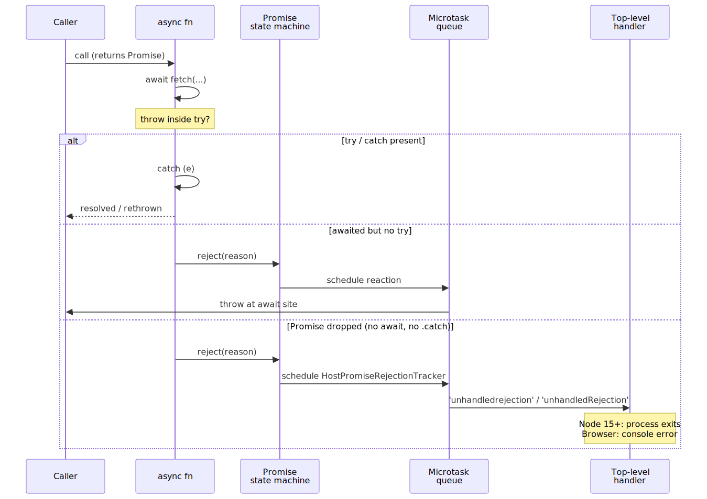
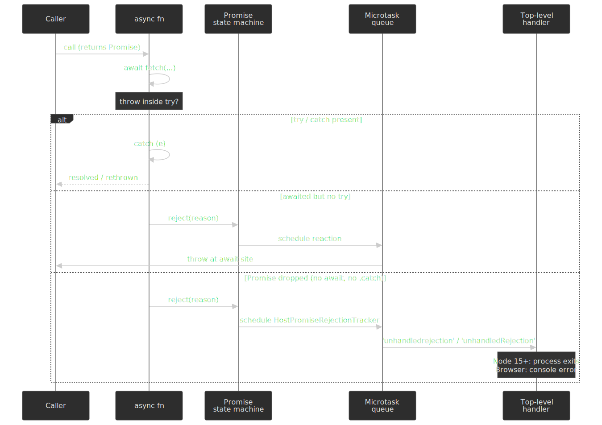

```js collapse={1-2}
// 1. Sync throw in executor → rejection (caught)
new Promise((resolve) => {
  throw new Error("Sync throw") // becomes rejection
})

// 2. Async throw inside executor → uncaught exception
new Promise((resolve) => {
  setTimeout(() => {
    throw new Error("Escapes!") // not catchable from this Promise
  }, 0)
})

// 3. Concurrent await: first rejection wins; siblings keep running
const [a, b] = await Promise.all([
  fetch("/a"), // rejects
  fetch("/b"), // also rejects → handled? no — the second is "lost"
])

// Use Promise.allSettled when you need every outcome
const settled = await Promise.allSettled([fetch("/a"), fetch("/b")])
```

ES2025 ships [`Promise.try`](https://github.com/tc39/proposal-promise-try) (Stage 4, finished 2024-10-09) to collapse the sync-or-async ambiguity at any callback boundary into one rejection path:

```js
// Works for sync throw, async throw, and plain return.
await Promise.try(() => maybeSyncOrAsync()).catch(handle)
```

Reach for it whenever you wrap a callback supplied by user code or by a library you do not control — it removes the "sync exception escaped my Promise chain" footgun without an extra `try/catch`.

### TypeScript: `catch (e: unknown)` and narrowing

Since TypeScript 4.4, the [`useUnknownInCatchVariables`](https://www.typescriptlang.org/tsconfig/useUnknownInCatchVariables.html) compiler option types catch parameters as `unknown` rather than `any`, and `strict: true` turns it on automatically. The change is correct: ECMA-262 lets anything be thrown, and `unknown` forces a guard.

```ts
try {
  riskyOperation()
} catch (error) {
  if (error instanceof Error) {
    console.log(error.message)
  } else if (typeof error === "string") {
    console.log(error)
  } else {
    console.log("Unknown thrown value:", error)
  }
}
```

The standard narrowing patterns:

```ts title="error-guards.ts"
export function isError(value: unknown): value is Error {
  return value instanceof Error
}

export function asError(value: unknown): Error {
  if (value instanceof Error) return value
  if (typeof value === "string") return new Error(value)
  try {
    return new Error(JSON.stringify(value))
  } catch {
    return new Error(String(value))
  }
}

export function hasCode<T extends string>(
  value: unknown,
  code: T,
): value is Error & { code: T } {
  return value instanceof Error && (value as { code?: unknown }).code === code
}
```

The annotation on the catch parameter itself is **restricted to `unknown` or `any`** — TypeScript does not allow you to claim a more specific type at the binding site. Narrow inside the block, do not annotate at the colon.

### `Error.isError` for cross-realm checks

`Error.isError` reached [Stage 4 in 2025](https://github.com/tc39/proposal-is-error) and is included in the [ECMAScript 2026 specification](https://tc39.es/ecma262/). It addresses the cross-realm `instanceof` footgun:

```js
const iframe = document.createElement("iframe")
document.body.appendChild(iframe)
const ForeignError = iframe.contentWindow.Error
const e = new ForeignError("from iframe")

e instanceof Error      // false — different Error constructor
Error.isError(e)        // true — checks [[ErrorData]] internal slot
```

The check is an internal-slot test, so subclasses created with `class MyError extends Error` are still detected, but a plain object that happens to have `message` and `stack` is not. Prefer `Error.isError` over `instanceof Error` in any code that crosses realms (iframes, workers, vm contexts, Node's `vm.runInNewContext`).

### Async stack traces

V8 ships [zero-cost async stack traces](https://v8.dev/blog/fast-async) (Chrome 73 / Node.js 12+, default). The engine reconstructs the suspend / resume chain across `await` (and `Promise.all`) by walking the resumption metadata it already keeps for the microtask scheduler — there is no per-await capture cost. The DevTools "stitched" stack covers more cases (`setTimeout`, `requestAnimationFrame`, raw `then` callbacks) but only when the inspector is attached.[^v8-async]

Two practical rules:

- For raw `Promise.then` chains, the zero-cost mechanism does **not** stitch; rely on `cause` to carry the original frame.
- `Error.stackTraceLimit` defaults to 10. Bump it temporarily when debugging deep async chains; restore it to keep production overhead bounded.

### `AbortController`, `AbortSignal`, and `AbortError`

`AbortController` is the standard cancellation primitive, plumbed through `fetch`, `Request`, `EventTarget.addEventListener`, Node's HTTP / FS / streams APIs, and most modern libraries. It throws a `DOMException` named `"AbortError"`, not a regular `Error`:

```ts title="cancellable-fetch.ts"
const ctrl = new AbortController()
const t = setTimeout(() => ctrl.abort(new DOMException("Slow", "TimeoutError")), 5_000)
try {
  const res = await fetch(url, { signal: ctrl.signal })
  return await res.json()
} catch (e) {
  if (e instanceof DOMException && e.name === "AbortError") return null // user cancellation, not a bug
  if (e instanceof DOMException && e.name === "TimeoutError") {
    metrics.increment("fetch.timeout")
    throw e
  }
  throw new Error("fetch failed", { cause: e })
} finally {
  clearTimeout(t)
}
```

The modern surface to know:

- [`AbortSignal.timeout(ms)`](https://developer.mozilla.org/en-US/docs/Web/API/AbortSignal/timeout) returns a signal that aborts with a `TimeoutError` `DOMException`.
- [`AbortSignal.any([s1, s2])`](https://developer.mozilla.org/en-US/docs/Web/API/AbortSignal/any) composes multiple signals — the first to abort wins.
- [`signal.throwIfAborted()`](https://developer.mozilla.org/en-US/docs/Web/API/AbortSignal/throwIfAborted) is the cooperative-cancellation entry point inside long-running async work.
- [`signal.reason`](https://developer.mozilla.org/en-US/docs/Web/API/AbortSignal/reason) carries whatever you passed to `abort(reason)`; pass a typed object to distinguish "user clicked cancel" from "request superseded by newer one".

Treat `AbortError` as a **non-failure** — it represents a cooperative outcome, not a bug. Logging it as an error skews dashboards.

### Structured cloning and worker error transmission

`postMessage` between a window and a Worker (or between iframes) runs the [HTML structured-clone algorithm](https://html.spec.whatwg.org/multipage/structured-data.html#structuredserializeinternal). Errors are explicitly clonable as of HTML Living Standard:

| Property | Cloned                                                                      |
| :------- | :-------------------------------------------------------------------------- |
| `name`   | Yes (must); falls back to `"Error"` if not one of the seven recognised names |
| `message`| Yes (must)                                                                   |
| `stack`  | Implementation-defined; preserved by Chromium and Firefox                    |
| `cause`  | Implementation-defined; preserved by Chromium and Firefox, [not WebKit](https://github.com/whatwg/html/issues/11321) |

`AggregateError.errors` is recursively cloned. Userland subclasses lose their constructor and arrive on the other side as a plain `Error` whose `name` matches the original. If you need richer transport, serialise to a plain object yourself (`{ name, message, stack, code, ... }`) and reconstruct.

Workers expose three relevant events:

- **`error`** on the `Worker` instance fires when the worker throws an _uncaught_ exception. The event is an `ErrorEvent` carrying `message`, `filename`, `lineno`, and (in modern engines) the original `Error` on `.error`.
- **`messageerror`** fires when a posted message _cannot_ be deserialized — useful for catching cross-realm clone failures.
- **`unhandledrejection`** also fires on `WorkerGlobalScope`; install handlers symmetrically with the main thread.

### Browser top-level handlers

The browser exposes two global error events on `Window` (and `WorkerGlobalScope`):

| Event                  | Interface                | Fires when                                                                            |
| :--------------------- | :----------------------- | :------------------------------------------------------------------------------------ |
| `error`                | [`ErrorEvent`](https://developer.mozilla.org/en-US/docs/Web/API/ErrorEvent)                       | A script throws and no handler caught it.                                            |
| `unhandledrejection`   | [`PromiseRejectionEvent`](https://developer.mozilla.org/en-US/docs/Web/API/PromiseRejectionEvent) | A rejected Promise has no handler at microtask drain.                                |
| `rejectionhandled`     | [`PromiseRejectionEvent`](https://developer.mozilla.org/en-US/docs/Web/API/Window/rejectionhandled_event) | A previously unhandled rejection got a handler later (useful for clearing dashboards). |

```ts title="install-global-handlers.ts"
window.addEventListener("error", (event: ErrorEvent) => {
  reporter.captureError(event.error ?? new Error(event.message), {
    src: event.filename,
    line: event.lineno,
  })
  // event.preventDefault() to suppress the browser's default console output
})

window.addEventListener("unhandledrejection", (event: PromiseRejectionEvent) => {
  reporter.captureError(event.reason instanceof Error ? event.reason : new Error(String(event.reason)))
  // event.preventDefault() to mark as handled — DOMException AbortError typically should be silenced
})
```

Two non-obvious points:

- **Resource load failures don't bubble.** An `` or `<script>` `error` event reaches `window` only through capture-phase listeners (`{ capture: true }`), because the spec says these don't bubble.
- **`window.onerror` (the IDL attribute) has a legacy 5-arg signature** `(message, source, lineno, colno, error)` — don't use it for new code; prefer `addEventListener('error', ...)`.

### Node.js top-level handlers

Node's [`process` events](https://nodejs.org/api/process.html) mirror the browser surface, with materially different defaults:

- **`uncaughtException`** — default behaviour: print stack to stderr and exit with code `1`. Installing a listener overrides the exit; the [docs are explicit](https://nodejs.org/api/process.html#event-uncaughtexception) that this is "for synchronous cleanup, not recovery".
- **`uncaughtExceptionMonitor`** — fires _before_ `uncaughtException`, observation only; does **not** prevent the crash.
- **`unhandledRejection`** — since [Node 15.0.0](https://nodejs.org/en/blog/release/v15.0.0) the default is `--unhandled-rejections=throw`, which converts the rejection into an `uncaughtException` and exits. Earlier behaviour (`warn`) is still selectable but should not ship in production.
- **`rejectionHandled`** — symmetric to the browser, fires when a previously-unhandled rejection gets a handler.

```ts title="server-error-pipeline.ts"
process.on("unhandledRejection", (reason, promise) => {
  reporter.captureError(reason instanceof Error ? reason : new Error(String(reason)))
  throw reason // let the process die; supervisor will restart
})

process.on("uncaughtException", (err, origin) => {
  reporter.captureError(err, { origin })
  // synchronous cleanup only — close logger, flush stdout, then exit
  void shutdown(1)
})
```

The hard rule: **never swallow `uncaughtException` in a long-running process**. The state of the heap after an uncaught throw is undefined; the only safe action is to flush, log, and exit. Leave restart to the supervisor (systemd, Kubernetes, PM2, Docker `--restart`).

> [!CAUTION]
> **`node:domain` is documentation-only deprecated** ([DEP0032](https://nodejs.org/api/deprecations.html#DEP0032)). It survives for compatibility but will be removed. The replacement for the "carry context across async boundaries" use case is [`AsyncLocalStorage`](https://nodejs.org/api/async_context.html#class-asynclocalstorage); for crash isolation, use a process supervisor and the `cluster` module. There is no modern equivalent of "catch all errors that originated in this request and continue serving" — that pattern was unsafe by design.

### React 19 Error Boundaries

A React Error Boundary is a class component implementing `static getDerivedStateFromError(error)` (render-phase fallback) and / or `componentDidCatch(error, info)` (commit-phase logging). It catches errors thrown during **render**, **constructor**, and **lifecycle** of any descendant. It does **not** catch:

- Event handlers (`onClick`, `onSubmit`, …) — wrap with `try/catch`, or trigger a re-render that throws on the next render pass.
- Asynchronous code (`setTimeout`, `fetch.then`, raw Promises) — same workaround.
- Server-side rendering (use the framework's SSR error hook).
- Errors inside the boundary's own render.


React 19 added two root-level callbacks on `createRoot` / `hydrateRoot` for centralised reporting:

```tsx title="root.tsx"
import { createRoot } from "react-dom/client"

createRoot(document.getElementById("root")!, {
  onCaughtError: (error, info) => reporter.captureError(error, { caughtBy: info.componentStack }),
  onUncaughtError: (error, info) => reporter.captureError(error, { uncaught: true }),
  onRecoverableError: (error) => reporter.captureWarning(error),
})
```

`onCaughtError` fires for errors a boundary handled; `onUncaughtError` fires for errors no boundary handled (including the boundary's own throw). They replace the prior pattern of patching `console.error` to forward errors to your reporter.

For the practical UI, use [`react-error-boundary`](https://github.com/bvaughn/react-error-boundary) — it provides `<ErrorBoundary fallbackRender={...} onReset={...}>`, `useErrorBoundary` (to throw async errors back into the boundary), and `withErrorBoundary` for wrapping. Pair it with route-level boundaries plus a top-level fallback so a crash in one route does not blank the whole app.

## Recipes

### Wrapping throwing APIs at the boundary

The integration with throwing libraries is one place where `try/catch` is the only correct tool. Convert at the seam, not in the middle of business logic:

```ts title="boundary.ts"
import { Result, ok, err } from "neverthrow"

class ParseError extends Error {
  override name = "ParseError"
}

export function parseJson<T>(input: string): Result<T, ParseError> {
  try {
    return ok(JSON.parse(input) as T)
  } catch (cause) {
    return err(new ParseError("invalid JSON", { cause }))
  }
}
```

Inside the boundary the function looks throwing; outside it the function looks `Result`-returning. Callers compose declaratively without re-running the conversion.

### `Promise.try` for sync-or-async callbacks

Anywhere you accept a callback that _might_ throw synchronously and _might_ return a Promise, route through `Promise.try` so the rejection path is single:

```ts
async function safeRun<T>(fn: () => T | Promise<T>): Promise<Result<T, Error>> {
  try {
    return ok(await Promise.try(fn))
  } catch (cause) {
    return err(cause instanceof Error ? cause : new Error(String(cause), { cause }))
  }
}
```

### From exceptions to values: the trade-off

The choice between throw-based and return-based handling is the largest single decision in this design space.

**Exception model** (`try/catch`): Failure is a side effect. Functions have two exit paths — return and throw — but only one is in the type. Stack-trace capture and unwinding can be 10×–100× slower than a normal return on the throw path; the empty `try` block itself has been free in V8 since 6.x (Node 8.3+).[^v8-trycatch][^throw-bench]

**Value model** (`Result<T, E>`): Failure is data. Functions return a discriminated union that forces callers to acknowledge both outcomes. Operations compose via `.map` (transform success) and `.andThen` (chain fallible work), with failures short-circuiting subsequent success handlers — Railway Oriented Programming.

| Criterion       | try/catch                  | [data, error]          | Result Monad        |
| --------------- | -------------------------- | ---------------------- | ------------------- |
| Type safety     | `catch` receives `unknown` | Convention-based       | Compiler-enforced   |
| Composability   | Imperative nesting         | Repetitive `if (err)`  | Fluent chaining     |
| Failure forcing | Easy to ignore             | Easy to ignore         | Linting can enforce |
| Performance     | Stack unwinding            | Value return           | Value return        |
| Debugging       | Native stack traces        | May lose stack context | Errors are values   |


### Go-style `[data, error]` tuples

The cheapest "make failure visible at the call site" pattern. Useful for scripts and prototypes; a leaky abstraction at scale.

```ts collapse={1-2}
function to<T>(p: Promise<T>): Promise<[T | null, Error | null]> {
  return p.then((data) => [data, null]).catch((err) => [null, err])
}

const [user, err] = await to(fetchUser(id))
if (err) return null
return user
```

**Why it leaks**: `[T | null, E | null]` admits four states, not two. The type system cannot rule out `[null, null]` or `[value, error]` without a discriminant.

; Result has exactly 2 valid states.")

### Result types: `neverthrow`, `fp-ts`, Effect-TS

A Result is a discriminated union with exactly two variants:

```ts
type Result<T, E> =
  | { ok: true; value: T }
  | { ok: false; error: E }
```

This makes invalid states **impossible at the type level**. Any `Err` short-circuits the rest of the success track and lands in the final error sink — no recovery handler runs unless one is explicitly chained with `.orElse`.


| Method                | Also Known As             | Behavior                                              |
| --------------------- | ------------------------- | ----------------------------------------------------- |
| `.map(fn)`            | `fmap`                    | Transform `Ok` value; `Err` passes through unchanged  |
| `.andThen(fn)`        | `chain`, `flatMap`, `>>=` | Chain fallible operation; `fn` returns `Result`       |
| `.orElse(fn)`         | `recover`                 | Transform `Err`; `Ok` passes through unchanged        |
| `.match(onOk, onErr)` | `fold`, `cata`            | Exit the monad — extract a value by handling both cases |

`neverthrow` (v8.2.0, [released 2025-02-21](https://github.com/supermacro/neverthrow/releases)) is the pragmatic default — method-chaining API familiar to OOP developers, ergonomic `ResultAsync`, and a [companion ESLint rule](https://github.com/mdbetancourt/eslint-plugin-neverthrow) that fails the build when a `Result` is dropped:

```ts title="neverthrow-pipeline.ts"
import { ok, err, Result } from "neverthrow"

function parseNumber(s: string): Result<number, string> {
  const n = parseFloat(s)
  return Number.isNaN(n) ? err("Invalid number") : ok(n)
}

const message = parseNumber("10")
  .map((x) => x * 2)
  .andThen((x) => (x > 15 ? ok(x) : err("Value too small")))
  .match(
    (value) => `Computation succeeded: ${value}`,
    (error) => `Computation failed: ${error}`,
  )
```

Notable v8.x changes versus v7: `.orElse()` can change the `Ok` type, `safeTry` accepts `yield* result` directly (no `.safeUnwrap()`), and `.orTee()` mirrors `andTee` on the error track ([release notes](https://github.com/supermacro/neverthrow/releases)).

`fp-ts` (v2.16.x, the current line) is the comprehensive functional toolkit; its `Either<E, A>` is the same shape under different naming (`Left` / `Right`). The killer feature there is the `pipe()` style and the rest of the FP ecosystem (`Option`, `Task`, `Reader`, …).

> [!IMPORTANT]
> **fp-ts is moving into Effect-TS.** Giulio Canti, fp-ts's creator, has joined the [Effect-TS](https://effect.website/) organisation and Effect is positioned as the [official migration target](https://effect.website/docs/additional-resources/effect-vs-fp-ts/). New code that wants the full FP ecosystem (effects, dependency injection, fibers, observability) should start on Effect rather than fp-ts. fp-ts itself remains stable for existing codebases.

| Library                                              | Focus              | API Style          | Notes                            |
| ---------------------------------------------------- | ------------------ | ------------------ | -------------------------------- |
| [neverthrow](https://github.com/supermacro/neverthrow) | Result types       | Method chaining    | Pragmatic default; ESLint rule   |
| [fp-ts](https://gcanti.github.io/fp-ts/)             | Full FP toolkit    | `pipe()` + free fns| Comprehensive; steep learning    |
| [Effect-TS](https://effect.website/)                 | Effect system      | Method + generator | fp-ts successor                  |
| [ts-results](https://github.com/vultix/ts-results)   | Minimal Result     | Method chaining    | Lightweight, zero deps           |
| [oxide.ts](https://github.com/traverse1984/oxide.ts) | Rust-like          | Method chaining    | Closer to Rust's std::result     |
| [true-myth](https://github.com/true-myth/true-myth)  | Maybe + Result     | Method chaining    | Good documentation               |

### Migrating an existing codebase

Convert at the boundary first, expand inward.

```ts collapse={1-3} title="migrate.ts"
import { Result, ok, err, ResultAsync } from "neverthrow"

function parseJson<T>(input: string): Result<T, SyntaxError> {
  try {
    return ok(JSON.parse(input) as T)
  } catch (e) {
    return err(e instanceof SyntaxError ? e : new SyntaxError(String(e)))
  }
}

function processUserInput(
  input: string,
): Result<User, ParseError | ValidationError> {
  return parseJson<UserInput>(input)
    .mapErr((e) => new ParseError(e.message, { cause: e }))
    .andThen(validateUser)
}
```

Keep `try/catch` at the entry points — HTTP handlers, CLI commands, message-queue consumers — to catch any throws from code that has not been converted yet. Install `eslint-plugin-neverthrow` from the start so unconsumed Results are caught at PR time rather than in production.

## Anti-patterns

| Anti-pattern                                                 | Why it's wrong                                                                                       | Do this instead                                                                |
| :----------------------------------------------------------- | :--------------------------------------------------------------------------------------------------- | :----------------------------------------------------------------------------- |
| **Empty `catch`**                                            | Errors disappear; observability dies.                                                                | Re-throw, log with context, or convert to a typed `Result`.                    |
| **Throwing strings / numbers / plain objects**               | No stack trace; `instanceof Error` lies; structured cloning loses the type.                         | `throw new Error(...)` or a typed subclass.                                    |
| **Swallowing `await` in `Promise.all`**                      | First rejection wins; sibling rejections become unhandled.                                          | `Promise.allSettled` for independent work; `AbortController` to cancel siblings. |
| **Using exceptions for control flow** (e.g. early-exit loop) | Throw path is one to two orders of magnitude slower than a return; pollutes traces.                 | Return a sentinel, break, or use `find`.                                       |
| **Catching `AbortError` and reporting it as a failure**      | Abort is cooperative cancellation, not a bug. Inflates error budgets.                               | Branch on `error.name === 'AbortError'` and treat as expected.                 |
| **Silencing `unhandledRejection` to keep Node alive**       | Heap state is undefined; the next request hits corrupted invariants.                                | Log + flush + exit; let the supervisor restart.                                |
| **Using `node:domain` for crash isolation**                  | Deprecated; never replaced because the pattern is unsafe by design.                                 | `AsyncLocalStorage` for context; supervisor for restart.                       |
| **Wrapping with `new Error(e.message)` and dropping `e`**   | Loses stack; loses `cause` chain; loses subclass identity.                                          | `throw new Error("...", { cause: e })`.                                        |
| **`instanceof Error` across realms**                         | Different `Error` constructor per realm; check returns `false` for foreign errors.                  | `Error.isError(e)` (ES2026) or a duck-typed guard on `name` + `message`.       |
| **Catching in a React event handler then re-throwing**      | Throw outside render is invisible to the boundary.                                                  | Set state that throws on next render, or use `useErrorBoundary`'s `showBoundary`. |
| **Boundary without `componentDidCatch`**                    | You get a fallback UI but no logging; no signal in production.                                       | Log in `componentDidCatch` and / or `onCaughtError`.                           |
| **Using `Promise.any` and forgetting `AggregateError`**      | Catching with `e.message` reads `"All promises were rejected"`; the inner errors are on `e.errors`. | `if (e instanceof AggregateError) for (const inner of e.errors) ...`           |

## TC39 trajectory

The headline gaps are partially being closed by the language. The state of play as of April 2026:

| Proposal                                                                                                | Stage | Status                                                                                                                                                       |
| :------------------------------------------------------------------------------------------------------ | :---- | :----------------------------------------------------------------------------------------------------------------------------------------------------------- |
| [`Error.isError`](https://github.com/tc39/proposal-is-error)                                           | 4     | Finished, in ES2026. Cross-realm error detection.                                                                                                            |
| [`Promise.try`](https://github.com/tc39/proposal-promise-try)                                          | 4     | Finished, in ES2025. Unified sync / async error path for callback wrappers.                                                                                  |
| [Pipeline operator — Hack pipe](https://github.com/tc39/proposal-pipeline-operator)                     | 2     | Topic-token bikeshed (`%` vs `^` vs `#`) ongoing. Use Babel for experimentation; do not ship.                                                                 |
| [Pattern matching `match`](https://github.com/tc39/proposal-pattern-matching)                          | 1     | Stage 1 since 2018; the natural Result consumer if it ever ships.                                                                                            |
| [`throw` expressions](https://github.com/tc39/proposal-throw-expressions)                               | 2     | TypeScript already supports the syntax. Useful for default-parameter validation and arrow shorthand.                                                          |
| [`do` expressions](https://github.com/tc39/proposal-do-expressions)                                    | 1     | Block as expression; `try { ... } catch { fallback }` becomes inline.                                                                                         |
| [Try Operator](https://github.com/arthurfiorette/proposal-try-operator)                                | 0     | Successor to the dropped Safe Assignment Operator (`?=`). Returns a Result-shaped object. Looking for a TC39 champion; do not wait for it.                   |

```js title="future-syntax-ideas.js"
const greet = (name = throw new Error("Required")) => `Hello, ${name}`
const fail = () => throw new Error("Not implemented")
const value = condition ? result : throw new Error("Failed")
```

## Decision framework


**When to use `try/catch`**: API boundaries (parsing, third-party throwing libs), top-level safety nets (HTTP handler, CLI, worker), and React event handlers / async work that must trigger a boundary fallback.

**When to use Go-style tuples**: scripts, prototypes, or single-call helpers where adding a dependency is more cost than the safety buys.

**When to use `Result<T, E>`**: business logic with multiple fallible steps, data-processing pipelines, anything where "forgot to check" would cause a production incident.

**When to use Effect-TS / fp-ts**: the entire codebase is committed to FP and you want effects, dependency injection, fibers, and observability in one package.

| Scenario                 | Recommendation                              |
| ------------------------ | ------------------------------------------- |
| Most TypeScript projects | `neverthrow` — best ergonomics / safety balance |
| Full FP commitment       | `fp-ts` (legacy) → Effect-TS (new code)     |
| Minimal bundle size      | `ts-results` (~2 KB)                        |
| Rust API familiarity     | `oxide.ts`                                  |

## Practical takeaways

- **Map every code path onto the three axes** (channel, phase, realm) before reaching for syntax. The bug is usually that you're handling the wrong axis.
- **Throw `Error` subclasses with `cause`, never bare values.** `Error.isError` (ES2026) plus `cause` is a complete, cross-realm-safe error story for new code.
- **Wrap once at the boundary, return `Result` everywhere inside.** The boundary is where the engine takes over: HTTP handler, CLI entry, React error boundary, Worker `onmessage`, microtask queue.
- **Treat `AbortError` as success.** Cooperative cancellation must not page anyone.
- **Install both top-level handlers and a process supervisor.** Browsers: `error` + `unhandledrejection` reporting to your RUM. Node: log + flush + `process.exit(1)`; let the supervisor restart.
- **Use React 19's `onCaughtError` / `onUncaughtError`** as the single funnel for client-side reporting; pair with route-level `<ErrorBoundary>` so one route's crash does not blank the whole app.
- **Bump `Error.stackTraceLimit` only while debugging.** Default 10; production should not pay for deeper captures.

## Appendix

### Prerequisites

- TypeScript generics, union types, discriminated unions.
- Promise / `async`-`await` mechanics; the microtask queue.
- React component lifecycle (for the boundary section).

### Terminology

| Term                             | Definition                                                                                                            |
| -------------------------------- | --------------------------------------------------------------------------------------------------------------------- |
| **`[[ErrorData]]` internal slot** | The hidden flag that distinguishes a real `Error` instance from a duck-typed object with `name`/`message`.            |
| **Completion record**            | ECMA-262 internal record passed up the call stack; `ThrowCompletion` is what `throw` produces.                        |
| **Discriminated union**          | A union type where each variant carries a literal field (tag) enabling type narrowing.                                |
| **Microtask**                    | Job queued on the host's microtask queue; Promise reactions, `queueMicrotask`, and mutation observers run here.       |
| **Monad**                        | An abstraction providing `unit` (wrap value) and `bind` (chain operations) satisfying identity and associativity laws. |
| **Railway Oriented Programming** | Error pattern where success / failure are parallel tracks, with failures bypassing subsequent success handlers.       |
| **Realm**                        | An isolated execution context (window, iframe, worker, vm) with its own globals and prototype chain.                  |
| **Result / Either**              | Discriminated union with exactly two variants: success (`Ok` / `Right`) and failure (`Err` / `Left`).                 |
| **`ThrowCompletion`**            | ECMA-262 completion record produced by `throw`.                                                                       |
| **Topic reference**              | In Hack pipes, the placeholder (`%`) representing the value from the previous pipeline step.                          |
| **Zero-cost async stack trace**  | V8's reconstruction of the await chain from existing scheduler metadata; no per-`await` capture overhead.            |

### References

**Specifications**

- [ECMA-262 (latest editor's draft)](https://tc39.es/ecma262/) — ES2026, 17th edition
- [ECMA-262 (ES2025)](https://tc39.es/ecma262/2025/) — last published yearly snapshot
- [ECMA-262 §14.15 — `try` Statement](https://tc39.es/ecma262/#sec-try-statement)
- [ECMA-262 §14.14 — `throw` Statement](https://tc39.es/ecma262/#sec-throw-statement)
- [ECMA-262 §20.5 — Error Objects](https://tc39.es/ecma262/#sec-error-objects)
- [HTML Living Standard — Structured serialization](https://html.spec.whatwg.org/multipage/structured-data.html#structuredserializeinternal)

**MDN**

- [`Error`](https://developer.mozilla.org/en-US/docs/Web/JavaScript/Reference/Global_Objects/Error)
- [`Error.cause`](https://developer.mozilla.org/en-US/docs/Web/JavaScript/Reference/Global_Objects/Error/cause)
- [`AggregateError`](https://developer.mozilla.org/en-US/docs/Web/JavaScript/Reference/Global_Objects/AggregateError)
- [`Promise`](https://developer.mozilla.org/en-US/docs/Web/JavaScript/Reference/Global_Objects/Promise)
- [`AbortController` / `AbortSignal`](https://developer.mozilla.org/en-US/docs/Web/API/AbortController)
- [`Window` `error` event / `ErrorEvent`](https://developer.mozilla.org/en-US/docs/Web/API/Window/error_event)
- [`Window` `unhandledrejection` / `PromiseRejectionEvent`](https://developer.mozilla.org/en-US/docs/Web/API/Window/unhandledrejection_event)
- [`structuredClone()`](https://developer.mozilla.org/en-US/docs/Web/API/Window/structuredClone)

**Runtime docs**

- [Node.js `process` events](https://nodejs.org/api/process.html#process-events)
- [Node.js `--unhandled-rejections=throw`](https://nodejs.org/api/cli.html#--unhandled-rejectionsmode)
- [Node.js `node:domain` deprecation (DEP0032)](https://nodejs.org/api/deprecations.html#DEP0032)
- [Node.js `AsyncLocalStorage`](https://nodejs.org/api/async_context.html#class-asynclocalstorage)
- [V8 — Faster async functions and zero-cost stack traces](https://v8.dev/blog/fast-async)

**TypeScript / React**

- [TypeScript — `useUnknownInCatchVariables`](https://www.typescriptlang.org/tsconfig/useUnknownInCatchVariables.html)
- [React 19 release notes — root error options](https://react.dev/blog/2024/12/05/react-19)
- [React Error Boundaries (legacy docs page, still authoritative on the API)](https://legacy.reactjs.org/docs/error-boundaries.html)
- [`react-error-boundary`](https://github.com/bvaughn/react-error-boundary)

**TC39 proposals**

- [`Error.isError` (Stage 4)](https://github.com/tc39/proposal-is-error)
- [`Promise.try` (Stage 4)](https://github.com/tc39/proposal-promise-try)
- [Pipeline operator (Stage 2)](https://github.com/tc39/proposal-pipeline-operator)
- [Pattern matching (Stage 1)](https://github.com/tc39/proposal-pattern-matching)
- [`throw` expressions (Stage 2)](https://github.com/tc39/proposal-throw-expressions)
- [`do` expressions (Stage 1)](https://github.com/tc39/proposal-do-expressions)
- [Try Operator (Stage 0)](https://github.com/arthurfiorette/proposal-try-operator)

**Libraries**

- [neverthrow](https://github.com/supermacro/neverthrow) (v8.2.0)
- [eslint-plugin-neverthrow](https://github.com/mdbetancourt/eslint-plugin-neverthrow)
- [fp-ts](https://gcanti.github.io/fp-ts/) (v2.16.x)
- [Effect-TS](https://effect.website/)
- [ts-results](https://github.com/vultix/ts-results)
- [oxide.ts](https://github.com/traverse1984/oxide.ts)

**Practitioner content**

- [Railway Oriented Programming — Scott Wlaschin](https://fsharpforfunandprofit.com/rop/)
- [Error handling in Go](https://go.dev/blog/error-handling-and-go)
- [Working with errors in Go 1.13](https://go.dev/blog/go1.13-errors)

[^v8-trycatch]: V8 issue tracker and discussion summarised in [this Stack Overflow answer](https://stackoverflow.com/a/19828306) — `try/catch` ceased to deoptimize the enclosing function in V8 6.x.

[^throw-bench]: See the [Node.js throw-vs-return benchmark thread](https://stackoverflow.com/questions/70677082/nodejs-is-there-still-a-performance-penalty-to-throwing-errors) which decomposes the cost into Error allocation and stack-trace capture; suppressing `Error.captureStackTrace` collapses the gap dramatically.

[^v8-async]: [V8 — Faster async functions and promises](https://v8.dev/blog/fast-async); the "zero-cost" reconstruction works for `await` and `Promise.all`, not for raw `then` chains.
