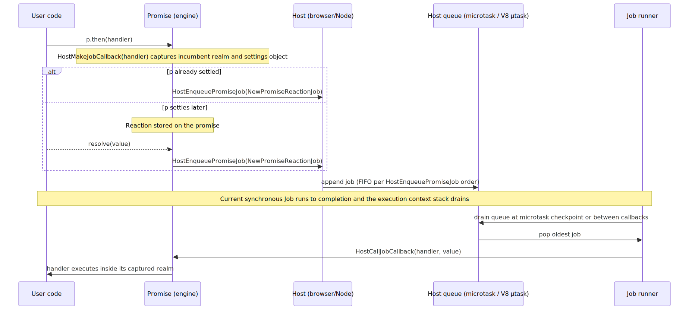
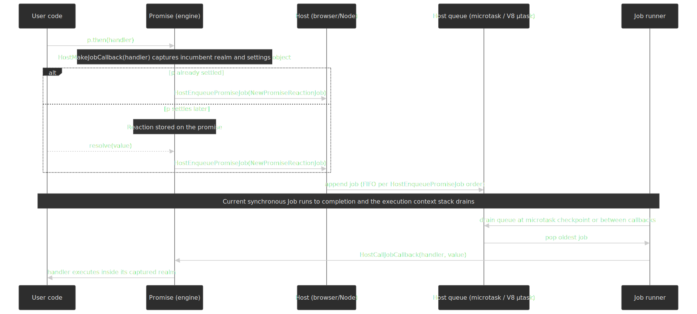

# JavaScript Event Loop: A Foundational Overview

Every JavaScript runtime — browsers, Node.js, Deno, Bun, Workers — is built around the same small contract: ECMAScript defines _Jobs_, _agents_, and four _host hooks_; the host plugs in the actual scheduler, queues, timers, and (for browsers) rendering. This article is the foundational overview for that contract. It establishes one mental model that fits every host, then shows precisely where the browser and Node.js diverge, and ends with the patterns and footguns that follow. For host-specific deep dives, see [Browser Event Loop](../browser-event-loop/README.md), [Node.js Event Loop](../nodejs-event-loop/README.md), and [libuv Internals](../libuv-event-loop-internals/README.md).




## Thesis

There is no "the JavaScript event loop". ECMA-262 specifies a deliberately small surface[^ecma262]:

- A **Job** is an Abstract Closure that "initiates an ECMAScript computation when no other ECMAScript computation is currently in progress" — it runs only when the agent's execution context stack is empty.
- Four host hooks enqueue Jobs: `HostEnqueueGenericJob`, `HostEnqueuePromiseJob`, `HostEnqueueTimeoutJob`, `HostEnqueueFinalizationRegistryCleanupJob`.
- An **agent** is a single thread of evaluation (one stack, one running execution context); an **agent cluster** is the maximum boundary for shared memory.
- The spec does not define "tasks" vs "microtasks", "phases", a render hook, idle callbacks, or any priority order. Those are host policy. §9.5 explicitly notes: "Host environments are not required to treat Jobs uniformly with respect to scheduling. For example, web browsers and Node.js treat Promise-handling Jobs as a higher priority than other work"[^jobs].

The portable guarantees you can lean on:

- One Job runs at a time per agent, to completion.
- `HostEnqueuePromiseJob` invocations execute in invocation order — promise reactions are FIFO per agent.
- An async function's continuation after `await` is scheduled via a promise reaction Job — never inline, even when the awaited value is a primitive.
- The microtask queue is drained _to empty_ between Jobs/tasks, including microtasks that microtasks queue.

Everything else — the rendering integration, libuv phases, `process.nextTick`, the 4 ms timer clamp, `setImmediate`, idle scheduling — is host policy and varies between Chromium, Gecko, WebKit, Node.js, Deno, Bun, Cloudflare Workers, and the rest.

## Mental model: the universal JS loop

Every host realizes the same shape: a single-threaded engine, a heap, two queues (one for tasks, one for microtasks), and a loop that picks one task, runs it to completion, then drains the microtask queue before doing anything else.




### One iteration

A single iteration is the same everywhere: pick one task, push it onto the stack, run synchronous JS to completion, drain microtasks, then — only in the browser — give the rendering pipeline a chance to update.

, then — browser only — take a rendering opportunity.")


Three rules are worth memorizing:

1. **Run-to-completion is per agent, not per task.** No other Job in the same agent can preempt the running synchronous JS — that is the spec's whole concurrency model[^jobs]. This is why you don't need locks around purely-JS data structures within a single agent.
2. **Microtasks drain to empty.** If a microtask queues another microtask, it runs before the next task. There is no "drain N microtasks then yield"; you either let the queue run dry or you starve everything that comes after.
3. **There is no implicit yield.** "Async" code is only async at `await` and Promise-resolution points. A `for` loop with no `await` is exactly as blocking as it would be in synchronous JS.

### Agents, realms, and clusters (skim)

The spec's concurrency boundary has three nested concepts[^agents]: a **Realm** is one JavaScript world (its own `globalThis` and intrinsics — same-origin iframes, `vm.createContext()`, V8 `Context`s); an **Agent** is one thread of evaluation (window agent, dedicated worker, Node main thread, `worker_threads.Worker`); an **Agent Cluster** is the maximum set of agents that can share `SharedArrayBuffer` memory. A V8 `Isolate` ≈ an agent; multiple Realms (`Context`s) live inside one isolate. Crossing isolates requires postMessage; crossing Realms inside an isolate is a direct call. Cross-realm calls do **not** yield — they push onto the same execution context stack.

> [!NOTE]
> The Agent Record carries `[[CanBlock]]`, which gates `Atomics.wait`. Browser window agents have `[[CanBlock]] = false`; Workers and the Node main thread are `true`. `Atomics.waitAsync` (ECMAScript 2024) works anywhere because it returns a Promise rather than suspending the thread[^waitasync].

## The four host hooks

ECMA-262 §9.5 defines exactly four hooks, each with its own constraints on top of the basic Job contract.

| Hook | Triggered by | Extra spec constraint |
| :--- | :--- | :--- |
| `HostEnqueueGenericJob(job, realm)` | Engine bookkeeping; rarely user-triggered | None beyond §9.5 — explicitly _not_ FIFO[^jobs] |
| `HostEnqueuePromiseJob(job, realm)` | `Promise.then`, `await`, async function bodies, thenable adoption via `Promise.resolve` | Jobs must run in invocation order (FIFO across all promise reactions on the agent)[^enqueue-promise-job] |
| `HostEnqueueTimeoutJob(job, realm, ms)` | Timer infrastructure routed through the spec hook | Run "after at least `ms` milliseconds"[^jobs] |
| `HostEnqueueFinalizationRegistryCleanupJob(registry)` | A registered target becomes unreachable | Optional — "if possible"; the host may skip it entirely[^jobs] |

Two non-obvious things:

- **FIFO is only guaranteed for promise jobs.** `HostEnqueueGenericJob` says its closures "are intended to be scheduled without additional constraints, such as priority and ordering"[^jobs]. If you ever see an engine-internal job appear out of order relative to a promise reaction, that is spec-compliant.
- **Timeouts and timers are host-routed.** The HTML spec routes `setTimeout` through its own task source (not `HostEnqueueTimeoutJob`); Node.js routes timers through libuv. The hook exists so an embedder that wants a uniform mechanism can use it.

When a host enqueues a Job that will eventually call into user code, it has to carry the right "settings" across the asynchronous boundary. `HostMakeJobCallback` returns a `JobCallback` Record `{ [[Callback]], [[HostDefined]] }`; browsers use `[[HostDefined]]` to carry the **incumbent settings object** so a `then` handler scheduled from frame A but resolved by code from frame B still attributes script origin to frame A. Both `HostMakeJobCallback` and `HostCallJobCallback` carry a hard rule: "ECMAScript hosts that are not web browsers must use the default implementation"[^jobs]. Node, Deno, and Bun are spec-bound to the trivial pass-through.

## Promise resolution timing

`Promise.then`, `await`, and the body of every async function ultimately schedule promise reactions via two abstract operations[^promise-jobs]: `NewPromiseReactionJob` (when a settled promise has a handler attached, or when an attached handler has its promise settled) and `NewPromiseResolveThenableJob` (when `Promise.resolve` adopts a foreign thenable). Both go through `HostEnqueuePromiseJob`.




### `await` is exactly a promise reaction — there is no fast path

The `Await` abstract operation wraps the awaited value in `PromiseResolve` (so non-thenables become resolved promises), attaches an internal handler that resumes the async function's generator state, and suspends the running execution context. The resumption handler runs as a normal promise reaction. **There is no synchronous fast path** for `await Promise.resolve(v)` or `await 1` — both schedule a microtask:

```ts title="await-microtask.ts"
async function f() {
  console.log("a");
  await 1;
  console.log("b");
}
f();
console.log("c");
```

Output is `a`, `c`, `b`. The `b` continuation is scheduled via `HostEnqueuePromiseJob` and runs after the synchronous `console.log("c")` completes and the stack unwinds. Anyone relying on `await x` to be synchronous when `x` is a primitive is reading non-spec behavior.

### `then` ordering is a language guarantee

Because `HostEnqueuePromiseJob` is FIFO, two `then` handlers registered in order on the same agent fire in that order — across nested promises, across realms, in any conformant host. This is one of the few ordering guarantees that does port between Chromium, Gecko, WebKit, Node, Deno, Bun, Cloudflare Workers, and Edge runtimes.

## Browser vs Node.js

The two runtimes implement the same hooks but wrap them in very different scheduler shells. The browser model has one task queue (composed of multiple task sources), one microtask checkpoint per task, and a render opportunity that the spec models as a separate task on the rendering task source after the 2024 refactor[^html-jobs]. Node's model is libuv's phased loop: six phases in fixed order, with the microtask queue (and Node's own `process.nextTick` queue) drained _between every callback_, not only at phase boundaries[^node-event-loop].

, and after every callback in any phase drains process.nextTick first and then the microtask queue.")


### Browser: WHATWG HTML 8.1.6

The HTML Living Standard overrides every hook on the window/worker event loop[^html-jobs]:

- `HostEnqueuePromiseJob` enqueues onto the **microtask queue** — one queue per event loop, processed at the **microtask checkpoint** after each task. FIFO follows from the spec.
- `HostEnqueueTimeoutJob` queues onto the **timer task source** with HTML's own clamping rules: 1 ms minimum; nested timers (after 5 levels) clamp to 4 ms; background tabs throttle further.
- "Update the rendering" is a formal task on the rendering task source (since [PR #10007](https://github.com/whatwg/html/pull/10007), merged 2024-01-31) — UA-defined frequency, typically aligned to vsync (~16.7 ms at 60 Hz). `requestAnimationFrame` callbacks run inside this task, before style/layout/paint.
- `HostMakeJobCallback` / `HostCallJobCallback` propagate the **incumbent settings object** through `[[HostDefined]]`.
- `HostEnqueueFinalizationRegistryCleanupJob` runs in a microtask-adjacent slot — when it runs at all.

### Node.js: libuv phases + nextTick

Node implements the same hooks against V8's microtask queue but adds a non-spec channel[^node-microtasks]:

- `HostEnqueuePromiseJob` lands on V8's microtask queue, drained by Node after each callback (default `microtaskMode: 'afterTask'`).
- `HostEnqueueTimeoutJob` is bridged to libuv's timer phase. **libuv 1.45 (Node.js 20+) moved timer processing to after the poll phase**, so `setImmediate`-based yielding can now starve other work under load[^libuv-timers].
- `process.nextTick` is **not** a Job. It uses Node's own queue, drained _before_ the V8 microtask queue. In CommonJS, `process.nextTick(f)` runs before `Promise.resolve().then(g)`. In ESM, the entry module evaluation _is itself_ a microtask, so `queueMicrotask` and Promise reactions queued at top level fire before `process.nextTick`[^node-microtasks].
- `HostMakeJobCallback` uses the spec default — non-browser hosts are required to.
- `process.nextTick` is **Stability 3 — Legacy** as of Node.js 22.7 / 20.18; the docs explicitly recommend `queueMicrotask()` instead[^node-microtasks].

### Portability matrix

| Behavior | Spec requires | Browser | Node | Cross-host portable? |
| :--- | :--- | :--- | :--- | :--- |
| One Job at a time per agent | Yes | Yes | Yes | Yes |
| Promise reactions in `then`-call order | Yes (FIFO) | Yes | Yes | Yes |
| Promise reactions before next timer | No (host policy) | Yes | Yes | Yes (de facto) |
| `await x` schedules a microtask, even for primitives | Yes | Yes | Yes | Yes |
| Microtask queue drains to empty between tasks | No (host policy) | Yes | Yes (between every callback) | Yes (de facto) |
| `process.nextTick` before microtasks | No | n/a | Yes (CJS) / No (ESM) | No |
| `setTimeout(fn, 0)` floor | No | 1 ms (4 ms after 5 nesting levels) | 1 ms | No |
| `setImmediate` exists | No | No | Yes | No |
| Render opportunity after microtask checkpoint | No | Yes | n/a | n/a |
| `requestIdleCallback` exists | No | Yes | No | No |
| `FinalizationRegistry` callback ever runs | No (optional) | Sometimes | Sometimes | No |
| `Atomics.wait` blocks the calling thread | Yes — only when `[[CanBlock]] = true` | Workers only | Always (main + workers) | Partially |

## Common patterns and footguns

### Microtask starvation

Because the microtask queue drains to empty before the next task can run, a microtask that keeps queuing more microtasks **never lets the loop advance**. In a browser this freezes rendering and input; in Node it freezes I/O and timers — including the poll phase that would have unblocked the work that resolves the promise.

```ts title="microtask-starvation.ts"
function spin(): Promise<never> {
  return Promise.resolve().then(spin);
}
spin();
setTimeout(() => console.log("never runs"), 0);
```

The same shape with `queueMicrotask(spin)` or with a `for await` loop over an always-resolved async iterator has the same effect. Recursive `then` chains are the easiest accidental version: any "polling" loop expressed as `await checkAgain()` with no underlying I/O will starve the loop.

> [!WARNING]
> If a long-running task must run in chunks, yield with a **task** (`MessageChannel`, `setTimeout`, `scheduler.postTask`, `setImmediate` in Node) — not with a microtask. Microtasks do not yield to rendering, input, or I/O.

### `queueMicrotask` vs `Promise.resolve().then()`

Both schedule onto the same per-agent microtask queue and fire in `HostEnqueuePromiseJob` order. The differences are intent, overhead, and error semantics[^mdn-microtasks]:

| | `queueMicrotask(fn)` | `Promise.resolve().then(fn)` |
| :--- | :--- | :--- |
| Standard intent | Explicit microtask scheduling[^mdn-microtasks] | Side effect of Promise resolution |
| Allocation | None beyond the closure | Allocates a Promise + reaction record |
| Throw inside `fn` | Reported as a normal unhandled exception (`window.onerror` / `uncaughtException`) | Reported as an _unhandled rejection_ on the returned Promise |
| Argument passing | Closure / `bind` | Closure / `bind` |
| Use it for | "Run after this turn, before the next task" | Promise pipelines; not as a microtask shim |

Reach for `queueMicrotask` when you actually want a microtask. Reach for a Promise when you want a Promise.

### `MessageChannel` as a real macrotask trick

`setTimeout(fn, 0)` does **not** mean "next tick". HTML clamps it to 1 ms minimum and to 4 ms once nested past five levels[^html-timers]; background tabs clamp harder. To enqueue a true zero-delay macrotask in the browser, use `MessageChannel`:

```ts title="yield-to-browser.ts"
const channel = new MessageChannel();
const tasks: Array<() => void> = [];
channel.port1.onmessage = () => {
  const fn = tasks.shift();
  fn?.();
};
function macroTask(fn: () => void) {
  tasks.push(fn);
  channel.port2.postMessage(null);
}
```

Each `postMessage` queues a task on the message task source, bypassing the timer clamp. React's scheduler and many microbenchmark harnesses use this pattern for exactly this reason[^macarthur].

> [!TIP]
> Prefer `scheduler.postTask({ priority: "user-blocking" | "user-visible" | "background" })` (Prioritized Task Scheduling, available in Chromium since 94 and Firefox since 142; not yet in Safari[^scheduler-posttask]) when available — it's the standard API and exposes priority. Fall back to `MessageChannel`. Use `setTimeout(fn, 0)` only when you actually want the timer-source semantics.

### `process.nextTick` is legacy in modern Node

`process.nextTick` is faster and higher-priority than the microtask queue, but it is not a Job and not portable to any non-Node host. Node 22.7 / 20.18 marked it **Stability 3 — Legacy** and the docs recommend `queueMicrotask()` for almost every case[^node-microtasks]. Two real reasons remain:

- **API guarantees.** A constructor that needs to give callers time to attach `.on('error')` before async work starts must defer with `nextTick`, not with a Promise (a Promise rejection would already be visible on the next microtask, before user code runs).
- **CJS vs ESM ordering matters.** In CJS, `nextTick` callbacks run before `Promise.then` callbacks queued at the same top level; in ESM they run after, because ESM evaluation is itself a microtask. Anything that depends on this ordering is fragile across module systems[^node-microtasks].

If you don't need either of those, use `queueMicrotask` and your code keeps the same meaning under Workers, Deno, Bun, and the browser.

### `FinalizationRegistry` is "best effort, sometimes never"

`HostEnqueueFinalizationRegistryCleanupJob` is the only host hook the spec marks as optional ("if possible"). Cloudflare Workers explicitly disables FinalizationRegistry-driven cleanup — their post-mortem is the canonical "why you should never rely on it"[^cf-finreg]. Treat any logic whose correctness depends on a finalizer running as broken. Use explicit lifetime instead: `using` declarations (Stage 4 explicit resource management), close hooks, or your own ref counting.

### `Atomics.wait` blocks; on the main thread, use `waitAsync`

Calling `Atomics.wait` on an agent whose `[[CanBlock]] = false` (browser window agents, by spec) throws `TypeError`. Use `Atomics.waitAsync`, which returns `{ async: true, value: Promise<"ok" | "timed-out"> }` and resolves via the normal `HostEnqueuePromiseJob` path[^waitasync]. The forward-progress guarantee in §9.8 says "every unblocked agent with a dedicated executing thread eventually makes forward progress"[^forward-progress] — that is the only liveness contract you get; anything finer is host policy.

### Cross-realm calls don't yield, even between iframes or `vm.Context`s

A function call from one Realm into another inside the same agent pushes onto the same execution context stack. Same-origin iframes share their parent's window agent; `vm.runInContext()` runs synchronously on the Node main thread. There is no microtask checkpoint between Realms in the same agent. The only way to actually yield to the host scheduler is to cross an _agent_ boundary: `Worker.postMessage`, `worker_threads`, `MessageChannel`, or a structured-clone-based message.

## Where to go next

The host-specific detail this overview deliberately omits lives in the sibling articles:

- [Browser Event Loop: Tasks, Microtasks, Rendering, and Idle Time](../browser-event-loop/README.md) — WHATWG HTML 8.1.6 processing model in depth, render-opportunity selection, long tasks, scheduler.postTask, idle scheduling.
- [Node.js Event Loop: Phases, Queues, and Process Exit](../nodejs-event-loop/README.md) — libuv phases, nextTick + microtask drain points, `setImmediate` vs timers, process exit conditions, the libuv 1.45 timer change.
- [libuv Internals: Event Loop and Async I/O](../libuv-event-loop-internals/README.md) — handles, requests, the thread pool, epoll/kqueue/IOCP/io_uring backends.
- [V8 Engine Architecture](../v8-engine-architecture/README.md) — Ignition, TurboFan, the microtask queue implementation.
- [Browser Internals](../browser-internals/README.md) — process model, site isolation, scheduler integration with rendering.

## Appendix

### Prerequisites

- JavaScript Promise mechanics and async/await syntax.
- High-level familiarity with at least one of the browser or Node.js event loops.

### Terminology

| Term | Spec section | Definition |
| :--- | :--- | :--- |
| **Job** | §9.5 | An Abstract Closure with no parameters that initiates an ECMAScript computation when no other ECMAScript computation is currently in progress. |
| **Job Abstract Closure** | §9.5 | The closure passed to a `HostEnqueue*Job` hook; must return a normal completion. |
| **JobCallback Record** | §9.5.1 | `{ [[Callback]], [[HostDefined]] }` — wraps a function so the host can carry context across the async boundary. |
| **Realm** | §9.3 | A self-contained world: intrinsics, `globalThis`, current evaluation environment. |
| **Agent** | §9.6 | A single thread of evaluation: execution context stack, running execution context, Agent Record, executing thread. |
| **Agent Cluster** | §9.7 | Maximal set of agents that can share memory. Bounds `SharedArrayBuffer` visibility and Atomics synchronization. |
| **Forward Progress** | §9.8 | Liveness guarantee: every unblocked agent with a dedicated thread makes progress; one of any thread-sharing set makes progress. |
| **Promise Job** | §27.2.1.3.2 / §27.2.1.4.1 | A Job created by `NewPromiseReactionJob` or `NewPromiseResolveThenableJob`. |
| **Microtask** | WHATWG HTML / Node docs | Host-level term for a Job enqueued via `HostEnqueuePromiseJob` (plus `MutationObserver` records and `queueMicrotask` callbacks in browsers). Not in ECMA-262. |
| **Task / macrotask** | WHATWG HTML | Host-level term for a unit of work selected from a task queue. Not in ECMA-262. |
| **`[[CanBlock]]`** | §9.6 | Boolean field on the Agent Record gating `Atomics.wait`. |

### Spec section quick-reference

| Topic | Section | URL |
| :--- | :--- | :--- |
| Jobs and Host Operations | §9.5 | [tc39.es/ecma262/#sec-jobs](https://tc39.es/ecma262/#sec-jobs) |
| `HostEnqueuePromiseJob` | §9.5.5 | [tc39.es/ecma262/#sec-hostenqueuepromisejob](https://tc39.es/ecma262/#sec-hostenqueuepromisejob) |
| `HostEnqueueGenericJob` | §9.5.4 | [tc39.es/ecma262/#sec-hostenqueuegenericjob](https://tc39.es/ecma262/#sec-hostenqueuegenericjob) |
| `HostEnqueueTimeoutJob` | §9.5.6 | [tc39.es/ecma262/#sec-hostenqueuetimeoutjob](https://tc39.es/ecma262/#sec-hostenqueuetimeoutjob) |
| `HostEnqueueFinalizationRegistryCleanupJob` | §9.9.4.1 | [tc39.es/ecma262/#sec-hostenqueuefinalizationregistrycleanupjob](https://tc39.es/ecma262/#sec-hostenqueuefinalizationregistrycleanupjob) |
| `HostMakeJobCallback` / `HostCallJobCallback` | §9.5.2 / §9.5.3 | [tc39.es/ecma262/#sec-hostmakejobcallback](https://tc39.es/ecma262/#sec-hostmakejobcallback) |
| Agents | §9.6 | [tc39.es/ecma262/#sec-agents](https://tc39.es/ecma262/#sec-agents) |
| Agent Clusters | §9.7 | [tc39.es/ecma262/#sec-agent-clusters](https://tc39.es/ecma262/#sec-agent-clusters) |
| Forward Progress | §9.8 | [tc39.es/ecma262/#sec-forward-progress](https://tc39.es/ecma262/#sec-forward-progress) |
| Promise Jobs (`NewPromiseReactionJob`, `PerformPromiseThen`) | §27.2.1.3.2, §27.2.5.4.1 | [tc39.es/ecma262/#sec-newpromisereactionjob](https://tc39.es/ecma262/#sec-newpromisereactionjob) |
| `Await` | §6.2.4.10 | [tc39.es/ecma262/#await](https://tc39.es/ecma262/#await) |
| Memory Model | §29 | [tc39.es/ecma262/#sec-memory-model](https://tc39.es/ecma262/#sec-memory-model) |
| WHATWG HTML — event loops | §8.1.6 | [html.spec.whatwg.org/#event-loops](https://html.spec.whatwg.org/multipage/webappapis.html#event-loops) |
| WHATWG HTML — JavaScript host hook integration | §8.1.7 | [html.spec.whatwg.org/#integration-with-the-javascript-job-queue](https://html.spec.whatwg.org/multipage/webappapis.html#integration-with-the-javascript-job-queue) |
| Node.js Event Loop guide | — | [nodejs.org/en/learn/asynchronous-work/event-loop-timers-and-nexttick](https://nodejs.org/en/learn/asynchronous-work/event-loop-timers-and-nexttick) |

### Summary

- ECMA-262 specifies four host hooks (`HostEnqueueGenericJob`, `HostEnqueuePromiseJob`, `HostEnqueueTimeoutJob`, `HostEnqueueFinalizationRegistryCleanupJob`) and leaves the actual event loop to the host.
- A Job runs only when the agent's execution context stack is empty. One Job at a time, run-to-completion, no preemption.
- The microtask queue drains to empty between tasks/callbacks — including microtasks that microtasks queue. This is the source of microtask starvation.
- `HostEnqueuePromiseJob` is FIFO across all promise reactions on the agent. `await x` schedules a microtask even when `x` is a primitive.
- Browsers implement one task queue (multiple sources), one microtask checkpoint per task, and a render opportunity modeled as a task on the rendering task source.
- Node implements libuv's six phases with `process.nextTick` (legacy in 22+) and the V8 microtask queue drained between every callback.
- `queueMicrotask` is the standard microtask API; prefer it over `Promise.resolve().then()` for microtask intent, and over `process.nextTick` for portability.
- For real "yield to the scheduler" semantics in the browser, use `scheduler.postTask` (or `MessageChannel` as a fallback), not `setTimeout(fn, 0)` — which is clamped to 1–4 ms.
- `FinalizationRegistry` cleanup is optional in the spec; never depend on it firing.

[^ecma262]: [ECMA-262, 16th edition (June 2025) — Jobs and Host Operations](https://tc39.es/ecma262/#sec-jobs).
[^jobs]: [ECMA-262 §9.5 Jobs and Host Operations to Enqueue Jobs](https://tc39.es/ecma262/#sec-jobs).
[^agents]: [ECMA-262 §9.6 Agents](https://tc39.es/ecma262/#sec-agents) and [§9.7 Agent Clusters](https://tc39.es/ecma262/#sec-agent-clusters).
[^forward-progress]: [ECMA-262 §9.8 Forward Progress](https://tc39.es/ecma262/#sec-forward-progress).
[^promise-jobs]: [ECMA-262 §27.2.1.3.2 NewPromiseReactionJob](https://tc39.es/ecma262/#sec-newpromisereactionjob), [§27.2.1.4.1 NewPromiseResolveThenableJob](https://tc39.es/ecma262/#sec-newpromiseresolvethenablejob), and [§27.2.5.4.1 PerformPromiseThen](https://tc39.es/ecma262/#sec-performpromisethen).
[^enqueue-promise-job]: [ECMA-262 §9.5.5 HostEnqueuePromiseJob](https://tc39.es/ecma262/#sec-hostenqueuepromisejob).
[^html-jobs]: [WHATWG HTML — JavaScript specification host hooks](https://html.spec.whatwg.org/multipage/webappapis.html#integration-with-the-javascript-job-queue) and [HTML §8.1.6 Event loops](https://html.spec.whatwg.org/multipage/webappapis.html#event-loops); rendering-task refactor in [whatwg/html PR #10007 (merged 2024-01-31)](https://github.com/whatwg/html/pull/10007).
[^html-timers]: [WHATWG HTML — Timers (`setTimeout`/`setInterval`)](https://html.spec.whatwg.org/multipage/timers-and-user-prompts.html#timers).
[^node-event-loop]: [Node.js — The Node.js Event Loop, Timers, and process.nextTick()](https://nodejs.org/en/learn/asynchronous-work/event-loop-timers-and-nexttick).
[^node-microtasks]: [Node.js — `process.nextTick()` and "When to use queueMicrotask vs process.nextTick"](https://nodejs.org/docs/latest/api/process.html#when-to-use-queuemicrotask-vs-processnexttick); `process.nextTick` is Stability 3 (Legacy) since Node.js 22.7 / 20.18.
[^libuv-timers]: [libuv PR #3927 — process timers after the poll phase](https://github.com/libuv/libuv/pull/3927) (libuv 1.45.0, Node.js 20+); see also [nodejs/node #57364](https://github.com/nodejs/node/issues/57364) and [Tasks, microtasks, queues and schedules — Jake Archibald](https://jakearchibald.com/2015/tasks-microtasks-queues-and-schedules/) for the conceptual baseline.
[^mdn-microtasks]: [MDN — Using microtasks in JavaScript with `queueMicrotask()`](https://developer.mozilla.org/en-US/docs/Web/API/HTML_DOM_API/Microtask_guide) and [MDN — `Window.queueMicrotask()`](https://developer.mozilla.org/en-US/docs/Web/API/Window/queueMicrotask).
[^macarthur]: [Alex MacArthur — Picking the Right Tool for Maneuvering JavaScript's Event Loop](https://macarthur.me/posts/navigating-the-event-loop) (cross-validates the `MessageChannel` macrotask pattern documented by the WHATWG and used in React's scheduler).
[^waitasync]: [MDN — `Atomics.waitAsync()`](https://developer.mozilla.org/en-US/docs/Web/JavaScript/Reference/Global_Objects/Atomics/waitAsync); standardized in ECMAScript 2024.
[^cf-finreg]: [Cloudflare — We shipped FinalizationRegistry in Workers; why you should never use it](https://blog.cloudflare.com/we-shipped-finalizationregistry-in-workers-why-you-should-never-use-it/).
[^scheduler-posttask]: [MDN — `Scheduler.postTask()` (Prioritized Task Scheduling API)](https://developer.mozilla.org/en-US/docs/Web/API/Scheduler/postTask) and [Can I use — Scheduler API: postTask](https://caniuse.com/mdn-api_scheduler_posttask). Chromium since 94 (2021); Firefox since 142 (2025); not yet shipped in Safari.
