# K-Crystal Balls Problem: Drops, Floors, and the Optimal DP

The K-crystal balls problem — better known in the algorithms canon as the **egg-drop problem** — asks for the worst-case-optimal number of test drops needed to find a breaking-floor threshold when each broken test resource is permanently consumed. The two-egg case has a clean closed form $T = \lceil (\sqrt{8N+1}-1)/2 \rceil$, and the general case has a sharp dynamic-programming solution built on the recurrence $f(k, m) = f(k-1, m-1) + f(k, m-1) + 1$, where $f(k, m)$ is the maximum number of floors a budget of $k$ eggs and $m$ drops can resolve. This article derives both, walks the DP table, gives an $O(k \log N)$ algorithm, and shows where the model genuinely applies in production systems.




## Problem Definition

Given $k$ identical, indistinguishable eggs (or crystal balls, or destructive probes) and a building with $N$ floors numbered $1 \ldots N$, find the lowest floor $f^* \in \{1, \ldots, N+1\}$ from which an egg breaks. An egg dropped from floor $i$ either survives (and can be reused) or breaks (and is consumed forever). All eggs share the same unknown breaking floor.

The objective is the **worst-case** number of drops over an adversarially chosen $f^*$.

```text title="Formal model"
state    : (k, n) = (eggs remaining, floors still in scope)
action   : pick a floor x in [1..n], drop an egg
outcome  : break  -> (k-1, x-1) below, scope = floors below x
           hold   -> (k,   n-x) above, scope = floors above x
goal     : minimize the maximum drops to identify f*
```

The classic instance — $k=2$ eggs, $N=100$ floors — is featured in Knuth's exercises, in Skiena's coverage of dynamic programming, and as LeetCode 887 ("Super Egg Drop") and LeetCode 1884 ("Egg Drop with 2 Eggs and N Floors").

> [!NOTE]
> The literature calls these **eggs** by convention. "Crystal balls" is the Frontend Masters / interview rebrand of the same model. Treat the two terms as synonyms.

## Why Binary Search Fails

Binary search is optimal when each probe is non-destructive — the response narrows the search space symmetrically and you can keep probing. The egg-drop problem breaks that symmetry: a *break* both narrows the space **and** removes one of your only test resources.

Consider $k=2$, $N=100$, first drop at floor 50 (the binary-search choice):

- If it survives: 1 egg consumed mentally, 50 floors remain, 2 eggs left — you can recurse.
- If it breaks: 1 egg gone, 49 floors remain, only 1 egg left — you are now forced into a linear scan of floors 1..49. Worst case: $1 + 49 = 50$ drops.

Pure binary search gives $\Theta(N)$ drops in the worst case for $k = 2$. The optimum is dramatically better — 14 drops for $N=100$ — and the rest of the article derives why.

The asymmetry generalizes: at any state $(k, n)$, dropping at floor $x$ exposes you to either the *break* branch (which loses an egg) or the *hold* branch (which loses floors). The optimum at $(k, n)$ is the floor that **equalizes the worst case across both branches**, not the floor that halves the floor count.

## The Two-Egg Case

The $k=2$ case has the cleanest derivation and shows up most often in interviews and incident bisection. It is worth doing in full.

### Setting up the recurrence

Let $T$ be the floor of the very first drop. There are two cases.

1. **Egg #1 breaks at $T$.** Egg #2 must linearly scan floors $1, 2, \ldots, T-1$ to identify $f^*$. Worst case: $1 + (T-1) = T$ drops.
2. **Egg #1 holds at $T$.** Floor $f^*$ is somewhere in $T+1, \ldots, N$. We are now in state $(2, N-T)$ and the *next* drop is some floor $T + s_2$ with $s_2 \le T - 1$ — because if it broke there, egg #2 would scan a window of size $s_2 - 1$ and the total would be $2 + (s_2 - 1) = s_2 + 1$, which must stay $\le T$ to keep our worst case bounded by $T$.

Continuing inductively, the optimal first-egg drops are at floors

$$T,\quad T + (T-1),\quad T + (T-1) + (T-2),\quad \ldots$$

The largest reachable floor after $T$ drops is

$$T + (T-1) + (T-2) + \cdots + 1 = \frac{T(T+1)}{2}.$$

We need this sum to cover all $N$ floors:

$$\frac{T(T+1)}{2} \ge N.$$

Solving the quadratic:

$$T \ge \frac{-1 + \sqrt{1 + 8N}}{2}, \qquad T = \left\lceil \frac{-1 + \sqrt{8N+1}}{2} \right\rceil.$$

For $N=100$: $\sqrt{801} \approx 28.30$, so $T = \lceil 27.30 / 2 \rceil = 14$. And indeed $14 \cdot 15 / 2 = 105 \ge 100$.

### Why a fixed jump is not optimal

A common first attempt is "jump by $\sqrt{N}$ each time, then linear scan". For $N=100$ that is jumps of 10 with worst case $10 + 9 = 19$ drops. The decreasing-step plan above bounds the worst case at 14 drops — five fewer.

The improvement comes from spending later drops on **smaller** windows: by the time egg #1 has survived $i$ drops, it has already used $i$ drops, so the second egg can only afford $T - i$ more — meaning the next jump must shrink to keep the window walkable in $T - i - 1$ steps.

### Decision tree




### Concrete trace

For $N=100$ with threshold $f^* = 37$:




## Naive Dynamic Programming

For arbitrary $k$, the textbook DP works directly on $(k, n)$.

Let $D(k, n)$ be the minimum worst-case drops for $k$ eggs and $n$ floors. From the case analysis above:

$$D(k, n) = 1 + \min_{1 \le x \le n} \max\!\big(D(k-1, x-1),\; D(k, n-x)\big),$$

with base cases $D(0, n) = \infty$ for $n \ge 1$, $D(k, 0) = 0$, $D(1, n) = n$.

```ts title="naive-dp.ts"
function minDropsNaive(k: number, n: number): number {
  const dp: number[][] = Array.from({ length: k + 1 }, () =>
    new Array(n + 1).fill(0)
  )
  for (let i = 1; i <= n; i++) dp[1][i] = i
  for (let e = 2; e <= k; e++) {
    for (let f = 1; f <= n; f++) {
      let best = Infinity
      for (let x = 1; x <= f; x++) {
        const worst = 1 + Math.max(dp[e - 1][x - 1], dp[e][f - x])
        if (worst < best) best = worst
      }
      dp[e][f] = best
    }
  }
  return dp[k][n]
}
```

The inner loop scans all candidate floors $x$, so the runtime is $O(k \cdot N^2)$. With memoization on the recurrence the implementation is the same complexity by another path. A quadrangle-inequality / Knuth-style optimization shrinks the inner search to amortized constant ([GeeksforGeeks: Egg Dropping Puzzle DP-11](https://www.geeksforgeeks.org/dsa/egg-dropping-puzzle-dp-11/)), giving $O(k \cdot N)$ — but a much cleaner $O(k \cdot N)$ falls out by inverting the state.

## The Optimal Flip: Drops -> Floors

Instead of asking "given $k$ eggs and $n$ floors, what is the minimum number of drops?", ask the dual:

> Given $k$ eggs and $m$ drops, what is the maximum number of floors $f(k, m)$ that can be guaranteed-resolved?

Once we have $f(k, m)$, the answer to the original question is the smallest $m$ with $f(k, m) \ge N$, found by simple search.

### Recurrence

Suppose we have $k$ eggs and $m$ drops and we drop the first egg from some floor. There are exactly two outcomes, and we get to design the floor so both outcomes use the remaining budget optimally.

- If the egg **breaks**, we have $k-1$ eggs and $m-1$ drops; we can resolve $f(k-1, m-1)$ floors *below* the test floor.
- If the egg **holds**, we have $k$ eggs and $m-1$ drops; we can resolve $f(k, m-1)$ floors *above* the test floor.
- The test floor itself contributes 1.

So

$$f(k, m) = f(k-1, m-1) + f(k, m-1) + 1,$$

with $f(0, m) = 0$ (no eggs, no resolution) and $f(k, 0) = 0$ (no drops, no resolution).

This is the recurrence proved in the [Brilliant: Egg Dropping wiki](https://brilliant.org/wiki/egg-dropping/) and used by the canonical $O(k \log N)$ solution to LeetCode 887.

 = f(k-1, m-1) + f(k, m-1) + 1; fill in increasing m, then increasing k.")


### Closed form: a binomial sum

Unrolling the recurrence yields

$$f(k, m) = \sum_{i=1}^{k} \binom{m}{i}.$$

**Inductive proof sketch.** Base case $f(0, m) = 0$ matches the empty sum. Inductive step using Pascal's identity $\binom{m}{i} = \binom{m-1}{i} + \binom{m-1}{i-1}$:

$$
\begin{aligned}
f(k, m) &= f(k-1, m-1) + f(k, m-1) + 1 \\
        &= \sum_{i=1}^{k-1} \binom{m-1}{i} + \sum_{i=1}^{k} \binom{m-1}{i} + 1 \\
        &= \binom{m-1}{0} + \sum_{i=1}^{k-1}\!\Big[\binom{m-1}{i} + \binom{m-1}{i-1}\Big] + \binom{m-1}{k} \\
        &= \sum_{i=1}^{k} \binom{m}{i}. \qquad\square
\end{aligned}
$$

For $k=2$ this collapses to $f(2, m) = m + \binom{m}{2} = m(m+1)/2$, recovering the two-egg closed form derived earlier. For $k \ge \log_2(N+1)$ the sum exceeds $2^m - 1$ already at $m = \lceil \log_2(N+1) \rceil$, so the egg budget no longer binds and binary search is optimal.

### Floors-covered growth


## Algorithms and Complexity

| Approach                                    | Time           | Space     | Notes                                                                           |
| ------------------------------------------- | -------------- | --------- | ------------------------------------------------------------------------------- |
| Pure recursion, no memo                     | exponential    | $O(N)$    | Pedagogical only.                                                               |
| DP on $D(k, n)$ with min-max scan           | $O(k N^2)$     | $O(k N)$  | Direct from the original recurrence; works but slow.                            |
| DP with binary search on the inner $x$      | $O(k N \log N)$| $O(k N)$  | Uses monotonicity of $D(k-1, x-1)$ and $D(k, n-x)$ in $x$.                     |
| Flipped DP on $f(k, m)$ (tabulation)        | $O(k N)$       | $O(k)$    | Fill columns of $m$ until $f(k, m) \ge N$.                                      |
| Binomial sum + binary search on $m$         | $O(k \log N)$  | $O(1)$    | Canonical LeetCode 887 solution; uses the closed form above.                    |

The $O(k \log N)$ algorithm is dominant in practice. It binary-searches $m \in [1, N]$ and at each candidate computes $\sum_{i=1}^{k} \binom{m}{i}$ incrementally, short-circuiting once the partial sum exceeds $N$.

## Worked Examples

### k = 2, N = 100

Closed form: $T = \lceil (\sqrt{801} - 1)/2 \rceil = \lceil 13.65 \rceil = 14$. Verify: $14 \cdot 15 / 2 = 105 \ge 100$, $13 \cdot 14 / 2 = 91 < 100$. So 14 drops are necessary and sufficient.

### k = 3, N = 100

We need the smallest $m$ with $\binom{m}{1} + \binom{m}{2} + \binom{m}{3} \ge 100$.

| $m$ | $\binom{m}{1}$ | $\binom{m}{2}$ | $\binom{m}{3}$ | $f(3, m)$ |
| --: | --------------: | --------------: | --------------: | --------: |
|   7 |               7 |              21 |              35 |        63 |
|   8 |               8 |              28 |              56 |        92 |
|   9 |               9 |              36 |              84 |       129 |

So $f(3, 9) = 129 \ge 100$ but $f(3, 8) = 92 < 100$ — three eggs need **9 drops** worst case for 100 floors, beating two eggs (14) by a third.

### k = 7, N = 100

$2^7 - 1 = 127 \ge 100$, so seven eggs suffice in $\lceil \log_2(101) \rceil = 7$ drops — the binary-search lower bound. Adding more eggs cannot help.

## Implementation

```ts title="k-crystal-balls.ts" showLineNumbers
// Closed-form first drop for k = 2, N floors.
function firstDropTwoEggs(n: number): number {
  return Math.ceil((-1 + Math.sqrt(1 + 8 * n)) / 2)
}

// Run the optimal k = 2 plan against a sorted boolean array of length n.
// Returns the index of the threshold floor, or -1 if none.
function twoEggThreshold(floors: boolean[]): number {
  const n = floors.length
  let step = firstDropTwoEggs(n)
  let pos = step - 1 // 0-indexed
  let lastSafe = -1

  while (pos < n) {
    if (floors[pos]) {
      for (let i = lastSafe + 1; i < pos; i++) {
        if (floors[i]) return i
      }
      return pos
    }
    lastSafe = pos
    step -= 1
    if (step <= 0) break
    pos += step
  }
  return -1
}

// O(k * log N) minimum drops for k eggs and N floors.
// Binary-searches the smallest m with sum_{i=1..k} C(m, i) >= n.
function minDrops(k: number, n: number): number {
  if (n === 0) return 0
  if (k === 0) return Infinity
  if (k === 1) return n

  const floorsCoveredCapped = (m: number): number => {
    let sum = 0
    let term = 1
    for (let i = 1; i <= k; i++) {
      term = (term * (m - i + 1)) / i
      sum += term
      if (sum >= n) return n
    }
    return sum
  }

  let lo = 1
  let hi = n
  while (lo < hi) {
    const mid = (lo + hi) >> 1
    if (floorsCoveredCapped(mid) >= n) hi = mid
    else lo = mid + 1
  }
  return lo
}
```

> [!TIP]
> For very large $N$, compute the binomial product in floating point with the running-quotient form above and short-circuit at the cap; for cryptographic-scale $N$ use `BigInt` arithmetic to avoid loss of precision in the partial sum.

## Edge Cases

| Condition                   | Behavior                                                                  |
| --------------------------- | ------------------------------------------------------------------------- |
| $k = 0$                     | No probes possible; the threshold cannot be identified. Return `Infinity`.|
| $k = 1$                     | Linear scan only. Worst case = $N$ drops.                                 |
| $N = 0$                     | Trivially 0 drops.                                                        |
| $N = 1$                     | One drop settles the threshold.                                           |
| $k \ge \lceil\log_2(N+1)\rceil$ | Binary search saturates the bound; extra eggs are unused.             |
| Floating-point drift        | Use BigInt or the capped running product for $N \gtrsim 10^{15}$.         |

## Real-World Applications

The egg-drop model maps cleanly onto any threshold-detection problem where a *failed* test is more expensive than a successful one. Read each application carefully — the literal "broken egg" interpretation is rare.

### Reliability and destructive testing

Find the load, voltage, or temperature at which a system fails, with a strict budget of destructive runs (hardware burnt, customer-visible incident triggered, account locked out). Each destructive trial is genuinely consumed; the egg-drop model applies one-to-one and the $f(k, m)$ DP gives the tightest run-budget.

### Path MTU discovery (loose analogy)

Find the largest packet a path will accept without fragmentation. A probe larger than the path MTU is dropped — like a ball breaking — but it can be retried, so the resource is not strictly consumed. The *cost asymmetry* (a failed probe burns an RTT plus possible retransmission) still motivates a similar bias toward bigger jumps early. Real implementations of [PMTUD (RFC 1191)](https://datatracker.ietf.org/doc/html/rfc1191) and [Packetization Layer PMTUD (RFC 4821)](https://www.rfc-editor.org/rfc/rfc4821) explicitly avoid pure binary search and use plateau tables of common MTUs because of this asymmetry.

### Software version bisection (loose analogy)

`git bisect` is binary search — each test is non-destructive, so the egg-drop model does not apply. The model becomes relevant only when **builds themselves are expensive and parallel**: with $k$ build agents you can probe $k$ candidates per round and treat each "bad" result as committing one agent to a smaller window. Even then, parallel binary search is usually a better mental model than the egg-drop DP.

### Database tuning and capacity probing

Find the selectivity threshold at which an index becomes beneficial, or the throughput at which p99 latency falls off a cliff, with a fixed budget of benchmark runs. Each benchmark consumes wall-clock time and possibly disrupts neighboring tenants. With a fixed test budget, the $f(k, m)$ schedule gives the tightest probing plan that still bounds the worst-case number of disruptions.

## Practical Takeaways

- Re-frame "minimum drops for $N$ floors" as "maximum floors for $m$ drops" — the DP becomes one-line and the closed form falls out.
- For $k = 2$, memorize $T = \lceil (\sqrt{8N+1}-1)/2 \rceil$ and the decreasing-step plan starting at $T$.
- For general $k$, prefer the $O(k \log N)$ binomial-sum search over any $O(k N)$ DP — it is shorter, faster, and numerically stable with capped accumulation.
- The egg budget saturates at $k = \lceil \log_2(N+1) \rceil$. Beyond that, binary search is optimal and extra eggs are dead weight.
- The model only literally applies when a failed test is *really* consumed; for "expensive but repeatable" tests it is a useful upper bound, not a tight one.

## References

- Brilliant Math & Science Wiki — [Egg Dropping](https://brilliant.org/wiki/egg-dropping/). Recurrence, binomial closed form, and the $k=2$ derivation in full.
- GeeksforGeeks — [Eggs Dropping Puzzle (Binomial Coefficient + Binary Search)](https://www.geeksforgeeks.org/dsa/eggs-dropping-puzzle-binomial-coefficient-and-binary-search-solution/). Explicit $\sum_{i=1}^{k} \binom{m}{i} \ge N$ algorithm and $O(k \log N)$ implementation.
- GeeksforGeeks — [Egg Dropping Puzzle | DP-11](https://www.geeksforgeeks.org/dsa/egg-dropping-puzzle-dp-11/). $O(kN^2)$ DP, memoization, and the $O(kN)$ tabulation flip.
- LeetCode 887 — [Super Egg Drop](https://leetcode.com/problems/super-egg-drop/). Canonical formal write-up for the general $k$ case.
- LeetCode 1884 — [Egg Drop With 2 Eggs and N Floors](https://leetcode.com/problems/egg-drop-with-2-eggs-and-n-floors/). The $k=2$ instance most readers recognize.
- Spencer Mortensen — [The Egg Problem](https://spencermortensen.com/articles/egg-problem/). Clean derivation of $D(k, t) = 1 + D(k-1, t-1) + D(k, t-1)$.
- MIT OCW 6.S095 — [Please Do Break the Crystal](https://ocw.mit.edu/courses/6-s095-programming-for-the-puzzled-january-iap-2018/pages/puzzle-4-please-do-break-the-crystal/). Programming for the Puzzled (IAP 2018), Puzzle 4.
- Cao, Chen, Miller (2025) — [*Egg Drop Problems: They Are All They Are Cracked Up To Be!*](https://arxiv.org/abs/2511.18330) Modern proof of $P_1(k) \le \lceil k \cdot N^{1/k} \rceil$ and higher-dimensional generalizations.
- [RFC 1191 — Path MTU Discovery](https://datatracker.ietf.org/doc/html/rfc1191) and [RFC 4821 — Packetization Layer PMTUD](https://www.rfc-editor.org/rfc/rfc4821). Why real PMTUD uses plateau tables instead of pure binary or jump search.
- Frontend Masters — [Two Crystal Balls Problem](https://frontendmasters.com/courses/algorithms/two-crystal-balls-problem/). ThePrimeagen's walkthrough of the $k=2$ case.
