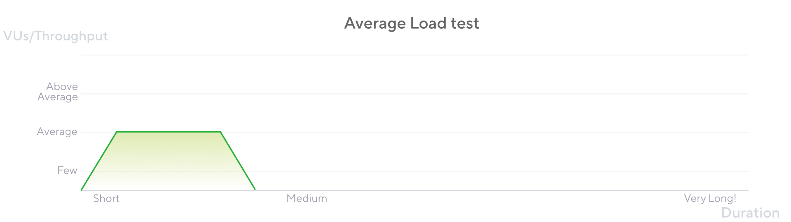
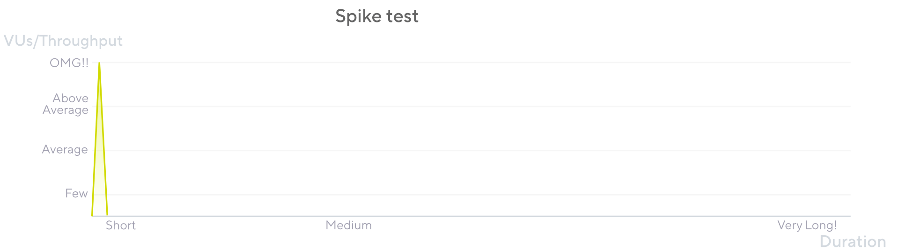

# k6 Load Testing: Architecture, Workload Models, and CI Gating

[k6](https://grafana.com/docs/k6/latest/) is a Grafana-maintained load-testing tool that runs JavaScript or TypeScript test scripts on top of a Go execution engine. This article is for senior engineers who already know what load testing is and want a working mental model of *how* k6 generates load, *what* it measures, and *where* it fits in a CI/CD pipeline. By the end you should be able to choose between an open and closed workload model, write a test whose pass/fail is enforceable in CI, and know when k6 is the wrong tool.

## TL;DR

- k6 is a single Go binary that embeds a pure-Go JavaScript runtime ([Sobek](https://github.com/grafana/sobek), forked from goja in [k6 v0.52.0](https://github.com/grafana/k6/blob/master/release%20notes/v0.52.0.md)). One process can sustain [30,000–40,000 VUs and ~300k RPS on a single machine](https://grafana.com/docs/k6/latest/testing-guides/running-large-tests/) before you need to fan out.
- Each Virtual User is a goroutine with its own Sobek runtime and event loop. There is no shared global state and no Node.js — `fs`, `path`, and `npm` modules are not available.
- Workload modelling separates *what traffic looks like* (open vs closed model, [seven executors](https://grafana.com/docs/k6/latest/using-k6/scenarios/executors/)) from *what behaviour you simulate* (the test function). Open (arrival-rate) models avoid *coordinated omission*; closed (VU-based) models match fixed-pool, user-think-time scenarios.
- The metrics-and-thresholds pair is the CI gate: every metric is one of `Counter`, `Gauge`, `Rate`, or `Trend`, and any unmet [threshold](https://grafana.com/docs/k6/latest/using-k6/thresholds/) makes `k6 run` exit code 99.
- As of k6 1.0 ([released 2025-05-08 at GrafanaCON](https://grafana.com/blog/grafana-k6-1-0-release/)) the project follows strict SemVer; TypeScript runs natively from [v0.57](https://grafana.com/docs/k6/latest/using-k6/javascript-typescript-compatibility-mode/), the [browser module](https://grafana.com/docs/k6/latest/using-k6-browser/) is part of the core binary (`xk6-browser` was archived 2025-01-30 and fully merged into the main k6 repo by v0.56), and [`k6/net/grpc`](https://grafana.com/docs/k6/latest/javascript-api/k6-net-grpc/) plus the new global-event-loop [`k6/websockets`](https://grafana.com/docs/k6/latest/javascript-api/k6-websockets/) are stable.

## Mental model




Three abstractions explain almost everything k6 does:

1. **Virtual User (VU)** — a goroutine running an isolated JavaScript runtime. The default exported function is the *iteration body*; the VU runs it in a loop until the scenario ends.
2. **Scenario** — a named load profile that decides *how many* VUs run and *when* iterations start. Each scenario picks one *executor* and optionally an `exec` function and `startTime`.
3. **Threshold** — a per-metric SLO declared in `options.thresholds`. If any threshold fails, `k6 run` exits non-zero and the CI job fails.

Hold those three in your head and the rest of k6 — checks, tags, custom metrics, xk6 extensions — slots in around them.

## Architecture: Go, goroutines, and the embedded JS runtime

### Why Go and goroutines, not the JVM

Load generators that map each VU to an OS thread inherit the kernel's per-thread cost. HotSpot JVM threads default to a 512 KB–1 MB stack (configurable via [`-Xss`](https://docs.oracle.com/en/java/javase/21/docs/specs/man/java.html#advanced-jit-compiler-options-for-java) — the exact default is platform- and VM-dependent), so a JMeter instance comfortably runs around a thousand threads and then needs distributed mode to grow further[^jmeter-distributed].

Goroutines are user-space tasks scheduled by the Go runtime. They start with a [~2 KB stack that grows and shrinks on demand](https://rcoh.me/posts/why-you-can-have-a-million-go-routines-but-only-1000-java-threads/), so a single k6 process can hold tens of thousands of them with realistic per-VU memory budgets — Grafana cites roughly 100 KB per VU at scale[^k6-vs-jmeter]. The practical headroom from those numbers, [as of the v1.0 docs](https://grafana.com/docs/k6/latest/testing-guides/running-large-tests/), is *30,000–40,000 VUs and ~300,000 RPS per machine* before you need to fan out across load generators.

[^jmeter-distributed]: Apache JMeter distributed testing — [JMeter user manual, Remote Testing](https://jmeter.apache.org/usermanual/remote-test.html).
[^k6-vs-jmeter]: Grafana — [Comparing k6 and JMeter for load testing](https://grafana.com/blog/k6-vs-jmeter-comparison/). The frequently cited "256 MB k6 vs 760 MB JMeter at the same RPS" comes from the benchmark in this post; treat it as one data point on a small synthetic scenario, not a universal multiplier.

> [!IMPORTANT]
> The "k6 uses 10× less memory than JMeter" line travels well in marketing decks but assumes a workload that exercises the same code paths in both tools. For test logic dominated by parsing large JSON or driving a real browser, the gap collapses. Always re-measure for your scenario.

### The embedded JavaScript runtime: Sobek (formerly goja)

k6 has never run on Node.js. Test scripts execute inside an embedded pure-Go ECMAScript runtime so the entire toolchain ships as one binary.

| Year            | Engine                                    | Notes                                                                                                                                                                      |
| --------------- | ----------------------------------------- | -------------------------------------------------------------------------------------------------------------------------------------------------------------------------- |
| 2017–2024       | [goja](https://github.com/dop251/goja)    | Pure-Go ECMAScript 5.1 with most ES6. Upstream development couldn't keep up with k6's needs, especially native ES Modules.                                                 |
| 2024-07 onwards | [Sobek](https://github.com/grafana/sobek) | A goja fork maintained by Grafana. Adopted in [k6 v0.52.0](https://github.com/grafana/k6/blob/master/release%20notes/v0.52.0.md), used by k6 and every extension.          |
| 2025-Q1 onwards | Sobek + esbuild for TS                    | TypeScript transpilation moved from Babel to esbuild; from k6 v0.57 it is on by default and the `--compatibility-mode=experimental_enhanced` flag was removed[^ts-default]. |

[^ts-default]: [k6 documentation — JavaScript and TypeScript compatibility mode](https://grafana.com/docs/k6/latest/using-k6/javascript-typescript-compatibility-mode/). The k6 1.0 launch post also walks through the TypeScript story: [Grafana k6 1.0 release blog](https://grafana.com/blog/grafana-k6-1-0-release/).

Practical implications of an embedded, non-Node runtime:

- The standard library is the [k6 module set](https://grafana.com/docs/k6/latest/javascript-api/) (`k6/http`, `k6/check`, `k6/metrics`, `k6/data`, `k6/browser`, …). Node-only modules like `fs`, `path`, `crypto`, `child_process` are not available.
- Browser-targeted JavaScript libraries usually work after bundling with Webpack or esbuild; anything that imports a Node built-in or a native add-on does not.
- File I/O is restricted to the [`open()`](https://grafana.com/docs/k6/latest/javascript-api/init-context/open/) helper in init context, which loads a file once into memory. Use [`SharedArray`](https://grafana.com/docs/k6/latest/javascript-api/k6-data/sharedarray/) so the data isn't copied per VU.

### The per-VU event loop

Each VU has its own JavaScript runtime *and* its own event loop. There is no global event loop and no shared state across VUs[^lifecycle]. The Go side coordinates with JS through a single contract: when a Go module starts an asynchronous operation (an HTTP request, a `setTimeout`, a `Promise`), it calls `RegisterCallback()` on the per-VU event loop and the loop will not consider the iteration complete until that callback has run.

[^lifecycle]: [k6 documentation — Test lifecycle](https://grafana.com/docs/k6/latest/using-k6/test-lifecycle/). The loop implementation lives at [`js/eventloop`](https://github.com/grafana/k6/tree/master/js/eventloop) in the k6 repository.

Three properties fall out of this design:

- `async`/`await` and `Promise` work as expected, but only inside a single iteration. There is no cross-VU `await`.
- Background work that outlives an iteration (a forgotten `setInterval`, a never-resolved promise) blocks the iteration from finishing and inflates `iteration_duration`.
- Shared state across VUs is impossible by construction. `SharedArray` is the only escape hatch and it is read-only.

## Your first script

```js title="hello.js"
import http from "k6/http"
import { check, sleep } from "k6"

export const options = {
  vus: 5,
  duration: "30s",
  thresholds: {
    http_req_failed: ["rate<0.01"],
    http_req_duration: ["p(95)<500"],
  },
}

export default function () {
  const res = http.get("https://test-api.k6.io/public/crocodiles/")
  check(res, { "status is 200": (r) => r.status === 200 })
  sleep(1)
}
```

```bash frame="terminal"
brew install k6           # macOS
docker pull grafana/k6    # container
k6 run hello.js
```

Three things to notice:

- `options` is parsed once before any VU starts; it cannot reference per-iteration state.
- The default-exported function is the iteration body, not the test entry point. k6 calls it many times per VU.
- Thresholds inside `options` make this a *gated* test — `k6 run` exits 99 if any threshold fails, which is enough for CI to mark the build red[^exit-codes].

[^exit-codes]: [k6 documentation — Error codes](https://grafana.com/docs/k6/latest/reference/error-codes/). Threshold failures specifically use exit code 99.

## Workload modelling: scenarios and executors

A k6 *scenario* attaches a load profile to one of seven *executors*. Two executor families exist; their difference is the most important architectural choice in a load test.




### Closed model (VU-based)

You fix the number of VUs. Each VU runs the iteration body, then immediately runs it again. *Throughput emerges* from the VU count and the system's response time — when the system slows down, throughput drops with it. This matches a "fixed pool of users repeatedly clicking around" scenario and naturally includes think-time via `sleep()`.

Executors: `constant-vus`, `ramping-vus`, `per-vu-iterations`, `shared-iterations`.

```js title="closed-ramp.js"
export const options = {
  stages: [
    { duration: "30s", target: 20 },
    { duration: "1m",  target: 20 },
    { duration: "30s", target: 0 },
  ],
}
```

### Open model (arrival-rate)

You fix the *iteration rate* (e.g. 50 RPS). k6 starts a new iteration on schedule whether or not the previous one has finished, and scales VUs from a `preAllocatedVUs` pool up to `maxVUs` to keep the rate. *VU count emerges* from how slow the system is.

Executors: `constant-arrival-rate`, `ramping-arrival-rate`.

```js title="open-rate.js"
export const options = {
  scenarios: {
    api: {
      executor: "constant-arrival-rate",
      rate: 50,
      timeUnit: "1s",
      duration: "2m",
      preAllocatedVUs: 20,
      maxVUs: 200,
    },
  },
}
```

> [!CAUTION]
> Closed-model load tests suffer from *coordinated omission* — when the system slows down, the VUs stop sending new requests, which hides the true tail latency. If your SLO is in terms of arrival rate (almost always true for public APIs), use an arrival-rate executor and size `maxVUs` for at least 2× expected concurrency[^coordinated-omission].

[^coordinated-omission]: [k6 documentation — Open and closed models](https://grafana.com/docs/k6/latest/using-k6/scenarios/concepts/open-vs-closed/). The original term comes from Gil Tene's [How NOT to Measure Latency](https://www.youtube.com/watch?v=lJ8ydIuPFeU) talk.

### The seven executors at a glance

| Executor                  | Family | Pin                  | Use it when                                                                                       |
| ------------------------- | ------ | -------------------- | ------------------------------------------------------------------------------------------------- |
| `shared-iterations`       | closed | total iterations     | One-shot data import: N items processed across VUs as fast as possible.                            |
| `per-vu-iterations`       | closed | iterations per VU    | Deterministic per-VU workload, e.g. each VU walks the same wizard exactly once.                    |
| `constant-vus`            | closed | VU count             | Smoke tests, baseline measurements, "hold steady" stages.                                          |
| `ramping-vus`             | closed | stages → VU targets  | Step-load patterns, manual stress tests.                                                           |
| `constant-arrival-rate`   | open   | iterations / time    | "Hold X RPS for Y minutes" SLO checks.                                                             |
| `ramping-arrival-rate`    | open   | stages → rate targets| Realistic ramp-ups for spike, soak, capacity-find.                                                 |
| `externally-controlled`   | n/a    | runtime              | k6 REST API drives VU count; useful for chaos drills and `k6 cloud` orchestration.                 |

[Source: k6 docs — Executors](https://grafana.com/docs/k6/latest/using-k6/scenarios/executors/).

### Composing scenarios

A single test can run several scenarios in parallel or sequentially via `startTime`:

```js title="multi-scenario.js" collapse={1-2}
import http from "k6/http"

export const options = {
  scenarios: {
    api_steady: {
      executor: "constant-arrival-rate",
      rate: 50, timeUnit: "1s", duration: "5m",
      preAllocatedVUs: 20, maxVUs: 100,
      exec: "hitApi",
    },
    web_ramp: {
      executor: "ramping-vus",
      startTime: "30s",
      startVUs: 0,
      stages: [
        { duration: "1m", target: 20 },
        { duration: "2m", target: 20 },
        { duration: "1m", target: 0 },
      ],
      exec: "browseUI",
    },
  },
}

export function hitApi()  { http.get("https://test-api.k6.io/public/crocodiles/") }
export function browseUI(){ http.get("https://test.k6.io/") }
```

`startTime`, `gracefulStop`, `exec`, `env`, and `tags` are valid on every executor.

## The five canonical test shapes

These are *workload patterns*, not k6 features — they are conventions for how to set the executor's parameters to answer a specific business question. The ASCII shapes below are summaries; the [k6 testing guides](https://grafana.com/docs/k6/latest/testing-guides/test-types/) give the official definitions.

| Pattern  | Question it answers                                          | Typical shape                              | Typical duration |
| -------- | ------------------------------------------------------------ | ------------------------------------------ | ---------------- |
| Smoke    | Does the test script even work? Is the system reachable?     | 1–5 VUs, flat                              | 1–5 min          |
| Average  | Does the system meet SLO under expected load?                | Ramp up → hold at target → ramp down       | 30–60 min        |
| Stress   | Where does the system break? What fails first?               | Hold at 2–4× expected load                 | 15–60 min        |
| Soak     | Does the system leak memory or degrade over hours?           | Average load held for 4–24 h               | 4–24 h           |
| Spike    | Does the system survive a sudden burst, and does it recover? | Sharp ramp to 5–20× target, short hold     | 5–20 min         |





```js title="smoke.js"
export const options = {
  vus: 3, duration: "1m",
  thresholds: {
    http_req_failed: ["rate<0.01"],
    http_req_duration: ["p(95)<500"],
  },
}
```

```js title="average-load.js"
export const options = {
  scenarios: {
    avg: {
      executor: "ramping-arrival-rate",
      timeUnit: "1s",
      preAllocatedVUs: 50, maxVUs: 200,
      stages: [
        { duration: "5m",  target: 100 }, // ramp to 100 RPS
        { duration: "30m", target: 100 }, // hold
        { duration: "5m",  target: 0 },
      ],
    },
  },
  thresholds: {
    http_req_duration: ["p(95)<1000"],
    http_req_failed: ["rate<0.01"],
  },
}
```

```js title="spike.js"
export const options = {
  scenarios: {
    spike: {
      executor: "ramping-arrival-rate",
      timeUnit: "1s",
      preAllocatedVUs: 200, maxVUs: 2000,
      stages: [
        { duration: "30s", target: 2000 }, // sharp burst
        { duration: "1m",  target: 2000 }, // hold
        { duration: "30s", target: 0 },
      ],
    },
  },
  thresholds: {
    http_req_failed: ["rate<0.10"],
  },
}
```

## Metrics and thresholds: the CI gate

k6's value as a CI tool comes from the metrics-and-thresholds loop, not from raw load generation. Every measurement — built-in or custom — is one of four metric types, and any threshold expression that is unsatisfied at the end of the test makes `k6 run` exit non-zero.




### Built-in HTTP metrics

For an HTTP request, k6 emits seven timing metrics plus one rate metric, all in milliseconds[^http-metrics]:

| Metric                   | What it measures                                                          |
| ------------------------ | ------------------------------------------------------------------------- |
| `http_req_blocked`       | Time waiting for a free connection slot.                                  |
| `http_req_connecting`    | TCP connect time.                                                         |
| `http_req_tls_handshaking` | TLS handshake time.                                                     |
| `http_req_sending`       | Time spent writing the request to the socket.                             |
| `http_req_waiting`       | Time-to-first-byte (waiting for the server).                              |
| `http_req_receiving`     | Time spent reading the response body.                                     |
| `http_req_duration`      | Total request time = `sending + waiting + receiving`.                     |
| `http_req_failed`        | Rate metric — fraction of requests classified as failures.                |

[^http-metrics]: [k6 documentation — HTTP-specific built-in metrics](https://grafana.com/docs/k6/latest/using-k6/metrics/reference/#http-specific-built-in-metrics).

The decomposition is what makes k6 useful for diagnosing *where* latency comes from — a regression in `http_req_tls_handshaking` is a different bug from one in `http_req_waiting`.

### The four metric types

| Type     | Aggregations                       | Built-in example          | Typical custom example                  |
| -------- | ---------------------------------- | ------------------------- | --------------------------------------- |
| Counter  | sum, rate-per-second               | `http_reqs`               | `payments_processed`                    |
| Gauge    | last value, min, max               | `vus`, `vus_max`          | `connection_pool_size`                  |
| Rate     | non-zero %                         | `http_req_failed`, `checks` | `login_success_rate`                  |
| Trend    | min, max, avg, med, p(90), p(95), p(99) | `http_req_duration`  | `checkout_total_duration`               |

```js title="custom-metrics.js"
import http from "k6/http"
import { Trend, Rate, Counter } from "k6/metrics"
import { sleep } from "k6"

const checkoutDuration = new Trend("checkout_duration", true) // true → ms
const checkoutSuccess  = new Rate("checkout_success")
const checkoutCount    = new Counter("checkout_count")

export const options = {
  vus: 10,
  duration: "5m",
  thresholds: {
    "http_req_failed": ["rate<0.01"],
    "http_req_duration{endpoint:checkout}": ["p(95)<800"],
    "checkout_duration": ["p(95)<2000"],
    "checkout_success": ["rate>0.99"],
  },
}

export default function () {
  const start = Date.now()
  const res = http.post("https://test-api.k6.io/checkout", null,
    { tags: { endpoint: "checkout" } })

  checkoutDuration.add(Date.now() - start)
  checkoutSuccess.add(res.status === 200)
  checkoutCount.add(1)
  sleep(1)
}
```

Two non-obvious details:

- **Tags partition metrics.** `http_req_duration{endpoint:checkout}` is a separate aggregation from the global `http_req_duration`, and you can put thresholds on either. This is how you keep a fast endpoint's SLO from being washed out by a slow one in the same test.
- **`checks` is a Rate, not a fail counter.** A failing `check()` does *not* fail the test on its own. Either gate `checks` with a threshold (`'checks{tag:critical}': ['rate>0.99']`) or use [`fail()`](https://grafana.com/docs/k6/latest/javascript-api/k6/fail/) explicitly when you want hard failures.

> [!TIP]
> Put one threshold on `http_req_failed` (`rate<0.01` is a good default), one on `http_req_duration` per critical endpoint, and one on `checks` per business assertion. Three lines in `options.thresholds` are usually enough to turn a load test into a real CI gate.

## CI integration

### GitHub Actions

Use the official [`grafana/setup-k6-action`](https://github.com/grafana/setup-k6-action) and [`grafana/run-k6-action`](https://github.com/grafana/run-k6-action) — they replace the older "curl the release tarball" recipes that floated around before k6 1.0.

```yaml title=".github/workflows/perf.yml"
name: Performance tests
on:
  pull_request:
    paths: ["src/**", "tests/perf/**"]
  push:
    branches: [main]

jobs:
  k6:
    runs-on: ubuntu-latest
    steps:
      - uses: actions/checkout@v4
      - uses: grafana/setup-k6-action@v1
      - uses: grafana/run-k6-action@v1
        with:
          path: tests/perf/smoke.js
      - if: github.ref == 'refs/heads/main'
        uses: grafana/run-k6-action@v1
        with:
          path: tests/perf/average-load.js
```

The job fails when any threshold fails (exit 99), so the gate is intrinsic — no extra "publish report and parse" step needed.

### Other runners

- **Jenkins:** [the same threshold-based exit code](https://grafana.com/docs/k6/latest/using-k6/thresholds/) drives `currentBuild.result = 'FAILURE'`. Use the [`grafana/k6` Docker image](https://hub.docker.com/r/grafana/k6) for hermetic execution.
- **GitLab CI:** add `image: grafana/k6:latest` and run `k6 run`. Pipe `--out json=results.json` into a GitLab artifact for downstream analysis.
- **Grafana Cloud k6:** `k6 cloud run script.js` shifts execution to Grafana Cloud (formerly k6 Cloud / Load Impact) with the same script, useful when you need distributed load from clean network egress across global zones.

> [!WARNING]
> Performance tests in CI work when (a) the target environment is hermetic and pre-warmed, (b) thresholds are tuned to the environment's realistic baseline, not production's, and (c) the test runs against a frozen build artifact. Without those, you will spend more time chasing flaky CI than catching regressions.

## Distributed runs and output backends

A single k6 process is enough for almost every CI gate. Distributed execution and external metric stores show up when one of two things is true: the target needs more than ~40k VUs / ~300k RPS of generated load, or the team wants per-test results to land in the same observability stack as production telemetry.




### Three ways to fan out

| Mechanism                                                                                                        | Where it runs                            | When to reach for it                                                                                                                                                |
| ---------------------------------------------------------------------------------------------------------------- | ---------------------------------------- | ------------------------------------------------------------------------------------------------------------------------------------------------------------------- |
| **`--execution-segment` flags**                                                                                  | N independent k6 processes / nodes you orchestrate yourself | Tests up to a few hundred RPS that fit a small Nomad / Ansible setup; lowest dependency footprint.                                                                  |
| **[k6 Operator](https://github.com/grafana/k6-operator)** (`TestRun` CRD, `parallelism: N`)                      | Kubernetes pods you own                  | Ongoing distributed load against pre-prod; reproducible on your cluster; integrates with `PrivateLoadZone` to back Grafana Cloud runs.                              |
| **[Grafana Cloud k6](https://grafana.com/docs/grafana-cloud/k6/)** (`k6 cloud run`)                              | Grafana-managed load zones (~21 regions) | Geo-distributed load from clean egress; centralised reporting; you don't want to operate runners.                                                                   |

`--execution-segment` slices the workload deterministically across instances; e.g. `--execution-segment "0:1/2" --execution-segment-sequence "0,1/2,1"` runs the first half on one machine and the second half on another. Thresholds are evaluated *per process* unless every runner streams to the same backend (Cloud, Prometheus, or InfluxDB) where aggregation can re-evaluate over the merged stream[^distributed].

[^distributed]: [k6 documentation — Running distributed tests](https://grafana.com/docs/k6/latest/testing-guides/running-distributed-tests/) and [k6 documentation — Execution segment options](https://grafana.com/docs/k6/latest/using-k6/k6-options/reference/#execution-segment).

### Output backends

The default `k6 run` summary is human-readable but discards per-iteration samples on exit. For trend analysis or distributed aggregation you stream samples to a real backend with `--out`.

| Backend                                                                                                                                                | Built-in?                                  | Flag                                                                  | Notes                                                                                              |
| ------------------------------------------------------------------------------------------------------------------------------------------------------ | ------------------------------------------ | --------------------------------------------------------------------- | -------------------------------------------------------------------------------------------------- |
| Prometheus Remote Write                                                                                                                                | Yes (since v0.53; was [`xk6-output-prometheus-remote`](https://github.com/grafana/xk6-output-prometheus-remote), now merged) | `--out experimental-prometheus-rw`                                    | Ship to Mimir, Cortex, Grafana Cloud, or any RW-compatible store.                                  |
| InfluxDB v1                                                                                                                                            | Yes                                        | `--out influxdb=http://host:8086/db`                                  | Legacy line-protocol path, still supported.                                                        |
| InfluxDB v2 / Cloud                                                                                                                                    | Extension ([`xk6-output-influxdb`](https://github.com/grafana/xk6-output-influxdb)) | `--out xk6-influxdb=...`                                              | Build a custom binary with `xk6 build --with`.                                                     |
| Datadog                                                                                                                                                | Extension (StatsD-mode `xk6-output-statsd`) | `--out output-statsd` against a Datadog Agent                         | The bundled `--out datadog` and `--out statsd` outputs were [deprecated in v0.55 and removed](https://grafana.com/docs/k6/latest/results-output/real-time/datadog/); use the StatsD xk6 extension. |
| Grafana Cloud k6                                                                                                                                       | Yes                                        | `--out cloud` (after `k6 cloud login`)                                | Same backend `k6 cloud run` writes to.                                                             |
| CSV / JSON                                                                                                                                             | Yes                                        | `--out csv=results.csv` / `--out json=results.json`                   | Cheapest way to archive raw samples for after-the-fact analysis.                                   |

Multiple `--out` flags are allowed on the same run, so a CI job can simultaneously emit JSON to a build artifact and stream Prometheus RW to Grafana Cloud.

## Comparative analysis

| Tool          | Runtime     | Concurrency unit                   | Test format                     | Per-machine VU ceiling[^ceilings]      | CI ergonomics                                                                                                  |
| ------------- | ----------- | ---------------------------------- | ------------------------------- | -------------------------------------- | -------------------------------------------------------------------------------------------------------------- |
| **k6**        | Go          | Goroutine + Sobek runtime          | JS / TS                         | 30k–40k                                | Single binary, exit-code gate, official GitHub Action.                                                         |
| **JMeter**    | JVM         | OS thread per VU                   | XML `.jmx` (Groovy in BSF)      | ~1k                                    | Distributed mode required at scale; XML diffs poorly.                                                          |
| **Gatling**   | Scala / JVM | Akka actors / Netty (event-driven) | Scala / Java / Kotlin DSL       | High (event-driven)                    | First-class CI runner; report HTML committable to artifact.                                                    |
| **Locust**    | Python      | Greenlets (gevent)                 | Python                          | High per box; horizontal master-worker | CI-friendly; weaker built-in reporting than k6/Gatling.                                                        |
| **Artillery** | Node.js     | Event loop (single-process async)  | YAML scenarios + JS `processor` | Modest single-process; horizontal       | YAML is short for simple flows; JS processors mirror k6's style; AWS Fargate / Lambda runners for distribution. |

[^ceilings]: VU ceilings are order-of-magnitude figures from each project's running-large-tests guidance. Real ceilings depend heavily on per-iteration work; treat them as relative, not absolute.

When to pick what:

- **k6** when the team writes JavaScript or TypeScript already, the SLO needs to be a CI gate, and you want a single binary on every runner.
- **JMeter** when an existing investment in `.jmx` plans, custom samplers, or Bzm cloud workflows outweighs migration cost.
- **Gatling** when the team is JVM-native and Scala / Kotlin DSLs are not a barrier; Gatling's reports are still the prettiest in the category.
- **Locust** when the test logic is already a Python service-client and you want to reuse it.
- **Artillery** when the test definition is mostly YAML and you want managed Lambda / Fargate fan-out without operating Kubernetes.

## Extending k6 with xk6

Out-of-the-box k6 1.x speaks HTTP/1.1, HTTP/2, [WebSocket](https://grafana.com/docs/k6/latest/javascript-api/k6-websockets/) (`k6/websockets`, with a global event loop that lets one VU drive many sockets), [gRPC](https://grafana.com/docs/k6/latest/using-k6/protocols/grpc/) (`k6/net/grpc`, stable since v0.49.0), browser (Chromium via CDP), and a handful of utility modules. Beyond that you compose a custom binary with [xk6](https://github.com/grafana/xk6):

```bash frame="terminal"
# Build a k6 with Kafka and SQL extensions baked in
xk6 build --with github.com/grafana/xk6-kafka \
          --with github.com/grafana/xk6-sql
```

Two extension shapes exist:

- **JavaScript extensions** add new built-in modules (`import kafka from "k6/x/kafka"`).
- **Output extensions** add `--out` targets — typically Elasticsearch, AWS Timestream, or in-house sinks. Prometheus Remote Write and the original `xk6-browser` are no longer extensions: both have been merged into the core binary.

> [!NOTE]
> The `xk6-browser` repository is archived (2025-01-30) and the codebase fully merged into the main k6 repo by v0.56. Use `import { browser } from "k6/browser"` rather than the old `xk6-browser` import. Likewise, `xk6-output-prometheus-remote` is now `--out experimental-prometheus-rw` on a stock binary.

## Operational footguns

- **Closed-model VUs when you wanted arrival-rate.** The single most common k6 mistake: setting `vus: 50, duration: "10m"` to "simulate 50 users" when the real SLO is "hold 200 RPS". As the SUT slows, throughput collapses and the histogram looks reassuringly flat — a textbook *coordinated omission* artefact. If the SLO is in RPS or P95 latency, use `constant-arrival-rate` or `ramping-arrival-rate`, full stop.
- **No warm-up.** The first 30–60 seconds of any non-trivial run are dominated by JIT, connection-pool fill, cold caches, and lazy DNS. Either ramp through them with a `ramping-arrival-rate` stage you intend to throw away, or [scope thresholds](https://grafana.com/docs/k6/latest/using-k6/thresholds/) to a sub-metric tagged after warm-up (`http_req_duration{phase:steady}`). Otherwise P95 carries the cold-start tail forever.
- **Skipping response sanity checks.** `k6 run` happily reports a 200-RPS test where every response is a 401 or a CDN error page — the *transport* is fine, your *test* is meaningless. Always combine `check(res, { "status is 2xx": (r) => r.status >= 200 && r.status < 300 })` with a threshold on `checks` (`'checks': ['rate>0.99']`); without that, `checks` is a Rate metric whose failures do not fail the test on their own.
- **Ephemeral port exhaustion.** Tens of thousands of VUs against a small target IP set will exhaust the source-port range (default ~28k usable on stock Linux). Tune `net.ipv4.ip_local_port_range` and `net.ipv4.tcp_tw_reuse`, or split load across source IPs[^large-tests].
- **DNS as a hidden bottleneck.** Per-iteration DNS lookups add latency that you will attribute to the SUT. Pre-resolve to an IP and pin it via `--hosts`, or set [`http.setResponseCallback`](https://grafana.com/docs/k6/latest/javascript-api/k6-http/setresponsecallback/) and reuse the connection pool aggressively.
- **`SharedArray` is JSON-deserialised once per VU.** Reading a 100 MB CSV becomes a per-VU memory cliff. Pre-trim test data to what you actually use; reach for [`open()`](https://grafana.com/docs/k6/latest/javascript-api/init-context/open/) only for small fixtures.
- **`open()` only works in init context.** Call it at the top of the file, not inside the iteration body — the runtime throws if you try.
- **The browser module is heavy.** Each browser context launches a Chromium process. A single load generator can drive maybe 5–20 browsers, not 5,000 — model browser tests as functional + Web Vitals checks, not as load tests.

[^large-tests]: [k6 documentation — Running large tests, OS fine-tuning](https://grafana.com/docs/k6/latest/testing-guides/running-large-tests/#os-fine-tuning).

## Practical defaults

- **Always start with a smoke test** (3 VUs, 1 minute, the same thresholds you intend to ship). If smoke is red, the script is broken, not the system.
- **Default to arrival-rate executors** for any test whose SLO is in RPS or P95 latency. Closed-model tests are fine for "fixed pool of users" simulations and almost nothing else.
- **Three thresholds is the floor.** `http_req_failed`, `http_req_duration` per critical endpoint, and `checks` per critical assertion.
- **Tag everything.** `tags: { endpoint: "checkout" }` on the request makes per-endpoint thresholds trivial and saves having to re-run the test to slice the data.
- **Use `SharedArray` for any test data over 1 MB.** Anything else is duplicated per VU.
- **Run the gated test in CI on every PR.** Run the average-load and soak tests on a schedule against a pre-prod environment with production-shaped data.

## References

- [k6 documentation home](https://grafana.com/docs/k6/latest/)
- [k6 release notes (v0.52.0 — Sobek)](https://github.com/grafana/k6/blob/master/release%20notes/v0.52.0.md)
- [Grafana k6 1.0 launch post](https://grafana.com/blog/grafana-k6-1-0-release/)
- [Running large tests](https://grafana.com/docs/k6/latest/testing-guides/running-large-tests/)
- [Test types](https://grafana.com/docs/k6/latest/testing-guides/test-types/)
- [Open vs closed models](https://grafana.com/docs/k6/latest/using-k6/scenarios/concepts/open-vs-closed/)
- [Executors reference](https://grafana.com/docs/k6/latest/using-k6/scenarios/executors/)
- [Thresholds](https://grafana.com/docs/k6/latest/using-k6/thresholds/)
- [HTTP-specific built-in metrics](https://grafana.com/docs/k6/latest/using-k6/metrics/reference/#http-specific-built-in-metrics)
- [k6 vs JMeter benchmark](https://grafana.com/blog/k6-vs-jmeter-comparison/)
- [xk6 build tool](https://github.com/grafana/xk6)
- [setup-k6-action](https://github.com/grafana/setup-k6-action) and [run-k6-action](https://github.com/grafana/run-k6-action)
- [Running distributed tests](https://grafana.com/docs/k6/latest/testing-guides/running-distributed-tests/) and [k6 Operator](https://github.com/grafana/k6-operator)
- [Results output reference](https://grafana.com/docs/k6/latest/results-output/) (Prometheus RW, InfluxDB, JSON, CSV, Cloud)
- [`k6/net/grpc`](https://grafana.com/docs/k6/latest/javascript-api/k6-net-grpc/) and [`k6/websockets`](https://grafana.com/docs/k6/latest/javascript-api/k6-websockets/) module references
